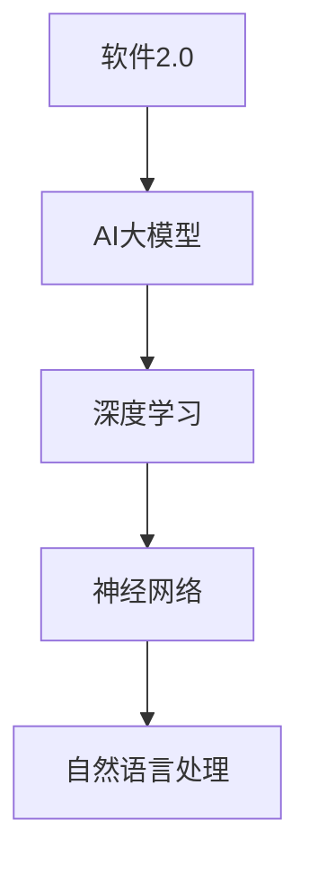
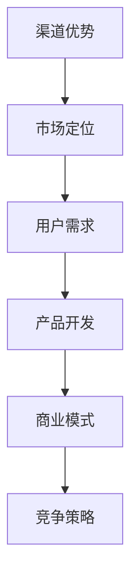
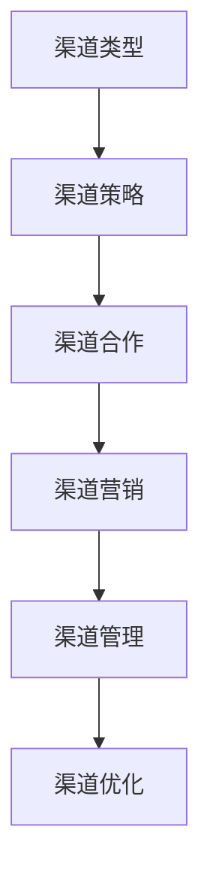

                 

# AI大模型创业：如何利用渠道优势？

> 关键词：AI大模型、创业、渠道优势、市场定位、用户需求、产品开发、商业模式、竞争策略

> 摘要：本文旨在探讨AI大模型创业中的渠道优势，通过分析AI大模型的基本概念、创业策略、渠道利用以及风险管理等方面，为创业者提供一套系统、实用的渠道利用方法，助力AI大模型创业成功。

### 第一部分：知识准备与AI大模型概述

#### 核心概念与联系

在探讨AI大模型创业之前，我们首先需要了解AI大模型的基本概念、技术基础和应用场景。以下是一个简单的Mermaid流程图，展示了AI大模型的核心概念与联系：



#### 第1章：AI大模型基本概念与背景

##### 1.1 AI大模型的基本概念

AI大模型是指那些参数量庞大、结构复杂，可以处理大规模数据并产生高质量预测结果的深度学习模型。这些模型通常具有以下几个特点：

- **高参数量**：AI大模型通常拥有数十亿至千亿级别的参数。
- **强泛化能力**：通过对海量数据进行预训练，模型能够在多个任务上表现优异。
- **多模态处理**：能够处理文本、图像、音频等多种类型的数据。

##### 1.2 AI大模型与传统AI模型的区别

- **规模**：传统AI模型通常规模较小，参数量较少。
- **数据量**：传统AI模型对数据量依赖较低，而AI大模型需要大规模数据进行预训练。
- **训练时间**：AI大模型训练时间更长，通常需要数天至数周。

##### 1.3 AI大模型的技术基础

AI大模型的技术基础包括深度学习基础、大规模预训练模型和自然语言处理技术。

###### 1.3.1 深度学习基础

- **神经网络基础**：介绍神经元结构、前向传播、反向传播等基本概念。
- **激活函数**：介绍常用的Sigmoid、ReLU、Tanh等激活函数。

###### 1.3.2 大规模预训练模型

- **预训练**：介绍预训练的概念、方法（如自监督学习）。
- **微调**：介绍微调技术，如何将预训练模型适应特定任务。

###### 1.3.3 自然语言处理技术

- **词嵌入**：介绍词嵌入的基本概念、算法（如Word2Vec、GloVe）。
- **序列模型**：介绍RNN、LSTM、GRU等序列处理模型。
- **注意力机制**：介绍注意力机制的基本原理和实现。

##### 1.4 主流AI大模型介绍

- **GPT系列模型**：介绍GPT、GPT-2、GPT-3等模型。
- **BERT及其变体**：介绍BERT、RoBERTa、ALBERT等模型。
- **其他知名大模型**：介绍Transformer、ViT等模型。

##### 1.5 AI大模型在企业中的应用

- **应用领域**：介绍AI大模型在自然语言处理、计算机视觉、语音识别等领域的应用。
- **优势**：分析AI大模型对企业的价值，如提高效率、降低成本、创造新商业模式等。
- **挑战**：讨论AI大模型在企业应用中面临的挑战，如数据隐私、模型安全、解释性等。

#### 核心算法原理讲解

##### 1.5.1 深度学习优化算法

###### 1.5.1 梯度下降法

伪代码：

```python
for each epoch:
    for each training example (x, y):
        compute the loss (L)
        compute the gradient (g)
        update the model parameters (θ) by subtracting a fraction of the gradient (η * g)
```

###### 1.5.2 动量法

伪代码：

```python
v = 0
for each epoch:
    for each training example (x, y):
        compute the gradient (g)
        v = η * g + (1 - η) * v
        update the model parameters (θ) by subtracting v
```

##### 1.6 自然语言处理中的关键算法

###### 1.6.1 词嵌入

伪代码：

```python
for each sentence (w1, w2, ..., wn):
    for each word wi:
        if word wi is not in the vocabulary:
            continue
        for each neighboring word wj:
            increment the count of the co-occurrence matrix C(wi, wj)
compute the embedding vector for each word by normalizing the co-occurrence counts
```

##### 1.7 大规模预训练模型的原理

###### 1.7.1 预训练

$$
\text{Pre-training Model}(X; \theta) = \arg \min_{\theta} -\sum_{i=1}^{N} \log p(y_i | x_i; \theta)
$$

其中，$X$ 是预训练数据集，$y_i$ 是样本 $x_i$ 的标签，$p(y_i | x_i; \theta)$ 是模型在给定输入 $x_i$ 和参数 $\theta$ 下的预测概率。

###### 1.7.2 微调

$$
\text{Fine-tuning Model}(X'; \theta') = \arg \min_{\theta'} \frac{1}{M} \sum_{i=1}^{M} \ell(y_i', \theta')
$$

其中，$X'$ 是微调数据集，$y_i'$ 是样本 $x_i'$ 的标签，$\ell(y_i', \theta')$ 是损失函数。

#### 数学模型与公式讲解

##### 1.8 深度学习中的损失函数

- **交叉熵损失（Cross-Entropy Loss）**：
$$
L(\theta) = -\sum_{i=1}^{N} y_i \log(p_i)
$$
其中，$y_i$ 是真实标签，$p_i$ 是模型对第 $i$ 个样本的预测概率。

- **均方误差（Mean Squared Error）**：
$$
L(\theta) = \frac{1}{2} \sum_{i=1}^{N} (y_i - \hat{y}_i)^2
$$
其中，$\hat{y}_i$ 是模型对第 $i$ 个样本的预测值。

#### 项目实战

##### 1.9 AI大模型开发环境搭建

- 安装TensorFlow或PyTorch等深度学习框架。
- 配置GPU环境，确保支持CUDA。
- 安装必要的依赖库，如NumPy、Pandas等。

##### 1.10 AI大模型实战案例

- 数据预处理：读取数据集，进行清洗和归一化。
- 模型构建：定义神经网络结构，加载预训练模型。
- 训练过程：进行迭代训练，调整模型参数。
- 模型评估：使用验证集评估模型性能，进行超参数调整。

##### 1.11 代码解读与分析

- 示例代码片段：
```python
import tensorflow as tf

# 定义模型
model = tf.keras.Sequential([
    tf.keras.layers.Embedding(vocab_size, embedding_dim),
    tf.keras.layers.LSTM(units=64),
    tf.keras.layers.Dense(1, activation='sigmoid')
])

# 编译模型
model.compile(optimizer='adam', loss='binary_crossentropy', metrics=['accuracy'])

# 训练模型
model.fit(train_data, train_labels, epochs=10, validation_split=0.2)
```

- 代码分析：解释每一行代码的功能和目的，说明模型的构建过程和训练过程。

#### 结论

本章为AI大模型的企业应用提供了全面的技术基础。读者可以通过本章内容了解AI大模型的基本概念、技术基础、核心算法、数学模型及实际应用开发，为后续章节的学习和实践打下坚实基础。

### 第二部分：AI大模型创业策略

#### 核心概念与联系



#### 第2章：创业前准备与市场分析

##### 2.1 创业前准备

###### 2.1.1 创业团队组建

- 组建具有多元化技能的团队，包括技术、市场、运营等。
- 明确团队成员的角色和职责。

###### 2.1.2 创业资源获取

- 获取必要的资金支持，可以通过风险投资、天使投资等方式。
- 获取技术资源和市场资源，确保项目顺利推进。

##### 2.2 市场定位与目标用户

###### 2.2.1 市场细分

- 根据行业特点和用户需求，进行市场细分。
- 选择具有增长潜力的细分市场作为目标市场。

###### 2.2.2 目标用户分析

- 分析目标用户群体的特征，如年龄、性别、职业等。
- 确定目标用户的需求和痛点。

##### 2.3 用户需求分析

###### 2.3.1 需求调研

- 通过问卷调查、访谈等方式收集用户需求。
- 分析需求数据，识别核心需求和潜在需求。

###### 2.3.2 需求验证

- 通过原型设计和用户测试，验证用户需求的有效性。
- 根据反馈调整产品设计和功能。

##### 2.4 产品开发策略

###### 2.4.1 产品规划

- 制定产品路线图，明确产品迭代规划和目标。
- 确定产品的核心功能和特色。

###### 2.4.2 技术选型

- 选择适合AI大模型开发的技术栈和工具。
- 确保技术实现的可扩展性和稳定性。

##### 2.5 商业模式设计

###### 2.5.1 收入模型

- 确定产品的主要收入来源，如订阅费、服务费等。
- 设计多样化的收入模式，提高盈利能力。

###### 2.5.2 成本控制

- 评估产品开发和运营的成本，制定成本控制措施。
- 通过技术优化和运营效率提升，降低成本。

##### 2.6 竞争策略

###### 2.6.1 竞争分析

- 分析主要竞争对手的市场地位、产品特点等。
- 识别自身的竞争优势和差异化策略。

###### 2.6.2 市场推广

- 制定有效的市场推广策略，提高品牌知名度和用户覆盖率。
- 利用线上线下多种渠道，扩大市场影响力。

#### 核心算法原理讲解

##### 2.7 大模型微调技术

###### 2.7.1 微调策略

伪代码：

```python
# Load a pre-trained model
pretrained_model = load_pretrained_model()

# Fine-tune the model on the new dataset
fine_tuned_model = pretrained_model.fit(new_dataset, epochs=5, batch_size=32)
```

###### 2.7.2 超参数调优

伪代码：

```python
# Define a range of hyperparameters to test
hyperparameter_ranges = {
    'learning_rate': [0.001, 0.01, 0.1],
    'dropout_rate': [0.1, 0.2, 0.3]
}

# Perform hyperparameter search
best_hyperparameters = hyperparameter_search(hyperparameter_ranges, validation_data=validation_data)
```

##### 2.8 用户行为分析

###### 2.8.1 数据收集

伪代码：

```python
# Collect user interaction data
user_data = collect_user_data()

# Preprocess the data for analysis
processed_data = preprocess_user_data(user_data)
```

###### 2.8.2 用户行为建模

伪代码：

```python
from sklearn.ensemble import RandomForestClassifier

# Define a user behavior model
user_model = define_user_behavior_model()

# Train the model on the processed data
trained_model = user_model.fit(processed_data, epochs=10, batch_size=64)
```

##### 2.9 营销策略优化

###### 2.9.1 营销策略制定

伪代码：

```python
# Define marketing strategies
marketing_strategies = define_marketing_strategies()

# Implement marketing campaigns
execute_marketing_campaigns(marketing_strategies)
```

###### 2.9.2 营销效果评估

伪代码：

```python
# Evaluate marketing performance
marketing_performance = evaluate_marketing_performance()

# Adjust strategies based on performance
adjust_marketing_strategies(marketing_performance)
```

#### 数学模型与公式讲解

##### 2.10 预测模型评估指标

- **准确率（Accuracy）**：
$$
\text{Accuracy} = \frac{\text{正确预测的样本数}}{\text{总样本数}}
$$

- **精确率（Precision）**：
$$
\text{Precision} = \frac{\text{真正样本数}}{\text{真正样本数 + 假正样本数}}
$$

- **召回率（Recall）**：
$$
\text{Recall} = \frac{\text{真正样本数}}{\text{真正样本数 + 假负样本数}}
$$

- **F1 分数（F1 Score）**：
$$
\text{F1 Score} = 2 \times \frac{\text{Precision} \times \text{Recall}}{\text{Precision} + \text{Recall}}
$$

#### 项目实战

##### 2.11 创业项目启动与运营

- **项目启动**：
  - 确定创业项目的方向和目标。
  - 组建项目团队，分配任务和职责。
  - 获取初始资金和资源支持。
- **日常运营**：
  - 定期召开团队会议，跟踪项目进展。
  - 定期与客户沟通，收集反馈和建议。
  - 优化产品功能和用户体验。
- **项目扩展**：
  - 扩展产品线，开发新的功能和服务。
  - 建立合作伙伴关系，扩大市场影响力。
  - 持续关注市场动态，调整战略方向。

##### 2.12 用户行为分析实战案例

- **数据收集**：
  - 使用SDK收集用户行为数据。
  - 设置事件跟踪，记录用户在应用程序中的行为。
- **数据处理**：
  - 数据清洗，去除噪声和无效数据。
  - 数据归一化，处理不同类型的数据。
- **模型训练**：
  - 使用收集到的数据训练用户行为分析模型。
  - 调整模型参数，优化模型性能。
- **结果分析**：
  - 分析用户行为模式，识别关键行为指标。
  - 根据分析结果，制定改进策略和营销策略。

##### 2.13 代码解读与分析

- **数据收集代码片段**：
```python
import pandas as pd

def collect_user_data():
    events = []
    while True:
        new_event = get_new_event()
        if new_event is None:
            break
        events.append(new_event)
    return pd.DataFrame(events)
```

- **数据处理代码片段**：
```python
def preprocess_user_data(user_data):
    user_data['timestamp'] = pd.to_datetime(user_data['timestamp'])
    user_data.set_index('timestamp', inplace=True)
    return user_data.resample('D').mean()
```

- **模型训练代码片段**：
```python
from sklearn.ensemble import RandomForestClassifier

def train_user_behavior_model(processed_data):
    model = RandomForestClassifier()
    model.fit(processed_data.drop('goal', axis=1), processed_data['goal'])
    return model
```

#### 结论

本章详细介绍了AI大模型创业所需的策略和步骤。通过本章内容，读者可以了解创业前的准备、市场分析、产品开发、商业模式设计、竞争策略等方面。同时，本章还涵盖了核心算法原理讲解、数学模型与公式讲解、项目实战及代码解读与分析，为读者提供了全面的技术支持。通过这些内容，读者可以更好地规划和管理AI大模型创业项目，提高项目成功的机会。

### 第三部分：利用渠道优势

#### 核心概念与联系



#### 第3章：渠道类型的详细探讨

##### 3.1 线上渠道

###### 3.1.1 社交媒体平台

- **概述**：介绍主要的社交媒体平台如Facebook、Twitter、Instagram等。
- **应用**：讨论如何利用社交媒体进行品牌宣传、用户互动和推广活动。

###### 3.1.2 内容营销平台

- **概述**：介绍内容营销平台如YouTube、博客、论坛等。
- **应用**：讲解如何通过高质量内容吸引潜在客户，建立品牌权威。

##### 3.2 线下渠道

###### 3.2.1 代理商

- **概述**：解释代理商的定义和作用。
- **应用**：讨论代理商如何帮助企业拓展市场，提高产品销量。

###### 3.2.2 展会和活动

- **概述**：介绍展会和活动的重要性。
- **应用**：讲解如何策划和参与展会、活动，提高品牌知名度。

##### 3.3 数字渠道

###### 3.3.1 搜索引擎营销（SEM）

- **概述**：介绍搜索引擎营销的概念和原理。
- **应用**：讨论如何通过搜索引擎广告提高网站的可见度和流量。

###### 3.3.2 电子邮件营销

- **概述**：讲解电子邮件营销的优势和策略。
- **应用**：讨论如何通过电子邮件与客户建立联系，促进销售。

##### 3.4 跨渠道整合

###### 3.4.1 跨渠道战略

- **概述**：介绍跨渠道战略的概念和目标。
- **应用**：讨论如何整合线上线下渠道，提供一致的用户体验。

###### 3.4.2 数据整合与分析

- **概述**：讲解如何整合来自不同渠道的数据。
- **应用**：讨论如何通过数据分析优化渠道策略。

#### 核心算法原理讲解

##### 3.5 渠道优化算法

###### 3.5.1 渠道权重分配

伪代码：

```python
def allocate_channel_weights(revenue, costs):
    channel_weights = {}
    total_revenue = sum(revenue.values())
    for channel, revenue in revenue.items():
        channel_weights[channel] = (revenue - costs[channel]) / total_revenue
    return channel_weights
```

###### 3.5.2 渠道营销效果评估

伪代码：

```python
def evaluate_channel_performance(klikku, cost, revenue):
    return (revenue - cost) / cost
```

##### 3.6 用户行为预测模型

###### 3.6.1 用户画像构建

伪代码：

```python
def build_user_profile(data):
    profile = {}
    for feature in ['age', 'gender', 'location', 'interests']:
        profile[feature] = calculate_mean(data[feature])
    return profile
```

###### 3.6.2 用户行为预测

伪代码：

```python
def predict_user_behavior(model, user_profile):
    return model.predict(user_profile)
```

#### 数学模型与公式讲解

##### 3.7 渠道营销ROI计算

- **定义ROI**：
$$
\text{ROI} = \frac{\text{净利润}}{\text{投资成本}} \times 100\%
$$

- **投资成本**：
$$
\text{投资成本} = \text{广告费用} + \text{渠道维护成本}
$$

- **净利润**：
$$
\text{净利润} = \text{销售收入} - \text{成本}
$$

##### 3.8 用户生命周期价值（LTV）计算

- **定义LTV**：
$$
\text{LTV} = \text{平均订单价值} \times \text{订单频率} \times \text{客户生命周期}
$$

- **订单频率**：
$$
\text{订单频率} = \frac{\text{总订单数}}{\text{客户数}}
$$

- **客户生命周期**：
$$
\text{客户生命周期} = \text{平均客户生命周期长度}
$$

#### 项目实战

##### 3.9 渠道营销策略制定与执行

- **策略制定**：
  - 分析渠道数据，确定重点渠道。
  - 制定具体的渠道营销计划，包括广告投放、内容发布、活动策划等。
- **策略执行**：
  - 按照制定的计划进行渠道营销活动。
  - 监控渠道效果，根据反馈进行调整

