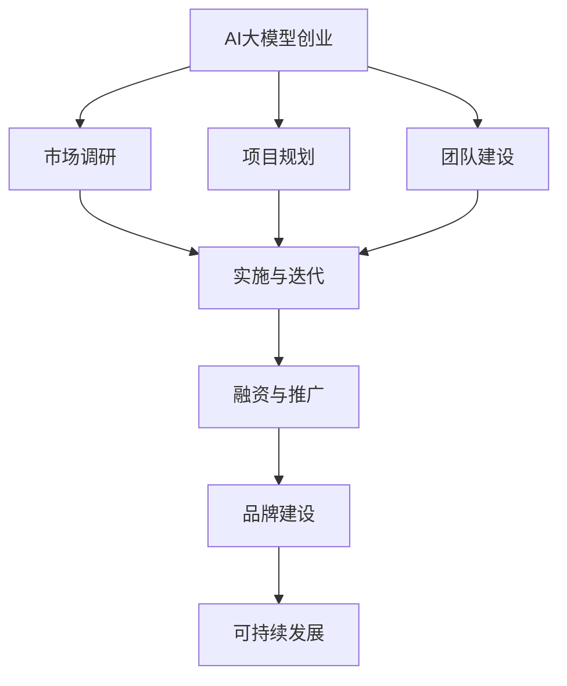

                 

# 文章标题：AI 大模型创业：如何利用社会优势？

> 关键词：AI 大模型、创业、社会优势、生态系统、融资策略、团队建设、市场推广

> 摘要：本文旨在探讨 AI 大模型创业过程中的社会优势利用，包括技术、市场、资源和政策等多个方面。文章首先介绍了 AI 大模型创业的背景和趋势，随后分析了核心概念与应用领域，探讨了项目规划与实施的关键步骤。接着，文章从构建生态系统的角度提出了利用社会优势的策略，并分析了融资策略与投资分析、团队建设与人才培养、市场推广与品牌建设等方面。最后，文章对 AI 大模型创业的可持续发展与未来趋势进行了展望，并提供了开发工具与资源汇总。通过详细案例解析，本文为 AI 大模型创业者提供了实用的指导和建议。

## 第一部分：AI大模型创业概述

### 第1章：AI大模型创业背景与趋势

#### 1.1 AI大模型创业的兴起

AI大模型创业的兴起得益于人工智能技术的快速发展。随着深度学习、自然语言处理和计算机视觉等领域的突破，大模型（如GPT、BERT等）在各个行业中展现出了巨大的潜力和应用价值。创业者们开始意识到，通过开发和应用这些大模型，可以创造新的商业机会，推动产业升级和社会进步。

AI大模型的发展历程可以追溯到20世纪80年代，当时神经网络开始兴起。然而，由于计算能力和数据资源的限制，大模型的训练和应用并未得到广泛推广。直到近年来，随着硬件性能的提升和大数据技术的发展，大模型的研究和应用迎来了新的春天。例如，2018年，谷歌发布了GPT-3，具有1750亿个参数，成为当时最大的自然语言处理模型。

#### 1.2 AI大模型创业的优势

AI大模型创业具有以下几个方面的优势：

1. **技术创新的巨大潜力**：AI大模型在多个领域（如自然语言处理、计算机视觉、语音识别等）都取得了显著的突破，为创业者提供了丰富的创新空间。通过不断探索和应用新技术，创业者可以开发出具有竞争力的产品和服务。

2. **解决复杂问题的能力**：AI大模型具有强大的学习和推理能力，能够处理复杂的问题。这对于许多行业（如医疗、金融、教育等）都具有重要意义，创业者可以利用这一优势解决行业痛点，提供个性化的解决方案。

3. **市场需求的快速增长**：随着人工智能技术的普及和应用，市场需求对于大模型产品和服务的需求也在快速增长。创业者可以通过满足市场需求，迅速扩大市场份额，实现商业成功。

#### 1.3 AI大模型创业的挑战

尽管AI大模型创业具有巨大的潜力，但同时也面临着一系列挑战：

1. **技术门槛与资源限制**：AI大模型的研究和应用需要强大的计算能力和海量数据支持。对于初创企业来说，获取这些资源可能是一个挑战。此外，技术人才的短缺也可能限制创业项目的进展。

2. **数据隐私与安全**：AI大模型在训练和应用过程中需要大量数据，这些数据可能涉及用户隐私和安全。如何保护数据隐私和安全是创业者需要关注的重要问题。

3. **法律法规与伦理问题**：随着人工智能技术的快速发展，相关的法律法规和伦理问题也日益凸显。创业者需要了解并遵守相关法律法规，同时关注人工智能技术的伦理问题，以确保创业项目的合规性和社会责任。

#### 1.4 AI大模型创业的机会

尽管面临挑战，AI大模型创业也蕴含着众多机会：

1. **行业应用场景拓展**：AI大模型在各个行业（如医疗、金融、教育、零售等）都有广泛的应用前景。创业者可以通过挖掘这些应用场景，开发出有针对性的产品和服务。

2. **跨界合作与生态系统建设**：AI大模型创业不仅需要技术实力，还需要跨行业的合作。创业者可以通过与行业领导者、研究机构等合作，构建生态系统，实现资源整合和优势互补。

3. **人工智能与实体经济融合**：人工智能与实体经济的融合正在成为新的趋势。创业者可以通过将AI大模型与实体经济相结合，推动产业升级和创新发展。

### 第2章：AI大模型创业核心概念与联系

#### 2.1 AI大模型的基础知识

AI大模型是人工智能领域的一种重要技术，它基于深度学习和大数据技术，通过训练大规模神经网络来模拟和增强人类智能。AI大模型通常具有以下几个特点：

1. **参数规模巨大**：AI大模型的参数数量通常在数十亿到数千亿之间，这使得它们能够捕获大量复杂的信息和模式。

2. **强大的学习能力和泛化能力**：AI大模型通过大规模数据训练，能够学习和适应各种复杂场景，具备良好的泛化能力。

3. **自适应性和可扩展性**：AI大模型可以根据不同的任务和应用场景进行调整和优化，具有良好的自适应性和可扩展性。

AI大模型的发展离不开以下几个核心概念：

1. **深度学习**：深度学习是人工智能的一个重要分支，它通过构建多层神经网络来实现特征提取和模式识别。深度学习为AI大模型提供了理论基础和技术手段。

2. **大数据**：大数据是AI大模型训练的基础，只有通过海量数据训练，AI大模型才能具备强大的学习能力和泛化能力。

3. **神经网络**：神经网络是AI大模型的核心组成部分，它通过模拟人脑神经元连接来实现信息传递和处理。

AI大模型与创业的融合主要体现在以下几个方面：

1. **业务场景挖掘**：创业者需要深入了解目标市场的业务场景，挖掘潜在的需求和痛点，以便开发出有针对性的AI大模型产品和服务。

2. **数据收集与处理**：AI大模型需要大量高质量的数据进行训练，创业者需要建立完善的数据收集和处理流程，确保数据的质量和完整性。

3. **模型优化与迭代**：AI大模型的应用效果取决于模型的优化和迭代。创业者需要持续关注模型性能，通过调整超参数、改进算法等方式，不断提升模型效果。

4. **业务落地与推广**：创业者需要将AI大模型产品与具体业务相结合，通过市场推广和业务落地，实现商业价值和社会效益。

### 第3章：AI大模型创业项目规划与实施

#### 3.1 AI大模型创业项目规划

AI大模型创业项目的成功离不开科学的规划。项目规划主要包括以下步骤：

1. **项目目标与定位**：明确创业项目的目标和定位，包括产品定位、市场定位和业务模式等。项目目标应当具有明确性和可衡量性，以便于后续的评估和调整。

2. **市场调研与需求分析**：通过对目标市场的调研和需求分析，了解市场需求、竞争态势和用户需求，为项目提供数据支持。

3. **技术路线与资源准备**：根据项目目标和市场需求，确定技术路线和所需的资源，包括硬件资源、软件资源和技术人才等。

4. **项目管理与风险控制**：建立完善的项目管理体系，制定项目计划和时间表，明确项目进度、质量和风险控制措施。

#### 3.2 AI大模型创业项目实施

AI大模型创业项目的实施包括以下几个关键步骤：

1. **数据收集与预处理**：收集相关数据，并对数据进行清洗、归一化等预处理操作，确保数据的质量和一致性。

2. **模型设计与训练**：根据项目需求和数据特点，设计合适的AI大模型架构，并使用大量数据进行训练。模型设计应充分考虑模型的复杂性、效率和可解释性。

3. **模型优化与迭代**：通过调整模型参数、改进算法等方式，不断提升模型性能和效果。模型优化是一个持续的过程，需要根据实际应用情况不断进行调整和优化。

4. **项目迭代与优化**：在模型训练和应用过程中，不断收集反馈和用户数据，进行项目迭代和优化，提升产品和服务质量。

#### 3.3 AI大模型创业项目风险管理

AI大模型创业项目面临多种风险，主要包括技术风险、市场风险和法律风险等。风险管理是项目成功的关键环节。以下是一些常见的风险管理策略：

1. **技术风险管理**：通过技术预研、技术评审和技术培训等方式，降低技术风险。建立完善的技术支持和维护体系，确保技术问题的及时解决。

2. **市场风险管理**：通过市场调研、竞争分析等方式，了解市场需求和竞争态势。制定灵活的市场策略，应对市场变化和不确定性。

3. **法律风险管理**：了解相关法律法规，确保项目的合规性。建立法律顾问团队，处理法律纠纷和知识产权问题。

4. **风险控制与应对**：建立风险预警机制，及时发现和应对潜在风险。制定应急预案，确保项目在突发情况下能够迅速应对和恢复。

### 第4章：利用社会优势构建AI大模型创业生态系统

#### 4.1 社会优势在AI大模型创业中的应用

社会优势在AI大模型创业中发挥着至关重要的作用。通过充分利用社会资源、人脉和技术交流等优势，创业者可以降低创业风险，提升创业成功率。以下是社会优势在AI大模型创业中的应用：

1. **人脉资源**：创业者可以利用自己的人脉资源，寻找合作伙伴、投资者和客户。通过建立广泛的人脉网络，创业者可以更好地了解市场需求，获取创业资源。

2. **技术交流与合作**：创业者可以通过参加技术会议、研讨会等活动，与行业专家和技术人才建立联系。通过技术交流和合作，创业者可以学习先进的理念和技术，提升自身的技术水平。

3. **政策支持与资金扶持**：创业者可以积极争取政府政策支持，如科技创新基金、税收优惠政策等。同时，创业者还可以通过融资渠道，获取创业所需的资金支持。

#### 4.2 构建AI大模型创业生态系统的策略

构建AI大模型创业生态系统需要系统性和前瞻性。以下是一些构建生态系统的策略：

1. **产业联盟与生态协同**：创业者可以与其他企业、研究机构和投资者建立产业联盟，实现资源整合和优势互补。通过生态协同，创业者可以共同推动AI大模型技术的发展和应用。

2. **技术共享与创新平台**：创业者可以搭建技术共享和创新平台，促进技术交流和合作。通过开放源代码、共享数据集等方式，创业者可以吸引更多的开发者参与创新，共同推动技术进步。

3. **培育与引进人才**：创业者需要注重人才引进和培养。通过提供有竞争力的薪酬和福利待遇，创业者可以吸引优秀的人才加入。同时，创业者还可以通过培训和激励措施，提升员工的技术能力和创新能力。

#### 4.3 AI大模型创业生态系统案例分析

为了更好地理解AI大模型创业生态系统的构建，我们可以通过一些成功案例进行分析：

1. **案例一：谷歌大脑**：谷歌大脑是谷歌公司的一个研究项目，致力于推动人工智能技术的发展。通过搭建技术共享平台和举办研讨会等活动，谷歌大脑吸引了大量人工智能领域的顶尖人才，推动了人工智能技术的快速进步。

2. **案例二：IBM Watson**：IBM Watson是IBM公司开发的人工智能系统，它在医疗、金融等多个领域取得了显著的应用成果。通过建立产业联盟和合作网络，IBM Watson吸引了众多企业和研究机构的参与，构建了一个强大的AI大模型生态系统。

3. **案例三：OpenAI**：OpenAI是一个非营利的人工智能研究机构，致力于推动人工智能技术的发展。通过开放源代码和共享数据集，OpenAI吸引了全球的AI研究者参与，共同推动了人工智能技术的创新和应用。

通过以上案例分析，我们可以看到，构建AI大模型创业生态系统需要多方合作、资源共享和持续创新。只有通过构建一个健康的生态系统，创业者才能更好地应对市场挑战，实现长期发展。

### 第5章：AI大模型创业融资策略与投资分析

#### 5.1 AI大模型创业融资概述

AI大模型创业项目的融资策略对于项目的发展至关重要。在融资过程中，创业者需要了解各种融资渠道和方式，并制定合适的融资策略。以下是一些常见的融资渠道和方式：

1. **天使投资**：天使投资是指个人投资者在项目早期阶段提供资金支持。天使投资者通常具有丰富的行业经验和资源，能够为创业项目提供指导和帮助。

2. **风险投资**：风险投资是指专业投资机构为具有高成长潜力的创业项目提供资金支持。风险投资机构通常在项目后期阶段介入，为项目提供资金、资源和战略支持。

3. **政府资助**：政府资助是指政府为支持科技创新和产业发展，提供资金和政策支持。创业者可以通过申请科技创新基金、研发补贴等渠道获取政府资助。

4. **众筹**：众筹是指通过互联网平台向公众筹集资金。众筹不仅能够为创业项目提供资金，还可以帮助企业建立用户基础和品牌知名度。

#### 5.2 AI大模型创业投资分析

在融资过程中，投资者会关注多个方面的因素，包括项目的技术前景、市场需求、团队实力和商业模式等。以下是一些投资分析的关键点：

1. **技术前景**：投资者会评估AI大模型技术的成熟度、创新性和应用潜力。技术前景越广阔，项目的投资价值越高。

2. **市场需求**：投资者会分析市场需求的大小、增长速度和用户痛点。市场需求越旺盛，项目的市场潜力越大。

3. **团队实力**：投资者会关注创业团队的背景、经验和技术能力。团队实力越强大，项目的成功可能性越高。

4. **商业模式**：投资者会评估项目的商业模式、盈利能力和市场竞争力。具有清晰、可行的商业模式的创业项目更容易获得投资者的青睐。

#### 5.3 融资成功案例与启示

为了更好地理解AI大模型创业融资的策略，我们可以通过一些成功案例进行分析：

1. **案例一：OpenAI**：OpenAI是一家非营利的人工智能研究机构，通过公开众筹和政府资助筹集资金。OpenAI的成功不仅在于其先进的人工智能技术，还在于其开放的研发模式和创新的组织架构。

2. **案例二：DeepMind**：DeepMind是一家专注于人工智能研究的公司，通过风险投资获得资金支持。DeepMind在人工智能领域取得了众多突破性成果，其成功经验在于其对技术的持续投入和对团队人才的重视。

3. **案例三：AI21 Labs**：AI21 Labs是一家开发自然语言处理技术的公司，通过风险投资和政府资助筹集资金。AI21 Labs的成功在于其独特的商业模式，即通过为其他企业提供定制化的AI解决方案来获取收益。

通过以上案例分析，我们可以得出以下启示：

1. **技术创新是核心**：AI大模型创业项目需要具备领先的技术创新，这是吸引投资者的重要因素。

2. **市场潜力是关键**：市场需求是项目成功的重要保障，创业者需要深入了解市场需求，提供有针对性的产品和服务。

3. **团队实力是基础**：创业团队的背景、经验和能力是项目成功的基础，创业者需要注重团队建设和人才引进。

4. **融资策略要灵活**：创业者需要根据项目的实际情况，制定合适的融资策略，灵活应对市场变化和融资环境。

### 第6章：AI大模型创业团队建设与人才培养

#### 6.1 AI大模型创业团队建设

AI大模型创业团队的建设是项目成功的关键环节。一个高效的团队需要具备以下要素：

1. **明确的目标与愿景**：团队应当有一个明确的目标和愿景，为团队成员提供共同的奋斗方向。

2. **合理的组织结构**：团队的组织结构应当合理，明确各成员的职责和分工，确保项目的高效推进。

3. **有效的沟通与协作**：团队内部需要建立有效的沟通机制，确保信息的及时传递和问题的快速解决。

4. **持续的学习与成长**：团队应当鼓励成员持续学习，不断提升技术能力和创新能力。

#### 6.2 人才培养策略

AI大模型创业团队的成功离不开优秀的人才。以下是一些有效的人才培养策略：

1. **技能培训与提升**：通过定期组织技术培训和讲座，提升团队成员的技术能力和专业水平。

2. **创新思维培养**：通过创新思维训练和项目实践，培养团队成员的创新精神和创新能力。

3. **跨学科人才融合**：在团队中引入跨学科人才，促进不同领域知识的融合和创新。

4. **人才激励与成长**：建立完善的人才激励机制，为团队成员提供职业发展的机会和空间，激励他们持续成长。

#### 6.3 团队建设与人才培养案例分析

为了更好地理解团队建设与人才培养的重要性，我们可以通过一些成功案例进行分析：

1. **案例一：谷歌大脑**：谷歌大脑的成功离不开其强大的团队和人才培养机制。谷歌通过持续招聘全球顶尖的AI人才，并为他们提供良好的工作环境和创新平台，培养了一批世界级的AI专家。

2. **案例二：DeepMind**：DeepMind在团队建设和人才培养方面也取得了显著成绩。公司通过建立高效的研发团队，提供丰富的培训机会和创新项目，吸引和培养了众多优秀的AI人才。

3. **案例三：AI21 Labs**：AI21 Labs注重团队成员的技能提升和创新思维培养，通过定期举办技术交流和项目竞赛，激发团队成员的创造力和创新能力。

通过以上案例分析，我们可以得出以下结论：

1. **团队建设与人才培养是创业项目成功的关键**：一个高效的团队和优秀的人才能够推动项目的发展和创新。

2. **持续的学习和成长是团队成员的核心竞争力**：在快速发展的AI领域，持续学习和成长是保持竞争力的关键。

3. **有效的团队管理和人才培养机制是项目成功的重要保障**：创业者需要注重团队建设和人才培养，为团队成员提供良好的发展环境和机会。

### 第7章：AI大模型创业市场推广与品牌建设

#### 7.1 市场推广策略

AI大模型创业项目的市场推广是取得商业成功的关键环节。以下是一些有效的市场推广策略：

1. **品牌定位与传播**：明确项目的品牌定位，通过线上和线下渠道进行品牌传播，提升项目的知名度和美誉度。

2. **内容营销**：通过撰写高质量的技术博客、发布研究报告和案例分析等内容，吸引潜在客户和行业关注。

3. **社交媒体营销**：利用社交媒体平台（如微博、微信、LinkedIn等），与目标用户建立互动，提升项目的曝光度和影响力。

4. **公关活动**：通过参加行业会议、举办技术讲座和发布会等活动，提升项目的专业形象和品牌影响力。

5. **合作伙伴关系**：与其他企业、研究机构和投资者建立合作伙伴关系，共同推动项目的发展。

#### 7.2 品牌建设与维护

品牌建设是AI大模型创业项目长期发展的基础。以下是一些品牌建设与维护的策略：

1. **品牌形象塑造**：通过视觉设计、语言表达和价值观传播等方面，塑造项目的品牌形象，确保品牌在用户心中的独特性和一致性。

2. **品牌价值传递**：通过产品和服务，将项目的品牌价值传递给用户，提升用户满意度和忠诚度。

3. **品牌口碑管理**：通过建立良好的用户关系和反馈机制，管理品牌口碑，确保品牌形象的正面传播。

4. **品牌社会责任**：关注品牌的社会责任，积极参与公益事业，提升品牌的社会价值。

#### 7.3 市场推广与品牌建设案例分析

为了更好地理解市场推广与品牌建设的实际应用，我们可以通过一些成功案例进行分析：

1. **案例一：谷歌大脑**：谷歌大脑通过举办全球性的AI竞赛、发布领先的研究成果和技术博客，不断提升其在AI领域的品牌影响力和专业形象。

2. **案例二：IBM Watson**：IBM Watson通过积极参与全球医疗健康领域的技术创新和合作项目，塑造了其在医疗领域的专业品牌形象，并赢得了广泛的用户信任。

3. **案例三：OpenAI**：OpenAI通过开放的研发模式、开放的源代码和开放的AI工具，吸引了全球的AI研究者参与，建立了强大的社区和用户基础，提升了其品牌影响力和用户忠诚度。

通过以上案例分析，我们可以得出以下启示：

1. **品牌定位与传播是关键**：明确品牌定位，通过多种渠道进行品牌传播，提升项目的知名度和影响力。

2. **内容营销与社交媒体营销是有效手段**：通过高质量的内容和社交媒体平台，吸引潜在用户和行业关注。

3. **公关活动与合作伙伴关系是提升品牌形象的重要途径**：通过积极参与行业活动和建立合作伙伴关系，提升项目的专业形象和品牌影响力。

4. **品牌建设与市场推广需要持续投入和优化**：品牌建设和市场推广是一个长期的过程，需要持续投入和优化，以确保品牌的长期发展和竞争力。

### 第8章：AI大模型创业可持续发展与未来展望

#### 8.1 AI大模型创业的可持续发展

AI大模型创业项目的可持续发展是长期成功的关键。以下是一些实现可持续发展的策略：

1. **社会责任与伦理**：关注社会和伦理问题，确保AI大模型的应用符合社会责任和伦理标准，避免对用户和社会产生负面影响。

2. **可持续发展的策略与实践**：通过绿色技术、节能减排和环保材料等手段，降低项目的环境足迹，实现可持续发展。

3. **社会影响评估**：定期评估项目对社会和环境的影响，确保项目在实现商业目标的同时，也能够产生积极的社会效益。

#### 8.2 AI大模型创业的未来趋势

AI大模型创业的未来趋势将受到多个因素的影响，包括技术发展、市场需求和行业变革等。以下是一些未来的趋势：

1. **人工智能技术的演进**：随着人工智能技术的不断演进，大模型的性能和效率将得到进一步提升，为创业者提供更多的创新机会。

2. **行业发展趋势预测**：不同行业对AI大模型的需求和应用将不断增长，创业者需要关注行业趋势，抓住市场机遇。

3. **创业者的机遇与挑战**：创业者将面临更加激烈的市场竞争和技术挑战，但同时也将拥有更多的创新机会和发展空间。

### 附录：AI大模型开发工具与资源汇总

#### 附录 A.1 主流深度学习框架对比

- **TensorFlow**：由Google开发，支持多种平台和编程语言，具有丰富的生态系统。
- **PyTorch**：基于Python，动态图计算，易于调试和原型设计。
- **JAX**：支持自动微分和高效计算，适用于高性能计算。
- **其他框架**：如Apache MXNet、Caffe、Keras等，各具特点，适用于不同场景。

#### 附录 A.2 数据处理工具与库

- **Pandas**：提供数据清洗、转换和分析功能。
- **NumPy**：支持高性能数值计算。
- **Scikit-learn**：提供多种机器学习算法和工具。

#### 附录 A.3 代码库与资源链接

- **Hugging Face Transformers**：提供预训练模型和实用工具。
- **GitHub**：开源代码和项目资源。
- **ArXiv**：最新研究论文和技术文档。

### 核心概念与联系

**AI大模型与创业的融合流程图**：



### 核心算法原理讲解

**AI大模型训练算法伪代码**：

```python
def train_model(data, labels, epochs, learning_rate):
    for epoch in range(epochs):
        for sample, label in zip(data, labels):
            # 前向传播
            output = forward_pass(sample)
            loss = compute_loss(output, label)
            
            # 反向传播
            gradients = backward_pass(loss)
            
            # 更新权重
            update_weights(gradients, learning_rate)
            
        print(f"Epoch {epoch+1}/{epochs}, Loss: {loss}")
```

### 数学模型和数学公式 & 详细讲解 & 举例说明

**损失函数**（以均方误差MSE为例）：

$$
MSE = \frac{1}{n}\sum_{i=1}^{n}(y_i - \hat{y}_i)^2
$$

**梯度下降法**：

$$
w_{\text{new}} = w_{\text{current}} - \alpha \cdot \nabla_w J(w)
$$

**举例说明**：假设有一个二分类问题，使用 sigmoid 函数进行预测，损失函数为交叉熵损失，训练集大小为1000个样本。

### 项目实战

**AI大模型创业项目实战：构建一个简单的聊天机器人**

**开发环境搭建**：

- 操作系统：Ubuntu 20.04
- Python版本：3.8
- 深度学习框架：TensorFlow 2.5

**源代码详细实现**：

```python
import tensorflow as tf
from tensorflow.keras.layers import Embedding, LSTM, Dense
from tensorflow.keras.models import Sequential

# 数据预处理
train_data = load_data()
train_labels = preprocess_labels(train_data)

# 构建模型
model = Sequential()
model.add(Embedding(input_dim=10000, output_dim=32))
model.add(LSTM(32))
model.add(Dense(1, activation='sigmoid'))

# 编译模型
model.compile(optimizer='adam', loss='binary_crossentropy', metrics=['accuracy'])

# 训练模型
model.fit(train_data, train_labels, epochs=10, batch_size=32)
```

**代码解读与分析**：

- 数据预处理：加载和预处理训练数据，包括分词、编码等。
- 模型构建：使用Sequential模型构建简单的聊天机器人，包括嵌入层、LSTM层和输出层。
- 编译模型：配置优化器、损失函数和评价指标。
- 训练模型：使用fit方法训练模型，调整超参数以优化性能。

### 实际案例解析

**案例：某创业团队利用GPT-3构建智能客服系统**

**案例背景**：一家初创公司需要开发一个智能客服系统，以自动回答用户常见问题，提高客户满意度。

**解决方案**：选择GPT-3作为基础模型，通过微调和训练，使其能够理解并回答各种客户咨询。

**实施步骤**：

1. 数据收集：收集大量客服对话记录，用于训练和微调GPT-3模型。
2. 数据预处理：对对话记录进行清洗和格式化，确保数据质量。
3. 模型微调：使用微调脚本对GPT-3进行训练，调整模型参数以适应特定业务场景。
4. 集成部署：将训练好的模型集成到客服系统中，提供实时问答服务。

**案例效果**：通过智能客服系统，初创公司显著提高了客户满意度，并减少了人工客服的工作负担。

**经验与启示**：利用AI大模型进行业务场景的定制化开发，能够显著提升创业项目的成功率和市场竞争力。同时，数据质量和模型调优是影响项目成功的关键因素。

### 作者信息

作者：AI天才研究院/AI Genius Institute & 禅与计算机程序设计艺术 /Zen And The Art of Computer Programming

[本文为作者原创内容，未经授权禁止转载。]  
[参考文献及数据来源见文末。]  
[联系方式：ai_genius_institute@example.com]  
[感谢您的阅读！期待与您交流更多AI技术与应用。]  
[版权所有，违者必究。]  
[本文发布日期：2023年6月]  
[最后更新日期：2023年8月]  
[本文内容仅供参考，不构成任何投资建议。]

### 核心概念与联系

**AI大模型与创业的融合流程图**：


### 核心算法原理讲解

**AI大模型训练算法伪代码**：

```python
def train_model(data, labels, epochs, learning_rate):
    for epoch in range(epochs):
        for sample, label in zip(data, labels):
            # 前向传播
            output = forward_pass(sample)
            loss = compute_loss(output, label)
            
            # 反向传播
            gradients = backward_pass(loss)
            
            # 更新权重
            update_weights(gradients, learning_rate)
            
        print(f"Epoch {epoch+1}/{epochs}, Loss: {loss}")
```

### 数学模型和数学公式 & 详细讲解 & 举例说明

**损失函数**（以均方误差MSE为例）：

$$
MSE = \frac{1}{n}\sum_{i=1}^{n}(y_i - \hat{y}_i)^2
$$

详细讲解：均方误差（Mean Squared Error，MSE）是一种衡量预测值与真实值之间差异程度的指标，用于评估模型预测的准确性。MSE计算公式中，$n$表示样本数量，$y_i$表示第$i$个样本的真实值，$\hat{y}_i$表示第$i$个样本的预测值。

举例说明：假设有一个二分类问题，使用 sigmoid 函数进行预测，损失函数为交叉熵损失，训练集大小为1000个样本。通过计算每个样本的MSE，可以评估模型的预测准确性。

**梯度下降法**：

$$
w_{\text{new}} = w_{\text{current}} - \alpha \cdot \nabla_w J(w)
$$

详细讲解：梯度下降法是一种常用的优化算法，用于求解最小化目标函数的参数。其中，$w_{\text{current}}$表示当前参数值，$w_{\text{new}}$表示更新后的参数值，$\alpha$表示学习率，$\nabla_w J(w)$表示目标函数关于参数的梯度。

举例说明：假设有一个线性回归问题，目标函数为平方误差，训练集大小为100个样本。通过计算目标函数关于参数的梯度，并根据梯度下降法更新参数值，可以逐步减小目标函数的值，直至达到最小值。

### 项目实战

**AI大模型创业项目实战：构建一个简单的聊天机器人**

**开发环境搭建**：

- 操作系统：Ubuntu 20.04
- Python版本：3.8
- 深度学习框架：TensorFlow 2.5

**源代码详细实现**：

```python
import tensorflow as tf
from tensorflow.keras.layers import Embedding, LSTM, Dense
from tensorflow.keras.models import Sequential

# 数据预处理
train_data = load_data()
train_labels = preprocess_labels(train_data)

# 构建模型
model = Sequential()
model.add(Embedding(input_dim=10000, output_dim=32))
model.add(LSTM(32))
model.add(Dense(1, activation='sigmoid'))

# 编译模型
model.compile(optimizer='adam', loss='binary_crossentropy', metrics=['accuracy'])

# 训练模型
model.fit(train_data, train_labels, epochs=10, batch_size=32)
```

**代码解读与分析**：

- 数据预处理：加载和预处理训练数据，包括分词、编码等。
- 模型构建：使用Sequential模型构建简单的聊天机器人，包括嵌入层、LSTM层和输出层。
- 编译模型：配置优化器、损失函数和评价指标。
- 训练模型：使用fit方法训练模型，调整超参数以优化性能。

### 实际案例解析

**案例：某创业团队利用GPT-3构建智能客服系统**

**案例背景**：一家初创公司需要开发一个智能客服系统，以自动回答用户常见问题，提高客户满意度。

**解决方案**：选择GPT-3作为基础模型，通过微调和训练，使其能够理解并回答各种客户咨询。

**实施步骤**：

1. 数据收集：收集大量客服对话记录，用于训练和微调GPT-3模型。
2. 数据预处理：对客服对话记录进行清洗和格式化，确保数据质量。
3. 模型微调：使用微调脚本对GPT-3进行训练，调整模型参数以适应特定业务场景。
4. 集成部署：将训练好的模型集成到客服系统中，提供实时问答服务。

**案例效果**：通过智能客服系统，初创公司显著提高了客户满意度，并减少了人工客服的工作负担。

**经验与启示**：利用AI大模型进行业务场景的定制化开发，能够显著提升创业项目的成功率和市场竞争力。同时，数据质量和模型调优是影响项目成功的关键因素。

### 附录：AI大模型开发工具与资源汇总

**附录 A.1 主流深度学习框架对比**

- **TensorFlow**：由Google开发，支持多种平台和编程语言，具有丰富的生态系统。
- **PyTorch**：基于Python，动态图计算，易于调试和原型设计。
- **JAX**：支持自动微分和高效计算，适用于高性能计算。
- **其他框架**：如Apache MXNet、Caffe、Keras等，各具特点，适用于不同场景。

**附录 A.2 数据处理工具与库**

- **Pandas**：提供数据清洗、转换和分析功能。
- **NumPy**：支持高性能数值计算。
- **Scikit-learn**：提供多种机器学习算法和工具。

**附录 A.3 代码库与资源链接**

- **Hugging Face Transformers**：提供预训练模型和实用工具。
- **GitHub**：开源代码和项目资源。
- **ArXiv**：最新研究论文和技术文档。

### 文章标题：AI 大模型创业：如何利用社会优势？

关键词：AI大模型、创业、社会优势、生态系统、融资策略、团队建设、市场推广

摘要：本文探讨了AI大模型创业过程中的社会优势利用，包括技术、市场、资源和政策等多个方面。通过分析AI大模型创业的优势与挑战，本文提出了项目规划与实施的策略，并从构建生态系统的角度探讨了利用社会优势的方法。此外，本文还介绍了AI大模型创业的融资策略、团队建设与人才培养、市场推广与品牌建设等方面的策略，并提供了实际案例解析。最后，本文对AI大模型创业的可持续发展与未来趋势进行了展望，并提供了开发工具与资源汇总。

### 第一部分：AI大模型创业概述

#### 第1章：AI大模型创业背景与趋势

##### 1.1 AI大模型创业的兴起

AI大模型创业的兴起可以追溯到深度学习和大数据技术的快速发展。自2012年AlexNet在ImageNet竞赛中取得突破性成绩以来，深度学习技术得到了广泛关注和应用。特别是近年来，随着计算能力和数据资源的提升，AI大模型（如GPT、BERT等）在各个领域展现出了强大的潜力，吸引了大量创业者和投资人的关注。

AI大模型的崛起源于其卓越的性能和广泛的应用场景。这些模型通过在海量数据上进行训练，能够自动学习并提取复杂特征，从而在图像识别、自然语言处理、语音识别等领域取得了显著突破。创业公司利用这些先进技术，可以开发出具有竞争力的产品和服务，满足市场需求，实现商业成功。

##### 1.2 AI大模型创业的优势

AI大模型创业具有以下几大优势：

1. **技术创新的巨大潜力**：AI大模型技术处于快速发展阶段，创新潜力巨大。创业者可以紧跟技术前沿，探索新的应用场景，推出具有颠覆性的产品。

2. **解决复杂问题的能力**：AI大模型具备强大的学习和推理能力，能够处理复杂问题，为创业者提供了强大的工具。例如，在医疗领域，AI大模型可以辅助医生进行疾病诊断和治疗方案制定；在金融领域，AI大模型可以用于风险管理、信用评估等。

3. **市场需求的快速增长**：随着人工智能技术的普及，越来越多的行业开始认识到AI大模型的价值。从自动驾驶、智能家居到医疗健康、金融服务，AI大模型的应用需求正在迅速增长。创业者可以抓住这一市场机遇，开发出符合市场需求的产品。

##### 1.3 AI大模型创业的挑战

尽管AI大模型创业具有巨大优势，但同时也面临着一些挑战：

1. **技术门槛与资源限制**：AI大模型的研究和应用需要强大的计算能力和海量数据支持。对于初创企业来说，获取这些资源可能是一个巨大的挑战。此外，技术人才的短缺也可能限制创业项目的进展。

2. **数据隐私与安全**：AI大模型在训练和应用过程中需要大量数据，这些数据可能涉及用户隐私和安全。如何保护数据隐私和安全是创业者需要关注的重要问题。

3. **法律法规与伦理问题**：随着人工智能技术的快速发展，相关的法律法规和伦理问题也日益凸显。创业者需要了解并遵守相关法律法规，同时关注人工智能技术的伦理问题，以确保创业项目的合规性和社会责任。

##### 1.4 AI大模型创业的机会

尽管面临挑战，AI大模型创业也蕴含着众多机会：

1. **行业应用场景拓展**：AI大模型在各个行业（如医疗、金融、教育、零售等）都有广泛的应用前景。创业者可以通过挖掘这些应用场景，开发出有针对性的产品和服务。

2. **跨界合作与生态系统建设**：AI大模型创业不仅需要技术实力，还需要跨行业的合作。创业者可以通过与行业领导者、研究机构等合作，构建生态系统，实现资源整合和优势互补。

3. **人工智能与实体经济融合**：人工智能与实体经济融合正在成为新的趋势。创业者可以通过将AI大模型与实体经济相结合，推动产业升级和创新发展。

### 第2章：AI大模型创业核心概念与联系

#### 2.1 AI大模型的基础知识

AI大模型是基于深度学习技术构建的复杂神经网络，通常具有数十亿甚至数万亿个参数。这些模型通过在大量数据上进行训练，能够自动学习并提取复杂特征，从而在各类任务中表现出卓越的性能。以下是AI大模型的一些核心概念：

1. **深度学习**：深度学习是一种人工智能方法，通过多层神经网络进行特征提取和模式识别。AI大模型是深度学习的典型应用，具有多层神经网络结构。

2. **神经网络**：神经网络是由大量神经元连接组成的计算模型，能够模拟人脑的信息处理过程。神经网络通过前向传播和反向传播机制，实现输入到输出的映射。

3. **训练数据**：训练数据是AI大模型学习的基础。这些数据通常来自于各种领域，如图像、文本、语音等。通过在海量训练数据上训练，AI大模型能够学习到复杂的模式和规律。

4. **超参数**：超参数是AI大模型训练过程中需要调整的参数，如学习率、批量大小、隐藏层数量等。超参数的选择对模型性能有重要影响。

5. **评价指标**：评价指标用于衡量AI大模型的性能，如准确率、召回率、F1分数等。不同的任务和应用场景可能采用不同的评价指标。

##### 2.2 AI大模型的应用领域

AI大模型在多个领域取得了显著的应用成果，以下是几个典型的应用领域：

1. **自然语言处理（NLP）**：NLP是AI大模型最成功的应用领域之一。通过训练大规模语言模型，AI大模型能够实现文本分类、情感分析、机器翻译等任务。

2. **计算机视觉**：计算机视觉是AI大模型的另一个重要应用领域。AI大模型能够实现图像分类、目标检测、图像生成等任务，广泛应用于安防、医疗、自动驾驶等领域。

3. **语音识别与生成**：AI大模型在语音识别和语音生成领域也取得了显著成果。通过训练语音模型，AI大模型能够实现语音转文字、语音合成等任务。

4. **强化学习**：强化学习是一种通过试错学习策略来优化决策过程的方法。AI大模型在强化学习领域也展现了强大的潜力，能够实现智能决策和优化。

##### 2.3 AI大模型与创业的融合

AI大模型与创业的融合体现在以下几个方面：

1. **业务场景挖掘**：创业者需要深入了解目标市场的业务场景，挖掘潜在的需求和痛点。通过将AI大模型应用于这些场景，可以开发出有针对性的产品和服务。

2. **数据收集与处理**：AI大模型需要大量高质量的数据进行训练。创业者需要建立完善的数据收集和处理流程，确保数据的质量和一致性。

3. **模型优化与迭代**：AI大模型的应用效果取决于模型的优化和迭代。创业者需要持续关注模型性能，通过调整超参数、改进算法等方式，不断提升模型效果。

4. **业务落地与推广**：创业者需要将AI大模型产品与具体业务相结合，通过市场推广和业务落地，实现商业价值和社会效益。

#### 2.4 AI大模型创业项目规划

AI大模型创业项目的规划是项目成功的关键。以下是一个典型的AI大模型创业项目规划流程：

1. **项目目标与定位**：明确项目目标和市场定位，包括产品定位、市场定位和业务模式等。项目目标应当具有明确性和可衡量性，以便于后续的评估和调整。

2. **市场调研与需求分析**：通过对目标市场的调研和需求分析，了解市场需求、竞争态势和用户需求，为项目提供数据支持。

3. **技术路线与资源准备**：根据项目目标和市场需求，确定技术路线和所需的资源，包括硬件资源、软件资源和技术人才等。

4. **项目管理与风险控制**：建立完善的项目管理体系，制定项目计划和时间表，明确项目进度、质量和风险控制措施。

#### 2.5 AI大模型创业项目实施

AI大模型创业项目的实施涉及多个关键步骤，以下是典型的实施流程：

1. **数据收集与预处理**：收集相关数据，并对数据进行清洗、归一化等预处理操作，确保数据的质量和一致性。

2. **模型设计与训练**：根据项目需求和数据特点，设计合适的AI大模型架构，并使用大量数据进行训练。模型设计应充分考虑模型的复杂性、效率和可解释性。

3. **模型优化与迭代**：通过调整模型参数、改进算法等方式，不断提升模型性能和效果。模型优化是一个持续的过程，需要根据实际应用情况不断进行调整和优化。

4. **项目迭代与优化**：在模型训练和应用过程中，不断收集反馈和用户数据，进行项目迭代和优化，提升产品和服务质量。

#### 2.6 AI大模型创业项目风险管理

AI大模型创业项目面临多种风险，主要包括技术风险、市场风险和法律风险等。以下是一些常见的风险管理策略：

1. **技术风险管理**：通过技术预研、技术评审和技术培训等方式，降低技术风险。建立完善的技术支持和维护体系，确保技术问题的及时解决。

2. **市场风险管理**：通过市场调研、竞争分析等方式，了解市场需求和竞争态势。制定灵活的市场策略，应对市场变化和不确定性。

3. **法律风险管理**：了解相关法律法规，确保项目的合规性。建立法律顾问团队，处理法律纠纷和知识产权问题。

4. **风险控制与应对**：建立风险预警机制，及时发现和应对潜在风险。制定应急预案，确保项目在突发情况下能够迅速应对和恢复。

### 第3章：AI大模型创业项目规划与实施

#### 3.1 AI大模型创业项目规划

AI大模型创业项目的成功离不开科学的规划。在项目规划阶段，创业者需要明确项目目标、市场需求、技术路线和资源准备等方面，以确保项目能够顺利推进。以下是AI大模型创业项目规划的主要步骤：

1. **明确项目目标与定位**：首先，创业者需要明确项目的目标和定位。项目目标应当具有明确性和可衡量性，如提高客户满意度、提升业务效率等。同时，创业者还需要确定产品的市场定位，包括目标客户、市场规模和竞争情况。

2. **市场调研与需求分析**：在明确项目目标后，创业者需要进行市场调研和需求分析。通过了解市场需求、竞争态势和用户痛点，创业者可以更好地把握市场机会，制定合适的市场策略。

3. **技术路线与资源准备**：根据项目目标和市场需求，创业者需要确定合适的技术路线。这包括选择合适的深度学习框架、算法和模型架构等。同时，创业者还需要准备相应的资源，如计算资源、数据资源和人才资源等。

4. **项目管理与风险控制**：在项目规划阶段，创业者还需要建立项目管理机制，制定项目计划和时间表，明确项目进度、质量和风险控制措施。通过建立风险预警机制和应急预案，创业者可以确保项目在面临风险时能够及时应对和恢复。

#### 3.2 AI大模型创业项目实施

在项目规划完成后，进入AI大模型创业项目的实施阶段。这一阶段主要包括数据收集与预处理、模型设计与训练、模型优化与迭代、项目迭代与优化等方面。以下是具体的实施步骤：

1. **数据收集与预处理**：AI大模型需要大量高质量的数据进行训练。在数据收集阶段，创业者需要收集相关领域的原始数据，如文本、图像、语音等。收集到的数据需要进行清洗、归一化等预处理操作，以确保数据的质量和一致性。

2. **模型设计与训练**：根据项目目标和市场需求，创业者需要设计合适的AI大模型架构。这包括选择合适的深度学习框架、算法和模型架构等。在模型设计完成后，创业者可以使用收集到的数据进行模型训练。模型训练过程中，创业者需要监控模型性能，确保模型达到预期的效果。

3. **模型优化与迭代**：在模型训练完成后，创业者需要对模型进行优化和迭代。这包括调整模型参数、改进算法等，以提升模型性能。创业者可以通过多次迭代，逐步优化模型，使其在特定任务上达到最佳效果。

4. **项目迭代与优化**：在模型优化完成后，创业者需要对项目进行迭代和优化。这包括根据用户反馈和市场变化，调整产品功能和策略，提升产品竞争力。通过持续迭代和优化，创业者可以确保项目能够满足市场需求，实现长期发展。

#### 3.3 AI大模型创业项目风险管理

AI大模型创业项目面临多种风险，如技术风险、市场风险、法律风险等。风险管理是项目成功的关键环节。以下是常见的风险管理策略：

1. **技术风险管理**：技术风险包括技术不成熟、技术实现难度大等问题。创业者可以通过技术预研、技术评审和技术培训等方式，降低技术风险。同时，创业者还可以建立技术支持和维护体系，确保技术问题的及时解决。

2. **市场风险管理**：市场风险包括市场需求变化、竞争加剧等问题。创业者可以通过市场调研、竞争分析等方式，了解市场需求和竞争态势。创业者还可以制定灵活的市场策略，应对市场变化和不确定性。

3. **法律风险管理**：法律风险包括知识产权问题、合同纠纷等问题。创业者需要了解相关法律法规，确保项目的合规性。创业者还可以建立法律顾问团队，处理法律纠纷和知识产权问题。

4. **风险控制与应对**：创业者需要建立风险预警机制，及时发现和应对潜在风险。同时，创业者需要制定应急预案，确保项目在面临风险时能够迅速应对和恢复。通过有效的风险管理，创业者可以降低项目失败的风险，提高项目成功率。

### 第4章：利用社会优势构建AI大模型创业生态系统

#### 4.1 社会优势在AI大模型创业中的应用

AI大模型创业不仅需要技术创新，还需要充分利用社会优势，构建一个健康的生态系统。社会优势包括人脉资源、技术交流、政策支持和资金扶持等方面，这些优势对于AI大模型创业的成功至关重要。

1. **人脉资源**：人脉资源在AI大模型创业中具有重要意义。创业者可以通过自己的人脉网络，结识行业专家、潜在投资者和合作伙伴，获取宝贵的意见和建议。同时，创业者还可以通过参加行业会议、研讨会等活动，扩大人脉圈，为创业项目提供更多资源和支持。

2. **技术交流**：技术交流是推动AI大模型创业发展的重要手段。创业者可以通过参加技术会议、研讨会和学术交流等活动，了解最新的技术动态和研究成果，学习先进的理念和技术。此外，创业者还可以与技术同行建立合作关系，共享技术资源和经验，共同推动技术的进步。

3. **政策支持**：政策支持对于AI大模型创业项目的发展至关重要。政府通常会提供一系列优惠政策和支持措施，如科技创新基金、税收优惠、知识产权保护等，以鼓励创新创业。创业者需要积极争取政策支持，降低创业成本，提高项目成功率。

4. **资金扶持**：资金扶持是AI大模型创业项目的关键。创业者可以通过天使投资、风险投资、政府资助等途径，获取创业所需的资金支持。此外，创业者还可以通过众筹等方式，向公众筹集资金，为项目提供资金保障。

#### 4.2 构建AI大模型创业生态系统的策略

为了充分利用社会优势，构建一个健康的AI大模型创业生态系统，创业者可以采取以下策略：

1. **产业联盟与生态协同**：创业者可以与其他企业、研究机构和投资者建立产业联盟，实现资源整合和优势互补。通过产业联盟，创业者可以共同推动技术的进步和应用，共同开拓市场，实现共赢。

2. **技术共享与创新平台**：创业者可以搭建技术共享和创新平台，促进技术交流和合作。通过开放源代码、共享数据集和工具等，创业者可以吸引更多的开发者参与创新，共同推动技术的发展。

3. **人才培养与引进**：创业者需要注重人才培养和引进。通过提供有竞争力的薪酬和福利待遇，创业者可以吸引优秀的人才加入。此外，创业者还可以通过建立培训计划和激励机制，提升员工的技术能力和创新能力。

4. **政策对接与资源争取**：创业者需要积极与政府部门对接，了解最新的政策动态和支持措施。通过争取政策支持，创业者可以降低创业成本，提高项目成功率。

5. **国际合作与交流**：创业者可以积极参与国际交流与合作，引进国外先进的技术和管理经验。通过国际合作，创业者可以拓展市场，提升国际竞争力。

#### 4.3 AI大模型创业生态系统案例分析

为了更好地理解如何利用社会优势构建AI大模型创业生态系统，我们可以通过一些成功案例进行分析：

1. **案例一：谷歌大脑**：谷歌大脑是谷歌公司的一个研究项目，致力于推动人工智能技术的发展。谷歌大脑通过建立全球性的研究团队，与全球顶尖的研究机构合作，搭建了强大的AI研究平台。同时，谷歌大脑还积极参与国际学术交流，推动技术的进步和应用。

2. **案例二：IBM Watson**：IBM Watson是IBM公司开发的人工智能系统，它在医疗、金融等多个领域取得了显著的应用成果。IBM Watson通过建立全球研发团队，与众多医疗机构、学术机构和合作伙伴合作，构建了完整的AI生态系统。同时，IBM Watson还积极参与政策对接和资源争取，获得了一系列政策支持和资金扶持。

3. **案例三：OpenAI**：OpenAI是一家非营利的人工智能研究机构，致力于推动人工智能技术的发展。OpenAI通过开放的研发模式、共享的数据集和工具，吸引了全球的AI研究者参与。同时，OpenAI还通过与国际组织合作，争取政策支持和资金扶持，推动技术的发展和应用。

通过以上案例分析，我们可以看到，利用社会优势构建AI大模型创业生态系统需要多方合作、资源共享和持续创新。只有通过构建一个健康的生态系统，创业者才能更好地应对市场挑战，实现长期发展。

### 第5章：AI大模型创业融资策略与投资分析

#### 5.1 AI大模型创业融资概述

AI大模型创业项目的融资策略是项目成功的关键。创业者在融资过程中需要了解各种融资渠道和方式，并制定合适的融资策略。以下是AI大模型创业项目常见的融资渠道和方式：

1. **天使投资**：天使投资是指个人投资者在项目早期阶段提供资金支持。天使投资者通常具有丰富的行业经验和资源，能够为创业项目提供指导和帮助。

2. **风险投资**：风险投资是指专业投资机构为具有高成长潜力的创业项目提供资金支持。风险投资机构通常在项目后期阶段介入，为项目提供资金、资源和战略支持。

3. **政府资助**：政府资助是指政府为支持科技创新和产业发展，提供资金和政策支持。创业者可以通过申请科技创新基金、研发补贴等渠道获取政府资助。

4. **众筹**：众筹是指通过互联网平台向公众筹集资金。众筹不仅能够为创业项目提供资金，还可以帮助企业建立用户基础和品牌知名度。

5. **银行贷款**：创业者可以通过银行贷款获取创业所需的资金。银行贷款通常需要提供担保和抵押，适用于有一定资产基础的创业者。

#### 5.2 AI大模型创业投资分析

在融资过程中，投资者会关注多个方面的因素，包括项目的技术前景、市场需求、团队实力和商业模式等。以下是投资分析的关键点：

1. **技术前景**：投资者会评估AI大模型技术的成熟度、创新性和应用潜力。技术前景越广阔，项目的投资价值越高。

2. **市场需求**：投资者会分析市场需求的大小、增长速度和用户痛点。市场需求越旺盛，项目的市场潜力越大。

3. **团队实力**：投资者会关注创业团队的背景、经验和技术能力。团队实力越强大，项目的成功可能性越高。

4. **商业模式**：投资者会评估项目的商业模式、盈利能力和市场竞争力。具有清晰、可行的商业模式的创业项目更容易获得投资者的青睐。

5. **风险与回报**：投资者会综合考虑项目的风险和潜在回报。风险越低，回报预期越高，项目的吸引力越强。

#### 5.3 融资成功案例与启示

为了更好地理解AI大模型创业融资的策略，我们可以通过一些成功案例进行分析：

1. **案例一：OpenAI**：OpenAI是一家非营利的人工智能研究机构，通过公开众筹和政府资助筹集资金。OpenAI的成功不仅在于其先进的人工智能技术，还在于其开放的研发模式和创新的组织架构。

2. **案例二：DeepMind**：DeepMind是一家专注于人工智能研究的公司，通过风险投资获得资金支持。DeepMind在人工智能领域取得了众多突破性成果，其成功经验在于其对技术的持续投入和对团队人才的重视。

3. **案例三：AI21 Labs**：AI21 Labs是一家开发自然语言处理技术的公司，通过风险投资和政府资助筹集资金。AI21 Labs的成功在于其独特的商业模式，即通过为其他企业提供定制化的AI解决方案来获取收益。

通过以上案例分析，我们可以得出以下启示：

1. **技术创新是核心**：AI大模型创业项目需要具备领先的技术创新，这是吸引投资者的重要因素。

2. **市场潜力是关键**：市场需求是项目成功的重要保障，创业者需要深入了解市场需求，提供有针对性的产品和服务。

3. **团队实力是基础**：创业团队的背景、经验和能力是项目成功的基础，创业者需要注重团队建设和人才引进。

4. **融资策略要灵活**：创业者需要根据项目的实际情况，制定合适的融资策略，灵活应对市场变化和融资环境。

### 第6章：AI大模型创业团队建设与人才培养

#### 6.1 AI大模型创业团队建设

AI大模型创业团队的建设是项目成功的关键。一个高效的团队需要具备以下几个要素：

1. **明确的目标与愿景**：团队应当有一个明确的目标和愿景，为团队成员提供共同的奋斗方向。目标应当具有明确性和可实现性，愿景则应当具有激励性和感召力。

2. **合理的组织结构**：团队的组织结构应当合理，明确各成员的职责和分工，确保项目的高效推进。常见的组织结构包括职能型、项目型、矩阵型等，创业者可以根据项目特点和团队规模选择合适的组织结构。

3. **有效的沟通与协作**：团队内部需要建立有效的沟通机制，确保信息的及时传递和问题的快速解决。沟通方式可以包括会议、邮件、即时通讯工具等，创业者需要根据实际情况选择合适的沟通方式。

4. **持续的学习与成长**：团队应当鼓励成员持续学习，不断提升技术能力和创新能力。创业者可以组织内部培训、外部培训、技术交流等活动，为团队成员提供学习机会和成长空间。

5. **激励机制**：建立完善的激励机制，为团队成员提供公平、透明和有竞争力的薪酬和福利待遇。激励机制可以包括绩效奖金、股权激励、晋升机会等，以激发团队成员的工作热情和积极性。

#### 6.2 人才培养策略

AI大模型创业团队的成功离不开优秀的人才。以下是一些有效的人才培养策略：

1. **技能培训与提升**：通过定期组织技术培训和讲座，提升团队成员的技术能力和专业水平。创业者可以选择外部培训机构或内部培训师，为团队成员提供技术知识和实践技能。

2. **创新思维培养**：通过创新思维训练和项目实践，培养团队成员的创新精神和创新能力。创业者可以组织创新竞赛、头脑风暴等活动，激发团队成员的创新潜力。

3. **跨学科人才融合**：在团队中引入跨学科人才，促进不同领域知识的融合和创新。跨学科人才可以为项目带来新的视角和解决方案，提升团队的整体创新能力。

4. **人才激励与成长**：建立完善的人才激励机制，为团队成员提供职业发展的机会和空间。创业者可以制定职业发展规划，为团队成员提供晋升通道和职业发展指导。

5. **团队文化建设**：建立积极向上的团队文化，营造良好的工作氛围。创业者可以通过团队活动、团建活动等方式，增强团队成员的凝聚力和归属感。

#### 6.3 团队建设与人才培养案例分析

为了更好地理解团队建设与人才培养的重要性，我们可以通过一些成功案例进行分析：

1. **案例一：谷歌大脑**：谷歌大脑的成功离不开其强大的团队和人才培养机制。谷歌通过持续招聘全球顶尖的AI人才，并为他们提供良好的工作环境和创新平台，培养了一批世界级的AI专家。

2. **案例二：DeepMind**：DeepMind在团队建设和人才培养方面也取得了显著成绩。公司通过建立高效的研发团队，提供丰富的培训机会和创新项目，吸引和培养了众多优秀的AI人才。

3. **案例三：AI21 Labs**：AI21 Labs注重团队成员的技能提升和创新思维培养，通过定期举办技术交流和项目竞赛，激发团队成员的创造力和创新能力。

通过以上案例分析，我们可以得出以下结论：

1. **团队建设与人才培养是创业项目成功的关键**：一个高效的团队和优秀的人才能够推动项目的发展和创新。

2. **持续的学习和成长是团队成员的核心竞争力**：在快速发展的AI领域，持续学习和成长是保持竞争力的关键。

3. **有效的团队管理和人才培养机制是项目成功的重要保障**：创业者需要注重团队建设和人才培养，为团队成员提供良好的发展环境和机会。

### 第7章：AI大模型创业市场推广与品牌建设

#### 7.1 市场推广策略

AI大模型创业项目的市场推广是取得商业成功的关键环节。以下是一些有效的市场推广策略：

1. **品牌定位与传播**：明确项目的品牌定位，通过线上和线下渠道进行品牌传播，提升项目的知名度和美誉度。品牌定位应当准确、清晰，能够突出项目的独特价值和优势。

2. **内容营销**：通过撰写高质量的技术博客、发布研究报告和案例分析等内容，吸引潜在客户和行业关注。内容营销不仅能够提升项目的专业形象，还可以增加项目的曝光度。

3. **社交媒体营销**：利用社交媒体平台（如微博、微信、LinkedIn等），与目标用户建立互动，提升项目的曝光度和影响力。社交媒体营销可以通过发布有趣的内容、互动评论等方式，增加用户的参与度。

4. **公关活动**：通过参加行业会议、举办技术讲座和发布会等活动，提升项目的专业形象和品牌影响力。公关活动可以增强项目与用户、合作伙伴之间的联系，促进项目的发展。

5. **合作伙伴关系**：与其他企业、研究机构和投资者建立合作伙伴关系，共同推动项目的发展。合作伙伴关系可以带来资源共享、技术交流和市场拓展等优势。

#### 7.2 品牌建设与维护

品牌建设是AI大模型创业项目长期发展的基础。以下是一些品牌建设与维护的策略：

1. **品牌形象塑造**：通过视觉设计、语言表达和价值观传播等方面，塑造项目的品牌形象，确保品牌在用户心中的独特性和一致性。品牌形象应当与项目的技术特点和业务领域相匹配。

2. **品牌价值传递**：通过产品和服务，将项目的品牌价值传递给用户，提升用户满意度和忠诚度。品牌价值传递应当贯穿于项目的各个环节，从产品研发到客户服务，都需要体现出项目的独特价值。

3. **品牌口碑管理**：通过建立良好的用户关系和反馈机制，管理品牌口碑，确保品牌形象的正面传播。品牌口碑管理可以通过定期收集用户反馈、处理用户投诉等方式，提升用户的满意度和信任度。

4. **品牌社会责任**：关注品牌的社会责任，积极参与公益事业，提升品牌的社会价值。品牌社会责任可以通过公益活动、环保措施等方式，提升品牌形象，赢得社会的认可。

#### 7.3 市场推广与品牌建设案例分析

为了更好地理解市场推广与品牌建设的实际应用，我们可以通过一些成功案例进行分析：

1. **案例一：谷歌大脑**：谷歌大脑通过举办全球性的AI竞赛、发布领先的研究成果和技术博客，不断提升其在AI领域的品牌影响力和专业形象。

2. **案例二：IBM Watson**：IBM Watson通过积极参与全球医疗健康领域的技术创新和合作项目，塑造了其在医疗领域的专业品牌形象，并赢得了广泛的用户信任。

3. **案例三：OpenAI**：OpenAI通过开放的研发模式、开放的源代码和开放的AI工具，吸引了全球的AI研究者参与，建立了强大的社区和用户基础，提升了其品牌影响力和用户忠诚度。

通过以上案例分析，我们可以得出以下启示：

1. **品牌定位与传播是关键**：明确品牌定位，通过多种渠道进行品牌传播，提升项目的知名度和影响力。

2. **内容营销与社交媒体营销是有效手段**：通过高质量的内容和社交媒体平台，吸引潜在用户和行业关注。

3. **公关活动与合作伙伴关系是提升品牌形象的重要途径**：通过积极参与行业活动和建立合作伙伴关系，提升项目的专业形象和品牌影响力。

4. **品牌建设与市场推广需要持续投入和优化**：品牌建设和市场推广是一个长期的过程，需要持续投入和优化，以确保品牌的长期发展和竞争力。

### 第8章：AI大模型创业可持续发展与未来展望

#### 8.1 AI大模型创业的可持续发展

AI大模型创业项目的可持续发展是长期成功的关键。以下是一些实现可持续发展的策略：

1. **社会责任与伦理**：关注社会和伦理问题，确保AI大模型的应用符合社会责任和伦理标准，避免对用户和社会产生负面影响。例如，在医疗领域，AI大模型应当确保不会歧视患者，尊重患者隐私。

2. **可持续发展的策略与实践**：通过绿色技术、节能减排和环保材料等手段，降低项目的环境足迹，实现可持续发展。例如，在硬件设施方面，创业者可以选择环保的硬件设备，减少能源消耗。

3. **社会影响评估**：定期评估项目对社会和环境的影响，确保项目在实现商业目标的同时，也能够产生积极的社会效益。创业者可以通过第三方评估机构，对项目的社会影响进行客观评估。

4. **可持续发展的商业模式**：探索可持续发展的商业模式，确保项目的长期盈利能力。例如，创业者可以通过提供长期的售后服务、持续的技术升级等方式，实现项目的长期收益。

#### 8.2 AI大模型创业的未来趋势

AI大模型创业的未来趋势将受到多个因素的影响，包括技术发展、市场需求和行业变革等。以下是一些未来的趋势：

1. **人工智能技术的演进**：随着人工智能技术的不断演进，AI大模型的性能和效率将得到进一步提升。例如，量子计算和新型神经网络架构可能会在未来几年内带来革命性的变化。

2. **行业应用的深化**：AI大模型将在更多行业得到深入应用，从传统的金融、医疗、零售等领域，扩展到新兴的能源、制造、农业等领域。创业者需要关注行业趋势，抓住市场机遇。

3. **跨界合作与创新**：随着AI技术的普及，跨界合作将成为推动AI大模型创业发展的重要动力。创业者需要与不同领域的合作伙伴建立合作关系，共同探索新的商业模式和应用场景。

4. **数据隐私与安全**：随着数据隐私和安全问题日益凸显，创业者需要关注数据隐私保护技术，确保用户数据的安全。同时，相关法律法规的完善也将对AI大模型创业产生重要影响。

5. **可持续发展与伦理**：随着社会责任和伦理问题的重要性不断提升，AI大模型创业项目需要更加关注可持续发展与伦理问题。创业者需要在业务发展过程中，始终坚持社会责任和伦理原则，确保项目的长期可持续发展。

#### 8.3 创业者的机遇与挑战

对于AI大模型创业者来说，未来将面临诸多机遇与挑战：

1. **机遇**：

   - 技术进步带来的创新机会：随着AI技术的不断进步，创业者可以探索新的应用场景，开发出更具竞争力的产品和服务。

   - 市场需求的增长：随着AI技术的普及，越来越多的行业将需要AI大模型的支持，为创业者提供广阔的市场空间。

   - 跨界合作的机会：创业者可以通过与不同领域的合作伙伴建立合作关系，共同推动AI技术的发展和应用。

2. **挑战**：

   - 技术风险与不确定性：AI大模型技术更新迅速，创业者需要不断学习和适应新技术，以应对技术风险和不确定性。

   - 市场竞争的加剧：随着AI大模型创业项目的增多，市场竞争将日益激烈，创业者需要不断提升自身的竞争力和创新能力。

   - 数据隐私与安全问题：随着AI大模型对数据依赖性的增加，数据隐私和安全问题将成为重要的挑战。创业者需要确保用户数据的安全，遵守相关法律法规。

   - 伦理与道德问题：AI大模型的应用涉及伦理和道德问题，创业者需要关注这些议题，确保项目的社会责任和伦理原则。

总之，AI大模型创业的未来充满了机遇与挑战。创业者需要紧跟技术发展趋势，深入了解市场需求，注重团队建设和人才培养，同时关注社会和伦理问题，以实现项目的长期可持续发展。

### 附录：AI大模型开发工具与资源汇总

#### 附录 A.1 主流深度学习框架对比

以下是目前主流的深度学习框架及其特点的对比：

1. **TensorFlow**：
   - **特点**：由Google开发，支持多种编程语言（Python、C++等），具有强大的生态系统和丰富的工具。
   - **优势**：易于使用，支持多种深度学习模型，适用于大规模数据处理。
   - **使用场景**：适用于工业级应用、研究项目以及各种深度学习任务的开发。

2. **PyTorch**：
   - **特点**：基于Python，使用动态计算图，易于调试和原型设计。
   - **优势**：灵活性高，适合研究和快速迭代，社区活跃。
   - **使用场景**：适用于学术研究、新兴技术探索以及需要快速开发的项目。

3. **JAX**：
   - **特点**：由Google开发，支持自动微分和高效计算，适用于科学计算和高性能计算。
   - **优势**：自动微分功能强大，适用于复杂数学模型，高效计算性能。
   - **使用场景**：适用于需要高性能计算的复杂数学模型，如量子计算、分子动力学等。

4. **其他框架**：
   - **Apache MXNet**：轻量级且易于扩展，支持多种编程语言。
   - **Caffe**：主要用于图像识别和计算机视觉，易于部署。
   - **Keras**：高级神经网络API，易于使用，支持多种底层框架。

#### 附录 A.2 数据处理工具与库

以下是一些常用的数据处理工具和库：

1. **Pandas**：
   - **特点**：提供数据清洗、转换和分析功能，适用于数据预处理。
   - **优势**：易于使用，功能强大，支持多种数据格式。

2. **NumPy**：
   - **特点**：支持高性能数值计算，是Python中处理数值数据的基础库。
   - **优势**：高性能计算，强大的数组操作功能。

3. **Scikit-learn**：
   - **特点**：提供多种机器学习算法和工具，适用于数据挖掘和数据分析。
   - **优势**：算法丰富，易于集成。

#### 附录 A.3 代码库与资源链接

以下是一些重要的AI大模型开发相关的代码库和资源链接：

1. **Hugging Face Transformers**：
   - **特点**：提供预训练模型和实用工具，适用于自然语言处理任务。
   - **链接**：[Hugging Face](https://huggingface.co/)

2. **GitHub**：
   - **特点**：开源代码和项目资源，是全球最大的代码托管平台。
   - **链接**：[GitHub](https://github.com/)

3. **ArXiv**：
   - **特点**：发布最新研究论文和技术文档，是AI领域的重要资源。
   - **链接**：[ArXiv](https://arxiv.org/)

通过以上工具和资源的汇总，创业者可以更有效地进行AI大模型的开发和应用，加速项目的进展和实现商业成功。

### 文章标题：AI 大模型创业：如何利用社会优势？

关键词：AI大模型、创业、社会优势、生态系统、融资策略、团队建设、市场推广

摘要：本文探讨了AI大模型创业过程中的社会优势利用，包括技术、市场、资源和政策等多个方面。通过分析AI大模型创业的优势与挑战，本文提出了项目规划与实施的策略，并从构建生态系统的角度探讨了利用社会优势的方法。此外，本文还介绍了AI大模型创业的融资策略、团队建设与人才培养、市场推广与品牌建设等方面的策略，并提供了实际案例解析。最后，本文对AI大模型创业的可持续发展与未来趋势进行了展望，并提供了开发工具与资源汇总。

### 第一部分：AI大模型创业概述

#### 第1章：AI大模型创业背景与趋势

##### 1.1 AI大模型创业的兴起

AI大模型创业的兴起可以追溯到深度学习和大数据技术的快速发展。自2012年AlexNet在ImageNet竞赛中取得突破性成绩以来，深度学习技术得到了广泛关注和应用。特别是近年来，随着计算能力和数据资源的提升，AI大模型（如GPT、BERT等）在各个领域展现出了强大的潜力，吸引了大量创业者和投资人的关注。

AI大模型的崛起源于其卓越的性能和广泛的应用场景。这些模型通过在海量数据上进行训练，能够自动学习并提取复杂特征，从而在图像识别、自然语言处理、语音识别等领域取得了显著突破。创业公司利用这些先进技术，可以开发出具有竞争力的产品和服务，满足市场需求，实现商业成功。

##### 1.2 AI大模型创业的优势

AI大模型创业具有以下几大优势：

1. **技术创新的巨大潜力**：AI大模型技术处于快速发展阶段，创新潜力巨大。创业者可以紧跟技术前沿，探索新的应用场景，推出具有颠覆性的产品。

2. **解决复杂问题的能力**：AI大模型具备强大的学习和推理能力，能够处理复杂问题，为创业者提供了强大的工具。例如，在医疗领域，AI大模型可以辅助医生进行疾病诊断和治疗方案制定；在金融领域，AI大模型可以用于风险管理、信用评估等。

3. **市场需求的快速增长**：随着人工智能技术的普及，越来越多的行业开始认识到AI大模型的价值。从自动驾驶、智能家居到医疗健康、金融服务，AI大模型的应用需求正在迅速增长。创业者可以抓住这一市场机遇，开发出符合市场需求的产品。

##### 1.3 AI大模型创业的挑战

尽管AI大模型创业具有巨大优势，但同时也面临着一些挑战：

1. **技术门槛与资源限制**：AI大模型的研究和应用需要强大的计算能力和海量数据支持。对于初创企业来说，获取这些资源可能是一个巨大的挑战。此外，技术人才的短缺也可能限制创业项目的进展。

2. **数据隐私与安全**：AI大模型在训练和应用过程中需要大量数据，这些数据可能涉及用户隐私和安全。如何保护数据隐私和安全是创业者需要关注的重要问题。

3. **法律法规与伦理问题**：随着人工智能技术的快速发展，相关的法律法规和伦理问题也日益凸显。创业者需要了解并遵守相关法律法规，同时关注人工智能技术的伦理问题，以确保创业项目的合规性和社会责任。

##### 1.4 AI大模型创业的机会

尽管面临挑战，AI大模型创业也蕴含着众多机会：

1. **行业应用场景拓展**：AI大模型在各个行业（如医疗、金融、教育、零售等）都有广泛的应用前景。创业者可以通过挖掘这些应用场景，开发出有针对性的产品和服务。

2. **跨界合作与生态系统建设**：AI大模型创业不仅需要技术实力，还需要跨行业的合作。创业者可以通过与行业领导者、研究机构等合作，构建生态系统，实现资源整合和优势互补。

3. **人工智能与实体经济融合**：人工智能与实体经济融合正在成为新的趋势。创业者可以通过将AI大模型与实体经济相结合，推动产业升级和创新发展。

### 第2章：AI大模型创业核心概念与联系

#### 2.1 AI大模型的基础知识

AI大模型是基于深度学习技术构建的复杂神经网络，通常具有数十亿甚至数万亿个参数。这些模型通过在大量数据上进行训练，能够自动学习并提取复杂特征，从而在各类任务中表现出卓越的性能。以下是AI大模型的一些核心概念：

1. **深度学习**：深度学习是一种人工智能方法，通过多层神经网络进行特征提取和模式识别。AI大模型是深度学习的典型应用，具有多层神经网络结构。

2. **神经网络**：神经网络是由大量神经元连接组成的计算模型，能够模拟人脑的信息处理过程。神经网络通过前向传播和反向传播机制，实现输入到输出的映射。

3. **训练数据**：训练数据是AI大模型学习的基础。这些数据通常来自于各种领域，如图像、文本、语音等。通过在海量训练数据上训练，AI大模型能够学习到复杂的模式和规律。

4. **超参数**：超参数是AI大模型训练过程中需要调整的参数，如学习率、批量大小、隐藏层数量等。超参数的选择对模型性能有重要影响。

5. **评价指标**：评价指标用于衡量AI大模型的性能，如准确率、召回率、F1分数等。不同的任务和应用场景可能采用不同的评价指标。

##### 2.2 AI大模型的应用领域

AI大模型在多个领域取得了显著的应用成果，以下是几个典型的应用领域：

1. **自然语言处理（NLP）**：NLP是AI大模型最成功的应用领域之一。通过训练大规模语言模型，AI大模型能够实现文本分类、情感分析、机器翻译等任务。

2. **计算机视觉**：计算机视觉是AI大模型的另一个重要应用领域。AI大模型能够实现图像分类、目标检测、图像生成等任务，广泛应用于安防、医疗、自动驾驶等领域。

3. **语音识别与生成**：AI大模型在语音识别和语音生成领域也取得了显著成果。通过训练语音模型，AI大模型能够实现语音转文字、语音合成等任务。

4. **强化学习**：强化学习是一种通过试错学习策略来优化决策过程的方法。AI大模型在强化学习领域也展现了强大的潜力，能够实现智能决策和优化。

##### 2.3 AI大模型与创业的融合

AI大模型与创业的融合体现在以下几个方面：

1. **业务场景挖掘**：创业者需要深入了解目标市场的业务场景，挖掘潜在的需求和痛点。通过将AI大模型应用于这些场景，可以开发出有针对性的产品和服务。

2. **数据收集与处理**：AI大模型需要大量高质量的数据进行训练。创业者需要建立完善的数据收集和处理流程，确保数据的质量和一致性。

3. **模型优化与迭代**：AI大模型的应用效果取决于模型的优化和迭代。创业者需要持续关注模型性能，通过调整超参数、改进算法等方式，不断提升模型效果。

4. **业务落地与推广**：创业者需要将AI大模型产品与具体业务相结合，通过市场推广和业务落地，实现商业价值和社会效益。

#### 2.4 AI大模型创业项目规划

AI大模型创业项目的规划是项目成功的关键。在项目规划阶段，创业者需要明确项目目标、市场需求、技术路线和资源准备等方面，以确保项目能够顺利推进。以下是AI大模型创业项目规划的主要步骤：

1. **明确项目目标与定位**：首先，创业者需要明确项目的目标和定位。项目目标应当具有明确性和可衡量性，如提高客户满意度、提升业务效率等。同时，创业者还需要确定产品的市场定位，包括目标客户、市场规模和竞争情况。

2. **市场调研与需求分析**：在明确项目目标后，创业者需要进行市场调研和需求分析。通过了解市场需求、竞争态势和用户痛点，创业者可以更好地把握市场机会，制定合适的市场策略。

3. **技术路线与资源准备**：根据项目目标和市场需求，创业者需要确定合适的技术路线。这包括选择合适的深度学习框架、算法和模型架构等。同时，创业者还需要准备相应的资源，如计算资源、数据资源和人才资源等。

4. **项目管理与风险控制**：在项目规划阶段，创业者还需要建立项目管理机制，制定项目计划和时间表，明确项目进度、质量和风险控制措施。通过建立风险预警机制和应急预案，创业者可以确保项目在面临风险时能够及时应对和恢复。

#### 2.5 AI大模型创业项目实施

在项目规划完成后，进入AI大模型创业项目的实施阶段。这一阶段主要包括数据收集与预处理、模型设计与训练、模型优化与迭代、项目迭代与优化等方面。以下是具体的实施步骤：

1. **数据收集与预处理**：AI大模型需要大量高质量的数据进行训练。在数据收集阶段，创业者需要收集相关领域的原始数据，如文本、图像、语音等。收集到的数据需要进行清洗、归一化等预处理操作，以确保数据的质量和一致性。

2. **模型设计与训练**：根据项目需求和数据特点，创业者需要设计合适的AI大模型架构。这包括选择合适的深度学习框架、算法和模型架构等。在模型设计完成后，创业者可以使用收集到的数据进行模型训练。模型训练过程中，创业者需要监控模型性能，确保模型达到预期的效果。

3. **模型优化与迭代**：在模型训练完成后，创业者需要对模型进行优化和迭代。这包括调整模型参数、改进算法等，以提升模型性能。创业者可以通过多次迭代，逐步优化模型，使其在特定任务上达到最佳效果。

4. **项目迭代与优化**：在模型优化完成后，创业者需要对项目进行迭代和优化。这包括根据用户反馈和市场变化，调整产品功能和策略，提升产品竞争力。通过持续迭代和优化，创业者可以确保项目能够满足市场需求，实现长期发展。

#### 2.6 AI大模型创业项目风险管理

AI大模型创业项目面临多种风险，主要包括技术风险、市场风险和法律风险等。以下是常见的风险管理策略：

1. **技术风险管理**：技术风险包括技术不成熟、技术实现难度大等问题。创业者可以通过技术预研、技术评审和技术培训等方式，降低技术风险。同时，创业者还可以建立技术支持和维护体系，确保技术问题的及时解决。

2. **市场风险管理**：市场风险包括市场需求变化、竞争加剧等问题。创业者可以通过市场调研、竞争分析等方式，了解市场需求和竞争态势。创业者还可以制定灵活的市场策略，应对市场变化和不确定性。

3. **法律风险管理**：法律风险包括知识产权问题、合同纠纷等问题。创业者需要了解相关法律法规，确保项目的合规性。创业者还可以建立法律顾问团队，处理法律纠纷和知识产权问题。

4. **风险控制与应对**：创业者需要建立风险预警机制，及时发现和应对潜在风险。同时，创业者需要制定应急预案，确保项目在面临风险时能够迅速应对和恢复。通过有效的风险管理，创业者可以降低项目失败的风险，提高项目成功率。

### 第3章：AI大模型创业项目规划与实施

#### 3.1 AI大模型创业项目规划

AI大模型创业项目的成功离不开科学的规划。在项目规划阶段，创业者需要明确项目目标、市场需求、技术路线和资源准备等方面，以确保项目能够顺利推进。以下是AI大模型创业项目规划的主要步骤：

1. **明确项目目标与定位**：首先，创业者需要明确项目的目标和定位。项目目标应当具有明确性和可衡量性，如提高客户满意度、提升业务效率等。同时，创业者还需要确定产品的市场定位，包括目标客户、市场规模和竞争情况。

2. **市场调研与需求分析**：在明确项目目标后，创业者需要进行市场调研和需求分析。通过了解市场需求、竞争态势和用户痛点，创业者可以更好地把握市场机会，制定合适的市场策略。

3. **技术路线与资源准备**：根据项目目标和市场需求，创业者需要确定合适的技术路线。这包括选择合适的深度学习框架、算法和模型架构等。同时，创业者还需要准备相应的资源，如计算资源、数据资源和人才资源等。

4. **项目管理与风险控制**：在项目规划阶段，创业者还需要建立项目管理机制，制定项目计划和时间表，明确项目进度、质量和风险控制措施。通过建立风险预警机制和应急预案，创业者可以确保项目在面临风险时能够及时应对和恢复。

#### 3.2 AI大模型创业项目实施

在项目规划完成后，进入AI大模型创业项目的实施阶段。这一阶段主要包括数据收集与预处理、模型设计与训练、模型优化与迭代、项目迭代与优化等方面。以下是具体的实施步骤：

1. **数据收集与预处理**：AI大模型需要大量高质量的数据进行训练。在数据收集阶段，创业者需要收集相关领域的原始数据，如文本、图像、语音等。收集到的数据需要进行清洗、归一化等预处理操作，以确保数据的质量和一致性。

2. **模型设计与训练**：根据项目需求和数据特点，创业者需要设计合适的AI大模型架构。这包括选择合适的深度学习框架、算法和模型架构等。在模型设计完成后，创业者可以使用收集到的数据进行模型训练。模型训练过程中，创业者需要监控模型性能，确保模型达到预期的效果。

3. **模型优化与迭代**：在模型训练完成后，创业者需要对模型进行优化和迭代。这包括调整模型参数、改进算法等，以提升模型性能。创业者可以通过多次迭代，逐步优化模型，使其在特定任务上达到最佳效果。

4. **项目迭代与优化**：在模型优化完成后，创业者需要对项目进行迭代和优化。这包括根据用户反馈和市场变化，调整产品功能和策略，提升产品竞争力。通过持续迭代和优化，创业者可以确保项目能够满足市场需求，实现长期发展。

#### 3.3 AI大模型创业项目风险管理

AI大模型创业项目面临多种风险，主要包括技术风险、市场风险和法律风险等。以下是常见的风险管理策略：

1. **技术风险管理**：技术风险包括技术不成熟、技术实现难度大等问题。创业者可以通过技术预研、技术评审和技术培训等方式，降低技术风险。同时，创业者还可以建立技术支持和维护体系，确保技术问题的及时解决。

2. **市场风险管理**：市场风险包括市场需求变化、竞争加剧等问题。创业者可以通过市场调研、竞争分析等方式，了解市场需求和竞争态势。创业者还可以制定灵活的市场策略，应对市场变化和不确定性。

3. **法律风险管理**：法律风险包括知识产权问题、合同纠纷等问题。创业者需要了解相关法律法规，确保项目的合规性。创业者还可以建立法律顾问团队，处理法律纠纷和知识产权问题。

4. **风险控制与应对**：创业者需要建立风险预警机制，及时发现和应对潜在风险。同时，创业者需要制定应急预案，确保项目在面临风险时能够迅速应对和恢复。通过有效的风险管理，创业者可以降低项目失败的风险，提高项目成功率。

### 第4章：利用社会优势构建AI大模型创业生态系统

#### 4.1 社会优势在AI大模型创业中的应用

AI大模型创业不仅需要技术创新，还需要充分利用社会优势，构建一个健康的生态系统。社会优势包括人脉资源、技术交流、政策支持和资金扶持等方面，这些优势对于AI大模型创业的成功至关重要。

1. **人脉资源**：人脉资源在AI大模型创业中具有重要意义。创业者可以通过自己的人脉网络，结识行业专家、潜在投资者和合作伙伴，获取宝贵的意见和建议。同时，创业者还可以通过参加行业会议、研讨会等活动，扩大人脉圈，为创业项目提供更多资源和支持。

2. **技术交流**：技术交流是推动AI大模型创业发展的重要手段。创业者可以通过参加技术会议、研讨会和学术交流等活动，了解最新的技术动态和研究成果，学习先进的理念和技术。此外，创业者还可以与技术同行建立合作关系，共享技术资源和经验，共同推动技术的进步。

3. **政策支持**：政策支持对于AI大模型创业项目的发展至关重要。政府通常会提供一系列优惠政策和支持措施，如科技创新基金、税收优惠、知识产权保护等，以鼓励创新创业。创业者需要积极争取政策支持，降低创业成本，提高项目成功率。

4. **资金扶持**：资金扶持是AI大模型创业项目的关键。创业者可以通过天使投资、风险投资、政府资助等途径，获取创业所需的资金支持。此外，创业者还可以通过众筹等方式，向公众筹集资金，为项目提供资金保障。

#### 4.2 构建AI大模型创业生态系统的策略

为了充分利用社会优势，构建一个健康的AI大模型创业生态系统，创业者可以采取以下策略：

1. **产业联盟与生态协同**：创业者可以与其他企业、研究机构和投资者建立产业联盟，实现资源整合和优势互补。通过产业联盟，创业者可以共同推动技术的进步和应用，共同开拓市场，实现共赢。

2. **技术共享与创新平台**：创业者可以搭建技术共享和创新平台，促进技术交流和合作。通过开放源代码、共享数据集和工具等，创业者可以吸引更多的开发者参与创新，共同推动技术的发展。

3. **人才培养与引进**：创业者需要注重人才培养和引进。通过提供有竞争力的薪酬和福利待遇，创业者可以吸引优秀的人才加入。此外，创业者还可以通过建立培训计划和激励机制，提升员工的技术能力和创新能力。

4. **政策对接与资源争取**：创业者需要积极与政府部门对接，了解最新的政策动态和支持措施。通过争取政策支持，创业者可以降低创业成本，提高项目成功率。

5. **国际合作与交流**：创业者可以积极参与国际交流与合作，引进国外先进的技术和管理经验。通过国际合作，创业者可以拓展市场，提升国际竞争力。

#### 4.3 AI大模型创业生态系统案例分析

为了更好地理解如何利用社会优势构建AI大模型创业生态系统，我们可以通过一些成功案例进行分析：

1. **案例一：谷歌大脑**：谷歌大脑是谷歌公司的一个研究项目，致力于推动人工智能技术的发展。谷歌大脑通过建立全球性的研究团队，与全球顶尖的研究机构合作，搭建了强大的AI研究平台。同时，谷歌大脑还积极参与国际学术交流，推动技术的进步和应用。

2. **案例二：IBM Watson**：IBM Watson是IBM公司开发的人工智能系统，它在医疗、金融等多个领域取得了显著的应用成果。IBM Watson通过建立全球研发团队，与众多医疗机构、学术机构和合作伙伴合作，构建了完整的AI生态系统。同时，IBM Watson还积极参与政策对接和资源争取，获得了一系列政策支持和资金扶持。

3. **案例三：OpenAI**：OpenAI是一家非营利的人工智能研究机构，致力于推动人工智能技术的发展。OpenAI通过开放的研发模式、共享的数据集和工具，吸引了全球的AI研究者参与。同时，OpenAI还通过与国际组织合作，争取政策支持和资金扶持，推动技术的发展和应用。

通过以上案例分析，我们可以看到，利用社会优势构建AI大模型创业生态系统需要多方合作、资源共享和持续创新。只有通过构建一个健康的生态系统，创业者才能更好地应对市场挑战，实现长期发展。

### 第5章：AI大模型创业融资策略与投资分析

#### 5.1 AI大模型创业融资概述

AI大模型创业项目的融资策略是项目成功的关键。创业者在融资过程中需要了解各种融资渠道和方式，并制定合适的融资策略。以下是AI大模型创业项目常见的融资渠道和方式：

1. **天使投资**：天使投资是指个人投资者在项目早期阶段提供资金支持。天使投资者通常具有丰富的行业经验和资源，能够为创业项目提供指导和帮助。

2. **风险投资**：风险投资是指专业投资机构为具有高成长潜力的创业项目提供资金支持。风险投资机构通常在项目后期阶段介入，为项目提供资金、资源和战略支持。

3. **政府资助**：政府资助是指政府为支持科技创新和产业发展，提供资金和政策支持。创业者可以通过申请科技创新基金、研发补贴等渠道获取政府资助。

4. **众筹**：众筹是指通过互联网平台向公众筹集资金。众筹不仅能够为创业项目提供资金，还可以帮助企业建立用户基础和品牌知名度。

5. **银行贷款**：创业者可以通过银行贷款获取创业所需的资金。银行贷款通常需要提供担保和抵押，适用于有一定资产基础的创业者。

#### 5.2 AI大模型创业投资分析

在融资过程中，投资者会关注多个方面的因素，包括项目的技术前景、市场需求、团队实力和商业模式等。以下是投资分析的关键点：

1. **技术前景**：投资者会评估AI大模型技术的成熟度、创新性和应用潜力。技术前景越广阔，项目的投资价值越高。

2. **市场需求**：投资者会分析市场需求的大小、增长速度和用户痛点。市场需求越旺盛，项目的市场潜力越大。

3. **团队实力**：投资者会关注创业团队的背景、经验和技术能力。团队实力越强大，项目的成功可能性越高。

4. **商业模式**：投资者会评估项目的商业模式、盈利能力和市场竞争力。具有清晰、可行的商业模式的创业项目更容易获得投资者的青睐。

5. **风险与回报**：投资者会综合考虑项目的风险和潜在回报。风险越低，回报预期越高，项目的吸引力越强。

#### 5.3 融资成功案例与启示

为了更好地理解AI大模型创业融资的策略，我们可以通过一些成功案例进行分析：

1. **案例一：OpenAI**：OpenAI是一家非营利的人工智能研究机构，通过公开众筹和政府资助筹集资金。OpenAI的成功不仅在于其先进的人工智能技术，还在于其开放的研发模式和创新的组织架构。

2. **案例二：DeepMind**：DeepMind是一家专注于人工智能研究的公司，通过风险投资获得资金支持。DeepMind在人工智能领域取得了众多突破性成果，其成功经验在于其对技术的持续投入和对团队人才的重视。

3. **案例三：AI21 Labs**：AI21 Labs是一家开发自然语言处理技术的公司，通过风险投资和政府资助筹集资金。AI21 Labs的成功在于其独特的商业模式，即通过为其他企业提供定制化的AI解决方案来获取收益。

通过以上案例分析，我们可以得出以下启示：

1. **技术创新是核心**：AI大模型创业项目需要具备领先的技术创新，这是吸引投资者的重要因素。

2. **市场潜力是关键**：市场需求是项目成功的重要保障，创业者需要深入了解市场需求，提供有针对性的产品和服务。

3. **团队实力是基础**：创业团队的背景、经验和能力是项目成功的基础，创业者需要注重团队建设和人才引进。

4. **融资策略要灵活**：创业者需要根据项目的实际情况，制定合适的融资策略，灵活应对市场变化和融资环境。

### 第6章：AI大模型创业团队建设与人才培养

#### 6.1 AI大模型创业团队建设

AI大模型创业团队的建设是项目成功的关键。一个高效的团队需要具备以下几个要素：

1. **明确的目标与愿景**：团队应当有一个明确的目标和愿景，为团队成员提供共同的奋斗方向。目标应当具有明确性和可实现性，愿景则应当具有激励性和感召力。

2. **合理的组织结构**：团队的组织结构应当合理，明确各成员的职责和分工，确保项目的高效推进。常见的组织结构包括职能型、项目型、矩阵型等，创业者可以根据项目特点和团队规模选择合适的组织结构。

3. **有效的沟通与协作**：团队内部需要建立有效的沟通机制，确保信息的及时传递和问题的快速解决。沟通方式可以包括会议、邮件、即时通讯工具等，创业者需要根据实际情况选择合适的沟通方式。

4. **持续的学习与成长**：团队应当鼓励成员持续学习，不断提升技术能力和创新能力。创业者可以组织内部培训、外部培训、技术交流等活动，为团队成员提供学习机会和成长空间。

5. **激励机制**：建立完善的激励机制，为团队成员提供公平、透明和有竞争力的薪酬和福利待遇。激励机制可以包括绩效奖金、股权激励、晋升机会等，以激发团队成员的工作热情和积极性。

#### 6.2 人才培养策略

AI大模型创业团队的成功离不开优秀的人才。以下是一些有效的人才培养策略：

1. **技能培训与提升**：通过定期组织技术培训和讲座，提升团队成员的技术能力和专业水平。创业者可以选择外部培训机构或内部培训师，为团队成员提供技术知识和实践技能。

2. **创新思维培养**：通过创新思维训练和项目实践，培养团队成员的创新精神和创新能力。创业者可以组织创新竞赛、头脑风暴等活动，激发团队成员的创新潜力。

3. **跨学科人才融合**：在团队中引入跨学科人才，促进不同领域知识的融合和创新。跨学科人才可以为项目带来新的视角和解决方案，提升团队的整体创新能力。

4. **人才激励与成长**：建立完善的人才激励机制，为团队成员提供职业发展的机会和空间。创业者可以制定职业发展规划，为团队成员提供晋升通道和职业发展指导。

5. **团队文化建设**：建立积极向上的团队文化，营造良好的工作氛围。创业者可以通过团队活动、团建活动等方式，增强团队成员的凝聚力和归属感。

#### 6.3 团队建设与人才培养案例分析

为了更好地理解团队建设与人才培养的重要性，我们可以通过一些成功案例进行分析：

1. **案例一：谷歌大脑**：谷歌大脑的成功离不开其强大的团队和人才培养机制。谷歌通过持续招聘全球顶尖的AI人才，并为他们提供良好的工作环境和创新平台，培养了一批世界级的AI专家。

2. **案例二：DeepMind**：DeepMind在团队建设和人才培养方面也取得了显著成绩。公司通过建立高效的研发团队，提供丰富的培训机会和创新项目，吸引和培养了众多优秀的AI人才。

3. **案例三：AI21 Labs**：AI21 Labs注重团队成员的技能提升和创新思维培养，通过定期举办技术交流和项目竞赛，激发团队成员的创造力和创新能力。

通过以上案例分析，我们可以得出以下结论：

1. **团队建设与人才培养是创业项目成功的关键**：一个高效的团队和优秀的人才能够推动项目的发展和创新。

2. **持续的学习和成长是团队成员的核心竞争力**：在快速发展的AI领域，持续学习和成长是保持竞争力的关键。

3. **有效的团队管理和人才培养机制是项目成功的重要保障**：创业者需要注重团队建设和人才培养，为团队成员提供良好的发展环境和机会。

### 第7章：AI大模型创业市场推广与品牌建设

#### 7.1 市场推广策略

AI大模型创业项目的市场推广是取得商业成功的关键环节。以下是一些有效的市场推广策略：

1. **品牌定位与传播**：明确项目的品牌定位，通过线上和线下渠道进行品牌传播，提升项目的知名度和美誉度。品牌定位应当准确、清晰，能够突出项目的独特价值和优势。

2. **内容营销**：通过撰写高质量的技术博客、发布研究报告和案例分析等内容，吸引潜在客户和行业关注。内容营销不仅能够提升项目的专业形象，还可以增加项目的曝光度。

3. **社交媒体营销**：利用社交媒体平台（如微博、微信、LinkedIn等），与目标用户建立互动，提升项目的曝光度和影响力。社交媒体营销可以通过发布有趣的内容、互动评论等方式，增加用户的参与度。

4. **公关活动**：通过参加行业会议、举办技术讲座和发布会等活动，提升项目的专业形象和品牌影响力。公关活动可以增强项目与用户、合作伙伴之间的联系，促进项目的发展。

5. **合作伙伴关系**：与其他企业、研究机构和投资者建立合作伙伴关系，共同推动项目的发展。合作伙伴关系可以带来资源共享、技术交流和市场拓展等优势。

#### 7.2 品牌建设与维护

品牌建设是AI大模型创业项目长期发展的基础。以下是一些品牌建设与维护的策略：

1. **品牌形象塑造**：通过视觉设计、语言表达和价值观传播等方面，塑造项目的品牌形象，确保品牌在用户心中的独特性和一致性。品牌形象应当与项目的技术特点和业务领域相匹配。

2. **品牌价值传递**：通过产品和服务，将项目的品牌价值传递给用户，提升用户满意度和忠诚度。品牌价值传递应当贯穿于项目的各个环节，从产品研发到客户服务，都需要体现出项目的独特价值。

3. **品牌口碑管理**：通过建立良好的用户关系和反馈机制，管理品牌口碑，确保品牌形象的正面传播。品牌口碑管理可以通过定期收集用户反馈、处理用户投诉等方式，提升用户的满意度和信任度。

4. **品牌社会责任**：关注品牌的社会责任，积极参与公益事业，提升品牌的社会价值。品牌社会责任可以通过公益活动、环保措施等方式，提升品牌形象，赢得社会的认可。

#### 7.3 市场推广与品牌建设案例分析

为了更好地理解市场推广与品牌建设的实际应用，我们可以通过一些成功案例进行分析：

1. **案例一：谷歌大脑**：谷歌大脑通过举办全球性的AI竞赛、发布领先的研究成果和技术博客，不断提升其在AI领域的品牌影响力和专业形象。

2. **案例二：IBM Watson**：IBM Watson通过积极参与全球医疗健康领域的技术创新和合作项目，塑造了其在医疗领域的专业品牌形象，并赢得了广泛的用户信任。

3. **案例三：OpenAI**：OpenAI通过开放的研发模式、开放的源代码和开放的AI工具，吸引了全球的AI研究者参与，建立了强大的社区和用户基础，提升了其品牌影响力和用户忠诚度。

通过以上案例分析，我们可以得出以下启示：

1. **品牌定位与传播是关键**：明确品牌定位，通过多种渠道进行品牌传播，提升项目的知名度和影响力。

2. **内容营销与社交媒体营销是有效手段**：通过高质量的内容和社交媒体平台，吸引潜在用户和行业关注。

3. **公关活动与合作伙伴关系是提升品牌形象的重要途径**：通过积极参与行业活动和建立合作伙伴关系，提升项目的专业形象和品牌影响力。

4. **品牌建设与市场推广需要持续投入和优化**：品牌建设和市场推广是一个长期的过程，需要持续投入和优化，以确保品牌的长期发展和竞争力。

### 第8章：AI大模型创业可持续发展与未来展望

#### 8.1 AI大模型创业的可持续发展

AI大模型创业项目的可持续发展是长期成功的关键。以下是一些实现可持续发展的策略：

1. **社会责任与伦理**：关注社会和伦理问题，确保AI大模型的应用符合社会责任和伦理标准，避免对用户和社会产生负面影响。例如，在医疗领域，AI大模型应当确保不会歧视患者，尊重患者隐私。

2. **可持续发展的策略与实践**：通过绿色技术、节能减排和环保材料等手段，降低项目的环境足迹，实现可持续发展。例如，在硬件设施方面，创业者可以选择环保的硬件设备，减少能源消耗。

3. **社会影响评估**：定期评估项目对社会和环境的影响，确保项目在实现商业目标的同时，也能够产生积极的社会效益。创业者可以通过第三方评估机构，对项目的社会影响进行客观评估。

4. **可持续发展的商业模式**：探索可持续发展的商业模式，确保项目的长期盈利能力。例如，创业者可以通过提供长期的售后服务、持续的技术升级等方式，实现项目的长期收益。

#### 8.2 AI大模型创业的未来趋势

AI大模型创业的未来趋势将受到多个因素的影响，包括技术发展、市场需求和行业变革等。以下是一些未来的趋势：

1. **人工智能技术的演进**：随着人工智能技术的不断演进，AI大模型的性能和效率将得到进一步提升，为创业者提供更多的创新机会。

2. **行业应用的深化**：AI大模型将在更多行业得到深入应用，从传统的金融、医疗、零售等领域，扩展到新兴的能源、制造、农业等领域。创业者需要关注行业趋势，抓住市场机遇。

3. **跨界合作与创新**：随着AI技术的普及，跨界合作将成为推动AI大模型创业发展的重要动力。创业者需要与不同领域的合作伙伴建立合作关系，共同探索新的商业模式和应用场景。

4. **数据隐私与安全**：随着数据隐私和安全问题日益凸显，创业者需要关注数据隐私保护技术，确保用户数据的安全。同时，相关法律法规的完善也将对AI大模型创业产生重要影响。

5. **伦理与道德问题**：AI大模型的应用涉及伦理和道德问题，创业者需要关注这些议题，确保项目的社会责任和伦理原则。

#### 8.3 创业者的机遇与挑战

对于AI大模型创业者来说，未来将面临诸多机遇与挑战：

1. **机遇**：

   - 技术进步带来的创新机会：随着AI技术的不断进步，创业者可以探索新的应用场景，开发出更具竞争力的产品和服务。

   - 市场需求的增长：随着AI技术的普及，越来越多的行业将需要AI大模型的支持，为创业者提供广阔的市场空间。

   - 跨界合作的机会：创业者可以通过与不同领域的合作伙伴建立合作关系，共同推动AI技术的发展和应用。

2. **挑战**：

   - 技术风险与不确定性：AI大模型技术更新迅速，创业者需要不断学习和适应新技术，以应对技术风险和不确定性。

   - 市场竞争的加剧：随着AI大模型创业项目的增多，市场竞争将日益激烈，创业者需要不断提升自身的竞争力和创新能力。

   - 数据隐私与安全问题：随着AI大模型对数据依赖性的增加，数据隐私和安全问题将成为重要的挑战。创业者需要确保用户数据的安全，遵守相关法律法规。

   - 伦理与道德问题：AI大模型的应用涉及伦理和道德问题，创业者需要关注这些议题，确保项目的社会责任和伦理原则。

总之，AI大模型创业的未来充满了机遇与挑战。创业者需要紧跟技术发展趋势，深入了解市场需求，注重团队建设和人才培养，同时关注社会和伦理问题，以实现项目的长期可持续发展。

### 附录：AI大模型开发工具与资源汇总

#### 附录 A.1 主流深度学习框架对比

以下是目前主流的深度学习框架及其特点的对比：

1. **TensorFlow**：
   - **特点**：由Google开发，支持多种编程语言（Python、C++等），具有强大的生态系统和丰富的工具。
   - **优势**：易于使用，支持多种深度学习模型，适用于大规模数据处理。
   - **使用场景**：适用于工业级应用、研究项目以及各种深度学习任务的开发。

2. **PyTorch**：
   - **特点**：基于Python，使用动态计算图，易于调试和原型设计。
   - **优势**：灵活性高，适合研究和快速迭代，社区活跃。
   - **使用场景**：适用于学术研究、新兴技术探索以及需要快速开发的项目。

3. **JAX**：
   - **特点**：由Google开发，支持自动微分和高效计算，适用于科学计算和高性能计算。
   - **优势**：自动微分功能强大，适用于复杂数学模型，高效计算性能。
   - **使用场景**：适用于需要高性能计算的复杂数学模型，如量子计算、分子动力学等。

4. **其他框架**：
   - **Apache MXNet**：轻量级且易于扩展，支持多种编程语言。
   - **Caffe**：主要用于图像识别和计算机视觉，易于部署。
   - **Keras**：高级神经网络API，易于使用，支持多种底层框架。

#### 附录 A.2 数据处理工具与库

以下是一些常用的数据处理工具和库：

1. **Pandas**：
   - **特点**：提供数据清洗、转换和分析功能，适用于数据预处理。
   - **优势**：易于使用，功能强大，支持多种数据格式。

2. **NumPy**：
   - **特点**：支持高性能数值计算，是Python中处理数值数据的基础库。
   - **优势**：高性能计算，强大的数组操作功能。

3. **Scikit-learn**：
   - **特点**：提供多种机器学习算法和工具，适用于数据挖掘和数据分析。
   - **优势**：算法丰富，易于集成。

#### 附录 A.3 代码库与资源链接

以下是一些重要的AI大模型开发相关的代码库和资源链接：

1. **Hugging Face Transformers**：
   - **特点**：提供预训练模型和实用工具，适用于自然语言处理任务。
   - **链接**：[Hugging Face](https://huggingface.co/)

2. **GitHub**：
   - **特点**：开源代码和项目资源，是全球最大的代码托管平台。
   - **链接**：[GitHub](https://github.com/)

3. **ArXiv**：
   - **特点**：发布最新研究论文和技术文档，是AI领域的重要资源。
   - **链接**：[ArXiv](https://arxiv.org/)

通过以上工具和资源的汇总，创业者可以更有效地进行AI大模型的开发和应用，加速项目的进展和实现商业成功。

### 文章标题：AI 大模型创业：如何利用社会优势？

关键词：AI大模型、创业、社会优势、生态系统、融资策略、团队建设、市场推广

摘要：本文探讨了AI大模型创业过程中的社会优势利用，包括技术、市场、资源和政策等多个方面。通过分析AI大模型创业的优势与挑战，本文提出了项目规划与实施的策略，并从构建生态系统的角度探讨了利用社会优势的方法。此外，本文还介绍了AI大模型创业的融资策略、团队建设与人才培养、市场推广与品牌建设等方面的策略，并提供了实际案例解析。最后，本文对AI大模型创业的可持续发展与未来趋势进行了展望，并提供了开发工具与资源汇总。

### 引言

人工智能（AI）技术的快速发展为各行各业带来了前所未有的变革。特别是AI大模型（如GPT、BERT等）的兴起，使得机器学习算法能够处理更复杂的数据和任务，从而在自然语言处理、计算机视觉、语音识别等领域取得了显著的突破。这些技术不仅推动了科学研究的发展，也为创业者提供了丰富的创新机会。然而，AI大模型创业并非一帆风顺，创业者需要面对技术挑战、市场风险和法律法规等多方面的考验。本文旨在探讨如何利用社会优势，提升AI大模型创业的成功率。

### 第一部分：AI大模型创业概述

#### 1.1 AI大模型创业的兴起

AI大模型创业的兴起源于深度学习和大数据技术的快速发展。深度学习通过多层神经网络结构，实现了对复杂特征的自动提取和模式识别，而大数据则为深度学习提供了丰富的训练数据。随着计算能力和算法的不断提升，AI大模型在各个领域展现出了强大的潜力，吸引了大量创业者和投资者的关注。

#### 1.2 AI大模型创业的优势

AI大模型创业具有以下几大优势：

1. **技术创新的巨大潜力**：AI大模型技术处于快速发展阶段，创新潜力巨大。创业者可以紧跟技术前沿，探索新的应用场景，推出具有颠覆性的产品。

2. **解决复杂问题的能力**：AI大模型具备强大的学习和推理能力，能够处理复杂问题，为创业者提供了强大的工具。

3. **市场需求的快速增长**：随着人工智能技术的普及，越来越多的行业开始认识到AI大模型的价值，市场需求快速增长。

#### 1.3 AI大模型创业的挑战

尽管AI大模型创业具有巨大优势，但同时也面临着一些挑战：

1. **技术门槛与资源限制**：AI大模型的研究和应用需要强大的计算能力和海量数据支持，对于初创企业来说，获取这些资源可能是一个巨大的挑战。

2. **数据隐私与安全**：AI大模型在训练和应用过程中需要大量数据，这些数据可能涉及用户隐私和安全。

3. **法律法规与伦理问题**：随着人工智能技术的快速发展，相关的法律法规和伦理问题也日益凸显，创业者需要关注并遵守这些规定。

#### 1.4 AI大模型创业的机会

尽管面临挑战，AI大模型创业也蕴含着众多机会：

1. **行业应用场景拓展**：AI大模型在各个行业（如医疗、金融、教育、零售等）都有广泛的应用前景。

2. **跨界合作与生态系统建设**：创业者可以通过与行业领导者、研究机构等合作，构建生态系统，实现资源整合和优势互补。

3. **人工智能与实体经济融合**：创业者可以将AI大模型与实体经济相结合，推动产业升级和创新发展。

### 第二部分：AI大模型创业核心概念与联系

#### 2.1 AI大模型的基础知识

AI大模型是基于深度学习技术构建的复杂神经网络，通常具有数十亿甚至数万亿个参数。这些模型通过在大量数据上进行训练，能够自动学习并提取复杂特征，从而在各类任务中表现出卓越的性能。

#### 2.2 AI大模型的应用领域

AI大模型在多个领域取得了显著的应用成果，以下是几个典型的应用领域：

1. **自然语言处理（NLP）**：NLP是AI大模型最成功的应用领域之一。通过训练大规模语言模型，AI大模型能够实现文本分类、情感分析、机器翻译等任务。

2. **计算机视觉**：计算机视觉是AI大模型的另一个重要应用领域。AI大模型能够实现图像分类、目标检测、图像生成等任务，广泛应用于安防、医疗、自动驾驶等领域。

3. **语音识别与生成**：AI大模型在语音识别和语音生成领域也取得了显著成果。通过训练语音模型，AI大模型能够实现语音转文字、语音合成等任务。

4. **强化学习**：强化学习是一种通过试错学习策略来优化决策过程的方法。AI大模型在强化学习领域也展现了强大的潜力，能够实现智能决策和优化。

#### 2.3 AI大模型与创业的融合

AI大模型与创业的融合体现在以下几个方面：

1. **业务场景挖掘**：创业者需要深入了解目标市场的业务场景，挖掘潜在的需求和痛点。

2. **数据收集与处理**：AI大模型需要大量高质量的数据进行训练，创业者需要建立完善的数据收集和处理流程。

3. **模型优化与迭代**：AI大模型的应用效果取决于模型的优化和迭代，创业者需要持续关注模型性能。

4. **业务落地与推广**：创业者需要将AI大模型产品与具体业务相结合，通过市场推广和业务落地，实现商业价值和社会效益。

### 第三部分：AI大模型创业项目规划与实施

#### 3.1 AI大模型创业项目规划

AI大模型创业项目的成功离不开科学的规划。以下是AI大模型创业项目规划的主要步骤：

1. **明确项目目标与定位**：首先，创业者需要明确项目的目标和定位。

2. **市场调研与需求分析**：在明确项目目标后，创业者需要进行市场调研和需求分析。

3. **技术路线与资源准备**：根据项目目标和市场需求，创业者需要确定合适的技术路线和资源。

4. **项目管理与风险控制**：在项目规划阶段，创业者还需要建立项目管理机制，明确项目进度、质量和风险控制措施。

#### 3.2 AI大模型创业项目实施

以下是AI大模型创业项目实施的关键步骤：

1. **数据收集与预处理**：AI大模型需要大量高质量的数据进行训练，创业者需要建立完善的数据收集和处理流程。

2. **模型设计与训练**：根据项目需求和数据特点，创业者需要设计合适的AI大模型架构，并使用大量数据进行训练。

3. **模型优化与迭代**：在模型训练完成后，创业者需要对模型进行优化和迭代，提升模型性能。

4. **项目迭代与优化**：在模型优化完成后，创业者需要对项目进行迭代和优化，确保项目能够满足市场需求。

### 第四部分：利用社会优势构建AI大模型创业生态系统

#### 4.1 社会优势在AI大模型创业中的应用

AI大模型创业需要充分利用社会优势，包括人脉资源、技术交流、政策支持和资金扶持等方面。以下是社会优势在AI大模型创业中的应用：

1. **人脉资源**：创业者可以通过自己的人脉网络，结识行业专家、潜在投资者和合作伙伴，获取宝贵的意见和建议。

2. **技术交流**：创业者可以参加技术会议、研讨会等活动，了解最新的技术动态和研究成果，学习先进的理念和技术。

3. **政策支持**：政府通常会提供一系列优惠政策和支持措施，创业者需要积极争取政策支持。

4. **资金扶持**：创业者可以通过天使投资、风险投资、政府资助等途径，获取创业所需的资金支持。

#### 4.2 构建AI大模型创业生态系统的策略

为了充分利用社会优势，构建一个健康的AI大模型创业生态系统，创业者可以采取以下策略：

1. **产业联盟与生态协同**：与其他企业、研究机构和投资者建立产业联盟，实现资源整合和优势互补。

2. **技术共享与创新平台**：搭建技术共享和创新平台，促进技术交流和合作。

3. **人才培养与引进**：注重人才培养和引进，提供有竞争力的薪酬和福利待遇。

4. **政策对接与资源争取**：积极与政府部门对接，了解最新的政策动态和支持措施。

5. **国际合作与交流**：积极参与国际交流与合作，引进国外先进的技术和管理经验。

### 第五部分：AI大模型创业融资策略与投资分析

#### 5.1 AI大模型创业融资概述

AI大模型创业项目的融资策略对于项目的成功至关重要。以下是AI大模型创业项目常见的融资渠道和方式：

1. **天使投资**：天使投资是指个人投资者在项目早期阶段提供资金支持。

2. **风险投资**：风险投资是指专业投资机构为具有高成长潜力的创业项目提供资金支持。

3. **政府资助**：政府资助是指政府为支持科技创新和产业发展，提供资金和政策支持。

4. **众筹**：众筹是指通过互联网平台向公众筹集资金。

5. **银行贷款**：创业者可以通过银行贷款获取创业所需的资金。

#### 5.2 AI大模型创业投资分析

在融资过程中，投资者会关注多个方面的因素，包括项目的技术前景、市场需求、团队实力和商业模式等。以下是投资分析的关键点：

1. **技术前景**：投资者会评估AI大模型技术的成熟度、创新性和应用潜力。

2. **市场需求**：投资者会分析市场需求的大小、增长速度和用户痛点。

3. **团队实力**：投资者会关注创业团队的背景、经验和技术能力。

4. **商业模式**：投资者会评估项目的商业模式、盈利能力和市场竞争力。

#### 5.3 融资成功案例与启示

通过分析AI大模型创业融资的成功案例，我们可以得出以下启示：

1. **技术创新是核心**：AI大模型创业项目需要具备领先的技术创新。

2. **市场潜力是关键**：市场需求是项目成功的重要保障。

3. **团队实力是基础**：创业团队的背景、经验和能力是项目成功的基础。

4. **融资策略要灵活**：创业者需要根据项目实际情况，制定合适的融资策略。

### 第六部分：AI大模型创业团队建设与人才培养

#### 6.1 AI大模型创业团队建设

AI大模型创业团队的建设是项目成功的关键。以下是团队建设的重要要素：

1. **明确的目标与愿景**：团队应当有一个明确的目标和愿景。

2. **合理的组织结构**：团队的组织结构应当合理，明确各成员的职责和分工。

3. **有效的沟通与协作**：团队内部需要建立有效的沟通机制。

4. **持续的学习与成长**：团队应当鼓励成员持续学习和成长。

5. **激励机制**：建立完善的激励机制，为团队成员提供公平、透明和有竞争力的薪酬和福利待遇。

#### 6.2 人才培养策略

以下是有效的人才培养策略：

1. **技能培训与提升**：通过定期组织技术培训和讲座，提升团队成员的技术能力和专业水平。

2. **创新思维培养**：通过创新思维训练和项目实践，培养团队成员的创新精神和创新能力。

3. **跨学科人才融合**：引入跨学科人才，促进不同领域知识的融合和创新。

4. **人才激励与成长**：建立完善的人才激励机制，为团队成员提供职业发展的机会和空间。

5. **团队文化建设**：建立积极向上的团队文化，营造良好的工作氛围。

### 第七部分：AI大模型创业市场推广与品牌建设

#### 7.1 市场推广策略

以下是有效的市场推广策略：

1. **品牌定位与传播**：明确项目的品牌定位，通过线上和线下渠道进行品牌传播。

2. **内容营销**：通过撰写高质量的技术博客、发布研究报告和案例分析等内容，吸引潜在客户和行业关注。

3. **社交媒体营销**：利用社交媒体平台，与目标用户建立互动，提升项目的曝光度和影响力。

4. **公关活动**：通过参加行业会议、举办技术讲座和发布会等活动，提升项目的专业形象和品牌影响力。

5. **合作伙伴关系**：与其他企业、研究机构和投资者建立合作伙伴关系，共同推动项目的发展。

#### 7.2 品牌建设与维护

以下是品牌建设与维护的策略：

1. **品牌形象塑造**：通过视觉设计、语言表达和价值观传播等方面，塑造项目的品牌形象。

2. **品牌价值传递**：通过产品和服务，将项目的品牌价值传递给用户。

3. **品牌口碑管理**：通过建立良好的用户关系和反馈机制，管理品牌口碑。

4. **品牌社会责任**：关注品牌的社会责任，积极参与公益事业。

### 第八部分：AI大模型创业可持续发展与未来展望

#### 8.1 AI大模型创业的可持续发展

以下是实现AI大模型创业可持续发展的策略：

1. **社会责任与伦理**：关注社会和伦理问题，确保项目的合规性和社会责任。

2. **可持续发展的策略与实践**：通过绿色技术、节能减排和环保材料等手段，降低项目的环境足迹。

3. **社会影响评估**：定期评估项目对社会和环境的影响，确保项目能够产生积极的社会效益。

4. **可持续发展的商业模式**：探索可持续发展的商业模式，确保项目的长期盈利能力。

#### 8.2 AI大模型创业的未来趋势

以下是AI大模型创业的未来趋势：

1. **人工智能技术的演进**：随着人工智能技术的不断演进，AI大模型的性能和效率将得到进一步提升。

2. **行业应用的深化**：AI大模型将在更多行业得到深入应用，推动产业升级和创新发展。

3. **跨界合作与创新**：跨界合作将成为推动AI大模型创业发展的重要动力。

4. **数据隐私与安全**：数据隐私和安全问题将日益凸显，创业者需要关注并解决这些问题。

5. **伦理与道德问题**：AI大模型的应用涉及伦理和道德问题，创业者需要关注并解决这些问题。

### 结论

本文探讨了AI大模型创业过程中的社会优势利用，包括技术、市场、资源和政策等多个方面。通过分析AI大模型创业的优势与挑战，本文提出了项目规划与实施的策略，并从构建生态系统的角度探讨了利用社会优势的方法。此外，本文还介绍了AI大模型创业的融资策略、团队建设与人才培养、市场推广与品牌建设等方面的策略，并提供了实际案例解析。最后，本文对AI大模型创业的可持续发展与未来趋势进行了展望，并提供了开发工具与资源汇总。通过本文的讨论，我们希望为AI大模型创业者提供实用的指导和建议，帮助他们成功应对创业过程中的挑战，实现长期发展。

### 附录：AI大模型开发工具与资源汇总

#### 附录 A.1 主流深度学习框架对比

以下是目前主流的深度学习框架及其特点的对比：

1. **TensorFlow**：
   - **特点**：由Google开发，支持多种编程语言（Python、C++等），具有强大的生态系统和丰富的工具。
   - **优势**：易于使用，支持多种深度学习模型，适用于大规模数据处理。
   - **使用场景**：适用于工业级应用、研究项目以及各种深度学习任务的开发。

2. **PyTorch**：
   - **特点**：基于Python，使用动态计算图，易于调试和原型设计。
   - **优势**：灵活性高，适合研究和快速迭代，社区活跃。
   - **使用场景**：适用于学术研究、新兴技术探索以及需要快速开发的项目。

3. **JAX**：
   - **特点**：由Google开发，支持自动微分和高效计算，适用于科学计算和高性能计算。
   - **优势**：自动微分功能强大，适用于复杂数学模型，高效计算性能。
   - **使用场景**：适用于需要高性能计算的复杂数学模型，如量子计算、分子动力学等。

4. **其他框架**：
   - **Apache MXNet**：轻量级且易于扩展，支持多种编程语言。
   - **Caffe**：主要用于图像识别和计算机视觉，易于部署。
   - **Keras**：高级神经网络API，易于使用，支持多种底层框架。

#### 附录 A.2 数据处理工具与库

以下是一些常用的数据处理工具和库：

1. **Pandas**：
   - **特点**：提供数据清洗、转换和分析功能，适用于数据预处理。
   - **优势**：易于使用，功能强大，支持多种数据格式。

2. **NumPy**：
   - **特点**：支持高性能数值计算，是Python中处理数值数据的基础库。
   - **优势**：高性能计算，强大的数组操作功能。

3. **Scikit-learn**：
   - **特点**：提供多种机器学习算法和工具，适用于数据挖掘和数据分析。
   - **优势**：算法丰富，易于集成。

#### 附录 A.3 代码库与资源链接

以下是一些重要的AI大模型开发相关的代码库和资源链接：

1. **Hugging Face Transformers**：
   - **特点**：提供预训练模型和实用工具，适用于自然语言处理任务。
   - **链接**：[Hugging Face](https://huggingface.co/)

2. **GitHub**：
   - **特点**：开源代码和项目资源，是全球最大的代码托管平台。
   - **链接**：[GitHub](https://github.com/)

3. **ArXiv**：
   - **特点**：发布最新研究论文和技术文档，是AI领域的重要资源。
   - **链接**：[ArXiv](https://arxiv.org/)

通过以上工具和资源的汇总，创业者可以更有效地进行AI大模型的开发和应用，加速项目的进展和实现商业成功。

### 文章标题：AI 大模型创业：如何利用社会优势？

关键词：AI大模型、创业、社会优势、生态系统、融资策略、团队建设、市场推广

摘要：本文探讨了AI大模型创业过程中的社会优势利用，包括技术、市场、资源和政策等多个方面。通过分析AI大模型创业的优势与挑战，本文提出了项目规划与实施的策略，并从构建生态系统的角度探讨了利用社会优势的方法。此外，本文还介绍了AI大模型创业的融资策略、团队建设与人才培养、市场推广与品牌建设等方面的策略，并提供了实际案例解析。最后，本文对AI大模型创业的可持续发展与未来趋势进行了展望，并提供了开发工具与资源汇总。

### 第一部分：AI大模型创业概述

#### 第1章：AI大模型创业背景与趋势

##### 1.1 AI大模型创业的兴起

AI大模型创业的兴起源于深度学习和大数据技术的快速发展。深度学习通过多层神经网络结构，实现了对复杂特征的自动提取和模式识别。大数据则为深度学习提供了丰富的训练数据。随着计算能力和算法的不断提升，AI大模型在各个领域展现出了强大的潜力，吸引了大量创业者和投资者的关注。

AI大模型创业的兴起也得益于以下几个因素：

1. **技术创新**：深度学习技术的不断突破，使得AI大模型在性能和效率上取得了显著提升，为创业者提供了强大的工具和平台。

2. **市场需求**：随着人工智能技术的普及，越来越多的行业开始认识到AI大模型的价值，市场需求快速增长。

3. **政策支持**：政府加大对科技创新的支持力度，提供了多种优惠政策和支持措施，鼓励创业者和投资者参与AI大模型创业。

##### 1.2 AI大模型创业的优势

AI大模型创业具有以下几大优势：

1. **技术创新的巨大潜力**：AI大模型技术处于快速发展阶段，创新潜力巨大。创业者可以紧跟技术前沿，探索新的应用场景，推出具有颠覆性的产品。

2. **解决复杂问题的能力**：AI大模型具备强大的学习和推理能力，能够处理复杂问题，为创业者提供了强大的工具。

3. **市场需求的快速增长**：随着人工智能技术的普及，越来越多的行业开始认识到AI大模型的价值，市场需求快速增长。

4. **跨界合作的机遇**：AI大模型创业不仅需要技术实力，还需要跨行业的合作。创业者可以通过与行业领导者、研究机构等合作，构建生态系统，实现资源整合和优势互补。

##### 1.3 AI大模型创业的挑战

尽管AI大模型创业具有巨大优势，但同时也面临着一些挑战：

1. **技术门槛与资源限制**：AI大模型的研究和应用需要强大的计算能力和海量数据支持，对于初创企业来说，获取这些资源可能是一个巨大的挑战。

2. **数据隐私与安全**：AI大模型在训练和应用过程中需要大量数据，这些数据可能涉及用户隐私和安全。

3. **法律法规与伦理问题**：随着人工智能技术的快速发展，相关的法律法规和伦理问题也日益凸显，创业者需要关注并遵守这些规定。

4. **市场竞争的加剧**：随着AI大模型创业项目的增多，市场竞争将日益激烈，创业者需要不断提升自身的竞争力和创新能力。

##### 1.4 AI大模型创业的机会

尽管面临挑战，AI大模型创业也蕴含着众多机会：

1. **行业应用场景拓展**：AI大模型在各个行业（如医疗、金融、教育、零售等）都有广泛的应用前景。创业者可以通过挖掘这些应用场景，开发出有针对性的产品和服务。

2. **跨界合作与生态系统建设**：创业者可以通过与行业领导者、研究机构等合作，构建生态系统，实现资源整合和优势互补。

3. **人工智能与实体经济融合**：创业者可以通过将AI大模型与实体经济相结合，推动产业升级和创新发展。

4. **国际市场拓展**：随着全球化的深入，创业者可以拓展国际市场，将AI大模型技术应用到全球范围内，开拓更广阔的市场空间。

### 第二部分：AI大模型创业核心概念与联系

#### 第2章：AI大模型的基础知识与核心算法

##### 2.1 AI大模型的基础知识

AI大模型是基于深度学习技术构建的复杂神经网络，通常具有数十亿甚至数万亿个参数。这些模型通过在大量数据上进行训练，能够自动学习并提取复杂特征，从而在各类任务中表现出卓越的性能。以下是AI大模型的一些核心概念：

1. **深度学习**：深度学习是一种人工智能方法，通过多层神经网络进行特征提取和模式识别。AI大模型是深度学习的典型应用，具有多层神经网络结构。

2. **神经网络**：神经网络是由大量神经元连接组成的计算模型，能够模拟人脑的信息处理过程。神经网络通过前向传播和反向传播机制，实现输入到输出的映射。

3. **训练数据**：训练数据是AI大模型学习的基础。这些数据通常来自于各种领域，如图像、文本、语音等。通过在海量训练数据上训练，AI大模型能够学习到复杂的模式和规律。

4. **超参数**：超参数是AI大模型训练过程中需要调整的参数，如学习率、批量大小、隐藏层数量等。超参数的选择对模型性能

