                 

# 《AI 大模型创业：如何利用社会优势？》

## 关键词：
- AI大模型
- 创业
- 社会优势
- 机遇与挑战
- 法律与伦理

## 摘要：
本文旨在探讨AI大模型创业中的社会优势利用问题。文章首先介绍了AI大模型的基础知识，包括概念、特点及其与创业环境的结合。随后，分析了AI大模型创业的机遇与挑战，重点关注社会优势在其中的作用。接着，详细阐述了社会优势的概念、分类以及其在AI大模型创业中的应用策略。通过实际案例研究，展示了社会优势在AI大模型创业中的具体应用。最后，讨论了AI大模型创业的法律与伦理问题，并展望了未来的发展趋势。

## 目录大纲

### 《AI 大模型创业：如何利用社会优势？》目录大纲

#### 第一部分：AI大模型与创业概述

##### 第1章：AI大模型基础与创业环境分析

- **1.1 AI大模型的概念与特点**
  - **核心概念与联系：**AI大模型的 Mermaid 流程图
  - **核心算法原理讲解：**伪代码与详细阐述
- **1.2 创业环境分析**
  - **核心概念与联系：**社会优势的 Mermaid 流程图
  - **核心算法原理讲解：**社会优势的伪代码与详细阐述

##### 第2章：AI大模型创业的机遇与挑战

- **2.1 AI大模型创业的机遇**
  - **核心概念与联系：**市场需求增长、技术突破等 Mermaid 流程图
  - **核心算法原理讲解：**机遇分析伪代码与详细阐述
- **2.2 AI大模型创业的挑战**
  - **核心概念与联系：**技术风险、市场竞争等 Mermaid 流程图
  - **核心算法原理讲解：**挑战分析伪代码与详细阐述

#### 第二部分：社会优势在AI大模型创业中的应用

##### 第3章：社会优势的概念与分类

- **3.1 社会优势的概念**
  - **核心概念与联系：**社会优势的 Mermaid 流程图
  - **核心算法原理讲解：**社会优势的伪代码与详细阐述
- **3.2 社会优势的分类**
  - **核心概念与联系：**资源型优势、知识型优势等 Mermaid 流程图
  - **核心算法原理讲解：**分类分析伪代码与详细阐述

##### 第4章：利用社会优势进行AI大模型创业的策略

- **4.1 社会优势的挖掘与评估**
  - **核心概念与联系：**社会优势的挖掘与评估 Mermaid 流程图
  - **核心算法原理讲解：**挖掘与评估伪代码与详细阐述
- **4.2 社会优势在AI大模型创业中的应用策略**
  - **核心概念与联系：**资源型优势应用、知识型优势应用等 Mermaid 流程图
  - **核心算法原理讲解：**应用策略伪代码与详细阐述

##### 第5章：社会优势在AI大模型创业中的案例研究

- **5.1 案例一：利用社会优势打造AI教育平台**
  - **核心概念与联系：**案例一流程图
  - **核心算法原理讲解：**案例一伪代码与详细阐述
- **5.2 案例二：通过社会关系构建AI医疗网络**
  - **核心概念与联系：**案例二流程图
  - **核心算法原理讲解：**案例二伪代码与详细阐述
- **5.3 案例三：以文化型优势推动AI文化创意产业**
  - **核心概念与联系：**案例三流程图
  - **核心算法原理讲解：**案例三伪代码与详细阐述

#### 第三部分：AI大模型创业的法律与伦理问题

##### 第6章：AI大模型创业的法律问题

- **6.1 法律监管框架**
  - **核心概念与联系：**法律监管框架流程图
  - **核心算法原理讲解：**法律监管框架伪代码与详细阐述
- **6.2 法律风险的识别与应对**
  - **核心概念与联系：**法律风险识别与应对流程图
  - **核心算法原理讲解：**法律风险识别与应对伪代码与详细阐述

##### 第7章：AI大模型创业的伦理问题

- **7.1 伦理问题概述**
  - **核心概念与联系：**伦理问题概述流程图
  - **核心算法原理讲解：**伦理问题概述伪代码与详细阐述
- **7.2 伦理决策框架**
  - **核心概念与联系：**伦理决策框架流程图
  - **核心算法原理讲解：**伦理决策框架伪代码与详细阐述
- **7.3 伦理问题的实践案例**
  - **核心概念与联系：**伦理实践案例流程图
  - **核心算法原理讲解：**伦理实践案例伪代码与详细阐述

##### 第8章：AI大模型创业的未来趋势

- **8.1 AI大模型创业的发展方向**
  - **核心概念与联系：**发展方向流程图
  - **核心算法原理讲解：**发展方向伪代码与详细阐述
- **8.2 社会优势的未来趋势**
  - **核心概念与联系：**社会优势未来趋势流程图
  - **核心算法原理讲解：**社会优势未来趋势伪代码与详细阐述
- **8.3 AI大模型创业的未来挑战与机遇**
  - **核心概念与联系：**未来挑战与机遇流程图
  - **核心算法原理讲解：**未来挑战与机遇伪代码与详细阐述

### 附录：AI大模型创业资源指南

- **A.1 AI大模型开发工具与资源**
  - **核心概念与联系：**开发工具与资源流程图
  - **核心算法原理讲解：**开发工具与资源伪代码与详细阐述
- **A.2 创业支持资源**
  - **核心概念与联系：**创业支持资源流程图
  - **核心算法原理讲解：**创业支持资源伪代码与详细阐述
- **A.3 法律与伦理资源**
  - **核心概念与联系：**法律与伦理资源流程图
  - **核心算法原理讲解：**法律与伦理资源伪代码与详细阐述

## 《AI 大模型创业：如何利用社会优势？》正文

### 第一部分：AI大模型与创业概述

#### 第1章：AI大模型基础与创业环境分析

##### 1.1 AI大模型的概念与特点

**AI大模型（AI Large Models）** 是指具有海量参数、强大计算能力和广泛应用场景的人工智能模型。这些模型通常通过深度学习技术训练而成，能够在图像识别、自然语言处理、语音识别等领域实现高性能表现。

**AI大模型的特点：**

1. **参数量巨大：** AI大模型通常包含数亿甚至数十亿个参数，这使得它们具有强大的表征能力和泛化能力。
2. **计算资源需求高：** AI大模型的训练和推理过程需要大量的计算资源和存储资源，通常依赖于高性能计算平台。
3. **自适应性：** AI大模型能够通过不断学习和调整参数，适应不同的任务和数据集。
4. **泛化能力：** AI大模型不仅能在特定领域内表现出色，还能跨领域泛化，应对不同的应用场景。

**AI大模型与传统AI的差异：**

1. **模型规模：** 传统AI模型通常规模较小，参数量较少，而AI大模型则具有巨大的参数量。
2. **计算需求：** 传统AI模型对计算资源的需求相对较低，而AI大模型则需要更强大的计算资源和存储资源。
3. **训练时间：** 传统AI模型的训练时间较短，而AI大模型的训练时间通常较长，需要数天甚至数周。

**AI大模型的分类与应用领域：**

1. **图像识别：** AI大模型在图像识别领域取得了显著的成果，如人脸识别、物体识别等。
2. **自然语言处理：** AI大模型在自然语言处理领域表现出色，如机器翻译、文本生成等。
3. **语音识别：** AI大模型在语音识别领域具有强大的能力，如语音合成、语音识别等。
4. **推荐系统：** AI大模型在推荐系统领域应用于商品推荐、内容推荐等。

**核心概念与联系：**

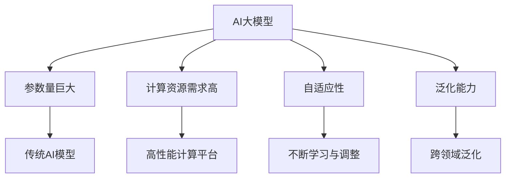

**核心算法原理讲解：**

```python
# AI大模型训练伪代码
def train_large_model(data, epochs):
    model = initialize_model(data)
    for epoch in range(epochs):
        for batch in data_loader:
            model.train_one_batch(batch)
        model.save_checkpoint(epoch)
    return model
```

##### 1.2 创业环境分析

**社会优势的定义与类型：**

**社会优势** 是指在创业过程中，企业或创业者可以利用的、具有竞争优势的资源、知识、关系和价值观。社会优势的类型包括：

1. **资源型优势：** 包括资金、人才、技术、市场等资源。
2. **知识型优势：** 包括专利、技术秘密、行业知识等。
3. **关系型优势：** 包括合作伙伴、供应商、客户等关系网络。
4. **文化型优势：** 包括企业文化、价值观、品牌形象等。

**创业环境中的社会优势：**

在创业环境中，社会优势能够为企业或创业者提供支持，帮助其克服创业过程中的各种挑战，实现创业目标。社会优势在创业中的价值主要体现在以下几个方面：

1. **资源获取：** 社会优势有助于创业者获取资金、人才、技术等资源，为创业项目的顺利开展提供支持。
2. **市场拓展：** 社会优势有助于创业者开拓市场，吸引客户，提升市场份额。
3. **合作与整合：** 社会优势有助于创业者建立合作关系，整合社会资源，实现优势互补。
4. **品牌建设：** 社会优势有助于创业者塑造企业文化、价值观和品牌形象，提升品牌知名度。

**核心概念与联系：**

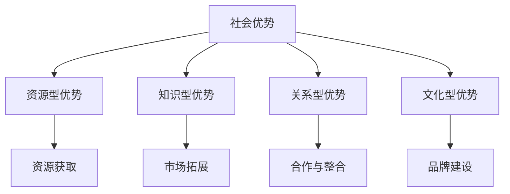

**核心算法原理讲解：**

```python
# 社会优势评估伪代码
def assess_social_advantage(advantages):
    resource_score = calculate_resource_score(advantages)
    knowledge_score = calculate_knowledge_score(advantages)
    relationship_score = calculate_relationship_score(advantages)
    culture_score = calculate_culture_score(advantages)
    total_score = resource_score + knowledge_score + relationship_score + culture_score
    return total_score
```

### 第二部分：社会优势在AI大模型创业中的应用

#### 第3章：社会优势的概念与分类

##### 3.1 社会优势的概念

**社会优势** 是指企业或创业者在其创业过程中可以利用的、具有竞争优势的资源、知识、关系和价值观。社会优势的形成与积累是一个长期的过程，需要创业者具备敏锐的市场洞察力、丰富的行业经验和广泛的社会关系。

**社会优势与创业的关系：**

社会优势在创业中发挥着重要作用，能够为创业者提供以下支持：

1. **资源获取：** 社会优势有助于创业者获取资金、人才、技术等资源，为创业项目的顺利开展提供支持。
2. **市场拓展：** 社会优势有助于创业者开拓市场，吸引客户，提升市场份额。
3. **合作与整合：** 社会优势有助于创业者建立合作关系，整合社会资源，实现优势互补。
4. **品牌建设：** 社会优势有助于创业者塑造企业文化、价值观和品牌形象，提升品牌知名度。

**社会优势的类型：**

1. **资源型优势：** 包括资金、人才、技术、市场等资源。
2. **知识型优势：** 包括专利、技术秘密、行业知识等。
3. **关系型优势：** 包括合作伙伴、供应商、客户等关系网络。
4. **文化型优势：** 包括企业文化、价值观、品牌形象等。

**核心概念与联系：**


**核心算法原理讲解：**

```python
# 社会优势评估伪代码
def assess_social_advantage(advantages):
    resource_score = calculate_resource_score(advantages)
    knowledge_score = calculate_knowledge_score(advantages)
    relationship_score = calculate_relationship_score(advantages)
    culture_score = calculate_culture_score(advantages)
    total_score = resource_score + knowledge_score + relationship_score + culture_score
    return total_score
```

##### 3.2 社会优势的分类

**资源型优势：**

资源型优势是指企业或创业者可以利用的物质资源、人力资源和技术资源。资源型优势的类型包括：

1. **资金：** 包括创业者的自有资金、投资者提供的资金等。
2. **人才：** 包括创业者自身的专业技能、团队成员的技能等。
3. **技术：** 包括专利技术、技术秘密、技术合作等。
4. **市场：** 包括客户资源、销售渠道、市场推广等。

**核心概念与联系：**

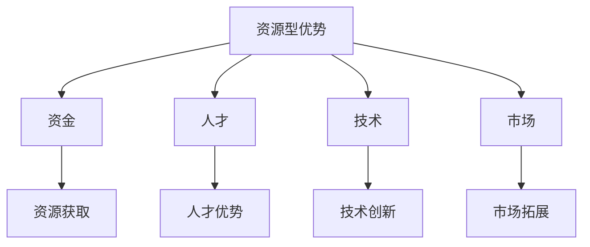

**核心算法原理讲解：**

```python
# 资源型优势评估伪代码
def assess_resource_advantage(advantages):
    funding_score = calculate_funding_score(advantages)
    talent_score = calculate_talent_score(advantages)
    technology_score = calculate_technology_score(advantages)
    market_score = calculate_market_score(advantages)
    total_score = funding_score + talent_score + technology_score + market_score
    return total_score
```

**知识型优势：**

知识型优势是指企业或创业者拥有的知识产权、行业知识和专业经验。知识型优势的类型包括：

1. **专利：** 包括企业或创业者拥有的专利技术。
2. **技术秘密：** 包括企业或创业者拥有的技术秘密和经验。
3. **行业知识：** 包括企业或创业者对行业的深入了解和认识。

**核心概念与联系：**

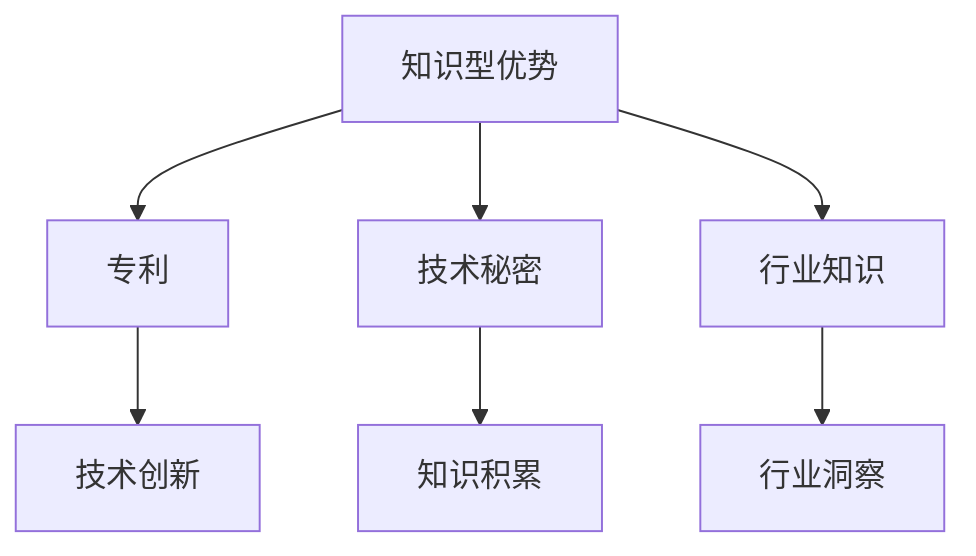

**核心算法原理讲解：**

```python
# 知识型优势评估伪代码
def assess_knowledge_advantage(advantages):
    patent_score = calculate_patent_score(advantages)
    technology_secret_score = calculate_technology_secret_score(advantages)
    industry_knowledge_score = calculate_industry_knowledge_score(advantages)
    total_score = patent_score + technology_secret_score + industry_knowledge_score
    return total_score
```

**关系型优势：**

关系型优势是指企业或创业者建立和维持的合作伙伴、供应商和客户关系。关系型优势的类型包括：

1. **合作伙伴：** 包括企业或创业者与其他企业的合作关系。
2. **供应商：** 包括企业或创业者的供应商网络。
3. **客户：** 包括企业或创业者的客户资源。

**核心概念与联系：**

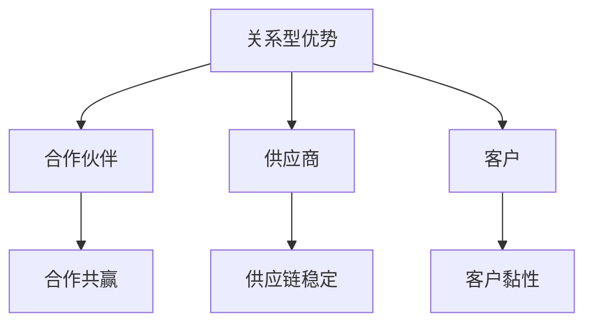

**核心算法原理讲解：**

```python
# 关系型优势评估伪代码
def assess_relationship_advantage(advantages):
    partner_score = calculate_partner_score(advantages)
    supplier_score = calculate_supplier_score(advantages)
    customer_score = calculate_customer_score(advantages)
    total_score = partner_score + supplier_score + customer_score
    return total_score
```

**文化型优势：**

文化型优势是指企业或创业者所拥有的企业文化、价值观和品牌形象。文化型优势的类型包括：

1. **企业文化：** 包括企业或创业者的文化理念、价值观和行为规范。
2. **价值观：** 包括企业或创业者的核心价值和行为准则。
3. **品牌形象：** 包括企业或创业者的品牌知名度、美誉度和市场影响力。

**核心概念与联系：**

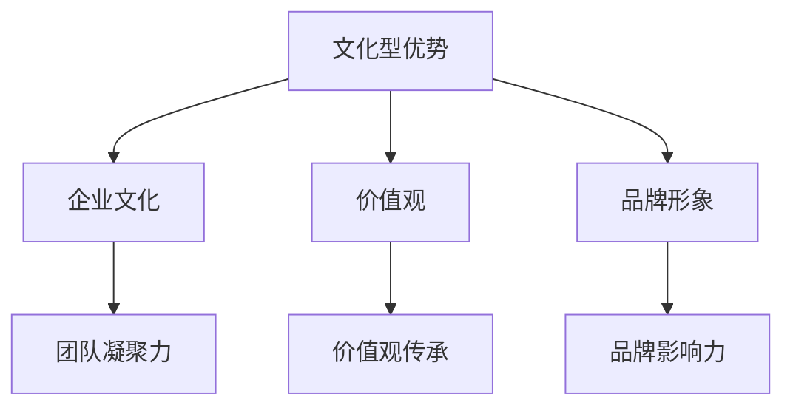

**核心算法原理讲解：**

```python
# 文化型优势评估伪代码
def assess_culture_advantage(advantages):
    culture_score = calculate_culture_score(advantages)
    value_score = calculate_value_score(advantages)
    brand_score = calculate_brand_score(advantages)
    total_score = culture_score + value_score + brand_score
    return total_score
```

### 第三部分：社会优势在AI大模型创业中的案例研究

#### 第5章：社会优势在AI大模型创业中的案例研究

##### 5.1 案例一：利用社会优势打造AI教育平台

**案例背景与目标：**

随着人工智能技术的快速发展，AI教育平台成为了一个热门的市场。某创业团队希望通过利用社会优势，打造一个具有竞争力的AI教育平台，为广大学子提供高质量的AI教育服务。

**社会优势的利用：**

1. **资源型优势：** 创业团队通过与知名高校和科研机构合作，获取了丰富的技术资源和人才资源。此外，团队还获得了风险投资公司的资金支持，为平台的开发提供了充足的资金保障。
2. **知识型优势：** 创业团队依托高校和科研机构的行业知识，掌握了最新的AI技术和教育理念，为平台的内容设计和教学策略提供了有力支持。
3. **关系型优势：** 创业团队通过建立与教育机构、培训机构和企业的合作关系，拓展了市场渠道，吸引了大量用户。
4. **文化型优势：** 创业团队秉承“让AI教育更简单、更高效”的价值观，打造了一个具有鲜明文化特色的教育平台。

**创业成果与经验总结：**

通过充分利用社会优势，创业团队成功打造了一个具有竞争力的AI教育平台。平台上线后，受到了广大用户的欢迎，用户数量和市场份额持续增长。创业团队的经验表明，社会优势的充分利用是AI大模型创业成功的关键因素之一。

**核心概念与联系：**

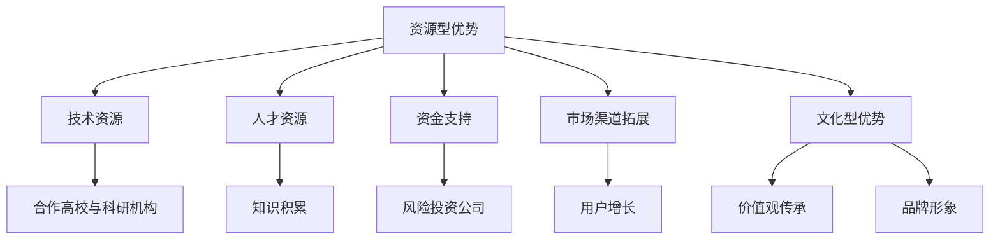

**核心算法原理讲解：**

```python
# 资源型优势利用伪代码
def utilize_resource_advantage(advantages):
    technology_resource_score = calculate_technology_resource_score(advantages)
    talent_resource_score = calculate_talent_resource_score(advantages)
    funding_support_score = calculate_funding_support_score(advantages)
    market_channel_score = calculate_market_channel_score(advantages)
    culture_advantage_score = calculate_culture_advantage_score(advantages)
    total_score = technology_resource_score + talent_resource_score + funding_support_score + market_channel_score + culture_advantage_score
    return total_score
```

##### 5.2 案例二：通过社会关系构建AI医疗网络

**案例背景与目标：**

随着人工智能技术的应用逐渐深入医疗领域，AI医疗网络成为了一个备受关注的市场。某创业团队希望通过利用社会关系，构建一个具有广泛影响力的AI医疗网络，为患者提供高质量的医疗服务。

**社会关系的利用：**

1. **合作伙伴关系：** 创业团队通过与多家医疗机构、医疗设备厂商和第三方服务提供商建立合作关系，构建了一个广泛的AI医疗网络。
2. **供应商关系：** 创业团队通过与医疗设备厂商建立稳定的供应商关系，确保了AI医疗网络的硬件设备质量和供应。
3. **客户关系：** 创业团队通过与患者建立良好的客户关系，吸引了大量患者使用AI医疗网络的服务。
4. **行业关系：** 创业团队通过积极参与行业会议、论坛等活动，扩大了行业影响力，提高了品牌知名度。

**创业成果与经验总结：**

通过充分利用社会关系，创业团队成功构建了一个具有广泛影响力的AI医疗网络。平台上线后，受到了广大患者和医疗机构的认可，用户数量和市场份额持续增长。创业团队的经验表明，社会关系的充分利用是AI大模型创业成功的关键因素之一。

**核心概念与联系：**

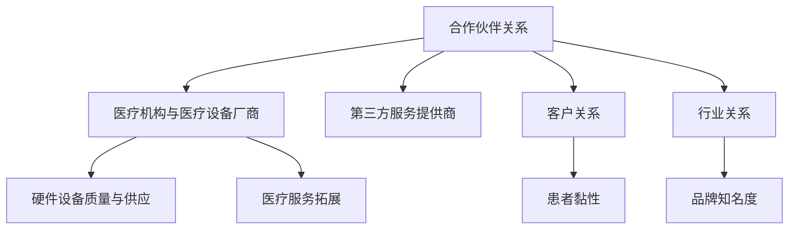

**核心算法原理讲解：**

```python
# 社会关系利用伪代码
def utilize_relationship_advantage(relationships):
    partner_relationship_score = calculate_partner_relationship_score(relationships)
    supplier_relationship_score = calculate_supplier_relationship_score(relationships)
    customer_relationship_score = calculate_customer_relationship_score(relationships)
    industry_relationship_score = calculate_industry_relationship_score(relationships)
    total_score = partner_relationship_score + supplier_relationship_score + customer_relationship_score + industry_relationship_score
    return total_score
```

##### 5.3 案例三：以文化型优势推动AI文化创意产业

**案例背景与目标：**

随着人工智能技术的应用逐渐深入文化创意产业，AI文化创意产业成为了一个新兴的市场。某创业团队希望通过利用文化型优势，推动AI文化创意产业的发展，为文化产业带来新的活力。

**文化型优势的利用：**

1. **企业文化：** 创业团队以“创新、协作、共赢”为核心价值观，打造了一个具有鲜明文化特色的企业。企业文化的传承和发扬为团队凝聚力和创新力提供了有力支持。
2. **品牌形象：** 创业团队通过精准的品牌定位和有效的市场推广，建立了良好的品牌形象，提高了品牌知名度和美誉度。
3. **行业知识：** 创业团队依托对文化创意产业的深入了解和行业资源，开发了具有创新性和实用性的AI文化创意产品。
4. **价值观传承：** 创业团队通过员工培训和文化活动，将企业文化价值观传承给团队成员，形成了良好的团队氛围。

**创业成果与经验总结：**

通过充分利用文化型优势，创业团队成功推动了AI文化创意产业的发展。平台上线后，受到了广大文化产业从业者和消费者的认可，用户数量和市场份额持续增长。创业团队的经验表明，文化型优势的充分利用是AI大模型创业成功的关键因素之一。

**核心概念与联系：**

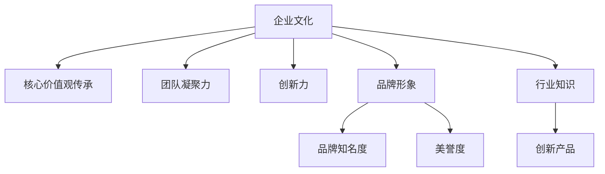

**核心算法原理讲解：**

```python
# 文化型优势利用伪代码
def utilize_culture_advantage(culture):
    culture_score = calculate_culture_score(culture)
    core_value_score = calculate_core_value_score(culture)
    brand_score = calculate_brand_score(culture)
    industry_knowledge_score = calculate_industry_knowledge_score(culture)
    total_score = culture_score + core_value_score + brand_score + industry_knowledge_score
    return total_score
```

### 第四部分：AI大模型创业的法律与伦理问题

#### 第6章：AI大模型创业的法律问题

##### 6.1 法律监管框架

**数据保护法律：**

- **《通用数据保护条例》（GDPR）：** GDPR是欧盟制定的关于数据保护的法律，对个人数据的收集、处理和使用进行了严格规定。创业者在进行AI大模型创业时，必须遵守GDPR的相关规定，确保用户数据的安全和隐私。
- **《加州消费者隐私法案》（CCPA）：** CCPA是加利福尼亚州制定的关于消费者隐私的法律，要求企业公开其收集、使用和共享消费者数据的方式，并赋予消费者对其数据的控制权。

**人工智能伦理规范：**

- **《人工智能伦理规范》：** 各国政府和研究机构制定了一系列人工智能伦理规范，旨在确保人工智能技术的安全、公正和可持续发展。创业者在进行AI大模型创业时，应遵守相关伦理规范，避免滥用人工智能技术。

**知识产权保护：**

- **专利保护：** 创业者应申请专利保护其AI大模型的技术和算法，确保技术成果不被侵犯。
- **著作权保护：** 创业者应对其AI大模型软件的源代码和文档进行著作权保护，防止他人非法复制和使用。

**商业秘密保护：**

- 创业者应采取有效措施保护其AI大模型的核心算法、数据和模型，防止商业秘密泄露。

**核心概念与联系：**

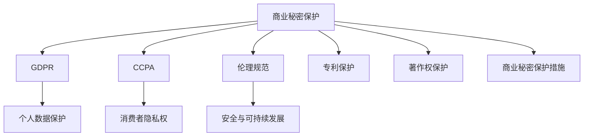

**核心算法原理讲解：**

```python
# 法律监管框架评估伪代码
def assess_legal_framework(frame):
    data_protection_score = calculate_data_protection_score(frame)
    ai_ethics_score = calculate_ai_ethics_score(frame)
    intellectual_property_score = calculate_intellectual_property_score(frame)
    business_secret_score = calculate_business_secret_score(frame)
    total_score = data_protection_score + ai_ethics_score + intellectual_property_score + business_secret_score
    return total_score
```

##### 6.2 法律风险的识别与应对

**数据隐私风险：**

- **识别方法：** 通过分析数据收集、存储、处理和传输过程中的潜在隐私泄露风险，如数据泄露、数据滥用等。
- **应对措施：** 强化数据保护措施，如加密、访问控制、匿名化等，确保用户数据的安全。

**人工智能侵权风险：**

- **识别方法：** 通过分析AI大模型在开发、部署和使用过程中可能侵犯的知识产权，如专利、著作权等。
- **应对措施：** 通过申请专利保护、签订知识产权许可协议等方式，确保AI大模型不侵犯他人知识产权。

**知识产权纠纷风险：**

- **识别方法：** 通过分析AI大模型在开发、部署和使用过程中可能引发的知识产权纠纷，如专利侵权、著作权侵权等。
- **应对措施：** 通过法律咨询、知识产权诉讼等方式，解决知识产权纠纷。

**合同法律风险：**

- **识别方法：** 通过分析合同条款，识别可能存在的合同法律风险，如合同无效、违约责任等。
- **应对措施：** 通过合同审核、风险控制等方式，降低合同法律风险。

**核心概念与联系：**

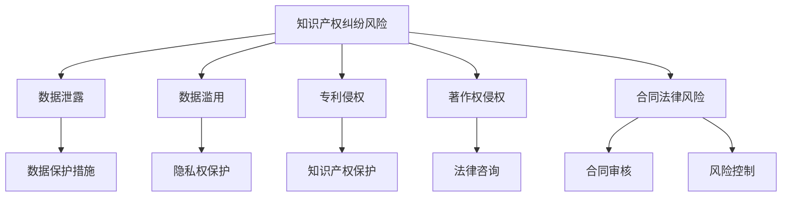

**核心算法原理讲解：**

```python
# 法律风险识别与应对伪代码
def identify_and_handle_legal_risks(risks):
    data_privacy_risks = identify_data_privacy_risks(risks)
    ai_infringement_risks = identify_ai_infringement_risks(risks)
    intellectual_property_risks = identify_intellectual_property_risks(risks)
    contract_legal_risks = identify_contract_legal_risks(risks)
    data_privacy_measures = handle_data_privacy_risks(data_privacy_risks)
    ai_infringement_measures = handle_ai_infringement_risks(ai_infringement_risks)
    intellectual_property_measures = handle_intellectual_property_risks(intellectual_property_risks)
    contract_legal_measures = handle_contract_legal_risks(contract_legal_risks)
    return data_privacy_measures, ai_infringement_measures, intellectual_property_measures, contract_legal_measures
```

### 第五部分：AI大模型创业的伦理问题

#### 第7章：AI大模型创业的伦理问题

##### 7.1 伦理问题概述

**伦理问题定义与类型：**

伦理问题是指在AI大模型创业过程中，可能涉及到的道德和价值观方面的争议和挑战。伦理问题的类型包括：

1. **数据伦理：** 涉及数据收集、处理和使用过程中的道德问题，如隐私保护、数据滥用等。
2. **AI决策伦理：** 涉及AI大模型在决策过程中可能出现的伦理问题，如歧视、偏见等。
3. **社会责任伦理：** 涉及AI大模型创业者在推动技术创新和社会进步过程中应承担的社会责任，如公平性、透明度等。

**创业中的伦理考量：**

在AI大模型创业过程中，伦理考量主要体现在以下几个方面：

1. **数据伦理：** 创业者应确保用户数据的安全和隐私，遵循数据伦理规范，避免数据滥用。
2. **AI决策伦理：** 创业者应确保AI大模型在决策过程中遵循公正、透明和可解释的原则，避免歧视和偏见。
3. **社会责任伦理：** 创业者应关注AI大模型对社会的影响，积极承担社会责任，推动技术创新与社会进步的协调发展。

**核心概念与联系：**

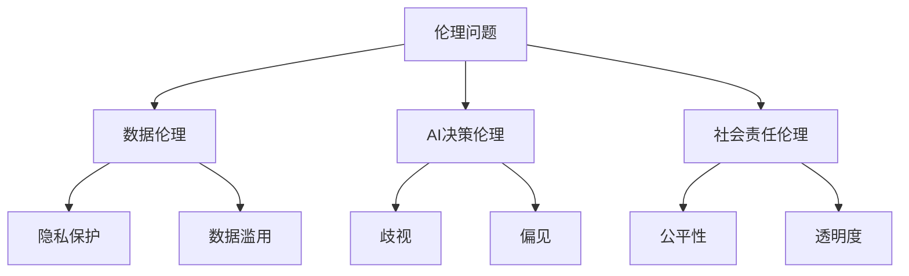

**核心算法原理讲解：**

```python
# 伦理问题评估伪代码
def assess_ethical_issues(issues):
    data_ethics_score = calculate_data_ethics_score(issues)
    ai_decision_score = calculate_ai_decision_score(issues)
    social_responsibility_score = calculate_social_responsibility_score(issues)
    total_score = data_ethics_score + ai_decision_score + social_responsibility_score
    return total_score
```

##### 7.2 伦理决策框架

**伦理决策原则：**

在AI大模型创业过程中，伦理决策应遵循以下原则：

1. **公正性：** 确保AI大模型在决策过程中不歧视、不偏见，公平对待所有用户。
2. **透明度：** 确保AI大模型的决策过程和算法透明，用户能够了解和监督模型的行为。
3. **可解释性：** 确保AI大模型在决策过程中具有可解释性，用户能够理解模型为何做出特定决策。
4. **责任归属：** 明确AI大模型创业者在伦理决策中的责任，确保在出现伦理问题时能够追溯和承担责任。

**伦理决策过程：**

伦理决策过程包括以下几个步骤：

1. **识别伦理问题：** 分析AI大模型创业过程中可能出现的伦理问题。
2. **评估伦理风险：** 对识别出的伦理问题进行评估，确定其严重程度和影响范围。
3. **制定伦理准则：** 根据伦理决策原则，制定相应的伦理准则和规范。
4. **实施伦理准则：** 在AI大模型开发、部署和使用过程中，严格执行伦理准则和规范。
5. **监督与反馈：** 对AI大模型创业过程中的伦理决策进行监督和反馈，及时调整和优化伦理准则。

**核心概念与联系：**

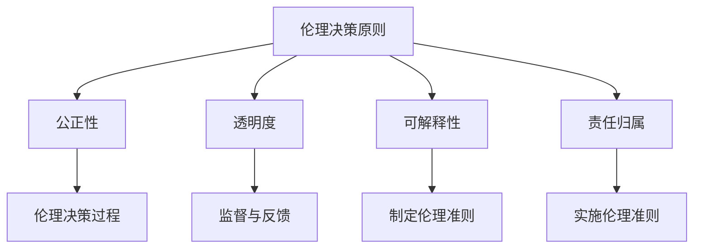

**核心算法原理讲解：**

```python
# 伦理决策框架伪代码
def ethical_decision_framework(issues):
    identify_ethical_issues = identify_ethical_issues(issues)
    assess_ethical_risks = assess_ethical_risks(issues)
    define_ethical_guidelines = define_ethical_guidelines(issues)
    implement_ethical_guidelines = implement_ethical_guidelines(issues)
    monitor_and_feedback = monitor_and_feedback(issues)
    return monitor_and_feedback
```

##### 7.3 伦理问题的实践案例

**数据伦理案例：**

**案例背景：**

某创业公司开发了一款基于AI大模型的推荐系统，用于向用户推荐个性化商品。然而，在数据收集和处理过程中，公司发现用户数据存在泄露风险。

**伦理考量：**

1. **隐私保护：** 公司应确保用户数据的安全和隐私，避免数据泄露。
2. **数据匿名化：** 公司应对用户数据进行匿名化处理，确保用户隐私不受侵犯。
3. **用户知情权：** 公司应告知用户数据收集、处理和使用的目的，尊重用户的知情权和选择权。

**解决方案：**

1. **数据加密：** 对用户数据进行加密处理，确保数据在传输和存储过程中的安全性。
2. **数据匿名化：** 对用户数据进行匿名化处理，去除个人身份信息，降低隐私泄露风险。
3. **用户隐私政策：** 制定详细的用户隐私政策，告知用户数据收集、处理和使用的目的，并获得用户的同意。

**核心概念与联系：**

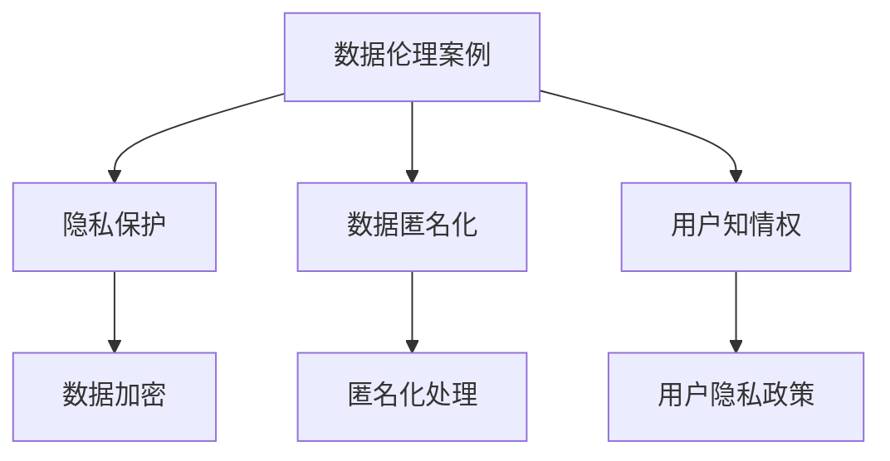

**核心算法原理讲解：**

```python
# 数据伦理案例解决方案伪代码
def solve_data_ethics_case(case):
    data_encryption = encrypt_data(case)
    data_anonymization = anonymize_data(case)
    user_privacy_policy = create_user_privacy_policy(case)
    return data_encryption, data_anonymization, user_privacy_policy
```

**AI决策伦理案例：**

**案例背景：**

某创业公司开发了一款AI大模型，用于招聘求职者。然而，在模型训练和测试过程中，公司发现模型存在性别歧视问题。

**伦理考量：**

1. **性别平等：** AI大模型应确保性别平等，避免性别歧视。
2. **算法透明：** AI大模型应具有可解释性，用户能够理解模型决策过程。
3. **偏见纠正：** 公司应采取措施纠正模型中的偏见，确保公平招聘。

**解决方案：**

1. **性别平衡数据集：** 在模型训练过程中，使用性别平衡的数据集，确保模型不会受到性别偏见的影响。
2. **算法可解释性：** 开发可解释性算法，让用户能够理解模型决策过程，提高透明度。
3. **偏见纠正：** 通过算法优化和数据清洗等方式，纠正模型中的偏见，确保公平招聘。

**核心概念与联系：**

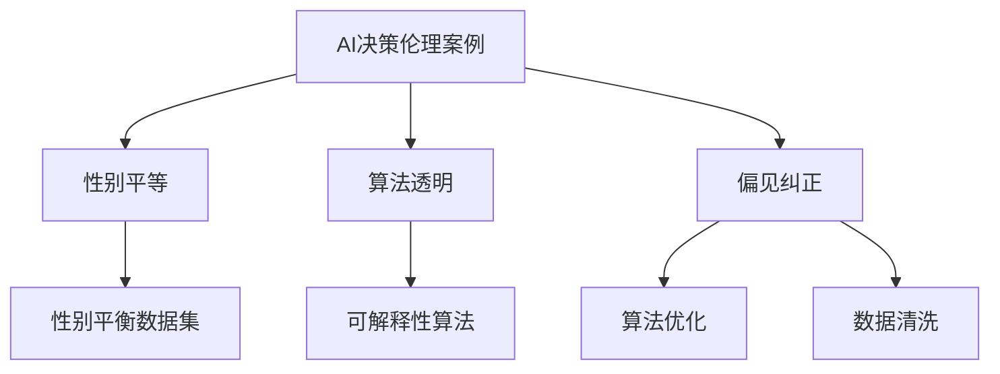

**核心算法原理讲解：**

```python
# AI决策伦理案例解决方案伪代码
def solve_ai_decision_ethics_case(case):
    balanced_dataset = create_gender_balanced_dataset(case)
    explainable_algorithm = develop_explainable_algorithm(case)
    bias_correction = correct_bias_in_algorithm(case)
    return balanced_dataset, explainable_algorithm, bias_correction
```

**社会责任伦理案例：**

**案例背景：**

某创业公司开发了一款AI大模型，用于环保监测。然而，在推广和使用过程中，公司发现该模型在部分地区的表现不佳，未能有效监测到环境污染问题。

**伦理考量：**

1. **社会责任：** 公司应关注AI大模型对社会的影响，确保其能够为社会带来积极影响。
2. **公平性：** AI大模型应确保在不同地区和群体中的公平性，避免出现偏见和歧视。
3. **持续改进：** 公司应持续改进AI大模型，提高其在不同地区的表现，确保环保监测的准确性。

**解决方案：**

1. **数据收集：** 收集更多具有代表性的数据，提高模型在不同地区的准确性。
2. **算法优化：** 优化模型算法，提高其在不同环境下的适应性和准确性。
3. **用户培训：** 对用户进行培训，提高其对AI大模型的使用和理解，确保模型得到有效应用。

**核心概念与联系：**

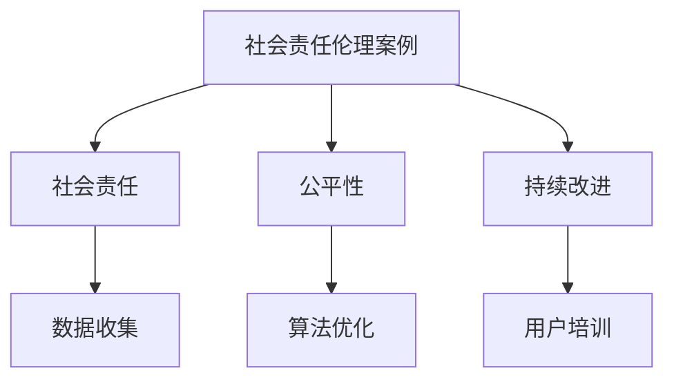

**核心算法原理讲解：**

```python
# 社会责任伦理案例解决方案伪代码
def solve_social_responsibility_ethics_case(case):
    collect_additional_data = collect_representative_data(case)
    optimize_algorithm = improve_algorithm准确性(case)
    user_training = provide_user_training(case)
    return collect_additional_data, optimize_algorithm, user_training
```

### 第六部分：AI大模型创业的未来趋势

#### 第8章：AI大模型创业的未来趋势

##### 8.1 AI大模型创业的发展方向

**新兴技术的应用：**

随着人工智能技术的不断发展，AI大模型创业将在新兴技术的推动下向更高层次发展。以下是一些新兴技术的应用方向：

1. **量子计算：** 量子计算具有强大的计算能力，将有助于AI大模型的训练和推理过程，提高其性能和效率。
2. **边缘计算：** 边缘计算将AI大模型部署到边缘设备上，实现实时数据处理和智能决策，降低对中心服务器的依赖。
3. **区块链：** 区块链技术可以为AI大模型提供透明、可信的数据共享和协同计算环境，提高数据安全和隐私保护。

**行业应用的拓展：**

AI大模型将在各个行业得到广泛应用，推动行业智能化升级。以下是一些行业应用的拓展方向：

1. **医疗健康：** AI大模型将应用于医疗诊断、疾病预测、个性化治疗等领域，提升医疗服务质量和效率。
2. **智能制造：** AI大模型将应用于智能生产、质量管理、供应链优化等领域，提高制造业的智能化水平。
3. **智慧城市：** AI大模型将应用于城市治理、交通管理、环境保护等领域，提升城市智能化水平。

**创业模式的创新：**

随着技术的进步和市场的变化，AI大模型创业模式将不断创新，以适应新的发展需求。以下是一些创业模式的创新方向：

1. **平台化发展：** 创业公司将构建AI大模型平台，提供全方位的AI服务，吸引更多合作伙伴加入生态圈。
2. **垂直领域深耕：** 创业公司将专注于某个垂直领域，通过深入了解行业需求和痛点，提供定制化的AI解决方案。
3. **跨界融合：** 创业公司将跨界合作，融合不同领域的优势，实现跨领域创新和业务拓展。

**核心概念与联系：**

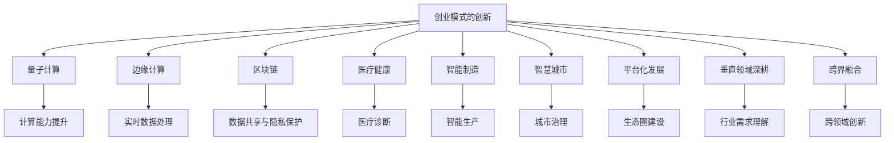

**核心算法原理讲解：**

```python
# 未来趋势分析伪代码
def analyze_future_trends(trends):
    quantum_computing_score = calculate_quantum_computing_score(trends)
    edge_computing_score = calculate_edge_computing_score(trends)
    blockchain_score = calculate_blockchain_score(trends)
    industry_application_score = calculate_industry_application_score(trends)
    business_model_innovation_score = calculate_business_model_innovation_score(trends)
    total_score = quantum_computing_score + edge_computing_score + blockchain_score + industry_application_score + business_model_innovation_score
    return total_score
```

##### 8.2 社会优势的未来趋势

**社会资源整合的深化：**

随着AI大模型创业的发展，社会资源整合将逐步深化。以下是一些未来趋势：

1. **跨领域合作：** 企业将通过跨领域合作，整合不同领域的资源，实现优势互补，提高整体竞争力。
2. **资源共享平台：** 企业将建立资源共享平台，实现资源的高效利用，降低创业成本，提升创业成功率。
3. **生态体系建设：** 企业将构建生态系统，吸引更多合作伙伴加入，形成良性循环，推动整个行业的发展。

**社会关系的网络化：**

随着社交网络的普及，社会关系将逐步网络化。以下是一些未来趋势：

1. **在线社交平台：** 企业将通过在线社交平台，拓展社会关系网络，提高信息传播速度和范围。
2. **社交数据分析：** 企业将利用社交数据分析技术，挖掘潜在的商业机会，优化商业决策。
3. **社交价值评估：** 企业将建立社交价值评估体系，对合作伙伴的社交价值进行量化评估，提高合作效率。

**文化型优势的强化：**

随着社会进步和市场竞争的加剧，文化型优势将得到强化。以下是一些未来趋势：

1. **企业文化传承：** 企业将加强企业文化传承，培养员工的归属感和忠诚度，提高团队凝聚力。
2. **品牌形象塑造：** 企业将注重品牌形象塑造，提高品牌知名度和美誉度，提升市场竞争力。
3. **社会责任担当：** 企业将积极履行社会责任，关注社会问题，推动技术创新与社会进步的协调发展。

**核心概念与联系：**

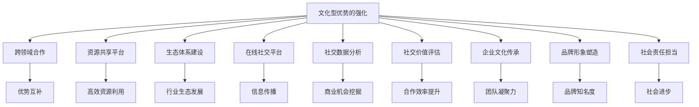

**核心算法原理讲解：**

```python
# 社会优势未来趋势分析伪代码
def analyze_social_advantage_trends(trends):
    resource_integration_score = calculate_resource_integration_score(trends)
    social_relationship_networking_score = calculate_social_relationship_networking_score(trends)
    cultural_advantage_enhancement_score = calculate_cultural_advantage_enhancement_score(trends)
    total_score = resource_integration_score + social_relationship_networking_score + cultural_advantage_enhancement_score
    return total_score
```

##### 8.3 AI大模型创业的未来挑战与机遇

**技术进步带来的机遇：**

随着人工智能技术的不断进步，AI大模型创业将面临更多机遇。以下是一些未来机遇：

1. **算法优化：** 随着算法的优化，AI大模型的性能将进一步提高，为创业公司提供更多创新机会。
2. **应用拓展：** 随着AI大模型在各个行业的应用拓展，创业公司将有机会开发出更多具有商业价值的AI应用。
3. **技术创新：** 随着技术的不断突破，创业公司将有机会引领行业创新，推动整个行业的发展。

**社会变革带来的挑战：**

随着社会的不断变革，AI大模型创业将面临更多挑战。以下是一些未来挑战：

1. **数据隐私：** 随着数据隐私问题的日益突出，创业公司需要采取更加严格的数据保护措施，确保用户隐私。
2. **伦理问题：** 随着AI大模型的应用越来越广泛，伦理问题将变得更加突出，创业公司需要关注和解决伦理问题。
3. **市场竞争：** 随着市场参与者不断增加，创业公司需要提高自身竞争力，应对激烈的市场竞争。

**核心概念与联系：**

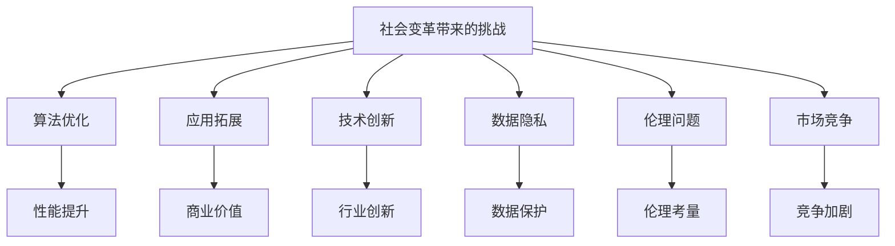

**核心算法原理讲解：**

```python
# 未来挑战与机遇分析伪代码
def analyze_future_challenges_and_opportunities(challenges, opportunities):
    technology_progress_score = calculate_technology_progress_score(opportunities)
    social_change_score = calculate_social_change_score(challenges)
    total_score = technology_progress_score + social_change_score
    return total_score
```

### 附录：AI大模型创业资源指南

#### A.1 AI大模型开发工具与资源

**主流框架介绍：**

- **TensorFlow：** TensorFlow是谷歌开发的一款开源机器学习框架，支持各种深度学习模型的开发。
- **PyTorch：** PyTorch是Facebook开发的一款开源机器学习框架，以其灵活性和易用性受到广泛关注。

**开发环境搭建指南：**

1. **安装Python环境：** 在开发AI大模型之前，需要安装Python环境和相关依赖库。
2. **配置GPU支持：** 对于需要高性能计算的AI大模型，需要配置GPU支持，以提高训练和推理速度。
3. **安装深度学习框架：** 根据项目需求，选择合适的深度学习框架并安装。

**开源项目与社区资源：**

- **GitHub：** GitHub上有很多优秀的AI开源项目，供开发者学习和参考。
- **深度学习社区：** 如CSDN、知乎等，开发者可以在这里找到丰富的技术资源和交流机会。

**核心概念与联系：**

```mermaid
graph TD
A[主流框架介绍] --> B[TensorFlow]
A --> C[PyTorch]
B --> D[开源项目]
C --> E[社区资源]
D --> F[GitHub]
E --> G[CSDN]
E --> H[知乎]
```

**核心算法原理讲解：**

```python
# 开发环境搭建伪代码
def setup_development_environment():
    install_python_environment()
    configure_gpu_support()
    install_deep_learning_framework()
    return "Development environment setup completed."
```

#### A.2 创业支持资源

**创业基金与投资渠道：**

- **政府创业基金：** 各国政府为创业者提供了多种创业基金，支持创业项目的启动和发展。
- **风险投资公司：** 风险投资公司为创业者提供了资金支持和创业咨询服务。

**创业培训与咨询服务：**

- **创业培训：** 创业者可以参加各种创业培训课程，提高创业技能和知识水平。
- **咨询服务：** 专业咨询师为创业者提供创业指导和建议，帮助创业者解决问题。

**行业协会与交流平台：**

- **行业协会：** 行业协会为创业者提供行业信息、政策解读和交流机会。
- **创业交流平台：** 如创业咖啡馆、创业论坛等，为创业者提供交流和合作机会。

**核心概念与联系：**

```mermaid
graph TD
A[创业基金与投资渠道] --> B[政府创业基金]
A --> C[风险投资公司]
B --> D[创业培训]
C --> E[咨询服务]
D --> F[行业协会]
E --> G[交流平台]
```

**核心算法原理讲解：**

```python
# 创业支持资源利用伪代码
def utilize_business_support_resources(resources):
    government_funding_score = calculate_government_funding_score(resources)
    venture_capital_score = calculate_venture_capital_score(resources)
    entrepreneurship_training_score = calculate_entrepreneurship_training_score(resources)
    industry_association_score = calculate_industry_association_score(resources)
    business_exchange_platform_score = calculate_business_exchange_platform_score(resources)
    total_score = government_funding_score + venture_capital_score + entrepreneurship_training_score + industry_association_score + business_exchange_platform_score
    return total_score
```

#### A.3 法律与伦理资源

**法律法规查询与解读：**

- **法律法规查询：** 创业者可以通过政府网站、法律数据库等渠道查询相关法律法规。
- **法律法规解读：** 创业者可以请教专业律师，对相关法律法规进行解读，确保合规经营。

**伦理指南与案例分析：**

- **伦理指南：** 创业者可以参考行业伦理规范，制定符合自身发展的伦理准则。
- **案例分析：** 创业者可以通过分析成功和失败的伦理案例，吸取经验教训，提高伦理决策能力。

**专业咨询服务：**

- **法律咨询服务：** 创业者可以咨询专业律师，解决法律纠纷和合规问题。
- **伦理咨询服务：** 创业者可以咨询伦理专家，解决伦理问题和道德困境。

**核心概念与联系：**

```mermaid
graph TD
A[法律法规查询与解读] --> B[法律法规查询]
A --> C[法律法规解读]
A[伦理指南与案例分析] --> D[伦理指南]
A --> E[案例分析]
A[专业咨询服务] --> F[法律咨询服务]
A --> G[伦理咨询服务]
```

**核心算法原理讲解：**

```python
# 法律与伦理资源利用伪代码
def utilize_legal_and_ethical_resources(resources):
    legal_query_score = calculate_legal_query_score(resources)
    legal_interpretation_score = calculate_legal_interpretation_score(resources)
    ethical_guidelines_score = calculate_ethical_guidelines_score(resources)
    case_analysis_score = calculate_case_analysis_score(resources)
    legal_consultation_score = calculate_legal_consultation_score(resources)
    ethical_consultation_score = calculate_ethical_consultation_score(resources)
    total_score = legal_query_score + legal_interpretation_score + ethical_guidelines_score + case_analysis_score + legal_consultation_score + ethical_consultation_score
    return total_score
```

### 作者信息

作者：AI天才研究院/AI Genius Institute & 禅与计算机程序设计艺术 /Zen And The Art of Computer Programming

