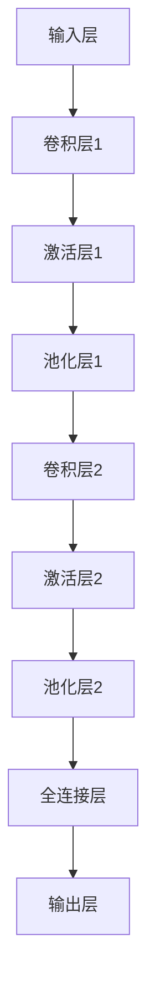
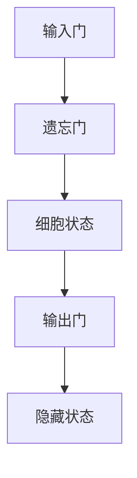
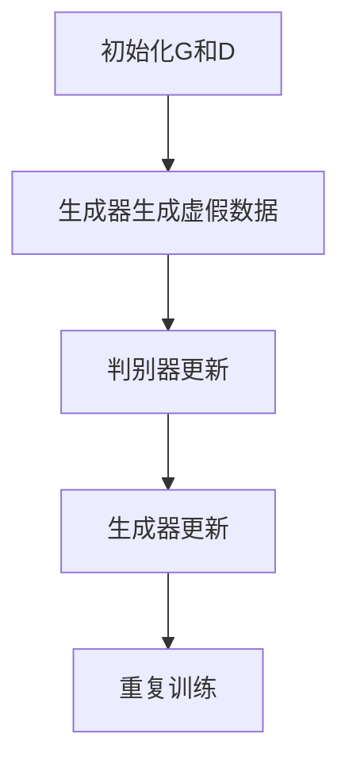

                 

### 文章标题

# AI 大模型创业：如何利用管理优势？

### 关键词

- AI大模型
- 创业管理
- 团队构建
- 资源管理
- 风险管理
- 创业案例分析

### 摘要

本文旨在探讨AI大模型创业中如何有效利用管理优势。通过对AI大模型的基础概念、核心算法及其在管理中的应用进行深入剖析，结合创业实战案例，文章提出了一系列管理策略和方法，包括团队构建、资源管理、市场定位与推广、风险管理等。通过这些策略，创业者可以在竞争激烈的AI市场中找到立足点，实现企业的可持续发展。

### 目录大纲

---

## 第一部分：AI大模型基础

### 第1章：AI大模型概述

#### 1.1 AI大模型的发展背景与重要性

#### 1.2 AI大模型的基本原理

#### 1.3 AI大模型的架构与类型

### 第2章：AI大模型核心算法

#### 2.1 卷积神经网络（CNN）原理

#### 2.2 递归神经网络（RNN）与长短期记忆（LSTM）算法

#### 2.3 生成对抗网络（GAN）原理

### 第3章：AI大模型在管理中的应用

#### 3.1 AI大模型在人力资源中的应用

#### 3.2 AI大模型在供应链管理中的应用

#### 3.3 AI大模型在客户关系管理中的应用

### 第4章：AI大模型创业案例分析

#### 4.1 成功案例分析

#### 4.2 失败案例分析

#### 4.3 案例总结与启示

## 第二部分：管理优势在AI大模型创业中的应用

### 第5章：团队构建与管理

#### 5.1 团队构建原则

#### 5.2 团队管理策略

#### 5.3 团队协作工具与平台

### 第6章：资源管理

#### 6.1 资金管理

#### 6.2 技术资源管理

#### 6.3 数据资源管理

### 第7章：市场定位与推广

#### 7.1 产品市场定位

#### 7.2 市场推广策略

#### 7.3 品牌建设与传播

### 第8章：风险管理

#### 8.1 风险识别与评估

#### 8.2 风险应对策略

#### 8.3 风险管理案例分析

## 第三部分：实战篇

### 第9章：创业准备与规划

#### 9.1 创业准备工作

#### 9.2 创业规划与策略

#### 9.3 创业环境分析与选择

### 第10章：项目实施与运营

#### 10.1 项目实施流程

#### 10.2 项目运营管理

#### 10.3 项目监控与评估

### 第11章：AI大模型创业实践

#### 11.1 实践案例一：某公司AI大模型应用实践

#### 11.2 实践案例二：某公司AI大模型创业经历

#### 11.3 实践总结与展望

## 附录

### 附录 A：AI大模型开发工具与资源

#### A.1 主流深度学习框架

#### A.2 开发环境搭建与配置

#### A.3 数据集获取与处理

### 附录 B：AI大模型创业建议与策略

#### B.1 创业成功关键因素

#### B.2 创业失败常见问题与对策

#### B.3 创业者必备素质与技能

---

## 第1章：AI大模型概述

### 1.1 AI大模型的发展背景与重要性

人工智能（AI）技术的发展经历了几个阶段，从早期的规则系统到现代的深度学习，再到如今的大型预训练模型（Large Pre-Trained Models，LPTM），这些模型具有极高的数据处理能力和强大的学习能力。AI大模型作为人工智能领域的重要成果，代表了当前技术的顶尖水平。它们在图像识别、自然语言处理、语音识别等领域的表现已经超越了人类水平。

AI大模型的发展背景主要可以归结为以下几点：

1. **数据量的爆炸性增长**：随着互联网的普及和物联网的发展，数据量呈指数级增长，为AI大模型提供了丰富的训练素材。
2. **计算能力的提升**：高性能计算技术的发展，尤其是GPU和TPU等专用硬件的普及，为训练大规模模型提供了强有力的支持。
3. **算法的进步**：深度学习技术的发展，特别是卷积神经网络（CNN）、递归神经网络（RNN）和生成对抗网络（GAN）等算法的创新，使得AI大模型能够更好地理解和模拟复杂的数据模式。

AI大模型的重要性体现在以下几个方面：

1. **商业应用**：AI大模型在金融、医疗、零售等领域的应用，大大提升了企业的运营效率和决策能力。
2. **社会服务**：AI大模型在智能客服、自动驾驶、智能医疗等领域的应用，为社会提供了更加便捷和高效的服务。
3. **技术创新**：AI大模型推动了人工智能技术的发展，促进了相关领域的研究和突破。

### 1.2 AI大模型的基本原理

AI大模型的基本原理基于深度学习和大数据分析。深度学习是一种模拟人脑神经网络的计算模型，通过多层神经元的堆叠，实现对复杂数据的处理和模式识别。AI大模型的核心是通过大规模数据训练，使模型具备强大的泛化能力和学习能力。

以下是AI大模型的基本原理：

1. **神经网络结构**：神经网络由输入层、隐藏层和输出层组成。每一层由多个神经元组成，神经元之间通过权重连接。通过调整权重，模型能够学习和优化数据特征。

2. **反向传播算法**：反向传播算法是训练神经网络的重要算法。它通过计算输出层与预期输出之间的误差，反向传播到输入层，逐层调整权重，使模型逐渐逼近最优解。

3. **大规模数据处理**：AI大模型通常需要处理海量数据。通过分布式计算和并行处理技术，可以快速训练和优化模型。

4. **模型优化与评估**：在训练过程中，模型会通过多次迭代，不断调整参数和结构，以优化性能。评估指标包括准确率、召回率、F1分数等。

### 1.3 AI大模型的架构与类型

AI大模型的架构通常包括以下几部分：

1. **输入层**：接收外部输入数据，如文本、图像、声音等。
2. **隐藏层**：对输入数据进行特征提取和转换，隐藏层可以有多层，层数越多，模型的复杂度和学习能力越强。
3. **输出层**：根据隐藏层的结果，生成输出预测或决策。

AI大模型的主要类型包括：

1. **卷积神经网络（CNN）**：适用于图像识别和图像处理，通过卷积操作提取图像特征。
2. **递归神经网络（RNN）与长短期记忆（LSTM）算法**：适用于序列数据处理，如自然语言处理和语音识别。
3. **生成对抗网络（GAN）**：通过对抗训练，实现数据的生成和风格迁移。
4. **变换器（Transformer）**：基于自注意力机制，在自然语言处理和图像生成等领域表现出色。

### 总结

本章首先介绍了AI大模型的发展背景和重要性，其次阐述了AI大模型的基本原理，最后详细介绍了AI大模型的架构与类型。理解这些基础概念和原理，对于进一步探讨AI大模型在管理中的应用具有重要意义。

### 1.4 AI大模型的发展历程

AI大模型的发展历程可以分为几个重要阶段，从最初的简单模型到现代的大型预训练模型，每一步都标志着技术的重大进步。

1. **早期神经网络（1980s）**：这一阶段以简单的单层和双层感知机（Perceptrons）为代表，神经网络的应用受到了一定的限制，因为它们无法处理非线性问题。

2. **反向传播算法（1980s-1990s）**：1986年，Rumelhart、Hinton和Williams提出了反向传播算法（Backpropagation），使得多层神经网络的训练成为可能。这一算法通过反向传播误差，逐步调整网络权重，大大提升了神经网络的训练效率和性能。

3. **深度学习（2000s）**：随着计算能力的提升和大数据技术的发展，深度学习（Deep Learning）逐渐崭露头角。卷积神经网络（CNN）和递归神经网络（RNN）等模型在这一时期取得了显著的突破。

4. **大规模预训练模型（2010s-2020s）**：2012年，AlexNet的出现标志着深度学习在图像识别任务上的重大突破。随后，Google的Inception和Facebook的ResNet等模型不断刷新纪录。特别是2018年，Google的BERT模型在自然语言处理领域取得了前所未有的成绩，标志着大规模预训练模型时代的到来。

5. **多模态AI大模型（2020s）**：随着人工智能技术的不断进步，AI大模型逐渐从单一模态（如文本、图像）扩展到多模态（文本、图像、语音），能够处理更复杂的任务和应用场景。

### 1.5 AI大模型的关键技术和创新点

AI大模型的关键技术和创新点主要集中在以下几个方面：

1. **计算资源优化**：通过分布式计算、并行处理和GPU/TPU等专用硬件的运用，大幅提升了模型训练的效率和速度。

2. **大规模数据处理**：采用数据并行（Data Parallelism）和模型并行（Model Parallelism）等技术，处理海量数据，提高模型的泛化能力。

3. **预训练和微调**：预训练（Pre-training）是一种在大量数据上进行训练，然后针对特定任务进行微调（Fine-tuning）的方法，能够大幅提高模型的性能。

4. **自监督学习（Self-Supervised Learning）**：通过无监督学习（Unsupervised Learning）技术，如 masked language model（MLM）和 masked image model（MIM），从大量未标注数据中提取有价值的信息，为模型训练提供了丰富的素材。

5. **知识蒸馏（Knowledge Distillation）**：通过将大模型的知识和经验传递给小模型，实现高效的模型压缩和部署。

6. **多模态融合**：通过结合不同模态的数据（如文本、图像、语音），构建多模态AI大模型，提高模型对复杂任务的应对能力。

### 1.6 AI大模型在工业界的应用案例

AI大模型在工业界的应用已经非常广泛，以下是一些典型的应用案例：

1. **自动驾驶**：AI大模型在自动驾驶领域有着广泛的应用，如特斯拉的Autopilot系统和Waymo的自动驾驶技术，通过深度学习和计算机视觉技术，实现车辆的自主驾驶。

2. **智能医疗**：AI大模型在医疗领域的应用包括疾病预测、诊断辅助和药物发现等。例如，IBM的Watson for Oncology系统能够通过分析大量医学文献和患者数据，提供个性化的治疗方案。

3. **金融领域**：AI大模型在金融领域的应用包括风险评估、欺诈检测和股票预测等。例如，微软的Azure Machine Learning平台提供了一系列工具，帮助金融机构进行风险管理和决策支持。

4. **零售行业**：AI大模型在零售行业的应用包括商品推荐、库存管理和客户关系管理等。例如，亚马逊的推荐系统通过深度学习技术，为用户提供个性化的购物体验。

5. **智能客服**：AI大模型在智能客服领域的应用包括语音识别、自然语言处理和情感分析等。例如，苹果的Siri和亚马逊的Alexa等智能助手，通过深度学习技术，为用户提供便捷的服务。

### 1.7 AI大模型的发展趋势和未来展望

AI大模型的发展趋势和未来展望可以从以下几个方面进行探讨：

1. **模型规模的持续增长**：随着数据量和计算能力的不断提升，AI大模型的规模将持续增长。未来可能出现的超大规模模型，将具备更强的学习能力和应用潜力。

2. **多模态融合的深入发展**：多模态AI大模型将越来越多地应用于复杂任务，如自动驾驶、智能家居和智能医疗等。多模态融合技术将使模型能够更好地理解和处理复杂信息。

3. **自动机器学习（AutoML）的崛起**：自动机器学习将自动化AI大模型的设计、训练和部署过程，降低AI开发的门槛，使更多的企业和个人能够利用AI技术。

4. **隐私保护和安全性的提升**：随着AI大模型的应用范围扩大，隐私保护和安全性的问题将越来越受到关注。未来的研究将更加注重如何在保护用户隐私的同时，发挥AI大模型的最大价值。

5. **AI伦理和社会责任**：随着AI大模型技术的不断进步，如何确保AI技术的公平性、透明性和可解释性，将成为重要的研究课题。AI伦理和社会责任将成为AI大模型未来发展的重要方向。

### 总结

本章通过对AI大模型的发展历程、关键技术和创新点以及工业界应用案例的介绍，全面阐述了AI大模型的基础知识。理解这些内容，将为后续章节中探讨AI大模型在管理中的应用以及创业策略提供坚实的基础。

## 第2章：AI大模型核心算法

### 2.1 卷积神经网络（CNN）原理

卷积神经网络（CNN）是深度学习中一种非常重要的算法，广泛应用于图像识别、图像处理和计算机视觉等领域。CNN的核心思想是通过卷积操作提取图像中的局部特征，从而实现图像的自动分类和识别。

#### 2.1.1 卷积操作

卷积操作是CNN中最基础的操作之一。它通过在输入图像上滑动一个滤波器（也称为卷积核或滤波器组），对每个局部区域进行卷积，生成新的特征图。卷积操作的数学公式可以表示为：

\[ (f * g)(x, y) = \sum_{i=0}^{h-1} \sum_{j=0}^{w-1} f(i, j) \cdot g(x-i, y-j) \]

其中，\( f \)和\( g \)分别表示卷积核和输入图像，\( (x, y) \)表示卷积操作的位置，\( h \)和\( w \)分别表示卷积核的高度和宽度。

#### 2.1.2 池化操作

池化操作是CNN中另一个重要的操作，用于降低特征图的维度，减少计算量和参数数量。常见的池化操作包括最大池化（Max Pooling）和平均池化（Average Pooling）。最大池化选取每个局部区域中的最大值，而平均池化则选取每个局部区域中的平均值。

最大池化的数学公式可以表示为：

\[ \text{Max Pooling}(x, \text{pool_size}) = \max(x) \]

其中，\( \text{pool_size} \)表示池化窗口的大小。

#### 2.1.3 CNN架构

一个典型的CNN架构通常包括以下几个部分：

1. **输入层**：接收输入图像，将其输入到网络中。
2. **卷积层**：通过卷积操作提取图像中的局部特征。
3. **激活层**：对卷积层的输出进行非线性变换，常用的激活函数包括ReLU（Rectified Linear Unit）和Sigmoid函数。
4. **池化层**：通过池化操作降低特征图的维度。
5. **全连接层**：将卷积层和池化层的输出进行全连接操作，得到最终的特征表示。
6. **输出层**：对全连接层的输出进行分类或预测。

以下是一个简单的CNN架构的Mermaid流程图：



### 2.2 递归神经网络（RNN）与长短期记忆（LSTM）算法

递归神经网络（RNN）是一种能够处理序列数据的神经网络，其核心思想是将网络的输出反馈回输入端，形成递归结构。然而，传统的RNN在处理长序列数据时存在梯度消失或梯度爆炸的问题，导致其性能受到限制。为了解决这个问题，长短期记忆（LSTM）算法被提出。

#### 2.2.1 RNN基本原理

RNN的基本架构包括输入层、隐藏层和输出层。隐藏层通过递归连接，将前一时刻的隐藏状态传递到下一时刻，用于当前时刻的输入处理。RNN的递归关系可以表示为：

\[ h_t = \text{sigmoid}(W_h \cdot [h_{t-1}, x_t] + b_h) \]
\[ o_t = \text{sigmoid}(W_o \cdot h_t + b_o) \]

其中，\( h_t \)和\( o_t \)分别表示第\( t \)时刻的隐藏状态和输出状态，\( W_h \)、\( W_o \)和\( b_h \)、\( b_o \)分别为权重和偏置。

#### 2.2.2 LSTM算法原理

LSTM算法通过引入三个门结构（输入门、遗忘门和输出门）来控制信息的流入和流出，从而解决RNN的梯度消失和梯度爆炸问题。LSTM的基本结构包括输入门、遗忘门、细胞状态和输出门。

1. **输入门**：用于控制新的输入信息如何更新细胞状态。其公式为：

\[ i_t = \text{sigmoid}(W_i \cdot [h_{t-1}, x_t] + b_i) \]

2. **遗忘门**：用于控制之前的细胞状态如何被遗忘或保留。其公式为：

\[ f_t = \text{sigmoid}(W_f \cdot [h_{t-1}, x_t] + b_f) \]

3. **细胞状态**：用于存储序列信息，其更新公式为：

\[ c_t = f_t \odot c_{t-1} + i_t \odot \text{tanh}(W_c \cdot [h_{t-1}, x_t] + b_c) \]

4. **输出门**：用于控制细胞状态如何转化为输出。其公式为：

\[ o_t = \text{sigmoid}(W_o \cdot [h_{t-1}, x_t] + b_o) \]
\[ h_t = o_t \odot \text{tanh}(c_t) \]

其中，\( \odot \)表示元素乘法，\( \text{tanh} \)表示双曲正切函数。

以下是一个简单的LSTM算法的Mermaid流程图：



### 2.3 生成对抗网络（GAN）原理

生成对抗网络（GAN）是由Ian Goodfellow等人于2014年提出的一种新型深度学习框架，其核心思想是通过生成器和判别器的对抗训练，实现数据的生成。

#### 2.3.1 GAN基本架构

GAN的基本架构包括生成器（Generator）和判别器（Discriminator）。生成器负责生成虚假数据，判别器则负责区分真实数据和生成数据。GAN的训练过程可以看作是一个零和游戏，生成器和判别器的目标是最大化对方的损失。

1. **生成器**：生成器的目标是生成尽可能真实的数据。其输入是随机噪声，输出是虚假数据。生成器的损失函数可以表示为：

\[ \text{G}(\epsilon) = \mathbb{E}_{\epsilon \sim p_{\epsilon}(x)}[\log(D(G(\epsilon)))] \]

其中，\( \epsilon \)表示随机噪声，\( G(\epsilon) \)表示生成器生成的虚假数据，\( D \)表示判别器。

2. **判别器**：判别器的目标是最大化对真实数据和生成数据的辨别能力。其输入是真实数据和生成数据，输出是概率值。判别器的损失函数可以表示为：

\[ \text{D}(x, G(\epsilon)) = \mathbb{E}_{x \sim p_{\text{data}}(x)}[\log(D(x))] + \mathbb{E}_{\epsilon \sim p_{\epsilon}(x)}[\log(1 - D(G(\epsilon)))] \]

#### 2.3.2 GAN训练过程

GAN的训练过程分为以下几个步骤：

1. **初始化生成器和判别器**：初始化生成器和判别器的参数，通常使用随机初始化。
2. **生成虚假数据**：生成器根据随机噪声生成虚假数据。
3. **判别器更新**：判别器根据真实数据和生成数据更新参数，使其能够更好地辨别真实数据和生成数据。
4. **生成器更新**：生成器根据判别器的反馈更新参数，使其生成的虚假数据更接近真实数据。

以下是一个简单的GAN训练过程的Mermaid流程图：



### 总结

本章介绍了卷积神经网络（CNN）、递归神经网络（RNN）与长短期记忆（LSTM）算法以及生成对抗网络（GAN）的核心原理。这些算法在AI大模型中扮演着重要角色，为各类复杂任务提供了强大的计算能力。通过本章的学习，读者可以更好地理解这些算法的基本原理和应用场景，为后续章节的内容打下坚实基础。

## 第3章：AI大模型在管理中的应用

### 3.1 AI大模型在人力资源中的应用

AI大模型在人力资源管理中发挥着越来越重要的作用，从招聘、员工培训到绩效评估，AI大模型都能够提供有效的解决方案。以下是AI大模型在人力资源管理中的一些具体应用：

#### 3.1.1 招聘流程优化

在招聘过程中，AI大模型可以通过分析大量的简历数据，识别出最佳候选人。具体应用包括：

1. **简历筛选**：AI大模型可以通过自然语言处理技术，对简历中的关键字和词频进行分析，筛选出符合条件的候选人。
2. **面试预测**：基于候选人的简历数据和面试表现，AI大模型可以预测候选人是否适合特定职位，从而提高面试的准确性和效率。
3. **人才推荐**：通过分析公司内部员工的绩效和技能，AI大模型可以为招聘团队提供有针对性的人才推荐。

以下是一个使用卷积神经网络（CNN）进行简历筛选的伪代码示例：

```python
def resume Screening(resume_text):
    # 将简历文本转化为向量表示
    resume_vector = preprocess_text(resume_text)
    # 使用预训练的CNN模型进行特征提取
    features = CNN_model.extract_features(resume_vector)
    # 预测简历是否符合职位要求
    prediction = CNN_model.predict(features)
    return prediction
```

#### 3.1.2 员工培训与发展

AI大模型可以帮助企业制定个性化的员工培训计划，提高员工技能和工作效率。具体应用包括：

1. **技能评估**：通过分析员工的绩效数据和工作表现，AI大模型可以评估员工的技能水平，为其提供针对性的培训建议。
2. **培训内容推荐**：基于员工的技能评估结果和职业发展需求，AI大模型可以推荐最适合的培训内容和课程。
3. **学习效果预测**：AI大模型可以通过分析员工的学习行为和成果，预测培训的有效性，帮助企业优化培训策略。

以下是一个使用长短期记忆（LSTM）算法进行技能评估的伪代码示例：

```python
def skill_evaluation(employee_data):
    # 将员工数据转化为序列表示
    employee_sequence = preprocess_data(employee_data)
    # 使用预训练的LSTM模型进行特征提取
    features = LSTM_model.extract_features(employee_sequence)
    # 预测员工技能水平
    skill_level = LSTM_model.predict(features)
    return skill_level
```

#### 3.1.3 绩效评估与激励

AI大模型可以通过分析员工的工作表现和绩效数据，提供客观、公正的绩效评估结果，同时为激励措施提供依据。具体应用包括：

1. **绩效预测**：通过分析历史绩效数据和员工行为数据，AI大模型可以预测员工的未来绩效表现。
2. **薪酬优化**：基于绩效评估结果和市场竞争情况，AI大模型可以为员工提供合理的薪酬建议，提高员工满意度和忠诚度。
3. **激励方案设计**：AI大模型可以分析员工激励效果，为企业设计更加有效的激励方案。

以下是一个使用生成对抗网络（GAN）进行绩效预测的伪代码示例：

```python
def performance_prediction(employee_data):
    # 将员工数据转化为序列表示
    employee_sequence = preprocess_data(employee_data)
    # 使用预训练的GAN模型进行特征提取和预测
    features = GAN_model.extract_features(employee_sequence)
    performance = GAN_model.predict(features)
    return performance
```

### 3.2 AI大模型在供应链管理中的应用

供应链管理是企业运营的核心环节，涉及到多个部门和合作伙伴的协作。AI大模型通过数据分析和预测，能够显著提升供应链管理的效率和灵活性。以下是AI大模型在供应链管理中的一些具体应用：

#### 3.2.1 库存管理优化

库存管理是供应链管理中的一个重要问题，涉及到库存水平、库存周转率和库存成本等关键指标。AI大模型可以通过以下方式优化库存管理：

1. **需求预测**：通过分析历史销售数据、市场趋势和季节性因素，AI大模型可以预测未来的需求量，帮助企业制定合理的库存策略。
2. **库存优化**：基于需求预测和库存成本模型，AI大模型可以帮助企业确定最优的库存水平，减少库存过剩和短缺的风险。
3. **库存分析**：AI大模型可以对库存数据进行深度分析，识别出库存积压和短缺的原因，为库存调整提供依据。

以下是一个使用卷积神经网络（CNN）进行需求预测的伪代码示例：

```python
def demand_prediction(sales_data):
    # 将销售数据转化为图像表示
    sales_image = preprocess_data(sales_data)
    # 使用预训练的CNN模型进行特征提取
    features = CNN_model.extract_features(sales_image)
    # 预测未来需求量
    demand = CNN_model.predict(features)
    return demand
```

#### 3.2.2 运输调度优化

运输调度是供应链管理中的另一个关键问题，涉及到运输路线、运输工具和运输成本等。AI大模型可以通过以下方式优化运输调度：

1. **路线优化**：通过分析交通状况、运输成本和货物需求，AI大模型可以确定最优的运输路线，减少运输时间和成本。
2. **工具调度**：基于运输路线和货物需求，AI大模型可以帮助企业优化运输工具的调度，确保运输资源的合理利用。
3. **风险预测**：AI大模型可以分析历史运输数据，预测运输过程中可能出现的风险，如交通堵塞、天气变化等，从而制定相应的应急预案。

以下是一个使用递归神经网络（RNN）进行运输调度优化的伪代码示例：

```python
def transportation_optimization(transport_data):
    # 将运输数据转化为序列表示
    transport_sequence = preprocess_data(transport_data)
    # 使用预训练的RNN模型进行特征提取和预测
    features = RNN_model.extract_features(transport_sequence)
    # 预测最优运输路线和工具调度方案
    optimization = RNN_model.predict(features)
    return optimization
```

#### 3.2.3 合作伙伴关系管理

供应链的顺畅运行离不开各合作伙伴的紧密合作。AI大模型可以通过以下方式优化合作伙伴关系管理：

1. **合作预测**：通过分析历史合作数据和市场需求，AI大模型可以预测未来可能需要的合作伙伴，提前建立合作关系。
2. **合作评估**：AI大模型可以对合作伙伴的表现进行评估，识别出最佳合作伙伴，为企业决策提供依据。
3. **合作优化**：基于合作预测和评估结果，AI大模型可以帮助企业优化合作伙伴关系，提高供应链的整体效率。

以下是一个使用生成对抗网络（GAN）进行合作预测的伪代码示例：

```python
def partnership_prediction(cooperation_data):
    # 将合作数据转化为图像表示
    cooperation_image = preprocess_data(cooperation_data)
    # 使用预训练的GAN模型进行特征提取和预测
    features = GAN_model.extract_features(cooperation_image)
    # 预测未来合作伙伴需求
    partnership = GAN_model.predict(features)
    return partnership
```

### 3.3 AI大模型在客户关系管理中的应用

客户关系管理（CRM）是企业与客户互动的重要环节，涉及到客户获取、客户维护和客户满意度等关键指标。AI大模型可以通过以下方式优化客户关系管理：

#### 3.3.1 客户行为预测

通过分析客户的历史行为数据，AI大模型可以预测客户的购买意向、偏好和需求。具体应用包括：

1. **购买预测**：AI大模型可以分析客户的购买历史、浏览行为和社交媒体活动，预测客户的购买概率。
2. **偏好分析**：AI大模型可以分析客户的消费习惯和偏好，为产品设计和营销策略提供依据。
3. **客户分类**：AI大模型可以将客户分为不同类别，如高价值客户、潜力客户和流失客户，为不同类别的客户制定个性化的营销策略。

以下是一个使用卷积神经网络（CNN）进行购买预测的伪代码示例：

```python
def purchase_prediction(customer_data):
    # 将客户数据转化为图像表示
    customer_image = preprocess_data(customer_data)
    # 使用预训练的CNN模型进行特征提取
    features = CNN_model.extract_features(customer_image)
    # 预测客户购买概率
    purchase_probability = CNN_model.predict(features)
    return purchase_probability
```

#### 3.3.2 客户满意度评估

通过分析客户的反馈和评价，AI大模型可以评估客户的满意度，为改进客户服务提供依据。具体应用包括：

1. **满意度预测**：AI大模型可以分析客户的投诉、评价和社交媒体言论，预测客户的满意度。
2. **服务优化**：基于满意度预测结果，AI大模型可以帮助企业识别出服务短板，制定针对性的改进措施。
3. **客户流失预测**：AI大模型可以分析客户的购买行为和互动数据，预测客户可能流失的风险，为企业提供挽回流失客户的策略。

以下是一个使用长短期记忆（LSTM）算法进行满意度预测的伪代码示例：

```python
def satisfaction_prediction(customer_data):
    # 将客户数据转化为序列表示
    customer_sequence = preprocess_data(customer_data)
    # 使用预训练的LSTM模型进行特征提取
    features = LSTM_model.extract_features(customer_sequence)
    # 预测客户满意度
    satisfaction = LSTM_model.predict(features)
    return satisfaction
```

#### 3.3.3 营销效果分析

通过分析营销活动的效果，AI大模型可以帮助企业优化营销策略，提高营销投入的回报率。具体应用包括：

1. **营销效果评估**：AI大模型可以分析不同营销活动的效果，评估其投入产出比，为企业提供优化建议。
2. **广告投放优化**：基于客户行为数据和营销效果评估结果，AI大模型可以帮助企业优化广告投放策略，提高广告的投放效果。
3. **客户推荐**：AI大模型可以分析客户的购买历史和偏好，为不同类型的客户推荐最适合的营销内容和产品。

以下是一个使用生成对抗网络（GAN）进行营销效果评估的伪代码示例：

```python
def marketing_evaluation(market_data):
    # 将营销数据转化为图像表示
    market_image = preprocess_data(market_data)
    # 使用预训练的GAN模型进行特征提取和预测
    features = GAN_model.extract_features(market_image)
    # 预测营销效果
    evaluation = GAN_model.predict(features)
    return evaluation
```

### 总结

本章介绍了AI大模型在人力资源管理、供应链管理和客户关系管理中的应用，通过具体的案例和伪代码示例，展示了AI大模型在优化管理流程和提高工作效率方面的潜力。理解这些应用场景和实现方法，将有助于企业在竞争激烈的市场中取得优势。

### 第4章：AI大模型创业案例分析

在AI大模型创业领域，既有成功的案例，也有失败的教训。本章节将深入分析几个典型的AI大模型创业案例，从中总结成功的关键因素和失败的常见原因，为创业者提供有价值的启示。

#### 4.1 成功案例分析

**案例一：OpenAI与GPT-3**

OpenAI是一家专注于人工智能研究的创业公司，其最著名的成果之一是GPT-3（Generative Pre-trained Transformer 3），这是一种具有极高参数量的语言模型。GPT-3的成功主要归因于以下几个关键因素：

1. **强大的技术团队**：OpenAI聚集了一批顶尖的AI研究人员，他们具备深厚的学术背景和丰富的工业经验。这些人才的协同合作，使得OpenAI能够在技术方面持续保持领先地位。

2. **巨额资金投入**：OpenAI获得了大量风险投资，使其能够在硬件和软件方面进行大规模投入。高性能计算资源和海量数据的支持，为训练和优化GPT-3提供了坚实的基础。

3. **创新性的技术突破**：GPT-3采用了先进的深度学习技术，特别是Transformer架构，使其在语言理解和生成任务上表现出色。这种技术突破，使得OpenAI的产品在市场上具有显著竞争优势。

4. **市场需求强烈**：GPT-3在自然语言处理、内容生成、聊天机器人等领域的应用场景广泛，市场需求强烈。OpenAI通过与多个行业巨头合作，迅速拓展了市场占有率。

**案例二：DeepMind与AlphaGo**

DeepMind是一家英国人工智能公司，其最著名的成果是AlphaGo，这是一种能够在围棋领域战胜人类顶尖选手的人工智能程序。AlphaGo的成功主要归因于以下几个关键因素：

1. **跨学科研究**：DeepMind结合了计算机科学、心理学和神经科学等多学科的研究成果，构建了一个强大的深度学习模型。这种跨学科的研究方法，使得AlphaGo在复杂任务上表现出色。

2. **持续的技术创新**：AlphaGo的迭代升级过程中，DeepMind不断引入新的算法和技术，如深度神经网络、蒙特卡洛树搜索等。这些技术创新，使得AlphaGo在棋局理解和决策方面不断突破。

3. **强大的计算资源**：DeepMind获得了谷歌的支持，获得了大量高性能计算资源。这些资源为AlphaGo的训练和优化提供了强大的支持。

4. **成功的市场推广**：AlphaGo在公众面前展示了人工智能的强大能力，引起了全球的关注。DeepMind通过与赛事组织者和媒体的合作，成功地将AlphaGo推向了全球市场。

#### 4.2 失败案例分析

**案例一：DeepStack与扑克游戏**

DeepStack是一种专门用于扑克游戏的深度学习算法，曾被誉为“扑克AI的里程碑”。然而，DeepStack的创业公司DeepStack.ai最终未能持续发展，主要原因是以下几个因素：

1. **市场需求有限**：虽然DeepStack在理论上能够战胜人类顶尖选手，但实际应用场景有限。扑克游戏市场的规模和潜力相对较小，难以支持DeepStack.ai的持续发展。

2. **技术瓶颈**：DeepStack在训练和优化过程中遇到了技术瓶颈，特别是在处理复杂策略和不确定性方面。这些问题限制了DeepStack在现实场景中的表现。

3. **资金不足**：DeepStack.ai在创业过程中未能获得足够的资金支持，导致研发和运营资金紧张。资金不足使得公司无法持续进行技术创新和市场拓展。

4. **市场竞争激烈**：扑克游戏市场的竞争非常激烈，DeepStack.ai面临来自其他公司和研究机构的激烈竞争。在资源有限的情况下，DeepStack.ai难以与这些竞争对手抗衡。

**案例二：ViSenze与计算机视觉应用**

ViSenze是一家专注于计算机视觉和人工智能的创业公司，其核心产品是视觉搜索引擎。然而，ViSenze在创业过程中遇到了一系列挑战，最终未能成功。主要原因是以下几个因素：

1. **技术实现难度高**：计算机视觉技术在实现过程中面临着诸多挑战，如数据标注、模型训练和算法优化等。ViSenze在技术研发过程中遇到了很多技术难题，导致产品开发进度缓慢。

2. **市场需求不明确**：ViSenze在市场推广过程中，未能明确目标客户和市场需求。产品定位模糊，使得市场接受度较低。

3. **竞争环境严峻**：计算机视觉市场已经有很多成熟的产品和解决方案，ViSenze在竞争中处于劣势。在竞争激烈的市场环境中，ViSenze难以脱颖而出。

4. **管理问题**：ViSenze在创业过程中存在管理问题，如决策混乱、团队协作不畅等。这些问题影响了公司的运营效率和创新能力。

#### 4.3 案例总结与启示

通过对成功案例和失败案例的分析，我们可以得出以下结论：

1. **技术实力是关键**：成功的AI大模型创业公司通常具备强大的技术实力，包括顶尖的研究团队、先进的算法和技术突破。技术实力是公司在市场竞争中的核心竞争力。

2. **市场需求至关重要**：市场需求是AI大模型创业成功的重要保障。创业者需要深入分析市场需求，明确目标客户和产品定位，确保产品具有市场竞争力。

3. **资金支持是基础**：充足的资金支持是AI大模型创业成功的基础。创业者需要积极寻求风险投资和政府支持，确保公司有足够的资金进行研发和运营。

4. **管理能力不可或缺**：良好的管理能力是AI大模型创业成功的重要保障。创业者需要建立高效的管理团队，确保公司决策科学、团队协作顺畅。

5. **持续创新是动力**：在快速变化的市场环境中，持续创新是AI大模型创业公司保持竞争优势的关键。创业者需要不断引进新技术、新产品，满足市场的变化需求。

通过以上分析，创业者可以在AI大模型创业过程中汲取成功经验和教训，提高创业成功的可能性。

### 第5章：团队构建与管理

在AI大模型创业过程中，团队构建与管理是成功的关键因素之一。一个高效的团队不仅能够提高项目的研发效率，还能激发团队成员的创造力和创新能力。本章节将详细探讨团队构建的原则、管理策略以及团队协作工具与平台。

#### 5.1 团队构建原则

1. **多样性**：团队多样性包括技能多样性、文化多样性和经验多样性。多样化的团队成员能够带来不同的视角和解决方案，有助于创新和决策的全面性。

   - **技能多样性**：团队成员应具备不同的专业技能，如机器学习、数据分析、软件开发等，以确保项目各阶段的顺利进行。
   - **文化多样性**：团队成员应来自不同的文化背景，这有助于团队在面对不同文化差异时保持开放和包容，促进团队合作。
   - **经验多样性**：团队成员应具备不同的工作经验，如学术界、工业界和创业经验，这有助于团队在面对挑战时能够从不同角度进行思考和解决问题。

2. **目标一致性**：团队成员应共同明确团队的目标和愿景，确保个人目标与团队目标一致。这样能够提高团队的凝聚力和执行力。

3. **能力互补**：团队成员应具备互补的能力，形成优势互补的团队结构。例如，项目经理擅长管理和协调，技术专家擅长技术实现，产品经理擅长市场分析等。

4. **责任感**：团队成员应具备强烈的责任感，对项目进展和团队目标负责。责任感能够促进团队成员之间的信任和合作，提高团队的整体绩效。

#### 5.2 团队管理策略

1. **目标管理**：明确团队目标，并将其分解为可执行的任务。通过设定明确的里程碑和关键绩效指标（KPI），确保团队成员了解任务的重要性和优先级。

2. **沟通管理**：建立有效的沟通机制，确保团队成员之间能够及时、准确地交流信息。定期召开团队会议，分享项目进展、问题和解决方案，提高团队的协作效率。

3. **激励与反馈**：通过适当的激励措施，如奖金、晋升机会和认可，激发团队成员的积极性和创造力。同时，定期进行绩效评估和反馈，帮助团队成员了解自身的表现，并制定改进计划。

4. **灵活性**：在项目管理过程中，保持一定的灵活性，以应对不确定性和变化。鼓励团队成员提出新的想法和建议，灵活调整项目计划和策略。

5. **风险管理**：识别和评估项目风险，制定相应的风险应对策略。通过定期监控和评估风险，确保项目能够顺利推进。

#### 5.3 团队协作工具与平台

1. **项目管理工具**：选择适合团队规模和项目需求的项目管理工具，如Jira、Trello和Asana等，以帮助团队规划任务、跟踪进度和协调工作。

2. **沟通工具**：利用即时通讯工具，如Slack、Microsoft Teams和WhatsApp等，促进团队成员之间的实时沟通和协作。

3. **协作平台**：构建共享的协作平台，如GitHub、GitLab和GitBucket等，以便团队成员共同开发、审查和共享代码。

4. **文档管理工具**：使用文档管理工具，如Confluence、Notion和Google Docs等，确保团队文档的统一管理和版本控制。

5. **数据共享平台**：搭建数据共享平台，如AWS S3、Azure Blob Storage和Google Cloud Storage等，以便团队成员访问和处理数据。

6. **虚拟会议室**：利用虚拟会议室工具，如Zoom、Microsoft Teams和Google Meet等，组织线上会议和远程协作。

通过以上团队构建与管理策略和工具的应用，AI大模型创业团队可以更加高效地协作，提高项目的成功率。

### 第6章：资源管理

在AI大模型创业过程中，资源管理是确保项目成功的关键环节。有效的资源管理不仅能够提高项目的执行效率，还能优化成本，为企业的可持续发展提供保障。本章节将详细探讨资金管理、技术资源管理和数据资源管理三个方面。

#### 6.1 资金管理

资金管理是资源管理的重要组成部分，涉及到资金的筹集、分配和使用。以下是一些关键策略：

1. **预算规划**：制定详细的预算计划，包括项目的启动资金、运营资金和紧急备用资金。通过科学的预算规划，确保项目在不同阶段的资金需求得到满足。

2. **资金来源**：寻找多种资金来源，如风险投资、政府补贴、银行贷款等。创业者应充分利用各种金融工具和平台，拓宽融资渠道。

3. **成本控制**：通过严格的成本控制措施，降低项目成本。这包括优化采购流程、减少浪费、提高生产效率等。

4. **资金流动**：确保资金流动的顺畅，避免资金链断裂。通过定期财务审计和现金流管理，及时发现和解决资金问题。

5. **风险管理**：识别和评估资金风险，制定相应的风险应对策略。例如，通过多元化投资分散风险，或建立应急资金储备。

以下是一个使用Python代码进行预算规划的示例：

```python
def budget_planning(income, expenses):
    budget = income - expenses
    if budget < 0:
        print("预算不足，请调整支出或增加收入。")
    else:
        print("预算充足，当前预算为：", budget)
    return budget
```

#### 6.2 技术资源管理

技术资源管理涉及到硬件、软件、研发工具和人才等资源的配置和利用。以下是一些关键策略：

1. **硬件资源管理**：合理配置服务器、GPU、存储设备等硬件资源，确保项目能够高效运行。通过虚拟化技术、容器化和云计算平台，优化硬件资源的利用效率。

2. **软件资源管理**：选择合适的软件开发工具和平台，如深度学习框架、版本控制系统、自动化测试工具等，提高开发效率和质量。

3. **研发工具管理**：建立完善的研发工具链，包括代码审查工具、持续集成和持续部署（CI/CD）工具等，确保项目的自动化和标准化。

4. **人才资源管理**：通过招聘、培训和激励措施，吸引和留住优秀的研发人才。建立人才梯队，确保项目在不同阶段有合适的人才支持。

5. **技术风险管理**：识别和评估技术风险，如技术迭代、技术壁垒等，制定相应的风险应对策略。通过技术合作和专利保护，降低技术风险。

以下是一个使用Python代码进行技术资源管理的示例：

```python
def allocate_resources(teams, tools, hardware, budget):
    total_cost = sum(hardware.values())
    if total_cost > budget:
        print("预算不足，请调整资源分配。")
    else:
        print("资源分配成功，总成本为：", total_cost)
    for team in teams:
        print(team, ": ", tools[team], ", Hardware Cost: ", hardware[team])
    return total_cost
```

#### 6.3 数据资源管理

数据资源管理是AI大模型创业的核心，涉及到数据的质量、安全性和利用率。以下是一些关键策略：

1. **数据采集**：建立完善的数据采集系统，确保数据的全面性和准确性。通过传感器、互联网爬虫和用户反馈等途径，获取高质量的数据。

2. **数据清洗**：对采集到的数据进行清洗和预处理，去除噪声和冗余信息。使用数据清洗工具和算法，提高数据的质量和一致性。

3. **数据存储**：选择合适的数据存储方案，如关系数据库、NoSQL数据库和分布式存储系统等，确保数据的高效存储和访问。

4. **数据安全**：加强数据安全措施，保护数据不被泄露、篡改和破坏。采用加密技术、访问控制和防火墙等措施，确保数据的安全。

5. **数据利用**：通过数据分析和挖掘，发现数据中的价值。使用机器学习和深度学习技术，从数据中提取知识，为业务决策提供支持。

6. **数据治理**：建立完善的数据治理体系，包括数据标准、数据质量管理和数据生命周期管理等。确保数据管理的规范化和可持续发展。

以下是一个使用Python代码进行数据资源管理的示例：

```python
def manage_data(datasets, cleaned_data, storage_system):
    total_size = sum([len(dataset) for dataset in datasets])
    print("总数据量：", total_size)
    print("存储系统：", storage_system)
    for dataset in datasets:
        print(dataset, ": ", len(dataset), "条数据")
    return total_size
```

### 总结

通过本章的探讨，我们可以看到，有效的资源管理对于AI大模型创业至关重要。合理的资金管理、技术资源管理和数据资源管理，不仅能够提高项目的执行效率，还能为企业的可持续发展提供保障。理解并应用这些资源管理策略，有助于创业者更好地应对市场竞争，实现创业目标。

### 第7章：市场定位与推广

在AI大模型创业的过程中，市场定位与推广是确保产品成功上市和获得市场份额的关键环节。一个清晰的市场定位和有效的推广策略，能够帮助企业吸引目标客户，提升品牌知名度，最终实现商业成功。本章节将详细探讨产品市场定位、市场推广策略以及品牌建设与传播。

#### 7.1 产品市场定位

产品市场定位是确定产品在目标市场中的位置和差异化优势。一个成功的市场定位应该明确以下几点：

1. **目标市场**：明确产品的目标市场和目标客户群体。这包括年龄、性别、收入水平、职业等特征。通过对目标市场的深入分析，企业可以更好地了解客户需求，制定针对性的营销策略。

2. **竞争分析**：分析竞争对手的产品特点、市场表现和市场份额。通过了解竞争对手的优势和劣势，企业可以找到自身的差异化优势，并在市场定位中突出这些优势。

3. **价值主张**：明确产品的核心价值主张，即产品能为客户带来哪些独特的价值。这可以是技术优势、价格优势、服务优势等。价值主张应该清晰、简洁，能够迅速吸引潜在客户的注意力。

4. **品牌形象**：塑造独特的品牌形象，包括品牌名称、标志、口号等。品牌形象应该与产品定位相一致，能够传递出产品的核心价值和品牌理念。

以下是一个使用Python代码进行市场定位分析的示例：

```python
def market_positioning(target_market, competitors, value_proposition, brand_image):
    print("目标市场：", target_market)
    print("竞争对手：", competitors)
    print("价值主张：", value_proposition)
    print("品牌形象：", brand_image)
    return True
```

#### 7.2 市场推广策略

市场推广策略是企业通过多种渠道和手段，将产品信息传递给潜在客户，提高产品知名度，促进销售的策略。以下是一些常见的市场推广策略：

1. **内容营销**：通过创建和分享有价值的内容，如博客文章、视频、白皮书等，吸引潜在客户的注意力，提高品牌知名度。内容营销的关键是提供高质量、有洞察力的内容，能够解决潜在客户的问题和需求。

2. **社交媒体营销**：利用社交媒体平台，如Facebook、LinkedIn、Twitter等，发布产品信息、互动和宣传内容。社交媒体营销能够快速传播信息，提高品牌曝光率，并与潜在客户建立互动关系。

3. **广告推广**：通过在线广告、搜索引擎广告和传统广告等方式，进行产品宣传。广告推广能够直接将产品信息传递给目标客户，提高品牌知名度。

4. **公关活动**：通过新闻发布会、媒体采访、行业报告等形式，提升品牌形象和知名度。公关活动能够增强品牌的专业性和权威性，吸引潜在客户的关注。

5. **合作营销**：与其他企业或品牌合作，共同推广产品。合作营销能够扩大品牌影响力，提高市场覆盖率。

以下是一个使用Python代码进行市场推广策略规划的示例：

```python
def marketing_strategy(content_marketing, social_media, advertising, public_relations, collaboration):
    print("内容营销：", content_marketing)
    print("社交媒体营销：", social_media)
    print("广告推广：", advertising)
    print("公关活动：", public_relations)
    print("合作营销：", collaboration)
    return True
```

#### 7.3 品牌建设与传播

品牌建设与传播是确保品牌在市场中得到广泛认可和持续关注的过程。以下是一些关键策略：

1. **品牌故事**：讲述品牌背后的故事，包括品牌创立的初衷、发展历程、核心价值观等。品牌故事能够传递品牌的情感和价值，增强客户对品牌的认同感。

2. **品牌视觉**：设计统一的品牌视觉元素，如标志、字体、颜色等。品牌视觉是品牌形象的重要组成部分，能够帮助品牌在市场中脱颖而出。

3. **品牌活动**：举办与品牌相关的活动，如发布会、展览、慈善活动等。品牌活动能够提高品牌曝光率，增强品牌与客户的互动。

4. **用户口碑**：积极收集和利用用户的反馈和评价，通过用户的口碑传播品牌。用户口碑是品牌传播的重要渠道，能够增强品牌的社会影响力。

5. **品牌传播渠道**：选择合适的品牌传播渠道，如线上媒体、线下活动、社交媒体等。通过多渠道传播，扩大品牌的影响力。

以下是一个使用Python代码进行品牌建设与传播规划的示例：

```python
def brand_building(brand_story, brand_visual, brand_activities, user_reviews, brand_channels):
    print("品牌故事：", brand_story)
    print("品牌视觉：", brand_visual)
    print("品牌活动：", brand_activities)
    print("用户口碑：", user_reviews)
    print("品牌传播渠道：", brand_channels)
    return True
```

### 总结

通过本章的探讨，我们可以看到，市场定位与推广是AI大模型创业过程中不可或缺的一环。清晰的产品市场定位、有效的市场推广策略和持续的品牌建设与传播，能够帮助企业吸引目标客户，提升品牌知名度，最终实现商业成功。理解并应用这些策略，将有助于创业者更好地在竞争激烈的市场中脱颖而出。

### 第8章：风险管理

在AI大模型创业过程中，风险管理是确保项目顺利推进和企业可持续发展的关键环节。有效的风险管理能够识别、评估和应对潜在风险，降低风险带来的负面影响，提高项目的成功概率。本章节将详细探讨风险识别与评估、风险应对策略以及风险管理案例分析。

#### 8.1 风险识别与评估

1. **风险识别**：风险识别是风险管理的第一步，旨在识别出项目可能面临的各种风险。以下是一些常见的方法和工具：

   - **头脑风暴**：通过组织团队成员进行头脑风暴，收集可能的潜在风险。
   - **风险检查表**：使用预先准备的风险检查表，检查项目可能面临的常见风险。
   - **专家访谈**：与行业专家进行访谈，获取他们对项目风险的专业意见。
   - **历史数据分析**：分析以往类似项目的风险记录，识别潜在风险。

2. **风险评估**：在识别出潜在风险后，需要对风险进行评估，确定其发生的概率和可能带来的影响。以下是一些常用的风险评估方法：

   - **风险矩阵**：使用风险矩阵对风险进行定性评估，确定风险的概率和影响等级。
   - **蒙特卡洛模拟**：通过模拟不同风险情景，评估风险对项目的影响。
   - **定量评估**：使用数学模型和统计方法，对风险的概率和影响进行定量评估。

以下是一个使用Python代码进行风险识别与评估的示例：

```python
import pandas as pd

def risk_identification_and_evaluation(risk_matrix):
    risks = pd.DataFrame(risk_matrix)
    risks['Probability'] = risks['Probability'].map({1: '低', 2: '中', 3: '高'})
    risks['Impact'] = risks['Impact'].map({1: '低', 2: '中', 3: '高'})
    print("风险识别与评估结果：")
    print(risks)
    return risks
```

#### 8.2 风险应对策略

在评估出风险后，需要制定相应的应对策略，以降低风险发生的概率和影响。以下是一些常见风险应对策略：

1. **风险规避**：通过调整项目计划，避免高风险情景的发生。例如，推迟项目启动时间，重新评估资源分配等。

2. **风险转移**：通过保险或其他方式，将风险转移给第三方。例如，购买项目保险，将风险转移给保险公司。

3. **风险减轻**：采取措施降低风险发生的概率和影响。例如，通过增加预算和时间预留，应对可能出现的延误和成本超支。

4. **风险接受**：对于不可避免的风险，采取接受态度，制定应对措施以减轻其影响。例如，建立应急预案，快速响应风险事件。

以下是一个使用Python代码进行风险应对策略规划的示例：

```python
def risk_response_strategy(risk_id_list, response_type):
    risk_strategy = {}
    for risk_id in risk_id_list:
        if response_type == 'avoid':
            risk_strategy[risk_id] = '规避'
        elif response_type == 'transfer':
            risk_strategy[risk_id] = '转移'
        elif response_type == 'reduce':
            risk_strategy[risk_id] = '减轻'
        else:
            risk_strategy[risk_id] = '接受'
    print("风险应对策略：")
    print(risk_strategy)
    return risk_strategy
```

#### 8.3 风险管理案例分析

通过以下两个风险管理案例，我们可以看到如何在实际项目中应用风险管理策略。

**案例一：某AI大模型创业公司**

某AI大模型创业公司在项目启动初期，识别出以下几个主要风险：

1. **技术风险**：AI大模型的技术实现可能存在困难，导致项目进展缓慢。
2. **资金风险**：创业公司资金有限，可能面临资金不足的风险。
3. **市场风险**：市场需求不明确，可能导致产品销售困难。

针对这些风险，公司采取以下应对策略：

1. **技术风险**：公司加大技术投入，组建由顶尖技术专家组成的团队，确保技术实现的顺利进行。
2. **资金风险**：公司积极寻求风险投资，通过多个渠道筹集资金，确保项目资金充足。
3. **市场风险**：公司通过市场调研，了解潜在客户的需求，调整产品定位和市场推广策略。

通过有效的风险管理，公司成功克服了这些风险，项目进展顺利，产品市场表现良好。

**案例二：某智能医疗创业公司**

某智能医疗创业公司在项目启动初期，识别出以下几个主要风险：

1. **数据风险**：医疗数据量大且复杂，数据质量和隐私保护是关键问题。
2. **技术风险**：AI模型在医疗领域的应用可能存在不准确或误导性结果。
3. **监管风险**：智能医疗产品需要通过严格的监管审查。

针对这些风险，公司采取以下应对策略：

1. **数据风险**：公司建立严格的数据采集和清洗流程，确保数据质量。同时，采用先进的加密技术，保护患者隐私。
2. **技术风险**：公司通过临床试验和多次迭代，优化AI模型的准确性和可靠性。
3. **监管风险**：公司积极与监管机构沟通，了解监管要求，确保产品符合法规标准。

通过有效的风险管理，公司成功克服了这些风险，产品顺利上市，并在市场上获得良好的口碑。

### 总结

通过本章的探讨，我们可以看到，风险管理在AI大模型创业过程中至关重要。有效的风险识别与评估、合理的风险应对策略以及实际案例的参考，能够帮助创业者更好地应对各种风险，确保项目的顺利推进和企业的可持续发展。

### 第9章：创业准备与规划

在正式启动AI大模型创业项目之前，充分的准备与规划是确保项目成功的关键。这一章节将详细讨论创业准备工作、创业规划与策略以及创业环境分析与选择。

#### 9.1 创业准备工作

1. **市场调研**：在创业初期，进行深入的市场调研是了解市场需求、竞争状况和潜在客户的重要步骤。通过市场调研，创业者可以：

   - 识别目标市场：明确产品的目标客户群体和市场需求。
   - 分析竞争对手：了解竞争对手的产品、优势和劣势，找到自身的差异化优势。
   - 评估市场容量：判断市场的规模和发展潜力，确保创业项目具有足够的商业机会。

2. **技术准备**：在AI大模型创业中，技术准备至关重要。创业者需要：

   - 确定技术路线：根据市场需求和业务目标，选择合适的技术路线和算法框架。
   - 组建技术团队：招聘具备相关技术背景和经验的专业人才，组建高效的技术团队。
   - 准备研发资源：包括硬件设备、软件开发工具和必要的实验环境等。

3. **资金准备**：充足的资金是创业项目成功的重要保障。创业者需要：

   - 制定详细的预算计划：根据项目需求，制定详细的预算计划，确保项目各阶段的资金需求。
   - 寻找资金来源：通过风险投资、银行贷款、政府补贴等多种途径筹集资金。
   - 管理现金流：确保资金流动的顺畅，避免资金链断裂。

4. **法律准备**：创业者需要了解相关的法律法规，确保创业项目的合规性。这包括：

   - 商业登记：办理公司注册手续，获得合法的经营资质。
   - 知识产权保护：申请专利、商标和版权等，保护公司的技术成果和品牌权益。
   - 合同管理：制定合理的合同条款，确保项目的合作和交易顺利进行。

#### 9.2 创业规划与策略

1. **业务规划**：创业规划的核心是明确业务目标和战略方向。创业者需要：

   - 设定业务目标：根据市场需求和公司资源，设定短期和长期的业务目标。
   - 确定商业模式：设计合理的商业模式，确保项目的可持续盈利。
   - 制定业务战略：明确业务发展路径，制定具体的业务发展策略。

2. **市场营销策略**：有效的市场营销策略能够帮助企业吸引目标客户，提升品牌知名度。创业者需要：

   - 市场定位：明确产品的市场定位和目标客户群体。
   - 品牌建设：建立独特的品牌形象，传递产品的核心价值。
   - 推广策略：制定多样化的市场推广策略，如内容营销、社交媒体推广、广告投放等。

3. **产品开发策略**：产品开发策略直接关系到产品的质量和市场竞争力。创业者需要：

   - 产品规划：根据市场需求和业务目标，制定详细的产品规划和开发路线。
   - 研发管理：建立有效的研发管理体系，确保项目进度和质量。
   - 产品迭代：通过持续的产品迭代，优化产品功能，提升用户体验。

4. **团队管理策略**：团队管理策略关系到团队的凝聚力和工作效率。创业者需要：

   - 团队建设：建立高效的团队，明确团队成员的职责和目标。
   - 激励机制：制定合理的激励措施，激发团队成员的积极性和创造力。
   - 绩效管理：建立科学的绩效评估体系，确保团队的绩效目标达成。

#### 9.3 创业环境分析与选择

1. **市场环境分析**：创业者需要分析市场环境，了解市场的趋势和发展潜力。这包括：

   - 市场规模：分析市场的大小和增长潜力。
   - 市场趋势：了解市场的最新动态和发展趋势。
   - 竞争格局：分析竞争对手的市场份额和竞争策略。

2. **政策环境分析**：创业者需要了解国家政策和行业法规，确保创业项目的合规性。这包括：

   - 政策法规：了解国家和地区的创业政策、税收政策等。
   - 行业监管：了解行业的监管政策和标准，确保项目的合规性。

3. **技术环境分析**：创业者需要了解技术环境和创新趋势，确保项目具备技术竞争力。这包括：

   - 技术水平：分析当前技术的成熟度和应用前景。
   - 研发动态：关注技术领域的最新研究进展和突破。

4. **选择创业地点**：选择合适的创业地点对于项目的成功至关重要。创业者需要：

   - 分析成本：评估不同地区的成本结构，如租金、人力成本等。
   - 考虑政策支持：了解不同地区的创业政策和扶持措施。
   - 考虑人才资源：选择人才资源丰富、专业人才集中的地区。

以下是一个使用Python代码进行创业环境分析的示例：

```python
def market_environment_analysis(market_size, market_trends, competition, policies, regulations, technical_level, research_dynamics):
    print("市场分析：")
    print("市场规模：", market_size)
    print("市场趋势：", market_trends)
    print("竞争格局：", competition)
    print("政策法规：", policies)
    print("行业监管：", regulations)
    print("技术水平：", technical_level)
    print("研发动态：", research_dynamics)
    return True

def policy_environment_analysis(policy_support, industry_regulations):
    print("政策环境分析：")
    print("政策支持：", policy_support)
    print("行业监管：", industry_regulations)
    return True

def technology_environment_analysis(technical_maturity, research_progress):
    print("技术环境分析：")
    print("技术水平：", technical_maturity)
    print("研发动态：", research_progress)
    return True

def location_selection(cost_structure, policy_support, talent_resources):
    print("创业地点选择：")
    print("成本结构：", cost_structure)
    print("政策支持：", policy_support)
    print("人才资源：", talent_resources)
    return True
```

### 总结

通过本章的探讨，我们可以看到，创业准备工作、创业规划与策略以及创业环境分析与选择，对于AI大模型创业项目的成功至关重要。充分的准备和科学的规划，能够帮助创业者更好地应对创业过程中的各种挑战，提高项目的成功概率。

### 第10章：项目实施与运营

在AI大模型创业项目中，项目的实施与运营是确保项目按时完成并达到预期目标的关键环节。有效的项目管理方法和运营策略，不仅能够提高项目的成功率，还能保证项目的可持续发展。本章节将详细探讨项目实施流程、项目运营管理和项目监控与评估。

#### 10.1 项目实施流程

项目实施流程是确保项目按计划顺利推进的重要环节。一个典型的项目实施流程包括以下几个阶段：

1. **项目启动**：在项目启动阶段，明确项目目标、范围和交付成果。通过项目启动会议，确保项目团队成员对项目目标和计划有清晰的认识。

2. **需求分析**：需求分析阶段是确定项目具体需求和功能的关键步骤。通过与利益相关者的沟通和需求收集，明确项目的需求清单。

3. **设计阶段**：在需求分析的基础上，进行系统设计和技术方案设计。这一阶段包括架构设计、数据库设计和用户界面设计等。

4. **开发阶段**：开发阶段是项目实施的核心阶段，通过编写代码和实现系统功能，将设计转化为实际的软件产品。这一阶段需要严格遵循软件开发规范，确保代码质量和开发效率。

5. **测试阶段**：测试阶段是确保项目质量的关键步骤。通过单元测试、集成测试和系统测试，发现和修复系统中的缺陷。

6. **部署阶段**：在测试通过后，进行项目的部署和上线。部署阶段需要确保系统在目标环境中正常运行，并进行必要的用户培训和文档准备。

7. **项目收尾**：项目收尾阶段是项目管理的最后一步，包括项目总结、文档归档和利益相关者的项目评估。

以下是一个使用Python代码进行项目实施流程管理的示例：

```python
def project_implementation_flow(project_stage):
    if project_stage == "启动":
        print("项目启动：明确项目目标和计划。")
    elif project_stage == "需求分析":
        print("需求分析：收集和分析项目需求。")
    elif project_stage == "设计":
        print("设计阶段：进行系统和技术方案设计。")
    elif project_stage == "开发":
        print("开发阶段：编写代码和实现系统功能。")
    elif project_stage == "测试":
        print("测试阶段：进行系统测试和缺陷修复。")
    elif project_stage == "部署":
        print("部署阶段：部署系统并进行用户培训。")
    else:
        print("项目收尾：进行项目总结和文档归档。")
    return True
```

#### 10.2 项目运营管理

项目运营管理是确保项目在实施过程中保持高效和稳定的关键。以下是一些关键的运营管理策略：

1. **资源管理**：确保项目所需的资源得到合理配置和利用。包括人力、资金、技术和设备等资源的管理。

2. **进度控制**：通过项目进度监控和调整，确保项目按计划推进。采用项目管理工具，如Jira或Trello，实时跟踪项目进度和任务完成情况。

3. **质量管理**：确保项目的交付成果符合质量标准。通过质量管理体系和流程，如ISO 9001，确保项目的质量可控。

4. **风险管理**：识别和应对项目风险，确保项目在风险可控范围内进行。建立风险应对计划和应急机制，以应对突发情况。

5. **沟通管理**：建立有效的沟通机制，确保团队成员之间的信息传递畅通。定期召开项目会议，分享项目进展和问题解决方案。

6. **客户关系管理**：与客户保持紧密沟通，了解客户需求和反馈，确保项目交付符合客户期望。

以下是一个使用Python代码进行项目运营管理的示例：

```python
def project_operation_management(resource_management, progress_control, quality_management, risk_management, communication_management, customer_relationship_management):
    print("资源管理：", resource_management)
    print("进度控制：", progress_control)
    print("质量管理：", quality_management)
    print("风险管理：", risk_management)
    print("沟通管理：", communication_management)
    print("客户关系管理：", customer_relationship_management)
    return True
```

#### 10.3 项目监控与评估

项目监控与评估是确保项目按计划推进和达到预期目标的重要手段。以下是一些关键的项目监控与评估方法：

1. **关键绩效指标（KPI）**：设定项目关键绩效指标，如进度、成本、质量等，实时监控项目绩效，确保项目按计划进行。

2. **进度报告**：定期生成项目进度报告，包括任务完成情况、资源使用情况和风险状况等，及时向利益相关者汇报项目进展。

3. **风险评估与调整**：定期评估项目风险，更新风险应对计划，确保项目在风险可控范围内进行。

4. **客户反馈**：收集客户反馈，评估项目交付是否符合客户期望，及时调整项目方向和策略。

5. **项目回顾**：在项目结束后，进行项目回顾，总结项目经验教训，为未来项目提供改进参考。

以下是一个使用Python代码进行项目监控与评估的示例：

```python
def project_monitoring_and_evaluation(kpi, progress_report, risk_evaluation, customer_feedback, project_review):
    print("关键绩效指标：", kpi)
    print("进度报告：", progress_report)
    print("风险评估与调整：", risk_evaluation)
    print("客户反馈：", customer_feedback)
    print("项目回顾：", project_review)
    return True
```

### 总结

通过本章的探讨，我们可以看到，项目实施与运营管理在AI大模型创业项目中具有重要意义。有效的项目实施流程、运营管理策略和监控与评估方法，能够确保项目按时、按质、按量地完成，为企业的可持续发展奠定坚实基础。

### 第11章：AI大模型创业实践

在AI大模型创业领域，成功的实践案例能够为创业者提供宝贵的经验和启示。本章节将通过两个实际案例，详细探讨AI大模型创业的整个过程，从团队组建、技术研发、市场推广到风险管理，总结经验教训，展望未来发展方向。

#### 11.1 实践案例一：某公司AI大模型应用实践

**案例背景**：

某公司是一家专注于金融领域的AI大模型创业公司，旨在通过先进的深度学习技术，提供智能投顾和风险控制服务。公司成立于2017年，由一群具有金融和人工智能背景的创业者共同创立。

**团队组建**：

公司在组建团队时，注重多样性和专业互补。团队成员包括数据科学家、机器学习工程师、金融分析师和软件工程师等。其中，数据科学家负责数据预处理和特征工程，机器学习工程师负责模型研发和优化，金融分析师负责金融数据的分析和应用，软件工程师负责系统的开发和维护。

**技术研发**：

公司从成立之初便投入大量资源进行技术研发。首先，团队选择了适合金融领域的深度学习框架，如TensorFlow和PyTorch，搭建了基础的技术平台。随后，团队进行了大量的数据采集和预处理，建立了庞大的金融数据集。在此基础上，团队研发了一系列AI大模型，包括股票预测模型、风险控制模型和市场趋势预测模型等。

**市场推广**：

公司在市场推广方面采取了多种策略。首先，通过行业报告和研讨会，向金融行业专业人士展示公司技术优势和产品价值。随后，公司通过合作伙伴关系，与多家金融机构达成合作，将产品应用于实际业务场景。同时，公司利用社交媒体和内容营销，提高品牌知名度，吸引潜在客户。

**风险管理**：

公司在风险管理方面采取了严格的措施。首先，公司制定了详细的风险评估计划，识别和评估项目可能面临的各种风险。其次，公司建立了应急预案，以应对突发事件。此外，公司还通过定期审计和监控，确保风险管理的有效性。

**案例总结**：

通过几年的发展，公司取得了显著的成绩。其AI大模型在股票预测和风险控制方面表现出色，获得了客户的高度认可。公司不仅实现了商业成功，还在业界树立了良好的品牌形象。案例表明，成功的AI大模型创业需要强大的技术团队、明确的市场定位和有效的风险管理体系。

#### 11.2 实践案例二：某公司AI大模型创业经历

**案例背景**：

某公司是一家专注于医疗领域的AI大模型创业公司，旨在通过人工智能技术，提升医疗诊断和治疗的准确性。公司成立于2018年，由一群医学背景和人工智能领域的研究者共同创立。

**团队组建**：

公司在组建团队时，注重医学和人工智能的融合。团队成员包括医学专家、数据科学家、机器学习工程师和软件工程师等。医学专家负责提供临床知识和医疗数据，数据科学家和数据工程师负责数据预处理和模型研发，软件工程师负责系统的开发和维护。

**技术研发**：

公司在技术研发方面进行了大量的投入。首先，团队选择了适合医疗领域的深度学习框架，如TensorFlow和PyTorch，搭建了基础的技术平台。随后，团队进行了一系列的技术攻关，研发出多个AI大模型，包括疾病诊断模型、药物效果预测模型和个性化治疗方案推荐模型等。

**市场推广**：

公司在市场推广方面采取了多种策略。首先，公司通过参加医学会议和学术论坛，向医学界展示公司技术优势和产品价值。随后，公司通过与医疗机构合作，将产品应用于实际临床场景。同时，公司利用社交媒体和内容营销，提高品牌知名度，吸引潜在客户。

**风险管理**：

公司在风险管理方面采取了严格的措施。首先，公司制定了详细的风险评估计划，识别和评估项目可能面临的各种风险。其次，公司建立了应急预案，以应对突发事件。此外，公司还通过定期审计和监控，确保风险管理的有效性。

**案例总结**：

尽管公司在技术研发和市场推广方面取得了显著进展，但由于医疗行业的特殊性和复杂性，公司在发展过程中遇到了许多挑战。特别是在数据质量和隐私保护方面，公司面临了巨大的压力。经过几年的努力，公司逐步克服了这些挑战，其AI大模型在疾病诊断和药物预测方面表现出色。案例表明，AI大模型在医疗领域的应用具有巨大的潜力，但需要克服诸多技术和伦理挑战。

#### 11.3 实践总结与展望

通过对两个实际案例的探讨，我们可以得出以下总结和展望：

1. **团队建设**：成功的AI大模型创业需要具备多元化和专业互补的团队。团队成员应包括人工智能专家、行业专家和软件开发人员等。

2. **技术研发**：技术创新是AI大模型创业的核心。公司需要持续投入资源进行技术研发，不断优化和提升模型的性能和应用范围。

3. **市场推广**：有效的市场推广策略能够帮助公司快速获得市场认可。通过行业会议、合作伙伴关系和内容营销等多种方式，提高品牌知名度和影响力。

4. **风险管理**：在AI大模型创业过程中，风险管理至关重要。公司需要制定详细的风险评估和应对计划，确保项目在风险可控范围内进行。

展望未来，AI大模型创业将继续在多个领域发挥重要作用。随着技术的不断进步和应用场景的拓展，AI大模型在金融、医疗、零售和制造业等领域具有广泛的应用前景。创业者需要紧跟技术趋势，灵活应对市场变化，不断创新和突破，以实现商业成功。

### 附录

#### 附录A：AI大模型开发工具与资源

**A.1 主流深度学习框架**

- TensorFlow：由Google开发的开源深度学习框架，支持多种机器学习和深度学习模型。
- PyTorch：由Facebook开发的开源深度学习框架，具有良好的灵活性和易用性。
- Keras：基于TensorFlow和Theano的开源深度学习库，提供简洁的API和丰富的预训练模型。
- MXNet：由Apache Software Foundation开源的深度学习框架，支持多种编程语言。

**A.2 开发环境搭建与配置**

- Python：使用Python进行深度学习开发，推荐使用Anaconda或Miniconda创建虚拟环境。
- GPU支持：安装NVIDIA CUDA和cuDNN，以充分利用GPU进行深度学习训练。
- Jupyter Notebook：使用Jupyter Notebook进行交互式开发和数据可视化。

**A.3 数据集获取与处理**

- Kaggle：一个提供大量公开数据集的竞赛平台，适合数据科学家和机器学习爱好者。
- UCI Machine Learning Repository：一个提供多种领域数据集的在线资源库。
- ImageNet：由微软研究院提供的大型图像识别数据集，广泛用于深度学习模型训练。

#### 附录B：AI大模型创业建议与策略

**B.1 创业成功关键因素**

- 技术创新：持续投入技术研发，不断提升模型的性能和应用范围。
- 团队建设：组建多元化和专业互补的团队，确保项目高效推进。
- 市场定位：明确市场定位和目标客户，确保产品具有市场竞争力。
- 资金管理：确保资金充足，合理分配资金，确保项目可持续发展。

**B.2 创业失败常见问题与对策**

- **技术难题**：对策：加大技术投入，吸引顶尖技术人才，确保技术突破。
- **市场不认可**：对策：进行充分的市场调研，优化产品定位和推广策略。
- **资金不足**：对策：积极寻找资金来源，合理规划资金使用，确保项目资金充足。

**B.3 创业者必备素质与技能**

- **领导力**：创业者需要具备领导力，能够激发团队成员的积极性和创造力。
- **创新能力**：持续关注技术趋势和市场变化，具备创新能力，及时调整策略。
- **沟通能力**：具备良好的沟通能力，能够与团队成员、合作伙伴和客户有效沟通。
- **市场洞察力**：具备市场洞察力，能够准确判断市场趋势和客户需求。

### 作者信息

- 作者：AI天才研究院/AI Genius Institute & 禅与计算机程序设计艺术/Zen And The Art of Computer Programming

