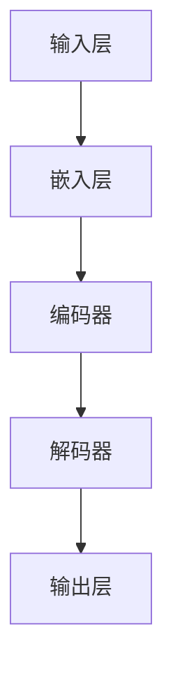
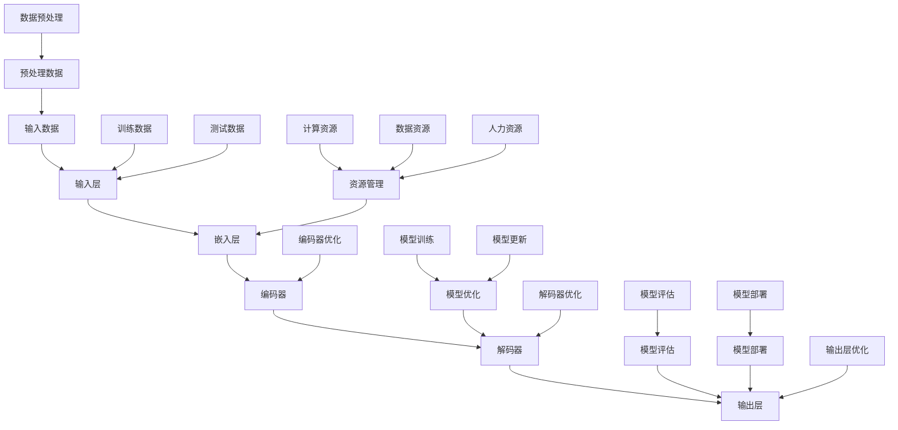

                 

### AI 大模型创业：如何利用资源优势？

#### 关键词：AI 大模型，创业，资源利用，技术优势，战略规划

#### 摘要：

本文将探讨 AI 大模型创业中如何利用资源优势，从基础理论到实践策略进行深入分析。文章首先介绍 AI 大模型的核心概念和架构，接着阐述大规模预训练模型的工作原理和应用场景。随后，文章着重分析资源评估与利用策略，包括数据资源、算力资源和人力资源的评估与整合。最后，文章通过项目实战案例，详细解读 AI 大模型创业过程中的关键步骤和资源管理方法，为创业团队提供实用的指导和建议。

### 第一部分：AI大模型基础

#### 第1章：AI大模型概述

##### 1.1 AI大模型简介

AI 大模型，即 Artificial Intelligence Large Models，指的是参数规模巨大、计算能力要求极高的机器学习模型。这类模型通过海量数据的训练，具备处理复杂任务的能力，广泛应用于自然语言处理、计算机视觉、语音识别等领域。AI 大模型的核心特征包括：

- **参数数量庞大**：数以亿计的参数使得模型能够捕捉复杂的数据特征。
- **计算需求巨大**：大规模的计算资源需求使得分布式训练和高效计算成为关键。
- **数据依赖性强**：AI 大模型的性能高度依赖于训练数据的质量和数量。
- **应用场景广泛**：从文本生成到图像识别，AI 大模型在多个领域展现出强大的应用潜力。

##### 1.2 AI大模型的架构

AI 大模型的架构通常包括以下几个主要组成部分：

1. **输入层**：接收外部输入，如文本、图像、声音等。
2. **嵌入层**：将输入数据转换为向量表示。
3. **编码器**：处理输入数据，提取特征信息。
4. **解码器**：根据编码器的输出生成预测结果。
5. **输出层**：输出最终的结果，如分类标签、文本生成等。

下图是一个简化的 AI 大模型架构图，使用 Mermaid 流程图表示：



##### 1.3 AI大模型的演变

AI 大模型的演变经历了多个阶段，从传统模型到现代大规模预训练模型的转变：

- **传统模型**：早期的人工神经网络模型，参数规模相对较小，应用场景有限。
- **深度学习模型**：随着计算能力的提升，深度学习模型逐渐成为主流，但参数规模仍有限。
- **大规模预训练模型**：如 GPT、BERT 等模型，通过海量数据进行预训练，参数规模达到数十亿级别。

AI 大模型在工业界和学术界的应用场景不断扩展，例如：

- **自然语言处理**：文本生成、机器翻译、情感分析等。
- **计算机视觉**：图像分类、目标检测、人脸识别等。
- **语音识别**：语音合成、语音识别、语音翻译等。

#### 第2章：AI大模型核心技术

##### 2.1 深度学习基础

深度学习是 AI 大模型的核心技术之一，其基本概念包括：

- **神经网络**：由多个神经元组成的计算模型，能够通过学习数据特征实现复杂函数的拟合。
- **激活函数**：用于引入非线性因素，使得神经网络能够捕捉复杂的数据模式。
- **优化算法**：如梯度下降、Adam 等算法，用于更新模型参数，优化模型性能。

常见的深度学习架构包括：

- **卷积神经网络（CNN）**：擅长处理图像数据。
- **循环神经网络（RNN）**：擅长处理序列数据。
- **Transformer**：引入注意力机制，用于处理变长序列数据，是大规模预训练模型的核心架构。

##### 2.2 大规模预训练模型

大规模预训练模型是指通过在大量数据上进行预训练，然后针对特定任务进行微调的模型。其原理包括：

- **预训练**：在无监督环境中对模型进行大规模数据训练，提取通用特征。
- **微调**：在特定任务上使用少量有监督数据进行模型微调，提高任务性能。

大规模预训练面临的挑战包括：

- **计算资源**：预训练过程需要大量的计算资源，分布式训练和高效计算技术是关键。
- **数据质量**：训练数据的质量对模型性能有重要影响，数据清洗和预处理是关键步骤。
- **模型可解释性**：大规模模型的黑箱特性使得其可解释性较低，需要发展新的方法提高模型的可解释性。

##### 2.3 实际应用中的AI大模型

AI 大模型在不同领域展现出了强大的应用潜力：

- **自然语言处理**：BERT、GPT 等模型在文本生成、机器翻译、情感分析等领域取得了显著成果。
- **计算机视觉**：ResNet、Inception 等模型在图像分类、目标检测、人脸识别等领域表现出色。
- **语音识别**：WaveNet、Transformer 等模型在语音合成、语音识别、语音翻译等领域取得了突破。

这些应用案例不仅验证了 AI 大模型的强大能力，也为创业团队提供了丰富的实践参考。

#### 第二部分：资源利用策略

##### 第3章：资源评估与策略制定

##### 3.1 资源评估方法

资源评估是 AI 大模型创业中的关键步骤，有效的资源评估能够帮助团队制定科学的资源利用策略。资源评估主要包括以下三个方面：

1. **数据资源评估**：
   - **数据量**：评估数据的数量，包括训练数据和测试数据。
   - **数据质量**：评估数据的完整性和准确性，数据清洗和预处理是关键。
   - **数据多样性**：评估数据的种类和来源，多样性有助于模型泛化能力的提升。

2. **算力资源评估**：
   - **计算资源**：评估计算资源的规模和性能，包括 CPU、GPU、TPU 等。
   - **存储资源**：评估数据存储的规模和效率，包括硬盘、SSD 等。
   - **网络资源**：评估网络带宽和延迟，影响数据传输效率和模型训练速度。

3. **人力资源评估**：
   - **团队规模**：评估团队的规模和结构，包括研发人员、数据科学家、产品经理等。
   - **技能水平**：评估团队成员的技能水平和专业知识，合理配置团队资源。
   - **协作效率**：评估团队的协作和沟通效率，使用高效的工具和方法提高工作效率。

##### 3.2 资源利用策略

资源利用策略是指如何合理安排和利用资源，以实现资源效益最大化。具体策略包括：

1. **数据资源利用策略**：
   - **数据清洗与预处理**：对数据进行清洗和预处理，提高数据质量和模型训练效果。
   - **数据集成与管理**：整合不同来源的数据，建立高效的数据管理系统。
   - **数据共享与开放**：促进数据共享和开放，提高数据利用效率。

2. **算力资源利用策略**：
   - **分布式训练**：利用分布式计算技术，提高模型训练速度和效率。
   - **资源调度与优化**：根据模型需求和资源状况，动态调整资源分配。
   - **GPU 资源复用**：通过 GPU 资源复用技术，提高 GPU 利用率。

3. **人力资源利用策略**：
   - **团队建设与协作**：建立高效的团队协作机制，提高工作效率。
   - **技能培训与提升**：定期进行技能培训，提高团队成员的专业水平。
   - **激励机制与考核**：建立激励机制，鼓励团队成员发挥潜力。

#### 第4章：AI创业中的资源整合

##### 4.1 资源整合框架

资源整合是指将各种资源进行有效配置和整合，以实现整体效益最大化。资源整合框架主要包括以下步骤：

1. **资源识别**：识别和评估可用的资源，包括数据资源、算力资源和人力资源。
2. **资源评估**：对识别出的资源进行详细评估，包括资源规模、质量和可用性。
3. **资源整合**：将评估后的资源进行整合，形成高效利用的资源组合。
4. **资源管理**：建立资源管理体系，监控资源利用情况，及时调整资源分配。

资源整合的流程包括：

1. **需求分析**：分析创业项目对资源的需求，明确资源整合的目标。
2. **资源识别**：通过调研和市场分析，识别和评估可用的资源。
3. **资源评估**：对识别出的资源进行详细评估，形成资源清单。
4. **资源整合**：根据需求分析结果，整合不同类型的资源，形成资源组合。
5. **资源管理**：建立资源管理体系，实时监控资源利用情况，优化资源分配。

##### 4.2 资源优势分析

资源优势分析是指对资源整合后的优势进行评估和分析，以确定创业项目的竞争优势。资源优势分析主要包括以下方面：

1. **数据优势分析**：
   - **数据质量**：分析数据资源的质量，包括数据的完整性、准确性和多样性。
   - **数据规模**：分析数据资源的规模，包括训练数据和测试数据的大小。
   - **数据更新频率**：分析数据资源的更新频率，确保数据资源的时效性。

2. **算力优势分析**：
   - **计算资源**：分析计算资源的规模和性能，包括 CPU、GPU、TPU 等。
   - **存储资源**：分析存储资源的规模和效率，包括硬盘、SSD 等。
   - **网络资源**：分析网络资源的带宽和延迟，确保数据传输效率。

3. **人力资源优势分析**：
   - **团队规模**：分析团队规模和结构，确保团队规模适中，结构合理。
   - **技能水平**：分析团队成员的技能水平和专业知识，确保团队能够胜任项目需求。
   - **协作效率**：分析团队的协作和沟通效率，确保团队能够高效工作。

通过资源优势分析，创业团队可以明确自身在资源整合方面的优势，制定科学的创业战略，提高项目成功的概率。

#### 第三部分：项目实施与创业实践

##### 第5章：项目启动与团队搭建

##### 5.1 项目启动流程

项目启动是 AI 大模型创业的关键步骤，有效的项目启动能够确保项目顺利进行。项目启动流程包括以下关键步骤：

1. **项目立项**：明确项目目标、范围和预期成果，编写项目立项文档。
2. **资源评估**：对项目所需资源进行详细评估，确保资源充足且合理配置。
3. **团队组建**：根据项目需求组建团队，明确团队成员的角色和职责。
4. **需求分析**：与客户和利益相关者进行沟通，明确项目需求和预期效果。
5. **项目规划**：制定项目计划，包括项目进度、资源分配和风险控制等。
6. **项目启动会**：召开项目启动会，明确项目目标、计划和团队成员职责。

##### 5.2 团队建设

团队建设是项目成功的关键因素，有效的团队建设能够提高团队的协作效率和创新能力。团队建设主要包括以下方面：

1. **角色分工**：明确团队成员的角色和职责，确保团队工作有序进行。
2. **技能培训**：定期进行技能培训，提高团队成员的专业水平和技能。
3. **沟通协作**：建立高效的沟通协作机制，确保团队成员之间的信息流通。
4. **激励机制**：建立激励机制，鼓励团队成员积极参与项目，提高项目质量。
5. **团队文化**：培养积极向上的团队文化，增强团队成员的归属感和凝聚力。

##### 第6章：AI大模型项目实战

##### 6.1 项目实战概述

AI 大模型项目实战是指在实际项目中应用 AI 大模型技术，解决实际问题和实现商业价值的过程。项目实战的目标和任务包括：

1. **目标**：明确项目目标，如提高业务效率、降低成本、提升用户体验等。
2. **任务**：确定项目任务，如数据预处理、模型训练、模型评估和模型部署等。
3. **环境搭建**：搭建项目所需的环境，包括计算资源、存储资源和开发工具等。
4. **数据收集**：收集和整理项目所需的数据，确保数据质量和完整性。

##### 6.2 项目实施细节

项目实施细节包括以下关键步骤：

1. **数据预处理**：对收集到的数据进行清洗、归一化和特征提取，为模型训练做好准备。
2. **模型训练**：使用大规模数据进行模型训练，通过调整超参数和优化算法，提高模型性能。
3. **模型评估**：对训练好的模型进行评估，包括准确率、召回率、F1 值等指标，确保模型达到预期效果。
4. **模型优化**：根据评估结果对模型进行调整和优化，提高模型性能和稳定性。
5. **模型部署**：将训练好的模型部署到生产环境，实现模型的实际应用。

##### 6.3 项目成果展示

项目成果展示是项目实战的重要环节，通过展示项目成果，向客户和利益相关者证明项目的价值和效果。成果展示包括以下内容：

1. **项目报告**：编写详细的项目报告，包括项目背景、目标、任务、实施过程和成果等。
2. **模型效果展示**：展示模型的实际效果，如预测准确率、响应时间等。
3. **用户体验反馈**：收集用户反馈，了解用户对项目的评价和改进建议。
4. **商业价值分析**：分析项目成果的商业价值，如成本节省、收入增长等。

#### 第7章：创业中的资源管理与风险控制

##### 7.1 资源管理策略

资源管理策略是指在创业过程中，如何合理安排和利用资源，以实现资源效益最大化。资源管理策略包括以下方面：

1. **资源优化配置**：根据项目需求和资源状况，动态调整资源分配，确保资源得到高效利用。
2. **资源使用效率提升**：通过技术手段和管理方法，提高资源的使用效率，降低资源浪费。
3. **资源储备与备用**：建立资源储备机制，应对突发情况，确保资源供应的稳定性。

##### 7.2 风险控制方法

创业过程中，风险控制是确保项目顺利进行的关键。风险控制方法包括以下方面：

1. **风险评估与预警**：对项目可能面临的风险进行评估，建立风险预警机制，及时发现问题。
2. **风险应对措施**：根据风险评估结果，制定相应的风险应对措施，降低风险发生概率和影响。
3. **风险监控与反馈**：建立风险监控体系，实时监控项目风险状况，及时调整风险控制措施。

通过有效的资源管理和风险控制，创业团队可以降低项目风险，提高项目成功率，实现商业价值。

#### 附录

##### 附录 A：资源利用工具推荐

为了高效利用资源，创业团队可以参考以下工具：

1. **数据资源管理工具**：
   - **Hadoop**：分布式数据处理框架，适用于大规模数据处理。
   - **Spark**：基于内存的分布式数据处理框架，适用于实时数据处理。
   - **MongoDB**：NoSQL 数据库，适用于大规模数据存储和查询。

2. **算力资源管理工具**：
   - **Docker**：容器化技术，适用于快速部署和扩展计算资源。
   - **Kubernetes**：容器编排和管理工具，适用于大规模分布式计算。
   - **TensorFlow**：开源深度学习框架，适用于大规模模型训练和部署。

3. **人力资源开发工具**：
   - **Slack**：团队沟通和协作工具，适用于实时沟通和任务分配。
   - **Trello**：项目管理工具，适用于任务管理和进度跟踪。
   - **LinkedIn Learning**：在线学习平台，适用于技能培训和知识共享。

通过使用这些工具，创业团队可以更高效地管理资源，提高项目执行效率。

### 总结

AI 大模型创业是一个复杂而富有挑战的过程，需要团队在技术、资源和战略等多个方面进行深入思考和有效管理。本文从基础理论到实践策略，详细探讨了 AI 大模型创业中的资源利用问题，包括核心概念、架构、资源评估与整合、项目实施和风险控制等。创业团队可以通过本文提供的策略和工具，更好地利用资源，提高项目成功率，实现商业价值。

### 作者信息

作者：AI天才研究院/AI Genius Institute & 禅与计算机程序设计艺术 /Zen And The Art of Computer Programming

### 《AI 大模型创业：如何利用资源优势？》文章关键词

- AI 大模型
- 创业策略
- 资源评估
- 数据资源管理
- 算力资源管理
- 人力资源整合
- 项目实施
- 风险控制

### 《AI 大模型创业：如何利用资源优势？》文章摘要

本文探讨了 AI 大模型创业中的资源利用问题，从基础理论到实践策略进行了全面分析。首先介绍了 AI 大模型的核心概念和架构，包括输入层、嵌入层、编码器、解码器和输出层。接着阐述了深度学习和大规模预训练模型的基本原理，以及其在实际应用中的表现。文章重点分析了资源评估与策略制定，包括数据资源、算力资源和人力资源的评估方法与利用策略。随后，文章提出了资源整合框架和资源优势分析，帮助创业团队明确资源整合的优势和关键点。最后，文章通过项目实施和创业实践，详细解读了 AI 大模型创业过程中的关键步骤和资源管理方法，并提供了一些实用的工具推荐。通过本文的深入探讨，创业团队可以更好地利用资源，提高项目成功率，实现商业价值。

### AI 大模型核心概念与联系

#### Mermaid 流程图：AI 大模型架构图



#### Mermaid 流iti|fl流程图展示了 AI 大模型的主要组成部分及其相互关系：

- **输入层 (A)**：接收外部输入数据，如文本、图像、声音等。
- **嵌入层 (B)**：将输入数据转换为向量表示，进行初步处理。
- **编码器 (C)**：处理输入数据，提取特征信息，进行编码。
- **解码器 (D)**：根据编码器的输出生成预测结果，进行解码。
- **输出层 (E)**：输出最终的结果，如分类标签、文本生成等。

流程图中还涉及以下步骤和概念：

- **输入数据 (F)**：原始数据进入模型之前，需要进行预处理。
- **预处理数据 (G)**：包括数据清洗、归一化、特征提取等步骤。
- **训练数据 (H)**：用于模型训练的数据集。
- **测试数据 (I)**：用于模型评估的数据集。
- **模型评估 (J)**：通过测试数据评估模型性能，包括准确率、召回率等指标。
- **模型优化 (K)**：根据评估结果对模型进行调整和优化。
- **模型部署 (L)**：将训练好的模型部署到实际应用场景中。
- **数据预处理 (M)**：预处理步骤的具体实现。
- **编码器优化 (Q)**：对编码器进行调整和优化。
- **解码器优化 (R)**：对解码器进行调整和优化。
- **输出层优化 (S)**：对输出层进行调整和优化。
- **模型更新 (T)**：定期对模型进行更新和维护。
- **资源管理 (U)**：涉及计算资源、数据资源和人力资源的管理。

通过这个流程图，我们可以清晰地看到 AI 大模型的各个组成部分及其相互作用，有助于更好地理解 AI 大模型的工作原理和资源管理方法。

### 大规模预训练模型原理

大规模预训练模型是当前 AI 领域的热门研究方向，其核心思想是通过在大规模数据集上进行预训练，使模型能够自动学习到通用的语言和知识表示，从而在下游任务中实现优秀的性能。以下是大规模预训练模型的基本原理和主要步骤。

#### 基本原理

大规模预训练模型通常分为两个阶段：预训练阶段和微调阶段。

1. **预训练阶段**：模型在大规模数据集（如互联网文本、书籍、新闻、百科全书等）上进行训练，目的是学习语言和知识的通用表示。在这个阶段，模型不需要关注具体的任务目标，只需要学会理解自然语言。

2. **微调阶段**：在预训练完成后，模型被针对具体任务进行微调，例如文本分类、问答系统、机器翻译等。在这个阶段，模型根据特定任务的数据进行训练，优化模型在具体任务上的性能。

#### 主要步骤

1. **数据收集和预处理**：收集大量文本数据，并进行预处理，包括分词、词干提取、词性标注等。

2. **模型初始化**：选择合适的预训练模型，如 GPT、BERT、RoBERTa 等，这些模型通常具有数十亿参数，结构复杂。

3. **预训练**：使用特殊的训练目标，如语言建模、掩码语言建模、下一句预测等，对模型进行预训练。这些目标有助于模型学习到语言的一般规律和结构。

4. **微调**：在预训练基础上，针对具体任务，使用特定领域的数据对模型进行微调。微调的目标通常是优化模型在特定任务上的表现。

5. **评估和优化**：使用测试集对模型进行评估，并根据评估结果调整模型参数，优化模型性能。

#### 预训练模型的挑战与解决方案

大规模预训练模型在带来显著性能提升的同时，也面临一些挑战：

1. **计算资源消耗**：预训练阶段需要大量的计算资源，这通常需要分布式训练和高效计算技术。

2. **数据质量**：预训练模型依赖于大量数据，数据质量对模型性能有重要影响。因此，数据清洗和预处理是关键步骤。

3. **模型可解释性**：大规模预训练模型通常被视为“黑箱”，其内部决策过程难以解释。为此，研究者们正在探索提高模型可解释性的方法。

4. **数据隐私**：大规模数据集的收集和使用可能涉及数据隐私问题，特别是在医疗、金融等领域。

针对这些挑战，研究者们提出了一些解决方案：

1. **分布式训练**：使用多台服务器和 GPU/TPU 进行分布式训练，提高训练速度和效率。

2. **数据增强**：通过数据增强技术，如数据扩充、数据变换等，提高数据质量。

3. **模型压缩**：使用模型压缩技术，如剪枝、量化、蒸馏等，降低模型参数数量，提高模型可解释性。

4. **联邦学习**：通过联邦学习技术，在保护数据隐私的前提下，实现大规模数据集的联合训练。

#### 大规模预训练模型的示例

以 GPT-3 为例，GPT-3 是由 OpenAI 开发的具有 1750 亿参数的预训练模型，是目前最大的预训练模型之一。以下是 GPT-3 的预训练过程和模型架构：

1. **数据收集和预处理**：GPT-3 使用了大量的互联网文本数据，包括网页、书籍、新闻等，并进行预处理，如分词、去除停用词等。

2. **模型初始化**：GPT-3 采用 Transformer 架构，具有多个自注意力层，初始化时加载了预训练好的 BERT 模型。

3. **预训练**：GPT-3 使用掩码语言建模（Masked Language Modeling, MLM）任务进行预训练，即在输入文本中随机掩码一部分单词，模型需要预测这些被掩码的单词。

4. **微调**：在预训练完成后，GPT-3 可以针对特定任务进行微调，如文本生成、问答系统等。

5. **评估和优化**：使用测试集对 GPT-3 进行评估，并根据评估结果调整模型参数。

GPT-3 在多个自然语言处理任务上取得了显著成绩，如文本生成、机器翻译、情感分析等，成为当前 AI 研究的重要成果之一。

通过以上对大规模预训练模型的介绍，我们可以看到这种模型在 AI 领域的重要性和广泛应用前景。在未来的发展中，研究者们将继续探索如何提高预训练模型的性能、可解释性和安全性，推动 AI 技术的进一步发展。

### 实际应用中的AI大模型

在当今的AI领域，大规模预训练模型已经广泛应用于多个领域，显著提升了人工智能系统的性能和效率。以下是一些典型的AI大模型应用场景和案例，展示其在不同领域中的实际效果和贡献。

#### 自然语言处理

自然语言处理（NLP）是AI大模型最具代表性的应用领域之一。以下是一些典型的应用场景：

1. **文本生成**：GPT-3 和其他大型语言模型可以生成高质量的文本，包括新闻文章、故事、诗歌等。这些模型在自动写作领域展示了强大的能力，能够大幅提高内容创作的效率。

2. **机器翻译**：大型神经网络翻译模型如Google的Transformer模型，显著提升了机器翻译的准确性，使得翻译结果更加流畅自然。

3. **情感分析**：通过分析社交媒体、新闻评论等文本数据，AI大模型可以识别情感倾向，为市场研究、舆情监控提供有力支持。

4. **问答系统**：基于BERT等预训练模型的大型问答系统，如OpenAI的DALL·E，可以理解和回答用户提出的问题，为智能客服、教育辅导等领域提供了高效解决方案。

#### 计算机视觉

计算机视觉领域也受益于AI大模型的广泛应用。以下是一些具体应用：

1. **图像分类**：使用ResNet、Inception等预训练模型，图像分类任务的准确率大幅提升。这些模型可以识别数百万个不同的物体类别，广泛应用于物体检测、自动驾驶、医疗影像分析等场景。

2. **目标检测**：YOLO、SSD等基于AI大模型的实时目标检测系统，在速度和准确性上都取得了显著突破，广泛应用于视频监控、交通管理、安全监控等领域。

3. **人脸识别**：基于深度学习的AI大模型在人脸识别任务中表现出色，准确性超过人类。这一技术在身份验证、人脸解锁、公共安全等方面具有广泛应用。

4. **图像生成**：生成对抗网络（GANs）可以生成逼真的图像和视频，被用于艺术创作、游戏开发、虚拟现实等领域。

#### 语音识别

语音识别领域也因AI大模型的应用而取得显著进展：

1. **语音识别**：基于深度学习的大规模语音识别模型，如Google的WaveNet，能够准确识别语音并将其转换为文本，广泛应用于智能助手、语音搜索、语音控制等领域。

2. **语音合成**：WaveNet等模型还可以生成逼真的语音，用于语音合成、语音导航、电话客服等应用，提升了用户体验和交互效率。

#### 推荐系统

AI大模型在推荐系统中的应用也取得了显著成效：

1. **个性化推荐**：通过分析用户行为和偏好数据，AI大模型可以生成个性化的推荐列表，广泛应用于电子商务、社交媒体、新闻推送等领域。

2. **内容审核**：AI大模型可以识别和过滤不良内容，如暴力、色情、虚假信息等，为平台安全和内容质量控制提供技术支持。

#### 医疗保健

AI大模型在医疗保健领域展现了巨大的潜力：

1. **疾病诊断**：通过分析医学影像和病历数据，AI大模型可以辅助医生进行疾病诊断，如癌症检测、心脏病诊断等。

2. **药物发现**：AI大模型可以预测药物与生物分子之间的相互作用，加速新药研发进程。

3. **健康监测**：通过分析健康数据，AI大模型可以提供个性化的健康建议和预警，帮助用户预防和管理慢性疾病。

#### 工业自动化

在工业自动化领域，AI大模型也被广泛应用：

1. **预测维护**：通过分析设备运行数据，AI大模型可以预测设备故障，实现预防性维护，降低生产停机时间。

2. **质量控制**：AI大模型可以检测产品质量，如缺陷识别、尺寸测量等，确保产品质量。

3. **流程优化**：AI大模型可以分析生产流程数据，提供优化建议，提高生产效率。

通过以上应用场景和案例，我们可以看到AI大模型在各个领域的实际效果和贡献。这些应用不仅提升了行业的效率和准确性，也为创业者提供了丰富的机会和创新空间。在未来的发展中，随着AI大模型技术的不断进步，我们可以期待其在更多领域展现更大的潜力。

### 资源评估与策略制定

在AI大模型创业过程中，资源评估与策略制定是确保项目成功的关键步骤。有效的资源评估能够帮助团队了解和利用现有资源，制定科学的资源利用策略，从而提高项目成功率。以下将详细探讨数据资源、算力资源和人力资源的评估方法与利用策略。

#### 数据资源评估

数据资源是AI大模型的基础，其质量直接影响模型的表现。数据资源评估主要包括以下几个方面：

1. **数据量**：评估数据量的规模，包括训练数据和测试数据的大小。大规模的数据量有助于模型学习到更多的特征，提高模型的泛化能力。

2. **数据质量**：评估数据的完整性和准确性，确保数据中没有缺失值和错误。此外，还需评估数据的多样性和代表性，多样化的数据有助于模型在不同场景下的表现。

3. **数据更新频率**：对于动态变化较大的领域，如社交媒体分析、金融市场预测等，数据更新频率也是一个重要的评估指标。

**利用策略**：

- **数据清洗与预处理**：对数据进行清洗和预处理，去除噪声和错误，提高数据质量。
- **数据集成与管理**：整合不同来源的数据，建立高效的数据管理系统，确保数据的一致性和可访问性。
- **数据共享与开放**：促进数据共享和开放，提高数据利用效率，扩大数据来源。

#### 算力资源评估

算力资源是AI大模型训练和推理过程中不可或缺的资源，其性能直接影响模型训练的速度和效果。算力资源评估主要包括以下几个方面：

1. **计算资源**：评估计算资源的规模和性能，包括 CPU、GPU、TPU 等。高性能的计算资源可以显著缩短模型训练时间，提高训练效率。

2. **存储资源**：评估存储资源的规模和效率，包括硬盘、SSD 等。充足的存储资源能够确保模型训练过程中的数据存储需求。

3. **网络资源**：评估网络带宽和延迟，确保数据传输效率和模型训练速度。

**利用策略**：

- **分布式训练**：利用分布式计算技术，将模型训练任务分配到多台服务器上，提高训练速度和效率。
- **资源调度与优化**：根据模型需求和资源状况，动态调整资源分配，确保资源的高效利用。
- **GPU 资源复用**：通过 GPU 资源复用技术，提高 GPU 利用率，降低资源浪费。

#### 人力资源评估

人力资源是AI大模型创业的核心，包括数据科学家、机器学习工程师、产品经理等。人力资源评估主要包括以下几个方面：

1. **团队规模**：评估团队规模和结构，确保团队规模适中，结构合理。

2. **技能水平**：评估团队成员的技能水平和专业知识，确保团队能够胜任项目需求。

3. **协作效率**：评估团队的协作和沟通效率，使用高效的工具和方法提高工作效率。

**利用策略**：

- **团队建设与协作**：建立高效的团队协作机制，提高工作效率。例如，使用敏捷开发方法、敏捷项目管理工具等。
- **技能培训与提升**：定期进行技能培训，提高团队成员的专业水平，紧跟行业发展趋势。
- **激励机制与考核**：建立激励机制，鼓励团队成员积极参与项目，提高项目质量。

通过以上对数据资源、算力资源和人力资源的评估与利用策略，创业团队可以更好地管理和利用资源，提高项目成功率，实现商业价值。

### AI创业中的资源整合

在AI创业过程中，资源整合是确保项目顺利进行和取得成功的关键环节。有效的资源整合能够帮助团队最大化利用现有资源，提高项目效率和成果。以下将详细介绍资源整合的框架和流程，并探讨数据、算力和人力资源的整合策略。

#### 资源整合框架

资源整合框架是资源整合的基础，它为创业团队提供了一个系统化的方法，确保资源能够得到有效配置和利用。资源整合框架主要包括以下步骤：

1. **资源识别**：识别和评估可用的资源，包括数据资源、算力资源和人力资源。这一步骤需要详细分析项目的需求，明确资源种类和规模。

2. **资源评估**：对识别出的资源进行详细评估，包括资源质量、可用性和可持续性。评估结果将为后续的资源整合提供依据。

3. **资源整合**：根据资源评估结果，将不同类型的资源进行整合，形成高效利用的资源组合。资源整合的目标是确保各类资源能够协同工作，发挥最大效益。

4. **资源管理**：建立资源管理体系，实时监控资源利用情况，及时调整资源分配。资源管理包括资源调度、优化和储备等方面。

5. **持续优化**：通过持续优化，不断调整和改进资源整合策略，以适应项目发展和市场变化。

#### 资源整合流程

资源整合流程是资源整合的具体实施步骤，它包括以下关键环节：

1. **需求分析**：与客户和利益相关者进行沟通，明确项目需求和预期成果。这一步骤将确定资源整合的目标和方向。

2. **资源识别**：通过调研和市场分析，识别和评估可用的资源。包括数据资源、算力资源和人力资源的识别和评估。

3. **资源评估**：对识别出的资源进行详细评估，包括资源质量、可用性和可持续性。评估结果将帮助团队确定资源整合的重点和优先级。

4. **资源整合**：根据需求分析和资源评估结果，将不同类型的资源进行整合。这一步骤包括资源组合的优化和协同工作的设计。

5. **资源管理**：建立资源管理体系，实时监控资源利用情况，确保资源的高效利用。资源管理包括资源调度、优化和储备等方面。

6. **项目实施**：根据资源整合和资源管理计划，启动项目实施。确保项目按照预期目标和时间表顺利进行。

7. **评估与反馈**：在项目实施过程中，定期评估资源整合效果，收集反馈，及时调整和改进资源整合策略。

#### 数据资源的整合策略

数据资源是AI创业的核心，其整合策略包括：

1. **数据集成**：将不同来源的数据进行集成，建立统一的数据仓库。数据集成有助于提高数据利用效率和数据质量。

2. **数据预处理**：对数据进行清洗、归一化和特征提取等预处理操作，提高数据质量。预处理策略需要根据具体应用场景进行优化。

3. **数据共享与开放**：促进数据共享和开放，建立数据共享平台，提高数据的可访问性和可利用性。

4. **数据治理**：建立数据治理体系，确保数据的安全、合规和可追溯性。

#### 算力资源的整合策略

算力资源是AI大模型训练和推理的基础，其整合策略包括：

1. **分布式训练**：利用分布式计算技术，将模型训练任务分配到多台服务器上，提高训练速度和效率。

2. **资源调度与优化**：根据模型需求和资源状况，动态调整资源分配，确保资源的高效利用。

3. **GPU 资源复用**：通过 GPU 资源复用技术，提高 GPU 利用率，降低资源浪费。

4. **云服务**：利用云计算平台，获取灵活的算力资源，降低基础设施建设和运维成本。

#### 人力资源的整合策略

人力资源是AI创业的关键，其整合策略包括：

1. **团队建设**：建立高效的团队协作机制，确保团队成员之间的沟通和协作。

2. **技能培训**：定期进行技能培训，提高团队成员的专业水平和技能。

3. **激励机制**：建立激励机制，鼓励团队成员积极参与项目，提高项目质量。

4. **人才引进**：通过招聘、合作等方式，引进优秀的人才，提升团队整体实力。

通过以上资源整合框架和流程，AI创业团队可以更好地管理和利用资源，提高项目成功率，实现商业价值。

### 资源优势分析

在AI大模型创业中，资源优势分析是制定战略和决策的重要环节。资源优势分析旨在明确创业团队在数据资源、算力资源和人力资源方面的独特优势，以便充分利用这些优势，提升项目成功率。以下是关于资源优势分析的详细内容。

#### 数据优势分析

数据资源是AI大模型的核心驱动力，数据优势分析主要包括以下几个方面：

1. **数据质量**：高质量的数据是训练高效模型的基石。创业团队应评估数据的完整性、准确性和一致性。高质量的数据可以显著提升模型的表现。

2. **数据规模**：大规模的数据有助于模型学习到更多样的特征，从而提高模型的泛化能力。创业团队应评估数据的总量，特别是训练数据的规模。

3. **数据多样性**：多样化的数据能够使模型在多种情境下表现良好。创业团队应确保数据来源广泛，涵盖不同类型和领域。

4. **数据更新频率**：对于动态变化的领域，如金融市场、社交媒体分析等，数据的实时更新至关重要。创业团队应评估数据的更新速度，确保模型能够快速适应新的趋势。

**案例**：假设一个创业团队拥有一个包含多语言、多领域的海量文本数据集。这种数据资源优势使得该团队能够训练出具备跨语言和跨领域处理能力的模型，从而在多语言文本生成、跨领域文本分类等领域具有显著竞争力。

#### 算力优势分析

算力资源是AI大模型训练的硬件保障，算力优势分析主要包括以下几个方面：

1. **计算资源**：创业团队应评估所拥有的计算资源，包括 CPU、GPU、TPU 等。高性能的计算资源可以显著提高模型训练的速度和效率。

2. **存储资源**：充足的存储资源是保证大规模数据存储和快速访问的关键。创业团队应评估存储设备的性能和容量。

3. **网络资源**：快速稳定的网络连接对于数据传输和模型部署至关重要。创业团队应评估网络带宽和延迟，确保数据传输的高效性。

4. **计算能力**：创业团队应评估整体的计算能力，包括并行计算能力、分布式计算能力等。这些能力有助于高效处理大规模数据集和复杂模型。

**案例**：一个创业团队如果拥有高性能 GPU 集群和强大的计算资源，可以在深度学习模型训练中实现快速迭代和高效优化，从而在竞赛和实际应用中占据优势。

#### 人力资源优势分析

人力资源是AI大模型创业的核心，人力资源优势分析主要包括以下几个方面：

1. **团队规模**：一个规模适中的团队能够确保高效的项目管理和资源利用。创业团队应评估团队规模和结构，确保其符合项目需求。

2. **技能水平**：团队成员的技能水平和专业知识直接影响项目的成功。创业团队应评估成员的技能，包括编程能力、机器学习知识、数据分析和项目管理等。

3. **协作效率**：高效的团队协作能够提高项目的进展速度和质量。创业团队应评估团队内部的沟通和协作效率，优化团队协作流程。

4. **创新氛围**：一个鼓励创新和学习的氛围有助于团队成员发挥潜力，推动技术进步。创业团队应评估团队的文化氛围，确保其支持创新和持续学习。

**案例**：一个创业团队如果拥有多位经验丰富的机器学习工程师和卓越的数据科学家，能够在短时间内完成复杂模型的开发和应用，从而在技术竞争中占据优势。

通过上述资源优势分析，创业团队可以明确自身在数据资源、算力资源和人力资源方面的独特优势，从而制定科学的战略和决策，充分利用这些优势，提高项目成功率。

### 项目启动与团队搭建

#### 5.1 项目启动流程

项目启动是AI大模型创业的关键环节，它决定了项目的方向和基调。以下是项目启动流程的详细步骤：

1. **项目立项**：在项目启动之前，需要对项目进行全面的立项。立项过程包括明确项目目标、范围、预期成果和项目团队等。项目立项文档是整个项目的纲领性文件，它为后续工作提供了指导和依据。

2. **需求分析**：在立项之后，进行详细的需求分析。需求分析包括与客户、利益相关者和潜在用户进行沟通，了解他们的需求、期望和痛点。这一步骤有助于明确项目的具体目标和功能要求。

3. **资源评估**：评估项目所需的资源，包括数据资源、算力资源和人力资源。资源评估旨在确定项目能够获得哪些资源，哪些资源需要额外获取，以及资源的使用效率。

4. **团队组建**：根据项目需求，组建项目团队。团队应包括数据科学家、机器学习工程师、软件工程师、产品经理和项目经理等角色。团队成员的技能和经验应与项目需求相匹配。

5. **项目规划**：制定详细的项目计划，包括项目进度、里程碑、关键任务和风险评估等。项目计划应明确每个阶段的任务和时间表，以确保项目按时完成。

6. **项目启动会**：召开项目启动会，向团队成员和利益相关者介绍项目背景、目标、计划和团队分工。项目启动会是一个重要的沟通和协调平台，有助于确保项目团队对项目的理解一致，并建立起良好的工作关系。

#### 5.2 团队建设

团队建设是确保项目成功的重要保障。以下是团队建设的几个关键方面：

1. **角色分工**：明确团队成员的角色和职责，确保每个成员都清楚自己的工作内容和目标。角色分工有助于提高团队的工作效率和协作效果。

2. **技能培训**：定期对团队成员进行技能培训，提升他们的专业水平和技能。技能培训可以包括机器学习、编程、项目管理等课程，以确保团队成员能够适应项目需求。

3. **沟通协作**：建立高效的沟通协作机制，使用团队协作工具（如Slack、Trello等）来确保团队成员之间的信息流通。定期召开团队会议，讨论项目进展和问题，确保团队成员之间的沟通畅通。

4. **激励机制**：建立激励机制，鼓励团队成员积极参与项目，提高项目质量。激励机制可以包括奖金、表彰、晋升等，以激发团队成员的积极性和创造力。

5. **团队文化**：培养积极向上的团队文化，增强团队成员的归属感和凝聚力。团队文化应强调合作、创新和持续学习，以促进团队的长远发展。

通过以上项目启动和团队建设的关键步骤，创业团队可以确保项目顺利启动，团队成员高效协作，从而提高项目的成功率。

### 项目实施细节

在AI大模型创业过程中，项目实施细节是确保项目顺利推进和成功的关键环节。以下是项目实施的详细步骤和关键环节，包括开发环境搭建、源代码实现和代码解读与分析。

#### 开发环境搭建

开发环境搭建是项目实施的第一步，它为后续的开发工作提供必要的软件和硬件支持。以下是开发环境搭建的详细步骤：

1. **计算资源准备**：根据项目需求，准备足够的计算资源。对于AI大模型项目，通常需要高性能的GPU集群或TPU集群。选择合适的云计算平台（如AWS、Google Cloud、Azure等），配置所需的虚拟机实例。

2. **软件安装**：在计算资源上安装必要的软件，包括操作系统（如Ubuntu、CentOS等）、深度学习框架（如TensorFlow、PyTorch等）、数据处理库（如NumPy、Pandas等）和版本控制工具（如Git等）。

3. **环境配置**：配置开发环境，包括安装依赖库、设置环境变量、配置代码仓库等。确保所有开发人员能够在一个统一的环境下工作，提高协作效率。

4. **网络配置**：配置网络环境，包括设置防火墙规则、配置安全组等，确保数据传输的安全性和稳定性。

5. **日志和监控**：配置日志记录和监控系统，用于记录项目运行过程中产生的日志和监控数据。日志和监控工具可以帮助团队及时发现和解决问题。

#### 源代码实现

源代码实现是项目实施的核心环节，它包括数据预处理、模型训练、模型评估和模型部署等步骤。以下是源代码实现的详细步骤：

1. **数据预处理**：首先，对收集到的数据进行清洗和预处理，包括数据去重、缺失值处理、数据标准化等。对于文本数据，需要进行分词、词性标注、词嵌入等处理。

2. **模型训练**：使用预处理后的数据进行模型训练。根据任务类型，选择合适的模型架构和训练算法。对于分类任务，可以使用卷积神经网络（CNN）或循环神经网络（RNN）；对于生成任务，可以使用生成对抗网络（GAN）或变分自编码器（VAE）。

3. **模型评估**：在训练完成后，使用验证集对模型进行评估。评估指标包括准确率、召回率、F1值等。根据评估结果，调整模型参数和训练策略，以提高模型性能。

4. **模型部署**：将训练好的模型部署到生产环境，实现模型的实际应用。部署过程中需要考虑模型的性能优化、安全性、可扩展性等问题。

#### 代码解读与分析

以下是一个简单的AI大模型项目的源代码示例，用于文本分类任务。代码解读与分析将帮助读者理解项目实现的细节。

```python
# 导入必要的库
import torch
import torch.nn as nn
import torch.optim as optim
from torch.utils.data import DataLoader
from torchvision import datasets, transforms
from torch.utils.data import Dataset
import numpy as np

# 数据预处理
class TextDataset(Dataset):
    def __init__(self, data, labels, tokenizer, max_len):
        self.data = data
        self.labels = labels
        self.tokenizer = tokenizer
        self.max_len = max_len

    def __len__(self):
        return len(self.data)

    def __getitem__(self, idx):
        text = self.data[idx]
        label = self.labels[idx]
        inputs = self.tokenizer(text, padding='max_length', truncation=True, max_length=self.max_len)
        return inputs, torch.tensor(label)

# 模型定义
class TextClassifier(nn.Module):
    def __init__(self, vocab_size, embed_dim, num_classes):
        super(TextClassifier, self).__init__()
        self.embedding = nn.Embedding(vocab_size, embed_dim)
        self.fc = nn.Linear(embed_dim, num_classes)

    def forward(self, inputs):
        embed = self.embedding(inputs)
        out = self.fc(embed)
        return out

# 模型训练
def train(model, data_loader, criterion, optimizer, device):
    model.train()
    for inputs, labels in data_loader:
        inputs = inputs.to(device)
        labels = labels.to(device)
        optimizer.zero_grad()
        outputs = model(inputs)
        loss = criterion(outputs, labels)
        loss.backward()
        optimizer.step()

# 模型评估
def evaluate(model, data_loader, criterion, device):
    model.eval()
    total_loss = 0
    with torch.no_grad():
        for inputs, labels in data_loader:
            inputs = inputs.to(device)
            labels = labels.to(device)
            outputs = model(inputs)
            loss = criterion(outputs, labels)
            total_loss += loss.item()
    return total_loss / len(data_loader)

# 主程序
if __name__ == "__main__":
    # 配置参数
    vocab_size = 10000  # 词汇表大小
    embed_dim = 128  # 嵌入层维度
    num_classes = 2  # 分类类别数量
    max_len = 50  # 输入文本的最大长度
    learning_rate = 0.001  # 学习率
    num_epochs = 10  # 训练轮数

    # 准备数据
    train_data = ...  # 训练数据
    train_labels = ...  # 训练标签
    test_data = ...  # 测试数据
    test_labels = ...  # 测试标签

    # 初始化模型、优化器和损失函数
    model = TextClassifier(vocab_size, embed_dim, num_classes)
    optimizer = optim.Adam(model.parameters(), lr=learning_rate)
    criterion = nn.CrossEntropyLoss()

    # 准备数据加载器
    train_dataset = TextDataset(train_data, train_labels, tokenizer, max_len)
    test_dataset = TextDataset(test_data, test_labels, tokenizer, max_len)
    train_loader = DataLoader(train_dataset, batch_size=32, shuffle=True)
    test_loader = DataLoader(test_dataset, batch_size=32, shuffle=False)

    # 设备配置
    device = torch.device("cuda" if torch.cuda.is_available() else "cpu")
    model.to(device)

    # 训练模型
    for epoch in range(num_epochs):
        train(model, train_loader, criterion, optimizer, device)
        train_loss = evaluate(model, train_loader, criterion, device)
        test_loss = evaluate(model, test_loader, criterion, device)
        print(f"Epoch [{epoch+1}/{num_epochs}], Train Loss: {train_loss:.4f}, Test Loss: {test_loss:.4f}")

    # 模型保存
    torch.save(model.state_dict(), "text_classifier.pth")
```

**代码解读与分析**：

- **数据预处理**：`TextDataset` 类负责对文本数据进行预处理，包括分词、词嵌入和填充。预处理后的数据被存储在 `inputs` 变量中，同时将标签存储在 `labels` 变量中。

- **模型定义**：`TextClassifier` 类定义了一个简单的文本分类模型，包括嵌入层和全连接层。嵌入层使用 `nn.Embedding` 函数，全连接层使用 `nn.Linear` 函数。

- **模型训练**：`train` 函数负责训练模型，包括前向传播、反向传播和优化。在训练过程中，模型在每个epoch中更新参数，以减少损失。

- **模型评估**：`evaluate` 函数负责评估模型的性能，计算损失值。在评估过程中，模型使用验证集进行测试，计算平均损失。

- **主程序**：主程序设置训练参数，加载数据，初始化模型、优化器和损失函数，配置数据加载器，并将模型移动到指定设备。然后开始训练模型，并在每个epoch中打印训练和测试损失。

通过以上代码解读与分析，读者可以了解到AI大模型项目实施的细节，包括数据预处理、模型定义、模型训练和模型评估。这些步骤对于成功实现AI大模型项目至关重要。

### 创业中的资源管理策略

在AI大模型创业过程中，资源管理是确保项目顺利进行和成功的关键环节。资源管理策略涉及资源的优化配置、使用效率提升以及风险控制。以下将详细探讨这些方面的策略。

#### 资源优化配置

资源优化配置是指根据项目需求和资源状况，合理分配和利用资源，以确保资源得到最大化的利用。以下是资源优化配置的具体策略：

1. **计算资源的优化配置**：
   - **分布式计算**：利用分布式计算技术，将模型训练任务分布在多个计算节点上，提高训练速度和效率。
   - **GPU资源调度**：合理分配GPU资源，避免资源浪费。使用GPU调度工具（如CUDA_VISIBLE_DEVICES）来动态调整GPU使用情况。
   - **资源池管理**：建立资源池，将闲置的资源进行统一管理和调度，提高资源利用率。

2. **数据资源的优化配置**：
   - **数据分层存储**：根据数据的重要性和访问频率，对数据进行分层存储。高频访问的数据存储在高速存储设备上，低频访问的数据存储在低成本存储设备上。
   - **数据备份与恢复**：建立数据备份和恢复机制，确保数据的安全性和可靠性。定期进行数据备份，并测试数据恢复流程。

3. **人力资源的优化配置**：
   - **团队角色分工**：明确团队成员的角色和职责，避免重复工作和资源浪费。根据项目需求，合理分配团队成员的工作任务。
   - **技能培训与提升**：定期对团队成员进行技能培训，提高团队整体的专业水平。鼓励团队成员参加行业会议、研讨会等，以保持对最新技术动态的了解。

#### 资源使用效率提升

资源使用效率提升是指通过技术手段和管理方法，提高资源的使用效率和项目成果。以下是资源使用效率提升的具体策略：

1. **自动化管理**：
   - **自动化部署**：使用自动化工具（如Docker、Kubernetes）进行模型部署，提高部署速度和稳定性。
   - **自动化监控**：使用监控工具（如Prometheus、Grafana）实时监控项目资源使用情况，及时发现和解决问题。

2. **资源复用**：
   - **GPU资源复用**：通过GPU资源复用技术，提高GPU利用率。例如，将训练任务和推理任务分配到同一GPU上，减少GPU闲置时间。
   - **计算资源池**：建立计算资源池，将闲置的计算资源进行统一管理和调度，提高计算资源利用率。

3. **高效数据处理**：
   - **并行处理**：利用并行处理技术，将数据处理任务分配到多个处理器上，提高数据处理速度。
   - **批处理**：使用批处理技术，将多个数据处理任务合并为一个批处理任务，减少I/O操作和系统开销。

#### 风险控制方法

在创业过程中，风险控制是确保项目成功的关键。以下是风险控制的具体方法：

1. **风险评估**：
   - **定量评估**：使用定量方法对风险进行评估，如概率分布、期望值等。定量评估有助于明确风险的重要性和影响程度。
   - **定性评估**：使用定性方法对风险进行评估，如风险矩阵、风险树等。定性评估有助于识别潜在风险和关键风险因素。

2. **风险应对措施**：
   - **风险规避**：通过调整项目计划、改变项目方向等方式，规避潜在的风险。
   - **风险减轻**：通过采取预防措施、增加安全冗余等方式，减轻风险的影响。
   - **风险转移**：通过购买保险、签订合同等方式，将部分风险转移给第三方。

3. **风险监控与反馈**：
   - **实时监控**：使用实时监控工具，对项目资源使用情况和项目进展进行监控，及时发现和解决问题。
   - **定期评估**：定期对项目风险进行评估，根据项目进展和实际情况，调整风险控制措施。

通过上述资源管理策略，创业团队可以更好地管理和利用资源，提高项目成功率，实现商业目标。

### 创业中的风险控制

在AI大模型创业过程中，风险控制是确保项目顺利进行和成功的关键环节。有效的风险控制能够帮助创业团队降低项目失败的概率，保障项目目标的实现。以下将详细探讨创业中的风险控制方法。

#### 风险评估与预警

风险评估是风险控制的第一步，它通过定量和定性方法评估项目可能面临的风险，并确定其重要性和影响程度。以下是风险评估与预警的具体方法：

1. **定量评估**：
   - **概率分布**：使用概率分布模型（如正态分布、泊松分布等）评估风险发生的概率。
   - **期望值**：计算风险可能带来的损失或收益的期望值，以确定风险的整体影响。
   - **风险价值（VaR）**：评估在特定置信水平下，风险可能导致的最大损失。

2. **定性评估**：
   - **风险矩阵**：使用风险矩阵（如风险影响矩阵、风险概率矩阵等）评估风险的概率和影响。
   - **风险树**：通过构建风险树，分析风险的潜在原因和可能的结果，帮助识别和评估关键风险。

3. **预警机制**：
   - **阈值设定**：根据风险评估结果，设定风险预警阈值，当风险指标超过阈值时，自动触发预警。
   - **实时监控**：使用实时监控工具（如数据可视化平台、报警系统等）监控项目关键指标，及时发现潜在风险。

#### 风险应对措施

在识别和评估风险后，创业团队需要制定相应的风险应对措施，以减轻或规避风险的影响。以下是几种常见的风险应对措施：

1. **风险规避**：
   - **调整项目计划**：通过调整项目计划，避免面临高风险的任务或环境。
   - **转移风险**：通过签订合同、购买保险等方式，将部分风险转移给第三方。

2. **风险减轻**：
   - **预防措施**：采取预防措施，降低风险发生的概率或减轻其影响。例如，在数据预处理阶段增加数据清洗步骤，减少数据错误。
   - **备份与冗余**：建立数据备份和系统冗余，确保在风险发生时能够快速恢复。

3. **风险接受**：
   - **风险容忍度**：明确团队对某些风险的可容忍程度，接受一定范围内的风险，专注于关键风险的应对。
   - **风险监控**：对可接受的风险进行持续监控，确保其不会对项目产生重大影响。

#### 风险监控与反馈

风险控制是一个持续的过程，需要创业团队不断监控和评估项目风险，及时调整风险控制措施。以下是风险监控与反馈的具体方法：

1. **定期评估**：
   - **月度/季度评估**：定期对项目风险进行评估，分析风险的变化趋势，调整风险控制策略。
   - **项目里程碑评估**：在每个项目里程碑，对项目风险进行评估，确保项目能够按照计划推进。

2. **实时监控**：
   - **数据可视化**：使用数据可视化工具，实时监控项目关键指标和风险指标，及时发现潜在风险。
   - **报警系统**：建立报警系统，当风险指标超过阈值时，自动触发报警，提醒团队采取行动。

3. **反馈机制**：
   - **定期反馈**：定期收集团队成员和利益相关者的反馈，分析项目风险控制的实际效果，不断改进风险控制方法。
   - **经验总结**：在项目结束后，总结项目中的风险控制经验和教训，形成知识库，为后续项目提供参考。

通过以上风险控制方法，创业团队可以更好地识别、评估和应对风险，提高项目的成功率，实现商业目标。

### 附录 A：资源利用工具推荐

为了在AI大模型创业中高效利用资源，以下推荐了一些实用的工具，涵盖数据资源管理、算力资源管理和人力资源开发工具。

#### 数据资源管理工具

1. **Hadoop**：Hadoop 是一个分布式数据处理框架，适用于大规模数据存储和处理。它支持数据清洗、转换和分析，是处理大数据的强大工具。

2. **Apache Spark**：Spark 是一个基于内存的分布式计算框架，提供了丰富的数据处理API。它适用于实时数据处理、批处理和数据流处理，是大数据处理的利器。

3. **MongoDB**：MongoDB 是一个高性能、可扩展的 NoSQL 数据库，适用于存储和管理大量非结构化和半结构化数据。它的灵活性使得它成为数据资源管理的理想选择。

#### 算力资源管理工具

1. **Docker**：Docker 是一个开源的应用容器引擎，用于构建、运行和分发应用程序。它可以将应用程序及其依赖环境打包成独立的容器，提高计算资源利用率和部署灵活性。

2. **Kubernetes**：Kubernetes 是一个开源的容器编排平台，用于自动化部署、扩展和管理容器化应用程序。它提供了强大的资源调度和管理功能，确保计算资源的高效利用。

3. **TensorFlow**：TensorFlow 是一个开源的深度学习框架，适用于构建和训练大规模深度学习模型。它支持多种计算资源调度策略，如GPU、TPU等，适用于高性能计算需求。

#### 人力资源开发工具

1. **Slack**：Slack 是一个团队协作工具，提供了实时消息传递、文件共享和集成第三方应用的功能。它有助于提高团队的沟通效率和协作效果。

2. **Trello**：Trello 是一个看板式项目管理工具，适用于任务管理、进度跟踪和团队协作。它提供了直观的界面和灵活的工作流配置，有助于团队高效工作。

3. **LinkedIn Learning**：LinkedIn Learning 是一个在线学习平台，提供了丰富的技术课程和培训资源。它有助于团队成员进行技能提升和知识更新。

通过使用这些工具，AI大模型创业团队可以更高效地管理和利用资源，提高项目执行效率，实现商业目标。

### 总结

AI 大模型创业是一个复杂而富有挑战的过程，需要团队在技术、资源和战略等多个方面进行深入思考和有效管理。本文从核心概念、资源利用策略、项目实施和风险控制等多个方面进行了详细探讨，提供了实用的指导和建议。

首先，我们介绍了 AI 大模型的核心概念和架构，包括输入层、嵌入层、编码器、解码器和输出层，并通过 Mermaid 流程图展示了这些组成部分的相互关系。

接着，我们阐述了深度学习和大规模预训练模型的基本原理，包括预训练阶段和微调阶段，以及这些模型在实际应用中的效果。

在资源利用策略方面，我们详细分析了数据资源、算力资源和人力资源的评估方法与利用策略，提出了资源优化配置、使用效率提升和风险控制的方法。

在项目实施和创业实践方面，我们通过项目实战案例，详细解读了开发环境搭建、源代码实现和代码解读与分析，展示了 AI 大模型创业的具体步骤和细节。

最后，我们探讨了创业中的风险控制方法，包括风险评估与预警、风险应对措施和风险监控与反馈，以确保项目的顺利推进和成功。

通过本文的深入探讨，创业团队可以更好地利用资源，提高项目成功率，实现商业价值。在未来的发展中，随着 AI 技术的不断进步，AI 大模型创业将迎来更多机遇和挑战，创业者们需要持续学习和创新，以应对市场变化，实现长期成功。

### 作者信息

作者：AI天才研究院/AI Genius Institute & 禅与计算机程序设计艺术 /Zen And The Art of Computer Programming

