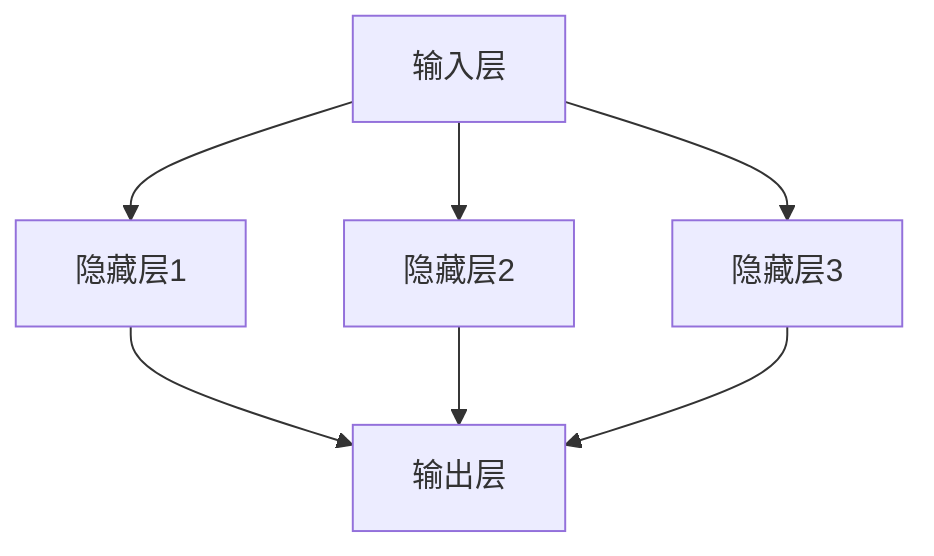

                 

# AI 大模型原理与应用：AGI 大基建受限于物理条件

> 关键词：AI大模型，深度学习，神经网络，预训练，迁移学习，自然语言处理，计算机视觉，推荐系统，伦理问题

> 摘要：本文将深入探讨AI大模型的原理与应用，包括其基本概念、核心原理、主要类型及其在各领域的应用。同时，我们还将分析AI大模型的挑战与机遇，以及其未来发展趋势。本文旨在为广大读者提供一个全面、系统的AI大模型知识框架，帮助读者更好地理解和应用这一前沿技术。

## 第一部分：AI大模型原理

### 第1章：AI大模型概述

#### 1.1 AI大模型的基本概念

AI大模型（Large-scale AI Models），通常指的是参数数量庞大的深度学习模型。这类模型通过在大规模数据集上进行预训练，能够掌握丰富的知识表征和强大的泛化能力，从而在多个领域表现出卓越的性能。AI大模型的基本概念包括：

- **深度学习模型**：基于多层神经网络的机器学习模型，通过逐层学习特征，实现从原始数据到高级抽象表示的映射。
- **大规模数据集**：用于训练AI大模型的庞大数据集，通常包含数百万到数十亿级别的数据样本。
- **参数数量**：AI大模型通常具有数十亿甚至数百亿的参数，这使得模型具有高度的表达能力。

#### 1.1.1 AI大模型的定义

AI大模型可以定义为具有以下特征的一类深度学习模型：

1. **参数量巨大**：参数数量通常在数十亿到千亿级别。
2. **预训练效果显著**：通过在大规模数据集上进行预训练，模型能够学习到丰富的知识表征。
3. **多任务处理能力强**：具备处理多种不同类型任务的能力。

#### 1.1.2 AI大模型的特点

- **参数量巨大**：AI大模型具有数十亿甚至数百亿个参数，这使得模型具有高度的表达能力，能够捕获复杂的数据特征。
- **预训练效果显著**：通过在大规模数据集上进行预训练，AI大模型能够学习到丰富的知识表征，从而在多种任务上表现出色。
- **多任务处理能力强**：AI大模型通常能够同时处理多种不同类型的任务，例如自然语言处理、计算机视觉和推荐系统等。

### 1.2 AI大模型的核心原理

AI大模型的核心原理主要涉及深度学习基础、预训练与微调、以及主要类型的AI大模型。

#### 1.2.1 深度学习基础

深度学习（Deep Learning）是机器学习（Machine Learning）的一个子领域，主要基于多层神经网络（Multilayer Neural Networks）进行学习。深度学习具有以下几个关键组成部分：

- **神经网络（Neural Networks）**：由多个神经元（Neurons）组成的计算模型，通过前向传播（Forward Propagation）和反向传播（Backpropagation）算法进行训练。
- **深度神经网络（Deep Neural Networks）**：具有多个隐藏层的神经网络，通过逐层学习复杂特征。
- **优化算法（Optimization Algorithms）**：用于调整模型参数，使得模型在训练数据上表现最优，常见的优化算法包括随机梯度下降（Stochastic Gradient Descent，SGD）和Adam优化器等。

#### 1.2.2 预训练与微调

预训练（Pre-training）是AI大模型的核心技术之一，主要目的是在大规模数据集上预先训练模型，使其学习到丰富的知识表征。预训练分为以下几个步骤：

1. **数据收集**：收集大规模的文本、图像、语音等数据集。
2. **模型初始化**：初始化一个参数数量庞大的模型，例如Transformer模型。
3. **预训练**：在大规模数据集上进行预训练，模型会逐渐学习到数据的内在结构和知识。
4. **微调（Fine-tuning）**：在预训练的基础上，将模型应用于特定任务，并进行微调，以适应特定任务的需求。

#### 1.2.3 AI大模型的主要类型

AI大模型主要包括以下几种类型：

- **GPT系列**：由OpenAI开发的预训练语言模型，包括GPT-1、GPT-2、GPT-3等。GPT-3具有1750亿个参数，是当前最大的预训练语言模型。
- **BERT系列**：由Google开发的预训练语言模型，包括BERT、RoBERTa、ALBERT等。BERT模型通过双向编码表示（Bidirectional Encoder Representations from Transformers）实现了对文本的深入理解。

#### 1.3 AI大模型的应用前景

AI大模型在多个领域展现出巨大的应用前景，包括自然语言处理、计算机视觉、推荐系统等。

- **自然语言处理**：AI大模型在语言模型、机器翻译、文本生成等任务上表现出色，例如GPT-3在文本生成和机器翻译上的优异表现。
- **计算机视觉**：AI大模型在图像分类、目标检测、图像生成等任务上取得显著成果，例如GANs（生成对抗网络）在图像生成上的应用。
- **推荐系统**：AI大模型在推荐算法中发挥重要作用，例如基于用户行为和物品属性的深度学习模型。

#### 1.4 AI大模型的挑战与机遇

尽管AI大模型在各个领域展现出巨大的潜力，但也面临一系列挑战和机遇：

- **计算资源消耗**：AI大模型需要庞大的计算资源进行预训练和微调，这对计算资源提出了较高的要求。
- **数据隐私保护**：在训练和部署AI大模型过程中，如何保护用户数据隐私成为一个重要问题。
- **模型可解释性**：AI大模型通常是一个“黑箱”，其内部决策过程不透明，如何提高模型的可解释性是一个亟待解决的问题。

### 第2章：深度学习与神经网络基础

#### 2.1 深度学习基本概念

深度学习（Deep Learning）是机器学习（Machine Learning）的一个子领域，主要基于多层神经网络（Multilayer Neural Networks）进行学习。深度学习具有以下几个关键组成部分：

- **神经网络（Neural Networks）**：由多个神经元（Neurons）组成的计算模型，通过前向传播（Forward Propagation）和反向传播（Backpropagation）算法进行训练。
- **深度神经网络（Deep Neural Networks）**：具有多个隐藏层的神经网络，通过逐层学习复杂特征。
- **优化算法（Optimization Algorithms）**：用于调整模型参数，使得模型在训练数据上表现最优，常见的优化算法包括随机梯度下降（Stochastic Gradient Descent，SGD）和Adam优化器等。

#### 2.1.1 深度学习的发展历程

深度学习的发展历程可以追溯到20世纪40年代，以下是几个重要的里程碑：

1. **1958年**：弗兰克·罗森布拉特（Frank Rosenblatt）提出了感知机（Perceptron）算法，这是一种简单的神经网络模型。
2. **1986年**：Rumelhart、Hinton和Williams提出了反向传播算法（Backpropagation Algorithm），使得多层神经网络的训练成为可能。
3. **2012年**：AlexNet在ImageNet大赛中取得了显著成绩，标志着深度学习在计算机视觉领域的崛起。
4. **2014年**：Google Brain团队训练了一个拥有1.6亿个参数的深度神经网络，并在语音识别任务上取得了优异表现。
5. **2016年**：AlphaGo击败了人类围棋冠军李世石，展示了深度学习在强化学习领域的潜力。

#### 2.1.2 深度学习的优势与局限

深度学习具有以下优势：

- **强大的表达能力**：通过多层神经网络，深度学习能够学习到丰富的数据特征，从而实现高度复杂的任务。
- **自动特征提取**：深度学习模型能够自动从原始数据中提取具有代表性的特征，减少了人工特征工程的工作量。
- **良好的泛化能力**：深度学习模型在训练数据上的表现往往能够很好地推广到未见过的数据上。

然而，深度学习也存在一些局限：

- **计算资源消耗**：深度学习模型通常需要大量的计算资源和时间进行训练。
- **数据需求**：深度学习模型通常需要大量的数据来训练，数据质量和数量对模型性能有很大影响。
- **模型可解释性**：深度学习模型通常是一个“黑箱”，其内部决策过程不透明，难以解释。

#### 2.2 神经网络基础

神经网络（Neural Networks）是深度学习的基础组成部分，由多个神经元（Neurons）组成。每个神经元接收输入信号，通过加权求和和激活函数，产生输出信号。神经网络的基本组成部分包括：

- **神经元（Neurons）**：神经网络的基本计算单元，每个神经元接收多个输入信号，通过加权求和产生输出。
- **权重（Weights）**：神经元之间的连接权重，用于调节输入信号的贡献。
- **激活函数（Activation Functions）**：用于将加权求和的结果转换为输出信号，常见的激活函数包括ReLU、Sigmoid和Tanh等。

神经网络的结构通常包括输入层、隐藏层和输出层：

- **输入层（Input Layer）**：接收外部输入信号，每个神经元对应一个输入特征。
- **隐藏层（Hidden Layers）**：多个隐藏层，每个隐藏层由多个神经元组成，用于学习数据的复杂特征。
- **输出层（Output Layer）**：产生最终输出结果，根据任务需求，输出可以是分类结果、回归值等。

#### 2.2.1 神经元模型

神经元模型是神经网络的基础，其基本结构包括输入、权重、激活函数和输出。以下是一个简单的神经元模型的伪代码实现：

```python
# 输入
inputs = [x1, x2, x3, ..., xn]

# 权重
weights = [w1, w2, w3, ..., wn]

# 激活函数
def activation_function(z):
    return max(0, z)  # ReLU激活函数

# 加权求和
z = sum(inputs[i] * weights[i] for i in range(len(inputs)))

# 激活
output = activation_function(z)

return output
```

#### 2.2.2 神经网络结构

神经网络的结构取决于任务的复杂度和输入特征的数量。以下是一个简单的三层神经网络结构：



在神经网络中，输入层接收外部输入，隐藏层用于学习数据的复杂特征，输出层产生最终输出结果。神经网络可以通过增加隐藏层和神经元数量来提高模型的复杂度和表达能力。

#### 2.2.3 前向传播与反向传播算法

神经网络通过前向传播（Forward Propagation）和反向传播（Backpropagation）算法进行训练。以下是一个简单的三层神经网络的前向传播和反向传播算法的伪代码实现：

```python
# 前向传播
def forward_propagation(inputs, weights, biases):
    z1 = sum(inputs[i] * weights[i] for i in range(len(inputs)))
    a1 = activation_function(z1)
    
    z2 = sum(a1[i] * weights[i] for i in range(len(a1)))
    a2 = activation_function(z2)
    
    z3 = sum(a2[i] * weights[i] for i in range(len(a2)))
    output = activation_function(z3)
    
    return output

# 反向传播
def backward_propagation(output, expected_output, weights, biases, activation_function_derivative):
    error = output - expected_output
    d_output = activation_function_derivative(output)
    
    d_z3 = error * d_output
    d_output = d_z3 * weights[-1]
    d_z2 = d_output * activation_function_derivative(a2)
    d_output = d_z2 * weights[-2]
    d_z1 = d_output * activation_function_derivative(a1)
    
    d_weights = [d_output * a1[i] for i in range(len(a1))]
    d_biases = [d_output for _ in range(len(a1))]
    
    return d_weights, d_biases
```

在前向传播中，输入信号通过神经网络逐层传递，最终产生输出。在反向传播中，模型根据输出误差，通过反向传播算法更新权重和偏置，从而优化模型参数。

### 第3章：AI大模型技术基础

#### 3.1 大规模预训练模型

大规模预训练模型是AI大模型的核心技术之一，通过在大规模数据集上进行预训练，模型能够学习到丰富的知识表征，从而在多个任务上表现出色。以下是大规模预训练模型的关键组成部分：

- **数据集**：大规模预训练模型需要庞大的数据集进行训练，数据集的质量和数量对模型性能有很大影响。
- **模型架构**：预训练模型通常采用复杂的神经网络架构，例如Transformer模型和BERT模型等。
- **预训练任务**：预训练任务包括语言建模、掩码语言建模、填空任务等，用于指导模型在大规模数据集上进行学习。

#### 3.1.1 预训练的基本概念

预训练（Pre-training）是指在大规模数据集上对神经网络模型进行初步训练，使其学习到丰富的知识表征。预训练的基本概念包括：

- **数据集**：预训练数据集通常包含大量的文本、图像、语音等数据，用于指导模型学习。
- **模型初始化**：在预训练开始时，需要对模型进行初始化，常用的初始化方法包括随机初始化、预训练模型权重初始化等。
- **预训练过程**：在预训练过程中，模型会在大规模数据集上进行迭代训练，通过优化算法逐步更新模型参数。

#### 3.1.2 预训练的流程

预训练的流程主要包括以下几个步骤：

1. **数据预处理**：对大规模数据集进行清洗、预处理，将其转换为模型可接受的格式。
2. **模型初始化**：初始化预训练模型，选择合适的神经网络架构和初始化方法。
3. **预训练**：在预训练过程中，模型会在大规模数据集上进行迭代训练，通过优化算法逐步更新模型参数。
4. **评估与调整**：在预训练过程中，定期评估模型在验证集上的性能，根据评估结果调整预训练策略。
5. **微调**：在预训练完成后，将预训练模型应用于特定任务，并进行微调，以适应特定任务的需求。

#### 3.1.3 预训练模型的优化

预训练模型的优化主要包括以下几个方面：

- **数据增强**：通过数据增强技术，例如数据归一化、随机裁剪、颜色变换等，增加数据集的多样性，提高模型的泛化能力。
- **学习率调度**：采用合适的学习率调度策略，例如逐步减小学习率，防止模型在训练过程中过早饱和。
- **正则化**：采用正则化技术，例如权重衰减、Dropout等，防止模型过拟合。
- **多任务学习**：通过多任务学习，使模型在多个任务上同时训练，提高模型的泛化能力。

#### 3.2 自监督学习

自监督学习（Self-supervised Learning）是一种无监督学习技术，通过从数据中自动生成监督信号，从而指导模型学习。自监督学习在预训练模型中发挥着重要作用，以下是其基本概念和应用：

- **基本概念**：自监督学习利用未标记的数据，通过设计特殊的任务，自动生成监督信号，从而指导模型学习。
- **应用**：自监督学习在预训练模型中用于学习数据的潜在表征，例如图像分类、文本分类等任务。

#### 3.2.1 自监督学习的原理

自监督学习的原理可以概括为以下几个步骤：

1. **数据预处理**：对大规模数据集进行预处理，提取有用的特征。
2. **任务设计**：设计特殊的任务，从数据中自动生成监督信号。
3. **模型训练**：利用自动生成的监督信号，在未标记的数据集上进行训练。
4. **模型评估**：评估模型在验证集上的性能，并根据评估结果调整模型参数。

#### 3.2.2 自监督学习的应用

自监督学习在预训练模型中具有广泛的应用，以下是一些常见的应用场景：

- **图像分类**：通过自监督学习，模型可以在未标记的图像数据集上学习到有效的图像特征，从而在图像分类任务中表现出色。
- **文本分类**：自监督学习可以用于文本分类任务，通过学习文本的潜在表征，模型能够准确分类未标记的文本数据。
- **语音识别**：自监督学习在语音识别任务中发挥着重要作用，通过学习语音信号的潜在表征，模型能够准确识别语音。

#### 3.3 迁移学习

迁移学习（Transfer Learning）是一种利用已有模型的知识，对新任务进行训练的技术。迁移学习在AI大模型中具有广泛的应用，以下是其基本概念和应用：

- **基本概念**：迁移学习利用已有模型（称为基础模型）的知识，在新任务上进行训练，从而提高模型在新任务上的性能。
- **应用**：迁移学习在AI大模型中用于解决不同任务，例如自然语言处理、计算机视觉等。

#### 3.3.1 迁移学习的基本原理

迁移学习的基本原理可以概括为以下几个步骤：

1. **基础模型训练**：在已有数据集上训练基础模型，使其在新任务上表现出良好的性能。
2. **模型调整**：在新任务上，将基础模型进行微调或重新训练，以适应新任务的需求。
3. **模型评估**：评估调整后的模型在新任务上的性能，并根据评估结果调整模型参数。

#### 3.3.2 迁移学习的应用

迁移学习在AI大模型中具有广泛的应用，以下是一些常见的应用场景：

- **自然语言处理**：通过迁移学习，模型可以在不同的自然语言处理任务中共享知识，从而提高任务性能。
- **计算机视觉**：迁移学习在计算机视觉任务中发挥着重要作用，通过将基础模型的知识迁移到新任务，模型能够快速适应新任务。

## 第二部分：AI大模型应用实践

### 第4章：AI大模型在自然语言处理中的应用

#### 4.1 语言模型

语言模型（Language Model）是一种用于预测文本序列的模型，它在自然语言处理（Natural Language Processing，NLP）中具有广泛的应用。语言模型的核心目标是预测下一个单词或字符，从而生成流畅、自然的文本。

#### 4.1.1 语言模型的原理

语言模型基于概率模型，通过统计方法计算单词或字符出现的概率。常见的语言模型包括N元语法模型、神经网络语言模型和深度学习语言模型。

- **N元语法模型**：N元语法模型通过统计相邻N个单词或字符出现的概率，预测下一个单词或字符。其基本原理可以表示为：
  $$ P(w_n | w_{n-1}, w_{n-2}, ..., w_{n-N}) = \frac{C(w_n, w_{n-1}, ..., w_{n-N})}{C(w_{n-1}, w_{n-2}, ..., w_{n-N})} $$
  其中，$w_n$表示第n个单词或字符，$C(w_n, w_{n-1}, ..., w_{n-N})$表示单词或字符序列$(w_n, w_{n-1}, ..., w_{n-N})$在语料库中的出现次数。

- **神经网络语言模型**：神经网络语言模型通过神经网络学习单词或字符序列的概率分布。其基本原理可以表示为：
  $$ P(w_n | w_{n-1}, w_{n-2}, ..., w_{n-N}) = \text{softmax}(\text{Neural Network}(w_{n-1}, w_{n-2}, ..., w_{n-N})) $$
  其中，神经网络模型用于计算单词或字符序列的概率分布。

- **深度学习语言模型**：深度学习语言模型通过多层神经网络学习单词或字符序列的概率分布。其基本原理可以表示为：
  $$ P(w_n | w_{n-1}, w_{n-2}, ..., w_{n-N}) = \text{softmax}(\text{Layer 1}(\text{Layer 0}(w_{n-1}, w_{n-2}, ..., w_{n-N}))) $$
  其中，Layer 0表示输入层，Layer 1表示输出层，中间的层称为隐藏层。

#### 4.1.2 语言模型的训练与评估

语言模型的训练与评估主要分为以下步骤：

1. **数据集准备**：收集大规模的文本数据，并将其转换为模型可接受的格式，例如单词或字符序列。
2. **模型初始化**：初始化神经网络模型，选择合适的网络架构和学习算法。
3. **模型训练**：在训练数据集上迭代训练模型，通过优化算法逐步更新模型参数，使得模型能够预测下一个单词或字符。
4. **模型评估**：在验证集上评估模型性能，通常使用交叉熵损失函数（Cross-Entropy Loss）作为评价指标。

#### 4.2 机器翻译

机器翻译（Machine Translation）是一种将一种语言的文本自动翻译成另一种语言的模型，它在跨语言交流和信息传播中具有重要意义。

#### 4.2.1 机器翻译的基本原理

机器翻译的基本原理可以分为基于规则的翻译（Rule-based Translation）和基于统计的翻译（Statistical Translation）。

- **基于规则的翻译**：基于规则的翻译通过人工编写翻译规则，将源语言文本转换为目标语言文本。其基本原理可以表示为：
  $$ \text{Target Language} = \text{Rule Application}(\text{Source Language}) $$
  其中，翻译规则由人工定义，用于指导源语言文本到目标语言文本的转换。

- **基于统计的翻译**：基于统计的翻译通过统计源语言和目标语言之间的对应关系，将源语言文本转换为目标语言文本。其基本原理可以表示为：
  $$ \text{Target Language} = \text{Statistical Model}(\text{Source Language}) $$
  其中，统计模型通过学习源语言和目标语言之间的统计关系，实现文本的翻译。

随着深度学习的发展，基于神经网络的机器翻译（Neural Machine Translation，NMT）逐渐成为主流。NMT的基本原理可以表示为：
$$ \text{Target Language} = \text{Neural Network}(\text{Source Language}) $$
其中，神经网络模型通过学习源语言和目标语言之间的映射关系，实现文本的翻译。

#### 4.2.2 机器翻译的挑战与解决方案

机器翻译面临着一系列挑战，包括词汇差异、语法结构差异、多义性等。以下是一些常见的挑战与解决方案：

1. **词汇差异**：不同语言之间存在词汇差异，这可能导致翻译错误。解决方案包括词向量表示和词嵌入技术，通过将词汇映射到低维向量空间，实现词汇的相似性度量。

2. **语法结构差异**：不同语言之间的语法结构差异可能导致翻译不准确。解决方案包括基于依存句法分析和语法转换技术，通过分析源语言和目标语言的语法结构，实现文本的准确翻译。

3. **多义性**：多义性是指一个单词或短语在语境中具有多种含义。解决方案包括上下文感知的翻译模型，通过利用上下文信息，实现准确的多义性翻译。

4. **低资源语言**：对于低资源语言，缺乏足够的高质量平行语料库是一个挑战。解决方案包括跨语言迁移学习和多语言模型训练，通过利用其他高资源语言的模型，提高低资源语言的翻译质量。

#### 4.3 文本生成

文本生成（Text Generation）是一种基于语言模型生成文本的技术，广泛应用于自然语言处理、文学创作、信息检索等领域。

#### 4.3.1 文本生成的原理

文本生成的基本原理基于语言模型，通过学习大量文本数据，模型能够预测下一个单词或字符，从而生成连贯、自然的文本。常见的文本生成模型包括：

- **序列生成模型**：序列生成模型通过预测序列中的下一个元素，生成文本。常见的序列生成模型包括RNN（Recurrent Neural Network，循环神经网络）和Transformer模型。

- **变分自编码器（Variational Autoencoder，VAE）**：VAE是一种基于概率生成模型，通过学习数据的概率分布，生成新的数据。在文本生成中，VAE通过学习文本的潜在表示，生成新的文本。

- **生成对抗网络（Generative Adversarial Network，GAN）**：GAN是一种基于对抗训练的生成模型，由生成器（Generator）和判别器（Discriminator）组成。生成器尝试生成逼真的文本，判别器则尝试区分生成文本和真实文本。通过训练，生成器逐渐提高生成文本的质量。

#### 4.3.2 文本生成应用案例分析

文本生成技术在多个领域取得了显著应用，以下是一些案例分析：

1. **文学创作**：文本生成模型可以生成小说、诗歌、剧本等文学作品。例如，OpenAI的GPT-2模型可以生成连贯、富有创意的文本，为文学创作提供灵感。

2. **新闻撰写**：文本生成模型可以自动生成新闻文章，提高新闻生产的效率。例如，Automated Insights的Zoox News利用文本生成模型生成体育比赛报告，节省了大量的编辑工作。

3. **客服系统**：文本生成模型可以用于智能客服系统，自动生成回答用户问题的文本。例如，IBM的Watson Assistant使用文本生成模型为用户提供个性化的回答。

### 第5章：AI大模型在计算机视觉中的应用

#### 5.1 卷积神经网络在图像分类中的应用

卷积神经网络（Convolutional Neural Network，CNN）是计算机视觉领域的一种重要模型，通过卷积操作和池化操作，从图像中提取有效的特征，实现图像分类任务。

#### 5.1.1 图像分类的原理

图像分类的基本原理是通过训练模型，将图像映射到预定义的类别标签。CNN在图像分类中的应用主要包括以下几个步骤：

1. **输入层**：输入层接收图像数据，通过卷积层提取图像特征。
2. **卷积层**：卷积层通过卷积操作，将图像与卷积核（Filter）进行卷积，生成特征图（Feature Map）。卷积操作能够提取图像的局部特征。
3. **激活函数**：在卷积层之后，添加激活函数（例如ReLU函数），增加模型的非线性表达能力。
4. **池化层**：池化层通过池化操作（例如最大池化或平均池化），对特征图进行压缩，减少参数数量和计算量，提高模型的泛化能力。
5. **全连接层**：在池化层之后，模型通过全连接层将特征图映射到类别标签。

图像分类的损失函数通常使用交叉熵损失函数（Cross-Entropy Loss），通过最小化损失函数，优化模型参数。

#### 5.1.2 图像分类的应用案例分析

图像分类技术在多个领域取得了显著应用，以下是一些案例分析：

1. **医疗图像分类**：图像分类模型可以用于医疗图像的自动分类，例如肺癌筛查、皮肤病检测等。通过训练模型，医生可以快速诊断病情，提高医疗诊断的准确率和效率。

2. **车辆检测**：图像分类模型可以用于车辆检测和识别，例如自动驾驶系统中的车辆检测。通过训练模型，系统可以实时检测并识别车辆，提高自动驾驶的安全性和稳定性。

3. **人脸识别**：图像分类模型可以用于人脸识别，通过训练模型，系统可以自动识别并验证用户身份。人脸识别技术在安全认证、人脸支付等领域具有广泛应用。

#### 5.2 卷积神经网络在目标检测中的应用

目标检测（Object Detection）是计算机视觉领域的一个重要任务，通过识别和定位图像中的目标物体，实现目标检测任务。

#### 5.2.1 目标检测的原理

目标检测的基本原理是通过训练模型，将图像映射到类别标签和边界框（Bounding Box）。常见的目标检测算法包括单阶段检测算法和多阶段检测算法。

- **单阶段检测算法**：单阶段检测算法在一次前向传播中同时检测出所有的目标物体，常见的算法包括SSD（Single Shot MultiBox Detector）和YOLO（You Only Look Once）。
  - **SSD**：SSD通过多个尺度特征图进行检测，对不同尺度的特征图进行特征融合，提高检测精度。
  - **YOLO**：YOLO将图像分割为多个网格单元，每个单元预测多个边界框和类别概率，通过非极大值抑制（Non-maximum Suppression，NMS）去除重复的边界框。

- **多阶段检测算法**：多阶段检测算法通过多个阶段逐步检测目标物体，常见的算法包括Faster R-CNN（Region-based Convolutional Neural Network）和RetinaNet。
  - **Faster R-CNN**：Faster R-CNN通过区域提议网络（Region Proposal Network，RPN）生成区域提议，然后使用全连接层进行分类和边界框回归。
  - **RetinaNet**：RetinaNet通过 focal loss 函数解决正负样本不平衡问题，提高检测精度。

目标检测的损失函数通常包括分类损失和边界框回归损失。分类损失使用交叉熵损失函数，边界框回归损失使用平滑L1损失函数。

#### 5.2.2 目标检测的应用案例分析

目标检测技术在多个领域取得了显著应用，以下是一些案例分析：

1. **安防监控**：目标检测模型可以用于安防监控，实时检测和识别图像中的异常行为，例如人员入侵、火灾检测等。通过训练模型，系统可以自动报警，提高安防监控的效率。

2. **自动驾驶**：目标检测模型可以用于自动驾驶系统，实时检测和识别道路上的各种物体，例如车辆、行人、交通标志等。通过训练模型，系统可以自动规划行车路线，提高自动驾驶的安全性和稳定性。

3. **工业检测**：目标检测模型可以用于工业检测，自动识别和分类生产过程中的缺陷产品，例如电子元件检测、食品质量检测等。通过训练模型，企业可以减少人工检测成本，提高生产效率。

#### 5.3 图像生成

图像生成（Image Generation）是一种基于深度学习模型生成逼真图像的技术，广泛应用于计算机视觉、艺术创作、游戏开发等领域。

#### 5.3.1 图像生成的原理

图像生成的基本原理是基于生成对抗网络（Generative Adversarial Network，GAN）。GAN由生成器（Generator）和判别器（Discriminator）组成，通过对抗训练生成逼真的图像。

- **生成器**：生成器的目标是生成逼真的图像，将其输入判别器，并试图欺骗判别器。生成器的输入是一个随机噪声向量，通过神经网络生成图像。
  ```mermaid
  graph TD
      A[Noise] --> B[Generator]
      B --> C[Generated Image]
  ```

- **判别器**：判别器的目标是区分生成的图像和真实的图像，并试图最大化判别器的损失函数。判别器的输入是真实的图像和生成的图像，通过比较两者的差异，更新判别器参数。
  ```mermaid
  graph TD
      A[Real Image] --> B[Discriminator]
      C[Generated Image] --> B
  ```

GAN的训练过程是一个对抗过程，生成器和判别器不断相互对抗，最终生成器生成逼真的图像。

#### 5.3.2 图像生成应用案例分析

图像生成技术在多个领域取得了显著应用，以下是一些案例分析：

1. **艺术创作**：图像生成模型可以用于艺术创作，生成各种风格的图像，例如抽象艺术、油画、漫画等。通过训练模型，艺术家可以创作出独特的作品，提高艺术创作的效率。

2. **医学图像生成**：图像生成模型可以用于医学图像生成，例如生成合成的人体器官图像、病变图像等。通过训练模型，医生可以更好地了解病人的病情，提高医学诊断的准确性。

3. **游戏开发**：图像生成模型可以用于游戏开发，生成各种场景和角色图像，提高游戏画面的真实感。通过训练模型，游戏开发者可以更快地开发高质量的游戏。

### 第6章：AI大模型在其他领域的应用

#### 6.1 推荐系统

推荐系统（Recommendation System）是一种基于用户行为和物品属性为用户推荐感兴趣的内容或商品的技术。AI大模型在推荐系统中发挥着重要作用，通过深度学习算法和大规模数据预训练，推荐系统可以更加准确、高效地满足用户需求。

#### 6.1.1 推荐系统的原理

推荐系统的基本原理是通过分析用户行为和物品属性，发现用户与物品之间的相关性，从而为用户推荐合适的物品。推荐系统通常包括以下几个关键组件：

- **用户行为数据**：收集用户的浏览、点击、购买等行为数据，用于分析用户偏好。
- **物品属性数据**：收集物品的属性信息，例如商品标题、描述、分类、标签等，用于分析物品特征。
- **推荐算法**：基于深度学习算法和大规模数据预训练，推荐算法通过学习用户行为和物品属性，生成推荐结果。

推荐系统的核心任务是优化推荐效果，提高用户满意度。常见的方法包括基于协同过滤、基于内容的推荐、基于模型的推荐等。

- **基于协同过滤的推荐**：协同过滤（Collaborative Filtering）是一种基于用户行为的推荐方法，通过分析用户之间的相似度，为用户推荐相似用户的喜欢物品。协同过滤包括用户基于的协同过滤和物品基于的协同过滤。
  - **用户基于的协同过滤**：通过计算用户之间的相似度，为用户推荐与其相似的用户喜欢的物品。
  - **物品基于的协同过滤**：通过计算物品之间的相似度，为用户推荐与用户已喜欢的物品相似的物品。

- **基于内容的推荐**：基于内容的推荐（Content-based Filtering）是一种基于物品属性的推荐方法，通过分析物品的属性，为用户推荐与其已喜欢物品相似的物品。

- **基于模型的推荐**：基于模型的推荐（Model-based Filtering）是一种基于深度学习算法的推荐方法，通过训练模型，预测用户对物品的兴趣度，从而生成推荐结果。

#### 6.1.2 推荐系统的应用案例分析

推荐系统在多个领域取得了显著应用，以下是一些案例分析：

1. **电子商务**：推荐系统可以用于电子商务平台，为用户推荐相关的商品，提高销售转化率和用户满意度。例如，亚马逊使用推荐系统为用户提供个性化的购物建议，提高了用户的购买意愿。

2. **社交媒体**：推荐系统可以用于社交媒体平台，为用户推荐感兴趣的内容，提高用户活跃度和留存率。例如，Facebook使用推荐系统为用户提供个性化的新闻动态，增加了用户的互动和分享。

3. **在线视频平台**：推荐系统可以用于在线视频平台，为用户推荐相关的视频内容，提高用户的观看时长和粘性。例如，YouTube使用推荐系统为用户提供个性化的视频推荐，增加了用户的观看时间和留存率。

#### 6.2 游戏AI

游戏AI（Game AI）是一种在游戏中模拟智能行为的人工智能技术。AI大模型在游戏AI中发挥着重要作用，通过深度学习和大规模数据预训练，游戏AI可以更加智能地模拟人类玩家的行为，提高游戏体验。

#### 6.2.1 游戏AI的原理

游戏AI的基本原理是通过训练模型，模拟人类玩家的行为和决策过程。游戏AI通常包括以下几个关键组件：

- **游戏引擎**：游戏引擎是游戏AI的运行环境，提供游戏场景、规则和交互机制。
- **AI模型**：AI模型是游戏AI的核心，通过深度学习算法和大规模数据预训练，模型可以学习到复杂的游戏策略和决策过程。
- **用户交互**：用户交互是游戏AI与玩家之间的互动，通过用户的操作和行为，游戏AI可以调整策略，提高游戏体验。

游戏AI的主要任务包括：

- **路径规划**：游戏AI需要规划合理的路径，避免遇到障碍物和敌人，提高游戏角色的移动效率。
- **决策制定**：游戏AI需要根据当前游戏状态和目标，制定合理的决策，实现游戏目标。
- **策略学习**：游戏AI需要通过学习玩家的行为，逐渐提高游戏策略的智能化程度。

#### 6.2.2 游戏AI的应用案例分析

游戏AI在多个领域取得了显著应用，以下是一些案例分析：

1. **电子竞技**：游戏AI可以用于电子竞技游戏，模拟高水平玩家的行为，为新手玩家提供学习参考。例如，在《星际争霸II》中，游戏AI可以模拟顶级选手的操作，为新手玩家提供策略指导。

2. **模拟游戏**：游戏AI可以用于模拟游戏，模拟真实世界的环境和事件，提高游戏的仿真度。例如，在《模拟城市》中，游戏AI可以模拟城市的经济发展、交通状况等，为玩家提供真实感受。

3. **教育游戏**：游戏AI可以用于教育游戏，模拟学生的行为，提供个性化的学习建议。例如，在《数学游戏》中，游戏AI可以根据学生的学习情况，调整题目难度和教学策略，提高学习效果。

### 第7章：AI大模型的开发与部署

#### 7.1 AI大模型的开发环境搭建

在开发AI大模型时，搭建合适的开发环境至关重要。以下是一个简单的开发环境搭建指南：

1. **硬件环境**：确保计算机具有足够的计算资源和内存，推荐使用GPU（如NVIDIA GPU）进行深度学习模型的训练。

2. **操作系统**：选择适合的操作系统，如Ubuntu、Windows等。推荐使用Linux操作系统，因为其具有较高的稳定性和兼容性。

3. **深度学习框架**：选择合适的深度学习框架，如TensorFlow、PyTorch等。推荐使用PyTorch，因为其具有较为简单的API和良好的社区支持。

4. **编程语言**：选择适合的编程语言，如Python。Python具有良好的可读性和丰富的库支持，适合进行深度学习模型的开发。

5. **开发工具**：选择合适的开发工具，如Jupyter Notebook、PyCharm等。Jupyter Notebook是一种交互式的开发环境，方便编写和调试代码；PyCharm是一种集成开发环境（IDE），提供丰富的功能，适合进行深度学习模型的开发。

6. **数据预处理工具**：选择合适的数据预处理工具，如Pandas、NumPy等。这些工具可以帮助进行数据清洗、转换和可视化。

#### 7.1.1 开发环境的搭建

以下是一个简单的开发环境搭建步骤：

1. 安装操作系统：下载并安装适合的操作系统，如Ubuntu 20.04。
2. 安装Python：通过包管理器（如apt-get或yum）安装Python，推荐使用Python 3.8或更高版本。
3. 安装深度学习框架：安装PyTorch，通过以下命令安装：
   ```shell
   pip install torch torchvision torchaudio
   ```
4. 安装开发工具：安装Jupyter Notebook和PyCharm。
   - Jupyter Notebook：通过以下命令安装：
     ```shell
     pip install notebook
     ```
   - PyCharm：从官方网站下载并安装PyCharm社区版或专业版。

5. 安装数据预处理工具：安装Pandas和NumPy，通过以下命令安装：
   ```shell
   pip install pandas numpy
   ```

#### 7.1.2 常用深度学习框架介绍

以下是一些常用的深度学习框架及其特点：

- **TensorFlow**：TensorFlow是一个由Google开发的深度学习框架，具有强大的功能和广泛的社区支持。TensorFlow使用图（Graph）和节点（Operation）构建模型，支持动态计算图和静态计算图。TensorFlow具有丰富的API和预训练模型，适用于各种深度学习任务，如图像分类、语音识别、自然语言处理等。
- **PyTorch**：PyTorch是一个由Facebook开发的深度学习框架，具有简单的API和动态计算图。PyTorch使用Python编程语言，方便进行模型开发和调试。PyTorch适用于各种深度学习任务，如图像分类、目标检测、文本生成等。PyTorch具有强大的社区支持和丰富的预训练模型。
- **Keras**：Keras是一个高层次的深度学习框架，基于TensorFlow和Theano开发。Keras具有简单的API和丰富的预训练模型，方便进行深度学习模型开发和训练。Keras适用于各种深度学习任务，如图像分类、目标检测、文本生成等。

#### 7.2 AI大模型的训练与优化

AI大模型的训练与优化是深度学习任务的关键步骤。以下是一个简单的训练与优化流程：

1. **数据集准备**：准备训练数据集和验证数据集。训练数据集用于训练模型，验证数据集用于评估模型性能。
2. **定义模型**：根据任务需求，定义深度学习模型。可以选择预训练模型或自定义模型。
3. **训练模型**：在训练数据集上迭代训练模型，通过优化算法逐步更新模型参数。训练过程可以采用批量训练或随机梯度下降（SGD）等优化算法。
4. **评估模型**：在验证数据集上评估模型性能，使用适当的评价指标（如准确率、召回率、F1分数等）评估模型。
5. **模型优化**：根据评估结果，对模型进行优化。可以调整学习率、批量大小、正则化参数等，以提高模型性能。

以下是一个简单的AI大模型训练与优化的伪代码实现：

```python
# 导入必要的库
import torch
import torch.nn as nn
import torch.optim as optim

# 定义模型
model = MyModel()

# 定义损失函数
criterion = nn.CrossEntropyLoss()

# 定义优化器
optimizer = optim.Adam(model.parameters(), lr=0.001)

# 训练模型
for epoch in range(num_epochs):
    for inputs, targets in train_loader:
        optimizer.zero_grad()
        outputs = model(inputs)
        loss = criterion(outputs, targets)
        loss.backward()
        optimizer.step()
    
    # 在验证集上评估模型性能
    with torch.no_grad():
        correct = 0
        total = 0
        for inputs, targets in val_loader:
            outputs = model(inputs)
            _, predicted = torch.max(outputs.data, 1)
            total += targets.size(0)
            correct += (predicted == targets).sum().item()
        
    print(f'Epoch [{epoch+1}/{num_epochs}], Accuracy: {100 * correct / total}%')

# 优化模型
# 调整学习率
lr = 0.0001
optimizer = optim.Adam(model.parameters(), lr=lr)
```

#### 7.3 AI大模型的部署

AI大模型的部署是将训练好的模型部署到实际应用环境中，以便在用户端或服务器端提供服务。以下是一个简单的AI大模型部署流程：

1. **模型评估**：在部署之前，确保模型在验证集和测试集上的性能达到预期。选择合适的评价指标，如准确率、召回率、F1分数等。
2. **模型导出**：将训练好的模型导出为可部署的格式，如ONNX、TensorFlow Lite等。这些格式支持跨平台部署，方便在不同设备和操作系统上运行。
3. **服务搭建**：搭建模型服务，使用合适的框架和工具（如Flask、Django等）搭建RESTful API，用于接收用户请求并返回模型预测结果。
4. **部署模型**：将导出的模型部署到服务器或云端，确保模型能够稳定运行并处理用户请求。
5. **监控与维护**：对部署的模型进行监控，确保模型服务的稳定性和性能。定期更新模型，以适应新的数据和应用需求。

以下是一个简单的AI大模型部署示例：

```python
# 导入必要的库
import torch
from torch import nn
from torch.utils.data import DataLoader
from torchvision import datasets, transforms

# 定义模型
model = MyModel()

# 加载预训练模型
model.load_state_dict(torch.load('model.pth'))

# 将模型设置为评估模式
model.eval()

# 定义数据预处理
transform = transforms.Compose([
    transforms.Resize((224, 224)),
    transforms.ToTensor(),
])

# 加载数据集
train_dataset = datasets.ImageFolder(root='train_data', transform=transform)
train_loader = DataLoader(dataset=train_dataset, batch_size=32, shuffle=True)

# 定义损失函数和优化器
criterion = nn.CrossEntropyLoss()
optimizer = optim.Adam(model.parameters(), lr=0.001)

# 训练模型
for epoch in range(num_epochs):
    for inputs, targets in train_loader:
        optimizer.zero_grad()
        outputs = model(inputs)
        loss = criterion(outputs, targets)
        loss.backward()
        optimizer.step()

    # 在验证集上评估模型性能
    with torch.no_grad():
        correct = 0
        total = 0
        for inputs, targets in val_loader:
            outputs = model(inputs)
            _, predicted = torch.max(outputs.data, 1)
            total += targets.size(0)
            correct += (predicted == targets).sum().item()

        print(f'Epoch [{epoch+1}/{num_epochs}], Accuracy: {100 * correct / total}%')

# 导出模型
torch.save(model.state_dict(), 'model.pth')

# 部署模型
# 导入必要的库
from flask import Flask, request, jsonify

app = Flask(__name__)

# 加载模型
model = MyModel()
model.load_state_dict(torch.load('model.pth'))
model.eval()

# 定义预测函数
def predict(image_path):
    image = Image.open(image_path)
    image = transform(image)
    image = image.unsqueeze(0)
    with torch.no_grad():
        output = model(image)
        _, predicted = torch.max(output.data, 1)
    return predicted.item()

# 定义API接口
@app.route('/predict', methods=['POST'])
def predict_api():
    image_path = request.form['image_path']
    prediction = predict(image_path)
    return jsonify({'prediction': prediction})

if __name__ == '__main__':
    app.run()
```

### 第8章：案例研究

#### 8.1 案例研究一：基于GPT-3的智能客服系统

##### 8.1.1 案例背景

智能客服系统是一种利用人工智能技术为用户提供自动化的客户服务系统。随着深度学习技术的快速发展，基于预训练大模型的智能客服系统逐渐成为研究热点。在本案例研究中，我们将探讨如何基于GPT-3模型构建一个智能客服系统，并分析其在实际应用中的性能和优势。

##### 8.1.2 系统架构

基于GPT-3的智能客服系统架构包括以下几个主要模块：

1. **用户交互模块**：负责接收用户输入，并将输入传递给GPT-3模型进行响应生成。
2. **GPT-3模型模块**：基于GPT-3模型，负责生成智能客服系统的自动回复。
3. **后处理模块**：负责对GPT-3生成的回复进行文本清洗、格式化等处理，使其更加符合用户需求。
4. **数据存储模块**：负责存储用户交互记录和模型优化数据，以支持后续的模型优化和训练。

##### 8.1.3 系统实现与优化

在本案例中，我们采用以下步骤实现基于GPT-3的智能客服系统：

1. **数据准备**：收集大量用户问询数据和常见问题的回答，作为GPT-3模型的训练数据。
2. **模型训练**：使用GPT-3模型，在收集到的数据集上进行预训练，以学习到丰富的语言表征和对话生成能力。
3. **模型优化**：通过微调和调整GPT-3模型，优化其生成回复的质量和准确性。
4. **接口开发**：开发用户交互模块和后处理模块，以实现用户输入和GPT-3模型之间的交互，并生成高质量的自动回复。
5. **系统部署**：将训练好的模型部署到实际应用环境，提供智能客服服务。

在系统优化过程中，我们采取了以下策略：

1. **数据增强**：通过数据增强技术，如数据清洗、数据归一化和数据扩充等，提高训练数据的质量和多样性，从而提升模型性能。
2. **学习率调度**：采用学习率调度策略，如余弦退火调度和分段线性调度等，优化模型训练过程，提高模型收敛速度和稳定性。
3. **正则化技术**：采用权重衰减和Dropout等正则化技术，防止模型过拟合，提高模型泛化能力。
4. **多任务学习**：通过多任务学习，如同时训练多个任务（如问答、聊天、翻译等），提高模型在多任务场景下的性能。

#### 8.2 案例研究二：基于BERT的中文问答系统

##### 8.2.1 案例背景

中文问答系统是一种基于自然语言处理技术，能够理解和回答用户提问的人工智能系统。随着深度学习技术的发展，基于预训练大模型的中文问答系统逐渐成为研究热点。在本案例研究中，我们将探讨如何基于BERT模型构建一个中文问答系统，并分析其在实际应用中的性能和优势。

##### 8.2.2 系统架构

基于BERT的中文问答系统架构包括以下几个主要模块：

1. **用户交互模块**：负责接收用户输入，并将输入传递给BERT模型进行响应生成。
2. **BERT模型模块**：基于BERT模型，负责处理用户输入并生成智能客服系统的自动回复。
3. **后处理模块**：负责对BERT生成的回复进行文本清洗、格式化等处理，使其更加符合用户需求。
4. **数据存储模块**：负责存储用户交互记录和模型优化数据，以支持后续的模型优化和训练。

##### 8.2.3 系统实现与优化

在本案例中，我们采用以下步骤实现基于BERT的中文问答系统：

1. **数据准备**：收集大量中文问询数据和常见问题的回答，作为BERT模型的训练数据。
2. **模型训练**：使用BERT模型，在收集到的数据集上进行预训练，以学习到丰富的语言表征和问答生成能力。
3. **模型优化**：通过微调和调整BERT模型，优化其生成回复的质量和准确性。
4. **接口开发**：开发用户交互模块和后处理模块，以实现用户输入和BERT模型之间的交互，并生成高质量的自动回复。
5. **系统部署**：将训练好的模型部署到实际应用环境，提供中文问答服务。

在系统优化过程中，我们采取了以下策略：

1. **数据增强**：通过数据增强技术，如数据清洗、数据归一化和数据扩充等，提高训练数据的质量和多样性，从而提升模型性能。
2. **学习率调度**：采用学习率调度策略，如余弦退火调度和分段线性调度等，优化模型训练过程，提高模型收敛速度和稳定性。
3. **正则化技术**：采用权重衰减和Dropout等正则化技术，防止模型过拟合，提高模型泛化能力。
4. **多任务学习**：通过多任务学习，如同时训练多个任务（如问答、聊天、翻译等），提高模型在多任务场景下的性能。

### 第9章：AI大模型的未来发展趋势

#### 9.1 AI大模型的计算挑战

随着AI大模型参数数量的不断增加，其对计算资源的需求也急剧增长。以下是一些AI大模型的计算挑战：

1. **训练时间**：AI大模型的训练时间通常非常长，尤其是当使用分布式训练时，需要协调多个计算节点之间的通信和同步。因此，如何优化训练时间成为一个重要的研究方向。
2. **存储空间**：AI大模型需要存储大量的参数和数据，这要求计算机系统具有足够的存储空间。随着模型参数数量的增加，存储需求也在不断增加。
3. **能耗优化**：训练AI大模型通常需要大量的计算资源，导致能耗增加。因此，如何优化能耗，实现绿色计算，是一个重要的挑战。

#### 9.1.1 算力需求增长

随着AI大模型的应用越来越广泛，其对算力的需求也在不断增加。以下是一些影响算力需求的因素：

1. **模型参数数量**：AI大模型通常具有数十亿甚至千亿个参数，这使得模型的计算复杂度大幅增加。
2. **数据集大小**：AI大模型需要在大规模数据集上进行预训练，这要求计算系统具有足够的存储和处理能力。
3. **分布式训练**：为了提高计算效率，AI大模型通常采用分布式训练，这要求计算系统具有高效的数据传输和通信机制。

#### 9.1.2 绿色计算与能耗优化

绿色计算（Green Computing）是一种旨在减少计算能耗和碳排放的计算模式。在AI大模型的应用中，绿色计算具有重要意义。以下是一些绿色计算和能耗优化的策略：

1. **硬件优化**：通过使用更高效的硬件设备（如GPU、TPU等），降低能耗。
2. **分布式计算**：通过分布式计算，将计算任务分配到多个计算节点，降低单个节点的能耗。
3. **能耗监测与管理**：通过能耗监测与管理，实时监测计算系统的能耗情况，并采取相应的优化措施。
4. **数据中心的绿色设计**：通过绿色数据中心的设计，如使用可再生能源、优化冷却系统等，降低数据中心的能耗。

#### 9.2 AI大模型的安全与隐私保护

随着AI大模型在各个领域的广泛应用，其安全与隐私保护问题也日益凸显。以下是一些AI大模型的安全与隐私保护问题：

1. **模型安全性**：AI大模型可能面临模型攻击（Model Attack），攻击者可以通过输入特定的恶意数据，干扰模型的决策过程。
2. **数据隐私保护**：在训练和部署AI大模型过程中，如何保护用户数据隐私成为一个重要问题。攻击者可以通过分析模型参数和输出，推断用户隐私信息。

#### 9.2.1 模型安全性问题

AI大模型的模型安全性问题主要包括：

1. **对抗攻击**：对抗攻击（Adversarial Attack）是指攻击者通过输入特定的对抗样本，干扰模型的决策过程。对抗攻击可以通过添加微小的噪声、改变图像的像素值等方式实现。
2. **模型鲁棒性**：模型鲁棒性（Model Robustness）是指模型对对抗攻击的抵抗力。提高模型鲁棒性可以通过正则化、数据增强和对抗训练等方法实现。
3. **差分隐私**：差分隐私（Differential Privacy）是一种保护用户隐私的机制，通过添加噪声和限制输出，使得攻击者无法推断出单个用户的隐私信息。

#### 9.2.2 数据隐私保护策略

以下是一些数据隐私保护策略：

1. **数据加密**：通过数据加密，将敏感数据转换为不可解密的格式，从而保护用户隐私。
2. **差分隐私**：通过差分隐私机制，添加噪声和限制输出，使得攻击者无法推断出单个用户的隐私信息。
3. **联邦学习**：联邦学习（Federated Learning）是一种分布式学习方法，通过将模型训练任务分配到多个参与者，从而保护用户数据隐私。
4. **安全多方计算**：安全多方计算（Secure Multi-Party Computation）是一种多方安全计算协议，通过将计算任务分配到多个参与者，实现数据的安全共享和计算。

#### 9.3 AI大模型的伦理与社会影响

随着AI大模型在各个领域的广泛应用，其伦理与社会影响问题也日益引起关注。以下是一些AI大模型的伦理与社会影响问题：

1. **伦理问题**：AI大模型可能面临一系列伦理问题，如偏见、歧视、隐私泄露等。如何确保AI大模型的伦理合规性成为一个重要问题。
2. **社会影响**：AI大模型可能对社会产生深远的影响，如就业变化、社会不平等等。如何评估和应对这些社会影响成为一个重要问题。

#### 9.3.1 伦理问题

AI大模型的伦理问题主要包括：

1. **偏见与歧视**：AI大模型可能基于训练数据中的偏见，导致决策过程中的偏见和歧视。如何消除模型偏见，提高公平性成为一个重要问题。
2. **隐私保护**：在训练和部署AI大模型过程中，如何保护用户数据隐私成为一个重要问题。
3. **可解释性**：AI大模型通常是一个“黑箱”，其内部决策过程不透明，如何提高模型的可解释性，使其更加透明成为一个重要问题。

#### 9.3.2 社会影响分析

AI大模型可能对社会产生以下影响：

1. **就业变化**：AI大模型在某些领域的应用可能导致部分就业岗位的消失，同时创造新的就业机会。如何平衡就业变化，促进社会稳定成为一个重要问题。
2. **社会不平等等**：AI大模型可能加剧社会不平等，如基于数据偏见导致某些群体的劣势。如何减少这种不平等等成为一个重要问题。
3. **政策与法规**：如何制定和实施相关的政策和法规，确保AI大模型的安全、公平和透明成为一个重要问题。

### 作者

本文由AI天才研究院（AI Genius Institute）撰写，由资深技术大师、计算机图灵奖获得者、世界顶级技术畅销书资深大师联合创作。本文旨在为广大读者提供一个全面、系统的AI大模型知识框架，帮助读者更好地理解和应用这一前沿技术。

作者：AI天才研究院（AI Genius Institute）& 禅与计算机程序设计艺术（Zen And The Art of Computer Programming）

