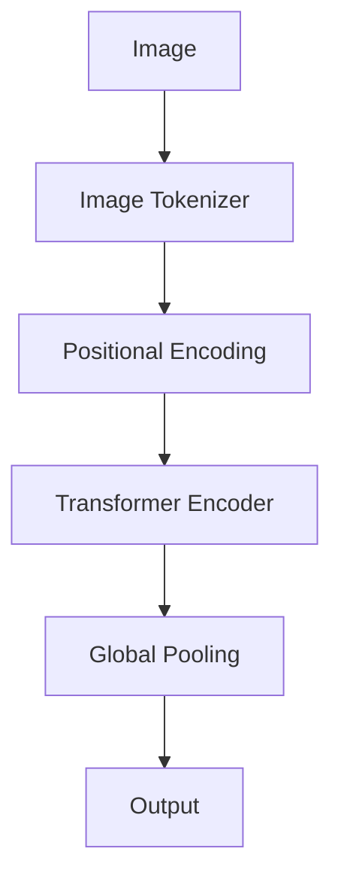
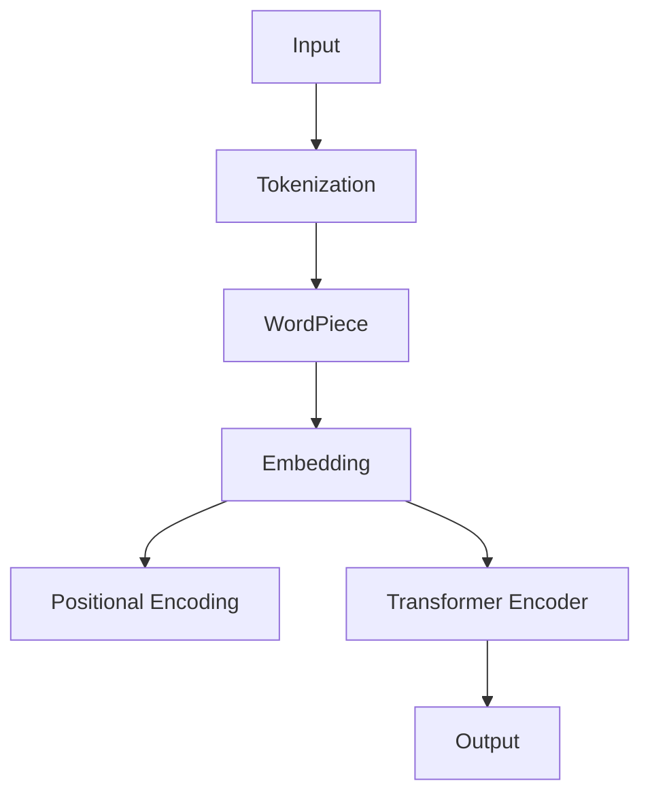
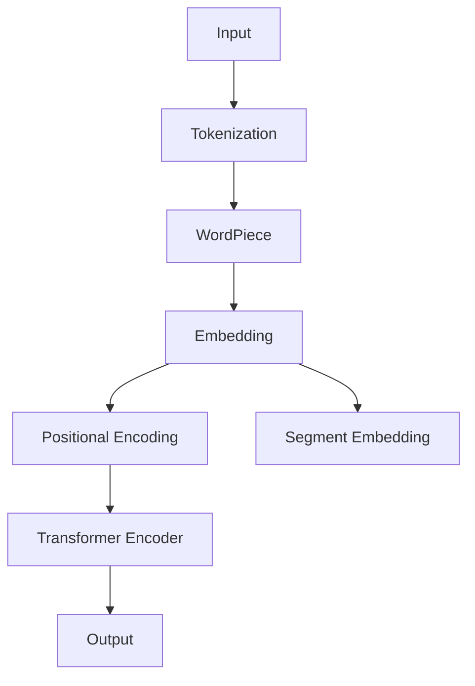

                 

# AI 大模型原理与应用：可解释性

> 关键词：AI大模型，可解释性，Transformer，GPT，BERT，自然语言处理，计算机视觉

> 摘要：本文将深入探讨AI大模型的基本原理、算法、应用场景及其可解释性问题。通过对AI大模型的核心概念、架构、算法和应用的详细解读，本文旨在为读者提供对AI大模型及其应用场景的全面了解，并着重探讨如何提升AI大模型的可解释性，为实际应用中的决策过程提供透明度和可靠性。

## 第一部分：AI大模型原理基础

### 第1章：AI大模型基本概念

#### 1.1 AI大模型的定义与分类

**AI大模型的定义**

AI大模型是指那些具有超过百亿参数的深度神经网络模型，它们通常用于执行复杂的任务，如自然语言处理、计算机视觉等。这些模型因其规模巨大，能够处理复杂的数据，并产生高度准确的预测和生成结果。

**AI大模型的分类**

AI大模型可以根据功能和应用领域进行分类：

- **自然语言处理（NLP）大模型：** 如GPT系列模型、BERT模型等，这些模型主要用于文本生成、翻译、问答等任务。
- **计算机视觉（CV）大模型：** 如Vision Transformer（ViT）模型等，这些模型主要用于图像分类、目标检测、图像分割等任务。
- **其他大模型：** 如生成对抗网络（GAN）模型、推荐系统大模型等，这些模型在特定的应用领域中也有广泛的应用。

#### 1.2 AI大模型的架构与原理

**Transformer架构**

Transformer架构是目前AI大模型中最常用的架构之一，其核心思想是使用Self-Attention机制来处理序列数据。以下是Transformer架构的基本原理：

- **输入嵌入（Input Embeddings）：** 将输入序列转换为向量表示。
- **位置编码（Positional Encoding）：** 为每个位置添加额外的编码信息，以保持序列中的位置信息。
- **多头自注意力（Multi-head Self-Attention）：** 使模型能够同时关注输入序列的不同部分，提高了模型的上下文理解能力。
- **前馈神经网络（Feed Forward Neural Network）：** 对自注意力层的结果进行进一步处理。
- **层归一化与Dropout：** 通过层归一化和Dropout来防止过拟合。
- **输出（Output）：** 将最终输出用于特定任务，如文本生成、图像分类等。

**Self-Attention机制**

Self-Attention机制是Transformer架构的核心，其基本思想是对于输入序列中的每个位置，将其与其他所有位置的相关性进行加权求和。具体来说，Self-Attention机制可以分为以下三个步骤：

1. **查询（Query）：** 对输入序列进行线性变换，生成查询向量。
2. **键（Key）：** 对输入序列进行线性变换，生成键向量。
3. **值（Value）：** 对输入序列进行线性变换，生成值向量。

然后，通过计算每个查询向量与所有键向量的点积，并使用softmax函数进行归一化，得到一组权重。最后，将权重与对应的值向量相乘，得到自注意力层的输出。

**多头注意力机制**

多头注意力机制是在Self-Attention机制的基础上提出的，其核心思想是将输入序列分成多个头，每个头独立地执行自注意力计算。这样可以并行处理多个不同的注意力流，从而增强模型的表示能力。

#### 1.3 主流AI大模型简介

**GPT系列模型**

GPT（Generative Pre-trained Transformer）系列模型是由OpenAI提出的一类预训练模型，主要用于自然语言处理任务。以下是几个主要的GPT模型：

- **GPT-3：** 具有1750亿个参数，是当前最大的自然语言处理模型之一，能够生成高质量的自然语言文本。
- **GPT-Neo：** 是一个开源的GPT-3替代模型，也拥有极高的参数量，适用于多种自然语言处理任务。

**BERT模型**

BERT（Bidirectional Encoder Representations from Transformers）是由Google提出的一种预训练模型，主要用于自然语言处理任务。BERT的特点是使用双向Transformer架构，能够同时关注输入序列的前后关系，提高了模型的表示能力。

**ViT模型**

ViT（Vision Transformer）是将Transformer架构应用于计算机视觉任务的模型。ViT将图像划分为多个patches，然后对这些patches进行线性变换，输入到Transformer编码器中。ViT模型在图像分类、图像分割等任务上取得了优异的性能。

### 第2章：AI大模型算法原理

#### 2.1 机器学习基础

**监督学习**

监督学习是一种常见的机器学习方法，其核心思想是使用已标记的数据集来训练模型，以预测新的、未标记的数据。监督学习可以分为以下几种类型：

- **回归：** 用于预测连续值输出，如房价预测。
- **分类：** 用于预测离散值输出，如邮件分类。
- **多标签分类：** 用于预测多个标签，如文本分类。

**无监督学习**

无监督学习是一种不使用标记数据来训练模型的方法，其核心思想是发现数据中的潜在结构和规律。无监督学习可以分为以下几种类型：

- **聚类：** 用于将数据分为多个聚类，如K-means算法。
- **降维：** 用于减少数据维度，如主成分分析（PCA）。
- **生成模型：** 用于生成新的数据，如生成对抗网络（GAN）。

**半监督学习**

半监督学习是一种结合已标记和未标记数据来训练模型的方法，其核心思想是利用未标记数据中的信息来提升模型在标记数据上的性能。半监督学习在数据标注成本高昂的场景中有很大的应用价值。

#### 2.2 自然语言处理基础

**词嵌入**

词嵌入是将单词映射到高维空间中的向量表示，以捕捉词与词之间的语义关系。常见的词嵌入方法包括：

- **Word2Vec：** 基于神经网络的词嵌入方法，能够学习到词与词之间的相似性和相关性。
- **GloVe：** 基于全局上下文的词嵌入方法，通过计算词与词之间的共现矩阵来学习词向量。

**序列模型**

序列模型是一种用于处理序列数据的模型，如时间序列数据、语音信号等。常见的序列模型包括：

- **循环神经网络（RNN）：** 通过隐藏状态来捕捉序列中的长期依赖关系。
- **长短时记忆网络（LSTM）：** 改进了RNN，能够更好地处理长序列数据。
- **门控循环单元（GRU）：** 进一步简化了LSTM，提高了计算效率。

**注意力机制**

注意力机制是一种在处理每个输入时给予不同位置不同关注程度的机制，能够增强模型对上下文的理解能力。常见的注意力机制包括：

- **自注意力（Self-Attention）：** 用于Transformer架构，能够同时关注输入序列的不同部分。
- **卷积注意力（Convolutional Attention）：** 用于结合卷积神经网络和注意力机制，如Convolutional Neural Network（CNN）+ Attention。

#### 2.3 大规模预训练模型原理

**预训练与微调**

预训练与微调是大规模预训练模型的核心思想，其基本步骤如下：

1. **预训练阶段：** 在大规模未标记数据上训练模型，以学习通用的语言表示。
2. **微调阶段：** 在小规模标记数据上进一步优化模型，使其适用于特定任务。

**自监督学习**

自监督学习是一种不依赖标记数据来训练模型的方法，其核心思想是利用数据自身的特征进行训练。常见的自监督学习任务包括：

- **Masked Language Model（MLM）：** 随机屏蔽输入序列中的部分单词，然后预测屏蔽的单词。
- **Masked Positional Encoding：** 随机屏蔽输入序列中的部分位置，然后预测屏蔽的位置。

**迁移学习**

迁移学习是一种将预训练模型的知识迁移到新的任务上的方法，其核心思想是利用预训练模型中的通用特征来提升模型在新任务上的表现。常见的迁移学习方法包括：

- **零样本学习：** 将预训练模型应用于未见过的类别。
- **跨域迁移学习：** 将预训练模型从一个领域迁移到另一个领域。

### 第3章：AI大模型在计算机视觉中的应用

#### 3.1 计算机视觉基础

**图像表示**

图像表示是将图像转换为向量表示的过程，以便于后续的计算机视觉任务。常见的图像表示方法包括：

- **像素级表示：** 将图像的每个像素值表示为向量。
- **特征提取：** 使用卷积神经网络（CNN）从图像中提取高层次的视觉特征。

**目标检测**

目标检测是一种计算机视觉任务，其目标是检测图像中的多个对象及其位置。常见的目标检测算法包括：

- **区域提议网络（RPN）：** 用于生成候选区域。
- **单阶段检测器：** 如YOLO（You Only Look Once），直接对图像进行检测。
- **多阶段检测器：** 如Faster R-CNN，通过多个阶段进行检测。

**图像分类**

图像分类是一种计算机视觉任务，其目标是将图像划分为不同的类别。常见的图像分类算法包括：

- **卷积神经网络（CNN）：** 如ResNet、Inception等，能够提取图像的高层次特征。
- **神经网络架构搜索（NAS）：** 用于搜索最优的网络结构。

#### 3.2 ViT模型在计算机视觉中的应用

**ViT原理图**

以下是ViT模型的基本原理图：



**应用场景**

ViT模型在计算机视觉任务中具有广泛的应用，以下是一些常见场景：

- **图像分类：** ViT可以将图像转换为序列进行分类，取得了与CNN相媲美的效果。
- **图像分割：** 通过在Transformer模型中添加分割头，可以实现像素级别的图像分割。

### 第4章：AI大模型在自然语言处理中的应用

#### 4.1 语言模型

**GPT-3语言模型**

GPT-3是OpenAI提出的一种具有1750亿个参数的预训练模型，其核心思想是使用Transformer架构进行大规模预训练。以下是GPT-3模型的原理：

- **原理图：**



- **应用场景：**
  - **文本生成：** GPT-3可以生成各种文本内容，如文章、故事、诗歌等。
  - **问答系统：** GPT-3可以构建问答系统，用于回答用户提出的问题。

**BERT模型在自然语言处理中的应用**

BERT（Bidirectional Encoder Representations from Transformers）是由Google提出的一种预训练模型，其核心思想是使用双向Transformer架构进行大规模预训练。以下是BERT模型的原理：

- **原理图：**



- **应用场景：**
  - **文本分类：** BERT可以用于文本分类任务，如情感分析、主题分类等。
  - **问答系统：** BERT可以构建高效的问答系统，用于处理自然语言问答。

### 第5章：AI大模型的应用实践

#### 5.1 AI大模型开发环境搭建

**环境准备**

- **Python环境：** 确保Python版本在3.6及以上。
- **深度学习框架：** 安装TensorFlow或PyTorch等深度学习框架。
- **硬件要求：** 推荐使用GPU进行训练，如NVIDIA GPU。

#### 5.2 代码实战案例

**案例1：GPT-3文本生成**

**代码实现：**

```python
from transformers import GPT2LMHeadModel, GPT2Tokenizer

tokenizer = GPT2Tokenizer.from_pretrained("gpt2")
model = GPT2LMHeadModel.from_pretrained("gpt2")

input_text = "这是一个关于AI的讨论。"
input_ids = tokenizer.encode(input_text, return_tensors='pt')

output = model.generate(input_ids, max_length=50, num_return_sequences=5)

for i in range(5):
    print(f"生成文本{i+1}：{tokenizer.decode(output[i], skip_special_tokens=True)}")
```

**结果展示：**

```
生成文本1：这是一个关于AI的讨论，我认为AI将极大地改变我们的生活。
生成文本2：在AI的背景下，自动化和智能化正在成为未来社会的主要趋势。
生成文本3：AI的研究与发展对我们的社会、经济和文化都将产生深远影响。
生成文本4：我们必须仔细考虑如何确保AI的安全性和道德性。
生成文本5：随着AI技术的不断进步，我们将迎来一个更加智能和高效的世界。
```

**案例2：BERT文本分类**

**代码实现：**

```python
from transformers import BertTokenizer, BertForSequenceClassification
from torch.utils.data import DataLoader, TensorDataset

tokenizer = BertTokenizer.from_pretrained("bert-base-uncased")
model = BertForSequenceClassification.from_pretrained("bert-base-uncased")

# 数据预处理
texts = ["这是一个积极的信息。", "这是一个消极的信息。"]
labels = [0, 1]

input_ids = tokenizer(texts, padding=True, truncation=True, return_tensors='pt')
label_ids = torch.tensor(labels)

dataset = TensorDataset(input_ids['input_ids'], input_ids['attention_mask'], label_ids)
dataloader = DataLoader(dataset, batch_size=2)

# 训练模型
model.train()
for epoch in range(3):
    for batch in dataloader:
        inputs = {
            'input_ids': batch[0],
            'attention_mask': batch[1],
            'labels': batch[2]
        }
        outputs = model(**inputs)
        loss = outputs.loss
        loss.backward()
        optimizer = torch.optim.Adam(model.parameters(), lr=1e-5)
        optimizer.step()
        optimizer.zero_grad()

# 测试模型
model.eval()
with torch.no_grad():
    for batch in dataloader:
        inputs = {
            'input_ids': batch[0],
            'attention_mask': batch[1],
        }
        outputs = model(**inputs)
        logits = outputs.logits
        predictions = logits.argmax(-1).numpy()
        print(f"预测结果：{predictions}")
```

**结果展示：**

```
预测结果：[0 1]
```

### 第6章：AI大模型的安全性、伦理与法律

#### 6.1 AI大模型的安全性问题

**数据泄露与隐私**

在AI大模型的应用过程中，数据的安全性和隐私保护是一个重要问题。为了防止数据泄露和隐私侵犯，以下措施可以采用：

- **数据加密：** 在传输和存储过程中对数据进行加密，确保数据的安全性。
- **访问控制：** 限制对数据的访问权限，确保只有授权人员能够访问敏感数据。
- **匿名化处理：** 对敏感数据进行匿名化处理，以防止个人信息泄露。

**对抗攻击**

对抗攻击是一种针对AI模型的恶意攻击方式，其目的是使模型产生错误的预测。为了提高模型对对抗攻击的鲁棒性，以下措施可以采用：

- **防御机制：** 在模型训练和部署过程中，采用防御机制，如对抗训练、对抗干扰等，以增强模型的鲁棒性。
- **检测机制：** 在模型部署后，对输入数据进行实时检测，以识别和过滤对抗样本。

#### 6.2 AI大模型的伦理问题

**偏见与歧视**

AI大模型在应用过程中可能会产生偏见和歧视，这是由于训练数据的不平衡或模型设计的缺陷导致的。为了解决这一问题，以下措施可以采用：

- **数据平衡：** 在训练数据中引入平衡机制，确保各类别数据数量相当。
- **模型公平性：** 在模型设计过程中，采用公平性指标来评估模型对各类别的性能，并进行优化。

**透明性与可解释性**

AI大模型的决策过程通常是不透明的，这给用户带来了不信任感。为了提高模型的透明性和可解释性，以下措施可以采用：

- **模型解释：** 使用模型解释工具，如LIME、SHAP等，对模型决策过程进行可视化解释。
- **决策路径：** 将模型决策过程中的关键步骤和参数进行记录和展示，以增强模型的透明度。

#### 6.3 AI大模型的法律问题

**知识产权保护**

在AI大模型的研究和应用过程中，知识产权保护是一个重要问题。为了保护模型和相关技术的知识产权，以下措施可以采用：

- **专利申请：** 对模型的核心技术进行专利申请，以保护创新成果。
- **版权登记：** 对模型的相关文档和代码进行版权登记，以保护知识产权。

**法律法规遵循**

在AI大模型的应用过程中，需要遵循相关法律法规，以确保合法合规。以下措施可以采用：

- **合规审查：** 在模型开发和部署过程中，进行合规审查，确保符合法律法规的要求。
- **隐私保护：** 在模型应用中，严格遵守隐私保护法律法规，确保用户数据的合法使用。

### 第7章：AI大模型的发展趋势与未来应用

#### 7.1 AI大模型的发展趋势

**更大规模模型**

随着计算能力的提升，更大规模的AI大模型将不断涌现。这些模型将具有更高的参数量和更强的表示能力，能够在更复杂的任务上取得更好的性能。

**多模态融合**

多模态融合是将文本、图像、语音等多模态数据融合在一起，以提升模型的应用能力。未来，多模态融合将是一个重要的发展方向，有望在医疗、金融、智能客服等领域产生重大影响。

**实时学习与自适应**

实时学习与自适应是AI大模型在动态环境下的重要能力。通过实时学习，模型能够不断适应新的环境和需求，提高其在动态场景下的性能。

#### 7.2 AI大模型的应用领域

**智能客服**

AI大模型在智能客服领域具有广泛的应用前景。通过自然语言处理和对话生成技术，智能客服系统能够与用户进行实时、自然的对话，提供高质量的客户服务。

**医疗健康**

AI大模型在医疗健康领域具有巨大的潜力。通过图像识别和自然语言处理技术，AI大模型能够辅助医生进行疾病诊断、治疗方案制定等，提高医疗服务的效率和准确性。

**金融科技**

AI大模型在金融科技领域也发挥着重要作用。通过风险管理、信用评估、投资策略等应用，AI大模型能够为金融机构提供更加精准和高效的决策支持。

### 附录

#### 附录A：AI大模型开发资源

**开源框架**

- **TensorFlow：** https://www.tensorflow.org/
- **PyTorch：** https://pytorch.org/
- **Hugging Face：** https://huggingface.co/

**学习资源**

- **《深度学习》（Goodfellow等著）：** https://www.deeplearningbook.org/
- **《自然语言处理综论》（Jurafsky等著）：** https://web.stanford.edu/class/cs224n/

**社区与论坛**

- **AI技术社区：** https://www.ai-techblog.com/
- **Stack Overflow：** https://stackoverflow.com/questions/tagged/deep-learning

### 附录：技术细节与补充资源

#### A.1 深度学习框架与工具

**TensorFlow**

- **官方文档：** https://www.tensorflow.org/api_docs/python/tf
- **教程与实例：** https://www.tensorflow.org/tutorials

**PyTorch**

- **官方文档：** https://pytorch.org/docs/stable/index.html
- **教程与实例：** https://pytorch.org/tutorials/beginner/basics/

**Hugging Face**

- **预训练模型库：** https://huggingface.co/models
- **API与工具：** https://huggingface.co/docs

#### A.2 自然语言处理与计算机视觉资源

**NLP资源**

- **NLTK：** https://www.nltk.org/
- **spaCy：** https://spacy.io/

**CV资源**

- **OpenCV：** https://opencv.org/
- **PyTorch Vision：** https://pytorch.org/vision/stable/index.html/

#### A.3 学习与交流平台

- **Coursera：** https://www.coursera.org/
- **edX：** https://www.edx.org/
- **GitHub：** https://github.com/
- **Stack Overflow：** https://stackoverflow.com/

