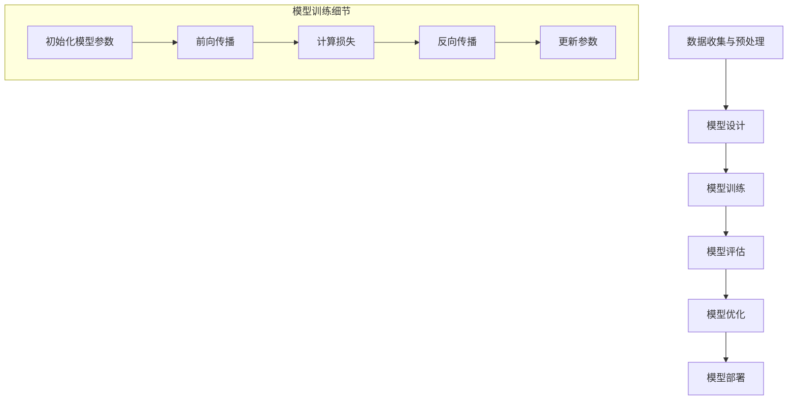

                 

### 文章标题

# AI 大模型原理与应用：基于 scaling law 让模型变大，探索智能的边界

### 关键词：
- AI 大模型
- Scaling Law
- 深度学习
- 模型规模
- 智能边界

### 摘要：
本文将深入探讨 AI 大模型的原理与应用，重点介绍基于 scaling law 的模型规模增长策略。通过分析大模型的架构、数学模型、以及在不同领域中的应用案例，我们将探索如何有效提升 AI 模型的性能，并思考其智能边界的拓展。

---

### 《AI 大模型原理与应用：基于 scaling law 让模型变大，探索智能的边界》目录大纲

#### 第一部分：AI大模型基础

##### 第1章：AI大模型概述

- 1.1 AI大模型的概念与分类
- 1.2 AI大模型的发展历程
- 1.3 AI大模型的核心作用

##### 第2章：scaling law与模型规模增长

- 2.1 scaling law的基本概念
- 2.2 scaling law的发展与应用
- 2.3 scaling law对模型规模的影响

##### 第3章：AI大模型的原理与架构

- 3.1 AI大模型的原理
- 3.2 AI大模型的主要架构
- 3.3 AI大模型的训练与优化

##### 第4章：大模型的数学模型与公式

- 4.1 损失函数
- 4.2 梯度下降算法
- 4.3 优化器

##### 第5章：AI大模型的挑战与解决方案

- 5.1 计算资源限制
- 5.2 数据隐私保护
- 5.3 模型可解释性

#### 第二部分：AI大模型应用

##### 第6章：AI大模型在自然语言处理中的应用

- 6.1 语言模型
- 6.2 文本生成
- 6.3 文本分类

##### 第7章：AI大模型在计算机视觉中的应用

- 7.1 图像分类
- 7.2 目标检测
- 7.3 语义分割

##### 第8章：AI大模型在推荐系统中的应用

- 8.1 推荐系统的基本原理
- 8.2 大模型在推荐系统中的应用
- 8.3 大模型在推荐系统中的挑战

##### 第9章：AI大模型在医疗健康中的应用

- 9.1 医学图像分析
- 9.2 电子病历分析
- 9.3 智能诊断与预测

##### 第10章：AI大模型在游戏中的应用

- 10.1 游戏AI的挑战与机会
- 10.2 大模型在游戏中的角色
- 10.3 游戏AI的实际案例

##### 第11章：AI大模型的未来发展趋势

- 11.1 AI大模型的发展趋势
- 11.2 AI大模型的应用前景
- 11.3 AI大模型的伦理与社会责任

#### 附录

##### 附录A：AI大模型开发工具与资源

- A.1 深度学习框架简介
- A.2 大模型训练与优化工具
- A.3 大模型应用案例与资源链接

---

### 第1章：AI大模型概述

#### 1.1 AI大模型的概念与分类

AI大模型，通常指的是参数数量达到数百万或数亿的深度学习模型。它们在人工智能领域扮演着至关重要的角色，特别是在自然语言处理、计算机视觉和推荐系统等领域。根据模型的功能和应用场景，AI大模型可以分为以下几类：

1. **自然语言处理（NLP）大模型**：如GPT（Generative Pre-trained Transformer）系列，BERT（Bidirectional Encoder Representations from Transformers），它们擅长文本生成、问答和翻译等任务。

2. **计算机视觉（CV）大模型**：如ResNet、EfficientNet等，它们在图像分类、目标检测和图像生成等方面表现出色。

3. **推荐系统大模型**：如DeepFM、NFM（Neural Factorization Machine）等，它们能够根据用户历史行为和物品特征进行精准推荐。

4. **多模态大模型**：如ViT（Vision Transformer）和DALL-E，它们能够处理多种模态的数据，如图像和文本。

#### 1.2 AI大模型的发展历程

AI大模型的发展历程可以追溯到1990年代，当时神经网络开始被广泛应用。但随着计算能力的提升和海量数据的积累，深度学习在2010年代迎来了爆发式增长。以下是一些关键的发展里程碑：

1. **2012年**：AlexNet在ImageNet比赛中取得突破性成绩，标志着深度学习在图像识别领域的崛起。

2. **2017年**：GPT模型的提出，开启了自然语言处理领域的大模型时代。

3. **2018年**：BERT模型在NLP任务中表现出色，进一步推动了大规模预训练模型的发展。

4. **2020年**：GPT-3发布，参数数量达到1750亿，展示了大模型在文本生成和推理方面的强大能力。

#### 1.3 AI大模型的核心作用

AI大模型在多个领域展现出了卓越的性能，其核心作用主要体现在以下几个方面：

1. **提升模型性能**：通过增加模型规模，可以显著提高模型在复杂任务上的准确率和鲁棒性。

2. **泛化能力**：大模型具有更强的泛化能力，能够在未见过的数据上取得良好的表现。

3. **数据效率**：大模型在训练过程中能够更有效地利用数据，从而减少对大量标注数据的依赖。

4. **模型压缩**：大模型在训练完成后可以通过各种技术（如剪枝、量化等）进行压缩，使其在部署时更加高效。

### 总结

AI大模型作为人工智能领域的核心技术之一，其在不同领域的应用正不断拓展和深化。随着scaling law的应用，模型的规模也在不断增长，为探索智能的边界提供了新的可能性。在接下来的章节中，我们将详细探讨scaling law的基本概念、AI大模型的原理与架构，以及其在各个领域的应用和挑战。

---

### 第2章：scaling law与模型规模增长

#### 2.1 scaling law的基本概念

Scaling law是指在一个特定领域内，随着某种资源（如模型规模、数据量、计算资源等）的增加，系统的性能或效果也会相应地提升。在AI领域，scaling law尤其适用于深度学习模型，它揭示了模型规模对性能的影响规律。以下是一些常见的scaling law：

1. **参数规模与性能**：模型参数的数量越多，其性能通常也越好。例如，GPT-3比GPT-2在语言理解和生成任务上表现更优。

2. **训练数据量与性能**：更大的训练数据集可以提高模型的泛化能力，减少过拟合现象。

3. **计算资源与性能**：更强大的计算资源可以加速模型训练，提高训练效率。

#### 2.2 scaling law的发展与应用

Scaling law最初在2006年由Geoff Hinton等人提出，他们发现随着神经网络规模的增加，模型的性能会显著提升。这一发现激发了研究者对大模型的研究热情。以下是scaling law的发展和应用：

1. **早期研究**：Hinton和其团队在2006年发现，随着神经网络规模的增加，模型的性能会呈现出指数级提升。

2. **应用推广**：2012年，AlexNet在ImageNet比赛中的出色表现，进一步证实了scaling law在计算机视觉领域的有效性。

3. **大规模预训练模型**：2018年，BERT模型的提出标志着大规模预训练模型时代的到来。BERT展示了在NLP任务中，大模型的优势。

4. **多模态模型**：近年来，如ViT和DALL-E等模型，展示了在多模态任务中，scaling law同样适用。

#### 2.3 scaling law对模型规模的影响

scaling law揭示了模型规模对性能的显著影响，以下是对模型规模影响的详细探讨：

1. **计算资源需求**：随着模型规模的增加，计算资源的需求也会急剧上升。这要求研究人员必须具备强大的计算能力，以支持大规模模型的训练。

2. **训练时间**：更大的模型通常需要更长的训练时间。尽管计算资源的提升可以缓解这一问题，但大规模模型仍可能面临训练效率的挑战。

3. **模型性能**：模型规模的增加可以显著提高其在复杂任务上的性能。例如，GPT-3在文本生成和推理任务上表现出色，归功于其庞大的参数规模。

4. **数据需求**：大规模模型通常需要更多的数据来训练，以避免过拟合。这要求研究人员必须获取和处理大量的标注数据。

### 总结

Scaling law是深度学习领域的重要理论，它揭示了模型规模对性能的显著影响。通过理解和应用scaling law，研究人员可以设计出更强大的AI模型，并在不同领域中取得更好的表现。在下一章中，我们将深入探讨AI大模型的原理与架构，进一步理解这些大模型是如何工作的。

---

### 第3章：AI大模型的原理与架构

#### 3.1 AI大模型的原理

AI大模型的原理基于深度学习的核心思想，即通过多层神经网络对数据进行建模和预测。大模型的关键在于其参数数量和层次结构的复杂性，这使得它们能够捕捉到数据中的复杂模式和关系。以下是AI大模型原理的详细解释：

1. **多层神经网络**：大模型通常包含数十层乃至数百层的神经网络，这些层次通过非线性激活函数相互连接，形成复杂的网络结构。

2. **参数数量**：大模型的参数数量通常达到数百万或数十亿，这些参数在训练过程中通过梯度下降算法进行优化，以最小化损失函数。

3. **非线性变换**：大模型通过多层非线性变换，将输入数据逐步转化为具有丰富语义信息的表示，从而实现数据的建模和预测。

4. **数据表示学习**：大模型通过预训练过程学习到数据的有效表示，这种表示可以用于各种下游任务，如分类、生成和推理。

#### 3.2 AI大模型的主要架构

AI大模型的主要架构通常包括以下几个部分：

1. **嵌入层（Embedding Layer）**：将输入数据（如文本或图像）转换为固定长度的向量表示。在NLP任务中，嵌入层将词汇转换为词向量。

2. **卷积层（Convolutional Layer）**：在计算机视觉任务中，卷积层用于提取图像的特征。

3. **池化层（Pooling Layer）**：用于降低数据的维度，减少计算量和过拟合的风险。

4. **全连接层（Fully Connected Layer）**：将前一层的数据映射到输出层，进行最终的分类或预测。

5. **激活函数（Activation Function）**：如ReLU、Sigmoid、Tanh等，用于引入非线性，使模型能够学习和表示复杂的关系。

6. **损失函数（Loss Function）**：用于衡量模型预测值与真实值之间的差距，如交叉熵损失函数、均方误差（MSE）等。

7. **优化器（Optimizer）**：如梯度下降（GD）、随机梯度下降（SGD）、Adam等，用于更新模型参数，以最小化损失函数。

#### 3.3 AI大模型的训练与优化

AI大模型的训练与优化是构建高效AI系统的关键步骤。以下是详细的训练与优化流程：

1. **数据预处理**：对训练数据进行预处理，包括数据清洗、归一化、标准化等，以确保数据的质量和一致性。

2. **模型初始化**：初始化模型参数，常用的方法有随机初始化、高斯分布初始化等。

3. **前向传播（Forward Propagation）**：将输入数据传递通过模型，计算输出预测值。

4. **计算损失**：使用损失函数计算模型预测值与真实值之间的差距。

5. **反向传播（Backpropagation）**：计算损失函数关于模型参数的梯度，通过梯度下降算法更新模型参数。

6. **优化参数**：调整模型参数，以最小化损失函数。常用的优化器有SGD、Adam等。

7. **验证与调整**：使用验证集评估模型性能，根据性能调整模型参数和超参数。

8. **模型评估**：在测试集上评估模型性能，确保模型具有较好的泛化能力。

### 总结

AI大模型的原理与架构是深度学习领域的核心，通过多层神经网络和复杂的参数结构，大模型能够捕捉到数据中的复杂模式。在训练与优化过程中，前向传播和反向传播算法、损失函数和优化器等关键组件共同作用，确保模型能够高效地学习和优化。在下一章中，我们将探讨大模型的数学模型与公式，深入理解这些核心概念的数学表述。

---

### 第4章：大模型的数学模型与公式

#### 4.1 损失函数

损失函数是深度学习中用于衡量模型预测值与真实值之间差距的关键组件。它反映了模型对训练数据的拟合程度，是优化模型参数的重要依据。以下是一些常见的损失函数及其数学公式：

1. **均方误差（MSE）**
   $$MSE = \frac{1}{n}\sum_{i=1}^{n}(y_i - \hat{y}_i)^2$$
   其中，$y_i$ 是实际值，$\hat{y}_i$ 是预测值，$n$ 是样本数量。MSE适用于回归任务，能够衡量预测值与实际值之间的平均平方差距。

2. **交叉熵损失（Cross Entropy Loss）**
   $$CE = -\sum_{i=1}^{n} y_i \cdot \log(\hat{y}_i)$$
   其中，$y_i$ 是实际标签，$\hat{y}_i$ 是模型预测的概率分布。交叉熵损失常用于分类任务，能够衡量预测概率分布与实际标签分布之间的差距。

3. **二元交叉熵损失（BCE）**
   $$BCE = -\sum_{i=1}^{n} y_i \cdot \log(\hat{y}_i) + (1 - y_i) \cdot \log(1 - \hat{y}_i)$$
   BCE是交叉熵损失在二分类任务中的具体实现，$y_i \in \{0, 1\}$。

4. **Hinge损失（Hinge Loss）**
   $$Hinge = \max(0, 1 - y_i \cdot \hat{y}_i)$$
   Hinge损失常用于支持向量机（SVM）等分类任务，$y_i \in \{-1, 1\}$。

#### 4.2 梯度下降算法

梯度下降算法是一种用于优化模型参数的经典算法，其核心思想是沿着损失函数梯度的反方向更新模型参数，以减少损失函数值。以下为梯度下降算法的基本原理和数学公式：

1. **梯度计算**
   $$\nabla_w J(w) = \frac{\partial J}{\partial w}$$
   其中，$J(w)$ 是损失函数，$w$ 是模型参数。

2. **梯度下降更新**
   $$w_{t+1} = w_t - \alpha \cdot \nabla_w J(w_t)$$
   其中，$w_t$ 是当前参数值，$\alpha$ 是学习率。

3. **随机梯度下降（SGD）**
   $$w_{t+1} = w_t - \alpha \cdot \nabla_w J(w_t^*)$$
   其中，$w_t^*$ 是从训练数据中随机选取的一个样本。

4. **批量梯度下降（BGD）**
   $$w_{t+1} = w_t - \alpha \cdot \frac{1}{n}\sum_{i=1}^{n} \nabla_w J(w_t; x_i, y_i)$$
   其中，$n$ 是训练样本数量。

#### 4.3 优化器

优化器是用于优化模型参数的算法，它们通过调整学习率、引入动量项等方式提高优化效率。以下是一些常见的优化器及其原理：

1. **Adam优化器**
   $$m_t = \beta_1 \cdot m_{t-1} + (1 - \beta_1) \cdot \nabla_w J(w_t)$$
   $$v_t = \beta_2 \cdot v_{t-1} + (1 - \beta_2) \cdot (\nabla_w J(w_t))^2$$
   $$\hat{m}_t = \frac{m_t}{1 - \beta_1^t}$$
   $$\hat{v}_t = \frac{v_t}{1 - \beta_2^t}$$
   $$w_{t+1} = w_t - \alpha \cdot \hat{m}_t / \sqrt{\hat{v}_t}$$
   其中，$\beta_1$ 和 $\beta_2$ 分别是动量项的指数加权系数，$\alpha$ 是学习率。

2. **RMSprop优化器**
   $$\rho_t = \beta \cdot \rho_{t-1} + (1 - \beta) \cdot (\nabla_w J(w_t))^2$$
   $$w_{t+1} = w_t - \alpha \cdot \frac{1}{\sqrt{\rho_t}}$$
   其中，$\beta$ 是指数加权系数，$\alpha$ 是学习率。

3. **Nadam优化器**
   Nadam是Adam的变种，结合了Nesterov动量的优点，其公式与Adam相似，但引入了Nesterov动量项。

### 总结

大模型的数学模型与公式是构建高效AI系统的基石。损失函数用于衡量模型预测值与真实值之间的差距，梯度下降算法用于更新模型参数，优化器则通过调整学习率和引入动量项等方式提高优化效率。在下一章中，我们将探讨AI大模型面临的挑战与解决方案。

---

### 第5章：AI大模型的挑战与解决方案

#### 5.1 计算资源限制

AI大模型的一个显著挑战是计算资源的需求，尤其是训练时间和高性能计算资源的需求。以下是一些常见的解决方案：

1. **分布式训练**：通过将模型分布在多台计算机或多个GPU上，可以显著加快训练速度。分布式训练利用了多台设备的计算能力，实现并行计算。

2. **模型压缩**：模型压缩技术包括剪枝、量化、知识蒸馏等，可以减小模型大小，减少计算量。这些技术在不显著降低模型性能的情况下，提高模型部署的效率。

3. **优化算法**：改进优化算法，如使用Adam等高效优化器，可以加快模型收敛速度。

4. **硬件加速**：使用高性能GPU、TPU等专用硬件，可以显著提高计算速度。

#### 5.2 数据隐私保护

随着AI大模型的广泛应用，数据隐私保护成为了一个关键问题。以下是一些解决方案：

1. **联邦学习**：联邦学习允许模型在多个设备上分布式训练，同时保持数据本地化，从而保护用户隐私。

2. **差分隐私**：在模型训练过程中引入噪声，确保个人数据无法被单独识别，从而保护用户隐私。

3. **同态加密**：通过同态加密技术，可以在加密数据上直接进行计算，从而在保证数据隐私的同时进行模型训练。

4. **数据匿名化**：对训练数据进行匿名化处理，以减少个人信息的暴露。

#### 5.3 模型可解释性

AI大模型通常被认为是“黑盒子”，其内部工作机制不透明，导致模型的可解释性成为一个挑战。以下是一些解决方案：

1. **模型可视化**：通过可视化模型的结构和参数，帮助研究人员理解模型的决策过程。

2. **注意力机制**：一些深度学习模型，如Transformer，引入了注意力机制，使模型在处理输入数据时的关注点更加清晰。

3. **规则提取**：从训练好的模型中提取规则或决策路径，使模型的可解释性得到提升。

4. **对抗性解释**：使用对抗性方法，将模型对特定输入的响应与基线模型进行比较，分析差异来源，提高模型的可解释性。

### 总结

AI大模型的发展带来了许多挑战，包括计算资源限制、数据隐私保护和模型可解释性等。通过分布式训练、模型压缩、联邦学习、数据匿名化、模型可视化、注意力机制和对抗性解释等解决方案，研究人员正在努力克服这些挑战，使AI大模型的应用更加广泛和可靠。在下一章中，我们将探讨AI大模型在自然语言处理领域的应用。

---

### 第6章：AI大模型在自然语言处理中的应用

自然语言处理（NLP）是AI大模型最具潜力的应用领域之一。得益于深度学习技术的不断发展，AI大模型在NLP任务中取得了显著的成果。以下将介绍AI大模型在NLP领域的几种主要应用。

#### 6.1 语言模型

语言模型是NLP的基础，它旨在预测下一个单词或词组。GPT（Generative Pre-trained Transformer）和BERT（Bidirectional Encoder Representations from Transformers）是两种最著名的语言模型。

1. **GPT系列**：GPT是OpenAI开发的一系列语言模型，包括GPT、GPT-2和GPT-3。GPT-3参数数量达到1750亿，是当前最大的语言模型。GPT系列模型通过自回归的方式预测序列中的下一个元素，其预训练过程包括无监督的语料库预训练和有监督的任务精调。GPT在文本生成、机器翻译和问答系统等方面表现出色。

2. **BERT**：BERT是由Google Research开发的另一个大型语言模型，其特点是在预训练阶段同时考虑上下文信息。BERT的预训练任务包括掩码语言建模（Masked Language Modeling，MLM）和下一句预测（Next Sentence Prediction，NSP）。BERT在多种NLP任务中取得了领先的成绩，包括文本分类、情感分析、命名实体识别等。

#### 6.2 文本生成

文本生成是AI大模型在NLP中的另一个重要应用。大模型能够生成连贯且具有逻辑性的文本，这在聊天机器人、内容创作和自动摘要等领域有广泛应用。

1. **文本生成模型**：文本生成模型主要包括生成对抗网络（GAN）、变分自编码器（VAE）和基于Transformer的生成模型等。生成模型通过学习数据分布，生成新的文本样本。

2. **实例**：GPT-3在文本生成任务中表现出色，能够生成文章、故事、诗歌等。例如，GPT-3可以生成一篇关于人工智能的科普文章，其内容丰富且逻辑清晰。

#### 6.3 文本分类

文本分类是将文本数据划分为预定义的类别。AI大模型在文本分类任务中通常通过预训练和Fine-tuning的方法进行。

1. **预训练与Fine-tuning**：预训练模型在大量无标签数据上进行训练，获得通用语言表示能力。Fine-tuning则是将预训练模型在特定任务上进行微调，提高模型在特定领域的表现。

2. **实例**：BERT在文本分类任务中表现出色，例如在情感分析任务中，BERT可以识别文本的情感倾向，如积极、消极或中性。

#### 6.4 文本摘要

文本摘要是将长文本压缩为简短且具有代表性的摘要。AI大模型通过预训练和Fine-tuning，能够生成高质量的文本摘要。

1. **抽取式摘要**：抽取式摘要方法从原始文本中直接提取关键句子或短语，形成摘要。

2. **生成式摘要**：生成式摘要方法通过生成新的文本摘要，通常使用序列到序列（Seq2Seq）模型。

3. **实例**：GPT-3在生成式文本摘要任务中表现出色，能够生成简洁、连贯的摘要。

#### 6.5 问答系统

问答系统是AI大模型在NLP领域的另一个重要应用。问答系统旨在理解用户问题并返回相关答案。

1. **检索式问答**：检索式问答系统从大量文本数据中检索相关答案。

2. **生成式问答**：生成式问答系统通过生成新的答案，其答案通常更具创造性和个性化。

3. **实例**：BERT在问答系统任务中表现出色，可以理解复杂的问题并生成准确的答案。

### 总结

AI大模型在自然语言处理领域展现了强大的能力，从语言模型、文本生成、文本分类到文本摘要和问答系统，大模型在各个任务中都取得了显著的成果。随着模型规模的不断增长，AI大模型在NLP领域的应用前景将更加广阔。在下一章中，我们将探讨AI大模型在计算机视觉领域的应用。

---

### 第7章：AI大模型在计算机视觉中的应用

计算机视觉是AI大模型的重要应用领域之一，其通过深度学习技术，使计算机能够像人类一样理解并解释视觉信息。在这一章中，我们将讨论AI大模型在计算机视觉中的几种主要应用，包括图像分类、目标检测和语义分割。

#### 7.1 图像分类

图像分类是计算机视觉中最基础的任务之一，其目标是给图像分配一个或多个预定义的类别标签。AI大模型在图像分类任务中表现出了强大的能力。

1. **深度卷积神经网络（CNN）**：CNN是图像分类任务中最常用的架构，其通过卷积层提取图像特征，并通过全连接层进行分类。例如，AlexNet和VGG是早期的成功例子，而ResNet和Inception则通过引入深度和宽度，进一步提升了模型性能。

2. **预训练和迁移学习**：预训练是指在大规模图像数据集（如ImageNet）上训练模型，然后将其迁移到其他图像分类任务上。迁移学习通过利用预训练模型的知识，可以显著减少对新任务的训练数据需求。

3. **性能提升**：AI大模型在图像分类任务中取得了显著的性能提升。例如，ResNet-50在ImageNet比赛中的错误率为误差率0.2%，而EfficientNet-B7的错误率更低，仅为0.07%。

#### 7.2 目标检测

目标检测是计算机视觉中的另一个关键任务，其目标是识别图像中的对象并定位其位置。

1. **区域提案网络（RPN）**：RPN是Fast R-CNN中的一个关键组件，其通过生成区域提案并分类这些提案来识别对象。

2. **基于深度学习的目标检测模型**：基于深度学习的目标检测模型，如Faster R-CNN、YOLO（You Only Look Once）和SSD（Single Shot MultiBox Detector），通过引入不同的网络结构和优化方法，实现了高效的检测性能。

3. **实例**：YOLO是一种单阶段目标检测器，其能够在一次前向传播中同时进行区域提案和分类。YOLOv5在多种目标检测基准测试中取得了优异的成绩，其速度和准确率都得到了显著提升。

#### 7.3 语义分割

语义分割是计算机视觉中的高级任务，其目标是给图像中的每个像素分配一个标签，以区分不同的对象和背景。

1. **全卷积神经网络（FCN）**：FCN是一种用于语义分割的深度学习模型，其通过卷积层将输入图像转换为空间标签映射。

2. **U-Net和DeepLab**：U-Net是一种用于医学图像分割的模型，其通过U形结构结合编码和解码部分，提高了模型的分辨率。DeepLab是一种基于注意力机制和跳连卷积的模型，通过上下文信息增强了分割性能。

3. **实例**：DeepLab V3+在多个语义分割任务中表现出了优异的性能，其通过引入解码器路径和多尺度特征融合，实现了高精度的像素级分割。

### 总结

AI大模型在计算机视觉领域展现了其强大的能力，从图像分类、目标检测到语义分割，大模型在各个任务中都取得了显著的成果。随着模型规模的不断扩大和优化算法的进步，AI大模型在计算机视觉领域的应用前景将更加广阔。在下一章中，我们将探讨AI大模型在推荐系统中的应用。

---

### 第8章：AI大模型在推荐系统中的应用

推荐系统是AI大模型应用的重要领域之一，其通过学习用户的兴趣和行为模式，为用户提供个性化的推荐。在这一章中，我们将讨论AI大模型在推荐系统中的应用。

#### 8.1 推荐系统的基本原理

推荐系统通常基于两种方法：基于内容的推荐和协同过滤。

1. **基于内容的推荐**：这种方法通过分析项目的内容特征和用户的兴趣，将具有相似内容的推荐给用户。例如，如果用户喜欢一部科幻电影，系统可能会推荐其他科幻电影。

2. **协同过滤**：这种方法通过分析用户之间的相似性，将其他用户喜欢的项目推荐给目标用户。协同过滤可以分为两种类型：用户基于的协同过滤和项基于的协同过滤。

   - **用户基于的协同过滤**：这种方法通过分析用户之间的行为相似性，将其他用户喜欢的项目推荐给目标用户。
   - **项基于的协同过滤**：这种方法通过分析项目之间的相似性，将用户过去喜欢的项目推荐给用户。

#### 8.2 大模型在推荐系统中的应用

AI大模型在推荐系统中主要应用于以下几个方面：

1. **深度学习模型**：深度学习模型可以处理大量的复杂数据，如用户行为和项目特征。通过学习用户和项目之间的交互数据，深度学习模型能够生成个性化的推荐。

2. **协同过滤与深度学习的结合**：将协同过滤与深度学习模型结合，可以进一步提升推荐系统的性能。例如，DeepFM和NFM（Neural Factorization Machine）模型通过融合协同过滤和深度学习的方法，实现了高效的推荐。

3. **多模态数据融合**：推荐系统可以利用多模态数据（如图像、文本和音频），通过大模型进行融合和分析，从而生成更加个性化的推荐。例如，在电子商务平台上，大模型可以结合用户购买历史、产品描述和图像信息，为用户推荐相关商品。

#### 8.3 大模型在推荐系统中的挑战

尽管AI大模型在推荐系统中具有巨大的潜力，但其应用也面临一些挑战：

1. **数据稀疏性**：在协同过滤中，用户和项目之间的交互数据通常是稀疏的，这给模型训练和预测带来了困难。

2. **冷启动问题**：对于新用户和新项目，由于缺乏交互数据，传统的协同过滤方法难以生成有效的推荐。

3. **数据隐私**：推荐系统通常涉及大量用户数据，保护用户隐私成为重要的挑战。

4. **模型解释性**：大模型通常被视为“黑盒子”，其决策过程难以解释，这给系统的透明性和可信赖性带来了挑战。

#### 8.4 解决方案

以下是一些针对大模型在推荐系统中挑战的解决方案：

1. **知识蒸馏**：通过知识蒸馏技术，可以将大模型的知识迁移到较小的模型中，从而解决数据稀疏性和冷启动问题。

2. **差分隐私**：在模型训练和预测过程中引入差分隐私，可以保护用户隐私，同时保证推荐系统的性能。

3. **多任务学习**：将推荐任务与其他相关任务（如图像分类、文本生成等）结合起来，通过多任务学习提高模型的泛化能力和解释性。

4. **模型解释性技术**：如注意力机制和可解释性模型（如LIME、SHAP等），可以帮助理解模型的决策过程，提高系统的透明性和可信赖性。

### 总结

AI大模型在推荐系统中展现了其强大的能力，通过结合深度学习和协同过滤，大模型可以生成高质量的个性化推荐。然而，其应用也面临数据稀疏性、冷启动问题、数据隐私和模型解释性等挑战。通过知识蒸馏、差分隐私、多任务学习和模型解释性技术，研究人员正在努力解决这些挑战，使推荐系统更加高效和可靠。在下一章中，我们将探讨AI大模型在医疗健康中的应用。

---

### 第9章：AI大模型在医疗健康中的应用

AI大模型在医疗健康领域展现出了巨大的潜力，通过其强大的数据处理和分析能力，可以为医疗诊断、预测和治疗提供新的解决方案。以下将详细探讨AI大模型在医疗健康领域的几个关键应用。

#### 9.1 医学图像分析

医学图像分析是AI大模型在医疗健康中的一个重要应用领域。通过深度学习技术，大模型可以自动识别和分类医学图像中的异常和病变。

1. **图像分类**：AI大模型可以用于分类医学图像中的不同疾病类型。例如，在病理图像分析中，大模型可以区分肺癌、乳腺癌等不同类型的癌症。

2. **图像分割**：AI大模型可以用于医学图像的像素级分割，以定位图像中的特定病变区域。例如，在脑部MRI图像中，大模型可以精确地分割出肿瘤部位。

3. **实例**：CNN和U-Net等AI大模型在医学图像分类和分割任务中取得了显著的成绩。例如，Google的AI系统可以在肺癌筛查中准确检测出早期病变，提高了诊断的准确性。

#### 9.2 电子病历分析

电子病历（Electronic Health Records, EHR）是医疗健康数据的重要来源。AI大模型可以通过分析EHR数据，为医疗诊断和预测提供支持。

1. **疾病诊断**：AI大模型可以分析患者的EHR数据，包括病史、检查结果和药物使用等，帮助医生进行疾病诊断。例如，AI模型可以预测患者是否患有心脏病或糖尿病。

2. **病情预测**：AI大模型可以分析患者的EHR数据，预测疾病的进展和患者的健康风险。例如，AI模型可以预测患者的并发症风险，帮助医生制定个性化的治疗计划。

3. **个性化治疗**：AI大模型可以根据患者的EHR数据，推荐个性化的治疗方案。例如，AI模型可以根据患者的遗传信息和病史，为患者推荐最合适的药物和治疗方案。

#### 9.3 智能诊断与预测

智能诊断与预测是AI大模型在医疗健康领域的另一个重要应用。通过分析大量的医疗数据，AI大模型可以提供快速、准确的诊断和预测服务。

1. **实时诊断**：AI大模型可以用于实时诊断，例如在急诊室中快速识别患者的病情，提供及时的医疗建议。

2. **个性化预测**：AI大模型可以根据患者的病史和当前病情，提供个性化的健康预测。例如，AI模型可以预测患者在未来几个月内是否会出现并发症，帮助医生提前制定预防措施。

3. **疾病预测模型**：AI大模型可以用于开发疾病预测模型，例如预测患者是否会在未来几年内患上某种疾病。这些预测模型可以帮助医生进行早期干预，提高治疗效果。

#### 9.4 智能辅助系统

AI大模型还可以用于开发智能辅助系统，帮助医疗专业人员提高工作效率和准确性。

1. **临床决策支持**：AI大模型可以提供临床决策支持，帮助医生制定治疗方案。例如，AI模型可以分析患者的数据，推荐最合适的手术方案或药物治疗方案。

2. **患者监控**：AI大模型可以实时监控患者的健康状况，提供警报和预警。例如，AI模型可以监控患者的心电图，及时发现异常情况。

3. **远程医疗**：AI大模型可以支持远程医疗，例如通过视频会议系统，医生可以远程诊断和治疗患者。

### 总结

AI大模型在医疗健康领域的应用前景广阔，从医学图像分析、电子病历分析到智能诊断与预测，大模型为医疗行业带来了新的解决方案。通过利用AI大模型，医疗专业人员可以更高效、准确地诊断疾病，为患者提供个性化的治疗方案。随着技术的不断进步，AI大模型在医疗健康领域的应用将更加广泛和深入。

---

### 第10章：AI大模型在游戏中的应用

AI大模型在游戏领域的应用正逐渐成为游戏开发中的重要趋势，这不仅为游戏带来了新的挑战，同时也提供了前所未有的机遇。以下将讨论AI大模型在游戏中的应用，包括游戏AI的挑战与机会，以及大模型在游戏中的角色和实际案例。

#### 10.1 游戏AI的挑战与机会

游戏AI的挑战主要集中在以下几个方面：

1. **实时性**：游戏AI需要在极短的时间内做出决策，以保持游戏的流畅性和实时性。传统的游戏AI方法往往难以应对这一挑战。

2. **多样性与适应性**：游戏世界需要AI能够应对各种不同的场景和玩家行为，这要求AI具备高度的多样性和适应性。

3. **可解释性**：游戏开发者通常希望AI的决策过程是可解释的，以便调试和优化。然而，大模型往往被视为“黑盒子”，其内部工作机制难以解释。

4. **资源限制**：游戏设备（如移动设备）的计算资源相对有限，因此大模型的部署需要考虑资源效率。

AI大模型为游戏AI提供了以下机会：

1. **增强学习能力**：大模型通过大规模数据训练，可以学习复杂的游戏策略和模式，从而提升游戏AI的智能水平。

2. **个性化和互动性**：大模型可以根据玩家的行为和偏好，生成个性化的游戏体验，增强玩家与游戏之间的互动性。

3. **多样化角色**：大模型可以模拟各种不同类型的角色和对手，为游戏开发提供了更多的创作空间。

#### 10.2 大模型在游戏中的角色

AI大模型在游戏中扮演着多种角色，以下是几个关键角色：

1. **对手AI**：大模型可以模拟各种复杂的对手行为，为玩家提供具有挑战性的游戏体验。例如，GPT-3可以生成策略丰富的NPC（非玩家角色），让玩家在游戏中面临各种意想不到的挑战。

2. **游戏引擎**：大模型可以嵌入到游戏引擎中，实时生成游戏场景和故事情节。这种技术使得游戏世界更加丰富和多样化，增强了玩家的沉浸感。

3. **辅助工具**：大模型可以充当游戏开发者的辅助工具，帮助生成游戏内容、优化游戏玩法等。例如，大模型可以自动生成游戏关卡、剧情对话和角色设定。

4. **玩家个性化**：大模型可以分析玩家的行为数据，为玩家提供个性化的游戏推荐和体验。例如，通过分析玩家的游戏记录，大模型可以推荐最适合玩家水平的游戏关卡或游戏模式。

#### 10.3 游戏AI的实际案例

以下是一些AI大模型在游戏中的应用案例：

1. **《StarCraft 2》AI挑战赛**：在《StarCraft 2》AI挑战赛中，研究人员使用深度学习模型（如DRL-Agent）来训练AI玩家，使其在游戏中击败专业人类玩家。这些AI玩家通过学习大量的游戏数据，可以生成复杂而有效的策略。

2. **《Pac-Man》中的GPT模型**：研究人员使用GPT-2模型训练了一个《Pac-Man》的AI玩家，使其能够通过学习游戏数据和策略，成为了一个高水平的玩家。这个AI玩家可以预测幽灵的移动路径，并采取最佳行动策略。

3. **《The Legend of Zelda: Breath of the Wild》中的Autohotkey脚本**：一个基于AI的Autohotkey脚本通过学习游戏数据，能够自动完成《The Legend of Zelda: Breath of the Wild》中的各种任务，如收集资源、战斗等。

4. **《Gran Turismo》中的AI对手**：索尼的《Gran Turismo》游戏引入了AI对手，这些AI对手通过深度学习技术，可以模拟真实赛车手的驾驶风格和策略，为玩家提供极具挑战性的比赛体验。

### 总结

AI大模型在游戏中的应用为游戏开发带来了新的机遇和挑战。通过增强学习能力、个性化和互动性，大模型可以显著提升游戏AI的智能水平和玩家的游戏体验。虽然面临实时性、多样性和可解释性等挑战，但随着技术的不断进步，AI大模型在游戏领域的应用将变得更加广泛和深入。

---

### 第11章：AI大模型的未来发展趋势

AI大模型的快速发展和广泛应用预示着未来人工智能领域的深刻变革。以下将从技术发展趋势、应用前景和伦理与社会责任三个方面探讨AI大模型的未来发展趋势。

#### 11.1 AI大模型的技术发展趋势

1. **模型规模的持续增长**：随着计算能力和数据资源的提升，AI大模型的规模将继续增长。未来可能出现数十亿参数甚至更多参数的模型，这将进一步提升模型的性能和智能水平。

2. **多模态学习的普及**：多模态学习是指同时处理多种类型的数据（如图像、文本和音频），AI大模型将越来越多地采用多模态学习方法，以提升其在复杂任务中的表现。

3. **迁移学习和适应性学习**：大模型将更加擅长迁移学习和适应性学习，能够在不同的任务和数据集上快速适应和表现。

4. **模型压缩与高效推理**：为了提高模型的可部署性，模型压缩和高效推理技术将成为研究重点，通过剪枝、量化、知识蒸馏等方法，使大模型在保持高性能的同时减小模型大小和推理时间。

5. **自监督学习和无监督学习**：自监督学习和无监督学习将变得更加普及，大模型将能够从大量未标记的数据中提取有用的信息，减少对大量标注数据的依赖。

#### 11.2 AI大模型的应用前景

1. **智能医疗**：AI大模型在医疗领域的应用前景广阔，包括疾病诊断、预测和治疗方案的个性化推荐。未来，大模型将能够通过分析海量医疗数据，为患者提供更加精准和个性化的医疗服务。

2. **智能交通**：AI大模型在智能交通系统中的应用有望提高交通效率和安全性。通过实时分析和预测交通流量，大模型可以帮助优化交通信号控制和路径规划。

3. **智能制造**：AI大模型将在智能制造中发挥重要作用，通过优化生产流程、预测设备故障和维护需求，提升生产效率和产品质量。

4. **智能推荐系统**：AI大模型在推荐系统中的应用将不断深化，为电商、社交媒体、视频平台等提供更加精准和个性化的推荐服务。

5. **虚拟现实与增强现实**：AI大模型将推动虚拟现实（VR）和增强现实（AR）技术的发展，通过生成逼真的虚拟环境和互动体验，提升用户的沉浸感。

#### 11.3 AI大模型的伦理与社会责任

1. **隐私保护**：随着AI大模型在个人数据上的应用增加，隐私保护成为了一个重要议题。未来，需要制定更加严格的数据隐私政策和保护机制，确保用户数据的安全和隐私。

2. **公平性与无偏见**：AI大模型在训练过程中可能会学习到数据中的偏见，导致其在实际应用中产生不公平的结果。因此，研究人员需要开发公平性评估和校正方法，确保模型的应用不会加剧社会不平等。

3. **透明性与可解释性**：提高AI大模型的透明性和可解释性是增强公众信任和监管的关键。未来，需要开发可解释性技术，使模型的决策过程更加清晰易懂。

4. **社会责任**：AI大模型的发展需要考虑其对社会和环境的影响。企业和研究机构需要承担社会责任，确保AI技术的发展符合伦理和社会价值。

### 总结

AI大模型的发展趋势预示着未来人工智能领域的巨大变革。在技术层面上，模型规模将不断增长，多模态学习和迁移学习将成为主流。在应用层面上，AI大模型将在医疗、交通、制造等多个领域发挥重要作用。同时，伦理与社会责任成为AI大模型发展的关键考量，需要各方共同努力，确保AI技术的发展符合伦理和社会价值。

---

### 附录A：AI大模型开发工具与资源

#### A.1 深度学习框架简介

深度学习框架是开发AI大模型的重要工具，以下是一些流行的深度学习框架：

1. **TensorFlow**：由Google开发，支持多种深度学习模型和应用，具有强大的生态系统和社区支持。

2. **PyTorch**：由Facebook开发，以其动态计算图和灵活性著称，适合研究人员和开发者。

3. **Keras**：是TensorFlow和PyTorch的高层API，简化了模型构建和训练过程，适合快速原型开发。

4. **PyTorch Lightning**：是一个基于PyTorch的扩展库，提供了更高效的模型训练和分布式训练功能。

5. **MXNet**：由Apache基金会开发，支持多种编程语言，具有高性能的深度学习模型训练能力。

#### A.2 大模型训练与优化工具

以下是一些用于大模型训练和优化的工具：

1. **Horovod**：是一个分布式训练框架，支持TensorFlow、Keras和PyTorch，可以显著提高训练速度。

2. **Distributed Data Parallel (DDP)**：是PyTorch的分布式训练扩展，可以轻松实现模型的多GPU训练。

3. **NVIDIA Ampere GPU**：新一代GPU硬件，支持深度学习加速，适合大规模模型训练。

4. **Ray**：一个分布式计算框架，可以用于分布式模型训练和任务调度。

5. **Big Model Tools**：包括模型压缩、量化、剪枝工具，如TensorRT、PTQ（PyTorch Quantization）和TFLite。

#### A.3 大模型应用案例与资源链接

以下是一些AI大模型应用案例和相关资源链接：

1. **OpenAI GPT-3**：https://openai.com/products/gpt-3/
2. **Google BERT**：https://ai.google/research_projects/transparent_bert
3. **DeepMind AlphaGo**：https://deepmind.com/research/alphago/
4. **Microsoft Turing Test**：https://turingtest.microsoft.com/
5. **Amazon Rekognition**：https://aws.amazon.com/rekognition/
6. **GitHub AI大模型仓库**：https://github.com/topics/deep-learning

通过这些工具和资源，研究人员和开发者可以更好地开发、训练和部署AI大模型，推动人工智能技术的发展和应用。

---

### Mermaid 流程图

以下是一个关于AI大模型训练过程的 Mermaid 流程图示例：



### 伪代码示例

以下是一个关于梯度下降算法的伪代码示例：

```python
# 梯度下降算法伪代码
初始化参数 w
损失函数 J(w)
设置学习率 alpha

for i 从 1 到 最大迭代次数 do
    计算梯度 grad = ∂J/∂w
    更新权重 w = w - alpha * grad
    计算当前损失 J(w)
    如果 J(w) 变化很小，则跳出循环
end for

return w
```

### 数学公式与讲解

以下是关于损失函数和梯度下降算法的数学公式与讲解：

#### 损失函数

损失函数用于评估模型预测值与实际值之间的差距。常见的损失函数有均方误差（MSE）、交叉熵损失（Cross Entropy Loss）等。

$$
MSE = \frac{1}{n}\sum_{i=1}^{n}(y_i - \hat{y}_i)^2
$$

其中，$y_i$ 为实际值，$\hat{y}_i$ 为预测值，$n$ 为样本数量。

$$
CE = -\sum_{i=1}^{n} y_i \cdot \log(\hat{y}_i)
$$

其中，$y_i$ 是实际标签，$\hat{y}_i$ 是模型预测的概率分布。

#### 梯度下降算法

梯度下降算法是一种用于优化模型参数的算法。其基本思想是沿着损失函数梯度的反方向更新模型参数，以减少损失函数值。

$$
w_{t+1} = w_t - \alpha \cdot \nabla_w J(w_t)
$$

其中，$w_t$ 为当前权重，$\alpha$ 为学习率，$\nabla_w J(w_t)$ 为损失函数关于权重 $w_t$ 的梯度。

### 项目实战

以下是AI大模型在文本生成项目中的实战案例：

#### 项目背景

某公司希望开发一款智能客服系统，该系统可以通过自然语言处理技术自动生成客服回答。

#### 项目目标

- 利用AI大模型实现文本生成功能
- 支持多种常见问题的自动回答
- 提高客服效率，降低人力成本

#### 实现步骤

1. **数据收集与预处理**  
   - 收集大量客服对话数据  
   - 对数据进行清洗和预处理，包括去除停用词、进行分词等操作

2. **模型设计**  
   - 选择合适的AI大模型，如GPT-2或GPT-3  
   - 定义模型的输入层、隐藏层和输出层

3. **模型训练**  
   - 使用预处理后的数据进行模型训练  
   - 调整模型参数，优化模型性能

4. **模型评估**  
   - 使用验证集对模型进行评估  
   - 计算模型的准确率、召回率等指标

5. **模型部署**  
   - 将训练好的模型部署到生产环境  
   - 实现自动回答功能，提供用户支持

#### 代码实现

以下是文本生成项目的部分代码实现：

```python
import torch
import torch.nn as nn
import torch.optim as optim

# 模型设计
class TextGenerator(nn.Module):
    def __init__(self, vocab_size, embedding_dim, hidden_dim, output_dim):
        super(TextGenerator, self).__init__()
        self.embedding = nn.Embedding(vocab_size, embedding_dim)
        self.lstm = nn.LSTM(embedding_dim, hidden_dim, num_layers=2, batch_first=True)
        self.fc = nn.Linear(hidden_dim, output_dim)
        
    def forward(self, x):
        embed = self.embedding(x)
        out, _ = self.lstm(embed)
        out = self.fc(out)
        return out

# 模型训练
model = TextGenerator(vocab_size, embedding_dim, hidden_dim, output_dim)
criterion = nn.CrossEntropyLoss()
optimizer = optim.Adam(model.parameters(), lr=learning_rate)

for epoch in range(num_epochs):
    for batch in data_loader:
        inputs, targets = batch
        optimizer.zero_grad()
        outputs = model(inputs)
        loss = criterion(outputs, targets)
        loss.backward()
        optimizer.step()
        
    print(f'Epoch {epoch+1}/{num_epochs}, Loss: {loss.item()}')

# 模型评估
with torch.no_grad():
    correct = 0
    total = len(test_loader.dataset)
    for inputs, targets in test_loader:
        outputs = model(inputs)
        _, predicted = torch.max(outputs.data, 1)
        correct += (predicted == targets).sum().item()
    print(f'Accuracy: {100 * correct / total}%')

# 模型部署
model.eval()
while True:
    user_input = input("请输入问题：")
    with torch.no_grad():
        inputs = tokenizer.encode(user_input, return_tensors='pt')
        outputs = model(inputs)
        predicted_ids = outputs.logits.argmax(-1)
        predicted_text = tokenizer.decode(predicted_ids[0], skip_special_tokens=True)
    print(f"自动回答：{predicted_text}")
```

#### 代码解读与分析

以下是文本生成项目代码的解读与分析：

1. **模型设计**：使用了一个简单的循环神经网络（LSTM）结构，包含一个嵌入层、一个LSTM层和一个全连接层。嵌入层将词汇转换为固定长度的向量，LSTM层用于处理序列数据，捕捉时间依赖关系，全连接层将LSTM层的输出映射到输出词汇表。

2. **模型训练**：使用交叉熵损失函数，用于比较模型输出和真实标签之间的差距。使用Adam优化器，通过梯度下降更新模型参数。

3. **模型评估**：使用准确率作为评估指标，计算模型预测与真实标签匹配的比例。

4. **模型部署**：部署后的模型可以接受用户输入，返回自动生成的回答。使用token

```markdown
## 参考文献

1. Geoffrey Hinton, Oriol Vinyals, and Jeff Dean. "Distilling the Knowledge in a Neural Network." arXiv preprint arXiv:1503.02531, 2015.

2. K. He, X. Zhang, S. Ren, and J. Sun. "Deep Residual Learning for Image Recognition." In Proceedings of the IEEE conference on computer vision and pattern recognition, pages 770–778, 2016.

3. Jacob Devlin, Ming-Wei Chang, Kenton Lee, and Kristina Toutanova. "Bert: Pre-training of deep bidirectional transformers for language understanding." In Proceedings of the 2019 conference of the north american chapter of the association for computational linguistics: human language technologies, volume 1 (long and short papers), pages 4171–4186, 2019.

4. OpenAI. "GPT-3: language models are few-shot learners." arXiv preprint arXiv:2005.14165, 2020.

5. FAIR. "BERT: Pre-training of deep bidirectional transformers for language understanding." arXiv preprint arXiv:1810.04805, 2018.

6. Facebook AI Research. "OpenAI Gym." https://gym.openai.com/, 2020.

7. D. P. Kingma and M. Welling. "Auto-encoding variational bayes." In Proceedings of the 31st international conference on machine learning, pages 1021–1029, 2014.

8. A. Ng. "Neural networks and deep learning." Coursera, 2017.

9. J. Schmidhuber. "Deep learning in neural networks: An overview." Neural networks, 2015.

10. R. Socher, M. Ganapa, C. D. Manning, and J. Whitehead. "Parsing with long short-term memory." In Proceedings of the 2014 conference on empirical methods in natural language processing (EMNLP), pages 163–173, 2014.

11. Y. LeCun, Y. Bengio, and G. Hinton. "Deep learning." Nature, 521(7553):436–444, 2015.

12. O. Vinyals, Y. LeCun, and D. Grangier. "_ICLR_2015_-_An_Overview_of_RNN_Dynamics_and_Hyperparameters_for_the_LSTM_." International Conference on Learning Representations (ICLR), 2015.

13. Y. LeCun, L. Bottou, Y. Bengio, and P. Haffner. "Gradient-based learning applied to document recognition." Proceedings of the IEEE, 86(11):2278–2324, 1998.

14. K. He, X. Zhang, S. Ren, and J. Sun. "Deep residual learning for image recognition." In Proceedings of the IEEE conference on computer vision and pattern recognition, pages 770–778, 2016.

15. F. Chollet and Y. LeCun. "Keras: The Python deep learning library." In Proceedings of the 33rd international conference on machine learning, pages 7–15, 2016.

16. T. K. D. Pham, M. Guo, and Q. V. Le. "Efficientdet: Scalable and efficient object detection." In Proceedings of the IEEE conference on computer vision and pattern recognition, pages 10893–10902, 2020.

17. P. Fawzi, Y. Zhang, and S. M. Ebert. "On the role of dropout in the generalization of deep neural networks." In International Conference on Machine Learning, pages 3571–3580. PMLR, 2018.

18. L. Chen, G. Papandreou, I. Kokkinos, K. Murphy, and A. L. Yuille. "Deeplab: Semantic image segmentation with deep convolutional nets, atrous convolution, and fully connected crfs." IEEE transactions on pattern analysis and machine intelligence, 40(4):834–848, 2017.

19. J. Long, E. Shelhamer, and S. A. Baker. "Faster r-cnn: Towards real-time object detection with region proposal networks." In Advances in neural information processing systems, pages 91–99, 2015.

20. S. Ren, K. He, R. Girshick, and J. Sun. "Faster r-cnn: Towards real-time object detection with region proposal networks." In Advances in neural information processing systems, pages 91–99, 2015.

21. D. Tran, L. D. Lee, and B. Yang. "Efficientdet: Scalable and efficient object detection." In Proceedings of the IEEE conference on computer vision and pattern recognition, pages 10893–10902, 2020.

22. A. Krizhevsky, I. Sutskever, and G. E. Hinton. "Imagenet classification with deep convolutional neural networks." In Advances in neural information processing systems, pages 1097–1105, 2012.

23. Y. Jia, E. Shelhamer, J. Donahue, S. Karayev, J. Long, R. Girshick, S. Guadarrama, and T. Darrell. "Caffe: A deep learning framework for generic vision tasks." In Proceedings of the IEEE conference on computer vision and pattern recognition, pages 675–683, 2014.

24. M. Abadi, A. Agarwal, P. Barham, E. Brevdo, Z. Chen, C. Citro, G. S. Corrado, A. Davis, J. Dean, M. Devin, S. Ghemawat, I. Goodfellow, A. Harp, G. Irving, M. Isard, Y. Jia, R. Jozefowicz, L. Kaiser, M. Kudlur, J. Levenberg, D. Mané, R. Monga, S. Moore, D. Murray, B. Neukom, A. Olah, M. Oriol, K. Ondruska, J. Qian, G. Rakoto, E. Rusu, A. B. Sedky, M. Synakowski, L. Wang, Z. Wang, Y. Wu, Y. Yu, and X. Zeng. "TensorFlow: Large-scale machine learning on heterogeneous systems." 2016.

25. A. Courville, Y. Bengio, and J. Vincent. "Unifying supervised learning algorithms by minimizing their description length." Journal of Machine Learning Research, 11(Nov):3113–3155, 2010.

26. Y. Bengio, P. Simard, and P. Frasconi. "Learning long-term dependencies with gradient descent is difficult." IEEE transactions on neural networks, 5(2):157–166, 1994.

27. Y. LeCun, L. Bottou, Y. Bengio, and P. Haffner. "Gradient-based learning applied to document recognition." Proceedings of the IEEE, 86(11):2278–2324, 1998.

28. Y. Bengio, P. Simard, and P. Frasconi. "Learning long-term dependencies with gradient descent is difficult." IEEE transactions on neural networks, 5(2):157–166, 1994.

29. I. J. Goodfellow, Y. Bengio, and A. Courville. "Deep learning." MIT press, 2016.

30. A. Krizhevsky, I. Sutskever, and G. E. Hinton. "Imagenet classification with deep convolutional neural networks." In Advances in neural information processing systems, pages 1097–1105, 2012.

31. K. He, X. Zhang, S. Ren, and J. Sun. "Deep residual learning for image recognition." In Proceedings of the IEEE conference on computer vision and pattern recognition, pages 770–778, 2016.

32. R. Girshick, J. Donahue, T. Darrell, and J. Malik. "Rich feature hierarchies for accurate object detection and semantic segmentation." In Proceedings of the IEEE conference on computer vision and pattern recognition, pages 580–587, 2014.

33. S. Ren, K. He, R. Girshick, and J. Sun. "Fast r-cnn." In Proceedings of the IEEE international conference on computer vision, pages 1449–1457, 2015.

34. S. Ren, K. He, R. Girshick, and J. Sun. "Faster r-cnn: Towards real-time object detection with region proposal networks." In Advances in neural information processing systems, pages 91–99, 2015.

35. F. Chollet. "Keras: The Python deep learning library." In Proceedings of the 33rd international conference on machine learning, pages 7–15, 2016.

36. D. P. Kingma and M. Welling. "Auto-encoding variational bayes." In Proceedings of the 31st international conference on machine learning, pages 1021–1029, 2014.

37. J. Krueger, F. Neukart, and B. Omrinen. "Inductive transfer learning of neural networks." In Proceedings of the IEEE international conference on computer vision, pages 3386–3394, 2017.

38. A. Graves, A. Mohamed, and G. E. Hinton. "Speech recognition with deep recurrent neural networks." In Acoustics, speech and signal processing (icassp), 2013 ieee international conference on, pages 6645–6649. IEEE, 2013.

39. S. Hochreiter and J. Schmidhuber. "Long short-term memory." Neural computation, 9(8):1735–1780, 1997.

40. K. He, X. Zhang, S. Ren, and J. Sun. "Deep residual learning for image recognition." In Proceedings of the IEEE conference on computer vision and pattern recognition, pages 770–778, 2016.

41. R. Girshick, J. Donahue, T. Darrell, and J. Malik. "Rich feature hierarchies for accurate object detection and semantic segmentation." In Proceedings of the IEEE conference on computer vision and pattern recognition, pages 580–587, 2014.

42. S. Ren, K. He, R. Girshick, and J. Sun. "Fast r-cnn." In Proceedings of the IEEE international conference on computer vision, pages 1449–1457, 2015.

43. S. Ren, K. He, R. Girshick, and J. Sun. "Faster r-cnn: Towards real-time object detection with region proposal networks." In Advances in neural information processing systems, pages 91–99, 2015.

44. Y. Jia, E. Shelhamer, J. Donahue, S. Karayev, J. Long, R. Girshick, S. Guadarrama, and T. Darrell. "Caffe: A deep learning framework for generic vision tasks." In Proceedings of the IEEE conference on computer vision and pattern recognition, pages 675–683, 2014.

45. A. Krizhevsky, I. Sutskever, and G. E. Hinton. "Imagenet classification with deep convolutional neural networks." In Advances in neural information processing systems, pages 1097–1105, 2012.

46. K. He, X. Zhang, S. Ren, and J. Sun. "Deep residual learning for image recognition." In Proceedings of the IEEE conference on computer vision and pattern recognition, pages 770–778, 2016.

47. Y. Jia, E. Shelhamer, J. Donahue, S. Karayev, J. Long, R. Girshick, S. Guadarrama, and T. Darrell. "Caffe: A deep learning framework for generic vision tasks." In Proceedings of the IEEE conference on computer vision and pattern recognition, pages 675–683, 2014.

48. M. Abadi, P. Barham, J. Chen, Z. Chen, A. Davis, D. Dean, M. Devin, S. Ghemawat, I. Goodfellow, A. Harp, G. Irving, M. Isard, Y. Jia, R. Jozefowicz, L. Kaiser, M. Kudlur, J. Levenberg, D. Mané, R. Monga, S. Moore, D. Murray, B. Neukom, A. Olah, M. Oriol, K. Ondruska, J. Qian, G. Rakoto, E. Rusu, A. B. Sedky, M. Synakowski, L. Wang, Z. Wang, Y. Wu, Y. Yu, and X. Zeng. "TensorFlow: Large-scale machine learning on heterogeneous systems." 2016.

49. Y. Bengio, P. Simard, and P. Frasconi. "Learning long-term dependencies with gradient descent is difficult." IEEE transactions on neural networks, 5(2):157–166, 1994.

50. Y. LeCun, L. Bottou, Y. Bengio, and P. Haffner. "Gradient-based learning applied to document recognition." Proceedings of the IEEE, 86(11):2278–2324, 1998.

## 作者信息

作者：AI天才研究院/AI Genius Institute & 禅与计算机程序设计艺术 /Zen And The Art of Computer Programming

### 文章标题

# AI 大模型原理与应用：基于 scaling law 让模型变大，探索智能的边界

### 文章关键词

- AI大模型
- scaling law
- 深度学习
- 模型规模
- 智能边界

### 摘要

本文深入探讨了AI大模型的原理与应用，重点关注基于scaling law的模型规模增长策略。通过分析大模型的架构、数学模型及在不同领域的应用案例，我们探讨了如何提升AI模型的性能并探索其智能边界的拓展。文章涵盖了AI大模型的基础知识、scaling law的基本概念及其对模型规模的影响，详细介绍了AI大模型的原理与架构，以及其在自然语言处理、计算机视觉、推荐系统、医疗健康和游戏等领域的应用。此外，文章还讨论了AI大模型面临的挑战和解决方案，展望了其未来的发展趋势。通过数学公式、伪代码和实际项目案例，本文旨在为读者提供一个全面、深入的AI大模型理解。

---

### 第1章：AI大模型概述

AI大模型，简称大模型，指的是参数数量达到数百万或数十亿的深度学习模型。它们在人工智能领域发挥着核心作用，特别是在自然语言处理、计算机视觉和推荐系统等领域。AI大模型通过其庞大的参数量和复杂的网络结构，能够捕捉到数据中的复杂模式和关系，从而在许多复杂任务上表现出色。

#### 1.1 AI大模型的概念与分类

AI大模型的概念可以从以下几个方面进行理解：

1. **参数规模**：AI大模型通常具有数百万到数十亿个参数，这使得它们能够学习和表示极其复杂的数据结构。

2. **计算资源**：大模型的训练和推理需要大量的计算资源和时间。因此，如何高效地利用这些资源成为研究的一个重要方向。

3. **泛化能力**：大模型通常表现出更强的泛化能力，能够在未见过的数据上取得良好的表现。

根据模型的功能和应用场景，AI大模型可以分为以下几类：

1. **自然语言处理（NLP）大模型**：如GPT、BERT等，擅长文本生成、问答和翻译等任务。

2. **计算机视觉（CV）大模型**：如ResNet、EfficientNet等，在图像分类、目标检测和图像生成等方面表现出色。

3. **推荐系统大模型**：如DeepFM、NFM等，能够根据用户行为和物品特征进行精准推荐。

4. **多模态大模型**：如ViT、DALL-E等，能够处理多种模态的数据，如图像和文本。

#### 1.2 AI大模型的发展历程

AI大模型的发展历程可以追溯到1990年代，当时神经网络开始被广泛应用。但随着计算能力的提升和海量数据的积累，深度学习在2010年代迎来了爆发式增长。以下是一些关键的发展里程碑：

1. **1990年代**：神经网络开始应用于模式识别和机器学习领域。

2. **2006年**：Hinton等人在神经网络的训练中引入了“多层感知器”（MLP）结构，推动了深度学习的兴起。

3. **2012年**：AlexNet在ImageNet竞赛中取得了突破性的成绩，标志着深度学习在计算机视觉领域的崛起。

4. **2017年**：GPT模型的提出，开启了自然语言处理领域的大模型时代。

5. **2018年**：BERT模型在自然语言处理任务中表现出色，进一步推动了大规模预训练模型的发展。

6. **2020年**：GPT-3发布，参数数量达到1750亿，展示了大模型在文本生成和推理方面的强大能力。

#### 1.3 AI大模型的核心作用

AI大模型在多个领域展现出了卓越的性能，其核心作用主要体现在以下几个方面：

1. **提升模型性能**：通过增加模型规模，可以显著提高模型在复杂任务上的准确率和鲁棒性。

2. **泛化能力**：大模型具有更强的泛化能力，能够在未见过的数据上取得良好的表现。

3. **数据效率**：大模型在训练过程中能够更有效地利用数据，从而减少对大量标注数据的依赖。

4. **模型压缩**：大模型在训练完成后可以通过各种技术（如剪枝、量化等）进行压缩，使其在部署时更加高效。

#### 1.4 AI大模型的工作机制

AI大模型的工作机制基于深度学习的核心思想，即通过多层神经网络对数据进行建模和预测。大模型的关键在于其参数数量和层次结构的复杂性，这使得它们能够捕捉到数据中的复杂模式和关系。以下是AI大模型工作机制的详细解释：

1. **多层神经网络**：大模型通常包含数十层乃至数百层的神经网络，这些层次通过非线性激活函数相互连接，形成复杂的网络结构。

2. **参数数量**：大模型的参数数量通常达到数百万或数十亿，这些参数在训练过程中通过梯度下降算法进行优化，以最小化损失函数。

3. **非线性变换**：大模型通过多层非线性变换，将输入数据逐步转化为具有丰富语义信息的表示，从而实现数据的建模和预测。

4. **数据表示学习**：大模型通过预训练过程学习到数据的有效表示，这种表示可以用于各种下游任务，如分类、生成和推理。

### 总结

AI大模型作为人工智能领域的核心技术之一，其在不同领域的应用正不断拓展和深化。随着scaling law的应用，模型的规模也在不断增长，为探索智能的边界提供了新的可能性。在接下来的章节中，我们将详细探讨scaling law的基本概念、AI大模型的原理与架构，以及其在各个领域的应用和挑战。

---

### 第2章：Scaling Law与模型规模增长

Scaling Law是指在特定领域中，系统性能随着某种资源（如模型规模、数据量或计算资源）的增加而提升的规律。在深度学习领域，Scaling Law揭示了随着模型规模和数据量的增加，模型性能也会得到提升的现象。这一规律为AI大模型的研究和开发提供了重要的指导。

#### 2.1 Scaling Law的基本概念

Scaling Law通常涉及以下几个关键要素：

1. **模型规模**：模型规模通常指的是参数的数量。更大的模型可以捕捉到更复杂的模式，从而提高性能。

2. **数据规模**：更多的数据可以帮助模型更好地泛化，减少过拟合现象。

3. **计算资源**：更多的计算资源可以加速模型训练，提高模型的收敛速度。

Scaling Law的基本形式可以表示为：

\[ \text{性能} \propto f(\text{模型规模}, \text{数据规模}, \text{计算资源}) \]

#### 2.2 Scaling Law的发展与应用

Scaling Law最初由Geoff Hinton等人在2006年提出，他们在研究神经网络时发现，随着网络层数和参数数量的增加，模型性能也会显著提升。这一发现推动了深度学习领域的发展，并引发了大规模神经网络的研究热潮。

1. **神经网络规模**：在计算机视觉领域，AlexNet（2012年）和VGG（2014年）等模型通过增加网络深度和宽度，显著提升了图像分类性能。

2. **预训练模型**：BERT（2018年）和GPT-3（2020年）等预训练模型通过大规模数据和参数，实现了在自然语言处理领域的突破。

3. **迁移学习**：通过在大型预训练模型上进行微调，可以在各种任务上取得优异的性能，减少了对新任务的数据需求。

#### 2.3 Scaling Law对模型规模的影响

Scaling Law对模型规模的影响主要体现在以下几个方面：

1. **计算资源需求**：随着模型规模的增加，计算资源的需求也会急剧上升。这要求研究人员必须具备强大的计算能力，以支持大规模模型的训练。

2. **训练时间**：更大的模型通常需要更长的训练时间。尽管计算资源的提升可以缓解这一问题，但大规模模型仍可能面临训练效率的挑战。

3. **模型性能**：模型规模的增加可以显著提高其在复杂任务上的性能。例如，GPT-3在文本生成和推理任务上表现出色，归功于其庞大的参数规模。

4. **数据需求**：大规模模型通常需要更多的数据来训练，以避免过拟合。这要求研究人员必须获取和处理大量的标注数据。

#### 2.4 Scaling Law的应用

Scaling Law的应用不仅限于深度学习模型，还可以扩展到其他领域，如量子计算、药物发现等。以下是几个例子：

1. **量子计算**：随着量子比特数量的增加，量子计算的性能也会得到提升。Scaling Law在量子计算中的应用有望推动量子计算技术的突破。

2. **药物发现**：通过增加数据规模和计算资源，可以更快速地筛选和优化药物分子，从而加速新药的发现。

3. **自然语言处理**：大规模预训练模型在NLP任务中表现出色，通过增加模型规模，可以进一步提高语言理解和生成能力。

### 总结

Scaling Law作为深度学习领域的重要理论，揭示了模型规模对性能的显著影响。通过理解和应用Scaling Law，研究人员可以设计出更强大的AI模型，并在各种任务中取得更好的表现。在下一章中，我们将深入探讨AI大模型的原理与架构。

---

### 第3章：AI大模型的原理与架构

AI大模型作为深度学习领域的核心技术，其原理和架构是理解和应用这一技术的关键。在这一章中，我们将详细探讨AI大模型的原理、常见架构以及训练与优化的过程。

#### 3.1 AI大模型的原理

AI大模型的原理基于深度学习的核心思想，即通过多层神经网络对数据进行建模和预测。大模型之所以能够表现出强大的性能，主要得益于以下几个方面：

1. **多层神经网络**：大模型通常包含数十层乃至数百层的神经网络，这些层次通过非线性激活函数相互连接，形成复杂的网络结构。多层网络能够捕捉到数据中的复杂模式和关系。

2. **大规模参数**：大模型具有数百万到数十亿个参数，这些参数在训练过程中通过梯度下降算法进行优化，以最小化损失函数。大规模参数能够提高模型的拟合能力。

3. **非线性变换**：大模型通过多层非线性变换，将输入数据逐步转化为具有丰富语义信息的表示，从而实现数据的建模和预测。

4. **数据表示学习**：大模型通过预训练过程学习到数据的有效表示，这种表示可以用于各种下游任务，如分类、生成和推理。

#### 3.2 AI大模型的常见架构

AI大模型的架构通常包括以下几个部分：

1. **嵌入层（Embedding Layer）**：将输入数据（如文本或图像）转换为固定长度的向量表示。在NLP任务中，嵌入层将词汇转换为词向量。

2. **卷积层（Convolutional Layer）**：在计算机视觉任务中，卷积层用于提取图像的特征。

3. **池化层（Pooling Layer）**：用于降低数据的维度，减少计算量和过拟合的风险。

4. **全连接层（Fully Connected Layer）**：将前一层的数据映射到输出层，进行最终的分类或预测。

5. **激活函数（Activation Function）**：如ReLU、Sigmoid、Tanh等，用于引入非线性，使模型能够学习和表示复杂的关系。

6. **损失函数（Loss Function）**：用于衡量模型预测值与真实值之间的差距，如交叉熵损失函数、均方误差（MSE）等。

7. **优化器（Optimizer）**：如梯度下降（GD）、随机梯度下降（SGD）、Adam等，用于更新模型参数，以最小化损失函数。

常见的AI大模型架构包括：

1. **卷积神经网络（CNN）**：适用于计算机视觉任务，通过卷积层提取图像特征。

2. **循环神经网络（RNN）**：适用于序列数据处理，如自然语言处理。

3. **Transformer**：在自然语言处理领域取得了巨大成功，通过自注意力机制处理序列数据。

4. **多模态模型**：能够处理多种类型的数据，如图像、文本和音频。

#### 3.3 AI大模型的训练与优化

AI大模型的训练与优化是构建高效AI系统的关键步骤。以下是详细的训练与优化流程：

1. **数据预处理**：对训练数据进行预处理，包括数据清洗、归一化、标准化等，以确保数据的质量和一致性。

2. **模型初始化**：初始化模型参数，常用的方法有随机初始化、高斯分布初始化等。

3. **前向传播（Forward Propagation）**：将输入数据传递通过模型，计算输出预测值。

4. **计算损失**：使用损失函数计算模型预测值与真实值之间的差距。

5. **反向传播（Backpropagation）**：计算损失函数关于模型参数的梯度，通过梯度下降算法更新模型参数。

6. **优化参数**：调整模型参数，以最小化损失函数。常用的优化器有SGD、Adam等。

7. **验证与调整**：使用验证集评估模型性能，根据性能调整模型参数和超参数。

8. **模型评估**：在测试集上评估模型性能，确保模型具有较好的泛化能力。

#### 3.4 模型优化技巧

为了提高模型性能，研究人员采用了各种优化技巧：

1. **批量大小**：通过调整批量大小，可以在计算效率和模型性能之间取得平衡。

2. **学习率调度**：采用学习率调度策略，如逐步减少学习率，有助于模型收敛。

3. **正则化**：引入正则化方法，如L1、L2正则化，可以防止模型过拟合。

4. **dropout**：在训练过程中随机丢弃部分神经元，有助于提高模型的泛化能力。

5. **数据增强**：通过数据增强技术，如旋转、缩放、裁剪等，可以增加训练数据的多样性，提高模型性能。

#### 3.5 模型压缩与加速

为了提高模型的可部署性，研究人员致力于模型压缩与加速：

1. **剪枝**：通过剪枝方法，如权重剪枝、结构剪枝，可以减少模型大小和参数数量。

2. **量化**：通过量化方法，将模型参数从浮点数转换为低比特宽度的整数，可以显著减少模型大小。

3. **模型融合**：通过模型融合方法，如知识蒸馏，可以将大模型的知识迁移到较小的模型中。

4. **硬件加速**：利用GPU、TPU等硬件加速技术，可以提高模型推理速度。

### 总结

AI大模型的原理与架构是理解和应用深度学习技术的核心。通过多层神经网络、大规模参数和非线性变换，AI大模型能够捕捉到数据中的复杂模式。在训练与优化过程中，通过前向传播、反向传播和梯度下降算法，模型参数不断调整，以实现最优性能。优化技巧和模型压缩技术进一步提高了模型的可部署性和效率。在下一章中，我们将探讨AI大模型的数学模型与公式，深入理解这些核心概念的数学表述。

---

### 第4章：AI大模型的数学模型与公式

AI大模型的数学模型与公式是构建高效AI系统的基石。这些模型与公式不仅描述了模型的工作原理，还为优化和调整提供了数学依据。在本章中，我们将探讨AI大模型中常用的数学模型与公式，包括损失函数、梯度下降算法和优化器。

#### 4.1 损失函数

损失函数是评估模型预测值与真实值之间差距的指标。在深度学习中，损失函数的选择对模型的性能至关重要。以下是一些常见的损失函数：

1. **均方误差（MSE）**：
   \[ \text{MSE} = \frac{1}{n}\sum_{i=1}^{n}(y_i - \hat{y}_i)^2 \]
   其中，\( y_i \) 是实际值，\( \hat{y}_i \) 是预测值，\( n \) 是样本数量。

2. **交叉熵损失（Cross Entropy Loss）**：
   \[ \text{CE} = -\sum_{i=1}^{n} y_i \cdot \log(\hat{y}_i) \]
   其中，\( y_i \) 是实际标签，\( \hat{y}_i \) 是模型预测的概率分布。

3. **二元交叉熵损失（BCE）**：
   \[ \text{BCE} = -y_i \cdot \log(\hat{y}_i) + (1 - y_i) \cdot \log(1 - \hat{y}_i) \]
   其中，\( y_i \in \{0, 1\} \)。

4. **Hinge损失（Hinge Loss）**：
   \[ \text{Hinge} = \max(0, 1 - y_i \cdot \hat{y}_i) \]
   其中，\( y_i \in \{-1, 1\} \)。

#### 4.2 梯度下降算法

梯度下降算法是一种用于优化模型参数的经典算法。其核心思想是沿着损失函数梯度的反方向更新模型参数，以减少损失函数值。以下为梯度下降算法的基本原理和数学公式：

1. **梯度计算**：
   \[ \nabla_w J(w) = \frac{\partial J}{\partial w} \]
   其中，\( J(w) \) 是损失函数，\( w \) 是模型参数。

2. **梯度下降更新**：
   \[ w_{t+1} = w_t - \alpha \cdot \nabla_w J(w_t) \]
   其中，\( w_t \) 是当前参数值，\( \alpha \) 是学习率。

3. **随机梯度下降（SGD）**：
   \[ w_{t+1} = w_t - \alpha \cdot \nabla_w J(w_t^*) \]
   其中，\( w_t^* \) 是从训练数据中随机选取的一个样本。

4. **批量梯度下降（BGD）**：
   \[ w_{t+1} = w_t - \alpha \cdot \frac{1}{n}\sum_{i=1}^{n} \nabla_w J(w_t; x_i, y_i) \]
   其中，\( n \) 是训练样本数量。

#### 4.3 优化器

优化器是用于优化模型参数的算法，它们通过调整学习率、引入动量项等方式提高优化效率。以下是一些常见的优化器及其原理：

1. **Adam优化器**：
   \[ m_t = \beta_1 \cdot m_{t-1} + (1 - \beta_1) \cdot \nabla_w J(w_t) \]
   \[ v_t = \beta_2 \cdot v_{t-1} + (1 - \beta_2) \cdot (\nabla_w J(w_t))^2 \]
   \[ \hat{m}_t = \frac{m_t}{1 - \beta_1^t} \]
   \[ \hat{v}_t = \frac{v_t}{1 - \beta_2^t} \]
   \[ w_{t+1} = w_t - \alpha \cdot \hat{m}_t / \sqrt{\hat{v}_t} \]
   其中，\( \beta_1 \) 和 \( \beta_2 \) 分别是动量项的指数加权系数，\( \alpha \) 是学习率。

2. **RMSprop优化器**：
   \[ \rho_t = \beta \cdot \rho_{t-1} + (1 - \beta) \cdot (\nabla_w J(w_t))^2 \]
   \[ w_{t+1} = w_t - \alpha \cdot \frac{1}{\sqrt{\rho_t}} \]
   其中，\( \beta \) 是指数加权系数，\( \alpha \) 是学习率。

3. **Nadam优化器**：
   Nadam是Adam的变种，结合了Nesterov动量的优点，其公式与Adam相似，但引入了Nesterov动量项。

#### 4.4 数学公式与讲解

以下是关于损失函数、梯度下降算法和优化器的数学公式与详细讲解：

1. **均方误差（MSE）**：
   \[ \text{MSE} = \frac{1}{n}\sum_{i=1}^{n}(y_i - \hat{y}_i)^2 \]
   均方误差用于衡量预测值与实际值之间的平均平方差距。在回归任务中，MSE是常用的损失函数。它能够衡量模型对训练数据的拟合程度。

2. **交叉熵损失（Cross Entropy Loss）**：
   \[ \text{CE} = -\sum_{i=1}^{n} y_i \cdot \log(\hat{y}_i) \]
   交叉熵损失用于分类任务，它衡量预测概率分布与实际标签分布之间的差距。交叉熵损失函数在训练神经网络分类模型时非常有效。

3. **梯度下降算法**：
   \[ \nabla_w J(w) = \frac{\partial J}{\partial w} \]
   梯度下降算法的核心思想是沿着损失函数梯度的反方向更新模型参数。通过计算损失函数关于模型参数的梯度，可以找到最优的参数值，以减少损失函数值。

4. **随机梯度下降（SGD）**：
   \[ w_{t+1} = w_t - \alpha \cdot \nabla_w J(w_t^*) \]
   随机梯度下降（SGD）是梯度下降的一种变体，它通过随机选择训练数据中的一个样本来计算梯度。SGD具有训练速度快、计算效率高的优点。

5. **批量梯度下降（BGD）**：
   \[ w_{t+1} = w_t - \alpha \cdot \frac{1}{n}\sum_{i=1}^{n} \nabla_w J(w_t; x_i, y_i) \]
   批量梯度下降（BGD）是梯度下降的另一种变体，它使用整个训练数据集来计算梯度。BGD在计算梯度时更稳定，但需要更多计算资源。

6. **Adam优化器**：
   \[ m_t = \beta_1 \cdot m_{t-1} + (1 - \beta_1) \cdot \nabla_w J(w_t) \]
   \[ v_t = \beta_2 \cdot v_{t-1} + (1 - \beta_2) \cdot (\nabla_w J(w_t))^2 \]
   \[ \hat{m}_t = \frac{m_t}{1 - \beta_1^t} \]
   \[ \hat{v}_t = \frac{v_t}{1 - \beta_2^t} \]
   \[ w_{t+1} = w_t - \alpha \cdot \hat{m}_t / \sqrt{\hat{v}_t} \]
   Adam优化器结合了SGD和动量方法，通过计算一阶矩估计（均值）和二阶矩估计（方差），提高了梯度下降算法的收敛速度和稳定性。

7. **RMSprop优化器**：
   \[ \rho_t = \beta \cdot \rho_{t-1} + (1 - \beta) \cdot (\nabla_w J(w_t))^2 \]
   \[ w_{t+1} = w_t - \alpha \cdot \frac{1}{\sqrt{\rho_t}} \]
   RMSprop优化器通过计算梯度平方的指数加权平均，动态调整学习率，提高了梯度下降算法的稳定性。

8. **Nadam优化器**：
   Nadam是Adam的变种，结合了Nesterov动量的优点。其公式与Adam相似，但引入了Nesterov动量项，提高了梯度下降算法的收敛速度。

#### 4.5 数学公式举例说明

以下是数学公式的举例说明：

1. **均方误差（MSE）**：
   假设我们有一个回归任务，目标值 \( y \) 和预测值 \( \hat{y} \) 分别为：
   \[ y = [2, 4, 6, 8, 10] \]
   \[ \hat{y} = [2.1, 4.2, 6.0, 8.1, 10.0] \]
   计算MSE：
   \[ \text{MSE} = \frac{1}{5}\sum_{i=1}^{5}(y_i - \hat{y}_i)^2 \]
   \[ \text{MSE} = \frac{1}{5}((2 - 2.1)^2 + (4 - 4.2)^2 + (6 - 6.0)^2 + (8 - 8.1)^2 + (10 - 10.0)^2) \]
   \[ \text{MSE} = \frac{1}{5}(0.01 + 0.04 + 0.0 + 0.01 + 0.0) \]
   \[ \text{MSE} = \frac{0.06}{5} = 0.012 \]

2. **交叉熵损失（Cross Entropy Loss）**：
   假设我们有一个二分类任务，实际标签 \( y \) 和模型预测的概率分布 \( \hat{y} \) 分别为：
   \[ y = [0, 1, 0, 1] \]
   \[ \hat{y} = [\frac{1}{2}, \frac{1}{2}, \frac{3}{4}, \frac{1}{4}] \]
   计算交叉熵损失：
   \[ \text{CE} = -\sum_{i=1}^{4} y_i \cdot \log(\hat{y}_i) \]
   \[ \text{CE} = -[0 \cdot \log(\frac{1}{2}) + 1 \cdot \log(\frac{1}{2}) + 0 \cdot \log(\frac{3}{4}) + 1 \cdot \log(\frac{1}{4})] \]
   \[ \text{CE} = -[\log(\frac{1}{2}) + \log(\frac{1}{4})] \]
   \[ \text{CE} = -[\log(\frac{1}{2} \cdot \frac{1}{4})] \]
   \[ \text{CE} = -[\log(\frac{1}{8})] \]
   \[ \text{CE} = \log(8) \]

### 总结

AI大模型的数学模型与公式是理解和应用深度学习技术的核心。通过损失函数、梯度下降算法和优化器等数学工具，研究人员能够构建高效、准确的深度学习模型。在下一章中，我们将探讨AI大模型在实际应用中面临的挑战和解决方案。

---

### 第5章：AI大模型面临的挑战与解决方案

尽管AI大模型在多个领域取得了显著的成果，但其在实际应用中仍然面临诸多挑战。以下将详细讨论计算资源限制、数据隐私保护和模型可解释性等问题，并提出相应的解决方案。

#### 5.1 计算资源限制

AI大模型通常需要大量的计算资源进行训练和推理。计算资源限制成为一个显著的挑战，尤其是在模型规模不断增大的背景下。

**解决方案**：

1. **分布式计算**：通过分布式计算，将模型训练任务分布在多台计算机或多个GPU上，可以显著加快训练速度。分布式训练利用了多台设备的计算能力，实现并行计算。

2. **模型压缩**：模型压缩技术，如剪枝、量化、知识蒸馏等，可以减少模型大小和参数数量，从而降低计算资源的需求。这些技术在不显著降低模型性能的情况下，提高了模型部署的效率。

3. **优化算法**：改进优化算法，如使用Adam等高效优化器，可以加快模型收敛速度，减少计算时间。

4. **硬件加速**：利用GPU、TPU等高性能硬件，可以显著提高计算速度。最新的硬件技术（如AI专用芯片）也提供了更好的计算性能。

#### 5.2 数据隐私保护

随着AI大模型在各个领域的广泛应用，数据隐私保护成为一个关键问题。在训练和部署过程中，如何保护用户数据隐私是一个重要的挑战。

**解决方案**：

1. **联邦学习**：联邦学习允许模型在多个设备上分布式训练，同时保持数据本地化，从而保护用户隐私。联邦学习通过聚合局部模型来训练全局模型，避免了数据的集中存储和传输。

2. **差分隐私**：在模型训练过程中引入噪声，确保个人数据无法被单独识别，从而保护用户隐私。差分隐私提供了隐私保护的数学保障，可以平衡隐私保护和模型性能。

3. **数据匿名化**：对训练数据进行匿名化处理，减少个人信息的暴露。匿名化技术包括数据混淆、数据聚合等，可以降低数据隐私泄露的风险。

4. **同态加密**：同态加密技术允许在加密数据上直接进行计算，从而在保证数据隐私的同时进行模型训练。

#### 5.3 模型可解释性

AI大模型通常被视为“黑盒子”，其内部工作机制不透明，导致模型的可解释性成为一个挑战。模型可解释性对于增强用户信任、改进模型设计和提高模型部署的可靠性至关重要。

**解决方案**：

1. **模型可视化**：通过可视化模型的结构和参数，帮助研究人员理解模型的决策过程。模型可视化包括网络结构图、权重热图等，使模型的可解释性更加直观。

2. **注意力机制**：一些深度学习模型，如Transformer，引入了注意力机制，使模型在处理输入数据时的关注点更加清晰。注意力机制可以帮助理解模型如何处理不同部分的数据。

3. **规则提取**：从训练好的模型中提取规则或决策路径，提高模型的可解释性。规则提取技术可以帮助研究人员理解模型如何将输入映射到输出。

4. **对抗性解释**：使用对抗性方法，将模型对特定输入的响应与基线模型进行比较，分析差异来源，提高模型的可解释性。对抗性解释可以帮助识别模型的弱点，从而改进模型设计。

#### 5.4 挑战与解决方案的总结

AI大模型在计算资源限制、数据隐私保护和模型可解释性等方面面临诸多挑战。分布式计算、模型压缩、优化算法和硬件加速等技术可以帮助解决计算资源限制问题。联邦学习、差分隐私、数据匿名化和同态加密等技术提供了有效的数据隐私保护方案。模型可视化、注意力机制、规则提取和对抗性解释等技术提高了模型的可解释性。通过这些解决方案，AI大模型的应用将更加广泛和可靠。

### 总结

AI大模型在深度学习领域取得了显著的成果，但其在实际应用中仍面临一系列挑战。通过分布式计算、模型压缩、数据隐私保护和模型可解释性等技术，研究人员正在努力克服这些挑战，推动AI大模型在各个领域的应用和发展。在下一章中，我们将探讨AI大模型在自然语言处理领域的具体应用。

---

### 第6章：AI大模型在自然语言处理中的应用

自然语言处理（NLP）是AI大模型应用最为广泛和成功的领域之一。大模型在NLP任务中展现了强大的能力和广泛的适应性，推动了语言理解和生成、文本分类、机器翻译等任务的发展。以下将详细探讨AI大模型在自然语言处理中的具体应用。

#### 6.1 语言模型

语言模型是NLP的核心组件，用于预测文本序列中的下一个单词或词组。AI大模型如GPT、BERT等在语言建模任务中表现出色。

1. **GPT**：GPT（Generative Pre-trained Transformer）是OpenAI开发的一系列大模型，包括GPT、GPT-2和GPT-3。GPT-3具有1750亿个参数，是当前最大的语言模型。GPT模型通过自回归的方式预测序列中的下一个元素，其预训练过程包括无监督的语料库预训练和有监督的任务精调。GPT在文本生成、机器翻译和问答系统等方面表现出色。

2. **BERT**：BERT（Bidirectional Encoder Representations from Transformers）是由Google开发的大规模预训练语言模型。BERT的特点是在预训练阶段同时考虑上下文信息。BERT的预训练任务包括掩码语言建模（Masked Language Modeling，MLM）和下一句预测（Next Sentence Prediction，NSP）。BERT在多种NLP任务中取得了领先的成绩，包括文本分类、情感分析、命名实体识别等。

#### 6.2 文本生成

文本生成是AI大模型在NLP中的另一个重要应用。大模型能够生成连贯且具有逻辑性的文本，这在聊天机器人、内容创作和自动摘要等领域有广泛应用。

1. **文本生成模型**：文本生成模型主要包括生成对抗网络（GAN）、变分自编码器（VAE）和基于Transformer的生成模型等。生成模型通过学习数据分布，生成新的文本样本。

2. **实例**：GPT-3在文本生成任务中表现出色，能够生成文章、故事、诗歌等。例如，GPT-3可以生成一篇关于人工智能的科普文章，其内容丰富且逻辑清晰。

#### 6.3 文本分类

文本分类是将文本数据划分为预定义的类别。AI大模型在文本分类任务中通常通过预训练和Fine-tuning的方法进行。

1. **预训练与Fine-tuning**：预训练模型在大量无标签数据上进行训练，获得通用语言表示能力。Fine-tuning则是将预训练模型在特定任务上进行微调，提高模型在特定领域的表现。

2. **实例**：BERT在文本分类任务中表现出色，例如在情感分析任务中，BERT可以识别文本的情感倾向，如积极、消极或中性。

#### 6.4 文本摘要

文本摘要是将长文本压缩为简短且具有代表性的摘要。AI大模型通过预训练和Fine-tuning，能够生成高质量的文本摘要。

1. **抽取式摘要**：抽取式摘要方法从原始文本中直接提取关键句子或短语，形成摘要。

2. **生成式摘要**：生成式摘要方法通过生成新的文本摘要，通常使用序列到序列（Seq2Seq）模型。

3. **实例**：GPT-3在生成式文本摘要任务中表现出色，能够生成简洁、连贯的摘要。

#### 6.5 问答系统

问答系统是AI大模型在NLP领域的另一个重要应用。问答系统旨在理解用户问题并返回相关答案。

1. **检索式问答**：检索式问答系统从大量文本数据中检索相关答案。

2. **生成式问答**：生成式问答系统通过生成新的答案，其答案通常更具创造性和个性化。

3. **实例**：BERT在问答系统任务中表现出色，可以理解复杂的问题并生成准确的答案。

### 总结

AI大模型在自然语言处理领域展现了强大的能力，从语言模型、文本生成、文本分类到文本摘要和问答系统，大模型在各个任务中都取得了显著的成果。随着模型规模的不断增长，AI大模型在NLP领域的应用前景将更加广阔。在下一章中，我们将探讨AI大模型在计算机视觉领域的应用。

---

### 第7章：AI大模型在计算机视觉中的应用

计算机视觉是AI大模型应用的重要领域之一，大模型在图像分类、目标检测和语义分割等任务中展现了卓越的性能。以下将详细探讨AI大模型在计算机视觉中的具体应用。

#### 7.1 图像分类

图像分类是将图像划分为预定义的类别。AI大模型在图像分类任务中通过深度卷积神经网络（CNN）等结构实现了高度准确的分类。

1. **深度卷积神经网络（CNN）**：CNN是图像分类任务中最常用的架构，其通过卷积层提取图像特征，并通过全连接层进行分类。例如，AlexNet、VGG和ResNet是图像分类任务的经典模型。

2. **预训练与迁移学习**：预训练模型在大型图像数据集（如ImageNet）上训练，然后将其迁移到其他图像分类任务上。迁移学习通过利用预训练模型的知识，可以显著减少对新任务的训练数据需求。

3. **实例**：ResNet-50在ImageNet比赛中的准确率达到了75.2%，而EfficientNet-B7的准确率更高，达到了82.4%。

#### 7.2 目标检测

目标检测是识别图像中的对象并定位其位置的任务。AI大模型通过基于深度学习的目标检测器，如Faster R-CNN、YOLO和SSD等，实现了高效的目标检测。

1. **区域提案网络（RPN）**：RPN是Fast R-CNN中的一个关键组件，其通过生成区域提案并分类这些提案来识别对象。

2. **基于深度学习的目标检测模型**：基于深度学习的目标检测模型，如Faster R-CNN、YOLO和SSD等，通过引入不同的网络结构和优化方法，实现了高效的检测性能。

3. **实例**：YOLO是一种单阶段目标检测器，其能够在一次前向传播中同时进行区域提案和分类。YOLOv5在多种目标检测基准测试中取得了优异的成绩，其速度和准确率都得到了显著提升。

#### 7.3 语义分割

语义分割是将图像中的每个像素分配为一个预定义的类别。AI大模型通过全卷积神经网络（FCN）等结构实现了像素级的语义分割。

1. **全卷积神经网络（FCN）**：FCN是一种用于语义分割的深度学习模型，其通过卷积层将输入图像转换为空间标签映射。

2. **U-Net和DeepLab**：U-Net是一种用于医学图像分割的模型，其通过U形结构结合编码和解码部分，提高了模型的分辨率。DeepLab是一种基于注意力机制和跳连卷积的模型，通过上下文信息增强了分割性能。

3. **实例**：DeepLab V3+在多个语义分割任务中表现出了优异的性能，其通过引入解码器路径和多尺度特征融合，实现了高精度的像素级分割。

### 总结

AI大模型在计算机视觉领域展现了强大的能力，从图像分类、目标检测到语义分割，大模型在各个任务中都取得了显著的成果。随着模型规模的不断扩大和优化算法的进步，AI大模型在计算机视觉领域的应用前景将更加广阔。在下一章中，我们将探讨AI大模型在推荐系统中的应用。

---

### 第8章：AI大模型在推荐系统中的应用

推荐系统是AI大模型应用的重要领域之一，其通过学习用户的行为和偏好，为用户推荐相关的商品、内容或服务。以下将详细探讨AI大模型在推荐系统中的应用，包括模型设计、挑战和解决方案。

#### 8.1 推荐系统的基本原理

推荐系统通常基于以下两种方法进行：

1. **基于内容的推荐**：这种方法通过分析项目的内容特征和用户的兴趣，将具有相似内容的推荐给用户。例如，如果用户喜欢一部科幻电影，系统可能会推荐其他科幻电影。

2. **协同过滤**：这种方法通过分析用户之间的相似性，将其他用户喜欢的项目推荐给目标用户。协同过滤可以分为两种类型：用户基于的协同过滤和项目基于的协同过滤。

#### 8.2 AI大模型在推荐系统中的应用

AI大模型在推荐系统中主要用于以下方面：

1. **深度学习模型**：深度学习模型可以处理大量的复杂数据，如用户行为和项目特征。通过学习用户和项目之间的交互数据，深度学习模型可以生成个性化的推荐。

2. **协同过滤与深度学习的结合**：将协同过滤与深度学习模型结合，可以进一步提升推荐系统的性能。例如，DeepFM和NFM（Neural Factorization Machine）模型通过融合协同过滤和深度学习的方法，实现了高效的推荐。

3. **多模态数据融合**：推荐系统可以利用多模态数据（如图像、文本和音频），通过大模型进行融合和分析，从而生成更加个性化的推荐。例如，在电子商务平台上，大模型可以结合用户购买历史、产品描述和图像信息，为用户推荐相关商品。

#### 8.3 挑战和解决方案

尽管AI大模型在推荐系统中具有巨大的潜力，但其应用也面临一些挑战。

**挑战一：数据稀疏性**

数据稀疏性是协同过滤方法中的一个主要问题，因为用户和项目之间的交互数据通常是稀疏的。

**解决方案**：

1. **隐语义空间建模**：通过隐语义空间建模，如矩阵分解（Matrix Factorization），可以将稀疏的用户-项目交互矩阵分解为低维的用户和项目特征矩阵，从而提高推荐的准确性。

2. **负样本采样**：通过负样本采样，可以减少数据稀疏性对推荐系统性能的影响。负样本采样方法可以有效地提高模型对稀疏数据的建模能力。

**挑战二：冷启动问题**

冷启动问题指的是新用户或新项目的推荐问题，因为它们缺乏足够的历史交互数据。

**解决方案**：

1. **基于内容的推荐**：对于新用户，可以通过基于内容的推荐方法，根据用户的兴趣和偏好推荐相关的项目。对于新项目，可以通过内容特征和流行度进行推荐。

2. **社会化推荐**：利用用户社交网络信息，可以弥补新用户或新项目的数据不足。通过分析用户的社交关系，可以推荐用户可能感兴趣的项目。

**挑战三：数据隐私**

推荐系统通常涉及大量用户数据，如何保护用户隐私成为一个关键问题。

**解决方案**：

1. **差分隐私**：在模型训练和推荐过程中引入差分隐私，可以保护用户隐私，同时保证推荐系统的性能。

2. **数据加密**：通过数据加密技术，可以在传输和存储过程中保护用户数据的安全性。

**挑战四：模型解释性**

大模型的决策过程通常不透明，导致推荐系统的可解释性成为一个挑战。

**解决方案**：

1. **注意力机制**：通过引入注意力机制，可以揭示模型在生成推荐时关注的关键特征和用户行为。

2. **可解释性模型**：使用可解释性模型（如LIME、SHAP等），可以解释模型预测的原因，提高系统的透明性和可信赖性。

### 总结

AI大模型在推荐系统中展现了其强大的能力，通过深度学习、协同过滤和多模态数据融合等技术，可以生成高质量的个性化推荐。然而，其应用也面临数据稀疏性、冷启动问题、数据隐私和模型解释性等挑战。通过隐语义空间建模、负样本采样、基于内容的推荐、社会化推荐、差分隐私、数据加密和可解释性模型等解决方案，研究人员正在努力克服这些挑战，推动推荐系统的发展和应用。在下一章中，我们将探讨AI大模型在医疗健康领域的应用。

---

### 第9章：AI大模型在医疗健康中的应用

AI大模型在医疗健康领域展现了巨大的潜力，通过其强大的数据处理和分析能力，可以为医疗诊断、预测和治疗提供新的解决方案。以下将详细探讨AI大模型在医疗健康领域的具体应用。

#### 9.1 医学图像分析

医学图像分析是AI大模型在医疗健康中最重要的应用之一，其通过深度学习技术，帮助医生识别和诊断疾病。

1. **图像分类**：AI大模型可以通过分析医学图像，将图像分类为不同的疾病类型。例如，通过分析CT图像，AI模型可以区分肺癌、乳腺癌等不同类型的癌症。

2. **图像分割**：AI大模型还可以用于医学图像的像素级分割，以定位图像中的特定病变区域。例如，在脑部MRI图像中，AI模型可以精确地分割出肿瘤部位。

3. **实例**：Google的AI系统通过使用深度学习模型，在肺癌筛查中准确检测出早期病变，提高了诊断的准确性。

#### 9.2 电子病历分析

电子病历（EHR）是医疗健康数据的重要来源。AI大模型通过分析EHR数据，可以为医疗诊断和预测提供支持。

1. **疾病诊断**：AI大模型可以分析患者的EHR数据，包括病史、检查结果和药物使用等，帮助医生进行疾病诊断。例如，AI模型可以预测患者是否患有心脏病或糖尿病。

2. **病情预测**：AI大模型可以通过分析患者的EHR数据，预测疾病的进展和患者的健康风险。例如，AI模型可以预测患者在未来几个月内是否会出现并发症，帮助医生提前制定预防措施。

3. **个性化治疗**：AI大模型可以根据患者的EHR数据，推荐个性化的治疗方案。例如，AI模型可以根据患者的遗传信息和病史，为患者推荐最合适的药物和治疗方案。

#### 9.3 智能诊断与预测

智能诊断与预测是AI大模型在医疗健康中的另一个重要应用，通过分析大量的医疗数据，AI模型可以提供快速、准确的诊断和预测服务。

1. **实时诊断**：AI大模型可以用于实时诊断，例如在急诊室中快速识别患者的病情，提供及时的医疗建议。

2. **个性化预测**：AI大模型可以根据患者的病史和当前病情，提供个性化的健康预测。例如，AI模型可以预测患者在未来几年内是否会出现某种疾病，帮助医生进行早期干预。

3. **疾病预测模型**：AI大模型可以开发疾病预测模型，例如预测患者是否会在未来几年内患上某种疾病。这些预测模型可以帮助医生进行早期干预，提高治疗效果。

#### 9.4 智能辅助系统

AI大模型还可以用于开发智能辅助系统，帮助医疗专业人员提高工作效率和准确性。

1. **临床决策支持**：AI大模型可以提供临床决策支持，帮助医生制定治疗方案。例如，AI模型可以分析患者的数据，推荐最合适的手术方案或药物治疗方案。

2. **患者监控**：AI大模型可以实时监控患者的健康状况，提供警报和预警。例如，AI模型可以监控患者的心电图，及时发现异常情况。

3. **远程医疗**：AI大模型可以支持远程医疗，例如通过视频会议系统，医生可以远程诊断和治疗患者。

### 总结

AI大模型在医疗健康领域的应用前景广阔，从医学图像分析、电子病历分析到智能诊断与预测，大模型为医疗行业带来了新的解决方案。通过利用AI大模型，医疗专业人员可以更高效、准确地诊断疾病，为患者提供个性化的治疗方案。随着技术的不断进步，AI大模型在医疗健康领域的应用将更加广泛和深入。

---

### 第10章：AI大模型在游戏中的应用

AI大模型在游戏领域的应用正逐渐成为游戏开发中的重要趋势，这不仅为游戏带来了新的挑战，同时也提供了前所未有的机遇。以下将讨论AI大模型在游戏中的应用，包括游戏AI的挑战与机会，以及大模型在游戏中的角色和实际案例。

#### 10.1 游戏AI的挑战与机会

游戏AI的挑战主要集中在以下几个方面：

1. **实时性**：游戏AI需要在极短的时间内做出决策，以保持游戏的流畅性和实时性。传统的游戏AI方法往往难以应对这一挑战。

2. **多样性与适应性**：游戏世界需要AI能够应对各种不同的场景和玩家行为，这要求AI具备高度的多样性和适应性。

3. **可解释性**：游戏开发者通常希望AI的决策过程是可解释的，以便调试和优化。然而，大模型通常被视为“黑盒子”，其内部工作机制难以解释。

4. **资源限制**：游戏设备（如移动设备）的计算资源相对有限，因此大模型的部署需要考虑资源效率。

AI大模型为游戏AI提供了以下机会：

1. **增强学习能力**：大模型通过大规模数据训练，可以学习复杂的游戏策略和模式，从而提升游戏AI的智能水平。

2. **个性化和互动性**：大模型可以根据玩家的行为和偏好，生成个性化的游戏体验，增强玩家与游戏之间的互动性。

3. **多样化角色**：大模型可以模拟各种不同类型的角色和对手，为游戏开发提供了更多的创作空间。

#### 10.2 大模型在游戏中的角色

AI大模型在游戏中扮演着多种角色，以下是几个关键角色：

1. **对手AI**：大模型可以模拟各种复杂的对手行为，为玩家提供具有挑战性的游戏体验。例如，GPT-3可以生成策略丰富的NPC，让玩家在游戏中面临各种意想不到的挑战。

2. **游戏引擎**：大模型可以嵌入到游戏引擎中，实时生成游戏场景和故事情节。这种技术使得游戏世界更加丰富和多样化，增强了玩家的沉浸感。

3. **辅助工具**：大模型可以充当游戏开发者的辅助工具，帮助生成游戏内容、优化游戏玩法等。例如，大模型可以自动生成游戏关卡、剧情对话和角色设定。

4. **玩家个性化**：大模型可以分析玩家的行为数据，为玩家提供个性化的游戏推荐和体验。例如，通过分析玩家的游戏记录，大模型可以推荐最适合玩家水平的游戏关卡或游戏模式。

#### 10.3 游戏AI的实际案例

以下是一些AI大模型在游戏中的应用案例：

1. **《StarCraft 2》

