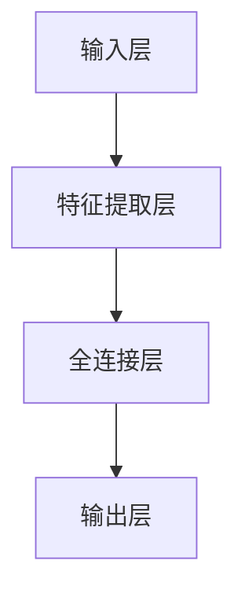

                 

# AI 大模型应用开发实战

> 关键词：AI 大模型，深度学习，神经网络，自然语言处理，计算机视觉，推荐系统，金融领域

> 摘要：本文旨在探讨 AI 大模型在各个领域的应用开发实战，从基础理论到实践案例，全面解析 AI 大模型的开发过程及其应用价值。文章分为三部分：第一部分介绍 AI 大模型的基础知识，包括定义、架构原理和发展历史；第二部分探讨深度学习与神经网络的基础理论，以及 AI 大模型在自然语言处理、计算机视觉和推荐系统中的应用；第三部分则通过具体项目实战，展示 AI 大模型在真实场景中的应用开发过程。本文旨在为广大开发者提供一套系统化的 AI 大模型应用开发指南。

## 目录大纲

### 第一部分：AI 大模型基础

**第1章: AI 大模型概述**

- 1.1 AI 大模型的定义与特性
  - 大模型的定义
  - 大模型的核心特性
  - 大模型与传统模型对比
- 1.2 AI 大模型的架构原理
  - Mermaid 流程图：AI 大模型架构
  - 计算机视觉与自然语言处理模型对比
- 1.3 AI 大模型的发展历史
  - 大模型的发展历程
  - 主流大模型的发展趋势

**第2章: 深度学习与神经网络基础**

- 2.1 神经网络基本概念
  - 神经网络结构
  - 激活函数与损失函数
- 2.2 深度学习算法
  - 反向传播算法
  - 常见的优化算法（如：SGD、Adam等）
- 2.3 卷积神经网络（CNN）原理与实现
  - 卷积层、池化层与全连接层
  - CNN 伪代码实现
- 2.4 循环神经网络（RNN）原理与实现
  - RNN 结构
  - LSTM 与 GRU 算法
  - RNN 伪代码实现

### 第二部分：AI 大模型应用开发实践

**第3章: 自然语言处理（NLP）大模型**

- 3.1 语言模型基础
  - 语言模型分类
  - NLP 中常用技术（如：词向量、序列标注等）
- 3.2 常见 NLP 大模型
  - BERT 模型架构
  - GPT 模型架构
- 3.3 NLP 大模型应用案例
  - 问答系统
  - 文本分类
  - 机器翻译

**第4章: 计算机视觉（CV）大模型**

- 4.1 CV 大模型基础
  - 卷积神经网络在 CV 中的应用
  - 特征提取与分类算法
- 4.2 CV 大模型应用案例
  - 图像分类
  - 目标检测
  - 人脸识别

**第5章: AI 大模型在推荐系统中的应用**

- 5.1 推荐系统概述
  - 推荐系统基本概念
  - 协同过滤算法
- 5.2 大模型在推荐系统中的应用
  - 迁移学习与微调
  - 多模型融合
- 5.3 推荐系统应用案例
  - 电商推荐
  - 社交网络推荐

**第6章: AI 大模型在金融领域的应用**

- 6.1 金融领域 AI 应用概述
  - 金融风控
  - 量化交易
  - 智能投顾
- 6.2 大模型在金融领域的应用案例
  - 风险评估
  - 投资组合优化
  - 信用评分

**第7章: AI 大模型部署与优化**

- 7.1 大模型部署概述
  - 模型评估与调优
  - 部署环境与工具
- 7.2 大模型优化方法
  - 并行计算与分布式训练
  - 模型压缩与量化
- 7.3 大模型在生产环境中的应用
  - 实时预测与模型更新
  - 集群管理与服务化部署

### 第三部分：AI 大模型应用开发实战

**第8章: 项目实战与案例分析**

- 8.1 项目实战概述
  - 项目背景与目标
  - 技术选型与架构设计
- 8.2 项目实战：智能问答系统
  - 数据预处理
  - 模型训练与评估
  - 系统部署与运维
- 8.3 项目实战：图像识别系统
  - 数据集准备与预处理
  - 模型训练与评估
  - 系统部署与优化
- 8.4 项目实战：个性化推荐系统
  - 用户行为数据收集与处理
  - 模型训练与评估
  - 系统部署与用户反馈收集

**附录：资源与工具**

- 附录 A: 常用 AI 开发工具与框架
  - TensorFlow
  - PyTorch
  - Keras
- 附录 B: 开发环境搭建指南
  - 操作系统
  - 编程语言
  - 开发工具
- 附录 C: 代码实战示例
  - 智能问答系统代码解读
  - 图像识别系统代码解读
  - 个性化推荐系统代码解读

## 第一部分：AI 大模型基础

### 第1章: AI 大模型概述

#### 1.1 AI 大模型的定义与特性

##### 大模型的定义

AI 大模型是指具有数十亿至数万亿参数的大型神经网络模型，能够在大规模数据集上训练，具备强大的特征提取和表示能力。这些模型通常用于解决复杂的问题，如图像分类、自然语言处理、语音识别等。

##### 大模型的核心特性

1. **参数量巨大**：大模型拥有数十亿至数万亿的参数，这使得它们能够学习到更加复杂的特征。
2. **计算资源需求高**：大模型训练需要大量的计算资源和时间。
3. **数据需求大**：大模型需要大规模数据集来训练，以保证模型的效果和泛化能力。
4. **强大的表征能力**：大模型能够对输入数据进行高效的表征，从而实现优秀的预测和分类效果。

##### 大模型与传统模型对比

1. **参数量**：传统模型通常只有数千到数万个参数，而大模型则有数十亿至数万亿参数。
2. **计算资源**：传统模型训练时间较短，计算资源需求较小；而大模型训练时间较长，计算资源需求大。
3. **数据需求**：传统模型对数据量要求不高，而大模型需要大规模数据集来训练。

#### 1.2 AI 大模型的架构原理

##### Mermaid 流程图：AI 大模型架构



##### 计算机视觉与自然语言处理模型对比

1. **输入数据**：计算机视觉模型输入为图像，自然语言处理模型输入为文本。
2. **特征提取**：计算机视觉模型主要通过卷积神经网络提取图像特征，自然语言处理模型则通过词向量、序列标注等技术提取文本特征。
3. **分类器设计**：计算机视觉模型通常采用全连接层作为分类器，自然语言处理模型则采用序列标注、注意力机制等设计分类器。

#### 1.3 AI 大模型的发展历史

##### 大模型的发展历程

1. **早期模型**：以单层感知机、BP 算法等为代表的早期神经网络模型。
2. **深度学习**：以 Hinton 提出的深度信念网络（DBN）和 LeCun 等人提出的卷积神经网络（CNN）为代表的深度学习模型。
3. **大模型时代**：以 BERT、GPT、ViT 等为代表的大规模神经网络模型。

##### 主流大模型的发展趋势

1. **参数量增长**：大模型参数量不断增加，以应对更复杂的问题。
2. **多模态融合**：大模型逐渐融合计算机视觉、自然语言处理等多种模态数据，实现跨模态任务。
3. **模型压缩**：为了降低大模型的计算资源和存储需求，研究热点逐渐转向模型压缩、量化等技术。

## 第二部分：深度学习与神经网络基础

### 第2章: 深度学习与神经网络基础

#### 2.1 神经网络基本概念

##### 神经网络结构

神经网络由多个神经元（或称节点）组成，每个神经元包括输入层、隐藏层和输出层。

1. **输入层**：接收外部输入数据。
2. **隐藏层**：对输入数据进行特征提取和变换。
3. **输出层**：生成预测结果或分类标签。

##### 激活函数与损失函数

1. **激活函数**：用于引入非线性特性，常见的激活函数包括 sigmoid、ReLU、Tanh 等。
2. **损失函数**：用于评估模型预测结果与真实结果之间的差距，常见的损失函数包括均方误差（MSE）、交叉熵（CE）等。

#### 2.2 深度学习算法

##### 反向传播算法

反向传播算法是一种用于训练神经网络的优化算法，通过迭代计算误差梯度，不断调整模型参数，使损失函数逐渐减小。

1. **前向传播**：将输入数据输入到神经网络，计算输出结果。
2. **计算损失**：计算输出结果与真实结果的差距，得到损失值。
3. **反向传播**：计算损失关于模型参数的梯度，并更新模型参数。

##### 常见的优化算法

1. **随机梯度下降（SGD）**：每次迭代使用整个训练数据集的平均梯度进行参数更新。
2. **Adam 优化器**：结合了 SGD 和动量项的优化器，具有更好的收敛速度和稳定性。

#### 2.3 卷积神经网络（CNN）原理与实现

##### 卷积层、池化层与全连接层

1. **卷积层**：通过卷积操作提取图像特征。
2. **池化层**：通过池化操作减少特征图的维度。
3. **全连接层**：将卷积层和池化层提取的特征映射到分类结果。

##### CNN 伪代码实现

```python
def cnn(input_data, filters, kernel_size, stride, padding):
    # 前向传播
    conv_output = conv2d(input_data, filters, kernel_size, stride, padding)
    pool_output = max_pool2d(conv_output, pool_size)
    return pool_output

def conv2d(input_data, filters, kernel_size, stride, padding):
    # 卷积操作
    output_size = (input_size - kernel_size + 2 \* padding) / stride + 1
    output = zeros(output_size)
    for i in range(output_size):
        for j in range(output_size):
            # 计算卷积
            output[i][j] = dot(input_data[i * stride:(i + 1) * stride, j * stride:(j + 1) * stride], filters)
    return output

def max_pool2d(input_data, pool_size):
    # 池化操作
    output_size = (input_size - pool_size) / stride + 1
    output = zeros(output_size)
    for i in range(output_size):
        for j in range(output_size):
            # 取最大值
            output[i][j] = max(input_data[i * stride:(i + 1) * stride, j * stride:(j + 1) * stride])
    return output
```

#### 2.4 循环神经网络（RNN）原理与实现

##### RNN 结构

循环神经网络由多个循环单元组成，每个循环单元包括输入门、遗忘门和输出门。

1. **输入门**：决定当前输入数据对隐藏状态的影响。
2. **遗忘门**：决定当前隐藏状态对下一隐藏状态的影响。
3. **输出门**：决定当前隐藏状态对输出结果的影响。

##### LSTM 与 GRU 算法

1. **LSTM（长短时记忆网络）**：通过引入门控机制，有效解决长短时依赖问题。
2. **GRU（门控循环单元）**：简化 LSTM 结构，减少参数数量。

##### RNN 伪代码实现

```python
def rnn(input_data, hidden_state, weights):
    # 输入门
    input_gate = sigmoiddot(input_data, weights['input_gate'])
    # 遗忘门
    forget_gate = sigmoiddot(hidden_state, weights['forget_gate'])
    # 输出门
    output_gate = sigmoiddot(hidden_state, weights['output_gate'])
    # 新的隐藏状态
    new_hidden_state = sigmoiddot(hidden_state, weights['input_gate']) * input_data + sigmoiddot(hidden_state, weights['forget_gate']) * forget_gate * hidden_state + sigmoiddot(hidden_state, weights['output_gate']) * output\_gate * tanh(sigmoiddot(input\_data, weights['output\_gate']))
    return new_hidden_state
```

## 第三部分：AI 大模型应用开发实践

### 第3章: 自然语言处理（NLP）大模型

#### 3.1 语言模型基础

##### 语言模型分类

1. **基于 n-gram 的语言模型**：利用 n 个历史单词预测下一个单词。
2. **基于神经网络的深度语言模型**：使用神经网络提取词向量，并利用深度学习技术建模。

##### NLP 中常用技术

1. **词向量**：将单词转换为向量表示，便于神经网络处理。
2. **序列标注**：对输入序列中的单词进行分类标注，如词性标注、命名实体识别等。

#### 3.2 常见 NLP 大模型

##### BERT 模型架构

BERT（Bidirectional Encoder Representations from Transformers）是一种基于 Transformer 的双向编码器，通过预训练和微调实现优秀的 NLP 任务。

1. **Transformer 架构**：采用自注意力机制，能够捕捉长距离依赖关系。
2. **预训练任务**：进行掩码语言模型（Masked Language Model，MLM）任务，学习单词的上下文关系。
3. **微调任务**：将预训练模型用于特定 NLP 任务，如文本分类、问答系统等。

##### GPT 模型架构

GPT（Generative Pre-trained Transformer）是一种基于 Transformer 的生成式模型，通过自回归方式生成文本。

1. **Transformer 架构**：采用自注意力机制，能够捕捉长距离依赖关系。
2. **预训练任务**：进行语言建模（Language Modeling，LM）任务，学习文本生成规律。
3. **生成文本**：根据预训练模型生成的概率分布，生成自然语言文本。

#### 3.3 NLP 大模型应用案例

##### 问答系统

1. **数据预处理**：清洗和预处理输入问题和答案数据，进行分词、词性标注等。
2. **模型训练**：使用预训练的 BERT 或 GPT 模型，进行问答系统任务的微调。
3. **系统部署**：将训练好的模型部署到服务器，实现实时问答功能。

##### 文本分类

1. **数据预处理**：清洗和预处理输入文本数据，进行分词、词性标注等。
2. **模型训练**：使用预训练的 BERT 或 GPT 模型，进行文本分类任务的微调。
3. **模型评估**：计算分类准确率、召回率等指标，评估模型性能。
4. **系统部署**：将训练好的模型部署到服务器，实现文本分类功能。

##### 机器翻译

1. **数据预处理**：清洗和预处理输入源语言和目标语言文本数据，进行分词、词性标注等。
2. **模型训练**：使用预训练的 BERT 或 GPT 模型，进行机器翻译任务的微调。
3. **系统部署**：将训练好的模型部署到服务器，实现实时机器翻译功能。

### 第4章: 计算机视觉（CV）大模型

#### 4.1 CV 大模型基础

##### 卷积神经网络在 CV 中的应用

卷积神经网络（CNN）是一种专门用于处理图像数据的神经网络模型，通过卷积、池化等操作提取图像特征，并实现图像分类、目标检测等任务。

1. **卷积层**：通过卷积操作提取图像特征。
2. **池化层**：通过池化操作减少特征图的维度。
3. **全连接层**：将卷积层和池化层提取的特征映射到分类结果。

##### 特征提取与分类算法

1. **特征提取**：通过卷积神经网络提取图像特征，如边缘、纹理等。
2. **分类算法**：采用全连接层等结构进行分类，常用的分类算法包括 Softmax、Sigmoid 等。

#### 4.2 CV 大模型应用案例

##### 图像分类

1. **数据预处理**：清洗和预处理输入图像数据，进行数据增强等。
2. **模型训练**：使用预训练的 CNN 模型，进行图像分类任务的微调。
3. **模型评估**：计算分类准确率等指标，评估模型性能。
4. **系统部署**：将训练好的模型部署到服务器，实现图像分类功能。

##### 目标检测

1. **数据预处理**：清洗和预处理输入图像数据，进行数据增强等。
2. **模型训练**：使用预训练的 CNN 模型，进行目标检测任务的微调。
3. **模型评估**：计算检测准确率、召回率等指标，评估模型性能。
4. **系统部署**：将训练好的模型部署到服务器，实现目标检测功能。

##### 人脸识别

1. **数据预处理**：清洗和预处理输入人脸图像数据，进行数据增强等。
2. **模型训练**：使用预训练的 CNN 模型，进行人脸识别任务的微调。
3. **模型评估**：计算识别准确率等指标，评估模型性能。
4. **系统部署**：将训练好的模型部署到服务器，实现人脸识别功能。

### 第5章: AI 大模型在推荐系统中的应用

#### 5.1 推荐系统概述

##### 推荐系统基本概念

推荐系统是一种基于用户兴趣和物品特征的算法，通过分析用户历史行为和物品属性，为用户推荐其可能感兴趣的物品。

1. **用户**：推荐系统的目标用户。
2. **物品**：推荐系统中的商品、文章、音乐等。
3. **兴趣**：用户对物品的兴趣程度。
4. **推荐**：根据用户兴趣和物品特征，为用户推荐物品。

##### 协同过滤算法

协同过滤算法是一种基于用户历史行为的推荐算法，主要通过计算用户之间的相似度或物品之间的相似度，实现物品推荐。

1. **基于用户的协同过滤**：根据用户的历史行为，找到相似用户，推荐相似用户喜欢的物品。
2. **基于物品的协同过滤**：根据物品的历史行为，找到相似物品，推荐相似物品。

#### 5.2 大模型在推荐系统中的应用

##### 迁移学习与微调

迁移学习是一种利用已有模型在新任务上训练的技术，通过迁移学习，可以将已有模型的知识迁移到新任务上，提高新任务的性能。

1. **迁移学习**：将预训练的 AI 大模型用于推荐系统的训练。
2. **微调**：在迁移学习的基础上，对模型进行微调，使其更好地适应新任务。

##### 多模型融合

多模型融合是将多个模型的结果进行整合，以提高推荐系统的性能。

1. **模型融合**：将不同模型（如深度学习模型、协同过滤模型等）的结果进行加权或投票，得到最终的推荐结果。
2. **融合策略**：根据任务需求和模型特性，选择合适的融合策略。

#### 5.3 推荐系统应用案例

##### 电商推荐

1. **用户行为数据收集**：收集用户在电商平台的浏览、购买等行为数据。
2. **模型训练**：使用迁移学习和微调技术，训练推荐模型。
3. **系统部署**：将训练好的模型部署到电商平台，实现商品推荐功能。

##### 社交网络推荐

1. **用户行为数据收集**：收集用户在社交网络平台的活动数据，如点赞、评论等。
2. **模型训练**：使用迁移学习和微调技术，训练推荐模型。
3. **系统部署**：将训练好的模型部署到社交网络平台，实现好友推荐、内容推荐等功能。

### 第6章: AI 大模型在金融领域的应用

#### 6.1 金融领域 AI 应用概述

金融领域 AI 应用主要包括金融风控、量化交易、智能投顾等。

1. **金融风控**：利用 AI 技术识别和防范金融风险，如欺诈检测、信用评估等。
2. **量化交易**：利用 AI 技术进行高频交易、算法交易等，提高交易效率和盈利能力。
3. **智能投顾**：利用 AI 技术为用户提供个性化的投资建议，提高投资收益。

#### 6.2 大模型在金融领域的应用案例

##### 风险评估

1. **数据收集**：收集金融机构的历史交易数据、用户行为数据等。
2. **模型训练**：使用迁移学习和微调技术，训练风险评估模型。
3. **模型评估**：计算模型预测准确率、召回率等指标，评估模型性能。
4. **系统部署**：将训练好的模型部署到金融机构，实现风险预警和决策支持。

##### 投资组合优化

1. **数据收集**：收集金融机构的历史交易数据、用户行为数据等。
2. **模型训练**：使用迁移学习和微调技术，训练投资组合优化模型。
3. **模型评估**：计算模型预测准确率、召回率等指标，评估模型性能。
4. **系统部署**：将训练好的模型部署到金融机构，实现投资组合优化功能。

##### 信用评分

1. **数据收集**：收集金融机构的历史交易数据、用户行为数据等。
2. **模型训练**：使用迁移学习和微调技术，训练信用评分模型。
3. **模型评估**：计算模型预测准确率、召回率等指标，评估模型性能。
4. **系统部署**：将训练好的模型部署到金融机构，实现信用评估和风险评估功能。

### 第7章: AI 大模型部署与优化

#### 7.1 大模型部署概述

##### 模型评估与调优

1. **模型评估**：使用测试数据集评估模型性能，包括准确率、召回率、F1 值等指标。
2. **模型调优**：根据评估结果，调整模型参数，优化模型性能。

##### 部署环境与工具

1. **部署环境**：选择合适的硬件环境和软件环境，如 GPU、Docker、Kubernetes 等。
2. **部署工具**：使用自动化部署工具，如 TensorFlow Serving、PyTorch Server 等，实现模型部署。

#### 7.2 大模型优化方法

##### 并行计算与分布式训练

1. **并行计算**：通过多 GPU、多 CPU 等方式，提高模型训练速度。
2. **分布式训练**：通过分布式计算框架，如 TensorFlow、PyTorch 等，实现模型训练的分布式化。

##### 模型压缩与量化

1. **模型压缩**：通过剪枝、量化等技术，减小模型参数量和计算量，提高模型部署效率。
2. **量化**：将模型参数从浮点数转换为整数，减少模型存储和计算资源消耗。

#### 7.3 大模型在生产环境中的应用

##### 实时预测与模型更新

1. **实时预测**：使用在线预测框架，实现模型实时预测功能。
2. **模型更新**：根据用户反馈和实时数据，定期更新模型，保持模型性能。

##### 集群管理与服务化部署

1. **集群管理**：使用 Kubernetes、Docker 等工具，实现模型集群管理和调度。
2. **服务化部署**：使用微服务架构，将模型部署为服务，实现模型的高可用性和弹性。

### 第8章: 项目实战与案例分析

#### 8.1 项目实战概述

##### 项目背景与目标

本案例以一个智能问答系统为例，介绍 AI 大模型在自然语言处理领域的应用开发。

1. **项目背景**：随着互联网的快速发展，人们对智能问答系统的需求日益增加。
2. **项目目标**：实现一个基于 BERT 模型的智能问答系统，能够处理用户的提问并给出合理的回答。

##### 技术选型与架构设计

1. **技术选型**：
   - 自然语言处理：使用 BERT 模型进行文本处理。
   - 服务器部署：使用 TensorFlow Serving 搭建模型服务。
   - 客户端：使用 Web 开发框架（如 Flask、Django）搭建前端界面。

2. **架构设计**：
   - 数据处理模块：负责数据清洗、预处理和分词等操作。
   - 模型训练模块：使用 BERT 模型进行训练。
   - 模型服务模块：部署训练好的 BERT 模型，提供问答服务。
   - 前端界面：提供用户提问和回答展示。

#### 8.2 项目实战：智能问答系统

##### 数据预处理

1. **数据来源**：收集互联网上的问答数据，如微博、知乎等。
2. **数据清洗**：去除无效数据、格式化数据等。
3. **数据预处理**：
   - 分词：使用 BERT 分词工具对问答数据进行分词。
   - 词向量化：将分词后的数据转换为词向量。
   - 序列编码：将词向量编码为序列格式，供 BERT 模型处理。

##### 模型训练与评估

1. **模型训练**：使用 BERT 模型进行训练，优化模型参数。
2. **模型评估**：使用测试集评估模型性能，包括准确率、召回率等指标。
3. **模型调优**：根据评估结果，调整模型参数，优化模型性能。

##### 系统部署与运维

1. **模型部署**：使用 TensorFlow Serving 部署训练好的 BERT 模型，提供问答服务。
2. **前端开发**：使用 Web 开发框架搭建前端界面，实现用户提问和回答展示。
3. **系统运维**：
   - 监控模型服务：使用 Prometheus、Grafana 等工具监控模型服务的运行状态。
   - 日志管理：使用 ELK（Elasticsearch、Logstash、Kibana）等工具管理系统日志。
   - 备份与恢复：定期备份系统数据，实现数据备份与恢复。

#### 8.3 项目实战：图像识别系统

##### 数据集准备与预处理

1. **数据来源**：收集互联网上的图像数据，如 CIFAR-10、ImageNet 等。
2. **数据清洗**：去除无效图像、格式化图像数据等。
3. **数据预处理**：
   - 图像增强：使用随机裁剪、旋转、翻转等操作增强图像数据。
   - 图像归一化：将图像数据转换为固定大小，并归一化像素值。

##### 模型训练与评估

1. **模型训练**：使用卷积神经网络（CNN）模型进行训练，优化模型参数。
2. **模型评估**：使用测试集评估模型性能，包括准确率、召回率等指标。
3. **模型调优**：根据评估结果，调整模型参数，优化模型性能。

##### 系统部署与优化

1. **模型部署**：使用 TensorFlow Serving 部署训练好的 CNN 模型，提供图像识别服务。
2. **前端开发**：使用 Web 开发框架搭建前端界面，实现用户上传图像和识别结果展示。
3. **系统优化**：
   - 模型压缩：使用模型压缩技术（如量

