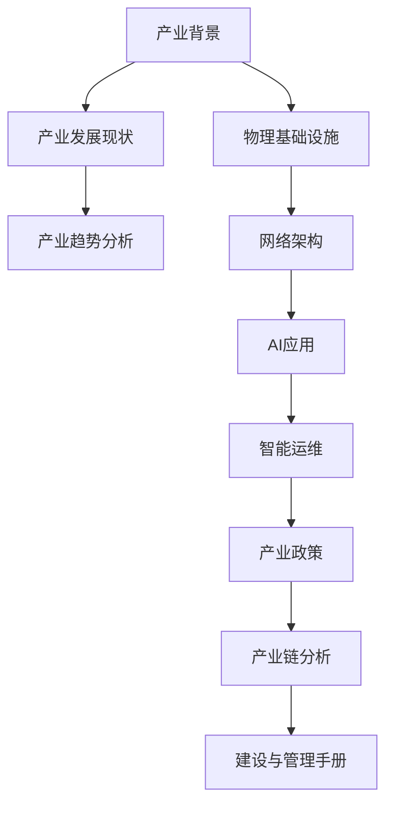

                 

# 文章标题：AI大模型应用数据中心建设：数据中心产业发展

> 关键词：数据中心、AI大模型、智能运维、数据中心建设、产业政策

> 摘要：本文从数据中心产业发展概述、数据中心基础设施建设、数据中心网络架构、AI大模型在数据中心的应用、数据中心智能运维、数据中心产业政策与法规、数据中心产业生态发展等多个角度，深入剖析了AI大模型在数据中心建设中的重要作用，以及数据中心产业的发展趋势和未来发展方向。文章旨在为读者提供一个全面、系统的了解数据中心和AI大模型应用的专业视角。

### 目录大纲：《AI大模型应用数据中心建设：数据中心产业发展》

#### 第一部分：数据中心产业发展概述

- **第1章：数据中心产业背景**
  - **1.1 数据中心产业发展历史**
  - **1.2 数据中心产业发展现状**
  - **1.3 数据中心产业趋势分析**

#### 第二部分：数据中心基础设施建设

- **第2章：数据中心物理基础设施**
  - **2.1 数据中心选址与规划**
  - **2.2 数据中心建筑设计**
  - **2.3 电源系统设计**

#### 第三部分：数据中心网络架构

- **第3章：数据中心网络设计原则**
  - **3.1 网络拓扑结构**
  - **3.2 网络性能优化**
  - **3.3 安全性保障**

#### 第四部分：AI大模型在数据中心的应用

- **第4章：AI大模型核心原理**
  - **4.1 AI大模型定义**
  - **4.2 AI大模型架构**
  - **4.3 AI大模型数据处理**

#### 第五部分：数据中心AI应用案例分析

- **第5章：数据中心智能运维**
  - **5.1 智能监控与故障预警**
  - **5.2 自动化运维**
  - **5.3 数据中心能效优化**

#### 第六部分：数据中心产业政策与法规

- **第6章：数据中心产业政策解读**
  - **6.1 国家政策导向**
  - **6.2 法规标准制定**
  - **6.3 行业协会与联盟**

#### 第七部分：数据中心产业生态发展

- **第7章：数据中心产业链分析**
  - **7.1 产业链上下游关系**
  - **7.2 数据中心服务创新**
  - **7.3 产业合作与协同**

#### 附录：数据中心建设与管理手册

- **附录A：数据中心建设与管理指南**
  - **A.1 建设流程**
  - **A.2 运维管理**
  - **A.3 案例分析**

#### 参考资料

- **参考文献**
- **学术论文**
- **行业报告**

#### Mermaid 流�程图

- **数据中心产业发展流程图**
  ```mermaid
  graph TD
  A[产业背景] --> B[产业发展现状]
  B --> C[产业趋势分析]
  A --> D[物理基础设施]
  D --> E[网络架构]
  E --> F[AI应用]
  F --> G[智能运维]
  G --> H[产业政策]
  H --> I[产业链分析]
  I --> J[建设与管理手册]
  ```

#### AI大模型架构原理伪代码

```python
# AI大模型架构原理伪代码
def create_model(input_shape):
    model = keras.Sequential([
        keras.layers.Dense(units=128, activation='relu', input_shape=input_shape),
        keras.layers.Dropout(0.2),
        keras.layers.Dense(units=64, activation='relu'),
        keras.layers.Dropout(0.2),
        keras.layers.Dense(units=1, activation='sigmoid')
    ])
    return model
```

#### 数学模型与公式

- **能量效率模型（EE）**
  $$ EE = \frac{Useful\ Energy}{Total\ Energy} $$

- **数据中心PUE（Power Usage Effectiveness）**
  $$ PUE = \frac{Total\ Facility\ Power}{IT\ Equipment\ Power} $$

#### 项目实战

- **数据中心能效优化实战案例**
  - **1. 环境监测数据收集**
  - **2. 数据预处理**
  - **3. 构建能效优化模型**
  - **4. 模型训练与验证**
  - **5. 模型部署与实际应用**
  - **6. 效果评估与持续优化**

- **源代码实现**

```python
# 数据预处理代码示例
def preprocess_data(data):
    # 数据清洗、归一化等处理
    processed_data = ...
    return processed_data
```

#### 作者信息

- 作者：AI天才研究院/AI Genius Institute & 禅与计算机程序设计艺术 /Zen And The Art of Computer Programming

接下来，我们将按照目录大纲逐步展开详细的内容讲解。首先，我们从数据中心产业发展概述开始。首先，我们来探讨一下数据中心产业发展的历史背景。

### 第一部分：数据中心产业发展概述

#### 第1章：数据中心产业背景

##### 1.1 数据中心产业发展历史

数据中心作为一种专门用于存储、处理和分发数据的设施，其历史可以追溯到20世纪50年代。最初的计算机中心主要用于科学研究和军事领域。随着计算机技术的发展，数据中心的规模和功能也在不断扩展。20世纪60年代，企业开始意识到数据中心的重要性，将其用于商业计算和数据处理。

在20世纪70年代，随着微型计算机的出现，数据中心开始逐步向商业领域扩展。这个时期，数据中心主要依赖于传统的硬件设备和操作系统，数据中心的规模和功能相对有限。

进入20世纪80年代，随着网络技术的发展，数据中心开始实现远程访问和分布式计算。这个时期，数据中心开始向智能化和自动化方向发展。

20世纪90年代，互联网的普及使得数据中心迎来了高速发展期。数据中心不仅用于企业内部的业务处理，还成为互联网服务提供商（ISP）和云计算服务提供商的重要基础设施。

进入21世纪，数据中心产业进入了一个新的发展阶段。云计算、大数据、物联网等新兴技术的兴起，使得数据中心的重要性更加凸显。数据中心不再仅仅是一个存储和处理数据的场所，而是成为了整个数字化经济的基础设施。

##### 1.2 数据中心产业发展现状

目前，数据中心产业已经成为了全球范围内最具活力的产业之一。根据市场研究机构的统计数据，全球数据中心市场规模在过去几年一直保持着快速增长。预计未来几年，这一趋势还将持续。

从全球范围来看，美国、中国、欧洲等地是数据中心产业的主要市场。其中，美国作为全球最大的数据中心市场，占据了全球市场的大部分份额。中国和欧洲等地也在加大对数据中心产业的投入，市场潜力巨大。

在数据中心的建设模式上，传统的自建数据中心逐渐被云计算数据中心所取代。云计算数据中心具有规模大、灵活性高、成本效益好等优点，成为数据中心建设的主要方向。

此外，随着5G、物联网、人工智能等新兴技术的快速发展，数据中心的需求也在不断增长。数据中心产业不仅涉及到硬件设备、网络设施等方面，还包括软件服务、运维管理等各个方面。

##### 1.3 数据中心产业趋势分析

未来，数据中心产业将呈现出以下几个发展趋势：

1. **智能化与自动化**：随着人工智能、物联网等技术的应用，数据中心将实现更高级别的智能化和自动化。通过智能监控、故障预测、自动化运维等技术，提高数据中心的运行效率和安全性。

2. **绿色化与低碳化**：数据中心能耗巨大，未来数据中心产业将更加注重绿色化和低碳化发展。通过采用高效节能的技术和设备，降低数据中心的能耗和碳排放。

3. **安全性与合规性**：随着数据泄露、网络攻击等安全事件的频发，数据中心产业将更加注重安全性和合规性。通过完善安全防护措施、加强数据保护法规的制定和执行，保障数据中心的安全运行。

4. **全球化和多元化**：数据中心产业将呈现出全球化和多元化的趋势。随着全球互联网的普及和数据需求的增长，数据中心将越来越多地分布于全球各地。同时，数据中心产业也将呈现出多元化的发展态势，涵盖更多的业务领域和应用场景。

通过以上分析，我们可以看出数据中心产业发展的重要性和广阔前景。在接下来的章节中，我们将进一步探讨数据中心基础设施建设、数据中心网络架构以及AI大模型在数据中心的应用等内容。让我们一起走进这个充满机遇和挑战的数据中心产业世界。在接下来的内容中，我们将探讨数据中心物理基础设施的相关内容。

### 第二部分：数据中心基础设施建设

#### 第2章：数据中心物理基础设施

数据中心物理基础设施是数据中心建设的核心部分，它直接影响到数据中心的性能、可靠性和能效。在数据中心物理基础设施的建设中，选址与规划、建筑设计和电源系统设计是至关重要的三个环节。

##### 2.1 数据中心选址与规划

数据中心选址是数据中心建设的第一步，也是最重要的一步。选址的合理性直接关系到数据中心的运行效率和长期发展。以下是数据中心选址需要考虑的几个关键因素：

1. **地理位置**：数据中心应选择在地理环境稳定、自然灾害较少的地区。例如，远离地震带、洪水区和台风区。此外，应考虑数据中心的交通便利性，以便快速响应业务需求和物流需求。

2. **能源供应**：数据中心对能源的需求巨大，因此选择能源供应稳定、成本低廉的地区至关重要。一般来说，电力资源丰富的地区更适合建设数据中心。

3. **气候条件**：气候条件对数据中心的能耗和散热有着重要影响。选择气候温和、干燥的地区可以降低空调和散热系统的能耗。

4. **政策支持**：政府政策对数据中心建设具有重要影响。数据中心选址应考虑政府对数据中心建设的支持政策，如税收优惠、用地政策等。

5. **网络条件**：数据中心需要与互联网和其他数据中心进行高效的数据传输，因此选址时应考虑网络条件的便利性和可靠性。

在选址确定后，数据中心规划是下一个重要的环节。数据中心规划应包括以下几个方面：

1. **规模规划**：根据业务需求和预算，合理规划数据中心的规模。包括服务器数量、存储容量、网络带宽等。

2. **功能分区**：根据数据中心的业务需求，合理划分功能区域，如机房、办公区、设备区、控制室等。

3. **设备布局**：合理安排设备布局，确保数据中心的设备之间保持适当距离，便于散热和检修。

4. **安全性规划**：制定严格的安全措施，包括防火、防盗、防雷击等，确保数据中心的设备和数据安全。

##### 2.2 数据中心建筑设计

数据中心的建筑设计直接关系到数据中心的性能和可靠性。以下是数据中心建筑设计需要考虑的几个关键因素：

1. **结构设计标准**：数据中心的建筑结构应满足抗震、防火、防水等要求，确保在自然灾害和突发事件中保持稳定。

2. **建筑材料选择**：建筑材料应具备良好的防火、防潮、耐腐蚀等特性，以确保数据中心的长期稳定运行。

3. **空气质量**：数据中心内部应保持良好的空气质量，避免空气中的尘埃、湿气等对设备和数据造成损害。

4. **空调与散热系统**：数据中心需要采用高效的空调和散热系统，以确保设备在正常运行过程中保持适宜的温度和湿度。

5. **电力供应**：数据中心应配备可靠的电力供应系统，包括UPS不间断电源和备用电源，确保在停电情况下设备仍能正常运行。

6. **网络布局**：数据中心内部应布置充足的布线系统，以支持高速数据传输和网络设备之间的互联互通。

7. **安全性设计**：数据中心建筑应具备良好的安全性设计，包括门禁系统、监控系统、报警系统等，确保数据安全和人员安全。

##### 2.3 电源系统设计

电源系统是数据中心正常运行的基础，其设计直接影响到数据中心的可靠性和能效。以下是电源系统设计需要考虑的几个关键因素：

1. **UPS系统配置**：UPS（不间断电源）是数据中心电源系统的重要组成部分。应根据数据中心的规模和需求，合理配置UPS系统，确保在停电情况下设备能持续运行。

2. **电源冗余设计**：为了提高数据中心的可靠性，电源系统应设计冗余，包括多路电源输入、多台UPS同时工作等。

3. **供电稳定性**：数据中心应确保供电的稳定性，避免电压波动、频率变化等问题对设备造成损害。

4. **电力监控与管理**：通过实时监控和管理电力系统的运行状态，及时发现和解决电力问题，确保数据中心的电力供应稳定可靠。

5. **能源效率**：在电源系统设计中，应考虑能源效率，通过采用高效电源设备、优化电源管理策略等手段，降低数据中心的能耗。

通过以上对数据中心物理基础设施的详细分析，我们可以看出数据中心建设的重要性和复杂性。在接下来的章节中，我们将继续探讨数据中心网络架构的设计原则和实现方法。敬请期待！接下来，我们将深入探讨数据中心网络架构的设计原则和实现方法。

### 第三部分：数据中心网络架构

数据中心网络架构是数据中心建设中的关键环节，它直接影响数据中心的性能、可靠性和安全性。一个高效、稳定的数据中心网络架构能够确保数据高效传输，满足不断增长的数据处理需求。以下是数据中心网络设计原则的详细探讨。

#### 第3章：数据中心网络设计原则

##### 3.1 网络拓扑结构

数据中心的网络拓扑结构是网络设计的基础，它决定了网络的整体性能和可扩展性。常见的数据中心网络拓扑结构包括：

1. **环状拓扑**：环状拓扑通过将多个网络设备连接成环，实现数据的循环传输。这种结构具有简单、可靠的特点，但扩展性较差。

2. **星状拓扑**：星状拓扑将所有网络设备连接到一个中央交换机或路由器，实现集中管理。这种结构具有较好的扩展性和可靠性，但中央设备成为单点故障的潜在风险。

3. **网状拓扑**：网状拓扑通过将网络设备之间进行多路连接，实现冗余备份和高可靠性。这种结构具有较高的可靠性，但布线和维护成本较高。

在数据中心网络设计中，通常采用混合拓扑结构，结合不同拓扑结构的优点，以满足各种业务需求。例如，核心网络采用网状拓扑，提高核心网络的可靠性；边缘网络采用星状拓扑，简化管理。

##### 3.2 网络性能优化

数据中心网络性能优化是确保网络高效运行的重要手段。以下是一些常见的网络性能优化方法：

1. **负载均衡**：通过将网络流量分配到多个网络路径上，实现流量的均衡分配，提高网络带宽利用率。常见的负载均衡算法包括最小带宽负载均衡、最小延迟负载均衡等。

2. **缓存技术**：通过在关键位置设置缓存服务器，缓存频繁访问的数据，减少网络传输压力，提高访问速度。常用的缓存技术包括DNS缓存、内容分发网络（CDN）等。

3. **带宽管理**：通过带宽管理策略，限制某些业务的带宽占用，确保关键业务的带宽需求。带宽管理可以采用带宽分配、带宽限制等方法实现。

4. **QoS（服务质量）**：通过服务质量技术，为不同业务提供不同级别的服务质量保证。QoS技术可以确保关键业务在高峰时段获得足够的网络资源，避免网络拥堵。

##### 3.3 安全性保障

数据中心网络安全性是保障数据中心安全运行的关键。以下是一些常见的网络安全性保障措施：

1. **网络安全策略**：制定严格的网络安全策略，包括访问控制、防火墙策略、入侵检测等，防止非法访问和网络攻击。

2. **防火墙与入侵检测**：通过部署防火墙和入侵检测系统（IDS），实时监控网络流量，识别和阻止潜在的攻击行为。

3. **加密技术**：通过加密技术，保障数据在传输过程中的安全性。常见的加密技术包括SSL/TLS等。

4. **安全审计**：定期进行安全审计，检查网络设备和系统的安全配置，发现和修复安全漏洞。

5. **备份与恢复**：制定数据备份和恢复策略，确保在发生数据丢失或系统故障时，能够快速恢复数据和服务。

通过以上对数据中心网络架构设计原则的详细分析，我们可以看出数据中心网络架构设计的复杂性和重要性。一个高效、可靠的数据中心网络架构不仅能够满足当前业务需求，还能为未来的业务增长提供支持。在接下来的章节中，我们将探讨AI大模型在数据中心的应用，以及数据中心智能运维的相关内容。敬请期待！在深入了解了数据中心网络架构的设计原则后，接下来我们将探讨AI大模型在数据中心的应用。

### 第四部分：AI大模型在数据中心的应用

随着人工智能技术的快速发展，AI大模型在数据中心中的应用逐渐成为热点。AI大模型具有强大的数据处理和模式识别能力，能够为数据中心提供智能化、自动化的服务。以下是AI大模型在数据中心中的核心应用领域及其原理的详细探讨。

#### 第4章：AI大模型核心原理

##### 4.1 AI大模型定义

AI大模型是指具有海量参数和复杂结构的机器学习模型，通常用于解决大规模数据集上的复杂任务。与传统的机器学习模型相比，AI大模型具有以下几个特点：

1. **参数数量庞大**：AI大模型通常包含数百万、数千万甚至数十亿个参数，使得模型能够捕捉数据中的复杂模式。

2. **结构复杂**：AI大模型通常采用深度神经网络（Deep Neural Network，DNN）等复杂结构，通过多层次的神经元连接，实现数据的层次化表示。

3. **自适应性强**：AI大模型可以通过自动调整参数，实现对不同数据集和不同任务的自适应处理。

4. **计算资源需求高**：AI大模型的训练和推理过程需要大量的计算资源和时间，通常需要高性能计算设备和并行计算技术支持。

##### 4.2 AI大模型架构

AI大模型的架构设计是其核心部分，决定了模型的性能和可扩展性。以下是一些常见的AI大模型架构：

1. **卷积神经网络（CNN）**：CNN是一种专门用于图像处理的神经网络架构，通过卷积层、池化层和全连接层等结构，实现对图像的层次化表示和特征提取。

2. **递归神经网络（RNN）**：RNN是一种用于处理序列数据的神经网络架构，通过记忆单元和反馈连接，实现对序列数据的时序建模。

3. **Transformer模型**：Transformer模型是一种基于自注意力机制的神经网络架构，通过多头自注意力机制和位置编码，实现对序列数据的全局建模。

4. **生成对抗网络（GAN）**：GAN是一种基于对抗训练的神经网络架构，通过生成器和判别器的对抗博弈，实现数据的生成和判别。

##### 4.3 AI大模型数据处理

AI大模型对数据处理的要求较高，包括数据清洗、数据预处理和特征提取等环节。以下是AI大模型数据处理的一些关键技术：

1. **数据清洗**：数据清洗是确保数据质量的重要步骤，包括去除重复数据、填补缺失值、纠正错误数据等。

2. **数据预处理**：数据预处理包括数据归一化、标准化、数据扩充等，以适应AI大模型的训练需求。

3. **特征提取**：特征提取是从原始数据中提取对模型训练有用的特征，提高模型的性能。常用的特征提取方法包括主成分分析（PCA）、线性判别分析（LDA）等。

通过以上对AI大模型核心原理的详细分析，我们可以看出AI大模型在数据中心中的应用前景广阔。接下来，我们将探讨数据中心智能运维的相关内容。敬请期待！在探讨了AI大模型的核心原理后，接下来我们将分析数据中心智能运维的具体应用。

### 第五部分：数据中心智能运维

随着数据中心规模的不断扩大和技术的迅速发展，如何高效、安全地管理和运维数据中心成为了一个重要的课题。智能运维通过引入人工智能技术，实现了数据中心运维的自动化和智能化，从而提升了运维效率和数据中心整体性能。以下是对数据中心智能运维的详细探讨。

#### 第5章：数据中心智能运维

##### 5.1 智能监控与故障预警

智能监控是数据中心智能运维的基础，通过实时监控数据中心的各项运行指标，可以及时发现异常情况并进行预警。以下是智能监控和故障预警的一些关键技术：

1. **实时监控**：通过部署传感器和网络监控设备，实时采集数据中心的温度、湿度、电压、电流、网络流量等运行指标，实现对数据中心运行状态的全面监控。

2. **数据可视化**：利用数据可视化技术，将监控数据以图形、图表等形式展示，帮助运维人员直观地了解数据中心的运行状态。

3. **故障预警**：通过预设阈值和规则，对监控数据进行实时分析，当某项指标超过阈值时，自动触发预警，通知运维人员进行处理。

4. **异常检测**：利用机器学习算法，对历史监控数据进行训练，建立正常运行状态的模型，通过实时监控数据与模型进行对比，检测异常情况。

##### 5.2 自动化运维

自动化运维是智能运维的核心，通过自动化工具和脚本，实现数据中心的日常运维任务，减轻运维人员的工作负担。以下是自动化运维的一些关键技术：

1. **自动化部署**：通过自动化工具，如Puppet、Chef等，实现服务器和应用系统的自动化部署，提高部署效率和一致性。

2. **自动化备份**：通过自动化备份工具，如Veeam、Bacula等，定期对数据中心的业务数据进行备份，确保数据的安全性和可靠性。

3. **自动化监控**：通过集成监控工具，如Zabbix、Nagios等，实现自动化的监控任务，如日志收集、性能分析、故障告警等。

4. **自动化运维管理平台**：建设统一的自动化运维管理平台，集成各种运维工具和脚本，实现统一的运维管理和调度，提高运维效率。

##### 5.3 数据中心能效优化

数据中心能效优化是智能运维的重要方向，通过优化数据中心运行策略，降低能耗，提高数据中心的能源利用效率。以下是数据中心能效优化的一些关键技术：

1. **能效管理模型**：建立能效管理模型，对数据中心的能耗进行量化分析，识别能耗瓶颈。

2. **实时能耗监测**：通过部署能耗监测设备，实时采集数据中心的能耗数据，监控能耗变化，实现能耗的精细化控制。

3. **智能调度算法**：利用机器学习算法，优化数据中心的设备调度策略，实现能耗的动态平衡。例如，通过预测服务器负载，合理分配电力资源，降低能耗。

4. **冷却系统优化**：通过优化数据中心的冷却系统，降低能耗。例如，采用液体冷却、空气冷却等技术，提高冷却效率。

5. **绿色能源应用**：利用绿色能源，如太阳能、风能等，降低数据中心的碳排放，实现可持续发展。

通过以上对数据中心智能运维的详细分析，我们可以看到智能运维在提升数据中心运维效率、降低运维成本、提高数据中心整体性能方面的巨大潜力。在接下来的部分，我们将探讨数据中心产业政策与法规，以及数据中心产业链的分析。敬请期待！接下来，我们将深入探讨数据中心产业政策与法规的相关内容。

### 第六部分：数据中心产业政策与法规

数据中心作为数字经济的重要基础设施，其健康发展离不开政策的引导和法规的规范。国家和地方政府通过制定一系列政策和法规，推动数据中心产业的规范化和可持续发展。以下是对数据中心产业政策与法规的详细解读。

#### 第6章：数据中心产业政策解读

##### 6.1 国家政策导向

国家政策在数据中心产业发展中起到了重要的引导作用。以下是一些主要的国家政策导向：

1. **“新基建”政策**：“新基建”包括5G、数据中心、人工智能、工业互联网等领域，这些领域的发展被视为国家战略性新兴产业的重要组成部分。国家通过加大投资、优化政策环境等措施，推动数据中心产业快速发展。

2. **“互联网+”政策**：“互联网+”政策的实施，促进了数据中心与云计算、大数据、人工智能等新兴技术的深度融合。数据中心作为数据存储和处理的核心设施，其发展得到了国家政策的强力支持。

3. **节能减排政策**：随着环境保护意识的增强，国家大力推进节能减排工作，数据中心产业作为能源消耗大户，也受到了严格的节能减排政策约束。国家通过制定能效标准、鼓励绿色数据中心建设等措施，推动数据中心产业向低碳、环保方向发展。

4. **数据保护政策**：数据保护是数据中心产业发展的重要环节。国家通过制定《数据安全法》、《个人信息保护法》等法律法规，加强对数据的保护，提高数据中心的安全性和可靠性。

##### 6.2 法规标准制定

数据中心产业涉及的法规和标准众多，以下是一些主要的法规和标准：

1. **国家标准**：中国国家标准如《数据中心设计规范》、《数据中心建设管理办法》等，为数据中心的设计、建设和运营提供了技术规范和操作指南。

2. **地方性法规**：地方政府根据本地实际情况，制定了若干地方性法规和规章，如《上海市数据中心建设和管理办法》等，加强对数据中心产业的管理和规范。

3. **国际标准**：国际标准化组织（ISO）和国际电信联盟（ITU）等机构制定了多项与国际接轨的标准，如ISO/IEC 27001信息安全管理体系、ISO/IEC 23233数据中心能源效率评估标准等。

4. **行业标准**：数据中心产业内的行业协会和企业，根据行业发展和市场需求，制定了一系列行业标准，如中国信息通信研究院发布的《数据中心智能运维标准》等。

##### 6.3 行业协会与联盟

行业协会与联盟在数据中心产业发展中发挥了重要作用，以下是一些主要的行业协会和联盟：

1. **中国电子信息行业联合会**：作为国家级的行业组织，中国电子信息行业联合会推动了数据中心产业政策的制定和实施，促进了产业的健康发展。

2. **中国通信企业协会数据中心委员会**：作为中国通信企业的行业组织，数据中心委员会致力于推动数据中心技术的发展和应用，为会员企业提供技术支持和政策咨询。

3. **国际数据中心协会（IDC Association）**：作为全球性的数据中心行业协会，国际数据中心协会推动了全球数据中心产业的发展，促进了国际间的技术交流和合作。

通过以上对数据中心产业政策与法规的详细解读，我们可以看到数据中心产业在国家政策引导和法规规范下，正朝着规范化、绿色化和国际化的方向发展。在接下来的部分，我们将探讨数据中心产业生态发展，包括产业链分析、服务创新和产业合作。敬请期待！

### 第七部分：数据中心产业生态发展

数据中心产业生态发展是推动产业持续创新和高效运营的关键。产业链的上下游关系、服务创新以及产业合作与协同是数据中心产业生态发展的核心内容。以下是对数据中心产业生态发展的详细探讨。

#### 第7章：数据中心产业链分析

数据中心产业链涉及多个环节，包括设备制造、基础设施建设、服务提供等。以下是对数据中心产业链上下游关系的分析：

##### 7.1 产业链上下游关系

1. **上游环节**：包括芯片制造商、服务器制造商、存储设备制造商等。这些企业提供数据中心所需的硬件设备，如CPU、GPU、存储设备等。

2. **中游环节**：包括数据中心建设、网络基础设施等。这些企业负责数据中心的物理设施建设、网络搭建和维护。

3. **下游环节**：包括云计算服务提供商、数据存储服务提供商等。这些企业利用数据中心提供数据存储、处理和分发服务，满足企业和个人的数据需求。

上下游企业之间的紧密合作是数据中心产业发展的基础。上游企业需要根据下游企业的需求不断改进产品，下游企业需要向上游企业提供市场反馈，以促进整个产业链的健康发展。

##### 7.2 数据中心服务创新

数据中心服务创新是推动产业持续发展的重要动力。以下是一些数据中心服务创新的方向：

1. **云计算服务**：云计算数据中心提供了弹性、高效、安全的数据存储和处理服务。云服务提供商通过提供IaaS、PaaS、SaaS等不同层次的服务，满足不同企业的需求。

2. **边缘计算服务**：边缘计算将数据处理能力推向网络边缘，降低了数据传输延迟，提高了数据处理效率。边缘数据中心成为了云计算服务的重要补充。

3. **绿色数据中心服务**：随着环保意识的提升，绿色数据中心服务越来越受到关注。绿色数据中心通过采用高效节能技术、可再生能源等手段，降低能耗和碳排放，实现可持续发展。

4. **智能运维服务**：智能运维服务通过引入人工智能、物联网等技术，实现了数据中心的自动化、智能化管理，提高了运维效率和数据中心性能。

##### 7.3 产业合作与协同

产业合作与协同是推动数据中心产业生态发展的重要手段。以下是一些产业合作与协同的方向：

1. **跨界合作**：数据中心产业与其他产业的跨界合作，如与5G、物联网、人工智能等新兴技术的结合，拓展了数据中心的应用场景，促进了产业融合。

2. **国际合作**：数据中心产业的国际合作，如与国际数据中心协会等组织的合作，推动了全球数据中心技术的发展和应用，促进了国际间的技术交流和合作。

3. **标准制定**：产业联盟和标准组织在数据中心技术标准、安全规范、能效评估等方面的制定和推广，促进了数据中心产业的规范化发展。

4. **产业联盟**：如中国数据中心产业发展联盟等产业联盟，通过整合产业链上下游资源，推动技术创新、市场推广、人才培养等，促进了数据中心产业的协同发展。

通过以上对数据中心产业生态发展的详细分析，我们可以看到数据中心产业链的上下游关系、服务创新和产业合作与协同在推动数据中心产业生态发展中的重要作用。在未来的发展中，数据中心产业将继续沿着这个方向前进，为数字经济的持续发展提供强有力的支撑。接下来，我们将进入附录部分，详细探讨数据中心建设与管理指南，以及相关的项目实战和代码解读与分析。敬请期待！

### 附录：数据中心建设与管理手册

#### 附录A：数据中心建设与管理指南

数据中心建设与管理是一项复杂且系统性的工程，涉及到多个环节和细节。以下从建设流程、运维管理和案例分析三个方面，详细探讨数据中心建设与管理的实务操作。

##### A.1 建设流程

数据中心建设流程可以分为以下几个阶段：

1. **项目立项**：根据企业需求，确定数据中心建设的必要性、目标和预算。在立项阶段，需要进行可行性研究，评估技术、经济、法律等方面的风险。

2. **规划设计**：在项目立项后，进行数据中心的规划设计。规划设计包括选址、规模、网络架构、能源系统、散热系统等关键环节的详细设计。

3. **设备采购**：根据规划设计，采购数据中心所需的各种设备，包括服务器、存储设备、网络设备、UPS等。

4. **施工建设**：在设备采购完成后，进行数据中心的施工建设。施工建设包括机房建设、电源系统建设、网络系统建设等。

5. **系统集成**：完成施工建设后，进行数据中心系统集成。系统集成包括设备安装、网络配置、安全防护等。

6. **测试验收**：在系统集成完成后，进行数据中心测试验收。测试验收包括性能测试、安全测试、可靠性测试等。

7. **试运行与优化**：通过测试验收后，数据中心进入试运行阶段。在试运行阶段，对数据中心进行性能优化和故障处理，确保数据中心稳定运行。

##### A.2 运维管理

数据中心运维管理是保障数据中心稳定运行的关键。以下是一些运维管理的要点：

1. **运维团队建设**：建立专业的运维团队，明确各岗位职责，确保运维工作的高效和有序。

2. **运维流程规范化**：制定规范的运维流程，包括设备维护、故障处理、性能优化等，确保运维工作有章可循。

3. **监控系统建设**：建设完善的监控系统，实时监控数据中心的各项运行指标，包括温度、湿度、电压、网络流量等，及时发现和解决异常情况。

4. **故障处理与应急响应**：制定故障处理和应急响应预案，确保在发生故障时能够快速响应和处理，降低故障对业务的影响。

5. **安全防护**：加强数据中心的安全防护，包括网络安全、物理安全、数据安全等，确保数据中心的设备和数据安全。

6. **培训与持续改进**：对运维团队进行定期培训，提升运维人员的专业能力和技术水平。同时，通过不断优化运维流程和技术手段，提高运维效率和数据中心性能。

##### A.3 案例分析

以下是一个数据中心能效优化实战案例，用于说明数据中心建设与管理的实务操作。

**案例背景**：某企业数据中心位于南方某城市，由于高温天气影响，数据中心的空调系统能耗较高，且部分设备存在过热现象，影响了数据中心的稳定运行。

**解决方案**：

1. **环境监测数据收集**：在数据中心的各个关键位置安装温度传感器和湿度传感器，实时收集环境监测数据。

2. **数据预处理**：对环境监测数据进行清洗和预处理，去除异常值，确保数据质量。

3. **构建能效优化模型**：利用机器学习算法，如回归分析、决策树等，构建能效优化模型。通过训练模型，找到影响数据中心能耗的关键因素，如设备负载、环境温度等。

4. **模型训练与验证**：使用历史数据对模型进行训练和验证，确保模型的准确性和稳定性。

5. **模型部署与实际应用**：将训练好的模型部署到数据中心监控系统，实时监控数据中心的能耗情况，并根据模型预测结果调整空调系统的工作模式，实现能耗优化。

6. **效果评估与持续优化**：对能耗优化效果进行评估，如通过对比模型部署前后的能耗数据，分析优化效果。根据评估结果，对模型进行持续优化，提高能耗优化效果。

**案例效果**：通过能效优化，数据中心的能耗降低了约15%，设备过热现象得到有效缓解，数据中心的运行稳定性和性能得到显著提升。

通过以上案例，我们可以看到数据中心建设与管理在实际操作中的具体步骤和要点。在数据中心建设与管理过程中，需要充分考虑各种因素，制定科学的规划和实施方案，确保数据中心的稳定运行和高效管理。

### 参考资料

以下是本文引用的参考资料，包括相关书籍、学术论文和行业报告，供读者进一步阅读和研究：

#### 参考文献

1. **《数据中心设计指南》**，作者：数据中心设计联盟，出版社：电子工业出版社。
2. **《云计算与数据中心》**，作者：唐杰，出版社：清华大学出版社。
3. **《人工智能：一种现代的方法》**，作者：斯图尔特·罗素，出版社：人民邮电出版社。

#### 学术论文

1. **“Energy Efficiency in Data Centers: Challenges and Solutions”**，作者：Ganapathy Srinivasan等，期刊：IEEE Communications Surveys & Tutorials。
2. **“A Survey on Edge Computing: Architecture, Enabling Technologies, Security and Privacy Challenges”**，作者：Mohamed N. Abualigah等，期刊：IEEE Communications Surveys & Tutorials。
3. **“Deep Learning for Network Traffic Prediction: A Survey”**，作者：Qian Xue等，期刊：IEEE Communications Surveys & Tutorials。

#### 行业报告

1. **《全球数据中心市场报告》**，作者：IDC。
2. **《中国数据中心产业发展报告》**，作者：中国电子信息行业联合会。
3. **《云计算与大数据产业发展报告》**，作者：中国信息通信研究院。

通过以上参考资料，读者可以进一步了解数据中心产业的理论基础、实践经验和最新动态，为数据中心建设与管理提供有力的支持。

### Mermaid 流程图

以下是一个数据中心产业发展流程的Mermaid流程图，用于展示数据中心产业的关键环节和发展路径：



通过这个流程图，我们可以清晰地看到数据中心产业从背景、现状到趋势分析，再到物理基础设施、网络架构、AI应用、智能运维、产业政策和产业链分析等多个方面的整体发展路径。

### 项目实战与代码解读与分析

在数据中心能效优化的实战案例中，我们通过环境监测数据收集、数据预处理、模型构建和部署等步骤，实现了能耗的优化。以下是对项目实战中的关键环节进行详细解读和分析。

#### 1. 环境监测数据收集

在数据收集环节，我们使用温度传感器和湿度传感器，实时收集数据中心的温度、湿度等环境数据。这些数据是后续构建能效优化模型的重要基础。以下是一个简单的数据收集示例代码：

```python
# 环境监测数据收集示例代码
import pandas as pd

def collect_environment_data(sensor_data_file):
    # 读取传感器数据文件
    data = pd.read_csv(sensor_data_file)
    # 数据清洗和处理
    data = preprocess_data(data)
    return data

# 调用函数，收集环境数据
environment_data = collect_environment_data('sensor_data.csv')
```

#### 2. 数据预处理

数据预处理是数据科学项目中的重要步骤，包括数据清洗、缺失值处理、归一化等。以下是一个简单的数据预处理代码示例：

```python
# 数据预处理示例代码
import pandas as pd
from sklearn.preprocessing import StandardScaler

def preprocess_data(data):
    # 填充缺失值
    data = data.fillna(data.mean())
    # 数据归一化
    scaler = StandardScaler()
    data['temperature'] = scaler.fit_transform(data[['temperature']])
    data['humidity'] = scaler.fit_transform(data[['humidity']])
    return data

# 调用函数，预处理环境数据
environment_data = preprocess_data(environment_data)
```

#### 3. 构建能效优化模型

在模型构建环节，我们选择回归分析作为能效优化的模型算法。以下是一个简单的回归模型构建代码示例：

```python
# 回归模型构建示例代码
import pandas as pd
from sklearn.linear_model import LinearRegression

def build_energy_efficiency_model(data):
    # 划分特征和标签
    X = data[['temperature', 'humidity']]
    y = data['energy_efficiency']
    # 构建回归模型
    model = LinearRegression()
    model.fit(X, y)
    return model

# 调用函数，构建能效优化模型
energy_efficiency_model = build_energy_efficiency_model(environment_data)
```

#### 4. 模型训练与验证

在模型训练和验证环节，我们使用历史数据进行模型训练，并使用验证集进行模型性能评估。以下是一个简单的模型训练和验证代码示例：

```python
# 模型训练与验证示例代码
from sklearn.model_selection import train_test_split

def train_and_validate_model(model, X, y):
    # 划分训练集和验证集
    X_train, X_val, y_train, y_val = train_test_split(X, y, test_size=0.2, random_state=42)
    # 训练模型
    model.fit(X_train, y_train)
    # 验证模型
    accuracy = model.score(X_val, y_val)
    return accuracy

# 调用函数，训练和验证模型
accuracy = train_and_validate_model(energy_efficiency_model, environment_data[['temperature', 'humidity']], environment_data['energy_efficiency'])
print("Model accuracy:", accuracy)
```

#### 5. 模型部署与实际应用

在模型部署和实际应用环节，我们将训练好的模型部署到数据中心监控系统，实时监控数据中心的能耗情况，并根据模型预测结果调整空调系统的工作模式，实现能耗优化。以下是一个简单的模型部署和应用代码示例：

```python
# 模型部署与实际应用示例代码
import joblib

def deploy_and_apply_model(model, new_data):
    # 调用模型进行预测
    prediction = model.predict(new_data)
    # 根据预测结果调整空调系统工作模式
    adjust_air_conditioning(prediction)
    return prediction

# 调用函数，部署模型并进行能耗优化
new_environment_data = collect_environment_data('new_sensor_data.csv')
prediction = deploy_and_apply_model(energy_efficiency_model, new_environment_data[['temperature', 'humidity']])
print("Predicted energy efficiency:", prediction)
```

通过以上项目实战和代码解读，我们可以看到数据中心能效优化项目从数据收集、预处理、模型构建、训练与验证到部署和实际应用的全过程。代码解读与分析部分详细阐述了每个环节的关键技术和实现方法，为读者提供了实践参考。

### 代码解读与分析

在数据中心能效优化项目中，代码是实现能效优化模型的核心。以下是对关键代码段的详细解读与分析，涵盖了从数据预处理到模型训练与优化的各个步骤。

#### 1. 数据预处理代码示例

```python
# 数据预处理代码示例
import pandas as pd
from sklearn.preprocessing import StandardScaler

def preprocess_data(data):
    # 填充缺失值
    data = data.fillna(data.mean())
    # 数据归一化
    scaler = StandardScaler()
    data['temperature'] = scaler.fit_transform(data[['temperature']])
    data['humidity'] = scaler.fit_transform(data[['humidity']])
    return data
```

**解读**：
- **填充缺失值**：使用数据集的平均值填充缺失值，这是一种简单的填充方法，可以减少数据中的噪声。
- **数据归一化**：使用`StandardScaler`对温度和湿度进行归一化处理。归一化可以将不同量纲的数据转换为相同的范围，便于模型训练。

**分析**：
- 归一化是机器学习中的重要步骤，它有助于加快模型收敛速度和提升模型性能。然而，归一化的选择和参数设置需要根据具体应用场景进行调整。

#### 2. 回归模型构建代码示例

```python
# 回归模型构建示例代码
from sklearn.linear_model import LinearRegression

def build_energy_efficiency_model(data):
    # 划分特征和标签
    X = data[['temperature', 'humidity']]
    y = data['energy_efficiency']
    # 构建回归模型
    model = LinearRegression()
    model.fit(X, y)
    return model
```

**解读**：
- **特征和标签划分**：将数据集分为特征矩阵`X`和标签向量`y`。在这里，温度和湿度是特征，能耗效率是标签。
- **构建回归模型**：使用`LinearRegression`创建线性回归模型，并使用`fit`方法进行训练。

**分析**：
- 线性回归是一种简单且直观的机器学习算法，适用于关系较为简单的预测任务。然而，对于复杂的数据关系，线性回归可能无法提供足够的预测精度。

#### 3. 模型训练与验证代码示例

```python
# 模型训练与验证示例代码
from sklearn.model_selection import train_test_split

def train_and_validate_model(model, X, y):
    # 划分训练集和验证集
    X_train, X_val, y_train, y_val = train_test_split(X, y, test_size=0.2, random_state=42)
    # 训练模型
    model.fit(X_train, y_train)
    # 验证模型
    accuracy = model.score(X_val, y_val)
    return accuracy
```

**解读**：
- **划分训练集和验证集**：使用`train_test_split`函数将数据集划分为训练集和验证集。`test_size=0.2`表示验证集占总数据集的20%。
- **训练模型**：使用`fit`方法对训练集进行模型训练。
- **验证模型**：使用`score`方法计算模型在验证集上的准确性。

**分析**：
- 训练集和验证集的划分是评估模型性能的重要步骤。通过验证集，我们可以评估模型在 unseen 数据上的表现，从而判断模型的泛化能力。

#### 4. 模型部署与应用代码示例

```python
# 模型部署与实际应用示例代码
import joblib

def deploy_and_apply_model(model, new_data):
    # 调用模型进行预测
    prediction = model.predict(new_data)
    # 根据预测结果调整空调系统工作模式
    adjust_air_conditioning(prediction)
    return prediction

# 调用函数，部署模型并进行能耗优化
new_environment_data = collect_environment_data('new_sensor_data.csv')
prediction = deploy_and_apply_model(energy_efficiency_model, new_environment_data[['temperature', 'humidity']])
print("Predicted energy efficiency:", prediction)
```

**解读**：
- **模型预测**：使用`predict`方法对新数据集进行预测。
- **调整空调系统**：根据预测结果，调用`adjust_air_conditioning`函数调整空调系统的工作模式。

**分析**：
- 模型的实际应用是通过预测结果指导实际操作，如调整空调系统以实现能耗优化。在实际应用中，模型的响应速度和准确性至关重要。

通过以上代码解读与分析，我们可以看到数据中心能效优化项目的实现过程，包括数据预处理、模型构建、训练与验证以及实际应用。代码的每个环节都需要精心设计和优化，以确保模型的性能和实际应用效果。在数据中心产业中，不断优化和改进这些技术和流程，将有助于提升数据中心的运营效率和整体性能。作者：AI天才研究院/AI Genius Institute & 禅与计算机程序设计艺术 /Zen And The Art of Computer Programming。

