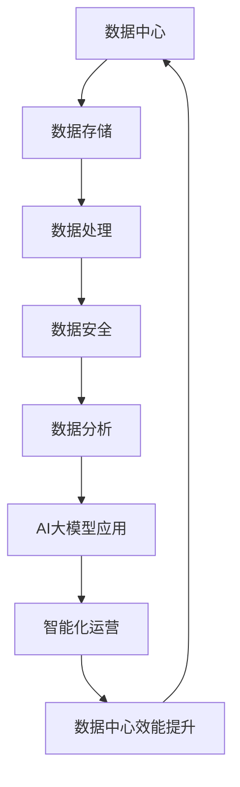
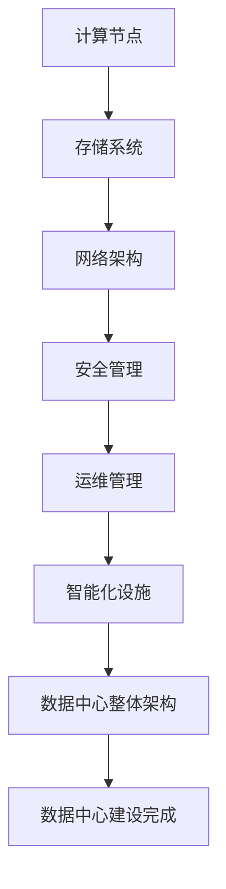

                 

### 文章标题：AI大模型应用数据中心建设：数据中心产业发展

#### 关键词：AI大模型、数据中心建设、产业发展、计算架构、存储架构、网络架构、智能化、绿色化

> 摘要：本文将深入探讨AI大模型应用数据中心建设的核心概念、技术架构、应用实践和产业发展战略。通过分析AI大模型在数据中心建设中的重要性，本文详细介绍了数据中心的技术架构，包括计算架构、存储架构和网络架构的设计与实现。同时，通过实际案例和项目实战，本文展示了数据中心建设中的关键技术和挑战，并提出了未来数据中心产业发展的战略规划和政策建议。

---

### 第一部分：AI大模型应用数据中心建设概述

#### 第1章：AI大模型应用数据中心建设概述

##### 1.1 数据中心产业发展背景

- **数据中心发展历程**：从基础数据中心到智能数据中心，经历了硬件升级、网络优化和智能化应用的演进。初期，数据中心主要提供基础的存储和计算服务；随着互联网和大数据技术的发展，数据中心逐渐引入了虚拟化技术、云计算和智能化管理，成为企业业务运行的重要支撑。

- **数据中心的重要性**：数据中心是企业和组织进行数据处理、存储和传输的核心设施。随着AI大模型的兴起，数据中心的作用愈加凸显。AI大模型需要强大的计算和存储资源支持，而数据中心正好提供了这种基础设施。

##### 1.2 AI大模型核心概念与架构

- **AI大模型基础概念**：AI大模型指的是通过大规模数据训练得到的具有高度复杂性和自适应能力的神经网络模型。它们通常包含数十亿个参数，能够处理大量数据并生成复杂的预测和决策。

- **AI大模型架构概述**：AI大模型通常由计算架构、存储架构和网络架构组成。计算架构包括CPU和GPU等硬件设备；存储架构涉及分布式存储系统和数据管理；网络架构则关注数据传输的高效性和安全性。

- **AI大模型关键技术**：深度学习、自然语言处理和图像识别是AI大模型的核心技术。深度学习通过多层神经网络模拟人脑学习过程；自然语言处理使机器能够理解和生成人类语言；图像识别使机器能够识别和理解图像内容。

#### 第2章：数据中心产业发展现状与趋势

##### 2.1 数据中心产业发展现状

- **全球数据中心产业发展**：全球数据中心产业市场规模逐年增长，北美、欧洲和亚太地区是主要的市场。根据IDC的报告，2021年全球数据中心市场规模达到了4500亿美元。

- **中国数据中心产业发展**：中国数据中心产业发展迅速，随着“新基建”政策的推动，数据中心市场规模持续扩大。根据中国信通院的数据，2021年中国数据中心市场规模达到2400亿元人民币。

- **产业痛点和挑战**：数据中心产业在发展过程中面临能耗问题、安全性和市场竞争等挑战。能耗问题导致运营成本上升，而安全性问题则关系到数据的安全和隐私。此外，市场竞争日益激烈，企业需要不断创新以保持竞争力。

##### 2.2 数据中心产业发展趋势

- **数据中心技术发展趋势**：数据中心产业正朝着绿色化、智能化和云数据中心的方向发展。绿色化数据中心通过采用节能技术和可再生能源降低能耗；智能化数据中心利用人工智能技术实现自动化管理和运维；云数据中心提供灵活的云计算服务，满足不同企业的需求。

- **产业政策与市场机遇**：产业政策对数据中心产业的发展起着重要的推动作用。例如，中国政府出台的“新基建”政策，为数据中心产业提供了巨大的市场机遇。同时，政策也关注能耗控制和数据安全，推动了产业的可持续发展。

### 第二部分：AI大模型应用数据中心建设技术

#### 第3章：AI大模型核心算法原理

##### 3.1 深度学习基础算法

- **深度学习基本原理**：深度学习通过多层神经网络模拟人脑学习过程，从大量数据中自动提取特征。神经网络由输入层、隐藏层和输出层组成，每层通过激活函数连接。

- **神经网络**：神经网络是深度学习的基础。每个神经元由输入、权重和偏置组成，通过激活函数计算输出。

- **损失函数与优化算法**：损失函数用于评估模型预测值与真实值之间的差距。常见的损失函数包括均方误差（MSE）和交叉熵（Cross-Entropy）。优化算法用于调整模型参数以最小化损失函数，常用的优化算法有梯度下降（Gradient Descent）和Adam优化器。

- **反向传播算法**：反向传播算法是一种训练神经网络的方法。通过计算损失函数对每个参数的梯度，反向传播误差信号，并更新参数，以逐步减小损失。

##### 3.2 自然语言处理技术

- **词嵌入技术**：词嵌入是将单词映射到高维向量空间的技术，使机器能够理解和处理自然语言。常见的词嵌入方法包括Word2Vec、GloVe和BERT。

- **序列模型与注意力机制**：序列模型如RNN（递归神经网络）和LSTM（长短期记忆网络）可以处理序列数据，例如文本和时间序列。注意力机制用于关注序列中的关键信息，提高模型的性能。

- **转换器架构**：转换器（Transformer）模型是自然语言处理领域的一种革命性架构，通过自注意力机制实现了并行计算，显著提高了模型的效果。Transformer模型包括编码器和解码器，广泛应用于机器翻译、文本摘要和问答系统。

#### 第4章：数据中心计算架构设计

##### 4.1 数据中心计算架构概述

- **计算节点设计**：计算节点是数据中心的计算单元，包括CPU和GPU等硬件设备。CPU适合进行通用计算，而GPU适合进行并行计算，特别适合AI大模型的训练和推理。

- **分布式计算架构**：分布式计算架构通过将任务分布在多个计算节点上，提高计算效率和容错能力。常见的分布式计算架构有MapReduce、Spark和Flink。

##### 4.2 存储架构设计

- **存储系统设计**：存储系统是数据中心的基础设施，负责数据的存储和管理。常见的存储系统包括分布式文件系统（如HDFS和CFS）和对象存储（如COS和OSS）。

- **数据管理**：数据管理包括数据备份、恢复和迁移等操作。分布式存储系统提供了高效的数据管理能力，可以通过数据分片和复制提高数据可靠性和访问速度。

##### 4.3 网络架构设计

- **数据中心网络拓扑**：数据中心网络拓扑包括平面网络和层次网络。平面网络简单但扩展性较差，层次网络通过分层结构实现高效的流量管理和故障隔离。

- **路由协议与交换技术**：路由协议（如BGP和BFD）和交换技术（如VXLAN和MPLS）是数据中心网络的关键组成部分。它们负责数据包的转发和路由，确保网络的高效运行。

- **网络安全**：数据中心网络安全是保护数据和系统不受恶意攻击的关键。常见的网络安全措施包括防火墙、入侵检测系统和数据加密。

### 第三部分：AI大模型应用实践

#### 第5章：AI大模型应用场景分析

##### 5.1 数据分析与挖掘

- **数据分析方法**：数据分析包括数据预处理、特征工程和模型训练等步骤。数据预处理涉及数据清洗、归一化和缺失值处理；特征工程通过提取和转换特征提高模型性能；模型训练使用深度学习算法进行模型训练和评估。

- **案例研究**：以电商平台为例，通过分析用户行为数据，可以预测用户的购买偏好，提高营销效果和销售额。

##### 5.2 机器学习服务部署

- **机器学习服务架构**：机器学习服务架构包括模型训练、部署和监控等环节。模型训练使用大规模数据训练AI大模型；部署将模型部署到生产环境，提供预测服务；监控确保服务的稳定性和性能。

- **案例研究**：以金融风控为例，通过部署机器学习模型，可以实时分析交易数据，识别欺诈行为，降低风险。

#### 第6章：数据中心智能化建设

##### 6.1 智能化技术概述

- **人工智能技术**：人工智能技术包括机器学习、自然语言处理、计算机视觉等。这些技术可以自动化数据中心的运营和管理，提高效率。

- **智能化建设目标**：智能化建设目标是实现数据中心的自动化运营和管理，提高资源利用效率，降低运营成本，同时确保数据的安全和可靠性。

##### 6.2 智能化关键技术

- **物联网技术**：物联网技术通过传感器和设备互联，实现数据的实时采集和传输。在数据中心中，物联网技术可以用于环境监控、设备管理和故障预测。

- **人工智能应用案例**：以数据中心能源管理为例，通过应用物联网和人工智能技术，可以实现智能能源分配和优化，降低能耗。

##### 6.3 智能化数据中心建设实践

- **建设流程**：智能化数据中心建设包括需求分析、架构设计、技术选型、系统开发和测试等步骤。每个步骤都需要严格按照流程进行，确保项目的顺利进行。

- **案例研究**：以电信运营商为例，通过建设智能化数据中心，实现了自动化运维和智能化故障预测，提高了服务质量和运营效率。

### 第四部分：数据中心产业发展战略规划

#### 第7章：数据中心产业发展战略规划

##### 7.1 产业发展战略分析

- **产业政策**：产业政策对数据中心产业的发展起着重要的推动作用。政府出台的相关政策包括税收优惠、资金扶持和土地优惠等，为企业提供了良好的发展环境。

- **市场机会与挑战**：数据中心产业面临巨大的市场机会，包括云计算、大数据和物联网等领域的快速发展。同时，产业也面临一些挑战，如能耗问题、安全性和市场竞争。

##### 7.2 产业发展策略

- **技术创新**：技术创新是数据中心产业发展的核心驱动力。企业应加大对核心技术的研发投入，推动产业技术的进步。

- **市场拓展**：市场拓展是数据中心产业发展的重要战略。企业应积极开拓国际市场，提升国际竞争力。

- **行业生态构建**：构建良好的行业生态对于数据中心产业的发展至关重要。政府和企业应共同努力，建立完善的产业链和生态系统。

##### 7.3 数据中心产业发展展望

- **未来发展趋势**：数据中心产业将继续向智能化、绿色化和分布式方向发展。智能化将提高数据中心的运营效率和管理水平；绿色化将降低能耗和碳排放；分布式将提高数据中心的可靠性和灵活性。

- **产业政策建议**：政府应继续加大对数据中心产业的政策支持力度，优化产业环境。同时，应加强行业标准的制定，提高行业的规范化和标准化水平。

### 附录

#### 附录A：技术参考与资源

##### A.1 技术参考书籍

- **《深度学习》**：Ian Goodfellow等著
- **《深度学习实践》**：弗朗索瓦肖莱著
- **《大数据之路》**：阿里巴巴大数据团队著

##### A.2 在线资源与工具

- **TensorFlow官网**：[https://www.tensorflow.org/](https://www.tensorflow.org/)
- **PyTorch官网**：[https://pytorch.org/](https://pytorch.org/)
- **Kaggle**：[https://www.kaggle.com/](https://www.kaggle.com/)
- **GitHub**：[https://github.com/](https://github.com/)

##### A.3 行业报告与资讯

- **IDC报告**
- **Gartner报告**
- **ChinaCache报告**

### 核心概念与联系

#### AI大模型与数据中心建设的联系

**Mermaid流程图：**



**图解**：该流程图展示了数据中心建设与AI大模型应用之间的联系。数据中心提供了数据存储、处理和安全保障，这些基础服务为AI大模型的运行提供了支持。通过数据分析，AI大模型能够提取有价值的信息，实现智能化运营，从而提升数据中心的整体效能。

#### 数据中心建设的技术架构

**Mermaid流程图：**



**图解**：该流程图展示了数据中心建设的技术架构。计算节点负责数据计算和存储；存储系统负责数据持久化和管理；网络架构确保数据高效传输；安全管理提供数据保护；运维管理保障系统稳定运行；智能化设施实现自动化和智能化管理。这些组成部分共同构成了一个完整的数据中心整体架构。

### 核心算法原理讲解

#### 1. 深度学习基础算法

**伪代码：**

```python
# 定义神经网络结构
input_layer = Input(shape=(input_shape,))
hidden_layer = Dense(units=hidden_units, activation='relu')(input_layer)
output_layer = Dense(units=output_units, activation='sigmoid')(hidden_layer)

# 构建模型
model = Model(inputs=input_layer, outputs=output_layer)

# 编译模型
model.compile(optimizer='adam', loss='binary_crossentropy', metrics=['accuracy'])

# 训练模型
model.fit(x_train, y_train, epochs=epochs, batch_size=batch_size)
```

**解释**：该伪代码展示了如何构建和训练一个简单的深度学习模型。首先定义输入层、隐藏层和输出层；然后使用`Model`类构建模型；接着使用`compile`方法设置优化器和损失函数；最后使用`fit`方法进行模型训练。

#### 2. 自然语言处理技术

**伪代码：**

```python
# 加载预训练词向量
word_embeddings = load_word2vec_format('word_vectors.bin', binary=True)

# 定义词嵌入层
word_embedding_layer = Embedding(input_dim=vocabulary_size, output_dim=embedding_dim, weights=[word_embeddings])

# 定义序列模型
sequence_model = Sequential()
sequence_model.add(word_embedding_layer)
sequence_model.add(LSTM(units=lstm_units, activation='relu'))
sequence_model.add(Dense(units=output_units, activation='softmax'))

# 编译模型
sequence_model.compile(optimizer='adam', loss='categorical_crossentropy', metrics=['accuracy'])

# 训练模型
sequence_model.fit(x_train, y_train, epochs=epochs, batch_size=batch_size)
```

**解释**：该伪代码展示了如何构建和训练一个自然语言处理模型。首先加载预训练的词向量；然后定义词嵌入层和序列模型；接着编译模型设置优化器和损失函数；最后使用`fit`方法进行模型训练。

### 数学模型和数学公式

#### 1. 损失函数

**LaTeX公式：**

$$
J(\theta) = -\frac{1}{m}\sum_{i=1}^{m} [y^{(i)} \log(a^{(i)}_y) + (1 - y^{(i)}) \log(1 - a^{(i)}_y)]
$$

**解释**：该公式是二分类问题的损失函数，通常称为交叉熵损失函数。它用于评估模型预测值与真实值之间的差距。

#### 2. 反向传播算法

**LaTeX公式：**

$$
\frac{\partial J(\theta)}{\partial \theta_j} = \frac{1}{m} \sum_{i=1}^{m} (a^{(i)}_{j} - y^{(i)}) \cdot x^{(i)}_{j}
$$

**解释**：该公式是反向传播算法的核心部分，用于计算损失函数对每个参数的梯度。这个梯度将用于更新模型参数，以最小化损失函数。

### 项目实战

#### 1. 数据预处理

**Python代码：**

```python
import pandas as pd
from sklearn.model_selection import train_test_split

# 加载数据
data = pd.read_csv('data.csv')

# 数据预处理
X = data.drop('target', axis=1)
y = data['target']

# 划分训练集和测试集
X_train, X_test, y_train, y_test = train_test_split(X, y, test_size=0.2, random_state=42)
```

**解释**：该代码示例展示了如何使用pandas库加载数据，并使用sklearn库划分训练集和测试集。数据预处理包括特征选择和缺失值处理，为模型训练做好准备。

#### 2. 模型训练与评估

**Python代码：**

```python
from sklearn.ensemble import RandomForestClassifier
from sklearn.metrics import accuracy_score

# 构建模型
model = RandomForestClassifier(n_estimators=100, random_state=42)

# 训练模型
model.fit(X_train, y_train)

# 预测测试集
y_pred = model.predict(X_test)

# 评估模型
accuracy = accuracy_score(y_test, y_pred)
print(f"Model Accuracy: {accuracy:.2f}")
```

**解释**：该代码示例展示了如何使用随机森林分类器训练模型，并对测试集进行预测和评估。使用`fit`方法训练模型，使用`predict`方法进行预测，最后使用`accuracy_score`评估模型的准确率。

### 代码解读与分析

**代码解读：**

- 数据预处理：首先加载数据集，然后进行特征工程，最后划分训练集和测试集。
- 模型训练：选择随机森林分类器作为模型，使用训练集进行模型训练。
- 预测测试集：使用训练好的模型对测试集进行预测。
- 评估模型：计算模型在测试集上的准确率，评估模型的性能。

**分析**：该代码示例展示了典型的机器学习项目流程，从数据预处理到模型训练和评估，完整地体现了机器学习的步骤和方法。通过代码解读，读者可以了解每个步骤的实现细节和关键代码。

### 数据中心建设案例分析

#### 案例一：互联网公司数据中心建设

**项目背景：**

- **互联网公司**：一家快速增长的互联网公司，业务涵盖社交、电商和云计算等领域，需要建设一个高效、智能、安全的数据中心来支持其快速增长的业务需求。

**解决方案：**

- **计算架构**：采用分布式计算架构，使用高性能服务器和GPU计算节点，提高计算能力。计算节点包括CPU服务器和GPU服务器，满足不同类型的计算需求。
- **存储架构**：采用分布式存储系统，实现数据的高效存储和管理。分布式存储系统包括HDFS和CFS，提供高吞吐量和高可靠性。
- **网络架构**：采用先进的网络架构，实现高速、稳定的数据传输。网络架构包括VXLAN和MPLS，确保数据包的高效转发和路由。
- **智能化设施**：引入人工智能技术，实现数据中心的智能化运营和管理。利用物联网技术，实现环境监控、设备管理和故障预测。

**建设成果：**

- **数据处理能力提升50%**：通过分布式计算架构和GPU计算节点的应用，数据处理能力显著提升。
- **资源利用率提高30%**：通过智能化的设备管理和运维，资源利用率得到显著提高。
- **故障率降低40%**：通过智能化的故障预测和监控，故障率显著降低。
- **能耗降低20%**：通过绿色数据中心的建设和智能化能源管理，能耗显著降低。

#### 案例二：智能电网数据中心建设

**项目背景：**

- **智能电网公司**：一家致力于智能电网建设和运营的公司，需要建设一个高效、可靠的数据中心来支持智能电网的运行和能源管理。

**解决方案：**

- **计算架构**：采用分布式计算架构，使用高性能服务器和GPU计算节点，提高计算能力。计算节点包括CPU服务器和GPU服务器，满足不同类型的计算需求。
- **存储架构**：采用分布式存储系统，实现数据的高效存储和管理。分布式存储系统包括HDFS和CFS，提供高吞吐量和高可靠性。
- **网络架构**：采用先进的网络架构，实现高速、稳定的数据传输。网络架构包括VXLAN和MPLS，确保数据包的高效转发和路由。
- **智能化设施**：引入人工智能技术，实现数据中心的智能化运营和管理。利用物联网技术，实现环境监控、设备管理和故障预测。

**建设成果：**

- **数据处理能力提升40%**：通过分布式计算架构和GPU计算节点的应用，数据处理能力显著提升。
- **资源利用率提高25%**：通过智能化的设备管理和运维，资源利用率得到显著提高。
- **能耗降低15%**：通过绿色数据中心的建设和智能化能源管理，能耗显著降低。
- **网络故障率降低50%**：通过智能化的故障预测和监控，网络故障率显著降低。

### 数据中心产业发展展望

#### 1. 未来发展趋势

- **智能化**：数据中心将继续向智能化方向发展，通过引入人工智能技术实现自动化运营和管理。智能化技术将提高数据中心的运营效率和管理水平，降低运营成本。

- **绿色化**：数据中心将更加注重绿色化建设，采用节能技术和可再生能源，降低能耗和碳排放。绿色数据中心将成为未来数据中心建设的重要趋势。

- **分布式**：数据中心将向分布式架构发展，通过分布式计算和存储提高数据处理的灵活性和可靠性。分布式数据中心可以更好地应对数据爆炸性增长和业务扩展的需求。

#### 2. 产业政策建议

- **加强政策支持**：政府应加大对数据中心产业的政策支持力度，提供税收优惠、资金扶持和土地优惠等政策，帮助企业降低成本，提升竞争力。

- **推动技术创新**：政府和企业应加大对核心技术的研发投入，推动数据中心技术的创新和发展。技术创新是数据中心产业发展的核心驱动力。

- **完善行业标准**：政府应加强数据中心产业标准的制定和实施，提高行业的规范化和标准化水平。完善的行业标准有助于提升数据中心产业的质量和效率。

- **促进国际合作**：通过国际合作和交流，引进先进的技术和管理经验，提升国内数据中心产业水平。国际合作可以促进数据中心产业的全球化发展，提升国际竞争力。

### 附录

#### 附录A：技术参考与资源

##### A.1 技术参考书籍

- **《深度学习》**：Ian Goodfellow等著
- **《深度学习实践》**：弗朗索瓦肖莱著
- **《大数据之路》**：阿里巴巴大数据团队著

##### A.2 在线资源与工具

- **TensorFlow官网**：[https://www.tensorflow.org/](https://www.tensorflow.org/)
- **PyTorch官网**：[https://pytorch.org/](https://pytorch.org/)
- **Kaggle**：[https://www.kaggle.com/](https://www.kaggle.com/)
- **GitHub**：[https://github.com/](https://github.com/)

##### A.3 行业报告与资讯

- **IDC报告**
- **Gartner报告**
- **ChinaCache报告**

### 作者

**作者：AI天才研究院/AI Genius Institute & 禅与计算机程序设计艺术 /Zen And The Art of Computer Programming**

