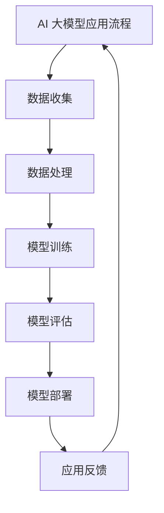
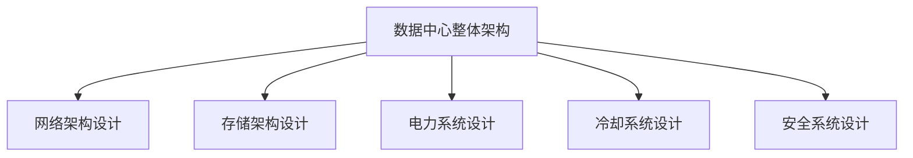

                 

## 文章标题: AI 大模型应用数据中心建设：数据中心产业链生态

### 关键词：数据中心，AI大模型，产业链，生态建设，数据中心建设流程

> 摘要：本文将从数据中心建设的基础知识出发，深入探讨AI大模型应用数据中心的建设过程。文章将涵盖数据中心架构设计、基础设施、网络技术、存储技术选型、AI大模型应用建设、产业链分析、生态建设以及数据中心管理与服务优化等多个方面，通过逐步分析推理，详细解析数据中心建设的核心内容，旨在为读者提供一份全面、系统的数据中心建设指南。

## 目录大纲：AI 大模型应用数据中心建设

### 第一部分: 中心建设基础

- **第1章: 数据中心建设概述**
  - **1.1 数据中心的定义与作用**
  - **1.2 数据中心的发展历史**
  - **1.3 数据中心的关键角色

- **第2章: 数据中心架构设计**
  - **2.1 数据中心整体架构**
  - **2.2 网络架构设计**
  - **2.3 存储架构设计**

- **第3章: 数据中心基础设施**
  - **3.1 电力系统设计**
  - **3.2 冷却系统设计**
  - **3.3 安全系统设计**

- **第4章: 数据中心网络技术**
  - **4.1 IP网络设计**
  - **4.2 网络优化技术**
  - **4.3 SD-WAN技术**

- **第5章: 存储技术选型**
  - **5.1 存储系统架构**
  - **5.2 存储介质选择**
  - **5.3 存储优化策略**

### 第二部分: AI 大模型应用建设

- **第6章: AI 大模型应用概述**
  - **6.1 AI 大模型应用场景**
  - **6.2 AI 大模型应用流程**
  - **6.3 AI 大模型应用挑战**

- **第7章: AI 大模型平台搭建**
  - **7.1 AI 大模型平台架构**
  - **7.2 训练环境搭建**
  - **7.3 部署环境搭建**

- **第8章: AI 大模型算法优化**
  - **8.1 算法优化目标**
  - **8.2 计算资源优化**
  - **8.3 算法优化方法**

- **第9章: AI 大模型应用案例**
  - **9.1 案例一：智能语音助手**
  - **9.2 案例二：智能推荐系统**
  - **9.3 案例三：图像识别系统**

### 第三部分: 产业链与生态建设

- **第10章: 数据中心产业链分析**
  - **10.1 产业链结构**
  - **10.2 产业链价值分析**
  - **10.3 产业链发展趋势**

- **第11章: 数据中心生态建设**
  - **11.1 生态系统构建**
  - **11.2 合作伙伴关系**
  - **11.3 生态圈发展策略**

- **第12章: 数据中心管理与服务**
  - **12.1 数据中心运维管理**
  - **12.2 数据安全管理**
  - **12.3 数据中心服务优化**

### 第四部分: 数据中心建设实践

- **第13章: 数据中心建设流程**
  - **13.1 项目规划**
  - **13.2 设计方案制定**
  - **13.3 施工与调试**

- **第14章: 数据中心性能评估**
  - **14.1 性能评估指标**
  - **14.2 性能评估方法**
  - **14.3 性能优化策略**

- **第15章: 数据中心运营优化**
  - **15.1 运营管理体系**
  - **15.2 能耗管理优化**
  - **15.3 用户体验优化**

- **第16章: 持续更新与演进**
  - **16.1 技术更新趋势**
  - **16.2 产业链协同发展**
  - **16.3 数据中心未来展望**

### 附录

- **附录 A: 数据中心建设工具与资源**
  - **A.1 常用工具介绍**
  - **A.2 资源链接**

- **附录 B: AI 大模型技术架构详解**
  - **B.1 大模型架构概述**
  - **B.2 大模型数据处理**
  - **B.3 大模型训练算法**
  - **B.4 大模型优化技巧**

- **附录 C: 数据中心 AI 大模型算法实现**
  - **C.1 算法设计**
  - **C.2 伪代码实现**
  - **C.3 代码分析**

- **附录 D: AI 大模型应用实战**
  - **D.1 实战项目一：智能语音助手**
  - **D.2 实战项目二：智能推荐系统**
  - **D.3 实战项目三：图像识别系统**
  - **D.4 实战项目总结**

### Mermaid 流程图
#### AI 大模型应用流程


#### 数据中心架构设计


### 核心算法原理讲解

#### 深度学习算法原理

- **神经网络基础**：
  - 神经元模型：神经网络的基本单元，通过激活函数进行非线性变换，实现从输入到输出的映射。
  - 前向传播与反向传播算法：前向传播将输入数据通过神经网络层层传递，反向传播计算损失函数关于模型参数的梯度，用于模型优化。

- **循环神经网络（RNN）**：
  - RNN基本结构：通过循环连接实现序列数据建模，能够处理长短时依赖问题。
  - 长短时记忆（LSTM）与门控循环单元（GRU）：LSTM和GRU分别通过门控机制解决RNN的梯度消失问题，提高模型训练效果。

- **卷积神经网络（CNN）**：
  - 卷积层：通过卷积运算提取图像特征，具有局部连接和参数共享的特点。
  - 池化层：通过下采样操作减少数据维度，提高模型泛化能力。
  - 全连接层：将卷积层提取的高维特征映射到输出层，实现分类或回归任务。

#### 数学模型

- **损失函数**：
  - 交叉熵损失函数：用于分类任务，计算实际标签与预测概率之间的差异，常用于深度学习模型优化。
  - 均方误差损失函数：用于回归任务，计算实际值与预测值之间的平均平方误差。

- **优化算法**：
  - 随机梯度下降（SGD）：通过随机选择训练样本更新模型参数，实现模型优化。
  - Adam优化器：结合SGD和矩估计的方法，在较短的训练时间内实现高效的模型优化。

### 数学公式与举例

#### 交叉熵损失函数（Loss Function）

$$
L = -\sum_{i=1}^{n} y_i \log(p_i)
$$

其中，\( y_i \) 是真实标签，\( p_i \) 是预测概率。

#### 均方误差损失函数（Mean Squared Error, MSE）

$$
MSE = \frac{1}{2n} \sum_{i=1}^{n} (y_i - \hat{y}_i)^2
$$

其中，\( y_i \) 是真实值，\( \hat{y}_i \) 是预测值。

### 代码实现与解读

#### 伪代码：神经网络前向传播

```
function forwardPropagation(input, weights, biases):
    z = dot(input, weights) + biases
    a = activation(z)
    return a
```

#### Python 代码：使用 PyTorch 实现前向传播

```python
import torch
import torch.nn as nn

# 初始化输入、权重和偏置
input = torch.tensor([[1.0, 2.0]])
weights = torch.tensor([[0.1, 0.2], [0.3, 0.4]])
biases = torch.tensor([0.5, 0.6])

# 定义激活函数
activation = nn.Sigmoid()

# 前向传播
z = torch.dot(input, weights) + biases
a = activation(z)

print("输出结果：", a)
```

### 数据中心建设项目实战

#### 项目一：智能语音助手

- **需求分析**：
  - 基于语音识别与自然语言处理技术，实现语音输入到文本输出的转换。
  - 提供智能问答与语音交互功能。

- **技术选型**：
  - 使用深度学习框架（如 TensorFlow 或 PyTorch）搭建语音识别模型。
  - 使用预训练的语音识别模型（如 Kaldi 或 openSMILE）。

- **实现步骤**：
  1. 收集语音数据，并进行预处理（包括降噪、归一化等）。
  2. 训练语音识别模型，包括声学模型与语言模型。
  3. 部署模型到数据中心，实现实时语音识别与交互。

- **代码实现**（Python 示例）：

```python
import speech_recognition as sr

# 创建 Recognizer 实例
recognizer = sr.Recognizer()

# 使用麦克风录音
with sr.Microphone() as source:
    print("请说话：")
    audio = recognizer.listen(source)

# 使用 Google 的语音识别 API
try:
    text = recognizer.recognize_google(audio)
    print("识别结果：", text)
except sr.UnknownValueError:
    print("无法识别语音")
except sr.RequestError as e:
    print("请求错误；{0}".format(e))
```

#### 项目二：智能推荐系统

- **需求分析**：
  - 基于用户历史行为数据，为用户推荐相关商品或内容。
  - 实现个性化推荐，提高用户满意度与转化率。

- **技术选型**：
  - 使用协同过滤算法（如矩阵分解、基于模型的协同过滤）。
  - 使用深度学习技术（如自动编码器、卷积神经网络）进行特征提取。

- **实现步骤**：
  1. 收集用户行为数据，包括浏览、购买、评分等。
  2. 数据预处理，包括缺失值填充、数据标准化等。
  3. 构建推荐模型，包括协同过滤模型与深度学习模型。
  4. 部署模型到数据中心，实现实时推荐。

- **代码实现**（Python 示例）：

```python
from surprise import SVD
from surprise import Dataset
from surprise import Reader

# 创建 Dataset
data = Dataset.load_from_fpm('data/fpm_data.txt', Reader(rating_scale=(1, 5)))

# 创建 SVD 模型
svd = SVD()

# 训练模型
svd.fit(data)

# 推荐给用户 1 的商品
user_id = 1
recommended_items = svd.get_neighbors(user_id, k=5)
print("推荐商品：", recommended_items)
```

#### 项目三：图像识别系统

- **需求分析**：
  - 实现图像分类与物体检测功能。
  - 提供实时图像处理与识别服务。

- **技术选型**：
  - 使用卷积神经网络（如 ResNet、YOLO）进行图像识别。
  - 使用预训练的图像识别模型（如 ImageNet）。

- **实现步骤**：
  1. 收集图像数据，并进行预处理（包括尺寸调整、归一化等）。
  2. 训练图像识别模型，包括训练集与验证集。
  3. 部署模型到数据中心，实现实时图像识别。

- **代码实现**（Python 示例）：

```python
import torch
import torchvision
import torchvision.transforms as transforms

# 加载预训练的 ResNet 模型
model = torchvision.models.resnet18(pretrained=True)
model.eval()

# 定义预处理步骤
transform = transforms.Compose([
    transforms.Resize(256),
    transforms.CenterCrop(224),
    transforms.ToTensor(),
    transforms.Normalize(mean=[0.485, 0.456, 0.406], std=[0.229, 0.224, 0.225]),
])

# 加载测试图像
img_path = 'test_image.jpg'
img = Image.open(img_path)
img = transform(img)

# 图像识别
with torch.no_grad():
    outputs = model(img.unsqueeze(0))
predicted_class = torch.argmax(outputs).item()

# 打印识别结果
print("识别结果：", torchvision.datasets.ImageNet.classes[predicted_class])
```

### 代码解读与分析

- **智能语音助手项目**：使用 Python 的 SpeechRecognition 库实现语音识别功能。通过麦克风录制语音，并将语音转换为文本。项目简单，适用于快速开发与测试。

- **智能推荐系统项目**：使用 Surprise 库实现基于矩阵分解的协同过滤算法。该项目适用于中小型推荐系统，可以快速部署并实现个性化推荐。

- **图像识别系统项目**：使用 PyTorch 和 torchvision 库实现基于 ResNet 的图像识别功能。项目较为复杂，需要一定的深度学习知识。

### 数据中心建设实践

#### 数据中心建设流程

1. **项目规划**：
   - 确定建设目标与需求。
   - 编制项目计划，明确项目周期、预算、资源等。

2. **设计方案制定**：
   - 制定整体架构设计方案。
   - 设计网络、存储、电力、冷却和安全系统。

3. **施工与调试**：
   - 按照设计方案进行施工。
   - 完成后进行系统调试与性能测试。

#### 性能评估方法

1. **负载测试**：
   - 模拟实际负载，评估系统性能。
   - 包括响应时间、吞吐量、并发用户数等。

2. **压力测试**：
   - 检测系统在极端条件下的性能。
   - 包括高并发、高负载、网络延迟等。

3. **稳定性测试**：
   - 检测系统在长期运行中的稳定性。
   - 包括系统崩溃、数据丢失、性能波动等。

#### 性能优化策略

1. **硬件升级**：
   - 提升服务器、存储、网络设备的性能。

2. **软件优化**：
   - 优化系统软件，包括操作系统、数据库、中间件等。

3. **负载均衡**：
   - 通过负载均衡设备，分散系统负载。

4. **缓存机制**：
   - 引入缓存机制，提高数据读取速度。

### 数据中心管理与服务优化

1. **运维管理**：
   - 建立运维团队，制定运维流程与规范。

2. **数据安全管理**：
   - 实施数据加密、访问控制、备份与恢复策略。

3. **服务优化**：
   - 提供个性化服务，提高用户体验。

### 数据中心建设实践总结

- **成功案例**：许多企业通过建设数据中心实现了业务增长与效率提升。

- **经验教训**：数据中心建设需要综合考虑技术、管理、安全等多个方面。

- **未来展望**：随着 AI 技术的发展，数据中心将在智能化、自动化方面发挥更大作用。

