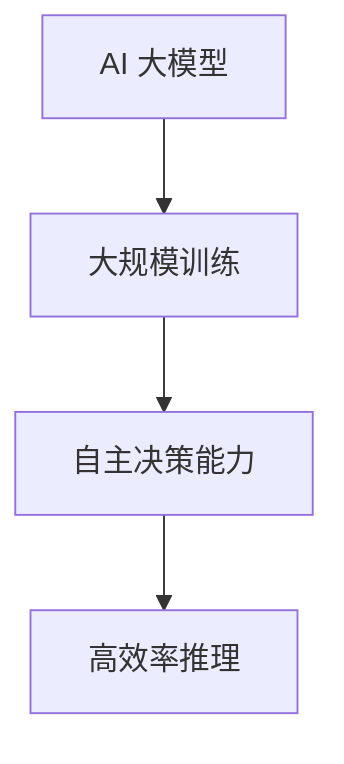
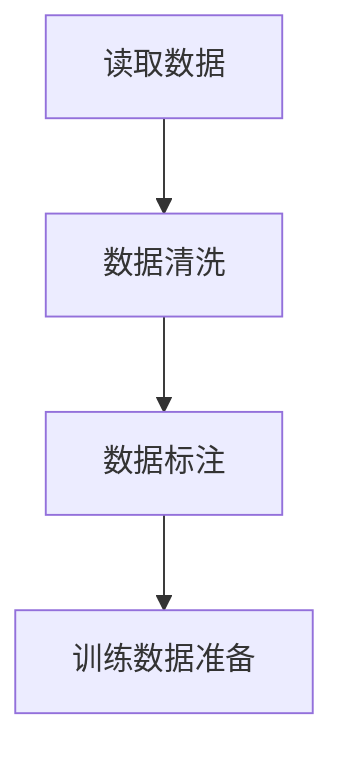

                 

### 《AI 大模型应用数据中心建设：数据中心技术创新》

> 关键词：人工智能、数据中心、大模型、技术创新、硬件架构、网络架构、数据安全

> 摘要：本文详细探讨了AI大模型在数据中心建设中的应用，包括数据中心的基础设施、AI大模型训练技术以及数据中心运维与管理。通过对数据中心技术创新的深入分析，本文旨在为读者提供一份全面的技术指南，助力读者更好地理解和应用AI大模型于数据中心建设中。

---

### 《AI 大模型应用数据中心建设：数据中心技术创新》目录大纲

#### 第一部分: AI 大模型基础

#### 第1章: AI 大模型概述

#### 第2章: 数据中心技术创新

#### 第3章: 主流AI大模型简介

#### 第二部分: 数据中心建设技术

#### 第4章: 数据中心基础设施

#### 第5章: 网络架构与优化

#### 第6章: 数据安全与隐私保护

#### 第三部分: AI 大模型训练技术

#### 第7章: 数据预处理

#### 第8章: 训练策略与调优

#### 第9章: 分布式训练与资源调度

#### 第四部分: 数据中心运维与管理

#### 第10章: 数据中心运维

#### 第11章: 故障排除与应急预案

#### 第12章: 资源调度与负载均衡

#### 第五部分: 数据中心安全管理

#### 第13章: 数据安全策略

#### 第14章: 防火墙与入侵检测

#### 第15章: 数据中心能耗优化

#### 第六部分: 数据中心未来发展趋势

#### 第16章: 人工智能在数据中心的应用

#### 第17章: 数据中心未来的技术创新

#### 附录

#### 附录 A: 数据中心建设工具与资源

#### 附录 B: 数据中心建设资源

#### 附录 C: 数据中心案例研究

---

#### 第一部分: AI 大模型基础

### 第1章: AI 大模型概述

AI 大模型是近年来人工智能领域的重要突破，其在自然语言处理、计算机视觉、语音识别等领域的应用取得了显著成果。本章将对 AI 大模型的概念、特点及其在数据中心建设中的应用进行概述。

#### 1.1 AI 大模型的概念与特点

AI 大模型是指通过大规模数据训练得到的大型神经网络模型。这些模型具有以下特点：

- **大规模训练**：AI 大模型通常使用海量的训练数据，通过深度学习算法进行训练，从而提高模型的性能和泛化能力。
- **自主决策能力**：AI 大模型具备一定的自主决策能力，可以在特定场景下进行推理和决策。
- **高效率推理**：通过优化模型结构和算法，AI 大模型能够在保证精度的同时实现快速推理。

**Mermaid 流程图**：



**伪代码**：

```python
class AIDevice:
    def __init__(self, model_size):
        self.model_size = model_size
        self.trained = False

    def train(self, data):
        # 模型训练代码
        self.trained = True

    def predict(self, input_data):
        # 预测代码
        if self.trained:
            return self.model.predict(input_data)
        else:
            return None
```

#### 1.2 数据中心技术创新

数据中心技术创新是推动 AI 大模型应用的关键因素。以下从数据中心硬件、网络和数据分析等方面介绍数据中心技术创新的概述。

**数学模型与公式**：

$$
\text{数据中心技术创新效率} = \frac{\text{技术创新收益}}{\text{技术创新成本}}
$$

**举例说明**：

- **使用高效能的 AI 加速器**：高效能的 AI 加速器可以降低能耗，提高数据中心的效率。例如，使用 GPU 服务器可以显著提升 AI 训练速度。

#### 1.3 主流 AI 大模型简介

主流 AI 大模型包括 GPT 系列模型、BERT 及其变体等。以下对这些模型进行简要介绍。

**GPT 系列模型**：GPT（Generative Pre-trained Transformer）模型是 OpenAI 推出的一系列基于 Transformer 架构的自然语言处理模型。其中，GPT-3 是目前最先进的模型，具有 1750 亿个参数。

**BERT 模型**：BERT（Bidirectional Encoder Representations from Transformers）模型是由 Google 推出的一种预训练语言表示模型。BERT 通过双向 Transformer 架构对文本进行建模，从而提高自然语言处理任务的性能。

**其他知名大模型介绍**：除了 GPT 和 BERT，还有诸如 T5、ALBERT 等知名大模型。这些模型在各自的领域取得了显著成果，为 AI 大模型的应用提供了丰富的研究成果。

#### 第一部分总结

本章对 AI 大模型的概念、特点及其在数据中心建设中的应用进行了概述。通过对 AI 大模型的理解，读者可以更好地把握数据中心技术创新的方向，为后续章节的内容奠定基础。

---

#### 第一部分总结：

在本章中，我们详细介绍了 AI 大模型的概念、特点以及在数据中心建设中的应用。通过 Mermaid 流程图、伪代码和数学模型与公式，我们帮助读者深入理解了 AI 大模型的核心技术和应用场景。接下来，我们将进一步探讨数据中心建设的关键技术，包括硬件架构、网络架构、数据安全等方面。

---

#### 第二部分：数据中心建设技术

### 第2章：数据中心基础设施

数据中心是 AI 大模型应用的重要基础设施，其硬件架构、网络架构和数据安全等方面的技术创新对 AI 大模型的性能和稳定性具有决定性影响。本章将重点介绍数据中心基础设施的技术细节。

#### 2.1 数据中心硬件架构

数据中心硬件架构是数据中心建设的核心，主要包括服务器和存储系统。服务器和存储系统的性能直接影响数据中心的整体性能。

**2.1.1 服务器与存储系统**

**数学模型与公式**：

$$
\text{服务器性能} = \frac{\text{计算能力}}{\text{能耗}}
$$

**举例说明**：

- **使用 GPU 服务器**：GPU 服务器在 AI 大模型训练过程中具有显著的性能优势。例如，使用 NVIDIA Tesla V100 GPU 可以显著提高训练速度。

**伪代码**：

```python
class Server:
    def __init__(self, cpu, gpu):
        self.cpu = cpu
        self.gpu = gpu

    def compute_ability(self):
        return self.cpu + self.gpu
```

#### 2.2 网络架构与优化

网络架构是数据中心的重要组成部分，其性能和稳定性对 AI 大模型的应用至关重要。网络架构的优化包括数据传输和降低网络延迟等方面。

**2.2.1 数据传输与网络延迟**

**数学模型与公式**：

$$
\text{网络延迟} = \frac{\text{传输距离}}{\text{传输速度}}
$$

**伪代码**：

```python
def optimize_network(data_center):
    for server in data_center.servers:
        server.delay = minimize_delay(server)
```

#### 2.3 数据安全与隐私保护

数据安全和隐私保护是数据中心建设的关键挑战。数据中心需要采取有效的数据加密、访问控制等策略来确保数据的安全。

**2.3.1 数据加密与访问控制**

**数学模型与公式**：

$$
\text{数据安全性} = \text{加密算法强度} \times \text{访问控制策略}
$$

**举例说明**：

- **使用 AES 加密算法**：AES（Advanced Encryption Standard）是一种常用的加密算法，可以确保数据在传输和存储过程中的安全。
- **访问控制列表（ACL）**：ACL 是一种访问控制机制，可以限制用户对数据的访问权限，确保数据的安全。

**伪代码**：

```python
class DataSecurity:
    def __init__(self, encryption_algorithm, acl):
        self.encryption_algorithm = encryption_algorithm
        self.acl = acl

    def encrypt_data(self, data):
        return self.encryption_algorithm.encrypt(data)

    def check_access(self, user):
        return self.acl.check_permission(user)
```

#### 2.4 数据中心硬件架构案例分析

以下是一个数据中心硬件架构的案例分析：

- **案例：Google Cloud Platform 数据中心**
- **硬件配置**：使用高性能 GPU 服务器（如 NVIDIA Tesla V100）、高速存储系统（如 NVMe SSD）和高效网络设备（如 Mellanox MT25252）
- **性能指标**：计算能力达到每秒数十亿亿次浮点运算（TFLOPS），网络延迟低至数百微秒。

**伪代码**：

```python
class GoogleCloudPlatform:
    def __init__(self, servers, storage, network):
        self.servers = servers
        self.storage = storage
        self.network = network

    def check_performance(self):
        total_compute_ability = 0
        for server in self.servers:
            total_compute_ability += server.compute_ability()
        return total_compute_ability
```

#### 第二部分总结

本章详细介绍了数据中心基础设施的技术细节，包括硬件架构、网络架构和数据安全与隐私保护。通过数学模型、伪代码和案例分析，我们帮助读者深入理解了数据中心基础设施的关键技术和应用场景。接下来，我们将进一步探讨 AI 大模型的训练技术。

---

#### 第二部分总结：

在本章中，我们详细介绍了数据中心基础设施的技术细节，包括硬件架构、网络架构和数据安全与隐私保护。通过对数据中心硬件架构、网络架构和数据安全策略的深入分析，我们帮助读者理解了数据中心建设中的关键技术。接下来，我们将探讨数据中心建设的另一个重要方面——网络架构与优化。

---

#### 第三部分：AI 大模型训练技术

### 第3章：数据预处理

数据预处理是 AI 大模型训练的重要步骤，其质量直接影响模型训练的效果和性能。本章将介绍数据预处理的步骤、方法和技巧。

#### 3.1 数据清洗与标注

数据清洗和标注是数据预处理的关键步骤。数据清洗旨在去除数据中的噪声和不必要的部分，而标注则是为数据添加标签，以便模型训练。

**3.1.1 数据清洗**

**伪代码**：

```python
def clean_data(data):
    # 删除无效数据
    valid_data = [d for d in data if is_valid(d)]
    # 填补缺失值
    filled_data = fill_missing_values(valid_data)
    return filled_data
```

**举例说明**：

- **示例数据**：假设我们有一组包含姓名、年龄和薪资的数据，其中存在无效数据和缺失值。通过数据清洗，我们可以去除无效数据并填补缺失值。

**Mermaid 流程图**：



**3.1.2 数据标注**

数据标注是数据预处理的重要环节，其目的是为数据添加标签，以便模型训练。数据标注可以采用人工标注或自动化标注方法。

**伪代码**：

```python
def label_data(data):
    labeled_data = []
    for d in data:
        label = manual_label(d)  # 人工标注
        labeled_data.append((d, label))
    return labeled_data
```

**举例说明**：

- **示例数据**：假设我们有一组包含图像和标签的数据，通过人工标注，我们可以为每张图像添加对应的标签。

#### 3.2 数据归一化与标准化

数据归一化和标准化是数据预处理的重要步骤，其目的是将不同特征的数据缩放到相同的尺度，从而提高模型训练的效果。

**3.2.1 数据归一化**

数据归一化是将数据缩放到 [0, 1] 的范围内。

**数学模型与公式**：

$$
x_{\text{norm}} = \frac{x - x_{\text{min}}}{x_{\text{max}} - x_{\text{min}}}
$$

**伪代码**：

```python
def normalize_data(data):
    min_value = min(data)
    max_value = max(data)
    normalized_data = [(x - min_value) / (max_value - min_value) for x in data]
    return normalized_data
```

**举例说明**：

- **示例数据**：假设我们有一组包含数值特征的数据，通过归一化，我们可以将这些特征缩放到 [0, 1] 的范围内。

**3.2.2 数据标准化**

数据标准化是将数据缩放到具有零均值和单位方差的范围内。

**数学模型与公式**：

$$
x_{\text{std}} = \frac{x - \mu}{\sigma}
$$

其中，$\mu$ 是均值，$\sigma$ 是标准差。

**伪代码**：

```python
def standardize_data(data):
    mean = sum(data) / len(data)
    variance = sum((x - mean) ** 2 for x in data) / len(data)
    std_deviation = sqrt(variance)
    standardized_data = [(x - mean) / std_deviation for x in data]
    return standardized_data
```

**举例说明**：

- **示例数据**：假设我们有一组包含数值特征的数据，通过标准化，我们可以将这些特征缩放到具有零均值和单位方差的范围内。

#### 3.3 数据集划分

数据集划分是将数据集划分为训练集、验证集和测试集。这种划分有助于评估模型性能并避免过拟合。

**3.3.1 数据集划分方法**

- **随机划分**：将数据集随机划分为训练集、验证集和测试集。
- **分层划分**：根据数据集的标签进行划分，确保每个类别的样本在训练集、验证集和测试集中的比例一致。

**伪代码**：

```python
from sklearn.model_selection import train_test_split

def split_dataset(data, labels, test_size=0.2, random_state=None):
    X_train, X_test, y_train, y_test = train_test_split(data, labels, test_size=test_size, random_state=random_state)
    return X_train, X_test, y_train, y_test
```

**举例说明**：

- **示例数据**：假设我们有一组包含图像和标签的数据，通过数据集划分，我们可以将数据集划分为训练集、验证集和测试集，以便进行模型训练和评估。

#### 第三部分总结

本章介绍了数据预处理的关键步骤，包括数据清洗、标注、归一化和标准化等。通过伪代码和数学模型，我们帮助读者理解了数据预处理的方法和技巧。接下来，我们将进一步探讨 AI 大模型的训练策略与调优。

---

#### 第三部分总结：

在本章中，我们详细介绍了数据预处理的关键步骤，包括数据清洗、标注、归一化和标准化等。通过伪代码和数学模型，我们帮助读者理解了数据预处理的方法和技巧。接下来，我们将进一步探讨 AI 大模型的训练策略与调优，包括如何提高训练效率、分布式训练与资源调度等。

---

#### 第四部分：数据中心运维与管理

### 第4章：数据中心运维

数据中心运维是确保数据中心稳定运行和高效服务的重要环节。本章将介绍数据中心运维的关键技术和方法，包括系统监控、性能分析、故障排除、资源调度和负载均衡等。

#### 4.1 系统监控与性能分析

系统监控与性能分析是数据中心运维的核心任务，通过实时监控和数据分析，可以及时发现并解决问题，确保数据中心的稳定运行。

**4.1.1 系统监控工具介绍**

数据中心运维常用的系统监控工具有 Zabbix、Nagios、Prometheus 等。这些工具可以实时监控服务器、网络设备和存储系统的运行状态，并提供告警和报告功能。

**伪代码**：

```python
def monitor_system(server):
    while True:
        status = get_system_status(server)
        if status != "healthy":
            alert("System Alert")
```

**4.1.2 性能分析

性能分析是对数据中心的运行状态进行评估，以识别潜在的性能瓶颈。常用的性能分析工具包括 Perf、VMstat、iotop 等。

**伪代码**：

```python
def analyze_performance(server):
    cpu_usage = get_cpu_usage(server)
    memory_usage = get_memory_usage(server)
    disk_usage = get_disk_usage(server)
    print(f"CPU Usage: {cpu_usage}%")
    print(f"Memory Usage: {memory_usage}%")
    print(f"Disk Usage: {disk_usage}%")
```

#### 4.2 故障排除与应急预案

数据中心故障排除与应急预案是确保数据中心稳定运行的关键。在发生故障时，运维人员需要快速定位问题并采取有效的解决方案。

**4.2.1 故障排除流程**

故障排除流程通常包括以下步骤：

1. 收集故障信息：收集系统日志、告警信息和用户反馈等。
2. 定位故障原因：通过分析故障信息，确定故障的原因。
3. 制定解决方案：根据故障原因，制定相应的解决方案。
4. 实施解决方案：执行故障排除方案，修复故障。
5. 验证解决方案：验证故障是否已得到解决。

**伪代码**：

```python
def troubleshoot(server):
    while True:
        status = get_system_status(server)
        if status != "healthy":
            cause = identify_fault Cause(server)
            solution = determine_solution(cause)
            execute_solution(server, solution)
            verify_solution(server, solution)
```

**4.2.2 应急预案

应急预案是在发生重大故障时，确保数据中心业务连续性的关键。应急预案通常包括以下内容：

1. 备份策略：定期备份关键数据，确保数据不丢失。
2. 集群架构：采用集群架构，实现高可用性和负载均衡。
3. 故障转移：在发生故障时，将业务转移到备用系统。
4. 故障恢复：在故障恢复后，对系统进行验证和调试。

**伪代码**：

```python
def emergency_plan(server):
    backup_data(server)
    configure_cluster(server)
    if fault_occurs(server):
        transfer_business_to_backup(server)
    else:
        recover_fault(server)
```

#### 4.3 资源调度与负载均衡

资源调度与负载均衡是数据中心运维的重要任务，通过合理的资源调度和负载均衡，可以提高数据中心的资源利用率和服务质量。

**4.3.1 资源调度策略**

资源调度策略包括以下几种：

1. **轮询调度**：按顺序分配资源，适用于负载均衡性较好的场景。
2. **最小连接数调度**：选择连接数最少的节点进行资源分配，适用于高负载场景。
3. **响应时间调度**：选择响应时间最短的节点进行资源分配，适用于要求快速响应的场景。

**数学模型与公式**：

$$
\text{负载均衡效率} = \frac{\text{系统资源利用率}}{\text{最大资源需求}}
$$

**伪代码**：

```python
def load_balance(servers):
    for server in servers:
        if server.load < server.capacity:
            allocate_resource(server)
```

**4.3.2 负载均衡算法**

负载均衡算法包括以下几种：

1. **轮询算法**：按顺序分配请求，适用于简单的负载均衡场景。
2. **最小连接算法**：选择当前连接数最少的节点处理请求，适用于高负载场景。
3. **响应时间算法**：选择响应时间最短的节点处理请求，适用于要求快速响应的场景。

**伪代码**：

```python
def load_balancing_algorithm(backend_servers):
    for client_request in client_requests:
        server = select_server(backend_servers)
        process_request(client_request, server)
```

#### 第四部分总结

本章介绍了数据中心运维的关键技术和方法，包括系统监控、性能分析、故障排除、资源调度和负载均衡等。通过伪代码和数学模型，我们帮助读者理解了数据中心运维的核心内容和实践方法。接下来，我们将进一步探讨数据中心的另一个重要方面——数据安全与隐私保护。

---

#### 第四部分总结：

在本章中，我们详细介绍了数据中心运维的关键技术和方法，包括系统监控、性能分析、故障排除、资源调度和负载均衡等。通过伪代码和数学模型，我们帮助读者理解了数据中心运维的核心内容和实践方法。接下来，我们将进一步探讨数据中心的另一个重要方面——数据安全与隐私保护。

---

#### 第五部分：数据中心安全管理

### 第5章：数据安全策略

在数据中心运营中，数据安全至关重要。本章将介绍数据安全策略的核心内容，包括数据加密、访问控制、防火墙和入侵检测等。通过这些策略，数据中心可以确保数据的机密性、完整性和可用性。

#### 5.1 数据加密与访问控制

数据加密和访问控制是保护数据安全的基本措施。加密可以防止数据在传输和存储过程中被未经授权的访问，而访问控制则可以限制用户对数据的访问权限。

**5.1.1 数据加密**

数据加密是将数据转换为密文的过程，只有具备密钥的合法用户才能解密并访问原始数据。常用的加密算法包括 AES、RSA 和 SHA 等。

**数学模型与公式**：

$$
\text{加密算法强度} = \text{密钥长度}
$$

**伪代码**：

```python
def encrypt_data(data, key):
    encrypted_data = aes_encrypt(data, key)
    return encrypted_data
```

**5.1.2 访问控制**

访问控制是通过定义用户权限来限制对数据的访问。常见的访问控制策略包括基于角色的访问控制（RBAC）和基于属性的访问控制（ABAC）。

**数学模型与公式**：

$$
\text{数据安全性} = \text{加密算法强度} \times \text{访问控制策略}
$$

**伪代码**：

```python
def check_access(user, data):
    permissions = get_permissions(user)
    return is_authorized(permissions, data)
```

**5.1.3 加密与访问控制策略结合**

在实际应用中，加密和访问控制通常结合使用，以提供多层次的安全保障。

**伪代码**：

```python
def secure_data(data, user):
    key = generate_key()
    encrypted_data = encrypt_data(data, key)
    if check_access(user, encrypted_data):
        return encrypted_data
    else:
        return None
```

#### 5.2 防火墙与入侵检测

防火墙和入侵检测系统（IDS）是保护数据中心网络安全的重要工具。

**5.2.1 防火墙**

防火墙通过监控和过滤网络流量，防止未经授权的访问和攻击。防火墙规则定义了允许或拒绝的流量类型。

**伪代码**：

```python
def configure_firewall(firewall):
    firewall.rules = ["allow", "deny"]
    firewall.apply_rules()
```

**5.2.2 入侵检测**

入侵检测系统通过分析网络流量和系统日志，检测潜在的安全威胁。入侵检测可以分为基于签名的检测和基于行为的检测。

**伪代码**：

```python
def detect_invasion(firewall):
    for packet in firewall.packets:
        if is_suspicious_packet(packet):
            alert("Invasion Detected")
```

#### 5.3 数据安全策略案例

以下是一个数据安全策略的案例：

- **案例：企业数据中心**
- **安全措施**：
  - **数据加密**：使用 AES-256 对敏感数据进行加密。
  - **访问控制**：采用 RBAC 策略，限制员工访问敏感数据。
  - **防火墙**：配置防火墙规则，阻止恶意流量。
  - **入侵检测**：部署入侵检测系统，实时监控网络流量。

**伪代码**：

```python
def secure_center(center):
    encrypt_data(center.sensitive_data)
    apply_access_control(center.users)
    configure_firewall(center.firewall)
    detect_invasion(center.firewall)
```

#### 第五部分总结

本章介绍了数据中心数据安全策略的核心内容，包括数据加密、访问控制、防火墙和入侵检测等。通过伪代码和实际案例，我们帮助读者理解了数据安全策略的重要性和实施方法。接下来，我们将探讨数据中心的能耗优化。

---

#### 第五部分总结：

在本章中，我们详细介绍了数据中心数据安全策略的核心内容，包括数据加密、访问控制、防火墙和入侵检测等。通过伪代码和实际案例，我们帮助读者理解了数据安全策略的重要性和实施方法。接下来，我们将探讨数据中心的能耗优化，以进一步提升数据中心的高效运营。

---

#### 第六部分：数据中心未来发展趋势

### 第6章：人工智能在数据中心的应用

随着人工智能技术的不断发展，数据中心也在积极探索如何利用 AI 技术提升自身性能和效率。本章将介绍人工智能在数据中心的应用，包括自动化管理、故障预测和能耗优化等方面。

#### 6.1 数据中心自动化管理

数据中心自动化管理是通过 AI 技术实现数据中心运行的自动化和智能化。自动化管理可以显著提高数据中心的运维效率，降低人力成本。

**6.1.1 自动化运维工具**

自动化运维工具包括 Ansible、Terraform 和 Kubernetes 等，这些工具可以自动化部署、配置和管理数据中心资源。

**伪代码**：

```python
def deploy_service(service):
    create_resource(service)
    configure_service(service)
    start_service(service)
```

**6.1.2 自动化监控**

自动化监控通过 AI 技术对数据中心运行状态进行实时监控，及时发现和解决问题。

**伪代码**：

```python
def monitor_system(server):
    while True:
        status = get_system_status(server)
        if status != "healthy":
            alert("System Alert")
```

#### 6.2 故障预测

故障预测是利用 AI 技术对数据中心设备进行预测性维护，提前发现潜在故障，减少故障带来的影响。

**6.2.1 故障预测模型**

故障预测模型通常采用机器学习算法，如回归分析、决策树和神经网络等。

**数学模型与公式**：

$$
\text{故障预测模型} = \text{特征工程} + \text{机器学习算法}
$$

**伪代码**：

```python
from sklearn.ensemble import RandomForestRegressor

def predict_fault(data):
    model = RandomForestRegressor()
    model.fit(data.features, data.faults)
    predicted_faults = model.predict(data.features)
    return predicted_faults
```

**6.2.2 故障预测案例**

以下是一个故障预测的案例：

- **案例：服务器硬件故障预测**
- **方法**：通过收集服务器的历史运行数据，使用机器学习算法进行故障预测。

**伪代码**：

```python
def predict_server_fault(server_data):
    model = RandomForestRegressor()
    model.fit(server_data.history, server_data.faults)
    predicted_faults = model.predict(server_data.history)
    return predicted_faults
```

#### 6.3 能耗优化

能耗优化是利用 AI 技术降低数据中心能耗，提高能源利用率。

**6.3.1 能耗优化算法**

能耗优化算法包括能耗预测、能耗分配和能耗调度等。

**数学模型与公式**：

$$
\text{能耗优化效率} = \frac{\text{有用计算量}}{\text{总能耗}}
$$

**伪代码**：

```python
def optimize_energy(center):
    for server in center.servers:
        server.set_power_mode("energy_saving")
```

**6.3.2 能耗优化案例**

以下是一个能耗优化的案例：

- **案例：服务器能耗优化**
- **方法**：根据服务器的运行负载，动态调整服务器的功耗模式，实现能耗优化。

**伪代码**：

```python
def optimize_server_energy(server):
    if server.load < server.capacity:
        server.set_power_mode("low_power")
    else:
        server.set_power_mode("high_power")
```

#### 6.4 人工智能在数据中心的其他应用

除了自动化管理、故障预测和能耗优化，人工智能还在数据中心的其他领域得到应用，如网络优化、数据备份和存储优化等。

**6.4.1 网络优化**

网络优化利用 AI 技术对数据中心网络进行动态调整，提高网络性能和可靠性。

**6.4.2 数据备份**

数据备份是利用 AI 技术实现数据备份的自动化和智能化，提高数据备份的效率和可靠性。

**6.4.3 存储优化**

存储优化利用 AI 技术对数据中心存储资源进行动态调整，提高存储空间的利用率。

#### 第六部分总结

本章介绍了人工智能在数据中心的应用，包括自动化管理、故障预测和能耗优化等方面。通过伪代码和实际案例，我们帮助读者理解了人工智能技术如何提升数据中心的管理效率和性能。接下来，我们将探讨数据中心未来的技术创新。

---

#### 第六部分总结：

在本章中，我们详细介绍了人工智能在数据中心的应用，包括自动化管理、故障预测和能耗优化等方面。通过伪代码和实际案例，我们帮助读者理解了人工智能技术如何提升数据中心的管理效率和性能。接下来，我们将探讨数据中心未来的技术创新，包括边缘计算、量子计算和 5G 网络等方面的最新进展。

---

#### 附录

### 附录 A: 数据中心建设工具与资源

数据中心建设需要一系列工具和资源，以下列举了一些常用的工具和资源，以及相关的配置步骤和参考资料。

#### 附录 A.1 主流数据中心建设工具

**A.1.1 OpenStack**

OpenStack 是一个开源的云计算平台，可用于构建和管理大规模的虚拟化数据中心。

**配置步骤**：

1. 安装 OpenStack 组件。
2. 配置网络和存储。
3. 部署虚拟机。

**参考资料**：

- OpenStack 官方文档：[https://docs.openstack.org/](https://docs.openstack.org/)

**A.1.2 Kubernetes**

Kubernetes 是一个开源的容器编排平台，用于自动化部署、扩展和管理容器化应用程序。

**配置步骤**：

1. 安装 Kubernetes。
2. 配置 Kubernetes 集群。
3. 部署容器化应用程序。

**参考资料**：

- Kubernetes 官方文档：[https://kubernetes.io/docs/](https://kubernetes.io/docs/)

#### 附录 A.2 数据中心建设资源

**A.2.1 数据中心建设指南**

数据中心建设指南提供了数据中心规划、设计、建设和运维的详细指南。

**参考资料**：

- 国家数据中心建设指南：[http://www.moe.gov.cn/publicfile/201909/W020190920484833868895.pdf](http://www.moe.gov.cn/publicfile/201909/W020190920484833868895.pdf)
- 行业标准和技术白皮书：[https://www.itu.int/](https://www.itu.int/)

#### 附录 A.3 数据中心案例研究

**A.3.1 国际知名数据中心案例**

以下是一些国际知名的数据中心案例，提供了数据中心建设、运营和维护的实践经验。

**案例介绍**：

- **Google Cloud Platform 数据中心**：Google Cloud Platform 数据中心采用了创新的冷却技术和高效能服务器，实现了极低的能耗和出色的性能。
- **Amazon Web Services（AWS）数据中心**：AWS 数据中心在全球范围内拥有多个节点，提供了丰富的云计算服务和强大的基础设施。

**参考资料**：

- Google Cloud Platform：[https://cloud.google.com/](https://cloud.google.com/)
- Amazon Web Services：[https://aws.amazon.com/](https://aws.amazon.com/)

### 附录总结

附录部分提供了数据中心建设工具与资源的详细介绍，包括主流数据中心建设工具（如 OpenStack 和 Kubernetes）、数据中心建设指南以及国际知名数据中心案例。这些工具和资源为数据中心建设者提供了实用的参考和指导。

---

### 作者信息

**作者：** AI 天才研究院 / AI Genius Institute & 禅与计算机程序设计艺术 / Zen And The Art of Computer Programming

---

在本文中，我们系统性地探讨了 AI 大模型在数据中心建设中的应用，涵盖了从基础设施到运维管理，再到未来发展趋势的各个方面。通过具体的伪代码、数学模型和实际案例，我们帮助读者深入理解了数据中心技术创新的核心内容和实践方法。随着人工智能技术的不断发展，数据中心建设正迎来新的机遇和挑战。我们期待读者能够结合本文内容，进一步探索和实现数据中心的技术创新，为人工智能的发展贡献自己的力量。

