                 

# 文章标题: AI 大模型应用数据中心建设：数据中心投资与建设

> 关键词：AI大模型，数据中心，投资，建设，网络架构，数据存储，成本控制，项目管理

> 摘要：本文旨在探讨AI大模型应用数据中心的建设过程，包括数据中心投资与建设的核心技术与架构、投资评估与成本控制策略、建设项目管理等内容。通过详细的分析和案例分析，为相关从业者提供有价值的参考和指导。

## 目录大纲

## 第一部分：AI大模型与数据中心建设基础

### 第1章：AI大模型概述

#### 1.1 AI大模型的概念与发展

#### 1.2 数据中心建设背景与挑战

#### 1.3 AI大模型对数据中心建设的影响

### 第2章：数据中心建设核心技术与架构

#### 2.1 数据中心网络架构

#### 2.2 数据存储与管理

#### 2.3 数据中心基础设施

### 第3章：数据中心投资评估与成本控制

#### 3.1 数据中心投资评估方法

#### 3.2 数据中心成本控制策略

### 第4章：数据中心建设项目管理

#### 4.1 项目管理基础

#### 4.2 数据中心建设风险管理

#### 4.3 数据中心建设质量保证

## 第二部分：AI大模型应用数据中心建设实践

### 第5章：AI大模型数据中心建设案例分析

#### 5.1 案例一：互联网公司AI数据中心建设

#### 5.2 案例二：医疗行业AI数据中心建设

### 第6章：AI大模型数据中心运维与管理

#### 6.1 数据中心运维体系

#### 6.2 数据中心安全管理

#### 6.3 数据中心性能优化

### 第7章：AI大模型数据中心未来发展趋势

#### 7.1 AI大模型数据中心发展趋势

#### 7.2 数据中心建设挑战与应对策略

### 第8章：AI大模型数据中心实践心得与经验

#### 8.1 实践心得分享

#### 8.2 经验总结与展望

## 附录

### 附录 A：AI大模型数据中心建设资源推荐

### 附录 B：AI大模型数据中心建设常用术语解释

## 第一部分：AI大模型与数据中心建设基础

### 第1章：AI大模型概述

#### 1.1 AI大模型的概念与发展

##### AI大模型的核心概念

AI大模型（Large-scale AI Models）是人工智能领域的一种重要研究方向，它涉及对大规模数据集进行训练，以生成具有高度智能的模型。与传统的机器学习模型相比，AI大模型具有更高的参数数量和更强的表示能力。

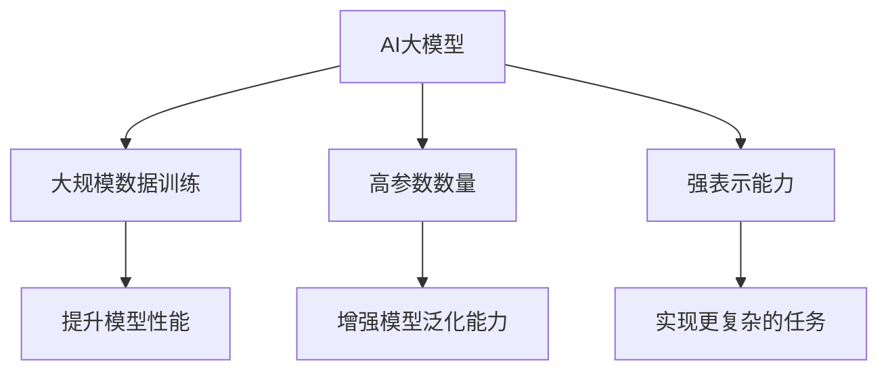

##### AI大模型的发展历程

AI大模型的发展可以分为以下几个阶段：

1. **传统机器学习阶段**：这一阶段主要依赖于统计方法和规则系统，模型规模较小，算法复杂度低。
2. **深度学习阶段**：随着计算能力的提升和数据量的增加，深度学习（Deep Learning）成为主流，模型规模逐渐扩大。
3. **AI大模型阶段**：近年来，随着神经网络结构的进一步优化和数据量的激增，AI大模型得到广泛应用，如GPT-3、BERT等。

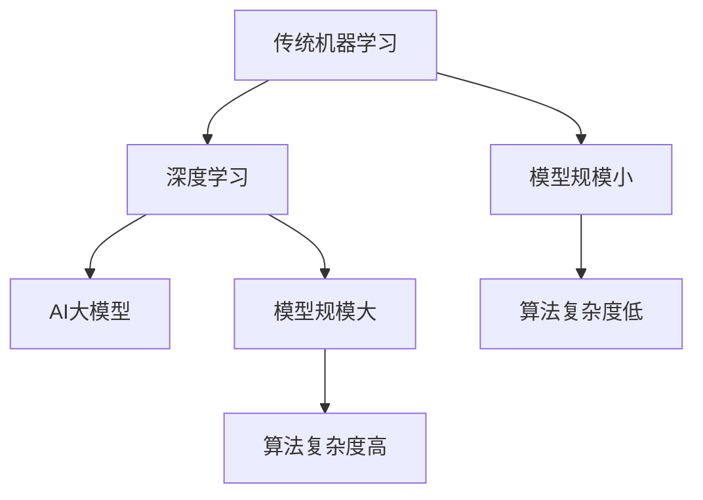

##### AI大模型的需求特点

AI大模型对数据中心建设提出了以下需求特点：

1. **大数据处理能力**：AI大模型通常需要处理海量数据，这要求数据中心具有强大的数据存储和处理能力。
2. **高性能计算需求**：AI大模型训练过程中需要大量的计算资源，要求数据中心提供高性能的计算能力。
3. **数据存储与传输需求**：为了支持模型的训练和部署，数据中心需要提供高效的存储和传输方案。

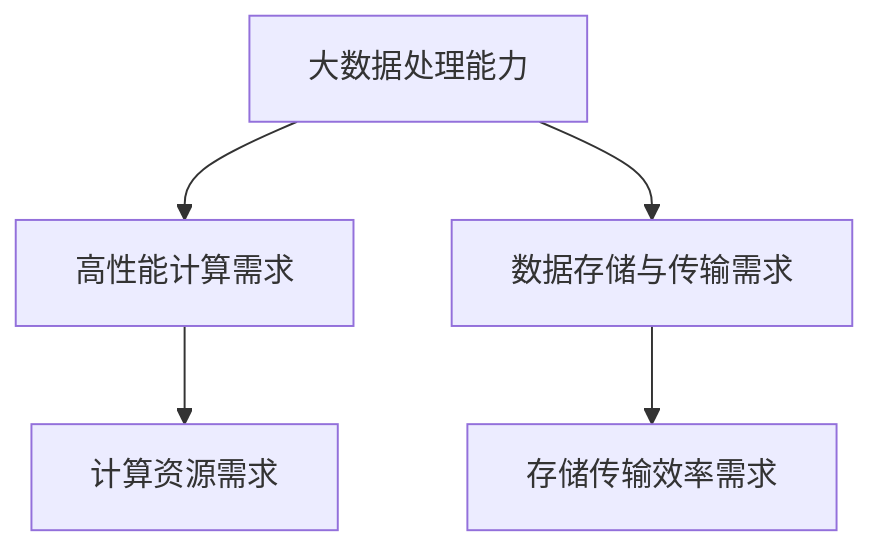

#### 1.2 数据中心建设背景与挑战

##### 数据中心的建设背景

数据中心（Data Center）是信息技术基础设施的核心，它为各类业务提供数据存储、处理和传输服务。随着互联网和云计算的快速发展，数据中心的建设显得尤为重要。

1. **互联网时代数据中心的重要性**：互联网企业需要数据中心来存储和处理海量数据，支持业务运营。
2. **大数据时代的到来与数据中心的需求**：大数据技术的兴起使得数据中心成为数据存储和处理的主要场所。

##### 数据中心建设面临的挑战

数据中心建设面临以下挑战：

1. **能源消耗与环保压力**：数据中心的高能耗问题亟待解决，同时需要考虑环保因素。
2. **数据安全与隐私保护**：数据中心需要确保数据的安全性，防止数据泄露和滥用。
3. **系统稳定性与可靠性**：数据中心需要提供稳定可靠的服务，确保业务的连续性和可用性。

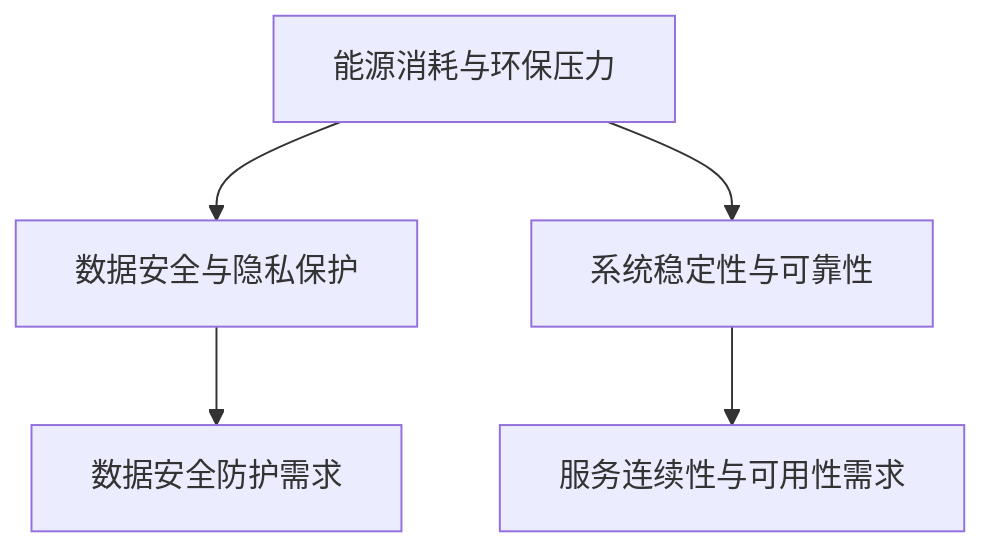

#### 1.3 AI大模型对数据中心建设的影响

##### AI大模型的需求特点

AI大模型的需求特点对数据中心建设产生了深远影响：

1. **大数据处理能力**：AI大模型需要处理海量数据，这要求数据中心提供强大的数据处理能力，包括高速网络、高性能计算节点和海量存储系统。
2. **高性能计算需求**：AI大模型训练过程中需要大量的计算资源，要求数据中心提供高性能的计算能力，包括GPU、TPU等加速器。
3. **数据存储与传输需求**：AI大模型需要高效的存储和传输方案，以确保数据的快速访问和传输。


##### AI大模型对数据中心建设的影响

AI大模型对数据中心建设的影响主要体现在以下几个方面：

1. **数据中心网络架构的优化**：为了满足AI大模型的数据传输需求，数据中心网络架构需要进行优化，提高网络带宽和传输效率。
2. **数据存储与管理技术的升级**：AI大模型需要高效的存储和访问方案，这要求数据中心采用先进的存储技术，如分布式存储、云存储等。
3. **数据中心基础设施的加强**：为了支持AI大模型的计算需求，数据中心需要加强基础设施建设，包括电力供应、冷却系统等。

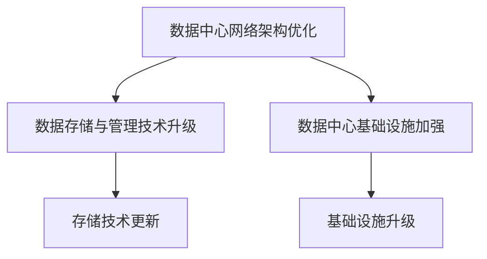

### 第2章：数据中心建设核心技术与架构

#### 2.1 数据中心网络架构

##### 数据中心网络架构概述

数据中心网络架构是数据中心的基础设施之一，它决定了数据传输的速度和可靠性。数据中心网络架构通常包括以下几个层次：

1. **接入层**：接入层主要负责连接终端设备和网络设备，如交换机、路由器等。
2. **汇聚层**：汇聚层将接入层的流量进行汇聚，并提供更高的带宽和更复杂的网络功能。
3. **核心层**：核心层是数据中心网络的核心，它负责数据的高速传输和处理。

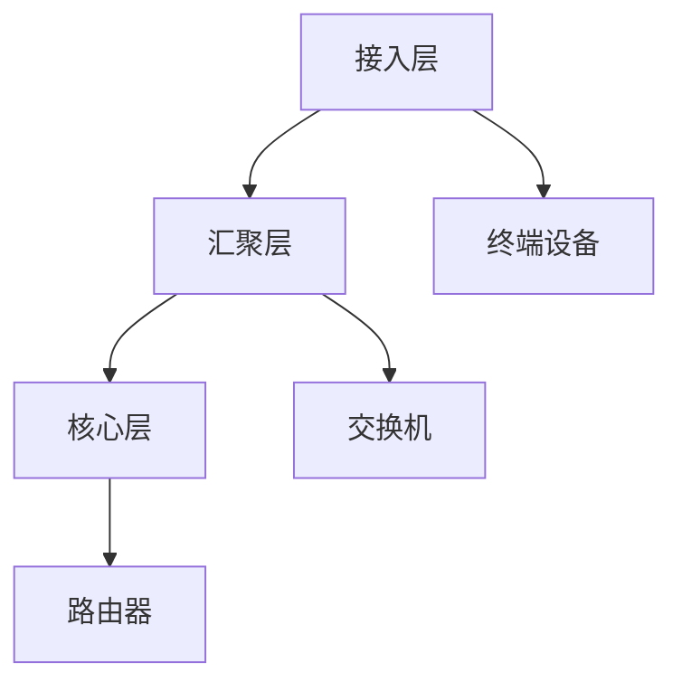

##### 数据中心网络架构的设计与实现

数据中心网络架构的设计与实现需要考虑以下几个因素：

1. **网络拓扑结构**：常见的网络拓扑结构包括环网、星型网和网状网等。选择合适的拓扑结构可以降低网络故障的风险，提高网络的可靠性。
2. **网络设备选型**：根据业务需求选择合适的网络设备，如交换机、路由器等。同时，需要考虑设备的性能、可靠性、可扩展性等因素。
3. **网络优化策略**：通过优化网络配置和流量管理策略，提高网络的性能和效率。

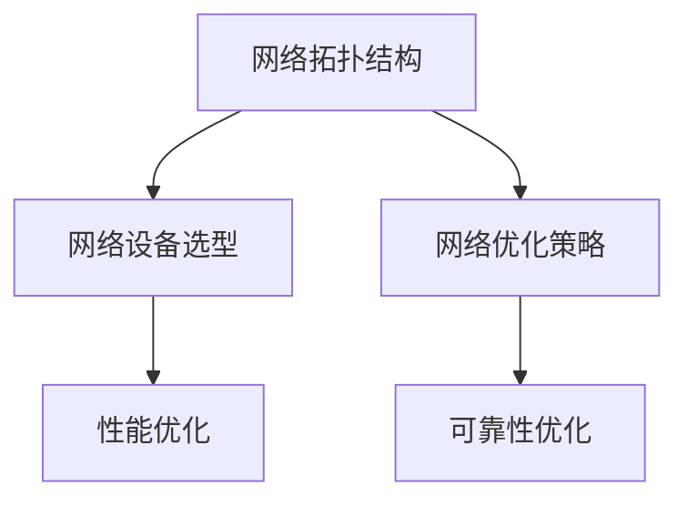

#### 2.2 数据存储与管理

##### 数据存储技术概述

数据存储技术是数据中心建设的重要组成部分。常见的存储技术包括：

1. **分布式存储**：分布式存储通过将数据分散存储在多个节点上，提高了数据的可靠性和可扩展性。
2. **云存储**：云存储是一种基于云计算的存储服务，通过互联网提供数据存储和访问功能。
3. **块存储**：块存储将数据划分为块进行存储，具有较高的读写性能。
4. **文件存储**：文件存储以文件为单位进行数据存储，适用于大规模文件存储和共享。

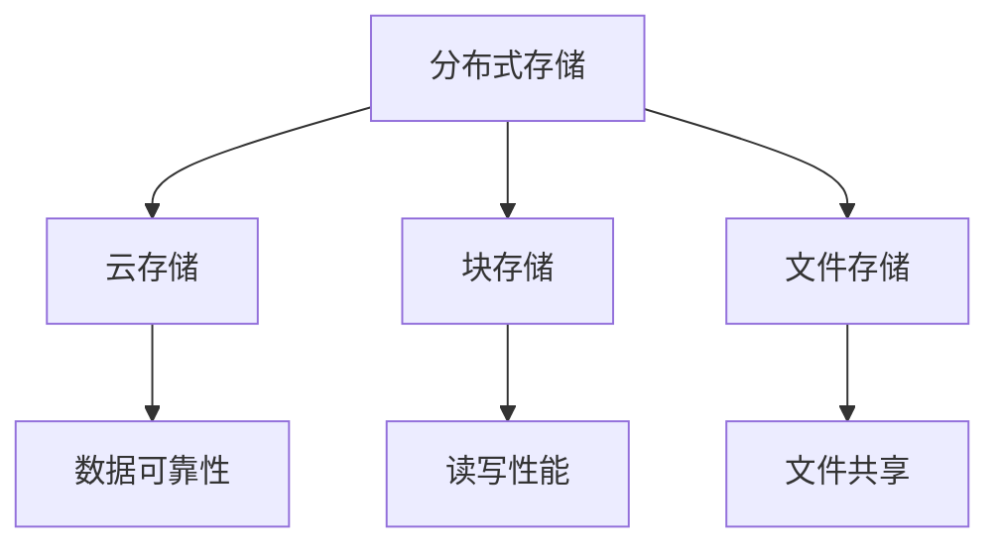

##### 数据管理策略

数据管理策略包括以下几个方面：

1. **数据备份与恢复**：通过定期备份和恢复机制，确保数据的安全性和可用性。
2. **数据安全与隐私保护**：采取加密、访问控制等措施，确保数据的安全和隐私。
3. **数据生命周期管理**：对数据进行分类、标记和管理，确保数据的合规性和可持续性。

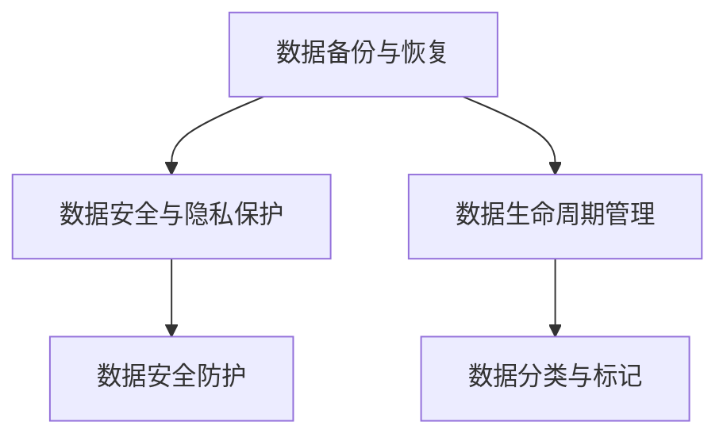

#### 2.3 数据中心基础设施

##### 电力系统设计

电力系统设计是数据中心建设的关键环节，需要考虑以下几个方面：

1. **电力供应与配电系统**：选择可靠的电力供应商，设计高效的配电系统，确保数据中心的电力需求得到满足。
2. **电力系统的安全与可靠性**：采取多种措施，如UPS（不间断电源）、备用电源等，确保电力系统的安全性和可靠性。
3. **节能与环保**：通过优化电力系统的设计和运行，降低能耗，实现绿色数据中心建设。

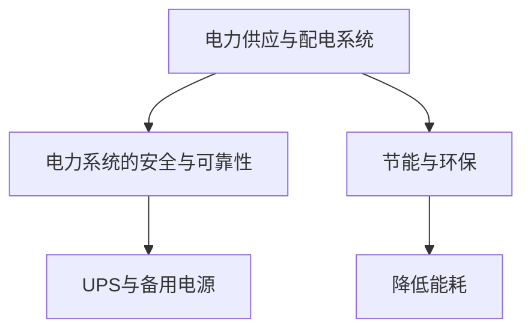

##### 冷却系统设计

冷却系统设计是确保数据中心正常运行的关键，需要考虑以下几个方面：

1. **冷却系统的工作原理**：通过空气冷却、液体冷却等方式，将数据中心设备产生的热量带走。
2. **冷却系统的设计与优化**：根据数据中心的规模和设备发热量，设计合适的冷却系统，并进行优化，提高冷却效率。
3. **能源效率**：通过采用节能技术和设备，提高冷却系统的能源效率。

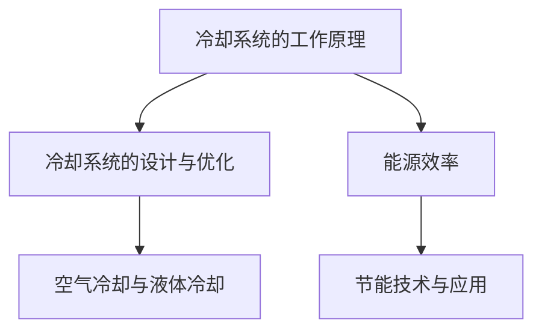

### 第3章：数据中心投资评估与成本控制

#### 3.1 数据中心投资评估方法

##### 投资评估指标

数据中心投资评估需要考虑以下指标：

1. **投资回报率（ROI）**：投资回报率是衡量投资收益的重要指标，计算公式为：
   $$
   ROI = \frac{净利润}{总投资} \times 100\%
   $$

2. **净现值（NPV）**：净现值是衡量投资现值与投资成本之间的差额，计算公式为：
   $$
   NPV = \sum_{t=0}^{n} \frac{C_t}{(1+r)^t} - C_0
   $$
   其中，$C_t$表示第$t$年的现金流量，$r$表示折现率。

3. **内部收益率（IRR）**：内部收益率是使净现值等于零的折现率，计算公式为：
   $$
   NPV = 0 \Rightarrow \frac{C_t}{(1+IRR)^t} = C_0
   $$

##### 投资评估流程

数据中心投资评估通常包括以下流程：

1. **项目可行性研究**：对数据中心项目进行市场调研、技术评估和经济效益分析，确定项目的可行性。
2. **投资决策**：根据可行性研究的结果，进行投资决策，包括投资金额、投资时间、投资方式等。

#### 3.2 数据中心成本控制策略

##### 成本控制措施

数据中心成本控制需要采取以下措施：

1. **成本预算管理**：制定详细的成本预算，对各项成本进行严格控制。
2. **成本控制流程**：建立成本控制流程，包括成本核算、成本分析和成本控制措施的执行。
3. **成本优化策略**：通过优化数据中心的设计、建设和运营，降低成本，提高投资效益。

##### 成本优化策略

成本优化策略包括以下几个方面：

1. **能耗优化**：通过采用节能技术和设备，降低数据中心的能耗，提高能源利用率。
2. **采购优化**：通过招标、比价等手段，降低采购成本，确保采购质量。
3. **运营优化**：通过优化数据中心的运维管理，提高服务质量，降低运营成本。

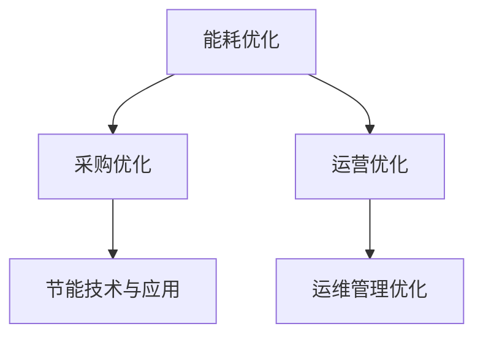

### 第4章：数据中心建设项目管理

#### 4.1 项目管理基础

##### 项目管理流程

数据中心建设项目的管理通常包括以下流程：

1. **项目启动**：确定项目目标、范围和进度，组建项目团队。
2. **项目规划**：制定项目计划、资源配置和风险管理策略。
3. **项目执行**：按照项目计划，组织项目团队进行项目实施。
4. **项目监控**：监控项目进度、质量和成本，确保项目按计划进行。
5. **项目收尾**：完成项目交付，进行项目总结和评价。

##### 项目管理工具

数据中心建设项目管理可以借助以下工具：

1. **项目管理软件**：如Microsoft Project、JIRA等，用于项目计划、任务分配、进度跟踪等。
2. **协作工具**：如Slack、Trello等，用于团队成员之间的沟通和协作。
3. **风险管理系统**：如RISKplorer、Open Risk等，用于风险识别、评估和应对。

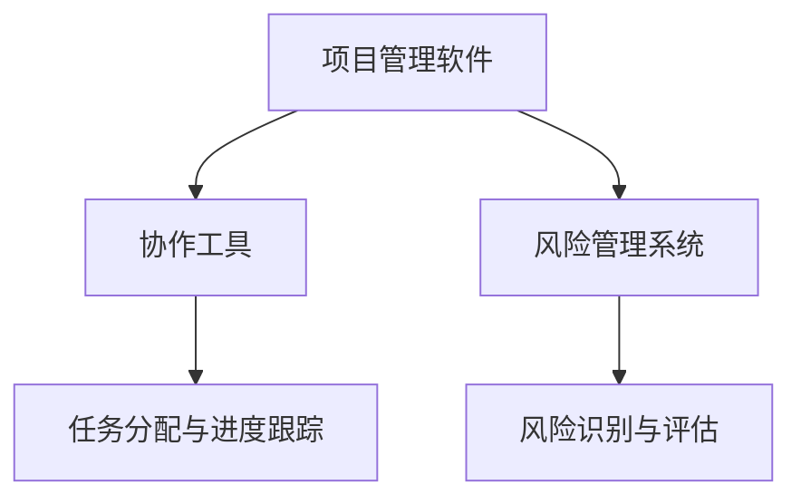

#### 4.2 数据中心建设风险管理

##### 风险识别

风险识别是数据中心建设风险管理的重要环节，包括以下几个方面：

1. **项目内部风险**：如人员离职、技术故障等。
2. **项目外部风险**：如市场变化、政策法规等。
3. **项目环境风险**：如自然灾害、电力供应中断等。

##### 风险评估与应对

风险评估是数据中心建设风险管理的关键环节，包括以下几个方面：

1. **风险评价方法**：如风险矩阵、层次分析法等。
2. **风险评估指标**：如风险概率、风险影响等。
3. **风险应对策略**：如风险规避、风险转移、风险接受等。

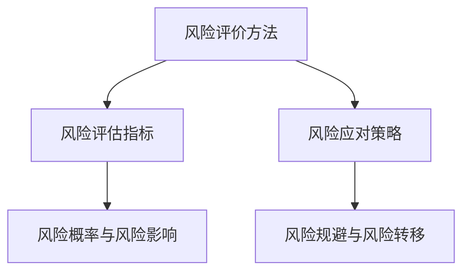

#### 4.3 数据中心建设质量保证

##### 质量管理体系

数据中心建设质量保证需要建立完善的质量管理体系，包括以下几个方面：

1. **质量管理体系框架**：如ISO 9001等国际标准。
2. **质量管理原则**：如顾客导向、过程方法、持续改进等。
3. **质量管理流程**：如质量计划、质量控制、质量改进等。

##### 质量控制措施

数据中心建设质量控制需要采取以下措施：

1. **质量控制流程**：包括质量检验、质量评审、质量分析等。
2. **质量控制工具**：如SPC（统计过程控制）、FMEA（失效模式与效应分析）等。
3. **质量改进方法**：如六西格玛、精益生产等。

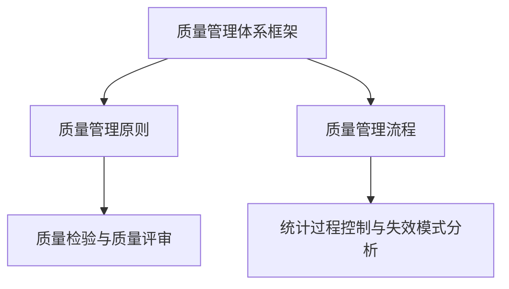

### 第5章：AI大模型数据中心建设案例分析

#### 5.1 案例一：互联网公司AI数据中心建设

##### 案例背景

某互联网公司致力于人工智能技术的研发和应用，为了支持AI业务的快速发展，决定建设一个高性能的AI数据中心。

##### 建设过程与成果

1. **网络架构设计**：采用网状网络拓扑结构，提高网络的可靠性和带宽。
2. **数据存储与管理**：采用分布式存储方案，确保数据的安全和高效访问。
3. **基础设施优化**：采用高效冷却系统和节能设备，降低能耗。

#### 5.2 案例二：医疗行业AI数据中心建设

##### 案例背景

某医疗公司希望通过AI技术提高医疗诊断的准确性和效率，决定建设一个专业的AI数据中心。

##### 建设过程与成果

1. **网络架构设计**：采用环网结构，确保数据传输的稳定性和安全性。
2. **数据存储与管理**：采用云存储方案，实现数据的远程访问和备份。
3. **基础设施优化**：采用先进的冷却技术和电力供应系统，确保数据中心的正常运行。

### 第6章：AI大模型数据中心运维与管理

#### 6.1 数据中心运维体系

##### 运维流程

数据中心运维体系通常包括以下流程：

1. **运维管理流程**：包括监控、告警、故障处理、运维报告等。
2. **运维工作内容**：包括系统监控、性能优化、安全管理、用户支持等。

##### 运维工具

数据中心运维工具包括：

1. **监控工具**：如Nagios、Zabbix等，用于监控服务器、网络设备、应用系统的运行状态。
2. **安全管理工具**：如Firewall、IDS/IPS等，用于保护数据中心的安全。
3. **用户支持工具**：如Service Desk、Help Desk等，用于处理用户的问题和请求。

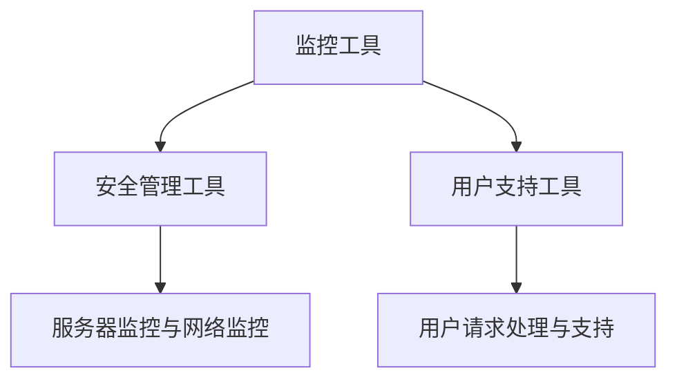

#### 6.2 数据中心安全管理

##### 安全威胁与防范措施

数据中心安全管理需要考虑以下安全威胁和防范措施：

1. **安全威胁分析**：包括网络攻击、数据泄露、设备故障等。
2. **防范措施**：包括防火墙、入侵检测、数据加密等。

##### 安全管理体系

数据中心安全管理体系包括：

1. **安全管理原则**：如安全责任、安全意识、安全评估等。
2. **安全管理制度**：如安全培训、安全审计、安全事件响应等。

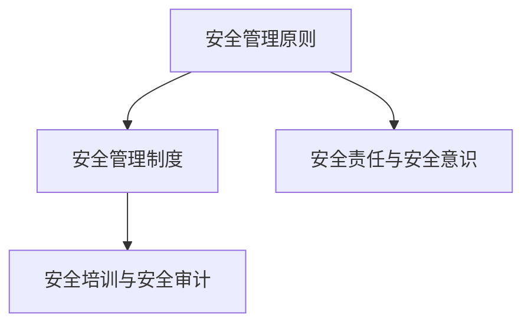

#### 6.3 数据中心性能优化

##### 性能优化策略

数据中心性能优化策略包括：

1. **网络性能优化**：如带宽优化、流量管理、路由优化等。
2. **存储性能优化**：如缓存策略、去重压缩、数据分布等。
3. **能耗性能优化**：如智能调度、绿色设备、节能措施等。

##### 性能监控与调优

数据中心性能监控与调优包括：

1. **性能监控指标**：如响应时间、吞吐量、延迟等。
2. **性能调优方法**：如性能测试、容量规划、负载均衡等。

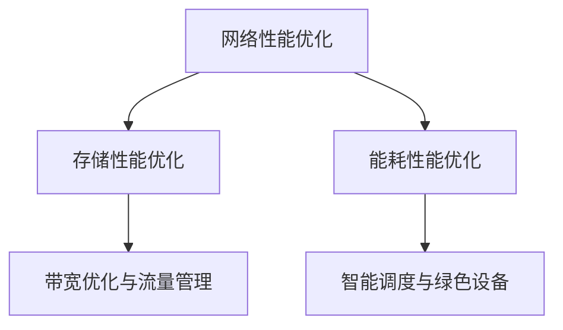

### 第7章：AI大模型数据中心未来发展趋势

#### 7.1 AI大模型数据中心发展趋势

##### 技术趋势

AI大模型数据中心的技术趋势包括：

1. **人工智能技术的进步**：如神经网络结构优化、算法优化等。
2. **云计算与数据中心技术的发展**：如云原生架构、边缘计算等。

##### 应用场景拓展

AI大模型数据中心的应用场景拓展包括：

1. **互联网行业**：如搜索引擎、推荐系统等。
2. **金融行业**：如风险管理、智能投顾等。
3. **医疗行业**：如疾病诊断、药物研发等。

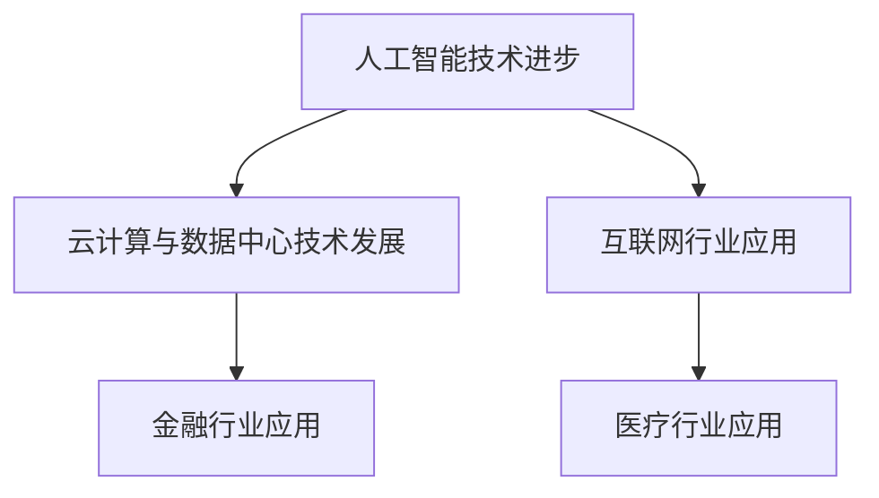

#### 7.2 数据中心建设挑战与应对策略

##### 挑战分析

数据中心建设面临的挑战包括：

1. **能源消耗与环保压力**：数据中心的高能耗问题亟待解决，同时需要考虑环保因素。
2. **数据安全与隐私保护**：数据中心需要确保数据的安全性，防止数据泄露和滥用。
3. **系统稳定性与可靠性**：数据中心需要提供稳定可靠的服务，确保业务的连续性和可用性。

##### 应对策略与建议

数据中心建设可以采取以下应对策略和建

### 第8章：AI大模型数据中心实践心得与经验

#### 8.1 实践心得分享

在AI大模型数据中心建设过程中，我们积累了以下实践心得：

1. **技术选型的关键性**：合理选择技术栈和硬件设备对于数据中心的建设至关重要。
2. **数据管理和安全性**：确保数据的高效管理和安全保护是数据中心建设的重要目标。
3. **能耗优化的重要性**：通过节能技术和措施，降低数据中心的能耗，实现可持续发展。

#### 8.2 经验总结与展望

通过对AI大模型数据中心的建设实践，我们总结了以下经验：

1. **技术标准化与规范化的必要性**：建立统一的技术标准和规范，提高数据中心的运行效率和安全性。
2. **持续创新与改进的方向**：随着技术的不断发展，数据中心需要不断进行创新和改进，以满足业务需求的不断变化。
3. **未来的发展展望**：随着人工智能技术的不断进步，AI大模型数据中心将在各行各业发挥更大的作用，推动数字化转型的深入发展。

## 附录

### 附录 A：AI大模型数据中心建设资源推荐

1. **书籍推荐**：
   - 《数据中心设计与建设》
   - 《大数据存储与管理》
   - 《深度学习实践》

2. **文章与报告**：
   - 《2023年AI数据中心建设报告》
   - 《AI大模型发展趋势与挑战》
   - 《数据中心能耗优化技术研究》

3. **开源项目与工具**：
   - OpenStack
   - Kubernetes
   - TensorFlow

### 附录 B：AI大模型数据中心建设常用术语解释

1. **数据中心相关术语**：
   - 数据中心（Data Center）
   - 云计算（Cloud Computing）
   - 虚拟化（Virtualization）

2. **AI大模型相关术语**：
   - 机器学习（Machine Learning）
   - 深度学习（Deep Learning）
   - 大数据（Big Data）

3. **投资与建设相关术语**：
   - 投资回报率（ROI）
   - 成本效益（Cost-effectiveness）
   - 项目管理（Project Management）


### 文章标题: AI 大模型应用数据中心建设：数据中心投资与建设

**关键词**: AI大模型，数据中心，投资，建设，网络架构，数据存储，成本控制，项目管理

**摘要**：
本文深入探讨了AI大模型应用数据中心的建设过程，包括其投资与建设的核心技术与架构、投资评估与成本控制策略、以及项目管理方法。通过详细的分析和案例分析，本文旨在为数据中心建设的从业者提供理论和实践指导，以应对AI大模型带来的挑战和机遇。

## 第一部分：AI大模型与数据中心建设基础

### 第1章：AI大模型概述

#### 1.1 AI大模型的概念与发展

**AI大模型的核心概念**：

AI大模型，即Large-scale AI Models，是一种在机器学习领域内通过大规模数据训练得到的模型。这些模型通常包含数亿到数十亿的参数，具有强大的表示能力和广泛的应用潜力。

**AI大模型的发展历程**：

AI大模型的发展可分为三个阶段：

1. **传统机器学习阶段**：此阶段模型规模较小，算法较为简单。
2. **深度学习阶段**：随着计算能力和数据量的提升，深度学习成为主流，模型规模逐渐扩大。
3. **AI大模型阶段**：近年来，AI大模型通过大规模数据训练取得了显著的成果，如GPT-3、BERT等。

**AI大模型的需求特点**：

AI大模型对数据中心建设提出了以下需求：

1. **大数据处理能力**：AI大模型需要处理海量数据，数据中心需具备高效的数据存储和处理能力。
2. **高性能计算需求**：AI大模型训练过程中需大量计算资源，数据中心需提供强大的计算能力。
3. **数据存储与传输需求**：高效的数据存储和传输是AI大模型训练的关键。

**核心概念与联系**：

```mermaid
graph TD
A[大数据处理能力] --> B[高性能计算需求]
A --> C[数据存储与传输需求]
B --> D[计算资源需求]
C --> E[存储传输效率需求]
```

**核心算法原理讲解**：

AI大模型的核心算法通常基于深度学习，如Transformer、GAN等。以下以Transformer为例，简要介绍其原理：

```plaintext
// Transformer算法伪代码
// 输入：输入序列X，输出序列Y
// 输出：预测序列Y'
model = Transformer()
Y' = model(X)

// Transformer主要包含以下组件：
// 1. Encoder：编码器，用于处理输入序列
// 2. Decoder：解码器，用于生成输出序列
// 3. Attention Mechanism：注意力机制，用于模型内部的权重计算
```

**数学模型和公式**：

Transformer模型的核心在于自注意力机制（Self-Attention），其计算公式为：

$$
\text{Attention}(Q, K, V) = \frac{1}{\sqrt{d_k}} \text{softmax}(\text{score})V
$$

其中，Q、K、V分别为查询向量、关键向量、值向量，d_k为键向量的维度，score为点积分数。

**举例说明**：

以自然语言处理中的文本序列为例，假设输入序列为["I", "love", "you"]，输出序列为["you", "love", "I"]。Transformer模型将输入序列编码为Q、K、V三个矩阵，然后通过自注意力机制生成输出序列。

#### 1.2 数据中心建设背景与挑战

**数据中心的建设背景**：

数据中心作为互联网时代的重要基础设施，承载着大量数据存储、处理和传输的任务。随着云计算、大数据、物联网等技术的发展，数据中心的需求日益增长。

**数据中心建设面临的挑战**：

数据中心建设面临以下挑战：

1. **能源消耗与环保压力**：数据中心的高能耗问题日益突出，对环境造成压力。
2. **数据安全与隐私保护**：数据中心的网络安全和隐私保护至关重要。
3. **系统稳定性与可靠性**：数据中心需要确保业务的连续性和可用性。

**AI大模型对数据中心建设的影响**：

AI大模型对数据中心建设的影响主要体现在以下几个方面：

1. **大数据处理能力**：AI大模型需要处理海量数据，对数据中心的存储和处理能力提出更高要求。
2. **高性能计算需求**：AI大模型训练过程中需大量计算资源，对数据中心的高性能计算能力提出挑战。
3. **数据存储与传输需求**：高效的数据存储和传输对AI大模型训练至关重要。

#### 1.3 AI大模型数据中心建设的技术架构

**数据中心网络架构**：

数据中心网络架构通常分为三层：接入层、汇聚层、核心层。接入层负责连接终端设备，汇聚层负责数据汇聚和分发，核心层负责数据的高速传输和处理。

**数据存储与管理**：

数据存储与管理包括分布式存储、云存储、块存储、文件存储等。分布式存储具有高可用性和可扩展性，云存储提供便捷的数据访问和备份，块存储和文件存储分别适用于不同场景。

**数据中心基础设施**：

数据中心基础设施包括电力系统、冷却系统、网络设备、存储设备等。电力系统需保证稳定供电，冷却系统需有效散热，网络设备需保证高速传输，存储设备需满足数据存储需求。

### 第2章：数据中心建设核心技术与架构

#### 2.1 数据中心网络架构

**数据中心网络架构概述**：

数据中心网络架构通常采用层次化的设计，分为接入层、汇聚层、核心层。接入层连接终端设备，汇聚层实现数据汇聚和分发，核心层负责数据的高速传输和处理。

**数据中心网络架构的设计与实现**：

数据中心网络架构的设计与实现需要考虑以下因素：

1. **网络拓扑结构**：包括环网、星型网、网状网等。环网具有高可靠性，星型网具有高扩展性，网状网具有高容错性。
2. **网络设备选型**：包括交换机、路由器、防火墙等。选择高性能、高可靠性的设备，确保网络的稳定性和性能。
3. **网络优化策略**：包括流量管理、负载均衡、链路冗余等，提高网络效率和可靠性。

**网络架构的 Mermaid 流程图**：

```mermaid
graph TB
A[终端设备] --> B[接入层]
B --> C[汇聚层]
C --> D[核心层]
D --> E[互联网]
```

#### 2.2 数据存储与管理

**数据存储技术概述**：

数据存储技术包括分布式存储、云存储、块存储、文件存储等。分布式存储具有高可用性和可扩展性，云存储提供便捷的数据访问和备份，块存储和文件存储分别适用于不同场景。

**数据存储与管理策略**：

数据存储与管理策略包括：

1. **数据备份与恢复**：定期备份数据，确保数据的安全性和完整性。
2. **数据安全与隐私保护**：采取加密、访问控制等措施，确保数据的安全和隐私。
3. **数据生命周期管理**：对数据进行分类、标记和管理，确保数据的合规性和可持续性。

**数据管理策略的 Mermaid 流程图**：

```mermaid
graph TB
A[数据备份与恢复] --> B[数据安全与隐私保护]
A --> C[数据生命周期管理]
B --> D[数据加密与访问控制]
C --> E[数据分类与标记]
```

#### 2.3 数据中心基础设施

**电力系统设计**：

电力系统设计包括电力供应与配电系统、UPS（不间断电源）、备用电源等。设计需考虑以下方面：

1. **电力供应稳定性**：选择可靠的电力供应商，确保数据中心的电力需求得到满足。
2. **电力系统的可靠性**：采取冗余设计和故障切换机制，确保电力系统的可靠性。
3. **节能与环保**：采用节能技术和设备，降低能耗，实现绿色数据中心建设。

**冷却系统设计**：

冷却系统设计包括空气冷却、液体冷却等。设计需考虑以下方面：

1. **冷却系统的工作原理**：通过空气或液体带走设备产生的热量。
2. **冷却系统的设计优化**：根据数据中心的规模和设备发热量，设计合适的冷却系统。
3. **能源效率**：采用节能技术和设备，提高冷却系统的能源效率。

**电力系统与冷却系统的 Mermaid 流程图**：

```mermaid
graph TB
A[电力供应与配电系统] --> B[UPS与备用电源]
A --> C[电力系统可靠性]
B --> D[节能与环保]
C --> E[冗余设计与故障切换]
D --> F[节能技术与设备]
A[冷却系统工作原理] --> G[冷却系统设计优化]
A --> H[能源效率]
G --> I[空气冷却与液体冷却]
```

### 第3章：数据中心投资评估与成本控制

#### 3.1 数据中心投资评估方法

**投资评估指标**：

数据中心投资评估常用以下指标：

1. **投资回报率（ROI）**：衡量投资收益与投资成本之间的关系。
2. **净现值（NPV）**：衡量投资的现值与投资成本之间的差额。
3. **内部收益率（IRR）**：使净现值等于零的折现率。

**投资评估流程**：

数据中心投资评估流程通常包括以下步骤：

1. **项目可行性研究**：分析市场需求、技术可行性、经济可行性等。
2. **投资决策**：根据可行性研究结果，决定是否进行投资。
3. **投资计划与预算**：制定投资计划，确定投资金额、投资时间、投资方式等。

**投资评估的 Mermaid 流程图**：

```mermaid
graph TB
A[项目可行性研究] --> B[投资决策]
A --> C[投资计划与预算]
B --> D[投资实施]
```

#### 3.2 数据中心成本控制策略

**成本控制措施**：

数据中心成本控制需采取以下措施：

1. **成本预算管理**：制定详细的成本预算，严格控制各项成本。
2. **成本控制流程**：建立成本控制流程，对成本进行核算、分析和控制。
3. **成本优化策略**：通过优化数据中心的设计、建设和运营，降低成本，提高投资效益。

**成本优化策略**：

数据中心成本优化策略包括：

1. **能耗优化**：采用节能技术和设备，降低能耗。
2. **采购优化**：通过招标、比价等手段，降低采购成本。
3. **运营优化**：通过优化运维管理，提高服务质量和效率。

**成本控制与优化的 Mermaid 流程图**：

```mermaid
graph TB
A[成本预算管理] --> B[成本控制流程]
A --> C[成本优化策略]
B --> D[能耗优化]
C --> E[采购优化]
C --> F[运营优化]
```

### 第4章：数据中心建设项目管理

#### 4.1 项目管理基础

**项目管理流程**：

数据中心建设项目的管理流程通常包括以下环节：

1. **项目启动**：确定项目目标、范围、进度等。
2. **项目规划**：制定项目计划、资源配置、风险管理等。
3. **项目执行**：按照项目计划实施项目。
4. **项目监控**：监控项目进度、质量和成本。
5. **项目收尾**：完成项目交付，进行项目总结和评价。

**项目管理工具**：

数据中心建设项目管理可以采用以下工具：

1. **项目管理软件**：如Microsoft Project、JIRA等。
2. **协作工具**：如Slack、Trello等。
3. **风险管理系统**：如RISKplorer、Open Risk等。

**项目管理的 Mermaid 流程图**：

```mermaid
graph TB
A[项目启动] --> B[项目规划]
A --> C[项目执行]
B --> D[项目监控]
C --> E[项目收尾]
```

#### 4.2 数据中心建设风险管理

**风险识别**：

数据中心建设风险识别包括以下方面：

1. **项目内部风险**：如人员离职、技术问题等。
2. **项目外部风险**：如市场变化、政策法规等。
3. **项目环境风险**：如自然灾害、电力供应中断等。

**风险评估与应对**：

风险评估包括以下方面：

1. **风险评价方法**：如风险矩阵、层次分析法等。
2. **风险评估指标**：如风险概率、风险影响等。
3. **风险应对策略**：如风险规避、风险转移、风险接受等。

**风险管理的 Mermaid 流程图**：

```mermaid
graph TB
A[风险识别] --> B[风险评估]
A --> C[风险应对策略]
B --> D[风险评价方法]
C --> E[风险规避与风险转移]
```

#### 4.3 数据中心建设质量保证

**质量管理体系**：

数据中心建设质量保证需建立完善的质量管理体系，包括以下方面：

1. **质量管理体系框架**：如ISO 9001等。
2. **质量管理原则**：如顾客导向、过程方法、持续改进等。
3. **质量管理流程**：如质量计划、质量控制、质量改进等。

**质量控制措施**：

数据中心建设质量控制包括以下措施：

1. **质量控制流程**：如质量检验、质量评审、质量分析等。
2. **质量控制工具**：如SPC（统计过程控制）、FMEA（失效模式与效应分析）等。
3. **质量改进方法**：如六西格玛、精益生产等。

**质量保证的 Mermaid 流程图**：

```mermaid
graph TB
A[质量管理体系框架] --> B[质量管理原则]
A --> C[质量管理流程]
B --> D[质量检验与质量评审]
C --> E[统计过程控制与失效模式分析]
```

### 第5章：AI大模型数据中心建设案例分析

#### 5.1 案例一：互联网公司AI数据中心建设

**案例背景**：

某互联网公司为了支持其AI业务的发展，决定建设一个高性能的AI数据中心。

**建设过程与成果**：

1. **网络架构设计**：采用网状网络拓扑结构，提高网络的可靠性和带宽。
2. **数据存储与管理**：采用分布式存储方案，确保数据的安全和高效访问。
3. **基础设施优化**：采用高效冷却系统和节能设备，降低能耗。

#### 5.2 案例二：医疗行业AI数据中心建设

**案例背景**：

某医疗公司希望通过AI技术提高医疗诊断的准确性和效率，决定建设一个专业的AI数据中心。

**建设过程与成果**：

1. **网络架构设计**：采用环网结构，确保数据传输的稳定性和安全性。
2. **数据存储与管理**：采用云存储方案，实现数据的远程访问和备份。
3. **基础设施优化**：采用先进的冷却技术和电力供应系统，确保数据中心的正常运行。

### 第6章：AI大模型数据中心运维与管理

#### 6.1 数据中心运维体系

**运维流程**：

数据中心运维体系通常包括以下流程：

1. **运维管理流程**：包括监控、告警、故障处理、运维报告等。
2. **运维工作内容**：包括系统监控、性能优化、安全管理、用户支持等。

**运维工具**：

数据中心运维工具包括：

1. **监控工具**：如Nagios、Zabbix等。
2. **安全管理工具**：如Firewall、IDS/IPS等。
3. **用户支持工具**：如Service Desk、Help Desk等。

**运维体系的 Mermaid 流程图**：

```mermaid
graph TB
A[运维管理流程] --> B[运维工作内容]
A --> C[系统监控与性能优化]
B --> D[安全管理与用户支持]
```

#### 6.2 数据中心安全管理

**安全威胁与防范措施**：

数据中心安全管理需考虑以下安全威胁和防范措施：

1. **安全威胁分析**：包括网络攻击、数据泄露、设备故障等。
2. **防范措施**：包括防火墙、入侵检测、数据加密等。

**安全管理体系**：

数据中心安全管理体系包括：

1. **安全管理原则**：如安全责任、安全意识、安全评估等。
2. **安全管理制度**：如安全培训、安全审计、安全事件响应等。

**安全管理体系的 Mermaid 流程图**：

```mermaid
graph TB
A[安全管理原则] --> B[安全管理制度]
A --> C[安全培训与安全审计]
B --> D[安全责任与安全意识]
```

#### 6.3 数据中心性能优化

**性能优化策略**：

数据中心性能优化策略包括：

1. **网络性能优化**：如带宽优化、流量管理、路由优化等。
2. **存储性能优化**：如缓存策略、去重压缩、数据分布等。
3. **能耗性能优化**：如智能调度、绿色设备、节能措施等。

**性能监控与调优**：

数据中心性能监控与调优包括：

1. **性能监控指标**：如响应时间、吞吐量、延迟等。
2. **性能调优方法**：如性能测试、容量规划、负载均衡等。

**性能优化的 Mermaid 流程图**：

```mermaid
graph TB
A[网络性能优化] --> B[存储性能优化]
A --> C[能耗性能优化]
B --> D[带宽优化与流量管理]
C --> E[智能调度与绿色设备]
```

### 第7章：AI大模型数据中心未来发展趋势

#### 7.1 AI大模型数据中心发展趋势

**技术趋势**：

AI大模型数据中心的技术趋势包括：

1. **人工智能技术的进步**：如神经网络结构优化、算法优化等。
2. **云计算与数据中心技术的发展**：如云原生架构、边缘计算等。

**应用场景拓展**：

AI大模型数据中心的应用场景拓展包括：

1. **互联网行业**：如搜索引擎、推荐系统等。
2. **金融行业**：如风险管理、智能投顾等。
3. **医疗行业**：如疾病诊断、药物研发等。

**未来发展趋势的 Mermaid 流程图**：

```mermaid
graph TB
A[人工智能技术进步] --> B[云计算与数据中心技术发展]
A --> C[互联网行业应用]
B --> D[金融行业应用]
C --> E[医疗行业应用]
```

#### 7.2 数据中心建设挑战与应对策略

**挑战分析**：

数据中心建设面临的挑战包括：

1. **能源消耗与环保压力**：数据中心的高能耗问题亟待解决，同时需考虑环保因素。
2. **数据安全与隐私保护**：数据中心需确保数据的安全性和隐私保护。
3. **系统稳定性与可靠性**：数据中心需提供稳定可靠的服务，确保业务的连续性和可用性。

**应对策略与建议**：

数据中心建设可以采取以下应对策略：

1. **技术创新与应用**：采用先进的节能技术、安全防护技术和优化算法。
2. **管理体系优化**：建立完善的质量管理体系和风险管理体系。
3. **政策法规支持**：政府和企业可出台相关政策法规，支持数据中心建设和发展。

**挑战与应对的 Mermaid 流程图**：

```mermaid
graph TB
A[能源消耗与环保压力] --> B[数据安全与隐私保护]
A --> C[系统稳定性与可靠性]
B --> D[技术创新与应用]
C --> E[管理体系优化]
```

### 第8章：AI大模型数据中心实践心得与经验

#### 8.1 实践心得分享

在AI大模型数据中心建设过程中，我们积累了以下实践心得：

1. **技术选型的关键性**：合理选择技术栈和硬件设备对于数据中心的建设至关重要。
2. **数据管理和安全性**：确保数据的高效管理和安全保护是数据中心建设的重要目标。
3. **能耗优化的重要性**：通过节能技术和措施，降低数据中心的能耗，实现可持续发展。

#### 8.2 经验总结与展望

通过对AI大模型数据中心的建设实践，我们总结了以下经验：

1. **技术标准化与规范化的必要性**：建立统一的技术标准和规范，提高数据中心的运行效率和安全性。
2. **持续创新与改进的方向**：随着技术的不断发展，数据中心需要不断进行创新和改进，以满足业务需求的不断变化。
3. **未来的发展展望**：随着人工智能技术的不断进步，AI大模型数据中心将在各行各业发挥更大的作用，推动数字化转型的深入发展。

## 附录

### 附录 A：AI大模型数据中心建设资源推荐

**书籍推荐**：

- 《数据中心设计与建设》
- 《大数据存储与管理》
- 《深度学习实践》

**文章与报告**：

- 《2023年AI数据中心建设报告》
- 《AI大模型发展趋势与挑战》
- 《数据中心能耗优化技术研究》

**开源项目与工具**：

- OpenStack
- Kubernetes
- TensorFlow

### 附录 B：AI大模型数据中心建设常用术语解释

**数据中心相关术语**：

- 数据中心（Data Center）
- 云计算（Cloud Computing）
- 虚拟化（Virtualization）

**AI大模型相关术语**：

- 机器学习（Machine Learning）
- 深度学习（Deep Learning）
- 大数据（Big Data）

**投资与建设相关术语**：

- 投资回报率（ROI）
- 成本效益（Cost-effectiveness）
- 项目管理（Project Management）

### 文章末尾作者信息

**作者**：AI天才研究院/AI Genius Institute & 禅与计算机程序设计艺术 /Zen And The Art of Computer Programming

