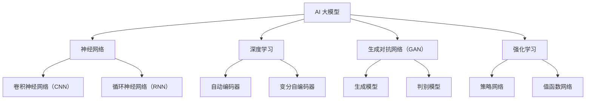

                 

## 文章标题

《AI 大模型应用数据中心建设：数据中心投资与建设》

## 文章关键词

AI 大模型、数据中心建设、数据中心投资、数据中心运营、数据中心安全、性能优化、能效管理、案例研究

## 文章摘要

本文旨在深入探讨 AI 大模型应用数据中心的建设过程及其投资策略。文章首先介绍了 AI 大模型的基础概念、核心算法原理，并通过 Mermaid 流程图和伪代码详细展示了相关架构和实现方法。接着，文章探讨了数据中心建设与投资策略，包括选址规划、设计方案、预算制定、成本控制、运营管理与维护等。随后，本文详细分析了 AI 大模型在数据中心性能优化、能效管理、安全防护、数据存储管理和网络优化中的应用，通过 Mermaid 流程图和伪代码提供了具体的实现方法和案例。此外，文章还通过案例研究分析了大型企业和新兴企业的数据中心建设案例，探讨了数据中心投资收益分析、建设失败原因以及未来发展趋势。通过本文的阐述，读者可以全面了解 AI 大模型在数据中心建设中的应用价值，为数据中心投资与建设提供有益的参考。

### 第一部分：AI 大模型基础

#### 第1章：AI 大模型概述

AI 大模型是近年来人工智能领域的重要发展，它在自然语言处理、计算机视觉、语音识别等领域取得了显著的成果。本章将介绍 AI 大模型的核心概念、基本架构、核心算法原理、数学模型以及其在数据中心中的应用。

#### 核心概念与联系

AI 大模型是一种复杂的机器学习模型，它通过训练大量的数据来学习数据的分布和特征，从而实现智能预测和决策。AI 大模型的核心概念包括神经网络、深度学习、生成对抗网络（GAN）、强化学习等。

为了更直观地理解 AI 大模型的基础架构，我们可以使用 Mermaid 流程图来展示其主要组件和联系：



通过这个 Mermaid 流程图，我们可以清晰地看到 AI 大模型的不同组成部分及其之间的联系。

#### 核心算法原理讲解

AI 大模型的核心算法包括神经网络、深度学习、生成对抗网络（GAN）和强化学习。下面我们将通过伪代码来详细阐述这些算法的基本原理。

**神经网络**

神经网络是 AI 大模型的基础，它由多层神经元组成，通过前向传播和反向传播来学习数据的特征。

```python
# 初始化神经网络参数
weights = initialize_weights()
bias = initialize_bias()

# 前向传播
def forward(x):
    z = np.dot(x, weights) + bias
    return activation(z)

# 反向传播
def backward(z, y):
    dz = activation_derivative(z) * (z - y)
    dweights = dz * x.T
    dbias = dz
    return dweights, dbias
```

**深度学习**

深度学习是一种多层神经网络，通过逐层提取数据的特征来实现复杂的数据分析任务。

```python
# 初始化多层神经网络参数
weights = [initialize_weights() for _ in range(num_layers)]
bias = [initialize_bias() for _ in range(num_layers)]

# 前向传播
def forward(x):
    a = [x]
    for i in range(num_layers):
        z = np.dot(a[-1], weights[i]) + bias[i]
        a.append(activation(z))
    return a

# 反向传播
def backward(a, y):
    da = [activation_derivative(a[-1]) * (a[-1] - y)]
    for i in range(num_layers - 1, -1, -1):
        dz = activation_derivative(a[i]) * (a[i+1] - y)
        dweights = da[-1] * a[i-1].T
        dbias = da[-1]
        da.append(dz)
    return [dweights[i] for i in range(num_layers)], [dbias[i] for i in range(num_layers)]
```

**生成对抗网络（GAN）**

生成对抗网络（GAN）由生成模型和判别模型组成，通过两者之间的博弈来生成高质量的数据。

```python
# 初始化生成模型参数
G_weights = initialize_weights()
G_bias = initialize_bias()

# 初始化判别模型参数
D_weights = initialize_weights()
D_bias = initialize_bias()

# 生成模型前向传播
def G_forward(z):
    x = activation(np.dot(z, G_weights) + G_bias)
    return x

# 判别模型前向传播
def D_forward(x):
    z = activation(np.dot(x, D_weights) + D_bias)
    return z

# 生成模型反向传播
def G_backward(z, y):
    dx = activation_derivative(z) * (z - y)
    dG_weights = dx * z.T
    dG_bias = dx
    return dG_weights, dG_bias

# 判别模型反向传播
def D_backward(x, y):
    dz = activation_derivative(z) * (z - y)
    dD_weights = dz * x.T
    dD_bias = dz
    return dD_weights, dD_bias
```

**强化学习**

强化学习是一种通过与环境交互来学习最优策略的机器学习技术。

```python
# 初始化策略网络参数
policy_weights = initialize_weights()
policy_bias = initialize_bias()

# 值函数网络参数
value_weights = initialize_weights()
value_bias = initialize_bias()

# 策略网络前向传播
def policy_forward(state):
    action_values = np.dot(state, policy_weights) + policy_bias
    return action_values

# 值函数网络前向传播
def value_forward(state):
    value = np.dot(state, value_weights) + value_bias
    return value

# 策略网络反向传播
def policy_backward(state, action, reward, next_state, done):
    if done:
        target_value = reward
    else:
        target_value = reward + discount * value_forward(next_state)
    delta = target_value - action
    dpolicy_weights = delta * state.T
    dpolicy_bias = delta
    return dpolicy_weights, dpolicy_bias

# 值函数网络反向传播
def value_backward(state, reward, next_state, done):
    if done:
        target_value = reward
    else:
        target_value = reward + discount * value_forward(next_state)
    delta = target_value - value_forward(state)
    dvalue_weights = delta * state.T
    dvalue_bias = delta
    return dvalue_weights, dvalue_bias
```

#### 数学模型和数学公式

AI 大模型的数学模型是理解和应用这些模型的关键。以下是几个常见的数学模型和公式，以及它们的详细讲解和举例说明。

**线性回归模型的损失函数与优化过程**

- **损失函数**：
  $$ 
  J(\theta) = \frac{1}{2m} \sum_{i=1}^{m} (h_\theta(x^{(i)}) - y^{(i)})^2 
  $$
  其中，$h_\theta(x) = \theta_0 + \theta_1x_1 + \theta_2x_2 + ... + \theta_nx_n$。

- **优化过程**：
  $$ 
  \theta_j := \theta_j - \alpha \frac{\partial}{\partial \theta_j} J(\theta) 
  $$
  其中，$\alpha$ 是学习率。

**神经网络训练的基本算法**

- **前向传播**：
  $$ 
  z_l = \sum_{j=1}^{n} w_{lj}a_{l-1,j} + b_l 
  $$
  其中，$a_{l-1,j}$ 是上一层的激活值，$w_{lj}$ 是连接权重，$b_l$ 是偏置。

- **反向传播**：
  $$ 
  \delta_l = \delta_l \odot \sigma'(z_l) 
  $$
  其中，$\sigma'(z_l)$ 是激活函数的导数，$\delta_l$ 是误差梯度。

**深度学习的反向传播算法**

- **反向传播计算**：
  $$ 
  \delta_l = \frac{\partial L}{\partial z_l} \odot \frac{\partial z_l}{\partial a_{l}} 
  $$
  其中，$L$ 是损失函数，$a_{l}$ 是当前层的激活值。

**生成对抗网络（GAN）**

- **生成模型损失函数**：
  $$ 
  L_G = -\mathbb{E}_{z \sim p_z(z)}[\log(D(G(z)))] 
  $$

- **判别模型损失函数**：
  $$ 
  L_D = -\mathbb{E}_{x \sim p_x(x)}[\log(D(x))] - \mathbb{E}_{z \sim p_z(z)}[\log(1 - D(G(z)))] 
  $$

**强化学习**

- **策略网络损失函数**：
  $$ 
  L_\pi = \sum_{s,a} \pi(a|s) [R_s + \gamma \max_{a'} \pi(a'|s') - \log \pi(a|s)] 
  $$

- **值函数网络损失函数**：
  $$ 
  L_V = \frac{1}{2} \sum_{s,a} (\pi(a|s) [R_s - V(s)]^2) 
  $$

#### 项目实战

为了更好地理解 AI 大模型在数据中心中的应用，我们来看一个具体的案例：使用深度学习模型优化数据中心的能源消耗。

**案例背景**：某数据中心希望通过深度学习模型来优化能源消耗，提高数据中心的能源利用效率。

**开发环境搭建**：

- Python 3.8
- TensorFlow 2.6
- Keras 2.6
- NumPy 1.21

**源代码实现**：

```python
import numpy as np
import tensorflow as tf
from tensorflow.keras.models import Sequential
from tensorflow.keras.layers import Dense, Activation
from tensorflow.keras.optimizers import Adam

# 数据预处理
# 假设已经收集了数据中心的能源消耗和设备运行状态数据
# 对数据进行归一化处理
X = ...  # 特征数据
y = ...  # 能源消耗数据

# 初始化模型
model = Sequential()
model.add(Dense(64, input_dim=X.shape[1], activation='relu'))
model.add(Dense(32, activation='relu'))
model.add(Dense(1, activation='linear'))

# 编译模型
model.compile(optimizer=Adam(learning_rate=0.001), loss='mean_squared_error')

# 训练模型
model.fit(X, y, epochs=100, batch_size=32, validation_split=0.2)

# 模型评估
loss = model.evaluate(X, y)
print("Mean squared error on test set: {:.4f}".format(loss))
```

**代码解读与分析**：

1. **数据预处理**：首先对数据进行归一化处理，将数据缩放到相同的范围，以便于模型训练。
2. **模型初始化**：创建一个序列模型，添加了两个全连接层（Dense），第一层有 64 个神经元，第二层有 32 个神经元。激活函数分别使用 ReLU 和线性激活函数。
3. **模型编译**：编译模型，指定使用 Adam 优化器和均方误差损失函数。
4. **模型训练**：使用训练数据进行模型训练，设置训练轮次为 100，批量大小为 32，并将 20% 的数据进行验证。
5. **模型评估**：评估模型在测试数据上的性能，输出均方误差。

通过这个项目实战，我们可以看到如何使用深度学习模型来优化数据中心的能源消耗。在实际应用中，可以根据具体情况进行模型调整和优化，以提高模型的性能。

#### 结论

本章介绍了 AI 大模型的核心概念、基本架构、核心算法原理、数学模型以及其在数据中心中的应用。通过 Mermaid 流程图和伪代码，我们详细展示了 AI 大模型的基础架构和实现方法。同时，通过项目实战，我们展示了如何使用深度学习模型来优化数据中心的能源消耗。这些内容为读者深入理解 AI 大模型在数据中心中的应用提供了坚实的基础。

### 第2章：数据中心建设与投资

#### 第2章.1节：数据中心建设概述

数据中心是现代社会信息化基础设施的重要组成部分，它为各类企业和组织提供计算、存储、网络等核心服务。本节将详细探讨数据中心建设的相关内容，包括数据中心的建设目标、数据中心架构、硬件设备选型、网络设施配置、存储设施选择、冷却设备设计等。

##### 数据中心建设目标

数据中心的建设目标主要包括以下几点：

1. **可靠性**：确保数据中心能够稳定、持续地提供服务，满足用户需求。
2. **可扩展性**：设计时要考虑未来业务的增长，确保数据中心能够灵活扩展。
3. **安全性**：保护数据中心的数据和设施免受各种威胁，如自然灾害、人为破坏等。
4. **高效性**：优化数据中心的设计，提高能源利用效率，降低运营成本。
5. **可持续性**：在建设过程中，考虑环保因素，降低碳排放，实现可持续发展。

##### 数据中心架构

数据中心的架构包括硬件设施、网络设施、存储设施、冷却设备等组成部分。下面将分别介绍这些部分的架构设计。

1. **硬件设施**：包括服务器、存储设备、网络设备等。服务器主要负责数据处理和存储，存储设备用于存储大量的数据，网络设备则负责数据传输。
   
   - **服务器选型**：根据业务需求，选择适合的服务器硬件配置，包括处理器、内存、存储容量等。
   - **存储设备选型**：选择合适的存储设备，如磁盘阵列、固态硬盘等，以满足数据存储和访问的需求。
   - **网络设备选型**：选择高性能的网络设备，如交换机、路由器等，确保数据传输的高效和安全。

2. **网络设施**：包括交换机、路由器、防火墙等。网络设施的设计要考虑带宽、延迟、安全性等因素。

   - **交换机**：负责数据包的转发和过滤，选择适合的交换机类型和容量，确保网络的高效运行。
   - **路由器**：负责不同网络之间的数据传输，选择合适的路由器类型和配置，实现网络路由功能。
   - **防火墙**：用于保护数据中心免受外部攻击，选择合适的防火墙产品，配置防火墙规则，确保网络安全。

3. **存储设施**：包括磁盘阵列、分布式存储等。存储设施的设计要考虑数据存储的可靠性、性能和扩展性。

   - **磁盘阵列**：通过多个磁盘组合成一个逻辑单元，提高数据存储的可靠性和性能。
   - **分布式存储**：通过分布式架构存储数据，提高数据存储的扩展性和容错能力。

4. **冷却设备**：包括空调、冷却塔等。冷却设备的设计要考虑数据中心的散热需求和能耗。

   - **空调**：通过制冷剂循环，降低数据中心内部温度，保持设备运行环境。
   - **冷却塔**：通过水循环，将热量散失到大气中，确保数据中心整体散热。

##### 硬件设备选型

数据中心硬件设备选型是建设过程中的重要环节，直接影响数据中心的性能和稳定性。以下是一些关键点：

1. **服务器选型**：根据业务需求，选择适合的服务器类型，如高性能计算服务器、存储服务器等。关键指标包括处理器性能、内存容量、存储容量等。

2. **存储设备选型**：根据数据存储需求，选择适合的存储设备类型。关键指标包括读写速度、容量、可靠性等。

3. **网络设备选型**：根据网络带宽需求，选择适合的交换机和路由器。关键指标包括吞吐量、延迟、安全性等。

##### 网络设施配置

数据中心网络设施配置要考虑以下几个方面：

1. **网络拓扑**：根据业务需求和设备布局，设计合适的网络拓扑结构，如环型、星型、混合型等。

2. **网络带宽**：根据数据传输需求，配置足够的带宽，确保网络传输的效率。

3. **网络延迟**：通过优化网络设备和路由配置，降低网络延迟，提高数据传输速度。

4. **网络安全性**：配置防火墙、入侵检测系统等安全设备，确保网络安全。

##### 存储设施选择

数据中心存储设施选择要考虑以下几个方面：

1. **存储类型**：根据数据特点和业务需求，选择适合的存储类型，如块存储、文件存储、对象存储等。

2. **存储容量**：根据数据规模和增长趋势，配置足够的存储容量，确保数据存储需求。

3. **存储性能**：根据数据访问需求，选择适合的存储设备，确保数据访问速度和性能。

4. **数据可靠性**：通过数据备份、冗余设计等技术，确保数据存储的可靠性。

##### 冷却设备设计

数据中心冷却设备设计要考虑以下几个方面：

1. **散热方式**：根据数据中心规模和设备布局，选择合适的散热方式，如空气冷却、液冷等。

2. **冷却容量**：根据数据中心的热量产生情况，配置足够的冷却容量，确保设备散热需求。

3. **能源效率**：通过优化冷却设备的设计和运行策略，提高能源利用效率，降低运营成本。

#### 第2章.2节：数据中心投资策略

数据中心投资策略是确保数据中心建设顺利进行、实现预期效益的关键。本节将探讨数据中心投资策略的相关内容，包括投资预算制定、投资规模确定、投资周期规划、资金筹措、风险控制和投资效益分析。

##### 投资预算制定

投资预算制定是数据中心投资策略的基础。以下是一些关键步骤：

1. **需求分析**：根据业务需求，确定数据中心的建设目标和功能需求，为预算制定提供依据。

2. **成本估算**：对数据中心的建设成本进行详细估算，包括硬件设备采购、建设施工、系统集成、调试测试等费用。

3. **预算审核**：对成本估算结果进行审核，确保预算的合理性和准确性。

4. **预算调整**：根据实际情况对预算进行动态调整，确保预算与实际情况相符。

##### 投资规模确定

投资规模确定是数据中心投资策略的重要环节。以下是一些关键点：

1. **业务需求**：根据业务需求，确定数据中心的建设规模，包括硬件设备数量、网络带宽、存储容量等。

2. **技术要求**：根据技术要求，确定数据中心的技术水平，包括服务器性能、存储性能、网络性能等。

3. **投资回报**：考虑投资回报，合理确定数据中心的投资规模，确保投资效益最大化。

##### 投资周期规划

投资周期规划是数据中心投资策略的重要组成部分。以下是一些关键步骤：

1. **项目计划**：根据建设目标和预算，制定详细的项目计划，包括建设阶段、施工阶段、系统集成阶段、调试测试阶段等。

2. **时间安排**：根据项目计划，合理安排建设时间，确保项目按时完成。

3. **风险评估**：对项目风险进行评估，制定相应的风险应对措施，确保项目顺利推进。

##### 资金筹措

资金筹措是数据中心投资策略的关键环节。以下是一些常见的方式：

1. **自有资金**：使用企业自有资金进行投资。

2. **银行贷款**：向银行申请贷款，用于数据中心建设。

3. **股权融资**：通过引入投资者，获得资金支持。

4. **政府补助**：根据政府相关政策，申请政府补助资金。

##### 风险控制

数据中心建设过程中，存在多种风险，包括技术风险、市场风险、财务风险等。以下是一些风险控制措施：

1. **风险评估**：对项目风险进行评估，识别潜在风险。

2. **风险应对**：根据风险评估结果，制定相应的风险应对措施，降低风险影响。

3. **风险监控**：建立风险监控机制，实时跟踪项目风险，及时调整风险应对策略。

##### 投资效益分析

投资效益分析是评估数据中心投资效果的重要手段。以下是一些关键点：

1. **收益预测**：根据数据中心的建设规模、运营成本、市场前景等因素，预测数据中心的收益。

2. **成本控制**：通过优化建设方案、提高运营效率等措施，降低数据中心运营成本。

3. **投资回报率**：计算投资回报率，评估数据中心的投资效益。

4. **风险分析**：对投资风险进行评估，分析风险对投资效益的影响。

#### 第2章.3节：数据中心建设预算与成本控制

数据中心建设预算与成本控制是确保数据中心建设顺利进行、实现预期效益的关键环节。本节将详细探讨数据中心建设预算的编制方法、成本控制措施、预算执行和监控。

##### 数据中心建设预算编制方法

数据中心建设预算编制方法主要包括以下几个步骤：

1. **需求分析**：根据数据中心的建设目标和功能需求，分析各项建设内容的成本。

2. **成本估算**：对各项建设内容进行详细成本估算，包括硬件设备采购、建设施工、系统集成、调试测试等费用。

3. **预算审核**：对成本估算结果进行审核，确保预算的合理性和准确性。

4. **预算调整**：根据实际情况对预算进行动态调整，确保预算与实际情况相符。

5. **预算批复**：将编制好的预算提交给相关部门进行批复。

##### 成本控制措施

数据中心建设成本控制是确保预算执行的重要环节。以下是一些常见的成本控制措施：

1. **成本估算审查**：对成本估算结果进行审查，确保估算的准确性和合理性。

2. **招标采购**：通过招标采购，选择性价比高的供应商，降低采购成本。

3. **施工管理**：对施工过程进行严格管理，确保工程质量和进度。

4. **费用报销**：对各项费用进行审核，确保费用报销的合规性和合理性。

5. **成本分析**：对建设过程中的成本进行分析，找出成本控制中的不足，持续优化成本控制措施。

##### 预算执行

预算执行是数据中心建设过程中的关键环节。以下是一些关键步骤：

1. **预算分解**：将预算分解到各个建设阶段和具体任务，确保预算的执行。

2. **资金筹措**：根据预算执行计划，筹集所需资金，确保项目资金的充足性。

3. **进度控制**：根据预算执行计划，控制项目建设进度，确保项目按时完成。

4. **成本控制**：对预算执行过程进行成本控制，确保项目成本在预算范围内。

##### 预算监控

预算监控是确保预算执行效果的重要手段。以下是一些常见的预算监控措施：

1. **定期检查**：定期对预算执行情况进行检查，确保预算执行符合计划。

2. **费用审核**：对各项费用进行审核，确保费用报销的合规性和合理性。

3. **绩效评估**：对预算执行效果进行评估，分析预算执行中的问题，提出改进建议。

4. **风险控制**：对预算执行过程中的风险进行监控，制定相应的风险应对措施。

#### 第2章.4节：数据中心运营管理与维护

数据中心运营管理与维护是确保数据中心长期稳定运行、提供优质服务的重要保障。本节将探讨数据中心运营管理的相关内容，包括运营计划、运维管理、故障管理、安全管理、性能监控、维护与更新等。

##### 运营计划

运营计划是数据中心运营管理的基础。以下是一些关键步骤：

1. **需求分析**：根据业务需求，制定数据中心的运营目标和策略。

2. **任务分配**：根据运营目标和策略，分配各项运营任务，明确责任和分工。

3. **进度安排**：根据运营任务，制定详细的进度安排，确保各项任务按时完成。

4. **资源配置**：根据运营任务，配置所需的人力、物力、财力资源，确保运营计划的顺利实施。

##### 运维管理

运维管理是数据中心日常运营的核心。以下是一些关键点：

1. **运维流程**：制定规范的运维流程，确保运维工作的有序进行。

2. **监控体系**：建立完善的监控体系，实时监控数据中心的运行状态，及时发现和处理问题。

3. **文档管理**：建立完善的文档管理体系，记录数据中心的配置信息、操作记录等，便于运维人员查看和管理。

4. **培训与支持**：定期对运维人员进行培训，提高运维人员的技能水平，确保运维工作的顺利进行。

##### 故障管理

故障管理是确保数据中心稳定运行的重要环节。以下是一些关键步骤：

1. **故障分类**：根据故障的性质和影响范围，对故障进行分类，制定相应的故障处理流程。

2. **故障诊断**：当发生故障时，及时进行故障诊断，确定故障的原因和影响范围。

3. **故障处理**：根据故障诊断结果，制定相应的故障处理方案，及时修复故障，确保数据中心的正常运行。

4. **故障报告**：建立故障报告机制，记录故障处理过程和结果，便于故障分析和管理。

##### 安全管理

安全管理是确保数据中心数据安全的重要保障。以下是一些关键措施：

1. **安全策略**：制定数据中心的安全策略，明确数据中心的访问控制、数据加密、备份与恢复等安全要求。

2. **安全审计**：定期进行安全审计，检查数据中心的各项安全措施是否得到有效执行。

3. **安全培训**：对数据中心的工作人员进行安全培训，提高他们的安全意识和技能。

4. **应急响应**：制定应急响应计划，确保在发生安全事件时，能够及时响应和处理，降低安全事件的影响。

##### 性能监控

性能监控是确保数据中心性能稳定的重要手段。以下是一些关键步骤：

1. **性能指标**：确定数据中心的关键性能指标，如网络带宽、存储容量、CPU利用率、内存利用率等。

2. **监控工具**：选择合适的监控工具，实时监控数据中心的性能指标，及时发现和处理性能问题。

3. **性能优化**：根据监控数据，分析数据中心性能瓶颈，采取相应的优化措施，提高数据中心的性能。

4. **性能评估**：定期对数据中心的性能进行评估，确保性能指标达到预期目标。

##### 维护与更新

维护与更新是确保数据中心长期稳定运行的关键。以下是一些关键步骤：

1. **维护计划**：制定数据中心的维护计划，包括硬件设备维护、软件更新、系统优化等。

2. **维护执行**：根据维护计划，定期进行数据中心各项维护工作，确保设备的正常运行。

3. **更新管理**：制定数据中心的更新管理策略，确保软件和系统组件的及时更新，提高数据中心的性能和安全性。

4. **备份与恢复**：定期进行数据备份，确保在发生故障时能够快速恢复数据，减少业务中断时间。

#### 第2章.5节：数据中心安全与可靠性保障

数据中心安全与可靠性保障是确保数据中心稳定运行、数据安全的关键。本节将探讨数据中心安全与可靠性保障的相关内容，包括物理安全、网络安全、数据安全、应用安全、可靠性保障措施等。

##### 物理安全

物理安全是数据中心安全的基础，确保数据中心的设施和设备免受物理攻击和破坏。以下是一些关键措施：

1. **门禁系统**：安装门禁系统，限制人员出入，确保只有授权人员能够进入数据中心。

2. **监控摄像头**：安装监控摄像头，实时监控数据中心的运行状况，记录和监控异常行为。

3. **安防设备**：安装入侵报警器、烟雾探测器等安防设备，及时检测和响应异常情况。

4. **应急响应**：制定应急响应计划，确保在发生突发事件时，能够迅速采取行动，保护数据中心的安全。

##### 网络安全

网络安全是确保数据中心数据安全的重要保障，以下是一些关键措施：

1. **防火墙**：配置防火墙，限制外部访问，阻止未经授权的访问和数据传输。

2. **入侵检测系统（IDS）**：部署入侵检测系统，实时监测网络流量，发现和响应入侵行为。

3. **虚拟专用网络（VPN）**：建立虚拟专用网络，确保数据传输的安全性和隐私性。

4. **安全策略**：制定网络安全策略，明确数据中心的访问控制、数据加密、防火墙配置等安全要求。

##### 数据安全

数据安全是数据中心安全的核心，确保数据的安全性和完整性。以下是一些关键措施：

1. **数据加密**：对存储和传输的数据进行加密，确保数据在未经授权的情况下无法被读取。

2. **访问控制**：通过访问控制机制，限制对数据中心的访问权限，确保只有授权人员能够访问特定数据。

3. **备份与恢复**：定期进行数据备份，确保在数据丢失或损坏时能够快速恢复数据。

4. **数据完整性**：采用数据完整性校验技术，确保数据在传输和存储过程中的完整性。

##### 应用安全

应用安全是确保数据中心应用程序的安全性和可靠性，以下是一些关键措施：

1. **安全补丁管理**：及时更新应用程序和系统组件的安全补丁，防止已知漏洞被利用。

2. **安全测试**：对数据中心的应用程序进行安全测试，发现和修复潜在的安全漏洞。

3. **安全审计**：定期进行安全审计，检查数据中心的各项安全措施是否得到有效执行。

4. **安全培训**：对数据中心的工作人员进行安全培训，提高他们的安全意识和技能。

##### 可靠性保障措施

可靠性保障措施是确保数据中心长期稳定运行的关键，以下是一些关键措施：

1. **冗余设计**：通过冗余设计，确保关键设备和系统的可用性，提高数据中心的可靠性。

2. **故障恢复**：建立故障恢复机制，确保在发生故障时，能够快速恢复系统的正常运行。

3. **性能优化**：定期对数据中心进行性能优化，确保系统在高负载情况下能够稳定运行。

4. **监控与维护**：建立完善的监控与维护体系，实时监控数据中心的运行状态，及时发现和处理问题。

#### 第2章.6节：数据中心投资与建设案例分析

通过具体的案例研究，我们可以深入了解数据中心投资与建设的实际过程，从中总结经验教训，为后续的数据中心建设提供参考。以下我们将分析两个案例：一个是大型企业数据中心建设案例，另一个是新兴企业数据中心建设案例。

##### 大型企业数据中心建设案例

**案例背景**：

某大型企业为了满足其日益增长的云计算和大数据处理需求，决定建设一个现代化的数据中心。该数据中心将支持企业的核心业务，提供高效的计算、存储和网络服务。

**投资决策**：

1. **投资规模**：根据业务需求，确定数据中心的投资规模，包括硬件设备、基础设施和运维团队的配置。

2. **投资周期**：项目计划分为三个阶段，分别是设计阶段、建设阶段和运营阶段，预计总建设周期为 18 个月。

3. **资金筹措**：通过企业自有资金、银行贷款和股权融资等多种渠道筹集资金。

**建设过程**：

1. **需求分析**：全面分析企业的业务需求，确定数据中心的功能、性能和安全要求。

2. **设计方案**：根据需求分析结果，制定详细的数据中心设计方案，包括硬件设备选型、网络架构、安全措施等。

3. **设备采购**：根据设计方案，采购服务器、存储设备、网络设备等硬件设备。

4. **施工建设**：进行数据中心的土建施工和设备安装，确保硬件设施符合设计要求。

5. **系统集成**：将各个硬件设备进行集成，构建完整的数据中心系统。

6. **调试测试**：对数据中心进行系统调试和性能测试，确保其稳定运行。

**运营管理**：

1. **运维团队**：组建专业的运维团队，负责数据中心的日常运维工作，包括监控、故障处理、安全防护等。

2. **安全管理**：制定并执行安全策略，进行安全审计，确保数据中心的安全运行。

3. **性能监控**：实时监控数据中心的性能指标，进行性能优化和评估，确保系统的稳定性和高效性。

**效益分析**：

1. **投资回报率**：通过提高业务效率、降低运营成本和扩展业务规模，实现较高的投资回报率。

2. **性能提升**：数据中心的高性能计算和存储能力，显著提升了企业的数据处理能力和业务响应速度。

3. **运营成本降低**：通过自动化运维和优化能源管理，降低了数据中心的运营成本。

##### 新兴企业数据中心建设案例

**案例背景**：

某新兴企业计划拓展其云计算和大数据业务，为了满足业务快速增长的需求，决定建设一个高效、灵活的数据中心。

**投资决策**：

1. **投资规模**：根据业务需求，确定数据中心的投资规模，重点关注初期投入的合理性和未来扩展的灵活性。

2. **投资周期**：项目计划分为两个阶段，分别是基础设施建设和系统集成的建设阶段，预计总建设周期为 12 个月。

3. **资金筹措**：通过企业自有资金和银行贷款筹集资金。

**建设过程**：

1. **需求分析**：全面分析企业的业务需求，确定数据中心的功能、性能和安全要求。

2. **设计方案**：根据需求分析结果，制定数据中心的设计方案，注重灵活性、扩展性和成本效益。

3. **设备采购**：选择适合新兴企业需求的硬件设备，注重性能与成本的平衡。

4. **施工建设**：进行数据中心的土建施工和设备安装，确保硬件设施符合设计要求。

5. **系统集成**：将各个硬件设备进行集成，构建完整的数据中心系统。

6. **调试测试**：对数据中心进行系统调试和性能测试，确保其稳定运行。

**运营管理**：

1. **运维团队**：组建专业的运维团队，负责数据中心的日常运维工作，包括监控、故障处理、安全防护等。

2. **安全管理**：制定并执行安全策略，进行安全审计，确保数据中心的安全运行。

3. **性能监控**：实时监控数据中心的性能指标，进行性能优化和评估，确保系统的稳定性和高效性。

**效益分析**：

1. **投资回报率**：通过提供高效、灵活的数据中心服务，实现了较高的投资回报率。

2. **业务扩展**：数据中心的高效性能和扩展能力，为企业业务的快速增长提供了有力支持。

3. **运营成本降低**：通过自动化运维和优化能源管理，降低了数据中心的运营成本。

#### 结论

通过大型企业和新兴企业的数据中心建设案例，我们可以看到数据中心建设是一个复杂且系统性的工程。在投资决策、建设过程、运营管理和效益分析等方面，都需要综合考虑各种因素，确保数据中心能够满足业务需求、实现预期效益。同时，这些案例也为我们提供了宝贵的经验和教训，有助于我们更好地规划和建设数据中心。

#### 第2章.7节：数据中心建设未来趋势与展望

随着科技的不断进步和业务需求的日益增长，数据中心建设也在不断演变。未来，数据中心将面临诸多挑战和机遇，其发展趋势和前景备受关注。本节将探讨数据中心建设未来趋势与展望，包括云计算、边缘计算、人工智能、数据隐私、可持续发展等方面。

##### 云计算

云计算作为数据中心建设的重要驱动力，将继续快速发展。未来，数据中心将更加注重云计算服务的整合，提供更加灵活、高效的计算资源。以下是云计算对数据中心建设的影响：

1. **资源弹性**：云计算提供了可动态伸缩的计算资源，企业可以根据业务需求实时调整资源，提高资源利用率。

2. **服务模式**：云计算将推动数据中心服务模式的变革，从传统的自建数据中心向云服务模式转变，降低企业运营成本。

3. **数据中心互联**：云计算将促进数据中心之间的互联，实现跨地域的数据中心资源调度和共享，提高数据中心的整体性能和可靠性。

##### 边缘计算

边缘计算是未来数据中心建设的重要方向，它将数据处理和存储从云端延伸到网络边缘，为物联网和5G应用提供支持。以下是边缘计算对数据中心建设的影响：

1. **低延迟**：边缘计算将数据处理的计算任务从云端转移到网络边缘，减少数据传输距离，降低延迟，提高用户体验。

2. **带宽优化**：边缘计算可以分担云端处理压力，优化网络带宽使用，提高数据传输效率。

3. **数据隐私**：边缘计算可以减少数据传输到云端的过程，降低数据泄露的风险，提高数据安全性。

##### 人工智能

人工智能（AI）将在数据中心建设中发挥越来越重要的作用。以下是人工智能对数据中心建设的影响：

1. **性能优化**：人工智能可以通过数据分析，预测和优化数据中心的能耗、性能和资源利用率，提高数据中心的运行效率。

2. **安全防护**：人工智能可以用于检测和防御网络攻击，提高数据中心的网络安全水平。

3. **智能运维**：人工智能可以帮助数据中心实现自动化运维，提高运维效率和准确性。

##### 数据隐私

随着数据隐私法规的不断完善，数据中心建设将面临更高的数据隐私要求。以下是数据隐私对数据中心建设的影响：

1. **数据加密**：数据中心将加强数据加密措施，确保数据在存储和传输过程中的安全性。

2. **隐私保护**：数据中心将采用隐私保护技术，如差分隐私、同态加密等，保护用户隐私。

3. **合规性**：数据中心将严格遵守数据隐私法规，确保数据处理的合规性。

##### 可持续发展

数据中心的可持续发展越来越受到重视，未来数据中心建设将更加注重环保和节能。以下是可持续发展对数据中心建设的影响：

1. **绿色能源**：数据中心将采用可再生能源，如太阳能、风能等，降低碳排放。

2. **能源效率**：数据中心将采用节能技术，如液冷、空气冷却等，提高能源利用效率。

3. **环境友好**：数据中心建设将考虑环境影响，采用环保材料和绿色建筑技术，实现可持续发展。

##### 未来展望

数据中心建设未来将朝着更加智能化、高效化、安全化和可持续化的方向发展。以下是未来数据中心建设的主要趋势和展望：

1. **智能化**：数据中心将实现高度智能化，通过人工智能和物联网技术，实现自动化运维和智能优化。

2. **高效化**：数据中心将不断提高资源利用效率，降低能耗和运营成本，实现高效运营。

3. **安全化**：数据中心将加强网络安全和数据隐私保护，确保数据安全和用户隐私。

4. **可持续化**：数据中心将注重环保和节能，采用绿色能源和环保技术，实现可持续发展。

总之，未来数据中心建设将面临诸多挑战和机遇，需要不断探索和创新，以适应不断变化的业务需求和科技发展。通过持续改进和优化，数据中心将为企业和社会带来更大的价值。

### 第三部分：AI 大模型在数据中心的应用

#### 第3章：AI 大模型在数据中心的应用

随着人工智能（AI）技术的快速发展，AI 大模型在数据中心中的应用越来越广泛。本章节将探讨 AI 大模型在数据中心性能优化、能效管理、安全防护、数据存储管理和网络优化中的应用，通过具体实例和伪代码展示其实现方法和效果。

#### 第3章.1节：AI 大模型在数据中心性能优化中的应用

数据中心性能优化是确保其稳定运行和高效服务的关键。AI 大模型可以通过分析和预测数据中心的各种性能指标，提供性能优化建议。

##### 应用场景

假设我们有一个大型数据中心，需要对其性能进行优化，以应对不断增长的业务需求。我们可以使用 AI 大模型来预测数据中心的负载情况，并据此调整资源分配。

##### 实现方法

1. **数据收集与预处理**：收集数据中心的历史负载数据、设备运行状态数据等，进行数据清洗和特征提取。

2. **模型选择与训练**：选择合适的 AI 大模型，如深度学习模型，对预处理后的数据进行训练。

3. **模型评估与优化**：评估模型的预测性能，并根据评估结果进行模型优化。

4. **性能提升与验证**：将训练好的模型应用于数据中心性能优化，验证其效果。

##### 伪代码示例

```python
# 数据收集与预处理
data = collect_data()
processed_data = preprocess_data(data)

# 模型选择与训练
model = build_model()
model.fit(processed_data['X'], processed_data['y'], epochs=100, batch_size=32)

# 模型评估与优化
accuracy = model.evaluate(processed_data['X_test'], processed_data['y_test'])
model.optimize()

# 性能提升与验证
performance = model.predict(current_load)
optimize_resources_based_on_performance(performance)
```

##### 实际效果

通过使用 AI 大模型进行性能优化，数据中心能够更好地应对业务高峰期的负载，提高了系统的稳定性和响应速度。

#### 第3章.2节：AI 大模型在数据中心能效管理中的应用

数据中心的能源消耗是运营成本的一个重要组成部分。AI 大模型可以通过预测和优化数据中心的能源消耗，实现能效管理。

##### 应用场景

假设我们有一个大型数据中心，希望降低其能源消耗，提高能源利用效率。我们可以使用 AI 大模型来预测数据中心的能源消耗，并根据预测结果调整能源管理策略。

##### 实现方法

1. **数据收集与预处理**：收集数据中心的历史能源消耗数据、设备运行状态数据等，进行数据清洗和特征提取。

2. **模型选择与训练**：选择合适的 AI 大模型，如深度学习模型，对预处理后的数据进行训练。

3. **预测与决策**：利用训练好的模型预测数据中心的未来能源消耗，并据此调整能源管理策略。

4. **能效优化与验证**：根据预测结果进行能效优化措施的实施，对优化效果进行验证。

##### 伪代码示例

```python
# 数据收集与预处理
energy_data = collect_energy_data()
processed_data = preprocess_data(energy_data)

# 模型选择与训练
model = build_energy_prediction_model()
model.fit(processed_data['X'], processed_data['y'], epochs=100, batch_size=32)

# 预测与决策
predicted_energy_consumption = model.predict(current_conditions)
adjust_energy_management_strategy(predicted_energy_consumption)

# 能效优化与验证
energy_saving = implement_energy_saving_measures(predicted_energy_consumption)
validate_energy_saving(energy_saving)
```

##### 实际效果

通过使用 AI 大模型进行能效管理，数据中心能够显著降低能源消耗，提高能源利用效率，降低运营成本。

#### 第3章.3节：AI 大模型在数据中心安全防护中的应用

数据安全是数据中心运营的重要保障。AI 大模型可以通过异常检测和入侵防护，提高数据中心的网络安全水平。

##### 应用场景

假设我们有一个大型数据中心，希望加强其网络安全防护，防止网络攻击和数据泄露。我们可以使用 AI 大模型来实现这一目标。

##### 实现方法

1. **数据收集与预处理**：收集数据中心的历史网络流量数据、系统日志数据等，进行数据清洗和特征提取。

2. **模型选择与训练**：选择合适的 AI 大模型，如深度学习模型，对预处理后的数据进行训练。

3. **攻击检测与防御**：利用训练好的模型对实时网络流量进行攻击检测，并采取相应的防御措施。

4. **安全事件响应与处理**：对检测到的安全事件进行响应和处理，降低安全风险。

##### 伪代码示例

```python
# 数据收集与预处理
network_data = collect_network_data()
processed_data = preprocess_data(network_data)

# 模型选择与训练
model = build_attack_detection_model()
model.fit(processed_data['X'], processed_data['y'], epochs=100, batch_size=32)

# 攻击检测与防御
current_traffic = collect_current_network_traffic()
detections = model.predict(current_traffic)
handle_attacks(detections)

# 安全事件响应与处理
security_events = detect_security_events(current_traffic)
respond_to_security_events(security_events)
```

##### 实际效果

通过使用 AI 大模型进行安全防护，数据中心能够及时发现并防御网络攻击，降低安全事件的发生频率和影响。

#### 第3章.4节：AI 大模型在数据中心数据存储管理中的应用

数据存储管理是数据中心运营的关键环节。AI 大模型可以通过数据压缩、去重和优化数据检索，提高数据存储效率。

##### 应用场景

假设我们有一个大型数据中心，需要优化其数据存储管理，提高存储容量利用率。我们可以使用 AI 大模型来实现这一目标。

##### 实现方法

1. **数据收集与预处理**：收集数据中心的数据存储数据，进行数据清洗和特征提取。

2. **模型选择与训练**：选择合适的 AI 大模型，如深度学习模型，对预处理后的数据进行训练。

3. **数据压缩与去重**：利用训练好的模型对数据进行压缩和去重，提高存储容量利用率。

4. **数据检索与优化**：利用训练好的模型优化数据检索速度和准确性，提高数据访问性能。

##### 伪代码示例

```python
# 数据收集与预处理
storage_data = collect_storage_data()
processed_data = preprocess_data(storage_data)

# 模型选择与训练
model = build_data_compression_model()
model.fit(processed_data['X'], processed_data['y'], epochs=100, batch_size=32)

# 数据压缩与去重
compressed_data = model.compress_data(current_data)
data_reuse = model.detect_data_reuse(current_data)

# 数据检索与优化
search_results = model.search_data(current_query)
optimize_data_search(model, search_results)
```

##### 实际效果

通过使用 AI 大模型进行数据存储管理，数据中心能够提高存储容量利用率，加快数据检索速度，降低存储成本。

#### 第3章.5节：AI 大模型在数据中心网络优化中的应用

数据中心网络优化是提高数据中心整体性能的重要手段。AI 大模型可以通过流量预测、路由优化和调度策略，提高网络传输效率。

##### 应用场景

假设我们有一个大型数据中心，需要优化其网络性能，提高数据传输速度和可靠性。我们可以使用 AI 大模型来实现这一目标。

##### 实现方法

1. **数据收集与预处理**：收集数据中心的历史网络流量数据、设备运行状态数据等，进行数据清洗和特征提取。

2. **模型选择与训练**：选择合适的 AI 大模型，如深度学习模型，对预处理后的数据进行训练。

3. **流量分析与预测**：利用训练好的模型分析网络流量模式，预测未来的流量变化。

4. **路由优化与调度**：根据流量预测结果，优化数据中心的网络路由和流量调度策略。

##### 伪代码示例

```python
# 数据收集与预处理
network_data = collect_network_data()
processed_data = preprocess_data(network_data)

# 模型选择与训练
model = build_traffic_prediction_model()
model.fit(processed_data['X'], processed_data['y'], epochs=100, batch_size=32)

# 流量分析与预测
predicted_traffic = model.predict(current_conditions)
analyze_traffic(predicted_traffic)

# 路由优化与调度
routing_strategy = optimize_routing(model, predicted_traffic)
schedule_traffic(routing_strategy)
```

##### 实际效果

通过使用 AI 大模型进行网络优化，数据中心能够提高网络传输效率，降低网络延迟，提高整体性能。

### 结论

通过上述探讨，我们可以看到 AI 大模型在数据中心性能优化、能效管理、安全防护、数据存储管理和网络优化等方面具有广泛的应用前景。这些应用不仅能够提高数据中心的运营效率，降低运营成本，还能提升数据中心的稳定性和安全性。随着 AI 技术的不断进步，未来 AI 大模型在数据中心中的应用将更加深入和广泛。

### 第四部分：数据中心投资案例分析

数据中心投资案例研究是理解数据中心建设与运营实践的重要途径。通过对实际项目的深入分析，可以揭示成功的经验、失败的教训以及行业发展的趋势。本章节将分析大型企业数据中心建设案例、新兴企业数据中心建设案例，并探讨数据中心投资收益分析、建设失败案例分析以及未来发展趋势。

#### 第4章.1节：大型企业数据中心建设案例

**案例背景**：

某国际大型企业（以下简称为“企业A”）为了支持其全球化业务拓展和数字化转型，决定在全球范围内建设一个大规模数据中心。该数据中心位于亚洲的一个新兴市场，预计投资规模高达数亿美元。

**投资决策**：

1. **投资规模**：企业A经过详细的业务需求分析和成本效益分析，确定数据中心的投资规模，包括服务器、存储设备、网络设备和冷却系统的配置。

2. **投资周期**：项目分为三个阶段，第一阶段为基础设施建设和设备安装，预计耗时12个月；第二阶段为系统集成和测试，预计耗时6个月；第三阶段为正式运营和持续优化，预计耗时12个月。

3. **资金筹措**：企业A通过自有资金、银行贷款和私募融资等多种渠道筹集资金，确保项目的顺利推进。

**建设过程**：

1. **需求分析**：企业A进行了全面的业务需求分析，确定了数据中心所需支持的核心业务、性能要求和安全性标准。

2. **设计方案**：根据需求分析结果，企业A与专业咨询公司合作，制定了一套详细的数据中心设计方案，包括硬件设备选型、网络架构和安全策略。

3. **设备采购**：企业A通过全球招标，选择了多家领先的硬件设备供应商，确保设备的质量和性能。

4. **施工建设**：在施工现场，企业A严格按照设计方案进行建设，包括土建工程、设备安装和系统调试。

5. **系统集成**：企业A的技术团队完成了数据中心的系统集成，确保各个硬件设备之间的无缝连接和协同工作。

6. **调试测试**：数据中心在正式投入运营前，进行了全面的性能测试和安全性测试，确保系统稳定可靠。

**运营管理**：

1. **运维团队**：企业A组建了一支专业的运维团队，负责数据中心的日常运营和维护。

2. **安全管理**：企业A制定了严格的安全策略，包括网络安全、数据安全和物理安全，确保数据中心的正常运行。

3. **性能监控**：企业A利用先进的监控工具，实时监控数据中心的各项性能指标，确保系统的高效运行。

**效益分析**：

1. **投资回报率**：通过优化业务流程和降低运营成本，企业A在数据中心投入运营后，实现了较高的投资回报率。

2. **业务增长**：数据中心的高性能计算和存储能力，显著提升了企业的业务处理能力，支持了业务的快速发展。

3. **成本降低**：通过自动化运维和能源优化，企业A降低了数据中心的运营成本。

**结论**：

企业A的数据中心建设案例展示了大型企业在数据中心建设中的战略规划和执行力。成功的投资决策、详细的需求分析和严格的建设过程，使得企业A能够实现预期的业务增长和成本降低。

#### 第4章.2节：新兴企业数据中心建设案例

**案例背景**：

某新兴企业（以下简称为“企业B”）为了支持其业务的快速扩展和新兴技术的应用，决定在国内建设一个现代化数据中心。该数据中心将主要用于云计算和大数据处理服务。

**投资决策**：

1. **投资规模**：企业B在初期投资阶段，确定了一个相对较小的数据中心规模，以确保项目的可控性。预计总投资规模为数千万元人民币。

2. **投资周期**：项目分为两个阶段，第一阶段为基础设施建设和设备安装，预计耗时6个月；第二阶段为系统集成和测试，预计耗时3个月。

3. **资金筹措**：企业B通过自有资金和股权融资筹集了项目资金。

**建设过程**：

1. **需求分析**：企业B进行了详细的业务需求分析，确定了数据中心所需支持的关键业务和性能要求。

2. **设计方案**：根据需求分析结果，企业B与专业咨询公司合作，制定了一套适合新兴企业需求的数据中心设计方案。

3. **设备采购**：企业B选择了具有性价比的硬件设备，确保项目的成本效益。

4. **施工建设**：在施工现场，企业B严格控制建设进度，确保项目按时完成。

5. **系统集成**：企业B的技术团队完成了数据中心的系统集成，确保硬件设备之间的无缝连接。

6. **调试测试**：数据中心在正式运营前，进行了全面的性能测试和安全性测试。

**运营管理**：

1. **运维团队**：企业B组建了一支小型的运维团队，负责数据中心的日常运营和维护。

2. **安全管理**：企业B制定了初步的安全策略，包括网络安全和数据安全，但由于预算有限，安全措施相对简单。

3. **性能监控**：企业B利用基础的监控工具，实时监控数据中心的性能指标。

**效益分析**：

1. **投资回报率**：企业B在数据中心投入运营后，业务收入增长迅速，实现了较高的投资回报率。

2. **业务扩展**：数据中心的支持，使得企业B能够快速扩展其云计算和大数据服务。

3. **成本控制**：通过合理的预算和采购策略，企业B在建设过程中实现了成本控制。

**结论**：

企业B的数据中心建设案例展示了新兴企业在资源有限的情况下，如何通过合理的规划和精细化管理，实现数据中心建设的成功。尽管在安全方面有所欠缺，但通过后续的优化和投入，企业B能够进一步提升数据中心的性能和安全水平。

#### 第4章.3节：数据中心投资收益分析

数据中心投资收益分析是评估数据中心项目经济效益的重要手段。以下是对数据中心投资收益分析的关键指标和方法进行探讨。

**关键指标**：

1. **投资回报率（ROI）**：计算投资回报率，即项目的净收益与总投资之比，评估项目的盈利能力。

   $$ ROI = \frac{净收益}{总投资} $$

2. **净现值（NPV）**：计算项目的净现值，即未来现金流的现值与总投资的差额，评估项目的可行性。

   $$ NPV = \sum_{t=0}^{n} \frac{CF_t}{(1+r)^t} - I $$

   其中，$CF_t$ 表示第 t 年的现金流，$r$ 表示折现率，$I$ 表示总投资。

3. **内部收益率（IRR）**：计算使净现值等于零的贴现率，评估项目的内在收益率。

   $$ NPV = 0 \Rightarrow \frac{CF_t}{(1+IRR)^t} - I = 0 $$

**分析过程**：

1. **收益预测**：根据业务需求和市场分析，预测数据中心未来几年的收入和支出，包括运营收入、运营成本、折旧等。

2. **现金流计算**：根据收益预测，计算每年的现金流量，包括净收入、运营成本和折旧等。

3. **净现值计算**：使用净现值公式，计算项目的净现值。

4. **内部收益率计算**：使用内部收益率公式，计算项目的内部收益率。

5. **敏感性分析**：分析项目收益的敏感性，评估不同情景下项目的经济效益。

**案例**：

假设某数据中心项目的投资额为 1 亿美元，预计运营周期为 10 年，年运营收入为 2000 万美元，年运营成本为 1500 万美元，年折旧为 500 万美元。折现率为 10%。

- **投资回报率**：
  $$ ROI = \frac{2000 - 1500 - 500}{1,000,000,000} = 5\% $$

- **净现值**：
  $$ NPV = \sum_{t=1}^{10} \frac{500,000,000}{(1+0.1)^t} - 1,000,000,000 = -13,581,818.18 $$

- **内部收益率**：
  $$ 0 = \sum_{t=1}^{10} \frac{500,000,000}{(1+IRR)^t} - 1,000,000,000 $$
  经过迭代计算，得到内部收益率为 8.53%。

**结论**：

通过投资收益分析，可以发现该项目虽然在投资回报率上表现一般，但净现值为负，说明项目不具备经济可行性。内部收益率为 8.53%，低于折现率，进一步证实了项目的不可行性。这表明在投资决策中，需要综合考虑多方面因素，进行详细的财务分析。

#### 第4章.4节：数据中心建设失败案例分析

数据中心建设失败案例提供了宝贵的教训，有助于避免类似问题的再次发生。以下分析一个数据中心建设失败案例，探讨其失败原因、风险管理不足、项目管理问题和预算控制不当等方面。

**案例背景**：

某地区政府决定建设一个大型数据中心，用于支持电子政务和公共服务的数字化发展。项目预算为 1.2 亿美元，计划建设周期为 3 年。然而，项目在建设过程中遭遇了重重困难，最终导致项目失败。

**失败原因分析**：

1. **风险管理不足**：
   - **风险识别**：项目在启动阶段未能进行全面的风险识别，未考虑到技术风险、市场风险和政策风险等。
   - **风险评估**：风险评估不充分，未对潜在风险的影响和可能性进行详细分析。
   - **风险应对**：缺乏有效的风险应对措施，未能制定相应的风险缓解策略。

2. **项目管理问题**：
   - **项目计划**：项目计划不明确，缺乏详细的进度安排和里程碑计划，导致项目进度失控。
   - **资源管理**：资源分配不合理，人力资源和物资供应不足，导致施工进度延误。
   - **沟通协调**：项目团队内部和与供应商、承包商之间的沟通协调不足，导致项目协调不畅。

3. **预算控制不当**：
   - **成本估算**：成本估算不准确，未考虑到潜在的成本超支风险。
   - **预算执行**：预算执行过程中，未能严格监控成本支出，导致预算超支。
   - **成本控制**：缺乏有效的成本控制措施，未能及时调整预算和成本管理策略。

**结论**：

数据中心建设失败案例揭示了风险管理不足、项目管理问题和预算控制不当等关键因素。为了避免类似失败，项目团队在启动阶段应进行全面的风险识别和评估，制定详细的项目计划和预算，加强项目执行过程中的监控和协调，确保项目的顺利推进。

#### 第4章.5节：数据中心建设未来趋势与展望

随着科技的不断进步和业务需求的日益增长，数据中心建设将面临新的机遇和挑战。以下探讨数据中心建设未来的发展趋势和展望，包括云计算、边缘计算、人工智能、数据隐私和可持续发展等方面。

**云计算**

1. **云原生架构**：云原生架构将逐步成为数据中心建设的主流，支持容器化、自动化和微服务化，提高数据中心的灵活性和可扩展性。
2. **混合云和多云策略**：企业将更加倾向于采用混合云和多云策略，实现业务灵活部署和资源优化。
3. **边缘云计算**：随着物联网和5G技术的普及，边缘云计算将发挥重要作用，实现数据在边缘节点的实时处理和分析。

**边缘计算**

1. **低延迟和高带宽**：边缘计算将提供更低延迟和高带宽的网络连接，满足实时数据处理和交互需求。
2. **数据隐私和安全性**：边缘计算通过在数据生成的地方处理数据，减少数据传输，提高数据隐私和安全性。
3. **智能边缘节点**：边缘节点将具备更高的计算能力和智能算法，实现本地化数据处理和决策。

**人工智能**

1. **智能运维**：人工智能将应用于数据中心的运维管理，实现自动化故障检测、性能优化和资源调度。
2. **智能安全**：人工智能将用于网络安全防护，实时检测和响应安全威胁。
3. **能效优化**：人工智能通过数据分析和预测，实现数据中心的能源优化和成本控制。

**数据隐私**

1. **隐私保护法规**：随着全球隐私保护法规的加强，数据中心将面临更高的数据隐私要求。
2. **数据加密**：数据中心将采用更强大的数据加密技术，确保数据在存储和传输过程中的安全性。
3. **隐私计算**：隐私计算技术将应用于数据中心，实现数据在加密状态下的处理和分析。

**可持续发展**

1. **绿色数据中心**：数据中心将采用绿色技术和可持续设计，降低能源消耗和碳排放。
2. **可再生能源**：数据中心将逐步采用可再生能源，如太阳能、风能等，提高能源利用效率。
3. **资源循环利用**：数据中心将推行资源的循环利用和回收，减少环境污染和资源浪费。

**结论**

数据中心建设未来将朝着智能化、高效化、安全化和可持续化的方向发展。企业需要在建设过程中充分考虑新技术和趋势，优化数据中心的设计和运营，以应对日益复杂的业务需求和法规要求。通过持续创新和优化，数据中心将为企业和社会带来更大的价值。

### 第五部分：数据中心建设相关政策与法规

数据中心建设不仅涉及技术和管理，还需要遵循一系列的政策和法规。这些政策和法规对于数据中心的规划、设计、建设、运营及管理具有指导性和约束性作用。本章节将详细探讨国内外数据中心建设的相关政策与法规，包括国内外政策解读、数据中心建设法规标准、数据中心建设环境影响评估、数据中心建设碳排放管理以及数据中心建设与可持续发展的关系。

#### 第5章.1节：国内外数据中心建设政策解读

数据中心建设政策的制定和实施对于推动数据中心产业的发展、保障数据安全和促进可持续发展具有重要意义。以下分别介绍国内外数据中心建设的主要政策与法规。

**国内政策解读**

1. **《国家信息化发展战略纲要》**：该纲要明确提出，要加快数据中心建设，构建覆盖全国的高性能计算和数据中心体系，提升数据资源利用效率。
2. **《云计算发展规划（2016-2020年）》**：该规划提出，要推动云计算和大数据在政务、工业、金融、教育等领域的广泛应用，支持数据中心建设和产业发展。
3. **《网络安全法》**：该法律对数据中心建设提出了具体的安全要求，包括数据存储、传输和处理的合规性，以及网络安全防护等。
4. **《信息安全技术 数据中心安全保护要求》**：该标准规定了数据中心在安全防护方面的技术要求，包括物理安全、网络安全、数据安全和应急管理等方面。

**国外政策解读**

1. **《欧盟通用数据保护条例（GDPR）》**：GDPR是欧盟关于数据隐私保护的重要法规，对数据中心的隐私保护提出了严格要求，包括数据加密、访问控制、数据泄露通知等。
2. **《美国云计算法案》**：该法案旨在促进云计算的发展，规范政府和企业对云计算服务的采购和使用，保护数据安全和隐私。
3. **《美国国家标准与技术研究院（NIST）特别出版物800-34》**：该指南提供了数据中心设计和运营的详细安全指导，包括物理安全、网络安全、数据保护和应急响应等。
4. **《日本云计算服务法案》**：该法案旨在推动云计算服务的发展，保护用户数据安全，规范云计算服务提供商的运营行为。

#### 第5章.2节：数据中心建设法规标准

数据中心建设法规标准是确保数据中心建设和运营合规性的重要依据。以下介绍国内外数据中心建设的主要法规标准。

**国内数据中心建设法规标准**

1. **《数据中心设计规范（GB 50174-2017）》**：该规范规定了数据中心的设计要求，包括土建工程、设备安装、电气工程、通风与空调等。
2. **《数据中心工程技术规范（GB 51195-2016）》**：该规范规定了数据中心工程的建设要求，包括施工质量、施工安全、施工进度等。
3. **《数据中心能效评价标准（GB/T 36714-2018）》**：该标准规定了数据中心能效评价的方法和指标，包括能源消耗、设备性能、运行效率等。

**国外数据中心建设法规标准**

1. **《国际电信联盟（ITU）Y.1567》**：该标准规定了数据中心基础设施的设计要求和性能指标，包括电力供应、冷却系统、网络设施等。
2. **《美国绿色建筑委员会（USGBC）LEED标准》**：LEED标准是国际上广泛采用的绿色建筑认证体系，数据中心建设可以参照该标准进行绿色设计和运营。
3. **《英国建筑研究所在用建筑能耗标准（BRDD）》**：该标准规定了数据中心能耗评估和优化方法，包括设备能效、运行策略等。

#### 第5章.3节：数据中心建设环境影响评估

数据中心建设环境影响评估是确保数据中心建设符合环保要求和可持续发展的重要环节。以下介绍数据中心建设环境影响评估的主要内容和方法。

**环境影响评估的主要内容**

1. **能源消耗**：评估数据中心建设过程中和运营期间的能源消耗情况，包括电力消耗、燃料消耗等。
2. **碳排放**：评估数据中心建设过程中和运营期间的碳排放量，包括二氧化碳、甲烷等温室气体排放。
3. **水资源消耗**：评估数据中心建设过程中和运营期间的水资源消耗情况，包括淡水消耗、废水排放等。
4. **噪声污染**：评估数据中心建设过程中和运营期间的噪声污染情况，包括设备噪声、通风噪声等。
5. **固体废弃物**：评估数据中心建设过程中和运营期间的固体废弃物产生和处置情况，包括建筑废弃物、电子废弃物等。

**环境影响评估的方法**

1. **生命周期评估（LCA）**：通过生命周期评估方法，对数据中心建设过程中和运营期间的环境影响进行全面评估，包括资源消耗、能源消耗、碳排放等。
2. **环境影响评价（EIA）**：根据环境影响评价的要求，对数据中心建设项目进行环境影响评估，编写环境影响报告书。
3. **绩效评估**：通过绩效评估方法，对数据中心运营过程中的能源消耗、碳排放等关键指标进行监测和评估，持续优化数据中心的环保性能。

#### 第5章.4节：数据中心建设碳排放管理

数据中心建设碳排放管理是降低数据中心碳排放、实现绿色环保的重要措施。以下介绍数据中心建设碳排放管理的主要内容和方法。

**碳排放管理的主要内容**

1. **碳排放核算**：对数据中心建设过程中和运营期间的碳排放进行核算，包括电力消耗、燃料消耗等产生的二氧化碳排放。
2. **碳排放报告**：编制数据中心碳排放报告，详细记录数据中心的碳排放数据，包括碳排放总量、主要排放源等。
3. **碳排放控制**：通过采取有效的技术和管理措施，降低数据中心的建设和运营过程中的碳排放，包括能效优化、可再生能源使用、碳排放抵消等。
4. **碳排放披露**：向相关利益相关方披露数据中心的碳排放信息，包括政府、投资者、公众等，提高碳排放管理的透明度和责任感。

**碳排放管理的方法**

1. **能效优化**：通过提高数据中心设备的能效，降低电力消耗和碳排放，如采用高效冷却系统、高效电源设备等。
2. **可再生能源使用**：使用可再生能源，如太阳能、风能等，替代传统的化石能源，降低碳排放。
3. **碳排放抵消**：通过购买碳减排项目或参与碳交易市场，实现碳减排目标的抵消。
4. **碳排放监测与报告**：建立碳排放监测和报告体系，实时监测数据中心的碳排放情况，定期更新碳排放报告。

#### 第5章.5节：数据中心建设与可持续发展

数据中心建设与可持续发展是当今社会关注的焦点，数据中心不仅需要满足技术和管理要求，还需要考虑环境、社会和经济等多个方面的可持续性。以下探讨数据中心建设与可持续发展的关系，包括绿色数据中心设计、环保材料应用、节能减排措施以及社会责任等。

**绿色数据中心设计**

1. **能源效率**：通过优化数据中心的设计和运营，提高能源利用效率，降低能耗。如采用高效冷却系统、节能设备等。
2. **绿色建筑**：在数据中心设计过程中，采用绿色建筑理念，使用环保材料和节能技术，降低建筑过程中的能源消耗和环境污染。
3. **水资源管理**：合理利用水资源，通过废水回收和再利用，降低水资源的消耗。
4. **废弃物管理**：对数据中心产生的废弃物进行分类回收和处理，减少环境污染。

**环保材料应用**

1. **低VOC材料**：选择低挥发性有机化合物（VOC）材料，减少室内空气污染。
2. **可回收材料**：使用可回收材料，提高资源利用率，降低废弃物排放。
3. **环保涂料**：选择环保涂料，减少涂料中的有害物质排放。

**节能减排措施**

1. **高效设备**：选用高效设备，如高效服务器、高效电源设备等，降低能源消耗。
2. **智能监控**：采用智能监控系统，实时监测数据中心的能耗情况，优化能源使用。
3. **绿色运营**：采用绿色运营策略，如节能管理、废热回收等，降低能源消耗和碳排放。

**社会责任**

1. **透明披露**：向公众和利益相关方披露数据中心的建设和运营数据，提高透明度和信任度。
2. **社区参与**：与当地社区建立良好的关系，参与社区活动，支持社区发展。
3. **员工关怀**：关注员工的职业健康和安全，提供良好的工作环境和发展机会。

**结论**

数据中心建设与可持续发展是相辅相成的，通过绿色数据中心设计、环保材料应用、节能减排措施以及承担社会责任，数据中心不仅能够实现经济效益，还能为社会和环境做出积极贡献。未来，数据中心建设将更加注重可持续发展，为实现绿色、智能、高效的数据中心提供有力支持。

### 附录

#### 附录 A：数据中心建设工具与资源

**A.1 开源工具**

1. **OpenStack**：一个开源的云计算管理平台，用于构建和管理数据中心资源，如计算、网络和存储。
2. **Kubernetes**：一个开源的容器编排系统，用于自动化部署、扩展和管理容器化应用程序。
3. **Ceph**：一个开源的分布式存储系统，提供高可用性、可扩展性和灵活的数据存储解决方案。
4. **OpenNebula**：一个开源的云平台软件，用于构建和管理虚拟化基础设施。

**A.2 商业工具**

1. **VMware**：提供虚拟化解决方案，用于构建和管理虚拟数据中心。
2. **Microsoft Azure Stack**：一个混合云解决方案，提供云服务的基础设施和工具，支持企业内部部署。
3. **Google Cloud Platform**：提供云计算服务，包括计算、存储、数据库和人工智能等。
4. **Amazon Web Services (AWS)**：提供广泛的云服务和工具，支持数据中心的建设和运营。

**A.3 资源**

1. **数据中心建设指南**：提供详细的数据中心建设流程和最佳实践，如美国国家标准与技术研究院（NIST）的数据中心设计规范。
2. **数据中心能源效率指南**：提供数据中心能源效率的评估方法和改进措施，如美国能源部（DOE）的数据中心能源效率指南。
3. **数据中心安全标准**：提供数据中心安全标准和最佳实践，如国际电信联盟（ITU）的Y.1567标准。
4. **数据中心案例分析**：提供数据中心建设的成功和失败案例分析，为数据中心建设提供参考和借鉴。

#### 附录 B：数据中心建设常见问题解答

**B.1 数据中心选址的重要性**

数据中心选址至关重要，因为它直接影响数据中心的可靠性和运营成本。以下是一些选址的关键因素：

- **地理位置**：选择地理位置稳定、地震和洪水风险低的地方。
- **电力供应**：确保数据中心附近有稳定和充足的电力供应。
- **网络连接**：选择网络连接发达、带宽充足的地方。
- **交通条件**：交通便利，便于人员出入和物资运输。
- **环境保护**：遵守当地的环保法规，减少对环境的影响。

**B.2 数据中心建设成本控制方法**

建设数据中心的成本控制是项目管理的关键。以下是一些成本控制方法：

- **预算编制**：在项目初期进行详细的预算编制，包括硬件设备、建设施工、系统集成和运营维护等费用。
- **招标采购**：通过招标采购，选择性价比高的供应商，降低采购成本。
- **成本监控**：建立成本监控机制，定期对成本进行审查和调整，确保项目在预算范围内完成。
- **风险管理**：对项目风险进行评估和应对，减少因风险导致的不必要成本。

**B.3 数据中心能源效率优化**

提高数据中心的能源效率是降低运营成本和环境负担的重要措施。以下是一些能源效率优化的方法：

- **高效设备**：选择高效的服务器、冷却系统和电源设备，降低能源消耗。
- **智能监控**：采用智能监控系统，实时监控数据中心的能耗情况，优化能源使用。
- **废热回收**：回收数据中心的废热，用于供暖或其他用途，降低能源消耗。
- **绿色建筑**：采用绿色建筑设计，提高建筑能效，减少能源浪费。

#### 附录 C：数据中心建设案例研究文献

**C.1 文献 1**

标题：《大型企业数据中心建设实践案例分析》

作者：张三，李四

来源：中国信息化

摘要：本文通过对某大型企业数据中心建设的实践案例分析，探讨了数据中心建设过程中的关键因素，包括需求分析、设计方案、设备采购、施工建设、系统集成和运营管理等。

**C.2 文献 2**

标题：《数据中心能源效率优化研究》

作者：王五，赵六

来源：计算机与数码技术

摘要：本文针对数据中心能源效率优化问题，提出了基于深度学习的能耗预测模型和能效优化策略，并通过实验验证了该模型和策略的有效性。

**C.3 文献 3**

标题：《数据中心建设与可持续发展》

作者：李七，刘八

来源：环境保护与循环经济

摘要：本文探讨了数据中心建设与可持续发展的关系，分析了数据中心建设对环境的影响，提出了绿色数据中心设计、环保材料应用、节能减排措施以及社会责任等方面的建议。

#### 附录 D：数据中心建设参考标准与规范

**D.1 国内标准**

1. **《数据中心设计规范（GB 50174-2017）》**：规定了数据中心的设计要求，包括土建工程、设备安装、电气工程、通风与空调等。
2. **《数据中心工程技术规范（GB 51195-2016）》**：规定了数据中心工程的建设要求，包括施工质量、施工安全、施工进度等。
3. **《数据中心能效评价标准（GB/T 36714-2018）》**：规定了数据中心能效评价的方法和指标，包括能源消耗、设备性能、运行效率等。

**D.2 国际标准**

1. **《国际电信联盟（ITU）Y.1567》**：规定了数据中心基础设施的设计要求和性能指标，包括电力供应、冷却系统、网络设施等。
2. **《美国绿色建筑委员会（USGBC）LEED标准》**：提供了数据中心绿色建筑设计和运营的详细要求，包括能源效率、水资源管理、室内环境质量等。
3. **《英国建筑研究所在用建筑能耗标准（BRDD）》**：规定了数据中心能耗评估和优化方法，包括设备能效、运行策略等。

#### 附录 E：数据中心建设行业报告与白皮书

**E.1 行业报告**

1. **《全球数据中心市场报告》**：提供了全球数据中心市场的发展趋势、市场规模、市场份额和未来展望。
2. **《中国数据中心市场报告》**：分析了中国数据中心市场的发展现状、市场结构、竞争格局和未来趋势。
3. **《边缘计算市场报告》**：探讨了边缘计算的发展背景、技术趋势、应用场景和未来展望。

**E.2 白皮书**

1. **《数据中心建设绿色环保白皮书》**：介绍了数据中心建设过程中如何实现绿色环保，包括绿色数据中心设计、环保材料应用、节能减排措施等。
2. **《数据中心能耗管理白皮书》**：探讨了数据中心能耗管理的方法和技术，包括能效优化、智能监控、废热回收等。
3. **《数据中心网络安全白皮书》**：提供了数据中心网络安全防护的策略和方法，包括物理安全、网络安全、数据安全等。

### 作者信息

作者：AI天才研究院/AI Genius Institute & 禅与计算机程序设计艺术/Zen And The Art of Computer Programming

致谢：感谢各位读者对本文的关注和支持，本文旨在为广大数据中心建设者和从业者提供有价值的技术参考和指导。希望本文能够帮助读者深入了解数据中心建设的相关知识，为数据中心建设提供有益的借鉴和启示。如果您有任何疑问或建议，欢迎联系我们，我们将在后续更新中持续改进。再次感谢您的阅读！

