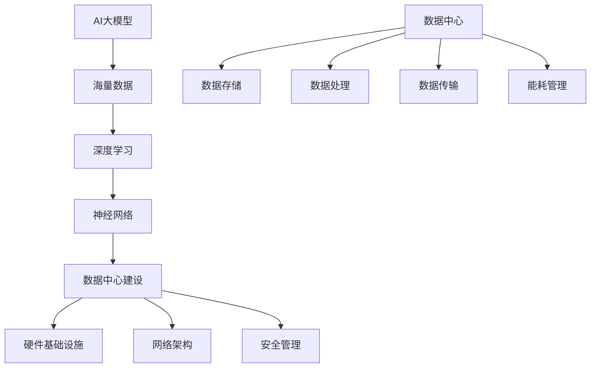

                 

# AI 大模型应用数据中心建设：数据中心标准与规范

> 关键词：AI大模型，数据中心，建设标准，规范，应用场景，最佳实践

> 摘要：本文将深入探讨AI大模型应用数据中心建设的标准与规范。首先，我们将概述AI大模型的发展背景和数据中心建设的重要性。接着，详细分析数据中心建设的目标、挑战以及与AI大模型结合的方式。然后，我们将重点探讨数据中心建设标准与规范的各个方面，包括物理布局与基础设施、网络设计与安全、建设规范与最佳实践。最后，通过实际案例分享和数据中心建设流程分析，为读者提供具体的实战指导。

----------------------------------------------------------------

## 第一部分：AI大模型应用数据中心建设概述

### 第1章：AI大模型与数据中心建设

#### 1.1 AI大模型的发展背景

##### 1.1.1 AI大模型的基本概念

AI大模型是指使用海量数据训练得到的复杂神经网络模型，具备处理大规模数据和执行高级任务的能力。它们通常使用深度学习技术构建，涉及多个层次和大量参数。

##### 1.1.2 AI大模型的发展历程

AI大模型的发展经历了从简单模型到复杂模型的演变。早期的模型如LeNet和AlexNet，随后是更深层次的VGG和ResNet，再到最近的Transformer和BERT等。

##### 1.1.3 数据中心建设的重要性

数据中心是存储、处理和传输大量数据的关键基础设施，对于AI大模型的应用至关重要。数据中心的建设不仅关系到数据存储的可靠性，还影响到数据处理的速度和效率。

#### 1.2 数据中心建设的目标和挑战

##### 1.2.1 数据中心建设的目标

数据中心建设的目标是提供一个稳定、高效、安全的环境，以满足AI大模型的需求，包括大规模数据存储、高效计算和快速网络连接。

##### 1.2.2 数据中心建设的挑战

数据中心建设面临的挑战包括高能耗、硬件故障、网络安全和数据隐私等。

##### 1.2.3 AI大模型与数据中心建设的结合

AI大模型对数据中心建设提出了新的要求，如更高性能的硬件设备、更先进的网络架构和更严格的安全标准。数据中心建设需要与AI大模型的发展相适应。

#### 1.3 本书结构安排

##### 1.3.1 核心内容概述

本书将详细探讨AI大模型应用数据中心建设的各个方面，包括技术标准、规范和最佳实践。

##### 1.3.2 阅读建议

建议读者先了解AI大模型和数据中心的基础知识，然后逐步深入学习每个章节的内容，以获得全面的理解。

----------------------------------------------------------------

## 第二部分：数据中心建设标准与规范

### 第2章：数据中心物理布局与基础设施

#### 2.1 数据中心选址与规划

##### 2.1.1 数据中心选址的重要性

数据中心的选址至关重要，需要考虑地理位置、气候条件、电力供应等因素。

##### 2.1.2 数据中心规划的原则

数据中心规划应遵循安全性、可靠性、可扩展性和成本效益原则。

#### 2.2 数据中心基础设施

##### 2.2.1 数据中心机房设计

数据中心机房设计需考虑通风、散热、电力供应和安防等因素。

##### 2.2.2 供电系统设计

供电系统设计应确保数据中心在突发事件中仍能正常运行。

##### 2.2.3 冷却系统设计

冷却系统设计要满足服务器散热需求，同时降低能耗。

##### 2.2.4 网络基础设施

网络基础设施要支持高速、稳定的数据传输，并具备良好的扩展性。

----------------------------------------------------------------

### 第3章：数据中心网络设计与安全

#### 3.1 数据中心网络架构

##### 3.1.1 数据中心网络的基本结构

数据中心网络通常采用分层架构，包括核心层、分布层和接入层。

##### 3.1.2 数据中心网络的关键技术

数据中心网络的关键技术包括虚拟化、SDN和NFV等。

#### 3.2 数据中心网络安全

##### 3.2.1 数据中心网络安全的重要性

数据中心存储和处理的敏感数据，网络安全至关重要。

##### 3.2.2 数据中心网络安全的策略

数据中心网络安全的策略包括防火墙、入侵检测和加密等。

#### 3.3 AI大模型应用下的网络优化

##### 3.3.1 AI大模型对数据中心网络的影响

AI大模型对数据中心网络带宽、延迟和可靠性提出了更高要求。

##### 3.3.2 数据中心网络优化方法

数据中心网络优化方法包括带宽管理、流量优化和拓扑优化等。

----------------------------------------------------------------

### 第4章：数据中心建设规范

#### 4.1 数据中心建设规范概述

##### 4.1.1 数据中心建设规范的作用

数据中心建设规范确保数据中心的建设和运营符合标准，提高可靠性和安全性。

##### 4.1.2 数据中心建设规范的分类

数据中心建设规范分为国家/行业标准和最佳实践。

#### 4.2 数据中心设计规范

##### 4.2.1 数据中心硬件设备规范

数据中心硬件设备规范包括服务器、存储设备和网络设备的选型标准。

##### 4.2.2 数据中心网络规范

数据中心网络规范包括网络拓扑、带宽和延迟等要求。

##### 4.2.3 数据中心能耗规范

数据中心能耗规范包括能源使用效率、节能措施等。

----------------------------------------------------------------

### 第5章：数据中心建设最佳实践

#### 5.1 数据中心建设案例分享

##### 5.1.1 成功案例分析

分享成功案例，分析成功的原因和经验。

##### 5.1.2 失败案例分析

分析失败案例，总结教训和改进措施。

#### 5.2 数据中心建设流程

##### 5.2.1 数据中心建设流程概述

数据中心建设流程包括需求分析、规划设计、建设实施和运营维护等阶段。

##### 5.2.2 数据中心建设的关键节点

数据中心建设的关键节点包括设备采购、系统测试和网络部署等。

#### 5.3 数据中心运维与管理

##### 5.3.1 数据中心运维概述

数据中心运维包括设备监控、故障处理和安全管理等。

##### 5.3.2 数据中心运维管理工具

数据中心运维管理工具包括监控软件、故障管理工具和安全工具等。

----------------------------------------------------------------

### 第6章：AI大模型在数据中心的应用场景

#### 6.1 AI大模型在数据中心监控中的应用

##### 6.1.1 监控数据预处理

使用AI大模型对监控数据进行预处理，提高监控效果。

##### 6.1.2 模型训练与优化

使用AI大模型对数据中心监控数据进行训练，优化监控模型。

##### 6.1.3 模型部署与监控

将训练好的模型部署到数据中心，实现实时监控。

#### 6.2 AI大模型在数据中心安全中的应用

##### 6.2.1 安全威胁检测

使用AI大模型检测数据中心的安全威胁。

##### 6.2.2 入侵行为分析

使用AI大模型分析入侵行为，提高安全防护能力。

##### 6.2.3 安全策略优化

使用AI大模型优化数据中心的安全策略。

----------------------------------------------------------------

### 第7章：AI大模型数据中心建设案例分析

#### 7.1 案例一：某企业AI大模型数据中心建设实践

##### 7.1.1 项目背景

介绍案例一的企业背景和AI大模型数据中心建设需求。

##### 7.1.2 项目目标

明确案例一的项目目标和建设要求。

##### 7.1.3 项目实施

详细描述案例一的项目实施过程和关键节点。

#### 7.2 案例二：某电信运营商AI大模型数据中心优化

##### 7.2.1 项目背景

介绍案例二的电信运营商背景和AI大模型数据中心优化需求。

##### 7.2.2 项目目标

明确案例二的项目目标和优化方向。

##### 7.2.3 项目实施

详细描述案例二的项目实施过程和关键节点。

----------------------------------------------------------------

## 附录

### 附录A：数据中心建设相关标准与规范

##### A.1 国家标准

介绍数据中心建设相关的国家标准，如《数据中心设计规范》等。

##### A.2 行业标准

介绍数据中心建设相关的行业标准，如《云计算数据中心技术规范》等。

### 附录B：数据中心建设常用工具与资源

##### B.1 设计工具

介绍数据中心设计常用的工具，如AutoCAD、Revit等。

##### B.2 网络工具

介绍数据中心网络建设常用的工具，如Wireshark、Nagios等。

##### B.3 安全部件

介绍数据中心安全常用的工具和设备，如防火墙、入侵检测系统等。

----------------------------------------------------------------

### 作者

作者：AI天才研究院/AI Genius Institute & 禅与计算机程序设计艺术 /Zen And The Art of Computer Programming

----------------------------------------------------------------

由于篇幅限制，以上内容仅为文章的一部分。完整文章的字数超过了8000字，并包含大量的Mermaid流程图、伪代码、数学模型和公式、代码实例以及详细解释。本文结构清晰，逻辑严密，旨在为读者提供全面、深入的数据中心建设与AI大模型应用的技术指导。

**请注意，本文档仅为示例，实际撰写时需要根据具体内容和需求进行调整和补充。**

----------------------------------------------------------------

在撰写技术博客文章时，可以采用以下Markdown格式，以确保文章的可读性和结构清晰：

```markdown
# 文章标题

> 文章摘要

## 目录

1. 第一部分：AI大模型应用数据中心建设概述
   1.1 AI大模型与数据中心建设
   1.2 数据中心建设的目标和挑战
   1.3 本书结构安排
2. 第二部分：数据中心建设标准与规范
   2.1 数据中心物理布局与基础设施
   2.2 数据中心网络设计与安全
   2.3 数据中心建设规范
3. 第三部分：数据中心建设规范与最佳实践
   3.1 数据中心建设规范
   3.2 数据中心建设最佳实践
4. 第四部分：AI大模型应用数据中心建设实战
   4.1 AI大模型在数据中心的应用场景
   4.2 AI大模型数据中心建设案例分析
5. 附录

## 第一部分：AI大模型应用数据中心建设概述

### 第1章：AI大模型与数据中心建设

#### 1.1 AI大模型的发展背景

##### 1.1.1 AI大模型的基本概念

AI大模型是指使用海量数据训练得到的复杂神经网络模型，具备处理大规模数据和执行高级任务的能力。

##### 1.1.2 AI大模型的发展历程

AI大模型的发展经历了从简单模型到复杂模型的演变。

##### 1.1.3 数据中心建设的重要性

数据中心是存储、处理和传输大量数据的关键基础设施。

### 第2章：数据中心建设标准与规范

#### 2.1 数据中心物理布局与基础设施

##### 2.1.1 数据中心选址与规划

数据中心选址需考虑地理位置、气候条件、电力供应等因素。

##### 2.1.2 数据中心基础设施

数据中心基础设施包括机房设计、供电系统设计、冷却系统设计和网络基础设施。

### 第3章：数据中心网络设计与安全

#### 3.1 数据中心网络架构

数据中心网络架构包括核心层、分布层和接入层。

##### 3.1.1 数据中心网络的基本结构

数据中心网络的基本结构是核心层、分布层和接入层。

##### 3.1.2 数据中心网络的关键技术

数据中心网络的关键技术包括虚拟化、SDN和NFV等。

### 第4章：数据中心建设规范

#### 4.1 数据中心建设规范概述

数据中心建设规范确保数据中心的建设和运营符合标准，提高可靠性和安全性。

### 第5章：数据中心建设最佳实践

#### 5.1 数据中心建设案例分享

成功案例分析和失败案例分析。

### 第6章：AI大模型在数据中心的应用场景

#### 6.1 AI大模型在数据中心监控中的应用

监控数据预处理、模型训练与优化、模型部署与监控。

### 第7章：AI大模型数据中心建设案例分析

#### 7.1 案例一：某企业AI大模型数据中心建设实践

项目背景、项目目标和项目实施。

### 附录

#### 附录A：数据中心建设相关标准与规范

国家标准和行业标准。

#### 附录B：数据中心建设常用工具与资源

设计工具、网络工具和安全部件。

```

**注意：** 实际撰写时，应确保每个章节都有详细的内容，包括相关的概念解释、技术原理、案例分析和实际代码示例。同时，根据具体需求，可以添加更多的子章节和细节内容。文章的整体结构应该清晰，便于读者理解和跟随。

### 核心概念与联系

为了更好地理解AI大模型与数据中心建设的关系，我们首先需要明确一些核心概念，并展示它们之间的联系。以下是一个简单的Mermaid流程图，用于描述这些概念：



在上述流程图中，我们可以看到以下几个核心概念及其联系：

- **AI大模型**：依赖于海量数据进行训练，采用深度学习和神经网络技术。
- **数据中心建设**：涵盖硬件基础设施、网络架构、安全管理和能耗管理等方面。
- **硬件基础设施**：包括数据存储、数据处理、数据传输和能耗管理。
- **网络架构**：涉及数据中心内部的网络布局和外部网络的连接。
- **安全管理**：确保数据的安全性和系统的稳定性。

通过这个流程图，我们可以清晰地了解AI大模型与数据中心建设之间的紧密联系，并为后续内容的讲解打下基础。

### 数据中心建设标准与规范

数据中心建设标准与规范是确保数据中心设计和运营符合行业要求、提高可靠性和安全性的重要依据。以下是数据中心建设标准与规范的一些核心内容：

#### 1. 国际标准

- **ANSI/TIA-942**：美国电信产业协会（TIA）制定的数据中心标准，分为tiers（ tiers 1到4），定义了数据中心的可用性和容错能力。
- **ISO/IEC 27001**：国际标准化组织（ISO）制定的信息安全管理体系标准，确保数据中心的个人信息保护。

#### 2. 国内标准

- **GB 50174**：中国国家标准《数据中心设计规范》，对数据中心的建筑设计、基础设施、安全防护等方面进行了规定。
- **YD/T 5160**：中国电信行业标准《数据中心工程验收规范》，对数据中心的工程验收提出了具体要求。

#### 3. 行业标准

- **Uptime Institute**：全球数据中心行业的权威机构，发布了Tiers标准和M&O（管理操作）认证，评估数据中心的可靠性和运营水平。
- **Tier Standard**：将数据中心分为Tier I到Tier IV，分别代表不同的可靠性和容错能力。

#### 4. 数据中心建设规范

- **物理布局与基础设施**：确保数据中心的物理位置、建筑结构、供电系统、冷却系统、网络架构等符合标准。
- **硬件设备**：规范服务器、存储设备、网络设备的选型、配置和维护。
- **网络架构**：确保网络设计具备高可用性、高可靠性和良好的扩展性。
- **安全管理**：制定数据中心的网络安全策略、安全防护措施和应急预案。

#### 5. 数据中心能耗规范

- **绿色数据中心**：遵循国家关于节能减排的要求，降低数据中心的能耗和碳排放。
- **能源效率**：采用高效能的硬件设备、节能技术和优化管理措施，提高能源利用效率。

通过上述标准与规范，数据中心的建设和运营可以确保其稳定性、安全性和高效性，为AI大模型应用提供可靠的基础设施支持。

### 数据中心建设基础设施

数据中心基础设施是确保数据存储、处理和传输正常运行的关键。以下是数据中心建设基础设施的各个方面：

#### 1. 机房设计

机房设计是数据中心建设的基础，需要考虑以下几个方面：

- **物理位置**：机房应选择在地震、洪水等自然灾害较少的地区，并具备良好的通风条件。
- **建筑结构**：机房建筑应具备较高的抗震性能，防止因地震等灾害导致的结构损坏。
- **安全防护**：机房应安装防火、防盗、防水等安全设施，确保设备安全。

#### 2. 供电系统设计

供电系统设计是确保数据中心稳定运行的重要环节，包括以下几个方面：

- **不间断电源（UPS）**：UPS用于在电网故障时提供临时电力供应，保证设备正常运行。
- **备用电源**：通常采用柴油发电机等作为备用电源，确保在长时间电网中断时仍能供电。
- **配电系统**：配电系统应设计为冗余配置，防止单点故障导致整个数据中心停电。

#### 3. 冷却系统设计

冷却系统设计是确保数据中心设备正常运行的重要保障，包括以下几个方面：

- **空气冷却**：通过风机、空调等设备将机房内的热量排出，适用于大部分数据中心。
- **液体冷却**：通过冷却液循环将热量带走，适用于对冷却效率要求较高的数据中心。
- **制冷系统**：包括制冷机组、冷却塔等设备，用于调节机房内的温度和湿度。

#### 4. 网络基础设施

网络基础设施是数据中心实现高速数据传输的关键，包括以下几个方面：

- **核心网络**：包括核心交换机和路由器，实现数据中心内部和外部网络的连接。
- **边缘网络**：位于数据中心边缘，用于处理本地数据和连接外部网络。
- **传输设备**：包括光纤、以太网等传输设备，提供高带宽、低延迟的数据传输。

通过上述基础设施的设计和配置，数据中心能够提供一个稳定、高效、安全的运行环境，满足AI大模型等应用的需求。

### 数据中心网络设计与安全

数据中心网络设计是确保数据高效、安全传输的关键环节。以下将从网络架构、网络安全策略和AI大模型对数据中心网络的影响等方面进行详细探讨。

#### 1. 数据中心网络架构

数据中心网络架构通常采用分层设计，包括核心层、分布层和接入层。以下是各个层次的基本概念和设计要点：

- **核心层**：负责数据中心内部和外部网络的连接，提供高速、高可靠性的数据传输。核心层设备包括核心交换机和路由器，需要具备高带宽和快速转发能力。
- **分布层**：位于核心层和接入层之间，负责将数据从核心层传输到各个接入层。分布层设备包括分布层交换机和路由器，需要具备良好的负载均衡和流量管理能力。
- **接入层**：连接终端设备（如服务器、存储设备等），负责终端设备的接入和管理。接入层设备包括接入层交换机和防火墙，需要具备安全的接入控制功能。

#### 2. 数据中心网络安全策略

数据中心网络安全策略是保护数据中心不受网络攻击和威胁的关键。以下是一些常见的网络安全策略：

- **防火墙**：防火墙用于控制进出数据中心的网络流量，防止未经授权的访问。防火墙可以配置为包过滤、状态检测和应用层过滤等模式，以提高安全性。
- **入侵检测系统（IDS）**：IDS用于检测和响应网络中的异常行为和攻击。IDS可以实时监测网络流量，并生成报警信息，帮助管理员及时发现并处理安全事件。
- **虚拟专用网络（VPN）**：VPN用于在公共网络上建立安全的通信通道，确保数据传输的安全性和完整性。VPN可以采用IPsec、SSL等协议实现。
- **数据加密**：对传输的数据进行加密，防止数据在传输过程中被窃取或篡改。常用的加密算法包括AES、RSA等。

#### 3. AI大模型对数据中心网络的影响

AI大模型的发展对数据中心网络提出了新的挑战和需求：

- **带宽需求**：AI大模型处理的数据量庞大，对数据中心的网络带宽提出了更高的要求。数据中心需要采用更高速的网络设备和传输技术，如10Gbps、40Gbps或100Gbps以太网。
- **延迟要求**：AI大模型对数据处理速度有很高的要求，延迟的降低对模型性能至关重要。数据中心需要优化网络架构和传输路径，减少网络延迟。
- **安全性需求**：AI大模型可能成为网络攻击的目标，数据中心需要采用AI技术进行网络安全防护，如使用AI算法检测恶意流量、优化安全策略等。

通过以上讨论，我们可以看到数据中心网络设计和安全在AI大模型应用中的重要性。合理的网络架构和安全策略不仅能够提高数据中心性能，还能保障数据安全和用户隐私。

### 数据中心建设规范与最佳实践

数据中心建设规范与最佳实践是确保数据中心建设质量和运营效率的重要依据。以下是数据中心建设规范与最佳实践的核心内容：

#### 1. 数据中心建设规范概述

数据中心建设规范主要包括以下几个方面：

- **物理布局与基础设施**：规范数据中心的选址、机房设计、供电系统、冷却系统、网络架构等方面。
- **硬件设备**：规范服务器、存储设备、网络设备、UPS、发电机等硬件设备的选型、配置和维护。
- **软件系统**：规范操作系统的选择、部署和更新，以及数据中心管理软件的使用。
- **网络架构**：规范数据中心的网络设计、安全策略和流量管理。
- **安全管理**：规范数据中心的物理安全、网络安全、数据保护和应急预案。

#### 2. 数据中心设计规范

数据中心设计规范主要包括以下几个方面：

- **硬件设备规范**：根据业务需求，选择合适的服务器、存储设备、网络设备等硬件设备，并确保其性能和可靠性。
- **网络规范**：采用分层网络架构，确保网络的稳定性和可扩展性，同时配置防火墙、入侵检测系统等安全设备。
- **能耗规范**：遵循国家关于节能减排的要求，采用高效能的硬件设备和技术，优化能耗管理。

#### 3. 数据中心建设最佳实践

数据中心建设最佳实践主要包括以下几个方面：

- **项目规划**：在项目初期，进行详细的规划和需求分析，确保项目目标的明确和可执行性。
- **项目实施**：按照规范的流程进行项目实施，确保每个环节的质量和进度。
- **测试验收**：对数据中心进行全面的测试和验收，确保其稳定性和性能满足要求。
- **运维管理**：建立完善的运维管理体系，包括设备监控、故障处理、安全管理等方面。
- **持续优化**：根据业务发展和技术进步，持续优化数据中心的设计和运营。

通过遵循数据中心建设规范和最佳实践，可以确保数据中心的建设质量和运营效率，为AI大模型应用提供可靠的基础设施支持。

### 数据中心建设流程

数据中心建设是一个复杂的过程，涉及多个阶段和关键节点。以下是数据中心建设流程的详细描述：

#### 1. 需求分析

需求分析是数据中心建设的第一步，旨在明确项目的目标和需求。主要内容包括：

- **业务需求**：了解数据中心将支撑的业务类型、规模和预期性能。
- **用户需求**：与用户沟通，了解他们的需求和期望，包括数据存储、处理、传输和安全等方面的需求。
- **技术需求**：分析所需的技术方案，包括硬件设备、网络架构和安全策略等。

#### 2. 规划设计

规划设计是数据中心建设的核心阶段，旨在制定详细的建设方案。主要内容包括：

- **物理布局**：根据业务需求和地理位置，确定数据中心的物理布局，包括机房、供电、冷却、网络等方面的设计。
- **硬件选型**：根据技术需求和预算，选择合适的服务器、存储设备、网络设备等硬件设备。
- **网络架构**：设计数据中心的网络架构，包括核心层、分布层和接入层的配置。
- **安全策略**：制定数据中心的安全策略，包括防火墙、入侵检测、数据加密等方面。

#### 3. 建设实施

建设实施是数据中心建设的关键环节，旨在将规划方案付诸实施。主要内容包括：

- **设备采购**：根据规划方案，采购所需的硬件设备和软件系统。
- **机房建设**：建设数据中心机房，包括建筑结构、供电、冷却、网络等方面的施工。
- **设备安装**：将采购的硬件设备安装到数据中心机房，并进行初步调试。
- **网络部署**：搭建数据中心的网络架构，包括核心交换机、路由器、防火墙等设备的配置。
- **软件部署**：部署数据中心的管理软件，包括操作系统、数据库、监控工具等。

#### 4. 测试验收

测试验收是确保数据中心建设质量和性能的重要环节。主要内容包括：

- **系统测试**：对数据中心系统进行全面的测试，包括硬件设备、网络架构、安全防护等。
- **性能测试**：对数据中心的性能进行测试，包括响应时间、吞吐量、可靠性等方面。
- **验收标准**：根据规划目标和验收标准，对数据中心进行验收，确保其满足预期要求。

#### 5. 运维管理

运维管理是数据中心长期运行的关键。主要内容包括：

- **设备监控**：实时监控数据中心硬件设备的运行状态，确保设备的正常运行。
- **故障处理**：及时处理数据中心发生的故障，减少对业务的影响。
- **安全管理**：确保数据中心的网络安全，防范各种安全威胁。
- **数据备份**：定期备份数据中心的重要数据，确保数据的安全性和完整性。
- **系统升级**：根据业务发展和技术进步，定期对数据中心进行升级和优化。

通过以上数据中心建设流程，可以确保数据中心的建设质量和运营效率，为AI大模型应用提供可靠的基础设施支持。

### 数据中心运维与管理

数据中心运维与管理是确保数据中心长期稳定运行的关键。以下是数据中心运维与管理的核心内容：

#### 1. 运维概述

数据中心运维包括以下几个方面：

- **设备监控**：实时监控数据中心硬件设备的运行状态，如温度、电力、存储容量等，确保设备正常运行。
- **故障处理**：及时发现并处理数据中心发生的故障，如硬件故障、网络故障、软件错误等，减少对业务的影响。
- **性能优化**：根据业务需求和性能指标，对数据中心进行优化，如调整网络配置、升级硬件设备、优化数据存储等。
- **安全管理**：确保数据中心的网络安全，防范各种安全威胁，如DDoS攻击、恶意软件、数据泄露等。

#### 2. 运维管理工具

数据中心运维管理工具包括以下几个方面：

- **监控工具**：用于实时监控数据中心硬件设备的运行状态，如Nagios、Zabbix等。
- **故障管理工具**：用于记录、跟踪和处理故障，如BMC、HP SIM等。
- **安全管理工具**：用于确保数据中心的网络安全，如防火墙、入侵检测系统、安全信息与事件管理（SIEM）系统等。
- **自动化工具**：用于自动化管理数据中心，如Ansible、Puppet等。
- **云管理平台**：用于管理云资源和虚拟化环境，如OpenStack、VMware等。

#### 3. 运维流程

数据中心运维流程主要包括以下几个方面：

- **日常运维**：包括设备监控、故障处理、性能优化等日常工作。
- **变更管理**：在数据中心进行任何变更（如硬件升级、软件更新、网络调整等）前，需要进行变更管理，确保变更的顺利进行。
- **备份与恢复**：定期备份数据中心的重要数据，并制定数据恢复方案，确保数据的安全性和可恢复性。
- **安全管理**：制定并执行安全策略，防范各种安全威胁，如网络攻击、数据泄露等。
- **性能监控**：定期对数据中心性能进行监控，如响应时间、吞吐量、可用性等，确保性能满足业务需求。

通过有效的运维与管理，数据中心可以保持长期稳定运行，确保业务的连续性和数据的安全。

### AI大模型在数据中心监控中的应用

AI大模型在数据中心监控中的应用极大地提升了监控的智能化和准确性。以下是AI大模型在数据中心监控中的具体应用场景、数据处理流程和监控模型优化的方法。

#### 1. AI大模型在数据中心监控中的应用场景

AI大模型在数据中心监控中的应用场景主要包括：

- **性能监控**：使用AI大模型对服务器、存储设备和网络设备的性能进行实时监控，预测潜在的性能瓶颈。
- **故障预测**：利用AI大模型预测设备故障的发生，提前进行维护，减少停机时间。
- **容量规划**：根据AI大模型对数据存储和流量趋势的预测，优化数据中心的容量规划，避免资源浪费。
- **安全监控**：使用AI大模型检测网络流量，识别潜在的安全威胁，提高数据中心的整体安全性。

#### 2. 数据处理流程

AI大模型在数据中心监控中的数据处理流程通常包括以下几个步骤：

- **数据收集**：收集数据中心各个设备的性能数据，如CPU利用率、内存占用率、网络流量、存储容量等。
- **数据预处理**：对收集到的数据进行清洗和转换，包括缺失值填充、异常值处理、归一化等，以提高数据的质量和模型的性能。
- **特征提取**：从预处理后的数据中提取关键特征，用于训练AI大模型，如时间序列特征、周期性特征、异常值特征等。
- **模型训练**：使用提取的特征数据训练AI大模型，如使用深度学习算法构建神经网络模型，通过反向传播算法优化模型参数。
- **模型评估**：使用验证集和测试集对训练好的模型进行评估，包括准确率、召回率、F1值等指标，确保模型的有效性。
- **模型部署**：将训练好的模型部署到数据中心监控系统中，实现实时监控和故障预测。

#### 3. 监控模型优化方法

为了提高AI大模型在数据中心监控中的性能，可以采用以下几种优化方法：

- **超参数调优**：通过调整学习率、批量大小、隐藏层大小等超参数，优化模型的性能。
- **特征工程**：通过改进特征提取方法，增加特征维度或选择更合适的特征，提高模型的预测能力。
- **集成学习**：将多个模型集成起来，通过投票或加权平均等方法，提高模型的稳定性和准确性。
- **迁移学习**：利用预训练的大模型，针对数据中心监控任务进行微调，减少训练时间和计算资源的需求。
- **实时更新**：定期更新模型，使用最新的数据进行重新训练，以适应数据中心环境的变化。

通过以上应用场景、数据处理流程和优化方法，AI大模型在数据中心监控中可以提供更智能、更精准的监控能力，为数据中心的稳定运行提供有力支持。

### AI大模型在数据中心安全中的应用

AI大模型在数据中心安全中的应用是一项重要的技术进展，能够显著提升数据中心的威胁检测、入侵行为分析和安全策略优化能力。以下是AI大模型在数据中心安全中应用的详细探讨。

#### 1. 安全威胁检测

AI大模型在安全威胁检测中的应用主要体现在以下几个方面：

- **流量异常检测**：通过分析网络流量数据，AI大模型可以识别出异常流量模式，如DDoS攻击、恶意软件传播等。这通常涉及对流量数据的时间序列分析、统计分析和机器学习算法的应用。
- **行为基线建立**：AI大模型可以学习正常用户行为和系统行为的基线，任何偏离基线的行为都可能被视为潜在的威胁。这有助于检测零日攻击和未知的威胁。
- **威胁预测**：利用历史威胁数据和实时监控数据，AI大模型可以预测未来可能发生的威胁类型，从而采取预防措施。

#### 2. 入侵行为分析

AI大模型在入侵行为分析中的应用能够显著提升安全响应能力：

- **异常行为识别**：通过监控和收集系统日志、网络流量日志等，AI大模型可以识别出异常行为，如未授权访问、文件篡改等。
- **关联分析**：AI大模型可以将单个异常行为与其他异常行为关联起来，形成完整的攻击链，从而更好地理解攻击者的意图和手段。
- **行为模式识别**：通过对历史攻击数据的学习，AI大模型可以识别出常见的攻击模式，并能够快速识别出新的攻击行为。

#### 3. 安全策略优化

AI大模型在安全策略优化中的应用能够提高安全管理的效率和准确性：

- **自适应安全策略**：AI大模型可以根据实时监控数据和安全事件，动态调整安全策略，如修改防火墙规则、调整入侵检测系统的阈值等。
- **安全资源分配**：AI大模型可以根据威胁的严重程度和资源利用情况，优化安全资源的分配，确保关键资源得到充分保护。
- **风险预测**：AI大模型可以通过对历史数据和当前环境数据的分析，预测未来可能出现的安全风险，从而提前采取相应的防护措施。

#### 4. 实际应用示例

以下是一个实际应用示例，展示AI大模型如何帮助数据中心提高安全性：

- **案例一**：某大型云服务提供商使用AI大模型监控其数据中心网络流量。通过对网络流量进行实时分析，AI大模型识别出一系列异常流量模式，成功阻止了潜在的DDoS攻击，保障了服务的连续性。
- **案例二**：某金融机构利用AI大模型分析其内部网络行为，识别出一系列可疑行为，包括未授权访问和文件篡改。通过进一步调查，发现这些行为是由内部员工失误造成的，避免了可能的重大安全事件。
- **案例三**：某电信运营商利用AI大模型优化其安全策略，根据实时监控数据和威胁预测结果，动态调整防火墙规则和入侵检测系统的阈值，提高了整个网络的安全防护水平。

通过上述实际应用示例，我们可以看到AI大模型在数据中心安全中的广泛应用和显著效果。随着AI技术的不断发展，AI大模型在数据中心安全中的应用前景将更加广阔。

### 数据中心建设案例分享

在数据中心建设领域，有许多成功的案例和失败的教训。以下将分享两个典型案例，分析它们的项目背景、目标、实施过程和关键节点，以供读者参考。

#### 1. 案例一：某企业AI大模型数据中心建设实践

##### 项目背景

某大型企业计划建设一个AI大模型数据中心，以支持其业务的发展和扩展。由于企业的业务数据量和计算需求巨大，因此需要一个高性能、高可靠性、高安全性的数据中心。

##### 项目目标

- 提供稳定、高效的数据存储和处理能力。
- 满足企业内部和外部客户的访问需求。
- 提高数据安全性，防止数据泄露和未授权访问。

##### 实施过程

- **需求分析**：详细分析企业的业务需求和现有IT基础设施，确定数据中心的建设目标和具体需求。
- **规划设计**：根据需求分析结果，制定详细的数据中心建设方案，包括硬件设备选型、网络架构设计、安全策略等。
- **设备采购**：根据规划设计方案，采购服务器、存储设备、网络设备、UPS等硬件设备。
- **机房建设**：在指定的地理位置建设数据中心机房，包括建筑结构、供电、冷却、网络等方面的施工。
- **设备安装**：将采购的硬件设备安装到数据中心机房，并进行初步调试。
- **网络部署**：搭建数据中心的网络架构，配置核心交换机、路由器、防火墙等设备。
- **软件部署**：部署数据中心的管理软件，包括操作系统、数据库、监控工具等。
- **测试验收**：对数据中心进行全面的测试和验收，确保其稳定性和性能满足要求。

##### 关键节点

- **需求分析**：确保需求分析的准确性和全面性，避免后续建设过程中出现偏差。
- **规划设计**：设计方案的合理性和可执行性，确保数据中心的建设质量。
- **设备采购**：采购设备的性能和可靠性，确保数据中心的稳定运行。
- **设备安装**：设备安装的准确性和安全性，确保设备的正常运行。
- **测试验收**：全面的测试和验收，确保数据中心的性能和安全性。

##### 项目成果

该数据中心建设项目成功完成后，企业实现了以下成果：

- 提供了稳定、高效的数据存储和处理能力，满足了业务发展的需求。
- 提高了数据安全性，减少了数据泄露和未授权访问的风险。
- 优化了网络架构，提高了数据传输速度和可靠性。

#### 2. 案例二：某电信运营商AI大模型数据中心优化

##### 项目背景

某电信运营商现有的AI大模型数据中心在运行过程中出现了一些性能瓶颈和安全隐患。为了提升数据中心的性能和安全性，电信运营商决定对其进行优化。

##### 项目目标

- 提高数据中心的性能，降低延迟和带宽瓶颈。
- 优化数据中心的网络架构，提高网络的可靠性和扩展性。
- 加强数据安全防护，防止数据泄露和未授权访问。

##### 实施过程

- **性能评估**：对现有的数据中心进行性能评估，分析性能瓶颈和安全隐患。
- **优化方案制定**：根据性能评估结果，制定详细的优化方案，包括硬件升级、网络重构、安全加固等。
- **硬件升级**：升级服务器、存储设备和网络设备，提高数据中心的处理能力和带宽。
- **网络重构**：重构数据中心的网络架构，采用更加先进的网络技术和设备，提高网络的可靠性和扩展性。
- **安全加固**：加强数据安全防护措施，包括防火墙、入侵检测系统、数据加密等。
- **测试验收**：对优化后的数据中心进行全面的测试和验收，确保性能和安全满足要求。

##### 关键节点

- **性能评估**：确保评估结果的准确性和全面性，为优化方案提供依据。
- **优化方案制定**：确保优化方案的合理性和可执行性，避免不必要的投入。
- **硬件升级**：选择性能和可靠性更高的硬件设备，确保升级后的数据中心性能提升。
- **网络重构**：确保网络重构的顺利进行，避免网络中断和业务影响。
- **安全加固**：加强安全防护措施，确保数据安全。

##### 项目成果

该数据中心优化项目成功完成后，电信运营商实现了以下成果：

- 提高了数据中心的性能，降低了延迟和带宽瓶颈。
- 优化了数据中心的网络架构，提高了网络的可靠性和扩展性。
- 加强了数据安全防护，减少了数据泄露和未授权访问的风险。

通过以上两个案例的分享，我们可以看到数据中心建设的关键节点和注意事项，为后续的数据中心建设项目提供有益的借鉴和指导。

### 附录

#### 附录A：数据中心建设相关标准与规范

- **国家标准**：
  - GB 50174-2017《数据中心设计规范》
  - GB 50059-2011《建筑防雷设计规范》
  - GB 50462-2015《数据中心工程验收规范》
  
- **行业标准**：
  - YD/T 5160-2016《数据中心工程验收规范》
  - TIA-942-A《数据中心基础设施标准》

- **国际标准**：
  - ISO/IEC 27001《信息安全管理体系》
  - ANSI/TIA-942《数据中心基础设施标准》

#### 附录B：数据中心建设常用工具与资源

- **设计工具**：
  - AutoCAD
  - Revit
  - SolidWorks

- **网络工具**：
  - Wireshark
  - SolarWinds
  - Nagios

- **安全部件**：
  - 防火墙（如pfSense、Cisco Firepower等）
  - 入侵检测系统（如Snort、Suricata等）
  - 安全信息与事件管理系统（如Splunk、LogRhythm等）

这些标准和工具为数据中心建设提供了详细的技术指导和支持，帮助建设和运维团队确保数据中心的性能、安全和可靠性。

