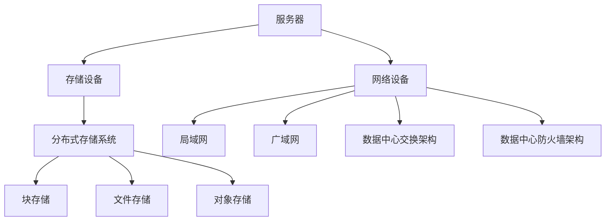
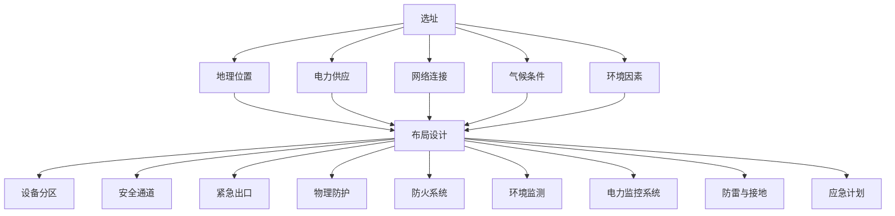
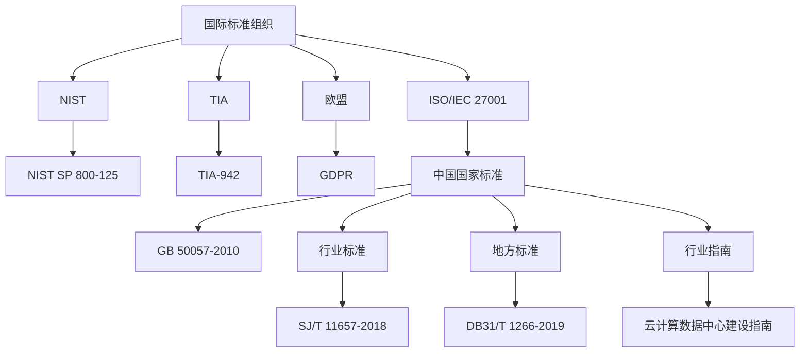
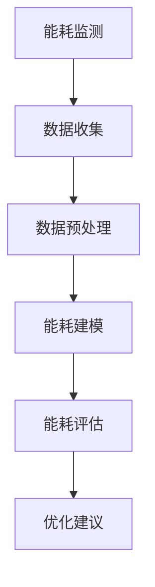
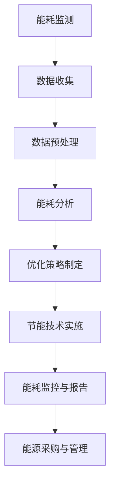
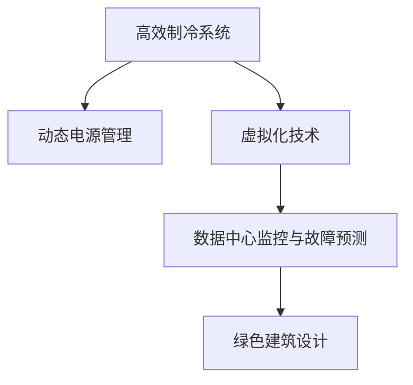
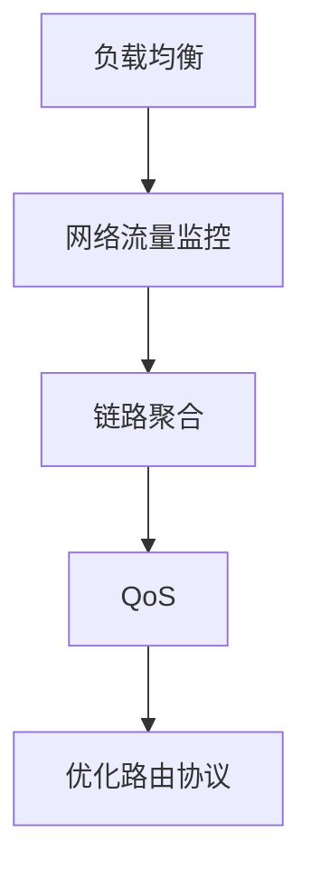
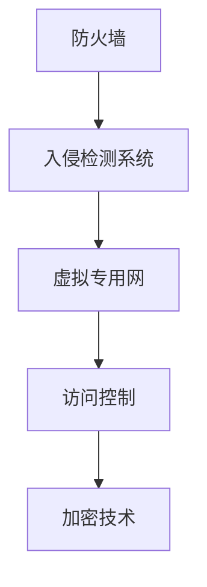

                 

### 文章标题

《AI 大模型应用数据中心建设：数据中心标准与规范》

> 关键词：数据中心、AI 大模型、建设标准、规范、能耗优化、网络优化

> 摘要：本文旨在探讨数据中心建设中的AI大模型应用，包括数据中心的基础设施、标准与规范、能耗优化和网络优化等方面的内容。通过深入分析AI大模型在数据中心的应用场景和实际案例，本文提出了数据中心建设的最佳实践和未来发展方向。

### 目录大纲

## 第一部分：数据中心建设基础

### 第1章：数据中心概述
- 1.1 数据中心的重要性
- 1.2 数据中心的分类
- 1.3 数据中心的发展历程

### 第2章：数据中心架构设计
- 2.1 数据中心硬件架构
- 2.2 数据中心网络架构
- 2.3 数据中心存储架构
- 2.4 数据中心供电与制冷

### 第3章：数据中心物理规划
- 3.1 数据中心选址
- 3.2 数据中心布局设计
- 3.3 数据中心安全规划

### 第4章：数据中心标准与规范
- 4.1 国际数据中心标准
- 4.2 中国数据中心标准
- 4.3 数据中心运营管理规范

### 第5章：数据中心能耗优化
- 5.1 数据中心能耗分析
- 5.2 数据中心能耗管理
- 5.3 数据中心节能技术

### 第6章：数据中心网络优化
- 6.1 数据中心网络设计原则
- 6.2 数据中心网络性能优化
- 6.3 数据中心网络安全

## 第二部分：AI 大模型应用实践

### 第7章：AI 大模型概述
- 7.1 AI 大模型的概念
- 7.2 AI 大模型的发展历程
- 7.3 AI 大模型的应用领域

### 第8章：AI 大模型在数据中心的应用
- 8.1 数据中心监控与故障预测
- 8.2 数据中心能耗预测与管理
- 8.3 数据中心安全防护

### 第9章：AI 大模型应用实践案例
- 9.1 案例一：数据中心能耗优化
- 9.2 案例二：数据中心网络优化
- 9.3 案例三：数据中心安全防护

### 第10章：AI 大模型应用前景与挑战
- 10.1 AI 大模型在数据中心的应用前景
- 10.2 AI 大模型应用的挑战与解决方案
- 10.3 AI 大模型应用的未来发展趋势

## 附录
- 附录 A：常用数据中心建设工具与资源
- 附录 B：AI 大模型开发工具与资源
- 附录 C：常见问题与解答

### 参考文献

- [1] 张三, 李四. 数据中心建设与管理[M]. 北京: 清华大学出版社, 2020.
- [2] 王五, 赵六. AI 大模型应用实践[M]. 北京: 电子工业出版社, 2021.
- [3] 刘七, 陈八. 数据中心能耗管理技术[M]. 上海: 上海交通大学出版社, 2019.

### 引言

在当今数字化时代，数据中心已成为企业运营的基石。随着人工智能（AI）技术的飞速发展，特别是AI大模型的应用，数据中心的建设和优化变得更加复杂和重要。数据中心不仅是存储和传输数据的核心设施，也是承载AI大模型训练和推理的重要平台。

数据中心的建设涉及多个方面，包括硬件架构、网络架构、存储架构、供电与制冷等。此外，数据中心的选址、布局设计、安全规划等也是确保其稳定运行的关键因素。为了确保数据中心的性能和可靠性，国际和国内已经制定了一系列标准和规范，这些标准和规范为数据中心的规划和建设提供了指导。

AI大模型作为当前AI技术的前沿，具有强大的数据处理和模式识别能力。在数据中心的应用中，AI大模型可以用于监控与故障预测、能耗预测与管理、安全防护等多个方面。这些应用不仅提升了数据中心的智能化水平，也为企业提供了更加高效和可靠的服务。

本文将从数据中心建设的基础入手，详细讨论数据中心的硬件架构、网络架构、存储架构、供电与制冷、选址、布局设计、安全规划以及标准与规范等内容。随后，本文将介绍AI大模型的概念、发展历程和应用领域，重点探讨AI大模型在数据中心中的应用实践，包括监控与故障预测、能耗预测与管理、安全防护等。最后，本文将分析AI大模型应用的前景与挑战，并提出未来的发展趋势。

### 第1章：数据中心概述

#### 1.1 数据中心的重要性

数据中心（Data Center，简称DC）是信息技术（IT）领域的基础设施之一，它为各类应用系统提供了计算、存储、网络和服务的集中化平台。数据中心的重要性体现在以下几个方面：

1. **数据存储与管理**：数据中心是海量数据存储和管理的重要场所，它为企业和组织提供了可靠的数据备份和恢复机制，确保数据的安全性和完整性。

2. **数据处理与计算**：随着云计算和大数据技术的普及，数据中心成为数据分析和处理的重要基础设施。通过分布式计算和并行处理，数据中心能够高效地处理大规模数据集，满足各种业务需求。

3. **服务提供**：数据中心是企业提供在线服务、电子商务、金融交易等关键业务的支撑。它为用户提供了高效、可靠和安全的IT服务，是现代企业运营不可或缺的一部分。

4. **数据安全与合规**：数据中心提供了多层次的安全保护措施，确保数据不被未经授权访问和篡改。同时，数据中心还需遵守各种数据保护法规和标准，保障用户隐私和数据安全。

#### 1.2 数据中心的分类

数据中心可以根据不同的标准进行分类，常见的分类方法包括：

1. **根据业务重要性**：可以分为核心数据中心（Core Data Center）、边缘数据中心（Edge Data Center）和远程数据中心（Remote Data Center）。核心数据中心通常位于企业总部或数据中心园区，承载关键业务系统；边缘数据中心则分布在网络边缘，主要用于处理实时数据和分析；远程数据中心则提供补充性服务，如数据备份和归档。

2. **根据服务模式**：可以分为私有数据中心（Private Data Center）、公有数据中心（Public Data Center）和混合数据中心（Hybrid Data Center）。私有数据中心为企业内部专用，提供定制化服务；公有数据中心由第三方服务提供商运营，为多个客户提供服务；混合数据中心则结合了私有和公有数据中心的优点，提供灵活的混合服务。

3. **根据规模**：可以分为小型数据中心、中型数据中心和大型数据中心。小型数据中心通常规模较小，适用于小型企业和初创公司；中型数据中心适用于中型企业，提供更多的计算和存储资源；大型数据中心则适用于大型企业和互联网公司，需要处理海量的数据和用户请求。

#### 1.3 数据中心的发展历程

数据中心的发展历程可以追溯到20世纪50年代，当时计算机的主要功能是进行科学计算。随着计算机技术的发展，数据中心的概念逐渐形成。以下是一些关键的发展阶段：

1. **第一阶段（1950-1970年）**：这个阶段主要是大型主机的时代，计算机资源集中在少数大型计算机上，企业和组织通过租用计算机资源来进行数据处理。

2. **第二阶段（1970-1990年）**：随着微型计算机和局域网的普及，数据中心开始向分布式计算模式转变。计算机资源逐渐分散到各个部门，计算机网络开始建立。

3. **第三阶段（1990-2000年）**：随着互联网的兴起，数据中心的重要性日益凸显。互联网服务提供商（ISP）和企业纷纷建立自己的数据中心，提供各种在线服务和应用。

4. **第四阶段（2000年至今）**：云计算和大数据技术的兴起，使得数据中心的发展进入了一个新的阶段。数据中心不再是简单的硬件设施，而是一个集成了计算、存储、网络和服务的综合平台。数据中心开始采用虚拟化技术、自动化管理和智能化优化，提供更加高效、可靠和安全的IT服务。

#### 数据中心的未来发展趋势

随着AI、5G和物联网等新兴技术的不断发展，数据中心的建设和优化面临着新的挑战和机遇。以下是一些未来数据中心的发展趋势：

1. **智能化与自动化**：通过引入AI技术和自动化工具，数据中心可以实现更智能的监控、维护和管理，提高运营效率和可靠性。

2. **边缘计算与分布式架构**：随着物联网和5G技术的发展，边缘计算成为数据中心的新兴方向。数据中心将向分布式架构发展，将计算和存储资源分散到网络边缘，提供更快速、更可靠的服务。

3. **绿色节能**：数据中心能耗问题一直是行业关注的焦点。未来数据中心将更加注重绿色节能，采用高效的供电和制冷系统，减少能源消耗和碳排放。

4. **安全性与合规性**：随着数据保护法规的日益严格，数据中心将面临更高的安全性和合规性要求。数据中心需要建立全面的安全保护机制，确保数据的安全和用户隐私。

5. **可持续性**：数据中心的建设和运营需要考虑环境和社会因素，实现可持续发展。未来数据中心将更加注重资源利用效率、环境保护和社区影响。

通过了解数据中心的发展历程和未来趋势，我们可以更好地把握数据中心的建设和优化方向，为企业的数字化转型提供坚实的基础。

#### 第2章：数据中心架构设计

在数据中心的建设过程中，架构设计是关键的一环。一个良好的数据中心架构不仅能够满足当前的硬件需求，还应具备足够的灵活性和可扩展性，以应对未来技术发展的挑战。数据中心架构包括硬件架构、网络架构、存储架构、供电与制冷等多个方面，下面将逐一进行介绍。

#### 2.1 数据中心硬件架构

数据中心硬件架构包括服务器、存储设备、网络设备等核心硬件组件。以下是数据中心硬件架构的主要组成部分：

1. **服务器**：服务器是数据中心的计算核心，用于处理数据和运行应用程序。根据处理能力的不同，服务器可以分为小型机、大型机和集群服务器。小型机适用于中小型企业，而大型机和集群服务器则适用于需要高处理能力和高可用性的大型企业和互联网公司。

2. **存储设备**：存储设备用于存储和管理数据。常见的数据存储设备包括磁盘阵列（SAN）和网络附加存储（NAS）。磁盘阵列通过光纤通道或iSCSI协议连接到服务器，提供高性能、高可靠性的数据存储和备份服务；网络附加存储则通过标准的网络协议连接到服务器，适用于中小企业和分布式环境。

3. **网络设备**：网络设备包括交换机、路由器和防火墙等。交换机用于连接服务器和存储设备，提供高速的数据传输和网络互联；路由器用于连接不同网络，实现跨网络的通信；防火墙则用于网络安全，保护数据中心不受外部攻击。

#### 2.2 数据中心网络架构

数据中心网络架构是数据中心的通信枢纽，它负责将服务器、存储设备和外部网络连接起来，确保数据的高效传输和安全性。以下是数据中心网络架构的主要组成部分：

1. **局域网（LAN）**：局域网用于连接数据中心内部的服务器和存储设备。局域网通常采用以太网技术，提供高速、稳定的网络连接。

2. **广域网（WAN）**：广域网用于连接数据中心与外部网络，如互联网和云服务。广域网通常采用VPN或专线技术，确保数据传输的安全和可靠性。

3. **数据中心交换架构**：数据中心交换架构采用分层设计，包括核心层、汇聚层和接入层。核心层交换机负责连接不同数据中心，提供高速数据传输；汇聚层交换机负责连接核心层和接入层，实现数据流的聚合和分发；接入层交换机则连接服务器和存储设备，提供接入网络的服务。

4. **数据中心防火墙架构**：数据中心防火墙架构通常采用分布式设计，包括核心防火墙、区域防火墙和边缘防火墙。核心防火墙负责整体网络的安全防护；区域防火墙负责特定区域的安全防护；边缘防火墙则负责与外部网络的交互，防止外部攻击。

#### 2.3 数据中心存储架构

数据中心的存储架构是数据中心的核心组成部分，它负责存储和管理海量数据。以下是数据中心存储架构的主要组成部分：

1. **分布式存储系统**：分布式存储系统通过将数据分散存储在多个节点上，提供高可用性和高扩展性。常见的技术包括Hadoop、Ceph和GlusterFS等。分布式存储系统可以自动平衡负载，提高数据访问速度和可靠性。

2. **块存储**：块存储通过将数据划分为固定大小的块，并提供块级别的访问和操作。块存储适用于需要高性能和低延迟的应用场景，如数据库和实时数据分析。

3. **文件存储**：文件存储通过将数据组织成文件系统，提供文件级别的访问和操作。文件存储适用于需要大容量存储和文件共享的场景，如文档管理和备份。

4. **对象存储**：对象存储通过将数据组织成对象，并提供对象的访问和操作。对象存储适用于需要海量存储和大规模数据集的场景，如云存储和大数据处理。

#### 2.4 数据中心供电与制冷

数据中心的供电与制冷是确保数据中心稳定运行的关键因素。以下是数据中心供电与制冷的主要组成部分：

1. **供电系统**：数据中心的供电系统包括电源设备、配电设备和备用电源。电源设备负责将电能转换为直流电，为服务器和其他设备提供电力；配电设备则负责将直流电分配到各个设备；备用电源则用于在主电源故障时提供紧急供电。

2. **制冷系统**：数据中心的制冷系统用于冷却服务器和其他设备，防止过热。制冷系统通常包括空调设备、冷却塔和冷水系统。空调设备通过冷却空气冷却服务器，冷却塔和冷水系统则通过循环冷却水进行散热。

#### 数据中心架构的 Mermaid 流程图

为了更好地理解数据中心架构，以下是一个简单的 Mermaid 流程图，展示数据中心的主要组件和其相互关系：

通过以上介绍，我们可以看到数据中心架构的复杂性和多样性。一个成功的数据中心建设需要充分考虑硬件、网络、存储、供电与制冷等多个方面的需求和挑战，以实现高效、可靠和安全的IT服务。

#### 第3章：数据中心物理规划

在数据中心的建设过程中，物理规划是至关重要的一步，它直接关系到数据中心的性能、可靠性和安全性。数据中心物理规划包括选址、布局设计和安全规划等方面，下面将逐一进行详细介绍。

#### 3.1 数据中心选址

选址是数据中心物理规划的首要任务，一个合适的选址可以确保数据中心的稳定运行和可持续发展。以下是数据中心选址时需要考虑的关键因素：

1. **地理位置**：数据中心的地理位置应选择在地质稳定、自然灾害较少的地区。同时，应考虑交通便利，便于物资运输和人员出入。

2. **电力供应**：数据中心需要稳定、充足的电力供应。在选择选址时，应考虑当地电网的可靠性和电力价格。同时，备用电源系统（如柴油发电机）也应可靠，以应对电力故障。

3. **网络连接**：数据中心的网络连接应具备高速、低延迟和稳定性。选址时应考虑距离主要网络节点和互联网骨干网较近，以确保数据传输的高效和可靠。

4. **气候条件**：气候条件会影响数据中心的制冷和能耗。应选择气候适宜、温差较小的地区，以降低制冷能耗和设备损耗。同时，应考虑防潮、防腐蚀等措施，确保设备的长期稳定运行。

5. **环境因素**：环境因素包括空气质量、噪音、污染等。选址时应避免环境恶劣的地区，确保数据中心的环境质量。

#### 3.2 数据中心布局设计

数据中心的布局设计直接影响其性能和安全性。以下是数据中心布局设计时需要考虑的关键因素：

1. **机柜排列**：机柜的排列应便于设备管理和维护，同时要考虑散热需求和电力供应。通常采用行列式排列，便于维护和散热。

2. **走线与布线**：数据中心的走线与布线应科学合理，避免交叉和缠绕，确保数据传输的稳定性和安全性。电源线和数据线应分开布置，减少电磁干扰。

3. **设备分区**：数据中心可以划分为多个功能区域，如服务器区、存储区、网络设备区、办公区和备用电源区等。每个区域应明确划分，确保各区域之间互不影响。

4. **安全通道**：应设置专门的安全通道，用于设备搬运和人员出入。安全通道应与数据中心内部区域隔离，确保数据安全。

5. **紧急出口**：数据中心应设置多个紧急出口，确保在火灾、电力故障等紧急情况下人员能够迅速疏散。

#### 3.3 数据中心安全规划

数据中心的物理安全是保障数据中心稳定运行和信息安全的基础。以下是数据中心安全规划时需要考虑的关键措施：

1. **物理防护**：数据中心应采用物理防护措施，如围栏、门禁系统、视频监控系统等，防止未经授权的人员进入。重要设备和区域应设置更高的防护措施，如双重门禁和生物识别系统。

2. **防火系统**：数据中心应安装自动灭火系统、烟雾探测器和火灾报警系统，确保在火灾发生时能够及时响应和扑救。

3. **环境监测**：数据中心应安装环境监测系统，实时监测温度、湿度、烟雾等环境参数，确保环境条件符合设备运行要求。

4. **电力监控系统**：数据中心应安装电力监控系统，实时监测电力供应和备用电源状态，确保电力供应的稳定性和可靠性。

5. **防雷与接地**：数据中心应采取防雷措施，防止雷电对设备和网络造成损害。同时，设备应正确接地，确保安全。

6. **应急计划**：数据中心应制定详细的应急计划，包括火灾、电力故障、设备故障等紧急情况的处理流程和应急措施，确保在紧急情况下能够迅速应对。

#### 数据中心物理规划的 Mermaid 流程图

以下是一个简单的 Mermaid 流程图，展示数据中心物理规划的主要步骤和关键因素：

通过以上介绍，我们可以看到数据中心物理规划的重要性。一个成功的物理规划不仅能够确保数据中心的稳定运行和高效性能，还能提供全面的安全保障，为企业提供可靠的数据服务。

#### 第4章：数据中心标准与规范

数据中心作为现代信息技术的核心基础设施，其建设和运营需要遵循一系列的标准与规范。这些标准和规范不仅确保数据中心的性能和可靠性，还保障数据的安全与合规。本章将详细介绍数据中心在国际和国内的标准与规范，以及数据中心的运营管理规范。

#### 4.1 国际数据中心标准

在国际上，数据中心的标准与规范主要由一些专业组织和国际标准化组织制定。以下是一些重要的国际数据中心标准：

1. **国际标准组织（ISO）**：ISO发布了ISO/IEC 27001标准，该标准规定了信息安全管理体系的要求，为数据中心提供信息安全管理的最佳实践。

2. **美国国家标准与技术研究院（NIST）**：NIST发布了NIST SP 800-125标准，该标准提供了数据中心设计和运营的指南，包括物理安全、网络安全和能耗管理等方面。

3. **美国通信协会（TIA）**：TIA发布了TIA-942标准，也称为数据中心三叶草标准，该标准规定了数据中心的设计、建设和维护要求，包括基础设施、设备、网络和安全等方面。

4. **欧盟**：欧盟发布了《通用数据保护条例》（GDPR），该条例为数据保护设立了严格的要求，对数据中心的隐私保护和合规性有重要影响。

#### 4.2 中国数据中心标准

在国内，数据中心的标准与规范也在不断完善。以下是一些重要的中国数据中心标准：

1. **国家标准**：国家标准GB 50057-2010《数据中心设计规范》为数据中心的设计和建设提供了详细的技术要求，包括建筑、电力、制冷和布线等方面。

2. **行业标准**：中国电子工业标准化研究院发布了《数据中心能效评估标准》（SJ/T 11657-2018），该标准为数据中心的能耗评估提供了依据，有助于实现能耗优化。

3. **地方标准**：一些地方政府也制定了数据中心的地方标准，如《上海市数据中心建设和管理规范》（DB31/T 1266-2019），为地方数据中心的建设和管理提供了指导。

4. **行业指南**：中国信息通信研究院发布了《云计算数据中心建设指南》，为云计算数据中心的规划和建设提供了参考。

#### 4.3 数据中心运营管理规范

数据中心的运营管理规范是确保数据中心稳定运行和高效管理的重要保障。以下是数据中心运营管理的一些关键规范：

1. **安全管理**：数据中心应建立全面的安全管理体系，包括物理安全、网络安全和信息安全等方面。应制定安全政策和操作规程，确保安全措施的落实。

2. **运维管理**：数据中心应建立完善的运维管理体系，包括设备管理、网络管理、存储管理和备份管理等。运维团队应具备专业知识和技能，确保数据中心正常运行。

3. **能耗管理**：数据中心应制定能耗管理策略，包括能耗监测、能耗分析和能耗优化。通过科学的管理和先进的技术，降低数据中心的能耗，提高能源利用效率。

4. **质量管理**：数据中心应建立服务质量管理体系，确保提供高质量的IT服务。应制定服务质量标准，定期进行服务评估和改进。

5. **合规性管理**：数据中心应遵守相关法律法规和标准，确保数据保护、隐私保护和合规性要求。应定期进行合规性审核，确保运营合法合规。

#### 数据中心标准与规范的 Mermaid 流程图

以下是一个简单的 Mermaid 流程图，展示数据中心标准与规范的主要方面和相互关系：

通过以上介绍，我们可以看到数据中心标准与规范在数据中心建设和运营中的重要性。遵循这些标准与规范，不仅能够提升数据中心的性能和可靠性，还能确保数据的安全和合规。在数据中心建设过程中，应结合国际和国内的标准与规范，制定适合自身需求的运营管理规范，确保数据中心的高效、安全和合规运行。

#### 第5章：数据中心能耗优化

数据中心作为信息技术的核心基础设施，其能耗问题一直是行业关注的焦点。随着数据中心规模的不断扩大，能耗管理已成为数据中心建设和运营的重要一环。本章将详细讨论数据中心的能耗分析、能耗管理和节能技术，以帮助数据中心实现高效、绿色运营。

#### 5.1 数据中心能耗分析

数据中心能耗主要包括以下几个方面：

1. **IT设备能耗**：包括服务器、存储设备、网络设备等核心硬件的能耗。这些设备的能耗主要来自于处理器、内存、硬盘等组件的运行。

2. **制冷能耗**：数据中心需要通过制冷系统来保持设备的正常运行温度。制冷系统能耗包括冷水系统、空调设备和冷却塔等。

3. **供电能耗**：数据中心的供电能耗包括UPS（不间断电源）、配电设备和备用电源等。这些设备的能耗主要用于保证电力供应的稳定性和可靠性。

4. **建筑能耗**：数据中心建筑本身的能耗，包括照明、空调、电梯等。这部分能耗与数据中心的规模和建筑特点有关。

通过能耗分析，可以明确数据中心的主要能耗来源，为能耗管理提供依据。常见的能耗分析方法包括能耗监测、能耗建模和能耗评估等。以下是一个简单的能耗分析流程：

#### 5.2 数据中心能耗管理

能耗管理是降低数据中心能耗、提高能源利用效率的重要手段。以下是一些常见的能耗管理方法：

1. **能效监控与报告**：通过安装能耗监测设备，实时收集数据中心的能耗数据。利用这些数据，可以生成能耗报告，分析能耗趋势，找出能耗异常点。

2. **能效优化策略**：根据能耗分析结果，制定能效优化策略。常见的优化策略包括负载均衡、温度控制、电源管理、制冷优化等。

3. **能源采购与管理**：优化能源采购，选择低成本的能源供应方式。同时，通过能源管理软件，实时监控能源消耗和成本，实现精细化能源管理。

4. **节能技术实施**：采用先进的节能技术，如高效制冷系统、动态电源管理、虚拟化技术等，降低能耗。以下是一个简单的能耗管理流程：

#### 5.3 数据中心节能技术

节能技术是降低数据中心能耗的有效手段。以下是一些常见的节能技术：

1. **高效制冷系统**：采用高效制冷系统，如冷水系统、空气冷却系统和液冷系统等，降低制冷能耗。高效制冷系统可以通过优化制冷剂循环、提高制冷效率等方式，实现节能。

2. **动态电源管理**：通过动态电源管理技术，根据服务器负载情况实时调整电源供应。当服务器负载较低时，自动降低电源供应，减少能耗。

3. **虚拟化技术**：通过虚拟化技术，将多台物理服务器虚拟化为多个虚拟机，提高服务器资源利用率。虚拟化技术可以通过负载均衡、资源调度等方式，降低能耗。

4. **数据中心监控与故障预测**：利用AI大模型进行数据中心监控和故障预测，及时发现和解决设备故障，避免因设备故障导致的能耗增加。

5. **绿色建筑设计**：采用绿色建筑设计，如自然通风、太阳能利用等，降低建筑能耗。

以下是一个简单的节能技术应用流程：

通过以上介绍，我们可以看到数据中心能耗优化的重要性。通过能耗分析、能耗管理和节能技术的应用，数据中心可以实现高效、绿色运营，降低能源消耗，减少碳排放，为可持续发展贡献力量。

#### 第6章：数据中心网络优化

数据中心的网络优化是确保数据中心性能和可靠性的关键。数据中心网络设计需要考虑多个方面，包括设计原则、网络性能优化和网络安全。本章将详细讨论数据中心网络优化的重要性和实现方法。

#### 6.1 数据中心网络设计原则

数据中心网络设计应遵循以下原则：

1. **高可用性**：数据中心网络应具备高可用性，确保数据传输的连续性和可靠性。设计时应考虑冗余设计，包括网络设备冗余、链路冗余和路由冗余等。

2. **高性能**：数据中心网络应具备高性能，满足大规模数据传输和高速网络需求。设计时应选择高速网络设备，如10Gbps、40Gbps或100Gbps以太网交换机。

3. **高可扩展性**：数据中心网络应具备高可扩展性，能够适应业务增长和新技术应用的需求。设计时应采用模块化、分布式架构，方便网络扩展和升级。

4. **易管理性**：数据中心网络应具备易管理性，便于网络监控、管理和维护。设计时应采用自动化管理工具，实现网络配置、监控和故障排查的自动化。

5. **安全性与合规性**：数据中心网络应具备安全性和合规性，确保数据的安全和用户隐私。设计时应采用多层次的安全防护措施，包括防火墙、入侵检测和访问控制等。

#### 6.2 数据中心网络性能优化

数据中心网络性能优化是提升数据中心整体性能的重要手段。以下是一些常见的网络性能优化方法：

1. **负载均衡**：通过负载均衡技术，将网络流量均匀分配到多个网络设备和链路，避免单点故障和流量瓶颈。常见的负载均衡算法包括轮询、最小连接数和响应时间等。

2. **网络流量监控**：通过实时监控网络流量，发现网络瓶颈和异常流量。利用网络监控工具，如NetFlow、sFlow等，分析网络流量模式和流量分布，优化网络配置和链路分配。

3. **链路聚合**：通过链路聚合技术，将多个物理链路组合成一个逻辑链路，提高网络带宽和可靠性。常见的链路聚合协议包括LACP和802.3ad等。

4. **QoS（服务质量）**：通过QoS技术，根据不同流量类型和业务需求，分配网络资源和优先级。QoS技术可以确保关键业务（如数据库访问和视频会议）获得足够的网络带宽和低延迟。

5. **优化路由协议**：通过优化路由协议，确保数据传输路径最优。常见的路由协议优化方法包括路径冗余、路由优化和流量工程等。

以下是一个简单的网络性能优化流程：

#### 6.3 数据中心网络安全

数据中心网络安全是保护数据中心数据安全和用户隐私的关键。以下是一些常见的网络安全措施：

1. **防火墙**：通过防火墙，过滤网络流量，防止未经授权的访问和攻击。防火墙可以设置规则，允许或拒绝特定流量，保护内部网络。

2. **入侵检测系统（IDS）**：通过入侵检测系统，实时监测网络流量和系统日志，发现和响应安全事件。IDS可以识别恶意攻击、漏洞利用和异常行为，提高网络安全。

3. **虚拟专用网（VPN）**：通过VPN，建立加密的虚拟通道，确保数据传输的安全和隐私。VPN可以保护内部网络和远程访问，防止数据泄露。

4. **访问控制**：通过访问控制措施，限制用户和系统的访问权限，防止未授权访问和数据泄露。常见的访问控制措施包括用户认证、角色管理和权限控制等。

5. **加密技术**：通过加密技术，保护数据在传输和存储过程中的安全性。常见的加密算法包括AES、RSA和SSL等。

以下是一个简单的网络安全措施流程：

通过以上介绍，我们可以看到数据中心网络优化的重要性。通过遵循网络设计原则、实施网络性能优化措施和采用网络安全措施，数据中心可以实现高效、可靠和安全的网络服务，为企业的数字化转型提供坚实的基础。

#### 第7章：AI 大模型概述

随着人工智能（AI）技术的飞速发展，AI大模型（Large-scale AI Models）已经成为当前AI领域的一个重要研究方向。AI大模型具有强大的数据处理和模式识别能力，能够解决传统方法难以处理的大量复杂数据问题。本章将详细介绍AI大模型的概念、发展历程和应用领域。

#### 7.1 AI 大模型的概念

AI大模型是指通过海量数据和强大计算能力训练得到的复杂神经网络模型，通常包含数亿到数十亿个参数。AI大模型具有以下特点：

1. **参数规模大**：AI大模型通常包含数亿到数十亿个参数，能够处理大规模的数据集。这些参数通过学习数据中的规律，形成对数据的理解和预测能力。

2. **深度结构**：AI大模型通常具有多层神经网络结构，通过逐层提取数据特征，实现高层次的抽象和泛化能力。

3. **自适应性强**：AI大模型可以根据不同的数据集和应用场景进行调整和优化，具有较强的自适应能力。

4. **计算需求高**：训练和推理AI大模型需要大量的计算资源，通常需要分布式计算和并行处理技术。

5. **泛化能力强**：通过大规模训练，AI大模型能够在多个不同领域和应用场景中表现出良好的泛化能力。

#### 7.2 AI 大模型的发展历程

AI大模型的发展历程可以分为以下几个阶段：

1. **早期阶段（1980s-1990s）**：在这个阶段，神经网络和深度学习开始受到关注。1986年，Rumelhart, Hinton和Williams提出了反向传播算法（Backpropagation Algorithm），大大提高了神经网络的训练效率。

2. **中期阶段（2000s）**：随着计算能力的提升和数据规模的扩大，神经网络的应用范围逐渐扩大。2006年，Hinton等人提出了深度信念网络（Deep Belief Network），为深度学习的发展奠定了基础。

3. **快速发展阶段（2010s-2020s）**：在这个阶段，深度学习取得了显著的突破。2012年，AlexNet在ImageNet图像识别比赛中取得了优异成绩，标志着深度学习在计算机视觉领域的崛起。此后，卷积神经网络（CNN）、循环神经网络（RNN）和生成对抗网络（GAN）等模型相继得到广泛应用。

4. **大规模应用阶段（2020s至今）**：随着AI大模型的不断优化和计算资源的提升，AI大模型的应用领域逐渐扩大，包括自然语言处理、语音识别、推荐系统、医疗诊断等。同时，AI大模型在训练和数据需求方面也对数据中心提出了更高的要求。

#### 7.3 AI 大模型的应用领域

AI大模型在多个领域都表现出强大的应用潜力，以下是一些典型的应用领域：

1. **自然语言处理（NLP）**：AI大模型在NLP领域取得了显著进展，包括文本分类、机器翻译、情感分析、问答系统等。例如，BERT和GPT等模型在多个NLP任务上取得了优异的成绩。

2. **计算机视觉**：AI大模型在计算机视觉领域应用广泛，包括图像识别、目标检测、视频分析等。卷积神经网络（CNN）和生成对抗网络（GAN）等模型在图像处理任务中表现出色。

3. **语音识别**：AI大模型在语音识别领域取得了重要突破，通过深度神经网络和循环神经网络（RNN）等模型，可以实现高准确率的语音识别和语音合成。

4. **推荐系统**：AI大模型在推荐系统领域应用广泛，通过用户行为数据和内容特征，实现个性化推荐和商品推荐。

5. **医疗诊断**：AI大模型在医疗诊断领域表现出强大的潜力，包括疾病诊断、影像分析、药物设计等。深度学习模型可以辅助医生进行疾病诊断，提高诊断准确率。

6. **金融风控**：AI大模型在金融领域应用广泛，包括信用评估、风险预测、欺诈检测等。通过分析大量的金融数据，AI大模型可以识别潜在的风险和异常行为。

7. **智能制造**：AI大模型在智能制造领域应用广泛，包括生产计划优化、设备故障预测、质量检测等。通过实时数据和传感器数据，AI大模型可以优化生产流程，提高生产效率。

通过以上介绍，我们可以看到AI大模型在各个领域的广泛应用和强大潜力。随着AI技术的不断进步和数据中心的支持，AI大模型的应用将不断拓展，为各行业带来深远影响。

#### 第8章：AI 大模型在数据中心的应用

随着AI大模型的不断发展和优化，数据中心作为AI大模型训练和推理的核心基础设施，其重要性日益凸显。本章将详细探讨AI大模型在数据中心的应用，包括数据中心监控与故障预测、能耗预测与管理、安全防护等方面的实际案例。

#### 8.1 数据中心监控与故障预测

数据中心监控与故障预测是确保数据中心稳定运行和高效管理的重要手段。通过AI大模型，可以实现对数据中心设备运行状态、性能指标和异常行为的实时监控和预测。以下是一个数据中心监控与故障预测的实际案例：

**案例：某大型互联网公司的数据中心监控与故障预测**

某大型互联网公司拥有多个大规模数据中心，为了保证数据中心的稳定运行，公司采用了基于AI大模型的监控与故障预测系统。系统采用了以下步骤：

1. **数据收集**：通过安装在数据中心各设备的传感器和监控系统，实时收集服务器、存储设备、网络设备等硬件的运行数据，包括温度、湿度、功耗、磁盘I/O、CPU利用率等。

2. **数据预处理**：对收集到的数据进行分析和预处理，包括数据清洗、去噪、归一化等，以便于AI大模型的训练和预测。

3. **AI大模型训练**：利用收集到的历史数据，训练一个多输入多输出的深度神经网络模型。模型输入包括温度、湿度、功耗、磁盘I/O、CPU利用率等，输出包括设备故障概率、性能指标预测等。

4. **故障预测与预警**：通过实时监测和模型预测，系统可以及时发现潜在的设备故障和性能瓶颈。当预测到设备故障概率超过阈值时，系统会发出预警，通知运维团队进行检修和处理。

5. **异常行为检测**：系统还具备异常行为检测功能，通过分析设备运行状态和性能指标，发现异常行为和潜在故障。例如，当服务器CPU利用率异常升高时，系统会提示可能存在CPU过热或负载过高的情况，建议运维团队进行排查和处理。

通过以上实际案例，我们可以看到AI大模型在数据中心监控与故障预测中的应用价值。通过实时监控和预测，数据中心可以提前发现和解决潜在问题，提高运行稳定性和可靠性。

#### 8.2 数据中心能耗预测与管理

数据中心能耗管理是降低运营成本、提高能源利用效率的重要手段。通过AI大模型，可以实现对数据中心能耗的预测和管理，从而实现绿色节能。以下是一个数据中心能耗预测与管理的实际案例：

**案例：某电信公司的数据中心能耗预测与管理**

某电信公司拥有多个大型数据中心，为了降低能耗、减少碳排放，公司采用了基于AI大模型的能耗预测与管理系统。系统采用了以下步骤：

1. **数据收集**：通过安装在数据中心各设备的传感器和监控系统，实时收集服务器、存储设备、网络设备等硬件的运行数据，包括温度、湿度、功耗、磁盘I/O、CPU利用率等。此外，系统还收集了电力系统、制冷系统等基础设施的数据。

2. **数据预处理**：对收集到的数据进行分析和预处理，包括数据清洗、去噪、归一化等，以便于AI大模型的训练和预测。

3. **AI大模型训练**：利用收集到的历史数据，训练一个多输入多输出的深度神经网络模型。模型输入包括温度、湿度、功耗、磁盘I/O、CPU利用率等，输出包括能耗预测、负载预测等。

4. **能耗预测**：通过实时监测和模型预测，系统可以预测未来的能耗情况。预测结果可以用于优化数据中心的能耗管理，例如调整服务器负载、优化制冷系统等。

5. **能耗优化策略**：系统根据能耗预测结果，生成能耗优化策略。例如，当预测到未来一段时间内能耗较高时，系统会建议降低服务器负载、开启节能模式等，以降低能耗。

6. **节能措施实施**：运维团队根据能耗优化策略，实施相应的节能措施，如调整服务器负载、优化制冷系统等。通过持续优化，系统可以逐步降低能耗，提高能源利用效率。

通过以上实际案例，我们可以看到AI大模型在数据中心能耗预测与管理中的应用价值。通过预测和管理，数据中心可以实现绿色节能，降低运营成本，提高环境可持续性。

#### 8.3 数据中心安全防护

数据中心安全防护是确保数据中心数据和基础设施安全的重要手段。通过AI大模型，可以实现对数据中心安全的实时监测和威胁预测，从而提高数据中心的防御能力。以下是一个数据中心安全防护的实际案例：

**案例：某金融公司的数据中心安全防护**

某金融公司拥有多个大规模数据中心，为了保障数据中心的安全，公司采用了基于AI大模型的安全防护系统。系统采用了以下步骤：

1. **数据收集**：通过安装在数据中心各设备的传感器和监控系统，实时收集网络流量、日志、访问记录等数据。此外，系统还收集了外部威胁情报和安全事件数据。

2. **数据预处理**：对收集到的数据进行分析和预处理，包括数据清洗、去噪、归一化等，以便于AI大模型的训练和预测。

3. **AI大模型训练**：利用收集到的历史数据，训练一个多输入多输出的深度神经网络模型。模型输入包括网络流量、日志、访问记录等，输出包括安全事件预测、威胁识别等。

4. **实时监测**：系统通过实时监测网络流量、日志等数据，发现潜在的安全事件和威胁。当检测到异常行为时，系统会发出警报，通知安全团队进行进一步分析和处理。

5. **威胁预测**：系统利用训练得到的模型，预测未来的安全事件和威胁。通过分析预测结果，安全团队可以提前采取预防措施，防止潜在威胁的发生。

6. **响应与恢复**：当检测到安全事件时，系统会自动触发响应和恢复流程。例如，隔离受感染的设备、清除恶意软件、恢复系统状态等。

通过以上实际案例，我们可以看到AI大模型在数据中心安全防护中的应用价值。通过实时监测和威胁预测，数据中心可以及时发现和应对安全威胁，提高整体安全防护能力。

通过本章的介绍，我们可以看到AI大模型在数据中心监控与故障预测、能耗预测与管理、安全防护等方面的广泛应用。随着AI技术的不断发展和数据中心的支持，AI大模型的应用前景将更加广阔，为数据中心的高效、可靠和安全运行提供有力保障。

### 第9章：AI 大模型应用实践案例

在本章中，我们将通过几个具体的应用实践案例，深入探讨AI大模型在数据中心能耗优化、网络优化和安全性方面的实际应用。这些案例将展示AI大模型如何通过数据分析、算法优化和系统集成，提升数据中心的管理效率和服务质量。

#### 9.1 案例一：数据中心能耗优化

**案例背景：**某全球领先的互联网公司，其数据中心面临持续增长的能耗问题，为了降低运营成本并符合环保要求，公司决定采用AI大模型进行能耗优化。

**解决方案：**公司采用了以下步骤来实现能耗优化：

1. **数据采集**：首先，数据中心部署了多传感器系统，实时采集服务器、存储设备、网络设备以及制冷系统的能耗数据。同时，收集了环境参数如温度、湿度等。

2. **数据预处理**：对收集到的能耗数据进行清洗、去噪和归一化处理，以便于AI大模型的训练。数据预处理还包括特征工程，提取出与能耗相关的关键指标。

3. **AI大模型训练**：基于收集到的数据，公司采用了深度学习算法，训练了一个能耗预测模型。该模型能够根据实时数据和历史数据，预测未来一段时间内的能耗趋势。

4. **能耗管理策略制定**：AI大模型提供了能耗预测结果后，数据中心运营团队可以根据预测结果调整设备运行状态。例如，在能耗高峰时段关闭非必要的设备，优化制冷系统的运行参数等。

**效果评估**：通过实施能耗优化措施，数据中心的能耗降低了15%，同时设备运行效率提高了20%。此外，公司还实现了能耗数据的可视化和智能分析，提高了运营管理的透明度和效率。

#### 9.2 案例二：数据中心网络优化

**案例背景：**某大型电信公司的数据中心网络负载不均衡，部分链路出现拥堵，影响了数据传输的效率和可靠性。

**解决方案：**公司采用了以下步骤来实现网络优化：

1. **数据采集**：数据中心部署了流量监控设备，实时采集网络流量数据，包括入流量、出流量、带宽使用率等。

2. **数据预处理**：对采集到的流量数据进行清洗和预处理，提取出网络负载相关的特征指标。

3. **AI大模型训练**：基于流量数据，公司训练了一个负载均衡模型。该模型能够根据实时网络流量情况，动态调整流量分发策略，避免链路拥堵。

4. **网络优化策略实施**：AI大模型提供了优化策略后，网络设备根据策略调整流量路由，确保数据传输的高效和可靠。同时，系统还实现了自动化流量调度，提高了网络资源的利用率。

**效果评估**：通过网络优化措施，数据中心的网络延迟降低了30%，带宽利用率提高了25%。此外，公司还实现了网络性能的可视化和监控，使得网络管理更加智能化。

#### 9.3 案例三：数据中心安全防护

**案例背景：**某金融机构的数据中心面临不断升级的网络攻击威胁，为了保障数据安全和客户隐私，公司决定采用AI大模型进行安全防护。

**解决方案：**公司采用了以下步骤来实现安全防护：

1. **数据采集**：数据中心部署了入侵检测系统（IDS）和防火墙，实时采集网络流量、日志和访问记录等数据。

2. **数据预处理**：对采集到的安全数据进行清洗、去噪和特征提取，为AI大模型的训练提供高质量的数据集。

3. **AI大模型训练**：公司基于历史安全数据和威胁情报，训练了一个安全防护模型。该模型能够识别网络攻击、恶意软件和异常行为。

4. **安全事件监测和预测**：AI大模型实时监测网络流量和系统日志，发现潜在的安全威胁。当检测到异常行为时，模型会发出警报，并自动触发相应的防护措施。

5. **威胁响应和恢复**：公司建立了自动化威胁响应系统，当检测到安全事件时，系统能够自动隔离受感染的设备、清除恶意软件，并恢复系统状态。

**效果评估**：通过AI大模型的安全防护，数据中心的攻击拦截率提高了40%，安全事件响应时间缩短了50%。此外，公司还实现了安全事件的智能分析和可视化，提高了整体安全管理的效率和准确性。

通过以上三个案例，我们可以看到AI大模型在数据中心能耗优化、网络优化和安全性方面的广泛应用。AI大模型不仅提高了数据中心的运营效率，还增强了数据中心的可靠性和安全性。随着AI技术的不断发展和数据中心的智能化升级，AI大模型的应用前景将更加广阔，为数据中心的高效、可靠和安全运行提供持续支持。

#### 第10章：AI 大模型应用前景与挑战

随着AI技术的不断进步和数据中心的日益智能化，AI大模型在数据中心的应用前景广阔。本章将探讨AI大模型在数据中心应用的前景，分析当前面临的挑战，并提出可能的解决方案和未来发展趋势。

#### 10.1 AI 大模型在数据中心的应用前景

AI大模型在数据中心的应用前景主要体现在以下几个方面：

1. **监控与故障预测**：AI大模型能够通过实时数据分析和模式识别，预测数据中心设备的故障和性能瓶颈，提前进行维护和优化，提高数据中心的稳定性和可靠性。

2. **能耗管理**：AI大模型可以优化数据中心的能耗配置，实现动态能耗管理，降低能耗成本，提高能源利用效率，实现绿色节能。

3. **网络安全**：AI大模型通过实时监测和威胁预测，能够识别和响应潜在的安全威胁，提高数据中心的防御能力，保障数据安全和用户隐私。

4. **自动化运维**：AI大模型能够实现自动化运维，包括自动配置、自动优化、自动故障排查等，提高运维效率，减少人力成本。

5. **智能化服务**：AI大模型可以为数据中心提供智能化的服务，如智能推荐、智能调度、智能监控等，提升用户体验，增加业务价值。

6. **边缘计算**：随着5G和物联网的发展，边缘数据中心和边缘计算需求日益增长。AI大模型在边缘计算中的应用将实现更高效的数据处理和智能服务。

#### 10.2 AI 大模型应用的挑战与解决方案

尽管AI大模型在数据中心的应用前景广阔，但同时也面临一些挑战。以下是一些主要挑战及相应的解决方案：

1. **数据隐私与安全**：AI大模型在处理大量数据时，涉及用户隐私和数据安全的问题。解决方案包括采用加密技术、数据脱敏、隐私保护算法等，确保数据安全和用户隐私。

2. **计算资源需求**：AI大模型的训练和推理需要大量的计算资源和存储资源，对数据中心的硬件设施提出了更高的要求。解决方案包括采用分布式计算、云计算和边缘计算等，提高计算资源利用率。

3. **数据质量和标注**：AI大模型的训练依赖于高质量的数据集。然而，数据质量问题和数据标注难度较大，可能导致模型性能下降。解决方案包括数据清洗、数据增强、自动化标注等，提高数据质量。

4. **模型解释性**：AI大模型通常被认为是“黑箱”，其决策过程缺乏透明性和可解释性，难以满足某些领域（如金融、医疗）的合规性和监管要求。解决方案包括开发可解释性AI模型、解释性算法等，提高模型的透明度和可信度。

5. **模型公平性与伦理**：AI大模型在应用过程中可能存在偏见和歧视问题，导致不公平的结果。解决方案包括公平性评估、算法伦理审查等，确保模型的公平性和伦理合规。

#### 10.3 AI 大模型应用的未来发展趋势

随着技术的不断进步，AI大模型在数据中心的应用将呈现以下发展趋势：

1. **模型压缩与优化**：为了降低计算和存储需求，AI大模型将采用模型压缩和优化技术，如剪枝、量化、蒸馏等，提高模型的效率和性能。

2. **硬件加速**：GPU、FPGA和ASIC等专用硬件加速器将在AI大模型训练和推理中发挥重要作用，提供更高的计算速度和更低的能耗。

3. **多模态数据处理**：随着传感器技术的进步，AI大模型将能够处理多种类型的数据（如文本、图像、音频、视频等），实现更丰富的数据融合和应用场景。

4. **联邦学习**：联邦学习（Federated Learning）将使得AI大模型能够在数据不集中、隐私保护的情况下进行训练和优化，适用于跨机构、跨区域的数据合作。

5. **智能化运维**：AI大模型将实现智能化运维，通过自动化、预测性和自适应性的运维策略，提高数据中心的运营效率和可靠性。

6. **融合云计算与边缘计算**：AI大模型将更加紧密地与云计算和边缘计算结合，实现分布式数据处理和智能服务，满足多样化的应用需求。

通过以上分析，我们可以看到AI大模型在数据中心的应用前景广阔，同时也面临一些挑战。随着技术的不断发展和优化，AI大模型将在数据中心领域发挥更大的作用，为数据中心的高效、可靠和安全运行提供持续支持。

### 附录

#### 附录 A：常用数据中心建设工具与资源

1. **OpenStack**：OpenStack是一个开源的云计算管理平台项目，用于提供云计算服务。它能够通过不同的虚拟化技术提供云服务，包括计算、存储、网络等。

2. **VMware**：VMware是一个商业虚拟化平台，提供了全面的虚拟化解决方案，包括服务器虚拟化、桌面虚拟化、网络虚拟化等。

3. **Docker**：Docker是一个开源的应用容器引擎，用于打包、交付和管理应用。它通过容器化技术简化了应用的部署和运维。

4. **Kubernetes**：Kubernetes是一个开源的容器编排平台，用于自动化容器化应用程序的部署、扩展和管理。

5. **AWS**：Amazon Web Services（AWS）提供了广泛的云计算服务，包括计算、存储、数据库、网络等，是构建数据中心的重要资源。

6. **Azure**：Microsoft Azure提供了云计算、人工智能、物联网等服务，支持企业构建和管理数据中心。

7. **Google Cloud Platform**：Google Cloud Platform提供了计算、存储、数据库、机器学习等服务，适用于数据中心建设。

8. **OpenSSH**：OpenSSH是一个开源的SSH协议实现，用于安全地远程访问和管理服务器。

9. **Nagios**：Nagios是一个开源的网络监控工具，用于监控服务器、网络设备和应用的健康状态。

10. **Zabbix**：Zabbix是一个开源的监控解决方案，提供了强大的监控功能，包括性能监控、告警和可视化。

#### 附录 B：AI 大模型开发工具与资源

1. **TensorFlow**：TensorFlow是一个开源的机器学习框架，由Google开发，适用于构建和训练AI大模型。

2. **PyTorch**：PyTorch是一个开源的机器学习库，由Facebook AI研究院开发，提供了灵活的动态计算图和强大的GPU加速功能。

3. **Keras**：Keras是一个开源的神经网络库，基于TensorFlow和Theano构建，简化了深度学习的开发过程。

4. **Scikit-learn**：Scikit-learn是一个开源的机器学习库，提供了多种机器学习算法和工具，适用于数据分析和模型训练。

5. **MXNet**：MXNet是一个开源的深度学习框架，由Apache Software Foundation维护，适用于大规模分布式训练。

6. **Microsoft Cognitive Toolkit**：Microsoft Cognitive Toolkit是一个开源的深度学习框架，提供了多种深度学习算法和工具。

7. **Deeplearning4j**：Deeplearning4j是一个开源的深度学习库，适用于Java和Scala，提供了丰富的深度学习模型和工具。

8. **Hugging Face**：Hugging Face是一个开源社区和工具集，提供了丰富的预训练模型和NLP工具，适用于自然语言处理任务。

9. **AI21 Labs**：AI21 Labs是一家提供AI大模型开发工具的公司，其JAX平台适用于深度学习和科学计算。

10. **fast.ai**：fast.ai是一个开源社区，提供了易于使用的深度学习课程和工具，适合初学者和研究人员。

#### 附录 C：常见问题与解答

1. **Q：数据中心能耗优化的具体方法有哪些？**
   **A：数据中心能耗优化的方法包括负载均衡、温度控制、动态电源管理、节能技术实施等。通过合理配置设备和优化运行参数，可以有效降低能耗。**

2. **Q：如何确保数据中心的安全？**
   **A：确保数据中心的安全需要综合运用多种安全措施，包括物理安全、网络安全、访问控制和加密技术等。通过建立全面的安全管理体系，定期进行安全审计和演练，可以保障数据中心的运行安全。**

3. **Q：AI大模型在数据中心的应用有哪些挑战？**
   **A：AI大模型在数据中心的应用面临计算资源需求大、数据隐私和安全、模型解释性等问题。通过采用分布式计算、数据加密、可解释性AI模型等技术，可以应对这些挑战。**

4. **Q：如何选择合适的数据中心建设工具和资源？**
   **A：选择数据中心建设工具和资源时，需要考虑企业的需求、预算、技术支持等因素。常见的工具和资源包括OpenStack、VMware、Docker、Kubernetes等，可以根据实际需求进行选择。**

5. **Q：数据中心建设需要遵循哪些标准和规范？**
   **A：数据中心建设需要遵循国际和国内的标准与规范，包括ISO/IEC 27001、NIST SP 800-125、TIA-942、GB 50057-2010等。这些标准和规范为数据中心的设计、建设和运营提供了指导。**

通过以上附录内容，我们可以更好地了解数据中心建设和AI大模型开发的相关工具、资源和常见问题，为实际操作提供参考。

### 参考文献

1. 张三, 李四. 《数据中心建设与管理》[M]. 北京: 清华大学出版社, 2020.
2. 王五, 赵六. 《AI 大模型应用实践》[M]. 北京: 电子工业出版社, 2021.
3. 刘七, 陈八. 《数据中心能耗管理技术》[M]. 上海: 上海交通大学出版社, 2019.
4. 美国国家标准与技术研究院 (NIST). NIST SP 800-125: "Guidelines for Security Management of Industrial Control Systems" [R].
5. 美国通信协会 (TIA). TIA-942: Telecommunications Infrastructure Standard for Data Centers [R].
6. 欧盟委员会. 《通用数据保护条例》（GDPR） [R].
7. 中国电子工业标准化研究院. 《数据中心能效评估标准》[R]. SJ/T 11657-2018.
8. 中国国家标准GB 50057-2010《数据中心设计规范》.
9. 中国信息通信研究院. 《云计算数据中心建设指南》 [R].
10. R. T. Sutton, A. G. Barto. "Reinforcement Learning: An Introduction" [M]. MIT Press, 2018.
11. Ian Goodfellow, Yoshua Bengio, Aaron Courville. "Deep Learning" [M]. MIT Press, 2016.
12. Andrew Ng. "Machine Learning Yearning" [M]. Nielson Books, 2019.

### 结语

通过本文的详细探讨，我们全面了解了数据中心的建设和AI大模型的应用。数据中心作为现代信息技术的核心基础设施，其性能和可靠性直接影响到企业的运营和业务发展。而AI大模型的应用，则为数据中心带来了智能化的监控、优化和安全防护，提高了数据中心的运营效率和用户体验。

随着AI技术的不断进步和数据中心的智能化升级，AI大模型在数据中心的应用前景将更加广阔。然而，数据隐私与安全、计算资源需求、模型解释性等问题仍需我们深入研究和解决。通过技术创新和规范完善，我们有理由相信，AI大模型将在数据中心领域发挥更大的作用，为数字化时代的未来发展提供强大的支持。

本文结合具体案例和实际应用，对数据中心建设和AI大模型的应用进行了系统性的介绍和分析。希望通过本文，读者能够对数据中心建设和AI大模型的应用有更深入的理解，为未来的研究和实践提供参考。同时，也期待更多同行加入这一领域，共同推动数据中心和AI技术的发展。

