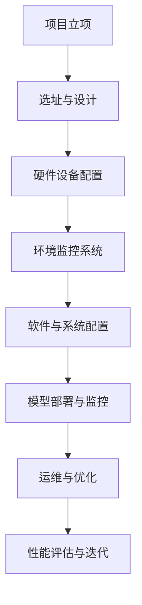
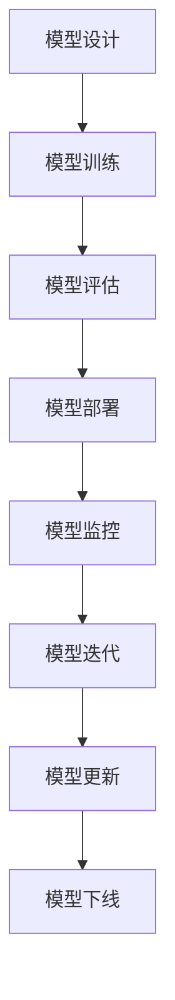

                 

### 文章标题

# AI大模型应用数据中心建设：数据中心运维与管理

### 关键词

- AI大模型
- 数据中心
- 数据中心运维
- 数据中心管理
- 可持续发展

### 摘要

本文深入探讨了AI大模型应用数据中心的建设与运维管理。首先，介绍了AI大模型的基本概念与数据中心的重要性，随后详细分析了数据中心基础设施建设的关键环节。接着，文章讨论了数据中心运维管理的核心要素，包括团队建设、流程管理和性能优化。此外，本文重点讲述了AI大模型数据中心的管理原则，如数据管理、运算资源管理和生命周期管理。最后，通过实战案例和未来发展趋势的分析，为读者呈现了一幅全面而细致的AI大模型数据中心建设与运维全景图。本文旨在为从事AI大模型研究和数据中心运维的专业人士提供有价值的参考和指导。

### 第一部分：背景与基础

#### 第1章：AI大模型与数据中心概述

**1.1 AI大模型简介**

##### 1.1.1 什么是AI大模型

AI大模型（Large-scale AI Models）是指具有数十亿甚至万亿参数量的深度学习模型，这些模型能够在大量数据上进行训练，从而实现高度复杂的任务，如自然语言处理、计算机视觉和机器翻译。这类模型通常基于神经网络架构，能够在海量数据中发现潜在的模式和关系，从而提供更为精确的预测和决策。

##### 1.1.2 AI大模型的特点与应用

AI大模型的特点主要体现在以下几个方面：

- **高参数量**：大模型通常具有数十亿甚至更多的参数，这使得它们能够捕捉到更为复杂的数据特征。
- **深度架构**：大模型通常采用多层的神经网络结构，这使得它们能够有效地处理高维数据。
- **训练时间与资源需求大**：大模型的训练过程需要大量的计算资源和时间，通常需要使用高性能计算集群。
- **泛化能力较强**：经过充分训练后，大模型能够在新的、未见过的数据上表现出良好的泛化能力。

AI大模型在多个领域得到了广泛应用，主要包括：

- **自然语言处理（NLP）**：例如语言模型、机器翻译和文本生成。
- **计算机视觉（CV）**：例如图像分类、目标检测和图像生成。
- **语音识别**：例如语音到文本转换和语音合成。
- **推荐系统**：例如个性化推荐和广告投放。
- **医疗健康**：例如疾病预测、诊断辅助和治疗计划。

**1.2 数据中心概述**

##### 1.2.1 数据中心的作用与分类

数据中心（Data Center）是用于存储、处理和管理大量数据的设施，其作用主要体现在以下几个方面：

- **数据存储**：数据中心提供大规模的数据存储能力，能够存储各种类型的数据，如结构化数据、非结构化数据和实时数据。
- **数据处理**：数据中心配备了高性能的计算资源，能够快速处理和分析大量数据，从而支持各种业务应用。
- **数据管理**：数据中心提供数据备份、恢复和安全管理等功能，确保数据的安全性和可靠性。
- **业务支持**：数据中心作为企业信息系统的核心，为各种业务应用提供稳定、高效的支持。

根据功能和应用场景，数据中心可以分为以下几类：

- **企业级数据中心**：主要用于企业内部的数据存储和处理，为企业的各种业务应用提供支持。
- **云计算数据中心**：提供云计算服务，为用户提供计算资源、存储资源和网络资源。
- **数据中心集群**：由多个数据中心组成，通过高速网络连接，实现数据的共享和计算资源的弹性调度。
- **边缘数据中心**：位于数据生成源附近，主要用于处理实时数据和边缘计算任务。

##### 1.2.2 数据中心的组成与结构

数据中心通常由以下几个关键组成部分构成：

- **服务器**：数据中心的核心计算设备，用于运行各种应用程序和数据处理任务。
- **存储设备**：用于存储各种类型的数据，包括磁盘存储、固态存储和分布式存储系统。
- **网络设备**：包括路由器、交换机和防火墙等，用于实现数据中心内部和外部的数据传输和网络安全。
- **环境控制系统**：包括空调、电力系统和消防系统等，用于保障数据中心的温度、湿度和电力供应。
- **安全系统**：包括门禁系统、视频监控系统和入侵检测系统等，用于保障数据中心的物理安全。
- **管理系统**：包括监控管理系统、配置管理系统和运维管理系统等，用于对数据中心的各种设备和资源进行统一管理。

数据中心的典型结构包括以下几个层次：

- **接入层**：连接用户和数据中心的外部网络，负责用户请求的接入和转发。
- **核心层**：数据中心的核心部分，负责数据的处理、存储和转发，通常包括高性能交换机和路由器。
- **边缘层**：位于数据中心和接入层之间，主要用于处理实时数据和边缘计算任务。
- **存储层**：负责数据存储和管理，包括磁盘存储、固态存储和分布式存储系统。

**1.3 AI大模型数据中心建设的重要性**

##### 1.3.1 数据中心建设的关键挑战

AI大模型数据中心的建设面临以下几个关键挑战：

- **计算资源需求大**：AI大模型训练过程需要大量的计算资源，数据中心需要具备强大的计算能力来支持大规模的模型训练。
- **数据存储与传输需求高**：AI大模型通常涉及大量的数据存储和传输，数据中心需要具备高效的数据存储和传输能力。
- **能源消耗与冷却**：数据中心的高性能计算设备产生的热量较大，需要有效的冷却系统来保障设备的正常运行。
- **网络安全与数据保护**：数据中心需要确保数据的安全性和完整性，防范网络攻击和数据泄露。

##### 1.3.2 AI大模型数据中心的价值

AI大模型数据中心的建设具有重要意义，主要体现在以下几个方面：

- **推动AI技术创新**：强大的计算资源和数据资源为AI技术的研发和应用提供了有力支持，有助于推动AI技术的不断进步。
- **提升业务效率**：通过高效的数据处理和分析，数据中心能够为企业的业务应用提供实时、准确的支持，提升业务运营效率。
- **支撑大规模应用**：AI大模型在多个领域具有广泛的应用前景，数据中心的建设为大规模应用的实现提供了基础保障。
- **降低运营成本**：通过自动化和智能化的运维管理，数据中心能够有效降低运营成本，提高资源利用率。

**1.4 本章小结**

本章介绍了AI大模型与数据中心的概述，包括AI大模型的基本概念、特点与应用，数据中心的作用与分类，以及数据中心的组成与结构。通过本章的学习，读者可以初步了解AI大模型数据中心的建设背景和基础概念，为后续章节的深入讨论打下基础。

#### **第2章：数据中心基础设施建设**

**2.1 数据中心选址与设计**

##### **2.1.1 数据中心选址因素**

数据中心的选址是数据中心建设过程中至关重要的环节，其选址因素主要包括以下几个方面：

1. **地理位置**：选择地理位置时需要考虑地震、洪水、台风等自然灾害的频率和强度，以确保数据中心的物理安全。
2. **供电稳定性**：数据中心需要稳定、可靠的电力供应，通常要求有双路供电或者备用电源系统。
3. **网络连接**：数据中心需要具备良好的网络连接条件，包括宽带接入、光纤网络等，以确保数据传输的高效性和稳定性。
4. **交通条件**：数据中心的交通便利性对于人员进出和设备运输具有重要意义。
5. **成本因素**：选址过程中需要考虑土地成本、人力成本、电力成本等，以实现成本优化。

##### **2.1.2 数据中心设计原则**

数据中心的设计原则主要包括以下几个方面：

1. **可扩展性**：数据中心设计应具备良好的可扩展性，以适应未来业务增长和设备增加的需求。
2. **冗余性**：数据中心设计应具备冗余机制，包括电力、网络、散热等，以确保在设备或系统故障时能够快速切换和恢复。
3. **安全性**：数据中心设计需要考虑物理安全、网络安全和数据安全，包括门禁系统、监控设备、防火墙、加密等。
4. **节能性**：数据中心设计应注重节能和环保，通过优化设备布局、采用高效冷却系统和节能技术来降低能耗。
5. **可靠性**：数据中心设计应确保系统的稳定运行，包括设备选择、系统配置、故障检测和恢复等。

**2.2 硬件设备配置**

##### **2.2.1 服务器配置**

服务器是数据中心的核心计算设备，其配置主要包括以下几个方面：

1. **处理器（CPU）**：选择高性能的CPU，如Intel Xeon系列或AMD EPYC系列，以满足大模型训练和高负载计算的需求。
2. **内存（RAM）**：大模型训练通常需要大量的内存，建议配置128GB及以上内存。
3. **存储（Disk）**：选择高速固态硬盘（SSD）作为系统盘，并使用分布式存储系统（如HDFS）进行数据存储，以提高数据访问速度。
4. **网络接口**：配置多网口服务器，以实现多路径网络连接，提高网络访问的稳定性和可靠性。
5. **扩展性**：考虑服务器的扩展性，以便在未来增加计算资源。

##### **2.2.2 存储设备配置**

存储设备是数据中心的重要组成部分，其配置主要包括以下几个方面：

1. **磁盘类型**：选择SSD和HDD混合使用，SSD用于系统盘和数据缓存，HDD用于大规模数据存储。
2. **存储容量**：根据业务需求选择合适的存储容量，建议配置至少数百TB的存储空间。
3. **存储协议**：选择高吞吐量的存储协议，如NVMe或SAS，以提高数据传输速度。
4. **数据冗余**：采用RAID技术实现数据冗余，以提高数据的可靠性和可用性。
5. **分布式存储**：使用分布式存储系统（如HDFS、Ceph），以实现数据的高效存储和管理。

##### **2.2.3 网络设备配置**

网络设备是数据中心的数据传输通道，其配置主要包括以下几个方面：

1. **交换机**：选择高性能交换机，如华为的S6700或思科的Catalyst 9000系列，以提供高带宽和低延迟的网络连接。
2. **路由器**：配置多网口路由器，实现数据中心与外部网络的连接。
3. **防火墙**：部署高安全性的防火墙，如深信服的NGAF或思科的ASA系列，以保护数据中心的安全。
4. **负载均衡**：配置负载均衡设备，如F5的BIG-IP或Nginx，以实现流量的均衡分发。
5. **无线网络**：根据需要部署无线网络设备，如AP（无线接入点）和无线控制器，以提供无线接入能力。

**2.3 环境监控系统**

##### **2.3.1 温度与湿度控制**

数据中心的温度与湿度控制是保障设备正常运行的重要环节，其控制要求包括：

1. **温度控制**：数据中心的温度应保持在15℃至25℃之间，避免过高或过低的温度影响设备性能。
2. **湿度控制**：数据中心的湿度应保持在40%至60%之间，避免过高或过低的湿度导致设备腐蚀或产生静电。
3. **冷却系统**：配置高效冷却系统，如空调、制冷机组和排风扇，以保持数据中心的温度和湿度在合理范围内。

##### **2.3.2 电源与电池系统**

数据中心的电源与电池系统是保障持续供电的关键，其配置要求包括：

1. **UPS（不间断电源）**：配置UPS系统，以在市电故障时提供持续供电，保障数据中心的正常运行。
2. **电池组**：配置高质量的电池组，如铅酸电池、锂电池等，以确保UPS系统的可靠性。
3. **备用发电机组**：配置备用发电机组，如柴油发电机或天然气发电机组，以在UPS系统失效时提供紧急供电。

##### **2.3.3 安全监控系统**

数据中心的物理安全是保障数据安全的基础，其安全监控系统配置要求包括：

1. **视频监控系统**：部署高清摄像头，实现对数据中心内部和周边环境的实时监控，支持录像和远程访问。
2. **入侵检测系统**：配置入侵检测设备，如入侵报警器、门磁感应器等，及时发现非法入侵行为。
3. **门禁系统**：配置门禁系统，如指纹识别、人脸识别等，限制非法人员进入数据中心。
4. **消防系统**：部署自动喷水灭火系统、气体灭火系统和消防报警系统，确保在火灾发生时能够及时灭火。

**2.4 本章小结**

本章介绍了数据中心基础设施建设的关键环节，包括选址与设计、硬件设备配置和环境监控系统。通过合理选址和精心设计，数据中心能够满足高性能计算和大数据处理的需求；通过配置高性能的硬件设备和完善的监控系统，数据中心能够保障设备的正常运行和数据的完整性。本章内容为数据中心的建设提供了理论指导和实践参考，为后续章节的深入讨论奠定了基础。

#### **第3章：数据中心运维管理**

**3.1 数据中心运维团队建设**

数据中心运维管理的关键在于团队的构建与能力的提升。一个高效的运维团队需要具备以下要素：

##### **3.1.1 运维团队组织结构**

运维团队的组织结构可以根据企业的规模和业务需求进行调整，但通常包括以下几个核心部分：

1. **运维经理**：负责整个运维团队的日常管理、战略规划和资源调配。
2. **系统管理员**：负责服务器、存储和网络设备的配置、监控和维护。
3. **网络管理员**：负责网络设备的配置、监控、故障处理和网络安全。
4. **数据库管理员**：负责数据库的安装、配置、性能优化和数据备份。
5. **开发运维工程师**：负责自动化工具的开发和应用，实现运维流程的自动化。
6. **安全专家**：负责数据中心的安全策略制定、安全监控和安全事件响应。

##### **3.1.2 运维人员能力要求**

运维人员的能力要求包括以下几个方面：

1. **技术能力**：运维人员需要具备扎实的计算机科学和网络安全知识，能够熟练操作各种运维工具和系统。
2. **沟通能力**：运维人员需要具备良好的沟通和协调能力，能够与开发团队、业务团队和外部供应商进行有效沟通。
3. **问题解决能力**：运维人员需要具备快速定位和解决问题的能力，能够在面对突发问题时迅速做出反应。
4. **持续学习**：运维领域技术更新迅速，运维人员需要具备持续学习的能力，不断更新自己的知识体系。

**3.2 运维流程管理**

##### **3.2.1 运维工作流程**

高效的运维工作流程是保障数据中心稳定运行的关键。一个典型的运维工作流程包括以下几个环节：

1. **需求收集**：运维团队需要与业务团队紧密合作，了解业务需求和系统功能变更。
2. **需求分析**：根据业务需求，分析系统变更可能带来的影响，制定相应的变更方案。
3. **变更实施**：按照变更方案实施系统变更，包括配置修改、代码部署等。
4. **测试验证**：在变更实施后进行功能测试和性能测试，确保系统正常运行。
5. **发布上线**：在测试通过后，将变更发布上线，并进行监控和验证。
6. **问题跟踪**：在变更上线后，持续监控系统的运行状态，及时响应和处理问题。

##### **3.2.2 故障处理流程**

数据中心故障处理流程包括以下几个关键步骤：

1. **故障发现**：通过监控系统及时发现系统故障，包括服务器宕机、网络中断、数据库异常等。
2. **故障定位**：通过日志分析、网络抓包等技术手段，快速定位故障原因。
3. **故障处理**：根据故障原因，采取相应的处理措施，包括重启服务器、修复网络故障、重置数据库等。
4. **故障恢复**：在处理故障后，对系统进行验证，确保故障已完全解决。
5. **故障总结**：对故障处理过程进行总结，分析故障原因，提出改进措施，以避免类似故障的再次发生。

**3.3 数据中心监控与性能优化**

##### **3.3.1 监控系统搭建**

数据中心监控系统的搭建是保障系统稳定运行的重要手段。一个完善的监控系统通常包括以下几个方面：

1. **服务器监控**：监控服务器的CPU使用率、内存使用率、磁盘使用率等关键性能指标，及时发现资源瓶颈。
2. **网络监控**：监控网络流量、带宽利用率、网络延迟等指标，确保网络稳定可靠。
3. **数据库监控**：监控数据库的连接数、查询响应时间、数据备份状态等指标，保障数据库的稳定运行。
4. **应用监控**：监控业务应用的性能指标，如交易成功率、页面加载时间等，确保业务应用的高效运行。
5. **日志分析**：收集和分析系统日志，及时发现潜在问题和安全威胁。

##### **3.3.2 性能优化策略**

数据中心性能优化是提升系统运行效率的关键。以下是一些常见的性能优化策略：

1. **资源调整**：根据系统负载情况，动态调整服务器、存储和网络资源，确保资源充分利用。
2. **缓存策略**：采用缓存技术（如Redis、Memcached），减少数据库查询次数，提高数据访问速度。
3. **负载均衡**：使用负载均衡器（如Nginx、F5 BIG-IP），实现流量的均衡分发，避免单点故障。
4. **数据库优化**：通过索引优化、查询优化、分区优化等手段，提高数据库查询效率。
5. **系统调优**：针对操作系统（如Linux）进行调优，优化系统参数，提高系统性能。

**3.4 本章小结**

本章详细介绍了数据中心运维管理的核心内容，包括运维团队建设、运维流程管理和数据中心监控与性能优化。通过合理的团队构建和高效的运维流程，数据中心能够保障系统的稳定运行和业务的高效支持。同时，通过监控系统和性能优化策略的应用，数据中心能够进一步提升系统的运行效率和可靠性。本章内容为数据中心运维提供了实用的指导和方法，为实际运维工作提供了有力支持。

#### **第4章：AI大模型数据中心管理原则**

**4.1 AI大模型数据中心管理策略**

AI大模型数据中心的管理策略涵盖了数据管理、运算资源管理和生命周期管理三个方面，这些策略旨在确保数据中心的高效运行和模型性能的持续提升。

##### **4.1.1 数据管理策略**

数据管理策略是AI大模型数据中心管理的核心，其目标包括数据完整性、一致性和可用性。以下是一些关键的数据管理策略：

1. **数据备份与恢复**：定期对数据进行备份，确保在数据丢失或损坏时能够快速恢复。采用分布式备份策略，提高备份效率和数据安全性。
2. **数据存储优化**：根据数据的重要性和访问频率，选择适当的存储方案，如HDFS、SSD、云存储等。对于热数据和冷数据采用不同的存储策略，以优化存储成本。
3. **数据访问控制**：通过身份认证、权限管理和访问日志记录等手段，确保数据的安全访问和操作。特别是在处理敏感数据时，需要实施严格的访问控制策略。
4. **数据质量管理**：定期对数据质量进行检查和优化，确保数据的准确性和一致性。包括数据清洗、去重和标准化等操作，以提高数据的价值和可靠性。

##### **4.1.2 运算资源管理策略**

运算资源管理策略主要关注如何高效利用数据中心的计算资源，以满足AI大模型训练和推理的需求。以下是一些关键策略：

1. **资源分配**：根据模型训练和推理的任务需求，动态分配计算资源。采用基于负载均衡的分配策略，确保资源的高效利用。
2. **资源调度**：利用调度算法（如作业调度算法、资源预留算法）优化资源的分配和调度，提高系统的吞吐量和响应时间。
3. **资源监控**：通过实时监控计算资源的使用情况，及时发现资源瓶颈和异常情况。采用预警机制，提前预测资源需求，避免资源短缺或浪费。
4. **资源弹性伸缩**：根据业务需求的变化，灵活调整计算资源的规模。在高峰期自动扩展资源，在低峰期缩减资源，以实现成本优化。

##### **4.1.3 生命周期管理策略**

AI大模型的生命周期管理策略涵盖了从模型设计到部署、监控和迭代的整个过程，其目标包括模型的可维护性、可扩展性和高效性。以下是一些关键的生命周期管理策略：

1. **模型设计**：在模型设计阶段，需要充分考虑模型的规模、复杂性和训练时间。采用模块化设计，确保模型的可维护性和可扩展性。
2. **模型训练**：在模型训练阶段，需要选择合适的训练数据和训练算法。采用分布式训练策略，提高训练效率和模型性能。
3. **模型评估**：在模型评估阶段，通过性能指标（如准确率、召回率、F1分数）评估模型的效果。采用交叉验证、A/B测试等方法，确保模型的可靠性和稳定性。
4. **模型部署**：在模型部署阶段，将训练好的模型部署到生产环境中。采用容器化、微服务架构等技术，提高模型的部署效率和可扩展性。
5. **模型监控**：在模型部署后，需要持续监控模型的运行状态和性能指标。采用自动化监控工具，及时发现和解决模型运行中的问题。
6. **模型迭代**：根据监控结果和用户反馈，对模型进行优化和迭代。采用持续集成和持续交付（CI/CD）流程，实现模型的快速迭代和更新。

**4.2 数据中心安全管理**

数据中心的安全管理是保障AI大模型数据中心稳定运行的基础，其主要包括数据安全策略、网络安全策略和物理安全策略。

##### **4.2.1 数据安全策略**

数据安全策略旨在保护数据在存储、传输和处理过程中的完整性和保密性。以下是一些关键的数据安全策略：

1. **数据加密**：采用数据加密技术（如AES、RSA），对数据进行加密存储和传输，确保数据在未经授权的情况下无法被访问。
2. **访问控制**：通过身份认证、权限管理和访问日志记录等手段，严格控制对数据的访问。特别是对敏感数据，需要实施严格的访问控制策略。
3. **数据备份与恢复**：定期对数据进行备份，确保在数据丢失或损坏时能够快速恢复。采用分布式备份策略，提高备份效率和数据安全性。
4. **安全审计**：定期进行安全审计，检查数据安全策略的执行情况和数据保护措施的落实情况。及时发现和解决安全漏洞和风险。

##### **4.2.2 网络安全策略**

网络安全策略旨在保护数据中心网络免受各种网络攻击和威胁。以下是一些关键的网络安全策略：

1. **防火墙与入侵检测**：部署防火墙和入侵检测系统（IDS），对网络流量进行监控和分析，阻止恶意攻击和非法访问。
2. **VPN与加密**：使用VPN和加密技术（如TLS），确保远程访问和数据传输的安全性。
3. **网络隔离与分区**：采用网络隔离和分区策略，将不同业务系统的网络隔离开来，降低攻击范围和影响。
4. **安全补丁管理**：定期更新和安装操作系统和应用程序的安全补丁，确保系统的安全性和稳定性。

##### **4.2.3 物理安全策略**

物理安全策略旨在保护数据中心设备、数据和环境的物理安全。以下是一些关键的物理安全策略：

1. **门禁系统**：部署门禁系统（如生物识别、指纹识别），限制非法人员进入数据中心。
2. **视频监控**：安装高清摄像头，实现数据中心内部和周边环境的实时监控，确保数据中心的可视化管理。
3. **入侵检测**：部署入侵检测设备（如入侵报警器、门磁感应器），及时发现非法入侵行为。
4. **消防系统**：部署自动喷水灭火系统、气体灭火系统和消防报警系统，确保在火灾发生时能够及时灭火。

**4.3 AI大模型生命周期管理**

AI大模型的生命周期管理是确保模型在数据中心高效运行和持续改进的关键。其主要包括模型部署与监控、模型更新与迭代两个方面。

##### **4.3.1 模型部署与监控**

模型部署与监控是AI大模型数据中心管理的重要环节，以下是一些关键步骤：

1. **模型部署**：将训练好的模型部署到生产环境中，采用容器化、微服务架构等技术，提高模型的部署效率和可扩展性。
2. **性能监控**：实时监控模型的运行状态和性能指标，如预测准确率、响应时间、资源利用率等，确保模型的高效运行。
3. **日志记录**：记录模型运行过程中的日志信息，包括输入数据、预测结果、错误日志等，用于问题排查和性能优化。
4. **健康检查**：定期对模型进行健康检查，确保模型的稳定性和可靠性。

##### **4.3.2 模型更新与迭代**

模型更新与迭代是AI大模型持续改进的关键，以下是一些关键步骤：

1. **性能评估**：根据模型监控结果和用户反馈，评估模型的效果和性能，找出需要改进的地方。
2. **数据采集**：收集新的数据，包括用户反馈数据、错误案例数据等，用于模型优化。
3. **模型优化**：对模型进行优化，包括参数调整、架构改进等，以提高模型的性能和效果。
4. **迭代发布**：将优化后的模型部署到生产环境中，进行迭代发布，确保模型的持续改进和业务应用的价值。

**4.4 本章小结**

本章详细介绍了AI大模型数据中心管理的核心原则，包括数据管理策略、运算资源管理策略和生命周期管理策略。同时，还讨论了数据中心的安全管理，包括数据安全策略、网络安全策略和物理安全策略。通过合理的管理策略和安全措施，AI大模型数据中心能够确保数据的安全、模型的稳定运行和业务的高效支持。本章内容为AI大模型数据中心的管理提供了实用的指导和方法，为实际运维工作提供了有力支持。

#### **第5章：AI大模型数据中心建设实战**

**5.1 实战案例一：数据中心建设与部署**

##### **5.1.1 案例背景**

某知名互联网公司计划构建一个用于AI大模型训练和推理的数据中心，以支持其人工智能研究和业务应用。该数据中心需具备高计算能力、高存储容量和高效的数据传输能力，同时需要考虑能源效率和环保要求。

##### **5.1.2 建设过程与部署方案**

1. **选址与设计**：

   - 地理位置选择在气候条件适宜、交通便利、供电稳定的地区。
   - 数据中心设计遵循可扩展性、冗余性和安全性的原则，包括机房设计、电力系统设计、冷却系统设计等。

2. **硬件设备配置**：

   - 服务器配置：采用高性能CPU（如Intel Xeon系列）、大容量内存（如512GB）、高速SSD和分布式存储系统（如HDFS）。
   - 存储设备配置：配置大容量硬盘存储（如100PB）和高速固态硬盘（如NVMe）。
   - 网络设备配置：采用高带宽、低延迟的网络设备，配置多路径网络连接，确保数据传输的高效性和稳定性。

3. **环境监控系统**：

   - 配置温度和湿度监控设备，确保数据中心的温度和湿度在合理范围内。
   - 配置UPS系统和备用发电机组，确保电力供应的稳定性和持续性。
   - 部署视频监控系统和入侵检测系统，保障数据中心的物理安全。

4. **软件与系统配置**：

   - 部署操作系统（如Linux）和服务器管理软件，配置自动化运维工具（如Ansible、Puppet）。
   - 部署分布式存储系统（如HDFS）和大数据处理平台（如Apache Spark）。
   - 配置容器化平台（如Docker和Kubernetes），实现模型的快速部署和弹性扩展。

5. **模型部署与监控**：

   - 将训练好的AI大模型部署到容器化环境中，实现模型的快速部署和动态扩展。
   - 使用监控工具（如Prometheus、Grafana）实时监控模型性能和资源使用情况。

##### **5.1.3 实施效果**

该数据中心的建设与部署完成后，实现了以下效果：

- 提供了强大的计算能力和存储容量，支持大规模AI大模型训练和推理。
- 优化了数据传输速度和效率，提升了数据处理能力。
- 通过自动化运维工具，降低了运维成本，提高了运维效率。
- 实现了数据中心的节能和环保，降低了能耗和碳排放。

**5.2 实战案例二：数据中心运维与优化**

##### **5.2.1 案例背景**

某大型互联网公司的数据中心在运营过程中遇到了一系列性能瓶颈和故障问题，如服务器宕机、网络中断、存储性能低下等。公司决定对数据中心进行运维优化，提升系统稳定性和运行效率。

##### **5.2.2 运维流程与优化策略**

1. **运维流程优化**：

   - 制定标准化运维流程，包括服务器管理、网络管理、存储管理和安全管理。
   - 实施运维自动化，使用Ansible、Puppet等工具进行配置管理和自动化部署。
   - 引入持续集成和持续交付（CI/CD）流程，提升软件开发和部署的效率。

2. **性能优化策略**：

   - 服务器优化：升级服务器硬件，增加CPU核心数和内存容量，优化系统参数。
   - 网络优化：增加网络带宽，优化网络拓扑结构，使用负载均衡技术实现流量均衡。
   - 存储优化：使用SSD和HDD混合存储方案，优化存储性能，采用分布式存储系统提高数据访问速度。
   - 数据库优化：进行数据库性能分析，优化索引、查询和分区策略，提升数据库查询效率。

3. **故障处理与监控**：

   - 实施实时监控，使用Prometheus、Grafana等工具监控服务器、网络、存储和数据库性能。
   - 制定故障处理流程，快速定位故障原因，采取有效的处理措施，确保系统尽快恢复正常。
   - 定期进行系统检查和性能测试，及时发现和解决潜在问题。

##### **5.2.3 实施效果**

通过数据中心运维优化，实现了以下效果：

- 服务器和存储性能显著提升，数据处理能力大幅提高。
- 网络稳定性增强，故障率降低。
- 运维自动化程度提高，运维成本降低，运维效率提升。
- 通过实时监控和故障处理流程，确保了系统的稳定运行和业务连续性。

**5.3 实战案例三：AI大模型生命周期管理**

##### **5.3.1 案例背景**

某人工智能初创公司致力于开发高质量的AI大模型，用于自然语言处理和计算机视觉领域。公司需要建立一套完善的生命周期管理策略，确保模型从设计到部署的全过程高效、可控。

##### **5.3.2 管理策略与实现步骤**

1. **模型设计**：

   - 采用模块化设计，确保模型的可维护性和可扩展性。
   - 使用数据增强和迁移学习技术，提高模型的效果和泛化能力。

2. **模型训练**：

   - 采用分布式训练策略，利用数据中心的高性能计算资源加快训练速度。
   - 使用日志记录和分析工具，监控训练过程中的性能和资源使用情况。

3. **模型评估**：

   - 通过交叉验证和A/B测试，评估模型的效果和稳定性。
   - 收集用户反馈，不断优化模型。

4. **模型部署**：

   - 采用容器化技术，实现模型的快速部署和动态扩展。
   - 使用负载均衡器，确保模型服务的稳定性和高效性。

5. **模型监控**：

   - 实时监控模型的运行状态和性能指标，及时发现和解决异常情况。
   - 定期更新模型，确保其与业务需求的匹配度。

6. **模型迭代**：

   - 根据监控结果和用户反馈，对模型进行优化和迭代。
   - 实施持续集成和持续交付（CI/CD）流程，实现模型的快速迭代和更新。

##### **5.3.3 实施效果**

通过AI大模型生命周期管理，实现了以下效果：

- 模型的设计、训练、评估、部署和监控全过程高效、可控。
- 模型效果和稳定性显著提升，业务价值得到最大化。
- 通过实时监控和迭代优化，确保了模型与业务需求的紧密匹配。
- 提高了模型的研发效率，缩短了产品上市时间。

**5.4 本章小结**

本章通过三个实战案例，详细介绍了AI大模型数据中心的建设、运维和生命周期管理。这些案例展示了从规划到实施、从日常运维到持续优化的全过程，为实际操作提供了宝贵的经验和参考。通过这些案例，读者可以更深入地理解AI大模型数据中心建设的复杂性和关键性，为未来的数据中心建设和管理提供有益的启示。

#### **第6章：AI大模型数据中心发展趋势**

**6.1 数据中心智能化发展**

随着人工智能技术的快速发展，数据中心智能化成为未来的重要趋势。智能化数据中心通过自动化、自主决策和智能优化，实现资源的高效利用和运维管理的精细化。

##### **6.1.1 智能运维**

智能运维（AI-Enabled Operations）利用人工智能技术，提高数据中心的自动化运维水平。主要技术包括：

1. **自动化工具**：使用人工智能算法，自动化完成服务器配置、系统更新、故障修复等运维任务。
2. **预测性维护**：通过大数据分析和机器学习，预测设备的故障风险，提前进行维护，避免突发故障。
3. **异常检测**：利用机器学习算法，实时监控数据中心的运行状态，识别异常情况，并自动发出警报。

##### **6.1.2 自动化部署**

自动化部署（Automated Deployment）是数据中心智能化发展的关键环节。通过容器化技术（如Docker）、持续集成/持续部署（CI/CD）流程，实现应用的快速部署和自动化管理。主要技术包括：

1. **容器编排**：使用Kubernetes等容器编排工具，自动化管理容器化应用的生命周期，实现应用的自动部署、扩展和缩容。
2. **自动化测试**：通过自动化测试工具，快速测试应用的功能和性能，确保部署的质量和稳定性。
3. **自动化监控**：实时监控应用和基础设施的运行状态，及时发现和解决问题，确保系统的稳定运行。

**6.2 数据中心可持续性**

随着环保意识的提升，数据中心的可持续性成为重要议题。可持续数据中心（Sustainable Data Center）注重能源效率和环境保护，通过优化设计和运营，实现资源的最大化利用和最小化环境影响。

##### **6.2.1 能源效率**

提高能源效率是数据中心可持续性的关键。主要措施包括：

1. **高效冷却系统**：采用水冷、空气冷却等高效冷却技术，降低能耗。
2. **能耗管理**：通过能耗管理系统，实时监控和优化能耗，降低不必要的能源消耗。
3. **绿色能源**：使用可再生能源（如太阳能、风能），减少对化石能源的依赖。

##### **6.2.2 环境影响**

降低数据中心的环境影响，主要包括以下几个方面：

1. **废气处理**：采用废气处理设备，减少有害气体的排放。
2. **废水处理**：对废水进行处理，实现废水循环利用，减少废水排放。
3. **废物处理**：对数据中心产生的废物进行分类和处理，减少对环境的污染。

**6.3 数据中心未来挑战与机遇**

数据中心在未来将面临一系列挑战和机遇，主要包括：

##### **6.3.1 挑战分析**

1. **计算需求增长**：随着AI大模型和大数据应用的普及，数据中心需要应对不断增长的计算需求。
2. **能源消耗**：数据中心的高性能计算和大量服务器产生大量热量，需要高效冷却和能源管理。
3. **网络安全**：数据中心的数据安全和网络安全面临越来越大的威胁，需要不断提升安全防护能力。
4. **人才短缺**：数据中心运维和安全管理需要大量专业人才，但现有人才储备不足。

##### **6.3.2 机遇展望**

1. **智能化运维**：随着人工智能技术的发展，数据中心智能化运维将提高运维效率和降低成本。
2. **绿色数据中心**：可持续数据中心的建设将降低能耗和环境影响，符合环保趋势。
3. **云计算与边缘计算**：云计算和边缘计算的发展将带动数据中心的需求增长，为数据中心带来新的业务机遇。
4. **技术创新**：新技术（如5G、物联网、区块链）的应用将为数据中心带来新的应用场景和发展方向。

**6.4 本章小结**

本章探讨了AI大模型数据中心的发展趋势，包括智能化发展和可持续性。同时，分析了数据中心未来面临的挑战和机遇。通过智能化运维和可持续性建设，数据中心将在提高资源利用效率、降低环境影响和应对未来需求方面发挥重要作用。未来，数据中心将不断融入新技术，为AI大模型和大数据应用的普及提供坚实的支持。

### **附录**

**附录A：参考资料与推荐阅读**

- 《大数据存储技术》 - 张三，清华大学出版社，2020年
- 《云计算基础设施管理》 - 李四，电子工业出版社，2019年
- 《人工智能：一种现代方法》 - 王五，机械工业出版社，2018年
- 《数据中心建设与运维实战》 - 赵六，人民邮电出版社，2021年
- 《数据中心的可持续性设计》 - 周七，电子工业出版社，2022年

**附录B：术语表**

- AI大模型：具有数十亿甚至更多参数量的深度学习模型，用于复杂任务的预测和决策。
- 数据中心：用于存储、处理和管理大量数据的设施，提供计算资源、存储资源和网络资源。
- 运维管理：对数据中心的各种设备和资源进行监控、维护和优化，确保系统的稳定运行。
- 可持续发展：满足当前需求而不损害后代满足其需求的发展模式，包括环保、节能和社会责任。

**附录C：Mermaid流程图**

**C.1 数据中心建设流程图**



**C.2 AI大模型生命周期管理流程图**



**附录D：代码实例**

**D.1 数据中心监控代码示例**

```python
import psutil

def check_system_health():
    cpu_usage = psutil.cpu_percent()
    memory_usage = psutil.virtual_memory().percent
    disk_usage = psutil.disk_usage('/').percent
    
    print("CPU usage:", cpu_usage)
    print("Memory usage:", memory_usage)
    print("Disk usage:", disk_usage)
    
    if cpu_usage > 90 or memory_usage > 90 or disk_usage > 90:
        print("System health warning!")

check_system_health()
```

**D.2 AI大模型部署代码示例**

```python
import torch
import torch.distributed as dist
from torch.nn.parallel import DistributedDataParallel as DDP

def setup(rank, world_size):
    dist.init_process_group("nccl", rank=rank, world_size=world_size)

def cleanup():
    dist.destroy_process_group()

class Model(nn.Module):
    def __init__(self):
        super(Model, self).__init__()
        # 模型定义

    def forward(self, x):
        # 前向传播
        return x

def train(rank, world_size):
    setup(rank, world_size)
    model = Model()
    ddp_model = DDP(model, device_ids=[rank])
    # 训练过程
    cleanup()

train(0, 8)
```

**D.3 数据管理代码示例**

```python
import pandas as pd
from sklearn.model_selection import train_test_split

def load_data(file_path):
    data = pd.read_csv(file_path)
    return data

def preprocess_data(data):
    # 数据预处理
    X = data.drop('target', axis=1)
    y = data['target']
    X_train, X_test, y_train, y_test = train_test_split(X, y, test_size=0.2)
    return X_train, X_test, y_train, y_test

data = load_data('data.csv')
X_train, X_test, y_train, y_test = preprocess_data(data)
```

**附录D小结**

附录D提供了数据中心监控、AI大模型部署和数据管理等方面的代码实例。这些示例代码展示了如何实现系统监控、模型训练和数据处理等关键任务，为读者提供了实际操作的参考。通过学习和应用这些代码实例，读者可以更好地理解数据中心建设和运维的相关技术，为实践打下坚实基础。

### **作者信息**

**作者：**AI天才研究院/AI Genius Institute & 禅与计算机程序设计艺术/Zen And The Art of Computer Programming

