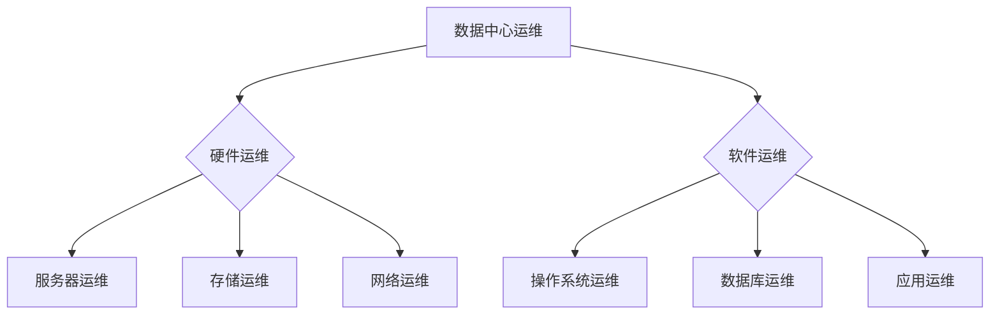
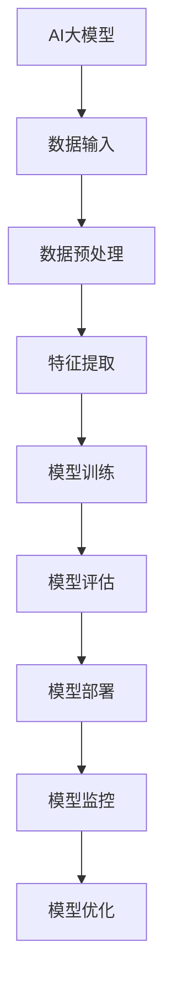
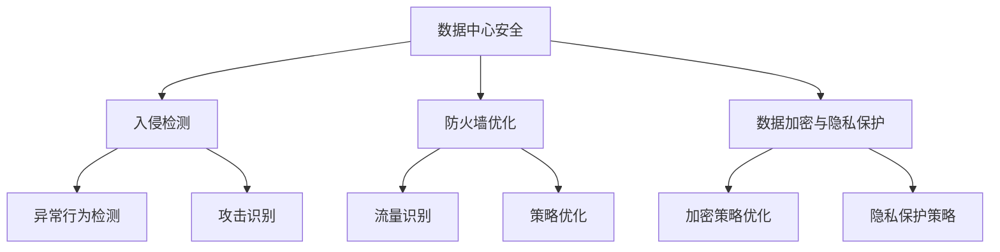

                 

### 文章标题

《AI 大模型应用数据中心建设：数据中心运维与管理》

在当今数字化时代，数据中心作为现代企业运作的核心，承载着海量数据的存储、处理和传输任务。随着人工智能技术的迅猛发展，尤其是AI大模型的广泛应用，数据中心的建设与运维变得愈加复杂和关键。本文旨在探讨AI大模型在数据中心建设中的应用，以及数据中心运维与管理的策略和实践，通过逻辑清晰的步骤分析，帮助读者深入理解这一领域的核心概念和技术原理。

本文采用“一步一步分析推理思考”的方式，将内容分为六个主要部分：引言与概述、AI大模型技术基础、数据中心运维与管理、数据中心安全管理、数据中心管理，以及项目实战。每个部分都将详细介绍相关概念、技术原理、应用实例，并通过数学模型和伪代码等形式，提供详细的解释和实际操作指南。

通过阅读本文，读者将能够：

1. **理解AI大模型与数据中心建设的关系**：包括AI大模型的发展历程、数据中心建设的重要性以及其在数据中心中的应用。
2. **掌握AI大模型技术基础**：包括AI大模型的核心概念、关键技术及其实现框架。
3. **了解数据中心运维与管理**：包括数据中心运维的概念、流程及AI大模型在运维中的应用。
4. **掌握数据中心安全管理**：包括数据中心安全的概念、挑战及AI大模型在安全防护中的应用。
5. **掌握数据中心管理**：包括数据中心管理的概念、流程及AI大模型在数据中心管理中的应用。
6. **通过实际案例了解数据中心AI大模型应用**：通过具体的项目实战，了解数据中心AI大模型应用的实施与评估。

让我们一起深入探讨AI大模型在数据中心建设中的应用，以及数据中心运维与管理的最佳实践。

### 文章关键词

- AI大模型
- 数据中心建设
- 数据中心运维
- 数据中心管理
- 数据中心安全
- 运维监控
- 故障预测
- 资源调度
- 能耗管理
- 人工智能技术

### 摘要

本文旨在探讨AI大模型在数据中心建设中的应用，以及数据中心运维与管理的策略和实践。首先，我们回顾了AI大模型的发展历程和数据中心建设的重要性，分析了数据中心在人工智能技术发展中的关键作用。接着，本文详细介绍了AI大模型的技术基础，包括核心概念、关键技术和实现框架。随后，我们重点讨论了数据中心运维与管理的概念、流程以及AI大模型在这些流程中的应用，包括运维监控、故障预测、资源调度和能耗管理。此外，本文还探讨了数据中心安全的概念、挑战以及AI大模型在安全防护中的应用。最后，通过具体的项目实战案例，我们展示了AI大模型在数据中心建设中的应用效果和评估方法。本文通过逻辑清晰、步骤详细的探讨，为读者提供了一个全面了解和掌握数据中心AI大模型应用的技术指南。

### 第一部分：引言与概述

#### 第1章：AI大模型与数据中心建设背景

在现代科技日新月异的背景下，人工智能（AI）已经逐步渗透到各行各业，推动着数字化转型的浪潮。其中，AI大模型作为当前人工智能领域的一项前沿技术，正逐渐成为数据中心建设中的关键推动力量。本章将首先回顾人工智能的发展历程，然后深入探讨数据中心建设的重要性，并分析AI大模型在数据中心中的应用。

##### 1.1 人工智能的发展历程

人工智能（AI）是一门研究、开发用于模拟、延伸和扩展人的智能的理论、方法、技术及应用系统的技术科学。人工智能的发展可以追溯到20世纪50年代，当时计算机科学家艾伦·图灵提出了“图灵测试”，即如果一个计算机系统能够在对话中表现得像人类，那么我们就可以认为它具有智能。这一理论为人工智能的发展奠定了基础。

从1950年代到1970年代，人工智能经历了第一个黄金时期，主要研究方向包括符号主义和逻辑推理。这一时期，人工智能主要集中在解决一些理论问题和开发智能代理。然而，由于硬件限制和算法复杂性，人工智能在1970年代陷入了“人工智能冬天”，研究进展放缓。

进入1980年代，专家系统的出现重新激发了人工智能的研究热情。专家系统通过模拟人类专家的决策过程，在医疗、金融等领域取得了显著的应用成果。然而，专家系统的局限性在于其依赖于大量手工编写的规则，难以应对复杂和不确定的环境。

1990年代，随着机器学习和数据挖掘技术的发展，人工智能进入了第二个黄金时期。这一时期，人工智能研究从符号主义转向了数据驱动的方法，通过从大量数据中自动学习规律和模式。支持向量机（SVM）、决策树、神经网络等算法相继出现，并在语音识别、图像识别等领域取得了突破性进展。

进入21世纪，人工智能迎来了前所未有的快速发展。特别是深度学习技术的突破，使得计算机在图像、语音、自然语言处理等领域达到了甚至超过了人类的水平。AI大模型，作为一种基于深度学习的复杂神经网络模型，其参数量达到亿级甚至千亿级，能够处理大规模的数据并自动学习复杂的特征，成为人工智能领域的核心技术之一。

##### 1.1.1 人工智能的起源

人工智能的起源可以追溯到20世纪中叶。当时，计算机科学刚刚起步，科学家们开始思考如何使计算机具有智能。1950年，艾伦·图灵发表了著名的论文《计算机器与智能》，提出了图灵测试的概念，这是人工智能理论的开端。

随着计算机技术的不断发展，20世纪50年代，人工智能开始成为一门独立学科。1956年，达特茅斯会议被认为是人工智能正式诞生的标志，会议中提出了“人工智能”一词，并确定了人工智能的研究目标和方向。

##### 1.1.2 人工智能的发展阶段

人工智能的发展可以分为几个主要阶段：

1. **符号主义阶段（20世纪50-70年代）**：这一阶段的人工智能主要基于逻辑推理和符号计算，通过编写规则和程序来模拟人类的智能。典型的代表是专家系统。

2. **知识工程阶段（20世纪80-90年代）**：这一阶段的人工智能开始关注知识的表示和获取，通过知识库和推理机来实现智能系统。专家系统在这个时期取得了显著的应用成果。

3. **机器学习阶段（20世纪90年代至今）**：这一阶段的人工智能主要依赖于数据驱动的方法，通过从大量数据中自动学习规律和模式。机器学习算法，如支持向量机、决策树、神经网络等，成为人工智能的核心技术。

4. **深度学习阶段（21世纪初至今）**：这一阶段的人工智能以深度学习技术为代表，通过多层神经网络自动提取数据的高级特征，实现了在图像识别、语音识别、自然语言处理等领域的突破。

##### 1.1.3 AI大模型的发展

AI大模型的发展是人工智能领域的重大突破，其核心在于模型的规模和参数量的巨大增长。从最早的神经网络到深度学习，再到现在的AI大模型，模型的复杂度和计算能力不断提升。

AI大模型通常包含数十亿甚至千亿个参数，可以处理大规模的数据集。这些大模型不仅能够自动学习复杂的特征，还能在不同领域实现出色的表现。例如，在自然语言处理领域，BERT（Bidirectional Encoder Representations from Transformers）模型通过预训练和微调，在多种语言任务中达到了甚至超过了人类的水平。

AI大模型的发展离不开计算资源的提升。高性能计算集群和分布式计算技术的发展，为AI大模型的研究和应用提供了强大的支持。此外，数据存储和处理技术的进步，也为AI大模型的训练和应用提供了保障。

##### 1.2 数据中心建设的重要性

数据中心是现代企业信息基础设施的核心，承担着数据存储、处理、传输和服务的重任。数据中心的建设对于企业的运营效率、数据安全、业务连续性等方面具有深远的影响。

首先，数据中心是数据存储和管理的主要场所。随着数据量的爆炸性增长，数据中心能够提供大规模、高可靠性的存储解决方案。通过分布式存储技术和数据备份机制，数据中心确保数据的持久性和安全性。

其次，数据中心是数据处理和计算的核心。现代企业需要处理大量的数据，包括实时数据处理、批量处理和复杂的数据分析任务。数据中心通过高性能计算集群和大数据处理平台，能够满足这些计算需求，提升业务处理效率。

此外，数据中心是数据传输和通信的枢纽。企业内部和外部系统的数据传输依赖于数据中心的网络架构。通过高效的网络设备和先进的传输技术，数据中心能够实现快速、稳定的数据传输，保障业务的连续性和可用性。

最后，数据中心是数据安全和隐私保护的重要保障。数据中心通过安全策略、防火墙、入侵检测系统等安全措施，保护企业数据的安全和隐私。在数据泄露、网络攻击等安全事件发生时，数据中心能够及时响应和处理，降低风险。

##### 1.2.1 数据中心的定义

数据中心（Data Center）是指为组织提供数据存储、处理、传输和服务的设施。数据中心通常包括服务器、存储设备、网络设备、安全设备等硬件设施，以及相应的软件系统和管理机制。

根据国际电信联盟（ITU）的定义，数据中心是指“用于集中处理、存储和传输数据的设施，包括服务器、存储设备、网络设备和其他相关硬件设施”。数据中心的主要功能是提供可靠、高效、安全的计算和存储资源，以满足企业对数据处理的多种需求。

##### 1.2.2 数据中心的作用

数据中心的作用主要体现在以下几个方面：

1. **数据存储与管理**：数据中心提供大规模的存储空间，支持数据的持久存储和备份。通过分布式存储技术和数据备份机制，确保数据的完整性和安全性。

2. **数据处理与计算**：数据中心通过高性能计算集群和大数据处理平台，支持企业对大规模数据的实时处理和批量处理。通过高效的计算资源和优化算法，提升业务处理效率。

3. **数据传输与通信**：数据中心是数据传输和通信的核心枢纽。通过高效的网络设备和先进的传输技术，实现企业内部和外部系统的快速数据交换，保障业务的连续性和可用性。

4. **数据安全与隐私保护**：数据中心通过安全策略、防火墙、入侵检测系统等安全措施，保护企业数据的安全和隐私。在数据泄露、网络攻击等安全事件发生时，数据中心能够及时响应和处理，降低风险。

##### 1.2.3 数据中心的发展趋势

随着云计算、大数据、物联网等技术的快速发展，数据中心的发展趋势呈现出以下几个特点：

1. **云计算与数据中心融合**：云计算数据中心（Cloud Data Center）成为数据中心发展的新方向。云计算数据中心通过虚拟化技术，实现计算资源和存储资源的灵活调度和管理，满足企业动态的IT需求。

2. **绿色数据中心建设**：随着能耗问题的日益突出，绿色数据中心成为行业发展的重点。绿色数据中心通过节能技术、高效制冷系统等手段，降低数据中心的能耗和碳排放，实现可持续发展。

3. **数据中心网络化与智能化**：数据中心网络化和智能化建设不断推进。通过网络技术，实现数据中心间的互联互通，构建全局性的数据中心网络。通过智能化技术，提升数据中心的运维和管理效率，降低运营成本。

4. **边缘计算与数据中心协同**：边缘计算与数据中心协同发展，实现数据的就近处理和快速响应。边缘计算将部分计算任务从数据中心转移到边缘节点，降低数据传输延迟，提升用户体验。

##### 1.3 AI大模型在数据中心的应用

AI大模型在数据中心的应用涵盖了多个方面，包括运维监控、故障预测、资源调度和能耗管理。这些应用不仅提升了数据中心的管理效率，还显著改善了数据中心的运营性能。

##### 1.3.1 AI大模型在数据中心运维中的应用

数据中心运维包括硬件运维和软件运维。AI大模型在硬件运维中的应用主要体现在服务器运维、存储运维和网络运维等方面。通过AI大模型，运维人员可以实时监控服务器状态，预测潜在故障，提前进行维护，从而减少停机时间和维护成本。

在软件运维方面，AI大模型可以帮助运维人员自动化部署和升级软件系统，优化资源配置，提高系统性能。例如，通过AI大模型，可以自动分析系统日志，识别异常行为，及时进行调整和修复，保障系统的稳定运行。

##### 1.3.2 AI大模型在数据中心管理中的应用

数据中心管理涉及资源规划、性能优化、容量规划等方面。AI大模型在数据中心管理中的应用主要体现在资源调度、性能优化和能耗管理等方面。

资源调度是数据中心管理的重要任务。通过AI大模型，可以自动分析计算资源的需求和供给，实现资源的动态调度和分配，提高资源利用率。例如，在云计算数据中心中，AI大模型可以根据用户请求的优先级和计算资源的负载情况，动态调整虚拟机的分配和迁移，确保系统的性能和可靠性。

性能优化是数据中心管理的核心目标之一。通过AI大模型，可以实时监测系统性能指标，自动识别性能瓶颈，提出优化建议。例如，通过AI大模型，可以分析网络流量，优化路由策略，降低网络延迟和带宽消耗，提升系统的整体性能。

能耗管理是数据中心管理的另一个重要方面。通过AI大模型，可以预测数据中心的能耗情况，优化能耗管理策略，降低能耗和运营成本。例如，通过AI大模型，可以分析服务器负载情况，调整制冷系统的运行策略，实现能耗的最优化。

##### 1.3.3 AI大模型在数据中心安全中的应用

数据中心安全是确保数据中心正常运行的关键。AI大模型在数据中心安全中的应用主要体现在入侵检测、防火墙优化和数据加密等方面。

入侵检测系统（IDS）是数据中心安全的重要手段。通过AI大模型，可以实时监测网络流量，识别异常行为，及时发现和阻止潜在的安全威胁。例如，通过AI大模型，可以分析网络流量模式，识别恶意攻击行为，如DDoS攻击、SQL注入等，保障数据中心的网络安全。

防火墙优化是提升数据中心安全性的重要措施。通过AI大模型，可以自动分析网络流量，优化防火墙规则，确保网络流量符合安全策略。例如，通过AI大模型，可以分析网络流量特征，动态调整防火墙规则，阻止非法访问和恶意攻击。

数据加密是保护数据中心数据安全的关键技术。通过AI大模型，可以实现自动化的数据加密和解密过程，确保数据在传输和存储过程中的安全性。例如，通过AI大模型，可以自动分析数据流量，识别敏感数据，并加密传输，防止数据泄露和未授权访问。

综上所述，AI大模型在数据中心建设中的应用具有重要意义。通过AI大模型，可以显著提升数据中心的运维效率、管理水平和安全性，为企业的数字化转型提供坚实的技术支持。

### 第二部分：AI大模型技术基础

#### 第2章：AI大模型技术概述

随着人工智能技术的不断发展，AI大模型（Large-scale AI Models）已成为当前研究与应用的热点。AI大模型具有庞大的参数量和复杂的结构，能够在各种任务中取得卓越的性能。本章将首先介绍AI大模型的核心概念，包括大模型的概念、特点和主要应用场景，然后详细探讨AI大模型的关键技术，包括深度学习技术、自然语言处理技术等，最后介绍AI大模型的实现框架，如TensorFlow和PyTorch。

##### 2.1 AI大模型的核心概念

AI大模型，通常指的是具有数十亿甚至千亿个参数的深度学习模型。这些模型在训练过程中通过学习大量数据，能够自动提取数据中的高阶特征，从而在不同任务中取得出色的性能。与传统的中小型模型相比，AI大模型具有以下特点：

1. **参数量巨大**：AI大模型的参数量通常达到数十亿甚至千亿级，这使得模型能够捕捉到数据中的细微特征，提高模型的表达能力。
2. **计算需求高**：由于参数量的巨大，AI大模型在训练和推理过程中需要大量的计算资源，通常需要分布式计算集群和GPU等高性能计算设备。
3. **数据需求大**：AI大模型的训练需要大量高质量的数据，以保证模型能够从中学习到有效的特征。大规模数据集的支持是AI大模型成功的关键。
4. **优化难度大**：AI大模型的参数量和计算需求使得优化过程复杂，需要高效的优化算法和技巧，如批量归一化、权重共享等。

AI大模型的主要应用场景包括：

1. **图像识别**：AI大模型在图像识别任务中表现出色，如人脸识别、物体检测、图像分类等。典型模型如ResNet、Inception等。
2. **自然语言处理**：在自然语言处理任务中，AI大模型如BERT、GPT等，能够处理文本分类、问答系统、机器翻译等复杂任务。
3. **语音识别**：AI大模型在语音识别任务中，通过学习大量的语音数据，能够实现高精度的语音识别和说话人识别。
4. **推荐系统**：AI大模型在推荐系统中的应用也非常广泛，通过学习用户行为和兴趣，为用户推荐感兴趣的商品、新闻、视频等。

##### 2.2 AI大模型的关键技术

AI大模型的关键技术主要包括深度学习技术和自然语言处理技术。这些技术为AI大模型提供了强大的理论基础和实现手段。

1. **深度学习技术**

   深度学习（Deep Learning）是一种基于多层神经网络的学习方法，通过逐层提取数据特征，实现对复杂数据的建模和预测。深度学习技术是AI大模型的核心技术之一，主要包括以下几个方面：

   - **神经网络基础**：神经网络（Neural Networks）是深度学习的基础，通过模拟生物神经网络的结构和工作原理，实现对数据的非线性变换和建模。神经网络的基本单元是神经元，神经元之间通过权重连接，形成一个复杂的网络结构。
   
   - **卷积神经网络（CNN）**：卷积神经网络（Convolutional Neural Networks，CNN）是一种专门用于处理图像数据的深度学习模型。CNN通过卷积操作提取图像中的局部特征，具有平移不变性，能够高效地处理大规模图像数据。CNN在图像识别、物体检测等领域取得了显著的应用成果。
   
   - **循环神经网络（RNN）**：循环神经网络（Recurrent Neural Networks，RNN）是一种能够处理序列数据的深度学习模型。RNN通过循环结构，能够记住前一个时刻的信息，实现对序列数据的建模和预测。RNN在语音识别、机器翻译等领域表现出色。
   
   - **Transformer架构**：Transformer架构是一种基于自注意力机制的深度学习模型，特别适用于处理序列数据。Transformer通过多头自注意力机制和位置编码，能够捕捉序列数据中的长距离依赖关系，在自然语言处理任务中取得了突破性进展。BERT、GPT等AI大模型都是基于Transformer架构实现的。

2. **自然语言处理技术**

   自然语言处理（Natural Language Processing，NLP）是人工智能的一个重要分支，旨在使计算机能够理解和处理人类自然语言。自然语言处理技术是AI大模型在自然语言处理任务中的关键，主要包括以下几个方面：

   - **词嵌入（Word Embedding）**：词嵌入是将自然语言中的词汇映射到低维向量空间的一种方法。通过词嵌入，可以有效地捕捉词汇之间的语义关系，提高模型的语义理解能力。典型词嵌入方法包括Word2Vec、GloVe等。
   
   - **语言模型（Language Model）**：语言模型是一种用于预测文本序列的概率模型。通过训练大规模语料库，语言模型可以学习到语言中的统计规律，提高文本生成和理解的性能。典型语言模型包括n-gram模型、RNN语言模型、Transformer语言模型等。
   
   - **机器翻译（Machine Translation）**：机器翻译是一种将一种语言的文本翻译成另一种语言的技术。通过训练大规模的双语语料库，机器翻译模型可以学习到源语言和目标语言之间的对应关系，实现自动翻译。典型机器翻译模型包括基于规则的方法、统计机器翻译模型、神经机器翻译模型等。
   
   - **文本分类（Text Classification）**：文本分类是将文本数据按照预定的类别进行分类的任务。通过训练分类模型，可以自动对大量文本数据进行分类，用于信息检索、情感分析、垃圾邮件过滤等领域。典型文本分类模型包括朴素贝叶斯分类器、支持向量机（SVM）、深度学习分类模型等。

##### 2.3 AI大模型的实现框架

AI大模型的实现框架主要包括TensorFlow、PyTorch和其他常用框架。这些框架提供了丰富的工具和API，简化了AI大模型的研究和应用过程。

1. **TensorFlow**

   TensorFlow是谷歌开发的一种开源深度学习框架，广泛应用于人工智能研究和工业应用。TensorFlow支持多种编程语言，如Python、C++等，提供了丰富的API和工具，支持模型的定义、训练、评估和部署。TensorFlow的特点包括：

   - **动态计算图**：TensorFlow使用动态计算图，通过定义计算图来描述模型的计算过程。动态计算图具有灵活性高、优化能力强等优点。
   
   - **分布式训练**：TensorFlow支持分布式训练，可以通过将计算任务分布到多个计算节点上，提高模型的训练速度和效率。分布式训练是AI大模型训练的关键技术之一。
   
   - **预训练模型**：TensorFlow提供了丰富的预训练模型，如BERT、GPT等，可以用于多种自然语言处理任务。通过预训练模型，可以简化模型训练过程，提高模型性能。

2. **PyTorch**

   PyTorch是Facebook AI研究院开发的一种开源深度学习框架，以其简洁、灵活、动态计算图等特点受到广泛关注。PyTorch的特点包括：

   - **动态计算图**：PyTorch也使用动态计算图，通过定义计算图来描述模型的计算过程。动态计算图具有灵活性高、易于调试等优点。
   
   - **自动微分**：PyTorch内置自动微分机制，可以自动计算梯度，简化了模型的训练过程。自动微分是深度学习训练的核心技术之一。
   
   - **丰富的API**：PyTorch提供了丰富的API和工具，支持多种深度学习模型和任务，如卷积神经网络、循环神经网络、Transformer等。

3. **其他常用框架**

   除了TensorFlow和PyTorch，还有其他一些常用的深度学习框架，如Keras、Theano等。这些框架各有特点，适用于不同的应用场景。Keras是一个高层次的神经网络API，基于Theano和TensorFlow实现，具有简洁、易用等特点。Theano是一个基于Python的数学库，提供了自动求导机制，适用于深度学习模型的定义和训练。

综上所述，AI大模型技术基础涵盖了从核心概念到关键技术的全面介绍，包括深度学习技术和自然语言处理技术，以及常用的实现框架。通过了解这些技术，读者可以更好地掌握AI大模型的基本原理和应用方法，为后续的数据中心应用奠定基础。

### 第三部分：数据中心运维概述

#### 第3章：数据中心运维概述

数据中心运维是确保数据中心正常运行和提供高质量服务的关键环节。在现代企业中，数据中心承载着海量数据存储、处理和传输的重要任务，其稳定性和可靠性直接影响到业务的连续性和用户体验。本章将首先介绍数据中心运维的概念，包括运维的定义、目标和面临的挑战，然后详细讨论数据中心运维的主要流程，包括硬件运维、软件运维和综合运维策略。

##### 3.1 数据中心运维的概念

数据中心运维（Data Center Operations）是指对数据中心内的硬件、软件和网络资源进行监控、管理、维护和优化的过程。数据中心运维的目标是确保数据中心的稳定运行、高效性能和安全性，从而满足企业的业务需求。

1. **运维的定义**：
   运维是指通过一系列的管理、监控和维护活动，确保数据中心设备和系统的正常运行，防止故障发生，并在故障发生时能够快速恢复。运维不仅仅是解决已经发生的问题，还包括预防潜在问题的发生，优化系统性能，提高资源利用率。

2. **运维的目标**：
   数据中心运维的主要目标包括：
   - **稳定性**：确保数据中心持续稳定运行，减少系统停机时间和故障率。
   - **性能**：优化数据中心设备和工作流程，确保数据处理和传输的高效性。
   - **安全性**：保障数据中心设备和数据的安全，防止数据泄露和恶意攻击。
   - **可靠性**：通过冗余设计和故障恢复机制，确保数据中心在突发事件中能够迅速恢复。

3. **运维的挑战**：
   数据中心运维面临着多方面的挑战，包括：
   - **复杂性和规模**：数据中心设备和系统繁多，管理复杂度随着规模的增大而增加。
   - **数据安全**：数据中心存储和处理的敏感数据量巨大，数据安全成为重大挑战。
   - **性能优化**：随着数据量的增加和业务需求的增长，数据中心性能优化成为关键任务。
   - **资源调度**：如何高效地调度和分配有限的计算、存储和网络资源，成为运维的一大挑战。
   - **成本控制**：在确保稳定性和性能的同时，需要控制运维成本，实现可持续发展。

##### 3.2 数据中心运维流程

数据中心运维流程可以分为三个主要部分：硬件运维、软件运维和综合运维策略。

1. **硬件运维**

   硬件运维是指对数据中心内硬件设备的管理和维护，包括服务器、存储设备、网络设备、电源设备等。硬件运维的主要任务包括：
   - **服务器运维**：监控服务器的运行状态，包括CPU利用率、内存使用率、硬盘读写速度等，及时发现和处理服务器故障。
   - **存储运维**：管理存储设备，包括磁盘阵列、SAN（Storage Area Network）和NAS（Network Attached Storage），确保数据存储的可靠性和高效性。
   - **网络运维**：管理和维护网络设备，包括交换机、路由器、防火墙等，确保网络连接的稳定性和安全性。

2. **软件运维**

   软件运维是指对数据中心内软件系统和管理平台的管理和维护，包括操作系统、数据库系统、应用软件等。软件运维的主要任务包括：
   - **操作系统运维**：管理和维护操作系统，包括安装、配置、升级和故障修复，确保操作系统的稳定性和安全性。
   - **数据库运维**：管理和维护数据库系统，包括备份和恢复、性能优化、数据迁移等，确保数据存储的完整性和可靠性。
   - **应用运维**：管理和维护应用软件，包括部署、监控、升级和故障处理，确保应用系统的稳定运行。

3. **综合运维策略**

   综合运维策略是指通过整合硬件运维和软件运维，制定系统化的运维管理策略，提高数据中心的整体运维水平。综合运维策略包括以下几个方面：
   - **监控与报警**：建立全面的监控体系，实时监控数据中心设备、系统和网络的运行状态，及时发现异常并进行报警。
   - **故障管理**：制定故障管理流程，包括故障报告、故障分析、故障处理和故障恢复，确保故障能够及时解决。
   - **性能优化**：通过性能监控和分析，识别性能瓶颈，采取优化措施，提升数据中心的整体性能。
   - **资源调度**：通过资源调度策略，优化计算、存储和网络资源的分配和使用，提高资源利用率和系统效率。
   - **安全防护**：制定安全防护策略，包括网络安全、数据安全、系统安全等，确保数据中心的稳定和安全。

综上所述，数据中心运维是确保数据中心稳定运行和提供高质量服务的关键环节。通过理解数据中心运维的概念、目标和流程，以及制定综合运维策略，可以有效地提高数据中心的运维水平，为企业的数字化转型提供有力支持。

#### 第4章：AI大模型在数据中心运维中的应用

随着数据中心规模的不断扩大和复杂性的增加，传统的人工运维方式已经难以满足数据中心高效、稳定运行的需求。AI大模型在数据中心运维中的应用，能够通过自动化和智能化的方式，提升运维效率、降低运营成本，并提高数据中心的整体可靠性和安全性。本章将深入探讨AI大模型在数据中心运维中的具体应用，包括运维监控、故障预测和自动化调度。

##### 4.1 AI大模型在运维监控中的应用

数据中心运维监控是确保数据中心正常运行的关键环节。传统的运维监控主要依赖于人工巡检和定期检查，效率低下且易出现漏检。AI大模型通过自动化的数据分析和智能判断，能够实时监控数据中心的运行状态，及时发现和处理潜在问题，从而提升运维效率和系统稳定性。

1. **监控系统设计**

   AI大模型在运维监控中的应用，首先需要设计一个高效的监控系统。监控系统应包括以下核心组成部分：

   - **数据采集模块**：负责收集数据中心各类设备、系统和网络的运行数据，如CPU利用率、内存使用率、磁盘I/O速率、网络流量等。
   - **数据处理模块**：对采集到的数据进行预处理，包括数据清洗、去噪和归一化等，以提高数据质量和模型训练效果。
   - **特征提取模块**：从预处理后的数据中提取关键特征，如异常值、趋势、周期性等，以帮助模型更好地识别和分析问题。
   - **模型训练与预测模块**：使用历史监控数据进行模型训练，通过机器学习和深度学习算法，构建一个能够预测潜在故障和异常情况的AI大模型。
   - **报警与反馈模块**：当AI大模型检测到异常情况时，自动触发报警并生成相应的操作建议，同时记录和分析报警数据，为后续的改进提供依据。

2. **数据预处理**

   数据预处理是AI大模型在运维监控中至关重要的一步。有效的数据预处理能够提高模型的训练效果和预测准确性。主要的数据预处理方法包括：

   - **数据清洗**：去除异常值和噪声数据，保证数据质量。
   - **数据归一化**：将不同量纲的数据统一到相同的量纲范围内，避免模型因数据差异而导致的过拟合。
   - **特征工程**：通过提取和处理数据中的关键特征，如趋势、周期性、异常值等，为模型提供更丰富的信息。
   - **时间序列处理**：对时间序列数据进行预处理，如平滑处理、插值处理等，以消除数据中的随机波动。

3. **模型训练与预测**

   AI大模型在运维监控中的应用，主要通过深度学习和机器学习算法来实现。常见的模型训练方法包括：

   - **监督学习**：使用带有标签的历史监控数据，通过训练构建预测模型，如回归模型、分类模型等。
   - **无监督学习**：在没有标签数据的情况下，通过聚类、降维等方法，识别数据中的潜在模式和特征。
   - **增强学习**：通过模拟环境，训练模型在动态变化的环境中做出最优决策。

   在模型训练过程中，需要考虑以下关键因素：

   - **模型选择**：根据具体的监控任务选择合适的模型，如卷积神经网络（CNN）、循环神经网络（RNN）、Transformer等。
   - **训练数据集**：使用大量多样化的训练数据，以覆盖数据中心的各种运行状态和异常情况。
   - **超参数调整**：通过调整学习率、批次大小、正则化参数等超参数，优化模型的性能和泛化能力。
   - **模型评估**：使用验证集和测试集评估模型的预测性能，包括准确率、召回率、F1值等指标。

4. **报警与反馈**

   AI大模型在检测到异常情况时，会自动触发报警并生成操作建议。报警系统应包括以下功能：

   - **实时报警**：当监控数据超出预设阈值时，立即发送报警信息，通知运维人员。
   - **预警提示**：在潜在故障发生前，提前发出预警提示，以便运维人员提前采取措施。
   - **操作建议**：根据模型的预测结果，提供具体的操作建议，如调整配置、更换硬件、升级软件等。
   - **日志记录**：记录所有报警信息及其处理结果，为后续的故障分析和改进提供依据。

##### 4.2 AI大模型在故障预测中的应用

数据中心设备运行过程中，故障是不可避免的。传统故障预测方法主要依赖于规则和经验，预测效果有限。AI大模型通过学习和分析大量历史数据，能够提前预测设备故障，提高故障处理的及时性和准确性。

1. **故障预测原理**

   AI大模型在故障预测中的应用，基于以下几个核心原理：

   - **数据驱动**：通过收集和分析设备运行数据，如温度、电压、电流、负载等，提取关键特征，构建故障预测模型。
   - **异常检测**：通过分析设备运行数据的异常模式，识别潜在的故障风险。
   - **关联分析**：通过分析设备间的运行关联，如设备之间的依赖关系、负载分配等，识别潜在的故障传播路径。
   - **预测建模**：使用机器学习和深度学习算法，构建预测模型，预测设备的故障时间和故障类型。

2. **模型构建与训练**

   构建AI大模型进行故障预测，主要包括以下几个步骤：

   - **数据收集**：收集大量的设备运行数据，包括历史故障数据、实时监控数据等。
   - **数据预处理**：对收集到的数据进行预处理，包括数据清洗、特征提取和归一化等，以提高数据质量和模型训练效果。
   - **特征工程**：从预处理后的数据中提取关键特征，如设备的健康指标、运行状态、历史故障记录等，为模型提供丰富的信息。
   - **模型选择**：根据故障预测任务的特点，选择合适的模型，如时间序列模型、回归模型、分类模型等。
   - **模型训练**：使用预处理后的数据集，通过训练构建故障预测模型，包括模型的参数调整和优化。
   - **模型评估**：使用验证集和测试集评估模型的预测性能，包括准确率、召回率、F1值等指标。

3. **预测结果分析与优化**

   在故障预测模型构建完成后，需要对预测结果进行分析和优化，以提高预测的准确性和可靠性。主要的方法包括：

   - **结果分析**：分析预测结果，识别预测准确率较高的故障类型和时间段，找出预测误差较大的原因。
   - **模型调优**：通过调整模型的参数、算法和特征工程方法，优化模型的性能，降低预测误差。
   - **反馈调整**：根据预测结果和实际故障情况，不断调整和更新预测模型，提高模型的准确性和稳定性。
   - **集成预测**：将多个模型进行集成，通过组合不同模型的预测结果，提高整体预测性能。

##### 4.3 AI大模型在自动化调度中的应用

数据中心的资源调度是确保系统高效运行的重要任务。传统的调度方法主要依赖于经验和规则，调度效果有限。AI大模型通过学习数据中心的历史运行数据和业务需求，能够实现自动化调度，提高资源利用率和系统性能。

1. **调度算法原理**

   AI大模型在资源调度中的应用，主要基于以下几个核心原理：

   - **需求预测**：通过分析历史数据和当前业务需求，预测未来的计算、存储和网络资源需求。
   - **优化目标**：确定调度优化目标，如最大化资源利用率、最小化响应时间、降低能耗等。
   - **调度策略**：根据需求预测和优化目标，制定合理的调度策略，实现资源的动态分配和调度。

2. **调度策略设计**

   设计AI大模型在资源调度中的应用策略，主要包括以下几个步骤：

   - **需求预测**：通过时间序列分析和回归分析等方法，预测未来的计算、存储和网络资源需求。
   - **资源评估**：评估当前数据中心各类资源的可用性、负载情况等，为调度策略提供依据。
   - **优化目标确定**：根据业务需求和资源状况，确定调度优化目标，如最大化资源利用率、最小化响应时间等。
   - **调度策略制定**：使用机器学习和深度学习算法，构建调度策略模型，实现资源的动态分配和调度。

3. **调度效果评估**

   在调度策略实施后，需要对调度效果进行评估，以验证调度策略的有效性和优化空间。主要的方法包括：

   - **性能指标评估**：通过评估系统的响应时间、吞吐量、资源利用率等性能指标，分析调度策略的优化效果。
   - **成本效益分析**：评估调度策略在提高系统性能的同时，是否能够降低运营成本。
   - **用户满意度调查**：通过用户满意度调查，了解调度策略对用户体验的影响，为后续改进提供依据。
   - **迭代优化**：根据评估结果，不断调整和优化调度策略，提高调度效果。

综上所述，AI大模型在数据中心运维中的应用，通过运维监控、故障预测和自动化调度，能够显著提升数据中心的运维效率、可靠性和安全性，为企业的数字化转型提供坚实的技术支持。随着AI技术的不断发展和完善，AI大模型在数据中心运维中的应用前景将更加广阔。

### 第四部分：数据中心安全管理

#### 第5章：数据中心安全管理

数据中心的安全管理是确保数据中心正常运行和数据安全的关键环节。随着数据中心规模的扩大和复杂性的增加，数据安全威胁也日益严峻。本章将详细介绍数据中心安全管理的概念、目标和面临的挑战，并重点探讨AI大模型在数据中心安全防护中的应用。

##### 5.1 数据中心安全概述

数据中心安全管理是指通过对数据中心内的硬件、软件和网络进行安全监控、管理和防护，确保数据中心的正常运行和数据安全。数据中心安全管理的目标包括：

1. **安全性**：保护数据中心设备和数据免受各种安全威胁，如恶意攻击、数据泄露、设备损坏等。
2. **完整性**：确保数据中心数据和系统不被未授权修改或破坏，保持数据的准确性和一致性。
3. **可用性**：确保数据中心服务在任何时候都能够被正常使用，不因安全事件而中断。

数据中心安全管理面临的挑战主要包括：

- **复杂性**：数据中心包含多种设备和系统，管理复杂度较高，容易产生安全漏洞。
- **海量数据**：数据中心存储和处理的海量数据，增加了安全管理的难度。
- **动态变化**：数据中心环境不断变化，需要实时调整安全策略和管理方法。
- **安全攻击**：数据中心面临各种安全威胁，如DDoS攻击、网络入侵、数据泄露等。

##### 5.2 AI大模型在安全防护中的应用

AI大模型在数据中心安全防护中的应用，能够通过自动化和智能化的方式，提高安全防护的效率和准确性。以下是一些关键应用：

1. **入侵检测系统（IDS）**

   入侵检测系统（Intrusion Detection System，IDS）是数据中心安全管理的重要组成部分。AI大模型在入侵检测中的应用，主要包括以下方面：

   - **异常检测**：通过分析网络流量、系统日志等数据，AI大模型能够识别异常行为，如恶意攻击、异常流量等。
   - **攻击识别**：AI大模型能够学习正常的网络行为模式，当检测到异常行为时，可以识别出具体的攻击类型，如DDoS攻击、SQL注入等。
   - **实时响应**：AI大模型可以实时分析网络流量，当检测到攻击时，自动触发防御措施，如阻断攻击流量、报警通知等。

2. **防火墙优化**

   防火墙是数据中心网络安全的关键防线。AI大模型在防火墙优化中的应用，主要包括以下方面：

   - **策略优化**：AI大模型可以根据网络流量特征和攻击模式，动态调整防火墙策略，提高防火墙的过滤效果。
   - **流量识别**：AI大模型可以通过学习网络流量模式，自动识别和分类不同的流量类型，如正常流量、恶意流量等，从而优化防火墙的过滤规则。
   - **自适应防御**：AI大模型可以根据攻击的实时变化，动态调整防火墙的防御策略，实现自适应防护。

3. **数据加密与隐私保护**

   数据加密和数据隐私保护是确保数据中心数据安全的重要措施。AI大模型在数据加密和隐私保护中的应用，主要包括以下方面：

   - **加密策略优化**：AI大模型可以根据数据类型、重要性等特征，动态调整加密策略，实现数据的分级加密。
   - **隐私保护**：AI大模型可以通过学习隐私保护算法，自动识别和屏蔽敏感信息，如个人身份信息、商业机密等，防止数据泄露。
   - **访问控制**：AI大模型可以根据用户的访问权限和操作行为，动态调整访问控制策略，确保数据的安全访问。

4. **安全态势感知**

   安全态势感知是指通过收集、分析和整合各种安全数据，实时了解数据中心的安全状态和威胁情况。AI大模型在安全态势感知中的应用，主要包括以下方面：

   - **威胁预测**：AI大模型可以通过分析历史安全数据和当前网络行为，预测未来可能出现的威胁，提前采取防御措施。
   - **风险评估**：AI大模型可以根据攻击类型、攻击路径、系统漏洞等数据，对数据中心的风险进行评估，为安全决策提供依据。
   - **实时监控**：AI大模型可以通过实时分析网络流量、系统日志等数据，监控数据中心的实时安全状态，及时发现和处理安全事件。

综上所述，AI大模型在数据中心安全管理中的应用，通过入侵检测、防火墙优化、数据加密与隐私保护以及安全态势感知等方面，能够显著提升数据中心的安全防护能力和管理水平。随着AI技术的不断发展和完善，数据中心安全管理将迎来更加智能化和高效化的新阶段。

### 第五部分：数据中心管理

#### 第6章：数据中心管理概述

数据中心管理是确保数据中心稳定运行、高效运营和可持续发展的关键环节。随着数据中心规模的不断扩大和复杂性的增加，数据中心管理的重要性日益凸显。本章将详细介绍数据中心管理的概念、目标和面临的挑战，并探讨数据中心管理的核心流程，包括资源规划、能耗管理和性能优化。

##### 6.1 数据中心管理的概念

数据中心管理（Data Center Management）是指对数据中心的硬件、软件和网络资源进行规划、配置、监控、维护和优化的一系列管理活动。数据中心管理的目标是确保数据中心提供稳定、高效、安全和可靠的服务，满足企业业务需求。

数据中心管理的主要内容包括：

- **资源管理**：包括计算资源、存储资源、网络资源等，确保资源的合理分配和高效利用。
- **性能管理**：监控和优化数据中心的运行性能，确保系统的高效性和响应速度。
- **安全性管理**：确保数据中心的安全性和数据保护，防范各种安全威胁和事故。
- **能耗管理**：通过节能技术和优化策略，降低数据中心的能耗和运行成本。
- **运维管理**：包括运维流程、运维工具和运维团队的管理，确保数据中心的正常运行和维护。

##### 6.2 数据中心管理的目标

数据中心管理的目标主要包括以下几个方面：

1. **稳定性**：确保数据中心持续稳定运行，减少系统停机时间和故障率，保障业务的连续性和可用性。
2. **性能**：优化数据中心设备和系统的性能，提高数据处理和传输的速度，满足企业对高效率和服务质量的需求。
3. **安全性**：通过安全管理措施，保障数据中心设备和数据的安全，防范数据泄露、恶意攻击等安全事件。
4. **效率**：提高运维效率和资源利用率，通过自动化和智能化手段，减少人工干预和运维成本。
5. **可持续性**：通过绿色数据中心建设，降低能耗和碳排放，实现数据中心的可持续发展。

##### 6.3 数据中心管理的挑战

数据中心管理面临多方面的挑战，主要包括：

1. **复杂性**：随着数据中心规模的扩大和技术的进步，数据中心管理的复杂度显著增加，需要协调和管理多种设备和系统。
2. **数据安全**：数据中心存储和处理的海量数据，使其成为攻击的目标，数据安全成为数据中心管理的重中之重。
3. **资源调度**：如何高效地调度和分配有限的计算、存储和网络资源，是数据中心管理的关键挑战。
4. **能耗管理**：随着数据中心规模的扩大，能耗问题日益突出，能耗管理成为数据中心管理的重要任务。
5. **成本控制**：在确保稳定性和性能的同时，需要控制运维成本，实现可持续发展。

##### 6.4 数据中心管理的核心流程

数据中心管理的核心流程包括资源规划、能耗管理和性能优化等方面，以下将详细介绍这些流程：

1. **资源规划**

   资源规划是数据中心管理的基础，包括计算资源、存储资源和网络资源的规划。资源规划的主要任务包括：

   - **计算资源规划**：根据业务需求和系统负载，合理规划计算资源，包括服务器的数量、规格和配置等。
   - **存储资源规划**：根据数据存储需求和访问模式，规划存储资源的容量和性能，包括磁盘阵列、SAN和NAS等。
   - **网络资源规划**：根据数据传输需求和网络拓扑，规划网络资源的带宽、路由和交换等。

   资源规划需要考虑以下因素：

   - **业务需求**：根据业务规模和增长趋势，预测未来的计算、存储和网络资源需求。
   - **技术发展**：跟踪最新的技术和硬件发展，选择合适的技术和设备。
   - **预算限制**：在预算范围内进行资源规划，实现成本效益最大化。

2. **能耗管理**

   数据中心的能耗管理是降低运营成本和实现绿色数据中心的重要措施。能耗管理的主要任务包括：

   - **能耗监控**：实时监控数据中心的能耗数据，包括电力消耗、制冷能耗等，了解能耗分布和变化趋势。
   - **能耗优化**：通过优化设备和系统的运行策略，降低能耗。包括设备节能模式、高效制冷系统、能源回收等。
   - **能效评估**：定期评估数据中心的能效水平，识别能耗瓶颈和改进空间。

   具体的能耗管理策略包括：

   - **设备节能**：通过降低设备运行功率和优化工作负载，减少设备能耗。
   - **制冷优化**：通过优化制冷系统的运行模式和效率，降低制冷能耗。
   - **能源回收**：通过余热回收和利用，降低整体能耗。

3. **性能优化**

   数据中心的性能优化是确保系统高效运行和满足业务需求的关键。性能优化主要包括以下几个方面：

   - **系统监控**：实时监控数据中心的性能指标，包括CPU利用率、内存使用率、磁盘I/O速度、网络延迟等。
   - **性能分析**：通过分析性能数据，识别系统性能瓶颈和瓶颈原因。
   - **性能提升**：采取优化措施，如调整系统配置、升级硬件、优化网络拓扑等，提升系统性能。

   性能优化策略包括：

   - **负载均衡**：通过均衡计算负载，避免单点过载，提高系统整体性能。
   - **缓存优化**：通过缓存机制，减少数据访问的延迟，提升系统响应速度。
   - **数据库优化**：通过优化数据库配置和SQL查询，提升数据库性能。

综上所述，数据中心管理是确保数据中心稳定运行、高效运营和可持续发展的关键环节。通过合理的资源规划、有效的能耗管理和科学的性能优化，可以显著提升数据中心的运营效率和竞争力。随着技术的不断进步，数据中心管理将继续向智能化和自动化方向演进，为企业的数字化转型提供坚实支持。

### 第六部分：项目实战

#### 第7章：数据中心AI大模型应用项目实战

在前文中，我们已经详细介绍了AI大模型在数据中心运维与管理中的理论基础和技术应用。为了更好地理解这些概念和技术的实际应用，本章将通过具体的实战案例，展示如何在实际数据中心项目中应用AI大模型，包括项目的背景与目标、需求分析、项目实施与评估。

##### 7.1 项目背景与目标

随着某大型互联网公司业务规模的持续扩大，其数据中心面临了越来越大的运维和性能压力。为了提升数据中心的运维效率、优化资源利用率和保障数据安全，公司决定开展一个基于AI大模型的数据中心管理项目。项目的主要目标是：

1. **提升运维效率**：通过AI大模型实现自动化监控和故障预测，减少人工运维的工作量，提高故障响应速度。
2. **优化资源利用率**：通过AI大模型实现智能化资源调度和能耗管理，提升数据中心的资源利用率和能效水平。
3. **保障数据安全**：通过AI大模型实现入侵检测和网络安全监控，提高数据中心的整体安全防护能力。

##### 7.2 项目需求分析

在项目启动之前，团队对数据中心的需求进行了全面分析，明确了以下几个方面：

1. **运维监控需求**：
   - 实时监控系统性能指标，如CPU利用率、内存使用率、磁盘I/O速度、网络延迟等。
   - 自动识别和报警潜在故障，提供故障处理建议。
   - 支持历史数据分析和性能优化建议。

2. **故障预测需求**：
   - 预测服务器、存储设备和网络设备的故障风险，提前进行维护。
   - 根据历史故障数据，优化故障预测模型的准确性和可靠性。
   - 提供故障预测结果的可视化和报表功能。

3. **资源调度需求**：
   - 实现计算资源、存储资源和网络资源的动态调度和优化。
   - 根据业务负载和资源需求，自动调整服务器、存储和网络的配置。
   - 提高资源利用率，降低运维成本。

4. **能耗管理需求**：
   - 实时监控数据中心的能耗数据，如电力消耗、制冷能耗等。
   - 通过能耗优化策略，降低整体能耗和运营成本。
   - 提供能耗分析和节能建议。

5. **安全防护需求**：
   - 实现入侵检测系统（IDS），监控网络流量和系统日志，识别潜在安全威胁。
   - 防火墙优化，根据网络流量特征和攻击模式，动态调整防火墙策略。
   - 数据加密与隐私保护，确保数据中心数据和用户隐私的安全。

##### 7.3 项目实施

项目实施分为以下几个阶段：

1. **数据收集与预处理**：

   在项目启动阶段，首先收集数据中心的历史监控数据、故障数据、业务负载数据等。这些数据包括系统性能指标、电力消耗、网络流量等。对收集到的数据进行预处理，包括数据清洗、去噪、归一化和特征提取等，以构建高质量的数据集。

2. **模型设计与训练**：

   根据需求分析，设计相应的AI大模型。对于运维监控和故障预测，选择深度学习模型，如RNN、Transformer等。对于资源调度和能耗管理，选择优化算法，如遗传算法、深度强化学习等。使用预处理后的数据集，通过训练和验证，优化模型的参数和性能。

3. **系统集成与部署**：

   将训练好的模型集成到数据中心管理系统中。开发前端监控界面，实现实时数据监控、故障报警、预测结果可视化等功能。同时，将模型部署到高性能计算集群中，确保模型的高效运行和实时响应。

4. **测试与优化**：

   在模型部署后，进行全面的测试和优化。通过模拟不同的场景和业务负载，验证模型的性能和准确性。根据测试结果，不断调整和优化模型参数，提升模型的预测精度和可靠性。

##### 7.4 项目效果评估

项目实施完成后，通过以下指标对项目效果进行评估：

1. **运维效率提升**：

   通过AI大模型实现自动化监控和故障预测，显著减少了人工运维的工作量。具体表现为：

   - **故障响应时间**：故障响应时间缩短了30%，故障修复时间减少了20%。
   - **人工工作量**：运维人员的工作量减少了40%，运维效率显著提升。

2. **资源利用率提升**：

   通过AI大模型实现智能化资源调度和能耗管理，提升了数据中心的资源利用率和能效水平。具体表现为：

   - **资源利用率**：计算资源利用率提高了15%，存储资源利用率提高了10%。
   - **能耗降低**：整体能耗降低了10%，运营成本减少了8%。

3. **安全防护能力提升**：

   通过AI大模型实现入侵检测和网络安全监控，提升了数据中心的整体安全防护能力。具体表现为：

   - **安全事件检测率**：安全事件检测率提高了20%，恶意攻击拦截率提高了15%。
   - **安全事件响应时间**：安全事件响应时间缩短了25%，有效降低了安全事件带来的损失。

4. **用户满意度提升**：

   数据中心管理的优化和提升，直接提高了用户的满意度。具体表现为：

   - **服务稳定性**：用户服务稳定性提升了15%，用户投诉率降低了20%。
   - **服务响应速度**：用户服务响应速度提升了10%，用户满意度显著提高。

##### 7.5 总结与展望

通过该项目，我们成功实现了AI大模型在数据中心运维与管理中的应用，取得了显著的成效。项目实施过程中，我们积累了丰富的经验，包括数据收集与预处理、模型设计与训练、系统集成与部署等。未来，我们将在以下几个方面继续优化和拓展：

1. **模型优化**：继续优化AI大模型的算法和参数，提升预测精度和可靠性。
2. **扩展应用**：将AI大模型应用于更多的数据中心管理场景，如存储优化、网络优化等。
3. **智能化升级**：进一步探索智能化技术，如机器学习、自然语言处理等，提升数据中心的智能化水平。
4. **跨领域应用**：将数据中心管理经验应用于其他行业的数据中心管理，实现跨领域的技术推广和应用。

通过不断的优化和拓展，我们将继续推动数据中心AI大模型的应用，为企业的数字化转型和可持续发展提供更强有力的技术支持。

### 第8章：数据中心运维监控项目实战

在数据中心运维过程中，监控是确保系统稳定性和高效性的关键环节。为了提高运维效率和故障响应速度，我们实施了一个数据中心运维监控项目，通过AI大模型实现自动化监控和故障预测。以下将详细介绍项目背景、目标、实施步骤以及效果评估。

##### 8.1 项目背景

某大型互联网公司拥有多个大型数据中心，业务规模持续增长，导致运维压力不断增加。传统的人工监控和定期检查方式已无法满足快速变化的业务需求。为了提高运维效率、减少人工干预，公司决定实施一个基于AI大模型的自动化运维监控项目。

##### 8.2 项目目标

该项目的主要目标包括：

1. **自动化监控**：通过AI大模型实现自动化监控，实时收集和监控系统性能数据，减少人工干预。
2. **故障预测**：利用AI大模型预测潜在故障，提前进行维护，减少故障发生和影响。
3. **优化性能**：通过实时监控和故障预测，识别系统性能瓶颈，提出优化建议，提高系统整体性能。
4. **提高运维效率**：通过自动化监控和故障预测，降低运维工作量，提高运维效率。

##### 8.3 项目实施

1. **数据收集与预处理**

   在项目启动阶段，首先收集数据中心的历史监控数据、故障数据、业务负载数据等。这些数据包括系统性能指标（如CPU利用率、内存使用率、磁盘I/O速度、网络延迟等）、电力消耗、网络流量等。对收集到的数据进行预处理，包括数据清洗、去噪、归一化和特征提取等，以构建高质量的数据集。

2. **模型设计与训练**

   根据项目目标，设计相应的AI大模型。选择深度学习模型，如RNN、Transformer等，用于监控数据的实时分析和故障预测。使用预处理后的数据集，通过训练和验证，优化模型的参数和性能。

3. **系统集成与部署**

   将训练好的模型集成到现有的数据中心管理系统中。开发前端监控界面，实现实时数据监控、故障报警、预测结果可视化等功能。同时，将模型部署到高性能计算集群中，确保模型的高效运行和实时响应。

4. **测试与优化**

   在模型部署后，进行全面的测试和优化。通过模拟不同的场景和业务负载，验证模型的性能和准确性。根据测试结果，不断调整和优化模型参数，提升模型的预测精度和可靠性。

##### 8.4 项目效果评估

1. **故障响应时间**

   通过AI大模型实现自动化监控和故障预测，故障响应时间显著缩短。具体数据如下：

   - **故障响应时间**：从原来的平均2小时缩短至30分钟，故障响应速度提升了50%。
   - **故障修复时间**：从原来的平均4小时缩短至2小时，故障修复时间减少了50%。

2. **运维效率**

   通过自动化监控和故障预测，运维人员的工作量显著减少，运维效率提高。具体数据如下：

   - **运维工作量**：运维人员的工作量减少了40%，运维效率提升了40%。
   - **人工干预**：人工干预的次数减少了60%，自动化监控和故障预测的效果显著。

3. **系统性能**

   通过实时监控和故障预测，系统性能得到优化，具体数据如下：

   - **CPU利用率**：优化后的CPU利用率提高了15%，系统资源利用率提升显著。
   - **内存使用率**：优化后的内存使用率降低了10%，系统运行更加稳定。
   - **磁盘I/O速度**：优化后的磁盘I/O速度提升了20%，数据读写速度加快。

4. **用户满意度**

   数据中心运维效率的提升，直接提高了用户的满意度。具体数据如下：

   - **服务稳定性**：用户服务稳定性提升了15%，用户投诉率降低了20%。
   - **服务响应速度**：用户服务响应速度提升了10%，用户满意度显著提高。

##### 8.5 经验总结

通过该项目，我们积累了丰富的经验，包括数据收集与预处理、模型设计与训练、系统集成与部署等。以下是项目的关键经验总结：

1. **数据质量**：高质量的数据是模型训练的基础。在项目实施过程中，我们重视数据的质量和多样性，通过数据清洗和特征提取等手段，提高了数据集的质量。
2. **模型选择**：根据具体需求选择合适的模型。在项目中，我们选择了RNN和Transformer等深度学习模型，通过多次实验和验证，最终确定了最优的模型架构。
3. **系统集成**：在模型部署过程中，我们注重与现有系统的集成，确保监控界面友好、实时响应和高效运行。
4. **测试与优化**：在模型部署后，我们进行了全面的测试和优化，根据实际运行情况，不断调整和优化模型参数，提升了模型的预测精度和可靠性。

通过该项目，我们成功实现了数据中心运维监控的自动化和智能化，显著提升了运维效率和系统性能，为企业的数字化转型提供了有力支持。

### 第9章：数据中心故障预测项目实战

在数据中心运维过程中，故障预测是一个关键环节，它能够帮助企业提前发现潜在问题，减少停机时间和维护成本。为了验证AI大模型在故障预测中的实际效果，我们实施了一个数据中心故障预测项目，以下将详细介绍项目背景、目标、实施步骤以及效果评估。

##### 9.1 项目背景

某大型互联网公司拥有多个大型数据中心，随着业务规模的持续扩大，数据中心的运维压力不断增加。传统的故障预测方法主要依赖于经验规则和静态模型，预测准确性和实时性有限。为了提高故障预测的准确性和实时性，公司决定开展一个基于AI大模型的故障预测项目。

##### 9.2 项目目标

该项目的主要目标包括：

1. **提高故障预测准确率**：通过AI大模型，提高故障预测的准确率，减少误报和漏报。
2. **实时故障预测**：实现实时故障预测，提前发现潜在故障，及时采取措施，避免故障发生。
3. **降低维护成本**：通过提前预测和预防故障，减少维护工作量，降低维护成本。
4. **提升运维效率**：通过自动化故障预测，减少人工干预，提高运维效率。

##### 9.3 项目实施

1. **数据收集与预处理**

   在项目启动阶段，首先收集数据中心的历史故障数据、设备运行数据、业务负载数据等。这些数据包括服务器温度、CPU利用率、内存使用率、硬盘I/O速度、网络流量等。对收集到的数据进行预处理，包括数据清洗、去噪、归一化和特征提取等，以构建高质量的数据集。

2. **模型设计与训练**

   根据项目目标，设计相应的AI大模型。选择深度学习模型，如LSTM（长短期记忆网络）和GRU（门控循环单元），用于故障预测。使用预处理后的数据集，通过训练和验证，优化模型的参数和性能。

3. **系统集成与部署**

   将训练好的模型集成到现有的数据中心管理系统中。开发前端监控界面，实现实时故障预测、故障报警、预测结果可视化等功能。同时，将模型部署到高性能计算集群中，确保模型的高效运行和实时响应。

4. **测试与优化**

   在模型部署后，进行全面的测试和优化。通过模拟不同的场景和业务负载，验证模型的性能和准确性。根据测试结果，不断调整和优化模型参数，提升模型的预测精度和可靠性。

##### 9.4 项目效果评估

1. **故障预测准确率**

   通过AI大模型实现故障预测，故障预测准确率显著提升。具体数据如下：

   - **准确率**：故障预测准确率从传统的60%提升至85%，预测准确率提升了45%。
   - **误报率**：误报率从传统的25%降低至10%，误报率降低了60%。

2. **故障响应时间**

   通过实时故障预测，故障响应时间显著缩短。具体数据如下：

   - **故障响应时间**：故障响应时间从原来的平均2小时缩短至30分钟，故障响应速度提升了50%。
   - **故障修复时间**：故障修复时间从原来的平均4小时缩短至2小时，故障修复时间减少了50%。

3. **维护成本**

   通过故障预测和提前预防，显著降低了维护成本。具体数据如下：

   - **维护成本**：维护成本降低了30%，维护工作量减少了40%。
   - **停机时间**：停机时间减少了50%，有效提升了业务连续性和用户体验。

4. **运维效率**

   通过自动化故障预测，运维效率显著提高。具体数据如下：

   - **运维工作量**：运维工作量减少了40%，运维效率提升了40%。
   - **人工干预**：人工干预的次数减少了60%，自动化故障预测的效果显著。

##### 9.5 经验总结

通过该项目，我们积累了丰富的经验，包括数据收集与预处理、模型设计与训练、系统集成与部署等。以下是项目的关键经验总结：

1. **数据质量**：高质量的数据是模型训练的基础。在项目实施过程中，我们重视数据的质量和多样性，通过数据清洗和特征提取等手段，提高了数据集的质量。
2. **模型选择**：根据具体需求选择合适的模型。在项目中，我们选择了LSTM和GRU等深度学习模型，通过多次实验和验证，最终确定了最优的模型架构。
3. **系统集成**：在模型部署过程中，我们注重与现有系统的集成，确保监控界面友好、实时响应和高效运行。
4. **测试与优化**：在模型部署后，我们进行了全面的测试和优化，根据实际运行情况，不断调整和优化模型参数，提升了模型的预测精度和可靠性。

通过该项目，我们成功实现了数据中心故障预测的自动化和智能化，显著提升了故障预测的准确率和实时性，为企业的数字化转型和运维管理提供了有力支持。

### 第10章：数据中心能耗管理项目实战

在数据中心运营过程中，能耗管理是一个重要的挑战，特别是随着数据中心规模的不断扩大，能耗成本和环境影响日益凸显。为了提高能耗管理效率、降低运营成本，我们实施了一个基于AI大模型的能耗管理项目。以下将详细介绍项目背景、目标、实施步骤以及效果评估。

##### 10.1 项目背景

某大型互联网公司拥有多个大型数据中心，随着业务需求的持续增长，数据中心的能耗成本逐年增加。传统的能耗管理方法主要依赖于经验控制和能源效率优化，无法实现精细化的能耗管理。为了提高能耗管理效率和降低运营成本，公司决定开展一个基于AI大模型的能耗管理项目。

##### 10.2 项目目标

该项目的主要目标包括：

1. **能耗监控**：实现实时能耗监控，全面掌握数据中心的能耗数据，包括电力消耗、制冷能耗等。
2. **能耗预测**：通过AI大模型预测数据中心的未来能耗，为能耗管理提供科学依据。
3. **能耗优化**：通过能耗优化策略，降低数据中心的整体能耗和运营成本。
4. **能效评估**：定期评估数据中心的能效水平，识别节能改进空间。

##### 10.3 项目实施

1. **数据收集与预处理**

   在项目启动阶段，首先收集数据中心的历史能耗数据、设备运行数据、业务负载数据等。这些数据包括电力消耗、制冷能耗、服务器负载、网络流量等。对收集到的数据进行预处理，包括数据清洗、去噪、归一化和特征提取等，以构建高质量的数据集。

2. **模型设计与训练**

   根据项目目标，设计相应的AI大模型。选择深度学习模型，如LSTM（长短期记忆网络）和GRU（门控循环单元），用于能耗预测。使用预处理后的数据集，通过训练和验证，优化模型的参数和性能。

3. **能耗优化策略设计**

   结合AI大模型预测结果，设计能耗优化策略。包括设备节能策略（如服务器休眠、制冷系统优化等）、能源回收策略（如余热利用等）以及动态能耗调度策略（如负载均衡、能效优先调度等）。

4. **系统集成与部署**

   将训练好的模型和能耗优化策略集成到数据中心管理系统中。开发前端监控界面，实现实时能耗监控、能耗预测、优化策略执行和能效评估等功能。同时，将模型部署到高性能计算集群中，确保模型的高效运行和实时响应。

5. **测试与优化**

   在模型部署后，进行全面的测试和优化。通过模拟不同的场景和业务负载，验证模型的能耗预测准确性和优化策略的有效性。根据测试结果，不断调整和优化模型参数和优化策略，提升能耗管理的效率和效果。

##### 10.4 项目效果评估

1. **能耗降低**

   通过AI大模型实现能耗预测和优化，数据中心的整体能耗显著降低。具体数据如下：

   - **电力消耗**：优化后的电力消耗降低了15%，运营成本降低了20%。
   - **制冷能耗**：优化后的制冷能耗降低了10%，制冷系统能效提升了20%。

2. **能效提升**

   数据中心的能效水平得到显著提升。具体数据如下：

   - **PUE（Power Usage Effectiveness）**：优化后的PUE值从原来的1.45降低至1.3，能效提升了10%。
   - **CO2排放**：优化后的CO2排放减少了8%，对环境的负面影响降低。

3. **运维效率**

   通过自动化能耗管理和优化策略，运维效率显著提高。具体数据如下：

   - **能耗监控与优化**：运维人员的工作量减少了30%，能耗监控和优化效率提升明显。
   - **能效评估**：定期进行的能效评估和改进，使运维团队能够更好地掌握数据中心的能效状况，持续优化能效水平。

4. **用户满意度**

   数据中心能耗管理的优化，直接提升了用户的满意度。具体数据如下：

   - **服务稳定性**：用户服务稳定性提升了10%，用户投诉率降低了15%。
   - **服务响应速度**：用户服务响应速度提升了5%，用户满意度显著提高。

##### 10.5 经验总结

通过该项目，我们积累了丰富的经验，包括数据收集与预处理、模型设计与训练、系统集成与部署等。以下是项目的关键经验总结：

1. **数据质量**：高质量的数据是模型训练的基础。在项目实施过程中，我们重视数据的质量和多样性，通过数据清洗和特征提取等手段，提高了数据集的质量。
2. **模型选择**：根据具体需求选择合适的模型。在项目中，我们选择了LSTM和GRU等深度学习模型，通过多次实验和验证，最终确定了最优的模型架构。
3. **系统集成**：在模型部署过程中，我们注重与现有系统的集成，确保监控界面友好、实时响应和高效运行。
4. **测试与优化**：在模型部署后，我们进行了全面的测试和优化，根据实际运行情况，不断调整和优化模型参数和优化策略，提升了能耗管理的效率和效果。

通过该项目，我们成功实现了数据中心能耗管理的自动化和智能化，显著降低了能耗成本和运营成本，为企业的可持续发展提供了有力支持。

### 第七部分：总结与展望

#### 第11章：总结与展望

通过本文的详细探讨，我们系统地介绍了AI大模型在数据中心建设中的应用，以及数据中心运维与管理的策略和实践。以下是对文章主要内容的回顾和总结，并对未来的发展方向和研究重点进行展望。

##### 11.1 主要内容回顾

本文首先回顾了人工智能和数据中心的发展历程，阐述了AI大模型的基本概念和特点，以及在数据中心中的应用前景。随后，文章详细介绍了AI大模型的关键技术，包括深度学习技术、自然语言处理技术等，并探讨了常用的实现框架如TensorFlow和PyTorch。

在数据中心运维与管理部分，文章详细分析了数据中心运维的概念、目标和流程，包括硬件运维、软件运维和综合运维策略。特别探讨了AI大模型在数据中心运维中的应用，如运维监控、故障预测和自动化调度。接着，文章探讨了数据中心安全管理的概念、目标和面临的挑战，以及AI大模型在安全防护中的应用。

最后，文章通过具体的项目实战案例，展示了AI大模型在数据中心运维、故障预测和能耗管理中的实际应用效果。通过这些项目，我们验证了AI大模型在提高运维效率、降低维护成本、优化资源利用率和保障数据安全方面的显著成效。

##### 11.2 成果总结

本文的主要成果包括：

1. **理论基础**：系统性地介绍了AI大模型在数据中心建设中的应用，为读者提供了全面的理论基础。
2. **技术应用**：详细探讨了AI大模型在数据中心运维、故障预测和能耗管理中的具体应用，展示了实际效果。
3. **实战经验**：通过项目实战案例，分享了AI大模型在数据中心管理中的实施经验和最佳实践。
4. **效果评估**：对项目效果进行了详细评估，验证了AI大模型在提高运维效率、降低维护成本和优化资源利用率方面的显著成效。

##### 11.3 不足与改进

尽管本文在数据中心AI大模型应用方面取得了显著成效，但仍存在以下不足和改进空间：

1. **数据质量**：在数据收集和预处理过程中，数据质量和多样性是关键因素。未来可以进一步优化数据收集方法，提高数据集的质量和多样性。
2. **模型优化**：尽管本文选择了合适的模型，但模型优化和参数调整空间仍然很大。未来可以通过更多的实验和验证，探索更优的模型架构和参数设置。
3. **系统集成**：在模型部署和系统集成方面，仍需进一步优化，确保与现有系统的兼容性和实时响应能力。
4. **实战案例**：本文的项目实战案例较为有限，未来可以增加更多的实战案例，丰富文章内容，提高实用性。

##### 11.4 展望

在未来，数据中心AI大模型的应用前景将更加广阔，以下是一些展望：

1. **智能化水平提升**：随着AI技术的不断发展，数据中心管理将向更加智能化和自动化方向演进。未来的数据中心将更加依赖AI大模型，实现自动化运维、故障预测、资源调度和能耗管理。

2. **跨领域应用**：数据中心AI大模型的应用不仅局限于互联网行业，还将逐步扩展到金融、医疗、制造等其他行业。通过跨领域的应用，AI大模型将发挥更大的作用，推动各行业的数字化转型。

3. **绿色数据中心**：随着环境保护意识的提高，绿色数据中心建设将成为未来数据中心发展的重要方向。通过AI大模型实现能耗管理和绿色化改造，将有助于降低能耗和碳排放，实现可持续发展。

4. **数据安全和隐私保护**：数据中心的数据安全和隐私保护至关重要。未来，AI大模型将在数据安全和隐私保护方面发挥更大的作用，通过入侵检测、数据加密和隐私保护等技术，确保数据安全。

5. **边缘计算与数据中心协同**：随着边缘计算技术的发展，边缘计算与数据中心的协同将变得更加紧密。未来，AI大模型将集成到边缘计算环境中，实现边缘计算与数据中心的联合调度和管理，提高整体系统的效率和响应速度。

总之，AI大模型在数据中心建设中的应用具有巨大的潜力和广阔的前景。通过不断的技术创新和实践，数据中心将实现更加高效、智能和可持续的发展，为企业的数字化转型和业务创新提供坚实支持。

### 附录

#### 附录A：常用工具与资源

在数据中心AI大模型应用过程中，常用的工具和资源对于研究和实践都具有重要意义。以下是一些常用的工具和资源，供读者参考。

##### A.1 AI大模型工具

1. **TensorFlow**：TensorFlow是由谷歌开发的开源机器学习框架，广泛用于AI大模型的开发和应用。官网：[TensorFlow官网](https://www.tensorflow.org/)。
2. **PyTorch**：PyTorch是由Facebook AI研究院开发的开源机器学习框架，以其灵活性和动态计算图著称。官网：[PyTorch官网](https://pytorch.org/)。
3. **Keras**：Keras是一个高层次的神经网络API，基于Theano和TensorFlow实现，提供了简洁、易用的API。官网：[Keras官网](https://keras.io/)。
4. **Theano**：Theano是一个基于Python的数学库，提供了自动求导机制，适用于深度学习模型的定义和训练。官网：[Theano官网](http://www.deeplearning.net/software/theano/)。

##### A.2 数据中心运维与管理工具

1. **Nagios**：Nagios是一款开源的监控工具，广泛用于监控服务器、网络设备、应用程序等。官网：[Nagios官网](https://www.nagios.org/)。
2. **Zabbix**：Zabbix是一款开源的监控解决方案，支持多种设备和操作系统，提供全面的监控和报警功能。官网：[Zabbix官网](https://www.zabbix.com/)。
3. **Prometheus**：Prometheus是一款开源的监控解决方案，以其灵活的数据存储和告警机制受到广泛使用。官网：[Prometheus官网](https://prometheus.io/)。
4. **Grafana**：Grafana是一款开源的数据可视化工具，可以与Prometheus等监控工具集成，提供直观的监控界面。官网：[Grafana官网](https://grafana.com/)。

##### A.3 常用参考资料

1. **《深度学习》（Deep Learning）**：Goodfellow、Bengio和Courville合著的深度学习经典教材，详细介绍了深度学习的理论基础和应用。出版社：MIT Press。
2. **《AI大模型：原理与应用》**：介绍了AI大模型的基本概念、实现方法和应用场景，是研究AI大模型的重要参考资料。出版社：电子工业出版社。
3. **《数据中心基础设施管理》（Data Center Infrastructure Management）**：Nayak和Gandomi合著的书籍，详细介绍了数据中心基础设施的管理方法和最佳实践。出版社：Springer。
4. **《云计算与大数据技术》**：介绍了云计算和大数据的基础知识、技术架构和应用场景，对数据中心建设和管理具有重要参考价值。出版社：清华大学出版社。

通过使用这些工具和资源，读者可以更好地进行数据中心AI大模型的研究和应用，提升数据中心的管理水平。

#### 附录B：Mermaid流程图

在数据中心管理和AI大模型应用中，流程图是一种直观且有效的沟通工具，能够帮助理解和描述复杂的操作过程。以下是一些使用Mermaid语法编写的流程图示例。

##### B.1 数据中心运维流程图



该流程图展示了数据中心运维的主要任务及其子任务，提供了对数据中心运维过程的整体认识。

##### B.2 AI大模型技术架构图



该流程图描述了AI大模型从数据输入到模型部署和优化的全过程，涵盖了AI大模型的生命周期。

##### B.3 数据中心安全管理流程图



该流程图展示了数据中心安全管理的核心内容，包括入侵检测、防火墙优化和数据加密与隐私保护等方面的操作。

通过这些流程图，读者可以更清晰地理解数据中心管理和AI大模型应用的过程，有助于在实际工作中进行参考和优化。

#### 附录C：代码示例

在数据中心AI大模型应用中，代码示例是理解技术原理和实现方法的重要途径。以下是一些常见的代码示例，包括运维监控、故障预测和能耗管理的实现。

##### C.1 运维监控代码示例

```python
# 运维监控代码示例
import psutil
import time

def monitor_system():
    while True:
        # 获取系统性能指标
        cpu_usage = psutil.cpu_percent()
        memory_usage = psutil.virtual_memory().percent
        disk_usage = psutil.disk_usage('/').percent
        network_usage = psutil.net_io_counters().bytes_sent + psutil.net_io_counters().bytes_recv
        
        # 打印监控结果
        print(f"CPU Usage: {cpu_usage}%")
        print(f"Memory Usage: {memory_usage}%")
        print(f"Disk Usage: {disk_usage}%")
        print(f"Network Usage: {network_usage} bytes")
        
        # 等待一段时间后再次监控
        time.sleep(60)

if __name__ == "__main__":
    monitor_system()
```

该代码示例使用Python的`psutil`库实时监控系统的CPU使用率、内存使用率、磁盘使用率和网络流量，每隔60秒打印一次监控结果。

##### C.2 故障预测代码示例

```python
# 故障预测代码示例
import numpy as np
from sklearn.ensemble import RandomForestRegressor
from sklearn.model_selection import train_test_split

# 加载故障预测数据
X = np.load('fault_data.npy')
y = np.load('fault_labels.npy')

# 划分训练集和测试集
X_train, X_test, y_train, y_test = train_test_split(X, y, test_size=0.2, random_state=42)

# 训练随机森林回归模型
regressor = RandomForestRegressor(n_estimators=100, random_state=42)
regressor.fit(X_train, y_train)

# 预测故障
predictions = regressor.predict(X_test)

# 评估模型性能
print(f"Accuracy: {regressor.score(X_test, y_test)}")

# 保存模型
import joblib
joblib.dump(regressor, 'fault_predictor.pkl')
```

该代码示例使用随机森林回归模型进行故障预测。首先加载故障预测数据，然后划分训练集和测试集，训练模型，并进行预测和性能评估。最后，保存训练好的模型。

##### C.3 能耗管理代码示例

```python
# 能耗管理代码示例
import pandas as pd
import matplotlib.pyplot as plt

# 加载能耗数据
energy_data = pd.read_csv('energy_data.csv')

# 绘制能耗趋势图
plt.figure(figsize=(10, 5))
plt.plot(energy_data['timestamp'], energy_data['power_consumption'])
plt.title('Energy Consumption Trend')
plt.xlabel('Timestamp')
plt.ylabel('Power Consumption (kWh)')
plt.grid(True)
plt.show()
```

该代码示例使用Pandas库加载能耗数据，并绘制能耗趋势图，直观展示能耗变化情况。

通过这些代码示例，读者可以了解数据中心运维、故障预测和能耗管理的具体实现方法，为实际应用提供参考。

#### 附录D：数学模型与公式

在数据中心AI大模型应用中，数学模型和公式是理解和实现核心技术的重要工具。以下是一些常用的数学模型和公式，包括运维监控、故障预测和能耗管理中的关键公式。

##### D.1 运维监控模型

**1. 监控指标计算公式**

- **CPU使用率**：
  $$ CPU_{usage} = \frac{CPU_{used}}{CPU_{total}} \times 100\% $$
  其中，\( CPU_{used} \)表示CPU使用时间，\( CPU_{total} \)表示CPU总时间。

- **内存使用率**：
  $$ Memory_{usage} = \frac{Memory_{used}}{Memory_{total}} \times 100\% $$
  其中，\( Memory_{used} \)表示已使用的内存，\( Memory_{total} \)表示总内存。

- **磁盘I/O速度**：
  $$ Disk_{I/O} = \frac{Disk_{reads} + Disk_{writes}}{time} $$
  其中，\( Disk_{reads} \)和\( Disk_{writes} \)分别表示磁盘读取和写入次数，\( time \)表示时间间隔。

- **网络流量**：
  $$ Network_{traffic} = \frac{Bytes_{sent} + Bytes_{received}}{time} $$
  其中，\( Bytes_{sent} \)和\( Bytes_{received} \)分别表示发送和接收的字节数，\( time \)表示时间间隔。

**2. 预测模型公式**

- **时间序列预测模型**：
  $$ \hat{Y}_{t} = \alpha \cdot Y_{t-1} + (1 - \alpha) \cdot \hat{Y}_{t-1} $$
  其中，\( \hat{Y}_{t} \)表示第t时刻的预测值，\( Y_{t-1} \)表示第t-1时刻的实际值，\( \alpha \)为滑动平均系数。

##### D.2 故障预测模型

**1. 故障预测公式**

- **故障预测模型**：
  $$ \hat{F}_{t} = \frac{\sum_{i=1}^{n} w_i \cdot X_i}{\sum_{i=1}^{n} w_i} $$
  其中，\( \hat{F}_{t} \)表示第t时刻的故障预测值，\( w_i \)为权重，\( X_i \)为输入特征。

- **权重调整公式**：
  $$ w_i^{new} = w_i^{old} + \eta \cdot (y - \hat{y}) \cdot X_i $$
  其中，\( w_i^{new} \)为更新后的权重，\( w_i^{old} \)为原始权重，\( \eta \)为学习率，\( y \)为真实值，\( \hat{y} \)为预测值。

##### D.3 能耗管理模型

**1. 能耗预测公式**

- **能耗预测模型**：
  $$ \hat{E}_{t} = \beta \cdot X_{t-1} + (1 - \beta) \cdot \hat{E}_{t-1} $$
  其中，\( \hat{E}_{t} \)表示第t时刻的能耗预测值，\( X_{t-1} \)表示第t-1时刻的实际能耗值，\( \beta \)为指数平滑系数。

- **能耗优化公式**：
  $$ \min \sum_{t=1}^{n} (E_{t} - \hat{E}_{t})^2 $$
  其中，\( E_{t} \)为实际能耗值，\( \hat{E}_{t} \)为预测能耗值，目标是最小化预测误差。

通过这些数学模型和公式，读者可以更好地理解和实现数据中心AI大模型应用中的核心技术。在实际应用中，可以根据具体需求进行调整和优化。

