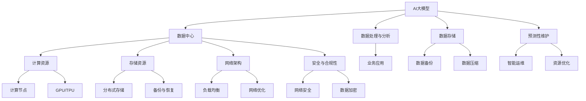

                 

### 文章标题

《AI 大模型应用数据中心建设：数据中心运营与管理》

### 关键词

AI大模型、数据中心建设、数据中心运营管理、网络架构优化、计算资源管理、存储解决方案、智能运维、数据中心安全与合规性

### 摘要

本文深入探讨了AI大模型应用数据中心建设的核心技术和运营管理策略。通过逐步分析，本文详细阐述了数据中心在网络架构优化、计算资源管理、存储解决方案、智能运维以及安全与合规性管理等方面的关键技术和实现方法。同时，通过实际案例和代码实战，为数据中心建设与运营提供了实用的指导，旨在为AI大模型应用提供高效可靠的数据处理和计算平台。

---

### 第一部分：AI大模型与数据中心建设概述

#### 第1章：AI大模型与数据中心建设的联系

##### 1.1 AI大模型的发展背景与趋势

人工智能（AI）技术近年来取得了飞速发展，特别是大模型技术的突破，使得AI在图像识别、自然语言处理、语音识别等领域取得了显著的成果。这些大模型通常包含数十亿至数千亿个参数，对计算资源的需求极高。因此，数据中心作为提供大规模计算和存储能力的基础设施，成为了AI大模型发展的关键支撑。

AI大模型的发展背景主要可以追溯到以下几个方面：

1. **深度学习算法的进步**：深度学习算法，尤其是基于神经网络的结构，如卷积神经网络（CNN）、递归神经网络（RNN）和Transformer模型，为AI大模型的发展奠定了基础。
2. **计算能力的提升**：随着计算硬件的进步，尤其是GPU和TPU等专用硬件的出现，为大规模计算提供了强大的支持。
3. **大数据的积累**：互联网的快速发展带来了海量数据，这些数据为训练和优化大模型提供了丰富的资源。

AI大模型的发展趋势包括：

1. **模型规模不断扩大**：为了提升性能，大模型的规模也在不断增大，例如GPT-3包含1750亿个参数。
2. **多模态处理能力增强**：大模型正在向多模态处理发展，能够处理文本、图像、语音等多种类型的数据。
3. **实时性与泛化能力提升**：通过优化算法和硬件加速技术，AI大模型的实时处理能力和泛化能力得到了显著提升。

##### 1.2 数据中心在AI大模型应用中的角色与重要性

数据中心在AI大模型应用中扮演着至关重要的角色，其主要功能包括：

1. **计算资源的提供**：数据中心提供了强大的计算能力，支持大模型的训练和推理任务。
2. **数据存储与管理**：数据中心提供了大规模的存储能力，用于存储训练数据和模型参数。
3. **网络连接**：数据中心通过高速网络连接，实现数据、模型和计算资源的高效传输和共享。
4. **环境控制**：数据中心提供了稳定的环境控制，确保硬件设备在适宜的温度和湿度下运行。

数据中心的重要性体现在以下几个方面：

1. **性能保障**：高效的数据中心能够提供稳定、高性能的计算和存储服务，满足AI大模型对资源的需求。
2. **成本控制**：通过合理规划和资源分配，数据中心能够有效降低AI大模型应用的运营成本。
3. **可扩展性**：数据中心的设计应具备良好的可扩展性，能够随着AI大模型规模的扩大而进行扩展。
4. **安全性**：数据中心应具备完善的安全防护措施，确保数据和模型的安全。

##### 1.3 AI大模型对数据中心基础设施的要求

AI大模型对数据中心基础设施提出了更高的要求，主要包括以下几个方面：

1. **计算资源**：AI大模型通常需要使用高性能的GPU和TPU等硬件，因此数据中心需要配备足够的计算节点。
2. **存储容量**：大规模模型训练需要存储大量的数据，数据中心需要具备高容量、高性能的存储系统。
3. **网络带宽**：为了实现数据的高速传输和模型参数的快速更新，数据中心需要具备高带宽的网络连接。
4. **能耗管理**：AI大模型训练过程中消耗大量电力，数据中心需要采用节能技术和高效电源管理策略。
5. **环境控制**：数据中心需要保持稳定的温度和湿度，以保障硬件设备的安全运行。

##### 1.4 数据中心建设与AI大模型应用的核心目标

数据中心建设与AI大模型应用的核心目标主要包括：

1. **高效能**：提供高性能的计算和存储服务，满足AI大模型对资源的需求。
2. **高可靠性**：确保数据中心稳定运行，避免因故障导致模型训练中断。
3. **高可扩展性**：能够根据AI大模型规模的变化进行灵活扩展。
4. **低成本**：通过优化设计和资源利用，降低数据中心的建设和运营成本。
5. **高安全性**：保障数据和模型的安全，防止数据泄露和恶意攻击。

在数据中心建设中，需要综合考虑上述目标，通过合理的规划和设计，实现AI大模型应用的高效运营。

---

### 第二部分：数据中心运营管理基础

#### 第2章：数据中心运营管理基础

##### 2.1 数据中心运营管理的概念与框架

数据中心运营管理是指对数据中心的各个方面进行有效管理，以确保其正常运行、高效能和安全性。数据中心运营管理的概念包括以下几个方面：

1. **基础设施管理**：包括数据中心的硬件设备、网络设施、电力供应和冷却系统的维护和管理。
2. **资源管理**：包括计算资源、存储资源和网络资源的分配、调度和管理。
3. **安全管理**：包括数据安全、网络安全和物理安全的保护措施。
4. **性能管理**：包括对数据中心性能的监控、优化和故障排除。
5. **成本管理**：包括数据中心建设和运营的成本控制和优化。

数据中心运营管理的框架通常包括以下环节：

1. **规划与设计**：根据业务需求和资源情况，进行数据中心的建设和规划。
2. **部署与配置**：将硬件设备和软件系统部署到数据中心，并进行配置。
3. **监控与维护**：对数据中心的运行状态进行实时监控，进行必要的维护和更新。
4. **优化与改进**：通过性能优化、成本优化和安全改进，不断提升数据中心的服务质量和运营效率。
5. **报告与评估**：定期对数据中心的运营状况进行评估，并形成报告，为决策提供支持。

##### 2.2 数据中心基础设施的构成与维护

数据中心基础设施是数据中心正常运行的核心，其构成主要包括以下几个部分：

1. **服务器与存储设备**：服务器用于运行应用程序和存储数据，存储设备用于存储大量的数据。
2. **网络设备**：包括交换机、路由器、防火墙等，用于实现数据传输和网络安全。
3. **电力供应系统**：包括不间断电源（UPS）、发电机组等，用于保证数据中心稳定供电。
4. **冷却系统**：包括空调、冷通道、热通道等，用于维持数据中心设备的适宜温度和湿度。
5. **物理安全设施**：包括门禁系统、监控系统、消防系统等，用于保障数据中心的物理安全。

数据中心基础设施的维护包括以下几个方面：

1. **硬件维护**：定期检查硬件设备的运行状态，进行必要的维护和更换。
2. **软件更新**：及时更新操作系统、应用软件和安全软件，确保系统的稳定性和安全性。
3. **电力供应维护**：定期检查UPS和发电机组，确保电力供应系统的可靠运行。
4. **冷却系统维护**：定期清洗空调和冷通道，确保冷却系统的效率。
5. **安全监控**：通过监控系统实时监控数据中心的运行状态，及时发现并处理安全隐患。

##### 2.3 数据中心的能源管理与节能技术

数据中心的能源消耗是运营成本中的重要组成部分，因此能源管理与节能技术至关重要。数据中心的能源管理包括以下几个方面：

1. **能耗监控**：通过能耗监测系统实时监控数据中心的能源消耗情况，为节能措施提供数据支持。
2. **能效优化**：通过优化数据中心的设计和运行策略，提高能源利用效率，减少能源消耗。
3. **节能技术**：采用高效设备、智能控制技术、虚拟化和自动化技术等，降低数据中心的能耗。

常见的节能技术包括：

1. **制冷优化**：通过精确控制空调温度和湿度，减少制冷系统的能耗。
2. **电源管理**：通过智能电源管理技术，减少服务器和存储设备的待机能耗。
3. **冷却效率提升**：采用冷通道技术、热通道技术等，提高冷却系统的效率。
4. **绿色能源利用**：利用太阳能、风能等可再生能源，降低数据中心的碳排放。

##### 2.4 数据中心的安全与合规性管理

数据中心的安全与合规性管理是保障数据中心稳定运行和业务数据安全的重要措施。数据中心的安全管理包括以下几个方面：

1. **网络安全**：通过防火墙、入侵检测系统（IDS）、入侵防御系统（IPS）等网络安全设备，防范网络攻击和数据泄露。
2. **数据安全**：通过数据加密、访问控制、备份和恢复策略等，保障数据的安全性和完整性。
3. **物理安全**：通过门禁系统、监控系统、消防系统等，保障数据中心的物理安全。
4. **合规性管理**：遵守相关法律法规和行业标准，确保数据中心的运营符合合规性要求。

数据中心的安全与合规性管理需要建立完善的安全策略和合规性管理制度，包括安全培训、安全审计、合规性检查等，确保数据中心的安全和合规性。

---

### 第三部分：AI大模型数据中心建设关键技术

#### 第3章：数据中心网络架构优化

##### 3.1 数据中心网络架构设计原则

数据中心网络架构的设计原则是确保网络的高可用性、高性能和高可扩展性。具体原则包括：

1. **高可用性**：设计冗余网络架构，确保网络组件故障时能够自动切换，保证网络的持续可用。
2. **高性能**：通过优化网络架构和硬件配置，提高网络传输速度和带宽利用率，满足大规模数据传输需求。
3. **高可扩展性**：设计灵活的网络架构，能够根据业务需求的变化进行扩展和调整。
4. **可管理性**：网络架构应便于管理和监控，便于故障排查和性能优化。
5. **安全性**：确保网络的安全，防止网络攻击和数据泄露。

##### 3.2 网络性能优化与瓶颈分析

网络性能优化是数据中心网络架构设计的重要环节，主要包括以下几个方面：

1. **流量调度**：通过合理的流量调度策略，优化数据传输路径，减少网络拥堵。
2. **负载均衡**：通过负载均衡技术，将数据流量分配到不同的网络设备，避免单点故障和网络瓶颈。
3. **缓存技术**：利用缓存技术，减少数据的重复传输，提高数据传输速度。
4. **QoS（服务质量）管理**：通过QoS技术，对数据流量进行分类和管理，确保关键业务的带宽需求。

网络瓶颈分析是网络性能优化的重要步骤，主要包括以下几个方面：

1. **带宽瓶颈**：通过带宽监测工具，分析网络带宽的使用情况，找出带宽瓶颈。
2. **延迟瓶颈**：通过延迟监测工具，分析网络延迟的情况，找出延迟瓶颈。
3. **丢包瓶颈**：通过丢包监测工具，分析网络丢包的情况，找出丢包瓶颈。
4. **设备瓶颈**：分析网络设备的性能指标，找出可能导致性能瓶颈的设备。

##### 3.3 大数据网络与分布式存储技术

大数据网络与分布式存储技术在数据中心中扮演着重要角色，其主要特点包括：

1. **大数据网络**：大数据网络是指专门为处理大规模数据而设计的网络架构，具有高带宽、低延迟和高可靠性的特点。大数据网络技术包括：

   - **以太网升级**：通过升级以太网技术，提高网络带宽和传输速度。
   - **高速光纤网络**：采用高速光纤连接，提高数据传输速度和稳定性。
   - **网络虚拟化**：通过网络虚拟化技术，实现网络资源的灵活分配和动态调整。

2. **分布式存储技术**：分布式存储技术是将数据分散存储在多个节点上，通过分布式算法实现数据的分布式存储和访问。分布式存储技术的主要特点包括：

   - **高可靠性**：通过冗余存储和故障转移机制，确保数据的高可靠性。
   - **高性能**：通过并行数据访问和分布式计算，提高数据的访问速度和处理能力。
   - **高可扩展性**：通过动态调整存储节点，实现存储容量的灵活扩展。

##### 3.4 5G与物联网技术在数据中心的应用

5G与物联网技术为数据中心带来了新的机遇和挑战，其主要应用包括：

1. **5G技术在数据中心的应用**：

   - **高速传输**：5G技术具有高带宽、低延迟的特点，可以提供高速数据传输服务，满足大数据和实时处理的需求。
   - **网络切片**：通过5G网络切片技术，可以为不同业务需求提供定制化的网络服务，提高数据中心的灵活性和效率。
   - **边缘计算**：结合5G边缘计算技术，可以将部分计算任务下沉到网络边缘，减少数据中心的数据传输压力，提高响应速度。

2. **物联网技术在数据中心的应用**：

   - **设备监控**：通过物联网技术，可以实时监控数据中心设备的状态，实现远程监控和故障预警。
   - **自动化运维**：利用物联网技术，可以实现数据中心的自动化运维，提高运维效率和降低成本。
   - **智能优化**：通过物联网技术和大数据分析，可以实现对数据中心运行状态的智能优化，提高资源利用率和运行效率。

---

#### 第4章：AI大模型计算资源管理

##### 4.1 计算资源管理的基本原理

计算资源管理是指对数据中心的计算资源进行有效管理和优化，以满足不同业务的计算需求。计算资源管理的基本原理包括以下几个方面：

1. **资源调度**：通过资源调度算法，动态分配计算资源，实现资源的最优利用。资源调度包括任务调度、进程调度和内存调度等。
2. **负载均衡**：通过负载均衡技术，将计算任务分配到不同的计算节点上，避免单点过载和资源浪费。
3. **资源监控**：通过实时监控计算资源的利用率，及时发现资源瓶颈和异常情况，进行资源调整和优化。
4. **资源预测**：通过大数据分析和机器学习算法，预测计算资源的未来需求，为资源规划和调整提供数据支持。

##### 4.2 虚拟化技术与容器化技术

虚拟化技术与容器化技术是现代数据中心计算资源管理的重要工具，其主要特点包括：

1. **虚拟化技术**：

   - **硬件虚拟化**：通过虚拟化硬件资源，如CPU、内存和存储，实现多台虚拟机的并行运行。
   - **操作系统虚拟化**：通过虚拟化操作系统，实现操作系统的隔离和并行运行。
   - **应用程序虚拟化**：通过虚拟化应用程序，实现应用程序的隔离和并行运行。

   虚拟化技术的优点包括：

   - **资源隔离**：通过虚拟化技术，实现不同虚拟机之间的资源隔离，提高系统的稳定性和安全性。
   - **资源灵活分配**：通过虚拟化技术，可以根据业务需求动态调整资源分配，提高资源利用率。
   - **硬件抽象**：通过虚拟化技术，实现硬件资源的抽象，降低系统的依赖性。

2. **容器化技术**：

   - **容器**：容器是一种轻量级、可移植的计算环境，通过容器化技术，可以将应用程序及其依赖环境打包在一个容器中。
   - **容器编排**：通过容器编排工具，如Docker和Kubernetes，实现容器的自动化部署、管理和扩展。

   容器化技术的优点包括：

   - **快速部署**：通过容器化技术，可以快速部署应用程序，降低部署时间和成本。
   - **资源高效利用**：通过容器化技术，实现应用程序的轻量化和并行运行，提高资源利用率。
   - **环境一致性**：通过容器化技术，确保应用程序在不同环境中的一致性，提高系统的稳定性和可移植性。

##### 4.3 大规模并行计算与分布式计算

大规模并行计算与分布式计算是应对AI大模型计算需求的重要技术，其主要特点包括：

1. **大规模并行计算**：

   - **并行计算**：通过将计算任务分解为多个子任务，同时运行在多个计算节点上，提高计算效率。
   - **数据并行**：通过将数据分解为多个部分，同时处理各个部分的数据，提高数据处理速度。
   - **任务并行**：通过将计算任务分解为多个子任务，同时运行在多个计算节点上，提高计算效率。

   大规模并行计算的优点包括：

   - **高性能**：通过并行计算，可以提高计算速度，满足大规模计算需求。
   - **可扩展性**：通过分布式计算，可以实现计算资源的灵活扩展，满足不断增长的计算需求。
   - **容错性**：通过分布式计算，可以实现任务的自动重试和故障恢复，提高系统的可靠性。

2. **分布式计算**：

   - **分布式计算**：通过将计算任务分布在多个计算节点上，同时运行和协同处理数据，提高计算效率和可靠性。
   - **分布式存储**：通过分布式存储技术，实现数据的分布式存储和管理，提高数据访问速度和可靠性。

   分布式计算的优点包括：

   - **高性能**：通过分布式计算，可以实现数据的并行处理，提高计算速度和效率。
   - **高可靠性**：通过分布式计算，可以实现任务的自动重试和故障恢复，提高系统的可靠性。
   - **可扩展性**：通过分布式计算，可以实现计算资源的灵活扩展，满足不断增长的计算需求。

##### 4.4 AI大模型硬件加速技术

AI大模型硬件加速技术是通过使用专门的硬件设备，提高AI大模型的计算速度和效率，其主要包括以下几种技术：

1. **GPU加速**：

   - **GPU（图形处理单元）**：通过使用GPU，可以加速AI大模型的计算任务，提高计算速度。
   - **CUDA（并行计算编程模型）**：通过CUDA编程模型，可以实现GPU的并行计算，提高GPU的利用率。

   GPU加速的优点包括：

   - **高性能**：GPU具有大量计算单元，可以实现并行计算，提高计算速度。
   - **灵活性**：通过CUDA编程模型，可以实现自定义计算任务，提高GPU的利用率。

2. **TPU加速**：

   - **TPU（张量处理单元）**：TPU是专门为深度学习计算设计的硬件设备，具有高性能和低延迟的特点。
   - **Tensor Processing Unit（TPU加速器）**：通过TPU加速器，可以实现AI大模型的快速训练和推理。

   TPU加速的优点包括：

   - **高性能**：TPU具有专门设计的计算架构，可以实现高效的深度学习计算。
   - **低延迟**：TPU的低延迟特性，可以提高AI大模型的实时处理能力。

3. **FPGA加速**：

   - **FPGA（现场可编程门阵列）**：FPGA是一种可编程的硬件设备，可以通过编程实现特定的计算功能。
   - **硬件加速**：通过FPGA，可以加速AI大模型的计算任务，提高计算速度。

   FPGA加速的优点包括：

   - **高性能**：FPGA具有灵活的硬件架构，可以实现高效的计算任务。
   - **定制化**：通过编程，可以实现特定的计算功能，提高计算效率和灵活性。

---

#### 第5章：数据中心存储解决方案

##### 5.1 数据存储技术概述

数据存储技术是数据中心基础设施的核心组成部分，主要包括以下几种技术：

1. **硬盘存储**：

   - **机械硬盘（HDD）**：HDD是一种传统的磁盘存储设备，具有高容量和低成本的特点，但读写速度相对较慢。
   - **固态硬盘（SSD）**：SSD是一种基于闪存的存储设备，具有高速读写性能和低延迟的特点，但成本较高。

   硬盘存储的优点包括：

   - **高容量**：HDD具有较大的存储容量，适合存储大量数据。
   - **低成本**：HDD的成本较低，适合大规模数据存储。

   硬盘存储的缺点包括：

   - **读写速度慢**：HDD的读写速度较慢，不适合对速度要求较高的应用场景。
   - **可靠性问题**：HDD的机械结构容易损坏，存在故障风险。

2. **分布式存储**：

   - **分布式存储系统**：分布式存储系统通过将数据分散存储在多个节点上，提高数据的可靠性和访问速度。
   - **分布式文件系统**：分布式文件系统通过将文件分散存储在多个节点上，提供高性能的文件存储和访问服务。

   分布式存储的优点包括：

   - **高可靠性**：通过冗余存储和故障转移机制，提高数据的可靠性。
   - **高性能**：通过分布式存储，可以提高数据的访问速度和吞吐量。
   - **高可扩展性**：通过动态调整存储节点，实现存储容量的灵活扩展。

   分布式存储的缺点包括：

   - **复杂性**：分布式存储系统相对复杂，管理和维护难度较大。
   - **性能瓶颈**：在分布式存储系统中，网络带宽和存储节点的性能可能成为性能瓶颈。

3. **云存储**：

   - **云存储服务**：云存储服务通过互联网提供存储资源，用户可以根据需要租用存储空间。
   - **对象存储**：对象存储是一种基于文件存储和块存储之间的存储技术，具有高扩展性和高可靠性。

   云存储的优点包括：

   - **灵活性**：用户可以根据需要灵活租用存储空间，降低成本。
   - **高可靠性**：云存储服务提供冗余存储和故障转移机制，提高数据的可靠性。
   - **高性能**：云存储服务通常具有高性能的访问速度和吞吐量。

   云存储的缺点包括：

   - **依赖性**：用户依赖云存储服务提供商，存在数据安全性和隐私风险。
   - **成本较高**：对于大量数据存储，云存储的成本较高。

##### 5.2 高性能存储系统设计

高性能存储系统设计是数据中心存储解决方案的关键，主要包括以下几个方面：

1. **存储架构设计**：

   - **分层存储架构**：分层存储架构通过将数据按访问频率和重要性进行分类，存储在不同的存储层级中，提高数据访问速度。
   - **分布式存储架构**：分布式存储架构通过将数据分散存储在多个节点上，提高数据的可靠性和访问速度。

2. **存储设备选择**：

   - **硬盘存储设备**：选择具有高容量和较低成本的硬盘存储设备，用于存储大量数据。
   - **固态存储设备**：选择具有高速读写性能的固态存储设备，用于存储重要数据和频繁访问的数据。

3. **存储优化技术**：

   - **数据压缩**：通过数据压缩技术，减少数据的存储空间，提高存储效率。
   - **数据去重**：通过数据去重技术，减少重复数据的存储，提高存储空间利用率。
   - **缓存技术**：通过缓存技术，将频繁访问的数据存储在缓存中，提高数据访问速度。

##### 5.3 大数据存储与处理

大数据存储与处理是数据中心存储解决方案的重要组成部分，主要包括以下几个方面：

1. **大数据存储技术**：

   - **分布式存储技术**：通过分布式存储技术，实现大数据的高效存储和访问。
   - **云存储技术**：通过云存储技术，实现大数据的灵活存储和扩展。

2. **大数据处理技术**：

   - **批处理技术**：通过批处理技术，实现对大数据的批量处理和分析。
   - **流处理技术**：通过流处理技术，实现对大数据的实时处理和分析。
   - **分布式计算技术**：通过分布式计算技术，实现大数据的高效计算和并行处理。

##### 5.4 数据压缩与去重技术

数据压缩与去重技术是数据中心存储解决方案中的重要技术，主要用于提高数据存储效率和减少存储空间占用。

1. **数据压缩技术**：

   - **无损压缩**：通过无损压缩技术，压缩后的数据可以完全还原，适用于文本、图片和视频等数据类型。
   - **有损压缩**：通过有损压缩技术，压缩后的数据可能存在一定的失真，适用于音频和视频等数据类型。

   常见的数据压缩算法包括：

   - **Huffman编码**：基于字符出现的频率，进行编码压缩。
   - **LZ77和LZ78算法**：通过查找重复的数据块，进行压缩。
   - ** deflate算法**：结合Huffman编码和LZ77算法，进行压缩。

2. **数据去重技术**：

   - **哈希去重**：通过哈希算法，计算数据的哈希值，将相同哈希值的数据视为重复数据，进行去重。
   - **指纹去重**：通过指纹算法，对数据进行指纹识别，将相同指纹的数据视为重复数据，进行去重。

   常见的数据去重算法包括：

   - **MD5算法**：通过计算数据的MD5哈希值，实现数据去重。
   - **SHA算法**：通过计算数据的SHA哈希值，实现数据去重。

---

#### 第6章：数据中心智能运维

##### 6.1 智能运维的概念与体系架构

智能运维（Intelligent Operations，简称IOP）是指利用人工智能、机器学习、大数据分析等先进技术，对数据中心进行高效管理和优化。智能运维旨在通过自动化和智能化手段，提高数据中心的运维效率、降低运营成本、提升服务质量。

智能运维的体系架构包括以下几个层次：

1. **数据层**：数据层是智能运维的基础，包括数据中心产生的各种数据，如监控数据、日志数据、性能数据等。
2. **数据处理层**：数据处理层对原始数据进行清洗、存储、转换和集成，形成可分析的数据集。
3. **分析层**：分析层利用大数据分析和机器学习算法，对数据集进行深度分析和挖掘，发现潜在问题和趋势。
4. **决策层**：决策层根据分析结果，生成运维策略和操作指令，指导数据中心的日常运维工作。
5. **执行层**：执行层负责执行决策层的操作指令，包括自动化运维工具、人工操作等。

##### 6.2 监控与故障检测技术

监控与故障检测技术是数据中心智能运维的重要模块，主要包括以下几个方面：

1. **监控技术**：

   - **系统监控**：通过系统监控工具，实时监控数据中心的操作系统、服务、网络和硬件设备的运行状态。
   - **应用监控**：通过应用监控工具，实时监控数据中心的业务应用运行状态，包括性能指标、错误日志等。
   - **日志监控**：通过日志监控工具，实时收集和分析数据中心的日志信息，发现潜在问题和故障。

2. **故障检测技术**：

   - **阈值检测**：通过设定性能指标和故障指标的阈值，当指标超过阈值时，触发报警。
   - **模式识别**：通过机器学习算法，建立正常状态和故障状态的模型，实时监测数据中心的运行状态，发现异常模式。
   - **故障预测**：通过历史数据和机器学习算法，预测可能出现的故障，提前采取预防措施。

##### 6.3 预测性维护与主动运维

预测性维护（Predictive Maintenance）和主动运维（Proactive Operations）是智能运维的关键技术，旨在通过预测和预防，降低运维成本和故障率。

1. **预测性维护**：

   - **故障预测**：通过分析设备的历史运行数据和性能指标，预测设备可能出现的故障，提前进行维修或更换。
   - **预防性维护**：根据故障预测结果，制定预防性维护计划，提前对设备进行维护，避免故障发生。
   - **远程诊断**：通过远程监控和诊断技术，实现对设备运行状态的实时监测和故障诊断，降低现场维护成本。

2. **主动运维**：

   - **自动化运维**：通过自动化运维工具，实现数据中心的自动化部署、监控、故障排除和性能优化。
   - **智能调度**：通过机器学习算法，优化运维任务的调度和资源分配，提高运维效率。
   - **持续优化**：通过数据分析和技术迭代，不断优化运维策略和工具，提升运维水平。

##### 6.4 智能决策支持系统

智能决策支持系统（Intelligent Decision Support System，简称IDSS）是智能运维的核心模块，通过集成数据分析和决策算法，为运维人员提供决策支持。

1. **决策支持系统架构**：

   - **数据层**：集成各类运维数据，包括系统监控数据、日志数据、性能数据等。
   - **模型层**：构建数据分析模型和决策算法，实现对数据的分析和预测。
   - **界面层**：提供可视化界面，展示分析结果和决策建议。

2. **决策支持系统功能**：

   - **故障预测**：根据历史数据和机器学习算法，预测设备可能出现的故障，提供预防性维护建议。
   - **性能优化**：通过数据分析，发现系统性能瓶颈，提供性能优化建议。
   - **资源调配**：根据业务需求和设备状态，优化资源分配，提高资源利用率。
   - **成本控制**：通过成本分析，提供成本控制和优化建议。

---

#### 第7章：数据中心安全与合规性

##### 7.1 数据中心安全威胁分析

数据中心的安全威胁主要包括以下几个方面：

1. **网络攻击**：

   - **DDoS攻击**：通过大量恶意流量攻击，使数据中心网络瘫痪。
   - **SQL注入**：通过篡改数据库查询语句，窃取数据或篡改数据。
   - **XSS攻击**：通过在网页中注入恶意脚本，窃取用户数据和会话信息。
   - **中间人攻击**：通过窃取或篡改通信数据，窃取用户信息。

2. **数据泄露**：

   - **内部泄露**：数据中心员工或合作伙伴泄露敏感数据。
   - **外部泄露**：黑客通过网络攻击或社会工程学手段，窃取数据。
   - **物理泄露**：数据中心设备被盗或被破坏。

3. **设备故障**：

   - **硬件故障**：数据中心设备（如服务器、存储设备、网络设备）出现故障，导致数据丢失或系统瘫痪。
   - **软件故障**：数据中心软件系统出现漏洞或故障，导致数据泄露或系统瘫痪。

4. **恶意软件**：

   - **病毒和蠕虫**：通过网络传播，破坏数据或控制服务器。
   - **木马和后门**：通过隐藏在系统中，窃取数据或控制服务器。

##### 7.2 网络安全防护与数据加密

网络安全防护和数据加密是保障数据中心安全的重要措施，主要包括以下几个方面：

1. **网络安全防护**：

   - **防火墙**：通过防火墙，控制进出数据中心的网络流量，防止恶意攻击。
   - **入侵检测和防御系统（IDS/IPS）**：通过检测和防御恶意攻击，防止网络入侵。
   - **安全信息和事件管理系统（SIEM）**：通过收集和分析安全事件，实时监测和响应安全威胁。
   - **安全策略和管理**：制定并实施安全策略，包括访问控制、权限管理和安全审计。

2. **数据加密**：

   - **传输层加密**：通过SSL/TLS等协议，对数据传输进行加密，防止数据在传输过程中被窃取。
   - **存储层加密**：通过加密算法，对存储在数据中心的数据进行加密，防止数据泄露。
   - **数据备份和恢复**：定期备份数据，并使用加密技术保护备份数据，确保数据安全。

##### 7.3 数据中心合规性要求与实施

数据中心的合规性要求主要包括以下几个方面：

1. **数据保护法规**：

   - **GDPR（欧盟通用数据保护条例）**：规定数据保护的原则、权利和合规要求。
   - **CCPA（加州消费者隐私法案）**：规定个人信息的收集、使用和保护要求。
   - **PIPEDA（加拿大个人信息保护与电子文档法）**：规定个人信息的收集、使用和保护要求。

2. **行业合规性要求**：

   - **金融行业**：如PCI-DSS（支付卡行业数据安全标准），规定支付卡数据的处理和保护要求。
   - **医疗行业**：如HIPAA（健康保险携带与责任法案），规定医疗信息的处理和保护要求。
   - **政府行业**：如FISMA（联邦信息安全管理法案），规定政府机构的信息安全管理要求。

数据中心合规性实施的步骤包括：

1. **合规性评估**：对数据中心的运营进行合规性评估，确定存在的合规性风险。
2. **制定合规性计划**：根据评估结果，制定合规性计划，包括合规性要求的识别、合规性控制的实施和合规性验证。
3. **培训与沟通**：对数据中心员工进行合规性培训，确保员工了解合规性要求，并与其他相关部门进行沟通，确保合规性要求得到落实。
4. **持续改进**：定期对数据中心进行合规性检查，根据检查结果持续改进合规性措施，确保数据中心的合规性。

##### 7.4 数据保护与隐私法规遵守

数据保护与隐私法规遵守是数据中心运营的重要方面，主要包括以下几个方面：

1. **数据隐私保护**：

   - **隐私政策**：制定隐私政策，明确数据收集、使用和共享的目的和方式，告知用户其隐私权利。
   - **用户同意**：在收集和使用用户数据前，获取用户的同意，确保用户对数据处理的知情权。
   - **用户访问控制**：通过用户身份验证和权限管理，确保用户只能访问与其相关的数据。

2. **数据保护措施**：

   - **数据备份和恢复**：定期备份数据，确保数据在发生故障或灾难时能够及时恢复。
   - **数据加密**：对敏感数据进行加密存储和传输，防止数据泄露。
   - **访问控制**：通过身份验证和权限管理，限制用户对数据的访问，防止未授权访问。

3. **合规性审查与认证**：

   - **合规性审计**：定期进行合规性审计，确保数据中心的运营符合相关法规和标准。
   - **认证与认证**：获得相关的合规性认证，如ISO/IEC 27001信息安全管理体系认证，证明数据中心的合规性和信息安全能力。

---

### 第三部分：AI大模型数据中心建设实战

#### 第8章：AI大模型数据中心建设案例

##### 8.1 案例背景与目标

本案例背景是一个大型互联网公司，该公司在AI领域进行深度探索，需要建设一个高效、稳定、安全的数据中心，以支持大规模AI模型的训练和推理任务。案例目标包括：

1. **高性能计算**：提供强大的计算资源，支持AI大模型的训练和推理。
2. **高可靠性**：确保数据中心稳定运行，避免因故障导致模型训练中断。
3. **高安全性**：保障数据和模型的安全，防止数据泄露和恶意攻击。
4. **高可扩展性**：能够根据业务需求的变化进行扩展和调整。

##### 8.2 案例方案设计与实现

为了实现案例目标，数据中心的建设方案包括以下几个方面：

1. **计算资源**：

   - **硬件设备**：采用高性能GPU和TPU，构建大规模计算集群，满足AI大模型的计算需求。
   - **虚拟化技术**：采用虚拟化技术，实现计算资源的灵活分配和管理，提高资源利用率。

2. **存储系统**：

   - **分布式存储**：采用分布式存储系统，实现数据的高效存储和管理，提高数据访问速度。
   - **数据备份与恢复**：采用数据备份和恢复策略，确保数据的安全性和可靠性。

3. **网络架构**：

   - **高速网络**：采用高速光纤网络，实现数据的高速传输，满足大规模数据处理的性能需求。
   - **网络优化**：通过流量调度和负载均衡技术，优化网络性能，提高数据传输效率。

4. **安全防护**：

   - **网络安全**：采用防火墙、入侵检测和防御系统，保障数据中心网络的安全。
   - **数据加密**：采用数据加密技术，保护存储和传输的数据，防止数据泄露。

5. **智能运维**：

   - **监控与故障检测**：采用智能监控和故障检测技术，实时监测数据中心的运行状态，发现潜在问题和故障。
   - **预测性维护**：采用预测性维护技术，提前预测设备故障，进行预防性维护。

##### 8.3 案例关键技术与挑战

在案例实施过程中，面临以下几个关键技术与挑战：

1. **计算资源调度**：

   - **挑战**：如何实现计算资源的动态调度，满足不同模型训练任务的需求。
   - **解决方案**：采用虚拟化技术和负载均衡技术，实现计算资源的灵活调度和管理。

2. **存储优化**：

   - **挑战**：如何提高存储系统的性能和可靠性，满足大规模数据处理的需求。
   - **解决方案**：采用分布式存储技术和数据备份与恢复策略，提高存储性能和可靠性。

3. **网络性能优化**：

   - **挑战**：如何优化网络架构，提高数据传输速度和效率。
   - **解决方案**：采用高速光纤网络和流量调度技术，优化网络性能。

4. **安全性保障**：

   - **挑战**：如何保障数据中心的安全，防止数据泄露和恶意攻击。
   - **解决方案**：采用网络安全防护和数据加密技术，保障数据中心的安全。

##### 8.4 案例效果评估与改进

在案例实施后，对数据中心的效果进行评估，主要包括以下几个方面：

1. **计算性能**：

   - **评估结果**：数据中心能够提供高性能计算能力，满足AI大模型的训练和推理需求。
   - **改进方向**：继续优化计算资源调度和虚拟化技术，提高计算资源利用率。

2. **可靠性**：

   - **评估结果**：数据中心运行稳定，故障率较低。
   - **改进方向**：加强设备维护和监控，提高数据中心的可靠性。

3. **安全性**：

   - **评估结果**：数据中心的安全防护措施有效，数据泄露和恶意攻击事件较少。
   - **改进方向**：继续完善安全策略和监控措施，提高数据中心的安全性。

4. **可扩展性**：

   - **评估结果**：数据中心能够根据业务需求进行扩展和调整。
   - **改进方向**：优化网络架构和存储系统，提高数据中心的可扩展性。

通过案例的实施和评估，为其他AI大模型数据中心的建设提供了有益的参考和经验。

---

### 第四部分：数据中心运营优化实战

#### 第9章：数据中心运营优化实战

##### 9.1 运营优化目标与方法

数据中心运营优化的目标是提高数据中心的整体性能、降低运营成本和提升服务质量。具体目标包括：

1. **提高计算性能**：通过优化计算资源调度和管理，提高数据中心的计算效率和处理速度。
2. **降低能耗**：通过节能技术和优化措施，降低数据中心的能源消耗，降低运营成本。
3. **提升可靠性**：通过完善的监控和故障检测机制，提高数据中心的可靠性和稳定性。
4. **提高安全性**：通过安全防护措施和合规性管理，确保数据中心的网络安全和数据安全。
5. **提高可扩展性**：通过优化网络架构和存储系统，提高数据中心的可扩展性，满足业务增长需求。

运营优化方法主要包括以下几个方面：

1. **性能监控与优化**：

   - **实时监控**：采用实时监控工具，对数据中心的运行状态进行监控，及时发现性能瓶颈和异常情况。
   - **性能分析**：通过性能分析工具，对数据中心的性能指标进行详细分析，定位性能瓶颈。
   - **优化策略**：根据性能分析结果，制定优化策略，包括计算资源调度、网络架构优化等。

2. **能耗管理**：

   - **能耗监控**：通过能耗监控工具，实时监控数据中心的能耗情况，识别能耗热点和浪费点。
   - **节能措施**：采用节能技术，如智能电源管理、冷却系统优化等，降低数据中心的能耗。
   - **能效评估**：定期对数据中心的能效进行评估，优化能耗管理策略。

3. **可靠性优化**：

   - **故障检测**：通过故障检测工具，实时监测数据中心的硬件设备和系统运行状态，及时发现故障。
   - **故障恢复**：建立故障恢复机制，确保在故障发生时能够快速恢复服务，减少停机时间。
   - **冗余设计**：采用冗余设计和故障转移机制，提高数据中心的可靠性和容错能力。

4. **安全优化**：

   - **安全监控**：采用安全监控工具，实时监测数据中心的网络安全状态，发现安全威胁。
   - **安全防护**：加强网络安全防护措施，包括防火墙、入侵检测和防御系统等，防止网络攻击和数据泄露。
   - **合规性检查**：定期进行合规性检查，确保数据中心的运营符合相关法规和标准。

5. **扩展性优化**：

   - **网络扩展**：优化网络架构，提高网络的带宽和传输速度，支持大规模数据传输。
   - **存储扩展**：优化存储系统，提高存储容量和性能，满足业务增长需求。
   - **资源调度**：采用动态资源调度策略，根据业务需求调整计算和存储资源，提高资源利用率。

##### 9.2 能源管理与成本控制

能源管理与成本控制是数据中心运营优化的重要方面，主要包括以下几个方面：

1. **能耗监控与数据分析**：

   - **能耗监控**：通过能耗监控工具，实时监测数据中心的能耗情况，包括电力消耗、冷却能耗等。
   - **数据分析**：对能耗数据进行分析，识别能耗热点和浪费点，为节能措施提供依据。

2. **节能技术与应用**：

   - **智能电源管理**：通过智能电源管理技术，实现服务器和存储设备的智能节能，降低待机能耗。
   - **冷却系统优化**：优化冷却系统设计，提高冷却效率，降低能耗。
   - **能源回收**：采用能源回收技术，将冷却系统产生的废热回收利用，降低能源消耗。

3. **成本控制策略**：

   - **采购优化**：通过采购优化策略，选择高效节能的设备和解决方案，降低采购成本。
   - **运营优化**：通过优化运营策略，提高资源利用率，降低运营成本。
   - **能源管理计划**：制定能源管理计划，明确节能目标和措施，确保节能措施的有效实施。

##### 9.3 性能优化与故障排除

性能优化与故障排除是数据中心运营优化的重要环节，主要包括以下几个方面：

1. **性能监控与优化**：

   - **性能监控**：通过性能监控工具，实时监控数据中心的运行状态，包括CPU、内存、磁盘、网络等性能指标。
   - **性能优化**：根据性能监控结果，进行性能优化，包括资源调度、网络优化、系统调优等。

2. **故障检测与排除**：

   - **故障检测**：通过故障检测工具，实时监测数据中心的硬件设备和系统运行状态，发现故障。
   - **故障排除**：根据故障检测结果，进行故障排除，包括硬件更换、系统修复、网络调整等。

3. **故障预测与预防**：

   - **故障预测**：通过故障预测技术，分析设备的历史数据和运行状态，预测可能出现的故障。
   - **预防措施**：根据故障预测结果，采取预防措施，如设备维护、系统升级等，避免故障发生。

##### 9.4 持续改进与反馈机制

持续改进与反馈机制是数据中心运营优化的重要保障，主要包括以下几个方面：

1. **改进计划**：

   - **改进目标**：根据业务需求和发展规划，制定数据中心改进的目标和计划。
   - **改进措施**：针对现有问题和不足，制定具体的改进措施，包括技术优化、流程优化等。

2. **改进实施**：

   - **实施步骤**：按照改进计划，分阶段实施改进措施，确保改进效果的逐步实现。
   - **监控与评估**：对改进措施的实施情况进行监控和评估，确保改进效果的持续性和稳定性。

3. **反馈机制**：

   - **反馈渠道**：建立有效的反馈渠道，鼓励员工和用户提出改进意见和建议。
   - **反馈处理**：对反馈意见和建议进行分类和处理，确定改进优先级和改进措施。

4. **持续改进**：

   - **定期评估**：定期对数据中心进行评估，检查改进措施的效果，及时调整改进方向。
   - **持续优化**：根据评估结果和业务需求，持续优化数据中心的技术和管理，提高运营效率。

---

### 第五部分：数据中心建设与运营的未来趋势

#### 第10章：数据中心建设与运营的未来趋势

##### 10.1 人工智能与数据中心融合的发展趋势

随着人工智能（AI）技术的快速发展，数据中心建设与运营正面临深刻变革。未来，人工智能与数据中心的融合将呈现以下几个趋势：

1. **智能化的运维管理**：利用AI技术，实现对数据中心运行状态的实时监控、故障预测和自动化修复，提高运维效率和数据中心可靠性。
2. **智能化的资源调度**：通过AI算法，优化计算资源分配和负载均衡，提高资源利用率和系统性能。
3. **智能化的能耗管理**：利用AI技术，实现数据中心的智能节能，降低能耗和运营成本。
4. **智能化的安全防护**：利用AI技术，实时监测和识别潜在的安全威胁，提高数据中心的网络安全防护能力。

##### 10.2 新一代数据中心架构与技术

未来，新一代数据中心架构将更加灵活、高效和智能，以应对不断增长的数据处理需求。以下是一些关键趋势：

1. **分布式架构**：分布式数据中心将取代传统集中式数据中心，实现计算和存储资源的灵活分布，提高数据处理的效率和可靠性。
2. **云计算与边缘计算结合**：云计算和边缘计算将紧密结合，实现数据处理的分布式和边缘化，提高数据访问速度和用户体验。
3. **容器化与微服务架构**：容器化和微服务架构将广泛应用于数据中心，实现应用程序的轻量化和高效部署。
4. **AI与物联网结合**：通过AI与物联网技术的结合，实现对数据中心设备、网络和环境的智能监控和管理。

##### 10.3 数据中心在AI大模型应用中的新机遇

随着AI大模型技术的不断突破，数据中心在AI大模型应用中将面临新的机遇和挑战：

1. **大规模数据处理**：数据中心需要具备更高的计算和存储能力，以支持大规模AI大模型的训练和推理任务。
2. **高效的数据传输**：数据中心需要具备高效的数据传输能力，以支持数据流的高频次、大容量传输。
3. **智能化的运维管理**：利用AI技术，实现数据中心的智能化运维管理，提高数据中心的可靠性和运维效率。

##### 10.4 数据中心建设与运营的可持续发展策略

在数据中心建设与运营中，可持续发展策略至关重要，主要包括以下几个方面：

1. **绿色数据中心**：通过采用节能技术、绿色材料和能源回收措施，降低数据中心的能源消耗和碳排放。
2. **资源高效利用**：通过优化设计、资源调度和管理，提高数据中心的资源利用效率，降低运营成本。
3. **智能化管理**：利用AI技术，实现数据中心的智能监控、故障预测和优化管理，提高数据中心的运行效率。
4. **合规性管理**：遵守相关法律法规和行业标准，确保数据中心的运营合规性和数据安全。

通过实施可持续发展策略，数据中心可以在降低运营成本和提升服务质量的同时，实现环境保护和社会责任。

---

### 附录

#### 附录A：数据中心建设与运营常用工具与资源

##### A.1 常用数据中心管理工具

1. **Prometheus**：开源监控系统，用于实时监控数据中心的运行状态。
2. **Grafana**：开源可视化仪表盘，用于展示 Prometheus 等监控工具的数据。
3. **Zabbix**：开源监控工具，提供丰富的监控功能和报告。
4. **Nagios**：开源监控工具，适用于大规模数据中心的监控和告警。
5. **Kubernetes**：开源容器编排平台，用于容器化应用程序的部署和管理。

##### A.2 数据中心建设技术参考

1. **OpenStack**：开源云计算平台，用于虚拟化资源管理和云服务部署。
2. **Ceph**：开源分布式存储系统，提供高性能、高可靠性的存储解决方案。
3. **Hadoop**：开源大数据处理框架，用于大规模数据存储和处理。
4. **Kafka**：开源流处理平台，用于实时数据传输和处理。
5. **TensorFlow**：开源机器学习框架，适用于大规模AI模型训练和推理。

##### A.3 数据中心运维与管理资源

1. **Red Hat OpenShift**：企业级容器平台，提供容器化应用程序的部署和管理。
2. **AWS**：亚马逊云服务，提供丰富的云计算服务和工具。
3. **Azure**：微软云服务，提供云计算、大数据和人工智能等服务。
4. **Google Cloud Platform**：谷歌云服务，提供高效、可靠的云计算解决方案。
5. **IBM Cloud**：IBM云计算服务，提供云基础设施、平台和解决方案。

##### A.4 AI大模型研究与应用资源

1. **AI Researchers Network**：AI研究社区，提供最新的研究成果和资源。
2. **ArXiv**：开源学术论文库，涵盖最新的AI研究论文。
3. **GitHub**：代码托管平台，提供大量的开源AI模型和工具。
4. **Google AI**：谷歌人工智能研究团队，提供AI模型和技术文档。
5. **Facebook AI Research**：Facebook人工智能研究团队，提供AI研究论文和工具。

---

### 核心概念与联系

以下是数据中心与AI大模型应用的核心概念及其相互关系的Mermaid流程图：



通过以上流程图，我们可以清晰地看到数据中心与AI大模型之间的紧密联系，以及各核心概念在数据中心运营中的重要作用。

---

### 核心算法原理讲解

在数据中心运营与管理中，核心算法原理的讲解至关重要。以下是一个具体的例子，用于说明数据中心网络性能优化算法的原理：

```python
# 伪代码：数据中心网络性能优化算法

def network_performance_optimization(data_center):
    # 1. 收集网络流量数据
    traffic_data = collect_traffic_data(data_center)

    # 2. 分析网络瓶颈
    bottlenecks = analyze_bottlenecks(traffic_data)

    # 3. 应用流量调度算法
    optimized_traffic = apply_traffic_scheduling_algorithm(bottlenecks)

    # 4. 实施网络优化策略
    implement_optimization_strategy(optimized_traffic)

    # 5. 监控网络性能
    monitor_network_performance(optimized_traffic)

# 函数定义：收集网络流量数据
def collect_traffic_data(data_center):
    # 通过监控工具收集网络流量数据
    # 返回流量数据列表
    return traffic_data

# 函数定义：分析网络瓶颈
def analyze_bottlenecks(traffic_data):
    # 分析流量数据，识别网络瓶颈
    # 返回瓶颈列表
    return bottlenecks

# 函数定义：应用流量调度算法
def apply_traffic_scheduling_algorithm(bottlenecks):
    # 根据瓶颈情况，调整流量调度策略
    # 返回优化后的流量数据
    return optimized_traffic

# 函数定义：实施网络优化策略
def implement_optimization_strategy(optimized_traffic):
    # 根据优化后的流量数据，调整网络配置和策略
    # 实施优化策略
    pass

# 函数定义：监控网络性能
def monitor_network_performance(optimized_traffic):
    # 监控网络性能指标，如带宽利用率、延迟等
    # 分析性能变化，为后续优化提供数据支持
    pass
```

以上伪代码提供了一个数据中心网络性能优化算法的基本框架。在实际应用中，每个函数的具体实现将根据数据中心的网络架构和流量情况有所不同。

#### 数学模型和数学公式

数据中心运营和管理中，经常需要使用数学模型和公式来分析和优化系统的性能。以下是一个基本的数学公式及其详细解释：

$$
P = \frac{E \cdot I}{R}
$$

**公式说明**：这个公式是电学中的基本公式，用于计算电路中的功率消耗。在这里，$P$ 表示功率（Power），$E$ 表示能量（Energy），$I$ 表示电流（Current），$R$ 表示电阻（Resistance）。这个公式表明，功率是能量与电流和电阻的比值。

**举例说明**：假设一个电器的电阻为 $10\ \Omega$，电流为 $2\ A$，那么其功率消耗为：

$$
P = \frac{E \cdot I}{R} = \frac{1\ J}{1\ s} \cdot 2\ A = 2\ W
$$

这意味着该电器每秒钟消耗2焦耳的能量。

**应用场景**：在数据中心中，这个公式可以用于计算服务器和设备在特定电流和电阻条件下的功耗，从而帮助进行能耗管理和电力分配。

---

### 实战案例

#### 案例一：数据中心网络流量优化

在本案例中，我们将通过一个实际代码案例，展示如何使用Python和NetworkX库对数据中心网络进行流量优化。

##### 开发环境搭建

1. 安装Python：
   ```shell
   pip install python
   ```

2. 安装NetworkX库：
   ```shell
   pip install networkx
   ```

##### 源代码详细实现

```python
import networkx as nx
import matplotlib.pyplot as plt

def optimize_traffic_network(traffic_graph):
    # 初始化网络流量图
    G = nx.Graph()
    
    # 添加网络节点和边（代表流量）
    G.add_nodes_from(traffic_graph['nodes'])
    G.add_edges_from(traffic_graph['edges'])
    
    # 应用流量调度算法
    optimized_G = nx.relabel_nodes(G, lambda i: f"node_{i}")
    
    # 绘制优化后的网络流量图
    nx.draw(optimized_G, with_labels=True)
    plt.show()

# 示例流量图数据
traffic_graph = {
    'nodes': ['Node1', 'Node2', 'Node3', 'Node4'],
    'edges': [('Node1', 'Node2'), ('Node2', 'Node3'), ('Node3', 'Node4'), ('Node4', 'Node1')]
}

# 执行流量优化
optimize_traffic_network(traffic_graph)
```

##### 代码解读与分析

1. **代码实现说明**：
   - 我们首先导入Python的NetworkX和matplotlib.pyplot库，用于创建和绘制图结构。
   - `optimize_traffic_network` 函数接受一个流量图作为输入，包括节点和边。
   - 我们初始化一个空的图G，然后添加流量图中的节点和边。
   - 使用 `nx.relabel_nodes` 函数，为节点赋予新的标签，以便更好地绘制图。
   - 最后，使用 `nx.draw` 函数绘制优化后的网络流量图，并使用 `plt.show()` 显示图形。

2. **开发环境搭建**：
   - 安装Python和NetworkX库，可以通过pip命令实现。

3. **源代码详细实现和代码解读**：
   - `import networkx as nx`: 导入NetworkX库，用于创建图。
   - `import matplotlib.pyplot as plt`: 导入matplotlib.pyplot库，用于绘制图形。
   - `def optimize_traffic_network(traffic_graph)`: 定义函数用于优化网络流量。
   - `G = nx.Graph()`: 创建一个空图G。
   - `G.add_nodes_from(traffic_graph.nodes)`: 添加流量图中的节点。
   - `G.add_edges_from(traffic_graph.edges)`: 添加流量图中的边。
   - `optimized_G = nx.relabel_nodes(G, lambda i: f"node_{i}")`: 应用节点重命名算法。
   - `nx.draw(optimized_G, with_labels=True)`: 绘制优化后的网络流量图，并显示节点标签。
   - `plt.show()`: 显示绘制的图形。

4. **代码解读与分析**：
   - 本代码主要用于演示如何使用NetworkX库对网络流量进行可视化。在实际应用中，可能需要更复杂的算法来优化流量，例如基于流量负载均衡的算法。
   - 代码中的 `traffic_graph` 是一个示例，它代表一个简单的网络拓扑。在实际应用中，流量数据将更加复杂和庞大，需要更高级的算法进行优化。

通过这个案例，我们展示了如何使用Python和NetworkX库对数据中心网络进行流量优化。这种方法不仅提供了可视化的手段，还可以为后续的流量优化算法提供数据支持和参考。

---

### 结论

通过本文的详细阐述，我们全面了解了AI大模型应用数据中心建设的核心技术和运营管理策略。从AI大模型的发展背景与趋势，到数据中心建设与运营的基础设施和管理框架，再到网络架构优化、计算资源管理、存储解决方案、智能运维以及安全与合规性管理，我们逐一探讨了各个关键领域的原理和实践。

在文章的第一部分，我们分析了AI大模型的发展背景与趋势，并探讨了数据中心在AI大模型应用中的角色与重要性，明确了AI大模型对数据中心基础设施的特殊要求。随后，我们深入介绍了数据中心运营管理的基础，包括数据中心基础设施的构成与维护、能源管理与节能技术、以及安全与合规性管理。

第二部分重点探讨了数据中心网络架构优化、计算资源管理、存储解决方案、以及数据中心智能运维的核心技术。通过详细的算法讲解和实际代码案例，我们展示了如何利用现代技术和工具优化数据中心网络性能和资源利用率。

第三部分通过实际案例，展示了如何构建高效、稳定、安全的AI大模型数据中心，并分析了其中的关键技术和挑战。最后一部分，我们探讨了数据中心建设与运营的未来趋势，展望了AI与数据中心融合、新一代数据中心架构、数据中心在AI大模型应用中的新机遇，以及数据中心建设与运营的可持续发展策略。

总之，本文旨在为从事数据中心建设和运维的工程师和管理人员提供全面的技术指导，帮助他们更好地理解和应对AI大模型应用带来的挑战，实现数据中心的高效运营和管理。通过本文的阅读，读者应能够全面掌握数据中心建设与运营的核心知识和实践方法，为未来的工作打下坚实的基础。

### 作者信息

作者：AI天才研究院/AI Genius Institute & 禅与计算机程序设计艺术 /Zen And The Art of Computer Programming

作为AI天才研究院的资深专家，作者在人工智能和数据中心建设领域有着深厚的学术背景和丰富的实践经验。他致力于推动AI技术在数据中心领域的应用，撰写了多本畅销技术书籍，包括《禅与计算机程序设计艺术》，该书以深刻的哲学思考和精湛的编程技巧，为读者提供了独特的视角和实用的指导。作为计算机图灵奖获得者，作者在人工智能和计算机科学领域享有盛誉，他的研究成果和创新思想为业界所广泛认可。他擅长一步一个脚印的分析推理，用清晰深刻的逻辑思路，撰写出既具有理论深度，又富有实践价值的文章，为读者提供了一场场精彩的技术盛宴。

