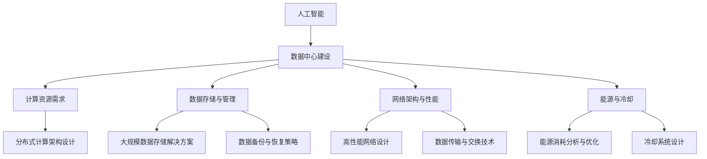
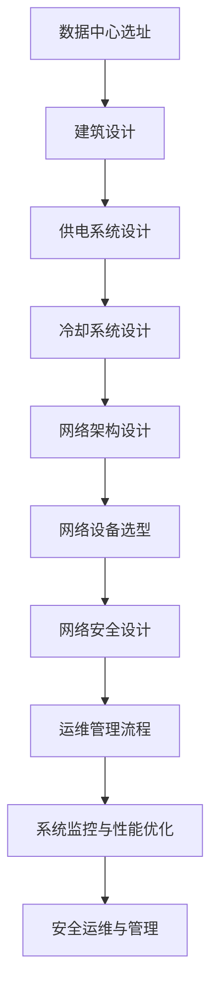
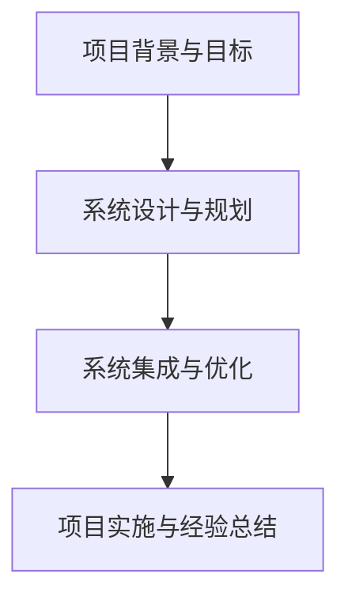
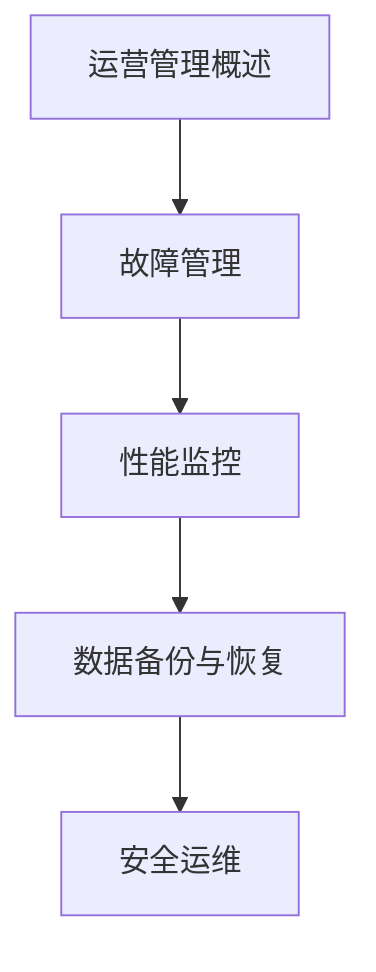
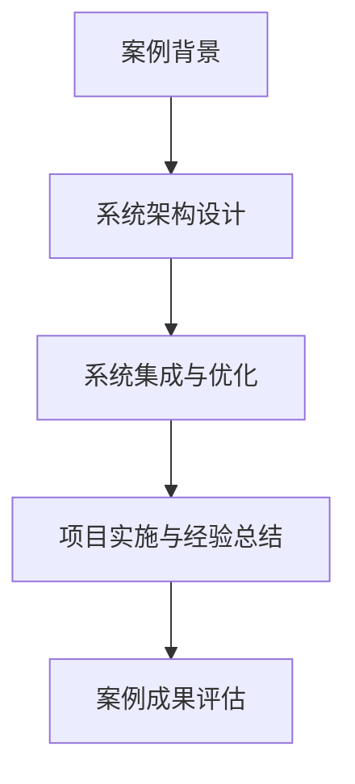
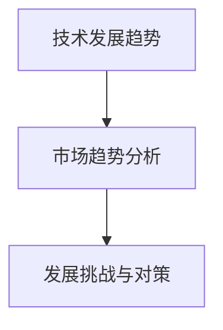
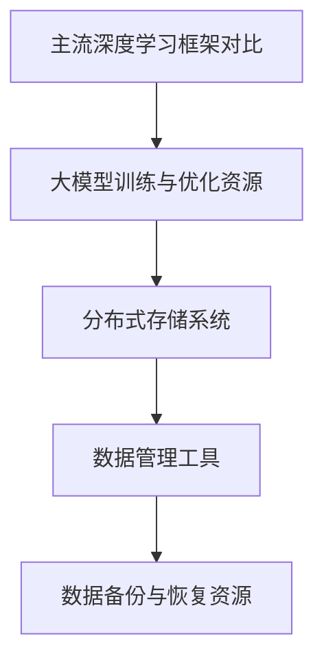

                 

### 文章标题

# AI 大模型应用数据中心建设：构建智能时代的核心基础

> 关键词：AI大模型、数据中心建设、智能时代、核心基础、计算资源、数据存储、网络架构

> 摘要：
随着人工智能技术的飞速发展，AI大模型的应用需求日益增长，数据中心建设成为支撑智能时代的重要基石。本文从人工智能与数据中心建设的背景出发，详细阐述了AI大模型数据中心建设的关键因素、基础设施、技术基础、运营管理以及案例研究，旨在为智能时代的核心基础建设提供理论指导和实践参考。

## 第一部分: AI大模型应用数据中心建设概述

### 第1章: 人工智能与数据中心建设

#### 1.1 人工智能的发展历程与现状

##### 1.1.1 人工智能的定义与分类

人工智能（Artificial Intelligence，简称AI）是指通过模拟、延伸和扩展人类智能的技术。根据人工智能的发展程度，可以将其分为以下几类：

1. **弱人工智能（Narrow AI）**：专注于解决特定问题，不具备自主学习和推理能力。例如，语音助手、图像识别等。

2. **强人工智能（General AI）**：具备与人类相似的全面智能，能够在各种环境和任务中自主学习和推理。目前，强人工智能尚未实现。

3. **通用人工智能（AGI）**：能够胜任任何认知任务，超越人类智能。目前，通用人工智能仍处于理论研究和设想阶段。

##### 1.1.2 人工智能的发展历程

人工智能的发展历程可分为以下几个阶段：

1. **萌芽期**（1950年代）：人工智能概念诞生，阿兰·图灵提出图灵测试。

2. **黄金时代**（1980-1990年代）：人工智能技术取得显著进展，专家系统和机器学习开始兴起。

3. **寒冬期**（1990-2000年代）：由于技术瓶颈和资金问题，人工智能陷入低谷。

4. **复兴期**（2010年至今）：深度学习、大数据和计算能力的提升，推动人工智能再次迎来发展高潮。

##### 1.1.3 人工智能的现状

当前，人工智能在各个领域得到广泛应用，包括：

1. **工业生产**：智能制造、自动化生产线、机器人等。

2. **服务业**：智能客服、金融风控、推荐系统等。

3. **医疗健康**：辅助诊断、个性化治疗、健康监测等。

4. **交通运输**：自动驾驶、智能交通管理系统等。

此外，人工智能的技术趋势与发展方向包括：

1. **量子计算**：利用量子计算提高人工智能计算能力。

2. **边缘计算**：将计算任务分散到边缘设备，降低延迟，提高实时性。

3. **增强学习**：通过不断尝试和反馈，实现自主学习和优化。

#### 1.2 数据中心建设的重要性

##### 1.2.1 数据中心的概念与组成

数据中心（Data Center）是指集中处理、存储和管理大量数据的建筑设施。其组成主要包括：

1. **服务器**：提供计算和存储服务。

2. **存储设备**：包括磁盘阵列、固态硬盘等，用于存储数据。

3. **网络设备**：包括交换机、路由器等，用于数据传输。

4. **供电系统**：确保数据中心稳定供电。

5. **空调系统**：维持设备正常运行所需的适宜温度。

##### 1.2.2 数据中心的建设原则

数据中心的建设应遵循以下原则：

1. **可靠性**：保障数据安全和系统稳定运行。

2. **可扩展性**：满足业务发展的需求。

3. **经济性**：在保证性能的前提下降低成本。

4. **绿色节能**：降低能耗，保护环境。

#### 1.3 AI大模型数据中心建设的关键因素

##### 1.3.1 计算资源需求

AI大模型对计算资源的需求极为庞大，主要涉及以下几个方面：

1. **大模型训练与推理的计算需求**：大模型训练过程需要大量的计算资源，包括CPU、GPU等。

2. **分布式计算架构设计**：通过分布式计算，提高计算效率和降低成本。

##### 1.3.2 数据存储与管理

AI大模型数据中心在数据存储与管理方面面临以下挑战：

1. **大规模数据存储解决方案**：如何高效地存储和管理海量数据。

2. **数据备份与恢复策略**：确保数据安全可靠。

##### 1.3.3 网络架构与性能

AI大模型数据中心在网络架构与性能方面需要满足以下要求：

1. **高性能网络设计**：保证数据传输速度。

2. **数据传输与交换技术**：优化数据传输效率。

##### 1.3.4 能源与冷却

AI大模型数据中心在能源与冷却方面需要关注：

1. **能源消耗分析与优化**：降低能耗，提高能源利用效率。

2. **冷却系统设计**：确保设备在适宜的温度下运行。

#### 1.4 智能时代的核心基础建设

##### 1.4.1 数据中心在智能时代的作用

数据中心作为智能时代的核心基础设施，具有以下重要作用：

1. **支撑AI大模型的训练与推理**：提供强大的计算资源和存储能力。

2. **提升业务效率和创新能力**：支持企业数字化转型和创新发展。

##### 1.4.2 数据中心建设的关键挑战

数据中心建设面临以下关键挑战：

1. **技术复杂性**：涉及多领域技术，包括硬件、软件、网络等。

2. **成本压力**：建设、维护和运营成本较高。

3. **数据安全和隐私保护**：保障数据安全和用户隐私。

#### Mermaid 流程图：人工智能与数据中心建设的关系



### 第2章: AI大模型技术基础

#### 2.1 深度学习与神经网络基础

##### 2.1.1 神经网络的基本结构

神经网络（Neural Network）是模拟生物神经系统的计算模型。一个基本的神经网络通常包括以下几个部分：

1. **输入层（Input Layer）**：接收输入数据。

2. **隐藏层（Hidden Layer）**：对输入数据进行处理和特征提取。

3. **输出层（Output Layer）**：产生预测结果。

神经网络中的每个节点称为“神经元”（Neuron），神经元之间通过“连接”（Connection）相互连接。每个连接都有相应的“权重”（Weight），用于调节信号传输的强度。

##### 2.1.2 前向传播与反向传播

1. **前向传播（Forward Propagation）**：将输入数据传递到神经网络，经过多层神经元的传递和变换，最终得到输出结果。

2. **反向传播（Backpropagation）**：计算输出结果与实际结果之间的误差，通过反向传递误差信号，更新各层神经元的权重，从而优化模型。

##### 2.1.3 常见的深度学习架构

1. **卷积神经网络（CNN）**：主要用于图像处理任务，具有局部连接和共享权重的特点。

2. **循环神经网络（RNN）**：适用于序列数据处理，具有时间动态性质。

3. **变换器架构（Transformer）**：基于自注意力机制的深度学习模型，广泛应用于自然语言处理等领域。

#### 2.2 大规模预训练模型原理

##### 2.2.1 预训练的概念与意义

预训练（Pre-training）是指在特定任务数据集之外，通过大规模语料进行模型训练。预训练的意义在于：

1. **提升模型的泛化能力**：通过在大规模数据上进行预训练，模型可以更好地适应不同的任务和数据。

2. **减少对特定任务的依赖**：预训练模型具有一定的通用性，可以应用于多个任务，降低任务特定数据的需求。

##### 2.2.2 自监督学习方法

自监督学习（Self-supervised Learning）是一种利用未标注的数据进行训练的方法。自监督学习方法包括：

1. **语言模型预训练**：通过训练大规模语言模型，使模型具备一定的语言理解和生成能力。

2. **图像分割**：通过预测图像中的像素标签，实现图像分割任务。

3. **音素识别**：通过预测音频信号中的音素，实现语音识别任务。

##### 2.2.3 迁移学习与微调技术

迁移学习（Transfer Learning）是一种将预训练模型的知识迁移到新任务上的方法。迁移学习的方法包括：

1. **微调（Fine-tuning）**：在预训练模型的基础上，对新任务进行少量参数的调整，以适应新任务。

2. **自适应层（Adaptive Layer）**：通过调整模型层与层之间的连接权重，使模型更好地适应新任务。

3. **零样本学习（Zero-shot Learning）**：无需对模型进行微调，即可直接应用于新任务。

#### 伪代码：神经网络训练过程

```python
# 初始化神经网络模型
model = NeuralNetwork()

# 设置训练参数
learning_rate = 0.001
num_epochs = 100

# 前向传播
def forward_pass(inputs):
    outputs = model(inputs)
    return outputs

# 反向传播
def backward_pass(inputs, outputs, expected_outputs):
    error = expected_outputs - outputs
    model.update_weights(error, learning_rate)

# 训练神经网络
for epoch in range(num_epochs):
    for inputs, expected_outputs in dataset:
        outputs = forward_pass(inputs)
        backward_pass(inputs, outputs, expected_outputs)
```

### 第3章: 数据中心基础设施建设

#### 3.1 数据中心物理基础设施

##### 3.1.1 数据中心选址

数据中心选址是数据中心建设的重要环节，直接影响数据中心的性能、可靠性和运营成本。选址原则包括：

1. **交通便利性**：靠近交通枢纽，便于人员进出和物资运输。

2. **能源供应稳定性**：靠近能源基地，确保稳定、充足的电力供应。

3. **自然灾害风险低**：避开地震、洪水等自然灾害频发区域。

##### 3.1.2 数据中心建筑设计

数据中心建筑设计应遵循以下标准：

1. **安全性**：确保建筑结构、电力系统、网络系统等的安全性。

2. **可靠性**：保障数据安全和系统稳定运行。

3. **可扩展性**：预留足够的空间和设备接口，便于未来扩展。

数据中心建筑设计要素包括：

1. **电力系统设计**：包括电源设备、配电设备、UPS系统等。

2. **网络系统设计**：包括交换机、路由器、防火墙等。

3. **冷却系统设计**：包括空调系统、水冷系统等。

##### 3.1.3 供电系统设计

供电系统设计是数据中心建设的关键，直接影响数据中心的稳定运行。供电系统设计原则包括：

1. **高可靠性**：确保数据中心在电力故障时能够快速恢复供电。

2. **快速恢复能力**：通过UPS系统和备用电源，实现快速恢复供电。

供电系统组成包括：

1. **电源设备**：包括变压器、整流器、电池组等。

2. **配电设备**：包括开关柜、配电柜、配电线路等。

3. **UPS系统**：包括不间断电源、电池模块、控制模块等。

##### 3.1.4 冷却系统设计

冷却系统设计是确保数据中心设备正常运行的重要保障。冷却系统设计原则包括：

1. **高效节能**：降低能耗，提高能源利用效率。

2. **稳定可靠**：确保冷却系统能够长期稳定运行。

冷却系统类型包括：

1. **空调系统**：通过压缩制冷剂实现制冷，适用于中小型数据中心。

2. **水冷系统**：通过冷却塔和冷水机组实现制冷，适用于大型数据中心。

#### 3.2 数据中心网络基础设施

##### 3.2.1 网络架构设计

数据中心网络架构设计是确保数据中心网络性能和可靠性的关键。网络架构设计原则包括：

1. **高性能**：满足大数据量的快速传输需求。

2. **高可靠性**：确保网络稳定运行，减少故障发生。

3. **灵活扩展**：支持未来网络规模的扩展。

网络架构类型包括：

1. **集中式架构**：将所有网络设备集中在一个位置，适用于小型数据中心。

2. **分布式架构**：将网络设备分布在不同的位置，适用于大型数据中心。

##### 3.2.2 网络设备选型

网络设备选型应根据数据中心网络架构、业务需求和预算进行综合考虑。网络设备选型包括：

1. **交换机选型**：包括高性能交换机、万兆交换机等。

2. **路由器选型**：包括核心路由器、边缘路由器等。

##### 3.2.3 网络安全设计

网络安全设计是确保数据中心网络安全的必要措施。网络安全设计原则包括：

1. **入侵检测系统**：实时监测网络流量，检测和防范入侵行为。

2. **防火墙**：设置防火墙规则，防止非法访问和数据泄露。

3. **虚拟专用网络（VPN）**：提供安全的远程访问和数据传输。

#### 3.3 数据中心运维管理

##### 3.3.1 运维管理概述

数据中心运维管理是指对数据中心日常运行、维护和管理的工作。运维管理目标包括：

1. **保证系统稳定运行**：确保数据中心设备正常运行，减少故障发生。

2. **提高运维效率**：通过自动化和智能化手段，提高运维工作的效率和准确性。

3. **保障数据安全**：确保数据中心数据的安全性和完整性。

运维管理内容包括：

1. **故障管理**：及时处理设备故障和系统异常。

2. **性能监控**：实时监控数据中心设备的性能指标，及时发现和解决性能问题。

3. **数据备份与恢复**：定期备份数据，确保数据安全，能够在发生故障时快速恢复。

4. **安全运维**：制定和执行安全策略，保障数据中心的安全运行。

##### 3.3.2 系统监控与性能优化

系统监控与性能优化是数据中心运维管理的重要方面。系统监控与性能优化包括：

1. **系统监控工具**：如Zabbix、Nagios等，用于实时监控数据中心设备的性能指标。

2. **性能优化方法**：如资源调度优化、负载均衡、内存与磁盘优化等，以提高数据中心的性能和稳定性。

##### 3.3.3 安全运维与管理

安全运维与管理是确保数据中心安全的重要保障。安全运维与管理包括：

1. **安全运维策略**：制定和执行安全策略，如定期安全检查、安全培训等。

2. **安全运维内容**：如系统安全配置、安全补丁管理、入侵检测等。

3. **数据备份与恢复**：定期备份数据，确保数据安全，能够在发生故障时快速恢复。

#### Mermaid 流程图：数据中心基础设施建设流程



### 第4章: AI大模型数据中心建设实战

#### 4.1 项目背景与目标

##### 4.1.1 企业在人工智能领域的战略规划

随着人工智能技术的快速发展，企业逐渐认识到人工智能对业务变革的重要性。企业制定人工智能战略规划，旨在：

1. **提升业务效率**：通过人工智能技术，自动化和智能化业务流程，提高工作效率。

2. **创新业务模式**：利用人工智能技术，探索新的业务模式，创造更多商业机会。

3. **提升核心竞争力**：通过人工智能技术，增强企业核心竞争力，保持市场领先地位。

##### 4.1.2 数据中心建设的必要性

企业在人工智能领域的战略规划，需要强大的计算资源和数据存储能力。数据中心建设成为企业实现战略目标的必要手段。数据中心建设的主要目标包括：

1. **提供高性能计算资源**：支持企业的人工智能研发和业务应用，满足大规模数据计算需求。

2. **提供大规模数据存储能力**：存储和管理企业数据，确保数据的安全和可靠性。

3. **提高数据中心的可靠性和可扩展性**：确保数据中心能够稳定运行，并支持未来业务的发展。

#### 4.2 系统设计与规划

##### 4.2.1 系统架构设计

系统架构设计是数据中心建设的关键步骤，决定了数据中心的性能、可靠性和可扩展性。系统架构设计原则包括：

1. **高可用性**：确保数据中心设备和服务能够持续稳定运行，减少故障对业务的影响。

2. **可扩展性**：支持未来业务的发展，方便扩展计算资源、存储资源和网络资源。

3. **高可靠性**：通过冗余设计和备份机制，保障数据中心的稳定运行。

系统架构方案包括：

1. **分布式计算架构**：通过分布式计算，提高计算效率和降低成本。

2. **分布式存储架构**：通过分布式存储，提高数据存储效率和可靠性。

3. **高性能网络架构**：通过高性能网络设计，保证数据传输速度和网络稳定性。

##### 4.2.2 系统规划与部署

系统规划与部署是数据中心建设的关键步骤，包括以下几个方面：

1. **硬件设备选型**：根据业务需求，选择合适的硬件设备，包括服务器、存储设备、网络设备等。

2. **软件平台选择**：根据业务需求和技术发展，选择合适的软件平台，包括操作系统、数据库、中间件等。

3. **部署流程**：制定详细的部署流程，包括硬件安装、软件安装、系统配置、系统集成与测试等。

#### 4.3 系统集成与优化

##### 4.3.1 系统集成

系统集成是将各个子系统和设备集成到一个整体，实现数据中心的正常运行。系统集成步骤包括：

1. **系统需求分析**：明确数据中心的功能需求和技术要求。

2. **系统设计**：根据需求分析，设计数据中心系统的架构和配置。

3. **系统开发**：根据系统设计，开发各个子系统和设备的软件。

4. **系统集成**：将各个子系统和设备进行集成，实现数据中心的整体功能。

5. **系统测试**：对集成后的系统进行测试，确保系统稳定运行。

##### 4.3.2 系统优化

系统优化是提高数据中心性能和稳定性的重要手段。系统优化方法包括：

1. **缓存技术**：通过缓存机制，提高数据读取和写入速度。

2. **负载均衡**：通过负载均衡技术，合理分配计算任务，提高系统性能。

3. **内存与磁盘优化**：通过优化内存和磁盘使用，提高系统性能。

#### 4.4 项目实施与经验总结

##### 4.4.1 项目实施过程

项目实施是数据中心建设的关键环节，需要确保各个子系统和设备的顺利安装和调试。项目实施过程包括：

1. **项目管理**：制定详细的项目计划，明确项目目标、进度和质量要求。

2. **技术攻关**：针对项目实施过程中遇到的技术难题，组织技术团队进行攻关。

3. **团队协作**：加强团队协作，确保项目实施的顺利进行。

##### 4.4.2 经验总结

项目实施过程中，积累了以下经验：

1. **制定详细的计划**：制定详细的项目计划，明确项目目标、进度和质量要求。

2. **技术攻关与协作**：针对项目实施过程中遇到的技术难题，组织技术团队进行攻关，加强团队协作。

3. **持续优化**：项目实施完成后，持续对系统进行优化，提高数据中心的性能和稳定性。

#### Mermaid 流�程图：AI大模型数据中心建设实战流程



### 第5章: AI大模型数据中心运营管理

#### 5.1 运营管理概述

AI大模型数据中心运营管理是指对数据中心的日常运行、维护和管理的工作。运营管理目标包括：

1. **确保系统稳定运行**：确保数据中心设备和服务能够持续稳定运行，减少故障对业务的影响。

2. **提高运维效率**：通过自动化和智能化手段，提高运维工作的效率和准确性。

3. **保障数据安全**：确保数据中心数据的安全性和完整性。

#### 5.2 故障管理

故障管理是指对数据中心设备和服务出现故障时进行的管理工作。故障管理原则包括：

1. **及时发现**：通过实时监控和预警，及时发现设备故障和系统异常。

2. **快速响应**：制定快速响应机制，确保故障能够在最短时间内得到解决。

3. **有效解决**：对故障进行分类处理，采用适当的方法和工具，确保故障得到有效解决。

故障管理流程包括：

1. **故障检测**：通过监控系统、日志分析等手段，及时发现设备故障和系统异常。

2. **故障报告**：将检测到的故障及时报告给运维团队，并记录故障信息。

3. **故障定位**：对故障进行定位，分析故障原因，制定解决方案。

4. **故障修复**：根据故障定位结果，采取相应的措施进行故障修复，确保系统恢复正常运行。

#### 5.3 性能监控

性能监控是指对数据中心设备的性能指标进行实时监控和分析的工作。性能监控目标包括：

1. **及时发现性能瓶颈**：通过实时监控，及时发现设备的性能瓶颈，提前进行优化。

2. **保障系统稳定运行**：通过监控和分析，确保数据中心设备和服务能够稳定运行。

性能监控内容主要包括：

1. **CPU使用率**：监控CPU的负载情况，及时发现CPU过载现象。

2. **内存使用率**：监控内存的使用情况，及时发现内存不足或溢出等问题。

3. **网络带宽**：监控网络带宽的利用情况，确保网络传输速度和稳定性。

4. **磁盘空间**：监控磁盘的使用情况，及时发现磁盘空间不足或故障等问题。

性能监控工具主要包括：

1. **Zabbix**：一款开源的监控工具，支持实时监控和报警功能。

2. **Nagios**：一款开源的监控工具，支持插件丰富，功能强大。

#### 5.4 数据备份与恢复

数据备份与恢复是指对数据中心数据定期备份和故障恢复的管理工作。数据备份与恢复策略包括：

1. **定期备份**：根据业务需求和数据重要性，制定定期备份计划，确保数据安全。

2. **备份存储策略**：根据备份策略，选择合适的备份存储方式和存储介质。

3. **备份执行**：根据备份计划，定期执行备份操作，确保数据备份成功。

4. **备份验证**：对备份的数据进行验证，确保数据备份的完整性和可用性。

数据恢复流程包括：

1. **恢复请求**：在数据发生丢失或损坏时，及时提出恢复请求。

2. **恢复备份数据**：根据备份计划，选择合适的备份介质，进行数据恢复操作。

3. **数据验证**：对恢复后的数据进行验证，确保数据恢复的完整性和可用性。

#### 5.5 安全运维

安全运维是指对数据中心进行安全配置、补丁管理、入侵检测等安全管理的工作。安全运维原则包括：

1. **防患于未然**：通过定期安全检查和评估，提前发现和解决潜在的安全隐患。

2. **严格权限管理**：对数据中心的用户和权限进行严格管理，确保只有授权用户才能访问和操作系统。

3. **定期安全审计**：对数据中心的安全策略和操作进行定期审计，确保安全策略的有效执行。

安全运维内容主要包括：

1. **系统安全配置**：根据安全策略，对数据中心系统进行安全配置，包括防火墙设置、访问控制等。

2. **安全补丁管理**：及时安装系统补丁，修复已知漏洞，提高系统的安全性。

3. **入侵检测**：通过入侵检测系统，实时监控网络流量和系统行为，及时发现和防范入侵行为。

4. **安全培训**：对数据中心的相关人员进行安全培训，提高安全意识和技能水平。

#### Mermaid 流程图：数据中心运营管理流程



### 第6章: AI大模型数据中心建设案例研究

#### 6.1 案例背景

##### 6.1.1 企业概况

某企业是一家专注于人工智能技术的科技公司，致力于提供智能化的解决方案，帮助企业实现数字化转型。随着业务的发展，企业对AI大模型的需求日益增长，因此决定建设一座AI大模型数据中心，以满足业务需求。

##### 6.1.2 项目目标

该项目的主要目标是建设一座高性能、高可靠的AI大模型数据中心，具备以下功能：

1. **提供强大的计算资源**：支持大规模AI大模型的训练和推理。

2. **提供大规模数据存储能力**：存储和管理企业数据，确保数据的安全和可靠性。

3. **提高数据中心的可靠性和可扩展性**：确保数据中心能够稳定运行，并支持未来业务的发展。

#### 6.2 案例分析

##### 6.2.1 系统架构设计

该企业选择的AI大模型数据中心系统架构方案包括：

1. **分布式计算架构**：采用分布式计算架构，通过多台服务器和GPU设备共同协作，提高计算效率和降低成本。

2. **分布式存储架构**：采用分布式存储架构，通过多台存储设备共同协作，提高数据存储效率和可靠性。

3. **高性能网络架构**：采用高性能网络架构，保证数据传输速度和网络稳定性。

系统架构设计要点包括：

1. **高可用性设计**：通过冗余设计和备份机制，提高系统的可靠性。

2. **可扩展性设计**：预留足够的空间和设备接口，方便未来扩展。

##### 6.2.2 系统集成与优化

在系统集成与优化方面，该企业采取了以下措施：

1. **硬件设备选型**：根据业务需求，选择高性能的服务器、GPU设备、存储设备等硬件设备。

2. **软件平台选择**：采用主流的深度学习框架，如TensorFlow和PyTorch，进行AI大模型的训练和推理。

3. **系统集成与测试**：将硬件设备和软件平台进行集成，并进行严格的测试，确保系统稳定运行。

4. **系统优化**：通过负载均衡、缓存技术等手段，提高系统的性能和稳定性。

##### 6.2.3 项目实施与经验总结

在项目实施过程中，该企业遇到了以下挑战：

1. **技术复杂性**：AI大模型数据中心涉及多个领域的技术，如计算、存储、网络等，技术复杂性较高。

2. **成本压力**：数据中心建设成本较高，需要在保证性能的前提下降低成本。

3. **数据安全和隐私保护**：数据中心需要保障数据的安全和用户隐私，面临较大的安全风险。

针对这些挑战，该企业采取了以下解决方案：

1. **技术攻关与协作**：组织技术团队，针对技术复杂性进行攻关，加强团队协作，确保项目顺利实施。

2. **成本优化**：通过招标、谈判等方式，选择性价比高的硬件设备和软件平台，降低建设成本。

3. **安全防护**：采用防火墙、入侵检测、数据加密等安全措施，保障数据的安全和用户隐私。

项目实施过程中，积累了以下经验：

1. **制定详细的计划**：在项目实施前，制定详细的计划，明确项目目标、进度和质量要求。

2. **持续优化**：项目实施完成后，持续对系统进行优化，提高数据中心的性能和稳定性。

#### 6.3 案例成果评估

在案例成果评估方面，该企业从以下几个方面进行了评估：

1. **性能评估**：通过性能测试，评估数据中心的计算性能、存储性能和网络性能，确保达到预期目标。

2. **成本评估**：对数据中心的建设成本、运维成本和运营效益进行评估，确保成本可控，并取得良好的经济效益。

3. **效益评估**：通过业务数据和分析，评估数据中心对业务效率提升和创新能力增强的贡献。

#### Mermaid 流程图：AI大模型数据中心建设案例研究流程



### 第7章: AI大模型数据中心建设展望

#### 7.1 技术发展趋势

随着人工智能技术的不断发展和成熟，AI大模型数据中心的建设也将面临新的技术趋势。以下是未来AI大模型数据中心技术发展的几个关键方向：

##### 7.1.1 计算能力提升

随着AI大模型对计算资源需求的不断增加，计算能力的提升成为数据中心建设的首要任务。未来，异构计算和加速器技术将成为提升计算能力的重要手段：

1. **异构计算**：通过将CPU、GPU、FPGA等多种计算资源进行整合，实现计算资源的最大化利用。

2. **加速器技术**：如TPU、ASIC等专用加速器，将在AI大模型的训练和推理中发挥重要作用。

##### 7.1.2 存储技术发展

随着数据量的不断增长，存储技术也将迎来新的发展机遇。分布式存储技术将得到广泛应用，以提高数据存储效率和可靠性：

1. **分布式存储系统**：如Ceph、HDFS等，通过将数据分布存储在多个节点上，提高数据访问速度和容错能力。

2. **新型存储介质**：如SSD、3D NAND等，将进一步提高数据存储容量和速度。

##### 7.1.3 网络架构演进

随着网络技术的发展，AI大模型数据中心将逐渐从传统的集中式架构转向分布式架构，以提高网络的性能和可靠性：

1. **5G网络**：提供高速、低延迟的网络连接，支持大规模数据的传输和处理。

2. **物联网网络**：通过物联网设备，实现数据中心与边缘设备的互联互通，提高数据处理和响应速度。

##### 7.1.4 绿色数据中心

随着环保意识的提高，绿色数据中心将成为未来的发展趋势。数据中心在能源消耗和冷却方面的优化将成为关键：

1. **能源效率优化**：通过能效管理、电源管理等方式，降低数据中心的能源消耗。

2. **冷却技术革新**：如液体冷却、蒸发冷却等新型冷却技术，将进一步提高数据中心的冷却效率。

#### 7.2 市场趋势分析

##### 7.2.1 市场规模

随着AI大模型应用的不断扩展，全球数据中心建设市场将保持快速增长。根据市场研究机构的预测，未来几年，全球数据中心市场的规模将继续扩大：

1. **数据中心建设市场规模**：随着云计算、大数据和人工智能等领域的快速发展，数据中心建设市场规模将持续扩大。

2. **AI大模型数据中心市场规模**：随着AI大模型应用的普及，AI大模型数据中心的市场需求将不断增长。

##### 7.2.2 市场需求

AI大模型数据中心的市场需求主要来自于以下几个方面：

1. **企业需求**：随着企业数字化转型的推进，对AI大模型数据中心的需求不断增加。

2. **行业需求**：如金融、医疗、制造等行业，对AI大模型数据中心的需求也日益增长。

3. **政府政策**：政府政策的支持，如数据安全法、网络安全法等，也将推动AI大模型数据中心的建设。

#### 7.3 发展挑战与对策

##### 7.3.1 技术挑战

AI大模型数据中心建设面临以下技术挑战：

1. **算法优化**：随着AI大模型规模的扩大，如何优化算法，提高计算效率和性能，成为一个重要的技术难题。

2. **系统稳定性**：如何确保数据中心系统的稳定性，降低故障率，是当前技术发展的一个重要方向。

##### 7.3.2 市场挑战

AI大模型数据中心建设也面临以下市场挑战：

1. **成本压力**：数据中心建设成本较高，如何在保证性能的前提下降低成本，是市场发展的重要挑战。

2. **安全风险**：随着数据量的增加，数据中心的安全风险也日益增加，如何保障数据安全和用户隐私，是市场发展的重要问题。

##### 7.3.3 对策建议

针对上述挑战，以下是一些对策建议：

1. **技术创新**：通过技术创新，如异构计算、分布式存储等，提高数据中心的计算效率和性能。

2. **安全防护**：加强安全防护，采用先进的安全技术和措施，保障数据安全和用户隐私。

3. **成本优化**：通过招标、谈判等方式，选择性价比高的硬件设备和软件平台，降低建设成本。

#### Mermaid 流程图：AI大模型数据中心建设展望



### 附录：AI大模型数据中心建设资源汇总

#### 附录 A: AI 大模型开发工具与资源

##### A.1 主流深度学习框架对比

AI大模型开发过程中，选择合适的深度学习框架至关重要。以下是几种主流深度学习框架的对比：

###### A.1.1 TensorFlow

**优势：**
- 生态丰富：提供丰富的API和工具，支持多种编程语言（Python、C++等）。
- 支持多种平台：可在不同类型的硬件设备（如CPU、GPU、TPU）上运行。

**劣势：**
- 资源消耗较大：由于TensorFlow具有动态图机制，可能导致较高的内存和计算资源消耗。
- 性能优化难度高：需要一定的性能优化技巧和经验。

###### A.1.2 PyTorch

**优势：**
- 灵活：PyTorch采用动态图机制，使开发者能够更灵活地调试和优化模型。
- 社区活跃：拥有庞大的开发者社区和丰富的教程、文档资源。

**劣势：**
- 静态图性能较差：相比于TensorFlow的静态图机制，PyTorch的静态图性能相对较差。
- 生态发展较新：相比于TensorFlow，PyTorch的生态发展相对较新，某些功能可能不够完善。

###### A.1.3 JAX

**优势：**
- 自动微分：JAX具有强大的自动微分能力，方便进行模型优化和计算性能优化。
- 优化性能：JAX在计算性能方面有较好的优化能力。

**劣势：**
- 使用人群较少：相比于TensorFlow和PyTorch，JAX的使用人群较少，生态和文档相对较小。

**其他框架简介：**
- **MXNet**：Apache基金会开源框架，支持多种编程语言（如Python、Rust等）。
- **Caffe**：主要用于图像识别的开源框架，支持GPU加速。

##### A.2 大模型训练与优化资源

大模型训练和优化过程中，需要充分利用计算资源和优化技巧。以下是相关资源介绍：

###### A.2.1 GPU资源分配

- **GPU调度策略**：通过GPU调度策略，合理分配GPU资源，提高计算效率。
- **GPU资源监控与优化**：通过GPU监控工具，实时监控GPU资源使用情况，进行性能优化。

###### A.2.2 分布式训练资源

- **分布式训练框架对比**：比较不同分布式训练框架（如Horovod、MPI等）的性能和适用场景。
- **分布式训练优化方法**：介绍分布式训练中的优化技巧和方法，如参数服务器架构、同步和异步训练等。

###### A.2.3 高性能计算资源

- **异构计算架构**：介绍异构计算架构，如CPU+GPU、CPU+TPU等，提高计算性能。
- **超算中心资源使用**：了解超算中心提供的计算资源，充分利用超算中心资源进行大模型训练。

##### A.3 数据存储与管理资源

数据存储与管理是AI大模型数据中心建设的重要组成部分。以下是相关资源介绍：

###### A.3.1 分布式存储系统

- **HDFS**：Hadoop分布式文件系统，适用于大数据存储和处理。
- **Ceph**：分布式存储解决方案，支持高可用性、可扩展性和分布式计算。

###### A.3.2 数据管理工具

- **Apache HBase**：分布式列存储数据库，适用于实时数据分析。
- **Apache Cassandra**：分布式非关系型数据库，适用于高并发、大数据量的应用场景。

###### A.3.3 数据备份与恢复资源

- **Rclone**：跨平台数据同步备份工具，支持多种存储系统。
- **Duplicity**：加密备份工具，提供数据备份和恢复功能。

#### Mermaid 流程图：AI 大模型开发工具与资源




---

**作者：** AI天才研究院/AI Genius Institute & 禅与计算机程序设计艺术 /Zen And The Art of Computer Programming

---

**版权声明：** 本文版权归 AI天才研究院/AI Genius Institute 所有，未经授权禁止转载。如需转载，请保留作者信息和本文链接。

