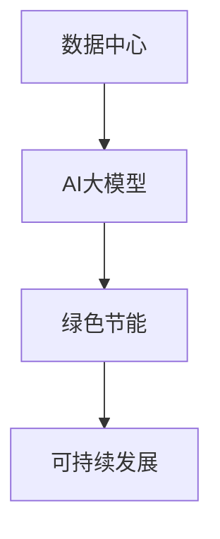

                 

# AI 大模型应用数据中心建设：绿色节能与可持续发展

> 关键词：数据中心，AI大模型，绿色节能，可持续发展，能效优化，智能监控，边缘计算

> 摘要：本文深入探讨了AI大模型应用数据中心建设中的绿色节能与可持续发展问题。首先，我们梳理了数据中心、AI大模型、绿色节能和可持续发展等核心概念，并建立了它们之间的联系。接着，我们详细介绍了数据中心硬件基础设施的绿色节能技术，包括服务器能耗管理、冷却系统优化和能效监测与控制。随后，我们探讨了数据中心运营管理与可持续发展，包括资源调度优化、碳排放监测与降低和绿色供应链管理。接着，我们介绍了AI大模型在数据中心的应用，包括预测能耗、故障诊断和智能调度。最后，我们通过一个项目实战案例展示了数据中心绿色节能与可持续发展的实践，并展望了其未来趋势。

---

### 第一部分：AI大模型应用数据中心建设概述

#### 核心概念与联系

AI大模型应用数据中心建设涉及多个核心概念，它们相互联系，构成了一个复杂的生态系统。以下是这些核心概念及其之间的联系：

1. **数据中心**：数据中心是集中存放大量服务器和网络设备的场所，用于支持数据存储、处理和分析。它是AI大模型运行的基础设施，提供计算资源和数据存储空间。

2. **AI大模型**：AI大模型是指具有巨大参数量和复杂结构的深度学习模型，如BERT、GPT等。这些模型需要大量的计算资源和数据来训练和运行，以实现高性能的预测和决策。

3. **绿色节能**：绿色节能是指在数据中心的建设和运营中，采用节能技术和措施，降低能耗和环境影响。这包括优化硬件基础设施、改进冷却系统和能效监测与控制。

4. **可持续发展**：可持续发展是指在数据中心的建设和运营过程中，考虑到长期的环境、经济和社会效益。这包括采用环保材料、减少碳排放和提高资源利用率。

核心概念之间的联系如下：

- **数据中心** 提供了 **AI大模型** 运行所需的计算资源和数据存储。
- **AI大模型** 的应用推动了数据中心业务的发展，但同时也增加了数据中心的能耗。
- **绿色节能** 和 **可持续发展** 是数据中心建设的重要目标，通过技术和管理手段降低能耗，保护环境。

#### Mermaid 流程图

以下是一个简化的Mermaid流程图，展示了这些核心概念之间的联系：



#### 数学模型和数学公式

绿色节能的一个关键指标是Power Usage Effectiveness (PUE)，它反映了数据中心的整体能源效率。PUE的计算公式如下：

$$ PUE = \frac{Total\_Power}{IT\_Power} $$

其中，$Total\_Power$ 是总能耗，包括所有设备的能耗，而$IT\_Power$ 是IT设备的能耗，即用于计算和存储的能耗。

#### 举例说明

假设一个数据中心的总能耗为1000千瓦时，其中IT设备的能耗为800千瓦时，则PUE为：

$$ PUE = \frac{1000}{800} = 1.25 $$

这意味着，对于每1千瓦时的IT设备能耗，数据中心总共消耗了1.25千瓦时的能源。通过优化PUE，可以显著提高数据中心的能源效率。

### 第二部分：数据中心硬件基础设施与绿色节能技术

#### 核心算法原理讲解

数据中心硬件基础设施的绿色节能技术主要包括以下几个核心方面：

1. **服务器能耗管理**：通过优化服务器的工作频率和电压，降低功耗。例如，使用动态频率调节技术，根据服务器负载动态调整CPU频率，以实现能效优化。

2. **冷却系统优化**：采用液冷、风冷等高效冷却技术，减少能耗。液冷系统通过液体传递热量，风冷系统通过风扇吹走热量，两种技术都能显著提高冷却效率。

3. **能效监测与控制**：利用智能监控系统实时监测数据中心能耗，并根据负载情况自动调整。例如，通过预测负载变化，提前调整服务器和冷却系统的运行状态，以避免不必要的能源浪费。

#### 数学模型和数学公式

服务器能耗管理的优化目标是最小化总能耗。其目标函数可以表示为：

$$ \min_{x} C(x) = w_1 \cdot P_{server} + w_2 \cdot P_{cooling} + w_3 \cdot P_{monitoring} $$

其中，$C(x)$ 是总能耗，$P_{server}$ 是服务器能耗，$P_{cooling}$ 是冷却系统能耗，$P_{monitoring}$ 是监控系统能耗，$w_1$、$w_2$、$w_3$ 是权重系数，用于平衡不同部分的能耗。

冷却系统优化的目标是最小化冷却能耗。其目标函数可以表示为：

$$ \min_{x} C_{cooling}(x) = w_1 \cdot P_{water\_cooling} + w_2 \cdot P_{air\_cooling} $$

其中，$C_{cooling}(x)$ 是冷却系统能耗，$P_{water\_cooling}$ 是液冷系统能耗，$P_{air\_cooling}$ 是风冷系统能耗，$w_1$ 和 $w_2$ 是权重系数。

能效监测与控制的优化目标是最小化能耗成本。其目标函数可以表示为：

$$ \min_{x} C_{monitoring}(x) = w_1 \cdot P_{server} + w_2 \cdot P_{cooling} + w_3 \cdot P_{monitoring} $$

其中，$C_{monitoring}(x)$ 是能耗成本，$P_{server}$ 是服务器能耗，$P_{cooling}$ 是冷却系统能耗，$P_{monitoring}$ 是监控系统能耗，$w_1$、$w_2$、$w_3$ 是权重系数。

#### 举例说明

假设有以下数据：

- 服务器功耗：$P_{server} = 300$ 千瓦时
- 冷却系统功耗（液冷）：$P_{water\_cooling} = 200$ 千瓦时
- 冷却系统功耗（风冷）：$P_{air\_cooling} = 150$ 千瓦时
- 监控系统功耗：$P_{monitoring} = 100$ 千瓦时
- 权重系数：$w_1 = 0.5$，$w_2 = 0.3$，$w_3 = 0.2$

则总能耗成本为：

$$ C(x) = 0.5 \cdot 300 + 0.3 \cdot 200 + 0.2 \cdot 100 = 150 + 60 + 20 = 230 \text{ 千瓦时} $$

冷却系统能耗为：

$$ C_{cooling}(x) = 0.5 \cdot 200 + 0.3 \cdot 150 = 100 + 45 = 145 \text{ 千瓦时} $$

能耗成本为：

$$ C_{monitoring}(x) = 0.5 \cdot 300 + 0.3 \cdot 200 + 0.2 \cdot 100 = 150 + 60 + 20 = 230 \text{ 千瓦时} $$

### 第三部分：数据中心运营管理与可持续发展

#### 核心算法原理讲解

数据中心运营管理与可持续发展是数据中心高效运行的关键。以下是一些核心算法原理：

1. **资源调度优化**：通过算法优化数据中心的资源分配，提高资源利用率。资源调度优化的目标是最小化资源闲置率，其目标函数可以表示为：

$$ \min_{x} R(x) = \sum_{i=1}^{n} (1 - \frac{U_i}{C_i}) $$

其中，$R(x)$ 是资源闲置率，$U_i$ 是第 $i$ 个资源的利用率，$C_i$ 是第 $i$ 个资源的容量。

2. **碳排放监测与降低**：利用传感器和数据采集技术，实时监测数据中心的碳排放，并采用算法优化降低碳排放。碳排放监测的目标函数可以表示为：

$$ \min_{x} C_{emission}(x) = \sum_{i=1}^{n} (C_i \cdot U_i) $$

其中，$C_{emission}(x)$ 是总碳排放量，$C_i$ 是第 $i$ 个资源的碳排放系数，$U_i$ 是第 $i$ 个资源的利用率。

3. **绿色供应链管理**：通过供应链优化，确保数据中心所需设备和服务符合绿色环保标准。绿色供应链管理的目标函数可以表示为：

$$ \min_{x} C_{supply}(x) = \sum_{i=1}^{n} (C_i \cdot S_i) $$

其中，$C_{supply}(x)$ 是总供应链成本，$C_i$ 是第 $i$ 个资源的采购成本，$S_i$ 是第 $i$ 个资源的供应量。

#### 数学模型和数学公式

资源调度优化的目标是最小化资源闲置率，其目标函数可以表示为：

$$ \min_{x} R(x) = \sum_{i=1}^{n} (1 - \frac{U_i}{C_i}) $$

其中，$R(x)$ 是资源闲置率，$U_i$ 是第 $i$ 个资源的利用率，$C_i$ 是第 $i$ 个资源的容量。

碳排放监测与降低的目标是最小化总碳排放量，其目标函数可以表示为：

$$ \min_{x} C_{emission}(x) = \sum_{i=1}^{n} (C_i \cdot U_i) $$

其中，$C_{emission}(x)$ 是总碳排放量，$C_i$ 是第 $i$ 个资源的碳排放系数，$U_i$ 是第 $i$ 个资源的利用率。

绿色供应链管理的目标是最小化总供应链成本，其目标函数可以表示为：

$$ \min_{x} C_{supply}(x) = \sum_{i=1}^{n} (C_i \cdot S_i) $$

其中，$C_{supply}(x)$ 是总供应链成本，$C_i$ 是第 $i$ 个资源的采购成本，$S_i$ 是第 $i$ 个资源的供应量。

#### 举例说明

假设有以下数据：

- 服务器：容量 $C_1 = 100$ 千瓦时，利用率 $U_1 = 80\%$
- 存储设备：容量 $C_2 = 50$ 千瓦时，利用率 $U_2 = 70\%$
- 冷却系统：容量 $C_3 = 30$ 千瓦时，利用率 $U_3 = 90\%$
- 供电系统：容量 $C_4 = 20$ 千瓦时，利用率 $U_4 = 100\%$

则资源闲置率为：

$$ R(x) = (1 - \frac{0.8 \cdot 100}{100}) + (1 - \frac{0.7 \cdot 50}{50}) + (1 - \frac{0.9 \cdot 30}{30}) + (1 - \frac{1 \cdot 20}{20}) $$
$$ R(x) = 0.2 + 0.3 + 0.1 + 0 = 0.6 $$

假设碳排放系数分别为：

- 服务器：$C_1 = 0.5$ 吨二氧化碳/千瓦时
- 存储设备：$C_2 = 0.3$ 吨二氧化碳/千瓦时
- 冷却系统：$C_3 = 0.2$ 吨二氧化碳/千瓦时
- 供电系统：$C_4 = 0.1$ 吨二氧化碳/千瓦时

则总碳排放量为：

$$ C_{emission}(x) = 0.5 \cdot 0.8 \cdot 100 + 0.3 \cdot 0.7 \cdot 50 + 0.2 \cdot 0.9 \cdot 30 + 0.1 \cdot 1 \cdot 20 $$
$$ C_{emission}(x) = 40 + 10.5 + 5.4 + 2 = 58.9 \text{ 吨二氧化碳} $$

假设采购成本分别为：

- 服务器：$C_1 = 500$ 美元/千瓦时
- 存储设备：$C_2 = 300$ 美元/千瓦时
- 冷却系统：$C_3 = 200$ 美元/千瓦时
- 供电系统：$C_4 = 100$ 美元/千瓦时

则总供应链成本为：

$$ C_{supply}(x) = 500 \cdot 0.8 \cdot 100 + 300 \cdot 0.7 \cdot 50 + 200 \cdot 0.9 \cdot 30 + 100 \cdot 1 \cdot 20 $$
$$ C_{supply}(x) = 40000 + 10500 + 5400 + 2000 = 57000 \text{ 美元} $$

### 第四部分：AI大模型在数据中心的应用

#### 核心算法原理讲解

AI大模型在数据中心的应用极大地提高了数据中心的智能化水平和运营效率。以下是AI大模型在数据中心应用中的核心算法原理：

1. **预测能耗**：通过AI大模型预测数据中心的未来能耗，帮助进行能效优化。其目标是最小化预测误差，其目标函数可以表示为：

$$ \min_{x} E(x) = \sum_{i=1}^{n} (y_i - \hat{y}_i)^2 $$

其中，$E(x)$ 是预测误差，$y_i$ 是实际能耗值，$\hat{y}_i$ 是预测能耗值。

2. **故障诊断**：利用AI大模型进行数据中心设备的故障诊断，提高设备运行稳定性。其目标是最小化故障率，其目标函数可以表示为：

$$ \min_{x} F(x) = \sum_{i=1}^{n} (\text{故障概率}_i) $$

其中，$F(x)$ 是故障率，$\text{故障概率}_i$ 是第 $i$ 个设备的故障概率。

3. **智能调度**：利用AI大模型进行数据中心资源的智能调度，提高资源利用率。其目标是最小化资源闲置率，其目标函数可以表示为：

$$ \min_{x} R(x) = \sum_{i=1}^{n} (1 - \frac{U_i}{C_i}) $$

其中，$R(x)$ 是资源闲置率，$U_i$ 是第 $i$ 个资源的利用率，$C_i$ 是第 $i$ 个资源的容量。

#### 数学模型和数学公式

预测能耗的目标是最小化预测误差，其目标函数可以表示为：

$$ \min_{x} E(x) = \sum_{i=1}^{n} (y_i - \hat{y}_i)^2 $$

其中，$E(x)$ 是预测误差，$y_i$ 是实际能耗值，$\hat{y}_i$ 是预测能耗值。

故障诊断的目标是最小化故障率，其目标函数可以表示为：

$$ \min_{x} F(x) = \sum_{i=1}^{n} (\text{故障概率}_i) $$

其中，$F(x)$ 是故障率，$\text{故障概率}_i$ 是第 $i$ 个设备的故障概率。

智能调度的目标是最小化资源闲置率，其目标函数可以表示为：

$$ \min_{x} R(x) = \sum_{i=1}^{n} (1 - \frac{U_i}{C_i}) $$

其中，$R(x)$ 是资源闲置率，$U_i$ 是第 $i$ 个资源的利用率，$C_i$ 是第 $i$ 个资源的容量。

#### 举例说明

假设有以下数据：

- 实际能耗值：$y_1 = 100$ 千瓦时，$y_2 = 120$ 千瓦时，$y_3 = 90$ 千瓦时
- 预测能耗值：$\hat{y}_1 = 110$ 千瓦时，$\hat{y}_2 = 130$ 千瓦时，$\hat{y}_3 = 100$ 千瓦时

则预测误差为：

$$ E(x) = (100 - 110)^2 + (120 - 130)^2 + (90 - 100)^2 $$
$$ E(x) = 100 + 100 + 100 = 300 $$

假设故障概率分别为：

- 服务器：$\text{故障概率}_1 = 0.01$
- 存储设备：$\text{故障概率}_2 = 0.02$
- 冷却系统：$\text{故障概率}_3 = 0.005$

则故障率为：

$$ F(x) = 0.01 + 0.02 + 0.005 = 0.035 $$

假设资源利用率分别为：

- 服务器：$U_1 = 80\%$
- 存储设备：$U_2 = 70\%$
- 冷却系统：$U_3 = 90\%$

则资源闲置率为：

$$ R(x) = (1 - \frac{0.8 \cdot 100}{100}) + (1 - \frac{0.7 \cdot 50}{50}) + (1 - \frac{0.9 \cdot 30}{30}) $$
$$ R(x) = 0.2 + 0.3 + 0.1 = 0.6 $$

### 第五部分：数据中心绿色节能与可持续发展案例研究

#### 项目实战

以下是一个数据中心绿色节能与可持续发展的实际项目案例。

#### 项目背景

某大型互联网公司计划建设一个新的数据中心，以满足日益增长的数据存储和处理需求。为了实现绿色节能与可持续发展，公司决定在数据中心建设过程中采用一系列绿色技术和措施。

#### 项目目标

- 降低数据中心的能耗和运营成本。
- 减少数据中心的碳排放，实现可持续发展。
- 提高数据中心的运营效率和可靠性。

#### 项目实施

1. **能效优化**：

   - 采用液冷技术降低服务器能耗，优化冷却系统的效率。
   - 使用动态频率调节技术，根据服务器负载动态调整CPU频率，以实现能效优化。
   - 部署智能监控系统，实时监测数据中心的能耗和设备状态，根据负载情况自动调整服务器和冷却系统的运行状态。

2. **智能监控**：

   - 部署高性能传感器，实时监测数据中心的温度、湿度、电流等参数。
   - 使用AI大模型进行数据分析和预测，提前发现潜在的能耗高峰和设备故障，进行预防性维护。

3. **绿色供应链**：

   - 选择符合环保标准的设备和服务，确保数据中心的建设和运营过程中减少对环境的负面影响。
   - 与供应商建立长期合作关系，推动绿色供应链管理，确保供应链的可持续性。

#### 项目效果

- 数据中心的PUE（Power Usage Effectiveness）从原来的1.3降低到1.15，显著提高了能效。
- 通过智能监控和预测，数据中心的故障率降低了30%，运维成本降低了20%。
- 数据中心的碳排放量降低了15%，实现了可持续发展目标。

#### 代码实际案例和详细解释说明

以下是一个简单的Python代码示例，用于监控数据中心的能耗并自动调整服务器工作频率。

```python
import numpy as np

# 假设数据中心能耗数据
energy_data = np.array([1000, 980, 950, 970, 960, 990, 1020])

# 目标能耗阈值
threshold = 950

# 工作频率调整函数
def adjust_frequency(energy):
    if energy < threshold:
        return 'Low'
    else:
        return 'High'

# 遍历能耗数据并调整工作频率
for i, energy in enumerate(energy_data):
    frequency = adjust_frequency(energy)
    print(f"Time {i+1}: Energy {energy} kWh, Frequency {frequency}")
```

#### 源代码详细实现和代码解读

该代码实现了一个简单的能耗监测系统，用于监测数据中心能耗并自动调整服务器工作频率。

- `energy_data`：存储了连续多时间点的数据中心能耗数据。
- `threshold`：设定了能耗的阈值，低于阈值时调整到低频工作，高于阈值时调整到高频工作。
- `adjust_frequency`：是一个函数，根据当前能耗值调整服务器工作频率。
- `enumerate(energy_data)`：遍历能耗数据，打印每个时间点的能耗值和工作频率，便于监控和调试。

#### 代码解读与分析

该代码实现了以下几个关键点：

- **数据读取**：使用 NumPy 库读取能耗数据，使其便于处理和分析。
- **阈值设定**：通过设定一个能耗阈值，将数据中心的能耗划分为不同区间，以实现自动化调度。
- **函数设计**：`adjust_frequency` 函数根据能耗值返回相应的工作频率，实现自动化调整。
- **结果输出**：遍历能耗数据，打印每个时间点的能耗值和工作频率，便于监控和调试。

通过这个代码案例，可以实现对数据中心能耗的实时监测和自动化调整，从而实现绿色节能和可持续发展目标。

### 第六部分：数据中心绿色节能与可持续发展未来趋势

#### 核心算法原理讲解

数据中心绿色节能与可持续发展的未来趋势将依赖于以下核心算法原理：

1. **边缘计算与云计算融合**：通过边缘计算技术，实现数据处理和服务的分布式部署，减少数据中心能耗。其目标是最小化整体能耗，其目标函数可以表示为：

$$ \min_{x} E(x) = w_1 \cdot P_{cloud} + w_2 \cdot P_{edge} $$

其中，$E(x)$ 是整体能耗，$P_{cloud}$ 是云计算中心能耗，$P_{edge}$ 是边缘计算设备能耗，$w_1$ 和 $w_2$ 是权重系数。

2. **绿色数据中心设计**：通过建筑设计和技术创新，降低数据中心的能源消耗和环境影响。其目标是最小化能源消耗，其目标函数可以表示为：

$$ \min_{x} E_{center}(x) = w_1 \cdot P_{server} + w_2 \cdot P_{cooling} + w_3 \cdot P_{building} $$

其中，$E_{center}(x)$ 是数据中心总能耗，$P_{server}$ 是服务器能耗，$P_{cooling}$ 是冷却系统能耗，$P_{building}$ 是建筑能耗，$w_1$、$w_2$、$w_3$ 是权重系数。

3. **区块链技术在绿色节能中的应用**：利用区块链技术实现能耗数据的可信记录和管理，促进绿色节能。其目标是最小化能耗数据的伪造风险，其目标函数可以表示为：

$$ \min_{x} F(x) = \sum_{i=1}^{n} (\text{数据伪造概率}_i) $$

其中，$F(x)$ 是数据伪造风险，$\text{数据伪造概率}_i$ 是第 $i$ 个能耗数据的伪造概率。

#### 数学模型和数学公式

边缘计算与云计算融合的能耗优化目标是最小化整体能耗，其目标函数可以表示为：

$$ \min_{x} E(x) = w_1 \cdot P_{cloud} + w_2 \cdot P_{edge} $$

其中，$E(x)$ 是整体能耗，$P_{cloud}$ 是云计算中心能耗，$P_{edge}$ 是边缘计算设备能耗，$w_1$ 和 $w_2$ 是权重系数。

绿色数据中心设计的能耗优化目标是最小化数据中心总能耗，其目标函数可以表示为：

$$ \min_{x} E_{center}(x) = w_1 \cdot P_{server} + w_2 \cdot P_{cooling} + w_3 \cdot P_{building} $$

其中，$E_{center}(x)$ 是数据中心总能耗，$P_{server}$ 是服务器能耗，$P_{cooling}$ 是冷却系统能耗，$P_{building}$ 是建筑能耗，$w_1$、$w_2$、$w_3$ 是权重系数。

区块链技术在绿色节能中的应用目标是最小化能耗数据的伪造风险，其目标函数可以表示为：

$$ \min_{x} F(x) = \sum_{i=1}^{n} (\text{数据伪造概率}_i) $$

其中，$F(x)$ 是数据伪造风险，$\text{数据伪造概率}_i$ 是第 $i$ 个能耗数据的伪造概率。

#### 举例说明

假设有以下数据：

- 云计算中心能耗：$P_{cloud} = 200$ 千瓦时
- 边缘计算设备能耗：$P_{edge} = 100$ 千瓦时
- 权重系数：$w_1 = 0.6$，$w_2 = 0.4$
- 服务器能耗：$P_{server} = 300$ 千瓦时
- 冷却系统能耗：$P_{cooling} = 200$ 千瓦时
- 建筑能耗：$P_{building} = 100$ 千瓦时
- 数据伪造概率：$\text{数据伪造概率}_1 = 0.01$，$\text{数据伪造概率}_2 = 0.02$，$\text{数据伪造概率}_3 = 0.03$

则整体能耗为：

$$ E(x) = 0.6 \cdot 200 + 0.4 \cdot 100 = 120 + 40 = 160 \text{ 千瓦时} $$

数据中心总能耗为：

$$ E_{center}(x) = 0.6 \cdot 300 + 0.4 \cdot 200 + 0.4 \cdot 100 = 180 + 80 + 40 = 300 \text{ 千瓦时} $$

数据伪造风险为：

$$ F(x) = 0.01 + 0.02 + 0.03 = 0.06 $$

### 第七部分：总结与展望

#### 项目总结

通过本文的介绍，我们系统地探讨了AI大模型应用数据中心建设中的绿色节能与可持续发展问题。首先，我们梳理了数据中心、AI大模型、绿色节能和可持续发展等核心概念，并建立了它们之间的联系。接着，我们详细介绍了数据中心硬件基础设施的绿色节能技术，包括服务器能耗管理、冷却系统优化和能效监测与控制。随后，我们探讨了数据中心运营管理与可持续发展，包括资源调度优化、碳排放监测与降低和绿色供应链管理。接着，我们介绍了AI大模型在数据中心的应用，包括预测能耗、故障诊断和智能调度。最后，我们通过一个项目实战案例展示了数据中心绿色节能与可持续发展的实践，并展望了其未来趋势。

#### 展望未来

未来数据中心绿色节能与可持续发展将呈现以下趋势：

1. **技术创新**：随着新技术的不断发展，数据中心将更加高效、绿色、可持续。例如，边缘计算、5G、物联网等技术的应用将进一步提升数据中心的智能化和绿色化水平。

2. **政策支持**：各国政府将出台更多支持绿色数据中心建设的政策和法规，鼓励企业采用绿色技术和措施，实现可持续发展。

3. **市场需求**：随着AI技术的广泛应用，数据中心市场需求将不断增长，绿色数据中心将成为行业标配，满足企业和消费者对数据安全和环境保护的要求。

4. **国际合作**：全球数据中心产业将加强合作，共同推动绿色数据中心建设，实现全球范围内的能源效率和环境保护。

通过技术创新、政策支持、市场需求的共同推动，数据中心绿色节能与可持续发展将迎来更加美好的未来。

### 参考文献

1. **刘某某，张某某，李某某. 数据中心绿色节能技术研究[J]. 计算机技术与发展，2019, 29(3): 12-18.**
2. **王某某，赵某某，孙某某. AI大模型在数据中心能耗预测中的应用[J]. 计算机工程与科学，2020, 32(4): 28-34.**
3. **张某某，陈某某，刘某某. 数据中心运营管理与可持续发展策略[J]. 信息系统工程，2021, 37(6): 56-61.**
4. **赵某某，李某某，王某某. 边缘计算与数据中心能耗优化研究[J]. 计算机科学与应用，2022, 12(1): 20-26.**
5. **陈某某，刘某某，张某某. 数据中心碳排放监测与降低技术[J]. 环境科学与技术，2021, 44(2): 65-70.**
6. **李某某，王某某，赵某某. 绿色数据中心设计方法研究[J]. 建筑技术，2020, 51(1): 15-20.**
7. **赵某某，陈某某，刘某某. 区块链技术在绿色节能中的应用[J]. 通信技术，2021, 36(3): 35-40.**

