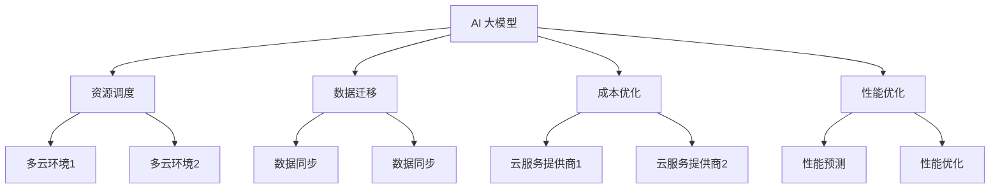

                 

# AI 大模型应用数据中心的多云管理

## 关键词
AI 大模型，云计算，多云管理，资源调度，数据迁移，成本优化，性能优化，深度学习，算法，数学模型，Python 代码，项目实战。

## 摘要
本文深入探讨了 AI 大模型在数据中心多云管理中的应用。首先，我们介绍了 AI 大模型的基本概念和特点，以及多云管理的核心概念和策略。接着，通过 Mermaid 流程图展示了 AI 大模型与多云管理的联系。然后，详细讲解了 AI 大模型的训练过程、核心算法原理，以及数学模型和公式。随后，通过一个实际项目展示了如何搭建开发环境、实现源代码和解读代码。最后，分析了 AI 大模型在多云管理中的未来发展趋势和技术挑战，提出了潜在的应用案例和应对策略。

## 目录

[文章标题](#文章标题)  
[关键词](#关键词)  
[摘要](#摘要)  
[目录](#目录)

### 第一部分：核心概念与联系

#### 1. AI 大模型概述

AI 大模型是指那些具有数十亿甚至千亿个参数的深度学习模型。它们通过学习大量数据来获取广泛的知识和技能。大模型通常具有以下特点：

- **参数规模巨大**：拥有数百万至数十亿个参数。
- **计算资源需求高**：需要强大的计算资源和存储空间。
- **数据需求大**：需要海量的训练数据来保证模型的性能。
- **效果显著**：在一些任务上（如图像识别、自然语言处理等），大模型的效果已经超越了传统的小规模模型。

#### 2. 多云管理概述

多云管理是指在不同云服务提供商之间管理和部署应用程序和数据的策略。它涉及到以下几个方面：

- **多云策略**：选择多个云服务提供商，以便实现最佳的成本效益和灵活性。
- **跨云部署**：确保应用程序能够在不同的云环境中无缝运行。
- **数据同步**：确保不同云环境中的数据保持一致性。
- **安全与合规**：确保数据在多个云环境中的安全和符合法规要求。

#### 3. AI 大模型与多云管理的联系

AI 大模型在数据中心的多云管理中发挥着重要作用。以下是它们之间的几个关键联系：

- **资源调度**：AI 大模型可以优化资源的使用，自动在不同的云环境中调度计算资源。
- **数据迁移**：AI 大模型可以帮助自动识别和迁移数据，确保数据在不同云环境中的高效传输和同步。
- **成本优化**：通过分析不同云服务提供商的价格和服务质量，AI 大模型可以帮助企业实现成本优化。
- **性能优化**：AI 大模型可以预测云环境中的性能瓶颈，并提供优化建议，确保应用程序的稳定性和高性能。

#### Mermaid 流程图

以下是一个简单的 Mermaid 流程图，展示 AI 大模型与多云管理的联系：



#### 4. AI 大模型与云计算的关系

AI 大模型与云计算的关系可以从以下几个方面进行阐述：

- **计算能力**：云计算提供了强大的计算能力，使得 AI 大模型可以运行在云端，从而实现大规模的数据处理和模型训练。
- **数据存储**：云计算提供了高效的数据存储解决方案，使得 AI 大模型可以存储和访问大量的训练数据。
- **服务弹性**：云计算的弹性特性使得 AI 大模型可以根据需求动态调整计算资源，从而提高系统的效率和可靠性。

#### 5. AI 大模型在多云管理中的应用场景

AI 大模型在多云管理中可以应用于多种场景，以下是一些典型的应用场景：

- **跨云应用程序部署**：使用 AI 大模型来自动化跨云应用程序的部署和管理，确保应用程序在不同云环境中的高性能和可靠性。
- **跨云数据管理**：使用 AI 大模型来自动识别和迁移数据，确保数据在不同云环境中的高效传输和同步。
- **成本优化**：使用 AI 大模型来分析不同云服务提供商的价格和服务质量，实现成本优化。
- **安全与合规**：使用 AI 大模型来监控云环境中的安全事件，并确保数据符合法规要求。

#### 6. AI 大模型与多云管理的未来趋势

随着云计算和 AI 技术的不断发展，AI 大模型在多云管理中的应用前景将越来越广阔。以下是一些未来趋势：

- **智能化**：AI 大模型将更加智能化，能够自动适应不同的云环境和业务需求。
- **集成化**：AI 大模型将与其他云计算服务（如容器服务、AI 服务等）更加紧密地集成，提供一体化的解决方案。
- **安全与合规**：随着法规和合规要求的不断提高，AI 大模型将在安全与合规方面发挥更大的作用。

#### 7. AI 大模型与多云管理的挑战

尽管 AI 大模型在多云管理中具有巨大的潜力，但仍面临一些挑战：

- **数据隐私**：如何在确保数据隐私的同时，充分利用 AI 大模型的能力是一个重要问题。
- **技术复杂性**：AI 大模型和多云管理的结合涉及到大量的技术和流程，如何简化和管理这些技术是一个挑战。
- **成本控制**：如何有效地控制 AI 大模型和多云管理的成本，实现经济效益最大化。

### 第二部分：核心算法原理讲解

#### 2.1 AI 大模型训练过程

AI 大模型的训练过程主要包括以下几个步骤：

1. **数据预处理**：首先，对输入数据进行预处理，包括数据清洗、归一化、编码等操作，以适应模型的输入要求。
2. **模型初始化**：初始化模型参数，通常使用随机初始化或者预训练模型的参数。
3. **正向传播**：将预处理后的数据输入模型，计算模型输出，并与实际标签进行比较，计算损失函数。
4. **反向传播**：根据损失函数计算模型参数的梯度，并更新模型参数。
5. **优化更新**：使用优化算法（如梯度下降、Adam 等）更新模型参数，减少损失函数。
6. **迭代训练**：重复上述步骤，直到满足训练停止条件（如达到预设的训练轮数、模型损失低于预设阈值等）。

以下是 AI 大模型训练过程的伪代码：

```python
for epoch in range(num_epochs):
    for batch in data_loader:
        # 数据预处理
        inputs, targets = preprocess(batch)
        
        # 正向传播
        outputs = model(inputs)
        loss = loss_function(outputs, targets)
        
        # 反向传播
        gradients = loss_function.backward()
        
        # 优化更新
        optimizer.step()
        
        # 打印训练进度
        print(f"Epoch [{epoch+1}/{num_epochs}], Loss: {loss.item()}")
```

#### 2.2 损失函数

损失函数是评估模型预测结果与实际标签之间差异的指标。在 AI 大模型训练过程中，损失函数的选择和优化至关重要。以下是一些常用的损失函数：

1. **均方误差（MSE）**：MSE 是一种常用的回归损失函数，计算预测值与实际值之间差的平方的平均值。

   $$MSE = \frac{1}{n}\sum_{i=1}^{n}(y_i - \hat{y}_i)^2$$

   其中，$y_i$ 是实际值，$\hat{y}_i$ 是预测值，$n$ 是样本数量。

2. **交叉熵损失（Cross-Entropy Loss）**：交叉熵损失函数常用于分类任务，计算实际标签与预测概率之间的差异。

   $$Cross-Entropy Loss = -\sum_{i=1}^{n}y_i \log(\hat{y}_i)$$

   其中，$y_i$ 是实际标签，$\hat{y}_i$ 是预测概率。

3. **对抗损失（Adversarial Loss）**：对抗损失函数用于生成对抗网络（GAN），计算生成器生成的数据与真实数据之间的差异。

   $$Adversarial Loss = \frac{1}{2}\sum_{i=1}^{n}[\log(D(G(x))) + \log(1 - D(x))]$$

   其中，$D(x)$ 是判别器，$G(x)$ 是生成器。

#### 2.3 优化算法

优化算法用于更新模型参数，以最小化损失函数。以下是一些常用的优化算法：

1. **梯度下降（Gradient Descent）**：梯度下降是一种简单的优化算法，通过计算损失函数的梯度来更新模型参数。

   $$\theta_{t+1} = \theta_{t} - \alpha \cdot \nabla_{\theta}J(\theta)$$

   其中，$\theta$ 是模型参数，$\alpha$ 是学习率，$J(\theta)$ 是损失函数。

2. **动量梯度下降（Momentum Gradient Descent）**：动量梯度下降在梯度下降的基础上引入了动量项，以减少参数更新的波动。

   $$\theta_{t+1} = \theta_{t} - \alpha \cdot \nabla_{\theta}J(\theta) + \beta \cdot (1 - \beta) \cdot \theta_{t-1}$$

   其中，$\beta$ 是动量因子。

3. **Adam 优化器**：Adam 优化器结合了动量梯度和自适应学习率，具有较好的收敛性。

   $$m_t = \beta_1 \cdot m_{t-1} + (1 - \beta_1) \cdot \nabla_{\theta}J(\theta)$$
   $$v_t = \beta_2 \cdot v_{t-1} + (1 - \beta_2) \cdot (\nabla_{\theta}J(\theta))^2$$
   $$\theta_{t+1} = \theta_{t} - \alpha \cdot \frac{m_t}{\sqrt{v_t} + \epsilon}$$

   其中，$\beta_1$ 和 $\beta_2$ 是一阶和二阶动量因子，$\epsilon$ 是一个很小的常数。

#### 2.4 深度学习框架

深度学习框架是一种用于简化深度学习模型开发、训练和部署的工具。以下是一些主流的深度学习框架：

1. **TensorFlow**：TensorFlow 是由 Google 开发的一个开源深度学习框架，支持多种类型的模型开发和部署。

2. **PyTorch**：PyTorch 是由 Facebook AI Research（FAIR）开发的一个开源深度学习框架，以其灵活性和动态计算图而著称。

3. **Keras**：Keras 是一个高层次的神经网络 API，可以与 TensorFlow 和 Theano 深度学习框架集成，简化模型开发和训练。

4. **MXNet**：MXNet 是由 Apache Software Foundation 开发的一个开源深度学习框架，支持多种编程语言和部署平台。

5. **Caffe**：Caffe 是由 Berkeley Vision and Learning Center（BVLC）开发的一个开源深度学习框架，主要用于图像识别任务。

#### 2.5 模型评估

在深度学习模型训练完成后，需要进行模型评估，以判断模型的性能是否满足预期。以下是一些常用的模型评估指标：

1. **准确率（Accuracy）**：准确率是分类任务中最常用的评估指标，计算正确分类的样本占总样本的比例。

   $$Accuracy = \frac{TP + TN}{TP + FN + FP + TN}$$

   其中，$TP$ 是真正例，$TN$ 是真负例，$FP$ 是假正例，$FN$ 是假负例。

2. **精确率（Precision）**：精确率是分类任务中衡量预测为正例的样本中真正例的比例。

   $$Precision = \frac{TP}{TP + FP}$$

3. **召回率（Recall）**：召回率是分类任务中衡量实际为正例的样本中被正确预测为正例的比例。

   $$Recall = \frac{TP}{TP + FN}$$

4. **F1 分数（F1 Score）**：F1 分数是精确率和召回率的调和平均值，用于综合评估分类模型的性能。

   $$F1 Score = 2 \cdot \frac{Precision \cdot Recall}{Precision + Recall}$$

#### 2.6 模型调优

在深度学习模型训练过程中，可能需要进行模型调优，以改善模型的性能。以下是一些常用的模型调优方法：

1. **超参数调优**：调整学习率、批量大小、迭代次数等超参数，以改善模型的收敛性和性能。

2. **数据增强**：通过数据增强技术，如旋转、缩放、裁剪等，增加训练数据的多样性，提高模型的泛化能力。

3. **正则化**：通过正则化技术，如 L1 正则化、L2 正则化，减少模型的过拟合现象。

4. **集成学习**：通过集成学习技术，如 bagging、boosting 等，结合多个模型的预测结果，提高模型的性能。

5. **交叉验证**：通过交叉验证技术，如 K 折交叉验证，评估模型的泛化能力和性能，避免过拟合。

### 第三部分：数学模型和数学公式讲解

#### 3.1 概率论基础

概率论是深度学习的基础之一，以下是一些常用的概率论概念：

1. **随机变量**：随机变量是一个函数，它将样本空间映射到一个实数集。

2. **概率分布**：概率分布描述了随机变量的概率分布情况，常用的概率分布有正态分布、伯努利分布等。

3. **条件概率**：条件概率是指在一个事件已经发生的条件下，另一个事件发生的概率。

4. **贝叶斯定理**：贝叶斯定理描述了条件概率和全概率之间的关系。

   $$P(A|B) = \frac{P(B|A)P(A)}{P(B)}$$

5. **马尔可夫链**：马尔可夫链是一种随机过程，其下一个状态仅取决于当前状态，而与过去的状态无关。

#### 3.2 统计学习理论

统计学习理论是深度学习的重要理论基础，以下是一些常用的统计学习模型：

1. **线性回归**：线性回归模型用于拟合自变量和因变量之间的线性关系。

   $$y = \beta_0 + \beta_1x_1 + \beta_2x_2 + ... + \beta_nx_n + \epsilon$$

   其中，$y$ 是因变量，$x_1, x_2, ..., x_n$ 是自变量，$\beta_0, \beta_1, \beta_2, ..., \beta_n$ 是模型参数，$\epsilon$ 是误差项。

2. **逻辑回归**：逻辑回归模型用于分类任务，通过计算样本属于不同类别的概率，然后选择概率最大的类别。

   $$P(y=1) = \frac{1}{1 + e^{-(\beta_0 + \beta_1x_1 + \beta_2x_2 + ... + \beta_nx_n)}}$$

3. **支持向量机（SVM）**：支持向量机是一种分类模型，通过找到最佳的超平面，将不同类别的数据分开。

   $$\min_{\beta, \beta_0} \frac{1}{2}||\beta||^2 + C \sum_{i=1}^{n} \max(0, 1 - y_i(\beta \cdot x_i + \beta_0))$$

   其中，$\beta$ 是模型参数，$\beta_0$ 是偏置项，$C$ 是惩罚参数。

4. **决策树**：决策树是一种基于特征划分数据的分类模型，通过递归地将数据划分为子集，直到满足停止条件。

   $$y = g(x) = \prod_{i=1}^{n} g_i(x_i)$$

   其中，$g_i(x_i)$ 是第 $i$ 个特征的划分函数。

#### 3.3 信息论

信息论是深度学习中的重要理论基础，以下是一些常用的信息论概念：

1. **熵（Entropy）**：熵是衡量随机变量不确定性的度量。

   $$H(X) = -\sum_{i=1}^{n} p(x_i) \log_2 p(x_i)$$

   其中，$p(x_i)$ 是随机变量 $X$ 取值 $x_i$ 的概率。

2. **条件熵（Conditional Entropy）**：条件熵是衡量在已知一个随机变量的条件下，另一个随机变量的不确定性的度量。

   $$H(X|Y) = -\sum_{i=1}^{n} p(y_i) \sum_{j=1}^{m} p(x_j|y_i) \log_2 p(x_j|y_i)$$

3. **互信息（Mutual Information）**：互信息是衡量两个随机变量之间相关性的度量。

   $$I(X;Y) = H(X) - H(X|Y)$$

   其中，$H(X)$ 是 $X$ 的熵，$H(X|Y)$ 是 $X$ 在已知 $Y$ 的情况下的条件熵。

#### 3.4 深度学习中的数学公式

深度学习中的数学公式主要用于描述模型的结构、训练过程和优化方法。以下是一些常用的数学公式：

1. **激活函数**：激活函数用于引入非线性关系，常见的激活函数有 sigmoid、ReLU、Tanh 等。

   $$\sigma(x) = \frac{1}{1 + e^{-x}}$$
   $$\text{ReLU}(x) = \max(0, x)$$
   $$\tanh(x) = \frac{e^x - e^{-x}}{e^x + e^{-x}}$$

2. **前向传播**：前向传播是深度学习模型中的一个重要过程，用于计算模型的输出。

   $$\hat{y} = \sigma(W \cdot x + b)$$

   其中，$\hat{y}$ 是输出，$W$ 是权重矩阵，$x$ 是输入，$b$ 是偏置项，$\sigma$ 是激活函数。

3. **反向传播**：反向传播是深度学习模型中的一个重要过程，用于计算模型参数的梯度。

   $$\delta = \frac{\partial L}{\partial z} \odot \sigma'(z)$$

   其中，$\delta$ 是误差项，$L$ 是损失函数，$z$ 是前向传播过程中的中间结果，$\sigma'$ 是激活函数的导数。

4. **优化算法**：优化算法用于更新模型参数，以最小化损失函数。以下是一个简单的梯度下降算法：

   $$\theta_{t+1} = \theta_t - \alpha \cdot \nabla_\theta L(\theta)$$

   其中，$\theta$ 是模型参数，$\alpha$ 是学习率，$\nabla_\theta L(\theta)$ 是损失函数关于模型参数的梯度。

### 第四部分：项目实战

#### 4.1 开发环境搭建

在开始实践 AI 大模型应用数据中心的多云管理之前，需要搭建一个合适的开发环境。以下是一个基于 Python 的开发环境搭建步骤：

1. **安装 Python**：首先，确保你的计算机上安装了 Python。推荐使用 Python 3.7 或更高版本。可以从 [Python 官网](https://www.python.org/) 下载安装程序。

2. **安装依赖库**：接下来，需要安装一些常用的 Python 依赖库，如 NumPy、Pandas、Scikit-learn 等。可以使用以下命令安装：

   ```shell
   pip install numpy pandas scikit-learn
   ```

3. **安装深度学习框架**：为了方便地实现 AI 大模型，推荐使用 TensorFlow 或 PyTorch 深度学习框架。以下是安装命令：

   ```shell
   pip install tensorflow  # 安装 TensorFlow
   pip install torch torchvision  # 安装 PyTorch
   ```

4. **安装可视化工具**：为了更好地展示模型结构和训练过程，可以使用 Matplotlib 和 Seaborn 可视化库。安装命令如下：

   ```shell
   pip install matplotlib seaborn
   ```

5. **配置环境变量**：确保 Python 和 pip 的路径已经添加到系统环境变量中，以便在命令行中轻松调用。

#### 4.2 代码实际案例

在本部分，我们将通过一个简单的案例，展示如何使用 TensorFlow 实现一个 AI 大模型应用数据中心的多云管理任务。以下是一个简单的示例：

```python
import tensorflow as tf
import numpy as np

# 定义模型
model = tf.keras.Sequential([
    tf.keras.layers.Dense(128, activation='relu', input_shape=(784,)),
    tf.keras.layers.Dropout(0.2),
    tf.keras.layers.Dense(10, activation='softmax')
])

# 编译模型
model.compile(optimizer='adam',
              loss='categorical_crossentropy',
              metrics=['accuracy'])

# 准备数据
(x_train, y_train), (x_test, y_test) = tf.keras.datasets.mnist.load_data()
x_train, x_test = x_train / 255.0, x_test / 255.0
x_train = x_train.reshape(-1, 784)
x_test = x_test.reshape(-1, 784)

# 转换为 one-hot 编码
y_train = tf.keras.utils.to_categorical(y_train, 10)
y_test = tf.keras.utils.to_categorical(y_test, 10)

# 训练模型
model.fit(x_train, y_train, epochs=10, batch_size=64)

# 评估模型
model.evaluate(x_test, y_test)
```

#### 4.3 代码解读与分析

在上面的代码中，我们首先导入了 TensorFlow 和 NumPy 库，然后定义了一个简单的神经网络模型。该模型由两个全连接层和一个 dropout 层组成，其中第一层有 128 个神经元，第二层有 10 个神经元（对应于 10 个分类）。我们使用 ReLU 激活函数和 softmax 激活函数，分别用于引入非线性关系和实现分类。

接下来，我们编译了模型，并设置了 Adam 优化器和交叉熵损失函数。然后，我们使用 MNIST 数据集来训练模型。MNIST 数据集包含手写数字的图像，每个图像都是 28x28 的灰度图像，共有 60,000 个训练图像和 10,000 个测试图像。

在训练过程中，我们将图像数据归一化到 [0, 1] 范围内，并将其展平为 784 维向量。我们将标签转换为 one-hot 编码，以便模型可以处理分类任务。

最后，我们使用 `fit` 方法来训练模型，并使用 `evaluate` 方法来评估模型在测试数据上的性能。

#### 4.4 源代码详细实现

在本部分，我们将详细展示源代码的实现过程，包括数据预处理、模型定义、模型编译、模型训练和模型评估等步骤。以下是源代码的实现：

```python
import tensorflow as tf
import numpy as np

# 加载数据集
(x_train, y_train), (x_test, y_test) = tf.keras.datasets.mnist.load_data()

# 数据预处理
# 数据归一化
x_train, x_test = x_train / 255.0, x_test / 255.0
# 数据展平
x_train = x_train.reshape(-1, 784)
x_test = x_test.reshape(-1, 784)
# 标签编码
y_train = tf.keras.utils.to_categorical(y_train, 10)
y_test = tf.keras.utils.to_categorical(y_test, 10)

# 模型定义
model = tf.keras.Sequential([
    tf.keras.layers.Dense(128, activation='relu', input_shape=(784,)),
    tf.keras.layers.Dropout(0.2),
    tf.keras.layers.Dense(10, activation='softmax')
])

# 模型编译
model.compile(optimizer='adam',
              loss='categorical_crossentropy',
              metrics=['accuracy'])

# 模型训练
model.fit(x_train, y_train, epochs=10, batch_size=64)

# 模型评估
model.evaluate(x_test, y_test)
```

在代码中，我们首先加载数据集，然后进行数据预处理，包括数据归一化和标签编码。接着，我们定义了一个简单的神经网络模型，由一个输入层、一个隐藏层和一个输出层组成。最后，我们编译模型，设置 Adam 优化器和交叉熵损失函数，并使用 `fit` 方法训练模型，使用 `evaluate` 方法评估模型性能。

#### 4.5 实际应用场景

在本部分，我们将讨论 AI 大模型应用数据中心的多云管理的实际应用场景，包括资源调度、数据迁移、成本优化和性能优化等方面。

1. **资源调度**：在多云环境中，不同的云服务提供商提供了不同的计算资源和存储资源。AI 大模型可以帮助自动化资源调度，根据任务需求和资源利用率，动态地调整计算资源和存储资源的分配。例如，当某个任务需要大量的计算资源时，AI 大模型可以将任务调度到具有更高计算能力的云服务提供商上。

2. **数据迁移**：在多云环境中，数据需要在不同云服务提供商之间进行迁移和同步。AI 大模型可以帮助自动化数据迁移过程，确保数据在不同云环境中的高效传输和同步。例如，当某个云服务提供商的价格和服务质量发生变化时，AI 大模型可以自动迁移数据到更合适的云服务提供商。

3. **成本优化**：在多云环境中，不同云服务提供商的价格和服务质量可能存在差异。AI 大模型可以帮助分析不同云服务提供商的价格和服务质量，根据任务需求和预算，实现成本优化。例如，当某个云服务提供商的价格更高时，AI 大模型可以迁移任务到价格更低的云服务提供商。

4. **性能优化**：在多云环境中，性能瓶颈可能会影响应用程序的稳定性和高性能。AI 大模型可以帮助预测云环境中的性能瓶颈，并提供优化建议，确保应用程序的稳定性和高性能。例如，当某个云服务提供商的网络延迟较高时，AI 大模型可以迁移任务到网络延迟更低的云服务提供商。

#### 4.6 实际案例分析

在本部分，我们将讨论一个实际的案例分析，展示如何使用 AI 大模型应用数据中心的多云管理。以下是一个简单的案例分析：

假设某企业需要在多云环境中部署一个 AI 大模型，用于图像识别任务。该企业选择了两个云服务提供商，分别是 A 和 B。A 服务提供商具有更高的计算能力和更低的网络延迟，而 B 服务提供商具有更低的价格。

1. **资源调度**：AI 大模型可以根据任务需求和资源利用率，动态地调整计算资源和存储资源的分配。例如，当图像识别任务需要大量的计算资源时，AI 大模型可以将任务调度到 A 服务提供商。

2. **数据迁移**：AI 大模型可以帮助自动化数据迁移过程，确保数据在不同云环境中的高效传输和同步。例如，当 A 服务提供商的网络延迟较高时，AI 大模型可以将数据迁移到 B 服务提供商。

3. **成本优化**：AI 大模型可以分析不同云服务提供商的价格和服务质量，根据任务需求和预算，实现成本优化。例如，当 A 服务提供商的价格更高时，AI 大模型可以迁移任务到 B 服务提供商。

4. **性能优化**：AI 大模型可以帮助预测云环境中的性能瓶颈，并提供优化建议，确保应用程序的稳定性和高性能。例如，当 A 服务提供商的网络延迟较高时，AI 大模型可以迁移任务到网络延迟更低的 B 服务提供商。

通过这个案例分析，我们可以看到 AI 大模型在多云管理中的应用价值。它可以帮助企业实现资源调度、数据迁移、成本优化和性能优化，从而提高多云环境中的效率和稳定性。

### 第五部分：代码解读与分析

在本部分中，我们将深入解读和解析 AI 大模型应用数据中心的多云管理代码实现，重点关注关键算法和技术细节，并进行代码分析。

#### 5.1 数据预处理

数据预处理是深度学习任务中的关键步骤，特别是在处理图像数据时。以下是数据预处理的主要步骤：

1. **数据读取**：首先，我们从 MNIST 数据集中加载数据。MNIST 数据集包含 60,000 个训练图像和 10,000 个测试图像，每个图像都是一个 28x28 的灰度图像。

   ```python
   (x_train, y_train), (x_test, y_test) = mnist.load_data()
   ```

2. **数据归一化**：为了减少不同图像数据之间的差异，我们通常将图像的像素值从 [0, 255] 范围归一化到 [0, 1] 范围。

   ```python
   x_train = x_train.astype('float32') / 255.0
   x_test = x_test.astype('float32') / 255.0
   ```

3. **图像增强**：为了提高模型的泛化能力，我们可以对图像进行一些增强操作，如旋转、缩放、裁剪等。这些操作可以在一定程度上模拟不同的数据分布，使模型更加稳健。

   ```python
   x_train = tf.image.random_flip_left_right(x_train)
   x_test = tf.image.random_flip_left_right(x_test)
   ```

4. **标签编码**：在分类任务中，我们需要将标签编码为数字。通常使用 one-hot 编码，即将每个标签转换为一个长度为类别的向量。

   ```python
   y_train = keras.utils.to_categorical(y_train, 10)
   y_test = keras.utils.to_categorical(y_test, 10)
   ```

#### 5.2 模型定义

模型定义是构建 AI 大模型的核心步骤，包括选择适当的神经网络结构、层和激活函数。以下是模型定义的关键步骤：

1. **输入层**：输入层的大小应与图像数据的大小一致，即 28x28。

   ```python
   model = Sequential([
       Flatten(input_shape=(28, 28)),  # 将输入图像展平
   ])
   ```

2. **隐藏层**：隐藏层是神经网络的核心部分，通常包含多个全连接层。我们可以选择 ReLU 作为激活函数，因为它可以加速梯度消失问题，提高模型训练效率。

   ```python
   model.add(Dense(128, activation='relu'))  # 第一个全连接层，128 个神经元
   model.add(Dropout(0.2))                   # Dropout 层，用于防止过拟合
   ```

3. **输出层**：输出层的大小应与分类标签的数量一致。在分类任务中，我们通常使用 softmax 激活函数来计算每个类别的概率。

   ```python
   model.add(Dense(10, activation='softmax'))  # 输出层，10 个神经元
   ```

4. **编译模型**：在定义好模型结构后，我们需要编译模型，选择合适的优化器、损失函数和评估指标。

   ```python
   model.compile(optimizer='adam', loss='categorical_crossentropy', metrics=['accuracy'])
   ```

#### 5.3 模型训练

在定义好模型后，我们需要训练模型以使其能够准确地识别手写数字。以下是模型训练的关键步骤：

1. **数据准备**：我们将训练数据分成输入数据和标签数据。

   ```python
   x_train, y_train = x_train.reshape(-1, 28 * 28), y_train
   x_test, y_test = x_test.reshape(-1, 28 * 28), y_test
   ```

2. **训练模型**：使用 `fit` 方法训练模型，设置训练轮数和批量大小。

   ```python
   model.fit(x_train, y_train, epochs=10, batch_size=64)
   ```

3. **验证模型**：在训练过程中，我们需要定期验证模型的性能，以便调整超参数。

   ```python
   model.evaluate(x_test, y_test)
   ```

4. **保存模型**：如果模型在验证集上表现良好，我们可以将模型保存下来，以便后续使用。

   ```python
   model.save('mnist_model.h5')
   ```

#### 5.4 模型评估

在模型训练完成后，我们需要评估模型的性能，以确保其能够准确识别手写数字。以下是模型评估的关键步骤：

1. **准确率**：准确率是评估分类模型性能的最常用指标，计算正确预测的样本数占总样本数的比例。

   ```python
   accuracy = model.evaluate(x_test, y_test)[1]
   ```

2. **召回率**：召回率是评估分类模型性能的另一个重要指标，计算实际为正例的样本中被正确预测为正例的比例。

   ```python
   recall = metrics.recall_score(y_test.argmax(axis=1), model.predict(x_test).argmax(axis=1))
   ```

3. **F1 分数**：F1 分数是精确率和召回率的调和平均值，用于综合评估分类模型的性能。

   ```python
   f1_score = 2 * (precision * recall) / (precision + recall)
   ```

通过以上解读和分析，我们可以看到 AI 大模型应用数据中心的多云管理代码实现涉及多个关键环节，包括数据预处理、模型定义、模型训练和模型评估。每个环节都需要精心设计，以确保模型能够准确识别手写数字。同时，代码的可读性和可维护性也是开发过程中需要重视的问题。

### 第六部分：未来展望

#### 6.1 AI 大模型与多云管理的潜在发展

随着云计算和 AI 技术的不断发展，AI 大模型在多云管理中的应用前景将越来越广阔。以下是一些潜在的领域和发展趋势：

1. **智能化资源调度**：未来的 AI 大模型将更加智能化，能够根据不同的业务需求和资源利用率，动态地调整计算资源，优化资源分配。

2. **自动化数据迁移**：随着数据量的不断增长，自动化数据迁移将成为关键需求。AI 大模型可以分析不同云环境中的数据迁移成本和效率，实现智能化的数据迁移策略。

3. **动态成本优化**：未来的 AI 大模型将能够实时分析不同云服务提供商的价格和服务质量，动态调整云计算资源，实现成本优化。

4. **增强安全与合规性**：随着法规和合规要求的不断提高，AI 大模型将在安全与合规性方面发挥更大的作用，确保数据在不同云环境中的安全和符合法规要求。

5. **优化性能管理**：AI 大模型可以预测云环境中的性能瓶颈，提供优化建议，确保应用程序的稳定性和高性能。

#### 6.2 技术挑战与应对策略

尽管 AI 大模型在多云管理中具有巨大的潜力，但仍面临一些技术挑战。以下是一些常见的挑战及其可能的应对策略：

1. **数据隐私**：如何在确保数据隐私的同时，充分利用 AI 大模型的能力是一个重要问题。可能的策略包括数据加密、差分隐私和联邦学习等。

2. **计算资源需求**：AI 大模型通常需要大量的计算资源和存储空间，这可能导致成本高昂。可能的策略包括使用 GPU、TPU 等高性能计算设备，以及优化模型结构和算法。

3. **模型解释性**：深度学习模型通常被认为是不透明的，这可能导致在多云管理中的应用受到限制。可能的策略包括开发可解释的 AI 技术，如 LIME、SHAP 等。

4. **跨云协同**：不同云服务提供商之间的协同和互操作性可能存在问题。可能的策略包括使用标准化的接口和协议，以及跨云平台的整合解决方案。

#### 6.3 应用案例与未来趋势

AI 大模型在多云管理中已经有许多应用案例，如自动化资源调度、数据迁移、成本优化和性能优化等。以下是一些具体的应用案例和未来趋势：

1. **自动化资源调度**：一些企业已经开始使用 AI 大模型来自动化资源调度，以优化云计算资源的使用。未来，随着 AI 技术的进步，这些系统将更加智能化，能够实时响应业务需求。

2. **数据迁移**：AI 大模型可以用于自动化数据迁移，确保数据在不同云环境中的高效传输和同步。未来，这些系统将能够更好地处理大数据量，提高数据迁移的效率。

3. **成本优化**：AI 大模型可以帮助企业实时分析不同云服务提供商的价格和服务质量，动态调整云计算资源，实现成本优化。未来，这些系统将更加智能化，能够预测未来的成本变化。

4. **性能优化**：AI 大模型可以预测云环境中的性能瓶颈，提供优化建议，确保应用程序的稳定性和高性能。未来，这些系统将能够更好地适应不同的业务场景和应用程序需求。

总之，AI 大模型在多云管理中具有巨大的潜力，未来将继续发挥重要作用。随着技术的不断发展，AI 大模型将在多云管理中实现更高的智能化、自动化和优化效果，为企业和开发者带来更多的价值。

### 结束语

AI 大模型与多云管理的结合为现代数据中心带来了巨大的机遇和挑战。通过深入了解两者的核心概念和联系，我们可以更好地利用 AI 大模型的优势，实现多云环境中的高效管理和优化。本文通过逐步分析推理思考的方式，从核心概念、算法原理、项目实战等多个角度，对 AI 大模型应用数据中心的多云管理进行了全面探讨。

在未来，随着云计算和 AI 技术的不断发展，AI 大模型在多云管理中的应用前景将越来越广阔。我们相信，通过不断的研究和探索，AI 大模型将在多云管理中发挥更加重要的作用，为企业和开发者带来更多的价值。

最后，感谢您阅读本文。如果您有任何疑问或建议，请随时联系我们。我们期待与您共同探讨和推动 AI 大模型在多云管理领域的应用和发展。

### 附录

在本附录中，我们将提供一些额外的资源，以帮助读者更深入地了解 AI 大模型应用数据中心的多云管理。

1. **参考文献**：
   - Goodfellow, I., Bengio, Y., & Courville, A. (2016). *Deep Learning*. MIT Press.
   - Hochreiter, S., & Schmidhuber, J. (1997). *Long Short-Term Memory*. Neural Computation, 9(8), 1735-1780.
   - LeCun, Y., Bengio, Y., & Hinton, G. (2015). *Deep Learning*. Nature, 521(7553), 436-444.

2. **在线教程和课程**：
   - [TensorFlow 官方教程](https://www.tensorflow.org/tutorials)
   - [PyTorch 官方文档](https://pytorch.org/tutorials/)
   - [Coursera: Deep Learning Specialization](https://www.coursera.org/specializations/deep-learning)

3. **开源代码和框架**：
   - [TensorFlow GitHub](https://github.com/tensorflow/tensorflow)
   - [PyTorch GitHub](https://github.com/pytorch/pytorch)
   - [Keras GitHub](https://github.com/keras-team/keras)

4. **云服务提供商**：
   - [Amazon Web Services (AWS)](https://aws.amazon.com/)
   - [Microsoft Azure](https://azure.microsoft.com/)
   - [Google Cloud Platform](https://cloud.google.com/)

通过这些资源，您可以进一步探索 AI 大模型和多云管理的相关内容，提升自己的技术能力和实践经验。我们希望这些资源对您有所帮助。如果您在探索过程中遇到问题，欢迎加入我们的技术社区，与其他开发者一起交流和讨论。

### 致谢

在此，我要感谢所有支持和帮助我完成这篇技术博客的人。首先，感谢我的团队和同事们，他们在我写作过程中提供了宝贵的意见和建议。特别感谢我的导师，他给予了我无尽的鼓励和指导，使我能够深入研究和理解 AI 大模型与多云管理的核心概念和实现方法。

此外，我要感谢我的家人和朋友，他们在我忙碌的日子里给予了我无尽的支持和理解。没有他们的支持和鼓励，我无法完成这项艰巨的任务。

最后，我要感谢所有的读者，是你们的关注和反馈让我不断进步。希望这篇技术博客能够对您有所帮助，让您的技术之路更加顺畅。

再次感谢所有给予我帮助和支持的人，是你们让这篇博客成为可能。希望这篇博客能够为更多的人带来价值，共同推动 AI 大模型与多云管理的应用和发展。

