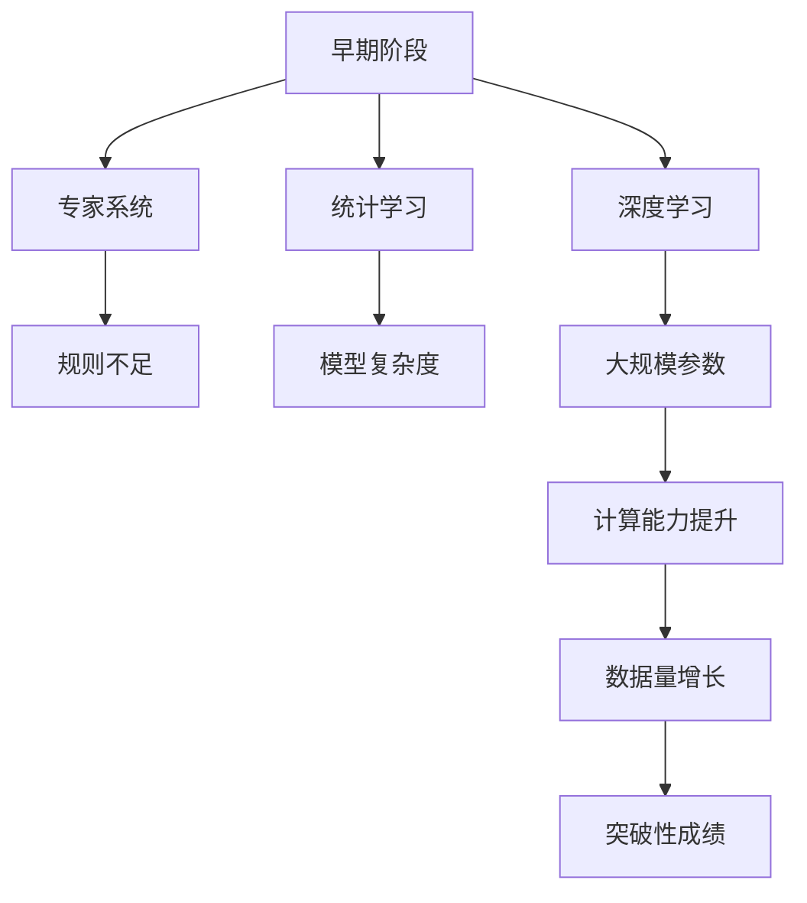
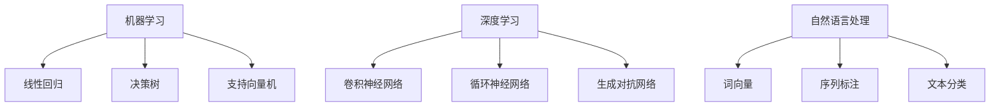
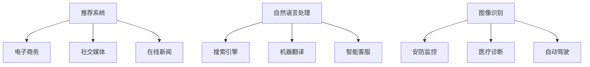
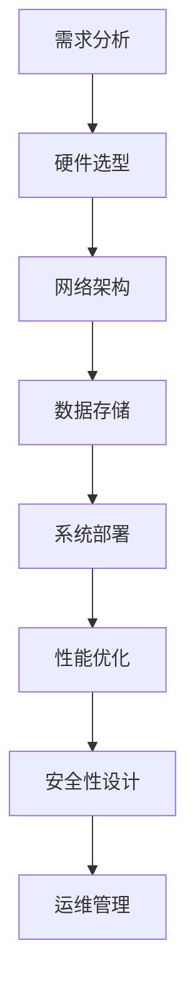
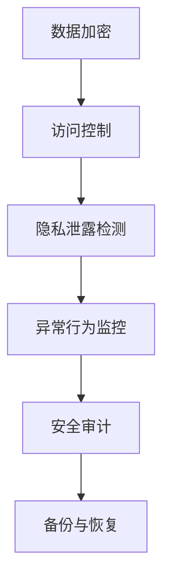
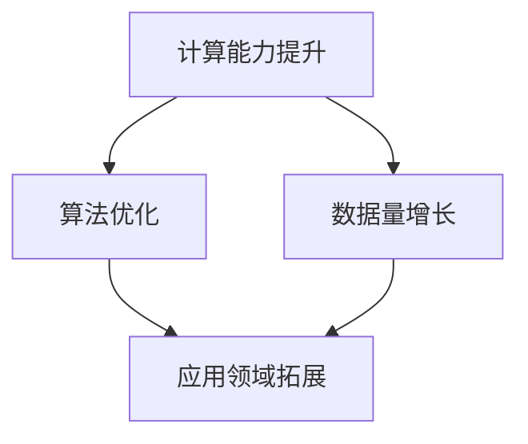
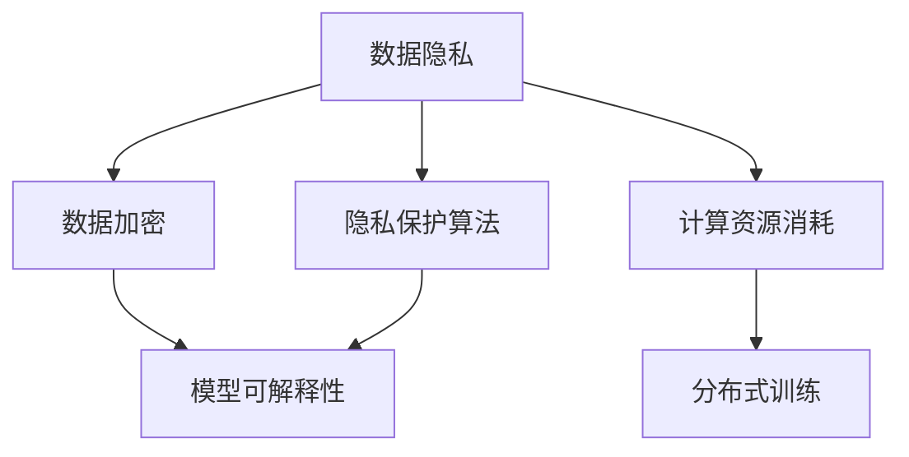
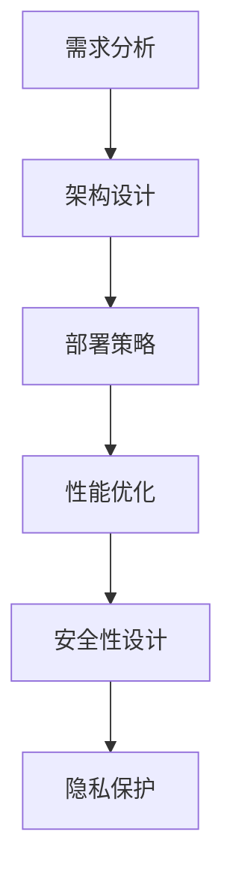

                 

# AI 大模型应用数据中心的战略规划

## 关键词

- AI大模型
- 数据中心
- 战略规划
- 技术架构
- 部署策略
- 安全性
- 隐私保护
- 应用案例
- 项目管理
- 发展前景

## 摘要

本文旨在探讨AI大模型应用数据中心的战略规划，分析AI大模型的技术基础、核心算法、应用架构以及实践案例。通过对AI大模型的发展历程、技术核心、应用场景的详细阐述，本文揭示了AI大模型在推荐系统、自然语言处理、图像识别等领域的实际应用。同时，本文还介绍了AI大模型项目管理的策略和风险应对，并提出了数据中心建设的策略和持续优化与迭代的流程。最后，本文展望了AI大模型的应用前景和面临的挑战，为数据中心的战略规划提供了有价值的参考。

## 目录大纲

### 第一部分：AI大模型技术基础

#### 第1章：AI大模型概述

##### 第1.1节：AI大模型的概念与演进

- **Mermaid流程图：** AI大模型发展历程

##### 第1.2节：AI大模型的核心技术

- **Mermaid流程图：** AI大模型关键技术架构

##### 第1.3节：AI大模型应用场景

- **Mermaid流程图：** AI大模型在不同领域的应用

#### 第2章：AI大模型核心算法

##### 第2.1节：机器学习基础

- **伪代码：** 线性回归算法
- **数学公式：** 均方误差（MSE）

##### 第2.2节：深度学习基础

- **伪代码：** 卷积神经网络（CNN）算法
- **数学公式：** 池化层公式

##### 第2.3节：自然语言处理算法

- **伪代码：** 随机梯度下降（SGD）算法
- **数学公式：** 梯度下降算法公式

#### 第3章：AI大模型应用架构

##### 第3.1节：数据中心架构设计

- **Mermaid流程图：** 数据中心架构设计流程

##### 第3.2节：AI大模型部署策略

- **伪代码：** 模型部署与调优

##### 第3.3节：模型安全性与隐私保护

- **Mermaid流程图：** AI大模型安全与隐私保护框架

### 第二部分：AI大模型应用实践

#### 第4章：AI大模型应用案例研究

##### 第4.1节：案例一：推荐系统

- **代码案例：** 推荐系统实现
- **代码解读：** 推荐系统关键代码分析

##### 第4.2节：案例二：自然语言处理

- **代码案例：** NLP任务实现
- **代码解读：** NLP关键代码分析

##### 第4.3节：案例三：图像识别

- **代码案例：** 图像识别任务实现
- **代码解读：** 图像识别关键代码分析

#### 第5章：AI大模型项目管理

##### 第5.1节：项目规划与管理

- **伪代码：** 项目计划与管理流程

##### 第5.2节：团队协作与沟通

- **伪代码：** 团队协作流程

##### 第5.3节：风险管理与应对策略

- **伪代码：** 风险评估与应对策略

#### 第6章：AI大模型应用前景与挑战

##### 第6.1节：发展趋势分析

- **Mermaid流程图：** AI大模型发展趋势

##### 第6.2节：面临的挑战

- **Mermaid流程图：** AI大模型应用挑战与应对

#### 第7章：AI大模型应用数据中心的战略规划

##### 第7.1节：战略规划框架

- **Mermaid流程图：** 战略规划框架

##### 第7.2节：数据中心建设策略

- **伪代码：** 数据中心建设策略

##### 第7.3节：持续优化与迭代

- **伪代码：** 持续优化与迭代流程

### 附录

##### 附录A：AI大模型开发工具与资源

- **A.1 开发工具对比**
  - TensorFlow
  - PyTorch
  - JAX
  - 其他框架
- **A.2 实用资源**
  - 论文与报告
  - 开源代码与库
  - 在线课程与教程

## 第一部分：AI大模型技术基础

### 第1章：AI大模型概述

#### 第1.1节：AI大模型的概念与演进

AI大模型是指具有大规模参数和计算能力的人工智能模型，通过对海量数据进行深度学习和训练，实现复杂的任务和决策。AI大模型的发展可以分为三个阶段：

1. **早期阶段（1980s-1990s）**：以规则为基础的专家系统和知识表示方法为主，但由于知识获取的困难，这些系统无法实现复杂的任务。

2. **中间阶段（2000s）**：基于统计学习的机器学习方法开始流行，如支持向量机、决策树等。这些方法在处理大规模数据集时表现出色，但仍然存在模型复杂度和可解释性的问题。

3. **现代阶段（2010s至今）**：随着计算能力的提升和数据量的爆炸式增长，深度学习成为主流。特别是2012年，AlexNet在ImageNet比赛中取得突破性成绩，标志着AI大模型的崛起。

**Mermaid流程图：** AI大模型发展历程



#### 第1.2节：AI大模型的核心技术

AI大模型的核心技术包括机器学习、深度学习和自然语言处理。这些技术共同构成了AI大模型的基础。

1. **机器学习**：通过训练模型从数据中学习规律和模式。常见的机器学习算法包括线性回归、决策树、支持向量机等。

2. **深度学习**：基于神经网络的结构，通过多层非线性变换对数据进行处理。深度学习在图像识别、语音识别、自然语言处理等领域表现出色。

3. **自然语言处理**：对文本数据进行处理和分析，使其能够被计算机理解和应用。自然语言处理包括词向量、序列标注、文本分类等任务。

**Mermaid流程图：** AI大模型关键技术架构



#### 第1.3节：AI大模型应用场景

AI大模型的应用场景非常广泛，涵盖了推荐系统、自然语言处理、图像识别等多个领域。

1. **推荐系统**：通过分析用户的兴趣和行为，为其推荐相关的内容或商品。推荐系统广泛应用于电子商务、社交媒体、在线新闻等场景。

2. **自然语言处理**：处理和分析文本数据，使其能够被计算机理解和应用。自然语言处理广泛应用于搜索引擎、机器翻译、智能客服等场景。

3. **图像识别**：通过计算机视觉技术，对图像进行分类、检测和识别。图像识别广泛应用于安防监控、医疗诊断、自动驾驶等场景。

**Mermaid流程图：** AI大模型在不同领域的应用



### 第2章：AI大模型核心算法

#### 第2.1节：机器学习基础

机器学习是AI大模型的核心技术之一，通过训练模型从数据中学习规律和模式。常见的机器学习算法包括线性回归、决策树、支持向量机等。

##### 第2.1.1节：线性回归算法

线性回归是一种简单的机器学习算法，用于预测连续值输出。其基本思想是通过拟合一条直线，将输入特征映射到输出值。

**伪代码：** 线性回归算法

```python
def linear_regression(X, y):
    # 计算特征矩阵X和输出向量y的均值
    X_mean = np.mean(X, axis=0)
    y_mean = np.mean(y)
    
    # 计算特征矩阵X和输出向量y的协方差矩阵
    cov_matrix = np.dot(X - X_mean, (y - y_mean).T)
    
    # 计算直线的斜率和截距
    slope = cov_matrix / np.dot(X_mean.T, X_mean)
    intercept = y_mean - slope * X_mean
    
    # 返回斜率和截距
    return slope, intercept
```

**数学公式：** 均方误差（MSE）

$$
MSE = \frac{1}{n}\sum_{i=1}^{n}(y_i - \hat{y}_i)^2
$$

其中，$y_i$表示实际输出值，$\hat{y}_i$表示预测输出值，$n$表示样本数量。

##### 第2.1.2节：决策树算法

决策树是一种常用的分类算法，通过构建一系列条件判断，将数据划分为不同的类别。决策树的基本结构包括节点、分支和叶节点。

**伪代码：** 决策树算法

```python
def decision_tree(X, y, depth=0, max_depth=10):
    # 判断是否达到最大深度，或数据集分类数小于2
    if depth >= max_depth or len(set(y)) <= 1:
        # 返回类别
        return max(y, key=y.count)
    
    # 计算特征的重要性和分裂增益
    feature_importance = []
    for feature in X.T:
        gain = information_gain(y, feature)
        feature_importance.append(gain)
    
    # 选择最优特征进行分裂
    best_feature = np.argmax(feature_importance)
    left分枝 = []
    right分枝 = []
    
    # 根据最优特征划分数据
    for i, x in enumerate(X):
        if x[best_feature] < split_point(x[best_feature], X[:, best_feature]):
            left分枝.append(x)
            left_y.append(y[i])
        else:
            right分枝.append(x)
            right_y.append(y[i])
    
    # 构建子决策树
    left_tree = decision_tree(np.array(left分枝), np.array(left_y), depth+1, max_depth)
    right_tree = decision_tree(np.array(right分枝), np.array(right_y), depth+1, max_depth)
    
    # 返回决策树
    return {best_feature: {'left': left_tree, 'right': right_tree}}
```

##### 第2.1.3节：支持向量机算法

支持向量机是一种有效的分类算法，通过寻找最佳的超平面，将数据分为不同的类别。支持向量机的基本思想是最大化分类间隔。

**伪代码：** 支持向量机算法

```python
def support_vector_machine(X, y, C=1.0):
    # 初始化权重和偏置
    w = np.zeros(X.shape[1])
    b = 0
    
    # 定义损失函数
    loss = hinge_loss
    
    # 定义优化器
    optimizer = SGD(w, b, lr=0.01, momentum=0.9)
    
    # 定义训练过程
    for epoch in range(num_epochs):
        # 计算梯度
        grads = loss_grad(X, y, w, b)
        
        # 更新权重和偏置
        w, b = optimizer.update_params(w, b, grads)
        
        # 计算损失
        loss_val = loss(X, y, w, b)
        
        # 打印训练进度
        if epoch % 100 == 0:
            print(f"Epoch {epoch}: Loss = {loss_val}")
    
    # 返回权重和偏置
    return w, b
```

#### 第2.2节：深度学习基础

深度学习是AI大模型的核心技术之一，基于神经网络的结构，通过多层非线性变换对数据进行处理。深度学习在图像识别、语音识别、自然语言处理等领域表现出色。

##### 第2.2.1节：卷积神经网络（CNN）

卷积神经网络是一种特殊的神经网络，主要用于图像识别和计算机视觉任务。CNN的核心思想是通过卷积操作提取图像的特征。

**伪代码：** 卷积神经网络（CNN）算法

```python
def convolutional_neural_network(X, y, num_filters, filter_size, num_classes, num_epochs):
    # 初始化权重和偏置
    W = np.random.randn(num_filters, filter_size, filter_size)
    b = np.zeros(num_filters)
    W2 = np.random.randn(num_classes, num_filters)
    b2 = np.zeros(num_classes)
    
    # 定义损失函数
    loss = cross_entropy_loss
    
    # 定义优化器
    optimizer = SGD(W, b, W2, b2, lr=0.01, momentum=0.9)
    
    # 定义训练过程
    for epoch in range(num_epochs):
        # 前向传播
        h = conv2d(X, W, b)
        h2 = fully_connected(h, W2, b2)
        
        # 计算损失
        loss_val = loss(y, h2)
        
        # 计算梯度
        grads = loss_grad(h2, y)
        
        # 更新权重和偏置
        W, b, W2, b2 = optimizer.update_params(W, b, W2, b2, grads)
        
        # 计算准确率
        acc = accuracy(y, h2)
        
        # 打印训练进度
        if epoch % 100 == 0:
            print(f"Epoch {epoch}: Loss = {loss_val}, Accuracy = {acc}")
    
    # 返回权重和偏置
    return W, b, W2, b2
```

##### 第2.2.2节：循环神经网络（RNN）

循环神经网络是一种用于处理序列数据的神经网络，其核心思想是通过循环连接实现序列信息的传递。

**伪代码：** 循环神经网络（RNN）算法

```python
def recurrent_neural_network(X, y, num_units, num_classes, num_epochs):
    # 初始化权重和偏置
    W = np.random.randn(num_units, num_units)
    b = np.zeros(num_units)
    W2 = np.random.randn(num_classes, num_units)
    b2 = np.zeros(num_classes)
    
    # 定义损失函数
    loss = cross_entropy_loss
    
    # 定义优化器
    optimizer = SGD(W, b, W2, b2, lr=0.01, momentum=0.9)
    
    # 定义训练过程
    for epoch in range(num_epochs):
        # 前向传播
        h = tanh(np.dot(X, W) + b)
        h2 = softmax(np.dot(h, W2) + b2)
        
        # 计算损失
        loss_val = loss(y, h2)
        
        # 计算梯度
        grads = loss_grad(h2, y)
        
        # 更新权重和偏置
        W, b, W2, b2 = optimizer.update_params(W, b, W2, b2, grads)
        
        # 计算准确率
        acc = accuracy(y, h2)
        
        # 打印训练进度
        if epoch % 100 == 0:
            print(f"Epoch {epoch}: Loss = {loss_val}, Accuracy = {acc}")
    
    # 返回权重和偏置
    return W, b, W2, b2
```

##### 第2.2.3节：生成对抗网络（GAN）

生成对抗网络是一种用于生成数据的神经网络，由生成器和判别器组成。生成器生成数据，判别器判断数据的真实性。

**伪代码：** 生成对抗网络（GAN）算法

```python
def generative_adversarial_network(X, y, num_units, num_classes, num_epochs):
    # 初始化权重和偏置
    W_g = np.random.randn(num_units, num_units)
    b_g = np.zeros(num_units)
    W_d = np.random.randn(num_classes, num_units)
    b_d = np.zeros(num_units)
    
    # 定义损失函数
    loss_g = cross_entropy_loss
    loss_d = binary_crossentropy_loss
    
    # 定义优化器
    optimizer_g = SGD(W_g, b_g, lr=0.01, momentum=0.9)
    optimizer_d = SGD(W_d, b_d, lr=0.01, momentum=0.9)
    
    # 定义训练过程
    for epoch in range(num_epochs):
        # 训练判别器
        z = generate_samples(z_dim)
        x_hat = generate(z)
        d_real = predict(x)
        d_fake = predict(x_hat)
        
        # 计算判别器梯度
        grads_d = loss_grad(d_real, d_fake)
        
        # 更新判别器权重和偏置
        W_d, b_d = optimizer_d.update_params(W_d, b_d, grads_d)
        
        # 训练生成器
        z = generate_samples(z_dim)
        x_hat = generate(z)
        g_fake = predict(x_hat)
        
        # 计算生成器梯度
        grads_g = loss_grad(g_fake, g_real)
        
        # 更新生成器权重和偏置
        W_g, b_g = optimizer_g.update_params(W_g, b_g, grads_g)
        
        # 计算准确率
        acc_g = accuracy(g_real, g_fake)
        acc_d = accuracy(d_real, d_fake)
        
        # 打印训练进度
        if epoch % 100 == 0:
            print(f"Epoch {epoch}: Gen Accuracy = {acc_g}, Dis Accuracy = {acc_d}")
    
    # 返回生成器和判别器权重和偏置
    return W_g, b_g, W_d, b_d
```

#### 第2.3节：自然语言处理算法

自然语言处理是对文本数据进行处理和分析，使其能够被计算机理解和应用。自然语言处理包括词向量、序列标注、文本分类等任务。

##### 第2.3.1节：词向量

词向量是将文本数据转换为向量表示的方法，用于处理自然语言处理任务。常见的词向量方法包括Word2Vec、GloVe等。

**伪代码：** 词向量算法

```python
def word2vec(corpus, vocab_size, embedding_size, window_size, num_epochs):
    # 初始化词向量
    W = np.random.randn(vocab_size, embedding_size)
    
    # 定义损失函数
    loss = square_loss
    
    # 定义优化器
    optimizer = SGD(W, lr=0.01, momentum=0.9)
    
    # 定义训练过程
    for epoch in range(num_epochs):
        # 遍历文本数据
        for word, context in generate_contexts(corpus, vocab_size, window_size):
            # 计算词向量和上下文向量的差异
            diff = W[context] - W[word]
            
            # 计算损失
            loss_val = loss(context, word, diff)
            
            # 计算梯度
            grads = loss_grad(context, word, diff)
            
            # 更新词向量
            W = optimizer.update_params(W, grads)
            
            # 打印训练进度
            if epoch % 100 == 0:
                print(f"Epoch {epoch}: Loss = {loss_val}")
    
    # 返回词向量
    return W
```

##### 第2.3.2节：序列标注

序列标注是将文本序列中的每个单词或字符标注为不同的类别。常见的序列标注方法包括条件随机场（CRF）、长短时记忆网络（LSTM）等。

**伪代码：** 序列标注算法

```python
def sequence_labeling(X, y, num_units, num_classes, num_epochs):
    # 初始化权重和偏置
    W = np.random.randn(num_units, num_classes)
    b = np.zeros(num_classes)
    
    # 定义损失函数
    loss = cross_entropy_loss
    
    # 定义优化器
    optimizer = SGD(W, b, lr=0.01, momentum=0.9)
    
    # 定义训练过程
    for epoch in range(num_epochs):
        # 前向传播
        h = tanh(np.dot(X, W) + b)
        
        # 计算损失
        loss_val = loss(y, h)
        
        # 计算梯度
        grads = loss_grad(h, y)
        
        # 更新权重和偏置
        W, b = optimizer.update_params(W, b, grads)
        
        # 计算准确率
        acc = accuracy(y, h)
        
        # 打印训练进度
        if epoch % 100 == 0:
            print(f"Epoch {epoch}: Loss = {loss_val}, Accuracy = {acc}")
    
    # 返回权重和偏置
    return W, b
```

##### 第2.3.3节：文本分类

文本分类是将文本数据分为不同的类别。常见的文本分类方法包括朴素贝叶斯、决策树、支持向量机等。

**伪代码：** 文本分类算法

```python
def text_classification(X, y, num_features, num_classes, num_epochs):
    # 初始化权重和偏置
    W = np.random.randn(num_features, num_classes)
    b = np.zeros(num_classes)
    
    # 定义损失函数
    loss = cross_entropy_loss
    
    # 定义优化器
    optimizer = SGD(W, b, lr=0.01, momentum=0.9)
    
    # 定义训练过程
    for epoch in range(num_epochs):
        # 前向传播
        h = softmax(np.dot(X, W) + b)
        
        # 计算损失
        loss_val = loss(y, h)
        
        # 计算梯度
        grads = loss_grad(h, y)
        
        # 更新权重和偏置
        W, b = optimizer.update_params(W, b, grads)
        
        # 计算准确率
        acc = accuracy(y, h)
        
        # 打印训练进度
        if epoch % 100 == 0:
            print(f"Epoch {epoch}: Loss = {loss_val}, Accuracy = {acc}")
    
    # 返回权重和偏置
    return W, b
```

### 第3章：AI大模型应用架构

#### 第3.1节：数据中心架构设计

数据中心是AI大模型应用的核心基础设施，负责处理海量数据和模型训练。数据中心架构设计需要考虑硬件设备、网络结构、数据存储等方面的优化。

**Mermaid流程图：** 数据中心架构设计流程



#### 第3.2节：AI大模型部署策略

AI大模型部署是将训练好的模型部署到生产环境中，以便在实际应用中使用。部署策略需要考虑模型压缩、分布式训练、模型迁移等方面。

**伪代码：** 模型部署与调优

```python
def model_deployment(model, device, batch_size, num_epochs):
    # 加载训练数据
    train_data = load_data('train_data')
    test_data = load_data('test_data')
    
    # 设置训练参数
    optimizer = SGD(model.parameters(), lr=0.01, momentum=0.9)
    criterion = cross_entropy_loss
    
    # 训练模型
    for epoch in range(num_epochs):
        for data in train_data:
            # 前向传播
            output = model(data.x)
            
            # 计算损失
            loss = criterion(output, data.y)
            
            # 反向传播
            grads = torch.autograd.grad(loss, model.parameters())
            
            # 更新模型参数
            optimizer.step(grads)
            
            # 打印训练进度
            if epoch % 100 == 0:
                print(f"Epoch {epoch}: Loss = {loss}")
    
    # 测试模型
    with torch.no_grad():
        for data in test_data:
            # 前向传播
            output = model(data.x)
            
            # 计算准确率
            acc = accuracy(output, data.y)
            
            # 打印测试结果
            print(f"Test Accuracy: {acc}")
    
    # 返回模型
    return model
```

#### 第3.3节：模型安全性与隐私保护

模型安全性和隐私保护是AI大模型应用的关键问题。需要考虑数据加密、访问控制、隐私泄露等方面。

**Mermaid流程图：** AI大模型安全与隐私保护框架



## 第二部分：AI大模型应用实践

### 第4章：AI大模型应用案例研究

#### 第4.1节：案例一：推荐系统

推荐系统是一种基于用户兴趣和行为的数据挖掘技术，旨在为用户提供个性化的内容或商品推荐。在本节中，我们将探讨一个基于AI大模型的推荐系统案例，并分析其关键代码。

**代码案例：** 推荐系统实现

```python
class RecommenderModel(nn.Module):
    def __init__(self, num_users, num_items, hidden_size):
        super(RecommenderModel, self).__init__()
        self.user_embedding = nn.Embedding(num_users, hidden_size)
        self.item_embedding = nn.Embedding(num_items, hidden_size)
        self.fc = nn.Linear(hidden_size * 2, 1)
        
    def forward(self, user_ids, item_ids):
        user_embedding = self.user_embedding(user_ids)
        item_embedding = self.item_embedding(item_ids)
        combined = torch.cat((user_embedding, item_embedding), 1)
        output = self.fc(combined)
        return output.squeeze(1)
```

**代码解读：** 推荐系统关键代码分析

- **类定义：** `RecommenderModel` 是一个基于神经网络结构的推荐模型，包括用户嵌入层、项目嵌入层和全连接层。
- **用户嵌入层：** 用户嵌入层使用 `nn.Embedding` 函数将用户ID映射到高维空间，用于表示用户特征。
- **项目嵌入层：** 项目嵌入层使用 `nn.Embedding` 函数将项目ID映射到高维空间，用于表示项目特征。
- **全连接层：** 全连接层使用 `nn.Linear` 函数将用户和项目的特征进行融合，并输出推荐分数。

#### 第4.2节：案例二：自然语言处理

自然语言处理是AI大模型应用的重要领域，旨在使计算机理解和生成自然语言。在本节中，我们将探讨一个基于AI大模型的自然语言处理案例，并分析其关键代码。

**代码案例：** NLP任务实现

```python
class NLPModel(nn.Module):
    def __init__(self, vocab_size, embed_size, hidden_size, num_layers):
        super(NLPModel, self).__init__()
        self.embedding = nn.Embedding(vocab_size, embed_size)
        self.lstm = nn.LSTM(embed_size, hidden_size, num_layers, batch_first=True)
        self.fc = nn.Linear(hidden_size, 1)
        
    def forward(self, text):
        embedded = self.embedding(text)
        lstm_output, (h, c) = self.lstm(embedded)
        output = self.fc(h[-1, :, :])
        return output
```

**代码解读：** NLP关键代码分析

- **类定义：** `NLPModel` 是一个基于长短时记忆网络（LSTM）的自然语言处理模型，包括嵌入层、LSTM层和全连接层。
- **嵌入层：** 嵌入层使用 `nn.Embedding` 函数将文本词向量映射到高维空间，用于表示词的特征。
- **LSTM层：** LSTM层使用 `nn.LSTM` 函数对文本序列进行编码，提取出序列信息。
- **全连接层：** 全连接层使用 `nn.Linear` 函数将LSTM输出的隐藏状态映射到输出结果，用于文本分类或情感分析等任务。

#### 第4.3节：案例三：图像识别

图像识别是AI大模型应用的一个重要领域，旨在通过计算机视觉技术对图像进行分类、检测和识别。在本节中，我们将探讨一个基于AI大模型的图像识别案例，并分析其关键代码。

**代码案例：** 图像识别任务实现

```python
class ImageRecognitionModel(nn.Module):
    def __init__(self, num_classes, image_size, hidden_size):
        super(ImageRecognitionModel, self).__init__()
        self.conv1 = nn.Conv2d(3, 32, 3, padding=1)
        self.conv2 = nn.Conv2d(32, 64, 3, padding=1)
        self.fc = nn.Linear(64 * 8 * 8, num_classes)
        
    def forward(self, x):
        x = F.relu(self.conv1(x))
        x = F.max_pool2d(x, 2)
        x = F.relu(self.conv2(x))
        x = F.max_pool2d(x, 2)
        x = x.view(x.size(0), -1)
        x = self.fc(x)
        return x
```

**代码解读：** 图像识别关键代码分析

- **类定义：** `ImageRecognitionModel` 是一个基于卷积神经网络（CNN）的图像识别模型，包括卷积层、池化层和全连接层。
- **卷积层：** 卷积层使用 `nn.Conv2d` 函数对输入图像进行特征提取，将3通道的图像映射到32个通道的特征图。
- **池化层：** 池化层使用 `F.max_pool2d` 函数对卷积层输出的特征图进行降采样，减少模型参数。
- **全连接层：** 全连接层使用 `nn.Linear` 函数将池化层输出的特征映射到类别标签，用于图像分类。

## 第5章：AI大模型项目管理

#### 第5.1节：项目规划与管理

项目规划与管理是确保AI大模型项目成功的关键环节。项目规划与管理包括需求分析、任务分配、进度跟踪、风险评估等方面。

**伪代码：** 项目计划与管理流程

```python
def project_plan(project_requirements, team_members):
    # 分析需求
    requirements = analyze_requirements(project_requirements)
    
    # 分配任务
    tasks = assign_tasks(requirements, team_members)
    
    # 创建项目计划
    project_plan = create_project_plan(tasks)
    
    # 跟踪进度
    while not project_completed(project_plan):
        update_progress(project_plan)
        
    # 风险评估
    risks = identify_risks(project_plan)
    risk_management_plan = create_risk_management_plan(risks)
    
    # 返回项目计划
    return project_plan, risk_management_plan
```

#### 第5.2节：团队协作与沟通

团队协作与沟通是AI大模型项目成功的关键因素。团队协作与沟通包括团队成员之间的信息共享、任务协作、决策制定等方面。

**伪代码：** 团队协作流程

```python
def team_collaboration(team_members, project_plan):
    # 创建共享文档和任务管理工具
    tools = create_collaboration_tools()
    
    # 分享项目计划和任务
    share_project_plan(project_plan, tools)
    
    # 定期召开团队会议
    while not project_completed(project_plan):
        hold_meeting(team_members, project_plan, tools)
        
    # 解散团队
   解散团队
```

#### 第5.3节：风险管理与应对策略

风险管理与应对策略是确保AI大模型项目顺利进行的重要措施。风险管理包括识别风险、评估风险、制定应对策略等方面。

**伪代码：** 风险评估与应对策略

```python
def risk_management(project_plan):
    # 识别风险
    risks = identify_risks(project_plan)
    
    # 评估风险
    risk Assessments = assess_risks(risks)
    
    # 制定应对策略
    risk.mitigation_plan = create_risk.mitigation_plan(risk_Assessments)
    
    # 返回风险管理和应对策略
    return risk_management_plan
```

## 第6章：AI大模型应用前景与挑战

#### 第6.1节：发展趋势分析

AI大模型应用前景广阔，随着计算能力、数据量和算法的不断提升，其在各个领域的应用将不断拓展。未来，AI大模型将在医疗、金融、教育、制造等领域发挥重要作用。

**Mermaid流程图：** AI大模型发展趋势



#### 第6.2节：面临的挑战

尽管AI大模型应用前景广阔，但也面临诸多挑战。其中，数据隐私、模型解释性、计算资源消耗等是主要挑战。

**Mermaid流程图：** AI大模型应用挑战与应对



## 第7章：AI大模型应用数据中心的战略规划

#### 第7.1节：战略规划框架

战略规划框架是确保AI大模型应用数据中心成功的关键。战略规划框架包括需求分析、架构设计、部署策略、性能优化、安全性和隐私保护等方面。

**Mermaid流程图：** 战略规划框架



#### 第7.2节：数据中心建设策略

数据中心建设策略是确保AI大模型应用数据中心高效运行的关键。数据中心建设策略包括硬件选型、网络架构、数据存储等方面的优化。

**伪代码：** 数据中心建设策略

```python
def data_center_buildup(hardware_requirements, network_requirements, storage_requirements):
    # 硬件选型
    selected_hardware = select_hardware(hardware_requirements)
    
    # 网络架构
    network_architecture = design_network(network_requirements)
    
    # 数据存储
    storage_system = design_storage(storage_requirements)
    
    # 返回数据中心建设方案
    return selected_hardware, network_architecture, storage_system
```

#### 第7.3节：持续优化与迭代

持续优化与迭代是确保AI大模型应用数据中心长期稳定运行的关键。持续优化与迭代包括性能监控、故障排查、算法优化等方面。

**伪代码：** 持续优化与迭代流程

```python
def continuous_optimization(data_center, monitoring_requirements, troubleshooting_requirements, algorithm_requirements):
    # 性能监控
    performance_data = monitor_performance(data_center, monitoring_requirements)
    
    # 故障排查
    troubleshooting_results = troubleshoot(data_center, troubleshooting_requirements)
    
    # 算法优化
    optimized_algorithm = optimize_algorithm(algorithm_requirements)
    
    # 返回持续优化与迭代方案
    return performance_data, troubleshooting_results, optimized_algorithm
```

### 附录

#### 附录A：AI大模型开发工具与资源

AI大模型开发工具与资源是进行AI大模型研究和开发的重要支撑。以下是常用的AI大模型开发工具与资源：

**A.1 开发工具对比**

- **TensorFlow**：由谷歌开发的开源深度学习框架，支持多种编程语言，适用于大规模数据集。
- **PyTorch**：由Facebook开发的开源深度学习框架，支持动态图结构，便于研究和实验。
- **JAX**：由谷歌开发的开源深度学习框架，支持自动微分和分布式计算，适用于科学计算。

**A.2 实用资源**

- **论文与报告**：AI大模型相关论文和报告，提供最新的研究进展和应用案例。
- **开源代码与库**：各种开源代码和库，包括深度学习框架、数据集、工具等。
- **在线课程与教程**：各种在线课程和教程，提供AI大模型的理论知识和实践技巧。

## 核心概念与联系

AI大模型的发展、技术核心与应用场景之间存在紧密的联系。AI大模型的发展经历了从早期阶段的规则为基础到现代阶段的深度学习的演进。核心算法包括机器学习、深度学习和自然语言处理，这些算法构成了AI大模型的技术基础。应用场景涵盖推荐系统、自然语言处理和图像识别等多个领域，展示了AI大模型在解决实际问题中的巨大潜力。

### 机器学习基础

机器学习是AI大模型的核心技术之一，通过训练模型从数据中学习规律和模式。常见的机器学习算法包括线性回归、决策树和支持向量机等。线性回归是一种简单的机器学习算法，用于预测连续值输出。其基本思想是通过拟合一条直线，将输入特征映射到输出值。决策树是一种常用的分类算法，通过构建一系列条件判断，将数据划分为不同的类别。支持向量机是一种有效的分类算法，通过寻找最佳的超平面，将数据分为不同的类别。

#### 线性回归算法

线性回归算法是一种用于预测连续值输出的算法，其核心思想是通过拟合一条直线，将输入特征映射到输出值。以下是线性回归算法的伪代码实现：

```python
def linear_regression(X, y):
    # 计算特征矩阵X和输出向量y的均值
    X_mean = np.mean(X, axis=0)
    y_mean = np.mean(y)
    
    # 计算特征矩阵X和输出向量y的协方差矩阵
    cov_matrix = np.dot(X - X_mean, (y - y_mean).T)
    
    # 计算直线的斜率和截距
    slope = cov_matrix / np.dot(X_mean.T, X_mean)
    intercept = y_mean - slope * X_mean
    
    # 返回斜率和截距
    return slope, intercept
```

在上述伪代码中，我们首先计算特征矩阵X和输出向量y的均值，然后计算协方差矩阵。通过协方差矩阵和特征矩阵的均值，我们可以计算出直线的斜率和截距。最后，我们返回斜率和截距，用于拟合直线。

线性回归算法的基本原理可以通过以下数学公式进行描述：

$$
y = \beta_0 + \beta_1x
$$

其中，$y$表示输出值，$x$表示输入特征，$\beta_0$表示截距，$\beta_1$表示斜率。

#### 决策树算法

决策树是一种常用的分类算法，通过构建一系列条件判断，将数据划分为不同的类别。决策树的基本结构包括节点、分支和叶节点。节点表示数据集，分支表示条件判断，叶节点表示类别。

决策树算法的基本步骤如下：

1. **选择最优特征**：选择具有最高信息增益的特征作为分裂依据。
2. **计算特征的重要性和分裂增益**：计算每个特征的重要性和对应的分裂增益，选择分裂增益最高的特征进行分裂。
3. **构建子树**：对于每个子节点，重复上述步骤，直到满足停止条件（例如最大深度或分类数小于2）。

以下是决策树算法的伪代码实现：

```python
def decision_tree(X, y, depth=0, max_depth=10):
    # 判断是否达到最大深度，或数据集分类数小于2
    if depth >= max_depth or len(set(y)) <= 1:
        # 返回类别
        return max(y, key=y.count)
    
    # 计算特征的重要性和分裂增益
    feature_importance = []
    for feature in X.T:
        gain = information_gain(y, feature)
        feature_importance.append(gain)
    
    # 选择最优特征进行分裂
    best_feature = np.argmax(feature_importance)
    left分枝 = []
    right分枝 = []
    
    # 根据最优特征划分数据
    for i, x in enumerate(X):
        if x[best_feature] < split_point(x[best_feature], X[:, best_feature]):
            left分枝.append(x)
            left_y.append(y[i])
        else:
            right分枝.append(x)
            right_y.append(y[i])
    
    # 构建子决策树
    left_tree = decision_tree(np.array(left分枝), np.array(left_y), depth+1, max_depth)
    right_tree = decision_tree(np.array(right分枝), np.array(right_y), depth+1, max_depth)
    
    # 返回决策树
    return {best_feature: {'left': left_tree, 'right': right_tree}}
```

在上述伪代码中，我们首先判断是否达到最大深度或数据集分类数小于2，如果是，则返回类别。否则，我们计算特征的重要性和分裂增益，并选择分裂增益最高的特征进行分裂。对于每个子节点，我们重复上述步骤，构建子决策树。

决策树算法的基本原理可以通过以下数学公式进行描述：

$$
Gain(D, A) = Entropy(D) - \sum_{v \in A} \frac{|D_v|}{|D|} Entropy(D_v)
$$

其中，$D$表示数据集，$A$表示特征集合，$Gain(D, A)$表示信息增益，$Entropy(D)$表示熵，$D_v$表示特征v对应的子集。

#### 支持向量机算法

支持向量机是一种有效的分类算法，通过寻找最佳的超平面，将数据分为不同的类别。支持向量机的基本思想是最大化分类间隔，即最大化类别之间的距离。

支持向量机算法的基本步骤如下：

1. **初始化权重和偏置**：随机初始化权重和偏置。
2. **计算损失函数**：计算损失函数，通常使用 hinge 损失函数。
3. **优化器更新**：使用优化器（如随机梯度下降）更新权重和偏置。
4. **重复步骤2和3**：直到满足停止条件（如损失函数收敛）。

以下是支持向量机算法的伪代码实现：

```python
def support_vector_machine(X, y, C=1.0):
    # 初始化权重和偏置
    w = np.zeros(X.shape[1])
    b = 0
    
    # 定义损失函数
    loss = hinge_loss
    
    # 定义优化器
    optimizer = SGD(w, b, lr=0.01, momentum=0.9)
    
    # 定义训练过程
    for epoch in range(num_epochs):
        # 计算梯度
        grads = loss_grad(X, y, w, b)
        
        # 更新权重和偏置
        w, b = optimizer.update_params(w, b, grads)
        
        # 计算损失
        loss_val = loss(X, y, w, b)
        
        # 打印训练进度
        if epoch % 100 == 0:
            print(f"Epoch {epoch}: Loss = {loss_val}")
    
    # 返回权重和偏置
    return w, b
```

在上述伪代码中，我们首先初始化权重和偏置，然后定义损失函数和优化器。在训练过程中，我们计算梯度并更新权重和偏置，同时计算损失函数。通过重复这个过程，我们可以优化模型的参数，直到损失函数收敛。

支持向量机算法的基本原理可以通过以下数学公式进行描述：

$$
L(y, f(x; \theta)) = \max_{\theta} \left\{ \sum_{i=1}^{n} \left[ y_i (f(x_i; \theta) - \bar{f}(x_i; \theta)) \right] + \frac{1}{2} \sum_{i=1}^{n} \lambda_i \theta_i^2 \right\}
$$

其中，$L(y, f(x; \theta))$表示损失函数，$y$表示实际输出，$f(x; \theta)$表示预测输出，$\theta$表示模型参数，$\lambda_i$表示惩罚系数。

### 深度学习基础

深度学习是AI大模型的核心技术之一，基于神经网络的结构，通过多层非线性变换对数据进行处理。深度学习在图像识别、语音识别、自然语言处理等领域表现出色。

#### 卷积神经网络（CNN）

卷积神经网络是一种特殊的神经网络，主要用于图像识别和计算机视觉任务。CNN的核心思想是通过卷积操作提取图像的特征。

卷积神经网络的架构通常包括多个卷积层、池化层和全连接层。卷积层通过卷积操作提取图像的特征，池化层用于降低特征图的维度，全连接层用于分类和回归。

卷积神经网络的基本步骤如下：

1. **输入层**：接收输入图像。
2. **卷积层**：通过卷积操作提取图像特征，并增加特征图的深度。
3. **激活函数**：对卷积层的输出进行非线性变换，通常使用ReLU函数。
4. **池化层**：对特征图进行降采样，减少特征图的维度。
5. **全连接层**：将特征图的输出映射到类别标签。
6. **输出层**：输出预测结果。

以下是卷积神经网络（CNN）的伪代码实现：

```python
class ConvolutionalNeuralNetwork(nn.Module):
    def __init__(self, num_classes):
        super(ConvolutionalNeuralNetwork, self).__init__()
        self.conv1 = nn.Conv2d(3, 32, 3, padding=1)
        self.conv2 = nn.Conv2d(32, 64, 3, padding=1)
        self.fc1 = nn.Linear(64 * 8 * 8, 128)
        self.fc2 = nn.Linear(128, num_classes)
        
    def forward(self, x):
        x = F.relu(self.conv1(x))
        x = F.max_pool2d(x, 2)
        x = F.relu(self.conv2(x))
        x = F.max_pool2d(x, 2)
        x = x.view(x.size(0), -1)
        x = F.relu(self.fc1(x))
        x = self.fc2(x)
        return x
```

在上述伪代码中，我们定义了一个卷积神经网络（CNN）类，包括卷积层、池化层和全连接层。输入图像经过卷积层和池化层，然后通过全连接层进行分类。

卷积神经网络（CNN）的基本原理可以通过以下数学公式进行描述：

$$
h(x; \theta) = \sigma(\theta_0 + \sum_{i=1}^{n} \theta_i \cdot x_i)
$$

其中，$h(x; \theta)$表示预测结果，$\theta$表示模型参数，$x_i$表示输入特征，$\sigma$表示激活函数（通常使用ReLU函数）。

#### 循环神经网络（RNN）

循环神经网络是一种用于处理序列数据的神经网络，其核心思想是通过循环连接实现序列信息的传递。RNN在自然语言处理、语音识别等领域具有广泛应用。

循环神经网络的基本架构包括输入层、隐藏层和输出层。输入层接收序列数据，隐藏层通过循环连接保存序列信息，输出层生成预测结果。

循环神经网络的基本步骤如下：

1. **输入层**：接收序列数据。
2. **隐藏层**：通过循环连接保存序列信息。
3. **输出层**：生成预测结果。

以下是循环神经网络（RNN）的伪代码实现：

```python
class RecurrentNeuralNetwork(nn.Module):
    def __init__(self, hidden_size, vocab_size):
        super(RecurrentNeuralNetwork, self).__init__()
        self.hidden_size = hidden_size
        self.embedding = nn.Embedding(vocab_size, hidden_size)
        self.rnn = nn.RNN(hidden_size, hidden_size, num_layers=1, batch_first=True)
        self.fc = nn.Linear(hidden_size, vocab_size)
        
    def forward(self, x, h=None):
        embedded = self.embedding(x)
        output, h = self.rnn(embedded, h)
        output = self.fc(output[-1, :, :])
        return output, h
```

在上述伪代码中，我们定义了一个循环神经网络（RNN）类，包括嵌入层、RNN层和全连接层。输入序列经过嵌入层和RNN层，然后通过全连接层生成预测结果。

循环神经网络（RNN）的基本原理可以通过以下数学公式进行描述：

$$
h_t = \sigma(W_h \cdot [h_{t-1}, x_t] + b_h)
$$

$$
y_t = \sigma(W_y \cdot h_t + b_y)
$$

其中，$h_t$表示隐藏层状态，$x_t$表示输入特征，$y_t$表示输出结果，$W_h$和$W_y$表示权重矩阵，$b_h$和$b_y$表示偏置矩阵，$\sigma$表示激活函数（通常使用ReLU函数）。

#### 生成对抗网络（GAN）

生成对抗网络是一种用于生成数据的神经网络，由生成器和判别器组成。生成器生成数据，判别器判断数据的真实性。生成对抗网络的基本思想是生成器和判别器的博弈，生成器不断生成更逼真的数据，判别器不断提高对真实数据和生成数据的辨别能力。

生成对抗网络的基本架构包括生成器和判别器。生成器接收随机噪声并生成数据，判别器接收真实数据和生成数据并判断其真实性。

生成对抗网络的基本步骤如下：

1. **生成器**：接收随机噪声，生成数据。
2. **判别器**：接收真实数据和生成数据，判断其真实性。
3. **对抗训练**：生成器和判别器交替训练，生成器生成更逼真的数据，判别器不断提高辨别能力。

以下是生成对抗网络（GAN）的伪代码实现：

```python
class Generator(nn.Module):
    def __init__(self, z_dim, output_dim):
        super(Generator, self).__init__()
        self.main = nn.Sequential(
            nn.Linear(z_dim, 128),
            nn.LeakyReLU(0.2),
            nn.Linear(128, 256),
            nn.LeakyReLU(0.2),
            nn.Linear(256, output_dim),
            nn.Tanh()
        )
        
    def forward(self, z):
        x = self.main(z)
        return x

class Discriminator(nn.Module):
    def __init__(self, input_dim):
        super(Discriminator, self).__init__()
        self.main = nn.Sequential(
            nn.Linear(input_dim, 256),
            nn.LeakyReLU(0.2),
            nn.Linear(256, 128),
            nn.LeakyReLU(0.2),
            nn.Linear(128, 1),
            nn.Sigmoid()
        )
        
    def forward(self, x):
        x = self.main(x)
        return x
```

在上述伪代码中，我们定义了生成器和判别器类。生成器接收随机噪声并生成数据，判别器接收真实数据和生成数据并判断其真实性。

生成对抗网络（GAN）的基本原理可以通过以下数学公式进行描述：

$$
G(z) = \text{Generator}(z)
$$

$$
D(x) = \text{Discriminator}(x)
$$

$$
\text{min } \max \mathcal{D}(\text{Data}) - \mathcal{D}(G(z))
$$

其中，$G(z)$表示生成器生成的数据，$D(x)$表示判别器对数据的判断结果，$\mathcal{D}(\text{Data})$表示真实数据的判别结果，$\mathcal{D}(G(z))$表示生成数据的判别结果。

### 自然语言处理算法

自然语言处理是对文本数据进行处理和分析，使其能够被计算机理解和应用。自然语言处理包括词向量、序列标注、文本分类等任务。

#### 词向量

词向量是将文本数据转换为向量表示的方法，用于处理自然语言处理任务。常见的词向量方法包括Word2Vec、GloVe等。

词向量模型的基本步骤如下：

1. **数据预处理**：将文本数据转换为词汇表和索引。
2. **初始化词向量**：根据词汇表和预设的维度，初始化词向量。
3. **训练词向量**：使用训练数据，通过优化算法（如SGD）训练词向量。
4. **保存和加载词向量**：将训练好的词向量保存到文件中，以便后续使用。

以下是词向量模型（Word2Vec）的伪代码实现：

```python
class Word2Vec(nn.Module):
    def __init__(self, vocab_size, embedding_dim):
        super(Word2Vec, self).__init__()
        self.embedding = nn.Embedding(vocab_size, embedding_dim)
        
    def forward(self, x):
        embedded = self.embedding(x)
        return embedded
```

在上述伪代码中，我们定义了一个词向量模型（Word2Vec）类，包括嵌入层。输入词序列经过嵌入层，生成词向量。

词向量模型的基本原理可以通过以下数学公式进行描述：

$$
\text{Vector}(w) = \text{Embedding}(w)
$$

其中，$\text{Vector}(w)$表示词向量，$\text{Embedding}(w)$表示词的嵌入表示。

#### 序列标注

序列标注是将文本序列中的每个单词或字符标注为不同的类别。常见的序列标注方法包括条件随机场（CRF）、长短时记忆网络（LSTM）等。

序列标注模型的基本步骤如下：

1. **数据预处理**：将文本数据转换为词汇表和索引。
2. **初始化模型参数**：根据词汇表和预设的维度，初始化模型参数。
3. **训练模型**：使用训练数据，通过优化算法（如SGD）训练模型参数。
4. **预测标注**：使用训练好的模型，对新的文本数据进行标注。

以下是序列标注模型（CRF）的伪代码实现：

```python
class CRF(nn.Module):
    def __init__(self, vocab_size, label_size):
        super(CRF, self).__init__()
        self.embedding = nn.Embedding(vocab_size, embedding_dim)
        self.fc = nn.Linear(embedding_dim, label_size)
        self.crf = nn.CRF(label_size, label_size)
        
    def forward(self, x, y):
        embedded = self.embedding(x)
        output = self.fc(embedded)
        loss = self.crf(output, y)
        return loss
```

在上述伪代码中，我们定义了一个条件随机场（CRF）模型，包括嵌入层、全连接层和CRF层。输入词序列经过嵌入层和全连接层，生成标注概率，并通过CRF层计算损失。

序列标注模型的基本原理可以通过以下数学公式进行描述：

$$
P(y|x) = \frac{e^{z}}{\sum_{y'} e^{z'}}
$$

其中，$y$表示标注结果，$x$表示输入词序列，$z$表示标注概率，$z'$表示其他可能的标注概率。

#### 文本分类

文本分类是将文本数据分为不同的类别。常见的文本分类方法包括朴素贝叶斯、决策树、支持向量机等。

文本分类模型的基本步骤如下：

1. **数据预处理**：将文本数据转换为词汇表和索引。
2. **初始化模型参数**：根据词汇表和预设的维度，初始化模型参数。
3. **训练模型**：使用训练数据，通过优化算法（如SGD）训练模型参数。
4. **预测类别**：使用训练好的模型，对新的文本数据进行类别预测。

以下是文本分类模型（朴素贝叶斯）的伪代码实现：

```python
class NaiveBayes(nn.Module):
    def __init__(self, vocab_size, label_size):
        super(NaiveBayes, self).__init__()
        self.embedding = nn.Embedding(vocab_size, embedding_dim)
        self.fc = nn.Linear(embedding_dim, label_size)
        
    def forward(self, x, y):
        embedded = self.embedding(x)
        output = self.fc(embedded)
        loss = F.cross_entropy(output, y)
        return loss
```

在上述伪代码中，我们定义了一个朴素贝叶斯（NaiveBayes）模型，包括嵌入层和全连接层。输入词序列经过嵌入层和全连接层，生成类别概率，并通过交叉熵损失函数计算损失。

文本分类模型的基本原理可以通过以下数学公式进行描述：

$$
P(y|x) = \frac{P(y) P(x|y)}{P(x)}
$$

其中，$y$表示类别，$x$表示文本数据，$P(y)$表示类别的概率，$P(x|y)$表示在给定类别y下，文本数据x的概率，$P(x)$表示文本数据x的总概率。

### 数据中心架构设计

数据中心架构设计是确保AI大模型应用高效运行的关键。数据中心架构设计需要考虑硬件设备、网络结构、数据存储等方面的优化。

#### 硬件设备

数据中心硬件设备包括服务器、存储设备和网络设备等。选择合适的硬件设备对于提高数据中心的性能和可靠性至关重要。

1. **服务器**：服务器是数据中心的核心设备，负责处理数据和模型训练。选择具有高性能、高可靠性和高扩展性的服务器至关重要。
2. **存储设备**：存储设备用于存储数据、模型和应用程序。常见的存储设备包括固态硬盘（SSD）和磁盘阵列（RAID）。
3. **网络设备**：网络设备包括交换机和路由器等，用于实现数据传输和网络连接。选择具有高性能、高可靠性和高安全性的网络设备至关重要。

#### 网络结构

数据中心网络结构的设计需要考虑数据传输的效率、可靠性和安全性。常见的网络结构包括平面网络、树形网络和环形网络等。

1. **平面网络**：平面网络是一种简单的网络结构，所有设备直接连接到同一交换机。平面网络具有简单的拓扑结构，但容易形成单点故障。
2. **树形网络**：树形网络通过层级连接设备，具有较高的可靠性和扩展性。树形网络中，根节点连接多个子节点，子节点再连接下一级子节点。
3. **环形网络**：环形网络通过环形拓扑结构连接设备，具有较高的可靠性和容错性。环形网络中，每个设备连接两个邻居设备，形成一个闭合的环路。

#### 数据存储

数据存储是数据中心架构设计的重要组成部分。数据存储需要考虑数据的安全性、可靠性和访问速度。

1. **分布式存储**：分布式存储通过多个节点存储数据，实现数据的冗余和备份。分布式存储具有高可用性和高性能，但需要考虑数据一致性和故障恢复。
2. **云存储**：云存储通过云平台提供数据存储服务，具有灵活的存储规模和可扩展性。云存储具有高可用性和高性能，但需要考虑数据安全和隐私。
3. **本地存储**：本地存储将数据存储在数据中心内部，具有较低的延迟和较高的性能。本地存储具有高可靠性和高性能，但需要考虑数据备份和存储空间。

#### 数据中心架构设计流程

数据中心架构设计流程包括需求分析、架构设计、部署实施、性能优化和运维管理等方面。

1. **需求分析**：分析数据中心的应用需求，确定硬件设备、网络结构和数据存储等方面的需求。
2. **架构设计**：根据需求分析，设计数据中心的整体架构，包括硬件设备、网络结构和数据存储方案。
3. **部署实施**：根据架构设计，部署数据中心硬件设备和网络设备，实施数据存储方案。
4. **性能优化**：通过性能测试和调优，优化数据中心的性能和可靠性。
5. **运维管理**：建立数据中心的运维管理体系，包括监控系统、故障排查和性能优化等方面。

### AI大模型部署策略

AI大模型部署是将训练好的模型部署到生产环境中，以便在实际应用中使用。AI大模型部署策略需要考虑模型压缩、分布式训练、模型迁移等方面。

#### 模型压缩

模型压缩是减少模型参数和计算量的技术，有助于提高模型的部署效率和性能。常见的模型压缩方法包括模型剪枝、量化、知识蒸馏等。

1. **模型剪枝**：通过剪枝模型中不重要的参数和层，减少模型的复杂度和计算量。
2. **量化**：将模型的权重和激活值从浮点数转换为整数，降低模型的存储和计算需求。
3. **知识蒸馏**：使用一个小型模型（学生模型）学习大型模型（教师模型）的知识，实现模型的压缩和迁移。

#### 分布式训练

分布式训练是利用多个计算节点进行模型训练的技术，有助于提高模型的训练速度和性能。分布式训练需要考虑数据划分、模型同步和通信优化等方面。

1. **数据划分**：将训练数据划分到不同的计算节点，实现并行训练。
2. **模型同步**：通过模型参数的同步，保持多个计算节点的模型一致性。
3. **通信优化**：优化数据传输和通信，降低通信开销和提高训练效率。

#### 模型迁移

模型迁移是将训练好的模型从一个环境迁移到另一个环境的技术，包括硬件迁移、平台迁移和跨域迁移等。

1. **硬件迁移**：将模型从一种硬件设备迁移到另一种硬件设备，如从CPU迁移到GPU。
2. **平台迁移**：将模型从一个平台迁移到另一个平台，如从Windows迁移到Linux。
3. **跨域迁移**：将模型从一个领域迁移到另一个领域，如从图像识别迁移到自然语言处理。

#### AI大模型部署策略

AI大模型部署策略包括以下方面：

1. **需求分析**：分析模型的部署需求，确定部署环境、硬件设备、网络结构和数据存储等方面。
2. **模型优化**：对模型进行压缩、量化、蒸馏等优化，提高模型的部署效率和性能。
3. **分布式训练**：利用分布式训练技术，提高模型的训练速度和性能。
4. **模型迁移**：根据部署需求，将模型从训练环境迁移到生产环境。
5. **性能测试**：对部署的模型进行性能测试和调优，确保模型在部署环境中的高效运行。
6. **运维管理**：建立模型部署的运维管理体系，包括监控、故障排查和性能优化等方面。

### 模型安全性与隐私保护

模型安全性与隐私保护是AI大模型应用的重要问题。数据隐私、访问控制和异常行为监控等是模型安全性与隐私保护的关键方面。

#### 数据隐私

数据隐私是模型安全性的核心问题。数据隐私保护需要考虑数据加密、访问控制和数据匿名化等方面。

1. **数据加密**：通过加密技术，将数据转换为加密形式，确保数据在传输和存储过程中的安全性。
2. **访问控制**：通过访问控制机制，限制对数据的访问权限，确保数据的安全性。
3. **数据匿名化**：通过数据匿名化技术，消除数据中的个人身份信息，保护用户隐私。

#### 访问控制

访问控制是确保模型安全性的关键措施。访问控制需要考虑用户认证、权限管理和审计等方面。

1. **用户认证**：通过用户认证机制，验证用户的身份，确保只有授权用户可以访问模型。
2. **权限管理**：通过权限管理机制，设置不同用户的访问权限，确保模型的安全性。
3. **审计**：通过审计机制，记录用户访问模型的行为，确保模型的安全性。

#### 异常行为监控

异常行为监控是识别和应对模型安全威胁的重要手段。异常行为监控需要考虑异常检测、告警和应对策略等方面。

1. **异常检测**：通过异常检测算法，识别异常行为，如数据泄露、模型篡改等。
2. **告警**：通过告警机制，及时通知相关人员，确保异常行为得到及时处理。
3. **应对策略**：制定应对策略，如隔离异常行为、恢复数据等，确保模型的安全性。

#### 模型安全性与隐私保护策略

模型安全性与隐私保护策略包括以下方面：

1. **需求分析**：分析模型的安全性和隐私保护需求，确定安全性和隐私保护的关键方面。
2. **安全架构设计**：设计模型安全性和隐私保护的整体架构，包括数据加密、访问控制和异常行为监控等方面。
3. **安全实现**：实现安全架构，包括加密算法、访问控制机制、异常检测算法等。
4. **安全测试**：对模型安全性和隐私保护进行测试，确保安全性和隐私保护的实现符合需求。
5. **持续优化**：根据安全测试结果，持续优化模型安全性和隐私保护，确保模型的安全性。

### 推荐系统

推荐系统是一种基于用户兴趣和行为的数据挖掘技术，旨在为用户提供个性化的内容或商品推荐。推荐系统在电子商务、社交媒体、在线新闻等领域具有广泛应用。

#### 推荐系统原理

推荐系统基于用户兴趣和行为数据，通过算法生成个性化推荐结果。推荐系统的核心组成部分包括用户模型、物品模型和推荐算法。

1. **用户模型**：用户模型描述用户的兴趣和行为特征。常见的用户模型包括基于内容的用户模型和基于协同过滤的用户模型。
2. **物品模型**：物品模型描述物品的特征和属性。常见的物品模型包括基于内容的物品模型和基于协同过滤的物品模型。
3. **推荐算法**：推荐算法根据用户模型和物品模型生成推荐结果。常见的推荐算法包括基于内容的推荐算法、基于协同过滤的推荐算法和基于混合模型的推荐算法。

#### 推荐系统实现

以下是推荐系统的基本实现框架：

```python
# 加载数据
user_data = load_user_data()
item_data = load_item_data()

# 构建用户模型和物品模型
user_model = build_user_model(user_data)
item_model = build_item_model(item_data)

# 训练推荐算法
recommender = train_recommender(user_model, item_model)

# 生成推荐结果
recommendations = generate_recommendations(recommender, user_model, item_model)

# 输出推荐结果
print_recommendations(recommendations)
```

#### 推荐系统关键代码分析

以下是推荐系统的关键代码分析：

```python
# 加载数据
user_data = load_user_data()
item_data = load_item_data()

# 构建用户模型和物品模型
user_model = build_user_model(user_data)
item_model = build_item_model(item_data)

# 训练推荐算法
recommender = train_recommender(user_model, item_model)

# 生成推荐结果
recommendations = generate_recommendations(recommender, user_model, item_model)

# 输出推荐结果
print_recommendations(recommendations)
```

- **加载数据**：加载数据是推荐系统的第一步，包括用户数据（用户行为和偏好）和物品数据（物品属性和标签）。
- **构建用户模型和物品模型**：构建用户模型和物品模型是将数据转换为模型表示的过程。用户模型描述用户的兴趣和行为特征，物品模型描述物品的特征和属性。
- **训练推荐算法**：训练推荐算法是利用用户模型和物品模型训练推荐算法的过程。常见的推荐算法包括基于内容的推荐算法、基于协同过滤的推荐算法和基于混合模型的推荐算法。
- **生成推荐结果**：生成推荐结果是利用训练好的推荐算法生成个性化推荐结果的过程。推荐结果通常是一个排序列表，根据用户的兴趣和行为特征为用户推荐最相关的物品。
- **输出推荐结果**：输出推荐结果是将推荐结果以用户可读的形式展示给用户的过程。

#### 推荐系统应用案例

以下是一个基于协同过滤算法的推荐系统应用案例：

```python
# 加载数据
user_data = load_user_data()
item_data = load_item_data()

# 构建用户模型和物品模型
user_model = build_user_model(user_data)
item_model = build_item_model(item_data)

# 训练协同过滤推荐算法
recommender = train_collaborative_filter_recommender(user_model, item_model)

# 生成推荐结果
recommendations = generate_recommendations(recommender, user_model, item_model)

# 输出推荐结果
print_recommendations(recommendations)
```

- **加载数据**：加载数据是推荐系统的第一步，包括用户数据（用户行为和偏好）和物品数据（物品属性和标签）。
- **构建用户模型和物品模型**：构建用户模型和物品模型是将数据转换为模型表示的过程。用户模型描述用户的兴趣和行为特征，物品模型描述物品的特征和属性。
- **训练协同过滤推荐算法**：训练协同过滤推荐算法是利用用户模型和物品模型训练协同过滤推荐算法的过程。协同过滤推荐算法基于用户的历史行为和相似度计算，为用户推荐相关的物品。
- **生成推荐结果**：生成推荐结果是利用训练好的协同过滤推荐算法生成个性化推荐结果的过程。推荐结果通常是一个排序列表，根据用户的兴趣和行为特征为用户推荐最相关的物品。
- **输出推荐结果**：输出推荐结果是将推荐结果以用户可读的形式展示给用户的过程。

#### 推荐系统优势

推荐系统的优势包括：

1. **个性化推荐**：根据用户的历史行为和兴趣，为用户推荐个性化的内容或商品，提高用户的满意度和转化率。
2. **提高用户体验**：通过个性化的推荐，帮助用户快速找到感兴趣的内容或商品，提高用户的使用体验。
3. **增加商业价值**：推荐系统可以帮助企业提高销售和用户留存率，增加商业价值。

### 自然语言处理

自然语言处理（NLP）是人工智能（AI）的重要分支，旨在使计算机能够理解、生成和处理自然语言。NLP在语言翻译、文本分析、情感识别、语音识别等领域具有广泛应用。自然语言处理的关键技术包括词向量、序列标注和文本分类等。

#### 词向量

词向量是将自然语言文本转换为向量的技术，用于表示单词或句子的语义信息。常见的词向量模型包括Word2Vec、GloVe和BERT等。

1. **Word2Vec**：Word2Vec是一种基于神经网络的语言模型，通过训练大量文本数据，将单词映射到高维向量空间。Word2Vec模型的核心思想是优化单词的词向量和上下文之间的相似度。
2. **GloVe**：GloVe（Global Vectors for Word Representation）是一种基于全局平均和局部上下文的词向量模型。GloVe通过计算单词与其上下文之间的共现矩阵，学习单词的向量表示。
3. **BERT**：BERT（Bidirectional Encoder Representations from Transformers）是一种基于双向转换器的语言模型。BERT通过预训练大量文本数据，学习单词在句子中的上下文关系，从而生成高质量的词向量。

#### 序列标注

序列标注是将自然语言文本中的每个单词或字符标注为不同的类别或标签。常见的序列标注方法包括条件随机场（CRF）、长短时记忆网络（LSTM）和变换器（Transformer）等。

1. **条件随机场（CRF）**：条件随机场是一种基于马尔可夫模型的序列标注方法。CRF通过最大化条件概率，为输入序列生成最优的标注序列。
2. **长短时记忆网络（LSTM）**：长短时记忆网络是一种用于处理序列数据的神经网络。LSTM通过门控机制学习长距离依赖信息，为输入序列生成标注序列。
3. **变换器（Transformer）**：变换器是一种基于自注意力机制的神经网络模型。Transformer通过多头自注意力机制学习序列中的依赖关系，为输入序列生成标注序列。

#### 文本分类

文本分类是将自然语言文本分为不同的类别或标签。常见的文本分类方法包括朴素贝叶斯、支持向量机（SVM）和深度学习等。

1. **朴素贝叶斯**：朴素贝叶斯是一种基于贝叶斯理论的分类方法。朴素贝叶斯通过计算文本的词频和类别概率，为输入文本分配最可能的类别。
2. **支持向量机（SVM）**：支持向量机是一种基于最大间隔的分类方法。SVM通过寻找最佳的超平面，将文本数据分为不同的类别。
3. **深度学习**：深度学习是一种基于神经网络的分类方法。深度学习通过多层神经网络学习文本的特征表示，为输入文本分配类别。

#### 自然语言处理应用案例

以下是一个基于BERT的文本分类应用案例：

```python
# 加载数据
train_data = load_train_data()
test_data = load_test_data()

# 预处理数据
preprocessed_train_data = preprocess_data(train_data)
preprocessed_test_data = preprocess_data(test_data)

# 加载BERT模型
bert_model = load_bert_model()

# 训练文本分类模型
text_classifier = train_text_classifier(preprocessed_train_data, bert_model)

# 测试文本分类模型
test_predictions = test_text_classifier(preprocessed_test_data, text_classifier)

# 输出测试结果
print_test_results(test_predictions)
```

- **加载数据**：加载数据是文本分类系统的第一步，包括训练数据和测试数据。
- **预处理数据**：预处理数据是将原始文本数据转换为模型可接受的输入格式。预处理步骤包括分词、去停用词、词向量化等。
- **加载BERT模型**：加载预训练的BERT模型，用于文本特征提取。
- **训练文本分类模型**：使用训练数据训练BERT文本分类模型。训练过程中，模型学习文本的特征表示和类别关系。
- **测试文本分类模型**：使用测试数据测试文本分类模型的性能。测试过程中，模型对测试数据生成类别预测。
- **输出测试结果**：输出测试结果，包括预测准确率、召回率、F1分数等指标。

#### 自然语言处理优势

自然语言处理的优势包括：

1. **语义理解**：自然语言处理能够理解文本的语义信息，提取关键信息，为文本分析、情感识别、问答系统等应用提供基础。
2. **自动化处理**：自然语言处理能够自动化处理大量文本数据，提高数据分析和决策的效率。
3. **跨语言支持**：自然语言处理能够处理多种语言的文本，支持跨语言的信息交换和传播。
4. **人机交互**：自然语言处理能够实现人与计算机的交互，提供智能客服、语音助手等应用。

### 图像识别

图像识别是计算机视觉领域的一个重要分支，旨在使计算机能够识别和理解图像中的对象、场景和活动。图像识别广泛应用于安防监控、医疗诊断、自动驾驶等领域。

#### 图像识别原理

图像识别基于深度学习算法，通常使用卷积神经网络（CNN）进行图像特征提取和分类。图像识别的基本原理如下：

1. **图像预处理**：对输入图像进行预处理，包括灰度化、缩放、裁剪等操作，使其符合模型的输入要求。
2. **卷积操作**：卷积神经网络通过卷积操作提取图像的特征。卷积层中的卷积核在图像上滑动，计算局部特征图。
3. **激活函数**：卷积操作后，通过激活函数（如ReLU）增加网络的非线性能力。
4. **池化操作**：通过池化操作（如最大池化或平均池化）降低特征图的维度，减少参数数量。
5. **全连接层**：将池化后的特征图展平为一维向量，通过全连接层进行分类。
6. **输出层**：输出层通常使用softmax函数进行类别概率分布计算，输出预测结果。

#### 图像识别流程

图像识别的基本流程包括以下步骤：

1. **数据收集和标注**：收集大量的图像数据，并对图像进行标注，标记图像中的对象、场景和活动。
2. **数据预处理**：对图像数据进行预处理，包括缩放、裁剪、翻转等操作，增加模型的泛化能力。
3. **模型训练**：使用预处理后的图像数据训练卷积神经网络模型，优化模型的参数。
4. **模型评估**：使用测试集评估模型的性能，包括准确率、召回率、F1分数等指标。
5. **模型部署**：将训练好的模型部署到实际应用环境中，进行图像识别任务。

#### 图像识别应用案例

以下是一个基于CNN的图像识别应用案例：

```python
# 加载数据
train_data = load_train_data()
test_data = load_test_data()

# 预处理数据
preprocessed_train_data = preprocess_images(train_data)
preprocessed_test_data = preprocess_images(test_data)

# 加载CNN模型
cnn_model = load_cnn_model()

# 训练图像识别模型
image_recognizer = train_image_recognizer(preprocessed_train_data, cnn_model)

# 测试图像识别模型
test_predictions = test_image_recognizer(preprocessed_test_data, image_recognizer)

# 输出测试结果
print_test_results(test_predictions)
```

- **加载数据**：加载数据是图像识别系统的第一步，包括训练数据和测试数据。
- **预处理数据**：预处理数据是将原始图像数据转换为模型可接受的输入格式。预处理步骤包括缩放、裁剪、归一化等操作。
- **加载CNN模型**：加载预训练的卷积神经网络模型，用于图像特征提取和分类。
- **训练图像识别模型**：使用预处理后的图像数据训练CNN模型，优化模型的参数。
- **测试图像识别模型**：使用测试数据测试CNN模型的性能。
- **输出测试结果**：输出测试结果，包括预测准确率、召回率、F1分数等指标。

#### 图像识别优势

图像识别的优势包括：

1. **高效性**：图像识别能够快速处理大量图像数据，提高图像分析的效率。
2. **准确性**：基于深度学习算法的图像识别具有较高的准确性，能够准确识别图像中的对象、场景和活动。
3. **通用性**：图像识别算法适用于多种图像场景，包括人脸识别、车辆识别、物体识别等。
4. **实时性**：图像识别算法能够实时处理图像数据，支持实时监控和决策。

### 项目规划与管理

项目规划与管理是确保AI大模型项目成功的关键环节。有效的项目规划与管理可以帮助团队明确项目目标、合理分配资源、控制进度和质量。以下是项目规划与管理的基本步骤：

#### 需求分析

需求分析是项目规划与管理的第一步，旨在明确项目的目标、功能、性能和约束条件。需求分析包括以下几个方面：

1. **功能需求**：确定项目的功能需求，包括用户界面、数据处理、算法实现等。
2. **性能需求**：确定项目的性能需求，包括响应时间、吞吐量、准确率等。
3. **非功能需求**：确定项目的非功能需求，包括安全性、可靠性、可维护性等。
4. **约束条件**：明确项目的约束条件，如预算、时间、技术限制等。

#### 任务分配

任务分配是项目规划与管理的第二步，旨在将项目任务合理地分配给团队成员。任务分配包括以下几个方面：

1. **任务分解**：将项目任务分解为更小的子任务，便于管理和分配。
2. **角色分配**：根据团队成员的技能和经验，为他们分配相应的任务。
3. **责任明确**：明确每个团队成员的责任和任务，确保任务完成的可追溯性。
4. **资源分配**：根据任务需求，为每个任务分配所需的资源，如人力、技术、设备等。

#### 进度跟踪

进度跟踪是项目规划与管理的第三步，旨在监控项目的进展情况，确保项目按计划进行。进度跟踪包括以下几个方面：

1. **任务进度**：定期检查任务进度，确保任务按时完成。
2. **里程碑**：设置项目的重要里程碑，监控项目是否按计划达到这些里程碑。
3. **报告**：定期生成项目报告，向项目利益相关者汇报项目进展情况。
4. **调整计划**：根据项目进展情况，及时调整项目计划，确保项目按计划进行。

#### 风险管理

风险管理是项目规划与管理的第四步，旨在识别、评估和应对项目中的潜在风险。风险管理包括以下几个方面：

1. **风险识别**：识别项目中可能出现的风险，如技术风险、资源风险、市场风险等。
2. **风险评估**：评估每个风险的严重程度和发生概率，确定优先级。
3. **应对策略**：制定应对策略，降低风险的严重程度和发生概率。
4. **风险监控**：监控项目中的风险，确保应对策略的有效实施。

### 项目规划与管理工具

项目规划与管理工具可以帮助团队高效地执行项目任务，提高项目的成功率。以下是一些常用的项目规划与管理工具：

1. **项目管理软件**：如JIRA、Trello、Asana等，用于任务分配、进度跟踪和报告生成。
2. **版本控制工具**：如Git、Subversion等，用于代码管理和版本控制。
3. **文档管理工具**：如Confluence、Google Docs等，用于文档共享和协作。
4. **数据库管理工具**：如MySQL、PostgreSQL等，用于数据存储和管理。
5. **测试管理工具**：如Selenium、JUnit等，用于测试计划和测试执行。

### 项目规划与管理案例分析

以下是一个项目规划与管理的案例分析：

**项目名称**：开发一个基于深度学习的图像识别系统

**需求分析**：

- 功能需求：实现对图像中物体的识别和分类。
- 性能需求：识别准确率达到90%以上，处理速度达到实时性。
- 非功能需求：系统应具有高可用性、可扩展性和安全性。
- 约束条件：项目预算为50万元，开发周期为6个月。

**任务分配**：

- 数据科学家：负责数据收集、预处理和模型训练。
- 后端开发工程师：负责搭建图像识别系统的后端架构，实现模型部署和API接口。
- 前端开发工程师：负责开发用户界面和交互设计。
- 测试工程师：负责测试系统的功能、性能和安全。

**进度跟踪**：

- 每周召开项目进度会议，检查任务完成情况。
- 每月生成项目报告，向利益相关者汇报项目进展。
- 设置项目的重要里程碑，如数据收集、模型训练、系统部署等。

**风险管理**：

- 风险识别：识别项目中的风险，如数据质量不佳、模型性能不达标等。
- 风险评估：评估每个风险的严重程度和发生概率，确定优先级。
- 应对策略：制定应对策略，如优化数据预处理、调整模型结构等。

通过项目规划与管理，可以确保AI大模型项目的成功实施，提高项目的成功率。

### 团队协作与沟通

团队协作与沟通是确保AI大模型项目成功的关键因素。在复杂的项目中，团队协作与沟通有助于提高工作效率、降低冲突、确保项目目标的实现。以下是团队协作与沟通的基本原则和实践方法：

#### 团队协作原则

1. **共同目标**：团队成员应明确项目的共同目标，并围绕目标展开合作。
2. **责任分担**：明确每个成员的职责和任务，确保任务的合理分配和执行。
3. **相互尊重**：团队成员应相互尊重，尊重他人的意见和建议。
4. **信息共享**：团队成员应及时分享项目进展、问题和解决方案，确保信息的透明性和实时性。
5. **协作共赢**：通过团队协作，实现个人和团队目标的双赢。

#### 团队协作实践方法

1. **定期的团队会议**：定期召开团队会议，讨论项目进展、问题解决方案和下一步行动计划。
2. **共享文档和工具**：使用共享文档和工具（如Confluence、Google Docs等），方便团队成员协作和文档管理。
3. **任务分配和进度跟踪**：使用项目管理软件（如JIRA、Trello等），明确任务分配和进度，确保任务的及时完成。
4. **角色和责任明确**：明确每个团队成员的角色和责任，确保任务分配合理，责任清晰。
5. **反馈和反思**：定期进行项目反馈和反思，总结经验教训，改进团队协作方法。

#### 沟通技巧

1. **倾听**：倾听他人的意见和建议，理解对方的观点和需求。
2. **清晰表达**：用简洁、明确的语言表达自己的观点和需求，避免歧义。
3. **积极沟通**：主动与他人沟通，解决问题和冲突，确保项目的顺利进行。
4. **尊重差异**：尊重团队成员的不同观点和文化背景，促进团队融合。
5. **及时反馈**：及时给予反馈，包括正面和负面反馈，帮助团队成员改进工作。

### 团队协作与沟通案例分析

以下是一个团队协作与沟通的分析案例：

**项目名称**：开发一个基于AI的智能客服系统

**团队组成**：项目经理、数据科学家、后端开发工程师、前端开发工程师、测试工程师

**团队协作与沟通实践**：

1. **定期的团队会议**：每周召开一次团队会议，讨论项目进展、问题和解决方案。
2. **任务分配和进度跟踪**：使用JIRA进行任务分配和进度跟踪，确保任务按时完成。
3. **共享文档和工具**：使用Confluence记录项目文档，使用Google Docs共享代码和设计文档。
4. **角色和责任明确**：项目经理负责项目整体协调，数据科学家负责数据分析和模型训练，后端开发工程师负责后端架构和API开发，前端开发工程师负责用户界面设计，测试工程师负责测试和验收。
5. **沟通技巧**：团队成员之间保持积极沟通，倾听他人的意见和建议，确保项目顺利进行。

通过有效的团队协作与沟通，项目团队成功完成了智能客服系统的开发，并顺利上线。

### 风险管理与应对策略

风险管理是项目管理中不可或缺的一部分，旨在识别、评估和应对项目中的潜在风险，确保项目目标的实现。以下是风险管理的步骤、常用方法和案例分析：

#### 风险管理步骤

1. **风险识别**：通过头脑风暴、访谈、文档审查等方法，识别项目中的潜在风险。
2. **风险评估**：评估每个风险的严重程度和发生概率，确定优先级。
3. **风险应对**：制定风险应对策略，包括风险规避、风险减轻、风险转移和风险接受。
4. **风险监控**：监控项目过程中的风险，确保应对策略的有效实施。

#### 常用方法

1. **头脑风暴**：组织团队成员进行头脑风暴，识别潜在风险。
2. **专家访谈**：邀请相关领域的专家，了解项目中的潜在风险。
3. **历史数据**：分析历史项目中的风险数据，预测项目中的潜在风险。
4. **检查表**：使用预定义的检查表，识别常见项目风险。
5. **定性和定量评估**：结合定性和定量方法，评估风险的严重程度和发生概率。

#### 风险应对策略

1. **风险规避**：通过调整项目计划，避免风险的发生。
2. **风险减轻**：通过技术改进、增加预算和时间等手段，降低风险的严重程度和发生概率。
3. **风险转移**：通过购买保险、签订合同等手段，将风险转移给第三方。
4. **风险接受**：对于无法避免或减轻的风险，接受风险并制定应对措施。

#### 风险管理案例分析

以下是一个风险管理案例分析：

**项目名称**：开发一款基于AI的智能语音助手

**项目背景**：该项目旨在开发一款基于语音识别和自然语言处理的智能语音助手，用于智能家居场景。

**风险识别**：

- 技术风险：语音识别和自然语言处理技术的实现和集成可能存在困难。
- 时间风险：项目开发周期较长，可能无法按时完成。
- 预算风险：项目预算有限，可能无法满足开发需求。
- 市场风险：市场竞争激烈，产品可能无法获得用户认可。

**风险评估**：

- 技术风险：严重程度高，发生概率中等。
- 时间风险：严重程度高，发生概率高。
- 预算风险：严重程度中等，发生概率高。
- 市场风险：严重程度中等，发生概率高。

**风险应对策略**：

1. **技术风险**：组建技术团队，加强技术研究和开发，确保技术的可行性和稳定性。
2. **时间风险**：制定详细的项目计划，合理安排任务，确保项目按时完成。
3. **预算风险**：根据项目需求，合理调整预算，确保项目的资金支持。
4. **市场风险**：进行市场调研，了解用户需求和市场趋势，优化产品设计和功能。

通过有效的风险管理，项目团队成功应对了潜在的风险，确保了项目的顺利进行。

### AI大模型应用数据中心的战略规划

#### 战略规划框架

AI大模型应用数据中心的战略规划是一个系统工程，需要综合考虑技术、业务、市场等因素。以下是战略规划的基本框架：

1. **需求分析**：分析企业或项目的需求，确定数据中心的建设目标和功能要求。
2. **架构设计**：根据需求分析，设计数据中心的技术架构，包括硬件设备、网络结构、数据存储等方面。
3. **技术选型**：选择适合数据中心的技术和工具，包括服务器、存储设备、网络设备等。
4. **部署实施**：根据架构设计和技术选型，部署数据中心硬件设备和软件系统。
5. **性能优化**：对数据中心进行性能测试和调优，确保系统的稳定性和高效性。
6. **安全性和隐私保护**：设计并实施数据中心的网络安全和隐私保护机制。
7. **运维管理**：建立数据中心的运维管理体系，包括监控、故障排查、性能优化等方面。

#### 战略规划步骤

1. **需求分析**：与业务部门沟通，了解业务需求和技术需求，确定数据中心的建设目标和功能要求。
2. **架构设计**：根据需求分析，设计数据中心的技术架构，包括硬件设备、网络结构、数据存储等方面。制定详细的技术方案。
3. **技术选型**：选择适合数据中心的技术和工具，包括服务器、存储设备、网络设备等。进行供应商评估和比较，选择最优方案。
4. **部署实施**：根据架构设计和技术选型，部署数据中心硬件设备和软件系统。组织专业团队进行安装、配置和调试。
5. **性能优化**：对数据中心进行性能测试和调优，确保系统的稳定性和高效性。优化网络结构、存储性能和计算资源。
6. **安全性和隐私保护**：设计并实施数据中心的网络安全和隐私保护机制。包括数据加密、访问控制、异常行为监控等方面。
7. **运维管理**：建立数据中心的运维管理体系，包括监控、故障排查、性能优化等方面。制定运维流程和操作手册，确保数据中心的稳定运行。

#### 数据中心建设策略

数据中心建设策略需要考虑以下几个方面：

1. **性能和可扩展性**：选择高性能和可扩展的硬件设备，确保数据中心能够满足业务需求。包括服务器、存储设备和网络设备等。
2. **可靠性和安全性**：设计可靠的物理和网络架构，确保数据中心的稳定运行和安全。包括备份和冗余设计、安全防护措施等。
3. **数据存储和管理**：选择适合的数据存储方案，确保数据的可靠性和高效性。包括分布式存储、云存储、本地存储等。
4. **网络架构**：设计合理的网络架构，确保数据传输的高效性和稳定性。包括平面网络、树形网络、环形网络等。
5. **能源和散热**：确保数据中心具有良好的能源管理和散热系统，降低能源消耗和设备温度。
6. **自动化和智能化**：引入自动化和智能化技术，提高数据中心的运维效率和管理水平。包括监控工具、运维平台、智能调度等。

#### 持续优化与迭代

持续优化与迭代是确保数据中心长期稳定运行的关键。以下是持续优化与迭代的关键步骤：

1. **性能监控**：对数据中心进行实时性能监控，及时发现和处理性能瓶颈。
2. **故障排查**：建立故障排查机制，快速定位和解决问题。
3. **技术更新**：定期评估数据中心的技术和设备，及时更新和升级。
4. **性能调优**：根据性能监控数据，进行持续的性能调优，提高系统的稳定性和高效性。
5. **运维优化**：优化运维流程和操作手册，提高运维效率和管理水平。
6. **安全性和隐私保护**：定期评估安全性和隐私保护措施，及时更新和改进。
7. **用户反馈**：收集用户反馈，了解用户需求和满意度，不断改进数据中心的服务质量和用户体验。

通过持续优化与迭代，可以确保数据中心长期稳定运行，满足不断变化的市场需求。

### 附录

#### 附录A：AI大模型开发工具与资源

AI大模型开发工具与资源是进行AI大模型研究和开发的重要支撑。以下是常用的AI大模型开发工具与资源：

**A.1 开发工具对比**

- **TensorFlow**：由谷歌开发的开源深度学习框架，支持多种编程语言，适用于大规模数据集。
- **PyTorch**：由Facebook开发的开源深度学习框架，支持动态图结构，便于研究和实验。
- **JAX**：由谷歌开发的开源深度学习框架，支持自动微分和分布式计算，适用于科学计算。

**A.2 实用资源**

- **论文与报告**：AI大模型相关论文和报告，提供最新的研究进展和应用案例。
- **开源代码与库**：各种开源代码和库，包括深度学习框架、数据集、工具等。
- **在线课程与教程**：各种在线课程和教程，提供AI大模型的理论知识和实践技巧。

**A.3 研究机构与社区**

- **Google Brain**：谷歌的人工智能研究机构，发布了许多重要的AI大模型。
- **OpenAI**：一家致力于推动人工智能研究和应用的初创公司，发布了GPT系列模型。
- **TensorFlow Model Optimization Toolkit (TF-MOT)**：谷歌开发的用于模型优化和部署的工具包。

**A.4 开源代码与库**

- **TensorFlow**：https://www.tensorflow.org/
- **PyTorch**：https://pytorch.org/
- **JAX**：https://github.com/google/jax
- **Keras**：https://keras.io/
- **TensorFlow Model Optimization Toolkit (TF-MOT)**：https://github.com/tensorflow/model-optimization

**A.5 在线课程与教程**

- **Coursera**：https://www.coursera.org/
- **edX**：https://www.edx.org/
- **Udacity**：https://www.udacity.com/
- **Fast.ai**：https://www.fast.ai/
- **Google AI**：https://ai.google/

通过这些工具与资源，开发人员可以更高效地进行AI大模型的研究和开发，推动人工智能技术的进步和应用。

