                 

### 《AI 大模型应用数据中心的数据可视化架构》

#### 关键词：AI 大模型，数据可视化，数据中心，架构设计，融合实践

##### 摘要

随着人工智能（AI）技术的迅猛发展，大模型在各个领域展现出了强大的应用潜力。数据可视化作为数据分析和决策支持的重要工具，与AI大模型的结合，极大地提升了数据分析的效率和决策的科学性。本文旨在探讨AI大模型在数据中心的数据可视化架构设计、实现与融合实践，通过深入分析AI大模型与数据可视化的核心概念、原理及相互关系，逐步揭示其融合架构的设计思路、技术细节和实战案例，为AI大模型应用数据中心的数据可视化提供全面的技术指导。

### 第一部分：AI大模型与数据可视化基础

#### 第1章: AI大模型与数据可视化概述

##### 1.1 AI大模型介绍

###### 1.1.1 AI大模型的基本概念

AI大模型（Large-scale AI Models），通常指的是具有大规模参数、能够处理海量数据并具备高精度预测能力的深度学习模型。这些模型在训练过程中需要大量的数据和计算资源，并且通常采用分布式计算、并行处理等先进技术来加速训练过程。

###### 1.1.2 AI大模型的发展历程

AI大模型的发展历程可以追溯到20世纪80年代，以神经网络为代表的基础算法的逐步成熟。进入21世纪后，随着计算能力的提升和大数据技术的发展，AI大模型的研究和应用得到了空前的发展。特别是近年来，基于深度学习的AI大模型在图像识别、自然语言处理、推荐系统等领域取得了显著的突破。

###### 1.1.3 AI大模型的应用场景

AI大模型广泛应用于多个领域，包括但不限于：
- 图像识别与处理：如人脸识别、自动驾驶、医疗影像分析等。
- 自然语言处理：如机器翻译、情感分析、文本生成等。
- 推荐系统：如电子商务平台、社交媒体、在线视频网站等。
- 金融风控：如信用评分、市场预测、风险控制等。

##### 1.2 数据可视化介绍

###### 1.2.1 数据可视化的基本概念

数据可视化（Data Visualization）是一种通过图形化方式展示数据的方法，使人们能够直观地理解和分析数据。数据可视化不仅仅是一种技术，更是一种数据分析的方法和工具。

###### 1.2.2 数据可视化的发展趋势

随着数据量的爆发式增长和计算能力的提升，数据可视化技术也在不断演进。目前，数据可视化的发展趋势包括：
- 多维数据可视化：通过三维、四维等更复杂的方式展示数据。
- 实时数据可视化：实时更新和显示数据，提供即时的决策支持。
- 交互式数据可视化：用户可以与可视化界面进行互动，探索数据的不同维度和细节。
- 增强现实与虚拟现实可视化：利用AR/VR技术，提供沉浸式的数据体验。

###### 1.2.3 数据可视化的重要性

数据可视化的重要性体现在多个方面：
- 提升数据理解：通过图形化的方式展示数据，使得复杂的数据更加直观易懂。
- 改善决策过程：数据可视化能够提供丰富的数据细节，帮助决策者做出更加科学和有效的决策。
- 促进知识共享：数据可视化能够将专业化的数据分析结果转化为大众可以理解的形式，促进知识的传播和共享。

##### 1.3 AI大模型与数据可视化的联系

###### 1.3.1 AI大模型在数据可视化中的应用

AI大模型在数据可视化中的应用主要体现在以下几个方面：
- 自动特征提取：AI大模型能够自动从原始数据中提取有用的特征，用于可视化。
- 个性化推荐：通过AI大模型分析用户行为数据，提供个性化的可视化内容推荐。
- 数据增强：利用AI大模型生成虚拟数据，丰富数据集，提高可视化效果。

###### 1.3.2 数据可视化在AI大模型中的应用

数据可视化在AI大模型中的应用主要体现在：
- 模型训练监控：通过数据可视化，实时监控AI大模型的训练过程，优化训练策略。
- 模型评估与诊断：利用数据可视化，评估AI大模型的效果，定位问题和瓶颈。
- 模型解释：通过可视化方式解释AI大模型的决策过程，提高模型的透明度和可解释性。

###### 1.3.3 AI大模型与数据可视化的融合趋势

随着AI大模型和数据可视化技术的不断发展，二者的融合趋势愈发明显。未来，AI大模型与数据可视化将更加紧密地结合，实现以下趋势：
- 深度融合：AI大模型将成为数据可视化系统的一部分，提供自动化的数据处理和分析功能。
- 智能交互：数据可视化系统将具备智能交互能力，根据用户需求自动调整可视化内容和交互方式。
- 自适应可视化：数据可视化系统将能够根据数据的特点和用户需求，自适应地调整可视化效果和交互体验。

### 第2章: AI大模型核心技术原理

##### 2.1 神经网络基础

###### 2.1.1 神经网络的基本结构

神经网络（Neural Networks）是AI大模型的核心组成部分，其基本结构包括输入层、隐藏层和输出层。每一层由多个神经元组成，神经元之间通过权重连接。

- 输入层：接收外部输入数据。
- 隐藏层：对输入数据进行处理和特征提取。
- 输出层：生成预测结果或决策。

神经网络的基本结构可以用以下Mermaid流程图表示：

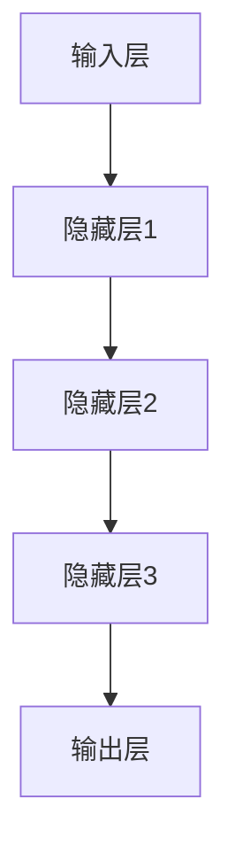

###### 2.1.2 神经网络的训练过程

神经网络的训练过程主要包括以下步骤：

1. **前向传播**：输入数据通过神经网络，逐层传递至输出层，生成预测结果。
2. **损失函数计算**：计算预测结果与实际结果之间的差异，通过损失函数表示。
3. **反向传播**：根据损失函数，反向传播误差，更新网络权重。
4. **优化算法**：使用优化算法（如梯度下降、Adam等）更新权重，减少损失。

神经网络的训练过程可以用以下Mermaid流程图表示：

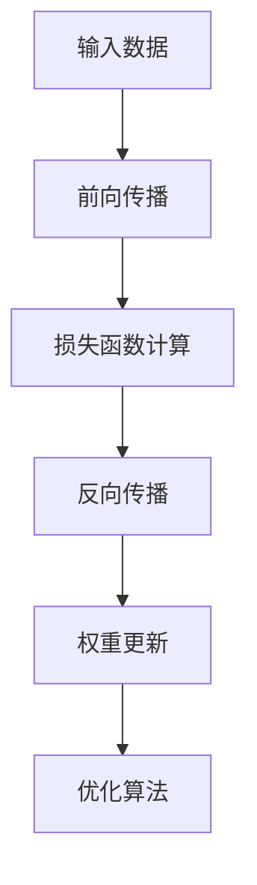

###### 2.1.3 常见的神经网络模型

常见的神经网络模型包括：
- **全连接神经网络**（Fully Connected Neural Network）：各层神经元之间全连接。
- **卷积神经网络**（Convolutional Neural Network，CNN）：适用于图像和语音处理。
- **循环神经网络**（Recurrent Neural Network，RNN）：适用于序列数据处理。
- **长短时记忆网络**（Long Short-Term Memory，LSTM）：RNN的改进模型，适用于长序列数据处理。

##### 2.2 AI大模型训练方法

###### 2.2.1 大规模数据处理技术

AI大模型的训练通常需要处理海量数据，因此大规模数据处理技术至关重要。以下是一些常用的技术：

- **数据并行**（Data Parallelism）：将数据分片，多台机器同时处理不同数据。
- **模型并行**（Model Parallelism）：将模型拆分，多台机器同时处理不同部分。
- **流水线并行**（Pipeline Parallelism）：各层网络分别训练，并行处理。

###### 2.2.2 分布式训练方法

分布式训练方法通过在多台机器上并行训练模型，提高训练效率和计算资源利用率。以下是一些常用的分布式训练方法：

- **参数服务器架构**（Parameter Server）：统一管理模型参数，多台机器训练数据，更新参数。
- **多机多卡架构**：多台机器，每台机器多块GPU，实现大规模模型训练。
- **分布式深度学习框架**：如TensorFlow、PyTorch等，提供分布式训练和模型管理功能。

###### 2.2.3 优化算法在训练中的应用

优化算法在AI大模型训练中起到关键作用，以下是一些常用的优化算法：

- **梯度下降**（Gradient Descent）：最简单的优化算法，通过调整权重以减少损失函数。
- **随机梯度下降**（Stochastic Gradient Descent，SGD）：在线更新权重，提高训练速度。
- **Adam优化器**：结合了SGD和动量法的优点，适用于大规模训练。

##### 2.3 AI大模型评估与优化

###### 2.3.1 评估指标和方法

AI大模型的评估主要关注模型的预测准确性、泛化能力、效率和可解释性。以下是一些常用的评估指标和方法：

- **准确率**（Accuracy）：预测正确的样本数占总样本数的比例。
- **精确率**（Precision）和**召回率**（Recall）：分别表示预测正确的正例和实际正例的比例。
- **F1分数**（F1 Score）：综合考虑精确率和召回率，平衡二者的权衡。
- **混淆矩阵**（Confusion Matrix）：展示模型预测结果的详细分布。

###### 2.3.2 模型优化策略

模型优化策略主要包括以下几个方面：

- **超参数调优**：调整学习率、批量大小、正则化参数等，提高模型性能。
- **模型集成**：结合多个模型的预测结果，提高整体准确性。
- **迁移学习**：利用已有模型在新数据集上进行训练，提高模型泛化能力。
- **数据增强**：通过增加样本多样性，提高模型对各种情况的适应能力。

###### 2.3.3 模型压缩与加速

随着模型规模的增大，训练和推理的耗时显著增加，因此模型压缩与加速技术至关重要。以下是一些常用的技术：

- **模型剪枝**（Model Pruning）：移除模型中的冗余权重，降低模型复杂度。
- **量化**（Quantization）：将浮点数权重转换为低精度的整数表示，减少存储和计算资源。
- **知识蒸馏**（Knowledge Distillation）：将大模型的权重传递给小模型，实现小模型的快速训练和推理。

### 第3章: 数据可视化核心技术与工具

##### 3.1 数据可视化基本原理

###### 3.1.1 数据可视化流程

数据可视化的一般流程包括以下步骤：

1. **数据准备**：清洗、处理和整理数据，使其适合可视化。
2. **可视化设计**：选择合适的图表类型和设计元素，设计可视化界面。
3. **数据映射**：将数据属性映射到图表的视觉属性上，如颜色、形状、大小等。
4. **交互设计**：添加交互功能，如筛选、排序、缩放等，提高用户交互体验。
5. **效果评估**：评估可视化效果，根据反馈进行优化和调整。

###### 3.1.2 常见可视化图表类型

常见的数据可视化图表类型包括：

- **折线图**：用于显示数据的变化趋势。
- **柱状图**：用于比较不同类别的数据大小。
- **饼图**：用于显示各类别的占比。
- **散点图**：用于显示数据点之间的相关性。
- **热力图**：用于显示数据的热度和分布。
- **地图**：用于显示地理数据。

###### 3.1.3 数据可视化设计原则

数据可视化设计应遵循以下原则：

- **简洁性**：避免过多元素和细节，突出关键信息。
- **一致性**：保持图表风格和元素的一致性，提高可读性。
- **可读性**：选择易于理解的图表类型和颜色，确保数据清晰明了。
- **交互性**：提供交互功能，使用户能够自由探索和筛选数据。
- **准确性**：确保数据的准确性和完整性，避免误导用户。

##### 3.2 常见数据可视化工具

常见的数据可视化工具有：

- **Matplotlib**：Python的强大绘图库，支持多种图表类型和自定义样式。
- **Seaborn**：基于Matplotlib的统计可视化库，提供丰富的图表模板和美化功能。
- **Plotly**：支持交互式图表的库，提供丰富的可视化效果和交互功能。

##### 3.3 数据可视化最佳实践

数据可视化最佳实践包括：

- **选择合适的图表类型**：根据数据类型和分析目标选择合适的图表类型。
- **设计简洁清晰的界面**：避免过多细节和装饰，突出关键信息。
- **使用颜色和形状表示数据**：合理使用颜色和形状，提高图表的可读性。
- **提供交互功能**：增加筛选、排序、缩放等交互功能，使用户能够更深入地了解数据。
- **进行效果评估**：根据用户反馈和实际效果，不断优化和调整可视化设计。

### 第4章: AI大模型与数据可视化融合实践

##### 4.1 数据预处理

数据预处理是数据可视化和AI大模型融合的关键步骤，主要包括以下任务：

- **数据清洗**：处理缺失值、异常值和噪声数据，确保数据质量。
- **数据归一化**：将不同尺度的数据进行标准化处理，使其在同一范围内进行比较。
- **特征工程**：提取和构造有用的特征，为数据可视化和AI大模型训练提供支持。

###### 4.1.1 数据清洗

数据清洗主要包括以下步骤：

1. **缺失值处理**：使用插值、平均值、中位数等方法填补缺失值。
2. **异常值处理**：识别和处理异常值，如使用统计学方法、聚类分析等。
3. **噪声处理**：使用滤波、平滑等方法去除噪声，提高数据质量。

###### 4.1.2 数据归一化

数据归一化的主要目的是将不同尺度的数据统一到一个范围内，常用的方法包括：

- **最小-最大缩放**：将数据缩放到[0, 1]范围内。
- **均值-标准差缩放**：将数据缩放到均值减2倍标准差到均值加2倍标准差范围内。
- **对数变换**：对数值数据取对数，使其符合正态分布。

###### 4.1.3 特征工程

特征工程是数据预处理的重要环节，主要包括以下任务：

1. **特征提取**：从原始数据中提取有用的特征，如使用统计学方法、机器学习方法等。
2. **特征构造**：构造新的特征，提高模型的预测能力和可解释性。
3. **特征选择**：选择最相关的特征，减少数据冗余，提高模型性能。

##### 4.2 AI大模型与数据可视化融合案例

###### 4.2.1 案例一：股票市场数据可视化分析

股票市场数据可视化分析是一个典型的AI大模型与数据可视化融合案例。通过数据预处理、AI大模型训练和数据可视化，可以实现对股票市场的深入分析和预测。

1. **数据预处理**：对股票市场数据进行清洗、归一化和特征工程，提取有用的特征。
2. **AI大模型训练**：使用神经网络等AI大模型对股票市场数据进行训练，建立预测模型。
3. **数据可视化**：通过折线图、柱状图、散点图等可视化图表，展示股票市场的变化趋势、相关性等。

以下是一个简单的数据可视化伪代码示例：

```python
import matplotlib.pyplot as plt
import pandas as pd

# 读取股票市场数据
data = pd.read_csv('stock_data.csv')

# 数据预处理
data = preprocess_data(data)

# 训练AI大模型
model = train_model(data)

# 可视化股票市场变化趋势
plt.plot(data['date'], data['price'])
plt.xlabel('Date')
plt.ylabel('Price')
plt.title('Stock Market Price Trend')
plt.show()
```

###### 4.2.2 案例二：客户行为数据分析

客户行为数据分析是另一个典型的AI大模型与数据可视化融合案例。通过数据预处理、AI大模型训练和数据可视化，可以深入分析客户行为，为企业提供决策支持。

1. **数据预处理**：对客户行为数据进行清洗、归一化和特征工程，提取有用的特征。
2. **AI大模型训练**：使用神经网络等AI大模型对客户行为数据进行训练，建立预测模型。
3. **数据可视化**：通过饼图、折线图、热力图等可视化图表，展示客户行为的分布、趋势等。

以下是一个简单的数据可视化伪代码示例：

```python
import matplotlib.pyplot as plt
import pandas as pd

# 读取客户行为数据
data = pd.read_csv('customer_behavior.csv')

# 数据预处理
data = preprocess_data(data)

# 训练AI大模型
model = train_model(data)

# 可视化客户行为分布
plt.pie(data['behavior'], labels=data['behavior'].unique(), autopct='%1.1f%%')
plt.title('Customer Behavior Distribution')
plt.show()

# 可视化客户行为趋势
plt.plot(data['date'], data['behavior'])
plt.xlabel('Date')
plt.ylabel('Behavior')
plt.title('Customer Behavior Trend')
plt.show()
```

###### 4.2.3 案例三：社交媒体数据可视化

社交媒体数据可视化是另一个典型的AI大模型与数据可视化融合案例。通过数据预处理、AI大模型训练和数据可视化，可以深入分析社交媒体用户行为，为社交媒体平台提供决策支持。

1. **数据预处理**：对社交媒体数据进行清洗、归一化和特征工程，提取有用的特征。
2. **AI大模型训练**：使用神经网络等AI大模型对社交媒体数据进行训练，建立预测模型。
3. **数据可视化**：通过散点图、热力图、地图等可视化图表，展示社交媒体用户行为的分布、趋势等。

以下是一个简单的数据可视化伪代码示例：

```python
import matplotlib.pyplot as plt
import pandas as pd

# 读取社交媒体数据
data = pd.read_csv('social_media_data.csv')

# 数据预处理
data = preprocess_data(data)

# 训练AI大模型
model = train_model(data)

# 可视化社交媒体用户行为分布
plt.scatter(data['lat'], data['lon'])
plt.xlabel('Latitude')
plt.ylabel('Longitude')
plt.title('Social Media User Distribution')
plt.show()

# 可视化社交媒体用户行为趋势
plt.plot(data['date'], data['behavior'])
plt.xlabel('Date')
plt.ylabel('Behavior')
plt.title('Social Media User Behavior Trend')
plt.show()
```

##### 4.3 AI大模型与数据可视化实战项目

###### 4.3.1 项目一：个性化推荐系统

个性化推荐系统是一个典型的AI大模型与数据可视化融合应用案例。通过数据预处理、AI大模型训练和数据可视化，可以构建一个能够提供个性化推荐功能的系统。

1. **数据预处理**：对用户行为数据进行清洗、归一化和特征工程，提取有用的特征。
2. **AI大模型训练**：使用神经网络等AI大模型对用户行为数据进行训练，建立推荐模型。
3. **数据可视化**：通过折线图、饼图、热力图等可视化图表，展示用户行为的趋势和分布，为推荐系统提供可视化支持。

以下是一个简单的数据可视化伪代码示例：

```python
import matplotlib.pyplot as plt
import pandas as pd

# 读取用户行为数据
data = pd.read_csv('user_behavior.csv')

# 数据预处理
data = preprocess_data(data)

# 训练AI大模型
model = train_model(data)

# 可视化用户行为趋势
plt.plot(data['date'], data['behavior'])
plt.xlabel('Date')
plt.ylabel('Behavior')
plt.title('User Behavior Trend')
plt.show()

# 可视化用户行为分布
plt.pie(data['behavior'], labels=data['behavior'].unique(), autopct='%1.1f%%')
plt.title('User Behavior Distribution')
plt.show()
```

###### 4.3.2 项目二：智能交通管理

智能交通管理是一个典型的AI大模型与数据可视化融合应用案例。通过数据预处理、AI大模型训练和数据可视化，可以实现对交通流量的实时监控和管理。

1. **数据预处理**：对交通流量数据进行清洗、归一化和特征工程，提取有用的特征。
2. **AI大模型训练**：使用神经网络等AI大模型对交通流量数据进行训练，建立流量预测模型。
3. **数据可视化**：通过折线图、热力图、地图等可视化图表，展示交通流量的变化趋势和分布，为智能交通管理提供可视化支持。

以下是一个简单的数据可视化伪代码示例：

```python
import matplotlib.pyplot as plt
import pandas as pd

# 读取交通流量数据
data = pd.read_csv('traffic_data.csv')

# 数据预处理
data = preprocess_data(data)

# 训练AI大模型
model = train_model(data)

# 可视化交通流量趋势
plt.plot(data['date'], data['traffic'])
plt.xlabel('Date')
plt.ylabel('Traffic')
plt.title('Traffic Flow Trend')
plt.show()

# 可视化交通流量分布
plt.scatter(data['lat'], data['lon'], c=data['traffic'], cmap='hot')
plt.xlabel('Latitude')
plt.ylabel('Longitude')
plt.title('Traffic Flow Distribution')
plt.show()
```

###### 4.3.3 项目三：健康数据分析

健康数据分析是一个典型的AI大模型与数据可视化融合应用案例。通过数据预处理、AI大模型训练和数据可视化，可以实现对健康数据的实时监控和分析。

1. **数据预处理**：对健康数据进行清洗、归一化和特征工程，提取有用的特征。
2. **AI大模型训练**：使用神经网络等AI大模型对健康数据进行训练，建立健康预测模型。
3. **数据可视化**：通过折线图、饼图、热力图等可视化图表，展示健康数据的趋势和分布，为健康数据分析提供可视化支持。

以下是一个简单的数据可视化伪代码示例：

```python
import matplotlib.pyplot as plt
import pandas as pd

# 读取健康数据
data = pd.read_csv('health_data.csv')

# 数据预处理
data = preprocess_data(data)

# 训练AI大模型
model = train_model(data)

# 可视化健康数据趋势
plt.plot(data['date'], data['health'])
plt.xlabel('Date')
plt.ylabel('Health')
plt.title('Health Data Trend')
plt.show()

# 可视化健康数据分布
plt.pie(data['health'], labels=data['health'].unique(), autopct='%1.1f%%')
plt.title('Health Data Distribution')
plt.show()
```

### 第二部分：AI大模型应用数据中心的数据可视化架构设计与实现

#### 第5章：数据中心架构设计

##### 5.1 数据中心架构概述

###### 5.1.1 数据中心的概念

数据中心（Data Center）是指用于存储、处理、管理和分发数据的物理设施或虚拟环境。它通常包括服务器、存储设备、网络设备和监控系统等组成部分。

###### 5.1.2 数据中心的架构层次

数据中心架构一般分为以下层次：

- **基础设施层**：包括服务器、存储设备、网络设备等硬件设施。
- **平台层**：提供计算、存储、网络等基础服务，如虚拟化平台、容器平台等。
- **应用层**：运行具体业务应用，如数据库、Web服务器等。
- **管理层**：提供数据中心监控、管理、优化等功能，如监控工具、管理平台等。

以下是一个简单的数据中心架构的Mermaid流程图：

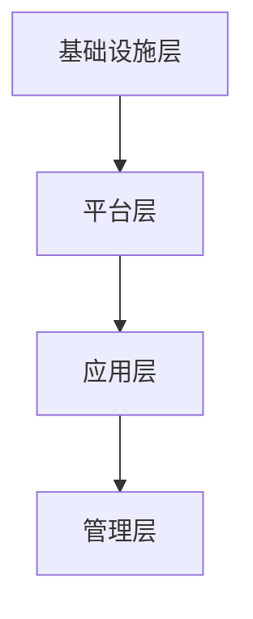

###### 5.1.3 数据中心的发展趋势

随着云计算、大数据和人工智能等技术的发展，数据中心的发展趋势包括：

- **云计算化**：越来越多的数据中心采用云计算架构，实现弹性扩展和资源优化。
- **自动化与智能化**：通过自动化工具和人工智能技术，实现数据中心的智能化管理。
- **分布式与边缘计算**：数据中心向分布式和边缘计算方向发展，满足多样化的计算需求。
- **绿色节能**：采用绿色节能技术，降低数据中心的能耗和碳排放。

##### 5.2 数据存储与管理

###### 5.2.1 数据存储技术

数据存储技术是数据中心的核心组成部分，主要包括以下几种：

- **硬盘存储**（HDD）：机械硬盘，容量大但速度较慢。
- **固态硬盘存储**（SSD）：固态硬盘，速度快但容量较小。
- **分布式存储**：通过多个节点分布式存储数据，提高数据存储的可靠性和性能。
- **云存储**：利用云服务提供商的资源，实现数据的远程存储和访问。

以下是一个简单的数据存储架构的Mermaid流程图：

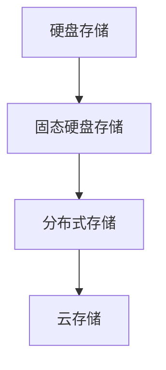

###### 5.2.2 数据管理策略

数据管理策略是确保数据质量、可用性和安全性的关键。主要包括以下方面：

- **数据备份**：定期备份数据，确保数据不丢失。
- **数据恢复**：在数据丢失或损坏时，能够快速恢复数据。
- **数据安全**：采用加密、访问控制等技术，确保数据的安全性和隐私。
- **数据生命周期管理**：根据数据的重要性和使用频率，对数据进行分类和处理。

以下是一个简单的数据管理流程的Mermaid流程图：

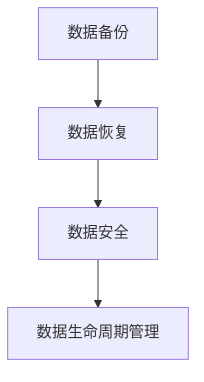

###### 5.2.3 数据安全与隐私保护

数据安全与隐私保护是数据中心的重要任务，主要包括以下方面：

- **数据加密**：对数据进行加密处理，确保数据在传输和存储过程中的安全性。
- **访问控制**：采用访问控制策略，确保只有授权用户才能访问数据。
- **审计与监控**：实时监控数据访问和操作，确保数据的安全性和合规性。
- **数据脱敏**：对敏感数据进行脱敏处理，保护用户隐私。

以下是一个简单的数据安全与隐私保护流程的Mermaid流程图：

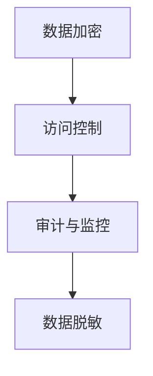

##### 5.3 数据处理与分析

###### 5.3.1 数据预处理技术

数据预处理技术是数据处理与分析的重要步骤，主要包括以下方面：

- **数据清洗**：处理缺失值、异常值和噪声数据，确保数据质量。
- **数据归一化**：将不同尺度的数据进行标准化处理，使其在同一范围内进行比较。
- **特征工程**：提取和构造有用的特征，为数据分析和模型训练提供支持。

以下是一个简单的数据预处理流程的Mermaid流程图：

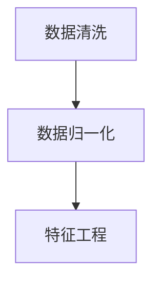

###### 5.3.2 数据分析流程

数据分析流程主要包括以下步骤：

1. **数据采集**：从各种数据源采集数据，如数据库、文件、传感器等。
2. **数据预处理**：对采集到的数据进行处理，确保数据质量。
3. **数据存储**：将预处理后的数据存储到数据库或数据仓库中，方便后续分析和查询。
4. **数据分析**：使用统计方法、机器学习方法等对数据进行深入分析，提取有用的信息和规律。
5. **数据可视化**：通过数据可视化技术，将分析结果以图表、报表等形式展示，帮助用户理解和决策。

以下是一个简单的数据分析流程的Mermaid流程图：

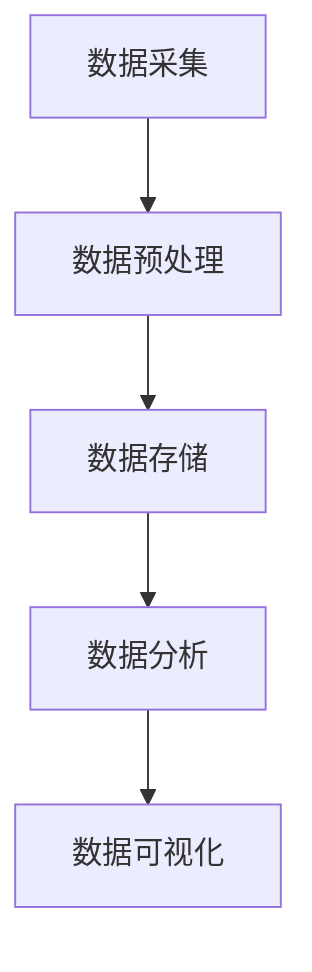

###### 5.3.3 数据挖掘与机器学习算法

数据挖掘与机器学习算法是数据分析的重要工具，主要包括以下方面：

- **分类算法**：将数据分为不同的类别，如决策树、随机森林、支持向量机等。
- **聚类算法**：将数据分为多个簇，如K-means、层次聚类等。
- **关联规则挖掘**：发现数据之间的关联关系，如Apriori算法、FP-growth算法等。
- **异常检测**：检测数据中的异常值和异常模式，如孤立森林、KNN等。

以下是一个简单的数据挖掘与机器学习算法流程的Mermaid流程图：

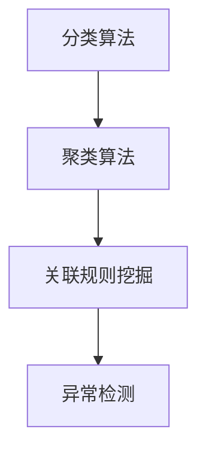

#### 第6章：数据可视化架构设计

##### 6.1 数据可视化架构概述

###### 6.1.1 数据可视化架构的组成部分

数据可视化架构通常包括以下组成部分：

- **数据源**：提供数据输入，可以是数据库、文件、API等。
- **数据处理层**：对数据进行预处理、清洗、归一化等操作，提取有用的特征。
- **数据存储层**：存储预处理后的数据，如关系数据库、NoSQL数据库等。
- **数据可视化层**：实现数据可视化，展示分析结果，可以是Web端、桌面应用等。
- **用户界面**：提供用户交互界面，使用户能够与数据可视化系统进行交互。

以下是一个简单的数据可视化架构的Mermaid流程图：

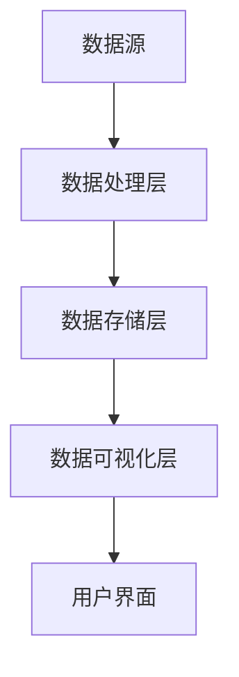

###### 6.1.2 数据可视化架构的设计原则

数据可视化架构的设计应遵循以下原则：

- **模块化**：将系统划分为多个模块，提高系统的可扩展性和可维护性。
- **可扩展性**：支持数据量的增长和系统功能的扩展。
- **灵活性**：支持不同类型的数据和不同的可视化需求。
- **高效性**：提高数据处理和可视化的性能，满足实时性的需求。
- **安全性**：确保数据的安全性和隐私性。

###### 6.1.3 数据可视化架构的实现方案

数据可视化架构的实现方案主要包括以下方面：

- **技术选型**：选择合适的技术栈，如前端框架、后端框架、数据库等。
- **数据处理**：采用数据预处理技术，提取有用的特征，提高数据质量。
- **数据存储**：选择合适的数据存储方案，如关系数据库、NoSQL数据库等。
- **数据可视化**：采用可视化工具和库，实现数据的高效可视化。
- **用户交互**：设计用户交互界面，提供友好的用户体验。

以下是一个简单的数据可视化架构的实现方案流程图：

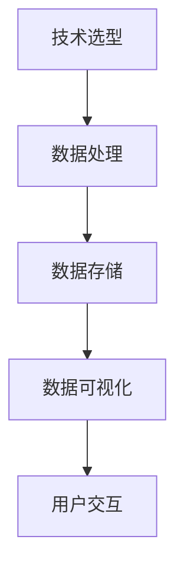

##### 6.2 数据可视化系统设计

###### 6.2.1 数据可视化系统的需求分析

数据可视化系统的需求分析主要包括以下方面：

- **功能需求**：明确数据可视化系统需要实现的功能，如数据导入、数据预处理、数据展示、用户交互等。
- **性能需求**：明确数据可视化系统的性能指标，如响应时间、数据吞吐量等。
- **安全需求**：确保数据的安全性，包括数据加密、访问控制等。
- **可扩展性需求**：系统应能够适应数据量和用户数量的增长。

以下是一个简单的数据可视化系统需求分析的Mermaid流程图：

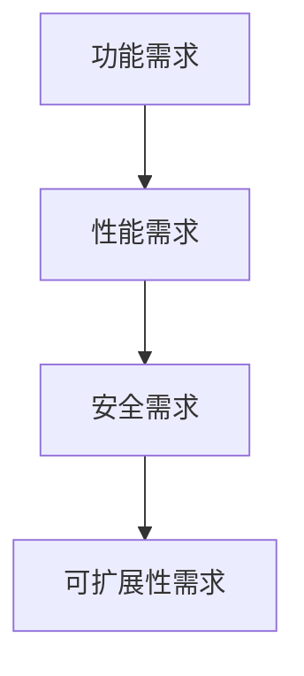

###### 6.2.2 数据可视化系统的功能设计

数据可视化系统的功能设计主要包括以下方面：

- **数据导入**：支持多种数据格式的导入，如CSV、Excel、数据库等。
- **数据预处理**：支持数据清洗、归一化、特征工程等操作，提高数据质量。
- **数据展示**：支持多种图表类型的展示，如折线图、柱状图、饼图等。
- **用户交互**：提供筛选、排序、缩放等交互功能，使用户能够自由探索数据。
- **数据导出**：支持将可视化结果导出为图片、报表等格式。

以下是一个简单的数据可视化系统功能设计的Mermaid流程图：

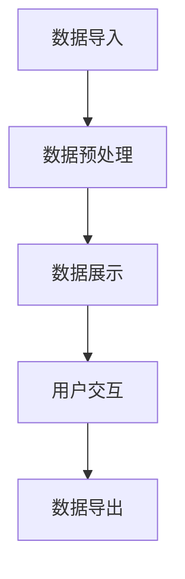

###### 6.2.3 数据可视化系统的性能优化

数据可视化系统的性能优化主要包括以下方面：

- **数据预处理优化**：提高数据预处理的效率，如并行处理、缓存等。
- **数据存储优化**：选择合适的存储方案，如分布式数据库、内存数据库等。
- **数据可视化优化**：优化可视化渲染和交互，提高响应速度和用户体验。
- **缓存机制**：采用缓存机制，减少数据读取和计算次数，提高系统性能。

以下是一个简单的数据可视化系统性能优化流程的Mermaid流程图：

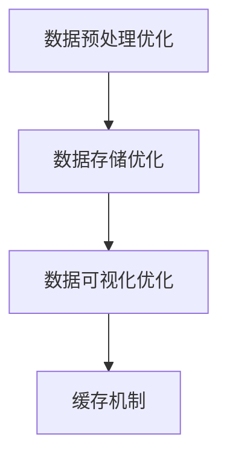

##### 6.3 数据可视化界面设计

###### 6.3.1 界面设计原则

数据可视化界面设计应遵循以下原则：

- **简洁性**：避免过多的装饰和细节，突出关键信息。
- **一致性**：保持界面风格和元素的一致性，提高用户体验。
- **可读性**：选择易于理解的图表类型、颜色和字体，提高图表的可读性。
- **交互性**：提供丰富的交互功能，如筛选、排序、缩放等，使用户能够自由探索数据。
- **响应性**：适应不同设备屏幕尺寸和分辨率，提供良好的用户体验。

以下是一个简单的数据可视化界面设计原则的Mermaid流程图：

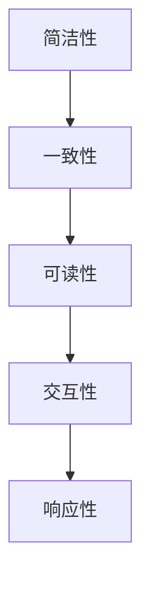

###### 6.3.2 界面布局与交互设计

界面布局与交互设计是数据可视化界面设计的重要部分，主要包括以下方面：

- **布局设计**：设计合理的界面布局，如顶部导航栏、左侧菜单、右侧图表等。
- **交互设计**：设计丰富的交互功能，如筛选、排序、缩放、拖拽等，提高用户体验。
- **导航设计**：设计清晰的导航结构，使用户能够快速找到所需数据和信息。
- **响应设计**：设计良好的响应机制，如加载动画、提示信息等，提高用户交互体验。

以下是一个简单的界面布局与交互设计的Mermaid流程图：

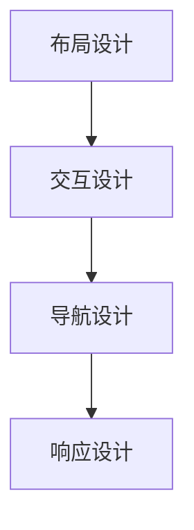

###### 6.3.3 界面美工与用户体验

界面美工与用户体验是数据可视化界面设计的关键，主要包括以下方面：

- **色彩设计**：选择合适的色彩搭配，提高界面的美观性和视觉效果。
- **字体设计**：选择合适的字体和字号，提高界面的可读性。
- **图标设计**：设计简洁清晰的图标，提高界面的美观性和用户体验。
- **动画设计**：设计合理的动画效果，提高界面的动态效果和用户体验。

以下是一个简单的界面美工与用户体验设计的Mermaid流程图：

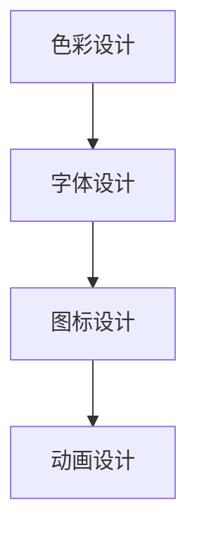

### 第7章：AI大模型与数据可视化架构的集成

##### 7.1 AI大模型与数据可视化架构的融合

###### 7.1.1 融合的必要性与优势

AI大模型与数据可视化架构的融合具有以下必要性和优势：

- **提升数据分析能力**：AI大模型能够自动提取和处理复杂数据，为数据可视化提供高质量的数据源。
- **提高决策支持效率**：通过数据可视化，将AI大模型的预测结果以直观、易懂的形式展示，帮助决策者快速做出科学决策。
- **增强数据交互体验**：AI大模型与数据可视化的融合，可以实现智能化的交互和动态的响应，提高用户的数据交互体验。
- **促进知识共享**：通过数据可视化，将专业的数据分析结果转化为大众可以理解的形式，促进知识的传播和共享。

以下是一个简单的AI大模型与数据可视化架构融合的Mermaid流程图：

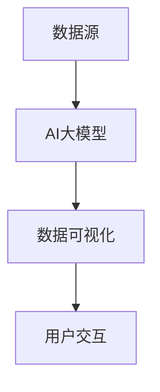

###### 7.1.2 融合架构的设计原则

融合架构的设计应遵循以下原则：

- **模块化**：将AI大模型和数据可视化系统划分为多个模块，提高系统的可扩展性和可维护性。
- **高内聚**：确保各模块内部功能紧密相关，降低模块之间的耦合度。
- **低耦合**：减少模块之间的依赖关系，提高系统的灵活性和可维护性。
- **高效性**：优化数据处理和可视化性能，提高系统的响应速度和用户体验。
- **安全性**：确保数据的安全性和隐私性，防止数据泄露和未经授权的访问。

以下是一个简单的融合架构设计原则的Mermaid流程图：

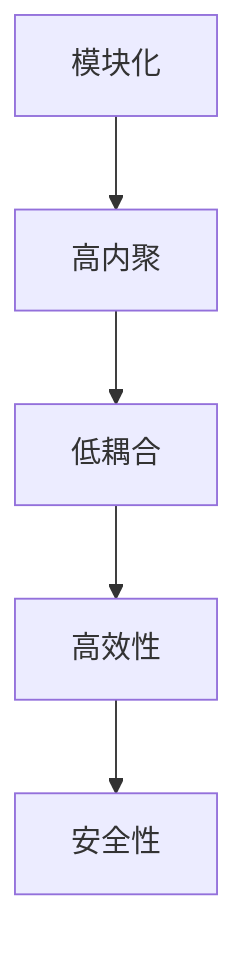

###### 7.1.3 融合架构的实现方案

融合架构的实现方案主要包括以下方面：

- **技术选型**：选择合适的技术栈，如前端框架、后端框架、数据库等，确保系统的高效性和灵活性。
- **数据处理**：采用数据预处理技术，提取有用的特征，提高数据质量。
- **数据存储**：选择合适的数据存储方案，如关系数据库、NoSQL数据库等，确保数据的可靠性和安全性。
- **数据可视化**：采用可视化工具和库，实现数据的高效可视化。
- **用户交互**：设计友好的用户交互界面，提供丰富的交互功能，提高用户体验。

以下是一个简单的融合架构实现方案的Mermaid流程图：


##### 7.2 AI大模型与数据可视化系统集成

###### 7.2.1 系统集成框架

AI大模型与数据可视化系统集成框架主要包括以下层次：

- **数据层**：包括数据源、数据存储、数据预处理等，为系统提供数据支持和数据管理。
- **模型层**：包括AI大模型的训练、评估、部署等，为系统提供预测和分析能力。
- **可视化层**：包括数据可视化工具和库，将模型预测结果以直观的形式展示。
- **应用层**：包括用户交互界面和应用功能，提供用户操作和数据交互。

以下是一个简单的系统集成框架的Mermaid流程图：

```mermaid
graph TD
A[数据层] --> B[模型层]
B --> C[可视化层]
C --> D[应用层]
```

###### 7.2.2 系统集成过程

系统集成过程主要包括以下步骤：

1. **需求分析**：明确系统的功能需求和性能需求，为后续系统集成提供指导。
2. **技术选型**：选择合适的技术栈，包括前端框架、后端框架、数据库等。
3. **系统设计**：设计系统的架构和模块，包括数据层、模型层、可视化层、应用层等。
4. **数据预处理**：对数据进行清洗、归一化、特征工程等预处理操作，提高数据质量。
5. **模型训练与部署**：训练AI大模型，评估模型性能，并将模型部署到生产环境中。
6. **系统集成**：将数据层、模型层、可视化层、应用层等集成到一起，实现系统的整体功能。
7. **测试与优化**：对系统进行功能测试和性能优化，确保系统的稳定性和高效性。

以下是一个简单的系统集成过程的Mermaid流程图：

```mermaid
graph TD
A[需求分析] --> B[技术选型]
B --> C[系统设计]
C --> D[数据预处理]
D --> E[模型训练与部署]
E --> F[系统集成]
F --> G[测试与优化]
```

###### 7.2.3 系统集成后的效果评估

系统集成后的效果评估主要包括以下方面：

- **功能完整性**：验证系统是否完整地实现了需求分析中的功能。
- **性能指标**：评估系统的响应速度、数据吞吐量、资源利用率等性能指标。
- **用户体验**：评估系统的用户界面、交互设计、响应速度等用户体验指标。
- **稳定性与可靠性**：评估系统在长时间运行和大规模数据量下的稳定性和可靠性。

以下是一个简单的效果评估指标的Mermaid流程图：

```mermaid
graph TD
A[功能完整性] --> B[性能指标]
B --> C[用户体验]
C --> D[稳定性与可靠性]
```

##### 7.3 AI大模型与数据可视化架构的应用场景

###### 7.3.1 应用场景一：企业运营数据监控

企业运营数据监控是一个典型的AI大模型与数据可视化架构应用场景。通过集成AI大模型和数据可视化技术，可以实现对企业运营数据的实时监控和分析，帮助企业及时发现问题、优化运营。

1. **数据采集**：从各种数据源（如ERP系统、数据库、传感器等）采集企业运营数据。
2. **数据预处理**：对采集到的数据进行清洗、归一化和特征工程，提取有用的特征。
3. **AI大模型训练**：使用神经网络等AI大模型对预处理后的数据进行训练，建立预测模型。
4. **数据可视化**：通过数据可视化技术，将AI大模型的预测结果以图表、报表等形式展示，帮助企业实时监控运营数据。
5. **用户交互**：设计友好的用户交互界面，提供筛选、排序、缩放等交互功能，使用户能够自由探索数据。

以下是一个简单的企业运营数据监控的Mermaid流程图：

```mermaid
graph TD
A[数据采集] --> B[数据预处理]
B --> C[AI大模型训练]
C --> D[数据可视化]
D --> E[用户交互]
```

###### 7.3.2 应用场景二：智慧城市建设

智慧城市建设是一个典型的AI大模型与数据可视化架构应用场景。通过集成AI大模型和数据可视化技术，可以实现城市数据的实时监测、分析和预测，为智慧城市的管理和决策提供支持。

1. **数据采集**：从各种数据源（如交通系统、环境监测系统、公共安全系统等）采集城市数据。
2. **数据预处理**：对采集到的数据进行清洗、归一化和特征工程，提取有用的特征。
3. **AI大模型训练**：使用神经网络等AI大模型对预处理后的数据进行训练，建立预测模型。
4. **数据可视化**：通过数据可视化技术，将AI大模型的预测结果以图表、报表等形式展示，为智慧城市的管理和决策提供支持。
5. **用户交互**：设计友好的用户交互界面，提供筛选、排序、缩放等交互功能，使用户能够自由探索数据。

以下是一个简单的智慧城市建设的Mermaid流程图：

```mermaid
graph TD
A[数据采集] --> B[数据预处理]
B --> C[AI大模型训练]
C --> D[数据可视化]
D --> E[用户交互]
```

###### 7.3.3 应用场景三：金融风险管理

金融风险管理是一个典型的AI大模型与数据可视化架构应用场景。通过集成AI大模型和数据可视化技术，可以实现金融风险的实时监测、分析和预测，为金融机构的风险管理和决策提供支持。

1. **数据采集**：从各种数据源（如金融交易系统、客户管理系统、风险监控系统等）采集金融数据。
2. **数据预处理**：对采集到的数据进行清洗、归一化和特征工程，提取有用的特征。
3. **AI大模型训练**：使用神经网络等AI大模型对预处理后的数据进行训练，建立预测模型。
4. **数据可视化**：通过数据可视化技术，将AI大模型的预测结果以图表、报表等形式展示，为金融机构的风险管理和决策提供支持。
5. **用户交互**：设计友好的用户交互界面，提供筛选、排序、缩放等交互功能，使用户能够自由探索数据。

以下是一个简单的金融风险管理的Mermaid流程图：

```mermaid
graph TD
A[数据采集] --> B[数据预处理]
B --> C[AI大模型训练]
C --> D[数据可视化]
D --> E[用户交互]
```

### 第8章：AI大模型应用数据中心的数据可视化实战

#### 8.1 实战项目一：企业运营数据监控

###### 8.1.1 项目背景与目标

随着企业业务的发展，运营数据的规模和复杂性不断增加，如何高效地监控和分析运营数据成为企业面临的重要挑战。本项目旨在通过AI大模型和数据可视化技术，实现对企业运营数据的实时监控和分析，帮助企业快速发现潜在问题和优化运营。

###### 8.1.2 项目需求分析

本项目需求主要包括以下方面：

- **实时数据监控**：能够实时采集和显示企业运营数据，如销售额、库存量、订单量等。
- **数据可视化**：将实时数据以直观、易懂的图表形式展示，如折线图、柱状图、饼图等。
- **交互功能**：提供筛选、排序、缩放等交互功能，使用户能够自由探索和比较数据。
- **异常检测与报警**：通过AI大模型分析运营数据，识别异常情况并发出报警通知。
- **历史数据分析**：支持历史数据的查询和分析，帮助用户了解业务趋势和变化。

###### 8.1.3 项目实现步骤

1. **数据采集**：从企业各个业务系统（如ERP系统、CRM系统、库存管理系统等）采集运营数据。
2. **数据预处理**：对采集到的数据进行清洗、归一化和特征工程，提取有用的特征。
3. **AI大模型训练**：使用神经网络等AI大模型对预处理后的数据进行训练，建立实时监控和异常检测模型。
4. **数据可视化**：采用数据可视化工具和库，实现实时数据的可视化展示，如折线图、柱状图、饼图等。
5. **用户交互**：设计友好的用户交互界面，提供筛选、排序、缩放等交互功能，提高用户操作体验。
6. **异常检测与报警**：通过AI大模型实时分析运营数据，识别异常情况并发出报警通知。
7. **历史数据分析**：支持历史数据的查询和分析，提供业务趋势和变化的分析报告。

以下是一个简单的项目实现步骤的Mermaid流程图：

```mermaid
graph TD
A[数据采集] --> B[数据预处理]
B --> C[AI大模型训练]
C --> D[数据可视化]
D --> E[用户交互]
D --> F[异常检测与报警]
D --> G[历史数据分析]
```

#### 8.2 实战项目二：智慧城市建设

###### 8.2.1 项目背景与目标

随着城市化进程的加速，城市管理和决策面临越来越多的挑战。智慧城市建设通过集成各种信息资源和先进技术，实现对城市运行的实时监测、分析和优化，提高城市管理效率和服务质量。本项目旨在通过AI大模型和数据可视化技术，实现智慧城市中的实时监控和分析，为城市管理提供科学依据。

###### 8.2.2 项目需求分析

本项目需求主要包括以下方面：

- **实时交通监控**：实时监测城市交通流量、拥堵情况，提供交通流量预测和优化建议。
- **环境监测**：实时监测城市空气质量、水质等环境指标，提供污染预警和治理建议。
- **公共安全**：实时监测城市公共安全情况，如火灾、地震等突发事件，提供应急响应和预警。
- **数据分析与可视化**：将实时数据以图表、报表等形式展示，帮助用户了解城市运行状态和变化趋势。
- **用户交互**：提供筛选、排序、缩放等交互功能，使用户能够自由探索和比较数据。

###### 8.2.3 项目实现步骤

1. **数据采集**：从城市各个部门（如交通管理部门、环保部门、公安部门等）采集实时数据。
2. **数据预处理**：对采集到的数据进行清洗、归一化和特征工程，提取有用的特征。
3. **AI大模型训练**：使用神经网络等AI大模型对预处理后的数据进行训练，建立交通流量预测、环境监测和公共安全预测模型。
4. **数据可视化**：采用数据可视化工具和库，实现实时数据的可视化展示，如热力图、折线图、饼图等。
5. **用户交互**：设计友好的用户交互界面，提供筛选、排序、缩放等交互功能，提高用户操作体验。
6. **实时监控**：通过AI大模型实时分析实时数据，监测城市运行状态，提供预警和建议。
7. **历史数据分析**：支持历史数据的查询和分析，提供业务趋势和变化的分析报告。

以下是一个简单的项目实现步骤的Mermaid流程图：

```mermaid
graph TD
A[数据采集] --> B[数据预处理]
B --> C[AI大模型训练]
C --> D[数据可视化]
D --> E[用户交互]
D --> F[实时监控]
D --> G[历史数据分析]
```

#### 8.3 实战项目三：金融风险管理

###### 8.3.1 项目背景与目标

金融风险管理是金融机构面临的重要任务，通过有效的风险监测和管理，可以降低金融机构的运营风险和损失。本项目旨在通过AI大模型和数据可视化技术，实现金融风险的实时监测和分析，为金融机构的风险管理和决策提供支持。

###### 8.3.2 项目需求分析

本项目需求主要包括以下方面：

- **实时风险监测**：实时监测金融机构的各类风险指标，如信用风险、市场风险、操作风险等。
- **风险预测与评估**：通过AI大模型对实时数据进行预测和评估，识别潜在的风险和风险等级。
- **风险可视化**：将风险监测和预测结果以图表、报表等形式展示，帮助用户了解风险状况和变化趋势。
- **用户交互**：提供筛选、排序、缩放等交互功能，使用户能够自由探索和比较风险数据。
- **风险预警与报警**：通过AI大模型实时分析风险数据，识别高风险情况并发出预警通知。

###### 8.3.3 项目实现步骤

1. **数据采集**：从金融机构的各个业务系统（如信贷系统、交易系统、风险管理系统等）采集实时数据。
2. **数据预处理**：对采集到的数据进行清洗、归一化和特征工程，提取有用的特征。
3. **AI大模型训练**：使用神经网络等AI大模型对预处理后的数据进行训练，建立风险预测和评估模型。
4. **数据可视化**：采用数据可视化工具和库，实现实时数据的可视化展示，如热力图、折线图、饼图等。
5. **用户交互**：设计友好的用户交互界面，提供筛选、排序、缩放等交互功能，提高用户操作体验。
6. **实时风险监测**：通过AI大模型实时分析实时数据，监测金融机构的各类风险指标。
7. **风险预测与评估**：通过AI大模型对实时数据进行预测和评估，识别潜在的风险和风险等级。
8. **风险预警与报警**：通过AI大模型实时分析风险数据，识别高风险情况并发出预警通知。

以下是一个简单的项目实现步骤的Mermaid流程图：

```mermaid
graph TD
A[数据采集] --> B[数据预处理]
B --> C[AI大模型训练]
C --> D[数据可视化]
D --> E[用户交互]
D --> F[实时风险监测]
D --> G[风险预测与评估]
D --> H[风险预警与报警]
```

### 第9章：数据可视化在AI大模型应用数据中心的发展趋势

#### 9.1 数据可视化技术的发展趋势

随着人工智能（AI）和数据技术的不断进步，数据可视化技术也在不断发展，呈现出以下几个趋势：

###### 9.1.1 新型数据可视化技术

随着计算机图形学和用户界面技术的发展，新型数据可视化技术不断涌现，包括：

- **交互式可视化**：通过用户与界面的实时交互，动态调整可视化效果和数据展示方式，提高用户参与度和体验。
- **虚拟现实（VR）和增强现实（AR）**：利用VR和AR技术，提供沉浸式和增强现实的数据展示，为用户提供更加直观和丰富的数据体验。
- **三维和四维可视化**：通过三维和四维图形技术，展示更复杂和多维度的数据，帮助用户更好地理解和分析数据。

以下是一个简单的交互式可视化的Mermaid流程图：

```mermaid
graph TD
A[数据输入] --> B[数据处理]
B --> C[交互式调整]
C --> D[可视化展示]
```

###### 9.1.2 数据可视化与AI的深度融合

数据可视化与AI的深度融合是未来发展的一个重要方向，主要表现在：

- **自动化可视化**：利用AI技术，自动生成数据可视化报表和图表，减轻数据分析师的工作负担。
- **智能推荐**：基于用户行为和偏好，利用AI技术推荐适合的数据可视化内容和展示方式。
- **预测性可视化**：利用AI技术，对未来的数据趋势和变化进行预测，并通过可视化展示，帮助用户提前了解和应对潜在问题。

以下是一个简单的自动化可视化的Mermaid流程图：

```mermaid
graph TD
A[数据输入] --> B[数据处理]
B --> C[自动化生成]
C --> D[可视化展示]
```

###### 9.1.3 数据可视化在数据中心的应用前景

随着数据中心技术的不断发展，数据可视化在数据中心的应用前景十分广阔，主要体现在以下几个方面：

- **实时监控与报警**：通过数据可视化，实时监控数据中心的各种指标和运行状态，及时发现和解决潜在问题。
- **性能优化与资源调度**：通过数据可视化，分析数据中心的数据流量、负载情况和资源利用率，优化性能和资源调度策略。
- **安全监测与防护**：通过数据可视化，实时监测数据中心的安全状况，识别潜在的安全威胁，并采取相应的防护措施。

以下是一个简单的实时监控与报警的Mermaid流程图：

```mermaid
graph TD
A[数据输入] --> B[数据处理]
B --> C[实时监控]
C --> D[报警通知]
```

#### 9.2 AI大模型应用数据中心的发展趋势

随着人工智能（AI）技术的不断发展和数据中心的规模不断扩大，AI大模型在数据中心的应用也呈现出以下几个趋势：

###### 9.2.1 数据中心的发展趋势

数据中心的发展趋势主要体现在以下几个方面：

- **云计算与边缘计算**：云计算和边缘计算的发展，使得数据中心的计算和存储资源更加灵活和分布式，为AI大模型的应用提供更好的支持。
- **绿色节能**：随着环保意识的提高，数据中心越来越注重绿色节能技术，通过优化能耗管理和采用可再生能源，降低碳排放。
- **智能化管理**：通过引入AI技术，实现数据中心的智能化管理，提高资源利用率和管理效率。

以下是一个简单的数据中心发展趋势的Mermaid流程图：

```mermaid
graph TD
A[云计算与边缘计算] --> B[绿色节能]
B --> C[智能化管理]
```

###### 9.2.2 AI大模型在数据中心的应用

AI大模型在数据中心的应用趋势主要体现在以下几个方面：

- **实时监控与预测**：通过AI大模型，实时监控数据中心的运行状态和性能指标，预测潜在的故障和性能瓶颈，提供预警和优化建议。
- **负载均衡与调度**：利用AI大模型，分析数据中心的负载情况，动态调整资源分配，实现负载均衡和优化资源利用率。
- **安全防护与审计**：通过AI大模型，实时监测数据中心的网络安全状况，识别和防范安全威胁，进行安全审计和合规性检查。

以下是一个简单的AI大模型在数据中心应用的Mermaid流程图：

```mermaid
graph TD
A[实时监控与预测] --> B[负载均衡与调度]
B --> C[安全防护与审计]
```

###### 9.2.3 数据中心与AI大模型的未来发展趋势

数据中心与AI大模型的未来发展趋势主要体现在以下几个方面：

- **融合与协同**：数据中心与AI大模型将更加紧密地融合，协同工作，提高数据中心的整体性能和智能化水平。
- **自动化与智能化**：通过AI大模型和自动化技术，实现数据中心的自动化管理和运维，提高管理效率和减少人工干预。
- **自适应与适应性**：数据中心将具备更强的自适应能力，根据业务需求和数据特点，动态调整资源配置和优化策略。

以下是一个简单的数据中心与AI大模型未来发展趋势的Mermaid流程图：

```mermaid
graph TD
A[融合与协同] --> B[自动化与智能化]
B --> C[自适应与适应性]
```

#### 9.3 数据可视化与AI大模型应用的数据中心未来发展

随着数据可视化与AI大模型技术的不断发展，数据中心在未来将呈现出以下几个发展方向：

###### 9.3.1 未来技术挑战与解决方案

未来数据中心在数据可视化与AI大模型应用中面临的技术挑战主要包括：

- **数据量与处理速度**：随着数据量的爆炸性增长，如何快速处理和分析海量数据成为关键挑战。解决方案包括分布式计算、并行处理和高效的数据存储与检索技术。
- **数据安全与隐私**：数据中心存储和处理大量敏感数据，如何确保数据的安全性和隐私性是一个重要挑战。解决方案包括数据加密、访问控制和隐私保护技术。
- **资源调度与优化**：如何高效地调度和管理数据中心资源，实现负载均衡和优化性能是一个持续挑战。解决方案包括智能调度算法和资源优化策略。

以下是一个简单的未来技术挑战与解决方案的Mermaid流程图：

```mermaid
graph TD
A[数据量与处理速度] --> B[数据安全与隐私]
B --> C[资源调度与优化]
```

###### 9.3.2 未来发展趋势与市场前景

数据可视化与AI大模型应用的数据中心未来发展趋势主要包括：

- **智能化与自动化**：数据中心将更加智能化和自动化，通过AI大模型和自动化技术实现高效管理和运维。
- **分布式与边缘计算**：数据中心将向分布式和边缘计算方向发展，满足多样化计算需求，提高数据处理的灵活性和效率。
- **绿色节能**：随着环保意识的提高，绿色节能将成为数据中心发展的重要方向，通过优化能耗管理和采用可再生能源降低碳排放。

以下是一个简单的未来发展趋势与市场前景的Mermaid流程图：

```mermaid
graph TD
A[智能化与自动化] --> B[分布式与边缘计算]
B --> C[绿色节能]
```

###### 9.3.3 数据可视化与AI大模型应用的数据中心未来规划

未来数据中心在数据可视化与AI大模型应用方面的规划主要包括：

- **智能化监控与预警**：通过AI大模型和实时数据可视化，实现数据中心智能化监控和预警，及时发现和解决潜在问题。
- **智能调度与资源优化**：利用AI大模型和自动化技术，实现数据中心资源的智能调度和优化，提高资源利用率和系统性能。
- **数据安全与隐私保护**：采用先进的数据加密、访问控制和隐私保护技术，确保数据中心数据的安全性和隐私性。
- **绿色节能与可持续发展**：通过优化能耗管理和采用可再生能源，实现数据中心的绿色节能和可持续发展。

以下是一个简单的未来规划的具体内容的Mermaid流程图：

```mermaid
graph TD
A[智能化监控与预警] --> B[智能调度与资源优化]
B --> C[数据安全与隐私保护]
C --> D[绿色节能与可持续发展]
```

### 总结与展望

数据可视化与AI大模型应用的数据中心技术正在快速发展，通过数据可视化，我们可以更直观地理解和分析数据，而AI大模型则为数据中心提供了强大的数据处理和预测能力。未来的发展趋势将更加注重智能化、自动化和绿色节能，通过技术融合和创新，实现数据中心的全面升级和优化。

作者：AI天才研究院/AI Genius Institute & 禅与计算机程序设计艺术 /Zen And The Art of Computer Programming

