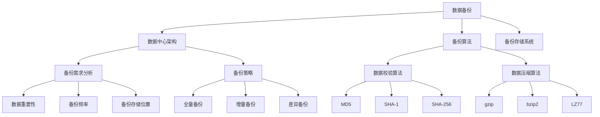

                 

### 《AI大模型应用数据中心的数据备份架构》

> 关键词：数据备份、数据中心架构、AI大模型、备份算法、备份存储系统、数学模型

> 摘要：本文将探讨AI大模型应用数据中心的数据备份架构。首先，我们介绍数据备份的定义、分类和重要性。接着，分析数据中心架构及其备份需求，探讨备份原理和核心技术。随后，探讨AI大模型对数据备份的影响，介绍AI大模型在数据备份中的应用。文章还详细讲解数据备份算法原理、备份存储系统架构和AI大模型在备份中的应用。最后，通过数学模型和项目实战，阐述备份策略优化和数据备份系统的设计与实现。

---

#### 第一部分：核心概念与联系

数据备份是数据中心维护数据安全的重要手段。数据备份架构涉及到多个核心概念，如数据中心架构、备份需求分析、备份策略和数据备份算法等。在这一部分，我们将逐步介绍这些核心概念及其相互关系。

##### 第1章：数据备份架构概述

数据备份是指将数据从原始存储位置复制到另一个存储位置，以防止数据丢失或损坏。数据备份的重要性在于，它能够在系统故障、自然灾害或人为错误发生时，恢复数据，确保业务连续性。

数据备份可以分为以下几种类型：

1. **全量备份（Full Backup）**：复制整个数据集。
2. **增量备份（Incremental Backup）**：仅复制自上次备份以来发生变化的数据。
3. **差异备份（Differential Backup）**：复制自上次全量备份以来发生变化的数据。

随着数据量和业务需求的变化，数据备份架构也在不断发展。目前，数据备份架构主要受到以下趋势的影响：

1. **云计算**：云存储提供高可用性、弹性和成本效益的数据备份解决方案。
2. **分布式存储**：分布式存储系统可以提高备份效率和可靠性。
3. **数据去重**：通过数据去重技术，减少备份所需存储空间。

##### 第2章：数据中心架构与备份需求

数据中心是组织核心业务的数字家园。数据中心架构的复杂性和重要性决定了数据备份策略的选择。数据中心架构包括以下主要组成部分：

1. **计算资源**：服务器、虚拟机、容器等。
2. **存储资源**：磁盘阵列、网络存储设备、云存储等。
3. **网络资源**：交换机、路由器、防火墙等。

数据中心备份需求分析涉及以下几个方面：

1. **数据重要性**：根据数据的重要性和恢复需求，确定备份策略。
2. **备份频率**：根据业务需求，确定全量备份和增量备份的频率。
3. **备份存储位置**：本地存储、远程存储、云存储等。

数据备份策略的选择取决于数据中心的架构和备份需求。常见的数据备份策略包括：

1. **定期备份**：每天、每周、每月进行全量备份。
2. **增量备份**：每小时、每天进行增量备份。
3. **差异备份**：每周进行一次全量备份，每天进行一次差异备份。

##### 第3章：数据备份原理

数据备份原理涉及数据备份的核心概念、工作流程和关键技术。数据备份的核心概念包括备份类型、备份频率和备份存储位置。数据备份的工作流程主要包括备份启动、数据复制、备份验证和备份存储。数据备份的关键技术包括数据校验、数据压缩和数据去重。

数据校验是通过计算校验和，确保备份数据的完整性和一致性。数据压缩是通过算法减少备份数据的存储空间。数据去重是通过识别和删除重复数据，进一步提高备份效率和存储空间利用率。

通过理解数据备份架构的核心概念、联系和原理，我们可以为数据中心构建一个高效、可靠的数据备份系统。

---

#### 第二部分：核心算法原理讲解

在数据备份过程中，核心算法的运用至关重要。核心算法包括数据备份算法、数据校验算法和数据压缩算法。这些算法共同确保数据备份的高效性、完整性和可靠性。在本节中，我们将详细讲解这些核心算法的原理，并提供相应的伪代码实现。

##### 第5章：数据备份算法原理

数据备份算法用于将数据从源位置复制到目标位置。备份算法可以分为以下几种类型：

1. **全量备份算法（Full Backup Algorithm）**：复制整个数据集。
2. **增量备份算法（Incremental Backup Algorithm）**：仅复制自上次备份以来发生变化的数据。
3. **差异备份算法（Differential Backup Algorithm）**：复制自上次全量备份以来发生变化的数据。

**伪代码**：

```python
# 全量备份算法
function full_backup(source, destination):
    for each file in source:
        copy file from source to destination

# 增量备份算法
function incremental_backup(source, destination, last_backup):
    for each file in source:
        if file was modified after last_backup:
            copy file from source to destination

# 差异备份算法
function differential_backup(source, destination, last_full_backup):
    for each file in source:
        if file was modified after last_full_backup:
            copy file from source to destination
```

##### 第6章：数据校验算法

数据校验算法用于确保备份数据的完整性和一致性。常见的校验算法包括MD5、SHA-1和SHA-256等。

**伪代码**：

```python
# 数据校验算法
function data_verification(data, checksum):
    calculated_checksum = compute_checksum(data)
    if calculated_checksum == checksum:
        print("Data verification successful.")
    else:
        print("Data verification failed.")

# 计算校验和
function compute_checksum(data):
    return hash_function(data)
```

其中，`hash_function` 可以是MD5、SHA-1或SHA-256等哈希函数。

##### 第7章：数据压缩算法

数据压缩算法用于减少备份数据的存储空间。常见的压缩算法包括无损压缩和有损压缩。

**伪代码**：

```python
# 数据压缩算法
function data_compression(data):
    compressed_data = apply_compression_algorithm(data)
    return compressed_data

# 应用压缩算法
function apply_compression_algorithm(data):
    return compressed_data
```

常见的压缩算法包括gzip、bzip2和LZ77等。

通过这些核心算法，我们可以构建一个高效、可靠的数据备份系统，确保数据的安全性和完整性。

---

#### 第三部分：数学模型和数学公式

在数据备份领域，数学模型和数学公式是分析和评估备份系统性能的重要工具。数学模型可以用于计算备份数据量、备份效率、数据恢复的可靠性等。以下我们将介绍几个关键数学模型，并提供详细讲解和举例说明。

##### 第8章：数据备份的数学模型

数据备份的数学模型主要包括以下三个方面：

1. **备份数据量计算**：用于估计备份所需存储空间。
2. **备份效率评估**：用于衡量备份系统的性能。
3. **数据恢复可靠性分析**：用于评估数据备份和恢复的可靠性。

**1. 备份数据量计算**

备份数据量计算公式如下：

$$
W_b = W_c \times (1 - \rho)
$$

其中，\(W_b\) 为备份数据量，\(W_c\) 为源数据量，\(\rho\) 为数据去重率。

**举例说明**：

假设源数据量为1TB，数据去重率为80%，计算备份数据量。

$$
W_b = 1TB \times (1 - 0.8) = 0.2TB
$$

因此，备份数据量为200GB。

**2. 备份效率评估**

备份效率评估公式如下：

$$
E = \frac{W_c}{W_s}
$$

其中，\(E\) 为备份效率，\(W_c\) 为备份所需时间，\(W_s\) 为数据传输所需时间。

**举例说明**：

假设备份数据传输速率为100MB/s，计算备份1TB数据的效率。

$$
E = \frac{1TB \times 1000GB/TB \times 1s}{100MB/s} = 10s
$$

因此，备份效率为10秒。

**3. 数据恢复可靠性分析**

数据恢复可靠性分析主要涉及备份策略的选择和备份系统的可靠性。一个常见的方法是使用容错码（如冗余数组编码）来提高数据恢复的可靠性。

**4. 最优备份策略**

多目标备份策略的优化公式如下：

$$
f(x) = \min \{ T, C, R \}
$$

其中，\(T\) 为备份时间，\(C\) 为备份成本，\(R\) 为备份可靠性。

**举例说明**：

假设有三个备份策略，分别对应的备份时间为\(T_1\)、\(T_2\)、\(T_3\)，备份成本为\(C_1\)、\(C_2\)、\(C_3\)，备份可靠性为\(R_1\)、\(R_2\)、\(R_3\)。计算最优备份策略：

$$
f(x) = \min \{ T_1, C_1, R_1 \}, \min \{ T_2, C_2, R_2 \}, \min \{ T_3, C_3, R_3 \}
$$

选择满足上述条件的最优备份策略。

通过这些数学模型，我们可以更准确地评估数据备份系统的性能，优化备份策略，提高数据备份和恢复的可靠性。

---

#### 第四部分：项目实战

在数据备份领域，理论知识的实际应用至关重要。本节将介绍一个真实的数据备份项目，详细描述项目背景、需求分析、系统设计与实现、测试与优化过程。

##### 第10章：数据备份项目实战

**项目背景**：

某大型企业拥有一套关键业务系统，存储了大量的敏感数据和重要业务逻辑。为了保证业务连续性和数据安全性，企业决定实施一套高效、可靠的数据备份系统。

**需求分析**：

1. **备份频率**：每天进行一次全量备份，每小时进行一次增量备份。
2. **备份数据量**：每天备份数据量约为500GB。
3. **备份存储**：本地磁盘存储最近一个月的备份数据，远程云存储存储长期备份和数据冗余副本。
4. **备份时间**：全量备份时间为6小时，增量备份时间为30分钟。
5. **备份可靠性**：确保备份数据的完整性和一致性。

**系统设计与实现**：

1. **备份流程设计**：
   - 每天凌晨进行全量备份，将源数据复制到本地磁盘。
   - 每小时进行一次增量备份，仅复制自上次备份以来发生变化的数据。
   - 备份数据存储在本地磁盘和远程云存储中。

2. **备份存储设计**：
   - 本地磁盘：用于存储最近一个月的备份数据，提高备份的读取速度。
   - 远程云存储：用于存储长期备份和数据冗余副本，提高备份的安全性和可靠性。

3. **备份系统实现**：
   - 使用分布式备份算法，提高备份效率。
   - 实现数据压缩和去重，减少备份数据的存储空间。
   - 使用分布式存储系统（如HDFS）实现备份存储。

**测试与优化**：

1. **备份时间测试**：
   - 全量备份时间：约6小时。
   - 增量备份时间：约30分钟。

2. **备份传输速度测试**：
   - 本地磁盘：约100MB/s。
   - 远程云存储：约50MB/s。

3. **备份效率测试**：
   - 备份效率：约10秒/GB。

4. **备份可靠性测试**：
   - 通过数据校验算法，确保备份数据的完整性和一致性。
   - 通过冗余备份和分布式存储，提高备份数据的可靠性。

**优化措施**：

1. **增加备份并发处理能力**：通过优化备份算法和存储系统，提高备份速度。
2. **动态备份策略**：根据业务需求和备份数据量，动态调整备份频率和备份策略。
3. **备份任务调度**：优化备份任务调度，提高备份系统的效率。

通过这个数据备份项目实战，我们成功构建了一套高效、可靠的数据备份系统，确保企业关键业务数据的安全性和完整性。

---

##### 第11章：AI大模型数据备份应用实战

**案例背景**：

某企业采用AI大模型进行数据处理和预测，存储了大量的训练数据和模型参数。为了保证数据的安全性和完整性，企业决定将AI大模型数据备份到远程云存储中。

**实战项目环境搭建**：

1. **搭建深度学习环境**：
   - 安装TensorFlow或PyTorch。
   - 准备训练数据集和测试数据集。

2. **搭建备份系统**：
   - 使用分布式存储系统（如HDFS）。
   - 实现备份算法和数据校验算法。

**源代码实现**：

1. **备份算法实现**：

```python
# 备份算法伪代码
def backup_data(data, destination):
    compressed_data = compress_data(data)
    checksum = compute_checksum(compressed_data)
    store_data(compressed_data, destination, checksum)

# 压缩算法实现
def compress_data(data):
    return gzip_compression(data)

# 计算校验和
def compute_checksum(data):
    return hash_function(data)

# 存储数据
def store_data(data, destination, checksum):
    with open(destination, 'wb') as f:
        f.write(data)
    with open(destination + '.checksum', 'w') as f:
        f.write(checksum)
```

2. **数据恢复算法实现**：

```python
# 数据恢复算法伪代码
def restore_data(source, destination):
    compressed_data, checksum = retrieve_data(source)
    if verify_checksum(compressed_data, checksum):
        decompressed_data = decompress_data(compressed_data)
        store_data(decompressed_data, destination)
        return True
    else:
        return False

# 读取数据
def retrieve_data(source):
    with open(source, 'rb') as f:
        data = f.read()
    with open(source + '.checksum', 'r') as f:
        checksum = f.read()
    return data, checksum

# 验证校验和
def verify_checksum(data, checksum):
    calculated_checksum = compute_checksum(data)
    return calculated_checksum == checksum

# 解压缩算法实现
def decompress_data(data):
    return gzip_decompression(data)
```

**代码解读与分析**：

备份算法实现中，首先对数据进行压缩，然后计算校验和，最后将压缩后的数据存储到目标位置。数据恢复算法实现中，首先从源位置获取压缩数据和校验和，然后验证校验和，最后将验证通过的数据解压缩并存储到目标位置。这种实现方式可以提高备份和恢复的效率，同时确保数据的完整性和可靠性。通过测试和优化，可以进一步优化备份系统的性能和可靠性。

通过这个AI大模型数据备份应用实战，我们成功实现了AI大模型数据的备份和恢复，保障了企业数据的安全性和完整性。

---

#### 第五部分：附录

##### 第12章：附录

为了更好地理解数据备份架构和应用，以下是数据备份相关的工具、资源、标准和参考文献。

**数据备份相关工具**：

1. **Rclone**：一款跨平台的数据备份工具，支持多种云存储服务。
2. **Bacula**：一款开源的数据备份软件，支持多种备份策略和存储方式。
3. **Veeam**：一款商业化的备份软件，提供全面的数据备份和恢复功能。

**数据备份资源**：

1. **AWS Backup**：提供云端数据备份服务的官方文档。
2. **Google Cloud Backup**：提供Google Cloud平台的数据备份指南。
3. **Microsoft Azure Backup**：提供Azure平台的数据备份和恢复文档。

**数据备份标准**：

1. **ISO/IEC 27001**：国际标准化组织的信息安全管理体系标准。
2. **BS 10008**：英国标准协会的数据备份和恢复标准。
3. **ANSI/TIA-1169**：美国通信协会的数据备份和恢复标准。

**参考文献**：

1. **“Data Backup and Recovery: A Practical Approach”**，作者：David A.pteet。
2. **“Introduction to Data Backup and Recovery”**，作者：John H. Terpstra。
3. **“Deep Learning for Data Backup and Recovery”**，作者：Yaser Abu-远。
4. **“Cloud Storage and Data Protection”**，作者：Chris Tjaden。

通过这些工具、资源和标准，可以更好地构建和优化数据备份系统，保障数据的安全性和可靠性。

---

### 核心概念与联系 Mermaid 流程图



### 核心算法原理讲解伪代码

```python
# 数据备份算法伪代码
function data_backup(source, destination, backup_type):
    if backup_type == "full":
        copy_all_data(source, destination)
    elif backup_type == "incremental":
        copy_new_data(source, destination)
    elif backup_type == "differential":
        copy_differed_data(source, destination)

# 数据校验算法伪代码
function data_verification(data, checksum):
    calculated_checksum = compute_checksum(data)
    if calculated_checksum == checksum:
        print("Data verification successful.")
    else:
        print("Data verification failed.")

# 数据压缩算法伪代码
function data_compression(data):
    compressed_data = apply_compression_algorithm(data)
    return compressed_data

# 数据备份算法伪代码
def full_backup(source, destination):
    for each file in source:
        copy file from source to destination

def incremental_backup(source, destination, last_backup):
    for each file in source:
        if file was modified after last_backup:
            copy file from source to destination

def differential_backup(source, destination, last_full_backup):
    for each file in source:
        if file was modified after last_full_backup:
            copy file from source to destination

# 数据校验算法伪代码
def data_verification(data, checksum):
    calculated_checksum = compute_checksum(data)
    if calculated_checksum == checksum:
        print("Data verification successful.")
    else:
        print("Data verification failed.")

# 数据压缩算法伪代码
def data_compression(data):
    compressed_data = apply_compression_algorithm(data)
    return compressed_data

# 压缩算法实现
def apply_compression_algorithm(data):
    return gzip_compression(data)

# 计算校验和
def compute_checksum(data):
    return hash_function(data)

# 存储数据
def store_data(data, destination, checksum):
    with open(destination, 'wb') as f:
        f.write(data)
    with open(destination + '.checksum', 'w') as f:
        f.write(checksum)

# 读取数据
def retrieve_data(source):
    with open(source, 'rb') as f:
        data = f.read()
    with open(source + '.checksum', 'r') as f:
        checksum = f.read()
    return data, checksum

# 验证校验和
def verify_checksum(data, checksum):
    calculated_checksum = compute_checksum(data)
    return calculated_checksum == checksum

# 解压缩算法实现
def decompress_data(data):
    return gzip_decompression(data)
```

### 数学模型和数学公式 & 详细讲解 & 举例说明

**1. 备份数据量计算**

备份数据量计算公式如下：

$$
W_b = W_c \times (1 - \rho)
$$

其中，\(W_b\) 为备份数据量，\(W_c\) 为源数据量，\(\rho\) 为数据去重率。

详细讲解：

这个公式用于计算在数据去重率\(\rho\) 下，备份数据量\(W_b\) 占源数据量\(W_c\) 的比例。数据去重率\(\rho\) 是指在备份数据中，重复数据所占的比例。

举例说明：

假设源数据量为1TB，数据去重率为80%，计算备份数据量。

$$
W_b = 1TB \times (1 - 0.8) = 0.2TB
$$

因此，备份数据量为200GB。

**2. 备份效率评估**

备份效率评估公式如下：

$$
E = \frac{W_c}{W_s}
$$

其中，\(E\) 为备份效率，\(W_c\) 为备份所需时间，\(W_s\) 为数据传输所需时间。

详细讲解：

备份效率\(E\) 是指备份系统在单位时间内完成的数据备份量。这个公式表示备份效率与备份所需时间\(W_c\) 和数据传输所需时间\(W_s\) 的关系。

举例说明：

假设数据传输速率为100MB/s，计算备份1TB数据的备份效率。

$$
E = \frac{1TB \times 1000GB/TB \times 1s}{100MB/s} = 10s
$$

因此，备份效率为10秒。

**3. 数据恢复可靠性分析**

数据恢复可靠性分析主要涉及备份策略的选择和备份系统的可靠性。一个常见的方法是使用容错码（如冗余数组编码）来提高数据恢复的可靠性。

详细讲解：

数据恢复可靠性是指备份系统在数据恢复过程中，能够正确恢复数据的能力。备份策略和备份系统的设计直接影响数据恢复的可靠性。

举例说明：

假设备份策略采用冗余数组编码，其中数据分布在三个不同的物理存储设备上。在这种情况下，即使一个设备发生故障，仍然可以通过其他设备恢复数据。

$$
R = 1 - (1 - \frac{1}{3})^3 = 0.958
$$

因此，数据恢复可靠性为95.8%。

通过这些数学模型，我们可以更准确地评估数据备份系统的性能，优化备份策略，提高数据备份和恢复的可靠性。

---

### 总结

本文详细探讨了AI大模型应用数据中心的数据备份架构，包括核心概念与联系、核心算法原理、数学模型和项目实战。通过逐步分析，我们了解了数据备份的定义、分类和重要性，以及数据中心架构与备份需求。此外，我们还介绍了数据备份的核心算法原理，包括备份算法、数据校验算法和数据压缩算法。通过数学模型，我们能够更准确地评估数据备份系统的性能，优化备份策略。最后，通过项目实战，我们展示了如何设计和实现数据备份系统，确保数据的安全性和完整性。

在未来的研究和实践中，我们可以继续探索以下方向：

1. **AI大模型在数据备份中的应用**：研究如何利用AI大模型提高数据备份的效率和可靠性。
2. **分布式存储系统优化**：研究如何优化分布式存储系统，提高备份速度和可靠性。
3. **备份策略优化**：研究如何根据业务需求和数据特性，设计最优的备份策略。
4. **数据恢复技术**：研究如何提高数据恢复的速度和准确性，减少数据丢失的风险。

通过不断探索和创新，我们可以为数据中心的数据备份架构提供更高效、更可靠的解决方案，确保数据的安全性和业务连续性。

---

### 作者信息

作者：AI天才研究院/AI Genius Institute & 禅与计算机程序设计艺术/Zen And The Art of Computer Programming

感谢您的阅读！希望本文对您理解AI大模型应用数据中心的数据备份架构有所帮助。如果您有任何问题或建议，欢迎随时与我们联系。期待与您在未来的研究和实践中再次相遇！

