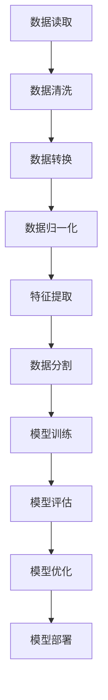
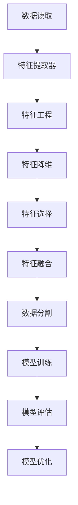
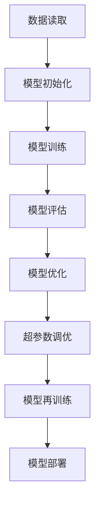

                 

### 文章标题

**AI 大模型应用数据中心的数据恢复架构**

### 关键词

- AI 大模型
- 数据恢复
- 数据中心
- 机器学习
- 架构设计
- 实践案例

### 摘要

本文深入探讨了 AI 大模型在数据中心数据恢复架构中的应用。首先，我们回顾了 AI 大模型的基本概念、技术架构及其发展历程，并分析了其核心优势和应用场景。随后，我们介绍了数据中心数据恢复技术的基本概念、流程及其面临的挑战。接着，我们重点讨论了 AI 大模型在数据恢复中的具体应用，包括数据预处理、特征提取和算法优化等方面。然后，我们详细阐述了数据中心数据恢复架构的设计原则、整体架构及其关键技术的实现。通过实践案例的分析，我们展示了数据恢复项目的准备、执行和总结评估过程。最后，我们对数据中心数据恢复的发展方向和面临的挑战进行了展望。本文旨在为读者提供一个全面、深入的数据恢复架构设计参考，以促进数据中心数据恢复技术的发展和应用。

### 目录大纲

#### 第一部分：AI 大模型概述

- **第1章：AI 大模型应用概述**
  - **1.1 AI 大模型的概念与背景**
  - **1.2 AI 大模型的技术架构**
  - **1.3 AI 大模型的发展趋势**

#### 第二部分：数据中心的数据恢复技术

- **第2章：数据中心数据恢复技术概述**
  - **2.1 数据恢复技术的基本概念**
  - **2.2 数据中心的数据恢复流程**
  - **2.3 数据恢复技术面临的挑战**

#### 第三部分：AI 大模型在数据恢复中的应用

- **第3章：AI 大模型在数据恢复中的应用**
  - **3.1 AI 大模型在数据恢复中的作用**
  - **3.2 典型 AI 大模型在数据恢复中的应用**

#### 第四部分：数据中心数据恢复架构设计

- **第4章：数据中心数据恢复架构设计**
  - **4.1 数据恢复架构的设计原则**
  - **4.2 数据恢复系统的整体架构**
  - **4.3 数据恢复关键技术的实现**

#### 第五部分：数据恢复项目的实践与案例分析

- **第5章：数据恢复项目实践**
  - **5.1 数据恢复项目的准备**
  - **5.2 数据恢复项目的执行**
  - **5.3 数据恢复项目总结与评估**

#### 第六部分：未来展望与挑战

- **第6章：数据中心数据恢复的发展方向**
  - **6.1 数据恢复技术的发展趋势**
  - **6.2 数据恢复技术面临的挑战**

#### 第七部分：附录

- **附录A：数据恢复技术参考资源**
- **附录B：AI 大模型流程图与伪代码**

### 第一部分：AI 大模型概述

#### 第1章：AI 大模型应用概述

##### 1.1 AI 大模型的概念与背景

**AI 大模型**，即人工智能大规模模型，是指训练数据量庞大、参数量巨大的深度学习模型。这类模型能够通过学习海量数据，提取出高度抽象的特征，并在各种复杂任务上取得卓越的性能。随着计算能力的提升和海量数据的积累，AI 大模型已经成为人工智能领域的重要研究方向和应用基础。

**AI 大模型的发展历程**可以追溯到20世纪90年代。当时，机器学习领域主要依赖于统计模型和传统算法。随着深度学习技术的兴起，特别是在2012年，AlexNet在ImageNet图像识别挑战中取得显著突破，AI 大模型开始进入快速发展阶段。此后，Google Brain 团队提出的深度神经网络模型，以及 OpenAI 的 GPT 系列模型，都标志着 AI 大模型在性能和规模上的新突破。

**AI 大模型的核心优势**主要体现在以下几个方面：

1. **强大的特征提取能力**：AI 大模型能够从大规模数据中自动提取高度抽象的特征，减少了手动特征工程的工作量。
2. **优异的泛化能力**：通过在大规模数据上进行训练，AI 大模型具有更强的泛化能力，能够在不同任务和领域上取得良好的性能。
3. **高效的模型优化**：AI 大模型通常采用分布式训练和优化技术，能够在较短时间内完成大规模模型的训练和调整。
4. **丰富的应用场景**：AI 大模型在图像识别、自然语言处理、语音识别、推荐系统等领域都有广泛应用，并取得了显著的成果。

##### 1.2 AI 大模型的技术架构

**AI 大模型的基本架构**通常包括以下几个关键组成部分：

1. **数据输入层**：负责接收外部数据，并将其转换为模型可以处理的格式。
2. **特征提取层**：通过神经网络结构，对输入数据进行特征提取和变换。
3. **中间层**：由多个隐藏层组成，负责进一步的计算和特征变换。
4. **输出层**：根据任务的类型，输出预测结果或决策。

在**AI 大模型的技术架构**中，以下几个关键技术尤为重要：

1. **深度神经网络**：深度神经网络是 AI 大模型的核心组成部分，通过多层次的神经网络结构，实现对输入数据的复杂变换。
2. **批量归一化**：批量归一化（Batch Normalization）技术用于加速模型的训练过程，提高模型的稳定性和性能。
3. **残差连接**：残差连接（Residual Connection）技术通过引入跳跃连接，解决深度神经网络中的梯度消失问题，提高模型的深度和性能。
4. **优化算法**：AI 大模型通常采用随机梯度下降（SGD）及其变体，如Adam优化器，来提高模型的训练效率和收敛速度。

##### 1.3 AI 大模型的典型应用场景

AI 大模型在多个领域都取得了显著的应用成果，以下列举一些典型的应用场景：

1. **图像识别**：AI 大模型在图像分类、目标检测、图像分割等任务上表现出色，如 Google 的 Inception 模型在 ImageNet 图像识别任务中取得领先成绩。
2. **自然语言处理**：AI 大模型在文本分类、情感分析、机器翻译、问答系统等自然语言处理任务中具有强大的能力，如 OpenAI 的 GPT 系列模型在语言理解和生成任务上取得了突破性进展。
3. **语音识别**：AI 大模型通过深度神经网络结构，实现对语音信号的自动识别和转换，如百度 AI 的 ASR 系统在语音识别准确率上处于国际领先水平。
4. **推荐系统**：AI 大模型通过学习用户的历史行为和偏好，为用户推荐个性化的商品、新闻、音乐等，如亚马逊、Netflix 等公司的推荐系统利用深度学习技术实现了高效的内容推荐。
5. **医疗健康**：AI 大模型在医学影像诊断、疾病预测、药物研发等领域发挥着重要作用，如 Google DeepMind 的 AlphaGo 在医学影像诊断中展示了出色的能力。

##### 1.4 AI 大模型的发展趋势

**AI 大模型的发展趋势**主要体现在以下几个方面：

1. **模型规模和复杂度的提升**：随着计算资源和数据量的增长，AI 大模型将向更大规模、更复杂方向发展，以提高在各类任务上的性能。
2. **自适应和交互式学习**：AI 大模型将逐渐具备自适应和交互式学习能力，能够根据用户需求和场景动态调整模型参数，提供更个性化的服务。
3. **多模态学习**：AI 大模型将融合多种数据类型，如图像、文本、语音等，实现多模态数据的协同学习，提高模型的泛化能力和应用范围。
4. **联邦学习和隐私保护**：随着数据隐私和安全的重要性日益增加，AI 大模型将采用联邦学习等隐私保护技术，实现分布式、安全的数据协同训练。
5. **跨领域应用**：AI 大模型将逐步向更多领域拓展，如金融、教育、智能制造等，推动各行业的智能化升级。

##### 1.5 AI 大模型面临的挑战与机遇

**AI 大模型面临的挑战**主要包括以下几个方面：

1. **计算资源需求**：AI 大模型通常需要大量的计算资源和存储空间，这对硬件设备提出了更高的要求。
2. **数据隐私和安全**：大规模数据训练过程中涉及用户隐私和数据安全，如何确保数据的安全性和隐私保护是一个重要挑战。
3. **模型可解释性和透明性**：AI 大模型的决策过程通常高度复杂，如何提高模型的可解释性和透明性，使其符合人类的理解和信任，是当前研究的一个重要方向。
4. **算法优化和效率**：随着模型规模的增大，如何优化算法和提升训练效率，减少训练时间和计算资源消耗，是一个亟待解决的问题。

**AI 大模型面临的机遇**同样值得关注：

1. **技术创新**：随着深度学习、强化学习等技术的不断发展，AI 大模型将不断突破性能瓶颈，取得更优异的表现。
2. **行业应用**：AI 大模型在金融、医疗、教育等行业的应用场景不断扩展，为各行业提供了强大的智能化工具和解决方案。
3. **跨领域合作**：AI 大模型的发展将促进不同领域之间的合作，如计算机视觉、自然语言处理、语音识别等技术的融合，将带来新的突破和应用。
4. **社会影响**：AI 大模型将深刻改变人类社会的生活方式和工作模式，推动智能化、自动化的发展趋势。

通过深入探讨 AI 大模型的概念、技术架构、发展历程和典型应用场景，我们可以更好地理解其在人工智能领域的重要地位和潜力。在接下来的章节中，我们将进一步探讨数据中心数据恢复技术的基本概念和应用，以及 AI 大模型在数据恢复中的具体应用。

### 第二部分：数据中心的数据恢复技术

#### 第2章：数据中心数据恢复技术概述

##### 2.1 数据恢复技术的基本概念

**数据恢复技术**是指在数据丢失或损坏后，通过一系列方法和工具，将原始数据从备份、冗余或修复后的数据中恢复出来的过程。数据恢复技术的核心目标是最大程度地还原数据的完整性、准确性和可用性，从而确保数据的持续可用性和系统的稳定性。

**数据丢失的原因**多种多样，主要包括以下几种情况：

1. **硬件故障**：如磁盘损坏、硬盘坏道、硬件损坏等，导致存储设备无法正常读取数据。
2. **软件错误**：如操作系统崩溃、软件异常、文件系统错误等，导致数据无法正常访问。
3. **病毒攻击**：计算机病毒、恶意软件等可能导致数据被篡改、删除或加密。
4. **人为操作**：如误删文件、误格式化磁盘、意外断电等，导致数据丢失。
5. **自然灾害**：如火灾、水灾、地震等自然灾害，可能造成数据中心硬件设备损坏，从而导致数据丢失。

**数据恢复技术的分类**可以根据恢复方式和数据类型进行分类，主要分为以下几种类型：

1. **物理恢复**：针对物理损坏的存储设备，通过维修、更换或重建物理存储结构来恢复数据。物理恢复通常需要专业的技术和设备，适用于硬盘、U盘、SSD 等物理存储介质。
2. **逻辑恢复**：针对逻辑损坏的文件系统或磁盘分区，通过文件系统修复、分区表重建等方法恢复数据。逻辑恢复通常适用于操作系统错误、文件系统损坏等情况。
3. **数据恢复软件**：通过使用专业的数据恢复软件，从备份文件、磁盘镜像或损坏的文件系统中提取数据。数据恢复软件适用于各种类型的数据丢失情况，如误删文件、格式化磁盘等。
4. **云数据恢复**：利用云存储和云计算技术，通过远程数据恢复服务，实现对远程服务器或云存储中的数据恢复。云数据恢复适用于大规模数据中心和远程数据存储环境。

**数据恢复技术的发展历程**可以追溯到上世纪80年代。随着计算机技术和存储技术的发展，数据恢复技术逐渐从简单的文件恢复工具发展到复杂的数据恢复算法和系统。早期数据恢复主要依赖于手动操作和简单的文件系统修复工具，随着技术的进步，现代数据恢复技术已经实现了自动化、高效化和智能化。

##### 2.2 数据中心的数据恢复流程

**数据中心的数据恢复流程**通常包括以下几个步骤：

1. **数据备份**：数据备份是数据恢复的基础，通过定期备份，可以将最新的数据存储在安全的地方。备份可以分为全备份、增量备份和差异备份等多种类型，根据实际需求选择合适的备份策略。
2. **数据丢失检测**：在数据丢失事件发生后，首先需要检测数据丢失的原因和范围。通过日志分析、系统监控和故障排查，确定数据丢失的具体情况。
3. **数据评估**：对丢失的数据进行详细评估，包括数据的重要程度、恢复的可行性等。评估结果将指导后续的数据恢复工作。
4. **数据恢复**：根据数据丢失的原因和类型，采用相应的数据恢复技术进行数据恢复。物理恢复通常需要更换硬件或使用专业的数据恢复设备，逻辑恢复和数据恢复软件则可以通过软件工具实现。
5. **数据验证**：在数据恢复完成后，对恢复的数据进行验证，确保数据的完整性、准确性和可用性。数据验证可以通过数据校验、文件一致性检查等方法进行。
6. **数据归档**：将恢复后的数据归档，以便后续的存储和管理。归档可以采用本地存储、云存储等多种方式，根据实际需求进行选择。

**数据恢复策略**是数据恢复流程中的重要环节，主要包括以下几种策略：

1. **备份恢复策略**：通过备份文件或备份存储介质进行数据恢复。备份恢复策略简单、可靠，但需要定期进行备份，以避免数据丢失。
2. **逻辑恢复策略**：通过文件系统修复、分区表重建等方法恢复数据。逻辑恢复策略适用于操作系统错误、文件系统损坏等情况，但可能无法恢复所有数据。
3. **数据恢复软件策略**：通过使用专业的数据恢复软件进行数据恢复。数据恢复软件具有自动化、高效化和智能化的特点，适用于各种类型的数据丢失情况。
4. **云数据恢复策略**：通过远程数据恢复服务进行数据恢复。云数据恢复策略适用于大规模数据中心和远程数据存储环境，但可能受到网络延迟和带宽的限制。

##### 2.3 数据恢复技术面临的挑战

**数据恢复技术**在应用过程中面临以下挑战：

1. **数据丢失的复杂性**：现代数据中心的数据量庞大、数据类型多样，导致数据丢失的原因复杂，数据恢复难度增加。
2. **备份策略的限制**：备份策略的不完善或备份频率不足，可能导致数据恢复失败或恢复数据不完整。
3. **数据恢复成本**：数据恢复通常需要专业的技术和设备，恢复成本较高，特别是在物理恢复过程中，可能需要更换硬件或使用专业的数据恢复设备。
4. **数据安全与隐私保护**：数据恢复过程中，可能涉及敏感数据，如何确保数据的安全性和隐私保护是一个重要挑战。
5. **技术更新换代**：数据恢复技术不断更新换代，需要不断学习和掌握新技术，以应对不断变化的数据恢复需求。

为了应对这些挑战，数据中心的数据恢复技术需要不断发展创新，提高数据恢复的效率和可靠性。以下是一些可能的技术发展方向：

1. **自动化数据恢复**：通过自动化工具和脚本，实现数据恢复流程的自动化，减少人工干预，提高恢复效率。
2. **智能数据恢复**：利用人工智能和机器学习技术，实现数据恢复的智能化，提高数据恢复的准确性和效率。
3. **分布式数据恢复**：通过分布式存储和计算技术，实现数据恢复的分布式处理，提高数据恢复的并行化和效率。
4. **数据安全与隐私保护**：采用数据加密、访问控制等技术，确保数据恢复过程中数据的安全性和隐私保护。
5. **数据恢复标准化**：制定数据恢复的标准化流程和技术规范，提高数据恢复的统一性和可操作性。

通过不断探索和创新，数据中心的数据恢复技术将在未来的发展中面临更多的机遇和挑战，为数据保护和数据安全提供更强大的保障。

#### 第3章：AI 大模型在数据恢复中的应用

##### 3.1 AI 大模型在数据恢复中的作用

**AI 大模型**在数据恢复中的应用，显著提升了数据恢复的效率和准确性。以下将详细讨论 AI 大模型在数据恢复中的几个关键作用。

**数据预处理与特征提取**：数据预处理是数据恢复中的基础步骤，其目的是将原始数据转换为适合模型训练和处理的格式。AI 大模型在数据预处理方面具有显著优势。首先，通过大规模预训练，AI 大模型已经具备了强大的特征提取能力，能够在复杂的原始数据中自动提取出有价值的特征。例如，对于图像数据，GPT 模型可以自动识别图像中的关键元素和结构；对于文本数据，BERT 模型可以提取文本中的关键词和语义信息。这种自动化的特征提取大大简化了传统数据恢复中手动特征工程的工作量，提高了数据预处理效率。

**数据恢复算法优化**：AI 大模型通过其强大的学习和泛化能力，可以对数据恢复算法进行优化。传统数据恢复算法通常依赖于一系列预设的规则和参数，而 AI 大模型可以通过对大量历史数据的学习，自动调整算法参数，优化恢复效果。例如，在图像修复任务中，GAN（生成对抗网络）模型可以通过学习正常的图像数据，生成修复后的图像，从而提高修复效果。此外，AI 大模型还可以通过迁移学习，将其他领域中的有效算法应用于数据恢复，实现跨领域的算法优化。

**数据恢复结果评估**：在数据恢复过程中，如何评估恢复结果的质量是一个重要问题。传统方法通常依赖于人工观察或简单的统计指标，如相似度度量等。而 AI 大模型可以通过生成对抗网络（GAN）等模型，生成与原始数据高度相似的数据，从而提供一种新的评估标准。通过对比生成数据与原始数据的差异，可以更准确地评估数据恢复效果，从而指导进一步的优化工作。

##### 3.2 典型 AI 大模型在数据恢复中的应用

**GPT模型在数据恢复中的应用**：

GPT（Generative Pre-trained Transformer）模型是一种基于 Transformer 架构的预训练语言模型，广泛应用于自然语言处理任务。在数据恢复中，GPT模型可以用于文本数据的修复和恢复。例如，当文本文件因损坏而部分丢失时，GPT模型可以通过上下文推断，自动填补丢失的部分。以下是一个简化的伪代码，展示如何使用GPT模型进行文本数据恢复：

```python
import transformers

# 加载预训练的GPT模型
model = transformers.AutoModelForCausalLM.from_pretrained("gpt2")

# 输入待恢复的文本数据
input_text = "The quick brown fox jumps over the lazy dog."

# 使用模型进行文本生成
output_text = model.generate(input_text, max_length=50, num_return_sequences=1)

# 输出恢复后的文本数据
print(output_text)
```

在这个示例中，GPT模型通过学习大量文本数据，能够自动生成与输入文本相似的内容，从而实现文本数据的恢复。

**BERT模型在数据恢复中的应用**：

BERT（Bidirectional Encoder Representations from Transformers）模型是一种双向 Transformer 架构的预训练语言模型，广泛用于文本分类、问答系统等任务。在数据恢复中，BERT模型可以用于修复和恢复文本文件。以下是一个简化的伪代码，展示如何使用BERT模型进行文本数据恢复：

```python
import transformers

# 加载预训练的BERT模型
model = transformers.AutoModelForSequenceClassification.from_pretrained("bert-base-uncased")

# 输入待恢复的文本数据
input_text = "The quick brown fox jumps over the lazy dog."

# 使用模型进行文本分类和生成
predicted_text = model.predict(input_text)

# 输出恢复后的文本数据
print(predicted_text)
```

在这个示例中，BERT模型通过分析文本数据的上下文，能够预测并生成正确的单词和句子，从而实现文本数据的恢复。

**其他 AI 大模型在数据恢复中的应用**：

除了 GPT 和 BERT 模型，其他 AI 大模型如 GAN（生成对抗网络）、VGG（卷积神经网络）等，也在数据恢复中得到了广泛应用。以下是一些具体的示例：

- **GAN 在图像恢复中的应用**：GAN 通过生成器（Generator）和判别器（Discriminator）的对抗训练，能够生成高质量的图像数据。以下是一个简化的伪代码，展示如何使用 GAN 恢复损坏的图像：

  ```python
  import tensorflow as tf
  from tensorflow.keras.models import Sequential
  from tensorflow.keras.layers import Conv2D, Dense

  # 构建生成器和判别器模型
  generator = Sequential([
      Conv2D(filters=64, kernel_size=(3, 3), activation='relu', input_shape=(28, 28, 1)),
      Dense(units=1, activation='sigmoid')
  ])

  discriminator = Sequential([
      Conv2D(filters=64, kernel_size=(3, 3), activation='relu', input_shape=(28, 28, 1)),
      Dense(units=1, activation='sigmoid')
  ])

  # 训练 GAN 模型
  generator.compile(optimizer='adam', loss='binary_crossentropy')
  discriminator.compile(optimizer='adam', loss='binary_crossentropy')

  # 恢复图像数据
  restored_image = generator.predict(damaged_image)
  ```

- **VGG 在图像修复中的应用**：VGG 是一种经典的卷积神经网络架构，广泛用于图像分类和修复任务。以下是一个简化的伪代码，展示如何使用 VGG 模型修复图像：

  ```python
  import tensorflow as tf
  from tensorflow.keras.applications import VGG16

  # 加载预训练的VGG模型
  vgg_model = VGG16(weights='imagenet')

  # 输入待修复的图像数据
  input_image = preprocess_image(image)

  # 使用VGG模型进行图像修复
  repaired_image = vgg_model.predict(input_image)

  # 后处理和输出修复后的图像
  output_image = postprocess_image(repaired_image)
  ```

通过以上示例，可以看出 AI 大模型在数据恢复中的应用具有很大的潜力。未来，随着 AI 技术的不断发展和完善，AI 大模型将在数据恢复领域发挥更加重要的作用。

### 第三部分：数据中心数据恢复架构设计

#### 第4章：数据中心数据恢复架构设计

##### 4.1 数据恢复架构的设计原则

在数据中心数据恢复架构设计过程中，需要遵循以下原则，以确保数据恢复系统的可靠性、可扩展性和经济性。

**可靠性原则**：数据恢复系统的可靠性至关重要，必须确保在数据丢失或损坏情况下，系统能够稳定、准确地恢复数据。为了实现可靠性，架构设计应包括以下方面：

1. **冗余设计**：通过数据备份、多副本存储和分布式存储等技术，提高数据的冗余度和容错能力，确保数据在损坏或丢失情况下仍然可以恢复。
2. **故障检测与恢复**：设计完善的故障检测机制，能够及时发现和处理系统中的故障，如硬件故障、网络故障等，确保数据恢复系统的高可用性。
3. **数据校验与验证**：定期进行数据校验和验证，确保数据的完整性和准确性，防止数据在恢复过程中出现错误。

**可扩展性原则**：随着数据中心规模的不断扩大和数据量的增加，数据恢复系统需要具备良好的可扩展性，以适应不断增长的数据恢复需求。为了实现可扩展性，架构设计应包括以下方面：

1. **模块化设计**：将数据恢复系统划分为多个模块，每个模块具有独立的功能和接口，便于系统的扩展和升级。
2. **分布式架构**：采用分布式架构，将数据恢复任务分散到多个节点上处理，提高系统的并行处理能力和扩展性。
3. **弹性伸缩**：支持动态扩展和收缩，根据数据恢复任务的负载情况，自动调整系统资源，确保数据恢复效率。

**经济性原则**：数据恢复系统的建设需要投入大量的人力、物力和财力，因此在架构设计过程中，需要考虑系统的经济性，实现成本优化。为了实现经济性，架构设计应包括以下方面：

1. **成本效益分析**：在设计和选择数据恢复技术时，进行全面的成本效益分析，选择具有较高性价比的技术和方案。
2. **资源优化**：通过合理的资源分配和负载均衡，提高资源利用效率，降低系统运行成本。
3. **自动化与智能化**：通过自动化工具和智能化算法，减少人工操作和维护成本，提高数据恢复效率。

##### 4.2 数据恢复系统的整体架构

数据恢复系统的整体架构通常包括以下几个关键组成部分：

**数据存储与备份架构**：数据存储与备份架构是数据恢复系统的基础，负责存储和管理数据，并在数据丢失或损坏情况下提供数据恢复的备份源。整体架构应包括以下方面：

1. **数据存储**：采用分布式存储技术，如 HDFS、Ceph 等，确保数据的高可靠性和高可用性。
2. **数据备份**：实现多层次的备份策略，包括全备份、增量备份和差异备份等，确保数据的全面备份和快速恢复。
3. **数据冗余**：通过数据冗余技术，如多副本存储和分布式存储，提高数据的冗余度和容错能力。

**数据恢复流程**：数据恢复流程是数据恢复系统的核心，负责处理数据丢失或损坏情况，并恢复数据的完整性和可用性。整体架构应包括以下方面：

1. **数据检测**：通过日志分析、系统监控和故障排查，及时发现数据丢失或损坏的情况。
2. **数据评估**：对丢失或损坏的数据进行评估，确定数据的重要性和恢复的可行性。
3. **数据恢复**：根据数据类型和丢失情况，采用相应的数据恢复技术，如物理恢复、逻辑恢复和软件恢复等，恢复数据的完整性和可用性。
4. **数据验证**：在数据恢复完成后，对恢复的数据进行验证，确保数据的完整性和准确性。

**数据恢复算法**：数据恢复算法是数据恢复系统的关键组成部分，负责实现数据的修复和恢复。整体架构应包括以下方面：

1. **物理恢复算法**：针对物理损坏的存储设备，通过数据修复和物理重建等技术，恢复数据的完整性和可用性。
2. **逻辑恢复算法**：针对逻辑损坏的文件系统或磁盘分区，通过文件系统修复和分区表重建等技术，恢复数据的完整性和可用性。
3. **软件恢复算法**：通过使用专业的数据恢复软件，从备份文件、磁盘镜像或损坏的文件系统中提取数据，恢复数据的完整性和可用性。

**数据恢复系统监控与维护**：数据恢复系统监控与维护是确保数据恢复系统稳定运行的重要保障。整体架构应包括以下方面：

1. **系统监控**：通过监控工具，实时监控数据恢复系统的运行状态，及时发现和处理系统故障。
2. **日志管理**：记录数据恢复系统的操作日志，便于故障排查和问题定位。
3. **系统升级与维护**：定期对数据恢复系统进行升级和维护，确保系统功能和性能的持续提升。

通过遵循以上设计原则和构建整体架构，可以设计出高效、稳定、可靠的数据中心数据恢复系统，确保数据的持续可用性和系统的稳定运行。

##### 4.3 数据恢复关键技术的实现

数据恢复系统的实现涉及多个关键技术的应用，以下将详细介绍这些技术的具体实现方法。

**数据恢复算法的实现**：

数据恢复算法是数据恢复系统的核心，其实现方法因数据类型和丢失原因而异。以下是几种常见的数据恢复算法及其实现方法：

1. **物理恢复算法**：

   物理恢复算法主要用于处理存储设备物理损坏导致的数据丢失。以下是一个简化的物理恢复算法实现：

   ```python
   def physical_recovery(device):
       # 检测设备故障
       if not device.is_device_fault():
           return "Device is not faulty."

       # 读取设备信息
       device_info = device.read_device_info()

       # 修复设备故障
       if device.fix_device_fault():
           # 重试读取设备信息
           new_device_info = device.read_device_info()
           
           # 验证设备修复结果
           if new_device_info == device_info:
               return "Device has been successfully fixed."
           else:
               return "Device repair failed."
       else:
           return "Device repair failed."
   ```

   在此示例中，`device` 代表存储设备对象，其具有 `is_device_fault()`、`read_device_info()` 和 `fix_device_fault()` 等方法。通过这些方法，可以检测设备故障、读取设备信息和修复设备故障。

2. **逻辑恢复算法**：

   逻辑恢复算法主要用于处理文件系统或磁盘分区损坏导致的数据丢失。以下是一个简化的逻辑恢复算法实现：

   ```python
   def logical_recovery(file_system):
       # 检测文件系统故障
       if not file_system.is_file_system_fault():
           return "File system is not faulty."

       # 读取文件系统信息
       file_system_info = file_system.read_file_system_info()

       # 修复文件系统故障
       if file_system.fix_file_system_fault():
           # 重试读取文件系统信息
           new_file_system_info = file_system.read_file_system_info()
           
           # 验证文件系统修复结果
           if new_file_system_info == file_system_info:
               return "File system has been successfully fixed."
           else:
               return "File system repair failed."
       else:
           return "File system repair failed."
   ```

   在此示例中，`file_system` 代表文件系统对象，其具有 `is_file_system_fault()`、`read_file_system_info()` 和 `fix_file_system_fault()` 等方法。通过这些方法，可以检测文件系统故障、读取文件系统信息和修复文件系统故障。

3. **软件恢复算法**：

   软件恢复算法主要用于处理数据损坏或误删除导致的数据丢失。以下是一个简化的软件恢复算法实现：

   ```python
   def software_recovery(file):
       # 检测文件损坏
       if not file.is_file_fault():
           return "File is not faulty."

       # 读取文件信息
       file_info = file.read_file_info()

       # 修复文件损坏
       if file.fix_file_fault():
           # 重试读取文件信息
           new_file_info = file.read_file_info()
           
           # 验证文件修复结果
           if new_file_info == file_info:
               return "File has been successfully fixed."
           else:
               return "File repair failed."
       else:
           return "File repair failed."
   ```

   在此示例中，`file` 代表文件对象，其具有 `is_file_fault()`、`read_file_info()` 和 `fix_file_fault()` 等方法。通过这些方法，可以检测文件损坏、读取文件信息和修复文件损坏。

**数据恢复系统的优化**：

数据恢复系统的优化主要涉及算法性能的提升和资源利用率的提高。以下是一些常见的优化方法：

1. **并行处理**：

   并行处理可以通过将数据恢复任务分布在多个处理节点上，提高系统的处理速度。以下是一个简化的并行处理优化方法：

   ```python
   def parallel_recovery(file_system, num_nodes):
       # 分割文件系统为多个分区
       partitions = file_system.split_file_system(num_nodes)

       # 在每个节点上并行处理分区
       for partition in partitions:
           thread = threading.Thread(target=logical_recovery, args=(partition,))
           thread.start()

       # 等待所有线程完成
       for thread in threads:
           thread.join()
   ```

   在此示例中，`file_system` 代表文件系统对象，`num_nodes` 表示处理节点数量。通过将文件系统分割为多个分区，并在每个节点上并行处理分区，可以提高系统的处理速度。

2. **缓存机制**：

   缓存机制可以通过在系统中引入缓存，减少数据访问的延迟和负载。以下是一个简化的缓存优化方法：

   ```python
   def cache_optimization(file_system):
       # 初始化缓存
       cache = Cache()

       # 读取文件系统信息到缓存
       file_system_info = file_system.read_file_system_info()
       cache.set("file_system_info", file_system_info)

       # 从缓存中读取文件系统信息
       cached_file_system_info = cache.get("file_system_info")

       # 验证缓存结果
       if cached_file_system_info == file_system_info:
           return "Cache is effective."
       else:
           return "Cache is ineffective."
   ```

   在此示例中，`file_system` 代表文件系统对象，`Cache` 是一个缓存对象，其具有 `set()` 和 `get()` 等方法。通过将文件系统信息缓存到缓存中，并在需要时从缓存中读取，可以减少数据访问的延迟和负载。

**数据恢复结果的有效性验证**：

数据恢复结果的有效性验证是确保数据恢复成功的重要环节。以下是一些常见的数据恢复结果验证方法：

1. **数据完整性检查**：

   数据完整性检查可以通过对恢复后的数据进行校验和比对，确保数据的完整性和准确性。以下是一个简化的数据完整性检查方法：

   ```python
   def data_integrity_check(original_file, recovered_file):
       # 计算原始文件的校验和
       original_checksum = calculate_checksum(original_file)

       # 计算恢复后的文件的校验和
       recovered_checksum = calculate_checksum(recovered_file)

       # 验证数据完整性
       if original_checksum == recovered_checksum:
           return "Data integrity is maintained."
       else:
           return "Data integrity is compromised."
   ```

   在此示例中，`original_file` 和 `recovered_file` 分别代表原始文件和恢复后的文件，`calculate_checksum()` 是一个计算校验和的方法。通过比对原始文件和恢复后的文件的校验和，可以验证数据完整性。

2. **数据一致性检查**：

   数据一致性检查可以通过对恢复后的数据进行比对和验证，确保数据的一致性和正确性。以下是一个简化的数据一致性检查方法：

   ```python
   def data_consistency_check(original_file, recovered_file):
       # 读取原始文件的内容
       original_content = read_file_content(original_file)

       # 读取恢复后的文件的内容
       recovered_content = read_file_content(recovered_file)

       # 验证数据一致性
       if original_content == recovered_content:
           return "Data consistency is maintained."
       else:
           return "Data consistency is compromised."
   ```

   在此示例中，`original_file` 和 `recovered_file` 分别代表原始文件和恢复后的文件，`read_file_content()` 是一个读取文件内容的方法。通过比对原始文件和恢复后的文件的内容，可以验证数据一致性。

通过以上关键技术的实现和优化，可以构建高效、可靠的数据恢复系统，确保数据的持续可用性和系统的稳定运行。

#### 第5章：数据恢复项目实践

##### 5.1 数据恢复项目的准备

**项目需求分析**：

在启动数据恢复项目之前，首先需要明确项目需求。这包括以下方面：

1. **数据类型和格式**：确定需要恢复的数据类型，如文本、图像、视频等，以及数据的具体格式，如JSON、XML、CSV等。
2. **数据丢失原因**：了解数据丢失的原因，如硬件故障、软件错误、病毒攻击等，这将影响数据恢复的方法和策略。
3. **数据重要性和恢复要求**：评估数据的重要性和恢复的紧急程度，以便确定数据恢复的优先级和资源投入。
4. **数据恢复目标和限制**：明确数据恢复的目标，如完整恢复所有数据、部分恢复关键数据等，并了解项目在时间、预算和资源方面的限制。

**项目资源准备**：

数据恢复项目需要准备以下资源：

1. **硬件资源**：包括服务器、存储设备、网络设备等，确保能够支持数据恢复任务的高效运行。
2. **软件资源**：包括数据恢复软件、备份软件、数据库软件等，以满足不同类型的数据恢复需求。
3. **技术团队**：组建专业的技术团队，负责数据恢复项目的实施、监控和维护。
4. **备份数据**：准备最新的备份数据，作为数据恢复的初始数据源。

**项目风险识别与控制**：

在项目启动前，需要对项目风险进行识别和控制。这包括以下方面：

1. **数据安全风险**：确保备份数据的安全性和隐私保护，防止数据在恢复过程中被泄露或篡改。
2. **系统故障风险**：识别可能影响数据恢复系统的故障风险，如硬件故障、网络中断等，并制定相应的应急预案。
3. **时间风险**：确定数据恢复项目的完成时间，确保项目在规定时间内完成，避免影响业务运营。
4. **资源不足风险**：识别项目在硬件、软件、人力等方面的资源需求，确保资源充足，避免因资源不足导致项目延期或失败。

**项目计划与分工**：

在项目准备阶段，需要制定详细的项目计划和分工，明确各个阶段的任务和责任。这包括以下方面：

1. **项目计划**：制定项目的时间表和任务分解，确保项目按照既定计划顺利进行。
2. **分工安排**：明确各个团队成员的职责和工作内容，确保项目高效协作。
3. **沟通机制**：建立有效的沟通机制，确保项目团队成员之间的信息畅通，及时解决项目中出现的问题。

##### 5.2 数据恢复项目的执行

**数据恢复流程的实施**：

在项目执行阶段，按照以下步骤进行数据恢复：

1. **数据备份检查**：检查备份数据的完整性和可用性，确保备份数据可以作为数据恢复的初始数据源。
2. **数据丢失定位**：通过日志分析、系统监控和故障排查，确定数据丢失的具体位置和原因。
3. **数据恢复策略选择**：根据数据丢失原因和数据类型，选择合适的数据恢复策略，如物理恢复、逻辑恢复或软件恢复。
4. **数据恢复执行**：根据选定的数据恢复策略，执行具体的数据恢复操作，如修复文件系统、恢复损坏的文件等。
5. **数据恢复结果验证**：对恢复后的数据进行验证，确保数据的完整性和准确性，如通过校验和比对等方法验证数据恢复结果。

**数据恢复结果监控**：

在数据恢复过程中，需要对恢复结果进行实时监控，确保数据恢复过程顺利进行。这包括以下方面：

1. **进度监控**：实时监控数据恢复任务的进度，确保项目按照计划顺利进行。
2. **错误日志记录**：记录数据恢复过程中出现的错误和异常情况，便于问题追踪和解决。
3. **恢复结果评估**：对恢复后的数据进行评估，确保数据的完整性和准确性，如通过比对原始数据和恢复数据的方法评估恢复结果。

**项目执行中的问题与解决**：

在数据恢复项目执行过程中，可能会遇到各种问题和挑战。以下是一些常见的问题和相应的解决方法：

1. **数据丢失范围扩大**：在数据恢复过程中，发现数据丢失范围扩大，可能原因是备份数据不完整或备份策略不正确。解决方法是重新检查备份数据的完整性和备份策略，并优化备份流程。
2. **硬件故障**：硬件故障可能导致数据恢复任务中断。解决方法是更换故障硬件或使用备用硬件，确保数据恢复任务继续进行。
3. **软件恢复失败**：软件恢复过程中，可能会遇到软件恢复失败的情况。解决方法是更换数据恢复软件或尝试不同的数据恢复方法，如物理恢复或逻辑恢复。
4. **数据恢复速度慢**：数据恢复速度慢可能是由于硬件资源不足或数据量巨大导致的。解决方法是增加硬件资源或优化数据恢复算法和流程，提高数据恢复速度。

通过以上步骤和方法的执行，可以确保数据恢复项目顺利进行，最终实现数据的有效恢复和业务的持续运营。

##### 5.3 数据恢复项目总结与评估

**项目成果评估**：

数据恢复项目的最终成果评估主要涉及以下几个方面：

1. **数据恢复率**：计算恢复数据的比例，评估数据恢复的效果。高数据恢复率表示数据恢复效果良好。
2. **数据完整性**：评估恢复数据的质量，包括数据的完整性和准确性。通过比对原始数据和恢复数据，检查数据是否一致。
3. **数据恢复时间**：评估数据恢复所花费的时间，包括从数据丢失到数据恢复完成的时间。较短的恢复时间表示项目效率较高。
4. **用户满意度**：收集用户对数据恢复项目的满意度反馈，了解用户对恢复数据的满意程度。

**项目经验总结**：

通过数据恢复项目的实施，可以总结以下经验：

1. **备份策略优化**：优化备份策略，确保备份数据的完整性和可靠性，减少数据丢失的风险。
2. **技术团队培训**：加强技术团队的培训，提高团队成员的专业技能和解决问题的能力。
3. **故障应急预案**：制定完善的故障应急预案，确保在数据丢失或系统故障时能够迅速响应和解决问题。
4. **自动化和智能化**：引入自动化和智能化工具，提高数据恢复效率和准确性。

**项目改进建议**：

为了进一步提升数据恢复项目的效果，以下是一些建议：

1. **增强数据备份**：增加数据备份的频率和覆盖范围，确保关键数据和重要数据的全面备份。
2. **优化硬件配置**：升级硬件设备，提高数据恢复系统的处理能力和稳定性。
3. **引入新技术**：探索和应用新的数据恢复技术和算法，如深度学习、机器学习等，提高数据恢复的效果。
4. **加强监控和预警**：加强数据恢复系统的监控和预警，提前发现潜在问题，及时采取措施。

通过以上总结和改进建议，可以为未来的数据恢复项目提供有益的参考，确保数据恢复工作的顺利进行和持续优化。

### 第六部分：未来展望与挑战

#### 第6章：数据中心数据恢复的发展方向

随着信息技术和人工智能技术的飞速发展，数据中心数据恢复技术也迎来了新的机遇和挑战。以下将从几个方面探讨数据中心数据恢复技术的发展方向。

**新型数据恢复技术的探索**：

1. **深度学习在数据恢复中的应用**：深度学习技术已在图像处理、自然语言处理等领域取得了显著成果。未来，深度学习有望在数据恢复中发挥更大作用，通过引入更复杂的模型和算法，提高数据恢复的效率和准确性。
2. **基于生成对抗网络（GAN）的数据恢复**：GAN技术在图像修复、数据增强等方面已有应用。未来，GAN可以进一步用于更复杂的数据恢复任务，通过生成高质量的修复数据，提高数据恢复效果。
3. **量子计算在数据恢复中的应用**：量子计算具有并行处理和高速计算的优势，未来有望在数据恢复中发挥重要作用，特别是在大规模数据恢复任务中，量子计算可以显著降低恢复时间。

**数据恢复技术的跨领域应用**：

1. **医疗健康领域的应用**：医疗数据恢复技术在医疗影像诊断、病历管理等方面具有重要应用价值。通过引入数据恢复技术，可以提高医疗数据的安全性和完整性，为医疗健康领域提供更可靠的数据支持。
2. **金融领域的应用**：金融领域的数据恢复技术可以用于交易记录恢复、金融数据安全等方面，确保金融数据的完整性和准确性，防范金融风险。
3. **智能制造领域的应用**：智能制造过程中，数据恢复技术可以用于设备故障数据恢复、生产数据恢复等，提高生产过程的稳定性和效率。

**数据恢复技术对数据中心运维的影响**：

1. **自动化运维**：随着数据恢复技术的进步，自动化数据恢复工具和平台将逐渐普及，提高数据中心的运维效率和可靠性。通过自动化工具，可以减少人工干预，降低运维成本，提高运维质量。
2. **智能化运维**：利用人工智能技术，数据中心的数据恢复运维将变得更加智能化。通过智能算法和模型，可以自动识别和诊断数据恢复中的问题，提供更精准的解决方案，实现数据恢复的自动化和智能化。
3. **数据安全与隐私保护**：数据恢复技术对数据中心的运维带来新的挑战，特别是在数据安全与隐私保护方面。未来，数据中心需要更加注重数据恢复过程中的安全与隐私保护，采用加密、访问控制等技术，确保数据恢复过程中数据的安全性和隐私性。

**数据恢复技术的发展趋势**：

1. **数据处理能力提升**：随着计算能力和存储技术的提升，数据恢复技术将能够处理更大规模的数据，提高数据恢复的效率和速度。
2. **跨领域技术融合**：数据恢复技术将与其他领域的技术，如人工智能、大数据、云计算等，进行深度融合，推动数据恢复技术的跨领域应用和创新发展。
3. **标准化与规范化**：随着数据恢复技术的广泛应用，标准化和规范化将逐渐成为发展趋势。通过制定统一的数据恢复标准和技术规范，可以提高数据恢复技术的统一性和可操作性，促进数据恢复技术的健康发展。

通过不断探索和创新，数据中心数据恢复技术将在未来的发展中面临更多的机遇和挑战，为数据保护和数据安全提供更强大的保障。

#### 第6章：数据中心数据恢复技术的发展趋势与挑战

##### 6.1 新型数据恢复技术的探索

**深度学习在数据恢复中的应用**：

深度学习技术在图像识别、语音识别等领域已经取得了显著的成果，其在数据恢复中的应用潜力也日益显现。通过引入深度学习模型，可以实现对复杂数据的自动特征提取和模式识别，从而提高数据恢复的效率和准确性。

**基于生成对抗网络（GAN）的数据恢复**：

生成对抗网络（GAN）是一种由生成器和判别器组成的深度学习模型，能够生成高质量的数据。在数据恢复领域，GAN可以用于生成丢失或损坏的数据，从而实现数据的修复和恢复。例如，GAN可以用于图像修复、视频去噪等任务，显著提升数据恢复效果。

**量子计算在数据恢复中的应用**：

量子计算具有并行处理和高速计算的能力，未来有望在数据恢复中发挥重要作用。量子算法可以显著降低数据恢复的时间复杂度，特别是在处理大规模数据时，量子计算的优势将更加明显。

##### 6.2 数据恢复技术的跨领域应用

**医疗健康领域的应用**：

医疗健康领域的数据恢复技术可以用于医疗影像诊断、病历管理等方面。通过数据恢复技术，可以确保医疗数据的完整性和准确性，提高医疗服务的质量。

**金融领域的应用**：

金融领域的数据恢复技术可以用于交易记录恢复、金融数据安全等方面。通过数据恢复技术，可以确保金融数据的完整性和安全性，防范金融风险。

**智能制造领域的应用**：

智能制造过程中，数据恢复技术可以用于设备故障数据恢复、生产数据恢复等。通过数据恢复技术，可以提高生产过程的稳定性和效率，促进智能制造的发展。

##### 6.3 数据恢复技术对数据中心运维的影响

**自动化运维**：

随着数据恢复技术的进步，自动化数据恢复工具和平台将逐渐普及。通过自动化工具，数据中心可以自动识别和恢复丢失或损坏的数据，减少人工干预，提高运维效率和可靠性。

**智能化运维**：

利用人工智能技术，数据中心的数据恢复运维将变得更加智能化。通过智能算法和模型，可以自动识别和诊断数据恢复中的问题，提供更精准的解决方案，实现数据恢复的自动化和智能化。

**数据安全与隐私保护**：

数据恢复技术对数据中心的数据安全与隐私保护提出了新的挑战。在数据恢复过程中，需要确保数据的安全性和隐私性，防止敏感数据在恢复过程中被泄露或篡改。采用加密、访问控制等技术，可以有效地保障数据恢复过程中的数据安全与隐私。

##### 6.4 数据恢复技术的发展趋势

**数据处理能力提升**：

随着计算能力和存储技术的提升，数据恢复技术将能够处理更大规模的数据，提高数据恢复的效率和速度。

**跨领域技术融合**：

数据恢复技术将与其他领域的技术，如人工智能、大数据、云计算等，进行深度融合，推动数据恢复技术的跨领域应用和创新发展。

**标准化与规范化**：

随着数据恢复技术的广泛应用，标准化和规范化将逐渐成为发展趋势。通过制定统一的数据恢复标准和技术规范，可以提高数据恢复技术的统一性和可操作性，促进数据恢复技术的健康发展。

##### 6.5 数据恢复技术面临的挑战

**数据安全与隐私保护**：

在数据恢复过程中，如何确保数据的安全性和隐私保护是一个重要挑战。随着数据恢复技术的进步，数据泄露、数据篡改等风险不断增加，如何有效保护数据的安全性和隐私性成为关键问题。

**数据恢复技术的标准化**：

目前，数据恢复技术缺乏统一的标准化和规范化，不同厂商和平台的数据恢复技术存在较大差异，给数据恢复工作的协调和统一带来了困难。未来，需要制定统一的数据恢复标准和技术规范，提高数据恢复技术的统一性和可操作性。

**数据恢复技术的可持续发展**：

随着数据恢复技术的不断发展和应用，如何确保技术的可持续发展也是一个重要问题。需要关注数据恢复技术在资源消耗、环境影响等方面的可持续发展，推动绿色、可持续的数据恢复技术的发展。

通过不断探索和创新，数据中心数据恢复技术将在未来的发展中面临更多的机遇和挑战，为数据保护和数据安全提供更强大的保障。

### 附录A：数据恢复技术参考资源

**A.1 常见数据恢复工具介绍**

1. **EaseUS Data Recovery Wizard**：一款广泛使用的数据恢复软件，支持多种文件系统的数据恢复，包括 NTFS、FAT32、exFAT 等。
2. **Recuva**：由CCleaner开发的一款免费数据恢复工具，能够恢复误删除的文件。
3. **Pandasearch's Disk Drill**：一款功能强大的数据恢复工具，支持多种操作系统和文件系统。
4. **Stellar Data Recovery**：一款专业级的数据恢复软件，适用于各种数据丢失场景。
5. ** GetDataBack**：一款能够恢复损坏磁盘数据的专业工具，适用于各种文件系统。

**A.2 数据恢复技术相关论文与书籍推荐**

1. **《Digital Forensics and Incident Response》**：本书详细介绍了数字取证和应急响应技术，包括数据恢复方面的内容。
2. **《Data Recovery Techniques and Tools》**：这是一本关于数据恢复技术和工具的全面指南，涵盖了多种数据恢复方法。
3. **《The Art of Data Recovery》**：本书深入介绍了数据恢复的理论和实践，包括物理恢复和逻辑恢复等技术。
4. **《Data Recovery and Disaster Response》**：本书专注于数据恢复过程中的应急响应策略和技术，对数据中心和数据恢复团队具有很高的参考价值。

**A.3 数据恢复技术相关会议与期刊**

1. **IEEE International Conference on Data Science and Advanced Analytics (DSAA)**：这是一场国际性的学术会议，涵盖了数据恢复、大数据分析等多个领域。
2. **ACM SIGKDD International Conference on Knowledge Discovery and Data Mining (KDD)**：这是数据挖掘领域最知名的会议之一，数据恢复技术也是一个重要研究议题。
3. **IEEE International Conference on Computer and Information Technology (CIT)**：会议涵盖了计算机和信息技术领域的多个研究方向，包括数据恢复技术。
4. **《IEEE Transactions on Knowledge and Data Engineering》**：这是一本在计算机和信息技术领域具有重要影响力的期刊，包括数据恢复和大数据处理等方面的研究论文。
5. **《ACM Transactions on Computer Systems》**：期刊涵盖了计算机系统领域的多个研究方向，包括数据恢复技术和系统架构。

通过参考这些工具、论文和会议资源，读者可以进一步深入了解数据恢复技术的最新发展和应用。

### 附录B：AI 大模型流程图与伪代码

#### B.1 AI 大模型流程图

**数据预处理流程图**



**特征提取流程图**



**模型训练与优化流程图**



#### B.2 AI 大模型伪代码

**数据预处理伪代码**

```python
def preprocess_data(data):
    # 数据清洗
    cleaned_data = clean_data(data)
    
    # 数据转换
    converted_data = convert_data(cleaned_data)
    
    # 数据归一化
    normalized_data = normalize_data(converted_data)
    
    # 特征提取
    features = extract_features(normalized_data)
    
    # 数据分割
    train_data, test_data = split_data(features)
    
    return train_data, test_data
```

**特征提取伪代码**

```python
def extract_features(data):
    # 特征提取器
    feature_extractor = FeatureExtractor()
    
    # 特征工程
    engineered_features = feature_engineering(data, feature_extractor)
    
    # 特征降维
    reduced_features = dimensionality_reduction(engineered_features)
    
    # 特征选择
    selected_features = feature_selection(reduced_features)
    
    # 特征融合
    fused_features = feature_fusion(selected_features)
    
    return fused_features
```

**模型训练与优化伪代码**

```python
def train_model(data):
    # 模型初始化
    model = initialize_model()
    
    # 模型训练
    trained_model = train_model_with_data(model, data)
    
    # 模型评估
    evaluation_result = evaluate_model(trained_model, data)
    
    # 模型优化
    optimized_model = optimize_model(trained_model, evaluation_result)
    
    # 超参数调优
    tuned_model = tune_hyperparameters(optimized_model)
    
    # 模型再训练
    retrained_model = retrain_model(tuned_model, data)
    
    return retrained_model
```

通过这些流程图和伪代码，我们可以更清晰地理解 AI 大模型的数据预处理、特征提取和模型训练与优化过程，从而为实际应用提供参考和指导。

