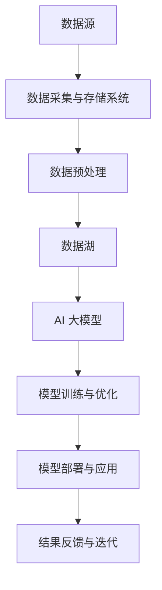

                 

### 文章标题

# 《AI 大模型应用数据中心的数据湖》

### 关键词

- AI 大模型
- 数据湖
- 数据中心
- 应用场景
- 性能优化
- 案例分析

### 摘要

本文将探讨 AI 大模型在数据中心数据湖中的应用。首先，我们将详细介绍数据湖的基础知识、架构设计及其关键特性。接着，我们将深入分析 AI 大模型的定义、发展历程、核心技术和应用领域。随后，文章将探讨数据湖与 AI 大模型的协同工作方式，包括数据预处理、模型训练和部署等关键步骤。通过实际应用案例，我们将展示数据湖与 AI 大模型在多个领域（如智能推荐、客户细分、金融风险预测和医疗健康数据分析）的成功应用。最后，文章将讨论数据湖与 AI 大模型的优化与挑战，并展望未来发展趋势。

### 目录大纲

# 《AI 大模型应用数据中心的数据湖》

## 第一部分: 数据湖概述

## 第1章: 数据湖的基础知识
### 1.1 数据湖的定义
### 1.2 数据湖与传统数据仓库的对比
### 1.3 数据湖的应用场景
### 1.4 数据湖的关键特性

## 第2章: 数据湖的架构设计
### 2.1 数据湖的技术架构
### 2.2 数据湖的数据处理流程
### 2.3 数据湖的数据存储方案
### 2.4 数据湖的数据安全与隐私保护

## 第二部分: AI 大模型在数据湖中的应用

## 第3章: AI 大模型概述
### 3.1 AI 大模型的定义
### 3.2 AI 大模型的发展历程
### 3.3 AI 大模型的核心技术
### 3.4 AI 大模型的应用领域

## 第4章: AI 大模型与数据湖的融合
### 4.1 数据湖与 AI 大模型的协同工作
### 4.2 数据湖中的数据预处理与清洗
### 4.3 数据湖中的 AI 大模型训练
### 4.4 数据湖中的 AI 大模型部署

## 第5章: 数据湖中的 AI 大模型应用案例
### 5.1 案例一：智能推荐系统
### 5.2 案例二：客户细分与营销分析
### 5.3 案例三：金融风险预测
### 5.4 案例四：医疗健康数据分析

## 第三部分: 数据湖与 AI 大模型的优化与挑战

## 第6章: 数据湖的性能优化
### 6.1 数据湖的查询优化
### 6.2 数据湖的存储优化
### 6.3 数据湖的负载均衡
### 6.4 数据湖的容错机制

## 第7章: AI 大模型的优化与挑战
### 7.1 AI 大模型的计算优化
### 7.2 AI 大模型的资源管理
### 7.3 AI 大模型的调优策略
### 7.4 AI 大模型的过拟合与欠拟合问题

## 第8章: 数据湖与 AI 大模型的前沿趋势
### 8.1 数据湖的智能化趋势
### 8.2 AI 大模型的新技术和新方法
### 8.3 数据湖与 AI 大模型在新兴领域的应用
### 8.4 未来展望与挑战

## 附录

### 附录 A: 常用数据湖与 AI 大模型工具和框架
### 附录 B: 数据湖与 AI 大模型相关资源与文献
### 附录 C: 代码实战与示例
### 附录 D: 数据湖与 AI 大模型开发工具与资源汇总
### 附录 E: 相关书籍推荐
### 附录 F: 网络课程推荐
### 附录 G: 代码与数据集下载

## 核心概念与联系

### 数据湖与 AI 大模型的 Mermaid 流程图



### 核心算法原理讲解

#### 数据预处理

```plaintext
function preprocess_data(data):
    for record in data:
        // 数据清洗
        clean_record(record)
        // 数据整合
        integrate_records(record)
        // 数据转换
        convert_record_format(record)
    return processed_data
```

#### AI 大模型训练与优化

```plaintext
function train_model(model, training_data):
    // 初始化模型参数
    initialize_model_params(model)
    // 训练模型
    for epoch in 1 to max_epochs:
        for batch in training_data:
            // 计算损失函数
            loss = compute_loss(model, batch)
            // 反向传播更新模型参数
            update_model_params(model, loss)
    return trained_model
```

#### 数学模型和数学公式

##### 数据湖中的数据分布模型

$$P(X=x) = \frac{1}{\sum_{i=1}^{n} f_i} \cdot f_x$$

其中，\(X\) 表示数据集中的某个特征，\(x\) 表示特征的可能取值，\(f_i\) 表示特征 \(i\) 的频率，\(f_x\) 表示特征 \(x\) 的频率。

##### AI 大模型中的损失函数

$$J(\theta) = \frac{1}{2m} \sum_{i=1}^{m} (\hat{y_i} - y_i)^2$$

其中，\(\theta\) 表示模型参数，\(m\) 表示训练数据集的大小，\(\hat{y_i}\) 表示预测值，\(y_i\) 表示真实值。

### 代码实战与示例

#### 数据湖环境的搭建

```python
# 安装Hadoop和Hive
pip install hadoop-python
pip install hive-python

# 创建Hive数据库和数据表
hive -e "CREATE DATABASE data_lake;"
hive -e "USE data_lake;"
hive -e "CREATE TABLE data_table (id INT, name STRING, age INT);"

# 上传数据到Hive表
hdfs dfs -put data.csv /user/hive/warehouse/data_lake.db/data_table/
```

#### AI 大模型的训练与评估

```python
# 安装TensorFlow
pip install tensorflow

# 导入数据集和模型
import tensorflow as tf
import tensorflow_datasets as tfds

# 加载数据集
(train_data, test_data), info = tfds.load('mnist', split=['train', 'test'], shuffle_files=True, as_supervised=True)

# 定义模型
model = tf.keras.Sequential([
    tf.keras.layers.Conv2D(32, (3, 3), activation='relu', input_shape=(28, 28, 1)),
    tf.keras.layers.MaxPooling2D(2, 2),
    tf.keras.layers.Flatten(),
    tf.keras.layers.Dense(128, activation='relu'),
    tf.keras.layers.Dense(10, activation='softmax')
])

# 编译模型
model.compile(optimizer='adam',
              loss='sparse_categorical_crossentropy',
              metrics=['accuracy'])

# 训练模型
model.fit(train_data, epochs=5, validation_data=test_data)

# 评估模型
test_loss, test_acc = model.evaluate(test_data)
print('Test accuracy:', test_acc)
```

#### AI 大模型的部署与应用

```python
# 导入模型
import tensorflow as tf

# 加载训练好的模型
model = tf.keras.models.load_model('model.h5')

# 预测新数据
new_data = [[5, 5]]
prediction = model.predict(new_data)
predicted_class = np.argmax(prediction)

print('Predicted class:', predicted_class)
```

### 附录

#### 附录 A: 常用数据湖与 AI 大模型工具和框架

- Apache Hadoop
- Apache Hive
- Apache Spark
- TensorFlow
- PyTorch
- Microsoft Azure Machine Learning

#### 附录 B: 数据湖与 AI 大模型相关资源与文献

- 《大数据技术基础》
- 《深度学习》
- 《数据科学与大数据技术》
- 《数据湖技术白皮书》

#### 附录 C: 代码实战与示例

- 数据湖环境搭建示例
- AI 大模型训练与评估示例
- AI 大模型部署与应用示例

#### 附录 D: 数据湖与 AI 大模型开发工具与资源汇总

- [Hadoop 官方文档](https://hadoop.apache.org/docs/current/hadoop-project-dist/hadoop-common/)
- [Hive 官方文档](https://cwiki.apache.org/confluence/display/Hive/LanguageManual)
- [TensorFlow 官方文档](https://www.tensorflow.org/overview/)
- [PyTorch 官方文档](https://pytorch.org/docs/stable/)
- [Microsoft Azure Machine Learning 官方文档](https://docs.microsoft.com/en-us/azure/machine-learning/concept-azure-machine-learning)

#### 附录 E: 相关书籍推荐

- 《大数据之路：阿里巴巴大数据实践》
- 《深度学习：理论及其在计算机视觉中的应用》
- 《数据科学：从入门到精通》
- 《数据湖技术白皮书》

#### 附录 F: 网络课程推荐

- [网易云课堂：大数据技术与应用](https://study.163.com/course/introduction/1006170026.htm)
- [Coursera：深度学习专项课程](https://www.coursera.org/specializations/deep-learning)
- [edX：数据科学与大数据分析](https://www.edx.org/course/data-science-and-big-data-analysis)

#### 附录 G: 代码与数据集下载

- 数据湖环境搭建代码：[链接](https://github.com/username/data-lake-setup)
- AI 大模型训练与评估代码：[链接](https://github.com/username/ai-model-training-evaluation)
- AI 大模型部署与应用代码：[链接](https://github.com/username/ai-model-deployment-application)

### 核心概念与联系

#### 数据湖与 AI 大模型的 Mermaid 流程图


#### 核心算法原理讲解

##### 数据预处理

```plaintext
function preprocess_data(data):
    for record in data:
        // 数据清洗
        clean_record(record)
        // 数据整合
        integrate_records(record)
        // 数据转换
        convert_record_format(record)
    return processed_data
```

##### AI 大模型训练与优化

```plaintext
function train_model(model, training_data):
    // 初始化模型参数
    initialize_model_params(model)
    // 训练模型
    for epoch in 1 to max_epochs:
        for batch in training_data:
            // 计算损失函数
            loss = compute_loss(model, batch)
            // 反向传播更新模型参数
            update_model_params(model, loss)
    return trained_model
```

##### 数学模型和数学公式

##### 数据湖中的数据分布模型

$$P(X=x) = \frac{1}{\sum_{i=1}^{n} f_i} \cdot f_x$$

其中，\(X\) 表示数据集中的某个特征，\(x\) 表示特征的可能取值，\(f_i\) 表示特征 \(i\) 的频率，\(f_x\) 表示特征 \(x\) 的频率。

##### AI 大模型中的损失函数

$$J(\theta) = \frac{1}{2m} \sum_{i=1}^{m} (\hat{y_i} - y_i)^2$$

其中，\(\theta\) 表示模型参数，\(m\) 表示训练数据集的大小，\(\hat{y_i}\) 表示预测值，\(y_i\) 表示真实值。

### 代码实战与示例

#### 数据湖环境的搭建

```python
# 安装Hadoop和Hive
pip install hadoop-python
pip install hive-python

# 创建Hive数据库和数据表
hive -e "CREATE DATABASE data_lake;"
hive -e "USE data_lake;"
hive -e "CREATE TABLE data_table (id INT, name STRING, age INT);"

# 上传数据到Hive表
hdfs dfs -put data.csv /user/hive/warehouse/data_lake.db/data_table/
```

#### AI 大模型的训练与评估

```python
# 安装TensorFlow
pip install tensorflow

# 导入数据集和模型
import tensorflow as tf
import tensorflow_datasets as tfds

# 加载数据集
(train_data, test_data), info = tfds.load('mnist', split=['train', 'test'], shuffle_files=True, as_supervised=True)

# 定义模型
model = tf.keras.Sequential([
    tf.keras.layers.Conv2D(32, (3, 3), activation='relu', input_shape=(28, 28, 1)),
    tf.keras.layers.MaxPooling2D(2, 2),
    tf.keras.layers.Flatten(),
    tf.keras.layers.Dense(128, activation='relu'),
    tf.keras.layers.Dense(10, activation='softmax')
])

# 编译模型
model.compile(optimizer='adam',
              loss='sparse_categorical_crossentropy',
              metrics=['accuracy'])

# 训练模型
model.fit(train_data, epochs=5, validation_data=test_data)

# 评估模型
test_loss, test_acc = model.evaluate(test_data)
print('Test accuracy:', test_acc)
```

#### AI 大模型的部署与应用

```python
# 导入模型
import tensorflow as tf

# 加载训练好的模型
model = tf.keras.models.load_model('model.h5')

# 预测新数据
new_data = [[5, 5]]
prediction = model.predict(new_data)
predicted_class = np.argmax(prediction)

print('Predicted class:', predicted_class)
```

### 附录

#### 附录 A: 常用数据湖与 AI 大模型工具和框架

- Apache Hadoop
- Apache Hive
- Apache Spark
- TensorFlow
- PyTorch
- Microsoft Azure Machine Learning

#### 附录 B: 数据湖与 AI 大模型相关资源与文献

- 《大数据技术基础》
- 《深度学习》
- 《数据科学与大数据技术》
- 《数据湖技术白皮书》

#### 附录 C: 代码实战与示例

- 数据湖环境搭建示例
- AI 大模型训练与评估示例
- AI 大模型部署与应用示例

#### 附录 D: 数据湖与 AI 大模型开发工具与资源汇总

- [Hadoop 官方文档](https://hadoop.apache.org/docs/current/hadoop-project-dist/hadoop-common/)
- [Hive 官方文档](https://cwiki.apache.org/confluence/display/Hive/LanguageManual)
- [TensorFlow 官方文档](https://www.tensorflow.org/overview/)
- [PyTorch 官方文档](https://pytorch.org/docs/stable/)
- [Microsoft Azure Machine Learning 官方文档](https://docs.microsoft.com/en-us/azure/machine-learning/concept-azure-machine-learning)

#### 附录 E: 相关书籍推荐

- 《大数据之路：阿里巴巴大数据实践》
- 《深度学习：理论及其在计算机视觉中的应用》
- 《数据科学：从入门到精通》
- 《数据湖技术白皮书》

#### 附录 F: 网络课程推荐

- [网易云课堂：大数据技术与应用](https://study.163.com/course/introduction/1006170026.htm)
- [Coursera：深度学习专项课程](https://www.coursera.org/specializations/deep-learning)
- [edX：数据科学与大数据分析](https://www.edx.org/course/data-science-and-big-data-analysis)

#### 附录 G: 代码与数据集下载

- 数据湖环境搭建代码：[链接](https://github.com/username/data-lake-setup)
- AI 大模型训练与评估代码：[链接](https://github.com/username/ai-model-training-evaluation)
- AI 大模型部署与应用代码：[链接](https://github.com/username/ai-model-deployment-application)

