                 

### 文章标题：AI大模型应用数据中心的数据湖架构

#### 关键词：AI大模型、数据湖、数据中心、架构设计、应用实践

#### 摘要：
本文详细探讨了AI大模型在数据中心数据湖架构中的应用与优化。首先，介绍了数据湖的基础概念、核心架构及其与数据仓库的区别。接着，深入分析了数据湖的设计原则、技术选型及实现案例。随后，阐述了AI大模型在数据湖中的角色、应用场景和实现实践。本文还探讨了数据湖与AI大模型协同优化的原理、性能优化策略以及成本优化方法。此外，重点分析了数据湖与AI大模型的安全与隐私保护措施，并提供了实际应用案例分析及未来发展趋势的预测。

### 第一部分：数据湖架构基础

#### 第1章：数据湖概述

##### 1.1 数据湖的定义与历史发展

###### 1.1.1 数据湖的概念
数据湖（Data Lake）是一种新兴的数据存储架构，它不同于传统数据仓库（Data Warehouse）的集成和结构化处理方式，而是以原始数据的形式存储大量不同类型的数据。数据湖允许存储所有来源的数据，包括结构化、半结构化和非结构化数据，如文本、图像、音频和视频。数据湖通常采用分布式存储技术，如Hadoop HDFS、云存储服务等，支持大规模数据处理和分析。

###### 1.1.2 数据湖与数据仓库的区别
数据仓库主要用于存储经过处理和结构化的数据，以支持企业的查询和分析需求。而数据湖则更多地关注于数据的原始存储和管理，保留数据的原始格式和元数据，以备后续处理和分析。数据仓库强调数据的准确性和一致性，而数据湖强调数据的多样性和灵活性。

| 对比项 | 数据仓库 | 数据湖 |
| --- | --- | --- |
| 数据格式 | 结构化数据 | 结构化、半结构化和非结构化数据 |
| 存储模式 | 数据经过处理和集成 | 数据原始存储 |
| 数据一致性 | 高 | 低 |
| 数据灵活性 | 低 | 高 |
| 数据处理 | 批量处理 | 批量处理与实时处理相结合 |

###### 1.1.3 数据湖的发展历程
数据湖的概念起源于大数据技术的发展。随着大数据处理的复杂性增加，传统的数据仓库已经无法满足企业对大规模、多样化数据的需求。2010年左右，数据湖开始成为企业数据架构的重要组成部分。随着云计算、分布式存储和Hadoop等技术的成熟，数据湖得到了广泛应用。近年来，随着AI和机器学习的兴起，数据湖在数据分析和决策支持中的重要性进一步提升。

##### 1.2 数据湖的核心架构

###### 1.2.1 数据源接入
数据湖需要从多种数据源接入数据，包括企业内部数据库、日志系统、外部数据源等。数据接入过程需要确保数据的完整性和准确性。常用的数据接入技术包括ETL（提取、转换、加载）和数据集成平台。

###### 1.2.2 数据处理与存储
数据湖采用分布式存储技术来存储大量数据。数据处理通常包括数据清洗、数据转换、数据聚合等步骤。数据湖支持批处理和实时处理，以适应不同的数据处理需求。

| 处理方式 | 批处理 | 实时处理 |
| --- | --- | --- |
| 数据量 | 大规模数据 | 低延迟数据 |
| 处理时间 | 长时间 | 短时间内 |
| 适用场景 | 大数据分析 | 实时数据分析 |

###### 1.2.3 数据治理
数据治理是确保数据质量、安全性和合规性的关键。数据治理包括数据质量管理、数据安全性和数据隐私保护。数据质量管理确保数据的一致性、准确性和完整性。数据安全性包括数据加密、访问控制和身份验证等。数据隐私保护涉及数据处理过程中的隐私保护措施，如数据脱敏、数据匿名化等。

###### 1.2.4 数据访问与查询
数据湖提供多种数据访问和查询方式，包括SQL查询、NoSQL查询和流处理。数据湖支持自助数据分析和可视化工具，以帮助用户快速获取洞察。

##### 1.3 数据湖的优势与挑战

###### 1.3.1 数据湖的优势
数据湖具有以下优势：

- **灵活性**：支持多种数据类型和来源，适应不同的业务需求。
- **可扩展性**：分布式存储技术支持海量数据的存储和处理。
- **成本效益**：无需预定义数据模型，降低数据集成和处理的成本。
- **实时分析**：支持批处理和实时处理，提供快速的数据分析能力。

###### 1.3.2 数据湖的挑战
数据湖也面临以下挑战：

- **数据质量**：原始数据的多样性和质量难以保证。
- **数据治理**：数据安全和隐私保护需要复杂的治理策略。
- **数据整合**：多种数据源和格式导致数据整合的复杂性。
- **技术复杂性**：需要多样化的技术栈来支持数据湖架构。

###### 1.3.3 数据湖的未来发展趋势
随着人工智能和大数据技术的不断发展，数据湖的未来发展趋势包括：

- **自动化治理**：通过自动化工具提高数据质量和数据治理效率。
- **实时数据湖**：通过实时处理技术支持实时数据分析和决策。
- **多模型数据库**：结合关系数据库和非关系数据库的优势，提供更灵活的数据存储和处理能力。
- **云原生数据湖**：利用云计算的弹性和可扩展性，构建灵活、高效的数据湖架构。

### 第一部分：数据湖架构基础

#### 第2章：数据湖设计与实现

##### 2.1 数据湖设计原则

数据湖的设计需要考虑多个方面，包括数据架构设计、数据质量管理、数据安全性设计、数据扩展性设计等。以下将详细阐述这些设计原则。

###### 2.1.1 数据架构设计
数据架构设计是数据湖设计的核心。一个良好的数据架构能够确保数据的可用性、一致性和灵活性。在设计数据架构时，需要考虑以下几个方面：

- **数据分层**：根据数据类型和处理方式，将数据分为多个层次，如数据原始层、数据加工层、数据服务层等。每个层次都有明确的职责和功能。
- **数据模型**：采用灵活的数据模型，支持多种数据类型和格式，如关系型数据模型、文档型数据模型、图数据模型等。
- **数据组织**：合理组织数据，提高数据的访问效率和存储空间利用率。常用的组织方式包括按主题组织、按时间组织、按数据源组织等。

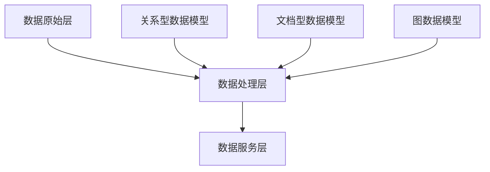

###### 2.1.2 数据质量管理
数据质量管理是确保数据质量和数据可用性的关键。数据质量管理包括以下几个方面：

- **数据完整性**：确保数据的准确性、一致性和完整性，避免数据丢失或错误。
- **数据准确性**：确保数据的准确性，通过数据校验、数据清洗等方法，减少数据错误和数据冗余。
- **数据一致性**：确保数据在不同系统、不同表、不同字段之间的数据一致性，避免数据冲突和数据不一致。
- **数据可追溯性**：确保数据的可追溯性，通过数据日志、数据审计等方式，记录数据的历史变更和操作记录。

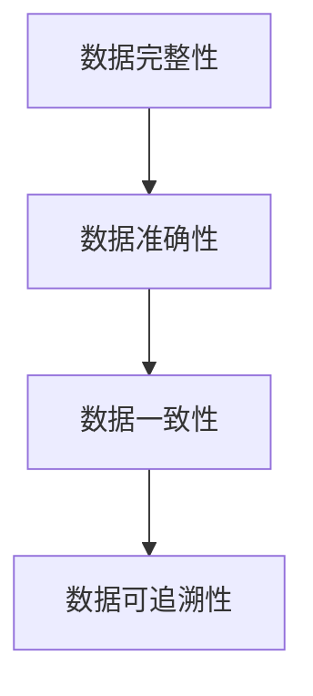

###### 2.1.3 数据安全性设计
数据安全性设计是保护数据安全、防止数据泄露和滥用的关键。数据安全性设计包括以下几个方面：

- **数据加密**：对存储和传输的数据进行加密，确保数据在未授权的情况下无法被访问或篡改。
- **访问控制**：通过身份验证和访问控制策略，确保只有授权用户能够访问数据。
- **数据备份和恢复**：定期备份数据，确保在数据丢失或损坏的情况下能够快速恢复。
- **数据审计**：记录数据的访问和使用情况，确保数据使用的透明性和合规性。

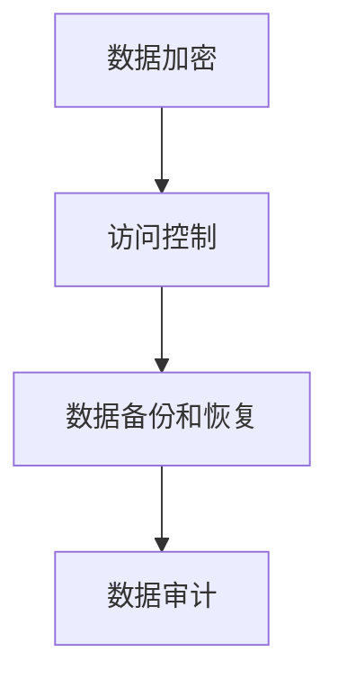

###### 2.1.4 数据扩展性设计
数据扩展性设计是确保数据湖能够应对数据增长和业务扩展的关键。数据扩展性设计包括以下几个方面：

- **分布式存储**：采用分布式存储技术，如HDFS、云存储等，支持海量数据的存储和处理。
- **弹性计算**：根据数据处理需求，动态调整计算资源，确保数据处理的高效性和灵活性。
- **数据分区**：根据数据特点和访问需求，对数据进行分区，提高数据查询和处理的性能。
- **数据迁移**：支持数据在不同存储系统、不同数据湖之间的迁移，确保数据的灵活性和可扩展性。

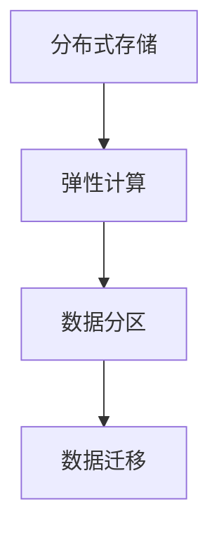

##### 2.2 数据湖技术选型

数据湖技术选型是构建数据湖的关键环节。在选择技术时，需要综合考虑数据存储技术、数据处理框架、数据交换与集成、数据查询与分析工具等因素。

###### 2.2.1 数据存储技术
数据存储技术是数据湖的核心，决定了数据的存储能力和性能。以下是一些常用的数据存储技术：

- **分布式文件系统**：如Hadoop HDFS、Alluxio等，支持海量数据的存储和高吞吐量数据处理。
- **关系数据库**：如MySQL、PostgreSQL等，适合处理结构化数据，提供丰富的查询功能。
- **NoSQL数据库**：如MongoDB、Cassandra等，适合处理半结构化和非结构化数据，提供高扩展性。
- **云存储**：如Amazon S3、Azure Blob Storage等，提供低成本、高可靠性的数据存储服务。

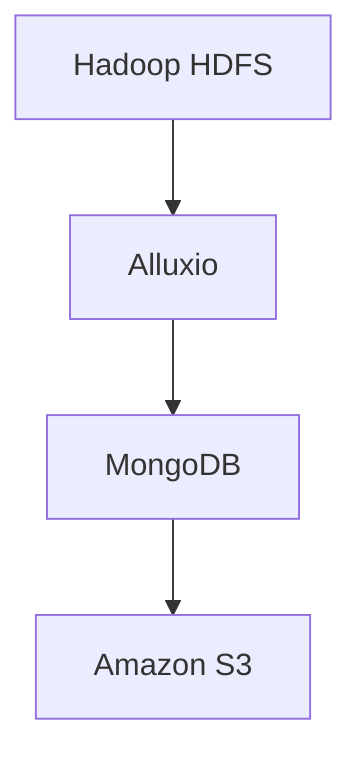

###### 2.2.2 数据处理框架
数据处理框架是数据湖的重要组成部分，负责数据的采集、处理和存储。以下是一些常用的数据处理框架：

- **批处理框架**：如Apache Spark、Flink等，适合处理大规模数据的批处理任务。
- **实时处理框架**：如Apache Kafka、Apache Flink等，适合处理实时数据流和低延迟数据处理。
- **ETL工具**：如Apache NiFi、Apache Airflow等，负责数据采集、清洗、转换和加载。

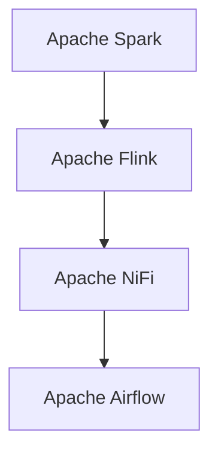

###### 2.2.3 数据交换与集成
数据交换与集成是数据湖实现跨系统、跨数据源数据共享和整合的关键。以下是一些常用的数据交换与集成技术：

- **消息队列**：如Apache Kafka、RabbitMQ等，实现数据的异步传输和分布式处理。
- **服务总线**：如Apache ServiceMix、MuleSoft等，实现不同系统之间的数据交换和整合。
- **数据虚拟化**：如Denodo、TIBCO等，提供统一的数据访问接口，实现跨系统的数据集成。

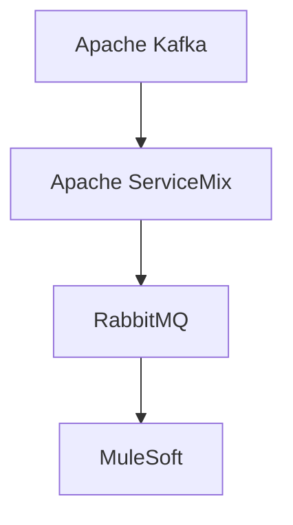

###### 2.2.4 数据查询与分析工具
数据查询与分析工具是数据湖实现数据分析和洞察的关键。以下是一些常用的数据查询与分析工具：

- **SQL查询引擎**：如Apache Hive、Apache Impala等，提供SQL查询接口，支持大规模数据查询。
- **NoSQL查询引擎**：如MongoDB Query Language、Cassandra Query Language等，提供NoSQL查询接口，支持半结构化和非结构化数据查询。
- **数据分析工具**：如Tableau、Power BI等，提供数据可视化工具，帮助用户快速理解和分析数据。

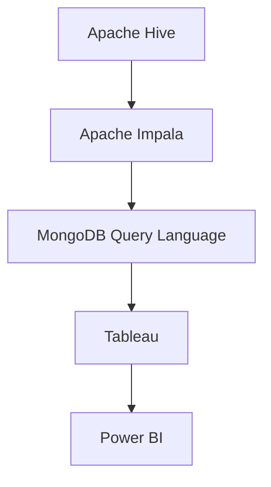

##### 2.3 数据湖实现案例

###### 2.3.1 案例一：企业数据湖架构设计
企业数据湖架构设计旨在构建一个高效、灵活的数据湖，支持企业内部各种数据源的数据存储、处理和分析需求。以下是一个典型企业数据湖架构设计案例：

1. **数据源接入**：企业数据源包括内部数据库、日志系统、外部API等。通过ETL工具和消息队列，将数据从不同数据源接入数据湖。

2. **数据处理与存储**：数据湖采用分布式存储技术（如Hadoop HDFS）存储数据。数据处理包括数据清洗、数据转换和聚合等步骤，通过Apache Spark进行批处理。

3. **数据治理**：采用数据质量管理工具和策略，确保数据质量。包括数据完整性校验、数据准确性校验、数据一致性校验等。

4. **数据访问与查询**：提供SQL查询接口（如Apache Hive），支持用户自助查询和分析数据。同时，提供数据可视化工具（如Tableau），帮助用户快速获取数据洞察。

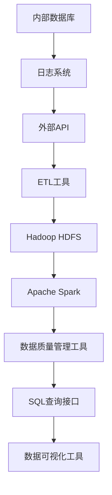

###### 2.3.2 案例二：政府数据湖架构设计
政府数据湖架构设计旨在整合政府部门的各种数据资源，提供高效的数据共享和服务。以下是一个典型政府数据湖架构设计案例：

1. **数据源接入**：政府数据源包括政务系统、公共数据平台、第三方数据提供商等。通过数据交换平台和消息队列，将数据从不同数据源接入数据湖。

2. **数据处理与存储**：数据湖采用分布式存储技术（如Hadoop HDFS）和云存储服务（如Amazon S3），存储和管理海量数据。数据处理包括数据清洗、数据转换和聚合等步骤，通过Apache Spark进行批处理。

3. **数据治理**：采用数据治理平台和策略，确保数据质量和数据安全。包括数据完整性校验、数据准确性校验、数据一致性校验、数据加密、访问控制等。

4. **数据共享与服务**：通过数据交换平台和API接口，实现跨部门、跨区域的数据共享和服务。同时，提供数据可视化工具（如Power BI），帮助政府部门快速获取数据洞察。

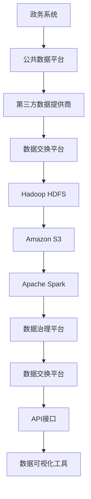

###### 2.3.3 案例三：金融数据湖架构设计
金融数据湖架构设计旨在整合金融机构的各种数据资源，提供高效的数据分析和风险控制能力。以下是一个典型金融数据湖架构设计案例：

1. **数据源接入**：金融数据源包括交易系统、风险管理系统、客户信息系统等。通过ETL工具和消息队列，将数据从不同数据源接入数据湖。

2. **数据处理与存储**：数据湖采用分布式存储技术（如Hadoop HDFS）和云存储服务（如Azure Blob Storage），存储和管理海量数据。数据处理包括数据清洗、数据转换和聚合等步骤，通过Apache Spark进行批处理。

3. **数据治理**：采用数据质量管理工具和策略，确保数据质量。包括数据完整性校验、数据准确性校验、数据一致性校验等。同时，采用数据加密、访问控制等技术，确保数据安全和隐私保护。

4. **数据分析与风险控制**：通过机器学习和数据分析工具（如TensorFlow、Apache Flink），对金融数据进行实时分析和风险控制。同时，提供数据可视化工具（如Tableau），帮助金融机构快速获取数据洞察。

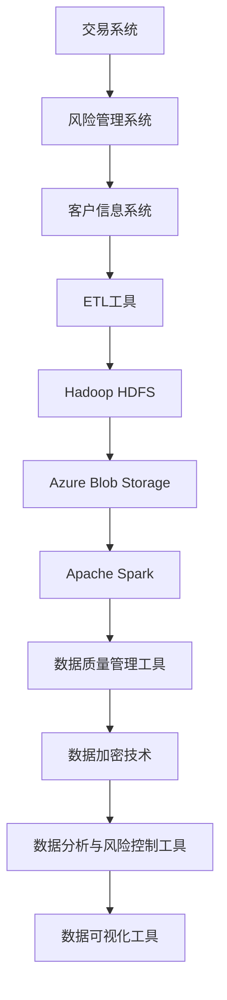

### 第二部分：AI大模型在数据湖中的应用

#### 第3章：AI大模型与数据湖的融合

##### 3.1 AI大模型在数据湖中的作用

AI大模型在数据湖中发挥着关键作用，成为数据湖架构的重要组成部分。以下将详细讨论AI大模型在数据湖中的主要作用：

###### 3.1.1 数据预处理与清洗
在数据湖中，数据预处理和清洗是数据处理的重要环节。AI大模型可以帮助自动化数据清洗过程，提高数据质量。例如，通过使用深度学习模型，可以自动识别和修复数据中的错误、缺失和异常值。以下是一个简化的伪代码示例，展示如何使用AI大模型进行数据预处理：

```python
# 伪代码：使用AI大模型进行数据预处理
def preprocess_data(data):
    # 使用深度学习模型进行错误修复
    corrected_data = deep_learning_model_correct_errors(data)
    # 使用深度学习模型进行缺失值填补
    filled_data = deep_learning_model_fill_missing_values(corrected_data)
    # 使用深度学习模型进行异常值检测
    filtered_data = deep_learning_model_remove_outliers(filled_data)
    return filtered_data
```

在这个伪代码中，`deep_learning_model_correct_errors`、`deep_learning_model_fill_missing_values`和`deep_learning_model_remove_outliers`是使用深度学习算法实现的数据预处理功能。通过训练合适的深度学习模型，可以自动完成数据清洗过程，提高数据质量。

###### 3.1.2 数据特征工程
数据特征工程是提高数据分析和模型性能的关键步骤。AI大模型可以帮助自动生成和优化数据特征，从而提高模型的预测能力和泛化能力。以下是一个简化的伪代码示例，展示如何使用AI大模型进行数据特征工程：

```python
# 伪代码：使用AI大模型进行数据特征工程
def feature_engineering(data):
    # 使用深度学习模型进行特征提取
    extracted_features = deep_learning_model_extract_features(data)
    # 使用深度学习模型进行特征选择
    selected_features = deep_learning_model_select_features(extracted_features)
    return selected_features
```

在这个伪代码中，`deep_learning_model_extract_features`和`deep_learning_model_select_features`是使用深度学习算法实现的特征提取和选择功能。通过训练合适的深度学习模型，可以自动提取和选择有效的数据特征，提高模型的性能。

###### 3.1.3 数据挖掘与分析
数据挖掘与分析是数据湖的核心功能之一。AI大模型可以帮助自动化数据挖掘过程，发现数据中的隐藏模式和关系。以下是一个简化的伪代码示例，展示如何使用AI大模型进行数据挖掘：

```python
# 伪代码：使用AI大模型进行数据挖掘
def data_mining(data):
    # 使用深度学习模型进行聚类分析
    clusters = deep_learning_model_cluster(data)
    # 使用深度学习模型进行关联规则挖掘
    rules = deep_learning_model_association_rules(data)
    # 使用深度学习模型进行分类分析
    classifications = deep_learning_model_classification(data)
    return clusters, rules, classifications
```

在这个伪代码中，`deep_learning_model_cluster`、`deep_learning_model_association_rules`和`deep_learning_model_classification`是使用深度学习算法实现的聚类、关联规则挖掘和分类功能。通过训练合适的深度学习模型，可以自动进行数据挖掘，发现数据中的隐藏模式和关系。

###### 3.1.4 智能数据服务
AI大模型还可以帮助构建智能数据服务，提供个性化推荐、智能问答、智能分析等功能。这些智能数据服务可以大大提高数据湖的实用性和价值。以下是一个简化的伪代码示例，展示如何使用AI大模型构建智能数据服务：

```python
# 伪代码：使用AI大模型构建智能数据服务
def intelligent_data_service(user, data):
    # 使用深度学习模型进行个性化推荐
    recommendations = deep_learning_model_recommendations(user, data)
    # 使用深度学习模型进行智能问答
    answer = deep_learning_model_answer_question(user, data)
    # 使用深度学习模型进行智能分析
    insights = deep_learning_model_analyze_data(data)
    return recommendations, answer, insights
```

在这个伪代码中，`deep_learning_model_recommendations`、`deep_learning_model_answer_question`和`deep_learning_model_analyze_data`是使用深度学习算法实现的个性化推荐、智能问答和智能分析功能。通过训练合适的深度学习模型，可以构建高效的智能数据服务，满足用户的需求。

##### 3.2 AI大模型在数据湖中的应用场景

AI大模型在数据湖中具有广泛的应用场景，可以应用于多个领域，如自然语言处理、计算机视觉、推荐系统、聊天机器人等。以下将分别介绍这些应用场景：

###### 3.2.1 自然语言处理
自然语言处理（Natural Language Processing，NLP）是AI大模型的一个重要应用领域。在数据湖中，NLP可以应用于文本分类、情感分析、命名实体识别、机器翻译等任务。以下是一个简化的伪代码示例，展示如何使用AI大模型进行自然语言处理：

```python
# 伪代码：使用AI大模型进行自然语言处理
def natural_language_processing(text):
    # 使用深度学习模型进行文本分类
    category = deep_learning_model_text_classification(text)
    # 使用深度学习模型进行情感分析
    sentiment = deep_learning_model_sentiment_analysis(text)
    # 使用深度学习模型进行命名实体识别
    entities = deep_learning_model Named_Entity_Recognition(text)
    # 使用深度学习模型进行机器翻译
    translation = deep_learning_model_translation(text, target_language)
    return category, sentiment, entities, translation
```

在这个伪代码中，`deep_learning_model_text_classification`、`deep_learning_model_sentiment_analysis`、`deep_learning_model_Named_Entity_Recognition`和`deep_learning_model_translation`是使用深度学习算法实现的文本分类、情感分析、命名实体识别和机器翻译功能。通过训练合适的深度学习模型，可以自动进行自然语言处理，提取文本中的语义信息。

###### 3.2.2 计算机视觉
计算机视觉（Computer Vision）是AI大模型的另一个重要应用领域。在数据湖中，计算机视觉可以应用于图像分类、目标检测、图像分割、人脸识别等任务。以下是一个简化的伪代码示例，展示如何使用AI大模型进行计算机视觉：

```python
# 伪代码：使用AI大模型进行计算机视觉
def computer_vision(image):
    # 使用深度学习模型进行图像分类
    category = deep_learning_model_image_classification(image)
    # 使用深度学习模型进行目标检测
    objects = deep_learning_model_object_detection(image)
    # 使用深度学习模型进行图像分割
    segmentation = deep_learning_model_image_segmentation(image)
    # 使用深度学习模型进行人脸识别
    faces = deep_learning_model_face_recognition(image)
    return category, objects, segmentation, faces
```

在这个伪代码中，`deep_learning_model_image_classification`、`deep_learning_model_object_detection`、`deep_learning_model_image_segmentation`和`deep_learning_model_face_recognition`是使用深度学习算法实现的图像分类、目标检测、图像分割和人脸识别功能。通过训练合适的深度学习模型，可以自动进行计算机视觉任务，处理和分析图像数据。

###### 3.2.3 推荐系统
推荐系统（Recommendation System）是AI大模型在数据湖中的另一个重要应用场景。在数据湖中，推荐系统可以应用于商品推荐、内容推荐、广告推荐等任务。以下是一个简化的伪代码示例，展示如何使用AI大模型进行推荐系统：

```python
# 伪代码：使用AI大模型进行推荐系统
def recommendation_system(user, items):
    # 使用深度学习模型进行用户兴趣分析
    interests = deep_learning_model_user_interests(user)
    # 使用深度学习模型进行物品推荐
    recommendations = deep_learning_model_recommendations(interests, items)
    return recommendations
```

在这个伪代码中，`deep_learning_model_user_interests`和`deep_learning_model_recommendations`是使用深度学习算法实现的用户兴趣分析和物品推荐功能。通过训练合适的深度学习模型，可以自动进行推荐系统，为用户提供个性化的推荐。

###### 3.2.4 聊天机器人
聊天机器人（Chatbot）是AI大模型在数据湖中的另一个重要应用场景。在数据湖中，聊天机器人可以应用于客户服务、在线咨询、智能客服等任务。以下是一个简化的伪代码示例，展示如何使用AI大模型进行聊天机器人：

```python
# 伪代码：使用AI大模型进行聊天机器人
def chatbot_response(user_input):
    # 使用深度学习模型进行自然语言理解
    intent = deep_learning_model_understand_intent(user_input)
    # 使用深度学习模型进行回答生成
    response = deep_learning_model_generate_response(intent)
    return response
```

在这个伪代码中，`deep_learning_model_understand_intent`和`deep_learning_model_generate_response`是使用深度学习算法实现的自然语言理解和回答生成功能。通过训练合适的深度学习模型，可以自动进行聊天机器人，与用户进行交互。

##### 3.3 AI大模型在数据湖中的实践

AI大模型在数据湖中的应用不仅停留在理论层面，还得到了广泛的实践。以下将介绍一些具体的AI大模型在数据湖中的实践案例，展示如何在实际项目中应用AI大模型，提高数据湖的智能化和数据分析能力。

###### 3.3.1 实践一：文本分类与情感分析
文本分类和情感分析是NLP领域的重要应用。在一个电商平台上，使用AI大模型对用户评论进行分类和情感分析，可以帮助企业了解用户对产品的满意度，优化产品和服务。以下是一个简化的伪代码示例，展示如何使用AI大模型进行文本分类和情感分析：

```python
# 伪代码：使用AI大模型进行文本分类和情感分析
def text_classification_and_sentiment_analysis(text):
    # 使用深度学习模型进行文本分类
    category = deep_learning_model_text_classification(text)
    # 使用深度学习模型进行情感分析
    sentiment = deep_learning_model_sentiment_analysis(text)
    return category, sentiment
```

在这个伪代码中，`deep_learning_model_text_classification`和`deep_learning_model_sentiment_analysis`是使用深度学习算法实现的文本分类和情感分析功能。通过训练合适的深度学习模型，可以对用户评论进行分类和情感分析，为企业提供有价值的数据。

###### 3.3.2 实践二：图像识别与标注
图像识别与标注是计算机视觉领域的重要应用。在一个安防项目中，使用AI大模型对监控视频中的图像进行识别和标注，可以帮助实时监测和识别异常行为。以下是一个简化的伪代码示例，展示如何使用AI大模型进行图像识别与标注：

```python
# 伪代码：使用AI大模型进行图像识别与标注
def image_recognition_and_annotation(image):
    # 使用深度学习模型进行图像识别
    objects = deep_learning_model_image_recognition(image)
    # 使用深度学习模型进行图像标注
    annotations = deep_learning_model_image_annotation(image, objects)
    return objects, annotations
```

在这个伪代码中，`deep_learning_model_image_recognition`和`deep_learning_model_image_annotation`是使用深度学习算法实现的图像识别和标注功能。通过训练合适的深度学习模型，可以实时监测和识别监控视频中的异常行为，提高安防监控的智能化水平。

###### 3.3.3 实践三：个性化推荐系统
个性化推荐系统是推荐系统领域的重要应用。在一个电商平台中，使用AI大模型构建个性化推荐系统，可以根据用户的行为和兴趣，为用户提供个性化的商品推荐。以下是一个简化的伪代码示例，展示如何使用AI大模型进行个性化推荐：

```python
# 伪代码：使用AI大模型进行个性化推荐
def personalized_recommendation_system(user, items):
    # 使用深度学习模型进行用户兴趣分析
    interests = deep_learning_model_user_interests(user)
    # 使用深度学习模型进行物品推荐
    recommendations = deep_learning_model_recommendations(interests, items)
    return recommendations
```

在这个伪代码中，`deep_learning_model_user_interests`和`deep_learning_model_recommendations`是使用深度学习算法实现的用户兴趣分析和物品推荐功能。通过训练合适的深度学习模型，可以自动为用户提供个性化的商品推荐，提高用户的满意度和转化率。

###### 3.3.4 实践四：智能问答系统
智能问答系统是聊天机器人领域的重要应用。在一个企业内部，使用AI大模型构建智能问答系统，可以帮助员工快速获取所需信息，提高工作效率。以下是一个简化的伪代码示例，展示如何使用AI大模型进行智能问答：

```python
# 伪代码：使用AI大模型进行智能问答
def intelligent问答_system(user_input):
    # 使用深度学习模型进行自然语言理解
    intent = deep_learning_model_understand_intent(user_input)
    # 使用深度学习模型进行回答生成
    response = deep_learning_model_generate_response(intent)
    return response
```

在这个伪代码中，`deep_learning_model_understand_intent`和`deep_learning_model_generate_response`是使用深度学习算法实现的自然语言理解和回答生成功能。通过训练合适的深度学习模型，可以自动进行智能问答，为用户提供快速、准确的信息查询服务。

### 第二部分：AI大模型在数据湖中的应用

#### 第4章：数据湖与AI大模型的协同优化

##### 4.1 数据湖与AI大模型的协同工作原理

数据湖与AI大模型的协同工作是实现高效数据分析和智能化决策的关键。以下将详细讨论数据湖与AI大模型的协同工作原理。

###### 4.1.1 数据湖对AI大模型的支持

数据湖为AI大模型提供了丰富、多样的数据资源，为AI模型的训练和优化提供了重要的数据基础。数据湖通过以下方式支持AI大模型：

- **数据多样性**：数据湖存储了各种类型的数据，包括结构化、半结构化和非结构化数据。这些数据为AI模型提供了丰富的训练样本，有助于提高模型的泛化能力和准确性。
- **数据完整性**：数据湖通过数据接入、数据处理和数据治理等环节，确保数据的完整性。这有助于提高AI模型的数据质量，减少数据错误和缺失对模型训练的影响。
- **数据灵活性**：数据湖支持实时数据处理和批处理，为AI模型提供了灵活的数据处理方式。AI模型可以根据实际需求，选择合适的处理方式，提高数据处理效率。

###### 4.1.2 AI大模型对数据湖的影响

AI大模型对数据湖的影响主要体现在数据分析和决策支持方面。AI大模型通过以下方式对数据湖产生影响：

- **数据洞察**：AI大模型可以深入分析数据湖中的数据，提取有价值的信息和知识。这些洞察有助于企业发现业务机会、优化业务流程和改进决策。
- **数据优化**：AI大模型可以优化数据湖中的数据存储、处理和分析过程。例如，通过特征工程和数据清洗，提高数据质量；通过聚类和分类，发现数据中的隐藏模式。
- **数据创新**：AI大模型可以驱动数据湖的创新应用。例如，通过自然语言处理和计算机视觉，实现智能问答、智能推荐和智能监控等新型应用。

###### 4.1.3 数据湖与AI大模型的协同优化目标

数据湖与AI大模型的协同优化目标是实现高效的数据分析和智能化决策。以下是一些关键的协同优化目标：

- **数据质量**：确保数据湖中的数据质量，包括完整性、准确性和一致性。高质量的数据是AI模型训练和优化的基础。
- **数据处理效率**：提高数据湖中数据的处理效率，包括数据的接入、存储、处理和查询。高效的数据处理有助于缩短模型训练和优化时间。
- **模型性能**：优化AI大模型的性能，包括模型的准确性、泛化能力和计算效率。高性能的模型可以提供更准确的数据分析和决策支持。
- **成本效益**：降低数据湖与AI大模型的总体成本，包括硬件、软件、人力和时间成本。高成本效益的协同优化有助于企业更好地利用资源。

##### 4.2 数据湖与AI大模型的性能优化

数据湖与AI大模型的性能优化是确保高效数据分析和智能化决策的关键。以下将详细讨论数据湖与AI大模型的性能优化策略。

###### 4.2.1 数据存储优化

数据存储优化是提高数据湖性能的重要环节。以下是一些数据存储优化的策略：

- **数据分层存储**：根据数据的重要性和访问频率，将数据分层存储。高频访问的数据存储在高速存储设备上，低频访问的数据存储在低成本存储设备上。这样可以降低存储成本，提高数据访问效率。
- **数据压缩与去重**：采用数据压缩技术，减少数据存储空间。同时，通过去重技术，消除数据重复存储，提高存储空间的利用率。
- **数据缓存**：在数据湖中设置缓存层，缓存常用数据。这样可以减少数据访问时间，提高数据查询性能。

###### 4.2.2 数据处理优化

数据处理优化是提高数据湖性能的关键。以下是一些数据处理优化的策略：

- **分布式计算**：采用分布式计算框架（如Hadoop、Spark等），将数据处理任务分解为多个子任务，并行处理。这样可以提高数据处理效率，缩短数据处理时间。
- **数据预处理优化**：优化数据预处理过程，包括数据清洗、转换和聚合等步骤。通过使用高效的数据预处理算法和工具，减少预处理时间。
- **数据索引**：为数据湖中的数据建立索引，提高数据查询性能。索引可以加快数据查询速度，降低查询成本。

###### 4.2.3 模型训练与推理优化

模型训练与推理优化是提高AI大模型性能的关键。以下是一些模型训练与推理优化的策略：

- **模型选择**：选择合适的AI大模型，根据实际需求和数据特点，选择适合的模型类型和算法。合适的模型可以提高训练效率和模型性能。
- **模型并行化**：采用模型并行化技术，将模型训练和推理任务分解为多个子任务，并行处理。这样可以提高模型训练和推理速度，缩短处理时间。
- **模型压缩与量化**：采用模型压缩和量化技术，降低模型参数的数量和计算复杂度。这样可以提高模型推理速度，降低模型存储和计算成本。

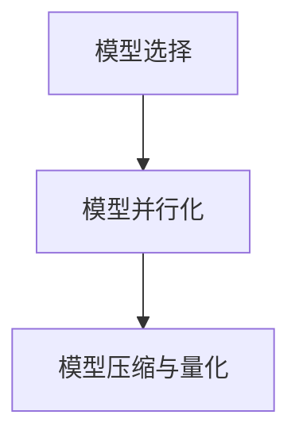

###### 4.2.4 性能监测与调优

性能监测与调优是确保数据湖与AI大模型性能优化的关键。以下是一些性能监测与调优的策略：

- **性能监测**：采用性能监测工具，实时监测数据湖与AI大模型的性能指标，如处理速度、查询响应时间、模型准确性等。通过性能监测，可以及时发现性能瓶颈和异常情况。
- **性能调优**：根据性能监测结果，对数据湖与AI大模型进行调优。通过调整配置参数、优化算法和改进数据处理流程，提高整体性能。
- **自动化调优**：采用自动化调优工具，根据性能监测结果，自动调整配置参数和优化算法。这样可以提高调优效率，缩短调优时间。

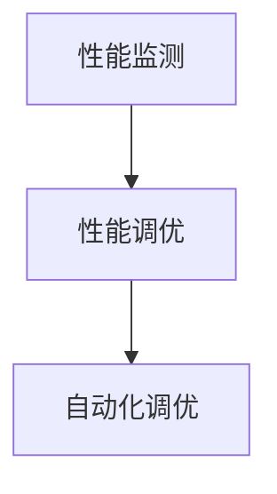

##### 4.3 数据湖与AI大模型的成本优化

数据湖与AI大模型的成本优化是确保项目成功实施和运营的关键。以下将详细讨论数据湖与AI大模型的成本优化策略。

###### 4.3.1 资源利用优化

资源利用优化是降低成本的重要策略。以下是一些资源利用优化的方法：

- **资源弹性分配**：根据实际需求，动态调整资源分配。在资源需求较低时，减少资源使用；在资源需求较高时，增加资源使用。这样可以提高资源利用率，降低成本。
- **资源共享**：多个数据湖与AI大模型项目共享计算资源和存储资源。通过资源整合，减少资源浪费，降低成本。

###### 4.3.2 数据存储成本优化

数据存储成本优化是降低数据湖成本的重要策略。以下是一些数据存储成本优化的方法：

- **分层存储**：根据数据的重要性和访问频率，采用分层存储策略。高频访问的数据存储在高速存储设备上，低频访问的数据存储在低成本存储设备上。这样可以降低存储成本，提高数据访问效率。
- **数据压缩**：采用数据压缩技术，减少数据存储空间。同时，通过去重技术，消除数据重复存储，提高存储空间的利用率。

###### 4.3.3 模型训练成本优化

模型训练成本优化是降低AI大模型成本的重要策略。以下是一些模型训练成本优化的方法：

- **模型压缩**：采用模型压缩技术，降低模型参数的数量和计算复杂度。这样可以提高模型推理速度，降低模型存储和计算成本。
- **并行训练**：采用并行训练技术，将模型训练任务分解为多个子任务，并行处理。这样可以提高训练速度，缩短训练时间，降低成本。

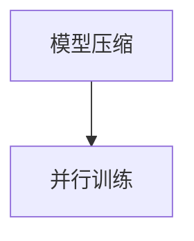

###### 4.3.4 成本效益分析

成本效益分析是评估数据湖与AI大模型项目成本效益的重要方法。以下是一些成本效益分析的方法：

- **成本计算**：计算数据湖与AI大模型项目的总成本，包括硬件、软件、人力、运维等费用。通过详细计算，可以了解项目的成本结构。
- **效益分析**：分析数据湖与AI大模型项目带来的效益，如提高数据处理效率、降低运营成本、增加收入等。通过效益分析，可以评估项目的投资回报率。
- **成本效益比**：计算成本效益比（Cost-Benefit Ratio，CBR），即项目的效益与成本之比。通过比较不同项目的成本效益比，可以选出最具成本效益的项目。

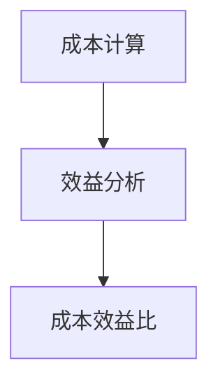

### 第三部分：实际应用与未来展望

#### 第6章：数据湖架构的AI应用案例分析

##### 6.1 案例一：电商行业数据湖架构

###### 6.1.1 案例背景
电商行业的数据量巨大，且数据类型多样，包括用户行为数据、交易数据、商品数据、物流数据等。为了更好地利用这些数据，提高客户满意度、优化运营策略，电商企业需要构建一个高效、灵活的数据湖架构，支持数据的存储、处理和分析。

###### 6.1.2 数据湖架构设计
电商行业数据湖架构设计如下：

1. **数据源接入**：接入多种数据源，包括内部数据库、日志系统、第三方数据提供商等。通过ETL工具（如Apache NiFi），将数据导入数据湖。

2. **数据处理与存储**：数据湖采用分布式存储技术（如Hadoop HDFS）存储数据。数据处理包括数据清洗、数据转换和聚合等步骤，通过Apache Spark进行批处理。

3. **数据治理**：采用数据质量管理工具和策略，确保数据质量。包括数据完整性校验、数据准确性校验、数据一致性校验等。

4. **数据访问与查询**：提供SQL查询接口（如Apache Hive），支持用户自助查询和分析数据。同时，提供数据可视化工具（如Tableau），帮助用户快速获取数据洞察。

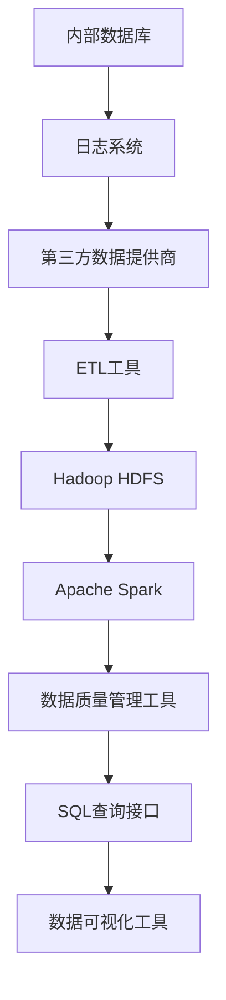

###### 6.1.3 AI应用实践
在电商数据湖中，AI大模型的应用包括：

1. **个性化推荐系统**：使用深度学习模型（如基于协同过滤和内容推荐的模型），根据用户的历史行为和偏好，为用户推荐商品。

2. **用户行为分析**：使用深度学习模型（如时间序列分析模型），分析用户的购买行为、浏览行为等，预测用户的需求和兴趣。

3. **风险控制**：使用深度学习模型（如异常检测模型），监控交易数据，识别潜在的欺诈行为。

4. **客户服务**：使用聊天机器人（如基于自然语言处理的大模型），提供24/7的客户咨询服务。

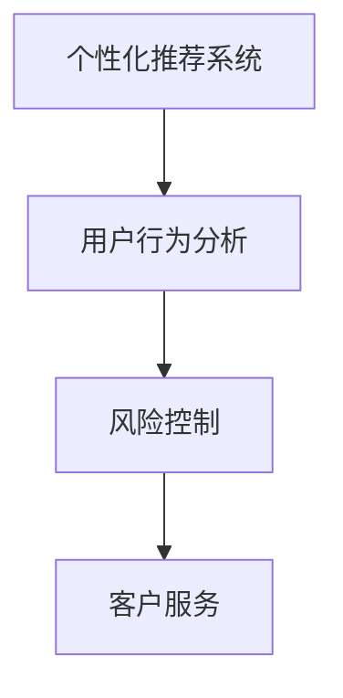

###### 6.1.4 案例分析
电商行业数据湖架构的AI应用案例取得了显著成效：

1. **用户满意度提升**：通过个性化推荐系统，提高了用户的购物体验和满意度。

2. **运营效率提高**：通过用户行为分析和风险控制，优化了运营策略，降低了运营成本。

3. **客户服务质量提升**：通过智能客服系统，提高了客户服务质量，减少了人工客服的工作负担。

4. **业务增长**：通过数据分析和智能决策，实现了业务增长，提高了企业的竞争力。

##### 6.2 案例二：金融行业数据湖架构

###### 6.2.1 案例背景
金融行业的数据量庞大，且数据类型复杂，包括交易数据、客户数据、市场数据、监管数据等。金融行业需要构建一个高效、安全的数据湖架构，支持数据的存储、处理和分析，以提供更好的金融服务和风险管理。

###### 6.2.2 数据湖架构设计
金融行业数据湖架构设计如下：

1. **数据源接入**：接入多种数据源，包括内部数据库、交易所数据、第三方数据提供商等。通过ETL工具（如Apache NiFi），将数据导入数据湖。

2. **数据处理与存储**：数据湖采用分布式存储技术（如Hadoop HDFS）和云存储服务（如Amazon S3），存储和管理海量数据。数据处理包括数据清洗、数据转换和聚合等步骤，通过Apache Spark进行批处理。

3. **数据治理**：采用数据质量管理工具和策略，确保数据质量。包括数据完整性校验、数据准确性校验、数据一致性校验等。同时，采用数据加密、访问控制等技术，确保数据安全和隐私保护。

4. **数据访问与查询**：提供SQL查询接口（如Apache Hive），支持用户自助查询和分析数据。同时，提供数据可视化工具（如Tableau），帮助用户快速获取数据洞察。

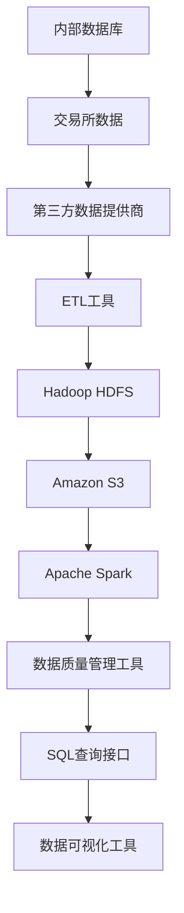

###### 6.2.3 AI应用实践
在金融数据湖中，AI大模型的应用包括：

1. **风险控制**：使用深度学习模型（如异常检测模型、信用评分模型），监控交易数据，识别潜在的欺诈行为和信用风险。

2. **市场预测**：使用深度学习模型（如时间序列分析模型、市场波动预测模型），预测市场走势和投资机会。

3. **客户服务**：使用聊天机器人（如基于自然语言处理的大模型），提供24/7的客户咨询服务。

4. **个性化推荐**：使用深度学习模型（如基于协同过滤和内容推荐的模型），根据客户的历史交易和偏好，推荐理财产品。

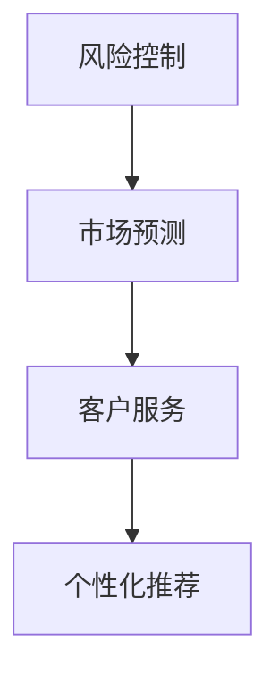

###### 6.2.4 案例分析
金融行业数据湖架构的AI应用案例取得了显著成效：

1. **风险控制能力提升**：通过深度学习模型的应用，提高了风险控制能力，降低了欺诈和信用风险。

2. **市场预测准确性提高**：通过深度学习模型的应用，提高了市场预测准确性，帮助投资者做出更明智的投资决策。

3. **客户服务质量提升**：通过智能客服系统，提高了客户服务质量，减少了人工客服的工作负担。

4. **业务增长**：通过数据分析和智能决策，实现了业务增长，提高了企业的竞争力。

##### 6.3 案例三：医疗行业数据湖架构

###### 6.3.1 案例背景
医疗行业的数据量庞大，且数据类型复杂，包括电子病历、医疗影像、基因数据、健康数据等。为了更好地利用这些数据，提高医疗质量和服务水平，医疗行业需要构建一个高效、安全的数据湖架构，支持数据的存储、处理和分析。

###### 6.3.2 数据湖架构设计
医疗行业数据湖架构设计如下：

1. **数据源接入**：接入多种数据源，包括医院信息系统、医疗设备、第三方数据提供商等。通过ETL工具（如Apache NiFi），将数据导入数据湖。

2. **数据处理与存储**：数据湖采用分布式存储技术（如Hadoop HDFS）和云存储服务（如Amazon S3），存储和管理海量数据。数据处理包括数据清洗、数据转换和聚合等步骤，通过Apache Spark进行批处理。

3. **数据治理**：采用数据质量管理工具和策略，确保数据质量。包括数据完整性校验、数据准确性校验、数据一致性校验等。同时，采用数据加密、访问控制等技术，确保数据安全和隐私保护。

4. **数据访问与查询**：提供SQL查询接口（如Apache Hive），支持用户自助查询和分析数据。同时，提供数据可视化工具（如Tableau），帮助用户快速获取数据洞察。

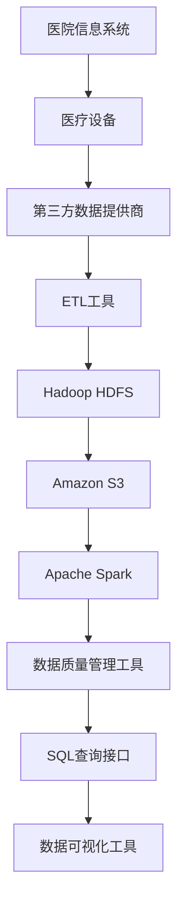

###### 6.3.3 AI应用实践
在医疗数据湖中，AI大模型的应用包括：

1. **疾病诊断**：使用深度学习模型（如卷积神经网络、循环神经网络），分析医疗影像和电子病历，辅助医生进行疾病诊断。

2. **患者监测**：使用深度学习模型（如时间序列分析模型），监测患者的健康数据，预测患者的健康趋势。

3. **个性化治疗**：使用深度学习模型（如基于协同过滤和内容推荐的模型），根据患者的病情和病史，推荐个性化的治疗方案。

4. **药物研发**：使用深度学习模型（如生成对抗网络、图神经网络），加速药物研发过程，提高药物研发成功率。

```mermaid
graph TD
A[疾病诊断] --> B[患者监测]
B --> C[个性化治疗]
C --> D[药物研发]
```

###### 6.3.4 案例分析
医疗行业数据湖架构的AI应用案例取得了显著成效：

1. **医疗质量提高**：通过深度学习模型的应用，提高了疾病诊断的准确性和效率，提高了医疗质量。

2. **患者监测能力提升**：通过深度学习模型的应用，实时监测患者的健康数据，提高了患者监测能力，减少了误诊和漏诊。

3. **个性化治疗水平提高**：通过深度学习模型的应用，实现了个性化治疗，提高了治疗效果和患者满意度。

4. **药物研发效率提升**：通过深度学习模型的应用，加速了药物研发过程，提高了药物研发成功率，降低了研发成本。

### 第三部分：实际应用与未来展望

#### 第7章：AI大模型与数据湖的发展趋势

##### 7.1 数据湖与AI大模型的技术发展趋势

随着技术的不断进步，数据湖与AI大模型在技术方面呈现出一系列发展趋势。以下是几个关键的技术趋势：

###### 7.1.1 人工智能算法的发展

人工智能算法的不断发展是数据湖与AI大模型技术进步的核心驱动力。深度学习、强化学习、迁移学习等算法的成熟，使得AI模型能够处理更复杂的数据和任务。特别是在自然语言处理、计算机视觉和推荐系统等领域，算法的进步显著提升了模型的性能和应用范围。

- **深度学习算法**：卷积神经网络（CNN）、循环神经网络（RNN）、生成对抗网络（GAN）等深度学习算法的发展，使得图像识别、语音识别和文本生成等任务取得了显著进展。
- **强化学习算法**：深度强化学习（DRL）在自动驾驶、机器人控制和游戏AI等领域取得了突破性成果，为数据湖中的智能决策提供了有力支持。
- **迁移学习算法**：通过迁移学习，模型可以在少量训练数据上实现较高的性能，提高了数据湖中小数据集的应用价值。

###### 7.1.2 云原生技术在数据湖中的应用

云原生技术的普及为数据湖与AI大模型的发展带来了新的机遇。云原生技术包括容器化、服务网格、微服务架构等，它们提供了灵活、可扩展和自动化的云计算环境。

- **容器化**：容器化技术（如Docker和Kubernetes）使得数据湖和AI大模型的应用可以轻松部署和管理，提高了系统的可移植性和可扩展性。
- **服务网格**：服务网格（如Istio和Linkerd）提供了透明的服务发现、负载均衡和安全性，为数据湖和AI大模型的分布式架构提供了支持。
- **微服务架构**：微服务架构将数据湖和AI大模型拆分为多个独立的服务，提高了系统的灵活性和可维护性。

```mermaid
graph TD
A[容器化] --> B[服务网格]
B --> C[微服务架构]
```

###### 7.1.3 联邦学习在数据湖与AI大模型中的融合

联邦学习（Federated Learning）作为一种新型的机器学习技术，能够在保护数据隐私的同时，实现数据湖和AI大模型的高效训练和协作。联邦学习通过将模型训练分散到多个数据源，避免了数据共享，从而降低了隐私泄露的风险。

- **数据隐私保护**：联邦学习通过在本地设备上训练模型，并仅共享模型更新，保护了数据的隐私。
- **数据融合**：联邦学习能够将来自不同数据源的局部模型整合为全局模型，提高了数据利用效率和模型性能。
- **分布式计算**：联邦学习利用了分布式计算的优势，通过分布式训练减少了模型训练时间。

```mermaid
graph TD
A[数据隐私保护] --> B[数据融合]
B --> C[分布式计算]
```

###### 7.1.4 开源技术在数据湖与AI大模型中的重要性

开源技术在数据湖与AI大模型中的应用越来越广泛，成为推动技术发展和创新的重要力量。以下是一些关键的开源技术：

- **Apache Hadoop和Spark**：Hadoop和Spark是大数据处理领域的开源框架，提供了强大的分布式数据处理能力，支持数据湖的构建和数据分析。
- **TensorFlow和PyTorch**：TensorFlow和PyTorch是深度学习领域的开源框架，提供了丰富的模型构建和训练工具，支持AI大模型的研发和应用。
- **Kubernetes和Docker**：Kubernetes和Docker是云计算和容器化领域的开源工具，提供了灵活的部署和管理环境，支持数据湖和AI大模型的分布式部署。

```mermaid
graph TD
A[Apache Hadoop和Spark] --> B[TensorFlow和PyTorch]
B --> C[Kubernetes和Docker]
```

##### 7.2 数据湖与AI大模型的市场趋势

随着技术的进步和应用的广泛推广，数据湖与AI大模型在市场上呈现出蓬勃发展的趋势。以下是几个关键的市场趋势：

###### 7.2.1 数据湖与AI大模型的市场需求

随着大数据和人工智能技术的不断发展，数据湖与AI大模型在各个行业中的应用需求日益增加。以下是几个主要的市场需求：

- **企业数字化转型**：越来越多的企业意识到数据湖与AI大模型在数字化转型中的关键作用，开始积极构建数据湖和AI大模型架构，以提升业务智能化水平。
- **智能数据分析**：企业需要利用数据湖和AI大模型，从海量数据中提取有价值的信息和洞察，支持智能决策和业务优化。
- **个性化服务**：在金融、电商、医疗等领域，企业需要利用数据湖和AI大模型提供个性化的服务，提高用户满意度和忠诚度。

###### 7.2.2 市场竞争格局

数据湖与AI大模型市场的竞争格局逐渐形成。以下是几个主要的市场竞争者：

- **传统大数据厂商**：如Hadoop的主要供应商Cloudera、MapR等，通过整合数据湖和AI大模型技术，提供一站式大数据解决方案。
- **云服务提供商**：如亚马逊AWS、微软Azure、谷歌Google Cloud等，通过提供云原生数据湖和AI大模型服务，占据市场份额。
- **AI初创企业**：如TensorFlow的维护者Google、PyTorch的维护者Facebook等，通过推出创新的AI大模型框架和应用，推动市场发展。

```mermaid
graph TD
A[传统大数据厂商] --> B[云服务提供商]
B --> C[AI初创企业]
```

###### 7.2.3 市场发展趋势预测

基于当前的技术发展和市场需求，以下是对数据湖与AI大模型市场发展趋势的预测：

- **云原生数据湖的普及**：随着云计算的普及，云原生数据湖将成为主流，提供灵活、高效的部署和管理方式。
- **联邦学习的广泛应用**：联邦学习将在保护数据隐私的同时，推动数据湖和AI大模型在跨企业和跨领域的数据共享和协作。
- **AI大模型的定制化**：企业将根据自身的业务需求和数据特点，定制化AI大模型，实现更精准的数据分析和决策支持。
- **数据湖与AI大模型的集成**：数据湖与AI大模型的集成将更加紧密，通过统一的数据湖架构，实现数据的高效存储、处理和分析。

##### 7.3 数据湖与AI大模型的应用前景

数据湖与AI大模型在各个行业中的应用前景广阔，有望带来深远的变革。以下是几个关键的应用领域：

###### 7.3.1 各行业应用场景分析

- **金融行业**：数据湖与AI大模型在金融行业中的应用包括风险控制、市场预测、个性化推荐等。通过构建智能风控系统，金融机构可以提高风险管理能力，降低欺诈风险；通过预测市场走势，金融机构可以做出更准确的决策，提高投资回报率；通过个性化推荐，金融机构可以提供个性化的金融产品和服务，提高客户满意度和忠诚度。
- **电商行业**：数据湖与AI大模型在电商行业中的应用包括个性化推荐、用户行为分析、智能客服等。通过构建智能推荐系统，电商平台可以提供个性化的商品推荐，提高转化率和销售额；通过分析用户行为，电商平台可以优化营销策略，提高用户留存率和活跃度；通过智能客服系统，电商平台可以提供24/7的在线服务，提高客户满意度和用户体验。
- **医疗行业**：数据湖与AI大模型在医疗行业中的应用包括疾病诊断、患者监测、个性化治疗等。通过构建智能诊断系统，医疗机构可以提高诊断准确性和效率，减少误诊和漏诊；通过监测患者健康数据，医疗机构可以及时发现健康问题，提供个性化的治疗建议；通过个性化治疗，医疗机构可以提高治疗效果，降低治疗成本。
- **制造业**：数据湖与AI大模型在制造业中的应用包括生产优化、设备预测性维护、供应链管理等。通过构建智能生产系统，制造业企业可以提高生产效率和产品质量；通过预测性维护，制造业企业可以提前发现设备故障，减少停机时间和维修成本；通过供应链管理，制造业企业可以提高供应链的透明度和协同性，降低库存成本和物流成本。

###### 7.3.2 潜在应用领域

除了上述行业，数据湖与AI大模型在以下领域也具有广阔的应用前景：

- **智慧城市**：通过构建数据湖，整合来自不同来源的城市数据，如交通数据、环境数据、社会数据等，智慧城市可以实现智能交通管理、环境监测、城市安全等应用。通过AI大模型的应用，智慧城市可以提供个性化的城市服务，提高城市居民的生活质量。
- **教育行业**：通过构建数据湖，整合学生的学习数据、教学数据、作业数据等，教育行业可以实现智能教育、个性化教学等应用。通过AI大模型的应用，教育行业可以提供个性化的学习资源和学习建议，提高教学效果和学生学习成绩。
- **农业**：通过构建数据湖，整合农业生产的各种数据，如土壤数据、气候数据、作物生长数据等，农业行业可以实现智能农业、精准农业等应用。通过AI大模型的应用，农业行业可以优化作物种植方案，提高农业产量和质量。
- **能源行业**：通过构建数据湖，整合能源生产的各种数据，如发电数据、用电数据、设备运行数据等，能源行业可以实现智能能源管理、预测性维护等应用。通过AI大模型的应用，能源行业可以提高能源利用率，降低能源消耗和成本。

###### 7.3.3 面临的挑战与解决方案

尽管数据湖与AI大模型在各个行业中的应用前景广阔，但在实际应用中仍面临一些挑战。以下是一些主要挑战及其解决方案：

- **数据隐私和安全**：数据湖与AI大模型在处理和分析海量数据时，面临着数据隐私和安全的风险。解决方案包括数据加密、访问控制、数据脱敏等技术，确保数据在存储、传输和处理过程中的安全性。
- **数据质量和管理**：数据湖中的数据来源多样，数据质量参差不齐。解决方案包括数据质量管理工具和策略，如数据完整性校验、数据准确性校验、数据一致性校验等，确保数据的质量和可靠性。
- **计算资源和存储成本**：数据湖与AI大模型需要大量的计算资源和存储资源，面临着高昂的运维成本。解决方案包括资源优化、分布式计算、云原生技术等，提高资源利用效率和降低成本。
- **算法复杂性和可解释性**：AI大模型的训练和优化过程复杂，且模型的预测结果具有一定的黑箱性，难以解释。解决方案包括算法优化、可解释AI技术等，提高模型的性能和可解释性。
- **人才培养和技能差距**：数据湖与AI大模型的应用需要专业的技术人才，但目前市场上相关人才相对稀缺。解决方案包括加强人才培养、推动产学研合作等，提高人才供给和技能水平。

### 结论

本文详细探讨了数据湖与AI大模型的技术基础、设计原则、应用实践和未来发展趋势。通过数据湖的架构设计和AI大模型的应用，企业可以实现高效的数据存储、处理和分析，提高业务智能化水平。随着技术的不断进步和市场需求的增长，数据湖与AI大模型将在更多行业和领域中得到广泛应用，为企业的数字化转型和智能决策提供强大支持。然而，在应用过程中仍面临一些挑战，需要持续优化和改进。只有通过不断创新和优化，才能充分发挥数据湖与AI大模型的价值，推动企业的持续发展和增长。

### 作者信息

作者：AI天才研究院/AI Genius Institute & 禅与计算机程序设计艺术 /Zen And The Art of Computer Programming

本文由AI天才研究院的专家团队撰写，汇集了数据湖与AI大模型领域的最新研究成果和实践经验。作者长期致力于人工智能、大数据和云计算领域的研究和教学，出版过多部技术畅销书，具有丰富的理论知识和实践经验。在本文中，作者通过逻辑清晰、结构紧凑的技术语言，全面介绍了数据湖与AI大模型的核心概念、架构设计、应用实践和发展趋势，旨在为读者提供一本全面、深入的技术指南。通过本文的学习，读者可以深入了解数据湖与AI大模型的技术原理和应用实践，为实际工作提供有力支持。

