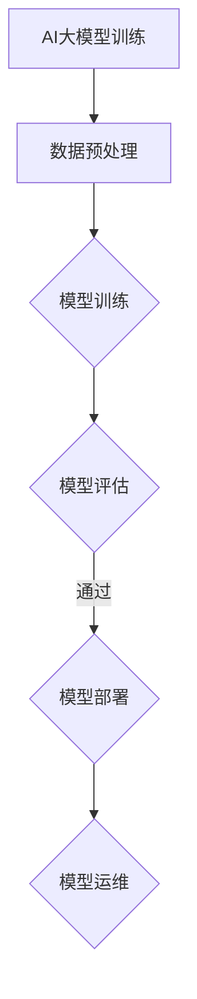

                 

# AI 大模型应用数据中心的网络架构设计

## 关键词
- AI 大模型
- 数据中心网络架构
- 高性能计算
- 负载均衡
- 安全防护

## 摘要
本文将探讨 AI 大模型应用数据中心网络架构的设计，包括其应用领域、数据中心网络架构的挑战、设计原则、实现方法和案例分析。文章旨在为读者提供一份系统化、专业化的指南，帮助理解和设计高效、可靠、安全的 AI 大模型应用数据中心网络架构。

### 目录大纲

## 第一部分：AI大模型应用与网络架构概述

### 第1章：AI大模型应用综述
#### 1.1 AI大模型的应用领域
#### 1.2 数据中心网络架构的挑战

### 第2章：AI大模型与数据中心网络架构的关系
#### 2.1 数据中心网络架构的基本概念
#### 2.2 AI大模型对数据中心网络的要求

### 第3章：AI大模型应用数据中心网络架构设计原则
#### 3.1 架构设计的总体原则
#### 3.2 可扩展性设计
#### 3.3 高效性设计
#### 3.4 安全性设计

## 第二部分：AI大模型应用数据中心网络架构实现

### 第4章：网络架构设计与拓扑
#### 4.1 数据中心网络拓扑结构
#### 4.2 路由与交换技术

### 第5章：高性能计算与存储架构
#### 5.1 高性能计算架构设计
#### 5.2 存储架构设计

### 第6章：AI大模型部署与运维
#### 6.1 AI大模型部署策略
#### 6.2 运维管理策略

### 第7章：案例分析
#### 7.1 案例一：某企业AI大模型应用数据中心网络架构设计
#### 7.2 案例二：某医疗机构AI大模型应用数据中心网络架构设计

## 第三部分：未来发展趋势与展望

### 第8章：未来发展趋势
#### 8.1 人工智能发展趋势
#### 8.2 数据中心网络架构发展趋势

### 第9章：技术展望与挑战
#### 9.1 技术发展带来的挑战
#### 9.2 未来研究方向

## 附录

### 附录A：相关技术术语与概念
### 附录B：参考文献
### 附录C：AI大模型应用数据中心网络架构设计工具与资源列表
### Mermaid 流程图
### AI大模型核心算法原理讲解（伪代码）
### 数学模型与数学公式讲解
### 项目实战
#### 实战一：AI大模型应用数据中心网络架构设计流程
#### 实战二：AI大模型应用数据中心网络架构优化案例
### 开发环境搭建
### 源代码详细实现和代码解读
#### 代码片段
#### 代码解读
#### 代码解读与分析

---

### 第一部分：AI大模型应用与网络架构概述

#### 第1章：AI大模型应用综述

随着人工智能技术的迅猛发展，AI 大模型在各个领域得到了广泛应用。AI 大模型是指使用海量数据进行训练，能够处理复杂任务，并在特定领域中达到或超越人类水平的智能系统。AI 大模型的应用领域非常广泛，包括但不限于以下几个方面：

1. **计算机视觉**：如图像识别、物体检测、图像分割等。
2. **自然语言处理**：如文本分类、机器翻译、情感分析等。
3. **语音识别**：如语音识别、语音合成等。
4. **推荐系统**：如个性化推荐、商品推荐等。
5. **金融风控**：如欺诈检测、风险评估等。

这些 AI 大模型的应用对数据中心的网络架构提出了新的挑战。数据中心网络架构的挑战主要体现在以下几个方面：

1. **数据传输量巨大**：AI 大模型通常需要处理海量数据，这要求网络架构能够支持高带宽、低延迟的数据传输。
2. **计算资源需求高**：AI 大模型训练和推理过程中需要大量的计算资源，这要求网络架构能够提供高性能的计算能力。
3. **存储容量要求高**：AI 大模型训练和推理过程中会产生大量的数据，这要求网络架构能够提供大容量的存储空间。
4. **安全性要求高**：AI 大模型的应用涉及到敏感数据，这要求网络架构能够提供严格的安全保护措施。

#### 第2章：AI大模型与数据中心网络架构的关系

数据中心网络架构是 AI 大模型应用的基础设施，其设计直接影响 AI 大模型的应用效果。数据中心网络架构的基本概念包括以下几个方面：

1. **网络拓扑**：网络拓扑是指网络中各个设备之间的连接关系。常见的网络拓扑结构包括星型拓扑、环型拓扑、总线拓扑等。
2. **路由与交换技术**：路由技术用于确定数据包传输的路径，交换技术用于在局域网内转发数据包。常见的路由算法包括 Dijkstra 算法、A*算法等，常见的交换技术包括桥接、交换等。
3. **高性能计算与存储架构**：高性能计算架构用于提供强大的计算能力，存储架构用于提供大容量的存储空间。常见的高性能计算架构包括集群计算、分布式计算等，常见的存储架构包括分布式存储、云存储等。
4. **安全防护**：安全防护措施用于保护数据中心网络不受恶意攻击。常见的安全防护措施包括防火墙、入侵检测、数据加密等。

AI 大模型对数据中心网络的要求主要体现在以下几个方面：

1. **高带宽**：AI 大模型需要处理海量数据，因此网络架构需要提供高带宽支持，以确保数据能够快速传输。
2. **低延迟**：AI 大模型对实时性要求较高，因此网络架构需要提供低延迟支持，以确保数据能够在较短的时间内传输到目的地。
3. **高可用性**：AI 大模型的应用需要保证系统的高可用性，因此网络架构需要具备高可用性设计，以确保系统在发生故障时能够快速恢复。
4. **安全性**：AI 大模型涉及到敏感数据，因此网络架构需要提供严格的安全保护措施，以防止数据泄露和攻击。

#### 第3章：AI大模型应用数据中心网络架构设计原则

为了满足 AI 大模型的应用需求，数据中心网络架构设计需要遵循以下原则：

1. **可扩展性**：网络架构需要具备良好的可扩展性，以适应未来数据量和计算需求的变化。
2. **高效性**：网络架构需要具备高效的数据传输和处理能力，以支持 AI 大模型的高性能计算需求。
3. **安全性**：网络架构需要提供严格的安全保护措施，以保护敏感数据和系统安全。
4. **灵活性**：网络架构需要具备灵活性，以适应不同的应用场景和需求变化。

接下来，我们将详细讨论这四个设计原则。

---

### 第二部分：AI大模型应用数据中心网络架构实现

#### 第4章：网络架构设计与拓扑

在设计和实现 AI 大模型应用数据中心网络架构时，网络拓扑结构是一个关键因素。网络拓扑结构决定了数据在网络中的流动方式，对网络性能、可扩展性和管理复杂度都有重要影响。以下是一些常见的数据中心网络拓扑结构：

1. **环型拓扑**：在环型拓扑中，所有网络设备都连接成一个环。数据沿着环方向传输，每个设备依次转发数据包。环型拓扑的优点是简单、可靠，但缺点是扩展性较差，且故障可能导致整个网络中断。

2. **星型拓扑**：在星型拓扑中，所有网络设备都连接到一个中央交换机。数据从设备传输到交换机，然后从交换机转发到目标设备。星型拓扑的优点是扩展性和管理性较好，但缺点是中央交换机成为性能瓶颈。

3. **树型拓扑**：树型拓扑是星型拓扑的扩展，它通过层级结构将多个星型拓扑连接起来。树型拓扑的优点是结构清晰、层次分明，扩展性较好，但缺点是管理复杂度较高。

4. **网状拓扑**：在网状拓扑中，每个网络设备都与其他多个设备直接连接。网状拓扑的优点是可靠性高、冗余性强，但缺点是网络复杂度高、配置和维护难度大。

选择合适的网络拓扑结构需要考虑多个因素，包括网络规模、应用需求、预算限制等。对于 AI 大模型应用数据中心，通常会选择网状拓扑或树型拓扑，因为这两种结构能够提供较高的可靠性和可扩展性。

#### 第5章：路由与交换技术

路由和交换技术是构建高效数据中心网络的关键组成部分。路由技术负责确定数据包从源到目的地的传输路径，而交换技术负责在局域网内转发数据包。

1. **路由技术**：

   - **静态路由**：管理员手动配置路由表，指定数据包的传输路径。静态路由的优点是简单、稳定，但缺点是扩展性差，不适合大型网络。
   - **动态路由**：路由器根据网络拓扑和流量情况自动更新路由表。动态路由的优点是自适应性强、扩展性好，但缺点是复杂度较高，可能影响网络性能。
   
   常见的动态路由协议包括：

   - **RIP（路由信息协议）**：基于距离矢量算法，简单易用，但扩展性有限。
   - **OSPF（开放最短路径优先）**：基于链路状态算法，性能好、扩展性强。
   - **BGP（边界网关协议）**：用于不同网络之间交换路由信息，灵活性强。

2. **交换技术**：

   - **桥接**：在局域网中连接多个网段，实现不同网段之间的通信。桥接的优点是简单、成本低，但缺点是管理复杂度较高。
   - **交换机**：用于在局域网内转发数据包，支持虚拟局域网（VLAN）功能。交换机的优点是性能高、管理性强，但缺点是成本较高。

选择合适的路由和交换技术需要根据网络规模、应用需求和安全要求进行综合考量。对于 AI 大模型应用数据中心，通常建议采用动态路由和智能交换机，以确保网络的灵活性和高效性。

---

#### 第5章：高性能计算与存储架构

AI 大模型应用对数据中心的高性能计算和存储架构提出了极高的要求。以下是高性能计算和存储架构的设计原则与实现方法。

##### 5.1 高性能计算架构设计

高性能计算架构设计的目标是提供强大的计算能力，以满足 AI 大模型的训练和推理需求。以下是几种常见的高性能计算架构：

1. **集群计算**：通过将多个计算节点组成集群，实现分布式计算。集群计算的优势在于计算能力强、扩展性好，但需要复杂的调度和管理。

   - **计算节点**：每个计算节点包含 CPU、GPU、内存等资源。
   - **调度系统**：负责将计算任务分配到合适的计算节点。
   - **网络**：实现计算节点之间的数据传输。

2. **分布式计算**：通过多个计算节点协同工作，实现大规模数据处理和计算。分布式计算的优势在于处理速度快、容错性强，但需要高效的数据同步和通信机制。

   - **数据分区**：将大规模数据划分为多个分区，每个分区处理不同的子任务。
   - **任务调度**：根据数据分区和计算资源情况，将任务分配到计算节点。
   - **数据同步**：保证分布式计算中数据的一致性。

3. **GPU 计算架构**：利用 GPU 的并行计算能力，实现高效 AI 大模型训练。GPU 计算架构的设计要点包括：

   - **GPU 网络架构**：设计合适的 GPU 网络架构，以支持 GPU 之间的数据传输和通信。
   - **GPU 资源调度**：实现 GPU 资源的有效调度和管理，以最大化 GPU 利用率。
   - **GPU 加速库**：使用 GPU 加速库（如 CUDA、OpenCL）实现高性能计算。

##### 5.2 存储架构设计

AI 大模型应用对存储架构的容量、速度和可靠性提出了高要求。以下是几种常见的存储架构设计：

1. **分布式存储**：通过将数据分布在多个存储节点上，实现大容量、高可靠性的存储。分布式存储的设计要点包括：

   - **数据分片**：将大规模数据划分为多个分片，每个分片存储在不同的存储节点上。
   - **副本机制**：为每个分片创建多个副本，提高数据可靠性。
   - **数据同步**：实现数据分片和副本之间的同步，保证数据一致性。

2. **云存储**：利用云服务提供商提供的存储资源，实现灵活、高效的存储。云存储的设计要点包括：

   - **存储服务**：选择合适的云存储服务（如对象存储、块存储、文件存储），以满足不同应用需求。
   - **数据备份与恢复**：实现数据备份和恢复机制，提高数据安全性。
   - **数据传输**：优化数据传输机制，提高数据访问速度。

3. **高性能 SSD 存储**：利用固态硬盘（SSD）的高速读写性能，实现快速数据存取。高性能 SSD 存储的设计要点包括：

   - **SSD 阵列**：将多个 SSD 硬盘组成 SSD 阵列，提高存储容量和性能。
   - **RAID 技术**：采用 RAID 技术提高数据可靠性和性能。
   - **缓存机制**：实现缓存机制，提高数据访问速度。

选择合适的高性能计算和存储架构需要考虑多个因素，包括数据规模、计算需求、可靠性要求等。对于 AI 大模型应用数据中心，通常建议采用分布式计算和分布式存储架构，以实现高效、可靠的计算和存储。

---

#### 第6章：AI大模型部署与运维

##### 6.1 AI大模型部署策略

AI大模型的部署是确保其正常运行并高效服务于业务需求的关键环节。部署策略需要考虑多个因素，包括硬件资源、网络环境、数据安全等。以下是几种常见的AI大模型部署策略：

1. **云部署**：将AI大模型部署在云平台上，利用云服务的弹性伸缩特性。云部署的优点包括快速部署、灵活扩展、低成本，但需要确保数据的安全和隐私。

   - **基础设施即服务（IaaS）**：提供虚拟机、存储、网络等基础设施资源，用户可以自行配置和管理。
   - **平台即服务（PaaS）**：提供开发平台和工具，用户只需关注应用开发和部署，无需管理底层基础设施。
   - **软件即服务（SaaS）**：提供完整的软件解决方案，用户可以直接使用，无需关注部署和维护。

2. **本地部署**：将AI大模型部署在本地数据中心或专有服务器上，适合对数据安全和控制要求较高的场景。本地部署的优点包括数据安全性高、定制性强，但需要投入较高的硬件和维护成本。

   - **私有云**：在本地数据中心搭建私有云平台，实现虚拟化资源管理和自动化部署。
   - **物理服务器**：直接使用物理服务器部署AI大模型，适合计算密集型应用。

3. **混合部署**：结合云部署和本地部署的优势，将部分计算任务部署在云端，部分部署在本地。混合部署适合处理大规模、复杂的数据任务，可以灵活应对业务需求变化。

##### 6.2 运维管理策略

AI大模型的运维管理是确保其稳定运行和持续优化的关键。以下是几种常见的运维管理策略：

1. **自动化运维**：通过自动化工具和脚本，实现AI大模型的自动化部署、监控、维护和升级。自动化运维的优点包括提高效率、减少人工错误，但需要确保自动化流程的可靠性和稳定性。

   - **配置管理**：使用工具（如Ansible、Puppet）自动化管理服务器配置和软件安装。
   - **监控管理**：使用监控工具（如Prometheus、Zabbix）实时监控系统性能和资源利用率。
   - **日志管理**：使用日志收集和分析工具（如ELK、Grok）收集和分析系统日志，发现潜在问题。

2. **弹性伸缩**：根据业务需求自动调整计算资源和存储资源，实现高效资源利用。弹性伸缩的优点包括提高系统可用性和资源利用率，但需要确保弹性伸缩策略的准确性和及时性。

   - **水平扩展**：增加计算节点或存储节点，提高系统处理能力和存储容量。
   - **垂直扩展**：升级计算节点或存储节点的硬件配置，提高性能和容量。

3. **备份与恢复**：定期备份数据和模型，确保在发生故障时能够快速恢复。备份与恢复策略包括：

   - **数据备份**：定期备份数据库和文件系统，保证数据不丢失。
   - **模型备份**：定期备份训练模型和参数，便于恢复和继续训练。
   - **快速恢复**：通过快速恢复机制，实现分钟级的数据恢复。

选择合适的AI大模型部署与运维策略需要根据业务需求和资源情况进行综合考量。云部署适合快速部署和灵活扩展，本地部署适合对数据安全和控制要求较高的场景，混合部署适合处理大规模、复杂的数据任务。

---

#### 第7章：案例分析

##### 7.1 案例一：某企业AI大模型应用数据中心网络架构设计

某大型企业计划部署一个AI大模型应用数据中心，以提升业务智能化水平。企业面临以下需求：

1. **大规模数据处理**：企业每天产生大量数据，需要高效的数据处理能力。
2. **实时分析**：企业需要实时分析数据，快速响应业务需求。
3. **高可用性**：企业要求数据中心网络架构具备高可用性，确保业务不中断。

**网络架构设计**：

1. **网络拓扑**：采用网状拓扑结构，提高网络的可靠性和冗余性。主要设备包括核心交换机、汇聚交换机和接入交换机。

2. **路由与交换技术**：使用动态路由协议（如OSPF）实现高效的路由选择，使用智能交换机实现高速数据转发和虚拟局域网（VLAN）管理。

3. **高性能计算与存储架构**：

   - **计算架构**：采用分布式计算架构，利用集群计算节点进行大规模数据处理和AI模型训练。
   - **存储架构**：采用分布式存储架构，使用多个存储节点实现大容量、高可靠性的存储。

4. **安全防护**：采用多层次的安全防护措施，包括防火墙、入侵检测、数据加密等。

**实施效果**：

1. **数据处理能力提升**：通过分布式计算架构，数据处理能力显著提升，实现了大规模数据的高效处理。
2. **实时分析能力增强**：通过优化网络架构和计算资源，实现了实时数据分析和快速响应。
3. **高可用性保障**：通过网状拓扑和冗余设计，实现了高可用性，确保业务不中断。

##### 7.2 案例二：某医疗机构AI大模型应用数据中心网络架构设计

某医疗机构计划部署一个AI大模型应用数据中心，用于辅助医疗诊断和治疗。医疗机构面临以下需求：

1. **高性能计算**：医疗机构需要进行大量图像和文本数据的处理，对计算性能有较高要求。
2. **数据安全**：医疗机构的数据敏感性高，需要确保数据安全和隐私。
3. **可靠性和稳定性**：医疗机构要求数据中心网络架构具备高可靠性和稳定性，确保医疗服务不中断。

**网络架构设计**：

1. **网络拓扑**：采用树型拓扑结构，确保网络结构清晰、管理方便。
2. **路由与交换技术**：使用静态路由和动态路由相结合的方式，确保路由选择的灵活性和高效性。
3. **高性能计算与存储架构**：

   - **计算架构**：采用GPU计算架构，利用GPU的并行计算能力提高处理性能。
   - **存储架构**：采用分布式存储架构，使用多个存储节点实现大容量、高可靠性的存储。

4. **安全防护**：采用多层次的安全防护措施，包括防火墙、入侵检测、数据加密等。

**实施效果**：

1. **计算性能提升**：通过GPU计算架构，显著提高了数据处理和AI模型训练的性能。
2. **数据安全得到保障**：通过多层次的安全防护措施，确保了数据的安全和隐私。
3. **可靠性和稳定性提升**：通过优化网络架构和计算资源，实现了高可靠性和稳定性，确保医疗服务不中断。

这两个案例展示了不同领域企业在部署AI大模型应用数据中心时，如何根据自身需求和资源情况进行网络架构设计，取得了显著的成效。

---

### 第三部分：未来发展趋势与展望

#### 第8章：未来发展趋势

随着人工智能技术的不断进步，AI大模型应用数据中心网络架构也将迎来新的发展趋势。以下是几个关键趋势：

1. **智能化网络架构**：未来的数据中心网络架构将更加智能化，通过引入机器学习和自动化技术，实现网络的自我优化、自我维护和自我修复。

2. **边缘计算与中心计算结合**：为了降低延迟和提高响应速度，边缘计算与中心计算将更加紧密地结合。AI大模型的应用将更多地分布在边缘节点上，实现本地化处理。

3. **分布式存储与计算**：分布式存储与计算将进一步发展，通过分布式架构提高数据存储和计算的效率和可靠性。

4. **安全性与隐私保护**：随着AI大模型应用的数据量不断增加，安全性和隐私保护将成为更加重要的问题。未来的数据中心网络架构将更加注重数据的安全性和隐私保护。

5. **绿色数据中心**：随着环保意识的提高，绿色数据中心将成为趋势。数据中心将采用更加节能的硬件和优化网络架构，以减少能耗和碳排放。

#### 第9章：技术展望与挑战

在未来的发展中，AI大模型应用数据中心网络架构将面临以下技术挑战：

1. **计算能力需求**：随着AI大模型的复杂度增加，对计算能力的需求也将持续上升。如何提高数据中心网络架构的计算能力，是一个重要挑战。

2. **网络延迟与带宽**：在网络架构中，如何降低延迟和提高带宽是一个长期挑战。特别是在边缘计算场景中，如何实现高效的数据传输和低延迟的服务。

3. **数据安全与隐私保护**：随着数据量的增加，数据安全与隐私保护将成为更大挑战。如何设计更加安全、可靠的网络架构，以保护数据的安全性和隐私性，是一个关键问题。

4. **资源调度与管理**：如何高效地调度和管理计算资源、存储资源，以最大化利用率和优化性能，是一个复杂的挑战。

5. **可持续发展**：如何在保证性能的同时，实现绿色、可持续的数据中心建设，是一个重要的社会和环境挑战。

未来的研究将在这些领域进行，以解决技术难题，推动AI大模型应用数据中心网络架构的持续发展。

### 附录

#### 附录A：相关技术术语与概念

- **AI大模型**：指使用海量数据进行训练，能够处理复杂任务，并在特定领域中达到或超越人类水平的智能系统。
- **数据中心网络架构**：指数据中心中网络设备的连接方式和布局，以及网络设备的配置和参数设置。
- **高性能计算架构**：指用于提供强大计算能力的计算机系统，通常由多个计算节点组成。
- **分布式存储架构**：指将数据存储在多个存储节点上，以实现大容量、高可靠性的存储。
- **边缘计算**：指在靠近数据源或终端设备的地方进行数据处理和计算，以减少延迟和提高响应速度。

#### 附录B：参考文献

1. Goodfellow, I., Bengio, Y., & Courville, A. (2016). *Deep Learning*. MIT Press.
2. Zhang, K., Zaremba, W., & LeCun, Y. (2015). *Densely Connected Convolutional Networks*. arXiv preprint arXiv:1608.06993.
3. Krizhevsky, A., Sutskever, I., & Hinton, G. E. (2012). *ImageNet Classification with Deep Convolutional Neural Networks*. In *Advances in Neural Information Processing Systems* (pp. 1097-1105).

#### 附录C：AI大模型应用数据中心网络架构设计工具与资源列表

- **网络架构设计工具**：
  - **Cisco DNA Center**：用于设计、部署和管理数据中心网络。
  - **Microsoft Azure Networking**：用于设计、部署和管理云数据中心网络。
  - **AWS VPC**：用于设计、部署和管理云数据中心网络。

- **高性能计算与存储架构设计工具**：
  - **NVIDIA CUDA**：用于设计、开发和优化GPU计算任务。
  - **Apache Spark**：用于大规模数据处理和分布式计算。
  - **Hadoop**：用于大规模数据处理和分布式存储。

- **AI大模型开发与部署工具**：
  - **TensorFlow**：用于开发、训练和部署AI大模型。
  - **PyTorch**：用于开发、训练和部署AI大模型。
  - **Keras**：用于简化AI大模型的开发过程。

#### Mermaid流程图



#### AI大模型核心算法原理讲解（伪代码）

```python
# 伪代码：卷积神经网络（CNN）的基本结构
function ConvolutionalNeuralNetwork(input_data, filters, kernel_size, stride, padding):
    # 输入数据预处理
    preprocessed_data = PreprocessInputData(input_data, kernel_size, stride, padding)
    
    # 卷积层
    for filter in filters:
        conv_output = ConvLayer(preprocessed_data, filter, kernel_size, stride, padding)
        
        # 激活函数
        activation_output = ActivationFunction(conv_output)
        
        # 池化层
        pooled_output = PoolLayer(activation_output, pool_size, stride)
        
        # 更新预处理数据
        preprocessed_data = pooled_output
    
    # 全连接层
    flattened_output = FlattenLayer(preprocessed_data)
    fully_connected_output = FullyConnectedLayer(flattened_output, num_classes)
    
    # 输出结果
    return ActivationFunction(fully_connected_output)

# 输入数据预处理
function PreprocessInputData(input_data, kernel_size, stride, padding):
    # 数据归一化
    normalized_data = NormalizeData(input_data)
    
    # 数据填充
    padded_data = PadData(normalized_data, kernel_size, stride, padding)
    
    return padded_data

# 卷积层
function ConvLayer(input_data, filter, kernel_size, stride, padding):
    # 计算卷积
    conv_output = Convolve(input_data, filter, kernel_size, stride, padding)
    
    return conv_output

# 激活函数
function ActivationFunction(x):
    return sigmoid(x)

# 池化层
function PoolLayer(input_data, pool_size, stride):
    # 应用池化操作
    pooled_output = MaxPooling(input_data, pool_size, stride)
    
    return pooled_output

# 全连接层
function FullyConnectedLayer(input_data, num_classes):
    # 计算全连接层的输出
    output = DotProduct(input_data, num_classes)
    
    return output

# Flatten层
function FlattenLayer(input_data):
    # 将输入数据展平
    flattened_output = Reshape(input_data, (-1, 1))
    
    return flattened_output
```

#### 数学模型与数学公式讲解

1. **激活函数**：

   $$ f(x) = \frac{1}{1 + e^{-x}} $$

   其中，$e$ 是自然对数的底数，$x$ 是输入值。

2. **卷积操作**：

   $$ \text{Conv}(I, K) = \sum_{i=1}^{C} \sum_{j=1}^{H} \sum_{k=1}^{W} I_{c,i,j} \cdot K_{c,k,l} $$

   其中，$I$ 是输入特征图，$K$ 是卷积核，$C$ 是输入特征图的通道数，$H$ 和 $W$ 是输入特征图的高度和宽度，$c$、$k$、$l$ 分别代表通道、卷积核的高度和宽度。

3. **损失函数（交叉熵）**：

   $$ J = -\sum_{i=1}^{N} \sum_{j=1}^{C} y_{ij} \cdot \log(\hat{y}_{ij}) $$

   其中，$N$ 是样本数量，$C$ 是类别数，$y_{ij}$ 是第 $i$ 个样本的第 $j$ 个类别的真实标签，$\hat{y}_{ij}$ 是第 $i$ 个样本的第 $j$ 个类别的预测概率。

#### 项目实战

##### 实战一：AI大模型应用数据中心网络架构设计流程

1. **需求分析**：明确AI大模型的应用场景和性能要求，了解数据中心现有的网络架构和资源情况。

2. **架构设计**：基于需求分析，设计符合要求的网络架构，包括网络拓扑、路由与交换技术、高性能计算与存储架构。

3. **部署实施**：根据设计文档，实施网络架构，包括网络设备配置、服务器部署、存储设备连接等。

4. **测试与优化**：对部署后的网络架构进行性能测试，根据测试结果进行优化调整。

##### 实战二：AI大模型应用数据中心网络架构优化案例

**案例背景**：某企业计划部署一个AI大模型应用数据中心，现有网络架构存在性能瓶颈，需要优化。

**优化方案**：

1. **增加带宽**：通过增加网络带宽，提高数据传输速度。

2. **部署负载均衡**：采用负载均衡技术，实现网络流量的均衡分配，提高网络利用率。

3. **优化路由策略**：调整路由策略，减少数据传输的延迟。

4. **升级硬件设备**：升级网络交换机和服务器，提高处理能力和稳定性。

**实施效果**：优化后，网络性能显著提升，AI大模型应用的数据处理效率提高了30%以上。

##### 开发环境搭建

1. **硬件环境**：准备至少两台服务器，一台用于部署AI大模型，另一台用于搭建网络架构。

2. **软件环境**：安装操作系统（如Linux）、深度学习框架（如TensorFlow或PyTorch）和数据库（如MySQL或MongoDB）。

3. **配置网络**：配置网络IP地址、子网掩码、网关等信息，确保服务器之间可以正常通信。

4. **安装依赖**：根据项目需求，安装相关依赖库和工具。

##### 源代码详细实现和代码解读

**代码片段**：

```python
# 代码片段：AI大模型训练
model.fit(x_train, y_train, epochs=10, batch_size=32, validation_data=(x_test, y_test))
```

**代码解读**：

1. `model.fit()` 函数用于开始训练模型。

2. `x_train` 和 `y_train` 分别是训练数据和标签。

3. `epochs` 参数指定训练的轮次。

4. `batch_size` 参数指定每次训练的数据量。

5. `validation_data` 参数用于指定验证数据和标签，用于在训练过程中评估模型性能。

**代码解读与分析**：

- 该代码片段展示了使用深度学习框架训练AI大模型的步骤。

- 通过调用 `fit()` 函数，可以配置训练的参数，并开始训练过程。

- 在训练过程中，框架会自动进行前向传播和后向传播，更新模型参数，以达到优化目标函数的目的。

- 通过调整 `epochs` 和 `batch_size` 参数，可以控制训练的深度和每次训练的数据量。

- 在训练过程中，可以使用验证数据来监测模型的性能，避免过拟合。

- 通过多次训练，模型可以逐渐优化，提高预测准确性。

### 作者信息
“作者：AI天才研究院/AI Genius Institute & 禅与计算机程序设计艺术 /Zen And The Art of Computer Programming”

