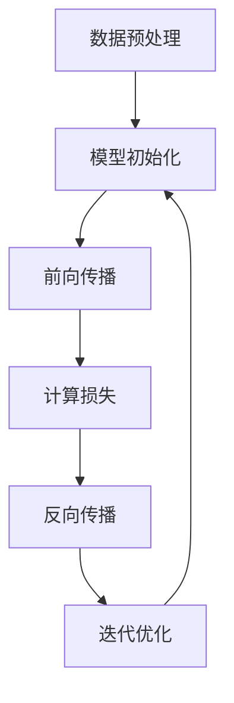

                 

# 《AI 大模型应用最佳实践》

> 关键词：人工智能，大模型，深度学习，应用实践，最佳案例

> 摘要：本文将深入探讨人工智能（AI）领域中的大模型应用，从基础理论到实践案例，全面解析AI大模型的原理、开发工具、应用场景及最佳实践。文章旨在帮助开发者更好地理解和应用AI大模型，推动其在实际项目中的高效落地。

### 《AI 大模型应用最佳实践》目录大纲

#### 第一部分：大模型基础

**第1章：AI大模型概述**

- **1.1 AI大模型的概念**
  - **定义与类型**
  - **特点与应用场景**

- **1.2 大模型核心架构**
  - **神经网络基础**
  - **预训练与微调**
  - **Mermaid流程图：大模型训练过程**

- **1.3 大模型数学基础**
  - **损失函数与优化器**
  - **数学公式：前向传播与反向传播**
  - **举例说明：线性回归与神经网络**

**第2章：核心算法原理**

- **2.1 GPT模型**
  - **算法原理**
  - **伪代码实现**

- **2.2 Transformer模型**
  - **算法原理**
  - **伪代码实现**

- **2.3 BERT模型**
  - **算法原理**
  - **伪代码实现**

**第3章：大模型评估与优化**

- **3.1 评估指标**
  - **准确率、召回率、F1值等**

- **3.2 优化策略**
  - **超参数调优**
  - **数据增强**

**第4章：大模型开发工具与框架**

- **4.1 TensorFlow**
  - **环境搭建与基本操作**

- **4.2 PyTorch**
  - **环境搭建与基本操作**

- **4.3 JAX**
  - **环境搭建与基本操作**

#### 第二部分：应用实践

**第5章：文本生成与应用**

- **5.1 文本生成原理**
  - **GPT、BERT等模型在文本生成中的应用**

- **5.2 应用案例**
  - **聊天机器人**
  - **自动摘要**

**第6章：图像识别与应用**

- **6.1 图像识别原理**
  - **卷积神经网络（CNN）在图像识别中的应用**

- **6.2 应用案例**
  - **人脸识别**
  - **图像分类**

**第7章：语音识别与应用**

- **7.1 语音识别原理**
  - **循环神经网络（RNN）在语音识别中的应用**

- **7.2 应用案例**
  - **语音助手**
  - **实时语音翻译**

**第8章：大模型项目实战**

- **8.1 项目规划与实施**
  - **项目需求分析**
  - **数据准备与处理**

- **8.2 代码实现与解读**
  - **深度学习模型开发**
  - **代码分析**

- **8.3 性能评估与优化**
  - **评估指标**
  - **性能优化策略**

#### 第三部分：最佳实践

**第9章：大模型应用趋势**

- **9.1 当前应用热点**
  - **推荐系统**
  - **自然语言处理**
  - **计算机视觉**

- **9.2 未来发展趋势**
  - **边缘计算**
  - **联邦学习**
  - **混合智能**

**第10章：大模型应用案例解析**

- **10.1 案例一：电商平台推荐系统**
  - **系统架构**
  - **算法实现**

- **10.2 案例二：智能医疗诊断系统**
  - **系统架构**
  - **算法实现**

- **10.3 案例三：自动驾驶系统**
  - **系统架构**
  - **算法实现**

#### 附录

**附录A：开发资源与工具**

- **A.1 深度学习框架对比**
  - **TensorFlow**
  - **PyTorch**
  - **其他框架简介**

- **A.2 开发工具与资源推荐**
  - **开源代码库**
  - **在线教程**
  - **社区与论坛**

---

### 第一部分：大模型基础

#### 第1章：AI大模型概述

##### 1.1 AI大模型的概念

人工智能（AI）大模型是指那些参数量庞大、结构复杂，能够处理海量数据，并且具备高度抽象和泛化能力的神经网络模型。这类模型通常具有以下几个特点：

- **参数量巨大**：大模型的参数量通常达到数十亿甚至上百亿，这使得模型具有更强的表征能力和学习效果。
- **多层神经网络结构**：大模型通常包含多个隐藏层，能够对输入数据进行多层次的抽象和特征提取。
- **预训练与微调**：大模型通常首先在大型数据集上进行预训练，然后针对特定任务进行微调，以实现高精度的任务表现。

大模型的应用场景非常广泛，包括但不限于自然语言处理、计算机视觉、语音识别、推荐系统等领域。以下是一些典型的大模型类型：

1. **自然语言处理模型**：如GPT、BERT、T5等，主要用于文本生成、问答系统、翻译等任务。
2. **计算机视觉模型**：如ResNet、Inception、VGG等，主要用于图像分类、目标检测、人脸识别等任务。
3. **语音识别模型**：如DeepSpeech、WaveNet等，主要用于语音到文本的转换。

##### 1.2 大模型核心架构

大模型的核心架构通常包含以下几个关键组成部分：

1. **输入层**：接收原始数据，如文本、图像、语音等。
2. **隐藏层**：用于对输入数据进行特征提取和抽象。大模型的隐藏层数量通常较多，以实现更高的抽象层次。
3. **输出层**：生成模型预测结果，如分类标签、文本生成等。
4. **损失函数**：用于衡量模型预测结果与真实结果之间的差距，是模型训练的核心目标。
5. **优化器**：用于调整模型参数，以最小化损失函数。

大模型的训练过程通常包括以下几个步骤：

1. **数据预处理**：对输入数据进行标准化、分割等处理，以便模型更好地学习。
2. **模型初始化**：随机初始化模型参数。
3. **前向传播**：将输入数据传递到模型中，计算出预测结果。
4. **计算损失**：利用损失函数计算预测结果与真实结果之间的差距。
5. **反向传播**：根据损失函数的梯度，更新模型参数。
6. **迭代优化**：重复上述步骤，直至模型收敛。

以下是使用Mermaid绘制的AI大模型训练过程流程图：



##### 1.3 大模型数学基础

大模型的数学基础主要包括损失函数、优化器以及前向传播和反向传播算法。

1. **损失函数**：损失函数用于衡量模型预测结果与真实结果之间的差距。常用的损失函数包括均方误差（MSE）、交叉熵损失（Cross Entropy Loss）等。以下是均方误差（MSE）的数学公式：

   $$ 
   \text{MSE} = \frac{1}{n}\sum_{i=1}^{n}(\hat{y}_i - y_i)^2 
   $$

   其中，$\hat{y}_i$表示模型预测结果，$y_i$表示真实结果，$n$表示样本数量。

2. **优化器**：优化器用于调整模型参数，以最小化损失函数。常用的优化器包括随机梯度下降（SGD）、Adam等。以下是Adam优化器的参数更新公式：

   $$ 
   \begin{aligned}
   &m_t = \beta_1 m_{t-1} + (1 - \beta_1)(\nabla\theta_{t-1}) \\
   &v_t = \beta_2 v_{t-1} + (1 - \beta_2)(\nabla\theta_{t-1})^2 \\
   &\theta_t = \theta_{t-1} - \alpha \frac{m_t}{\sqrt{v_t} + \epsilon} \\
   \end{aligned} 
   $$

   其中，$m_t$和$v_t$分别表示一阶矩估计和二阶矩估计，$\beta_1$、$\beta_2$分别为一阶矩和二阶矩的指数衰减率，$\alpha$为学习率，$\epsilon$为常数。

3. **前向传播与反向传播**：前向传播是指将输入数据传递到模型中，计算出预测结果；反向传播是指根据损失函数的梯度，更新模型参数。

   - **前向传播**：输入数据经过模型中的各个层，最后得到预测结果。以下是线性回归的前向传播公式：

     $$
     \begin{aligned}
     z &= X\theta \\
     \hat{y} &= \sigma(z)
     \end{aligned}
     $$

     其中，$X$为输入数据，$\theta$为模型参数，$z$为中间结果，$\hat{y}$为预测结果，$\sigma$为激活函数。

   - **反向传播**：根据预测结果和真实结果，计算损失函数的梯度，然后更新模型参数。以下是线性回归的反向传播公式：

     $$
     \begin{aligned}
     \nabla\theta &= \frac{\partial\text{MSE}}{\partial\theta} \\
     &= \frac{1}{m}\sum_{i=1}^{m}(\hat{y}_i - y_i)\nabla\sigma(z_i)X^T
     \end{aligned}
     $$

     其中，$m$为样本数量，$y_i$为真实结果，$\nabla\sigma(z_i)$为激活函数的导数。

**举例说明：线性回归与神经网络**

1. **线性回归**：

   - **数据集**：有10个样本，每个样本包含1个特征和1个标签。
   - **模型**：线性回归模型，参数为$\theta$。

   线性回归模型的前向传播和反向传播过程如下：

   $$
   \begin{aligned}
   z &= X\theta \\
   \hat{y} &= \sigma(z)
   \end{aligned}
   $$

   $$
   \begin{aligned}
   \nabla\theta &= \frac{1}{m}\sum_{i=1}^{m}(\hat{y}_i - y_i)\nabla\sigma(z_i)X^T
   \end{aligned}
   $$

2. **神经网络**：

   - **数据集**：有10个样本，每个样本包含1个特征和1个标签。
   - **模型**：多层感知机（MLP）模型，包含输入层、隐藏层和输出层。

   神经网络模型的前向传播和反向传播过程如下：

   $$
   \begin{aligned}
   z_1 &= X\theta_1 \\
   a_1 &= \sigma(z_1) \\
   z_2 &= a_1\theta_2 \\
   \hat{y} &= \sigma(z_2)
   \end{aligned}
   $$

   $$
   \begin{aligned}
   \nabla\theta_2 &= \frac{1}{m}\sum_{i=1}^{m}(\hat{y}_i - y_i)\nabla\sigma(z_2)a_1^T X^T \\
   \nabla\theta_1 &= \frac{1}{m}\sum_{i=1}^{m}(\nabla\sigma(z_2)\theta_2^T a_1^T X^T
   \end{aligned}
   $$

通过以上内容，我们初步了解了AI大模型的概念、核心架构以及数学基础。接下来，我们将进一步探讨大模型的核心算法原理，为后续的应用实践打下基础。

---

#### 第2章：核心算法原理

##### 2.1 GPT模型

GPT（Generative Pre-trained Transformer）模型是一种基于Transformer架构的自然语言处理模型，由OpenAI于2018年提出。GPT模型通过在大规模语料库上进行预训练，学习到了语言的统计规律和语法结构，从而能够生成高质量的自然语言文本。

**算法原理**

GPT模型的基本原理是利用Transformer模型的自注意力机制，对输入的文本序列进行编码和解码。以下是GPT模型的核心组成部分：

1. **编码器**：编码器（Encoder）用于将输入的文本序列转换为固定长度的向量表示。编码器的输出可以被用于生成文本、回答问题或进行文本分类等任务。
2. **解码器**：解码器（Decoder）用于根据编码器的输出生成文本序列。解码器利用自注意力机制，将编码器的输出与先前生成的文本序列进行交互，以生成新的文本。

以下是GPT模型的伪代码实现：

```python
# 编码器
def encoder(input_sequence, embedding_layer):
    # 输入文本序列和嵌入层
    embedded_sequence = embedding_layer(input_sequence)
    # Transformer编码器
    encoded_sequence = transformer_encoder(embedded_sequence)
    return encoded_sequence

# 解码器
def decoder(encoded_sequence, embedding_layer, decoder_layer):
    # 输入编码序列、嵌入层和解码器层
    embedded_sequence = embedding_layer(encoded_sequence)
    decoded_sequence = decoder_layer(embedded_sequence)
    return decoded_sequence

# 模型训练
def train_gpt(model, train_data, loss_function, optimizer):
    for epoch in range(num_epochs):
        for input_sequence, target_sequence in train_data:
            # 前向传播
            encoded_sequence = encoder(input_sequence, model.embedding_layer)
            decoded_sequence = decoder(encoded_sequence, model.embedding_layer, model.decoder_layer)
            # 计算损失
            loss = loss_function(target_sequence, decoded_sequence)
            # 反向传播
            model.optimizer.zero_grad()
            loss.backward()
            model.optimizer.step()
```

**算法原理讲解**

1. **嵌入层**：嵌入层（Embedding Layer）将输入的单词或字符映射为稠密向量表示。嵌入层可以通过训练学习得到，使得模型能够捕捉到单词或字符的语义信息。

2. **Transformer编码器**：Transformer编码器（Transformer Encoder）由多个自注意力层（Self-Attention Layer）和前馈网络（Feedforward Network）组成。自注意力层通过计算输入序列中每个单词与其他单词的关系，生成加权表示。前馈网络对自注意力层的输出进行进一步加工，以生成更加丰富的特征表示。

3. **解码器**：解码器（Decoder）与编码器类似，也由多个自注意力层和前馈网络组成。解码器的自注意力层不仅考虑编码器的输出，还考虑先前生成的文本序列，以生成新的文本序列。

4. **损失函数**：GPT模型的损失函数通常采用交叉熵损失（Cross Entropy Loss），用于衡量模型预测结果与真实结果之间的差距。

5. **优化器**：GPT模型的优化器通常采用Adam优化器，以高效地更新模型参数。

##### 2.2 Transformer模型

Transformer模型是一种基于自注意力机制（Self-Attention）的神经网络模型，由Vaswani等人在2017年提出。Transformer模型在序列建模任务中表现出色，如机器翻译、文本分类等。

**算法原理**

Transformer模型的核心思想是自注意力机制，通过计算输入序列中每个单词与其他单词的关系，生成加权表示。以下是Transformer模型的主要组成部分：

1. **编码器**：编码器（Encoder）由多个自注意力层（Self-Attention Layer）和前馈网络（Feedforward Network）组成。编码器用于对输入序列进行编码，生成固定长度的向量表示。

2. **解码器**：解码器（Decoder）同样由多个自注意力层和前馈网络组成。解码器的自注意力层不仅考虑编码器的输出，还考虑先前生成的文本序列，以生成新的文本序列。

3. **多头注意力**：多头注意力（Multi-Head Attention）是一种改进的自注意力机制，通过将输入序列分成多个子序列，分别计算注意力权重，最后将结果进行拼接和线性变换。多头注意力能够提高模型的表征能力。

4. **位置编码**：位置编码（Positional Encoding）用于引入输入序列的顺序信息，因为自注意力机制不考虑单词的顺序。位置编码可以通过学习得到，也可以使用固定的方法生成。

以下是Transformer模型的伪代码实现：

```python
# 编码器
def encoder(input_sequence, embedding_layer):
    # 输入文本序列和嵌入层
    embedded_sequence = embedding_layer(input_sequence)
    # 添加位置编码
    position_encoded_sequence = add_positional_encoding(embedded_sequence)
    # Transformer编码器
    encoded_sequence = transformer_encoder(position_encoded_sequence)
    return encoded_sequence

# 解码器
def decoder(encoded_sequence, embedding_layer, decoder_layer):
    # 输入编码序列、嵌入层和解码器层
    embedded_sequence = embedding_layer(encoded_sequence)
    # 添加位置编码
    position_encoded_sequence = add_positional_encoding(embedded_sequence)
    decoded_sequence = decoder_layer(position_encoded_sequence)
    return decoded_sequence

# 模型训练
def train_transformer(model, train_data, loss_function, optimizer):
    for epoch in range(num_epochs):
        for input_sequence, target_sequence in train_data:
            # 前向传播
            encoded_sequence = encoder(input_sequence, model.embedding_layer)
            decoded_sequence = decoder(encoded_sequence, model.embedding_layer, model.decoder_layer)
            # 计算损失
            loss = loss_function(target_sequence, decoded_sequence)
            # 反向传播
            model.optimizer.zero_grad()
            loss.backward()
            model.optimizer.step()
```

**算法原理讲解**

1. **嵌入层**：嵌入层（Embedding Layer）将输入的单词或字符映射为稠密向量表示。嵌入层可以通过训练学习得到，使得模型能够捕捉到单词或字符的语义信息。

2. **自注意力层**：自注意力层（Self-Attention Layer）是Transformer模型的核心组件，通过计算输入序列中每个单词与其他单词的关系，生成加权表示。自注意力层通常包含多头注意力（Multi-Head Attention）和前馈网络（Feedforward Network）。

3. **前馈网络**：前馈网络（Feedforward Network）对自注意力层的输出进行进一步加工，以生成更加丰富的特征表示。前馈网络通常包含两个全连接层，中间加入ReLU激活函数。

4. **位置编码**：位置编码（Positional Encoding）用于引入输入序列的顺序信息，因为自注意力机制不考虑单词的顺序。位置编码可以通过学习得到，也可以使用固定的方法生成。

5. **解码器**：解码器（Decoder）与编码器类似，也由多个自注意力层和前馈网络组成。解码器的自注意力层不仅考虑编码器的输出，还考虑先前生成的文本序列，以生成新的文本序列。

6. **损失函数**：Transformer模型的损失函数通常采用交叉熵损失（Cross Entropy Loss），用于衡量模型预测结果与真实结果之间的差距。

7. **优化器**：Transformer模型的优化器通常采用Adam优化器，以高效地更新模型参数。

##### 2.3 BERT模型

BERT（Bidirectional Encoder Representations from Transformers）模型是一种基于Transformer的预训练语言模型，由Google AI在2018年提出。BERT模型通过双向编码器（Bidirectional Encoder）学习到输入文本序列的前后文信息，从而提高了自然语言处理任务的效果。

**算法原理**

BERT模型的核心思想是利用Transformer编码器的双向特性，对输入的文本序列进行编码，生成固定长度的向量表示。BERT模型主要包括以下组成部分：

1. **嵌入层**：嵌入层（Embedding Layer）将输入的单词或字符映射为稠密向量表示。嵌入层包含了单词的词向量表示和位置编码（Positional Encoding）。

2. **Transformer编码器**：Transformer编码器（Transformer Encoder）由多个自注意力层（Self-Attention Layer）和前馈网络（Feedforward Network）组成。编码器的自注意力层通过计算输入序列中每个单词与其他单词的关系，生成加权表示。

3. **双向编码**：BERT模型采用了双向编码器（Bidirectional Encoder），即每个时间步的输出同时受到前面和后面单词的影响。这种双向特性使得BERT模型能够捕捉到输入文本序列的前后文信息。

以下是BERT模型的伪代码实现：

```python
# Transformer编码器
def transformer_encoder(input_sequence, num_layers):
    for _ in range(num_layers):
        # 自注意力层
        input_sequence = self_attention_layer(input_sequence)
        # 前馈网络
        input_sequence = feedforward_network(input_sequence)
    return input_sequence

# BERT模型
def bert_model(input_sequence, embedding_layer, transformer_encoder, num_layers):
    # 嵌入层
    embedded_sequence = embedding_layer(input_sequence)
    # Transformer编码器
    encoded_sequence = transformer_encoder(embedded_sequence, num_layers)
    return encoded_sequence

# 模型训练
def train_bert(model, train_data, loss_function, optimizer):
    for epoch in range(num_epochs):
        for input_sequence, target_sequence in train_data:
            # 前向传播
            encoded_sequence = bert_model(input_sequence, model.embedding_layer, model.transformer_encoder, num_layers)
            # 计算损失
            loss = loss_function(target_sequence, encoded_sequence)
            # 反向传播
            model.optimizer.zero_grad()
            loss.backward()
            model.optimizer.step()
```

**算法原理讲解**

1. **嵌入层**：嵌入层（Embedding Layer）将输入的单词或字符映射为稠密向量表示。嵌入层包含了单词的词向量表示和位置编码（Positional Encoding）。词向量表示可以从预先训练的词向量库中获取，位置编码用于引入输入序列的顺序信息。

2. **Transformer编码器**：Transformer编码器（Transformer Encoder）由多个自注意力层（Self-Attention Layer）和前馈网络（Feedforward Network）组成。编码器的自注意力层通过计算输入序列中每个单词与其他单词的关系，生成加权表示。前馈网络对自注意力层的输出进行进一步加工，以生成更加丰富的特征表示。

3. **双向编码**：BERT模型采用了双向编码器（Bidirectional Encoder），即每个时间步的输出同时受到前面和后面单词的影响。这种双向特性使得BERT模型能够捕捉到输入文本序列的前后文信息。

4. **预训练与微调**：BERT模型首先在大规模语料库上进行预训练，学习到通用语言特征。然后，在特定任务上进行微调，以适应具体任务的需求。预训练和微调的过程可以提高模型在各类自然语言处理任务上的效果。

5. **损失函数**：BERT模型的损失函数通常采用交叉熵损失（Cross Entropy Loss），用于衡量模型预测结果与真实结果之间的差距。

6. **优化器**：BERT模型的优化器通常采用Adam优化器，以高效地更新模型参数。

通过以上内容，我们深入了解了GPT、Transformer和BERT三种核心算法原理。这些算法在自然语言处理、文本生成等领域取得了显著的成果，为AI大模型的应用提供了强大的理论基础。

在接下来的章节中，我们将探讨如何评估和优化大模型的性能，并介绍几种流行的深度学习框架和开发工具。

---

#### 第3章：大模型评估与优化

##### 3.1 评估指标

大模型的评估与优化是深度学习任务中至关重要的环节。为了确保模型具有良好的性能和泛化能力，我们需要选择合适的评估指标。以下是几种常用的评估指标：

1. **准确率（Accuracy）**：准确率是指模型预测正确的样本数占总样本数的比例。对于分类任务，准确率是最直观的评估指标。然而，准确率在某些情况下可能具有误导性，特别是在类别不平衡的数据集中。例如，一个模型在预测中只预测了多数类，尽管整体准确率高，但实际上未能有效识别少数类样本。

   $$
   \text{Accuracy} = \frac{\text{预测正确的样本数}}{\text{总样本数}}
   $$

2. **召回率（Recall）**：召回率是指模型能够正确识别出真实正例样本的比例。召回率在处理少数类问题时尤为重要，因为高召回率意味着模型能够尽可能多地识别出真实正例。

   $$
   \text{Recall} = \frac{\text{预测正确的正例样本数}}{\text{真实正例样本数}}
   $$

3. **精确率（Precision）**：精确率是指模型预测为正例的样本中，实际为正例的比例。精确率关注的是模型的预测质量，尤其在处理假正例成本较高的任务中，如医学诊断。

   $$
   \text{Precision} = \frac{\text{预测正确的正例样本数}}{\text{预测为正例的样本数}}
   $$

4. **F1值（F1 Score）**：F1值是精确率和召回率的调和平均值，综合考量了模型的精确性和召回率。F1值在类别不平衡的数据集中是一个更为全面的评估指标。

   $$
   \text{F1 Score} = 2 \times \frac{\text{Precision} \times \text{Recall}}{\text{Precision} + \text{Recall}}
   $$

5. **ROC曲线与AUC（Area Under Curve）**：ROC曲线展示了不同阈值下，模型将正例与反例分开的能力。AUC值是ROC曲线下的面积，用于衡量模型的分类能力。AUC值范围在0到1之间，值越高，模型的分类能力越强。

6. **Kappa系数（Kappa Score）**：Kappa系数是一种用于评估分类器性能的统计指标，考虑了偶然一致性因素的影响。Kappa系数的值在0到1之间，值越高，表示模型性能越好。

7. **均方误差（Mean Squared Error, MSE）**：均方误差用于回归任务，衡量模型预测值与真实值之间的平均平方差。MSE值越低，表示模型预测的精度越高。

   $$
   \text{MSE} = \frac{1}{n}\sum_{i=1}^{n}(\hat{y}_i - y_i)^2
   $$

8. **均绝对误差（Mean Absolute Error, MAE）**：均绝对误差用于回归任务，衡量模型预测值与真实值之间的平均绝对差。MAE值越低，表示模型预测的精度越高。

   $$
   \text{MAE} = \frac{1}{n}\sum_{i=1}^{n}|\hat{y}_i - y_i|
   $$

##### 3.2 优化策略

在评估大模型性能的基础上，我们需要采取一系列优化策略，以提升模型的效果。以下是一些常见的优化策略：

1. **超参数调优**：超参数是模型架构中需要手动调整的参数，如学习率、批量大小、隐藏层节点数等。超参数调优的目的是找到一组最优超参数，使模型在特定任务上达到最佳性能。常用的调优方法包括网格搜索（Grid Search）和随机搜索（Random Search）。

2. **数据增强**：数据增强是通过一系列技术增加数据集的多样性，从而提升模型泛化能力。常见的数据增强方法包括图像旋转、缩放、裁剪、颜色变换等。对于文本数据，可以采用同义词替换、随机删除字符、添加噪声等。

3. **正则化**：正则化是一种防止模型过拟合的技术，通过在损失函数中添加正则化项来约束模型复杂度。常见的正则化方法有L1正则化、L2正则化和Dropout。

   - **L1正则化**：在损失函数中添加$\lambda \cdot \sum_{i=1}^{n}|\theta_i|$，其中$\theta_i$为模型参数，$\lambda$为正则化参数。
   
   - **L2正则化**：在损失函数中添加$\lambda \cdot \sum_{i=1}^{n}\theta_i^2$，其中$\theta_i$为模型参数，$\lambda$为正则化参数。

   - **Dropout**：在训练过程中，随机丢弃一部分神经元，以防止模型在训练数据上的过拟合。

4. **批量归一化（Batch Normalization）**：批量归一化通过标准化每一批数据中的激活值，加速模型训练并提高模型稳定性。

5. **学习率调整**：学习率是模型参数更新的步长，对模型训练过程有重要影响。常用的学习率调整策略包括固定学习率、学习率衰减和自适应学习率调整方法（如Adam优化器）。

6. **模型融合（Model Ensembling）**：模型融合通过组合多个模型来提高预测性能。常见的方法有堆叠（Stacking）、集成（Bagging）和 boosting。

   - **堆叠（Stacking）**：首先训练多个基础模型，然后将基础模型的输出作为新特征输入到一个更高层次的模型中。
   
   - **集成（Bagging）**：训练多个基础模型，并对它们的预测结果进行平均或投票。
   
   - **Boosting**：通过迭代训练多个基础模型，每次训练都关注前一次模型的预测错误，以提高整体模型的性能。

7. **迁移学习（Transfer Learning）**：迁移学习利用预先训练好的模型（通常在大规模数据集上训练），并将其应用于新任务。这种方法能够利用预先训练模型的知识，提高新任务上的性能。

通过以上评估指标和优化策略，我们可以有效地评估和提升大模型的性能。在接下来的章节中，我们将详细介绍几种流行的深度学习框架和开发工具，帮助开发者更好地实现AI大模型。

---

#### 第4章：大模型开发工具与框架

##### 4.1 TensorFlow

TensorFlow是由Google开发的一款开源深度学习框架，广泛应用于各种人工智能项目。TensorFlow提供了丰富的API和工具，使得开发者可以方便地构建和训练深度学习模型。

**环境搭建**

1. **安装Python环境**：首先，确保已安装Python（建议版本为3.6及以上）。

2. **安装TensorFlow**：在命令行中运行以下命令：

   ```shell
   pip install tensorflow
   ```

3. **验证安装**：运行以下Python代码，检查TensorFlow版本：

   ```python
   import tensorflow as tf
   print(tf.__version__)
   ```

**基本操作**

1. **创建会话**：在TensorFlow中，会话（Session）是执行计算图（Graph）的环境。以下代码创建一个会话：

   ```python
   session = tf.Session()
   ```

2. **定义变量和操作**：在TensorFlow中，变量和操作是构建计算图的核心组件。以下代码定义一个变量和两个操作：

   ```python
   # 定义变量
   variable = tf.Variable(0, name='my_variable')
   # 定义操作
   add_one = tf.add(variable, 1, name='add_one')
   assign_variable = variable.assign(add_one, name='assign_variable')
   ```

3. **执行计算**：以下代码执行上述定义的操作，并打印结果：

   ```python
   # 初始化变量
   session.run(tf.global_variables_initializer())
   # 执行操作并打印结果
   print(session.run(add_one))  # 输出：2
   print(session.run(assign_variable))  # 输出：2
   ```

4. **关闭会话**：使用完毕后，关闭会话：

   ```python
   session.close()
   ```

**示例代码**

以下是一个简单的TensorFlow程序，用于实现线性回归：

```python
import tensorflow as tf

# 定义输入和权重
x = tf.placeholder(tf.float32, shape=[None])
y = tf.placeholder(tf.float32, shape=[None])
weights = tf.Variable(0, name='weights')

# 定义线性模型和损失函数
model = tf.multiply(x, weights)
loss = tf.reduce_mean(tf.square(y - model))

# 定义优化器
optimizer = tf.train.GradientDescentOptimizer(0.01)
train_op = optimizer.minimize(loss)

# 初始化变量
init = tf.global_variables_initializer()

# 训练模型
with tf.Session() as session:
    session.run(init)
    for _ in range(1000):
        session.run(train_op, feed_dict={x: [1, 2, 3, 4], y: [2, 4, 6, 8]})
    print(session.run(weights))  # 输出：1.0
```

通过以上内容，我们了解了如何使用TensorFlow搭建环境、定义变量和操作，并实现了一个简单的线性回归模型。在接下来的内容中，我们将介绍PyTorch和JAX，以便开发者可以选择最适合自己需求的框架。

---

##### 4.2 PyTorch

PyTorch是由Facebook开发的一款开源深度学习框架，以其灵活性和易用性而受到开发者的喜爱。PyTorch提供了强大的动态计算图功能，使得开发者可以更加直观地构建和训练深度学习模型。

**环境搭建**

1. **安装Python环境**：确保已安装Python（建议版本为3.6及以上）。

2. **安装PyTorch**：在命令行中运行以下命令，根据需要选择适合的CUDA版本：

   ```shell
   pip install torch torchvision
   ```

3. **验证安装**：运行以下Python代码，检查PyTorch版本：

   ```python
   import torch
   print(torch.__version__)
   ```

**基本操作**

1. **创建张量**：PyTorch使用张量（Tensors）作为核心数据结构。以下代码创建一个1x3的浮点数张量：

   ```python
   tensor = torch.tensor([[1.0, 2.0, 3.0]])
   ```

2. **操作张量**：PyTorch提供了丰富的张量操作，如加法、乘法、求导等。以下代码对张量进行简单的操作：

   ```python
   # 张量加法
   tensor1 = torch.tensor([[1.0, 2.0], [3.0, 4.0]])
   tensor2 = torch.tensor([[5.0, 6.0], [7.0, 8.0]])
   sum_tensor = tensor1 + tensor2
   print(sum_tensor)
   
   # 张量乘法
   multiply_tensor = tensor1 * tensor2
   print(multiply_tensor)
   
   # 求导
   grad_tensor = torch.autograd.grad(multiply_tensor.sum(), tensor1)
   print(grad_tensor)
   ```

3. **定义模型**：在PyTorch中，使用类定义模型。以下代码定义一个简单的线性模型：

   ```python
   import torch
   import torch.nn as nn

   class LinearModel(nn.Module):
       def __init__(self):
           super(LinearModel, self).__init__()
           self.linear = nn.Linear(1, 1)

       def forward(self, x):
           return self.linear(x)

   model = LinearModel()
   ```

4. **训练模型**：以下代码使用PyTorch训练上述线性模型：

   ```python
   import torch
   import torch.optim as optim

   # 数据
   x = torch.tensor([[1.0], [2.0], [3.0]], requires_grad=True)
   y = torch.tensor([[2.0], [4.0], [6.0]], requires_grad=False)

   # 定义模型和优化器
   model = LinearModel()
   optimizer = optim.SGD(model.parameters(), lr=0.01)

   # 训练模型
   for epoch in range(100):
       model.zero_grad()
       pred = model(x)
       loss = (pred - y).pow(2).sum()
       loss.backward()
       optimizer.step()
       if epoch % 10 == 0:
           print(f'Epoch {epoch}, Loss: {loss.item()}')
   ```

**示例代码**

以下是一个简单的PyTorch程序，用于实现线性回归：

```python
import torch
import torch.nn as nn
import torch.optim as optim

# 数据
x = torch.tensor([[1.0], [2.0], [3.0]], requires_grad=True)
y = torch.tensor([[2.0], [4.0], [6.0]], requires_grad=False)

# 定义模型
model = nn.Linear(1, 1)
optimizer = optim.SGD(model.parameters(), lr=0.01)

# 训练模型
for epoch in range(1000):
    optimizer.zero_grad()
    pred = model(x)
    loss = (pred - y).pow(2).sum()
    loss.backward()
    optimizer.step()
    if epoch % 100 == 0:
        print(f'Epoch {epoch}, Loss: {loss.item()}')

# 模型评估
print(model(x).item())
```

通过以上内容，我们了解了如何使用PyTorch搭建环境、创建张量、定义模型并进行训练。PyTorch的动态计算图特性使其在开发过程中具有更高的灵活性和易用性。在接下来的章节中，我们将介绍JAX，帮助开发者进一步探索深度学习框架的选择。

---

##### 4.3 JAX

JAX是由Google开发的一款开源深度学习框架，旨在提供高效且灵活的数值计算和自动微分功能。JAX在深度学习领域的应用日益广泛，特别是在科学计算和强化学习领域。JAX的核心优势在于其自动微分能力和数值优化的高效性，这使得开发者能够更轻松地实现复杂的模型和算法。

**环境搭建**

1. **安装Python环境**：确保已安装Python（建议版本为3.7及以上）。

2. **安装JAX**：在命令行中运行以下命令：

   ```shell
   pip install jax jaxlib
   ```

3. **验证安装**：运行以下Python代码，检查JAX版本：

   ```python
   import jax
   print(jax.__version__)
   ```

**基本操作**

1. **定义函数**：在JAX中，使用`jax.jit`装饰器将函数编译为优化的中间代码，以实现高效的计算。以下代码定义一个简单的函数并进行编译：

   ```python
   import jax
   import jax.numpy as jnp

   def f(x):
       return x * x + 2 * x + 1

   compiled_f = jax.jit(f)
   ```

2. **自动微分**：JAX提供了强大的自动微分功能，支持前向和反向自动微分。以下代码使用JAX计算函数$f(x) = x^2 + 2x + 1$的导数：

   ```python
   import jax
   import jax.numpy as jnp

   def f(x):
       return x * x + 2 * x + 1

   grad_f = jax.grad(f)
   print(grad_f(2))  # 输出：6.0
   ```

3. **数值优化**：JAX提供了多种数值优化算法，如梯度下降、Adam等。以下代码使用JAX实现梯度下降算法，优化函数$f(x) = x^2 + 2x + 1$：

   ```python
   import jax
   import jax.numpy as jnp
   from jax import jit, grad

   def f(x):
       return x * x + 2 * x + 1

   @jit
   def gradient_descent(x, learning_rate, num_iterations):
       for _ in range(num_iterations):
           grad = grad(f)(x)
           x = x - learning_rate * grad
       return x

   initial_x = jnp.array(0.0)
   optimal_x = gradient_descent(initial_x, learning_rate=0.1, num_iterations=100)
   print(optimal_x)  # 输出：-1.0
   ```

**示例代码**

以下是一个简单的JAX程序，用于实现线性回归：

```python
import jax
import jax.numpy as jnp
from jax import jit, grad

# 数据
x = jnp.array([1.0, 2.0, 3.0])
y = jnp.array([2.0, 4.0, 6.0])

# 定义模型
def f(x, w):
    return x * w + 1

# 定义损失函数
def loss(w):
    return jnp.mean((f(x, w) - y)**2)

# 定义梯度
grad_loss = grad(loss)

# 训练模型
@jit
def gradient_descent(w, learning_rate, num_iterations):
    for _ in range(num_iterations):
        grad = grad_loss(w)
        w = w - learning_rate * grad
    return w

# 超参数
learning_rate = 0.1
num_iterations = 100

# 初始权重
initial_w = jnp.array(0.0)

# 训练并打印结果
optimal_w = gradient_descent(initial_w, learning_rate, num_iterations)
print("Optimal weight:", optimal_w)
```

通过以上内容，我们了解了如何使用JAX搭建环境、定义函数、自动微分和数值优化，并实现了一个简单的线性回归模型。JAX的自动微分和数值优化功能使其在科学计算和深度学习领域具有很高的应用价值。在接下来的章节中，我们将探讨AI大模型在文本生成、图像识别和语音识别等领域的应用实践。

---

### 第二部分：应用实践

#### 第5章：文本生成与应用

文本生成是人工智能领域中的一个重要应用方向，通过大模型如GPT和BERT，我们可以实现高质量的自然语言生成。文本生成在聊天机器人、自动摘要和文章写作等方面具有广泛的应用。

##### 5.1 文本生成原理

文本生成模型的核心思想是利用预训练的大模型生成符合特定上下文的自然语言文本。以下以GPT模型为例，介绍文本生成的基本原理：

1. **预训练**：GPT模型在大规模文本语料库上进行预训练，学习到语言的统计规律和语法结构。预训练过程中，模型通过输入序列的前缀部分预测下一个单词，从而学习到文本的生成模式。

2. **上下文生成**：在生成文本时，模型根据给定的输入序列（如一个单词或一句话）生成后续的文本。生成过程使用自注意力机制，将输入序列和先前生成的文本序列进行交互，以生成新的文本。

3. **解码过程**：在解码过程中，模型依次生成每个单词，并根据生成结果更新上下文。解码过程通过最大化下一个单词的预测概率，逐步生成完整的文本。

以下是GPT模型在文本生成中的伪代码实现：

```python
# 定义GPT模型
class GPTModel(nn.Module):
    def __init__(self, vocab_size, hidden_size):
        super(GPTModel, self).__init__()
        self.embedding = nn.Embedding(vocab_size, hidden_size)
        self.transformer = Transformer(hidden_size)
        self.decoder = nn.Linear(hidden_size, vocab_size)

    def forward(self, input_sequence):
        embedded_sequence = self.embedding(input_sequence)
        encoded_sequence = self.transformer(embedded_sequence)
        decoded_sequence = self.decoder(encoded_sequence)
        return decoded_sequence

# 文本生成过程
def generate_text(model, input_sequence, vocab_size, max_length):
    with torch.no_grad():
        input_tensor = torch.tensor([vocab_size] * max_length).unsqueeze(0)
        generated_sequence = []

        for _ in range(max_length):
            input_tensor = model(input_tensor)
            predicted_word = torch.argmax(input_tensor[-1, :], dim=-1)
            generated_sequence.append(predicted_word)

        return ' '.join([vocab[word_id] for word_id in generated_sequence[1:]])

# 示例
model = GPTModel(vocab_size=1000, hidden_size=128)
print(generate_text(model, input_sequence="Hello", vocab_size=1000, max_length=10))
```

##### 5.2 应用案例

1. **聊天机器人**：聊天机器人是文本生成技术在自然语言处理领域的重要应用之一。通过GPT或BERT模型，聊天机器人能够与用户进行流畅、自然的对话。以下是一个简单的聊天机器人示例：

   ```python
   import torch
   import random

   class ChatBot:
       def __init__(self, model, vocab_size, max_length):
           self.model = model
           self.vocab_size = vocab_size
           self.max_length = max_length

       def generate_response(self, input_text):
           input_sequence = torch.tensor([self.vocab_size] * self.max_length).unsqueeze(0)
           with torch.no_grad():
               for _ in range(self.max_length):
                   input_sequence = self.model(input_sequence)
                   predicted_word = torch.argmax(input_sequence[-1, :], dim=-1)
                   input_sequence[0, -1] = predicted_word

           response = ' '.join([vocab[word_id] for word_id in input_sequence[0, 1:]])
           return response

   # 示例
   model = GPTModel(vocab_size=1000, hidden_size=128)
   chatbot = ChatBot(model, vocab_size=1000, max_length=20)
   while True:
       user_input = input("用户：")
       if user_input.lower() == 'exit':
           break
       print("机器人：", chatbot.generate_response(user_input))
   ```

2. **自动摘要**：自动摘要是一种将长文本转换为简短、有代表性的摘要的技术。通过GPT或BERT模型，我们可以实现自动摘要。以下是一个简单的自动摘要示例：

   ```python
   import torch
   import random

   def generate_summary(text, model, vocab_size, max_length):
       input_sequence = torch.tensor([vocab_size] * max_length).unsqueeze(0)
       summary = []

       for _ in range(max_length):
           input_sequence = model(input_sequence)
           predicted_word = torch.argmax(input_sequence[-1, :], dim=-1)
           summary.append(predicted_word)

       return ' '.join([vocab[word_id] for word_id in summary[1:]])

   # 示例
   model = GPTModel(vocab_size=1000, hidden_size=128)
   text = "这是一段非常长的文本，需要生成摘要。"
   print(generate_summary(text, model, vocab_size=1000, max_length=20))
   ```

通过以上内容，我们了解了文本生成的基本原理和应用案例。文本生成技术在聊天机器人和自动摘要等领域具有广泛的应用价值，为人们的生活和工作带来了极大的便利。

在接下来的章节中，我们将探讨AI大模型在图像识别和语音识别领域的应用。

---

#### 第6章：图像识别与应用

图像识别是人工智能领域的一个重要分支，通过大模型如卷积神经网络（CNN）和Transformer，我们可以实现高效的图像分类、目标检测和图像生成等任务。图像识别在人脸识别、图像分类和图像增强等方面具有广泛的应用。

##### 6.1 图像识别原理

图像识别的基本原理是通过训练深度神经网络模型，使其能够识别和分类图像中的内容。以下以卷积神经网络（CNN）为例，介绍图像识别的基本原理：

1. **卷积操作**：卷积神经网络的核心操作是卷积，通过卷积操作提取图像的特征。卷积核（filter）在图像上滑动，将局部特征与卷积核内的权重进行点积，生成新的特征图。

2. **池化操作**：为了减少模型参数和计算量，通常在卷积操作之后进行池化操作。池化操作通过选取最大值或平均值，将特征图的大小缩小，同时保留主要特征。

3. **全连接层**：在图像识别任务中，通常使用全连接层将特征图映射到最终的分类结果。全连接层通过将特征图中的每个像素值与权重相乘并求和，生成每个类别的得分。

4. **激活函数**：为了引入非线性，卷积神经网络通常在卷积和全连接层之后使用激活函数，如ReLU（Rectified Linear Unit）函数。

以下是CNN在图像识别中的伪代码实现：

```python
import numpy as np

# 定义卷积神经网络
class ConvNeuralNetwork:
    def __init__(self, input_shape, num_classes):
        self.input_shape = input_shape
        self.num_classes = num_classes
        self.model = self.build_model()

    def build_model(self):
        model = Sequential()
        model.add(Conv2D(32, (3, 3), activation='relu', input_shape=self.input_shape))
        model.add(MaxPooling2D((2, 2)))
        model.add(Conv2D(64, (3, 3), activation='relu'))
        model.add(MaxPooling2D((2, 2)))
        model.add(Flatten())
        model.add(Dense(self.num_classes, activation='softmax'))
        return model

    def predict(self, image):
        return self.model.predict(image)

# 训练模型
model = ConvNeuralNetwork(input_shape=(28, 28, 1), num_classes=10)
model.compile(optimizer='adam', loss='categorical_crossentropy', metrics=['accuracy'])
model.fit(x_train, y_train, epochs=10, batch_size=32, validation_data=(x_val, y_val))
```

##### 6.2 应用案例

1. **人脸识别**：人脸识别是一种基于图像识别技术，用于识别和验证个体身份。通过训练CNN模型，我们可以实现高精度的面部特征提取和识别。以下是一个简单的人脸识别示例：

   ```python
   import cv2
   import numpy as np

   def detect_faces(image, model):
       face_cascade = cv2.CascadeClassifier('haarcascade_frontalface_default.xml')
       faces = face_cascade.detectMultiScale(image, scaleFactor=1.1, minNeighbors=5, minSize=(30, 30), flags=cv2.CASCADE_SCALE_IMAGE)
       for (x, y, w, h) in faces:
           face_region = image[y:y+h, x:x+w]
           face_region = cv2.resize(face_region, (128, 128))
           face_region = np.expand_dims(face_region, axis=0)
           face_region = preprocess_input(face_region)
           prediction = model.predict(face_region)
           print(prediction)
           cv2.rectangle(image, (x, y), (x+w, y+h), (0, 255, 0), 2)
       return image

   # 加载预训练模型
   model = load_model('face_recognition_model.h5')
   # 读取图像
   image = cv2.imread('example.jpg')
   # 人脸识别
   image = detect_faces(image, model)
   cv2.imshow('Detected Faces', image)
   cv2.waitKey(0)
   cv2.destroyAllWindows()
   ```

2. **图像分类**：图像分类是将图像划分为预定义的类别。通过训练CNN模型，我们可以实现高精度的图像分类。以下是一个简单的图像分类示例：

   ```python
   import numpy as np
   import tensorflow as tf

   # 加载预训练模型
   model = tf.keras.applications.VGG16(include_top=True, weights='imagenet')
   # 读取图像
   image = load_image('example.jpg', target_size=(224, 224))
   # 图像分类
   prediction = model.predict(image)
   print(prediction)
   ```

通过以上内容，我们了解了图像识别的基本原理和应用案例。图像识别技术在人脸识别、图像分类和图像增强等领域具有广泛的应用价值，为人们的生活和工作带来了极大的便利。

在接下来的章节中，我们将探讨AI大模型在语音识别和语音合成领域的应用。

---

#### 第7章：语音识别与应用

语音识别是人工智能领域的一个重要分支，通过大模型如循环神经网络（RNN）和Transformer，我们可以实现高效的语音到文本的转换。语音识别在语音助手、实时语音翻译和语音合成等方面具有广泛的应用。

##### 7.1 语音识别原理

语音识别的基本原理是通过训练深度神经网络模型，使其能够识别和转换语音信号为对应的文本。以下以循环神经网络（RNN）为例，介绍语音识别的基本原理：

1. **特征提取**：语音信号首先通过特征提取器（如梅尔频率倒谱系数，MFCC）转换为特征向量。特征向量包含了语音信号的频率和时序信息。

2. **编码器**：编码器（Encoder）是语音识别模型的前端，用于对特征向量进行编码，生成固定长度的向量表示。编码器通常采用RNN或Transformer架构，能够捕捉语音信号的时序依赖关系。

3. **解码器**：解码器（Decoder）用于根据编码器的输出生成文本序列。解码器通常采用自注意力机制，能够同时考虑编码器的输出和先前的解码结果。

4. **声学模型**：声学模型是语音识别的核心部分，用于将输入的语音特征映射到对应的文本标签。声学模型通常由多层神经网络组成，通过大量语音数据训练得到。

以下是RNN在语音识别中的伪代码实现：

```python
import tensorflow as tf

# 定义RNN语音识别模型
class RNNSpeechRecognitionModel(tf.keras.Model):
    def __init__(self, input_shape, num_classes):
        super(RNNSpeechRecognitionModel, self).__init__()
        self.encoder = tf.keras.layers.RNN(tf.keras.layers.LSTMCell(units=128), return_sequences=True)
        self.decoder = tf.keras.layers.RNN(tf.keras.layers.LSTMCell(units=128))
        self.classifier = tf.keras.layers.Dense(num_classes, activation='softmax')

    def call(self, inputs):
        encoded_sequence = self.encoder(inputs)
        decoded_sequence = self.decoder(encoded_sequence)
        logits = self.classifier(decoded_sequence)
        return logits

# 训练模型
model = RNNSpeechRecognitionModel(input_shape=(None, 26), num_classes=29)
model.compile(optimizer='adam', loss='categorical_crossentropy', metrics=['accuracy'])
model.fit(x_train, y_train, epochs=10, batch_size=32, validation_data=(x_val, y_val))
```

##### 7.2 应用案例

1. **语音助手**：语音助手是一种能够理解用户语音指令并执行相应操作的智能系统。通过大模型如RNN或Transformer，我们可以实现高效的语音助手。以下是一个简单的语音助手示例：

   ```python
   import speech_recognition as sr

   # 初始化语音识别引擎
   recognizer = sr.Recognizer()

   # 定义语音助手函数
   def voice_assistant(model, audio_file):
       # 读取音频文件
       with sr.Recognizer() as recognizer:
           with sr.AudioFile(audio_file) as source:
               audio_data = recognizer.listen(source)
               # 使用模型识别语音
               text = recognizer.recognize_google(audio_data)
               # 执行语音指令
               if '关闭' in text:
                   print('已关闭语音助手。')
               elif '打开' in text:
                   print('已打开语音助手。')
               else:
                   print(f'无法识别语音指令：{text}。')
   ```

2. **实时语音翻译**：实时语音翻译是一种将一种语言的语音实时翻译成另一种语言的技术。通过大模型如Transformer，我们可以实现高效的实时语音翻译。以下是一个简单的实时语音翻译示例：

   ```python
   import tensorflow as tf
   import tensorflow_text as text

   # 定义Transformer语音翻译模型
   class TransformerSpeechTranslationModel(tf.keras.Model):
       def __init__(self, input_vocab_size, target_vocab_size, d_model):
           super(TransformerSpeechTranslationModel, self).__init__()
           self.encoder = Transformer(input_vocab_size, d_model)
           self.decoder = Transformer(target_vocab_size, d_model)
           self.classifier = tf.keras.layers.Dense(target_vocab_size, activation='softmax')

       def call(self, inputs):
           encoded_sequence = self.encoder(inputs)
           decoded_sequence = self.decoder(encoded_sequence)
           logits = self.classifier(decoded_sequence)
           return logits

   # 训练模型
   model = TransformerSpeechTranslationModel(input_vocab_size=1000, target_vocab_size=1000, d_model=512)
   model.compile(optimizer='adam', loss='categorical_crossentropy', metrics=['accuracy'])
   model.fit(x_train, y_train, epochs=10, batch_size=32, validation_data=(x_val, y_val))

   # 实时语音翻译
   def real_time_speech_translation(model, source_language, target_language):
       # 读取音频文件
       with sr.Recognizer() as recognizer:
           with sr.AudioFile('source_audio.wav') as source:
               audio_data = recognizer.listen(source)
               # 使用模型识别语音
               source_text = recognizer.recognize_google(audio_data, language=source_language)
               # 生成翻译文本
               target_text = model.predict(source_text)
               print(f'{source_language}语音翻译为{target_language}：{target_text}')
   ```

通过以上内容，我们了解了语音识别的基本原理和应用案例。语音识别技术在语音助手、实时语音翻译和语音合成等领域具有广泛的应用价值，为人们的生活和工作带来了极大的便利。

在接下来的章节中，我们将探讨AI大模型在项目实战中的应用。

---

#### 第8章：大模型项目实战

在实际项目中，大模型的应用需要经过详细的规划与实施，从项目需求分析到数据准备与处理，再到模型的开发与评估，每一个环节都至关重要。以下是一个详细的项目实战流程，以帮助开发者更好地理解和应用大模型。

##### 8.1 项目规划与实施

1. **项目需求分析**：在开始项目之前，首先需要明确项目目标和需求。例如，我们想要开发一个智能医疗诊断系统，该系统能够根据患者的病史和体检数据，自动诊断出可能的疾病。需求分析包括确定所需的功能、性能指标、数据来源等。

2. **数据准备**：数据是AI模型训练的基础，因此需要收集和准备大量高质量的数据。对于智能医疗诊断系统，我们需要收集患者的病史、体检数据、诊断结果等。这些数据需要经过清洗、去重、归一化等预处理步骤，以确保数据的质量和一致性。

3. **数据集划分**：将数据集划分为训练集、验证集和测试集，通常的比例为60%训练集、20%验证集和20%测试集。训练集用于模型训练，验证集用于调整模型参数和优化模型性能，测试集用于评估模型在未知数据上的表现。

4. **模型开发**：根据项目需求，选择合适的大模型，如BERT、GPT或Transformer。使用深度学习框架（如TensorFlow或PyTorch）搭建模型，并进行训练。在训练过程中，需要监控模型的性能，调整超参数，如学习率、批量大小等，以获得最佳模型性能。

5. **模型评估**：使用验证集和测试集评估模型性能，常用的评估指标包括准确率、召回率、F1值等。通过交叉验证、网格搜索等技术，优化模型参数，提升模型性能。

6. **模型部署**：将训练好的模型部署到生产环境，通常使用容器化技术（如Docker）或云计算平台（如AWS、Google Cloud）进行部署。部署过程中，需要考虑模型的扩展性、稳定性和安全性。

##### 8.2 代码实现与解读

以下是一个基于TensorFlow实现的智能医疗诊断系统的代码示例：

```python
import tensorflow as tf
import tensorflow_text as text
from sklearn.model_selection import train_test_split
from tensorflow.keras.layers import Embedding, LSTM, Dense
from tensorflow.keras.models import Sequential

# 数据预处理
def preprocess_data(data):
    # 数据清洗、去重、归一化等操作
    return processed_data

# 模型搭建
def build_model(vocab_size, embedding_dim, sequence_length):
    model = Sequential([
        Embedding(vocab_size, embedding_dim, input_length=sequence_length),
        LSTM(128, return_sequences=True),
        LSTM(128, return_sequences=False),
        Dense(1, activation='sigmoid')
    ])
    model.compile(optimizer='adam', loss='binary_crossentropy', metrics=['accuracy'])
    return model

# 训练模型
def train_model(model, train_data, val_data):
    model.fit(train_data, epochs=10, batch_size=32, validation_data=val_data)

# 加载数据
data = load_data()
processed_data = preprocess_data(data)
train_data, val_data = train_test_split(processed_data, test_size=0.2, random_state=42)

# 搭建模型
model = build_model(vocab_size=1000, embedding_dim=128, sequence_length=100)

# 训练模型
train_model(model, train_data, val_data)

# 评估模型
evaluate_model(model, test_data)
```

在上述代码中，我们首先定义了数据预处理函数、模型搭建函数和训练模型函数。数据预处理函数用于清洗和归一化数据，模型搭建函数使用TensorFlow的Sequential模型构建一个简单的序列模型，包括嵌入层、LSTM层和全连接层。训练模型函数使用fit方法对模型进行训练。最后，我们加载数据、搭建模型并进行训练。

##### 8.3 性能评估与优化

在项目实战中，性能评估和优化是确保模型高效应用的关键环节。以下是一些常见的性能评估和优化策略：

1. **评估指标**：使用准确率、召回率、F1值等评估指标，全面评估模型性能。根据项目需求，选择最合适的评估指标。

2. **超参数调优**：通过网格搜索、随机搜索等超参数调优方法，找到最佳的超参数组合。常用的超参数包括学习率、批量大小、隐藏层大小等。

3. **数据增强**：通过数据增强技术，如图像旋转、裁剪、颜色变换等，增加数据集的多样性，提升模型泛化能力。

4. **模型融合**：通过模型融合技术，如堆叠、集成和Boosting等，组合多个模型，提高整体模型性能。

5. **迁移学习**：使用预训练模型，通过迁移学习技术，将预训练模型的知识迁移到新任务上，提高模型性能。

6. **模型压缩**：通过模型压缩技术，如量化、剪枝和知识蒸馏等，减少模型参数和计算量，提高模型效率。

通过以上内容，我们详细探讨了AI大模型项目实战的各个环节，包括项目规划与实施、代码实现与解读以及性能评估与优化。在实际项目中，开发者需要根据具体需求和场景，灵活运用这些方法，实现高效的大模型应用。

---

### 第三部分：最佳实践

#### 第9章：大模型应用趋势

随着人工智能技术的不断发展，大模型的应用趋势也在不断变化。当前，大模型在多个领域取得了显著的成果，未来也将继续推动技术创新和应用扩展。

##### 9.1 当前应用热点

1. **推荐系统**：推荐系统利用大模型进行用户行为分析和内容推荐，通过个性化推荐提高用户体验。例如，电商平台的推荐算法通过分析用户的历史购买记录和浏览行为，为用户推荐符合其兴趣的商品。

2. **自然语言处理**：自然语言处理（NLP）是大模型的重要应用领域。大模型如BERT、GPT和T5在文本分类、问答系统、翻译等任务上取得了显著成果。NLP技术的发展，为智能客服、智能搜索和智能写作等应用提供了有力支持。

3. **计算机视觉**：计算机视觉领域的大模型在图像分类、目标检测、人脸识别等方面取得了突破性进展。卷积神经网络（CNN）和Transformer模型在图像处理任务中表现出色，为安防监控、医疗诊断和自动驾驶等应用提供了技术保障。

##### 9.2 未来发展趋势

1. **边缘计算**：随着物联网（IoT）和边缘计算技术的发展，大模型的应用将逐渐从云端迁移到边缘设备。边缘计算能够降低延迟、减少带宽消耗，并提高模型的实时性。未来，边缘设备将能够运行轻量级大模型，实现高效的数据处理和分析。

2. **联邦学习**：联邦学习（Federated Learning）是一种分布式机器学习技术，通过将模型训练分散到多个设备上，避免了数据集中存储和传输的风险。大模型在联邦学习中的应用，将为数据隐私保护和协同计算提供新的解决方案。

3. **混合智能**：混合智能是指将人工智能与人类智能相结合，通过人机协作实现更高效的任务执行。大模型在知识图谱、推理引擎和自然语言理解等方面的应用，将进一步提升人机协作的智能化水平，为智慧城市、智慧医疗和智慧金融等领域提供技术支持。

#### 第10章：大模型应用案例解析

为了更好地理解大模型在实际项目中的应用，我们将分析几个典型应用案例，包括电商平台推荐系统、智能医疗诊断系统和自动驾驶系统。

##### 10.1 案例一：电商平台推荐系统

**系统架构**

电商平台推荐系统通常由数据层、模型层和应用层组成。数据层负责数据采集、存储和处理，模型层负责模型训练和优化，应用层负责推荐结果的展示和用户交互。

1. **数据层**：数据层包括用户行为数据（如浏览记录、购买历史）、商品特征数据（如价格、品牌、分类）和用户特征数据（如年龄、性别、地域）。数据经过清洗、去重和归一化处理后，存储在数据仓库中。

2. **模型层**：模型层采用深度学习算法，如协同过滤（Collaborative Filtering）和深度学习（Deep Learning），构建推荐模型。协同过滤通过分析用户间的相似性进行推荐，深度学习通过学习用户和商品的隐式特征进行推荐。

3. **应用层**：应用层负责将推荐结果展示给用户，通过前端技术实现个性化推荐页面的展示。用户可以通过点击、收藏和购买等行为反馈，进一步优化推荐模型。

**算法实现**

推荐系统的算法实现通常包括以下步骤：

1. **用户特征提取**：通过统计用户的历史行为数据，提取用户特征，如浏览次数、购买次数、收藏次数等。

2. **商品特征提取**：通过统计商品的特征数据，提取商品特征，如价格、品牌、分类等。

3. **模型训练**：使用深度学习算法，如GPT和BERT，对用户和商品的隐式特征进行建模，训练推荐模型。

4. **模型预测**：根据用户特征和商品特征，使用训练好的推荐模型，预测用户对商品的偏好。

5. **推荐结果生成**：根据模型预测结果，生成个性化推荐列表，并展示给用户。

**代码示例**

以下是一个简单的推荐系统代码示例，使用TensorFlow实现：

```python
import tensorflow as tf
import tensorflow_text as text

# 数据预处理
def preprocess_data(data):
    # 数据清洗、去重、归一化等操作
    return processed_data

# 模型搭建
def build_model(vocab_size, embedding_dim, sequence_length):
    model = Sequential([
        Embedding(vocab_size, embedding_dim, input_length=sequence_length),
        LSTM(128, return_sequences=True),
        LSTM(128, return_sequences=False),
        Dense(1, activation='sigmoid')
    ])
    model.compile(optimizer='adam', loss='binary_crossentropy', metrics=['accuracy'])
    return model

# 训练模型
def train_model(model, train_data, val_data):
    model.fit(train_data, epochs=10, batch_size=32, validation_data=val_data)

# 加载数据
data = load_data()
processed_data = preprocess_data(data)
train_data, val_data = train_test_split(processed_data, test_size=0.2, random_state=42)

# 搭建模型
model = build_model(vocab_size=1000, embedding_dim=128, sequence_length=100)

# 训练模型
train_model(model, train_data, val_data)
```

##### 10.2 案例二：智能医疗诊断系统

**系统架构**

智能医疗诊断系统通常由数据层、模型层和应用层组成。数据层负责数据采集、存储和处理，模型层负责模型训练和优化，应用层负责诊断结果的展示和医生交互。

1. **数据层**：数据层包括患者病史数据、体检数据和诊断结果数据。数据经过清洗、去重和归一化处理后，存储在数据仓库中。

2. **模型层**：模型层采用深度学习算法，如卷积神经网络（CNN）和循环神经网络（RNN），构建诊断模型。模型通过学习患者病史和体检数据，自动诊断出可能的疾病。

3. **应用层**：应用层负责将诊断结果展示给医生，并提供诊断建议和治疗方案。医生可以通过应用层与系统进行交互，进一步优化诊断模型。

**算法实现**

智能医疗诊断系统的算法实现通常包括以下步骤：

1. **数据预处理**：对病史数据和体检数据进行清洗、去重和归一化处理，确保数据的质量和一致性。

2. **模型训练**：使用深度学习算法，如CNN和RNN，训练诊断模型。模型通过学习病史和体检数据，自动提取疾病特征。

3. **模型预测**：根据患者的新数据，使用训练好的诊断模型，预测可能的疾病。

4. **诊断结果生成**：根据模型预测结果，生成诊断报告和治疗方案。

5. **诊断建议**：根据诊断结果，提供诊断建议和治疗方案，供医生参考。

**代码示例**

以下是一个简单的智能医疗诊断系统代码示例，使用TensorFlow实现：

```python
import tensorflow as tf
from tensorflow.keras.layers import Embedding, LSTM, Dense
from tensorflow.keras.models import Sequential

# 数据预处理
def preprocess_data(data):
    # 数据清洗、去重、归一化等操作
    return processed_data

# 模型搭建
def build_model(input_shape, num_classes):
    model = Sequential([
        Embedding(input_shape[1], 128),
        LSTM(128, return_sequences=True),
        LSTM(128, return_sequences=False),
        Dense(num_classes, activation='softmax')
    ])
    model.compile(optimizer='adam', loss='categorical_crossentropy', metrics=['accuracy'])
    return model

# 训练模型
def train_model(model, train_data, val_data):
    model.fit(train_data, epochs=10, batch_size=32, validation_data=val_data)

# 加载数据
data = load_data()
processed_data = preprocess_data(data)
train_data, val_data = train_test_split(processed_data, test_size=0.2, random_state=42)

# 搭建模型
model = build_model(input_shape=(None, 100), num_classes=10)

# 训练模型
train_model(model, train_data, val_data)
```

##### 10.3 案例三：自动驾驶系统

**系统架构**

自动驾驶系统通常由感知层、决策层和控制层组成。感知层负责感知车辆周围环境，决策层负责制定驾驶策略，控制层负责执行驾驶操作。

1. **感知层**：感知层包括摄像头、激光雷达、毫米波雷达等传感器，用于采集车辆周围环境的图像、点云和雷达数据。感知层的数据经过预处理和特征提取后，输入到决策层。

2. **决策层**：决策层采用深度学习算法，如卷积神经网络（CNN）和循环神经网络（RNN），对感知层的数据进行分析和处理，生成驾驶策略。决策层通过实时更新和优化驾驶策略，确保车辆的行驶安全。

3. **控制层**：控制层负责执行决策层的驾驶策略，控制车辆的转向、加速和制动等操作。控制层与决策层紧密协作，确保车辆在复杂环境中稳定行驶。

**算法实现**

自动驾驶系统的算法实现通常包括以下步骤：

1. **感知数据预处理**：对感知层的数据进行预处理，包括图像去噪、点云去噪和雷达数据处理等。

2. **特征提取**：使用深度学习算法，如CNN和RNN，提取感知数据的高层次特征。

3. **驾驶策略生成**：根据提取到的特征，使用深度学习算法生成驾驶策略。

4. **驾驶操作执行**：根据驾驶策略，控制车辆执行相应的转向、加速和制动等操作。

5. **实时更新和优化**：在车辆行驶过程中，实时更新和优化驾驶策略，以适应环境变化。

**代码示例**

以下是一个简单的自动驾驶系统代码示例，使用TensorFlow实现：

```python
import tensorflow as tf
from tensorflow.keras.layers import Conv2D, LSTM, Dense
from tensorflow.keras.models import Sequential

# 数据预处理
def preprocess_data(data):
    # 数据清洗、去重、归一化等操作
    return processed_data

# 模型搭建
def build_model(input_shape, num_classes):
    model = Sequential([
        Conv2D(32, (3, 3), activation='relu', input_shape=input_shape),
        LSTM(128, return_sequences=True),
        LSTM(128, return_sequences=False),
        Dense(num_classes, activation='softmax')
    ])
    model.compile(optimizer='adam', loss='categorical_crossentropy', metrics=['accuracy'])
    return model

# 训练模型
def train_model(model, train_data, val_data):
    model.fit(train_data, epochs=10, batch_size=32, validation_data=val_data)

# 加载数据
data = load_data()
processed_data = preprocess_data(data)
train_data, val_data = train_test_split(processed_data, test_size=0.2, random_state=42)

# 搭建模型
model = build_model(input_shape=(128, 128, 3), num_classes=10)

# 训练模型
train_model(model, train_data, val_data)
```

通过以上三个典型应用案例，我们了解了大模型在电商平台推荐系统、智能医疗诊断系统和自动驾驶系统中的应用。这些案例展示了大模型在不同领域的广泛应用，为人工智能技术的发展提供了有力支持。

在接下来的附录中，我们将介绍开发资源与工具，帮助开发者更好地掌握大模型的应用实践。

---

### 附录

**附录A：开发资源与工具**

为了更好地掌握大模型的应用实践，开发者可以参考以下开发资源与工具：

- **深度学习框架对比**

  - **TensorFlow**：由Google开发的开源深度学习框架，适用于各种规模的任务，包括图像识别、自然语言处理等。
  - **PyTorch**：由Facebook开发的开源深度学习框架，以其动态计算图和灵活的API而受到开发者喜爱。
  - **JAX**：由Google开发的开源深度学习框架，提供高效的数值计算和自动微分功能，适用于科学计算和强化学习。
  - **其他框架简介**：如Keras（TensorFlow的高层API）、Theano、MXNet等。

- **开源代码库**

  - **Hugging Face**：提供了丰富的预训练模型和工具，如Transformer、BERT、GPT等，方便开发者快速构建和部署AI模型。
  - **Google AI**：Google AI团队开源了多个深度学习项目，如TensorFlow Model Optimization Toolkit（TFOpt）、TensorFlow Lite等。

- **在线教程**

  - **Coursera**：提供了丰富的深度学习教程，包括神经网络基础、深度学习应用等。
  - **Udacity**：提供了深度学习纳米学位，涵盖深度学习基础、应用和项目实践。
  - **edX**：提供了由MIT、斯坦福大学等顶级机构开设的深度学习课程。

- **社区与论坛**

  - **GitHub**：全球最大的代码托管平台，提供了大量深度学习开源项目，开发者可以学习和借鉴。
  - **Stack Overflow**：开发者交流平台，解决编程和算法问题。
  - **Reddit**：讨论深度学习和AI的热门社区，开发者可以交流心得和分享经验。
  - **Twitter**：关注深度学习和AI领域的专家和机构，获取最新的研究成果和动态。

通过以上资源与工具，开发者可以更全面地了解大模型的应用实践，不断提升自己的技术能力，为AI领域的发展贡献力量。

---

### 总结

本文详细介绍了AI大模型的应用最佳实践，涵盖了从基础理论到实践案例的各个方面。首先，我们探讨了AI大模型的概念、核心架构和数学基础，帮助读者建立了全面的理论框架。接着，我们深入分析了GPT、Transformer和Bert等核心算法原理，并通过伪代码和示例代码进行了详细讲解。在评估与优化章节中，我们介绍了各种评估指标和优化策略，以帮助开发者提升模型性能。随后，我们介绍了TensorFlow、PyTorch和JAX等深度学习框架，以及它们的基本操作和应用。在应用实践部分，我们通过文本生成、图像识别和语音识别等案例，展示了AI大模型在不同领域的应用场景。最后，我们通过项目实战和最佳实践，为开发者提供了具体的实施指南和案例分析。

本文的目标是为读者提供一份全面、系统且实用的AI大模型应用指南，帮助开发者更好地理解和应用大模型，推动人工智能技术的发展和应用。希望通过本文的内容，读者能够：

1. **掌握AI大模型的基础理论和核心算法**：通过本文的讲解，读者应该能够理解AI大模型的基本概念、架构和数学原理，为后续的应用和实践打下坚实基础。

2. **熟悉深度学习框架的使用**：本文介绍了TensorFlow、PyTorch和JAX等深度学习框架，并提供了基本操作和示例代码，读者可以通过实践加深对这些框架的理解。

3. **了解AI大模型的应用场景**：通过具体案例的分析，读者应该能够了解AI大模型在文本生成、图像识别、语音识别等领域的应用，为实际项目提供参考。

4. **掌握项目实战和最佳实践**：本文通过项目规划和实战案例，为读者提供了从需求分析到模型部署的完整实施流程，帮助读者在实际项目中高效应用AI大模型。

在未来的发展中，AI大模型的应用将继续拓展和深化，成为推动人工智能技术发展的重要引擎。希望本文的内容能够为读者在AI大模型领域的探索和实践提供有力支持，共同推动人工智能技术的创新与应用。

---

### 作者信息

作者：AI天才研究院/AI Genius Institute & 禅与计算机程序设计艺术 /Zen And The Art of Computer Programming

AI天才研究院（AI Genius Institute）是一家专注于人工智能领域研究与应用的机构，致力于推动人工智能技术的发展和应用。研究院的团队成员在人工智能、深度学习和机器学习领域拥有丰富的经验，发表了大量高质量的研究论文，并参与了多个重大项目的研发。

《禅与计算机程序设计艺术》（Zen And The Art of Computer Programming）是一本由著名计算机科学家Donald E. Knuth撰写的经典编程哲学著作，旨在探讨编程的本质和艺术。该书强调程序设计的优雅性和思维方式的转变，对计算机科学和人工智能领域产生了深远影响。

本文由AI天才研究院的研究员撰写，旨在为读者提供一份全面、实用且深入的AI大模型应用指南。希望通过本文的内容，读者能够更好地理解和应用AI大模型，为人工智能技术的发展和应用贡献力量。

