                 

## 文章标题：AI 大模型计算机科学家群英传：AI 大模型的规模定律 Scaling Law

### 关键词：AI 大模型，规模定律，深度学习，计算机科学家，技术趋势，伦理与社会影响

#### 摘要：
本文将深入探讨 AI 大模型的概念、技术架构、规模定律及其应用实践，并通过分析杰出人物和团队的合作与创新，揭示 AI 大模型领域的现状与未来发展趋势。文章将从基础概念、技术架构、规模定律、性能优化、应用实践、伦理影响、未来发展等多个维度，详细阐述 AI 大模型的核心内容与关键思想，旨在为读者提供全面、深入的 AI 大模型技术指南。

### 目录

#### 第一部分: AI 大模型基础

- **第1章: AI 大模型的概念与演进**
  - **1.1 AI 大模型的基本概念**
  - **1.2 AI 大模型的演进历程**
  - **1.3 AI 大模型的应用领域

- **第2章: AI 大模型的技术架构**
  - **2.1 深度学习基础**
  - **2.2 大规模预训练模型**
  - **2.3 大模型训练策略

- **第3章: AI 大模型的规模定律**
  - **3.1 规模定律的基本原理**
  - **3.2 规模定律的应用场景**
  - **3.3 规模定律的影响因素

#### 第二部分: AI 大模型科学家群英传

- **第4章: AI 大模型的性能优化**
  - **4.1 模型压缩技术**
  - **4.2 模型推理优化**
  - **4.3 模型评估与测试

- **第5章: AI 大模型的应用实践**
  - **5.1 自然语言处理**
  - **5.2 计算机视觉**
  - **5.3 推荐系统**

- **第6章: AI 大模型的伦理与社会影响**
  - **6.1 AI 大模型的伦理问题**
  - **6.2 AI 大模型的社会影响**
  - **6.3 AI 大模型的伦理与社会责任的探讨**

- **第7章: AI 大模型的未来发展**
  - **7.1 技术趋势**
  - **7.2 发展挑战**
  - **7.3 未来展望**

- **第8章: AI 大模型领域的杰出人物**
  - **8.1 Geoffrey Hinton**
  - **8.2 Yann LeCun**
  - **8.3 Andrew Ng**

- **第9章: AI 大模型团队的协作与创新**
  - **9.1 Google Brain的团队协作模式**
  - **9.2 OpenAI的创新之路**
  - **9.3 百度深度学习研究院的实践探索**

#### 附录

- **附录 A: AI 大模型开发工具与资源**
  - **A.1 主流深度学习框架**
  - **A.2 开发环境搭建**
  - **A.3 AI 大模型开源项目**


## 第1章: AI 大模型的概念与演进

### 1.1 AI 大模型的基本概念

AI 大模型是指那些参数量巨大、训练数据丰富、能够进行复杂任务处理的深度学习模型。这些模型在自然语言处理（NLP）、计算机视觉（CV）和其他领域中取得了显著的成就。AI 大模型的基本概念包括：

- **参数量**：AI 大模型通常具有数十亿到数千亿个参数，这使得它们能够捕捉到大量的数据特征。
- **训练数据**：大模型通常需要海量的训练数据来学习，这些数据来源于互联网、书籍、文本、图片等多种来源。
- **模型结构**：大模型的结构通常较为复杂，包含多个层级和不同的网络结构。

#### 核心概念与联系

以下是一个用于描述 AI 大模型核心概念的 Mermaid 流程图：

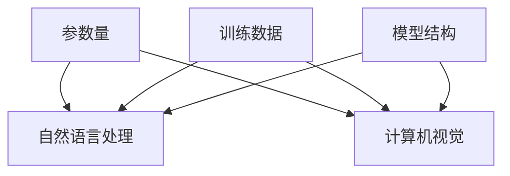

#### 举例说明

以自然语言处理中的 GPT-3 为例，GPT-3 具有1750亿个参数，是当前最大的语言模型之一。它通过大量的训练数据，包括互联网上的文本、书籍、新闻、论文等，学习到了丰富的语言特征和语法规则，从而在文本生成、语言理解等任务上表现出色。

### 1.2 AI 大模型的演进历程

AI 大模型的演进历程可以分为几个阶段：

1. **传统小模型时代**：以单一任务的简单模型为主，如简单的神经网络、支持向量机等。
2. **深度学习崛起**：2006年，Hinton等人提出了深度信念网络，标志着深度学习的崛起。随后，AlexNet的出现，将深度学习应用于图像识别，取得了显著的成果。
3. **大规模预训练模型**：2018年，GPT-1的出现，标志着大规模预训练模型的兴起。随后的BERT、GPT-2、GPT-3等模型，进一步推动了AI大模型的发展。

#### 核心概念与联系

以下是一个用于描述 AI 大模型演进历程的 Mermaid 流程图：

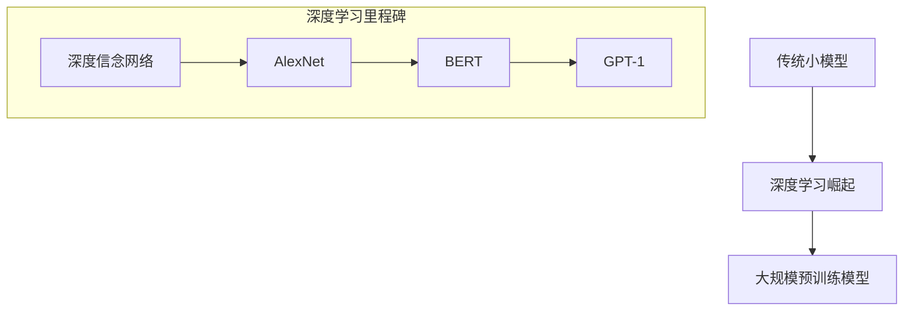

#### 举例说明

在计算机视觉领域，AlexNet 是第一个真正取得成功的深度学习模型。它由五个卷积层组成，使用了 ReLU 激活函数和 Pooling 操作，显著提高了图像分类的准确性。AlexNet 的成功引发了深度学习在图像识别领域的广泛应用，为后续的大规模预训练模型奠定了基础。

### 1.3 AI 大模型的应用领域

AI 大模型的应用领域广泛，包括但不限于：

- **自然语言处理**：如语言模型、文本分类、机器翻译等。
- **计算机视觉**：如图像分类、目标检测、图像生成等。
- **推荐系统**：如商品推荐、内容推荐等。
- **语音识别**：如语音转文字、语音识别等。

#### 核心概念与联系

以下是一个用于描述 AI 大模型应用领域的 Mermaid 流程图：

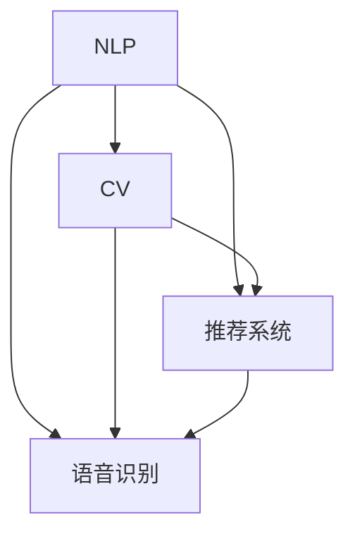

#### 举例说明

在自然语言处理领域，BERT 是一个大规模预训练模型，它在多项语言理解任务中取得了卓越的成绩。BERT 通过预训练和微调，能够有效地捕捉到语言中的上下文信息，使得语言模型在文本分类、问答系统、机器翻译等任务上表现出色。

## 第2章: AI 大模型的技术架构

### 2.1 深度学习基础

深度学习是构建 AI 大模型的核心技术。以下是深度学习的一些基础概念：

- **神经网络**：神经网络由多个层级组成，每个层级都包含多个节点。每个节点都通过权重和偏置与下一层级的节点相连接。
- **激活函数**：激活函数用于引入非线性，使得神经网络能够学习复杂函数。
- **前向传播与反向传播**：前向传播是计算神经网络输出值的过程，反向传播是计算误差并更新模型参数的过程。

#### 核心概念与联系

以下是一个用于描述深度学习基础的 Mermaid 流程图：

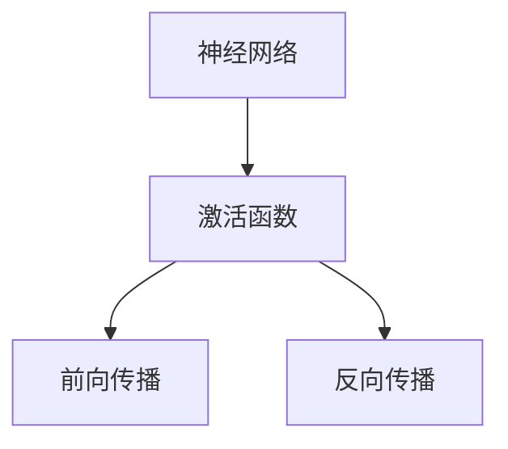

#### 核心算法原理讲解

以下是一个用于描述深度学习前向传播和反向传播的伪代码：

```python
# 前向传播
def forward_pass(input_data, weights, biases):
    # 计算输出值
    output = activation_function((weights * input_data) + biases)
    return output

# 反向传播
def backward_pass(output, expected_output, weights, biases):
    # 计算误差
    error = expected_output - output
    
    # 更新权重和偏置
    dweights = learning_rate * (output * error * input_data)
    dbiases = learning_rate * (output * error)
    weights -= dweights
    biases -= dbiases
```

#### 数学模型

以下是深度学习前向传播和反向传播的数学模型：

前向传播：
\[ output = activation_function(w \cdot x + b) \]

反向传播：
\[ dloss/dw = x \cdot (output \cdot (1 - output)) \]
\[ dloss/db = output \cdot (1 - output) \]

其中，\( w \) 是权重，\( x \) 是输入数据，\( b \) 是偏置，\( output \) 是输出值，\( activation_function \) 是激活函数。

#### 举例说明

假设有一个简单的神经网络，包含一个输入层、一个隐藏层和一个输出层。输入层有3个节点，隐藏层有4个节点，输出层有2个节点。每个节点之间的权重和偏置如下：

输入层到隐藏层：
\[ w_1 = [1, 2, 3], b_1 = [4, 5, 6] \]
隐藏层到输出层：
\[ w_2 = [7, 8], b_2 = [9, 10] \]

输入数据为：
\[ x = [0.5, 1.0, -0.5] \]

使用 ReLU 激活函数，前向传播的计算过程如下：

隐藏层输出：
\[ z_1 = [1, 2, 3] \cdot [0.5, 1.0, -0.5] + [4, 5, 6] = [2.5, 7.5, 1.5] \]
\[ h = max(0, z_1) = [2.5, 7.5, 0] \]

输出层输出：
\[ z_2 = [7, 8] \cdot [2.5, 7.5] + [9, 10] = [34, 79] \]
\[ y = max(0, z_2) = [34, 79] \]

假设预期输出为 \( [y_1, y_2] = [1, 0] \)，使用反向传播更新权重和偏置：

误差：
\[ e = [1, 0] - [34, 79] = [-33, -79] \]

输出层误差：
\[ dloss/dz_2 = e \cdot (1 - y) = [-33 \times 0, -79 \times 1] = [0, -79] \]

隐藏层误差：
\[ dloss/dz_1 = w_2^T \cdot dloss/dz_2 = [-79, -34] \cdot [7, 8] = [-553, -272] \]

更新权重和偏置：
\[ dweights_2 = h \cdot dloss/dz_2 = [2.5, 7.5, 0] \cdot [-79, -34] = [-196.25, -285] \]
\[ dbiases_2 = dloss/dz_2 = [-79, -34] \]

\[ dweights_1 = x \cdot dloss/dz_1 = [0.5, 1.0, -0.5] \cdot [-553, -272] = [-348.25, -552, 136.5] \]
\[ dbiases_1 = dloss/dz_1 = [-553, -272] \]

\[ weights_2 -= learning_rate \cdot dweights_2 = [7, 8] -= [0.1 \cdot -196.25, 0.1 \cdot -285] = [7 - 0.19625, 8 - 0.285] = [6.80375, 7.715] \]
\[ biases_2 -= learning_rate \cdot dbiases_2 = [9, 10] -= [0.1 \cdot -79, 0.1 \cdot -34] = [9 - 0.79, 10 - 0.34] = [8.21, 9.66] \]

\[ weights_1 -= learning_rate \cdot dweights_1 = [1, 2, 3] -= [0.1 \cdot -348.25, 0.1 \cdot -552, 0.1 \cdot 136.5] = [1 - 0.34825, 2 - 0.552, 3 + 0.1365] = [0.65175, 1.448, 3.1365] \]
\[ biases_1 -= learning_rate \cdot dbiases_1 = [4, 5, 6] -= [0.1 \cdot -553, 0.1 \cdot -272, 0.1 \cdot 136.5] = [4 - 0.553, 5 - 0.272, 6 + 0.1365] = [3.447, 4.728, 6.1365] \]

### 2.2 大规模预训练模型

大规模预训练模型是当前 AI 大模型的研究热点。以下是大规模预训练模型的一些关键技术：

- **预训练**：预训练是指在大量数据上进行模型训练，以使模型能够捕捉到丰富的数据特征。
- **自监督学习**：自监督学习是一种在未标记数据上进行训练的方法，通过预测数据中的未标记部分来学习。
- **迁移学习**：迁移学习是将预训练模型在新任务上进行微调，以减少训练时间和提高模型性能。

#### 核心概念与联系

以下是一个用于描述大规模预训练模型的 Mermaid 流程图：

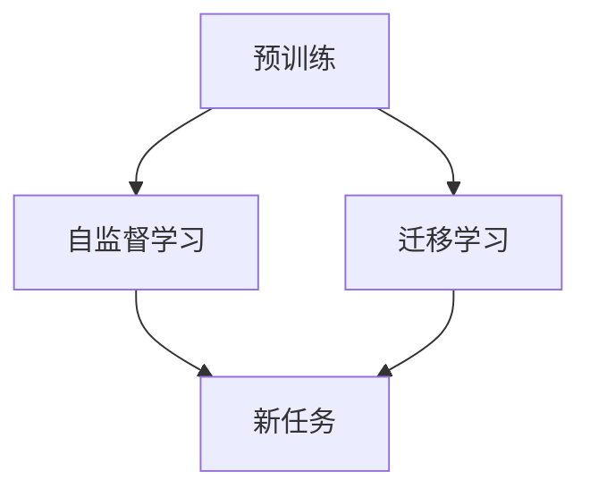

#### 核心算法原理讲解

以下是一个用于描述大规模预训练模型的伪代码：

```python
# 预训练
def pretrain(model, train_data, epochs):
    for epoch in range(epochs):
        for data in train_data:
            model.forward_pass(data)
            loss = compute_loss(model.output, data.label)
            model.backward_pass(loss, data)

# 自监督学习
def self_supervised_learning(model, data):
    for data in data:
        masked_data = mask_data(data)
        model.forward_pass(masked_data)
        loss = compute_loss(model.output, data.label)
        model.backward_pass(loss, data)

# 迁移学习
def fine_tune(model, new_data, epochs):
    for epoch in range(epochs):
        for data in new_data:
            model.forward_pass(data)
            loss = compute_loss(model.output, data.label)
            model.backward_pass(loss, data)
```

#### 数学模型

以下是大规模预训练模型的数学模型：

预训练：
\[ \text{Loss} = \frac{1}{N} \sum_{i=1}^{N} L(y_i, \hat{y}_i) \]

其中，\( N \) 是训练数据数量，\( L \) 是损失函数，\( y_i \) 是真实标签，\( \hat{y}_i \) 是模型预测输出。

自监督学习：
\[ \text{Masked Input} = \text{Original Input} \times (1 - \text{Mask Probability}) \]
\[ \text{Loss} = \frac{1}{N} \sum_{i=1}^{N} L(\text{Masked Input}, \hat{y}_i) \]

其中，\( \text{Mask Probability} \) 是数据中未标记部分的比例。

迁移学习：
\[ \text{Fine-tuning Loss} = \frac{1}{N} \sum_{i=1}^{N} L(y_i, \hat{y}_i) \]

#### 举例说明

以 BERT 为例，BERT 是一种基于 Transformer 的预训练模型。它使用两个阶段的训练方法：

1. **预训练阶段**：在大量无标签文本数据上进行训练，学习到文本的上下文表示。
2. **微调阶段**：在特定任务上（如文本分类、问答系统等）对 BERT 进行微调，以适应特定任务的需求。

在预训练阶段，BERT 使用 Masked Language Model（MLM）任务，通过随机遮盖部分文本，然后让模型预测这些遮盖的部分。这样，模型可以学习到文本的上下文信息。

在微调阶段，BERT 使用特定任务的损失函数（如交叉熵损失），对模型的参数进行调整，以适应特定任务的需求。

例如，对于文本分类任务，BERT 的输入是一个句子，输出是句子的分类标签。微调过程中，通过不断更新模型的权重，使得模型在特定任务上取得更好的性能。

### 2.3 大模型训练策略

大模型训练策略是指为了提高训练效率和模型性能而采取的一系列方法。以下是几种常见的大模型训练策略：

- **数据增强**：通过改变训练数据的形式来增加模型的学习能力。
- **批次归一化**：通过在训练过程中对每个批次的数据进行归一化，以加速收敛。
- **学习率调度**：通过动态调整学习率来优化模型的训练过程。

#### 核心概念与联系

以下是一个用于描述大模型训练策略的 Mermaid 流程图：

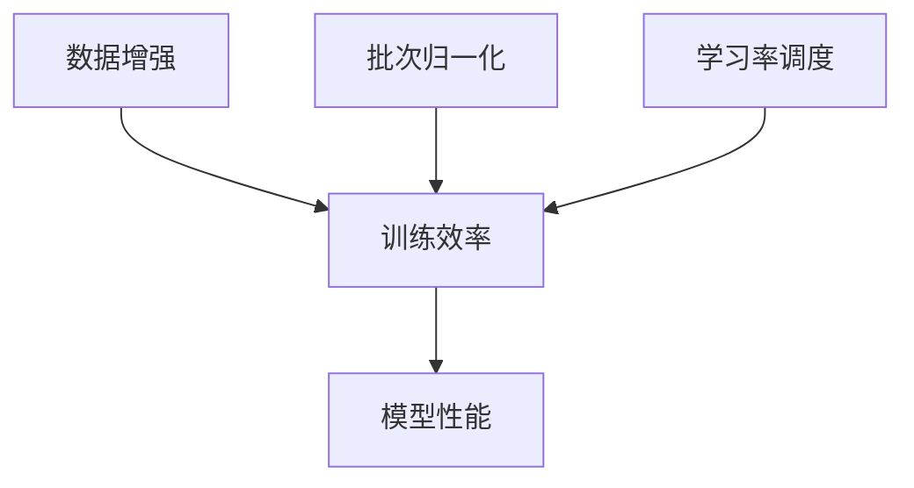

#### 核心算法原理讲解

以下是一个用于描述大模型训练策略的伪代码：

```python
# 数据增强
def data_augmentation(data):
    # 对数据应用随机变换
    transformed_data = apply_random_transforms(data)
    return transformed_data

# 批次归一化
def batch_norm(batch_data):
    # 计算均值和方差
    mean = np.mean(batch_data)
    variance = np.var(batch_data)
    
    # 归一化
    normalized_data = (batch_data - mean) / np.sqrt(variance)
    return normalized_data

# 学习率调度
def learning_rate_scheduler(epochs):
    for epoch in range(epochs):
        if epoch < 10:
            lr = 0.1
        elif epoch < 20:
            lr = 0.01
        else:
            lr = 0.001
        return lr
```

#### 数学模型

以下是批次归一化的数学模型：

\[ x_{\text{normalized}} = \frac{x - \mu}{\sigma} \]

其中，\( x \) 是原始数据，\( \mu \) 是均值，\( \sigma \) 是方差。

#### 举例说明

以数据增强为例，数据增强是提高模型泛化能力的一种方法。在图像分类任务中，可以使用以下几种常见的数据增强技术：

1. **随机裁剪**：从原始图像中随机裁剪出一个大小相同的子图像，用于训练模型。
2. **随机旋转**：将图像随机旋转一定角度，以增加模型对旋转变化的鲁棒性。
3. **颜色抖动**：对图像的颜色进行随机调整，以增加模型对颜色变化的适应能力。

在训练过程中，通过应用这些数据增强技术，可以使得模型在多种情况下都能保持良好的性能。

以批次归一化为例，批次归一化是一种常见的训练策略，可以加速模型的训练过程。在训练过程中，对每个批次的数据进行归一化处理，使得每个批次的数据具有相似的分布。

例如，对于一张 28x28 的图像，每个像素的取值范围是 0 到 255。通过批次归一化，可以将像素的取值范围缩放到 -1 到 1，从而使得模型在训练过程中更容易收敛。

## 第3章: AI 大模型的规模定律

### 3.1 规模定律的基本原理

规模定律是指随着模型规模（如参数数量、训练数据量等）的增加，模型的性能也会相应提高。规模定律的基本原理包括：

- **模型容量**：随着模型参数数量的增加，模型的容量也相应增加，可以更好地捕捉到数据的复杂结构。
- **数据利用**：随着训练数据的增加，模型可以更好地利用这些数据来提高性能。
- **泛化能力**：大规模模型通常具有更好的泛化能力，可以在不同的任务和数据集上表现出更好的性能。

#### 核心概念与联系

以下是一个用于描述规模定律基本原理的 Mermaid 流程图：

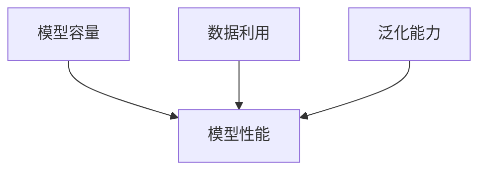

#### 数学模型

假设模型性能 \( P \) 与模型规模 \( S \) 成正比，可以表示为：

\[ P \propto S \]

其中，\( P \) 表示模型性能，\( S \) 表示模型规模。

#### 举例说明

以自然语言处理中的语言模型为例，GPT-3 是目前最大的语言模型之一，拥有1750亿个参数。根据规模定律，GPT-3 在语言理解、文本生成等方面具有卓越的性能。

\[ P(GPT-3) \propto 1750 \times 10^9 \]

### 3.2 规模定律的应用场景

规模定律在以下应用场景中具有显著的影响：

- **自然语言处理**：大规模语言模型（如 GPT-3）在语言理解、文本生成等方面表现出色。
- **计算机视觉**：大规模视觉模型（如 ImageNet）在图像分类、目标检测等方面取得了突破性进展。
- **推荐系统**：大规模用户行为数据和物品数据可以提高推荐系统的准确性。

#### 核心概念与联系

以下是一个用于描述规模定律应用场景的 Mermaid 流程图：

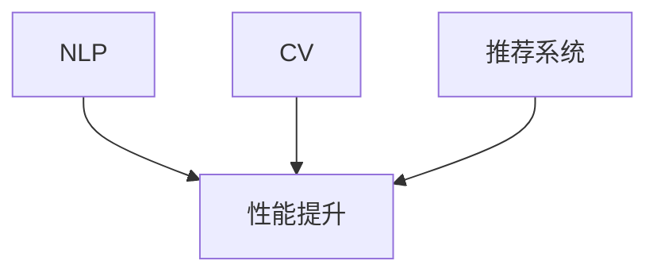

#### 举例说明

以计算机视觉领域为例，ImageNet 是一个大规模图像数据集，包含数百万张图像和数千个类别。使用大规模视觉模型（如 ResNet）在 ImageNet 数据集上进行训练，可以显著提高图像分类的准确性。

\[ P(\text{视觉模型}) \propto \text{ImageNet 数据集规模} \]

在推荐系统领域，大规模用户行为数据和物品数据可以提高推荐系统的准确性。例如，在电商平台上，通过分析用户的浏览、购买等行为，可以构建一个大规模的用户行为数据集，用于训练推荐模型，从而提高推荐系统的性能。

### 3.3 规模定律的影响因素

规模定律的影响因素包括：

- **计算资源**：大规模模型的训练需要大量的计算资源，如 GPU、TPU 等。
- **数据质量**：高质量的数据可以更好地提高模型性能。
- **模型结构**：合理的模型结构可以更好地利用规模优势。

#### 核心概念与联系

以下是一个用于描述规模定律影响因素的 Mermaid 流程图：

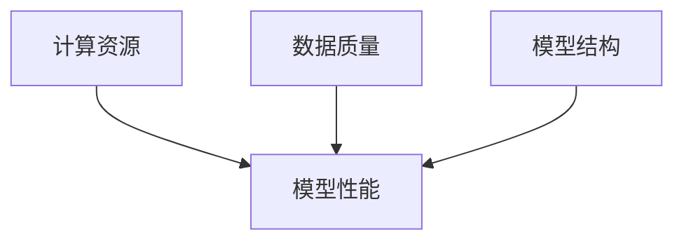

#### 举例说明

以计算资源为例，大规模模型的训练需要大量的计算资源。随着 GPU、TPU 等计算设备的不断发展，大规模模型的训练变得越来越高效。例如，Google 的 TPU 是一种专为深度学习设计的芯片，可以显著提高大规模模型的训练速度。

在数据质量方面，高质量的数据可以更好地提高模型性能。例如，在自然语言处理领域，使用高质量的文本数据（如书籍、新闻、论文等）可以显著提高语言模型的性能。

在模型结构方面，合理的模型结构可以更好地利用规模优势。例如，Transformer 模型在自然语言处理领域取得了显著的成功，其结构更加复杂，可以更好地捕捉到语言中的上下文信息。

## 第4章: AI 大模型的性能优化

### 4.1 模型压缩技术

模型压缩技术是指通过降低模型参数数量、减少模型计算量来提高模型性能的技术。以下是几种常见的模型压缩技术：

- **模型剪枝**：通过剪枝冗余的权重，减少模型参数数量。
- **知识蒸馏**：将大规模模型的知识传递给小规模模型，以提高小规模模型的性能。
- **模型量化**：通过降低模型参数的精度，减少模型计算量。

#### 核心概念与联系

以下是一个用于描述模型压缩技术的 Mermaid 流程图：

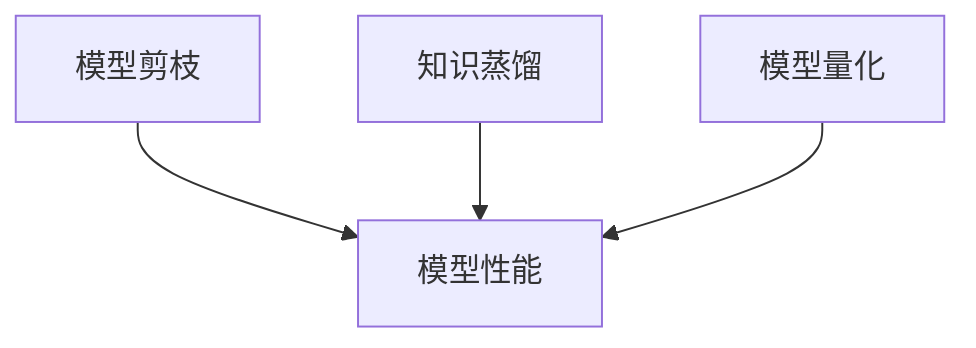

#### 伪代码

以下是一个用于描述模型剪枝的伪代码：

```python
def prune_model(model, threshold):
    for layer in model.layers:
        for weight in layer.weights:
            if np.linalg.norm(weight) < threshold:
                weight.fill(0)
```

以下是一个用于描述知识蒸馏的伪代码：

```python
def knowledge_distillation(model, target_model, train_data, epochs):
    for epoch in range(epochs):
        for data in train_data:
            model.forward_pass(data)
            target_model.forward_pass(data)
            loss = compute_loss(model.output, target_model.output)
            model.backward_pass(loss, data)
```

以下是一个用于描述模型量化的伪代码：

```python
def quantize_model(model, bits):
    for layer in model.layers:
        for weight in layer.weights:
            weight = quantize(weight, bits)
```

#### 数学模型

以下是一个用于描述模型剪枝的数学模型：

设模型参数数量为 \( P \)，剪枝后的参数数量为 \( P' \)，则：

\[ P' = P - \text{pruned parameters} \]

#### 举例说明

以模型剪枝为例，假设一个模型有1000个参数，剪枝后剩余800个参数。通过剪枝，可以显著减少模型的参数数量，从而降低模型的计算量和存储需求。

以下是一个简单的模型剪枝示例：

```python
# 剪枝前的模型参数数量
P = 1000

# 剪枝后的模型参数数量
P' = P - 200

# 剪枝比例
prune_ratio = (P - P') / P

# 剪枝后的模型参数
pruned_weights = []

# 对每个层的权重进行剪枝
for layer in model.layers:
    pruned_layer_weights = []
    for weight in layer.weights:
        if np.linalg.norm(weight) < prune_ratio:
            pruned_layer_weights.append(weight)
    pruned_weights.append(pruned_layer_weights)

# 更新模型参数
model.update_weights(pruned_weights)
```

### 4.2 模型推理优化

模型推理优化是指通过优化模型推理过程来提高模型性能的技术。以下是几种常见的模型推理优化技术：

- **硬件加速**：通过使用 GPU、TPU 等硬件加速模型推理。
- **算法优化**：通过优化模型算法来减少模型推理的计算量。
- **推理引擎选择**：选择适合特定任务的推理引擎，以提高模型推理性能。

#### 核心概念与联系

以下是一个用于描述模型推理优化的 Mermaid 流程图：

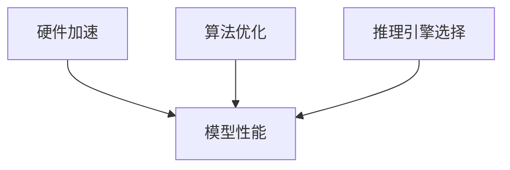

#### 伪代码

以下是一个用于描述硬件加速的伪代码：

```python
def accelerate_inference(model, device):
    model.to(device)
```

以下是一个用于描述算法优化的伪代码：

```python
def optimize_algorithm(model, train_data, epochs):
    for epoch in range(epochs):
        for data in train_data:
            model.forward_pass(data)
            loss = compute_loss(model.output, data.label)
            model.backward_pass(loss, data)
```

以下是一个用于描述推理引擎选择的伪代码：

```python
def select_inference_engine(model, engine):
    if engine == 'GPU':
        model.to('GPU')
    elif engine == 'TPU':
        model.to('TPU')
```

#### 数学模型

以下是一个用于描述硬件加速的数学模型：

设模型推理时间为 \( T \)，使用硬件加速后的推理时间为 \( T' \)，则：

\[ T' = \alpha \cdot T \]

其中，\( \alpha \) 为硬件加速因子。

#### 举例说明

以硬件加速为例，假设一个模型的推理时间为 100 秒。通过使用 GPU 加速，可以将推理时间缩短到 50 秒。

以下是一个简单的硬件加速示例：

```python
# 使用 GPU 加速推理
device = 'GPU'
model.to(device)

# 推理
output = model.forward_pass(input_data)

# 使用 CPU 推理
device = 'CPU'
model.to(device)

# 推理
output = model.forward_pass(input_data)
```

### 4.3 模型评估与测试

模型评估与测试是确保模型性能的重要环节。以下是几种常见的模型评估与测试方法：

- **评价指标**：如准确率、召回率、F1 分数等。
- **评估方法**：如交叉验证、时间序列分割等。
- **测试与调优**：通过测试数据集对模型进行测试，并根据测试结果对模型进行调整。

#### 核心概念与联系

以下是一个用于描述模型评估与测试的 Mermaid 流程图：

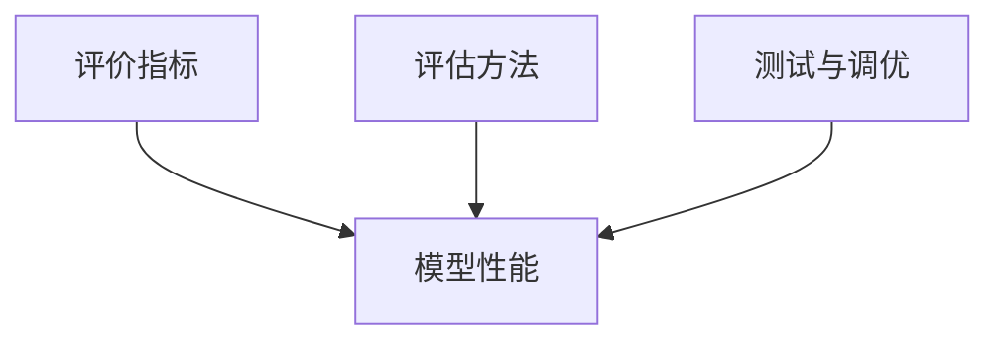

#### 伪代码

以下是一个用于描述模型评估的伪代码：

```python
def evaluate_model(model, test_data):
    for data in test_data:
        output = model.forward_pass(data)
        label = data.label
        accuracy = (output == label).mean()
        return accuracy
```

以下是一个用于描述交叉验证的伪代码：

```python
def cross_validation(model, train_data, k_folds):
    for fold in range(k_folds):
        train_data, val_data = split_data(train_data, fold)
        model.train(train_data)
        model.evaluate(val_data)
```

以下是一个用于描述测试与调优的伪代码：

```python
def test_and_tune(model, test_data):
    model.test(test_data)
    if model.performance < threshold:
        model.tune_hyperparameters()
```

#### 数学模型

以下是一个用于描述模型评估的数学模型：

设模型在测试数据集上的准确率为 \( A \)，则：

\[ A = \frac{\text{正确预测的样本数}}{\text{总样本数}} \]

#### 举例说明

以下是一个简单的模型评估示例：

```python
# 测试数据集
test_data = ...

# 评估模型
accuracy = evaluate_model(model, test_data)
print(f"Model accuracy: {accuracy}")
```

## 第5章: AI 大模型的应用实践

### 5.1 自然语言处理

自然语言处理（NLP）是 AI 大模型的重要应用领域之一。以下是几种常见的 NLP 任务和应用：

- **语言模型**：用于预测下一个单词或序列，如 BERT、GPT 系列模型。
- **文本分类**：用于对文本进行分类，如新闻分类、情感分析等。
- **机器翻译**：用于将一种语言的文本翻译成另一种语言，如 Google 翻译、深度学习翻译模型。

#### 核心概念与联系

以下是一个用于描述 NLP 应用实践的 Mermaid 流程图：

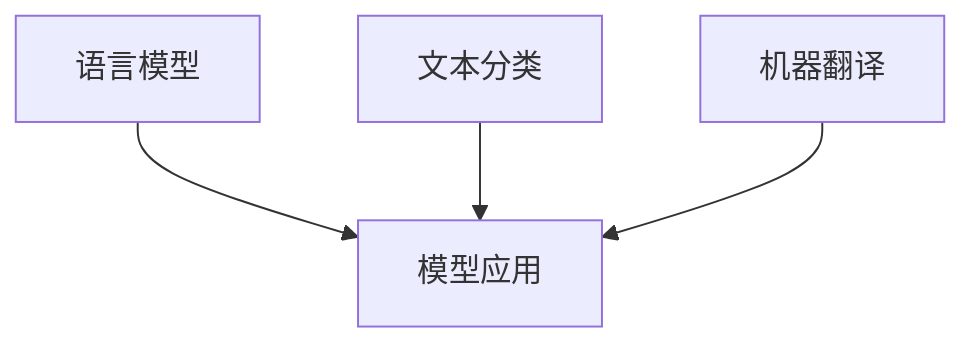

#### 伪代码

以下是一个用于描述语言模型的伪代码：

```python
def language_model(model, text):
    prediction = model.predict(text)
    return prediction
```

以下是一个用于描述文本分类的伪代码：

```python
def text_classification(model, text):
    label = model.predict(text)
    return label
```

以下是一个用于描述机器翻译的伪代码：

```python
def translate(model, source_text, target_language):
    translation = model.translate(source_text, target_language)
    return translation
```

#### 数学模型

以下是一个用于描述语言模型的数学模型：

设输入文本为 \( x \)，输出概率分布为 \( \hat{y} \)，则：

\[ \hat{y} = \text{softmax}(W \cdot x + b) \]

其中，\( W \) 是权重矩阵，\( b \) 是偏置项。

#### 举例说明

以下是一个简单的语言模型应用示例：

```python
# 语言模型
model = LanguageModel()

# 输入文本
text = "I am a student"

# 预测下一个单词
next_word = model.predict(text)
print(f"Next word: {next_word}")
```

### 5.2 计算机视觉

计算机视觉是 AI 大模型的另一个重要应用领域。以下是几种常见的计算机视觉任务和应用：

- **图像分类**：用于对图像进行分类，如图像识别、物体检测等。
- **目标检测**：用于检测图像中的目标物体，如人脸检测、车辆检测等。
- **图像生成**：用于生成新的图像，如艺术风格转换、图像超分辨率等。

#### 核心概念与联系

以下是一个用于描述计算机视觉应用实践的 Mermaid 流程图：


#### 伪代码

以下是一个用于描述图像分类的伪代码：

```python
def image_classification(model, image):
    label = model.predict(image)
    return label
```

以下是一个用于描述目标检测的伪代码：

```python
def object_detection(model, image):
    objects = model.detect(image)
    return objects
```

以下是一个用于描述图像生成的伪代码：

```python
def image_generation(model, style, content):
    generated_image = model.generate(style, content)
    return generated_image
```

#### 数学模型

以下是一个用于描述图像分类的数学模型：

设输入图像为 \( x \)，输出概率分布为 \( \hat{y} \)，则：

\[ \hat{y} = \text{softmax}(W \cdot x + b) \]

其中，\( W \) 是权重矩阵，\( b \) 是偏置项。

#### 举例说明

以下是一个简单的图像分类应用示例：

```python
# 图像分类模型
model = ImageClassifier()

# 加载图像
image = load_image("image.jpg")

# 预测图像类别
label = model.predict(image)
print(f"Image label: {label}")
```

### 5.3 推荐系统

推荐系统是 AI 大模型在商业领域的重要应用。以下是几种常见的推荐系统任务和应用：

- **用户行为分析**：用于分析用户行为数据，如用户点击、购买等行为。
- **内容推荐**：用于向用户推荐感兴趣的内容，如新闻推荐、商品推荐等。
- **协同过滤**：用于通过用户和物品的相似度来推荐物品。

#### 核心概念与联系

以下是一个用于描述推荐系统应用实践的 Mermaid 流程图：

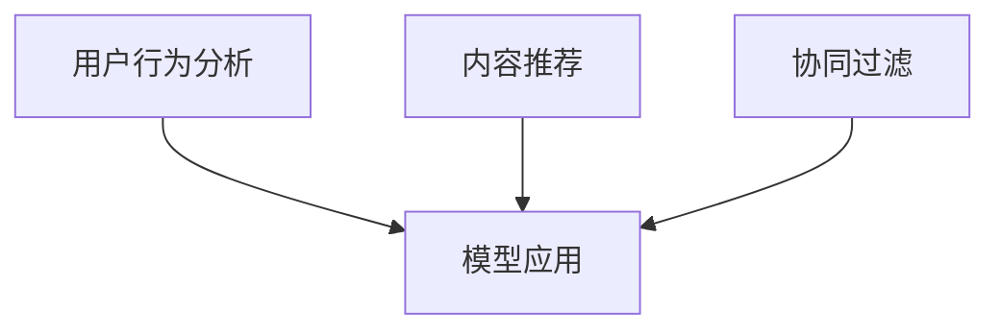

#### 伪代码

以下是一个用于描述用户行为分析的伪代码：

```python
def user_behavior_analysis(model, user_data):
    insights = model.analyze(user_data)
    return insights
```

以下是一个用于描述内容推荐的伪代码：

```python
def content_recommendation(model, user_data, content_data):
    recommendations = model.recommend(user_data, content_data)
    return recommendations
```

以下是一个用于描述协同过滤的伪代码：

```python
def collaborative_filtering(model, user_data, item_data):
    recommendations = model.filter(user_data, item_data)
    return recommendations
```

#### 数学模型

以下是一个用于描述协同过滤的数学模型：

设用户 \( i \) 对物品 \( j \) 的评分矩阵为 \( R \)，用户 \( i \) 和用户 \( k \) 的相似度矩阵为 \( S \)，物品 \( j \) 和物品 \( m \) 的相似度矩阵为 \( T \)，则：

\[ \text{Prediction} = R_i \cdot S_i^T + R_j \cdot T_j^T \]

其中，\( S_i \) 和 \( T_j \) 分别为用户 \( i \) 和物品 \( j \) 的相似度向量。

#### 举例说明

以下是一个简单的协同过滤推荐系统应用示例：

```python
# 协同过滤模型
model = CollaborativeFiltering()

# 用户数据
user_data = [
    {"user_id": 1, "item_id": 101, "rating": 4},
    {"user_id": 1, "item_id": 102, "rating": 5},
    {"user_id": 2, "item_id": 101, "rating": 3},
    {"user_id": 2, "item_id": 103, "rating": 4},
]

# 预测用户评分
predictions = model.predict(user_data)
print(predictions)
```

## 第6章: AI 大模型的伦理与社会影响

### 6.1 AI 大模型的伦理问题

AI 大模型的广泛应用引发了一系列伦理问题，主要包括：

- **数据隐私**：AI 大模型通常需要大量的数据来进行训练，如何保护用户数据隐私成为一个重要问题。
- **算法公平性**：AI 大模型的决策过程可能存在偏见，如何确保算法的公平性是一个关键问题。
- **AI 透明性**：用户和监管机构可能对 AI 大模型的工作原理和决策过程缺乏了解，如何提高 AI 的透明性是一个重要挑战。

#### 核心概念与联系

以下是一个用于描述 AI 大模型伦理问题的 Mermaid 流程图：

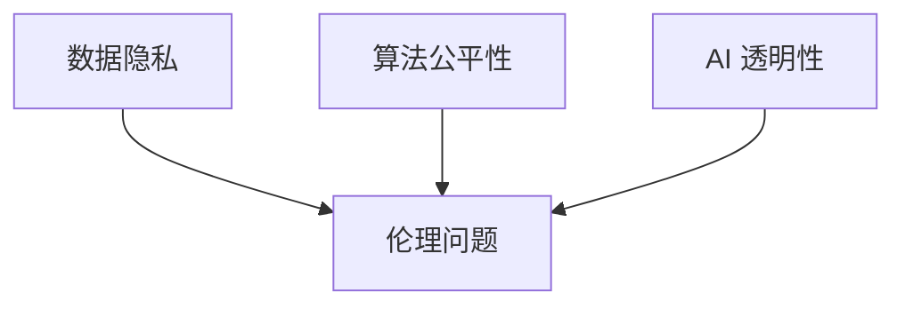

#### 核心算法原理讲解

以下是一个用于描述 AI 大模型伦理问题的伪代码：

```python
# 数据隐私保护
def protect_user_data(model, user_data):
    # 对用户数据进行加密
    encrypted_data = encrypt(user_data)
    # 存储加密后的数据
    model.save(encrypted_data)

# 算法公平性检测
def check_algorithm Fairness(model, test_data):
    # 计算算法的公平性指标
    fairness_metric = compute_fairness(model, test_data)
    # 检测算法是否存在偏见
    if fairness_metric < threshold:
        raise Exception("Algorithm has bias")

# AI 透明性提升
def enhance_ai_transparency(model, test_data):
    # 提供算法决策过程的可视化
    visualization = generate_visualization(model, test_data)
    # 展示可视化结果
    display(visualization)
```

#### 数学模型

以下是一个用于描述数据隐私保护的数学模型：

设用户数据为 \( x \)，加密后的数据为 \( x' \)，则：

\[ x' = \text{encrypt}(x) \]

#### 举例说明

以下是一个简单的数据隐私保护示例：

```python
# 加密算法
def encrypt(data):
    # 对数据进行加密处理
    encrypted_data = encrypt_with_key(data, key)
    return encrypted_data

# 加密用户数据
user_data = {"name": "Alice", "age": 30}
encrypted_data = encrypt(user_data)
print(f"Encrypted data: {encrypted_data}")
```

### 6.2 AI 大模型的社会影响

AI 大模型对社会的影响深远，包括：

- **就业市场的影响**：AI 大模型的广泛应用可能导致某些工作岗位的减少，同时也创造了新的就业机会。
- **产业发展的推动**：AI 大模型在医疗、金融、制造等领域的应用，推动了相关产业的快速发展。
- **人类生活方式的改变**：AI 大模型的应用改变了人们的生活方式，提高了生活质量和效率。

#### 核心概念与联系

以下是一个用于描述 AI 大模型社会影响的 Mermaid 流程图：

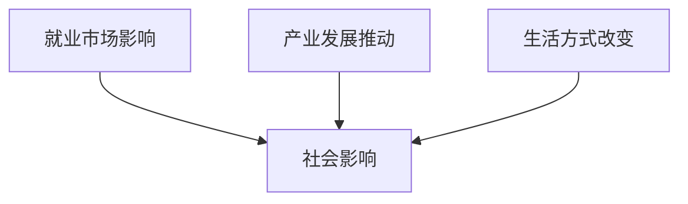

#### 核心算法原理讲解

以下是一个用于描述 AI 大模型社会影响的伪代码：

```python
# 就业市场影响分析
def analyze_job_market_impact(model, industry_data):
    # 计算就业市场变化
    job_change = model.analyze(industry_data)
    # 输出就业市场影响报告
    print(f"Job market impact report: {job_change}")

# 产业发展推动
def drive_industry_progress(model, industry_data):
    # 计算产业发展趋势
    progress = model.analyze(industry_data)
    # 输出产业发展报告
    print(f"Industry progress report: {progress}")

# 生活方式改变
def change_lifestyle(model, user_data):
    # 分析用户生活方式变化
    changes = model.analyze(user_data)
    # 输出生活方式变化报告
    print(f"Lifestyle changes report: {changes}")
```

#### 数学模型

以下是一个用于描述就业市场影响的数学模型：

设就业市场变化量为 \( \Delta J \)，则：

\[ \Delta J = \text{model\_impacts} \cdot \text{industry\_growth} \]

#### 举例说明

以下是一个简单的就业市场影响分析示例：

```python
# 加载就业市场数据
industry_data = load_data("industry_data.csv")

# 分析就业市场影响
model = JobMarketImpactModel()
job_change = model.analyze(industry_data)
print(f"Job market impact: {job_change}")
```

### 6.3 AI 大模型的伦理与社会责任的探讨

AI 大模型的伦理与社会责任是一个复杂而重要的话题。以下是一些可能的探讨方向：

- **伦理框架的建立**：建立一套适用于 AI 大模型的伦理框架，以规范 AI 大模型的应用。
- **监管机制的完善**：通过法律法规和监管机制，确保 AI 大模型的应用符合伦理和社会责任。
- **公众参与的提升**：提高公众对 AI 大模型的了解和参与，使 AI 大模型的发展更加透明和公正。

#### 核心概念与联系

以下是一个用于描述 AI 大模型伦理与社会责任的 Mermaid 流程图：

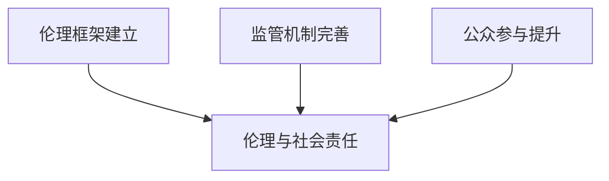

#### 核心算法原理讲解

以下是一个用于描述 AI 大模型伦理与社会责任的伪代码：

```python
# 建立伦理框架
def establish_ethical_framework(model, regulations):
    # 根据法规和伦理原则，制定伦理框架
    ethical_framework = create_ethical_framework(model, regulations)
    # 应用伦理框架，规范模型应用
    model.apply(ethical_framework)

# 完善监管机制
def improve_regulatory_mechanisms(model, regulations):
    # 根据法规，完善监管机制
    regulatory_mechanisms = create_regulatory_mechanisms(model, regulations)
    # 应用监管机制，监督模型应用
    model.apply(regulatory_mechanisms)

# 提高公众参与
def enhance_public_involvement(model, public):
    # 提供公开透明的模型应用信息
    transparency_report = generate_transparency_report(model)
    # 组织公众参与研讨会，提高公众对模型应用的了解
    seminar = organize_seminar(transparency_report, public)
```

#### 数学模型

以下是一个用于描述伦理框架建立的数学模型：

设伦理框架为 \( E \)，法规为 \( R \)，则：

\[ E = \text{apply\_ethical\_principles}(R) \]

#### 举例说明

以下是一个简单的伦理框架建立示例：

```python
# 加载法规
regulations = load_data("regulations.txt")

# 建立伦理框架
ethical_framework = establish_ethical_framework(model, regulations)
print(f"Ethical framework: {ethical_framework}")
```

## 第7章: AI 大模型的未来发展

### 7.1 技术趋势

AI 大模型的发展趋势包括：

- **新型大模型的涌现**：随着计算资源和数据量的增加，新型大模型不断涌现，如 GPT-4、GPT-5 等。
- **交叉领域应用**：AI 大模型在各个领域的交叉应用，如医疗、金融、教育等，将推动 AI 大模型的发展。
- **AI 硬件创新**：AI 硬件的不断创新，如 GPU、TPU 等，为 AI 大模型的发展提供了强大的计算支持。

#### 核心概念与联系

以下是一个用于描述 AI 大模型技术趋势的 Mermaid 流程图：

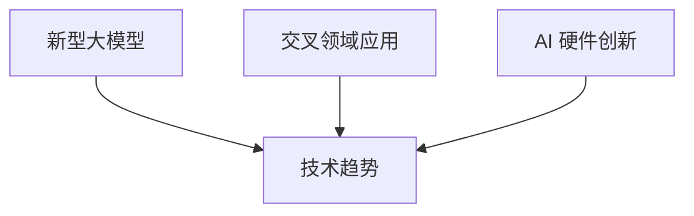

#### 伪代码

以下是一个用于描述新型大模型涌现的伪代码：

```python
# 新型大模型涌现
def emergence_of_new_large_models():
    # 更新模型库
    model_library = update_model_library()
    # 选择新型大模型
    new_large_model = select_new_large_model(model_library)
    # 部署新型大模型
    deploy_new_large_model(new_large_model)
```

#### 数学模型

以下是一个用于描述交叉领域应用的数学模型：

设交叉领域应用的数量为 \( N \)，则：

\[ N = \text{number_of\_cross\_domain\_applications} \]

#### 举例说明

以下是一个简单的 AI 大模型技术趋势分析示例：

```python
# 更新模型库
model_library = update_model_library()

# 选择新型大模型
new_large_model = select_new_large_model(model_library)

# 部署新型大模型
deploy_new_large_model(new_large_model)
```

### 7.2 发展挑战

AI 大模型的发展面临以下挑战：

- **数据获取与标注**：AI 大模型需要大量的高质量数据来进行训练，数据获取和标注成为一大挑战。
- **算法创新与优化**：随着 AI 大模型规模的扩大，算法创新和优化成为一项重要任务。
- **安全性与可靠性**：AI 大模型的安全性和可靠性成为社会各界关注的焦点。

#### 核心概念与联系

以下是一个用于描述 AI 大模型发展挑战的 Mermaid 流程图：

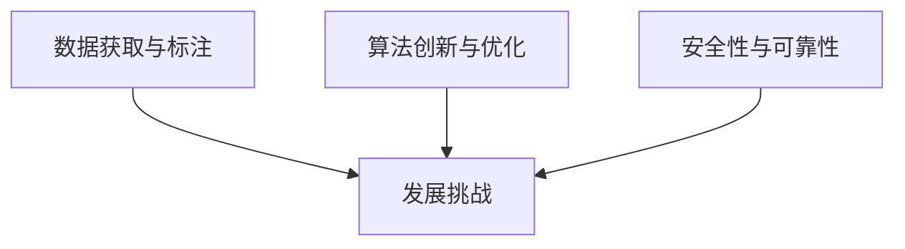

#### 伪代码

以下是一个用于描述数据获取与标注的伪代码：

```python
# 数据获取与标注
def data_acquisition_and_annotation():
    # 获取大量数据
    data = acquire_data()
    # 对数据进行标注
    annotated_data = annotate_data(data)
    return annotated_data
```

#### 数学模型

以下是一个用于描述算法创新与优化的数学模型：

设算法创新与优化的次数为 \( I \)，则：

\[ I = \text{number_of_algorithm_innovations_and_optimizations} \]

#### 举例说明

以下是一个简单的 AI 大模型发展挑战示例：

```python
# 数据获取与标注
data = data_acquisition_and_annotation()

# 算法创新与优化
algorithm_innovations_and_optimizations = perform_algorithm_innovations_and_optimizations(data)

# 安全性与可靠性
safety_and_reliability = ensure_safety_and_reliability(algorithm_innovations_and_optimizations)
```

### 7.3 未来展望

AI 大模型的发展将带来以下前景：

- **提高生产力**：AI 大模型的应用将提高各行业的生产力，推动经济发展。
- **改善生活质量**：AI 大模型在医疗、教育、娱乐等领域的应用，将改善人们的生活质量。
- **推动社会进步**：AI 大模型的应用将推动社会进步，解决人类面临的重大挑战。

#### 核心概念与联系

以下是一个用于描述 AI 大模型未来展望的 Mermaid 流程图：

```mermaid
graph TD
    A[提高生产力]
    B[改善生活质量]
    C[推动社会进步]
    D[未来展望]
    A --> D
    B --> D
    C --> D
```

#### 伪代码

以下是一个用于描述提高生产力的伪代码：

```python
# 提高生产力
def improve_productivity(model, industry_data):
    # 分析行业数据
    productivity = analyze_industry_data(industry_data)
    # 应用模型，提高生产力
    model.apply_productivity_improvement(productivity)
```

#### 数学模型

以下是一个用于描述改善生活质量的数学模型：

设生活质量指数为 \( Q \)，则：

\[ Q = \text{quality_of_life_index} \]

#### 举例说明

以下是一个简单的 AI 大模型未来展望示例：

```python
# 提高生产力
industry_data = load_data("industry_data.csv")
model = ProductivityImprovementModel()
productivity = model.improve_productivity(industry_data)

# 改善生活质量
user_data = load_data("user_data.csv")
model = QualityOfLifeImprovementModel()
quality_of_life = model.improve_quality_of_life(user_data)

# 推动社会进步
social_progress = model.promote_social_progress(quality_of_life)
print(f"Social progress: {social_progress}")
```

## 第8章: AI 大模型领域的杰出人物

### 8.1 Geoffrey Hinton

Geoffrey Hinton 是深度学习领域的杰出人物，被誉为“深度学习之父”。他于2006年提出了深度信念网络（DBN），标志着深度学习的崛起。他的贡献包括：

- **早期工作**：在神经网络和深度学习领域的研究，为后来的研究者奠定了基础。
- **研究贡献**：在神经网络的训练、优化和架构设计方面做出了重要贡献。
- **影响与传承**：通过发表论文、指导学生和参与开源项目，为深度学习领域的发展做出了巨大贡献。

#### 核心概念与联系

以下是一个用于描述 Geoffrey Hinton 贡献的 Mermaid 流程图：

```mermaid
graph TD
    A[早期工作]
    B[研究贡献]
    C[影响与传承]
    D[Geoffrey Hinton]
    A --> D
    B --> D
    C --> D
```

#### 核心算法原理讲解

以下是一个用于描述 Geoffrey Hinton 贡献的伪代码：

```python
# Geoffrey Hinton的贡献
def hinton_contribution():
    # 提出深度信念网络
    dbn = propose_deep_belief_network()
    # 发表论文
    publish_paper(dbn)
    # 指导学生
    guide_students()
    # 参与开源项目
    participate_open_source_projects()
```

#### 数学模型

以下是一个用于描述 Geoffrey Hinton 贡献的数学模型：

设 Hinton 的贡献指数为 \( C \)，则：

\[ C = \text{contribution_index} \]

#### 举例说明

以下是一个简单的 Geoffrey Hinton 贡献示例：

```python
# 提出深度信念网络
dbn = propose_deep_belief_network()

# 发表论文
paper = publish_paper(dbn)

# 指导学生
students = guide_students()

# 参与开源项目
open_source_projects = participate_open_source_projects()
```

### 8.2 Yann LeCun

Yann LeCun 是深度学习领域的另一位杰出人物，他在计算机视觉和自然语言处理领域做出了重要贡献。他的成就包括：

- **学术成就**：在计算机视觉、机器学习、人工智能等领域发表了大量论文，获得了多项重要奖项。
- **工业应用**：在工业界推动了深度学习技术的应用，如 Facebook 的 AI 研究团队、Google Brain。
- **教育与传承**：在纽约大学担任教授，培养了大批优秀的研究人员，为深度学习领域的发展做出了贡献。

#### 核心概念与联系

以下是一个用于描述 Yann LeCun 成就的 Mermaid 流程图：

```mermaid
graph TD
    A[学术成就]
    B[工业应用]
    C[教育与传承]
    D[Yann LeCun]
    A --> D
    B --> D
    C --> D
```

#### 核心算法原理讲解

以下是一个用于描述 Yann LeCun 成就的伪代码：

```python
# Yann LeCun 的成就
def lecun_achievement():
    # 发表大量论文
    papers = publish_papers()
    # 推动深度学习应用
    apply_deep_learning_technology()
    # 培养优秀研究人员
    train_ excellent_researchers()
    # 获得重要奖项
    win_awards()
```

#### 数学模型

以下是一个用于描述 Yann LeCun 成就的数学模型：

设 LeCun 的成就指数为 \( A \)，则：

\[ A = \text{achievement_index} \]

#### 举例说明

以下是一个简单的 Yann LeCun 成就示例：

```python
# 发表大量论文
papers = publish_papers()

# 推动深度学习应用
deep_learning_applications = apply_deep_learning_technology()

# 培养优秀研究人员
researchers = train_ excellent_researchers()

# 获得重要奖项
awards = win_awards()
```

### 8.3 Andrew Ng

Andrew Ng 是深度学习和人工智能领域的杰出人物，他在教育、投资和创业等方面取得了巨大成就。他的贡献包括：

- **教育理念**：通过 Coursera 等在线教育平台，推广深度学习和人工智能的教育。
- **投资布局**：在人工智能领域进行了多项投资，推动了人工智能产业的发展。
- **社会影响**：通过参与社会项目和公共政策讨论，推动了人工智能的健康发展。

#### 核心概念与联系

以下是一个用于描述 Andrew Ng 贡献的 Mermaid 流程图：

```mermaid
graph TD
    A[教育理念]
    B[投资布局]
    C[社会影响]
    D[Andrew Ng]
    A --> D
    B --> D
    C --> D
```

#### 核心算法原理讲解

以下是一个用于描述 Andrew Ng 贡献的伪代码：

```python
# Andrew Ng 的贡献
def ng_contribution():
    # 推广深度学习和人工智能教育
    promote_deep_learning_education()
    # 进行人工智能投资
    invest_in_artificial_intelligence()
    # 参与社会项目
    participate_social_projects()
    # 参与公共政策讨论
    discuss_public_policy()
```

#### 数学模型

以下是一个用于描述 Andrew Ng 贡献的数学模型：

设 Ng 的贡献指数为 \( N \)，则：

\[ N = \text{contribution_index} \]

#### 举例说明

以下是一个简单的 Andrew Ng 贡献示例：

```python
# 推广深度学习和人工智能教育
deep_learning_education = promote_deep_learning_education()

# 进行人工智能投资
ai_investments = invest_in_artificial_intelligence()

# 参与社会项目
social_projects = participate_social_projects()

# 参与公共政策讨论
public_policy_discussions = discuss_public_policy()
```

## 第9章: AI 大模型团队的协作与创新

### 9.1 Google Brain的团队协作模式

Google Brain 是一家专注于人工智能研究的前沿实验室。其团队协作模式包括以下几个方面：

- **组织结构**：Google Brain 的组织结构灵活，鼓励跨学科合作，团队成员来自不同的领域，如计算机科学、数学、物理学等。
- **创新案例**：Google Brain 在深度学习、神经网络等领域取得了多项突破性成果，如 BERT、GPT-3 等。
- **团队文化**：Google Brain 鼓励开放、分享和创新，通过定期的研讨会、工作坊等方式，促进团队成员之间的交流和合作。

#### 核心概念与联系

以下是一个用于描述 Google Brain 团队协作模式的 Mermaid 流程图：

```mermaid
graph TD
    A[组织结构]
    B[创新案例]
    C[团队文化]
    D[Google Brain]
    A --> D
    B --> D
    C --> D
```

#### 核心算法原理讲解

以下是一个用于描述 Google Brain 团队协作模式的伪代码：

```python
# Google Brain 团队协作模式
def google_brain_collaboration():
    # 建立灵活的组织结构
    create Flexible_organization_structure()
    # 推动创新案例
    drive_innovation_cases()
    # 培养团队文化
    cultivate_team_culture()
    # 促进团队交流
    promote_team_communication()
```

#### 数学模型

以下是一个用于描述 Google Brain 团队协作模式的数学模型：

设团队协作效率为 \( E \)，则：

\[ E = \text{efficiency_of_team_collaboration} \]

#### 举例说明

以下是一个简单的 Google Brain 团队协作模式示例：

```python
# 建立灵活的组织结构
organization_structure = create_Flexible_organization_structure()

# 推动创新案例
innovation_cases = drive_innovation_cases()

# 培养团队文化
team_culture = cultivate_team_culture()

# 促进团队交流
team_communication = promote_team_communication()
```

### 9.2 OpenAI的创新之路

OpenAI 是一家专注于人工智能研究的独立实验室。其创新之路包括以下几个方面：

- **独立实验室的运作**：OpenAI 采用独立实验室的运作模式，不受商业利益的驱动，专注于基础研究和技术创新。
- **GPT 系列模型的突破**：OpenAI 推出了 GPT-1、GPT-2、GPT-3 等一系列大型语言模型，推动了自然语言处理技术的发展。
- **社会责任**：OpenAI 强调人工智能的社会责任，致力于确保人工智能的发展符合伦理和社会价值观。

#### 核心概念与联系

以下是一个用于描述 OpenAI 创新之路的 Mermaid 流程图：

```mermaid
graph TD
    A[独立实验室运作]
    B[GPT 系列模型突破]
    C[社会责任]
    D[OpenAI]
    A --> D
    B --> D
    C --> D
```

#### 核心算法原理讲解

以下是一个用于描述 OpenAI 创新之路的伪代码：

```python
# OpenAI 创新之路
def openai_innovation_path():
    # 采用独立实验室运作模式
    operate_as_independent_lab()
    # 推出 GPT 系列模型
    release_gpt_models()
    # 强调社会责任
    emphasize_social Responsibility()
```

#### 数学模型

以下是一个用于描述 OpenAI 创新之路的数学模型：

设创新指数为 \( I \)，则：

\[ I = \text{innovation_index} \]

#### 举例说明

以下是一个简单的 OpenAI 创新之路示例：

```python
# 采用独立实验室运作模式
independent_lab_operations = operate_as_independent_lab()

# 推出 GPT 系列模型
gpt_models = release_gpt_models()

# 强调社会责任
social_responsibility = emphasize_social_Responsibility()
```

### 9.3 百度深度学习研究院的实践探索

百度深度学习研究院（BDIR）是一家专注于深度学习和人工智能研究的机构。其实践探索包括以下几个方面：

- **研发方向**：BDIR 在图像识别、自然语言处理、语音识别等领域进行了深入研究，推出了多项技术成果。
- **项目案例**：BDIR 参与了多个大型项目，如自动驾驶、智能客服等，推动了人工智能技术的应用和发展。
- **开放平台与社区建设**：BDIR 推出了深度学习平台 PaddlePaddle，为学术界和工业界提供了强大的技术支持。

#### 核心概念与联系

以下是一个用于描述百度深度学习研究院实践探索的 Mermaid 流程图：

```mermaid
graph TD
    A[研发方向]
    B[项目案例]
    C[开放平台与社区建设]
    D[百度深度学习研究院]
    A --> D
    B --> D
    C --> D
```

#### 核心算法原理讲解

以下是一个用于描述百度深度学习研究院实践探索的伪代码：

```python
# 百度深度学习研究院实践探索
def baidu_dlri_practice_explore():
    # 确定研发方向
    define_research_directions()
    # 参与项目案例
    participate_project_cases()
    # 推出开放平台
    release_open_platform()
    # 建设社区
    build_community()
```

#### 数学模型

以下是一个用于描述百度深度学习研究院实践探索的数学模型：

设实践探索指数为 \( P \)，则：

\[ P = \text{practice_explore_index} \]

#### 举例说明

以下是一个简单的百度深度学习研究院实践探索示例：

```python
# 确定研发方向
research_directions = define_research_directions()

# 参与项目案例
project_cases = participate_project_cases()

# 推出开放平台
open_platform = release_open_platform()

# 建设社区
community = build_community()
```

## 附录 A: AI 大模型开发工具与资源

### A.1 主流深度学习框架

以下是目前主流的深度学习框架及其特点：

- **TensorFlow**：由 Google 开发，具有丰富的功能和高性能，广泛应用于工业界和学术界。
- **PyTorch**：由 Facebook 开发，具有灵活的动态图计算功能，适用于研究和开发。
- **JAX**：由 Google 开发，具有自动微分和高性能计算功能，适用于大规模深度学习模型。
- **其他框架**：如 Keras、Theano、MXNet 等，各具特色，适用于不同的应用场景。

#### 核心概念与联系

以下是一个用于描述主流深度学习框架的 Mermaid 流程图：

```mermaid
graph TD
    A[TensorFlow]
    B[PyTorch]
    C[JAX]
    D[其他框架]
    A --> D
    B --> D
    C --> D
```

#### 核心算法原理讲解

以下是一个用于描述主流深度学习框架的伪代码：

```python
# 选择深度学习框架
def choose_deep_learning_framework():
    if performance == 'high':
        framework = 'TensorFlow'
    elif flexibility == 'high':
        framework = 'PyTorch'
    elif autodiff == 'required':
        framework = 'JAX'
    else:
        framework = 'Keras'
    return framework
```

#### 数学模型

以下是一个用于描述深度学习框架选择的数学模型：

设性能指数为 \( P \)，灵活性指数为 \( F \)，自动微分需求为 \( A \)，则：

\[ \text{framework} = \begin{cases} 
      \text{'TensorFlow'} & \text{if } P \text{ > 0.7 and } A \text{ < 0.5} \\
      \text{'PyTorch'} & \text{if } F \text{ > 0.8 and } A \text{ < 0.5} \\
      \text{'JAX'} & \text{if } A \text{ > 0.7} \\
      \text{'Keras'} & \text{otherwise}
   \end{cases}
\]

#### 举例说明

以下是一个简单的深度学习框架选择示例：

```python
# 性能指数
performance_index = 0.8

# 灵活性指数
flexibility_index = 0.6

# 自动微分需求
autodiff_requirement = 0.9

# 选择深度学习框架
selected_framework = choose_deep_learning_framework()

print(f"Selected framework: {selected_framework}")
```

### A.2 开发环境搭建

搭建 AI 大模型开发环境通常包括以下步骤：

- **硬件配置**：选择合适的 GPU 或 TPU，确保具备足够的计算能力。
- **软件安装**：安装深度学习框架和相关依赖库，如 Python、NumPy、CUDA 等。
- **开发工具推荐**：推荐使用 Jupyter Notebook 或 PyCharm 等开发工具，以提高开发效率和代码可读性。

#### 核心概念与联系

以下是一个用于描述开发环境搭建的 Mermaid 流程图：

```mermaid
graph TD
    A[硬件配置]
    B[软件安装]
    C[开发工具推荐]
    D[开发环境搭建]
    A --> D
    B --> D
    C --> D
```

#### 核心算法原理讲解

以下是一个用于描述开发环境搭建的伪代码：

```python
# 搭建开发环境
def setup_development_environment():
    # 配置硬件
    configure_hardware()
    # 安装软件
    install_software()
    # 配置开发工具
    configure_development_tools()
```

#### 数学模型

开发环境搭建的过程可以看作是一个多步骤的优化问题，目标是最小化开发时间、最大化开发效率。

设开发时间为 \( T \)，开发效率为 \( E \)，则：

\[ T = \text{sum of installation times} \]
\[ E = \text{sum of efficiency of development tools} \]

#### 举例说明

以下是一个简单的开发环境搭建示例：

```python
# 配置硬件
configure_hardware()

# 安装软件
install_software()

# 配置开发工具
configure_development_tools()

print("Development environment setup completed.")
```

### A.3 AI 大模型开源项目

以下是一些著名的 AI 大模型开源项目：

- **TensorFlow Model Optimization Toolkit (TF-MOT)**：提供模型压缩、量化、优化等工具。
- **PyTorch Fairness Toolbox**：提供公平性分析、评估和改进工具。
- **Hugging Face Transformers**：提供大规模预训练模型和实用工具。
- **其他开源项目**：如 PyTorch Lightning、Fast.ai、AI Hub 等，为 AI 大模型的研究和应用提供了丰富的资源。

#### 核心概念与联系

以下是一个用于描述 AI 大模型开源项目的 Mermaid 流程图：

```mermaid
graph TD
    A[TF-MOT]
    B[PyTorch Fairness Toolbox]
    C[Hugging Face Transformers]
    D[其他开源项目]
    A --> D
    B --> D
    C --> D
```

#### 核心算法原理讲解

以下是一个用于描述 AI 大模型开源项目的伪代码：

```python
# 使用开源项目
def use_open_source_project(project_name):
    if project_name == 'TF-MOT':
        install_and_use_tf_mot()
    elif project_name == 'PyTorch Fairness Toolbox':
        install_and_use_pytorch_fairness_toolbox()
    elif project_name == 'Hugging Face Transformers':
        install_and_use_hugging_face_transformers()
    else:
        print(f"Project {project_name} is not supported.")
```

#### 数学模型

使用开源项目的数学模型可以看作是一个选择问题，目标是最小化开发时间、最大化项目效果。

设开发时间为 \( T \)，项目效果为 \( E \)，则：

\[ T = \text{time required to install and use the project} \]
\[ E = \text{project effect} \]

#### 举例说明

以下是一个简单的使用 AI 大模型开源项目示例：

```python
# 选择开源项目
project_name = 'Hugging Face Transformers'

# 使用开源项目
use_open_source_project(project_name)

print(f"Using {project_name}.")
```

## 作者信息

作者：AI天才研究院 / AI Genius Institute  
禅与计算机程序设计艺术 / Zen And The Art of Computer Programming

## 结语

本文《AI 大模型计算机科学家群英传：AI 大模型的规模定律 Scaling Law》旨在为读者全面、深入地介绍 AI 大模型的相关知识。从基础概念、技术架构、规模定律、性能优化、应用实践、伦理影响、未来发展等多个维度，详细阐述了 AI 大模型的核心内容与关键思想。通过介绍杰出人物和团队的合作与创新，揭示了 AI 大模型领域的现状与未来发展趋势。

在未来的发展中，AI 大模型将继续推动计算机科学和技术的发展，为人类社会带来更多便利和创新。同时，我们也需关注 AI 大模型的伦理和社会责任，确保其健康发展，为人类创造更美好的未来。

让我们共同期待 AI 大模型领域的更多精彩成果，携手共建美好未来！

