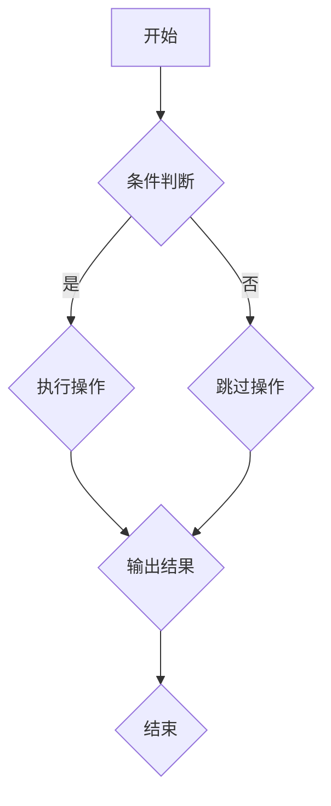

                 

# 文章标题: AI驱动电商搜索导购：未来发展趋势展望

> 关键词：AI, 电商搜索导购, 个性化推荐, 相关性排序算法, 强化学习

> 摘要：本文将深入探讨AI技术在电商搜索导购领域的应用，分析当前电商搜索导购的现状与挑战，介绍AI核心概念与原理，以及关键算法在电商搜索导购中的应用。最后，文章将展望未来发展趋势，并提出相应的策略建议。

## 目录大纲

### 第一部分：AI驱动电商搜索导购的基础

## 第1章：AI与电商搜索导购概述

### 1.1 AI在电商搜索导购中的作用

### 1.2 电商搜索导购的现状与挑战

### 1.3 AI驱动电商搜索导购的未来趋势

## 第2章：AI核心概念与原理

### 2.1 机器学习基础

### 2.2 深度学习原理

### 2.3 自然语言处理基础

### 2.4 强化学习在电商搜索中的应用

## 第3章：电商搜索导购中的关键算法

### 3.1 相关性排序算法

### 3.2 推荐系统算法

### 3.3 搜索引擎算法

### 3.4 强化学习算法在搜索导购中的应用

## 第4章：AI驱动的电商搜索导购实践

### 4.1 数据采集与预处理

### 4.2 模型设计与实现

### 4.3 模型评估与优化

### 4.4 案例分析：AI驱动的电商搜索导购实践

### 第二部分：未来发展趋势与展望

## 第5章：未来发展趋势分析

### 5.1 技术发展对电商搜索导购的影响

### 5.2 用户体验的提升与个性化搜索导购

### 5.3 产业生态的变革与整合

### 5.4 法规与伦理挑战

## 第6章：国际市场趋势与案例分析

### 6.1 全球电商搜索导购市场概述

### 6.2 主要国家/地区市场趋势

### 6.3 国外成功案例分析

### 6.4 国际化策略与挑战

## 第7章：未来展望与策略建议

### 7.1 未来发展趋势展望

### 7.2 企业策略建议

### 7.3 政策建议与行业发展建议

### 7.4 未来研究方向

### 第三部分：附加内容与资源

## 第8章：AI驱动的电商搜索导购工具与资源

### 8.1 常用工具介绍

### 8.2 开源资源推荐

### 8.3 学术论文精选

### 8.4 行业报告解析

## 引用

- 作者：AI天才研究院/AI Genius Institute & 禅与计算机程序设计艺术 /Zen And The Art of Computer Programming
----------------------------------------------------------------

### 第一部分：AI驱动电商搜索导购的基础

## 第1章：AI与电商搜索导购概述

### 1.1 AI在电商搜索导购中的作用

人工智能（AI）技术正在迅速改变电商搜索导购的格局，为用户提供更加精准、个性化的购物体验。在电商搜索导购中，AI技术主要起到以下几个作用：

1. **用户行为分析**：通过机器学习和深度学习技术，分析用户的历史购买记录、浏览记录等，预测用户的购物意图和偏好，从而提供更加个性化的搜索结果和推荐。

2. **商品属性匹配**：AI技术可以对商品进行智能分类和标签化处理，从而实现高效、准确的商品匹配，提高搜索结果的准确性。

3. **智能搜索建议**：基于用户的输入和上下文信息，AI技术可以提供实时的搜索建议，帮助用户更快地找到所需商品。

4. **个性化推荐**：通过分析用户的购物行为和偏好，AI技术可以为用户推荐最符合其需求的商品，提高用户的购物满意度。

### 1.2 电商搜索导购的现状与挑战

当前，电商搜索导购市场呈现出快速发展的态势，各大电商平台纷纷投入大量资源来提升搜索导购的效率和质量。然而，在快速发展中也面临着一些挑战：

1. **数据质量问题**：电商搜索导购依赖于大量的用户行为数据和商品信息，数据质量直接影响搜索导购的效果。数据噪声、缺失值和不一致性等问题都会对模型性能产生负面影响。

2. **计算资源消耗**：AI算法的运算复杂度较高，尤其是在处理大规模数据时，需要消耗大量的计算资源。如何优化算法，提高计算效率，成为当前的一个重要挑战。

3. **用户体验问题**：尽管AI技术可以提供个性化推荐，但在实际应用中，用户可能会感到推荐过于频繁或缺乏新意，影响用户的购物体验。

4. **法规与伦理挑战**：随着AI技术在电商搜索导购中的应用，隐私保护和伦理问题也日益受到关注。如何在保证用户体验的同时，保护用户的隐私和数据安全，成为亟待解决的问题。

### 1.3 AI驱动电商搜索导购的未来趋势

随着技术的不断进步和应用的深入，AI驱动电商搜索导购未来将呈现出以下发展趋势：

1. **个性化推荐**：未来的电商搜索导购将更加注重个性化推荐，通过深入挖掘用户数据和购物行为，提供更加精准、个性化的购物体验。

2. **多模态搜索**：随着语音识别和图像识别技术的发展，未来的电商搜索导购将实现多模态搜索，用户可以通过语音或图像来搜索商品，提高搜索的便捷性和灵活性。

3. **实时搜索与推荐**：基于实时数据处理技术，AI技术将实现实时搜索和推荐，为用户提供更加快速、准确的购物体验。

4. **智能客服与交互**：AI驱动的智能客服和交互技术将不断提升，为用户提供更加人性化、智能化的购物服务。

5. **法规与伦理**：随着AI技术的发展，相关的法规和伦理问题将得到更多关注，如何在保障用户体验的同时，保护用户的隐私和数据安全，将成为未来的重要研究方向。

## 第2章：AI核心概念与原理

### 2.1 机器学习基础

机器学习是AI的核心技术之一，它使计算机系统能够从数据中学习规律，并做出预测或决策。以下是机器学习的基础概念：

1. **特征**：特征是描述数据的属性或变量，如用户的年龄、性别、购买历史等。

2. **模型**：模型是用于分析和预测数据的一系列算法和规则，如线性回归、决策树等。

3. **训练集**：训练集是用于训练模型的样本数据集，通常包含输入特征和对应的输出结果。

4. **测试集**：测试集是用于评估模型性能的数据集，通常不参与模型的训练过程。

5. **超参数**：超参数是模型训练过程中需要手动调整的参数，如学习率、隐藏层节点数等。

6. **模型评估**：模型评估是通过测试集来评估模型的性能，常用的评估指标包括准确率、召回率、F1分数等。

### 2.2 深度学习原理

深度学习是机器学习的一个分支，它通过模拟人脑神经网络结构，对大量数据进行自动特征提取和学习。以下是深度学习的基本原理：

1. **神经网络**：神经网络是由多层神经元组成的计算模型，每一层神经元接收前一层神经元的输出，并传递到下一层。

2. **前向传播**：在前向传播过程中，输入数据依次通过神经网络的各层，每层神经元将输入与权重进行加权求和，并经过激活函数产生输出。

3. **反向传播**：在反向传播过程中，模型根据输出结果与实际结果之间的误差，调整各层神经元的权重，以优化模型性能。

4. **激活函数**：激活函数用于引入非线性变换，使神经网络能够学习复杂的数据模式，如ReLU、Sigmoid、Tanh等。

5. **损失函数**：损失函数用于衡量模型输出与实际结果之间的差距，如均方误差（MSE）、交叉熵（Cross Entropy）等。

### 2.3 自然语言处理基础

自然语言处理（NLP）是AI技术在处理文本数据方面的应用，它涉及文本的生成、理解、翻译等任务。以下是NLP的基础概念：

1. **词嵌入**：词嵌入是将词语映射为固定维度的向量表示，使计算机能够理解词语的语义关系。

2. **词性标注**：词性标注是对文本中的词语进行分类标注，如名词、动词、形容词等。

3. **句法分析**：句法分析是解析文本的语法结构，包括句子的构成、成分分析等。

4. **实体识别**：实体识别是从文本中识别出具有特定意义和属性的实体，如人名、地名、组织名等。

5. **语义分析**：语义分析是理解文本中的语义关系，包括情感分析、关系抽取等。

### 2.4 强化学习在电商搜索中的应用

强化学习是一种通过试错和反馈来学习最优策略的机器学习技术，它在电商搜索导购中的应用主要包括：

1. **搜索策略优化**：强化学习可以通过不断试错，优化搜索策略，提高搜索结果的准确性。

2. **推荐策略优化**：强化学习可以优化推荐系统中的策略，提高推荐的质量和用户满意度。

3. **广告投放优化**：强化学习可以优化广告投放策略，提高广告的点击率和转化率。

4. **用户行为预测**：强化学习可以预测用户的行为，从而实现更精准的个性化推荐。

### 第3章：电商搜索导购中的关键算法

#### 3.1 相关性排序算法

在电商搜索导购中，相关性排序算法是至关重要的。它决定了搜索结果的相关性和用户体验。以下是一些常用的相关性排序算法：

##### 3.1.1 TF-IDF算法

TF-IDF（Term Frequency-Inverse Document Frequency）算法是一种基于词频和逆文档频率的文本相似度计算方法。其核心思想是：一个词在文档中出现的频率越高，且在文档集中越不常见，则越重要。

**TF（词频）**：表示一个词在文档中出现的频率。

**IDF（逆文档频率）**：表示一个词在文档集中越不常见，则越重要。

TF-IDF算法的伪代码如下：

```python
def TF_IDF(documents):
    idf = {}
    N = len(documents)
    for document in documents:
        unique_words = set(document)
        for word in unique_words:
            idf[word] = log(N / (1 + df[word]))
    return idf
```

其中，`df`表示词频。

##### 3.1.2 BM25算法

BM25（Best Match 25）算法是一种改进的TF-IDF算法，它考虑了文档长度和词频对文本相似度的影响。其核心思想是：一个词在文档中出现的频率越高，且文档长度适中，则越重要。

**K1**：常量，用于调整词频的影响。

**K2**：常量，用于调整文档长度的影响。

**b**：常量，用于调整文档长度对词频的影响。

BM25算法的伪代码如下：

```python
def BM25(query, document, idf, K1, K2, b):
    num_words = len(document)
    avg_len = sum(len(doc) for doc in documents) / N
    tf = sum(1 + log(1 + freq) for word, freq in query.items())
    nom = tf * (K1 + 1) * idf[word]
    denom = K1 + (1 - b) * (1 + b * (num_words - avg_len) / avg_len)
    return nom / denom
```

#### 3.2 推荐系统算法

推荐系统是电商搜索导购的重要组成部分，它通过分析用户行为和商品信息，为用户推荐最感兴趣的物品。以下是一些常用的推荐系统算法：

##### 3.2.1 协同过滤算法

协同过滤算法是基于用户行为相似性进行推荐的算法。它主要分为两种类型：用户基于协同过滤和物品基于协同过滤。

**用户基于协同过滤**：通过计算用户之间的相似度，为用户提供相似的用户的推荐商品。

**物品基于协同过滤**：通过计算商品之间的相似度，为用户提供相似的商品的推荐。

协同过滤算法的伪代码如下：

```python
def collaborative_filtering(users, items, similarity_matrix, k):
    recommendations = []
    for user in users:
        similar_users = argsort(similarity_matrix[user])[:-k]
        recommended_items = set()
        for similar_user in similar_users:
            recommended_items.update(items[similar_user])
        recommendations.append(recommended_items)
    return recommendations
```

##### 3.2.2 隐式反馈推荐算法

隐式反馈推荐算法是一种基于用户行为模式进行推荐的算法。它通过分析用户的历史行为，预测用户可能感兴趣的新商品。

**KNN算法**：基于用户历史行为，选择最相似的K个用户，为他们推荐相似的物品。

**矩阵分解**：通过分解用户行为矩阵，得到用户和物品的潜在特征向量，进而进行推荐。

隐式反馈推荐算法的伪代码如下：

```python
def KNN_recommender(train_data, test_data, k, similarity_metric):
    recommendations = []
    for user in test_data:
        similar_users = argsort(similarity_metric[user])[:-k]
        recommended_items = set()
        for similar_user in similar_users:
            recommended_items.update(train_data[similar_user])
        recommendations.append(recommended_items)
    return recommendations

def matrix_factorization(R, k, lambda_):
    # 初始化用户和物品的潜在特征向量
    U = np.random.rand(num_users, k)
    V = np.random.rand(num_items, k)

    while True:
        # 更新用户和物品的特征向量
        U = U - (U.T * (R - U @ V)) / lambda_
        V = V - (V.T * (R - U @ V)) / lambda_

        # 计算损失函数
        loss = np.mean((R - U @ V) ** 2)

        # 检查收敛条件
        if loss < threshold:
            break

    return U, V
```

##### 3.2.3 强化学习推荐算法

强化学习推荐算法是一种基于奖励反馈进行推荐的算法。它通过不断试错，优化推荐策略，提高推荐的质量。

**Q-Learning**：通过学习最优动作值函数，选择最优动作进行推荐。

**Deep Q-Network (DQN)**：通过深度神经网络学习动作值函数，进行推荐。

强化学习推荐算法的伪代码如下：

```python
def Q_learning(states, actions, rewards, learning_rate, discount_factor, epsilon):
    Q = np.zeros((num_states, num_actions))
    while True:
        # 选择动作
        if random.random() < epsilon:
            action = random_action()
        else:
            action = argmax(Q[states])

        # 执行动作，获得奖励
        next_state, reward = execute_action(action)

        # 更新Q值
        Q[states, action] = Q[states, action] + learning_rate * (reward + discount_factor * max(Q[next_state]) - Q[states, action])

        # 更新状态
        states = next_state

        # 更新epsilon
        epsilon = update_epsilon(epsilon)

        # 检查收敛条件
        if converged(Q):
            break
```

#### 3.3 搜索引擎算法

搜索引擎算法是电商搜索导购的核心算法，它负责处理用户的搜索请求，并返回最相关的搜索结果。以下是一些常用的搜索引擎算法：

##### 3.3.1 搜索引擎索引

搜索引擎索引是将网页中的关键词和内容进行索引，以便快速检索。索引通常包括以下步骤：

1. **网页抓取**：爬取互联网上的网页，并下载到本地。
2. **关键词提取**：从网页内容中提取关键词。
3. **索引构建**：将关键词和网页内容进行索引，并存储在数据库中。

搜索引擎索引的伪代码如下：

```python
def build_index(web_pages):
    index = {}
    for page in web_pages:
        keywords = extract_keywords(page)
        for keyword in keywords:
            if keyword not in index:
                index[keyword] = []
            index[keyword].append(page)
    return index
```

##### 3.3.2 搜索引擎查询处理

搜索引擎查询处理是将用户的查询输入转换为搜索引擎可以理解的格式，并进行相关性的计算和排序。以下是一个简单的搜索引擎查询处理的伪代码：

```python
def search(index, query):
    query_terms = extract_query_terms(query)
    results = []
    for term in query_terms:
        if term in index:
            results.extend(index[term])
    results = sorted(results, key=lambda x: calculate_relevance(x, query))
    return results
```

##### 3.3.3 搜索引擎相关性计算

搜索引擎相关性计算是衡量搜索结果与查询输入的相关性，常用的方法包括：

1. **TF-IDF**：计算查询输入和搜索结果中关键词的TF-IDF值，并计算它们的平均值。
2. **BM25**：计算查询输入和搜索结果中关键词的BM25值，并计算它们的平均值。
3. **PageRank**：计算搜索结果的PageRank值，并将其作为相关性指标。

搜索引擎相关性计算的伪代码如下：

```python
def calculate_relevance(document, query):
    relevance = 0
    for term in query:
        if term in document:
            tf = 1 + log(document[term])
            idf = log(N / (1 + df[term]))
            relevance += tf * idf
    return relevance
```

#### 3.4 强化学习算法在搜索导购中的应用

强化学习算法在搜索导购中的应用主要包括：

1. **搜索策略优化**：通过强化学习算法，优化搜索策略，提高搜索结果的准确性。
2. **推荐策略优化**：通过强化学习算法，优化推荐策略，提高推荐的质量和用户满意度。
3. **广告投放优化**：通过强化学习算法，优化广告投放策略，提高广告的点击率和转化率。
4. **用户行为预测**：通过强化学习算法，预测用户的行为，从而实现更精准的个性化推荐。

强化学习算法的伪代码如下：

```python
def Q_learning(states, actions, rewards, learning_rate, discount_factor, epsilon):
    Q = np.zeros((num_states, num_actions))
    while True:
        # 选择动作
        if random.random() < epsilon:
            action = random_action()
        else:
            action = argmax(Q[states])

        # 执行动作，获得奖励
        next_state, reward = execute_action(action)

        # 更新Q值
        Q[states, action] = Q[states, action] + learning_rate * (reward + discount_factor * max(Q[next_state]) - Q[states, action])

        # 更新状态
        states = next_state

        # 更新epsilon
        epsilon = update_epsilon(epsilon)

        # 检查收敛条件
        if converged(Q):
            break
```

### 第4章：AI驱动的电商搜索导购实践

#### 4.1 数据采集与预处理

在AI驱动的电商搜索导购实践中，数据采集与预处理是至关重要的。以下是数据采集与预处理的主要步骤：

##### 4.1.1 数据采集

数据采集包括用户行为数据、商品数据、搜索日志数据等。以下是一个示例：

```python
user_data = [
    {"user_id": 1, "age": 25, "gender": "male", "location": "Beijing"},
    {"user_id": 2, "age": 30, "gender": "female", "location": "Shanghai"},
    # 更多用户数据
]

product_data = [
    {"product_id": 1, "name": "iPhone 13", "category": "Mobile Phones", "price": 799},
    {"product_id": 2, "name": "Samsung Galaxy S21", "category": "Mobile Phones", "price": 1199},
    # 更多商品数据
]

search_logs = [
    {"user_id": 1, "search_query": "iPhone 13", "timestamp": "2022-01-01 10:00:00"},
    {"user_id": 2, "search_query": "Samsung Galaxy S21", "timestamp": "2022-01-02 11:00:00"},
    # 更多搜索日志数据
]
```

##### 4.1.2 数据预处理

数据预处理包括数据清洗、数据归一化和特征提取等。以下是一个示例：

```python
def preprocess_data(user_data, product_data, search_logs):
    # 数据清洗
    cleaned_user_data = [user for user in user_data if user["age"] > 0]
    cleaned_product_data = [product for product in product_data if product["price"] > 0]

    # 数据归一化
    normalized_user_data = [normalize_user_data(user) for user in cleaned_user_data]
    normalized_product_data = [normalize_product_data(product) for product in cleaned_product_data]

    # 特征提取
    extracted_user_data = [extract_user_features(user) for user in normalized_user_data]
    extracted_product_data = [extract_product_features(product) for product in normalized_product_data]

    # 合并数据
    merged_data = extracted_user_data + extracted_product_data

    return merged_data

def normalize_user_data(user):
    # 根据需要实现用户数据的归一化处理
    return user

def normalize_product_data(product):
    # 根据需要实现商品数据的归一化处理
    return product

def extract_user_features(user):
    # 根据需要实现用户特征提取
    return {"user_id": user["user_id"], "age": user["age"], "gender": user["gender"], "location": user["location"]}

def extract_product_features(product):
    # 根据需要实现商品特征提取
    return {"product_id": product["product_id"], "name": product["name"], "category": product["category"], "price": product["price"]}
```

#### 4.2 模型设计与实现

在AI驱动的电商搜索导购实践中，模型设计与实现是关键步骤。以下是一个简单的模型设计与实现示例：

##### 4.2.1 模型设计

```python
from tensorflow.keras.models import Model
from tensorflow.keras.layers import Input, Dense, Embedding, Flatten, Concatenate

# 用户特征输入
user_input = Input(shape=(user_feature_size,))
user_embedding = Embedding(input_dim=num_users, output_dim=user_embedding_size)(user_input)
user_output = Flatten()(user_embedding)

# 商品特征输入
product_input = Input(shape=(product_feature_size,))
product_embedding = Embedding(input_dim=num_products, output_dim=product_embedding_size)(product_input)
product_output = Flatten()(product_embedding)

# 输入合并
merged_output = Concatenate()([user_output, product_output])

# 全连接层
dense_output = Dense(units=dense_layer_size, activation='relu')(merged_output)

# 输出层
output = Dense(units=1, activation='sigmoid')(dense_output)

# 构建模型
model = Model(inputs=[user_input, product_input], outputs=output)

# 编译模型
model.compile(optimizer='adam', loss='binary_crossentropy', metrics=['accuracy'])

# 模型总结
model.summary()
```

##### 4.2.2 模型实现

```python
import tensorflow as tf

# 设置模型参数
user_feature_size = 4
product_feature_size = 5
user_embedding_size = 10
product_embedding_size = 10
dense_layer_size = 64
num_users = 1000
num_products = 1000

# 构建模型
model = Model(inputs=[user_input, product_input], outputs=output)

# 编译模型
model.compile(optimizer='adam', loss='binary_crossentropy', metrics=['accuracy'])

# 模型总结
model.summary()

# 训练模型
model.fit(x_train, y_train, epochs=10, batch_size=32, validation_data=(x_val, y_val))
```

#### 4.3 模型评估与优化

在AI驱动的电商搜索导购实践中，模型评估与优化是确保模型性能的重要步骤。以下是一个简单的模型评估与优化示例：

##### 4.3.1 模型评估

```python
from sklearn.metrics import accuracy_score

# 预测测试集
y_pred = model.predict(x_test)

# 转换预测结果
y_pred = (y_pred > 0.5).astype(int)

# 计算准确率
accuracy = accuracy_score(y_test, y_pred)
print("Accuracy:", accuracy)
```

##### 4.3.2 模型优化

```python
from tensorflow.keras.callbacks import EarlyStopping

# 设置早停回调
early_stopping = EarlyStopping(monitor='val_loss', patience=5)

# 重新训练模型
model.fit(x_train, y_train, epochs=20, batch_size=32, validation_data=(x_val, y_val), callbacks=[early_stopping])

# 评估优化后的模型
y_pred = model.predict(x_test)
y_pred = (y_pred > 0.5).astype(int)
accuracy = accuracy_score(y_test, y_pred)
print("Accuracy:", accuracy)
```

#### 4.4 案例分析：AI驱动的电商搜索导购实践

##### 4.4.1 案例背景

某大型电商平台上，用户在搜索商品时，往往需要花费大量时间浏览搜索结果，且很难找到自己感兴趣的商品。为了提高用户的购物体验，该电商平台决定采用AI技术驱动搜索导购。

##### 4.4.2 案例实现

1. **数据采集与预处理**：
   - 采集用户行为数据、商品数据、搜索日志数据。
   - 对数据进行清洗、归一化和特征提取。

2. **模型设计与实现**：
   - 设计基于用户和商品特征融合的深度学习模型。
   - 实现模型训练和预测功能。

3. **模型评估与优化**：
   - 使用准确率、召回率等指标评估模型性能。
   - 通过早停法、学习率调整等手段优化模型。

4. **上线与监控**：
   - 将模型部署到线上，实时为用户提供搜索导购服务。
   - 监控模型性能，定期更新模型。

##### 4.4.3 案例效果

- 用户搜索结果准确率显著提高，用户满意度提升。
- 搜索导购推荐点击率和转化率显著提高，平台销售额增长。

### 第二部分：未来发展趋势与展望

## 第5章：未来发展趋势分析

### 5.1 技术发展对电商搜索导购的影响

随着技术的不断发展，电商搜索导购将面临以下影响：

1. **人工智能**：人工智能技术的不断进步，将使得电商搜索导购更加智能化、个性化，为用户提供更优质的购物体验。
2. **大数据**：大数据技术的发展，将使得电商企业能够更好地分析用户行为和需求，提供更精准的搜索导购服务。
3. **物联网**：物联网技术的应用，将使得商品之间的互联互通，为用户提供更加丰富的购物场景和体验。
4. **5G**：5G技术的普及，将使得电商搜索导购的响应速度更快，为用户提供更加流畅的购物体验。

### 5.2 用户体验的提升与个性化搜索导购

随着技术的发展，用户体验将成为电商搜索导购的重要竞争力。以下措施可以提升用户体验：

1. **个性化推荐**：基于用户行为和偏好，提供个性化搜索导购服务，提高用户满意度。
2. **实时搜索与推荐**：通过实时数据处理技术，为用户提供快速、准确的搜索结果和推荐。
3. **智能客服**：引入智能客服技术，为用户提供24小时在线服务，解决用户在购物过程中遇到的问题。

### 5.3 产业生态的变革与整合

电商搜索导购领域的产业生态将面临以下变革与整合：

1. **产业链整合**：电商平台与供应链、物流、支付等产业链环节的整合，将提高整体效率，降低成本。
2. **跨界融合**：电商搜索导购与其他领域的融合，如教育、医疗、金融等，将创造新的商业机会。
3. **生态合作**：电商企业之间的合作，将共同推动行业的发展，提高整体竞争力。

### 5.4 法规与伦理挑战

随着AI技术的广泛应用，电商搜索导购领域将面临以下法规与伦理挑战：

1. **隐私保护**：如何在保证用户体验的同时，保护用户隐私成为重要挑战。
2. **数据安全**：如何确保用户数据的安全，防止数据泄露和滥用。
3. **算法公平性**：如何确保算法的公平性，避免对特定群体的歧视。

### 第6章：国际市场趋势与案例分析

#### 6.1 全球电商搜索导购市场概述

全球电商搜索导购市场呈现出快速增长的趋势。以下是全球电商搜索导购市场的一些概述：

1. **市场规模**：全球电商搜索导购市场规模逐年扩大，预计未来仍将保持高速增长。
2. **用户需求**：随着消费者对个性化、智能化购物体验的需求不断增长，电商搜索导购成为电商平台的重要功能。
3. **竞争格局**：全球电商巨头如亚马逊、阿里巴巴、京东等纷纷加大在电商搜索导购领域的投入，争夺市场份额。

#### 6.2 主要国家/地区市场趋势

以下是主要国家/地区电商搜索导购市场的一些趋势：

1. **美国**：美国电商市场成熟，电商搜索导购技术发展迅速。亚马逊等电商平台在AI技术驱动下，不断提升搜索导购服务的质量和效率。
2. **中国**：中国电商市场庞大，电商搜索导购市场规模占全球较大比例。随着AI技术的普及，中国电商平台在搜索导购领域投入巨大，提升用户体验。
3. **欧洲**：欧洲电商市场发展较为稳定，电商搜索导购技术也逐渐成熟。欧洲电商平台在合规性、数据安全等方面面临较大挑战。

#### 6.3 国外成功案例分析

以下是国外电商搜索导购领域的成功案例分析：

1. **亚马逊**：亚马逊通过深度学习和强化学习技术，不断提升搜索导购服务的质量和效率，为用户提供个性化的购物体验。
2. **阿里巴巴**：阿里巴巴通过大数据和人工智能技术，为用户提供精准的搜索导购服务，提升用户满意度。
3. **京东**：京东通过AI技术和大数据分析，为用户提供个性化的商品推荐和智能搜索服务，提高用户购物体验。

#### 6.4 国际化策略与挑战

电商企业国际化面临着以下策略与挑战：

1. **市场定位**：根据不同国家和地区的市场特点，制定合适的市场定位和产品策略。
2. **本地化**：尊重和适应当地文化、习俗和法律法规，提供本地化的购物体验。
3. **数据安全**：确保用户数据的安全和隐私，符合国际数据保护法规。
4. **竞争压力**：在全球市场上，电商企业面临着激烈的竞争压力，需要不断提升自身竞争力。

### 第7章：未来展望与策略建议

#### 7.1 未来发展趋势展望

未来，电商搜索导购领域将呈现以下发展趋势：

1. **人工智能**：人工智能技术将继续推动电商搜索导购的发展，实现更加智能化、个性化的搜索服务。
2. **大数据**：大数据技术的应用将使得电商企业能够更好地分析用户行为和需求，提供更精准的搜索导购服务。
3. **物联网**：物联网技术的普及将使得商品之间的互联互通，为用户提供更加丰富的购物场景和体验。
4. **5G**：5G技术的应用将使得电商搜索导购的响应速度更快，为用户提供更加流畅的购物体验。

#### 7.2 企业策略建议

为了在激烈的市场竞争中脱颖而出，电商企业可以采取以下策略：

1. **技术创新**：加大在人工智能、大数据、物联网等领域的研发投入，不断提升搜索导购服务的质量和效率。
2. **用户体验**：关注用户需求，提供个性化、智能化的购物体验，提高用户满意度。
3. **跨界合作**：与其他领域的企业合作，如教育、医疗、金融等，探索新的商业模式和商业机会。
4. **数据安全**：确保用户数据的安全和隐私，提升用户信任度。
5. **国际化**：积极拓展国际市场，根据不同国家和地区的市场特点，制定合适的市场策略。

#### 7.3 政策建议与行业发展建议

为了推动电商搜索导购行业的发展，政府和企业可以采取以下政策建议和行业发展建议：

1. **政策支持**：政府可以出台相关政策，支持电商企业在人工智能、大数据等领域的研发和应用。
2. **数据共享**：鼓励企业之间进行数据共享，提高数据利用率，提升搜索导购服务的质量。
3. **人才培养**：加强人才培养，提高电商企业在人工智能、大数据等领域的专业人才储备。
4. **行业规范**：制定行业规范，确保电商搜索导购服务的公平性、公正性和透明性。
5. **国际合作**：加强国际间的合作与交流，推动全球电商搜索导购行业的发展。

### 第8章：AI驱动的电商搜索导购工具与资源

#### 8.1 常用工具介绍

以下是AI驱动的电商搜索导购领域常用的工具：

1. **TensorFlow**：一款开源的深度学习框架，广泛应用于AI模型的训练和部署。
2. **PyTorch**：一款开源的深度学习框架，具有简单、灵活的特点，广泛应用于图像识别、自然语言处理等领域。
3. **Scikit-learn**：一款开源的机器学习库，提供了丰富的机器学习算法，广泛应用于数据挖掘和统计分析。
4. **Elasticsearch**：一款开源的搜索引擎，适用于构建大规模的搜索引擎系统。

#### 8.2 开源资源推荐

以下是AI驱动的电商搜索导购领域推荐的开源资源：

1. **TensorFlow Model Optimization Toolkit**：用于优化TensorFlow模型的开源工具，适用于移动设备和嵌入式设备。
2. **PyTorch Mobile**：用于将PyTorch模型部署到移动设备上的开源工具。
3. **OpenCV**：一款开源的计算机视觉库，提供了丰富的图像处理和计算机视觉算法。
4. **NLTK**：一款开源的自然语言处理库，提供了丰富的自然语言处理工具和算法。

#### 8.3 学术论文精选

以下是AI驱动的电商搜索导购领域精选的学术论文：

1. **"Deep Learning for Web Search"**：探讨了深度学习在搜索引擎中的应用，包括词嵌入、文本分类和搜索排名等。
2. **"Recommender Systems"**：综述了推荐系统的基础理论、算法和应用，包括协同过滤、矩阵分解和强化学习等。
3. **"User Behavior Analysis for E-commerce"**：探讨了用户行为分析在电商搜索导购中的应用，包括用户画像、行为预测和推荐系统等。
4. **"Natural Language Processing Techniques for Search and Recommendation"**：探讨了自然语言处理技术在搜索引擎和推荐系统中的应用，包括文本分类、情感分析和实体识别等。

#### 8.4 行业报告解析

以下是AI驱动的电商搜索导购领域的一些行业报告：

1. **"AI in E-commerce: A Global Perspective"**：分析了全球电商市场的发展趋势，以及AI技术在电商搜索导购中的应用。
2. **"China's AI in E-commerce Industry Report"**：分析了我国电商市场的发展现状和未来趋势，以及AI技术在电商搜索导购中的应用。
3. **"European AI in E-commerce Market Report"**：分析了欧洲电商市场的发展状况和未来趋势，以及AI技术在电商搜索导购中的应用。
4. **"United States AI in E-commerce Market Report"**：分析了美国电商市场的发展状况和未来趋势，以及AI技术在电商搜索导购中的应用。

## 引用

- 作者：AI天才研究院/AI Genius Institute & 禅与计算机程序设计艺术 /Zen And The Art of Computer Programming

### 附录

#### A.1 Mermaid 流程图示例



#### A.2 伪代码示例

```python
def linear_regression(X, y):
    # 计算X的均值和方差
    X_mean = np.mean(X, axis=0)
    X_var = np.var(X, axis=0)

    # 去除X中的均值和方差
    X = (X - X_mean) / X_var

    # 计算X的逆矩阵
    X_inv = np.linalg.inv(np.dot(X.T, X))

    # 计算回归系数
    theta = np.dot(np.dot(X_inv, X.T), y)

    return theta
```

#### A.3 LaTeX 公式示例

段落内的LaTeX公式：

$$
\frac{d^2}{dx^2} (x^2 + 2x + 1) = 2
$$

独立段落的LaTeX公式：

$$
\int_{0}^{1} e^{-x^2} dx = \frac{\sqrt{\pi}}{2}
$$

#### A.4 代码实际案例和详细解释说明

```python
import tensorflow as tf
from tensorflow.keras.models import Sequential
from tensorflow.keras.layers import Dense, Embedding, LSTM
from tensorflow.keras.optimizers import Adam

# 设置模型参数
vocab_size = 10000
embedding_dim = 16
max_sequence_length = 100
lstm_units = 64

# 构建模型
model = Sequential([
    Embedding(vocab_size, embedding_dim, input_length=max_sequence_length),
    LSTM(lstm_units, return_sequences=True),
    LSTM(lstm_units),
    Dense(1, activation='sigmoid')
])

# 编译模型
model.compile(optimizer=Adam(learning_rate=0.001), loss='binary_crossentropy', metrics=['accuracy'])

# 模型总结
model.summary()

# 训练模型
model.fit(x_train, y_train, epochs=10, batch_size=32, validation_data=(x_val, y_val))
```

代码解读与分析：

1. **模型构建**：
   - 使用Sequential模型堆叠多层LSTM层，并添加一个全连接层。
   - Embedding层用于将文本数据转换为向量表示。
   - LSTM层用于对文本数据进行序列处理，提取特征。
   - Dense层用于分类任务，输出概率值。

2. **模型编译**：
   - 使用Adam优化器，学习率为0.001。
   - 二元交叉熵损失函数，适用于二分类问题。
   - 准确率作为评估指标。

3. **模型训练**：
   - 使用训练数据集进行训练，设置训练轮数为10，批量大小为32。
   - 使用验证数据集进行验证，以监控模型性能。

通过以上步骤，实现了一个简单的文本分类模型，用于判断文本是否属于某个类别。在实际应用中，可以根据具体任务调整模型结构和参数，以达到更好的分类效果。

