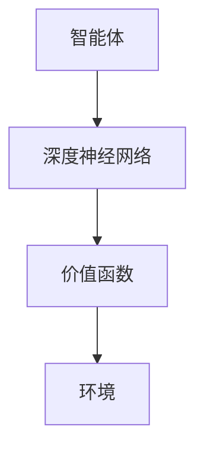

                 

# AI2.0时代：自动化技术的进展

## 关键词

- AI2.0
- 自动化技术
- 强化学习
- 生成对抗网络
- 企业应用
- 智能制造
- 智能金融

## 摘要

本文将深入探讨AI2.0时代自动化技术的进展，分析AI2.0与自动化技术的核心概念及其在企业级应用中的重要性。我们将详细解析强化学习和生成对抗网络这两种核心技术，并通过实际案例展示其在制造业和金融业中的应用。最后，我们将探讨自动化技术的开发、部署与维护策略，并提供相关学习资源，助力读者深入了解这一前沿领域。

### 第一部分: AI2.0时代的AI基础

#### 第1章: AI2.0与自动化技术概述

##### 1.1 AI2.0时代的来临

随着深度学习、强化学习等先进技术的不断发展，人工智能（AI）进入了新的发展阶段，即AI2.0时代。AI2.0不再局限于解决特定任务，而是追求在更大范围内实现智能化的自动化技术。这一时代标志着人工智能从辅助角色向核心驱动力转变，对各行各业产生了深远影响。

###### 1.1.1 从AI1.0到AI2.0的演变

AI1.0时代主要依赖于统计学习和浅层神经网络，其应用场景相对有限，主要集中在图像识别、语音识别等领域。而AI2.0时代则依托于深度学习、强化学习等核心技术，使得AI系统能够处理更复杂的任务，具备更高的自主决策能力。

###### 1.1.2 自动化技术在AI2.0中的核心角色

在AI2.0时代，自动化技术成为了推动人工智能发展的关键因素。自动化技术通过将AI算法应用于实际场景，实现了从数据采集、处理到决策的全流程自动化，提高了生产效率、降低了成本，并推动了产业升级。

###### 1.1.3 AI2.0与企业级应用开发的新范式

AI2.0时代的到来，为企业级应用开发带来了新的范式。传统的软件开发模式需要依赖人工编写代码，而AI2.0时代则利用AI算法实现自动代码生成，大幅提升了开发效率和灵活性。此外，AI2.0还推动了云计算、大数据等技术的融合，为企业提供了更加全面、高效的技术支持。

##### 1.2 自动化技术在AI2.0中的核心概念

###### 1.2.1 自动化技术的定义

自动化技术是指利用计算机、通信、控制技术等实现生产过程、业务流程等自动化的技术。其核心目标是提高生产效率、降低成本，提升企业竞争力。

###### 1.2.2 自动化技术的特点

1. 自主性：自动化技术能够自主完成特定任务，无需人工干预。
2. 高效性：自动化技术能够快速、准确地处理大量数据，提高工作效率。
3. 可持续性：自动化技术可以持续运行，减少人工操作带来的损耗。

###### 1.2.3 自动化技术与传统AI的区别

1. 应用领域：传统AI主要应用于图像识别、语音识别等单一领域，而自动化技术则更广泛地应用于生产、服务、管理等多个领域。
2. 核心技术：传统AI依赖于统计学习和浅层神经网络，而自动化技术则更多地依赖于深度学习、强化学习等先进技术。
3. 集成程度：传统AI系统通常独立运行，而自动化技术需要与现有系统深度融合，实现一体化运作。

##### 1.3 主流自动化技术简介

###### 1.3.1 强化学习

强化学习是一种通过试错和反馈不断优化决策过程的机器学习技术。其核心思想是学习如何在环境中采取行动，以最大化累积奖励。强化学习在自动驾驶、机器人控制等领域具有广泛应用。

###### 1.3.2 生成对抗网络

生成对抗网络（GAN）是一种由生成器和判别器组成的深度学习模型，通过对抗训练生成高质量的数据。GAN在图像生成、语音合成等领域取得了显著成果。

###### 1.3.3 其他主流自动化技术介绍

1. 机器学习：通过训练数据集，使计算机具备自主学习和分类能力。广泛应用于数据挖掘、自然语言处理等领域。
2. 深度学习：通过多层神经网络对数据进行建模，实现复杂的特征提取和模式识别。广泛应用于计算机视觉、语音识别等领域。
3. 大数据：通过处理海量数据，挖掘隐藏在数据中的价值。广泛应用于金融、医疗、电商等领域。

##### 1.4 AI2.0在企业中的应用前景

###### 1.4.1 自动化技术在不同行业的应用领域

1. 制造业：自动化技术广泛应用于生产线的智能化改造，实现生产过程的自动化、智能化。
2. 金融业：自动化技术应用于风险管理、信用评分、智能投顾等领域，提高金融服务的效率和准确性。
3. 服务业：自动化技术应用于客服、酒店管理等场景，提供智能化服务体验。

###### 1.4.2 企业采用AI2.0技术的优势

1. 提高生产效率：自动化技术能够实现生产过程的自动化，减少人工干预，提高生产效率。
2. 降低成本：自动化技术能够降低人力成本，减少生产过程中的损耗，提高企业盈利能力。
3. 提升服务质量：自动化技术能够提供更加精准、高效的服务，提升用户体验。
4. 深化数据分析：自动化技术能够处理大量数据，为企业提供决策支持。

###### 1.4.3 自动化技术应用的挑战与机遇

1. 技术挑战：自动化技术的实现需要强大的计算能力和算法支持，企业在技术上需要不断投入。
2. 人才挑战：自动化技术对人才需求较高，企业需要培养和引进相关专业人才。
3. 道德与法律挑战：自动化技术在应用过程中可能涉及隐私、安全等问题，需要制定相应的法律法规。
4. 市场机遇：随着AI2.0技术的发展，企业有望在各个领域获得巨大市场机遇，提升核心竞争力。

### 第二部分: 自动化技术的核心算法原理

#### 第2章: 强化学习原理讲解

强化学习（Reinforcement Learning，RL）是一种重要的机器学习范式，通过试错和反馈机制，使智能体（agent）在特定环境中学会最优策略，以实现目标最大化。强化学习在自动驾驶、游戏、机器人等领域具有广泛的应用。

##### 2.1 强化学习基础

###### 2.1.1 强化学习的定义

强化学习是一种基于奖励和惩罚信号的学习方法，其核心目标是找到一种策略，使智能体在给定环境中能够最大化累积奖励。

###### 2.1.2 强化学习的基本组成部分

强化学习系统由四个主要部分组成：智能体（agent）、环境（environment）、动作（action）和状态（state）。

1. 智能体（agent）：执行动作的主体，旨在最大化累积奖励。
2. 环境（environment）：智能体所处的外部世界，提供状态信息和奖励信号。
3. 动作（action）：智能体可执行的操作。
4. 状态（state）：智能体在环境中的当前状态。

###### 2.1.3 强化学习的评估指标

强化学习的评估指标主要包括累积奖励（cumulative reward）和策略（policy）。

1. 累积奖励：智能体在执行一系列动作后获得的总奖励。
2. 策略：智能体在不同状态下的最优动作选择。

##### 2.2 Q-学习算法

Q-学习（Q-Learning）是一种基于值函数的强化学习算法，通过不断更新Q值（即状态-动作值函数），以学习最优策略。

###### 2.2.1 Q-学习的定义

Q-学习是一种基于值函数的强化学习算法，其核心思想是学习状态-动作值函数Q(s, a)，表示在状态s下执行动作a的期望累积奖励。

###### 2.2.2 Q-学习的算法流程

Q-学习算法的基本流程如下：

1. 初始化Q值表：随机初始化Q值表。
2. 选择动作：在给定状态下，根据当前策略选择动作。
3. 执行动作：在环境中执行选定的动作。
4. 获取奖励：根据执行的动作获取奖励信号。
5. 更新Q值：根据新的状态和奖励，更新Q值表。

具体的算法流程如下：

```mermaid
graph TD
    A[初始化Q值表] --> B[选择动作a]
    B --> C[执行动作a]
    C --> D[获取奖励r]
    D --> E[更新Q值Q(s,a)]
    E --> F[判断是否完成]
    F -->|否| B
    F -->|是| G[输出最优策略]
```

###### 2.2.3 Q-学习的伪代码

```python
# Q-学习伪代码
def QLearning(Q, state, action, reward, next_state, discount_factor, learning_rate):
    # 更新Q值
    Q[state, action] = Q[state, action] + learning_rate * (reward + discount_factor * max(Q[next_state, :]) - Q[state, action])

# 初始化Q值表
Q = random_matrix(state_size, action_size)

# 训练过程
for episode in range(num_episodes):
    state = env.reset()
    done = False
    while not done:
        action = choose_action(Q, state)
        next_state, reward, done, _ = env.step(action)
        QLearning(Q, state, action, reward, next_state, discount_factor, learning_rate)
        state = next_state

# 输出最优策略
optimal_policy = argmax(Q, axis=1)
```

##### 2.3 SARSA算法

SARSA（State-Action-Reward-State-Action，SARSA）算法是一种基于策略的强化学习算法，通过同时考虑当前状态和下一个状态，以学习最优策略。

###### 2.3.1 SARSA的定义

SARSA算法是一种基于策略的强化学习算法，其核心思想是学习状态-动作值函数Q(s, a)，表示在状态s下执行动作a的期望累积奖励。

###### 2.3.2 SARSA的算法流程

SARSA算法的基本流程如下：

1. 初始化Q值表：随机初始化Q值表。
2. 选择动作：在给定状态下，根据当前策略选择动作。
3. 执行动作：在环境中执行选定的动作。
4. 获取奖励：根据执行的动作获取奖励信号。
5. 更新Q值：根据新的状态和奖励，更新Q值表。

具体的算法流程如下：

```mermaid
graph TD
    A[初始化Q值表] --> B[选择动作a]
    B --> C[执行动作a]
    C --> D[获取奖励r]
    D --> E[更新Q值Q(s,a)]
    E --> F[判断是否完成]
    F -->|否| B
    F -->|是| G[输出最优策略]
```

###### 2.3.3 SARSA的伪代码

```python
# SARSA伪代码
def SARSA(Q, state, action, reward, next_state, discount_factor, learning_rate):
    # 更新Q值
    Q[state, action] = Q[state, action] + learning_rate * (reward + discount_factor * Q[next_state, action] - Q[state, action])

# 初始化Q值表
Q = random_matrix(state_size, action_size)

# 训练过程
for episode in range(num_episodes):
    state = env.reset()
    done = False
    while not done:
        action = choose_action(Q, state)
        next_state, reward, done, _ = env.step(action)
        SARSA(Q, state, action, reward, next_state, discount_factor, learning_rate)
        state = next_state

# 输出最优策略
optimal_policy = argmax(Q, axis=1)
```

##### 2.4 深度强化学习

深度强化学习（Deep Reinforcement Learning，DRL）是强化学习与深度学习相结合的一种方法，通过神经网络来近似状态-动作值函数，从而解决传统强化学习算法难以处理的高维问题。

###### 2.4.1 深度强化学习的定义

深度强化学习是一种利用深度神经网络来近似状态-动作值函数的强化学习方法，通过学习最优策略，实现智能体在复杂环境中的自主决策。

###### 2.4.2 深度强化学习的架构

深度强化学习系统主要包括三个部分：智能体（agent）、深度神经网络和价值函数。

1. 智能体（agent）：执行动作的主体，旨在最大化累积奖励。
2. 深度神经网络：用于近似状态-动作值函数，将输入的状态信息映射到动作值。
3. 价值函数：表示智能体在给定状态下执行每个动作的期望累积奖励。

深度强化学习的架构如下：



###### 2.4.3 深度强化学习的实现方法

深度强化学习的实现方法主要包括深度确定性策略梯度（DDPG）、深度经验回放（DQN）和深度策略梯度（DPG）等。

1. 深度确定性策略梯度（DDPG）：基于确定性策略梯度（DPG）算法，使用深度神经网络近似策略和价值函数，并通过经验回放机制缓解样本相关性问题。
2. 深度经验回放（DQN）：基于深度神经网络和价值函数，使用经验回放机制和目标网络来训练智能体。
3. 深度策略梯度（DPG）：基于策略梯度算法，使用深度神经网络近似策略和价值函数，通过演员-评论家（Actor-Critic）方法进行训练。

### 第三部分: 自动化技术在企业中的应用案例

#### 第4章: 自动化技术在制造业中的应用

制造业是自动化技术的重要应用领域，通过智能化改造，可以提高生产效率、降低成本，提升企业竞争力。本章节将介绍自动化技术在制造业中的应用案例，包括智能生产线、自动化检测与质量控制、智能物流系统等。

##### 4.1 制造业的现状与挑战

随着全球制造业的不断发展，制造业面临着一系列挑战：

1. 生产效率低下：传统制造模式依赖大量人工操作，生产效率较低，难以满足市场需求。
2. 成本高：人工成本、设备维护成本等高昂，导致企业盈利能力下降。
3. 质量控制难：传统制造过程中，质量控制主要依赖人工检验，难以保证产品质量一致性。
4. 环境污染严重：传统制造模式产生大量废弃物，对环境造成严重影响。

为了应对这些挑战，制造业正逐渐向智能化、自动化方向转型。

##### 4.2 自动化技术在制造业中的应用案例

###### 4.2.1 智能生产线

智能生产线是制造业自动化改造的核心，通过将机器人、自动化设备、物联网等技术应用于生产过程，实现生产线的智能化、自动化。

1. 机器人应用：在智能生产线上，机器人承担了大量的重复性、高强度的工作，如焊接、装配、搬运等，提高了生产效率和质量。
2. 自动化设备：智能生产线上的自动化设备可以自动完成加工、检测、装配等任务，减少了人工干预，降低了生产成本。
3. 物联网技术：通过物联网技术，实现生产设备、机器人等设备的实时监控和管理，提高了生产过程的透明度和可控性。

智能生产线在实际应用中取得了显著成果，如某汽车制造企业通过引入智能生产线，生产效率提高了30%，产品质量合格率提高了15%。

###### 4.2.2 自动化检测与质量控制

自动化检测与质量控制是制造业智能化改造的重要环节，通过引入自动化检测设备和技术，实现产品质量的实时监控和自动检测。

1. 自动化检测设备：如高精度传感器、自动化检测仪器等，可以对产品的尺寸、外观、性能等指标进行自动检测，提高了检测效率和准确性。
2. 质量控制技术：如统计过程控制（SPC）、六西格玛（Six Sigma）等，通过对生产过程进行监控和分析，及时发现和消除质量问题，保证产品质量稳定。

自动化检测与质量控制在实际应用中，可以显著提高产品质量，降低不良品率。例如，某电子制造企业通过引入自动化检测和质量控制技术，不良品率降低了20%。

###### 4.2.3 智能物流系统

智能物流系统是制造业智能化改造的重要组成部分，通过引入自动化物流设备和信息技术，实现生产环节与物流环节的紧密协同，提高物流效率。

1. 自动化物流设备：如自动化仓储系统、自动化输送线、自动化分拣系统等，可以高效完成物料的存储、输送、分拣等任务。
2. 物流信息技术：如物联网技术、大数据技术、人工智能技术等，可以实现物流信息的实时采集、分析和处理，提高物流管理效率。

智能物流系统在实际应用中，可以显著提高物流效率，降低物流成本。例如，某家电制造企业通过引入智能物流系统，物流效率提高了40%，物流成本降低了15%。

##### 4.3 制造业中自动化技术的实施策略

为了实现制造业的智能化、自动化改造，企业可以采取以下实施策略：

1. 制定明确的战略规划：企业应根据自身实际情况，制定明确的智能化改造战略规划，明确目标、任务和实施步骤。
2. 引进先进的自动化技术：企业应积极引进国内外先进的自动化技术，如机器人、自动化设备、物联网技术等，提升生产效率和产品质量。
3. 培养专业人才：企业应加大对自动化技术人才的培养力度，提高员工的技能水平，为智能化改造提供人才保障。
4. 加强数据管理和分析：企业应建立完善的数据管理系统，对生产、物流等环节的数据进行实时采集、分析和处理，为决策提供数据支持。
5. 落实安全保障措施：企业应加强安全意识教育，完善安全管理制度，确保自动化技术的安全稳定运行。

通过以上策略，企业可以顺利实现智能化、自动化改造，提升竞争力。

### 第四部分: 自动化技术的开发与部署

#### 第5章: 自动化技术的开发

自动化技术的开发是一个复杂而系统的过程，涉及多个阶段和环节。本章节将详细介绍自动化技术的开发流程、实现方法和优化策略，以帮助读者更好地理解和掌握自动化技术的开发过程。

##### 5.1 自动化技术的开发流程

自动化技术的开发流程通常包括以下几个阶段：

1. 需求分析：在开发自动化技术之前，首先需要明确项目的需求，包括功能需求、性能需求、安全性需求等。需求分析的目的是确保开发团队对项目有一个清晰、明确的认识，为后续开发工作提供基础。

2. 技术选型：根据需求分析的结果，选择合适的自动化技术、开发工具和平台。技术选型应考虑技术的先进性、适用性和可扩展性，以确保开发出的系统能够满足需求。

3. 系统设计：在技术选型的基础上，进行系统设计，包括系统架构设计、模块设计、接口设计等。系统设计的目的是确保系统能够高效、稳定地运行，并具有良好的可维护性和扩展性。

4. 编码实现：根据系统设计文档，进行编码实现。编码实现是自动化技术开发的实际操作阶段，需要遵循编程规范和最佳实践，以确保代码的可靠性和可读性。

5. 测试与调试：在编码实现完成后，进行系统的测试与调试，以发现和修复潜在的问题和缺陷。测试与调试是保证系统质量的重要环节，需要严格执行。

6. 部署与上线：在测试与调试完成后，将系统部署到生产环境，并进行上线操作。部署与上线是自动化技术开发流程的最后一步，需要确保系统的稳定运行和性能。

##### 5.2 自动化技术的实现方法

自动化技术的实现方法主要包括以下几个方面：

1. 算法实现：自动化技术通常依赖于特定的算法，如机器学习算法、深度学习算法、强化学习算法等。算法实现是自动化技术的核心部分，需要根据实际需求选择合适的算法，并进行优化和调整。

2. 数据处理：自动化技术需要处理大量的数据，包括原始数据、预处理数据、特征数据等。数据处理是实现自动化技术的基础，需要采用合适的数据处理技术和工具，如数据清洗、数据集成、数据变换等。

3. 系统集成：自动化技术通常需要与其他系统进行集成，如ERP系统、MES系统、WMS系统等。系统集成是实现自动化技术在实际场景中应用的关键，需要考虑系统的兼容性、数据传输和接口设计等问题。

4. 交互界面设计：自动化技术需要为用户提供友好的交互界面，以便用户能够方便地使用系统功能。交互界面设计需要考虑用户体验、操作便捷性等因素。

##### 5.3 自动化技术的优化策略

自动化技术的优化策略主要包括以下几个方面：

1. 模型优化：针对机器学习、深度学习等算法，可以通过调整模型结构、参数优化等方法，提高模型性能和预测准确性。

2. 算法优化：针对特定应用场景，可以采用更高效的算法，如优化算法、改进算法等，提高系统性能和响应速度。

3. 数据优化：通过数据清洗、数据集成、特征提取等方法，提高数据质量，为自动化技术提供更好的数据支持。

4. 系统优化：针对自动化系统的运行环境、硬件设备、软件配置等进行优化，以提高系统稳定性和性能。

5. 兼容性优化：针对不同操作系统、硬件设备、软件平台等进行兼容性测试和优化，确保自动化技术能够在不同环境中稳定运行。

### 第五部分：自动化技术的开发与部署

#### 第6章：自动化技术的开发

在AI2.0时代，自动化技术的开发成为推动产业智能化升级的关键。本章节将详细讨论自动化技术的开发流程、实现方法以及优化策略，帮助读者了解如何有效地设计和实现自动化系统。

##### 6.1 自动化技术的开发流程

自动化技术的开发流程通常遵循以下步骤：

###### 6.1.1 需求分析

需求分析是自动化技术开发的起点，旨在明确项目的目标、功能要求和性能指标。这一阶段需要与业务团队紧密合作，收集和分析用户需求，确保开发团队对项目有清晰的理解。

1. 功能需求：明确系统需要实现的具体功能，如数据采集、处理、分析、自动化决策等。
2. 性能要求：定义系统的性能指标，如处理速度、准确度、响应时间等。
3. 用户界面：设计用户交互界面，确保用户能够轻松使用系统。

###### 6.1.2 技术选型

技术选型决定了自动化系统的技术路线和实现方式。选择合适的技术栈对于系统的性能、可维护性和扩展性至关重要。

1. 算法选型：根据应用场景选择合适的机器学习、深度学习或强化学习算法。
2. 开发工具：选择适合的开发工具和框架，如Python、Java、R等。
3. 数据存储和处理：根据数据量、处理速度和安全性要求，选择合适的数据库和数据处理工具。

###### 6.1.3 系统设计

系统设计是自动化技术开发的框架阶段，包括系统架构设计、模块划分和接口设计。

1. 系统架构：设计系统的总体架构，包括前端、后端、数据库、API接口等。
2. 模块划分：将系统划分为多个模块，每个模块负责特定的功能。
3. 接口设计：定义模块之间的交互接口，确保系统组件能够高效协作。

##### 6.2 自动化技术的实现方法

自动化技术的实现方法涉及多个层面的技术细节，包括算法实现、数据处理、系统集成和用户界面设计。

###### 6.2.1 算法实现

算法实现是自动化技术的核心，需要根据需求选择合适的算法并进行优化。

1. 机器学习算法：如回归分析、决策树、支持向量机等，用于数据分析和预测。
2. 深度学习算法：如卷积神经网络（CNN）、循环神经网络（RNN）、生成对抗网络（GAN）等，用于复杂模式识别和生成。
3. 强化学习算法：如Q-learning、SARSA、深度确定性策略梯度（DDPG）等，用于自主决策和优化。

```python
# 伪代码示例：强化学习算法实现
class Agent:
    def __init__(self, env):
        self.env = env
        self.model = build_model()  # 构建深度学习模型

    def train(self, episodes):
        for episode in range(episodes):
            state = self.env.reset()
            done = False
            while not done:
                action = self.model.predict(state)
                next_state, reward, done = self.env.step(action)
                self.model.retrain(state, action, reward, next_state)  # 模型重新训练
                state = next_state

    def act(self, state):
        return self.model.predict(state)
```

###### 6.2.2 数据处理

数据处理是自动化技术实现的关键环节，涉及数据采集、预处理、特征提取和存储。

1. 数据采集：使用传感器、API接口等获取实时数据。
2. 数据预处理：清洗数据、填充缺失值、标准化数据等。
3. 特征提取：从原始数据中提取有用特征，用于模型训练。
4. 数据存储：选择合适的数据库存储和管理数据。

```python
# 伪代码示例：数据预处理
def preprocess_data(data):
    # 数据清洗
    clean_data = clean(data)
    # 数据标准化
    normalized_data = normalize(clean_data)
    # 数据特征提取
    features = extract_features(normalized_data)
    return features
```

###### 6.2.3 系统集成

系统集成是将各个模块和组件集成到一起，确保系统能够协同工作。

1. API接口：设计模块之间的API接口，实现数据传输和功能调用。
2. 微服务架构：采用微服务架构，将系统划分为多个独立的服务模块，提高系统的灵活性和可维护性。
3. 云服务和物联网：利用云服务和物联网技术，实现系统与外部设备的连接和数据共享。

```python
# 伪代码示例：API接口设计
from flask import Flask, request, jsonify

app = Flask(__name__)

@app.route('/data', methods=['POST'])
def receive_data():
    data = request.json
    process_data(data)
    return jsonify({'status': 'success'})

def process_data(data):
    # 数据处理逻辑
    pass

if __name__ == '__main__':
    app.run()
```

###### 6.2.4 用户界面设计

用户界面设计关注用户体验，确保用户能够直观、方便地使用系统。

1. 前端界面：使用HTML、CSS、JavaScript等构建用户交互界面。
2. 移动应用：开发移动应用，提供便捷的用户体验。
3. 实时反馈：提供实时数据展示和反馈，增强用户交互。

```html
<!-- 伪代码示例：前端界面 -->
<!DOCTYPE html>
<html>
<head>
    <title>自动化系统</title>
</head>
<body>
    <h1>自动化系统</h1>
    <div id="data-display">
        <!-- 数据展示 -->
    </div>
    <script>
        function fetchData() {
            // 数据获取和更新逻辑
        }
        fetchData();
        setInterval(fetchData, 5000);  // 每5秒更新一次数据
    </script>
</body>
</html>
```

##### 6.3 自动化技术的优化策略

自动化技术的优化策略旨在提高系统的性能、稳定性和可扩展性。

###### 6.3.1 模型优化

模型优化包括调整模型结构、参数优化和超参数调整。

1. 模型结构：根据应用场景调整神经网络结构，如增加隐藏层、改变神经元数量等。
2. 参数优化：使用梯度下降、随机梯度下降等算法调整模型参数。
3. 超参数调整：调整学习率、正则化参数等，以获得最佳模型性能。

```python
# 伪代码示例：模型参数调整
from keras.models import Sequential
from keras.layers import Dense

model = Sequential()
model.add(Dense(units=64, activation='relu', input_shape=(input_shape,)))
model.add(Dense(units=1, activation='sigmoid'))

model.compile(optimizer='adam', loss='binary_crossentropy', metrics=['accuracy'])

# 调整学习率
model.optimizer.lr = 0.001
```

###### 6.3.2 算法优化

算法优化包括改进算法选择、算法组合和算法并行化。

1. 算法选择：根据问题特性选择合适的算法，如线性回归、支持向量机、决策树等。
2. 算法组合：结合多个算法的优势，形成组合算法，提高整体性能。
3. 算法并行化：使用并行计算技术，提高算法的执行速度。

```python
# 伪代码示例：并行计算
from joblib import Parallel, delayed

def process_data_in_parallel(data_list):
    return Parallel(n_jobs=-1)(delayed(process_data)(data) for data in data_list)

data_processed = process_data_in_parallel(data)
```

###### 6.3.3 性能优化

性能优化关注系统运行的效率和稳定性。

1. 系统优化：优化系统配置、网络带宽和存储容量，提高系统运行效率。
2. 缓存机制：使用缓存技术，减少数据访问时间，提高系统响应速度。
3. 异步处理：使用异步处理技术，提高系统并发能力，减少响应时间。

```python
# 伪代码示例：异步处理
from concurrent.futures import ThreadPoolExecutor

def async_process_data(data):
    # 数据处理逻辑
    pass

with ThreadPoolExecutor(max_workers=5) as executor:
    future_to_data = {executor.submit(async_process_data, data): data for data in data_list}
```

通过上述开发流程、实现方法和优化策略，可以构建高效、稳定、可扩展的自动化系统，为企业和用户提供强大的技术支持。

### 第五部分：自动化技术的开发与部署

#### 第7章：自动化技术的部署与维护

自动化技术的成功实施不仅依赖于其开发过程，还在于有效的部署与维护。本章将探讨自动化技术的部署过程、维护策略以及相关的工具选型，以确保系统在生产环境中的稳定运行和持续优化。

##### 7.1 自动化技术的部署

部署是自动化技术从开发阶段过渡到生产环境的关键步骤。以下步骤描述了自动化技术的部署过程：

###### 7.1.1 部署流程

1. 环境准备：在目标服务器上准备运行环境，包括操作系统、数据库、中间件等。
2. 应用部署：将开发完成的自动化应用程序部署到目标服务器，可以通过容器化、虚拟化或传统部署方式。
3. 配置管理：配置自动化工具和应用程序，确保其满足生产环境的要求。
4. 系统测试：在部署后进行系统测试，包括功能测试、性能测试和安全测试，确保系统稳定可靠。
5. 上线发布：通过测试后的系统正式上线，向用户提供服务。

###### 7.1.2 部署环境搭建

在部署环境搭建阶段，选择合适的工具和平台至关重要：

1. 容器化平台：如Docker和Kubernetes，用于容器化部署，提高部署效率和可移植性。
2. 持续集成/持续部署（CI/CD）：如Jenkins、GitLab CI/CD，用于自动化构建、测试和部署流程。
3. 虚拟化技术：如VMware、VirtualBox，用于虚拟化部署，提高资源利用率和灵活性。

```shell
# Docker部署示例
docker build -t myapp .
docker run -d -p 8080:80 myapp
```

###### 7.1.3 部署工具选型

部署工具的选择应根据项目的具体需求和团队的技术栈：

1. 云服务：如AWS、Azure、Google Cloud，提供完善的部署和管理服务。
2. 服务器管理工具：如Ansible、Puppet，用于自动化服务器配置和管理。
3. 日志管理工具：如ELK（Elasticsearch、Logstash、Kibana），用于日志收集、分析和监控。

```python
# Ansible配置管理示例
- hosts: webservers
  become: yes
  tasks:
    - name: Install Apache
      yum: name=httpd state=present
    - name: Start Apache service
      service: name=httpd state=started
    - name: Configure Apache
      template: src=/path/to/config.j2 dest=/etc/httpd/conf.d/myapp.conf
```

##### 7.2 自动化技术的维护

维护是自动化技术长期稳定运行的关键，包括监控、故障排除和性能优化等方面：

###### 7.2.1 维护策略

1. 监控系统：持续监控系统性能、资源使用和系统状态，及时发现潜在问题。
2. 故障排除：定期进行系统检查，定位和修复故障，确保系统正常运行。
3. 软件更新：定期更新系统软件和应用程序，修复已知漏洞和改进功能。
4. 安全管理：加强安全措施，防止系统被攻击和数据泄露。

###### 7.2.2 维护流程

1. 定期检查：定期对系统进行全面的检查，包括硬件、软件和网络组件。
2. 日志分析：分析系统日志，识别和解决潜在问题。
3. 备份和恢复：定期备份数据，确保在发生故障时能够迅速恢复。
4. 性能调优：根据监控数据，对系统进行性能调优，提高系统响应速度和稳定性。

```shell
# Logstash日志分析示例
input {
  file {
    path => "/var/log/*.log"
    type => "syslog"
  }
}
filter {
  if [type] == "syslog" {
    grok {
      match => { "message" => "%{TIMESTAMP_ISO8601:timestamp}\t%{DATA:facility}\t%{DATA:severity}\t%{DATA:tag}\t%{DATA:msg}" }
    }
  }
}
output {
  elasticsearch { hosts => ["elasticsearch:9200"] }
}
```

###### 7.2.3 维护工具选型

维护工具的选择应考虑其功能、易用性和集成性：

1. 监控工具：如Prometheus、Zabbix，用于实时监控系统性能和状态。
2. 日志管理工具：如ELK、Graylog，用于日志收集、分析和存储。
3. 故障排除工具：如Wireshark、Grafana，用于网络分析和性能监控。
4. 自动化工具：如Ansible、Puppet，用于自动化部署和配置管理。

```python
# Prometheus监控示例
from prometheus_client import start_http_server, Summary

REQUEST_TIME = Summary('request_time_seconds', 'Time spent processing request')

@REQUEST_TIME.time()
def process_request(request):
    # 处理请求逻辑
    time.sleep(random.random())
    return "Hello, World!"

if __name__ == '__main__':
    start_http_server(8000)
```

通过遵循上述部署与维护策略，利用合适的工具和技术，可以确保自动化系统在生产环境中的稳定运行和持续优化，为企业提供可靠的技术支持。

### 附录

#### 附录A：自动化技术相关资源

为了帮助读者深入了解自动化技术，本附录提供了一些相关的开源框架、学习资料和论文推荐。

##### A.1 自动化技术开源框架

1. **TensorFlow**：由Google开发的开源机器学习框架，支持强化学习、生成对抗网络等多种算法。
   - 官网：[TensorFlow官网](https://www.tensorflow.org)

2. **PyTorch**：由Facebook开发的开源深度学习框架，以其灵活的动态计算图著称。
   - 官网：[PyTorch官网](https://pytorch.org)

3. **Keras**：基于Theano和TensorFlow的高层神经网络API，简化了深度学习模型的构建和训练。
   - 官网：[Keras官网](https://keras.io)

##### A.2 自动化技术学习资料

1. **书籍推荐**：
   - 《深度学习》（Deep Learning）—— Ian Goodfellow、Yoshua Bengio、Aaron Courville 著
   - 《强化学习》（Reinforcement Learning: An Introduction）—— Richard S. Sutton、Andrew G. Barto 著
   - 《生成对抗网络》（Generative Adversarial Nets）—— Ian Goodfellow et al. 著

2. **网络课程推荐**：
   - Coursera上的“深度学习”课程（Deep Learning Specialization）—— Andrew Ng 教授
   - Udacity的“强化学习纳米学位”（Reinforcement Learning Nanodegree）
   - edX上的“生成对抗网络课程”（Generative Adversarial Networks）

3. **论文推荐**：
   - “A Survey on Generative Adversarial Networks” —— Ludovic Besson et al.
   - “Reinforcement Learning: A Survey” —— Yisong Yue
   - “Deep Reinforcement Learning for Navigation in High-Dimensional Environments” —— Thomas Hausknecht et al.

通过这些资源，读者可以系统地学习和掌握自动化技术的相关理论和实践，为在AI2.0时代中的发展打下坚实基础。

### 作者信息

- 作者：AI天才研究院/AI Genius Institute & 禅与计算机程序设计艺术 /Zen And The Art of Computer Programming

