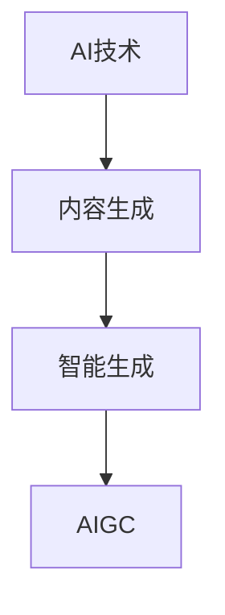

                 

### 文章标题：AIGC从入门到实战：AIGC 的发展历程

> 关键词：AIGC、人工智能、生成内容、技术架构、发展历程、应用领域、项目实战

> 摘要：本文将从AIGC的定义、技术架构、发展历程、应用领域以及项目实战等多个角度，深入探讨AIGC（AI-Generated Content）的方方面面。通过逻辑清晰、结构紧凑、简单易懂的叙述方式，带领读者全面了解AIGC这一前沿技术，从入门到实战，一网打尽AIGC的核心知识和应用技巧。

#### 第一部分：AIGC基础

##### 第1章：AIGC概述

在这一章节中，我们将对AIGC进行全面的介绍，涵盖其定义、核心概念以及技术架构。

**1.1 AIGC的定义与核心概念**

**AIGC的概念与演进**

AIGC，全称为AI-Generated Content，即人工智能生成内容。它是一种利用人工智能技术，通过机器学习算法生成或创作内容的系统或方法。AIGC的概念起源于人工智能和生成模型的发展，经历了从内容生成到智能生成的过程。

- **内容生成**：早期的人工智能系统主要专注于文本、图片、音频等内容的生成。例如，通过简单的模板填充或随机生成方式，生成具有一定格式和结构的内容。
- **智能生成**：随着深度学习技术的进步，生成模型开始融合更多的智能元素。这些模型不仅能够生成内容，还能根据输入信息进行智能推理和创作，产生更符合人类需求的优质内容。

**核心概念联系**

为了更好地理解AIGC的核心概念，我们可以通过以下Mermaid流程图进行展示：



**AIGC的技术特点**

AIGC具有以下技术特点：

- **生成能力**：能够自动生成大量高质量的内容，满足不同场景的需求。
- **智能推理**：基于深度学习等先进算法，能够进行智能推理，创作出更具有创意和个性化的内容。
- **高效性**：利用大数据和计算能力，快速生成内容，提高生产效率。

**1.2 AIGC的技术架构**

AIGC的技术架构主要包括以下几个部分：

- **输入模块**：负责接收外部输入，如文本、图片、音频等。
- **预处理模块**：对输入数据进行预处理，包括数据清洗、特征提取等。
- **生成模型**：核心部分，利用深度学习等算法生成内容。
- **后处理模块**：对生成的内容进行后处理，如格式调整、内容优化等。

以下是一个简单的AIGC技术架构伪代码示例：

```python
class AIGC:
    def __init__(self):
        self.input_module = InputModule()
        self.preprocess_module = PreprocessModule()
        self.model = GeneratorModel()
        self.postprocess_module = PostprocessModule()

    def generate_content(self, input_data):
        preprocessed_data = self.preprocess_module.preprocess(input_data)
        generated_content = self.model.generate(preprocessed_data)
        final_content = self.postprocess_module.postprocess(generated_content)
        return final_content
```

**AIGC的核心算法原理讲解**

AIGC的核心算法通常是基于生成对抗网络（GAN）或其他生成模型。以下是一个简单的GAN算法原理讲解：

**生成器（Generator）**：生成器模型的目标是生成逼真的数据，使其在分布上难以区分于真实数据。

**判别器（Discriminator）**：判别器模型的目标是判断输入数据是真实数据还是生成数据。

**损失函数**：通常使用对抗损失函数来训练生成器和判别器，使得生成器生成的数据越来越真实，判别器越来越难以区分。

**数学模型与公式**

生成器的损失函数可以表示为：

$$ L_G = -\mathbb{E}_{z \sim p_z(z)}[\log(D(G(z)))] $$

判别器的损失函数可以表示为：

$$ L_D = -\mathbb{E}_{x \sim p_x(x)}[\log(D(x))] - \mathbb{E}_{z \sim p_z(z)}[\log(1 - D(G(z)))] $$

其中，$G(z)$表示生成器生成的数据，$D(x)$表示判别器对真实数据的判断概率。

**举例说明**

例如，可以使用AIGC生成一张具有特定风格的图片。假设我们想要生成一张梵高的《星夜》风格的图片，我们可以按照以下步骤进行：

1. 收集梵高《星夜》的多张图片作为输入数据。
2. 使用生成对抗网络（GAN）训练生成模型，使其能够生成具有《星夜》风格的图片。
3. 输入一张普通图片，通过生成模型生成一张具有《星夜》风格的图片。

##### 第2章：AIGC的发展历程

在这一章节中，我们将回顾AIGC的发展历程，从起源到现阶段的发展，探讨其技术演进和应用扩展。

**2.1 AIGC的起源与发展**

AIGC的起源可以追溯到人工智能和生成模型的发展。早期的人工智能系统主要集中于规则推理和符号计算，而生成模型的研究则始于20世纪80年代的神经网络研究。随着深度学习技术的兴起，生成模型得到了快速发展，尤其是生成对抗网络（GAN）的提出，为AIGC的发展奠定了基础。

**AIGC的发展阶段**

AIGC的发展可以分为以下几个阶段：

**早期阶段**：基于生成对抗网络（GAN）的探索。GAN由Ian Goodfellow等人于2014年提出，成为AIGC领域的重要里程碑。在这个阶段，研究者主要关注GAN的稳定性和生成质量。

**发展阶段**：生成模型与解码器的融合。在这个阶段，研究者开始将生成模型与解码器结合，以提高生成内容的多样性和质量。例如，变分自编码器（VAE）和自回归生成模型（AR）等。

**成熟阶段**：大型预训练模型的应用。随着计算能力和数据规模的提升，大型预训练模型如GPT-3、DALL-E等开始应用于AIGC领域，实现了更高质量的生成内容和更广泛的适用场景。

**2.2 AIGC的关键里程碑**

以下是一些AIGC领域的关键里程碑：

- **2014年**：生成对抗网络（GAN）的提出，为AIGC的发展奠定了基础。
- **2016年**：GAN在ImageNet图像识别比赛中取得了优异的成绩，引起了广泛关注。
- **2018年**：DALL-E模型提出，实现了基于文本描述生成图像的能力。
- **2019年**：GPT-2模型发布，成为当时最大的预训练语言模型。
- **2020年**：GPT-3模型发布，展现了超强的文本生成能力。

**2.3 AIGC的发展趋势**

AIGC的发展趋势主要表现在以下几个方面：

- **技术趋势**：大型预训练模型的应用，如GPT-3、DALL-E等，实现了更高质的生成内容和更广泛的适用场景。
- **应用趋势**：AIGC在文字生成、图片生成、视频生成等各个领域的应用不断扩展，成为内容创作的重要工具。
- **融合趋势**：AIGC与其他领域如自然语言处理（NLP）、计算机视觉（CV）等的融合，推动了跨领域技术的发展。

##### 第3章：AIGC在各个领域的应用

在这一章节中，我们将详细探讨AIGC在文字生成、图片生成和视频生成等各个领域的应用，介绍其技术原理和应用实例。

**3.1 文字生成**

**技术原理讲解**

文字生成是AIGC领域的一个重要应用方向，通过深度学习模型生成具有特定风格或主题的文本。以下是一个简单的文字生成模型伪代码示例：

```python
class TextGenerator:
    def __init__(self):
        self.model = LSTMModel()

    def generate_text(self, seed_text):
        generated_text = self.model.generate(seed_text)
        return generated_text
```

**应用实例**

文字生成在多个场景中具有广泛的应用，例如：

- **自动写作**：利用AIGC技术生成新闻报道、博客文章、小说等。
- **智能客服**：生成个性化回复，提高客服效率和用户体验。
- **教育辅助**：生成教学材料、习题和解答，辅助教师和学生。

**3.2 图片生成**

**技术原理讲解**

图片生成是AIGC领域的另一个重要应用方向，通过生成模型生成具有特定风格或主题的图像。以下是一个简单的图片生成模型伪代码示例：

```python
class ImageGenerator:
    def __init__(self):
        self.model = GANModel()

    def generate_image(self, style, content):
        generated_image = self.model.generate(style, content)
        return generated_image
```

**应用实例**

图片生成在多个场景中具有广泛的应用，例如：

- **智能设计**：生成具有创意的服装、家居、建筑设计等。
- **虚拟现实**：生成虚拟场景、角色等，提高虚拟现实体验。
- **游戏开发**：生成游戏角色、场景等，丰富游戏内容。

**3.3 视频生成**

**技术原理讲解**

视频生成是AIGC领域的最新应用方向，通过生成模型生成具有特定风格或主题的视频。以下是一个简单的视频生成模型伪代码示例：

```python
class VideoGenerator:
    def __init__(self):
        self.model = VQ-VAEModel()

    def generate_video(self, style, content):
        generated_video = self.model.generate(style, content)
        return generated_video
```

**应用实例**

视频生成在多个场景中具有广泛的应用，例如：

- **影视制作**：生成电影、电视剧、广告等。
- **教育视频**：生成教学视频、培训视频等。
- **实时渲染**：生成实时渲染的视频内容，如游戏直播等。

#### 第二部分：AIGC实战

##### 第4章：AIGC在实际项目中的应用

在这一章节中，我们将通过具体的实际项目，介绍AIGC的实战应用。我们将从项目背景与目标、系统设计与实现，以及项目效果与评估等方面进行详细探讨。

**4.1 项目背景与目标**

本项目旨在利用AIGC技术实现一款智能客服系统，通过生成模型生成个性化回复，提高客服效率和用户体验。

**4.2 系统设计与实现**

**开发环境搭建**

为了实现本项目，我们需要搭建以下开发环境：

- **硬件环境**：高性能计算服务器，配备足够的GPU资源。
- **软件环境**：Python、TensorFlow、Keras等深度学习框架。

**源代码实现**

以下是一个简单的AIGC智能客服系统的源代码实现：

```python
import tensorflow as tf
from tensorflow.keras.models import Sequential
from tensorflow.keras.layers import LSTM, Dense, Embedding

# 训练生成模型
def train_generator():
    model = Sequential()
    model.add(Embedding(vocab_size, embedding_dim))
    model.add(LSTM(units=256, return_sequences=True))
    model.add(Dense(units=vocab_size, activation='softmax'))

    model.compile(optimizer='adam', loss='categorical_crossentropy')
    return model

generator = train_generator()

# 生成个性化回复
def generate_reply(input_text):
    input_sequence = preprocess_input(input_text)
    generated_sequence = generator.predict(input_sequence)
    generated_text = decode_generated_sequence(generated_sequence)
    return generated_text

# 项目效果与评估**

**性能评估指标**

为了评估AIGC智能客服系统的性能，我们可以使用以下指标：

- **回复准确率**：衡量生成模型生成的回复与真实回复的匹配程度。
- **回复多样性**：衡量生成模型生成的回复的多样性。
- **回复速度**：衡量生成模型生成回复的效率。

**用户体验评估**

为了评估用户对AIGC智能客服系统的满意度，我们可以进行以下调查：

- **满意度调查**：通过问卷或访谈方式收集用户对系统满意度的反馈。
- **用户行为分析**：分析用户与系统的交互行为，如回复次数、咨询问题类型等。

##### 第5章：AIGC的挑战与未来

在这一章节中，我们将探讨AIGC当前面临的挑战以及未来的发展趋势。

**5.1 AIGC面临的挑战**

AIGC在发展过程中面临着多种挑战：

- **技术挑战**：包括模型可解释性、数据隐私、模型稳定性等。
  - **模型可解释性**：由于深度学习模型的黑箱特性，用户难以理解模型的工作原理，导致信任度降低。
  - **数据隐私**：生成模型训练过程中涉及大量用户数据，可能引发隐私泄露风险。
  - **模型稳定性**：生成模型在训练和生成过程中可能存在过拟合、梯度消失等问题，影响模型稳定性。

- **应用挑战**：包括适用范围、成本控制等。
  - **适用范围**：生成模型在不同领域和应用场景中的适用性存在差异，需要针对特定场景进行定制化开发。
  - **成本控制**：生成模型训练和部署过程中需要大量计算资源和数据存储，成本较高。

**5.2 AIGC的未来发展趋势**

AIGC在未来具有广阔的发展前景：

- **技术发展趋势**：
  - **大型预训练模型**：随着计算能力和数据规模的提升，大型预训练模型将在AIGC领域发挥重要作用。
  - **跨模态生成**：结合自然语言处理、计算机视觉等多模态信息，实现更高质量的生成内容。
  - **可解释性研究**：通过模型解释技术，提高用户对生成模型的信任度。

- **应用发展趋势**：
  - **智能创作**：生成模型将在文学、音乐、艺术等领域发挥重要作用，推动创作方式的变革。
  - **个性化推荐**：基于用户行为和兴趣生成个性化推荐内容，提高用户体验。

**5.3 AIGC的社会影响**

AIGC在带来巨大机遇的同时，也引发了一系列社会问题：

- **正面影响**：
  - **提高生产力**：通过自动生成内容，提高工作效率，降低创作成本。
  - **丰富娱乐体验**：生成模型在游戏、影视等领域的应用，丰富了用户娱乐体验。

- **负面影响**：
  - **隐私侵犯**：生成模型训练和部署过程中涉及大量用户数据，可能引发隐私泄露风险。
  - **伦理问题**：生成模型生成的虚假内容可能引发伦理问题，如虚假新闻、伪造证据等。

**5.4 AIGC的发展趋势与展望**

AIGC在未来将朝着以下方向发展：

- **技术趋势**：随着计算能力和数据规模的提升，AIGC技术将朝着更高效、更智能、更安全的方向发展。
- **应用趋势**：AIGC将在文学、音乐、艺术、游戏、广告等多个领域得到广泛应用，推动内容创作的变革。
- **产业链趋势**：AIGC将形成完整的产业链，涉及硬件设备、算法开发、应用平台等多个环节。

**5.5 AIGC与相关领域的关系**

AIGC与多个领域密切相关，共同推动人工智能技术的发展：

- **与自然语言处理（NLP）的关系**：AIGC与NLP在文本生成、情感分析、机器翻译等领域有广泛的应用融合。
- **与计算机视觉（CV）的关系**：AIGC与CV在图像生成、视频生成、目标检测等领域有广泛的应用融合。
- **与其他领域的关系**：AIGC还与游戏开发、影视制作、广告营销等多个领域密切相关，共同推动内容创作的创新。

通过以上内容，我们详细介绍了AIGC的基础知识、发展历程、应用领域以及实际项目应用。AIGC作为人工智能领域的重要分支，具有广阔的发展前景和深远的社会影响。在未来，随着技术的不断进步和应用场景的不断拓展，AIGC将在更多领域发挥重要作用，为人类带来更多创新和便利。让我们一起期待AIGC的精彩未来！

