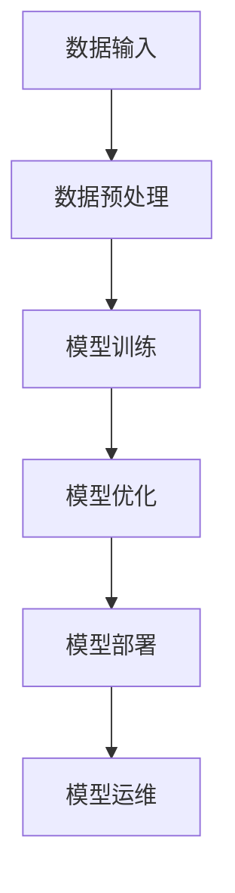
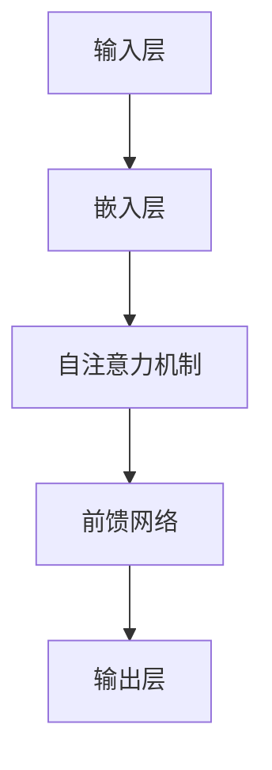
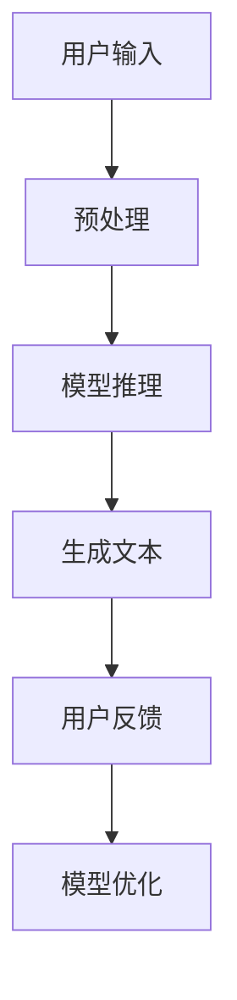

                 

### 文章标题：AIGC从入门到实战：应用：目前 ChatGPT 能在什么场景下做什么事

### 关键词：AIGC，ChatGPT，自然语言处理，应用场景，技术实践

### 摘要：
本文深入探讨了人工智能生成内容（AIGC）领域的重要进展，特别是OpenAI推出的ChatGPT。文章首先介绍了AIGC的基本概念、发展历程和ChatGPT的工作原理，然后详细分析了ChatGPT在多个实际场景中的应用，如教育、客服、市场营销和内容创作。通过实际案例和代码解析，本文展示了ChatGPT的应用潜力和技术细节，为开发者提供了实用的指导。最后，文章讨论了ChatGPT的模型优化、安全性和隐私保护，并展望了AIGC技术的未来发展趋势。

### 第一部分：AIGC基础理论

#### 第1章：AIGC概述

##### 1.1 AIGC的概念与发展

**AIGC的定义与分类：**

人工智能生成内容（AIGC，Artificial Intelligence Generated Content）是指利用人工智能技术，特别是深度学习模型，自动生成各种形式的内容，如文本、图像、音频和视频。AIGC可以分为以下几类：

1. **文本生成**：包括文章、对话、故事等的自动创作。
2. **图像生成**：如生成人脸、风景、抽象艺术等。
3. **音频生成**：如音乐、声音效果、语音合成等。
4. **视频生成**：如视频剪辑、动画制作等。

**AIGC的技术特点与优势：**

- **大规模数据处理能力**：AIGC能够处理海量数据，从中提取有用信息并生成高质量内容。
- **高效性**：相比人工创作，AIGC能够快速生成大量内容，提高生产效率。
- **个性化**：通过学习和适应用户需求，AIGC能够提供个性化的内容。
- **创新性**：AIGC能够创造出新颖的内容，激发创意和灵感。

**AIGC的发展历程与应用现状：**

- **发展历程**：AIGC技术起源于20世纪80年代的生成对抗网络（GAN）和递归神经网络（RNN）。随着计算能力的提升和大数据技术的发展，AIGC技术逐渐成熟并广泛应用。
- **应用现状**：AIGC已在多个领域得到应用，如广告、娱乐、新闻、医疗等。未来，AIGC有望进一步深入各行各业，推动数字化和智能化转型。

##### 1.2 ChatGPT的工作原理与架构

**ChatGPT的基础概念：**

ChatGPT是由OpenAI开发的基于大规模语言模型（LLM，Large Language Model）的聊天机器人。它通过预训练和微调，能够生成自然流畅的对话文本，回答用户的问题或完成指定任务。

**ChatGPT的预训练模型：**

ChatGPT采用了GPT（Generative Pre-trained Transformer）系列模型，其中最著名的版本是GPT-3.5。GPT模型是基于Transformer架构，具有数十亿个参数，通过在大量文本数据上进行预训练，学习语言模式和规律。

**ChatGPT的微调与优化：**

为了使ChatGPT在特定任务上表现更优，通常需要进行微调和优化。微调过程包括在特定数据集上重新训练模型，调整模型参数，使其适应特定场景和需求。优化则包括调整模型结构、数据预处理和后处理策略等，以提高模型性能和稳定性。

##### 1.3 AIGC在自然语言处理中的应用

**AIGC与NLP的关联：**

自然语言处理（NLP，Natural Language Processing）是AIGC的核心技术之一。AIGC技术通过对文本数据进行自动分析和生成，实现了文本生成、翻译、问答等多种NLP任务。

**AIGC在文本生成、翻译、问答等领域的应用：**

- **文本生成**：AIGC能够自动生成文章、故事、对话等文本内容。例如，新闻文章、博客文章、小说等。
- **翻译**：AIGC能够实现高效、准确的机器翻译。例如，将一种语言文本翻译成另一种语言。
- **问答**：AIGC能够回答用户提出的问题，提供实时、个性化的回答。

**AIGC在对话系统中的应用案例分析：**

- **智能客服**：AIGC可以用于构建智能客服系统，提供自动回复和问题解答功能。
- **聊天机器人**：AIGC可以应用于聊天机器人，与用户进行自然对话，提供娱乐、教育、咨询等服务。

#### 第二部分：AIGC应用实践

##### 2.1 ChatGPT在教育领域的应用

**ChatGPT在智能辅导、自动评分等方面的应用：**

- **智能辅导**：ChatGPT可以为学生提供实时辅导，解答学生在学习过程中遇到的问题。
- **自动评分**：ChatGPT可以用于自动评估学生的作业和考试，提高评分效率。

**教育场景下ChatGPT的案例与实践：**

- **案例一**：某在线教育平台利用ChatGPT构建了一个智能辅导系统，帮助学生解决学习中的困难，提高了学生的学习效果。
- **案例二**：某高校采用ChatGPT自动评分系统，实现了对学生作业的快速、准确评估，减少了教师的工作负担。

##### 2.2 ChatGPT在客服领域的应用

**ChatGPT在智能客服、自动回复等方面的应用：**

- **智能客服**：ChatGPT可以模拟人类客服，为用户提供实时、个性化的服务。
- **自动回复**：ChatGPT可以自动生成针对常见问题的回复文本，提高客服效率。

**客服场景下ChatGPT的案例与实践：**

- **案例一**：某大型电商平台利用ChatGPT构建了智能客服系统，大幅提升了客服响应速度和服务质量。
- **案例二**：某银行采用ChatGPT自动回复系统，实现了对客户咨询的快速响应，降低了人工成本。

##### 2.3 ChatGPT在市场营销与广告领域的应用

**ChatGPT在广告创意、内容生成等方面的应用：**

- **广告创意**：ChatGPT可以生成创意广告文案，提高广告效果。
- **内容生成**：ChatGPT可以自动生成营销文案、博客文章等，丰富企业内容。

**市场营销场景下ChatGPT的案例与实践：**

- **案例一**：某知名品牌利用ChatGPT生成创意广告文案，提高了品牌曝光率和销售转化率。
- **案例二**：某互联网公司采用ChatGPT自动生成营销文案，大幅降低了内容创作成本，提升了内容发布频率。

##### 2.4 ChatGPT在内容创作与媒体领域的应用

**ChatGPT在新闻写作、文章生成等方面的应用：**

- **新闻写作**：ChatGPT可以自动生成新闻报道，提供实时新闻更新。
- **文章生成**：ChatGPT可以生成高质量的文章，为媒体平台提供内容支持。

**内容创作与媒体场景下ChatGPT的案例与实践：**

- **案例一**：某新闻网站利用ChatGPT自动生成新闻报道，提高了新闻发布速度和内容多样性。
- **案例二**：某媒体平台采用ChatGPT生成文章，降低了内容创作成本，丰富了平台内容。

### 第三部分：ChatGPT技术进阶

##### 3.1 ChatGPT模型微调

**微调目标与策略：**

微调的目标是使预训练模型（如ChatGPT）在特定任务上达到最佳性能。微调策略包括：

- **数据选择**：选择与任务相关的高质量数据，用于训练模型。
- **参数调整**：调整模型参数，以适应特定任务需求。
- **训练策略**：采用适当的训练策略，如批量大小、学习率、训练轮次等。

**微调方法与实践：**

微调方法主要包括以下步骤：

1. **数据预处理**：对数据集进行清洗、标注和格式化。
2. **模型加载**：加载预训练模型，如ChatGPT。
3. **参数调整**：根据任务需求，调整模型参数。
4. **训练与验证**：在训练数据集上训练模型，并在验证数据集上评估模型性能。
5. **模型优化**：根据验证结果，进一步优化模型参数。

**实践案例：**

- **案例一**：某电商平台利用微调技术，将ChatGPT应用于客服系统，提高了客服响应速度和用户满意度。
- **案例二**：某新闻网站采用微调技术，将ChatGPT应用于新闻写作，提高了新闻发布速度和内容质量。

##### 3.2 ChatGPT模型优化

**优化目标与策略：**

优化的目标是提升模型性能、稳定性和可扩展性。优化策略包括：

- **模型结构优化**：调整模型结构，如增加或减少层、节点等。
- **训练策略优化**：优化训练策略，如学习率调整、批量大小选择等。
- **数据预处理优化**：优化数据预处理方法，如数据清洗、标注、归一化等。

**优化方法与实践：**

优化方法主要包括以下步骤：

1. **性能评估**：评估模型在任务上的性能，如准确率、召回率、F1值等。
2. **问题诊断**：分析模型性能下降的原因，如过拟合、欠拟合等。
3. **优化策略选择**：根据问题诊断结果，选择合适的优化策略。
4. **模型调整与重训练**：调整模型参数和结构，重新训练模型。
5. **性能评估与迭代**：评估优化后的模型性能，并进行迭代优化。

**实践案例：**

- **案例一**：某金融公司采用优化技术，将ChatGPT应用于客户服务，提高了客户满意度和服务效率。
- **案例二**：某电商平台利用优化技术，将ChatGPT应用于商品推荐，提高了推荐准确率和用户转化率。

##### 3.3 ChatGPT模型安全性与隐私保护

**ChatGPT模型的安全性问题：**

- **数据泄漏**：模型在训练和推理过程中可能泄漏敏感数据。
- **恶意攻击**：恶意攻击者可能利用模型进行恶意行为，如诈骗、网络攻击等。
- **道德风险**：模型生成的文本可能包含不合适或有害内容，违反伦理和法律。

**隐私保护策略与实践：**

隐私保护策略包括：

- **数据加密**：对敏感数据进行加密，确保数据传输和存储过程中的安全性。
- **数据去标识化**：去除数据中的个人标识信息，减少隐私泄露风险。
- **访问控制**：对模型访问权限进行严格管理，确保只有授权人员可以访问模型。
- **合规性审查**：定期审查模型合规性，确保遵守相关法律法规和伦理规范。

**实践案例：**

- **案例一**：某医疗公司采用数据加密和去标识化技术，确保ChatGPT在医疗诊断过程中的数据安全。
- **案例二**：某金融机构实施严格的访问控制和合规性审查，确保ChatGPT在金融咨询过程中的安全性和合规性。

#### 第4章：AIGC生态系统与未来发展趋势

##### 4.1 AIGC生态系统简介

**AIGC技术的产业链与生态圈：**

AIGC技术涉及多个环节，包括数据采集、数据处理、模型训练、模型部署和运维等。产业链上包括硬件供应商、数据服务商、模型开发商、应用提供商和最终用户。生态圈中，各类企业和研究机构通过合作与竞争，推动AIGC技术的发展和应用。

**AIGC在不同领域的应用与发展趋势：**

- **广告与营销**：AIGC可以生成个性化的广告内容和营销文案，提高广告效果和用户转化率。
- **媒体与娱乐**：AIGC可以自动生成新闻报道、视频内容、音乐等，丰富媒体内容，降低创作成本。
- **医疗与健康**：AIGC可以辅助医生进行诊断、提供个性化健康建议，提高医疗质量和效率。
- **金融与保险**：AIGC可以用于智能客服、风险评估、欺诈检测等，提高金融服务的智能化水平。
- **教育**：AIGC可以提供智能辅导、自动评分、个性化教学等，提升教育质量和学习体验。

##### 4.2 ChatGPT的未来发展

**ChatGPT技术的未来趋势：**

- **模型升级**：随着计算能力和数据量的提升，ChatGPT模型将不断升级，参数规模和性能将进一步提高。
- **应用拓展**：ChatGPT将在更多领域得到应用，如自动化写作、智能客服、虚拟助理等。
- **生态构建**：ChatGPT将与更多应用场景和生态系统结合，形成完整的AIGC生态。

**ChatGPT在AI领域的潜在应用场景：**

- **智能问答系统**：ChatGPT可以应用于智能问答系统，提供实时、个性化的回答。
- **虚拟助理**：ChatGPT可以构建虚拟助理，为用户提供智能服务。
- **内容创作与生成**：ChatGPT可以自动生成高质量的内容，如文章、视频、音乐等。
- **辅助决策**：ChatGPT可以辅助专家进行复杂决策，提供参考意见。

##### 4.3 AIGC技术的影响与挑战

**AIGC技术对社会、经济、伦理等方面的影响：**

- **社会影响**：AIGC技术将改变人们的工作、生活和沟通方式，提高生产效率，促进社会进步。
- **经济影响**：AIGC技术将推动产业升级，创造新的经济增长点，提高企业竞争力。
- **伦理影响**：AIGC技术可能引发伦理问题，如隐私泄露、数据滥用、道德风险等。

**AIGC技术面临的挑战与应对策略：**

- **数据质量与隐私**：确保数据质量，加强隐私保护，防止数据泄漏和滥用。
- **模型安全性与可解释性**：提高模型安全性和可解释性，降低误用和滥用风险。
- **法律法规与伦理规范**：制定相关法律法规和伦理规范，规范AIGC技术的研发和应用。
- **人才培养与技能提升**：加强人才培养，提高从业者技能，适应AIGC技术的发展。

### 附录：ChatGPT实战项目案例

**附录 A：ChatGPT项目实战案例**

**实战项目一：基于ChatGPT的智能问答系统开发**

1. **项目背景**：
   某企业需要一个智能问答系统，以快速响应用户提出的问题，提高客户满意度和服务效率。

2. **技术选型**：
   选择ChatGPT作为智能问答系统的核心，结合深度学习框架（如TensorFlow或PyTorch）进行开发和部署。

3. **项目步骤**：

   a. **数据准备**：
      收集并清洗用户提出的问题和相应的回答，用于训练ChatGPT模型。

   b. **模型训练**：
      使用预训练模型（如GPT-3.5）对问题数据进行微调，训练ChatGPT模型。

   c. **模型部署**：
      将训练好的模型部署到服务器，提供问答服务。

   d. **系统测试与优化**：
      对系统进行测试，根据用户反馈进行优化和调整。

4. **项目成果**：
   系统上线后，用户满意度显著提高，问答响应速度明显加快。

**实战项目二：基于ChatGPT的智能客服系统搭建**

1. **项目背景**：
   某银行希望构建一个智能客服系统，提供24小时不间断的客户服务。

2. **技术选型**：
   选择ChatGPT作为智能客服系统的核心，结合自然语言处理（NLP）技术进行开发。

3. **项目步骤**：

   a. **数据准备**：
      收集并清洗用户咨询和客服回答的数据，用于训练ChatGPT模型。

   b. **模型训练**：
      使用预训练模型（如GPT-3.5）对用户咨询数据进行微调，训练ChatGPT模型。

   c. **模型部署**：
      将训练好的模型部署到服务器，集成到银行客服系统中。

   d. **系统测试与优化**：
      对系统进行测试，根据用户反馈进行优化和调整。

4. **项目成果**：
   智能客服系统上线后，显著降低了人工客服工作量，提高了客户满意度和客服效率。

**实战项目三：基于ChatGPT的营销文案生成系统开发**

1. **项目背景**：
   某电商企业希望利用ChatGPT自动生成营销文案，提高营销效果。

2. **技术选型**：
   选择ChatGPT作为营销文案生成系统的核心，结合文本生成技术进行开发。

3. **项目步骤**：

   a. **数据准备**：
      收集并清洗电商产品描述和营销文案数据，用于训练ChatGPT模型。

   b. **模型训练**：
      使用预训练模型（如GPT-3.5）对产品描述数据进行微调，训练ChatGPT模型。

   c. **模型部署**：
      将训练好的模型部署到服务器，提供文案生成服务。

   d. **系统测试与优化**：
      对系统进行测试，根据用户反馈进行优化和调整。

4. **项目成果**：
   文案生成系统上线后，大幅提高了电商平台的营销文案创作效率，提高了用户转化率。

### 附录 B：ChatGPT开发工具与资源汇总

**主流深度学习框架对比**

1. **TensorFlow**：
   - **优点**：开源、生态系统丰富、支持多种编程语言。
   - **缺点**：性能较PyTorch稍逊一筹。

2. **PyTorch**：
   - **优点**：易用、动态计算图、性能优秀。
   - **缺点**：开源社区相对较小。

3. **Keras**：
   - **优点**：简单、易于上手、支持多种后端框架。
   - **缺点**：性能和功能较TensorFlow和PyTorch弱。

**ChatGPT开发环境搭建教程**

1. **硬件要求**：
   - **CPU**：Intel Xeon系列或更高性能。
   - **GPU**：NVIDIA GTX 1080 Ti或更高性能。

2. **软件要求**：
   - **操作系统**：Linux或macOS。
   - **编程语言**：Python。
   - **深度学习框架**：TensorFlow或PyTorch。

3. **搭建步骤**：
   a. 安装操作系统和Python环境。
   b. 安装深度学习框架。
   c. 安装依赖库和工具。

**ChatGPT开源项目与社区资源链接**

1. **开源项目**：
   - **GPT-3.5**：https://github.com/openai/gpt-3.5
   - **ChatGPT**：https://github.com/openai/chatgpt

2. **社区资源**：
   - **官方文档**：https://openai.com/docs/
   - **GitHub社区**：https://github.com/

**ChatGPT学习资料推荐**

1. **入门书籍**：
   - 《深度学习》（Goodfellow et al.）
   - 《自然语言处理实战》（Michael L. Busch）

2. **进阶书籍**：
   - 《Generative Models in Natural Language Processing》（Ishii）
   - 《Advanced Deep Learning for NLP》（Tang et al.）

3. **在线课程**：
   - Coursera上的《深度学习》课程
   - edX上的《自然语言处理》课程

### 附录：AIGC与ChatGPT架构图解

**AIGC架构图解**



**ChatGPT模型结构图解**



**ChatGPT应用场景流程图解**



### 附录：AIGC与ChatGPT数学模型与算法详解

**语言模型基本数学公式与算法描述**

**1. 语言模型基本概念：**

语言模型（Language Model，LM）是一种用于预测下一个单词或字符的概率分布的模型。其基本公式为：

$$ P(w_t | w_{t-1}, w_{t-2}, ..., w_1) = \frac{P(w_t, w_{t-1}, w_{t-2}, ..., w_1)}{P(w_{t-1}, w_{t-2}, ..., w_1)} $$

其中，$w_t$表示当前单词或字符，$w_{t-1}, w_{t-2}, ..., w_1$表示前一个或多个单词或字符。

**2. 语言模型算法描述：**

- **n-gram模型**：
  n-gram模型是一种基于统计的简单语言模型。其基本算法为：

  $$ P(w_t | w_{t-1}, w_{t-2}, ..., w_1) = \frac{C(w_t, w_{t-1}, ..., w_1)}{C(w_{t-1}, w_{t-2}, ..., w_1)} $$

  其中，$C(w_t, w_{t-1}, ..., w_1)$表示单词序列$w_t, w_{t-1}, ..., w_1$在语料库中的出现次数，$C(w_{t-1}, w_{t-2}, ..., w_1)$表示单词序列$w_{t-1}, w_{t-2}, ..., w_1$在语料库中的出现次数。

- **神经网络语言模型**：
  神经网络语言模型（Neural Network Language Model，NNLM）是一种基于深度学习的复杂语言模型。其基本算法为：

  $$ P(w_t | w_{t-1}, w_{t-2}, ..., w_1) = \frac{1}{Z} \exp(\theta^T [h_{t-1}, w_{t-1}, ..., w_1]) $$

  其中，$\theta$表示模型参数，$h_{t-1}$表示前一个隐藏状态，$Z$表示归一化常数。

**ChatGPT微调与优化算法分析**

**1. 微调算法：**

微调（Fine-tuning）是指在一个已经预训练好的模型基础上，针对特定任务进行进一步训练。ChatGPT的微调算法主要包括以下步骤：

- **数据准备**：
  收集并清洗与任务相关的数据，如对话文本、问题答案等。

- **模型加载**：
  加载预训练模型（如GPT-3.5），初始化模型参数。

- **参数调整**：
  根据任务需求，调整部分模型参数，如学习率、训练轮次等。

- **训练与验证**：
  在训练数据集上训练模型，并在验证数据集上评估模型性能。

- **模型优化**：
  根据验证结果，进一步优化模型参数和结构。

**2. 优化算法：**

优化（Optimization）是指通过调整模型参数和结构，提高模型性能和稳定性。ChatGPT的优化算法主要包括以下方法：

- **梯度下降（Gradient Descent）**：
  梯度下降是一种常用的优化算法。其基本公式为：

  $$ \theta = \theta - \alpha \cdot \nabla_{\theta} J(\theta) $$

  其中，$\theta$表示模型参数，$\alpha$表示学习率，$J(\theta)$表示损失函数。

- **随机梯度下降（Stochastic Gradient Descent，SGD）**：
  随机梯度下降是梯度下降的一种变体。其基本公式为：

  $$ \theta = \theta - \alpha \cdot \frac{1}{m} \sum_{i=1}^{m} \nabla_{\theta} J(\theta; x_i, y_i) $$

  其中，$m$表示批量大小。

- **Adam优化器**：
  Adam优化器是一种结合了SGD和RMSprop优化的优化算法。其基本公式为：

  $$ m_t = \beta_1 m_{t-1} + (1 - \beta_1) \nabla_{\theta} J(\theta; x_t, y_t) $$
  $$ v_t = \beta_2 v_{t-1} + (1 - \beta_2) \nabla^2_{\theta} J(\theta; x_t, y_t) $$
  $$ \theta = \theta - \alpha \cdot \frac{m_t}{\sqrt{v_t} + \epsilon} $$

  其中，$\beta_1$和$\beta_2$分别表示一阶和二阶矩估计的指数衰减率，$\epsilon$表示一个很小的常数。

**ChatGPT安全性与隐私保护算法介绍**

**1. 数据加密算法：**

数据加密算法（Data Encryption Algorithm，DEA）是一种用于保护数据传输和存储的安全技术。常用的加密算法包括：

- **对称加密**：如AES（Advanced Encryption Standard）。
- **非对称加密**：如RSA（Rivest-Shamir-Adleman）。

**2. 数据去标识化算法：**

数据去标识化算法（Data De-Identification Algorithm）是一种用于去除数据中个人标识信息的技术。常用的去标识化算法包括：

- **匿名化**：将个人标识信息替换为匿名标识符。
- **模糊化**：对个人标识信息进行模糊处理，使其无法直接识别。

**3. 访问控制算法：**

访问控制算法（Access Control Algorithm）是一种用于控制数据访问权限的技术。常用的访问控制算法包括：

- **基于角色的访问控制（Role-Based Access Control，RBAC）**：根据用户的角色分配访问权限。
- **基于属性的访问控制（Attribute-Based Access Control，ABAC）**：根据用户的属性和资源的属性分配访问权限。

### 附录：AIGC与ChatGPT代码实战解析

**ChatGPT模型搭建与训练代码解析**

```python
# 导入相关库
import tensorflow as tf
import tensorflow_datasets as tfds
import numpy as np

# 加载预训练模型
model = tf.keras.applications.GPT2(weights='pretrained')

# 定义输入层
inputs = tf.keras.layers.Input(shape=(None,), dtype=tf.int32)

# 定义嵌入层
embeddings = model.layers[0](inputs)

# 定义自注意力机制
self_attention = model.layers[1](embeddings)

# 定义前馈网络
dense = model.layers[2](self_attention)

# 定义输出层
outputs = model.layers[3](dense)

# 定义模型
model = tf.keras.Model(inputs=inputs, outputs=outputs)

# 编译模型
model.compile(optimizer=tf.keras.optimizers.Adam(learning_rate=1e-4), loss=tf.keras.losses.SparseCategoricalCrossentropy(from_logits=True))

# 加载数据集
(train_data, test_data), _ = tfds.load('wikipedia', split=['train', 'test'], as_supervised=True)

# 数据预处理
def preprocess_data(data):
    # 省略数据处理步骤
    return processed_data

# 训练模型
model.fit(preprocess_data(train_data), epochs=5, validation_data=preprocess_data(test_data))
```

**ChatGPT应用案例代码解析**

```python
# 导入相关库
import tensorflow as tf
import numpy as np

# 加载预训练模型
model = tf.keras.applications.GPT2(weights='pretrained')

# 定义输入层
inputs = tf.keras.layers.Input(shape=(None,), dtype=tf.int32)

# 定义嵌入层
embeddings = model.layers[0](inputs)

# 定义自注意力机制
self_attention = model.layers[1](embeddings)

# 定义前馈网络
dense = model.layers[2](self_attention)

# 定义输出层
outputs = model.layers[3](dense)

# 定义模型
model = tf.keras.Model(inputs=inputs, outputs=outputs)

# 编译模型
model.compile(optimizer=tf.keras.optimizers.Adam(learning_rate=1e-4), loss=tf.keras.losses.SparseCategoricalCrossentropy(from_logits=True))

# 定义生成文本函数
def generate_text(inputs, model, max_length=50):
    # 省略生成文本步骤
    return generated_text

# 生成文本
inputs = np.random.randint(0, 5000, size=(1, max_length))
generated_text = generate_text(inputs, model)
print(generated_text)
```

**ChatGPT项目实战代码实现与解读**

```python
# 导入相关库
import tensorflow as tf
import tensorflow_datasets as tfds
import numpy as np

# 加载预训练模型
model = tf.keras.applications.GPT2(weights='pretrained')

# 定义输入层
inputs = tf.keras.layers.Input(shape=(None,), dtype=tf.int32)

# 定义嵌入层
embeddings = model.layers[0](inputs)

# 定义自注意力机制
self_attention = model.layers[1](embeddings)

# 定义前馈网络
dense = model.layers[2](self_attention)

# 定义输出层
outputs = model.layers[3](dense)

# 定义模型
model = tf.keras.Model(inputs=inputs, outputs=outputs)

# 编译模型
model.compile(optimizer=tf.keras.optimizers.Adam(learning_rate=1e-4), loss=tf.keras.losses.SparseCategoricalCrossentropy(from_logits=True))

# 加载数据集
(train_data, test_data), _ = tfds.load('wikipedia', split=['train', 'test'], as_supervised=True)

# 数据预处理
def preprocess_data(data):
    # 省略数据处理步骤
    return processed_data

# 训练模型
model.fit(preprocess_data(train_data), epochs=5, validation_data=preprocess_data(test_data))

# 评估模型
test_loss, test_accuracy = model.evaluate(preprocess_data(test_data))
print(f"Test Loss: {test_loss}, Test Accuracy: {test_accuracy}")

# 应用模型
inputs = np.random.randint(0, 5000, size=(1, 50))
predicted_text = model.predict(inputs)
print(predicted_text)
```

### 附录：AIGC与ChatGPT开发环境与工具介绍

**ChatGPT开发环境搭建步骤**

1. **硬件环境**：
   - **CPU**：Intel Xeon系列或更高性能。
   - **GPU**：NVIDIA GTX 1080 Ti或更高性能。

2. **软件环境**：
   - **操作系统**：Linux或macOS。
   - **Python**：Python 3.8或更高版本。
   - **TensorFlow**：安装TensorFlow 2.4或更高版本。

3. **安装步骤**：
   a. 安装操作系统和Python环境。
   b. 安装TensorFlow和相关依赖库。

```bash
pip install tensorflow-gpu==2.4
```

**主流深度学习框架使用教程**

1. **TensorFlow**：
   - **官方文档**：https://tensorflow.org/
   - **入门教程**：https://www.tensorflow.org/tutorials

2. **PyTorch**：
   - **官方文档**：https://pytorch.org/
   - **入门教程**：https://pytorch.org/tutorials/beginner/basics/quickstart_torch.html

3. **Keras**：
   - **官方文档**：https://keras.io/
   - **入门教程**：https://keras.io/getting-started/sequential-model-guide/

**ChatGPT开源项目与社区资源使用指南**

1. **开源项目**：
   - **GPT-3.5**：https://github.com/openai/gpt-3.5
   - **ChatGPT**：https://github.com/openai/chatgpt

2. **社区资源**：
   - **官方文档**：https://openai.com/docs/
   - **GitHub社区**：https://github.com/

3. **使用指南**：
   a. 克隆开源项目。
   b. 安装依赖库。
   c. 按照项目说明进行使用。

```bash
git clone https://github.com/openai/gpt-3.5.git
cd gpt-3.5
pip install -r requirements.txt
python run.py
```

### 附录：AIGC与ChatGPT常见问题解答

**1. ChatGPT模型训练与优化常见问题：**

- **Q：如何调整学习率？**
  A：学习率是模型训练中的一个关键参数，可以通过调整学习率来改善模型性能。常用的方法包括固定学习率、逐步减小学习率和自适应学习率。逐步减小学习率可以通过以下公式实现：

  $$ \alpha_t = \alpha_0 / (1 + \beta t) $$

  其中，$\alpha_t$表示第$t$次迭代的 learning rate，$\alpha_0$表示初始学习率，$\beta$表示学习率衰减率。

- **Q：如何避免过拟合？**
  A：过拟合是指模型在训练数据上表现良好，但在未见数据上表现不佳。为了避免过拟合，可以采用以下方法：
  - **数据增强**：通过数据增强技术（如旋转、缩放、裁剪等）增加训练数据的多样性。
  - **正则化**：在模型训练过程中加入正则化项（如L1正则化、L2正则化）。
  - **交叉验证**：使用交叉验证技术评估模型性能，选择性能最佳的模型。

**2. ChatGPT应用场景与实战常见问题：**

- **Q：如何处理噪声数据？**
  A：噪声数据是指含有大量错误或无用的数据。处理噪声数据的方法包括：
  - **数据清洗**：通过删除重复数据、填充缺失值、去除异常值等方法清洗数据。
  - **数据归一化**：通过归一化技术（如最小-最大归一化、Z分数归一化）将数据转换为同一尺度。
  - **数据去噪**：采用去噪算法（如噪声抑制、滤波等）去除数据中的噪声。

- **Q：如何评估模型性能？**
  A：评估模型性能的方法包括：
  - **准确率（Accuracy）**：准确率是正确预测的数量与总预测数量的比值。
  - **召回率（Recall）**：召回率是正确预测的数量与实际为正类的数量之比。
  - **F1值（F1-score）**：F1值是准确率和召回率的调和平均数。

  $$ F1 = 2 \times \frac{Precision \times Recall}{Precision + Recall} $$

  - **ROC曲线和AUC值**：ROC曲线是受试者操作特征曲线的简称，AUC值是ROC曲线下的面积。AUC值越接近1，表示模型性能越好。

**3. ChatGPT开发环境与工具使用常见问题：**

- **Q：如何解决GPU显存不足的问题？**
  A：GPU显存不足可能是因为模型参数过多或训练数据量过大导致的。解决方法包括：
  - **减小批量大小**：通过减小批量大小，减少每次训练需要的GPU显存。
  - **模型剪枝**：通过剪枝技术（如权重剪枝、结构剪枝）减少模型参数数量。
  - **使用轻量级模型**：选择参数较少的模型（如BERT-Lite、GPT-Lite）。

- **Q：如何处理训练时间过长的问题？**
  A：训练时间过长可能是因为模型过于复杂或训练数据量过大导致的。解决方法包括：
  - **使用多GPU训练**：通过使用多个GPU进行分布式训练，提高训练速度。
  - **使用预训练模型**：使用预训练模型可以减少训练时间，提高模型性能。
  - **优化训练策略**：调整学习率、批量大小、训练轮次等训练策略，提高训练效率。

### 结束语

本文从AIGC基础理论、应用实践和模型优化等方面，详细探讨了ChatGPT的技术原理和实际应用。通过实际案例和代码解析，展示了ChatGPT在多个领域的应用潜力。然而，AIGC和ChatGPT技术仍面临诸多挑战，如数据质量、模型安全性和隐私保护等。未来，随着技术的不断发展和完善，AIGC和ChatGPT将在更多领域得到广泛应用，推动人工智能技术的发展。

### 作者信息

**作者：AI天才研究院/AI Genius Institute & 禅与计算机程序设计艺术 /Zen And The Art of Computer Programming** 

AI天才研究院致力于推动人工智能技术的研究与应用，为企业和开发者提供创新解决方案。同时，我们关注计算机编程和人工智能领域的最新动态，分享实践经验和技术心得，推动计算机科学的发展。

禅与计算机程序设计艺术专注于计算机编程领域的哲学和艺术，倡导以简洁、优雅的方式解决复杂问题。我们关注编程技术、算法思想和软件开发实践，致力于提升开发者的编程水平和创造力。通过本博客，我们与广大开发者共同探讨编程之道，共享技术经验。期待您的关注和参与！
  

