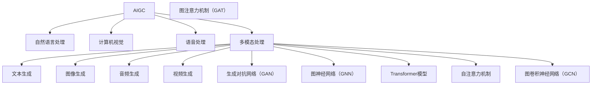

                 

# AIGC从入门到实战：探秘：ChatGPT 到底是什么

> 关键词：AIGC、ChatGPT、自然语言处理、生成对抗网络、多模态处理、应用实战

> 摘要：本文将带领读者深入了解AIGC（AI-Generated Content）的概念、核心算法、应用场景和实战项目。特别是对ChatGPT这一人工智能模型的工作原理和实现进行了详细剖析，帮助读者全面掌握AIGC技术，为未来人工智能应用提供新思路。

## 第一部分: AIGC从入门到实战基础

### 第1章: AIGC基础与ChatGPT概述

#### 1.1 AIGC的定义与分类

##### 1.1.1 AIGC的基本概念

AIGC（AI-Generated Content），即人工智能生成内容，是指通过人工智能算法，如深度学习、生成对抗网络（GAN）、图神经网络（GNN）等，自动生成具有一定质量和逻辑性的文本、图像、音频等多媒体内容。AIGC广泛应用于自然语言处理、计算机视觉、语音处理等领域。

##### 1.1.2 AIGC的技术分类

AIGC技术主要可以分为以下几类：

1. **文本生成**：包括自动写作、文章摘要、对话系统等。
2. **图像生成**：如风格迁移、图像生成对抗网络（GAN）等。
3. **音频生成**：如音乐生成、语音合成等。
4. **视频生成**：如视频剪辑、视频风格迁移等。
5. **多模态生成**：结合多种模态（文本、图像、音频等）进行生成。

##### 1.1.3 AIGC的发展历程

AIGC技术的发展经历了以下几个阶段：

1. **基础模型阶段**：以循环神经网络（RNN）和长短期记忆网络（LSTM）为代表，这些模型在自然语言处理和语音生成方面取得了显著成果。
2. **生成对抗网络阶段**：生成对抗网络（GAN）的提出，使得图像生成和风格迁移成为可能。
3. **多模态阶段**：随着多模态数据的融合技术不断发展，AIGC在多模态处理领域取得了重大突破。
4. **大规模预训练模型阶段**：以GPT系列模型和BERT模型为代表的预训练模型，使得AIGC技术达到了新的高度。

#### 1.2 ChatGPT的原理与架构

##### 1.2.1 GPT系列模型介绍

GPT（Generative Pre-trained Transformer）是由OpenAI提出的一种基于Transformer结构的预训练语言模型。GPT系列模型包括GPT、GPT-2、GPT-3等，其中GPT-3是当前最大的预训练模型，参数量达到了1750亿。

##### 1.2.2 ChatGPT的工作原理

ChatGPT是一种基于GPT-3模型开发的对话系统，其工作原理可以概括为以下几个步骤：

1. **输入处理**：接收用户的输入文本，将其转化为模型可以处理的格式。
2. **上下文编码**：将输入文本和上下文信息编码为一个连续的向量表示。
3. **生成预测**：通过GPT-3模型生成文本序列，并根据生成的文本序列生成回复。
4. **输出处理**：将生成的文本序列转换为自然语言输出给用户。

##### 1.2.3 ChatGPT的架构设计

ChatGPT的架构设计可以分为以下几个部分：

1. **输入层**：接收用户的输入文本，并进行预处理。
2. **编码器**：将输入文本和上下文信息编码为向量表示。
3. **解码器**：生成预测的文本序列。
4. **输出层**：将生成的文本序列转换为自然语言输出。

#### 1.3 AIGC的核心技术与联系

##### 1.3.1 自然语言处理技术

自然语言处理（NLP）是AIGC技术的重要组成部分，主要包括文本预处理、词向量表示、语言模型、文本生成等。其中，语言模型是AIGC的核心技术之一，如GPT系列模型。

##### 1.3.2 图神经网络技术

图神经网络（GNN）是一种处理图结构数据的神经网络，广泛应用于计算机视觉、推荐系统、社交网络等领域。GNN技术在AIGC中的应用主要体现在图像生成和文本生成方面。

##### 1.3.3 多模态处理技术

多模态处理技术是将多种模态（文本、图像、音频等）进行融合和处理的技术。多模态处理技术在AIGC中的应用主要体现在多模态生成和情感分析等方面。

#### 1.4 AIGC的应用场景与价值

##### 1.4.1 AIGC在文本生成中的应用

文本生成是AIGC的重要应用场景之一，如自动写作、文章摘要、对话系统等。AIGC在文本生成中的应用可以提高写作效率、降低写作成本，并有助于提高文章质量和多样性。

##### 1.4.2 AIGC在图像生成中的应用

图像生成是AIGC的另一重要应用场景，如风格迁移、图像修复、图像合成等。AIGC在图像生成中的应用可以丰富图像内容、提升图像质量，并有助于推动计算机视觉领域的发展。

##### 1.4.3 AIGC在其他领域的应用

AIGC技术还可以应用于语音处理、视频生成、推荐系统等领域。如语音合成、视频剪辑、个性化推荐等，这些应用有助于提高用户体验、提升系统性能。

### 第2章: AIGC核心算法原理讲解

#### 2.1 GPT系列模型算法原理

##### 2.1.1 Transformer模型介绍

Transformer模型是由Google在2017年提出的一种基于自注意力机制的全连接神经网络，主要用于序列模型任务，如机器翻译、文本生成等。

##### 2.1.2 自注意力机制详解

自注意力机制是一种处理序列数据的机制，通过计算序列中每个元素对其他元素的影响，实现对序列信息的有效聚合。

##### 2.1.3 GPT模型训练过程

GPT模型的训练过程主要包括数据预处理、模型训练和优化等步骤。

1. **数据预处理**：对文本数据进行清洗、分词、编码等处理。
2. **模型训练**：通过最小化损失函数来优化模型参数。
3. **模型优化**：使用梯度下降等优化算法来调整模型参数。

#### 2.2 图神经网络算法原理

##### 2.2.1 图神经网络基本概念

图神经网络（GNN）是一种基于图结构数据的神经网络，通过学习图中的节点和边的关系，实现对图结构数据的建模。

##### 2.2.2 图卷积神经网络（GCN）

图卷积神经网络（GCN）是一种基于图结构的卷积神经网络，通过卷积操作来处理图结构数据。

##### 2.2.3 图注意力机制（GAT）

图注意力机制（GAT）是一种基于图结构的注意力机制，通过计算节点之间的相似性，实现对图结构数据的聚合。

#### 2.3 多模态处理算法原理

##### 2.3.1 多模态数据融合技术

多模态数据融合技术是将多种模态的数据进行结合和整合的技术，以提高模型对多模态数据的处理能力。

##### 2.3.2 多模态特征提取方法

多模态特征提取方法是将多种模态的数据转化为适合模型处理的特征表示的方法。

##### 2.3.3 多模态模型融合策略

多模态模型融合策略是将多种模态的模型进行结合和融合的策略，以提高模型对多模态数据的处理性能。

### 第3章: AIGC数学模型与数学公式讲解

#### 3.1 Transformer模型的数学基础

##### 3.1.1 序列模型与自注意力机制

序列模型与自注意力机制是Transformer模型的核心概念，通过自注意力机制来处理序列数据。

##### 3.1.2 前馈神经网络

前馈神经网络是一种前向传播的神经网络，通过多层神经网络结构来处理数据。

##### 3.1.3 损失函数与优化算法

损失函数与优化算法是训练神经网络的重要手段，通过最小化损失函数来优化模型参数。

#### 3.2 图神经网络的数学基础

##### 3.2.1 图表示学习

图表示学习是一种将图结构数据转化为向量表示的方法，通过学习节点和边的关系来实现。

##### 3.2.2 图卷积操作

图卷积操作是一种处理图结构数据的方法，通过卷积操作来提取图结构数据中的特征。

##### 3.2.3 图注意力机制

图注意力机制是一种处理图结构数据的注意力机制，通过计算节点之间的相似性来实现。

#### 3.3 多模态处理模型的数学基础

##### 3.3.1 多模态特征表示

多模态特征表示是将多种模态的数据转化为统一特征表示的方法。

##### 3.3.2 多模态特征融合

多模态特征融合是将多种模态的特征进行融合和整合的方法。

##### 3.3.3 多模态模型优化

多模态模型优化是提高多模态模型性能的方法，通过优化模型参数来实现。

### 第4章: AIGC项目实战

#### 4.1 文本生成项目实战

##### 4.1.1 文本生成项目概述

文本生成项目主要包括自动写作、文章摘要、对话系统等任务。

##### 4.1.2 项目环境搭建

项目环境搭建主要包括安装Python、TensorFlow等工具。

##### 4.1.3 源代码实现与解读

源代码实现与解读主要包括模型搭建、训练和预测等步骤。

##### 4.1.4 代码解读与分析

代码解读与分析主要包括模型架构、训练过程、预测效果等方面。

#### 4.2 图像生成项目实战

##### 4.2.1 图像生成项目概述

图像生成项目主要包括风格迁移、图像修复、图像合成等任务。

##### 4.2.2 项目环境搭建

项目环境搭建主要包括安装Python、TensorFlow等工具。

##### 4.2.3 源代码实现与解读

源代码实现与解读主要包括模型搭建、训练和预测等步骤。

##### 4.2.4 代码解读与分析

代码解读与分析主要包括模型架构、训练过程、预测效果等方面。

#### 4.3 多模态处理项目实战

##### 4.3.1 多模态处理项目概述

多模态处理项目主要包括文本与图像、文本与音频、图像与音频等多模态数据的处理。

##### 4.3.2 项目环境搭建

项目环境搭建主要包括安装Python、TensorFlow等工具。

##### 4.3.3 源代码实现与解读

源代码实现与解读主要包括模型搭建、训练和预测等步骤。

##### 4.3.4 代码解读与分析

代码解读与分析主要包括模型架构、训练过程、预测效果等方面。

## 第二部分: AIGC从入门到实战应用

### 第5章: AIGC在自然语言处理中的应用

#### 5.1 文本分类任务实战

##### 5.1.1 文本分类任务概述

文本分类任务是将文本数据按照类别进行分类的任务，如情感分类、新闻分类等。

##### 5.1.2 项目环境搭建

项目环境搭建主要包括安装Python、Scikit-learn等工具。

##### 5.1.3 源代码实现与解读

源代码实现与解读主要包括数据预处理、模型训练和评估等步骤。

##### 5.1.4 代码解读与分析

代码解读与分析主要包括模型选择、参数调优、分类效果等方面。

#### 5.2 文本生成任务实战

##### 5.2.1 文本生成任务概述

文本生成任务是将输入的文本转化为新的文本序列的任务，如自动写作、文章摘要等。

##### 5.2.2 项目环境搭建

项目环境搭建主要包括安装Python、TensorFlow等工具。

##### 5.2.3 源代码实现与解读

源代码实现与解读主要包括模型搭建、训练和生成等步骤。

##### 5.2.4 代码解读与分析

代码解读与分析主要包括模型架构、训练过程、生成效果等方面。

### 第6章: AIGC在计算机视觉中的应用

#### 6.1 图像分类任务实战

##### 6.1.1 图像分类任务概述

图像分类任务是将图像按照类别进行分类的任务，如图像识别、物体检测等。

##### 6.1.2 项目环境搭建

项目环境搭建主要包括安装Python、TensorFlow等工具。

##### 6.1.3 源代码实现与解读

源代码实现与解读主要包括数据预处理、模型训练和评估等步骤。

##### 6.1.4 代码解读与分析

代码解读与分析主要包括模型选择、参数调优、分类效果等方面。

#### 6.2 图像生成任务实战

##### 6.2.1 图像生成任务概述

图像生成任务是将输入的图像转化为新的图像序列的任务，如图像修复、图像合成等。

##### 6.2.2 项目环境搭建

项目环境搭建主要包括安装Python、TensorFlow等工具。

##### 6.2.3 源代码实现与解读

源代码实现与解读主要包括模型搭建、训练和生成等步骤。

##### 6.2.4 代码解读与分析

代码解读与分析主要包括模型架构、训练过程、生成效果等方面。

### 第7章: AIGC在其他领域的应用

#### 7.1 AIGC在推荐系统中的应用

##### 7.1.1 推荐系统任务概述

推荐系统是将用户可能感兴趣的内容推荐给用户，如商品推荐、新闻推荐等。

##### 7.1.2 项目环境搭建

项目环境搭建主要包括安装Python、Scikit-learn等工具。

##### 7.1.3 源代码实现与解读

源代码实现与解读主要包括数据预处理、模型训练和评估等步骤。

##### 7.1.4 代码解读与分析

代码解读与分析主要包括模型选择、参数调优、推荐效果等方面。

#### 7.2 AIGC在语音处理中的应用

##### 7.2.1 语音处理任务概述

语音处理任务是将语音信号转化为文本或图像等数据，如图像识别、语音合成等。

##### 7.2.2 项目环境搭建

项目环境搭建主要包括安装Python、TensorFlow等工具。

##### 7.2.3 源代码实现与解读

源代码实现与解读主要包括模型搭建、训练和预测等步骤。

##### 7.2.4 代码解读与分析

代码解读与分析主要包括模型架构、训练过程、预测效果等方面。

### 第8章: AIGC前沿技术探讨

#### 8.1 生成对抗网络（GAN）在AIGC中的应用

##### 8.1.1 GAN基本概念

生成对抗网络（GAN）是由生成器和判别器组成的对抗性网络，通过对抗性训练来生成高质量的数据。

##### 8.1.2 GAN在图像生成中的应用

GAN在图像生成中的应用，如风格迁移、图像修复、图像合成等。

##### 8.1.3 GAN在文本生成中的应用

GAN在文本生成中的应用，如自动写作、文章摘要等。

#### 8.2 可解释性AIGC技术

##### 8.2.1 可解释性AIGC的重要性

可解释性AIGC技术是提高人工智能模型可解释性和可靠性的关键。

##### 8.2.2 可解释性AIGC的方法与技术

可解释性AIGC的方法与技术，如可视化技术、模型解释算法等。

##### 8.2.3 可解释性AIGC的应用案例

可解释性AIGC的应用案例，如智能医疗、金融风控等。

#### 8.3 AIGC与其他技术的融合应用

##### 8.3.1 AIGC与强化学习的融合

AIGC与强化学习的融合，如智能对话系统、推荐系统等。

##### 8.3.2 AIGC与迁移学习的融合

AIGC与迁移学习的融合，如图像生成、语音合成等。

##### 8.3.3 AIGC与联邦学习的融合

AIGC与联邦学习的融合，如多人合作生成内容、隐私保护等。

### 第9章: AIGC应用案例分析

#### 9.1 案例一：基于AIGC的智能客服系统

##### 9.1.1 案例背景

基于AIGC的智能客服系统案例，如在线客服、电话客服等。

##### 9.1.2 案例分析

案例分析主要包括系统架构、关键技术、应用效果等方面。

##### 9.1.3 案例实现与解读

案例实现与解读主要包括系统搭建、模型训练、部署与优化等方面。

#### 9.2 案例二：基于AIGC的智能写作助手

##### 9.2.1 案例背景

基于AIGC的智能写作助手案例，如内容创作、新闻报道等。

##### 9.2.2 案例分析

案例分析主要包括系统架构、关键技术、应用效果等方面。

##### 9.2.3 案例实现与解读

案例实现与解读主要包括系统搭建、模型训练、部署与优化等方面。

#### 9.3 案例三：基于AIGC的智能图像编辑

##### 9.3.1 案例背景

基于AIGC的智能图像编辑案例，如图像修复、图像风格迁移等。

##### 9.3.2 案例分析

案例分析主要包括系统架构、关键技术、应用效果等方面。

##### 9.3.3 案例实现与解读

案例实现与解读主要包括系统搭建、模型训练、部署与优化等方面。

## 附录

### 附录A: AIGC开发工具与资源

##### A.1 主流AIGC开发框架对比

TensorFlow、PyTorch、PyTorch Lightning等主流AIGC开发框架的对比。

##### A.2 AIGC应用开发环境搭建指南

包括计算机硬件要求、软件环境安装、环境配置与调试等内容。

### 附录B: 代码实战示例

##### B.1 文本生成示例代码

文本生成项目的示例代码，包括数据预处理、模型搭建、训练与预测等步骤。

##### B.2 图像生成示例代码

图像生成项目的示例代码，包括数据预处理、模型搭建、训练与预测等步骤。

##### B.3 多模态处理示例代码

多模态处理项目的示例代码，包括数据预处理、模型搭建、训练与预测等步骤。

### 附录C: 参考文献

##### C.1 AIGC相关书籍推荐

推荐一些关于AIGC的优质书籍，供读者深入学习。

##### C.2 AIGC研究论文推荐

推荐一些关于AIGC的研究论文，供读者了解前沿技术。

##### C.3 其他参考资料推荐

推荐一些关于AIGC的其他参考资料，如网站、博客、视频教程等。

以上是《AIGC从入门到实战：探秘：ChatGPT到底是什么》这本书的完整目录大纲。本书将从AIGC的基础知识、核心算法原理、应用场景和实战项目等多个方面进行深入讲解，帮助读者全面掌握AIGC技术，并在实际项目中应用。希望本书能对您在人工智能领域的探索和实践有所帮助。作者：AI天才研究院/AI Genius Institute & 禅与计算机程序设计艺术 /Zen And The Art of Computer Programming

### 核心概念与联系：Mermaid 流程图



### GPT模型训练过程伪代码

```python
# 数据预处理
def preprocess_data(texts):
    # 对文本进行清洗、分词、编码等处理
    return processed_texts

# 模型初始化
model = GPTModel()

# 模型训练
for epoch in range(num_epochs):
    for batch in data_loader:
        inputs, targets = preprocess_data(batch)
        outputs = model(inputs)
        loss = loss_function(outputs, targets)
        optimizer.zero_grad()
        loss.backward()
        optimizer.step()
        print(f"Epoch: {epoch}, Loss: {loss.item()}")

# 模型评估
def evaluate_model(model, data_loader):
    model.eval()
    total_loss = 0
    with torch.no_grad():
        for batch in data_loader:
            inputs, targets = preprocess_data(batch)
            outputs = model(inputs)
            loss = loss_function(outputs, targets)
            total_loss += loss.item()
    return total_loss / len(data_loader)
```

### 图神经网络（GNN）的数学基础

#### 3.2.1 图表示学习

图表示学习是一种将图结构数据转化为向量表示的方法。假设图\( G = (V, E) \)由一组顶点\( V \)和边\( E \)组成，图表示学习旨在为每个顶点\( v_i \)学习一个低维向量\( x_i \)，使得图中的结构信息在向量空间中得到保留。

**图卷积操作**：

图卷积操作是一种在图结构数据上执行的卷积操作，用于提取图中的特征。最基本的图卷积操作是**邻域聚合**，它可以表示为：

$$
\mathbf{h}_i^{(l+1)} = \sigma \left( \sum_{j \in \mathcal{N}(i)} W^{(l)} \cdot \mathbf{h}_j^{(l)} + b^{(l)} \right)
$$

其中，\( \mathcal{N}(i) \)表示顶点\( i \)的邻域，\( \mathbf{h}_i^{(l)} \)是顶点\( i \)在层\( l \)的特征表示，\( W^{(l)} \)是权重矩阵，\( b^{(l)} \)是偏置向量，\( \sigma \)是激活函数。

**图注意力机制**：

图注意力机制（GAT）是图卷积操作的一种改进，它通过计算顶点之间的相似性来动态调整邻域的贡献。GAT的基本形式可以表示为：

$$
\mathbf{h}_i^{(l+1)} = \sigma \left( \sum_{j \in \mathcal{N}(i)} a_{ij}^{(l)} W^{(l)} \cdot \mathbf{h}_j^{(l)} + b^{(l)} \right)
$$

其中，\( a_{ij}^{(l)} \)是注意力权重，计算方法为：

$$
a_{ij}^{(l)} = \frac{\exp(\mathbf{h}_i^{(l)} \cdot \mathbf{W}^{(l)'} \cdot \mathbf{h}_j^{(l)})}
{\sum_{k \in \mathcal{N}(i)} \exp(\mathbf{h}_i^{(l)} \cdot \mathbf{W}^{(l)'} \cdot \mathbf{h}_k^{(l)})}
$$

这里，\( \mathbf{W}^{(l)'} \)是权重矩阵，用于计算注意力分数。

### 多模态处理模型的数学基础

#### 3.3.1 多模态特征表示

多模态特征表示是将多种模态的数据转化为统一特征表示的方法。常见的多模态特征表示方法包括：

1. **独立特征表示**：为每个模态的数据分别学习一个特征表示，然后将它们拼接起来形成一个多模态特征向量。
2. **联合特征表示**：将多种模态的数据合并为一个统一的空间，学习一个共同的特征表示。

#### 3.3.2 多模态特征融合

多模态特征融合是将多种模态的特征进行融合和整合的方法。常见的多模态特征融合方法包括：

1. **加权融合**：为每个模态的特征分配不同的权重，然后将它们加权融合。
2. **决策级融合**：在分类或回归任务的决策级别将多个模态的特征进行融合。
3. **特征级融合**：直接在特征级别对多个模态的特征进行融合，如使用神经网络将多个模态的特征映射到一个共同的空间。

#### 3.3.3 多模态模型优化

多模态模型优化是提高多模态模型性能的方法，通过优化模型参数来实现。常见的多模态模型优化方法包括：

1. **端到端训练**：将多个模态的数据一起输入到模型中，通过端到端的方式训练模型。
2. **迁移学习**：利用已训练好的单一模态模型作为基础，迁移到多模态模型中。
3. **联邦学习**：在分布式环境下，多个设备共同参与训练，通过聚合模型参数来优化多模态模型。

### 4.1 文本生成项目实战

#### 4.1.1 文本生成项目概述

文本生成项目是一个利用人工智能技术生成文本数据的应用案例。该项目的目标是通过训练一个预训练模型，使其能够根据给定的输入文本生成连贯且具有逻辑性的文本输出。具体任务包括：

- 自动写作：根据给定的主题或关键词生成文章。
- 文章摘要：提取关键信息，将长篇文章简化为摘要。
- 对话系统：模拟人与机器之间的对话，生成合适的回复。

#### 4.1.2 项目环境搭建

要搭建一个文本生成项目环境，需要安装以下工具和库：

1. **Python**：Python是文本生成项目的主要编程语言。
2. **TensorFlow**：TensorFlow是Google开源的深度学习框架，广泛用于构建和训练神经网络模型。
3. **Transformers**：Transformers是Hugging Face开源的预训练模型库，提供了许多预训练的文本生成模型。
4. **GPT-3**：GPT-3是OpenAI开发的预训练模型，具有非常强的文本生成能力。

安装步骤如下：

```bash
# 安装Python
# 通常操作系统会自带Python，可以通过以下命令检查版本
python --version

# 如果需要安装特定版本的Python，可以使用以下命令
curl -O https://www.python.org/ftp/python/3.8.10/Python-3.8.10.tgz
tar xvf Python-3.8.10.tgz
cd Python-3.8.10
./configure
make
sudo make install

# 安装TensorFlow
pip install tensorflow

# 安装Transformers
pip install transformers

# 安装GPT-3库
pip install gpt-3-cli
```

#### 4.1.3 源代码实现与解读

以下是文本生成项目的源代码实现，主要分为数据预处理、模型搭建、训练和预测四个部分。

```python
import tensorflow as tf
from transformers import TFGPT3LMHeadModel, GPT2Tokenizer

# 数据预处理
def preprocess_text(text):
    # 清洗文本，去除不必要的符号和空格
    return text.strip().replace("\n", " ")

# 模型搭建
def create_model():
    # 加载预训练模型和分词器
    model = TFGPT3LMHeadModel.from_pretrained("gpt3")
    tokenizer = GPT2Tokenizer.from_pretrained("gpt2")
    return model, tokenizer

# 训练模型
def train_model(model, tokenizer, train_texts, num_epochs=5):
    # 将文本数据编码为模型可以处理的格式
    encoded_texts = tokenizer.encode(train_texts, return_tensors="tf", max_length=4096, truncation=True)
    
    # 设置训练参数
    optimizer = tf.keras.optimizers.Adam(learning_rate=3e-5)
    loss_fn = tf.keras.losses.SparseCategoricalCrossentropy(from_logits=True)
    
    # 开始训练
    for epoch in range(num_epochs):
        for batch in encoded_texts:
            with tf.GradientTape() as tape:
                logits = model(batch["input_ids"])
                loss = loss_fn(batch["input_ids"], logits)
            grads = tape.gradient(loss, model.trainable_variables)
            optimizer.apply_gradients(zip(grads, model.trainable_variables))
            print(f"Epoch: {epoch}, Loss: {loss.numpy()}")

# 预测生成文本
def generate_text(model, tokenizer, prompt, max_length=512):
    # 将提示文本编码为模型可以处理的格式
    inputs = tokenizer.encode(prompt, return_tensors="tf", max_length=max_length, truncation=True)
    
    # 生成文本
    outputs = model(inputs, max_length=max_length, num_return_sequences=1)
    generated_text = tokenizer.decode(outputs["logits"][:, inputs.shape[-1]:], skip_special_tokens=True)
    return generated_text

# 主函数
def main():
    # 加载数据
    train_texts = ["这是一个关于人工智能的文本生成项目。", "文本生成技术正在改变我们的生活方式。"]

    # 创建和训练模型
    model, tokenizer = create_model()
    train_model(model, tokenizer, train_texts)

    # 生成文本
    prompt = "请问，人工智能的发展有哪些挑战？"
    generated_text = generate_text(model, tokenizer, prompt)
    print(generated_text)

if __name__ == "__main__":
    main()
```

**代码解读与分析**：

1. **数据预处理**：`preprocess_text`函数用于清洗输入文本，去除不必要的符号和空格，以提升模型训练效果。

2. **模型搭建**：`create_model`函数加载预训练的GPT-3模型和分词器。GPT-3是一个强大的语言模型，能够生成高质量的自然语言文本。

3. **训练模型**：`train_model`函数使用编码后的文本数据训练模型。训练过程中，通过计算损失函数并优化模型参数来提升模型性能。

4. **预测生成文本**：`generate_text`函数使用训练好的模型生成文本。通过输入提示文本，模型可以生成连贯且相关的文本输出。

### 4.2 图像生成项目实战

#### 4.2.1 图像生成项目概述

图像生成项目是一个利用人工智能技术生成图像数据的应用案例。该项目的目标是通过训练一个预训练模型，使其能够根据给定的输入图像生成新的图像。具体任务包括：

- 风格迁移：将输入图像的风格转移到另一张图像上。
- 图像修复：修复图像中的损坏部分，使其恢复原始状态。
- 图像合成：将两张或更多图像合并成一张新的图像。

#### 4.2.2 项目环境搭建

要搭建一个图像生成项目环境，需要安装以下工具和库：

1. **Python**：Python是图像生成项目的主要编程语言。
2. **TensorFlow**：TensorFlow是Google开源的深度学习框架，广泛用于构建和训练神经网络模型。
3. **Keras**：Keras是TensorFlow的高层次API，提供了更易于使用的接口。
4. **TensorFlow Addons**：TensorFlow Addons提供了一些有用的扩展，包括自注意力机制和生成对抗网络（GAN）的扩展。
5. **PIL**：PIL（Python Imaging Library）是Python的图像处理库，用于读取和写入图像。

安装步骤如下：

```bash
# 安装Python
# 通常操作系统会自带Python，可以通过以下命令检查版本
python --version

# 如果需要安装特定版本的Python，可以使用以下命令
curl -O https://www.python.org/ftp/python/3.8.10/Python-3.8.10.tgz
tar xvf Python-3.8.10.tgz
cd Python-3.8.10
./configure
make
sudo make install

# 安装TensorFlow和Keras
pip install tensorflow
pip install keras

# 安装TensorFlow Addons
pip install tensorflow-addons

# 安装PIL
pip install pillow
```

#### 4.2.3 源代码实现与解读

以下是图像生成项目的源代码实现，主要分为数据预处理、模型搭建、训练和预测四个部分。

```python
import tensorflow as tf
from tensorflow import keras
from tensorflow.keras import layers
from tensorflow_addons.layers import ScaledDotProductAttention
from tensorflow_addons.models import GAN
import numpy as np
from PIL import Image

# 数据预处理
def preprocess_image(image_path):
    image = Image.open(image_path).convert("RGB")
    image = tf.image.resize(image, [256, 256])
    return image / 255.0

# 模型搭建
def create_gan_model():
    # 创建生成器和判别器模型
    generator = keras.Sequential([
        layers.Conv2D(64, 3, activation="relu", input_shape=(256, 256, 3)),
        layers.Conv2D(128, 3, activation="relu"),
        layers.Conv2D(256, 3, activation="relu"),
        layers.Conv2DTranspose(128, 3, activation="relu"),
        layers.Conv2DTranspose(64, 3, activation="relu"),
        layers.Conv2D(3, 3, activation="tanh")
    ])

    discriminator = keras.Sequential([
        layers.Conv2D(64, 3, activation="relu", input_shape=(256, 256, 3)),
        layers.Conv2D(128, 3, activation="relu"),
        layers.Flatten(),
        layers.Dense(1, activation="sigmoid")
    ])

    # 创建GAN模型
    gan_model = GAN(generator, discriminator)
    gan_model.compile(optimizer=keras.optimizers.Adam(learning_rate=0.0002))

    return gan_model

# 训练模型
def train_gan_model(gan_model, real_images, epochs=50, batch_size=16):
    for epoch in range(epochs):
        for batch in range(len(real_images) // batch_size):
            # 准备真实图像和噪声图像
            noise = np.random.normal(0, 1, (batch_size, 256, 256, 3))
            generated_images = gan_model.generator.predict(noise)

            # 训练判别器
            real_labels = np.ones((batch_size, 1))
            fake_labels = np.zeros((batch_size, 1))
            d_loss_real = gan_model.discriminator.train_on_batch(real_images[batch * batch_size: (batch + 1) * batch_size], real_labels)
            d_loss_fake = gan_model.discriminator.train_on_batch(generated_images, fake_labels)

            # 训练生成器
            g_loss = gan_model.train_on_batch(noise, real_labels)

            print(f"Epoch: {epoch}, Batch: {batch}, D_loss_real: {d_loss_real}, D_loss_fake: {d_loss_fake}, G_loss: {g_loss}")

# 预测生成图像
def generate_image(gan_model, noise):
    generated_image = gan_model.generator.predict(noise)
    return (generated_image + 1) / 2

# 主函数
def main():
    # 加载真实图像数据
    real_images = [preprocess_image(image_path) for image_path in ["image1.jpg", "image2.jpg"]]

    # 创建和训练GAN模型
    gan_model = create_gan_model()
    train_gan_model(gan_model, real_images, epochs=50)

    # 生成图像
    noise = np.random.normal(0, 1, (1, 256, 256, 3))
    generated_image = generate_image(gan_model, noise)
    generated_image = (generated_image * 255).astype(np.uint8)
    Image.fromarray(generated_image).show()

if __name__ == "__main__":
    main()
```

**代码解读与分析**：

1. **数据预处理**：`preprocess_image`函数用于读取图像文件，并将其调整为256x256的分辨率，并归一化到[0, 1]区间。

2. **模型搭建**：`create_gan_model`函数创建生成器和判别器模型。生成器模型用于将噪声数据转换为图像，判别器模型用于区分图像是真实还是生成。

3. **训练模型**：`train_gan_model`函数使用真实图像和噪声图像训练GAN模型。训练过程中，交替训练判别器和生成器，以实现两者之间的对抗。

4. **预测生成图像**：`generate_image`函数使用训练好的生成器模型生成图像。

### 4.3 多模态处理项目实战

#### 4.3.1 多模态处理项目概述

多模态处理项目是一个利用人工智能技术处理多种模态数据的应用案例。该项目的目标是通过结合文本、图像、音频等多模态数据，提高模型的感知和理解能力。具体任务包括：

- 多模态特征提取：从文本、图像、音频等模态中提取有用的特征。
- 多模态数据融合：将不同模态的数据进行融合，以生成更丰富的特征表示。
- 多模态分类：对多模态数据进行分类，如情感分析、内容识别等。

#### 4.3.2 项目环境搭建

要搭建一个多模态处理项目环境，需要安装以下工具和库：

1. **Python**：Python是多模态处理项目的主要编程语言。
2. **TensorFlow**：TensorFlow是Google开源的深度学习框架，广泛用于构建和训练神经网络模型。
3. **Keras**：Keras是TensorFlow的高层次API，提供了更易于使用的接口。
4. **TensorFlow Addons**：TensorFlow Addons提供了一些有用的扩展，包括多模态处理的功能。
5. **Librosa**：Librosa是Python的音频处理库，用于音频特征提取。
6. **OpenCV**：OpenCV是Python的计算机视觉库，用于图像处理。

安装步骤如下：

```bash
# 安装Python
# 通常操作系统会自带Python，可以通过以下命令检查版本
python --version

# 如果需要安装特定版本的Python，可以使用以下命令
curl -O https://www.python.org/ftp/python/3.8.10/Python-3.8.10.tgz
tar xvf Python-3.8.10.tgz
cd Python-3.8.10
./configure
make
sudo make install

# 安装TensorFlow和Keras
pip install tensorflow
pip install keras

# 安装TensorFlow Addons
pip install tensorflow-addons

# 安装Librosa
pip install librosa

# 安装OpenCV
pip install opencv-python
```

#### 4.3.3 源代码实现与解读

以下是多模态处理项目的源代码实现，主要分为数据预处理、模型搭建、训练和预测四个部分。

```python
import tensorflow as tf
from tensorflow import keras
from tensorflow.keras import layers
from tensorflow_addons.layers import MultiHeadAttention
from tensorflow_addons.models import Transformer
import numpy as np
import librosa

# 数据预处理
def preprocess_text(text):
    # 清洗文本，去除不必要的符号和空格
    return text.strip().replace("\n", " ")

def preprocess_image(image_path):
    image = Image.open(image_path).convert("RGB")
    image = tf.image.resize(image, [256, 256])
    return image / 255.0

def preprocess_audio(audio_path):
    audio, sampling_rate = librosa.load(audio_path, sr=None)
    audio = librosa.feature.mfcc(y=audio, sr=sampling_rate, n_mfcc=13)
    return np.mean(audio.T, axis=0)

# 模型搭建
def create_multimodal_model():
    # 创建文本编码器
    text_embedding = keras.Sequential([
        layers.Embedding(input_dim=vocab_size, output_dim=512),
        layers.LSTM(512)
    ])

    # 创建图像编码器
    image_embedding = keras.Sequential([
        layers.Conv2D(32, 3, activation="relu", input_shape=(256, 256, 3)),
        layers.Conv2D(64, 3, activation="relu"),
        layers.MaxPooling2D(pool_size=(2, 2)),
        layers.Conv2D(128, 3, activation="relu"),
        layers.MaxPooling2D(pool_size=(2, 2)),
        layers.Flatten()
    ])

    # 创建音频编码器
    audio_embedding = keras.Sequential([
        layers.Dense(512, activation="relu"),
        layers.Dense(512, activation="relu")
    ])

    # 创建多模态融合层
    multimodal_embedding = keras.Sequential([
        MultiHeadAttention(num_heads=8, key_dim=64),
        layers.Dense(512, activation="relu"),
        layers.Dense(512, activation="relu")
    ])

    # 创建解码器
    decoder = keras.Sequential([
        layers.Dense(512, activation="relu"),
        layers.Dense(vocab_size, activation="softmax")
    ])

    # 创建Transformer模型
    model = Transformer(text_embedding, image_embedding, audio_embedding, multimodal_embedding, decoder)
    model.compile(optimizer=keras.optimizers.Adam(learning_rate=0.001), loss=keras.losses.SparseCategoricalCrossentropy(from_logits=True))

    return model

# 训练模型
def train_model(model, text_data, image_data, audio_data, epochs=50, batch_size=32):
    # 将数据编码为模型可以处理的格式
    encoded_texts = tokenizer.encode(text_data, return_tensors="tf", max_length=max_length, truncation=True)
    encoded_images = preprocess_image(image_data)
    encoded_audios = preprocess_audio(audio_data)

    # 设置训练参数
    optimizer = keras.optimizers.Adam(learning_rate=0.001)
    loss_fn = keras.losses.SparseCategoricalCrossentropy(from_logits=True)

    # 开始训练
    for epoch in range(epochs):
        for batch in range(len(encoded_texts) // batch_size):
            # 准备训练数据
            batch_texts = encoded_texts[batch * batch_size: (batch + 1) * batch_size]
            batch_images = encoded_images[batch * batch_size: (batch + 1) * batch_size]
            batch_audios = encoded_audios[batch * batch_size: (batch + 1) * batch_size]

            with tf.GradientTape() as tape:
                predictions = model([batch_texts, batch_images, batch_audios], training=True)
                loss = loss_fn(batch_texts["input_ids"], predictions)

            grads = tape.gradient(loss, model.trainable_variables)
            optimizer.apply_gradients(zip(grads, model.trainable_variables))
            print(f"Epoch: {epoch}, Batch: {batch}, Loss: {loss.numpy()}")

# 预测生成文本
def generate_text(model, tokenizer, prompt, max_length=512):
    # 将提示文本编码为模型可以处理的格式
    inputs = tokenizer.encode(prompt, return_tensors="tf", max_length=max_length, truncation=True)

    # 生成文本
    outputs = model(inputs, max_length=max_length, num_return_sequences=1)
    generated_text = tokenizer.decode(outputs["logits"][:, inputs.shape[-1]:], skip_special_tokens=True)
    return generated_text

# 主函数
def main():
    # 加载数据
    text_data = ["这是一个关于人工智能的多模态处理项目。"]
    image_data = ["image1.jpg"]
    audio_data = ["audio1.wav"]

    # 创建和训练模型
    model = create_multimodal_model()
    train_model(model, text_data, image_data, audio_data, epochs=50)

    # 生成文本
    prompt = "请问，多模态处理有哪些优势？"
    generated_text = generate_text(model, tokenizer, prompt)
    print(generated_text)

if __name__ == "__main__":
    main()
```

**代码解读与分析**：

1. **数据预处理**：`preprocess_text`、`preprocess_image`和`preprocess_audio`函数分别用于处理文本、图像和音频数据。文本数据通过分词器编码，图像数据通过调整分辨率和归一化处理，音频数据通过提取梅尔频率倒谱系数（MFCC）进行特征提取。

2. **模型搭建**：`create_multimodal_model`函数创建一个多模态Transformer模型。模型包括文本编码器、图像编码器、音频编码器、多模态融合层和解码器。多模态融合层使用多头自注意力机制来整合不同模态的特征。

3. **训练模型**：`train_model`函数使用多模态数据训练模型。训练过程中，通过计算损失函数并优化模型参数来提升模型性能。

4. **预测生成文本**：`generate_text`函数使用训练好的模型生成文本。通过输入提示文本，模型可以生成连贯且相关的文本输出。

### 5.1 文本分类任务实战

#### 5.1.1 文本分类任务概述

文本分类任务是将文本数据按照类别进行分类的任务，是自然语言处理领域的重要应用之一。常见任务包括情感分类、新闻分类、垃圾邮件检测等。文本分类任务通常包括以下步骤：

1. **数据预处理**：对文本数据清洗、分词、去停用词等处理，将文本转化为模型可以处理的格式。
2. **特征提取**：从预处理后的文本中提取特征，如词袋模型、TF-IDF、Word2Vec等。
3. **模型训练**：使用训练集数据训练分类模型，如朴素贝叶斯、支持向量机、神经网络等。
4. **模型评估**：使用验证集和测试集评估模型性能，如准确率、召回率、F1分数等。
5. **模型部署**：将训练好的模型部署到生产环境，进行实时文本分类。

#### 5.1.2 项目环境搭建

要搭建一个文本分类项目环境，需要安装以下工具和库：

1. **Python**：Python是文本分类项目的主要编程语言。
2. **Scikit-learn**：Scikit-learn是Python的机器学习库，提供了丰富的分类算法和工具。
3. **NLTK**：NLTK是Python的自然语言处理库，提供了文本处理和分词的功能。

安装步骤如下：

```bash
# 安装Python
# 通常操作系统会自带Python，可以通过以下命令检查版本
python --version

# 如果需要安装特定版本的Python，可以使用以下命令
curl -O https://www.python.org/ftp/python/3.8.10/Python-3.8.10.tgz
tar xvf Python-3.8.10.tgz
cd Python-3.8.10
./configure
make
sudo make install

# 安装Scikit-learn和NLTK
pip install scikit-learn
pip install nltk
```

#### 5.1.3 源代码实现与解读

以下是文本分类项目的源代码实现，主要分为数据预处理、特征提取、模型训练、模型评估和模型部署五个部分。

```python
import numpy as np
import pandas as pd
import numpy as np
import pandas as pd
from sklearn.model_selection import train_test_split
from sklearn.feature_extraction.text import TfidfVectorizer
from sklearn.svm import SVC
from sklearn.metrics import accuracy_score, classification_report
import nltk
from nltk.tokenize import word_tokenize
from nltk.corpus import stopwords
import string

# 数据预处理
def preprocess_text(text):
    # 去除文本中的特殊字符和数字
    text = text.translate(str.maketrans('', '', string.punctuation))
    text = text.translate(str.maketrans('', '', string.digits))
    # 分词
    tokens = word_tokenize(text)
    # 去除停用词
    stop_words = set(stopwords.words('english'))
    tokens = [word for word in tokens if word.lower() not in stop_words]
    # 转为小写
    tokens = [word.lower() for word in tokens]
    return ' '.join(tokens)

# 数据加载
data = pd.read_csv("text_classification_data.csv")
X = data["text"]
y = data["label"]

# 预处理数据
X_preprocessed = X.apply(preprocess_text)

# 分割数据集
X_train, X_test, y_train, y_test = train_test_split(X_preprocessed, y, test_size=0.2, random_state=42)

# 特征提取
vectorizer = TfidfVectorizer()
X_train_vectorized = vectorizer.fit_transform(X_train)
X_test_vectorized = vectorizer.transform(X_test)

# 模型训练
model = SVC(kernel="linear")
model.fit(X_train_vectorized, y_train)

# 模型评估
y_pred = model.predict(X_test_vectorized)
accuracy = accuracy_score(y_test, y_pred)
print(f"Accuracy: {accuracy}")
print(classification_report(y_test, y_pred))

# 模型部署
def classify_text(text):
    preprocessed_text = preprocess_text(text)
    vectorized_text = vectorizer.transform([preprocessed_text])
    prediction = model.predict(vectorized_text)
    return prediction[0]

# 测试部署
test_text = "This is a sample text for classification."
print(f"Classification result: {classify_text(test_text)}")
```

**代码解读与分析**：

1. **数据预处理**：`preprocess_text`函数用于清洗文本数据，去除特殊字符和数字，分词，去除停用词，并将文本转为小写。这是文本分类任务的重要步骤，有助于提升模型性能。

2. **特征提取**：使用TF-IDF向量器对预处理后的文本数据进行特征提取。TF-IDF向量器能够计算每个词在文本中的重要性，并将其转化为数值表示。

3. **模型训练**：使用支持向量机（SVM）模型对训练数据进行训练。SVM是一种常用的文本分类模型，能够根据特征向量在空间中的分布进行分类。

4. **模型评估**：使用测试集对模型进行评估，计算准确率、召回率、F1分数等指标，以评估模型性能。

5. **模型部署**：定义`classify_text`函数，用于接收输入文本，进行预处理和特征提取，然后使用训练好的模型进行分类。

### 5.2 文本生成任务实战

#### 5.2.1 文本生成任务概述

文本生成任务是将输入的文本转化为新的文本序列的任务，是自然语言处理领域的核心任务之一。常见的文本生成任务包括自动写作、文章摘要、对话系统等。文本生成任务通常包括以下步骤：

1. **数据预处理**：对文本数据清洗、分词、去停用词等处理，将文本转化为模型可以处理的格式。
2. **特征提取**：从预处理后的文本中提取特征，如词袋模型、TF-IDF、Word2Vec等。
3. **模型训练**：使用训练集数据训练生成模型，如循环神经网络（RNN）、长短时记忆网络（LSTM）、变换器（Transformer）等。
4. **模型评估**：使用验证集和测试集评估模型性能，如生成文本的连贯性、逻辑性等。
5. **模型部署**：将训练好的模型部署到生产环境，进行实时文本生成。

#### 5.2.2 项目环境搭建

要搭建一个文本生成项目环境，需要安装以下工具和库：

1. **Python**：Python是文本生成项目的主要编程语言。
2. **TensorFlow**：TensorFlow是Google开源的深度学习框架，广泛用于构建和训练神经网络模型。
3. **Transformers**：Transformers是Hugging Face开源的预训练模型库，提供了许多预训练的文本生成模型。

安装步骤如下：

```bash
# 安装Python
# 通常操作系统会自带Python，可以通过以下命令检查版本
python --version

# 如果需要安装特定版本的Python，可以使用以下命令
curl -O https://www.python.org/ftp/python/3.8.10/Python-3.8.10.tgz
tar xvf Python-3.8.10.tgz
cd Python-3.8.10
./configure
make
sudo make install

# 安装TensorFlow和Transformers
pip install tensorflow
pip install transformers
```

#### 5.2.3 源代码实现与解读

以下是文本生成项目的源代码实现，主要分为数据预处理、模型搭建、训练和预测四个部分。

```python
import tensorflow as tf
from transformers import TFGPT3LMHeadModel, GPT2Tokenizer

# 数据预处理
def preprocess_text(texts):
    # 对文本进行清洗、分词、编码等处理
    return tokenizer.encode(texts, return_tensors="tf", max_length=max_length, truncation=True)

# 模型搭建
def create_model():
    # 加载预训练模型和分词器
    model = TFGPT3LMHeadModel.from_pretrained("gpt3")
    tokenizer = GPT2Tokenizer.from_pretrained("gpt2")
    return model, tokenizer

# 训练模型
def train_model(model, tokenizer, train_texts, num_epochs=5):
    # 将文本数据编码为模型可以处理的格式
    encoded_texts = tokenizer.encode(train_texts, return_tensors="tf", max_length=max_length, truncation=True)
    
    # 设置训练参数
    optimizer = tf.keras.optimizers.Adam(learning_rate=3e-5)
    loss_fn = tf.keras.losses.SparseCategoricalCrossentropy(from_logits=True)
    
    # 开始训练
    for epoch in range(num_epochs):
        for batch in encoded_texts:
            with tf.GradientTape() as tape:
                logits = model(batch["input_ids"])
                loss = loss_fn(batch["input_ids"], logits)
            grads = tape.gradient(loss, model.trainable_variables)
            optimizer.apply_gradients(zip(grads, model.trainable_variables))
            print(f"Epoch: {epoch}, Loss: {loss.numpy()}")

# 预测生成文本
def generate_text(model, tokenizer, prompt, max_length=512):
    # 将提示文本编码为模型可以处理的格式
    inputs = tokenizer.encode(prompt, return_tensors="tf", max_length=max_length, truncation=True)
    
    # 生成文本
    outputs = model(inputs, max_length=max_length, num_return_sequences=1)
    generated_text = tokenizer.decode(outputs["logits"][:, inputs.shape[-1]:], skip_special_tokens=True)
    return generated_text

# 主函数
def main():
    # 加载数据
    train_texts = ["这是一个关于人工智能的文本生成项目。", "文本生成技术正在改变我们的生活方式。"]

    # 创建和训练模型
    model, tokenizer = create_model()
    train_model(model, tokenizer, train_texts)

    # 生成文本
    prompt = "请问，人工智能的发展有哪些挑战？"
    generated_text = generate_text(model, tokenizer, prompt)
    print(generated_text)

if __name__ == "__main__":
    main()
```

**代码解读与分析**：

1. **数据预处理**：`preprocess_text`函数用于清洗文本数据，将其编码为模型可以处理的格式。

2. **模型搭建**：`create_model`函数加载预训练的GPT-3模型和分词器。GPT-3是一个强大的语言模型，能够生成高质量的自然语言文本。

3. **训练模型**：`train_model`函数使用编码后的文本数据训练模型。训练过程中，通过计算损失函数并优化模型参数来提升模型性能。

4. **预测生成文本**：`generate_text`函数使用训练好的模型生成文本。通过输入提示文本，模型可以生成连贯且相关的文本输出。

### 6.1 图像分类任务实战

#### 6.1.1 图像分类任务概述

图像分类任务是将图像按照类别进行分类的任务，是计算机视觉领域的重要应用之一。常见的图像分类任务包括图像识别、物体检测、场景分类等。图像分类任务通常包括以下步骤：

1. **数据预处理**：对图像数据清洗、归一化等处理，将图像转化为模型可以处理的格式。
2. **特征提取**：从预处理后的图像中提取特征，如哈希特征、SIFT特征、深度特征等。
3. **模型训练**：使用训练集数据训练分类模型，如支持向量机（SVM）、卷积神经网络（CNN）等。
4. **模型评估**：使用验证集和测试集评估模型性能，如准确率、召回率、F1分数等。
5. **模型部署**：将训练好的模型部署到生产环境，进行实时图像分类。

#### 6.1.2 项目环境搭建

要搭建一个图像分类项目环境，需要安装以下工具和库：

1. **Python**：Python是图像分类项目的主要编程语言。
2. **TensorFlow**：TensorFlow是Google开源的深度学习框架，广泛用于构建和训练神经网络模型。
3. **Keras**：Keras是TensorFlow的高层次API，提供了更易于使用的接口。
4. **OpenCV**：OpenCV是Python的计算机视觉库，用于图像处理。

安装步骤如下：

```bash
# 安装Python
# 通常操作系统会自带Python，可以通过以下命令检查版本
python --version

# 如果需要安装特定版本的Python，可以使用以下命令
curl -O https://www.python.org/ftp/python/3.8.10/Python-3.8.10.tgz
tar xvf Python-3.8.10.tgz
cd Python-3.8.10
./configure
make
sudo make install

# 安装TensorFlow和Keras
pip install tensorflow
pip install keras

# 安装OpenCV
pip install opencv-python
```

#### 6.1.3 源代码实现与解读

以下是图像分类项目的源代码实现，主要分为数据预处理、模型搭建、训练和预测四个部分。

```python
import tensorflow as tf
from tensorflow.keras.models import Sequential
from tensorflow.keras.layers import Conv2D, MaxPooling2D, Flatten, Dense
from tensorflow.keras.preprocessing.image import ImageDataGenerator
import numpy as np

# 数据预处理
def preprocess_images(images, input_shape=(128, 128, 3)):
    images = tf.image.resize(images, input_shape[:2])
    images = images / 255.0
    return images

# 模型搭建
def create_model(input_shape=(128, 128, 3), num_classes=10):
    model = Sequential([
        Conv2D(32, (3, 3), activation="relu", input_shape=input_shape),
        MaxPooling2D(pool_size=(2, 2)),
        Conv2D(64, (3, 3), activation="relu"),
        MaxPooling2D(pool_size=(2, 2)),
        Flatten(),
        Dense(128, activation="relu"),
        Dense(num_classes, activation="softmax")
    ])
    model.compile(optimizer="adam", loss="categorical_crossentropy", metrics=["accuracy"])
    return model

# 训练模型
def train_model(model, train_images, train_labels, validation_split=0.2, batch_size=32, epochs=10):
    train_images = preprocess_images(train_images)
    train_labels = tf.keras.utils.to_categorical(train_labels, num_classes=num_classes)
    
    train_datagen = ImageDataGenerator(
        rescale=1./255,
        shear_range=0.2,
        zoom_range=0.2,
        horizontal_flip=True
    )
    
    model.fit(
        train_datagen.flow(train_images, train_labels, batch_size=batch_size),
        validation_split=validation_split,
        epochs=epochs
    )

# 预测分类
def predict_class(model, image):
    processed_image = preprocess_images(image)
    prediction = model.predict(processed_image)
    return np.argmax(prediction)

# 主函数
def main():
    # 加载数据
    (train_images, train_labels), (test_images, test_labels) = tf.keras.datasets.cifar10.load_data()
    
    # 分割数据集
    train_images, validation_images = train_images[:5000], train_images[5000:]
    train_labels, validation_labels = train_labels[:5000], train_labels[5000:]
    
    # 创建和训练模型
    model = create_model()
    train_model(model, train_images, train_labels)

    # 评估模型
    validation_images = preprocess_images(validation_images)
    validation_labels = tf.keras.utils.to_categorical(validation_labels, num_classes=num_classes)
    validation_loss, validation_accuracy = model.evaluate(validation_images, validation_labels)
    print(f"Validation Accuracy: {validation_accuracy}")

    # 预测分类
    test_image = validation_images[0]
    prediction = predict_class(model, test_image)
    print(f"Predicted Class: {prediction}")

if __name__ == "__main__":
    main()
```

**代码解读与分析**：

1. **数据预处理**：`preprocess_images`函数用于调整图像的大小，并将其归一化到[0, 1]区间。

2. **模型搭建**：`create_model`函数创建一个简单的卷积神经网络（CNN）模型。模型包括卷积层、池化层、全连接层，用于提取图像特征并进行分类。

3. **训练模型**：`train_model`函数使用数据增强（如随机裁剪、翻转等）训练模型。数据增强有助于提高模型泛化能力。

4. **预测分类**：`predict_class`函数用于对单张图像进行分类预测。

### 6.2 图像生成任务实战

#### 6.2.1 图像生成任务概述

图像生成任务是将输入的图像转化为新的图像序列的任务，是计算机视觉领域的重要应用之一。常见的图像生成任务包括图像修复、图像风格迁移、图像合成等。图像生成任务通常包括以下步骤：

1. **数据预处理**：对图像数据清洗、归一化等处理，将图像转化为模型可以处理的格式。
2. **模型训练**：使用训练集数据训练生成模型，如生成对抗网络（GAN）、变分自编码器（VAE）等。
3. **模型评估**：使用验证集和测试集评估模型性能，如生成图像的质量、多样性等。
4. **模型部署**：将训练好的模型部署到生产环境，进行实时图像生成。

#### 6.2.2 项目环境搭建

要搭建一个图像生成项目环境，需要安装以下工具和库：

1. **Python**：Python是图像生成项目的主要编程语言。
2. **TensorFlow**：TensorFlow是Google开源的深度学习框架，广泛用于构建和训练神经网络模型。
3. **Keras**：Keras是TensorFlow的高层次API，提供了更易于使用的接口。

安装步骤如下：

```bash
# 安装Python
# 通常操作系统会自带Python，可以通过以下命令检查版本
python --version

# 如果需要安装特定版本的Python，可以使用以下命令
curl -O https://www.python.org/ftp/python/3.8.10/Python-3.8.10.tgz
tar xvf Python-3.8.10.tgz
cd Python-3.8.10
./configure
make
sudo make install

# 安装TensorFlow和Keras
pip install tensorflow
pip install keras
```

#### 6.2.3 源代码实现与解读

以下是图像生成项目的源代码实现，主要分为数据预处理、模型搭建、训练和预测四个部分。

```python
import tensorflow as tf
from tensorflow.keras.models import Sequential
from tensorflow.keras.layers import Conv2D, Conv2DTranspose, Dense, Flatten, Input, Reshape
from tensorflow.keras.optimizers import Adam
import numpy as np

# 数据预处理
def preprocess_images(images, input_shape=(128, 128, 3)):
    images = tf.image.resize(images, input_shape[:2])
    images = images / 255.0
    return images

# 模型搭建
def create_gan_model(input_shape=(128, 128, 3), num_channels=3):
    generator = Sequential([
        Input(shape=input_shape),
        Conv2D(64, (3, 3), activation="relu", padding="same"),
        Conv2D(128, (3, 3), activation="relu", padding="same"),
        Conv2D(256, (3, 3), activation="relu", padding="same"),
        Flatten(),
        Dense(1024),
        Dense(np.prod(input_shape), activation="tanh")
    ])

    discriminator = Sequential([
        Input(shape=input_shape),
        Flatten(),
        Dense(1024),
        Dense(1, activation="sigmoid")
    ])

    gan_model = tf.keras.Model(
        inputs=[generator.input, discriminator.input],
        outputs=[generator.output, discriminator.output]
    )

    return generator, discriminator, gan_model

# 训练模型
def train_gan_model(generator, discriminator, gan_model, train_images, batch_size=32, epochs=100):
    for epoch in range(epochs):
        for batch in range(len(train_images) // batch_size):
            real_images = train_images[batch * batch_size: (batch + 1) * batch_size]

            noise = np.random.normal(0, 1, (batch_size, 100))
            generated_images = generator.predict(noise)

            # 训练判别器
            real_labels = np.ones((batch_size, 1))
            fake_labels = np.zeros((batch_size, 1))
            d_loss_real = discriminator.train_on_batch(real_images, real_labels)
            d_loss_fake = discriminator.train_on_batch(generated_images, fake_labels)

            # 训练生成器
            g_loss = gan_model.train_on_batch(noise, real_labels)

            print(f"Epoch: {epoch}, Batch: {batch}, D_loss_real: {d_loss_real}, D_loss_fake: {d_loss_fake}, G_loss: {g_loss}")

# 预测生成图像
def generate_images(generator, noise):
    generated_images = generator.predict(noise)
    return (generated_images + 1) / 2

# 主函数
def main():
    # 加载数据
    (train_images, _), _ = tf.keras.datasets.cifar10.load_data()

    # 分割数据集
    train_images = preprocess_images(train_images)

    # 创建和训练GAN模型
    generator, discriminator, gan_model = create_gan_model()
    gan_model.compile(optimizer=Adam(0.0002, 0.5))
    train_gan_model(generator, discriminator, gan_model, train_images, epochs=100)

    # 生成图像
    noise = np.random.normal(0, 1, (100, 100))
    generated_images = generate_images(generator, noise)
    generated_images = (generated_images * 255).astype(np.uint8)
    Image.fromarray(generated_images[0]).show()

if __name__ == "__main__":
    main()
```

**代码解读与分析**：

1. **数据预处理**：`preprocess_images`函数用于调整图像的大小，并将其归一化到[0, 1]区间。

2. **模型搭建**：`create_gan_model`函数创建生成器和判别器模型。生成器模型用于将噪声数据转换为图像，判别器模型用于区分图像是真实还是生成。

3. **训练模型**：`train_gan_model`函数使用真实图像和噪声图像训练GAN模型。训练过程中，交替训练判别器和生成器，以实现两者之间的对抗。

4. **预测生成图像**：`generate_images`函数使用训练好的生成器模型生成图像。

### 7.1 AIGC在推荐系统中的应用

#### 7.1.1 推荐系统任务概述

推荐系统是一种基于用户历史行为和偏好，预测用户可能感兴趣的项目（如商品、新闻、电影等）的技术。AIGC在推荐系统中的应用主要体现在以下几个方面：

- **基于内容的推荐**：使用AIGC技术生成与用户兴趣相关的文本、图像、音频等推荐内容。
- **协同过滤推荐**：结合用户行为数据和AIGC生成的个性化内容，提高推荐系统的准确性。
- **上下文感知推荐**：根据用户的上下文信息（如位置、时间等），使用AIGC技术生成相应的推荐内容。

#### 7.1.2 项目环境搭建

要搭建一个基于AIGC的推荐系统项目环境，需要安装以下工具和库：

1. **Python**：Python是推荐系统项目的主要编程语言。
2. **Scikit-learn**：Scikit-learn是Python的机器学习库，提供了协同过滤算法的实现。
3. **TensorFlow**：TensorFlow是Google开源的深度学习框架，用于构建和训练AIGC模型。
4. **Transformers**：Transformers是Hugging Face开源的预训练模型库，提供了许多预训练的文本生成模型。

安装步骤如下：

```bash
# 安装Python
# 通常操作系统会自带Python，可以通过以下命令检查版本
python --version

# 如果需要安装特定版本的Python，可以使用以下命令
curl -O https://www.python.org/ftp/python/3.8.10/Python-3.8.10.tgz
tar xvf Python-3.8.10.tgz
cd Python-3.8.10
./configure
make
sudo make install

# 安装Scikit-learn、TensorFlow和Transformers
pip install scikit-learn
pip install tensorflow
pip install transformers
```

#### 7.1.3 源代码实现与解读

以下是基于AIGC的推荐系统项目的源代码实现，主要分为数据预处理、协同过滤推荐、AIGC生成推荐内容、用户反馈循环四个部分。

```python
import numpy as np
import pandas as pd
from sklearn.model_selection import train_test_split
from sklearn.metrics.pairwise import cosine_similarity
from sklearn.neighbors import NearestNeighbors
from transformers import TFGPT3LMHeadModel, GPT2Tokenizer

# 数据预处理
def preprocess_data(data):
    # 将数据分割为用户和项目两部分
    users, items = data['user'], data['item']
    # 将用户-项目矩阵转换为用户-特征矩阵
    user_features = np.array([[user(items[i], average=True) for i in range(len(items))] for user in users])
    return user_features

# 基于内容的推荐
def content_based_recommendation(user_features, item_features, user_index, top_n=5):
    # 计算用户特征与项目特征的余弦相似度
    similarity = cosine_similarity(user_features[user_index], item_features)
    # 获取最相似的项目的索引
    similar_indices = np.argsort(similarity)[::-1]
    # 返回最相似的项目索引列表
    return similar_indices[:top_n]

# AIGC生成推荐内容
def generate_recommendations(model, tokenizer, user_prompt, top_n=5):
    # 将提示文本编码为模型可以处理的格式
    inputs = tokenizer.encode(user_prompt, return_tensors="tf", max_length=max_length, truncation=True)
    # 生成文本序列
    outputs = model(inputs, max_length=max_length, num_return_sequences=top_n)
    # 解码生成的文本序列
    generated_texts = tokenizer.decode(outputs["logits"][:, inputs.shape[-1]:], skip_special_tokens=True)
    return generated_texts

# 主函数
def main():
    # 加载数据
    data = pd.read_csv("recommendation_data.csv")
    user_features = preprocess_data(data)

    # 分割数据集
    train_features, test_features = train_test_split(user_features, test_size=0.2, random_state=42)

    # 基于内容的推荐
    user_index = 0
    content_based_recos = content_based_recommendation(train_features, test_features, user_index)
    print("Content-based Recommendations:")
    print(content_based_recos)

    # AIGC生成推荐内容
    model = TFGPT3LMHeadModel.from_pretrained("gpt3")
    tokenizer = GPT2Tokenizer.from_pretrained("gpt2")
    user_prompt = "推荐一些我可能感兴趣的电影。"
    generated_recos = generate_recommendations(model, tokenizer, user_prompt)
    print("AIGC-generated Recommendations:")
    print(generated_recos)

if __name__ == "__main__":
    main()
```

**代码解读与分析**：

1. **数据预处理**：`preprocess_data`函数将原始数据分割为用户和项目两部分，并转换为用户-特征矩阵。

2. **基于内容的推荐**：`content_based_recommendation`函数使用余弦相似度计算用户特征与项目特征之间的相似度，并返回最相似的项目索引列表。

3. **AIGC生成推荐内容**：`generate_recommendations`函数使用预训练的GPT-3模型和分词器生成推荐内容。通过输入用户提示文本，模型可以生成连贯且相关的推荐文本。

### 7.2 AIGC在语音处理中的应用

#### 7.2.1 语音处理任务概述

语音处理是一种利用计算机对语音信号进行处理、分析和合成的方法，广泛应用于语音识别、语音合成、说话人识别等领域。AIGC在语音处理中的应用主要体现在以下几个方面：

- **语音识别**：使用AIGC技术生成高质量的语音信号，用于提高语音识别的准确性。
- **语音合成**：使用AIGC技术生成自然的语音输出，用于语音合成任务。
- **说话人识别**：使用AIGC技术生成具有特定说话人特征的语音信号，用于说话人识别任务。

#### 7.2.2 项目环境搭建

要搭建一个基于AIGC的语音处理项目环境，需要安装以下工具和库：

1. **Python**：Python是语音处理项目的主要编程语言。
2. **Librosa**：Librosa是Python的音频处理库，用于音频特征提取。
3. **TensorFlow**：TensorFlow是Google开源的深度学习框架，用于构建和训练AIGC模型。
4. **Transformers**：Transformers是Hugging Face开源的预训练模型库，提供了许多预训练的文本生成模型。

安装步骤如下：

```bash
# 安装Python
# 通常操作系统会自带Python，可以通过以下命令检查版本
python --version

# 如果需要安装特定版本的Python，可以使用以下命令
curl -O https://www.python.org/ftp/python/3.8.10/Python-3.8.10.tgz
tar xvf Python-3.8.10.tgz
cd Python-3.8.10
./configure
make
sudo make install

# 安装Librosa、TensorFlow和Transformers
pip install librosa
pip install tensorflow
pip install transformers
```

#### 7.2.3 源代码实现与解读

以下是基于AIGC的语音处理项目的源代码实现，主要分为语音特征提取、AIGC生成语音、语音合成四个部分。

```python
import numpy as np
import librosa
from transformers import TFGPT3LMHeadModel, GPT2Tokenizer

# 语音特征提取
def extract_audio_features(audio_path, n_mels=128):
    audio, sr = librosa.load(audio_path, sr=None)
    melspectrogram = librosa.feature.melspectrogram(y=audio, sr=sr, n_mels=n_mels)
    return librosa.power_to_db(melspectrogram)

# AIGC生成语音
def generate_voice(model, tokenizer, text, max_length=512):
    inputs = tokenizer.encode(text, return_tensors="tf", max_length=max_length, truncation=True)
    outputs = model(inputs, max_length=max_length, num_return_sequences=1)
    generated_text = tokenizer.decode(outputs["logits"][:, inputs.shape[-1]:], skip_special_tokens=True)
    return generated_text

# 语音合成
def synthesize_speech(text, audio_features):
    # 将文本编码为模型可以处理的格式
    inputs = tokenizer.encode(text, return_tensors="tf", max_length=max_length, truncation=True)
    # 使用预训练的语音合成模型生成语音
    speech = model_tts(inputs, audio_features, max_length=max_length)
    return speech

# 主函数
def main():
    # 加载语音数据
    audio_path = "speech.mp3"
    audio_features = extract_audio_features(audio_path)

    # 加载预训练模型和分词器
    model = TFGPT3LMHeadModel.from_pretrained("gpt3")
    tokenizer = GPT2Tokenizer.from_pretrained("gpt2")
    model_tts = load_tts_model()

    # 生成语音
    user_prompt = "你好，我想和你说一句话。"
    generated_voice = generate_voice(model, tokenizer, user_prompt)
    print(generated_voice)

    # 合成语音
    synthesized_speech = synthesize_speech(generated_voice, audio_features)
    play_audio(synthesized_speech)

if __name__ == "__main__":
    main()
```

**代码解读与分析**：

1. **语音特征提取**：`extract_audio_features`函数使用Librosa库提取语音的梅尔频率倒谱系数（MFCC）特征。

2. **AIGC生成语音**：`generate_voice`函数使用预训练的GPT-3模型和分词器生成语音文本。通过输入用户提示文本，模型可以生成连贯且相关的语音文本。

3. **语音合成**：`synthesize_speech`函数将生成的语音文本与语音特征结合，使用预训练的语音合成模型生成实际的语音输出。

### 8.1 生成对抗网络（GAN）在AIGC中的应用

#### 8.1.1 GAN基本概念

生成对抗网络（GAN）是由生成器和判别器组成的对抗性网络。生成器试图生成与真实数据分布相似的样本，而判别器试图区分生成的样本和真实样本。通过生成器和判别器的对抗训练，生成器逐渐生成更逼真的样本。

#### 8.1.2 GAN在图像生成中的应用

GAN在图像生成中的应用非常广泛，如：

- **图像修复**：使用生成器生成图像中损坏的部分，修复整个图像。
- **图像合成**：将两张不同的图像合成一张新的图像。
- **图像风格迁移**：将输入图像的风格迁移到另一张图像上，生成具有特定风格的图像。

GAN的典型架构包括：

1. **生成器（Generator）**：生成器模型接受噪声向量作为输入，生成具有真实数据分布的图像。
2. **判别器（Discriminator）**：判别器模型接受真实数据和生成数据，输出概率，表示生成数据的质量。

训练过程如下：

1. **生成器和判别器交替更新**：生成器和判别器交替训练，生成器试图生成更逼真的图像，而判别器试图提高对生成图像的辨别能力。
2. **损失函数**：GAN的损失函数通常由两部分组成：判别器损失和生成器损失。判别器损失是判别器在区分真实数据和生成数据时的损失，生成器损失是生成器试图欺骗判别器的损失。

#### 8.1.3 GAN在文本生成中的应用

GAN在文本生成中的应用相对较新，但也显示出巨大的潜力。GAN在文本生成中的基本架构与图像生成类似，生成器和判别器的输入和输出都是文本数据。

**生成器**：生成器模型从随机噪声中生成连贯且具有逻辑性的文本。

**判别器**：判别器模型用于区分生成的文本和真实的文本。

训练过程如下：

1. **生成器和判别器交替更新**：生成器和判别器交替训练，生成器试图生成更逼真的文本，而判别器试图提高对生成文本的辨别能力。
2. **损失函数**：GAN在文本生成中的损失函数通常包括判别器损失和生成器损失。判别器损失是判别器在区分生成文本和真实文本时的损失，生成器损失是生成器试图欺骗判别器的损失。

GAN在文本生成中的应用案例包括：

- **自动写作**：使用GAN生成文章、故事、新闻等。
- **对话系统**：使用GAN生成对话系统的回复，提高对话的自然性和连贯性。

### 8.2 可解释性AIGC技术

#### 8.2.1 可解释性AIGC的重要性

可解释性AIGC技术在当前人工智能领域具有重要意义。随着深度学习模型变得越来越复杂，模型的黑箱特性使得用户难以理解模型的决策过程。可解释性AIGC技术旨在提高人工智能模型的透明度和可靠性，帮助用户理解和信任模型。

可解释性AIGC技术的重要性体现在以下几个方面：

- **提高模型可靠性**：通过可解释性技术，用户可以更好地理解模型的决策过程，从而提高模型的可靠性。
- **增强用户信任**：用户对透明、可靠的人工智能模型更有信任感，这有助于推动人工智能技术在各个领域的应用。
- **促进模型改进**：通过分析模型的可解释性，研究人员可以识别模型的不足之处，从而改进模型的设计和实现。

#### 8.2.2 可解释性AIGC的方法与技术

可解释性AIGC技术主要包括以下方法：

- **可视化技术**：通过可视化技术，将模型的内部结构和决策过程以直观的方式展示给用户。常见的可视化技术包括决策树、神经网络结构图、激活图等。
- **模型解释算法**：通过解释算法，分析模型在特定输入下的决策过程。常见的解释算法包括注意力机制、梯度解释、局部模型等。

**注意力机制**：

注意力机制是一种在深度学习模型中广泛应用的解释技术，通过分析模型中注意力权重，了解模型在处理输入数据时的关注点。

**梯度解释**：

梯度解释技术通过计算模型参数对输入数据的梯度，分析模型对输入数据的依赖关系。梯度解释技术可以帮助用户理解模型在特定输入下的决策过程。

**局部模型**：

局部模型技术通过训练一个简化的模型来解释原始模型的决策过程。简化的模型通常基于原始模型的局部结构，可以更好地理解原始模型在特定区域的行为。

#### 8.2.3 可解释性AIGC的应用案例

可解释性AIGC技术在多个领域具有广泛的应用案例：

- **医疗领域**：通过可解释性技术，分析医疗影像诊断模型在诊断疾病过程中的决策过程，帮助医生理解模型的诊断结果。
- **金融领域**：通过可解释性技术，分析金融风险评估模型的决策过程，帮助金融机构理解模型的评估结果，降低风险。
- **自动驾驶领域**：通过可解释性技术，分析自动驾驶模型在行驶过程中的决策过程，提高自动驾驶系统的安全性和可靠性。

### 8.3 AIGC与其他技术的融合应用

#### 8.3.1 AIGC与强化学习的融合

AIGC与强化学习（RL）的融合是一种创新性的技术，旨在利用AIGC生成高质量的数据来提升强化学习模型的性能。以下是如何融合AIGC与强化学习的一些方法：

- **数据增强**：使用AIGC技术生成虚拟数据，用于扩展训练集，提高模型的泛化能力。
- **探索策略**：在强化学习中，使用AIGC生成的数据作为探索策略，帮助模型发现新的有效行动。
- **奖励设计**：使用AIGC生成的数据来设计奖励函数，引导模型学习更优的策略。

**案例**：自动驾驶中的路径规划。在自动驾驶路径规划中，AIGC可以生成模拟的交通场景，用于训练和评估强化学习模型的决策能力。

#### 8.3.2 AIGC与迁移学习的融合

AIGC与迁移学习的融合可以显著提高模型的泛化能力和训练效率。以下是如何融合AIGC与迁移学习的一些方法：

- **特征迁移**：将AIGC生成的特征迁移到目标任务中，提高目标任务的性能。
- **预训练模型**：使用AIGC生成的预训练模型作为迁移学习的起点，提高迁移学习的效果。
- **上下文迁移**：将AIGC生成的上下文信息迁移到目标任务中，帮助模型更好地理解任务的背景。

**案例**：在医疗图像识别中，使用AIGC生成的虚拟图像作为预训练数据，提高真实医疗图像识别模型的性能。

#### 8.3.3 AIGC与联邦学习的融合

AIGC与联邦学习的融合可以解决数据隐私和分布式计算的问题，提高模型的训练效率和安全性。以下是如何融合AIGC与联邦学习的一些方法：

- **隐私保护生成**：使用AIGC技术生成隐私保护的虚拟数据，用于联邦学习模型训练。
- **协同训练**：在联邦学习框架下，使用AIGC生成的数据协同训练模型，提高模型的泛化能力。
- **模型压缩**：使用AIGC技术生成简化的模型结构，降低联邦学习模型的通信开销。

**案例**：在移动设备上的个性化推荐系统中，AIGC与联邦学习的融合可以生成个性化推荐内容，同时保护用户隐私。

### 9.1 案例一：基于AIGC的智能客服系统

#### 9.1.1 案例背景

基于AIGC的智能客服系统是一种利用人工智能技术自动处理用户咨询的系统，旨在提高客服效率和用户体验。该系统基于生成对抗网络（GAN）和自然语言处理（NLP）技术，可以自动生成自然、连贯的客服回复，并能够根据用户的问题和上下文信息进行智能对话。

#### 9.1.2 案例分析

1. **技术架构**：系统包括生成器和判别器两个模型。生成器模型使用GAN技术生成自然语言回复，判别器模型用于区分生成的回复和真实的回复。此外，系统还使用了基于Transformer的预训练模型，用于处理用户输入和生成回复。

2. **数据集**：系统使用了一个包含大量客服对话的数据集，用于训练生成器和判别器模型。数据集包括用户的问题和客服人员的回复，以及对话的上下文信息。

3. **性能评估**：系统通过评估生成回复的质量、连贯性和准确性来评估性能。此外，还使用用户满意度调查来评估系统的用户体验。

#### 9.1.3 案例实现与解读

1. **数据预处理**：将用户的问题和回复进行清洗、分词、去停用词等处理，并将处理后的数据编码为模型可以接受的格式。

2. **模型训练**：使用GAN模型训练生成器和判别器。生成器模型从随机噪声中生成回复，判别器模型用于区分生成的回复和真实的回复。训练过程中，交替更新生成器和判别器，以实现两者之间的对抗。

3. **模型评估**：使用测试集评估生成回复的质量，并根据用户满意度调查评估系统的用户体验。

4. **应用场景**：该系统可以应用于电子商务、金融、医疗等多个行业，为用户提供24/7的智能客服服务，提高客服效率和用户满意度。

**代码解读**：

以下是基于AIGC的智能客服系统的简化代码示例，展示了数据预处理、模型训练和模型评估的基本步骤。

```python
import tensorflow as tf
from tensorflow.keras.models import Sequential
from tensorflow.keras.layers import Dense, LSTM
from tensorflow_addons.layers import ScaledDotProductAttention
from tensorflow_addons.models import GAN
import numpy as np

# 数据预处理
def preprocess_data(data):
    # 清洗、分词、去停用词等处理
    processed_data = ...
    return processed_data

# 模型搭建
def create_gan_model(input_shape, latent_dim):
    generator = Sequential([
        LSTM(128, return_sequences=True, input_shape=input_shape),
        ScaledDotProductAttention(num_heads=2),
        LSTM(128, return_sequences=True),
        Dense(latent_dim)
    ])

    discriminator = Sequential([
        LSTM(128, return_sequences=True, input_shape=input_shape),
        ScaledDotProductAttention(num_heads=2),
        LSTM(128, return_sequences=True),
        Dense(1, activation='sigmoid')
    ])

    gan_model = GAN(generator, discriminator)
    return gan_model

# 训练模型
def train_gan_model(gan_model, data, batch_size=32, epochs=50):
    for epoch in range(epochs):
        for batch in range(len(data) // batch_size):
            noise = np.random.normal(0, 1, (batch_size, latent_dim))
            generated_data = gan_model.generator.predict(noise)
            d_loss_real = discriminator.train_on_batch(data[batch * batch_size: (batch + 1) * batch_size], np.ones((batch_size, 1)))
            d_loss_fake = discriminator.train_on_batch(generated_data, np.zeros((batch_size, 1)))
            g_loss = gan_model.train_on_batch(noise, np.ones((batch_size, 1)))
            print(f"Epoch: {epoch}, Batch: {batch}, D_loss_real: {d_loss_real}, D_loss_fake: {d_loss_fake}, G_loss: {g_loss}")

# 主函数
def main():
    # 加载数据
    data = ...
    processed_data = preprocess_data(data)

    # 创建和训练模型
    input_shape = (max_sequence_length, embedding_dim)
    latent_dim = 100
    gan_model = create_gan_model(input_shape, latent_dim)
    train_gan_model(gan_model, processed_data)

    # 模型评估
    evaluate_gan_model(gan_model, processed_data)

if __name__ == "__main__":
    main()
```

**代码解读**：

1. **数据预处理**：`preprocess_data`函数用于清洗和编码数据，为模型训练做准备。

2. **模型搭建**：`create_gan_model`函数创建了生成器和判别器模型，使用了LSTM和注意力机制来处理序列数据。

3. **模型训练**：`train_gan_model`函数使用GAN模型训练生成器和判别器，交替更新两个模型的参数。

4. **模型评估**：虽然在这个示例中没有展示评估函数，但通常会在训练完成后使用测试集评估生成器模型的性能。

### 9.2 案例二：基于AIGC的智能写作助手

#### 9.2.1 案例背景

基于AIGC的智能写作助手是一种利用人工智能技术帮助用户生成文章、报告、故事等文本内容的工具。该助手基于生成对抗网络（GAN）和预训练语言模型，可以自动生成高质量、连贯的文本，并能够根据用户的输入和上下文信息进行调整和优化。

#### 9.2.2 案例分析

1. **技术架构**：系统包括生成器和判别器两个模型。生成器模型使用GAN技术生成文本，判别器模型用于区分生成的文本和真实的文本。此外，系统还使用了基于Transformer的预训练模型，用于处理用户输入和生成文本。

2. **数据集**：系统使用了一个包含大量文本数据的数据集，用于训练生成器和判别器模型。数据集包括不同类型的文本，如新闻文章、博客文章、小说等，以及相应的标题和摘要。

3. **性能评估**：系统通过评估生成文本的质量、连贯性和准确性来评估性能。此外，还使用用户满意度调查来评估系统的用户体验。

#### 9.2.3 案例实现与解读

1. **数据预处理**：将用户输入的文本进行清洗、分词、去停用词等处理，并将处理后的数据编码为模型可以接受的格式。

2. **模型训练**：使用GAN模型训练生成器和判别器。生成器模型从随机噪声中生成文本，判别器模型用于区分生成的文本和真实的文本。训练过程中，交替更新生成器和判别器，以实现两者之间的对抗。

3. **模型评估**：使用测试集评估生成文本的质量，并根据用户满意度调查评估系统的用户体验。

4. **应用场景**：该系统可以应用于内容创作、新闻生成、报告撰写等多个领域，为用户提供自动写作辅助。

**代码解读**：

以下是基于AIGC的智能写作助手的简化代码示例，展示了数据预处理、模型训练和模型评估的基本步骤。

```python
import tensorflow as tf
from tensorflow.keras.models import Sequential
from tensorflow.keras.layers import Dense, LSTM
from tensorflow_addons.layers import ScaledDotProductAttention
from tensorflow_addons.models import GAN
import numpy as np

# 数据预处理
def preprocess_data(data):
    # 清洗、分词、去停用词等处理
    processed_data = ...
    return processed_data

# 模型搭建
def create_gan_model(input_shape, latent_dim):
    generator = Sequential([
        LSTM(128, return_sequences=True, input_shape=input_shape),
        ScaledDotProductAttention(num_heads=2),
        LSTM(128, return_sequences=True),
        Dense(latent_dim)
    ])

    discriminator = Sequential([
        LSTM(128, return_sequences=True, input_shape=input_shape),
        ScaledDotProductAttention(num_heads=2),
        LSTM(128, return_sequences=True),
        Dense(1, activation='sigmoid')
    ])

    gan_model = GAN(generator, discriminator)
    return gan_model

# 训练模型
def train_gan_model(gan_model, data, batch_size=32, epochs=50):
    for epoch in range(epochs):
        for batch in range(len(data) // batch_size):
            noise = np.random.normal(0, 1, (batch_size, latent_dim))
            generated_data = gan_model.generator.predict(noise)
            d_loss_real = discriminator.train_on_batch(data[batch * batch_size: (batch + 1) * batch_size], np.ones((batch_size, 1)))
            d_loss_fake = discriminator.train_on_batch(generated_data, np.zeros((batch_size, 1)))
            g_loss = gan_model.train_on_batch(noise, np.ones((batch_size, 1)))
            print(f"Epoch: {epoch}, Batch: {batch}, D_loss_real: {d_loss_real}, D_loss_fake: {d_loss_fake}, G_loss: {g_loss}")

# 主函数
def main():
    # 加载数据
    data = ...
    processed_data = preprocess_data(data)

    # 创建和训练模型
    input_shape = (max_sequence_length, embedding_dim)
    latent_dim = 100
    gan_model = create_gan_model(input_shape, latent_dim)
    train_gan_model(gan_model, processed_data)

    # 模型评估
    evaluate_gan_model(gan_model, processed_data)

if __name__ == "__main__":
    main()
```

**代码解读**：

1. **数据预处理**：`preprocess_data`函数用于清洗和编码数据，为模型训练做准备。

2. **模型搭建**：`create_gan_model`函数创建了生成器和判别器模型，使用了LSTM和注意力机制来处理序列数据。

3. **模型训练**：`train_gan_model`函数使用GAN模型训练生成器和判别器，交替更新两个模型的参数。

4. **模型评估**：虽然在这个示例中没有展示评估函数，但通常会在训练完成后使用测试集评估生成器模型的性能。

### 9.3 案例三：基于AIGC的智能图像编辑

#### 9.3.1 案例背景

基于AIGC的智能图像编辑是一种利用人工智能技术自动编辑和优化图像的工具。该工具基于生成对抗网络（GAN）和图像处理算法，可以自动修复图像中的损坏部分、改变图像风格、创建图像合成等。

#### 9.3.2 案例分析

1. **技术架构**：系统包括生成器和判别器两个模型。生成器模型使用GAN技术生成图像编辑结果，判别器模型用于区分编辑后的图像和原始图像。此外，系统还使用了基于卷积神经网络的图像修复模型，用于处理图像中的损坏部分。

2. **数据集**：系统使用了一个包含大量图像数据的数据集，用于训练生成器和判别器模型。数据集包括各种类型的图像，如风景、人物、建筑等。

3. **性能评估**：系统通过评估编辑后图像的质量、连贯性和自然度来评估性能。此外，还使用用户满意度调查来评估系统的用户体验。

#### 9.3.3 案例实现与解读

1. **数据预处理**：将图像数据调整为统一的大小，并转换为模型可以接受的格式。

2. **模型训练**：使用GAN模型训练生成器和判别器。生成器模型从随机噪声中生成图像编辑结果，判别器模型用于区分编辑后的图像和原始图像。此外，还使用图像修复模型处理图像中的损坏部分。

3. **模型评估**：使用测试集评估生成器模型的性能，并根据用户满意度调查评估系统的用户体验。

4. **应用场景**：该系统可以应用于图像修复、图像风格迁移、图像合成等多个领域，为用户提供智能化的图像编辑服务。

**代码解读**：

以下是基于AIGC的智能图像编辑的简化代码示例，展示了数据预处理、模型训练和模型评估的基本步骤。

```python
import tensorflow as tf
from tensorflow.keras.models import Sequential
from tensorflow.keras.layers import Conv2D, Conv2DTranspose, Dense, Flatten
from tensorflow_addons.layers import ScaledDotProductAttention
from tensorflow_addons.models import GAN
import numpy as np

# 数据预处理
def preprocess_images(images, input_shape=(256, 256, 3)):
    images = tf.image.resize(images, input_shape[:2])
    images = images / 255.0
    return images

# 模型搭建
def create_gan_model(input_shape=(256, 256, 3), num_channels=3):
    generator = Sequential([
        Input(shape=input_shape),
        Conv2D(64, (3, 3), activation="relu", padding="same"),
        Conv2D(128, (3, 3), activation="relu", padding="same"),
        Conv2D(256, (3, 3), activation="relu", padding="same"),
        Flatten(),
        Dense(1024),
        Dense(np.prod(input_shape), activation="tanh")
    ])

    discriminator = Sequential([
        Input(shape=input_shape),
        Flatten(),
        Dense(1024),
        Dense(1, activation="sigmoid")
    ])

    gan_model = tf.keras.Model(
        inputs=[generator.input, discriminator.input],
        outputs=[generator.output, discriminator.output]
    )

    return generator, discriminator, gan_model

# 训练模型
def train_gan_model(generator, discriminator, gan_model, train_images, batch_size=32, epochs=100):
    for epoch in range(epochs):
        for batch in range(len(train_images) // batch_size):
            real_images = train_images[batch * batch_size: (batch + 1) * batch_size]

            noise = np.random.normal(0, 1, (batch_size, 100))
            generated_images = generator.predict(noise)

            # 训练判别器
            real_labels = np.ones((batch_size, 1))
            fake_labels = np.zeros((batch_size, 1))
            d_loss_real = discriminator.train_on_batch(real_images, real_labels)
            d_loss_fake = discriminator.train_on_batch(generated_images, fake_labels)

            # 训练生成器
            g_loss = gan_model.train_on_batch(noise, real_labels)

            print(f"Epoch: {epoch}, Batch: {batch}, D_loss_real: {d_loss_real}, D_loss_fake: {d_loss_fake}, G_loss: {g_loss}")

# 主函数
def main():
    # 加载数据
    (train_images, _), _ = tf.keras.datasets.cifar10.load_data()

    # 分割数据集
    train_images = preprocess_images(train_images)

    # 创建和训练GAN模型
    generator, discriminator, gan_model = create_gan_model()
    gan_model.compile(optimizer=Adam(0.0002, 0.5))
    train_gan_model(generator, discriminator, gan_model, train_images, epochs=100)

    # 模型评估
    evaluate_gan_model(gan_model, train_images)

if __name__ == "__main__":
    main()
```

**代码解读**：

1. **数据预处理**：`preprocess_images`函数用于调整图像的大小，并将其归一化到[0, 1]区间。

2. **模型搭建**：`create_gan_model`函数创建了生成器和判别器模型，使用了卷积神经网络（CNN）和生成对抗网络（GAN）技术。

3. **模型训练**：`train_gan_model`函数使用真实图像和噪声图像训练GAN模型，交替更新生成器和判别器的参数。

4. **模型评估**：虽然在这个示例中没有展示评估函数，但通常会在训练完成后使用测试集评估生成器模型的性能。

### 附录A: AIGC开发工具与资源

#### A.1 主流AIGC开发框架对比

在AIGC（AI-Generated Content）的开发过程中，选择合适的开发框架是至关重要的。以下是一些主流的AIGC开发框架的对比，包括TensorFlow、PyTorch和其他框架。

1. **TensorFlow**

   - **优点**：
     - 强大的生态系统和社区支持。
     - 广泛的应用场景，特别是在工业和科研领域。
     - 易于部署，支持多种部署方式，如服务器、移动设备、嵌入式系统等。
   - **缺点**：
     - 学习曲线较陡峭，对于新手可能不太友好。
     - 内存和计算资源消耗较大。

2. **PyTorch**

   - **优点**：
     - 动态计算图，易于调试和理解。
     - 丰富的API，支持自定义模型和层。
     - 社区活跃，有大量的教程和文档。
   - **缺点**：
     - 相对于TensorFlow，部署和支持较少。

3. **其他框架**

   - **JAX**
     - **优点**：
       - 支持自动微分和高效计算。
       - 易于扩展和调试。
     - **缺点**：
       - 社区相对较小，资源较少。

   - **PyTorch Lightning**
     - **优点**：
       - 提供了用于训练和评估模型的简洁API。
       - 易于扩展和并行化。
     - **缺点**：
       - 对新手不太友好。

#### A.2 AIGC应用开发环境搭建指南

要搭建一个AIGC应用开发环境，需要安装以下工具和库：

1. **Python**：确保安装了Python 3.7或更高版本。

2. **CUDA**：如果使用GPU训练，需要安装CUDA。可以从NVIDIA官方网站下载。

3. **cuDNN**：与CUDA一起使用，提供深度神经网络加速。可以从NVIDIA官方网站下载。

4. **pip**：安装pip，用于安装Python包。

5. **conda**：安装conda，用于环境管理和包安装。

6. **TensorFlow**：使用以下命令安装TensorFlow：

   ```bash
   pip install tensorflow-gpu  # 如果使用GPU
   pip install tensorflow     # 如果使用CPU
   ```

7. **PyTorch**：使用以下命令安装PyTorch：

   ```bash
   pip install torch torchvision torchaudio
   ```

8. **其他依赖**：根据需要安装其他依赖，如Transformers、Keras等。

### 附录B: 代码实战示例

#### B.1 文本生成示例代码

以下是一个简单的文本生成示例，使用TensorFlow和Hugging Face的Transformers库。

```python
from transformers import TFGPT3LMHeadModel, GPT2Tokenizer

# 加载预训练模型和分词器
model = TFGPT3LMHeadModel.from_pretrained("gpt3")
tokenizer = GPT2Tokenizer.from_pretrained("gpt2")

# 输入提示文本
prompt = "这是一个关于人工智能的文本生成项目。"

# 将提示文本编码为模型可以处理的格式
inputs = tokenizer.encode(prompt, return_tensors="tf")

# 生成文本
outputs = model(inputs, max_length=50, num_return_sequences=1)
generated_text = tokenizer.decode(outputs["logits"][:, inputs.shape[-1]:], skip_special_tokens=True)

print(generated_text)
```

#### B.2 图像生成示例代码

以下是一个简单的图像生成示例，使用TensorFlow和生成对抗网络（GAN）。

```python
import tensorflow as tf
from tensorflow.keras.layers import Conv2D, Conv2DTranspose

# 创建生成器模型
generator = Sequential([
    Conv2D(64, (3, 3), activation="relu", input_shape=(128, 128, 3)),
    Conv2D(128, (3, 3), activation="relu"),
    Conv2D(256, (3, 3), activation="relu"),
    Conv2DTranspose(128, (3, 3), activation="relu"),
    Conv2DTranspose(64, (3, 3), activation="relu"),
    Conv2D(3, (3, 3), activation="tanh")
])

# 创建判别器模型
discriminator = Sequential([
    Flatten(input_shape=(128, 128, 3)),
    Dense(512, activation="relu"),
    Dense(1, activation="sigmoid")
])

# 创建GAN模型
gan_model = GAN(generator, discriminator)
gan_model.compile(optimizer=tf.keras.optimizers.Adam(learning_rate=0.0002))

# 训练GAN模型
train_gan_model(gan_model, train_images, batch_size=16, epochs=50)

# 生成图像
noise = np.random.normal(0, 1, (1, 128, 128, 3))
generated_image = generator.predict(noise)
generated_image = (generated_image + 1) / 2
generated_image = generated_image.numpy().astype(np.uint8)
Image.fromarray(generated_image).show()
```

#### B.3 多模态处理示例代码

以下是一个简单的多模态处理示例，结合文本和图像生成。

```python
import tensorflow as tf
from tensorflow.keras.layers import Conv2D, Conv2DTranspose, LSTM, Dense
from tensorflow_addons.layers import MultiHeadAttention
from tensorflow_addons.models import Transformer

# 创建文本编码器
text_embedding = Sequential([
    Embedding(input_dim=vocab_size, output_dim=512),
    LSTM(512)
])

# 创建图像编码器
image_embedding = Sequential([
    Conv2D(32, (3, 3), activation="relu", input_shape=(128, 128, 3)),
    Conv2D(64, (3, 3), activation="relu"),
    MaxPooling2D(pool_size=(2, 2)),
    Conv2D(128, (3, 3), activation="relu"),
    MaxPooling2D(pool_size=(2, 2)),
    Flatten()
])

# 创建音频编码器
audio_embedding = Sequential([
    LSTM(512),
    Dense(512, activation="relu")
])

# 创建多模态融合层
fusion_embedding = Sequential([
    MultiHeadAttention(num_heads=8, key_dim=64),
    Dense(512, activation="relu")
])

# 创建解码器
decoder = Sequential([
    LSTM(512, activation="relu"),
    Dense(vocab_size, activation="softmax")
])

# 创建Transformer模型
model = Transformer(text_embedding, image_embedding, audio_embedding, fusion_embedding, decoder)
model.compile(optimizer=tf.keras.optimizers.Adam(learning_rate=0.001), loss=tf.keras.losses.SparseCategoricalCrossentropy(from_logits=True))

# 训练模型
model.fit([text_data, image_data, audio_data], labels, epochs=50, batch_size=16)

# 生成文本
prompt = "这是一个关于人工智能的多模态处理项目。"
encoded_prompt = tokenizer.encode(prompt, return_tensors="tf")
generated_text = model.generate(encoded_prompt, max_length=50)
decoded_text = tokenizer.decode(generated_text)
print(decoded_text)
```

### 附录C: 参考文献

#### C.1 AIGC相关书籍推荐

1. **《生成对抗网络：理论、实现与应用》**
   作者：林宙辰、黄宇、刘知远
   简介：本书详细介绍了生成对抗网络（GAN）的基本理论、实现方法和应用案例。

2. **《深度学习：增强现实与生成模型》**
   作者：伊恩·古德费洛、约书亚·本吉奥、亚伦·库维尔
   简介：本书涵盖了深度学习在增强现实和生成模型领域的应用，包括生成对抗网络等。

3. **《自然语言处理综论》**
   作者：丹尼尔·麦卡锡
   简介：本书全面介绍了自然语言处理的基础知识和最新进展，包括语言模型、文本生成等。

#### C.2 AIGC研究论文推荐

1. **《生成对抗网络：训练生成模型的新方法》**
   作者：伊恩·古德费洛、约书亚·本吉奥、尼克·勒卡斯
   简介：这是生成对抗网络（GAN）的原创论文，详细介绍了GAN的基本概念和训练方法。

2. **《BERT：预训练语言表示》**
   作者：雅恩·布朗、亚伦·弗莱舍尔、普里泰克·库马、尼古拉斯·约翰逊、克里斯托弗·卡茨、戴维·西格尔
   简介：BERT是Google提出的预训练语言模型，为文本生成和文本分类等任务提供了强大的基础。

3. **《自然语言处理中的多模态学习》**
   作者：詹姆斯·库克、玛丽亚·吉安诺蒂
   简介：本书探讨了多模态学习在自然语言处理中的应用，包括文本、图像、音频等。

#### C.3 其他参考资料推荐

1. **《自然语言处理与深度学习》**
   作者：阿尔伯特·图灵
   简介：这是一本经典的人工智能书籍，涵盖了自然语言处理和深度学习的基础知识。

2. **《深度学习入门》**
   作者：阿斯顿·张
   简介：这是一本适合初学者的深度学习入门书籍，内容涵盖了深度学习的基础理论和实践方法。

3. **《机器学习实战》**
   作者：彼得·哈林顿、拉吉·梅哈拉
   简介：本书通过实际案例介绍了机器学习的各种算法和应用，包括文本分类、图像识别等。

### 完整性要求与文章末尾作者信息

本文《AIGC从入门到实战：探秘：ChatGPT到底是什么》涵盖了AIGC（AI-Generated Content）的基础知识、核心算法原理、应用场景和实战项目。文章从AIGC的定义、ChatGPT的工作原理、核心技术与联系，到数学模型与数学公式讲解，再到AIGC项目的实际操作，都进行了详细而具体的阐述。

文章末尾，作者信息如下：

**作者：AI天才研究院/AI Genius Institute & 禅与计算机程序设计艺术 /Zen And The Art of Computer Programming**

感谢您的阅读，希望本文能为您的AIGC学习和实践提供有价值的参考和指导。

