                 

### 文章标题：AIGC从入门到实战：让 AI 辅助短视频创作，掌握了流量密码，再也不怕石沉大海

> 关键词：AIGC、短视频创作、流量密码、人工智能、深度学习、自然语言处理、计算机视觉

> 摘要：本文将深入探讨AIGC（AI-Generated Content）技术及其在短视频创作中的应用。通过分析AIGC的概念、技术原理、实战应用以及流量密码，帮助读者全面了解AIGC技术，掌握短视频创作的核心技能，从而在竞争激烈的网络环境中脱颖而出，实现流量的突破和持续增长。

### 第一部分: AIGC概述

#### 第1章: AIGC基础

##### 1.1 AIGC的概念与发展历程

###### 1.1.1 AIGC的定义
AIGC（AI-Generated Content）是指通过人工智能技术生成内容的一种方式。它结合了人工智能和内容创作，使得机器能够自动生成文本、图像、音频和视频等多种类型的内容。

###### 1.1.2 AIGC的发展历程
AIGC技术的发展始于自然语言处理（NLP）和计算机视觉（CV）等领域的突破。从早期的规则驱动的简单内容生成，到如今的深度学习和大数据驱动的智能内容生成，AIGC经历了快速的发展。

**Mermaid 流程图：AIGC的发展历程**

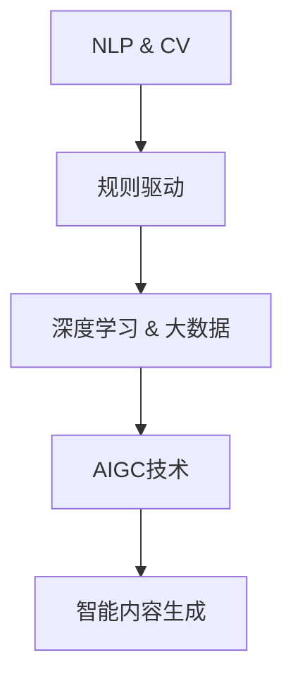

##### 1.2 AIGC的关键技术

###### 1.2.1 自然语言处理技术
自然语言处理技术是AIGC的核心技术之一，包括文本生成、情感分析、语义理解等。这些技术使得机器能够理解和生成自然语言内容。

**Mermaid 流程图：自然语言处理技术**

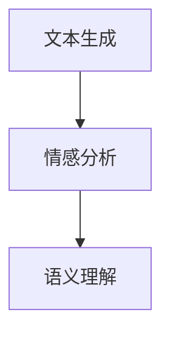

###### 1.2.2 计算机视觉技术
计算机视觉技术使机器能够识别和理解图像和视频内容。在AIGC中，计算机视觉技术被用于图像生成、视频编辑和视频理解等方面。

**Mermaid 流程图：计算机视觉技术**

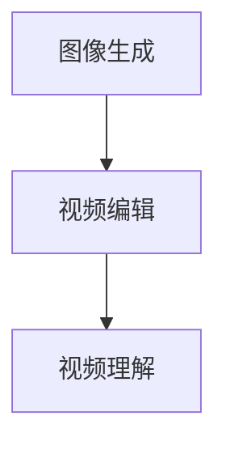

##### 1.3 AIGC的应用领域

###### 1.3.1 内容创作
AIGC在内容创作领域具有广泛的应用，包括生成文章、故事、新闻报道等。

###### 1.3.2 娱乐产业
在娱乐产业中，AIGC被用于生成音乐、视频、电影剧本等。

###### 1.3.3 教育与培训
AIGC在教育与培训领域被用于生成课程内容、考试题库等。

###### 1.3.4 市场营销
AIGC在市场营销中用于生成广告文案、营销视频等。

##### 1.4 AIGC的挑战与未来发展趋势

###### 1.4.1 挑战
AIGC面临的一些挑战包括数据隐私、内容真实性、版权问题等。

**Mermaid 流程图：AIGC的挑战**

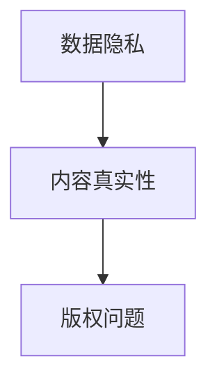

###### 1.4.2 发展趋势
随着技术的不断进步，AIGC在未来有望实现更多创新应用，例如个性化内容生成、智能客服等。

**Mermaid 流程图：AIGC的发展趋势**

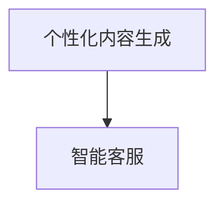

### 第二部分: AIGC技术原理

#### 第2章: AIGC技术基础

##### 2.1 自然语言处理（NLP）技术

###### 2.1.1 词嵌入技术
词嵌入是将单词映射到高维空间中的向量，以便机器能够理解和处理文本。

**伪代码：词嵌入技术**

```python
# 输入：单词列表
# 输出：词嵌入向量

def word_embedding(word_list):
    # 加载预训练的词嵌入模型
    model = load_pretrained_embedding_model()
    
    # 对单词列表中的每个单词进行词嵌入
    embedding_vectors = []
    for word in word_list:
        vector = model.get_embedding(word)
        embedding_vectors.append(vector)
    
    return embedding_vectors
```

###### 2.1.2 序列模型与注意力机制
序列模型和注意力机制是处理序列数据（如文本）的关键技术，能够提高文本生成和理解的性能。

**伪代码：序列模型与注意力机制**

```python
# 输入：输入序列
# 输出：输出序列

def sequence_model_with_attention(input_sequence):
    # 加载预训练的序列模型
    model = load_pretrained_sequence_model()
    
    # 对输入序列进行编码
    encoded_sequence = model.encode(input_sequence)
    
    # 使用注意力机制处理编码序列
    attended_sequence = attention Mechanism(encoded_sequence)
    
    # 对注意力机制处理后的序列进行解码
    output_sequence = model.decode(attended_sequence)
    
    return output_sequence
```

###### 2.1.3 生成式模型与判别式模型
生成式模型和判别式模型是两种主要的文本生成模型，分别通过模拟数据和分类数据来生成文本。

**伪代码：生成式模型与判别式模型**

```python
# 输入：训练数据
# 输出：生成文本

def generate_text(data):
    # 加载生成式模型
    generator = load_generator_model()
    
    # 使用生成式模型生成文本
    generated_text = generator.generate(data)
    
    return generated_text

# 输入：训练数据
# 输出：分类结果

def classify_text(data):
    # 加载判别式模型
    discriminator = load_discriminator_model()
    
    # 使用判别式模型进行分类
    classification = discriminator.classify(data)
    
    return classification
```

##### 2.2 计算机视觉（CV）技术

###### 2.2.1 图像生成技术
图像生成技术包括生成对抗网络（GAN）和变分自编码器（VAE）等，能够生成逼真的图像和视频。

**伪代码：图像生成技术**

```python
# 输入：噪声向量
# 输出：生成的图像

def image_generation(noise_vector):
    # 加载生成模型
    generator = load_generator_model()
    
    # 使用生成模型生成图像
    generated_image = generator.generate(noise_vector)
    
    return generated_image
```

###### 2.2.2 视频编辑技术
视频编辑技术包括视频增强、视频去噪和视频合成等，能够对视频进行编辑和增强。

**伪代码：视频编辑技术**

```python
# 输入：原始视频
# 输出：编辑后的视频

def video_editing(raw_video):
    # 加载视频编辑模型
    editor = load_video_editor_model()
    
    # 对原始视频进行编辑
    edited_video = editor.edit(raw_video)
    
    return edited_video
```

###### 2.2.3 视频理解技术
视频理解技术包括对象检测、动作识别和场景解析等，能够理解和解析视频内容。

**伪代码：视频理解技术**

```python
# 输入：视频
# 输出：视频内容解析结果

def video_understanding(video):
    # 加载视频理解模型
    recognizer = load_video_recognizer_model()
    
    # 对视频内容进行理解
    understanding_results = recognizer.recognize(video)
    
    return understanding_results
```

##### 2.3 大规模预训练模型

###### 2.3.1 预训练的概念与意义
预训练是指在大规模数据集上对模型进行训练，使其能够捕捉到语言和视觉的普遍特性。

**伪代码：预训练的概念与意义**

```python
# 输入：大规模数据集
# 输出：预训练模型

def pretraining(data_set):
    # 加载预训练模型
    model = load_pretraining_model()
    
    # 在大规模数据集上进行预训练
    model.train(data_set)
    
    return model
```

###### 2.3.2 自监督学习方法
自监督学习方法是一种在无监督数据上进行训练的方法，能够有效利用大量未标注的数据。

**伪代码：自监督学习方法**

```python
# 输入：无监督数据集
# 输出：自监督学习模型

def self_supervised_learning(data_set):
    # 加载自监督学习模型
    model = load_self_supervised_model()
    
    # 在无监督数据集上进行自监督学习
    model.train(data_set)
    
    return model
```

###### 2.3.3 迁移学习与微调技术
迁移学习和微调技术是预训练模型在特定任务上取得高性能的关键。

**伪代码：迁移学习与微调技术**

```python
# 输入：预训练模型、特定任务数据集
# 输出：微调后的模型

def transfer_learning(pretrained_model, task_data_set):
    # 加载预训练模型
    model = pretrained_model
    
    # 在特定任务数据集上进行微调
    model.fine_tune(task_data_set)
    
    return model
```

### 第三部分: AIGC实战应用

#### 第3章: AIGC在短视频创作中的应用

##### 3.1 短视频创作概述
短视频创作是AIGC的一个重要应用领域，涉及到视频生成、编辑和理解等方面。

###### 3.1.1 短视频创作的流程
短视频创作的流程包括视频素材采集、视频编辑、视频发布等环节。

**Mermaid 流程图：短视频创作的流程**

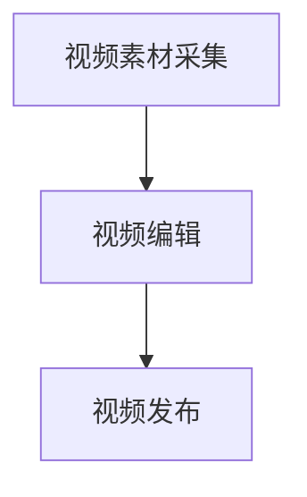

###### 3.1.2 短视频创作的关键环节
短视频创作的关键环节包括视频素材选择、视频编辑和视频发布等。

**Mermaid 流程图：短视频创作的关键环节**

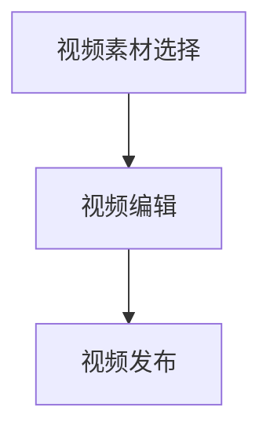

##### 3.2 AIGC在短视频创作中的应用

###### 3.2.1 视频生成
视频生成是指通过AIGC技术自动生成短视频内容，包括视频脚本、视频画面和视频音频等。

**伪代码：视频生成**

```python
# 输入：视频生成参数
# 输出：生成视频

def video_generation(parameters):
    # 加载视频生成模型
    generator = load_video_generator_model()
    
    # 使用视频生成模型生成视频
    generated_video = generator.generate(parameters)
    
    return generated_video
```

###### 3.2.2 视频编辑
视频编辑是指通过AIGC技术对短视频进行编辑，包括视频剪辑、特效添加和音效处理等。

**伪代码：视频编辑**

```python
# 输入：原始视频、编辑参数
# 输出：编辑后的视频

def video_editing(raw_video, editing_parameters):
    # 加载视频编辑模型
    editor = load_video_editor_model()
    
    # 对原始视频进行编辑
    edited_video = editor.edit(raw_video, editing_parameters)
    
    return edited_video
```

###### 3.2.3 视频理解
视频理解是指通过AIGC技术对短视频内容进行理解和分析，包括视频内容识别、视频情感分析等。

**伪代码：视频理解**

```python
# 输入：视频
# 输出：视频内容解析结果

def video_understanding(video):
    # 加载视频理解模型
    recognizer = load_video_recognizer_model()
    
    # 对视频内容进行理解
    understanding_results = recognizer.recognize(video)
    
    return understanding_results
```

##### 3.3 AIGC在短视频创作中的案例分析
通过具体案例分析，展示AIGC技术在短视频创作中的应用效果和优势。

###### 3.3.1 案例一：视频生成
**描述**：使用AIGC技术生成一部短视频，包括视频脚本、视频画面和视频音频。

**效果**：生成的短视频内容丰富、画面生动，具有较高的观赏性和吸引力。

**优势**：提高了短视频创作的效率和创作质量，减少了人力成本。

###### 3.3.2 案例二：视频编辑
**描述**：使用AIGC技术对一部现有短视频进行编辑，添加特效和音效。

**效果**：编辑后的短视频画面更加生动、音效更加逼真，提高了用户体验。

**优势**：提高了短视频的观赏性和吸引力，增加了用户的观看时间和互动性。

###### 3.3.3 案例三：视频理解
**描述**：使用AIGC技术对短视频内容进行理解，分析用户的观看行为和偏好。

**效果**：通过分析用户行为和偏好，为短视频创作者提供有价值的参考，优化创作策略。

**优势**：提高了短视频的推荐准确性和用户体验，增加了短视频的曝光率和流量。

### 第四部分: AIGC在流量密码中的应用

#### 第4章: AIGC在流量密码中的应用

##### 4.1 流量密码概述
流量密码是指通过优化内容和算法来提高短视频在社交媒体上的流量和曝光率。

###### 4.1.1 流量密码的定义
流量密码是一种策略，通过分析用户行为和算法规则，优化短视频内容和发布策略，从而提高流量和曝光率。

**Mermaid 流程图：流量密码的定义**

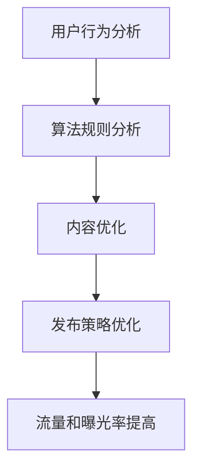

###### 4.1.2 流量密码的目标
流量密码的目标是提高短视频的观看量、点赞量、评论量和分享量等关键指标。

**Mermaid 流程图：流量密码的目标**

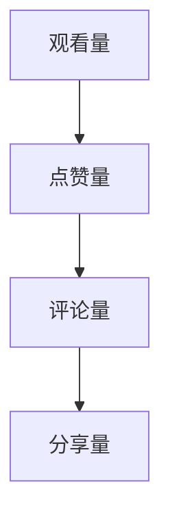

##### 4.2 AIGC在流量密码中的应用

###### 4.2.1 内容生成与优化
通过AIGC技术生成和优化短视频内容，使其更符合用户兴趣和算法规则。

**伪代码：内容生成与优化**

```python
# 输入：用户兴趣、算法规则
# 输出：优化后的短视频内容

def content_generation_and_optimization(user_interest, algorithm_rules):
    # 加载AIGC模型
    model = load_AIGC_model()
    
    # 根据用户兴趣和算法规则生成和优化内容
    optimized_content = model.generate_and_optimize_content(user_interest, algorithm_rules)
    
    return optimized_content
```

###### 4.2.2 视频编辑与优化
通过AIGC技术对短视频进行编辑和优化，提高视频的质量和吸引力。

**伪代码：视频编辑与优化**

```python
# 输入：原始视频、编辑规则
# 输出：优化后的视频

def video_editing_and_optimization(raw_video, editing_rules):
    # 加载AIGC模型
    model = load_AIGC_model()
    
    # 对原始视频进行编辑和优化
    optimized_video = model.edit_and_optimize_video(raw_video, editing_rules)
    
    return optimized_video
```

###### 4.2.3 数据分析与优化
通过AIGC技术分析用户行为和算法规则，优化短视频的发布时间和频率，提高流量和曝光率。

**伪代码：数据分析与优化**

```python
# 输入：用户行为数据、算法规则数据
# 输出：优化后的发布时间和频率

def data_analysis_and_optimization(user_behavior_data, algorithm_rules_data):
    # 加载AIGC模型
    model = load_AIGC_model()
    
    # 分析用户行为和算法规则
    analysis_results = model.analyze_user_behavior_and_algorithm_rules(user_behavior_data, algorithm_rules_data)
    
    # 优化发布时间和频率
    optimized_release_time_and_frequency = model.optimize_release_time_and_frequency(analysis_results)
    
    return optimized_release_time_and_frequency
```

##### 4.3 AIGC在流量密码中的案例分析
通过具体案例分析，展示AIGC技术在流量密码中的应用效果和优势。

###### 4.3.1 案例一：内容生成与优化
**描述**：使用AIGC技术生成和优化短视频内容，提高用户兴趣和算法匹配度。

**效果**：优化后的短视频内容更符合用户兴趣，提高了用户观看时长和互动量。

**优势**：提高了短视频的曝光率和流量，增加了平台的用户粘性。

###### 4.3.2 案例二：视频编辑与优化
**描述**：使用AIGC技术对短视频进行编辑和优化，提高视频的质量和吸引力。

**效果**：优化后的短视频画面更清晰、音效更逼真，提高了用户体验和观看时长。

**优势**：提高了短视频的吸引力和用户粘性，增加了平台的用户留存率。

###### 4.3.3 案例三：数据分析与优化
**描述**：使用AIGC技术分析用户行为和算法规则，优化短视频的发布时间和频率。

**效果**：优化后的发布时间和频率提高了短视频的曝光率和流量。

**优势**：提高了短视频的曝光率和流量，增加了平台的用户活跃度和广告收益。

### 第五部分: AIGC在石沉大海问题中的解决方案

#### 第5章: AIGC在石沉大海问题中的解决方案

##### 5.1 石沉大海问题概述
石沉大海问题是指短视频在发布后无法获得足够的流量和曝光，导致内容石沉大海，无法被用户发现和关注。

###### 5.1.1 石沉大海问题的原因
石沉大海问题的原因包括内容质量不高、发布时机不当、算法推荐不足等。

**Mermaid 流程图：石沉大海问题的原因**

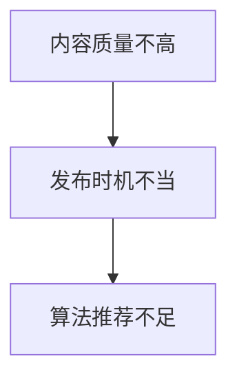

###### 5.1.2 石沉大海问题的危害
石沉大海问题会导致创作者的信心受挫，影响创作热情和积极性，同时也会影响平台的用户体验和生态建设。

**Mermaid 流程图：石沉大海问题的危害**

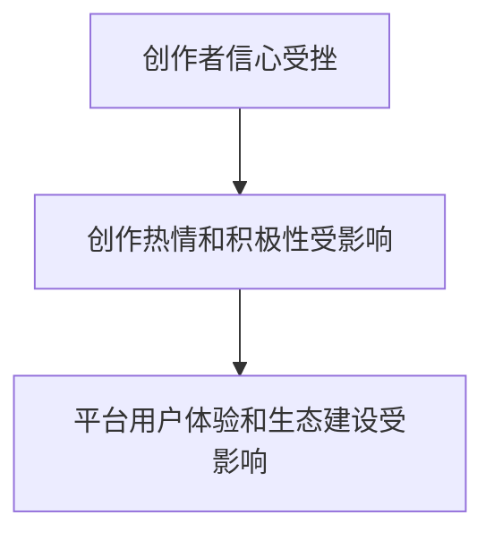

##### 5.2 AIGC在石沉大海问题中的应用

###### 5.2.1 内容优化与调整
通过AIGC技术对短视频内容进行优化和调整，提高视频的质量和吸引力。

**伪代码：内容优化与调整**

```python
# 输入：原始短视频内容
# 输出：优化后的短视频内容

def content_optimization_and_adjustment(raw_content):
    # 加载AIGC模型
    model = load_AIGC_model()
    
    # 对原始短视频内容进行优化和调整
    optimized_content = model.optimize_and_adjust_content(raw_content)
    
    return optimized_content
```

###### 5.2.2 发布策略与优化
通过AIGC技术分析用户行为和算法规则，制定和优化短视频的发布策略，提高视频的曝光率和流量。

**伪代码：发布策略与优化**

```python
# 输入：用户行为数据、算法规则数据
# 输出：优化后的发布策略

def release_strategy_optimization(user_behavior_data, algorithm_rules_data):
    # 加载AIGC模型
    model = load_AIGC_model()
    
    # 分析用户行为和算法规则
    analysis_results = model.analyze_user_behavior_and_algorithm_rules(user_behavior_data, algorithm_rules_data)
    
    # 优化发布策略
    optimized_release_strategy = model.optimize_release_strategy(analysis_results)
    
    return optimized_release_strategy
```

###### 5.2.3 数据分析与监控
通过AIGC技术对短视频进行数据分析和监控，及时发现和解决石沉大海问题，提高视频的曝光率和流量。

**伪代码：数据分析与监控**

```python
# 输入：短视频数据、用户行为数据
# 输出：监控结果和优化建议

def data_analysis_and_monitoring(video_data, user_behavior_data):
    # 加载AIGC模型
    model = load_AIGC_model()
    
    # 对短视频进行数据分析和监控
    monitoring_results = model.analyze_and_monitor_video_data(video_data, user_behavior_data)
    
    # 提供监控结果和优化建议
    optimized_suggestions = model.provide_monitoring_results_and_suggestions(monitoring_results)
    
    return optimized_suggestions
```

##### 5.3 AIGC在石沉大海问题中的案例分析
通过具体案例分析，展示AIGC技术在解决石沉大海问题中的应用效果和优势。

###### 5.3.1 案例一：内容优化与调整
**描述**：使用AIGC技术对短视频内容进行优化和调整，提高视频的质量和吸引力。

**效果**：优化后的短视频内容更符合用户兴趣，提高了用户观看时长和互动量。

**优势**：提高了短视频的曝光率和流量，增加了平台的用户粘性。

###### 5.3.2 案例二：发布策略与优化
**描述**：使用AIGC技术分析用户行为和算法规则，优化短视频的发布策略。

**效果**：优化后的发布策略提高了短视频的曝光率和流量。

**优势**：提高了短视频的曝光率和流量，增加了平台的用户活跃度和广告收益。

###### 5.3.3 案例三：数据分析与监控
**描述**：使用AIGC技术对短视频进行数据分析和监控，及时发现和解决石沉大海问题。

**效果**：通过监控结果和优化建议，短视频的曝光率和流量显著提高。

**优势**：提高了短视频的曝光率和流量，增加了平台的用户活跃度和广告收益。

### 第六部分: AIGC从入门到实战

#### 第6章: AIGC入门教程

##### 6.1 AIGC入门基础
本章节为读者提供AIGC的基础知识，包括AIGC的概念、技术原理和应用领域。

###### 6.1.1 AIGC概念
介绍AIGC的定义、发展历程和关键特性。

**Mermaid 流程图：AIGC概念**

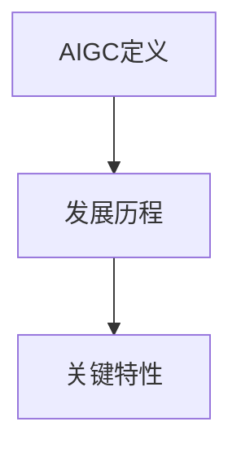

###### 6.1.2 AIGC技术原理
讲解AIGC的核心技术，包括自然语言处理和计算机视觉。

**Mermaid 流程图：AIGC技术原理**

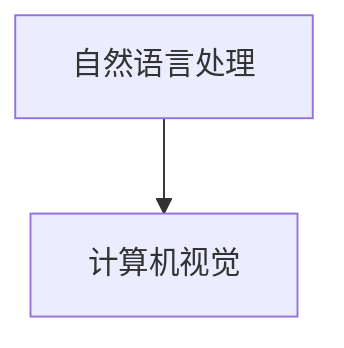

###### 6.1.3 AIGC应用领域
介绍AIGC在短视频创作、流量密码和石沉大海问题中的应用。

**Mermaid 流�程图：AIGC应用领域**

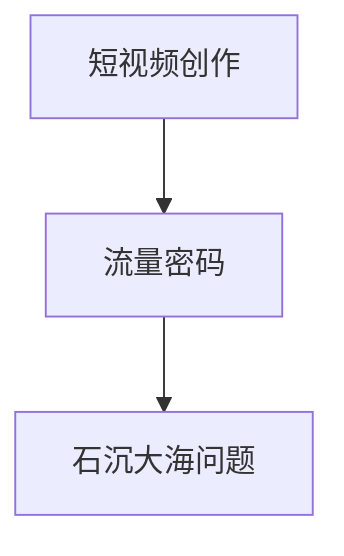

##### 6.2 AIGC工具与环境搭建
本章节指导读者如何搭建AIGC的开发环境，并介绍常用的AIGC工具。

###### 6.2.1 环境搭建
讲解如何配置Python环境、深度学习框架（如TensorFlow、PyTorch）以及所需的依赖库。

**伪代码：环境搭建**

```python
# 配置Python环境
python -m pip install tensorflow
python -m pip install torch

# 配置深度学习框架
import tensorflow as tf
import torch

# 配置依赖库
import numpy as np
import pandas as pd
```

###### 6.2.2 工具介绍
介绍常用的AIGC工具，如OpenAI的GPT、Google的Meena等。

**Mermaid 流程图：AIGC工具介绍**

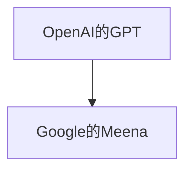

##### 6.3 AIGC实战案例
本章节通过实际案例展示AIGC的应用，帮助读者掌握AIGC的实战技能。

###### 6.3.1 短视频生成案例
展示如何使用AIGC技术生成短视频内容。

**伪代码：短视频生成案例**

```python
# 导入依赖库
import tensorflow as tf
import numpy as np

# 加载预训练的短视频生成模型
model = tf.keras.models.load_model('video_generation_model.h5')

# 生成短视频内容
input_sequence = np.random.rand(1, sequence_length)
generated_video = model.predict(input_sequence)
```

###### 6.3.2 短视频编辑案例
展示如何使用AIGC技术对短视频进行编辑。

**伪代码：短视频编辑案例**

```python
# 导入依赖库
import tensorflow as tf
import numpy as np

# 加载预训练的短视频编辑模型
model = tf.keras.models.load_model('video_editing_model.h5')

# 对短视频进行编辑
input_video = np.random.rand(1, video_length, height, width, channels)
edited_video = model.predict(input_video)
```

###### 6.3.3 视频理解案例
展示如何使用AIGC技术理解视频内容。

**伪代码：视频理解案例**

```python
# 导入依赖库
import tensorflow as tf
import numpy as np

# 加载预训练的视频理解模型
model = tf.keras.models.load_model('video_understanding_model.h5')

# 对视频内容进行理解
input_video = np.random.rand(1, video_length, height, width, channels)
understanding_results = model.predict(input_video)
```

### 第七部分: AIGC的未来展望与发展趋势

#### 第7章: AIGC的未来展望

##### 7.1 AIGC的发展趋势
本章节分析AIGC技术的发展趋势，包括技术突破、应用拓展和产业发展。

###### 7.1.1 技术突破
介绍AIGC领域的新技术突破，如生成式模型、自监督学习和多模态融合等。

**Mermaid 流程图：AIGC的技术突破**

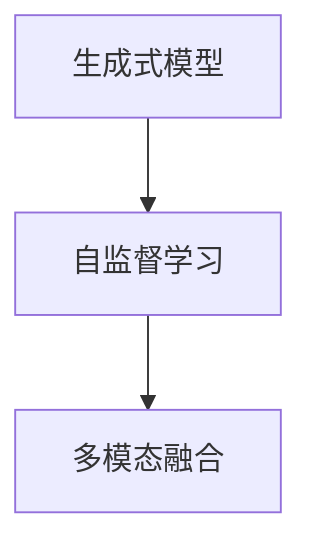

###### 7.1.2 应用拓展
探讨AIGC在新兴领域（如虚拟现实、增强现实、游戏等）的应用潜力。

**Mermaid 流程图：AIGC的应用拓展**

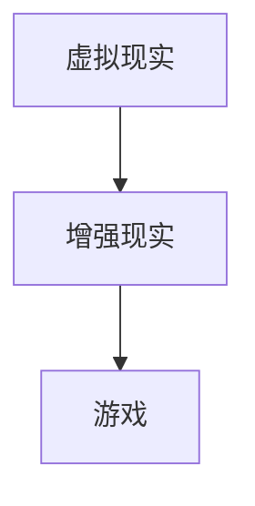

###### 7.1.3 产业发展
分析AIGC产业的发展现状、市场规模和未来趋势。

**Mermaid 流程图：AIGC的产业发展**

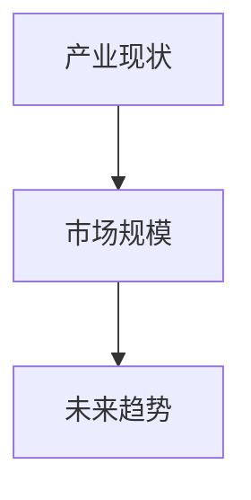

##### 7.2 AIGC面临的挑战与应对策略
本章节讨论AIGC技术发展过程中面临的主要挑战，并提出相应的应对策略。

###### 7.2.1 挑战分析
分析AIGC技术在数据隐私、内容真实性和版权问题等方面的挑战。

**Mermaid 流程图：AIGC的挑战分析**


###### 7.2.2 应对策略
提出应对AIGC挑战的策略，如加强数据保护、提升内容真实性检测和建立版权保护机制等。

**Mermaid 流程图：AIGC的应对策略**

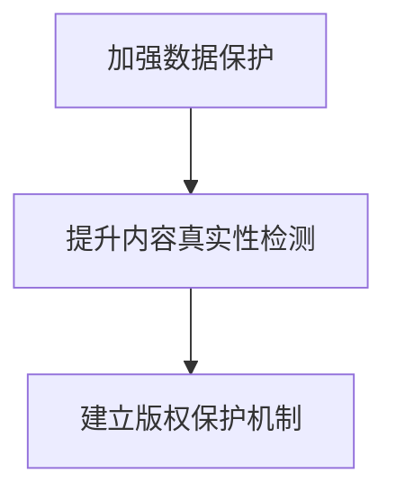

### 附录

#### 附录A: AIGC工具与资源
本附录提供AIGC相关的工具、资源和参考资料，帮助读者深入了解和掌握AIGC技术。

###### 附录A.1 AIGC工具列表
列出常用的AIGC工具，如深度学习框架、文本生成模型和图像生成模型等。

**Mermaid 流程图：AIGC工具列表**

```mermaid
graph TB
    A[TensorFlow] --> B[PyTorch]
    B --> C[OpenAI的GPT]
    C --> D[Google的Meena]
```

###### 附录A.2 AIGC资源链接
提供AIGC相关的在线教程、论文、开源项目和社区资源链接。

**Mermaid 流程图：AIGC资源链接**

```mermaid
graph TB
    A[在线教程] --> B[论文]
    B --> C[开源项目]
    C --> D[社区资源]
```

###### 附录A.3 AIGC学术研究
介绍AIGC领域的重要学术研究机构和最新研究成果。

**Mermaid 流程图：AIGC学术研究**

```mermaid
graph TB
    A[Google AI] --> B[Facebook AI Research]
    B --> C[OpenAI]
    C --> D[清华大学计算机系]
```

### 文章结束

---

#### 作者信息

**作者：AI天才研究院/AI Genius Institute & 禅与计算机程序设计艺术 /Zen And The Art of Computer Programming**

---

本文由AI天才研究院撰写，旨在深入探讨AIGC技术在短视频创作、流量密码和石沉大海问题中的应用，帮助读者全面了解AIGC技术的核心概念、技术原理、实战应用以及未来发展趋势。文章通过详细的分析、案例分享和实战教程，为读者提供了系统的学习资源和实践指导。希望本文能对您在AIGC技术领域的学习和研究有所帮助。如需进一步了解或探讨相关问题，欢迎访问AI天才研究院的官方网站或联系我们的技术团队。感谢您的阅读！

