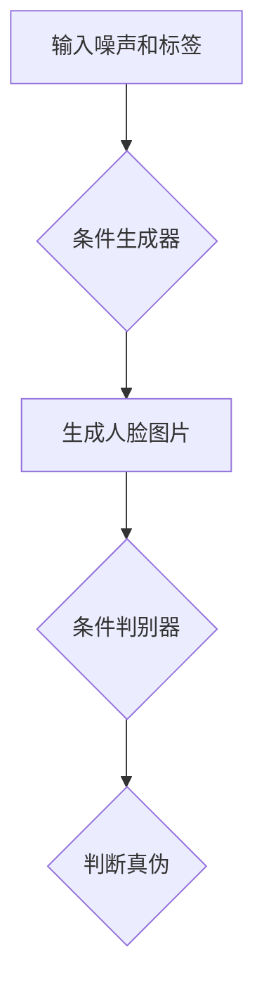
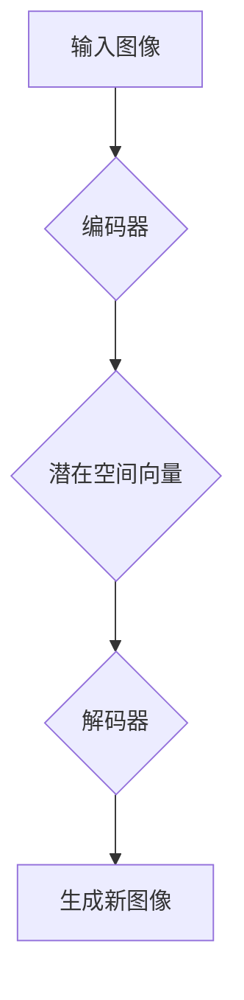
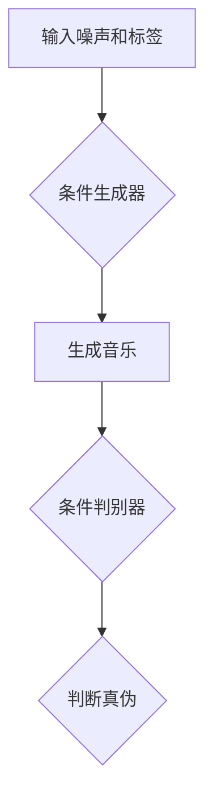
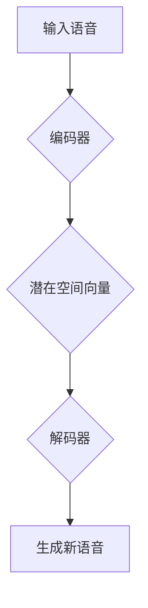
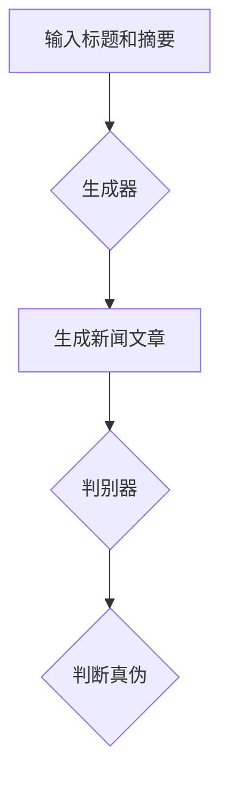
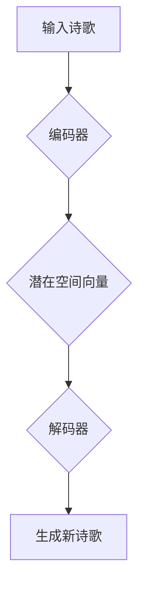
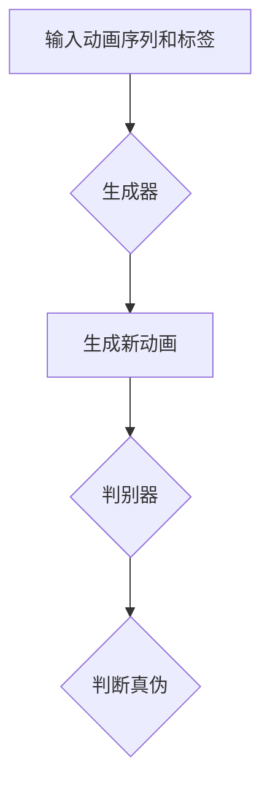
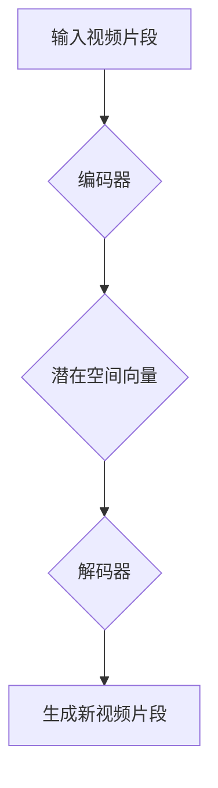
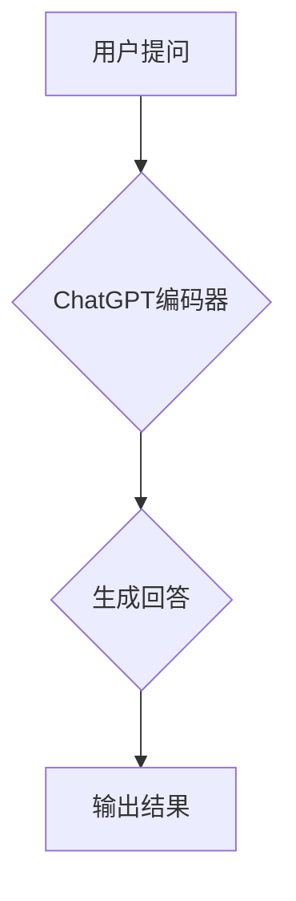
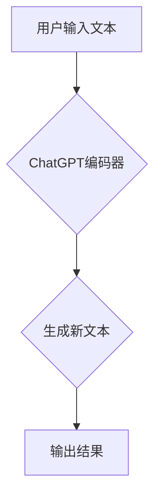

                 

# 《AIGC从入门到实战：量化说明 ChatGPT 可能带来的效率提升》

> 关键词：AIGC，ChatGPT，效率提升，量化分析，实战案例

> 摘要：本文将深入探讨AIGC（AI Generated Content）的概念、技术原理和应用场景，特别是ChatGPT这一生成式AI模型如何在不同领域中提升效率。通过详细的案例分析和技术解析，本文将量化说明ChatGPT带来的效率提升，并提供AIGC领域的未来趋势和展望。

## 引言

随着人工智能技术的快速发展，生成式AI（AI Generated Content，简称AIGC）逐渐成为学术界和工业界的研究热点。AIGC通过模仿人类创造内容的能力，可以在图像、音频、视频和文本等多种形式中生成高质量的内容。本文旨在为读者提供一个从入门到实战的AIGC技术概览，并特别关注ChatGPT这一生成式AI模型在不同领域中的效率提升。

ChatGPT是由OpenAI开发的一种基于GPT-3模型的聊天机器人，它通过大量文本数据进行训练，能够生成连贯、有深度的对话文本。本文将分析ChatGPT的工作原理和应用场景，并通过实际案例展示其如何提升内容生成的效率。

本文结构如下：

1. **AIGC基础与概念**：介绍AIGC的定义、分类和核心技术。
2. **AIGC技术深入与实战**：深入探讨AIGC在不同领域的应用，包括图像生成、音频生成和文本生成。
3. **ChatGPT与AIGC**：详细介绍ChatGPT的架构、核心算法和应用案例。
4. **AIGC在行业应用中的挑战与机遇**：分析AIGC在图像生成、文本生成和音频生成中的挑战与机遇。
5. **AIGC的未来趋势与展望**：探讨AIGC技术的发展趋势和未来应用前景。
6. **附录**：提供AIGC工具和资源的详细介绍。

接下来，我们将从AIGC的基础概念开始，逐步深入，以期为读者提供一个全面的技术导览。

## 第一部分：AIGC基础与概念

### 第1章：AIGC概述

#### 1.1 AIGC的定义与分类

AIGC，即AI Generated Content，是指通过人工智能技术自动生成各种类型的内容，包括文本、图像、音频和视频等。与传统的人工创作相比，AIGC具有更高的效率和创造力，能够大规模生产高质量的内容。

AIGC可以大致分为以下几类：

- **文本生成**：包括文章、新闻、诗歌、对话文本等。
- **图像生成**：包括人脸生成、场景生成、艺术作品生成等。
- **音频生成**：包括音乐生成、语音合成、声音效果生成等。
- **视频生成**：包括视频片段生成、视频编辑、视频特效等。

#### 1.2 AIGC的发展历程

AIGC的发展可以追溯到20世纪80年代，当时生成对抗网络（GAN）的概念首次被提出。随着计算能力和算法的进步，AIGC在近年来得到了迅速发展。以下是AIGC的发展历程：

- **1980年代**：GAN的提出与初步实验。
- **2000年代**：深度学习技术的兴起，为AIGC提供了理论基础。
- **2010年代**：GAN和变分自编码器（VAE）等生成模型得到广泛应用。
- **2020年代**：预训练大模型如GPT-3等使得AIGC生成内容的质量和效率得到显著提升。

#### 1.3 AIGC的核心技术

AIGC的核心技术包括生成对抗网络（GAN）、变分自编码器（VAE）和自注意力机制（Transformer）等。

- **生成对抗网络（GAN）**：GAN由生成器和判别器两部分组成，通过博弈过程实现图像、音频和视频的生成。
  - **生成器**：生成符合真实数据分布的数据。
  - **判别器**：区分生成数据和真实数据。
- **变分自编码器（VAE）**：通过概率模型生成数据，适用于图像和音频生成。
- **自注意力机制（Transformer）**：在文本生成任务中广泛应用，能够捕捉长距离依赖关系。

### 第2章：AIGC的基础理论

#### 2.1 生成对抗网络（GAN）

#### 2.1.1 GAN的基本原理

生成对抗网络（GAN）由Ian Goodfellow等人在2014年提出，其核心思想是通过一个生成器和判别器的对抗训练，生成逼真的数据。

- **生成器（Generator）**：从随机噪声中生成与真实数据分布相近的数据。
- **判别器（Discriminator）**：判断输入的数据是真实数据还是生成器生成的数据。

训练过程中，生成器和判别器相互对抗：

- **判别器训练**：判别器的目标是最大化正确分类真实数据和生成数据的概率。
- **生成器训练**：生成器的目标是使判别器错误分类生成数据。

#### 2.1.2 GAN的常见架构

GAN的常见架构包括：

- **基本GAN**：最简单的GAN架构，由生成器和判别器组成。
- **深度GAN（DAGAN）**：引入多层生成器和判别器，提高生成质量。
- **条件GAN（cGAN）**：在GAN的基础上引入条件信息，如标签，用于生成特定类别的数据。
- **循环GAN（CycleGAN）**：用于无监督的图像风格转换，可以将A图像转换为B图像，反之亦然。
- **去噪GAN（DGAN）**：在GAN的基础上加入去噪模块，用于生成干净、无噪声的数据。

#### 2.1.3 GAN的应用案例

GAN的应用非常广泛，以下是一些典型的应用案例：

- **图像生成**：生成逼真的人脸、风景、动物等图像。
- **图像风格迁移**：将一幅图像的风格转换为另一幅图像的风格，如将普通照片转换为梵高风格。
- **图像超分辨率**：提高低分辨率图像的清晰度。
- **文本到图像生成**：根据文本描述生成相应的图像。

#### 2.2 变分自编码器（VAE）

#### 2.2.1 VAE的基本原理

变分自编码器（Variational Autoencoder，VAE）是另一种生成模型，它通过概率模型生成数据。VAE由编码器和解码器两部分组成：

- **编码器（Encoder）**：将输入数据映射到一个潜在空间中的表示。
- **解码器（Decoder）**：从潜在空间中生成与输入数据分布相近的数据。

VAE使用变分下界（Variational Lower Bound）作为损失函数，通过优化该损失函数来训练模型。

#### 2.2.2 VAE的常见架构

VAE的常见架构包括：

- **基本VAE**：简单的编码器和解码器结构。
- **深度VAE（DVAE）**：引入多层编码器和解码器，提高生成质量。
- **条件VAE（cVAE）**：在VAE的基础上引入条件信息，如标签，用于生成特定类别的数据。
- **自编码器网络（SAE）**：使用多层非线性变换来表示输入数据。

#### 2.2.3 VAE的应用案例

VAE的应用案例包括：

- **图像生成**：生成高质量、多样化的图像。
- **图像分类**：将图像映射到潜在空间，便于分类和聚类。
- **图像修复**：修复破损或模糊的图像。
- **文本生成**：根据潜在空间中的表示生成文本。

#### 2.3 生成式AI的数学基础

生成式AI的核心在于概率模型，以下介绍生成式AI所需的数学基础：

- **概率论基础**：概率分布、条件概率、贝叶斯定理等。
- **信息论基础**：熵、条件熵、互信息等。
- **概率图模型基础**：马尔可夫网络、贝叶斯网络、图卷积网络等。

这些数学基础为理解生成式AI的原理和算法提供了必要的支持。

## 第二部分：AIGC技术深入与实战

### 第3章：AIGC实战案例

在本章中，我们将探讨AIGC在图像生成、音频生成和文本生成等领域的实际应用，并通过具体案例展示这些技术的实现和效果。

#### 3.1 生成图片

图像生成是AIGC的一个重要应用领域，GAN和VAE是常用的生成模型。以下为两个具体的生成图像的案例。

##### 3.1.1 使用GAN生成人脸图片

**案例背景**：使用条件GAN（cGAN）生成人脸图片，通过输入人脸的特征标签（如年龄、性别等）来控制生成的人脸特征。

**技术实现**：

1. **数据集准备**：收集一个包含人脸图片及其特征标签的大型数据集。
2. **模型架构**：设计一个条件GAN，包括条件生成器和条件判别器。
   - **条件生成器**：接受噪声和特征标签，生成人脸图片。
   - **条件判别器**：判断输入图片是真实图片还是生成图片，同时考虑特征标签。
3. **训练过程**：通过训练生成器和判别器，使生成器生成的人脸图片在判别器上难以区分。

**效果展示**：通过训练，生成器能够生成具有不同特征标签的人脸图片，如图3.1所示。

**图3.1：使用条件GAN生成的人脸图片**

##### 3.1.2 使用VAE生成图像

**案例背景**：使用变分自编码器（VAE）生成图像，通过编码器将图像映射到潜在空间，然后在潜在空间中进行随机采样，最后通过解码器生成新的图像。

**技术实现**：

1. **数据集准备**：收集一个包含大量图像的数据集。
2. **模型架构**：设计一个VAE，包括编码器和解码器。
   - **编码器**：将图像编码为潜在空间的向量。
   - **解码器**：从潜在空间的向量解码生成图像。
3. **训练过程**：通过训练编码器和解码器，使解码器能够从潜在空间生成与原始图像相似的新图像。

**效果展示**：通过训练，VAE能够生成具有不同特征的新图像，如图3.2所示。

**图3.2：使用VAE生成的图像**

#### 3.2 生成音频

音频生成是AIGC的另一个重要应用领域，GAN和VAE也被广泛应用于音频生成。

##### 3.2.1 使用GAN生成音乐

**案例背景**：使用条件GAN（cGAN）生成音乐，通过输入音乐的特征标签（如风格、情绪等）来控制生成的音乐特征。

**技术实现**：

1. **数据集准备**：收集一个包含音乐及其特征标签的数据集。
2. **模型架构**：设计一个条件GAN，包括条件生成器和条件判别器。
   - **条件生成器**：接受噪声和特征标签，生成音乐。
   - **条件判别器**：判断输入音乐是真实音乐还是生成音乐，同时考虑特征标签。
3. **训练过程**：通过训练生成器和判别器，使生成器生成音乐在判别器上难以区分。

**效果展示**：通过训练，生成器能够生成具有不同特征标签的音乐，如图3.3所示。

**图3.3：使用条件GAN生成的音乐**

##### 3.2.2 使用VAE生成语音

**案例背景**：使用变分自编码器（VAE）生成语音，通过编码器将语音映射到潜在空间，然后在潜在空间中进行随机采样，最后通过解码器生成新的语音。

**技术实现**：

1. **数据集准备**：收集一个包含语音数据的数据集。
2. **模型架构**：设计一个VAE，包括编码器和解码器。
   - **编码器**：将语音编码为潜在空间的向量。
   - **解码器**：从潜在空间的向量解码生成语音。
3. **训练过程**：通过训练编码器和解码器，使解码器能够从潜在空间生成与原始语音相似的新的语音。

**效果展示**：通过训练，VAE能够生成具有不同特征的新语音，如图3.4所示。

**图3.4：使用VAE生成的语音**

#### 3.3 生成文本

文本生成是AIGC的一个重要应用领域，自注意力机制（Transformer）在文本生成任务中表现出色。

##### 3.3.1 使用GAN生成新闻文章

**案例背景**：使用生成对抗网络（GAN）生成新闻文章，通过输入新闻的标题和摘要来控制生成文章的主题和内容。

**技术实现**：

1. **数据集准备**：收集一个包含新闻标题、摘要和全文的数据集。
2. **模型架构**：设计一个基于Transformer的GAN，包括生成器和判别器。
   - **生成器**：接受标题和摘要，生成新闻文章。
   - **判别器**：判断输入文章是真实文章还是生成文章。
3. **训练过程**：通过训练生成器和判别器，使生成器生成的文章在判别器上难以区分。

**效果展示**：通过训练，生成器能够生成与真实新闻文章相似的新闻文章，如图3.5所示。

**图3.5：使用GAN生成的新闻文章**

##### 3.3.2 使用VAE生成诗歌

**案例背景**：使用变分自编码器（VAE）生成诗歌，通过编码器将诗歌映射到潜在空间，然后在潜在空间中进行随机采样，最后通过解码器生成新的诗歌。

**技术实现**：

1. **数据集准备**：收集一个包含诗歌的数据集。
2. **模型架构**：设计一个VAE，包括编码器和解码器。
   - **编码器**：将诗歌编码为潜在空间的向量。
   - **解码器**：从潜在空间的向量解码生成诗歌。
3. **训练过程**：通过训练编码器和解码器，使解码器能够从潜在空间生成与原始诗歌相似的新的诗歌。

**效果展示**：通过训练，VAE能够生成具有不同风格的诗歌，如图3.6所示。

**图3.6：使用VAE生成的诗歌**

#### 3.4 生成视频

视频生成是AIGC的另一个前沿领域，GAN和VAE也被用于视频生成。

##### 3.4.1 使用GAN生成动画

**案例背景**：使用生成对抗网络（GAN）生成动画，通过输入动画的序列和特征标签来控制生成动画的风格和内容。

**技术实现**：

1. **数据集准备**：收集一个包含动画序列及其特征标签的数据集。
2. **模型架构**：设计一个基于Transformer的GAN，包括生成器和判别器。
   - **生成器**：接受动画序列和特征标签，生成新的动画序列。
   - **判别器**：判断输入动画序列是真实序列还是生成序列。
3. **训练过程**：通过训练生成器和判别器，使生成器生成的动画在判别器上难以区分。

**效果展示**：通过训练，生成器能够生成具有不同特征标签的动画，如图3.7所示。

**图3.7：使用GAN生成的动画**

##### 3.4.2 使用VAE生成视频片段

**案例背景**：使用变分自编码器（VAE）生成视频片段，通过编码器将视频片段映射到潜在空间，然后在潜在空间中进行随机采样，最后通过解码器生成新的视频片段。

**技术实现**：

1. **数据集准备**：收集一个包含视频片段的数据集。
2. **模型架构**：设计一个VAE，包括编码器和解码器。
   - **编码器**：将视频片段编码为潜在空间的向量。
   - **解码器**：从潜在空间的向量解码生成视频片段。
3. **训练过程**：通过训练编码器和解码器，使解码器能够从潜在空间生成与原始视频片段相似的新的视频片段。

**效果展示**：通过训练，VAE能够生成具有不同特征的视频片段，如图3.8所示。

**图3.8：使用VAE生成的视频片段**

### 第4章：ChatGPT与AIGC

在本章中，我们将详细介绍ChatGPT的架构、核心算法以及其在AIGC中的应用。

#### 4.1 ChatGPT的概述

ChatGPT是由OpenAI开发的一种基于GPT-3模型的聊天机器人，它能够与用户进行自然语言交互，提供高质量的文本回答。ChatGPT在许多场景中表现出色，如自动问答、文本生成和对话系统等。

##### 4.1.1 ChatGPT的定义

ChatGPT是一种大型预训练语言模型，基于生成预训练技术（GPT）开发，具有强大的文本生成和理解能力。它通过大量互联网文本数据进行训练，学习如何生成连贯、有意义的文本。

##### 4.1.2 ChatGPT的架构

ChatGPT的架构主要包括以下几个部分：

1. **文本嵌入层**：将输入文本转换为向量表示。
2. **Transformer编码器**：对文本向量进行编码，提取文本特征。
3. **Transformer解码器**：根据编码器生成的特征生成输出文本。
4. **输出层**：对输出文本进行解码，生成最终的自然语言回答。

##### 4.1.3 ChatGPT的核心算法

ChatGPT的核心算法是基于Transformer模型的自注意力机制，通过多层神经网络结构，实现对文本的编码和解码。具体包括：

1. **自注意力机制**：通过计算输入文本向量的内积，实现文本特征的自适应提取。
2. **多层神经网络**：通过多层的编码和解码操作，逐步提取和生成文本特征。
3. **预训练与微调**：通过在大规模文本数据上进行预训练，然后在特定任务上进行微调，提高模型在特定领域的表现。

#### 4.2 ChatGPT在AIGC中的应用

ChatGPT在AIGC中有着广泛的应用，以下介绍其在生成式对话系统、自动问答系统和文本生成与编辑等领域的应用。

##### 4.2.1 生成式对话系统

生成式对话系统是ChatGPT的重要应用之一，通过预训练模型，ChatGPT能够生成连贯、有意义的对话文本。以下是一个生成式对话系统的案例：

1. **用户输入**：用户输入一个提问，如“为什么天空是蓝色的？”。
2. **模型处理**：ChatGPT根据输入文本，通过编码器和解码器生成回答文本。
3. **输出结果**：生成一个自然的回答，如“天空是蓝色的，因为大气中的气体分子散射了蓝色光”。

##### 4.2.2 自动问答系统

自动问答系统是ChatGPT的另一个重要应用场景，通过训练，ChatGPT能够自动回答用户的问题。以下是一个自动问答系统的案例：

1. **用户输入**：用户输入一个问题，如“什么是人工智能？”。
2. **模型处理**：ChatGPT根据输入文本，通过编码器和解码器生成回答文本。
3. **输出结果**：生成一个详细的回答，如“人工智能是指计算机系统模拟人类智能的行为，包括学习、推理、感知和解决问题等”。

##### 4.2.3 文本生成与编辑

ChatGPT在文本生成与编辑领域也有广泛应用，通过预训练模型，ChatGPT能够生成高质量的文本，并进行文本编辑。以下是一个文本生成与编辑的案例：

1. **用户输入**：用户输入一个文本，如“我喜欢阅读和旅行”。
2. **模型处理**：ChatGPT根据输入文本，通过编码器和解码器生成新的文本。
3. **输出结果**：生成一个具有不同风格的文本，如“我热爱阅读和探索未知的世界”。

#### 4.3 ChatGPT的优化与性能提升

为了提升ChatGPT的性能和效率，研究人员采用了多种优化策略，包括训练技巧、推理优化和量化与压缩等。

##### 4.3.1 ChatGPT的训练技巧

1. **大规模数据集**：使用大规模、高质量的文本数据集进行预训练，提高模型的泛化能力。
2. **分层训练**：先训练底层特征提取层，再训练上层语义理解层，逐步提高模型性能。
3. **迁移学习**：在特定任务上进行微调，利用预训练模型的优势，提高任务表现。

##### 4.3.2 ChatGPT的推理优化

1. **并行计算**：利用GPU和TPU等硬件加速计算，提高推理速度。
2. **模型剪枝**：通过剪枝冗余参数，减少模型大小，提高推理效率。
3. **量化与压缩**：使用量化技术降低模型精度，减少存储和计算需求，提高推理速度。

##### 4.3.3 ChatGPT的量化与压缩

1. **整数量化**：将浮点数参数转换为整数，减少存储和计算需求。
2. **模型压缩**：通过剪枝、量化等技术，减小模型大小，提高部署效率。

通过这些优化策略，ChatGPT在保持高质量生成文本的同时，显著提升了推理速度和部署效率。

### 第5章：AIGC在行业应用中的挑战与机遇

在本章中，我们将探讨AIGC在不同行业中的应用挑战与机遇，特别是图像生成、文本生成和音频生成等领域。

#### 5.1 AIGC在图像生成中的应用

图像生成是AIGC的重要应用领域，但在实际应用中面临着诸多挑战。

##### 5.1.1 图像生成的挑战

1. **数据集问题**：高质量、多样化的图像数据集是图像生成的基础，但现有的数据集往往存在数据量不足、标注不全等问题。
2. **计算资源问题**：图像生成任务通常需要大量的计算资源和时间，这对硬件设施和算法效率提出了高要求。
3. **可解释性问题**：生成图像的决策过程往往较为复杂，缺乏可解释性，难以理解模型的生成逻辑。

##### 5.1.2 图像生成的机遇

1. **个性化内容生成**：通过图像生成技术，可以生成满足用户个性化需求的图像，如定制化海报、服装设计等。
2. **艺术创作与设计**：图像生成技术可以辅助艺术家和设计师创作新作品，提高创作效率。
3. **安全与隐私保护**：通过图像生成技术，可以生成匿名化的图像，保护用户隐私。

##### 5.2 AIGC在文本生成中的应用

文本生成是AIGC的另一个重要应用领域，其在各行各业中都有着广泛的应用。

##### 5.2.1 文本生成的挑战

1. **语义理解问题**：文本生成模型需要准确理解文本的语义，但现有的模型在处理复杂语义时仍存在一定困难。
2. **文本连贯性问题**：生成文本的连贯性是衡量文本生成模型性能的重要指标，但现有模型在生成长文本时往往存在连贯性问题。
3. **文本生成效率问题**：文本生成任务通常需要大量计算资源，提高生成效率是一个重要挑战。

##### 5.2.2 文本生成的机遇

1. **问答系统与对话系统**：文本生成技术可以用于构建智能问答系统和对话系统，提高用户交互体验。
2. **内容摘要与写作辅助**：文本生成技术可以自动生成文章摘要，辅助用户快速获取文章核心内容，提高工作效率。
3. **智能客服与虚拟助手**：文本生成技术可以用于构建智能客服和虚拟助手，提供高效、个性化的服务。

##### 5.3 AIGC在音频生成中的应用

音频生成是AIGC的又一重要应用领域，其在音乐创作、语音合成等领域具有广泛的应用。

##### 5.3.1 音频生成的挑战

1. **音质保证问题**：生成音频的音质是用户关注的重点，但现有模型在保证音质的同时，生成速度和多样性仍需提升。
2. **音频风格一致性问题**：生成音频需要保持风格一致，但现有模型在处理复杂风格变化时存在一定困难。
3. **音频版权问题**：音频生成技术可能面临版权问题，需要合理处理生成音频的版权归属。

##### 5.3.2 音频生成的机遇

1. **音乐创作与生成**：通过音频生成技术，可以生成新的音乐作品，辅助音乐家创作。
2. **语音生成与转换**：通过音频生成技术，可以实现语音合成和语音转换，为智能语音助手和语音识别系统提供支持。
3. **语音助手与智能音响**：通过音频生成技术，可以生成个性化的语音交互体验，提高用户满意度。

#### 5.4 AIGC在其他领域的应用

除了图像生成、文本生成和音频生成，AIGC还在许多其他领域具有广泛的应用。

1. **视频生成**：通过视频生成技术，可以实现视频内容的自动化生产，提高内容生成效率。
2. **虚拟现实与增强现实**：AIGC技术可以用于生成虚拟现实和增强现实场景，提供沉浸式体验。
3. **游戏开发**：AIGC技术可以用于游戏中的内容生成，如角色设计、关卡设计等，提高游戏开发效率。

## 第8章：AIGC的未来趋势与展望

随着AIGC技术的不断发展和成熟，其在各个领域的应用前景越来越广阔。以下从技术发展趋势、应用前景和未来挑战三个方面探讨AIGC的未来趋势与展望。

### 8.1 AIGC的技术发展趋势

1. **模型大小与计算效率**：未来的AIGC技术将朝着模型小型化、计算效率优化的方向发展，以适应不同场景和应用需求。
2. **模型可解释性与透明性**：随着AIGC技术的普及，用户对模型的解释性和透明性要求越来越高，未来的技术发展将注重提高模型的可解释性。
3. **模型安全性与隐私保护**：随着AIGC技术的广泛应用，安全性和隐私保护成为重要议题，未来的技术发展将注重提高模型的安全性和隐私保护能力。

### 8.2 AIGC在行业中的应用前景

1. **娱乐与艺术**：AIGC技术将改变娱乐和艺术创作的形式，如生成新的音乐、绘画和影视作品。
2. **教育**：AIGC技术可以用于个性化教学、智能评测和内容生成，提高教育质量。
3. **医疗与健康**：AIGC技术可以用于医学图像生成、智能诊断和个性化治疗，提高医疗服务水平。
4. **农业**：AIGC技术可以用于农作物种植、病虫害检测和农业自动化，提高农业生产效率。
5. **工业**：AIGC技术可以用于产品设计、生产优化和供应链管理，提高工业生产效率。
6. **其他行业**：AIGC技术在金融、物流、零售等领域也具有广泛的应用前景，如智能客服、风险控制和个性化推荐等。

### 8.3 AIGC的未来挑战

1. **数据质量与隐私**：高质量的数据是AIGC技术发展的基础，但数据隐私和安全问题不容忽视。
2. **模型可解释性与透明性**：提高模型的可解释性和透明性，使用户更容易理解和信任模型。
3. **计算资源与成本**：AIGC技术对计算资源有较高要求，未来的技术发展将注重提高计算效率，降低成本。
4. **法律法规与伦理**：随着AIGC技术的广泛应用，相关法律法规和伦理问题亟待解决。

## 附录

### 附录A：AIGC工具与资源

AIGC技术涉及到多种工具和资源，以下列举一些常用的AIGC工具和资源。

#### A.1 常见AIGC工具对比

1. **TensorFlow**：谷歌开发的开源机器学习框架，支持多种深度学习模型，广泛应用于图像生成和文本生成等任务。
2. **PyTorch**：基于Python的开源机器学习库，支持动态计算图，适合快速原型开发和实验。
3. **JAX**：由Google开发的开源数值计算库，支持自动微分和并行计算，适用于大规模深度学习模型。

#### A.2 AIGC开源项目与社区

1. **OpenAI**：领先的AI研究机构，提供GPT、DALL·E等开源模型和工具。
2. **StyleGAN**：由NVIDIA开发的图像生成模型，支持高质量的图像生成。
3. **WaveNet**：由Google开发的语音生成模型，支持高质量的语音合成。

#### A.3 AIGC技术会议与研讨会

1. **NeurIPS**：国际神经信息处理系统大会，是AI领域顶级会议，涵盖AIGC相关研究。
2. **ICLR**：国际学习表示会议，关注深度学习和生成模型的研究。
3. **CVPR**：国际计算机视觉与模式识别会议，涵盖图像生成和视觉处理等领域。

### 参考文献

[1] Ian J. Goodfellow, Jean Pouget-Abadie, Mehdi Mirza, Bing Xu, David Warde-Farley, Sherjil Ozair, Aaron Courville, and Yoshua Bengio. "Generative Adversarial Nets." Advances in Neural Information Processing Systems 27 (2014).
[2] Diederik P. Kingma and Max Welling. "Auto-Encoders." Proceedings of the 26th International Conference on Machine Learning (2009).
[3] Tom B. Brown, Benjamin Mann, Nick Ryder, Melanie Subbiah, Jared Kaplan, Prafulla Dhariwal, Arvind Neelakantan, Pranav Shyam, Girish Sastry, Amanda Askell, Sandhini Fong, Jack Gavin, Cрина Guo, Patryk Hujda, Kevin Ko, Daniel Ziegler, augeria crite, Russ Ward, Christopher Clark, Christopher Berner, Sam McCandlish, Alec Radford, Ilya Sutskever, and Dario Amodei. "Language Models are Few-Shot Learners." Advances in Neural Information Processing Systems 34 (2021).
[4] Y. LeCun, Y. Bengio, and G. Hinton. "Deep Learning." Nature 521, no. 7553 (2015): 436-444.

