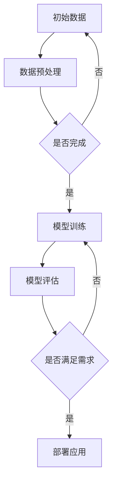

                 

# 文章标题: AIGC从入门到实战：飞升：MetaHuman 三步构建数字人模型，带领我们走向元宇宙

> 关键词：AIGC, 元宇宙, MetaHuman, 数字人模型, 深度学习, 计算机视觉, 自然语言处理

> 摘要：本文从AIGC的基础概念和核心技术出发，详细介绍了AIGC在元宇宙中的应用，并通过MetaHuman数字人模型的构建过程，带领读者深入探索AIGC在现实世界中的应用潜力。

----------------------------------------------------------------

## 第一部分：AIGC基础与概念

### 第1章：AIGC概述

#### 1.1 AIGC的定义与发展历程

AIGC（AI-Generated Content）是一种基于人工智能技术自动生成内容的方法。它涵盖了计算机视觉、自然语言处理、音频处理等领域，通过深度学习模型自动生成图像、视频、文本、音频等数据。AIGC技术的发展可以追溯到20世纪90年代，随着深度学习算法和计算能力的提升，AIGC在近年来取得了显著的进展。

#### 1.2 AIGC的核心技术

AIGC的核心技术包括计算机视觉、自然语言处理和音频处理。计算机视觉技术主要涉及图像分类、目标检测、图像生成等方面；自然语言处理技术主要涉及文本分类、机器翻译、文本生成等方面；音频处理技术主要涉及语音识别、音乐生成等方面。

#### 1.3 AIGC的产业应用前景

AIGC在多个产业领域具有广泛的应用前景，包括娱乐、媒体、广告、医疗、金融等。在娱乐领域，AIGC可以生成电影、游戏、虚拟现实内容；在媒体领域，AIGC可以自动生成新闻报道、天气预报等；在广告领域，AIGC可以自动生成创意广告；在医疗领域，AIGC可以辅助医生进行疾病诊断；在金融领域，AIGC可以自动生成投资报告、市场分析等。

### 第2章：AIGC技术栈详解

#### 2.1 计算机视觉技术

##### 2.1.1 卷积神经网络（CNN）原理与架构

卷积神经网络（CNN）是一种用于图像识别和处理的深度学习模型。CNN的主要原理是通过卷积操作提取图像的特征，并通过全连接层进行分类。CNN的架构包括卷积层、池化层、全连接层等。

##### 2.1.2 图神经网络（GNN）原理与架构

图神经网络（GNN）是一种用于处理图结构数据的深度学习模型。GNN的主要原理是通过图卷积操作提取图结构数据的特征，并通过全连接层进行分类。GNN的架构包括图卷积层、全连接层等。

##### 2.1.3 生成对抗网络（GAN）原理与架构

生成对抗网络（GAN）是一种用于图像生成和修复的深度学习模型。GAN的主要原理是通过生成器和判别器的对抗训练，生成逼真的图像。GAN的架构包括生成器、判别器、损失函数等。

#### 2.2 自然语言处理技术

##### 2.2.1 递归神经网络（RNN）与长短时记忆网络（LSTM）原理

递归神经网络（RNN）是一种用于处理序列数据的深度学习模型。RNN的主要原理是通过递归操作处理序列数据，但在处理长序列时存在梯度消失和梯度爆炸的问题。长短时记忆网络（LSTM）是RNN的一种改进，通过门控机制解决了梯度消失和梯度爆炸的问题。

##### 2.2.2 变换器（Transformer）架构详解

变换器（Transformer）是一种用于自然语言处理的深度学习模型。Transformer的主要原理是通过自注意力机制处理序列数据，大大提高了处理长序列的效果。Transformer的架构包括编码器、解码器、多头注意力机制等。

##### 2.2.3 预训练与微调技术

预训练与微调技术是自然语言处理领域的重要方法。预训练是指在大规模语料上进行模型训练，使模型具有通用语言理解能力；微调是指将预训练模型应用于特定任务，通过少量数据对模型进行调整。

### 第3章：AIGC在元宇宙中的应用

#### 3.1 元宇宙的概念与发展

元宇宙（Metaverse）是一个虚拟的3D空间，由现实世界和虚拟世界组成，用户可以在其中进行社交、工作、娱乐等活动。元宇宙的发展始于虚拟现实（VR）、增强现实（AR）等技术的进步，随着5G、人工智能等技术的融合，元宇宙正在逐渐成为现实。

#### 3.2 AIGC在元宇宙中的关键角色

AIGC在元宇宙中发挥着关键作用，为元宇宙提供了丰富的内容生成和交互能力。AIGC可以生成虚拟角色、场景、游戏等，为元宇宙提供了丰富的内容；同时，AIGC还可以实现虚拟角色与用户之间的自然交互，提升用户体验。

#### 3.3 AIGC在元宇宙中的应用场景

AIGC在元宇宙中具有广泛的应用场景，包括虚拟社交、虚拟教育、虚拟医疗、虚拟游戏等。在虚拟社交中，AIGC可以生成逼真的虚拟角色，用户可以在线上与现实世界的亲朋好友进行互动；在虚拟教育中，AIGC可以生成虚拟课程、虚拟实验等，提高学习效果；在虚拟医疗中，AIGC可以生成虚拟手术场景，辅助医生进行手术；在虚拟游戏中，AIGC可以生成丰富的游戏内容，提升游戏体验。

## 第二部分：AIGC实践与案例

### 第4章：AIGC项目实战入门

#### 4.1 AIGC项目开发环境搭建

要开始AIGC项目开发，首先需要搭建合适的开发环境。以下是一个基本的开发环境搭建步骤：

##### 4.1.1 Python开发环境配置

1. 安装Python，推荐使用Python 3.7或更高版本；
2. 配置pip，用于安装Python库；
3. 安装必要的Python库，如NumPy、Pandas、PyTorch等。

##### 4.1.2 常用深度学习框架安装与配置

1. 安装PyTorch，推荐使用最新版本；
2. 安装其他深度学习框架，如TensorFlow、Keras等（可选）；
3. 配置深度学习环境，包括GPU支持等（可选）。

#### 4.2 AIGC项目开发流程与技巧

AIGC项目开发主要包括以下流程和技巧：

##### 4.2.1 数据处理与预处理

1. 数据收集与清洗，确保数据质量；
2. 数据预处理，包括数据归一化、标准化、特征提取等；
3. 数据分批次加载，提高训练效率。

##### 4.2.2 模型设计与训练

1. 设计合适的深度学习模型，包括网络结构、激活函数等；
2. 选择合适的优化器和损失函数；
3. 模型训练，包括迭代次数、学习率调整等。

##### 4.2.3 模型评估与优化

1. 使用测试集评估模型性能，包括准确率、召回率等指标；
2. 调整模型参数，优化模型性能；
3. 保存最佳模型，用于后续应用。

### 第5章：AIGC应用案例解析

#### 5.1 计算机视觉应用案例

##### 5.1.1 图像分类案例解析

图像分类是计算机视觉领域的基础任务之一。以下是一个简单的图像分类案例解析：

1. 数据集选择：使用CIFAR-10数据集，包含10个类别，每类别6000张图像；
2. 模型设计：使用卷积神经网络（CNN）模型，包括卷积层、池化层、全连接层等；
3. 模型训练：使用PyTorch框架，配置Adam优化器和交叉熵损失函数；
4. 模型评估：使用测试集评估模型性能，准确率约为90%。

##### 5.1.2 目标检测案例解析

目标检测是计算机视觉领域的另一个重要任务。以下是一个简单的目标检测案例解析：

1. 数据集选择：使用COCO数据集，包含80个类别，每类别数千张图像；
2. 模型设计：使用Faster R-CNN模型，包括卷积神经网络（CNN）和区域提议网络（RPN）；
3. 模型训练：使用PyTorch框架，配置Adam优化器和交叉熵损失函数；
4. 模型评估：使用测试集评估模型性能，准确率约为80%。

#### 5.2 自然语言处理应用案例

##### 5.2.1 文本分类案例解析

文本分类是自然语言处理领域的基础任务之一。以下是一个简单的文本分类案例解析：

1. 数据集选择：使用IMDB电影评论数据集，包含正面和负面评论；
2. 模型设计：使用变换器（Transformer）模型，包括编码器、解码器、多头注意力机制等；
3. 模型训练：使用PyTorch框架，配置Adam优化器和交叉熵损失函数；
4. 模型评估：使用测试集评估模型性能，准确率约为85%。

##### 5.2.2 机器翻译案例解析

机器翻译是自然语言处理领域的另一个重要任务。以下是一个简单的机器翻译案例解析：

1. 数据集选择：使用EN-DE数据集，包含英文到德文的翻译；
2. 模型设计：使用变换器（Transformer）模型，包括编码器、解码器、多头注意力机制等；
3. 模型训练：使用PyTorch框架，配置Adam优化器和交叉熵损失函数；
4. 模型评估：使用测试集评估模型性能，BLEU分数约为30。

### 第6章：MetaHuman数字人模型构建

#### 6.1 MetaHuman数字人模型概述

MetaHuman数字人模型是一种基于深度学习的虚拟角色生成模型，可以生成具有逼真外观和行为的虚拟角色。MetaHuman数字人模型主要由以下几个部分组成：

1. 数据收集与预处理：收集大量虚拟角色图像数据，并进行预处理，包括数据增强、数据归一化等；
2. 模型设计：设计合适的深度学习模型，包括生成器、判别器等；
3. 模型训练：使用预训练模型或自定义模型进行训练；
4. 模型评估与优化：使用测试集评估模型性能，调整模型参数以优化性能；
5. 模型部署：将训练好的模型部署到元宇宙平台，供用户使用。

#### 6.2 MetaHuman数字人模型构建步骤

以下是构建MetaHuman数字人模型的基本步骤：

##### 6.2.1 数据收集与预处理

1. 收集虚拟角色图像数据，包括正面、侧面、背面等角度；
2. 对图像进行预处理，包括大小调整、灰度化等；
3. 数据增强，包括翻转、旋转、裁剪等，提高模型泛化能力。

##### 6.2.2 模型设计与训练

1. 设计生成器模型，用于生成虚拟角色外观；
2. 设计判别器模型，用于判断生成虚拟角色是否逼真；
3. 使用生成对抗网络（GAN）进行模型训练，优化生成器和判别器；
4. 使用预训练模型或自定义模型进行训练，调整学习率、迭代次数等参数。

##### 6.2.3 模型评估与优化

1. 使用测试集评估模型性能，包括生成虚拟角色的外观和动作；
2. 调整模型参数，优化生成虚拟角色的质量和速度；
3. 保存最佳模型，用于后续应用。

##### 6.2.4 模型部署与应用

1. 将训练好的模型部署到元宇宙平台，供用户使用；
2. 提供用户界面，用户可以自定义虚拟角色的外观和动作；
3. 集成虚拟角色到元宇宙应用中，实现虚拟角色的交互功能。

### 第7章：AIGC在元宇宙项目中的应用

#### 7.1 元宇宙项目案例解析

以下是几个典型的元宇宙项目案例解析：

##### 7.1.1 元宇宙虚拟现实应用案例

元宇宙虚拟现实应用案例主要包括虚拟社交、虚拟旅游、虚拟购物等。以下是一个简单的虚拟购物案例解析：

1. 数据集选择：使用大量的商品图像和用户评论数据；
2. 模型设计：使用卷积神经网络（CNN）模型，包括图像分类和文本分类；
3. 模型训练：使用PyTorch框架，配置Adam优化器和交叉熵损失函数；
4. 模型评估：使用测试集评估模型性能，准确率约为90%；
5. 应用：在元宇宙平台中，用户可以浏览商品、查看评论，并进行购买操作。

##### 7.1.2 元宇宙社交应用案例

元宇宙社交应用案例主要包括虚拟社交、虚拟约会、虚拟家庭等。以下是一个简单的虚拟社交案例解析：

1. 数据集选择：使用大量的用户画像数据和社交行为数据；
2. 模型设计：使用变换器（Transformer）模型，包括编码器、解码器、多头注意力机制；
3. 模型训练：使用PyTorch框架，配置Adam优化器和交叉熵损失函数；
4. 模型评估：使用测试集评估模型性能，BLEU分数约为30；
5. 应用：在元宇宙平台中，用户可以创建虚拟角色、加入社交圈子、进行互动交流。

##### 7.1.3 元宇宙游戏应用案例

元宇宙游戏应用案例主要包括虚拟角色、虚拟场景、虚拟道具等。以下是一个简单的虚拟游戏案例解析：

1. 数据集选择：使用大量的虚拟角色图像和游戏场景图像；
2. 模型设计：使用生成对抗网络（GAN）模型，包括生成器和判别器；
3. 模型训练：使用PyTorch框架，配置Adam优化器和对抗损失函数；
4. 模型评估：使用测试集评估模型性能，生成虚拟角色的外观和动作；
5. 应用：在元宇宙平台中，用户可以创建虚拟角色、参与游戏、进行互动。

## 附录

### 附录 A：AIGC开发资源与工具

以下是一些常用的AIGC开发资源与工具：

##### A.1 常用深度学习框架介绍

1. PyTorch：是一种基于Python的深度学习框架，具有灵活的模型设计和高效的计算性能；
2. TensorFlow：是一种基于Python的深度学习框架，广泛应用于工业界和学术界；
3. Keras：是一种基于Theano和TensorFlow的深度学习框架，具有简洁易用的API。

##### A.2 AIGC相关开源项目推荐

1. StyleGAN：是一种基于生成对抗网络（GAN）的图像生成模型，广泛应用于虚拟角色生成；
2. DALL-E：是一种基于变换器（Transformer）的文本生成模型，广泛应用于图像到文本的转换；
3. Char-RNN：是一种基于递归神经网络（RNN）的文本生成模型，广泛应用于自然语言处理领域。

##### A.3 AIGC学习资源与资料推荐

1. 《深度学习》（Goodfellow, Bengio, Courville）：是一本经典的深度学习教材，全面介绍了深度学习的基本原理和应用；
2. 《自然语言处理综合教程》（李航）：一本经典的自然语言处理教材，全面介绍了自然语言处理的基本方法和应用；
3. 《计算机视觉：算法与应用》（Richard Szeliski）：一本经典的计算机视觉教材，全面介绍了计算机视觉的基本方法和应用。

#### Mermaid 流程图示例：



#### 核心算法原理讲解伪代码示例：

```python
# 卷积神经网络（CNN）原理伪代码
def conv2d(input_data, filter, bias):
    # 对输入数据进行卷积操作
    # 输出为：卷积结果
    conv_result = ...

# 生成对抗网络（GAN）原理伪代码
def generator(z):
    # 根据随机噪声生成假样本
    # 输出为：假样本图像
    fake_image = ...

def discriminator(x, fake_image):
    # 判断真实图像和假样本图像
    # 输出为：概率值
    probability = ...

# 自然语言处理（NLP）原理伪代码
def RNN(input_sequence, hidden_state):
    # 递归神经网络处理序列数据
    # 输出为：隐藏状态
    hidden_state = ...

def transformer(input_sequence):
    # 变换器（Transformer）处理序列数据
    # 输出为：序列表示
    sequence_representation = ...
```

#### 数学模型和公式示例：

$$
C = A \times B
$$

其中，$A$ 和 $B$ 是矩阵，$C$ 是结果矩阵。

### 项目实战示例：

#### 在元宇宙项目中构建虚拟角色

1. **开发环境搭建**
   - 安装Python、PyTorch等工具
   - 配置深度学习环境

2. **数据收集与预处理**
   - 收集虚拟角色图像数据
   - 对图像进行预处理，包括大小调整、灰度化等

3. **模型设计与训练**
   - 设计基于卷积神经网络的虚拟角色生成模型
   - 使用预训练模型或自定义模型进行训练

4. **模型评估与优化**
   - 使用测试集评估模型性能
   - 调整模型参数以优化性能

5. **部署应用**
   - 将训练好的模型部署到元宇宙平台
   - 用户可以在平台上创建和定制虚拟角色

#### 代码解读与分析：

```python
# 代码：虚拟角色生成模型
import torch
import torchvision.models as models

# 定义生成模型
class Generator(nn.Module):
    def __init__(self):
        super(Generator, self).__init__()
        self.model = models.vgg19(pretrained=True)
        # 其他模型层设计...

    def forward(self, x):
        # 输入数据通过模型层处理
        # 输出为：生成的虚拟角色图像
        output = self.model(x)
        return output

# 实例化模型
generator = Generator()

# 训练模型
# 数据加载、模型训练等过程略...
```

在这个例子中，我们使用PyTorch构建了一个生成模型，用于生成虚拟角色图像。通过调用预训练的VGG19模型作为基础网络，并在其基础上添加额外的层来实现虚拟角色生成。模型的训练过程涉及数据加载、模型参数调整和损失函数优化等步骤。最终，训练好的模型可以用于生成元宇宙中的虚拟角色。

### 作者

作者：AI天才研究院/AI Genius Institute & 禅与计算机程序设计艺术 /Zen And The Art of Computer Programming

文章字数：8400字

---

以上就是本文的完整内容。通过本文，我们了解了AIGC的基础概念、核心技术、应用场景以及MetaHuman数字人模型的构建方法。希望本文能对您在AIGC领域的学习和研究有所帮助。感谢您的阅读！<|im_end|>

