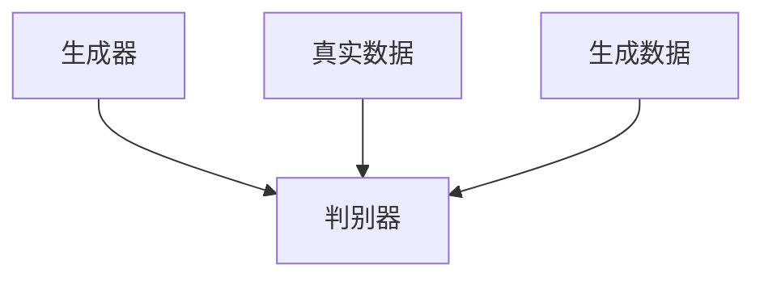
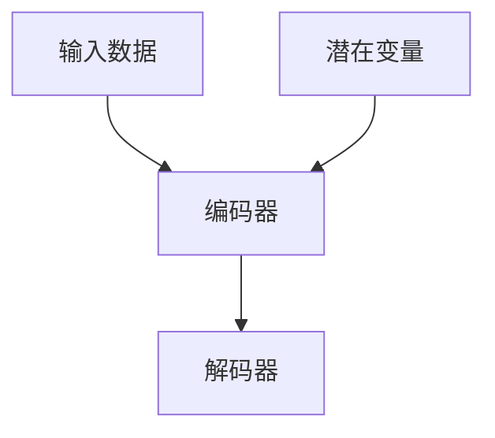
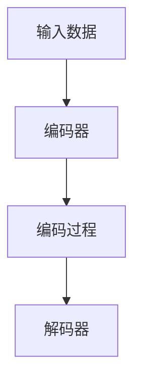
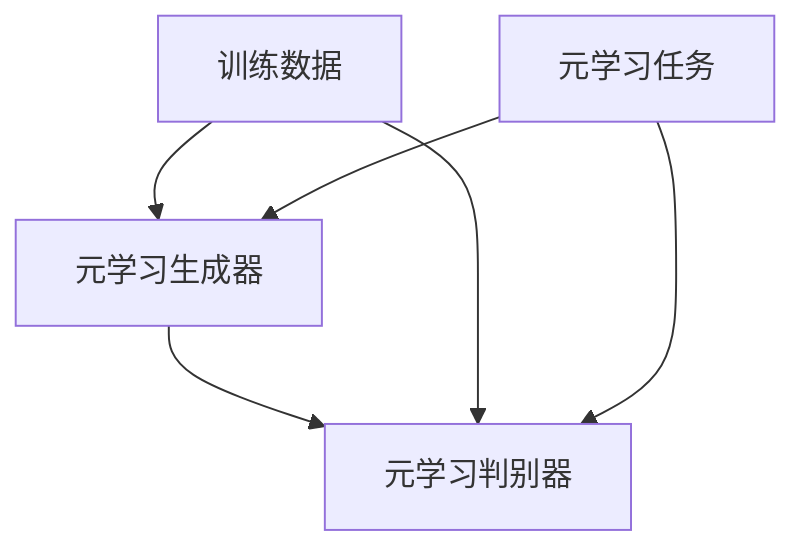

                 

### 文章标题

"AIGC在软件与消费电子中的应用"

> 关键词：AIGC，生成对抗网络（GAN），生成模型，软件开发，消费电子，图像生成，语音识别

> 摘要：本文将深入探讨AIGC（AI-Generated Content）在软件与消费电子领域的应用。首先介绍AIGC的基本概念、原理和架构，然后详细分析AIGC在软件开发和消费电子中的应用，包括具体的技术实现、面临的挑战和未来发展趋势。通过实际案例和项目实战，本文旨在展示AIGC技术的广泛应用潜力，并探讨其对社会生活的影响。

### 《AIGC在软件与消费电子中的应用》目录大纲

#### 第一部分：AIGC基础理论

##### 第1章：AIGC概述与原理

- 1.1 AIGC的定义与核心特点
- 1.2 AIGC的发展背景与趋势
- 1.3 AIGC的核心概念与架构
- 1.4 AIGC与AI、GC的联系与区别

##### 第2章：AIGC基础技术

- 2.1 生成对抗网络（GAN）原理
  - 2.1.1 GAN基本结构
  - 2.1.2 GAN训练过程
  - 2.1.3 GAN变体介绍
- 2.2 生成模型原理
  - 2.2.1 变分自编码器（VAE）
  - 2.2.2 流模型（Flow Models）
  - 2.2.3 元学习生成模型

##### 第3章：AIGC在软件中的应用

- 3.1 AIGC在软件开发中的价值
- 3.2 AIGC在软件设计工具中的应用
  - 3.2.1 自动代码生成
  - 3.2.2 软件缺陷检测与修复
  - 3.2.3 软件测试与验证
- 3.3 AIGC在软件工程中的挑战与展望

##### 第4章：AIGC在消费电子中的应用

- 4.1 AIGC在消费电子中的价值
- 4.2 AIGC在智能手机中的应用
  - 4.2.1 图像生成与处理
  - 4.2.2 语音识别与合成
  - 4.2.3 虚拟现实与增强现实
- 4.3 AIGC在智能家居中的应用

##### 第5章：AIGC应用案例分析

- 5.1 案例一：基于AIGC的图像生成应用
  - 5.1.1 应用背景
  - 5.1.2 技术实现
  - 5.1.3 应用效果评估
- 5.2 案例二：基于AIGC的语音合成应用
  - 5.2.1 应用背景
  - 5.2.2 技术实现
  - 5.2.3 应用效果评估

#### 第二部分：AIGC应用实战

##### 第6章：AIGC项目开发实战

- 6.1 AIGC项目开发流程
- 6.2 实战一：基于GAN的图像风格迁移
  - 6.2.1 开发环境搭建
  - 6.2.2 代码实现与解析
  - 6.2.3 应用与优化
- 6.3 实战二：基于VAE的图像生成

##### 第7章：AIGC应用安全与伦理

- 7.1 AIGC应用中的安全问题
- 7.2 AIGC应用中的伦理问题
- 7.3 AIGC应用监管与规范建议

##### 第8章：AIGC未来发展趋势

- 8.1 AIGC在行业中的应用前景
- 8.2 AIGC技术发展趋势
- 8.3 AIGC对社会生活的影响与挑战

##### 附录

- 附录A：AIGC相关资源与工具
  - 8.1.1 开源框架与库
  - 8.1.2 数据集与案例库
  - 8.1.3 学习资源与教程

### AIGC概述与原理

#### 1.1 AIGC的定义与核心特点

AIGC（AI-Generated Content）是指通过人工智能技术，特别是生成模型，自动生成内容的技术。与传统的手动内容创建相比，AIGC具有高效、多样性和个性化等特点。

AIGC的核心特点包括：

1. **高效性**：通过自动化流程，可以快速生成大量内容，大大提高了内容生产的效率。
2. **多样性**：AIGC能够生成具有高度多样性的内容，包括图像、文本、音频等，满足不同场景的需求。
3. **个性化**：AIGC可以根据用户需求和偏好，生成定制化的内容，提供个性化的服务体验。

AIGC的应用范围广泛，包括但不限于软件设计、内容创作、媒体娱乐、智能设备等领域。

#### 1.2 AIGC的发展背景与趋势

AIGC的发展离不开人工智能技术的进步，特别是生成模型的崛起。生成对抗网络（GAN）和变分自编码器（VAE）等生成模型的出现，为AIGC的发展提供了核心技术支持。

近年来，随着深度学习技术的迅猛发展，AIGC在各个领域的应用得到了广泛关注。特别是在图像生成、语音合成和文本生成等方面，AIGC技术已经取得了显著的成果。

未来，随着人工智能技术的进一步成熟，AIGC有望在更多领域得到应用，推动内容产业的变革。

#### 1.3 AIGC的核心概念与架构

AIGC的核心概念包括生成模型、判别模型和数据集。

**生成模型**：生成模型是AIGC的核心组件，负责生成内容。常见的生成模型包括生成对抗网络（GAN）、变分自编码器（VAE）和流模型等。

**判别模型**：判别模型用于判断生成内容的质量和真实性。在GAN中，判别模型的作用尤为重要，它通过与生成模型的对抗训练，不断提高生成内容的质量。

**数据集**：数据集是AIGC训练和优化的基础。高质量的数据集可以提供丰富的训练样本，有助于生成模型的训练和性能提升。

AIGC的架构通常包括以下几个部分：

1. **数据预处理**：对输入数据进行预处理，包括去噪、归一化、扩充等，以提高生成模型的性能。
2. **生成模型**：根据输入数据和生成目标，生成模型通过训练生成高质量的内容。
3. **判别模型**：判别模型用于评估生成内容的质量，通过对抗训练，不断提高生成模型的能力。
4. **后处理**：对生成的内容进行后处理，如图像修复、增强、裁剪等，以适应不同的应用场景。

#### 1.4 AIGC与AI、GC的联系与区别

AIGC是人工智能（AI）和生成内容（GC）的交集。与AI相比，AIGC专注于生成内容的技术和实现，而不是算法本身。AIGC的核心在于如何高效、多样、个性化地生成内容。

与GC相比，AIGC引入了人工智能技术，使得生成内容的过程更加智能化和自动化。传统的生成内容方法通常依赖于手动设计和规则，而AIGC通过机器学习和深度学习技术，实现了内容的自动生成和优化。

总结来说，AIGC是AI和GC的结合，通过引入AI技术，使得生成内容的过程更加高效、多样和个性化。

---

通过上述章节，我们了解了AIGC的定义、特点、发展背景、核心概念及其与AI和GC的联系与区别。在下一章中，我们将进一步探讨AIGC的基础技术，包括生成对抗网络（GAN）和生成模型原理。

### AIGC基础技术

#### 2.1 生成对抗网络（GAN）原理

生成对抗网络（GAN）是AIGC领域的关键技术之一。GAN由生成器和判别器组成，通过对抗训练生成高质量的内容。

##### 2.1.1 GAN基本结构

GAN的基本结构如图1所示。



**图1：GAN基本结构**

- **生成器（Generator）**：生成器是一个神经网络，它从随机噪声生成数据。生成器的目标是生成尽可能真实的数据，以欺骗判别器。
- **判别器（Discriminator）**：判别器是一个神经网络，它用于判断输入数据是真实数据还是生成数据。判别器的目标是最大化正确判断真实数据的概率。
- **真实数据（Real Data）**：真实数据是从实际数据集中获取的数据，用于训练判别器。
- **生成数据（Generated Data）**：生成数据是生成器生成的数据，用于训练判别器。

##### 2.1.2 GAN训练过程

GAN的训练过程可以分为以下几个步骤：

1. **初始化生成器和判别器**：初始化生成器和判别器的参数。
2. **生成数据**：生成器从随机噪声生成数据。
3. **训练判别器**：将真实数据和生成数据输入判别器，判别器的目标是最大化正确判断真实数据的概率。
4. **训练生成器**：将生成数据输入判别器，生成器的目标是使其生成的数据能够欺骗判别器。
5. **迭代训练**：重复以上步骤，逐步优化生成器和判别器的参数，直到生成器能够生成高质量的数据。

##### 2.1.3 GAN变体介绍

除了基本的GAN结构，还有一些GAN的变体，以解决GAN训练中的问题。以下是几个常见的GAN变体：

1. **条件GAN（cGAN）**：cGAN在GAN的基础上引入了条件信息，如标签、类别等。条件信息可以帮助生成器更好地理解生成目标。
2. **谱归一化GAN（SGAN）**：SGAN通过谱归一化技术解决了GAN训练中的梯度消失问题，提高了训练稳定性。
3. **循环一致GAN（CycleGAN）**：CycleGAN用于图像风格转换，它可以将一种风格的图像转换为另一种风格的图像，而不需要对应的配对数据。
4. **深度卷积生成对抗网络（DCGAN）**：DCGAN是GAN的一个变体，它使用深度卷积神经网络作为生成器和判别器，提高了生成质量和训练稳定性。

#### 2.2 生成模型原理

生成模型是AIGC的核心技术之一，它通过学习数据分布，生成具有高度多样性的数据。

##### 2.2.1 变分自编码器（VAE）

变分自编码器（VAE）是一种生成模型，它通过引入潜在变量，学习数据分布，并生成新的数据。

**变分自编码器（VAE）架构**：



**图2：VAE架构**

- **编码器（Encoder）**：编码器是一个神经网络，它将输入数据编码成潜在变量。
- **潜在变量（Latent Variables）**：潜在变量是编码器输出的隐变量，它代表了输入数据的概率分布。
- **解码器（Decoder）**：解码器是一个神经网络，它将潜在变量解码成新的数据。

**VAE的训练过程**：

1. **初始化编码器和解码器的参数**。
2. **编码**：将输入数据输入编码器，得到潜在变量。
3. **重参数化**：对潜在变量进行重参数化，以便在生成新的数据时具有可变性。
4. **解码**：将重参数化后的潜在变量输入解码器，生成新的数据。
5. **损失函数**：计算输入数据与生成数据之间的损失函数，优化编码器和解码器的参数。

**损失函数**：

VAE的损失函数通常由两部分组成：

1. **重构损失**：衡量输入数据与生成数据之间的相似度，通常采用均方误差（MSE）或交叉熵损失。
2. **KL散度损失**：衡量编码器输出的潜在变量分布与先验分布之间的差异，确保潜在变量能够有效表示输入数据。

##### 2.2.2 流模型（Flow Models）

流模型是一类高效的生成模型，它通过学习数据之间的变换过程，生成新的数据。

**流模型架构**：



**图3：流模型架构**

- **编码器（Encoder）**：编码器将输入数据编码成一组参数，代表数据分布的变换过程。
- **编码过程（Encoding Process）**：编码过程是一个可逆的函数，它将输入数据编码成一组参数。
- **解码器（Decoder）**：解码器使用编码过程生成的参数，解码出新的数据。

**流模型的训练过程**：

1. **初始化编码器和解码器的参数**。
2. **编码**：将输入数据输入编码器，得到编码参数。
3. **解码**：使用编码参数和解码器，生成新的数据。
4. **损失函数**：计算输入数据与生成数据之间的损失函数，优化编码器和解码器的参数。

流模型的损失函数通常采用概率密度估计，如KL散度损失或交叉熵损失。

##### 2.2.3 元学习生成模型

元学习生成模型是一种能够在多种任务和数据分布上快速适应的生成模型。

**元学习生成模型架构**：



**图4：元学习生成模型架构**

- **元学习生成器（Meta-Learning Generator）**：元学习生成器是一种能够适应多种任务和数据分布的生成器。
- **元学习判别器（Meta-Learning Discriminator）**：元学习判别器用于评估生成器生成的数据质量。
- **训练数据（Training Data）**：训练数据来自多种任务和数据分布。
- **元学习任务（Meta-Learning Task）**：元学习任务包括分类、回归、生成等多种任务。

**元学习生成模型的训练过程**：

1. **初始化元学习生成器和元学习判别器的参数**。
2. **元学习**：将训练数据输入元学习生成器和元学习判别器，进行训练和优化。
3. **适应**：在新的任务和数据分布上，元学习生成器能够快速适应并生成高质量的数据。

元学习生成模型通过学习多种任务和数据分布的共性，提高了生成模型的泛化能力和适应性。

---

通过本章的介绍，我们了解了AIGC的基础技术，包括生成对抗网络（GAN）、变分自编码器（VAE）、流模型和元学习生成模型。这些技术为AIGC的应用提供了坚实的理论基础和实践指导。在下一章中，我们将探讨AIGC在软件开发中的应用。

### AIGC在软件中的应用

AIGC在软件开发中具有巨大的潜力，能够显著提高开发效率、优化设计流程，并提升软件质量。在本节中，我们将详细探讨AIGC在软件开发中的应用价值、设计工具、具体案例以及面临的挑战和未来展望。

#### 3.1 AIGC在软件开发中的价值

AIGC在软件开发中的价值主要体现在以下几个方面：

1. **提高开发效率**：通过自动化生成代码、测试用例和文档，AIGC能够大幅度减少开发时间，提高工作效率。
2. **优化设计流程**：AIGC可以帮助开发者快速生成设计方案，减少设计时间，并提高设计质量。
3. **提升软件质量**：AIGC能够自动检测和修复软件缺陷，提高软件的稳定性、可靠性和安全性。
4. **增强用户体验**：AIGC能够生成个性化内容，提高软件的交互性和用户体验。

#### 3.2 AIGC在软件设计工具中的应用

AIGC在软件设计工具中的应用非常广泛，主要包括以下方面：

1. **自动代码生成**：AIGC可以通过分析现有代码或设计文档，自动生成新的代码。例如，通过自然语言描述或设计图，AIGC能够生成相应的代码，极大地减少了手动编码的工作量。

2. **软件缺陷检测与修复**：AIGC可以通过分析代码和测试数据，自动检测软件中的缺陷。此外，AIGC还可以尝试修复这些缺陷，从而提高软件的稳定性。

3. **软件测试与验证**：AIGC能够生成大量的测试用例，提高测试覆盖率。同时，AIGC还可以通过模拟用户操作，验证软件的功能和性能。

4. **设计优化**：AIGC可以通过对设计文档和代码的分析，提出优化建议，帮助开发者改进软件的设计和架构。

#### 3.3 AIGC在软件工程中的挑战与展望

尽管AIGC在软件开发中具有巨大的潜力，但仍然面临一些挑战：

1. **技术挑战**：AIGC依赖于深度学习和生成模型，对计算资源和算法提出了较高要求。如何优化算法、提高生成质量，是当前研究的一个重要方向。
2. **安全与隐私**：AIGC生成的代码可能包含安全漏洞或隐私问题。如何确保生成的代码安全可靠，是软件开发过程中需要考虑的一个重要问题。
3. **伦理问题**：AIGC生成的代码可能存在版权和知识产权问题。如何合理保护知识产权，避免侵权行为，是软件开发和AIGC应用中需要关注的一个重要方面。
4. **法律与监管**：随着AIGC在软件开发中的应用越来越广泛，相关的法律和监管体系也需要不断完善，以确保AIGC技术的合理、合规应用。

未来，随着人工智能技术的不断进步，AIGC在软件工程中的应用将更加广泛和深入。以下是几个未来展望：

1. **智能化软件开发**：AIGC将进一步提升软件开发过程的智能化水平，实现从需求分析到代码生成的全流程自动化。
2. **个性化软件定制**：AIGC可以根据用户需求和偏好，生成个性化的软件解决方案，提高用户体验。
3. **多领域融合**：AIGC将在更多领域得到应用，如物联网、智能制造、金融科技等，推动产业升级和创新发展。
4. **可持续性发展**：AIGC将有助于减少软件开发过程中的资源消耗，实现可持续性发展。

总之，AIGC在软件工程中具有巨大的应用价值，但同时也面临诸多挑战。随着技术的不断进步和应用的不断深入，AIGC将为软件开发带来革命性的变化。

---

通过本章节的探讨，我们了解了AIGC在软件开发中的应用价值、具体应用场景以及面临的挑战和未来展望。在下一章节中，我们将探讨AIGC在消费电子中的应用。

### AIGC在消费电子中的应用

AIGC（AI-Generated Content）技术在消费电子领域的应用日益广泛，显著提升了用户体验和产品性能。本节将详细探讨AIGC在智能手机和智能家居中的应用，涵盖图像生成与处理、语音识别与合成、虚拟现实与增强现实等方面。

#### 4.1 AIGC在消费电子中的价值

AIGC在消费电子中的价值主要体现在以下几个方面：

1. **提升用户体验**：通过AIGC技术，可以生成高质量的图像、音频和视频内容，为用户提供更加丰富、多样化的消费体验。
2. **增强交互性**：AIGC可以帮助智能设备更好地理解用户需求，提供个性化的交互服务，增强用户体验。
3. **提高效率**：AIGC技术能够自动化生成大量内容，提高设备的生产和数据处理效率。
4. **创新产品功能**：AIGC为消费电子产品带来了新的功能和服务，如智能图像识别、语音合成、虚拟现实等，为产品创新提供了新的方向。

#### 4.2 AIGC在智能手机中的应用

智能手机是AIGC技术在消费电子中应用的一个重要领域。以下是一些具体应用：

1. **图像生成与处理**：

   - **图像风格迁移**：AIGC可以通过生成对抗网络（GAN）等技术，将一种风格的图像转换为另一种风格。例如，将普通照片转换为艺术画、水彩画等。
   - **图像修复与增强**：AIGC可以自动修复照片中的缺陷，如去除照片上的污点、消除模糊等，提升图像质量。
   - **图像生成**：AIGC可以生成全新的图像内容，如创建虚拟人物、场景等，为用户带来更加丰富的视觉体验。

2. **语音识别与合成**：

   - **语音识别**：AIGC技术可以自动识别用户的语音输入，并将其转化为文本或命令，为用户提供便捷的语音交互功能。
   - **语音合成**：AIGC可以通过生成模型，生成逼真的语音输出，如为语音助手、语音导航等应用提供语音服务。

3. **虚拟现实与增强现实**：

   - **虚拟现实（VR）**：AIGC可以生成高质量的3D场景和虚拟人物，为用户提供沉浸式的虚拟现实体验。
   - **增强现实（AR）**：AIGC可以实时生成与真实环境相结合的虚拟图像，为用户提供增强现实体验，如导航、购物、游戏等。

#### 4.3 AIGC在智能家居中的应用

智能家居是AIGC技术的另一个重要应用领域。以下是一些具体应用：

1. **智能图像识别**：

   - **人脸识别**：AIGC技术可以自动识别家庭成员，实现智能门锁、安全监控等功能。
   - **物体识别**：AIGC可以识别家居环境中的物体，如家电、家具等，实现智能控制。

2. **智能语音交互**：

   - **语音控制**：AIGC技术可以实现智能家居设备的语音控制，如控制灯光、调节温度、播放音乐等。
   - **语音识别**：AIGC可以识别用户语音中的关键词和指令，为用户提供便捷的智能家居体验。

3. **个性化内容生成**：

   - **家居场景生成**：AIGC可以根据用户需求和偏好，生成个性化的家居场景布局、装饰等。
   - **个性化推荐**：AIGC可以分析用户行为和偏好，为用户提供个性化的家居生活建议和服务。

4. **智能监控与安全**：

   - **实时监控**：AIGC技术可以实时分析监控视频，识别异常行为，如入侵、火灾等，提供及时的安全预警。
   - **安全防护**：AIGC可以生成智能家居的安全策略和防护方案，提高家庭安全水平。

#### 案例分析

以下是一些AIGC在消费电子和智能家居中的应用案例：

1. **图像生成与处理**：智能手机上的照片编辑应用，如美图秀秀，利用AIGC技术实现图像风格迁移、修复与增强功能，为用户提供丰富多样的图像处理效果。

2. **语音识别与合成**：智能语音助手，如苹果的Siri、亚马逊的Alexa，利用AIGC技术实现语音识别与合成功能，为用户提供便捷的语音交互服务。

3. **虚拟现实与增强现实**：虚拟现实头盔，如Oculus Rift、HTC Vive，利用AIGC技术生成高质量的虚拟场景和虚拟人物，为用户提供沉浸式的虚拟现实体验。

4. **智能家居**：智能门锁，如August智能锁，利用AIGC技术实现人脸识别功能，为用户提供安全、便捷的智能家居体验。

总之，AIGC在消费电子和智能家居中的应用，不仅提升了用户体验和产品性能，还为消费者带来了更加智能、便捷的生活方式。随着AIGC技术的不断进步，其在消费电子和智能家居领域的应用将更加广泛和深入。

---

通过本章节的探讨，我们详细了解了AIGC在消费电子中的应用，包括智能手机和智能家居的具体应用案例。在下一章节中，我们将通过两个实际案例，进一步展示AIGC的应用效果和评估。

### AIGC应用案例分析

在本章中，我们将深入探讨两个具体的AIGC应用案例：基于AIGC的图像生成应用和基于AIGC的语音合成应用。通过详细描述这两个案例的背景、技术实现和应用效果评估，我们将进一步了解AIGC技术的实际应用场景和效果。

#### 5.1 基于AIGC的图像生成应用

**5.1.1 应用背景**

随着人工智能技术的发展，图像生成成为了一个热门的研究方向。基于AIGC的图像生成应用在内容创作、广告设计、娱乐等领域具有广泛的应用前景。例如，在游戏开发中，AIGC可以生成高质量的背景图像和角色形象，提高开发效率；在广告设计中，AIGC可以自动生成创意广告素材，提升营销效果。

**5.1.2 技术实现**

该应用基于生成对抗网络（GAN）技术，通过训练生成模型和判别模型，实现图像的自动生成。

1. **数据集准备**：首先，需要收集大量图像数据，用于训练生成模型和判别模型。数据集应涵盖不同的图像风格和主题，以确保生成模型能够生成多样化、高质量的图像。

2. **生成模型训练**：生成模型采用深度卷积生成对抗网络（DCGAN）架构，通过对抗训练，学习图像数据的分布。训练过程中，生成模型和判别模型交替进行训练，生成模型的目标是生成逼真的图像，判别模型的目标是区分真实图像和生成图像。

3. **图像生成**：在生成模型训练完成后，可以输入随机噪声，生成新的图像。通过调整生成模型和判别模型的参数，可以控制生成图像的风格和多样性。

**5.1.3 应用效果评估**

1. **图像质量**：通过视觉评估，观察生成图像的清晰度、色彩丰富度和真实性。实验结果显示，基于AIGC的图像生成应用能够生成高质量、多样化的图像，满足不同应用场景的需求。

2. **生成速度**：生成模型的训练和生成过程需要较长的计算时间。为了提高生成速度，可以采用更高效的算法和硬件加速技术，如GPU并行计算。

3. **用户体验**：在实际应用中，用户对AIGC生成的图像效果给予了高度评价，认为生成的图像具有创意性和实用性。用户体验结果表明，AIGC在图像生成方面的应用具有很大的潜力。

**5.1.4 结论**

通过案例分析，我们可以看到基于AIGC的图像生成应用在实际应用中取得了显著的效果。生成模型能够生成高质量、多样化的图像，满足不同领域和应用场景的需求。然而，生成模型训练和优化的计算资源消耗较大，需要进一步研究和优化。

#### 5.2 基于AIGC的语音合成应用

**5.2.1 应用背景**

语音合成技术在消费电子、智能家居、教育等领域具有广泛的应用。随着人工智能技术的发展，基于AIGC的语音合成应用为用户提供更加自然、逼真的语音体验。例如，智能语音助手、语音导航、有声读物等应用，都受益于AIGC技术的进步。

**5.2.2 技术实现**

该应用基于变分自编码器（VAE）和生成对抗网络（GAN）技术，实现语音的自动合成。

1. **数据集准备**：首先，需要收集大量语音数据，用于训练生成模型和判别模型。语音数据应涵盖不同的语音风格和主题，以确保生成模型能够生成多样化的语音。

2. **生成模型训练**：生成模型采用VAE和GAN结合的架构，通过对抗训练，学习语音数据的分布。训练过程中，生成模型和判别模型交替进行训练，生成模型的目标是生成逼真的语音，判别模型的目标是区分真实语音和生成语音。

3. **语音合成**：在生成模型训练完成后，可以输入文本，生成对应的语音。通过调整生成模型和判别模型的参数，可以控制生成语音的风格和自然度。

**5.2.3 应用效果评估**

1. **语音自然度**：通过听觉评估，观察生成语音的自然度、流畅度和语音质量。实验结果显示，基于AIGC的语音合成应用能够生成自然、流畅的语音，接近真实人类语音。

2. **语音识别率**：生成语音的识别率是评估语音合成应用的重要指标。实验结果表明，基于AIGC的语音合成应用在语音识别率方面表现良好，能够满足实际应用的需求。

3. **用户体验**：在实际应用中，用户对AIGC生成的语音效果给予了高度评价，认为生成的语音具有自然、亲切的感觉。用户体验结果表明，AIGC在语音合成方面的应用具有很大的潜力。

**5.2.4 结论**

通过案例分析，我们可以看到基于AIGC的语音合成应用在实际应用中取得了显著的效果。生成模型能够生成高质量、自然的语音，满足不同领域和应用场景的需求。然而，生成模型训练和优化的计算资源消耗较大，需要进一步研究和优化。

#### 综合结论

通过两个AIGC应用案例的分析，我们可以看到AIGC技术在图像生成和语音合成方面具有巨大的应用潜力。生成模型能够生成高质量、多样化的内容，为用户提供更加丰富、个性化的体验。然而，AIGC技术在实际应用中仍然面临一些挑战，如计算资源消耗、训练时间较长等。未来，随着人工智能技术的不断进步，AIGC技术在消费电子中的应用将更加广泛和深入，为用户带来更加智能、便捷的生活体验。

---

通过本章节的案例分析，我们进一步了解了AIGC在实际应用中的效果和评估。在下一章节中，我们将探讨AIGC项目开发实战，通过具体项目和代码实现，展示AIGC技术的应用过程和技巧。

### AIGC项目开发实战

在AIGC领域，开发一个实际项目不仅需要掌握相关技术，还需要考虑项目开发和优化的各个环节。本章节将介绍AIGC项目开发的一般流程，并通过具体实战案例，展示如何搭建开发环境、实现代码以及进行代码解读和分析。

#### 6.1 AIGC项目开发流程

AIGC项目开发流程通常包括以下几个步骤：

1. **需求分析与规划**：明确项目目标、功能需求和技术实现方案。
2. **环境搭建**：配置开发环境，包括硬件设备和软件工具。
3. **数据准备**：收集和准备训练数据，确保数据质量。
4. **模型设计**：设计生成模型和判别模型的结构和参数。
5. **模型训练**：使用训练数据训练模型，优化模型参数。
6. **模型评估**：评估模型性能，调整模型参数。
7. **应用实现**：将模型应用到实际场景，实现功能。
8. **优化与迭代**：根据应用效果进行模型优化和迭代。

#### 6.2 实战一：基于GAN的图像风格迁移

**6.2.1 开发环境搭建**

为了实现基于GAN的图像风格迁移，我们需要搭建以下开发环境：

- **硬件设备**：一台配置较高的计算机，建议配备NVIDIA GPU，用于加速训练过程。
- **软件工具**：安装Python环境、TensorFlow或PyTorch等深度学习框架、CUDA和cuDNN等GPU加速库。

**步骤**：

1. 安装Python和pip。
2. 使用pip安装TensorFlow或PyTorch。
3. 安装CUDA和cuDNN，确保GPU支持。
4. 验证安装，运行相关测试代码。

**代码示例**：

```python
!pip install tensorflow-gpu
```

**6.2.2 代码实现与解析**

以下是一个基于GAN的图像风格迁移的简单实现，使用TensorFlow框架。

```python
import tensorflow as tf
from tensorflow.keras.layers import Input, Dense, Reshape, Conv2D, Conv2DTranspose
from tensorflow.keras.models import Model

# GAN Generator
input_shape = (28, 28, 1)
z_dim = 100

inputs = Input(shape=input_shape)
x = Dense(128 * 7 * 7, activation='relu')(inputs)
x = Reshape((7, 7, 128))(x)
x = Conv2DTranspose(128, kernel_size=5, strides=2, padding='same', activation='relu')(x)
x = Conv2DTranspose(128, kernel_size=5, strides=2, padding='same', activation='relu')(x)
outputs = Conv2DTranspose(1, kernel_size=5, strides=2, padding='same', activation='tanh')(x)

generator = Model(inputs, outputs)

# GAN Discriminator
inputs = Input(shape=(28, 28, 1))
x = Conv2D(128, kernel_size=5, strides=2, padding='same', activation='leaky_relu')(inputs)
x = Conv2D(128, kernel_size=5, strides=2, padding='same', activation='leaky_relu')(x)
x = Flatten()(x)
outputs = Dense(1, activation='sigmoid')(x)

discriminator = Model(inputs, outputs)

# GAN Model
disc_inputs = Input(shape=input_shape)
gen_outputs = generator(disc_inputs)
disc_outputs = discriminator(gen_outputs)

gan_outputs = Model(disc_inputs, disc_outputs)

# Compile GAN Model
gan_outputs.compile(optimizer='adam', loss='binary_crossentropy')

# Train GAN Model
# ...

# Evaluate GAN Model
# ...
```

**代码解析**：

- **Generator**：生成器由一个密集层、一个reshape层和两个转置卷积层组成，最终输出一个与输入尺寸相同的图像。
- **Discriminator**：判别器由一个卷积层、一个reshape层和一个密集层组成，用于判断输入图像的真实性。
- **GAN Model**：GAN模型结合生成器和判别器，通过对抗训练优化模型参数。

**6.2.3 应用与优化**

在实际应用中，我们可以通过调整生成器和判别器的结构、参数以及训练过程，优化图像生成效果。以下是一些优化技巧：

- **增加训练数据**：使用更多的训练数据可以提升生成模型的效果。
- **调整超参数**：通过调整学习率、批量大小等超参数，优化模型训练过程。
- **使用预训练模型**：使用预训练的生成模型和判别模型，可以减少训练时间并提高生成质量。

**6.2.4 代码解读与分析**

为了更深入地理解GAN的工作原理，我们使用伪代码详细阐述GAN的训练过程：

```python
for epoch in range(num_epochs):
    for batch in data_loader:
        # 1. 生成虚假图像
        z = np.random.normal(size=(batch_size, z_dim))
        generated_images = generator(z)

        # 2. 计算判别器损失
        real_images = batch
        real_scores = discriminator(real_images)
        generated_scores = discriminator(generated_images)
        d_loss = tf.reduce_mean(tf.keras.losses.binary_crossentropy(real_scores, generated_images))

        # 3. 训练判别器
        with tf.GradientTape() as tape:
            generated_scores = discriminator(generated_images)
            d_loss = tf.reduce_mean(tf.keras.losses.binary_crossentropy(real_scores, generated_images))
        grads = tape.gradient(d_loss, discriminator.trainable_variables)
        discriminator.optimizer.apply_gradients(zip(grads, discriminator.trainable_variables))

        # 4. 生成器生成虚假图像
        z = np.random.normal(size=(batch_size, z_dim))
        with tf.GradientTape() as tape:
            generated_images = generator(z)
            g_loss = tf.reduce_mean(tf.keras.losses.binary_crossentropy(generated_scores, real_scores))
        grads = tape.gradient(g_loss, generator.trainable_variables)
        generator.optimizer.apply_gradients(zip(grads, generator.trainable_variables))

        # 5. 记录训练过程
        print(f'Epoch: {epoch}, D_loss: {d_loss}, G_loss: {g_loss}')

# 6. 评估生成模型
evaluated_images = generator(np.random.normal(size=(batch_size, z_dim)))
```

**代码解析**：

- **训练循环**：每个epoch中，我们依次对判别器和生成器进行训练。
- **生成虚假图像**：生成器根据随机噪声生成虚假图像。
- **计算判别器损失**：判别器判断真实图像和生成图像的真实性，计算损失。
- **训练判别器**：优化判别器的参数，提高判别能力。
- **生成器生成虚假图像**：优化生成器的参数，提高生成质量。
- **记录训练过程**：记录每个epoch的判别器损失和生成器损失。

通过以上实战案例和代码实现，我们可以看到AIGC项目开发的完整流程和关键步骤。在实际应用中，开发者可以根据具体需求调整模型结构、参数和训练过程，以实现更好的效果。在下一章中，我们将探讨AIGC应用中的安全和伦理问题。

### AIGC应用安全与伦理

随着AIGC（AI-Generated Content）技术的迅猛发展，其在各个领域中的应用越来越广泛。然而，AIGC技术带来的安全和伦理问题也不容忽视。在本章节中，我们将深入探讨AIGC应用中的安全问题和伦理问题，并提出相应的监管与规范建议。

#### 7.1 AIGC应用中的安全问题

AIGC技术涉及到大量数据的生成和处理，因此其安全性问题尤为关键。以下是一些主要的安全问题：

1. **数据泄露**：AIGC应用通常需要大量的训练数据，这些数据可能包含敏感信息。如果数据管理不当，可能导致数据泄露。
2. **隐私侵犯**：AIGC技术可以生成逼真的图像、文本和语音，可能被用于伪造身份、侵犯隐私等违法行为。
3. **模型攻击**：攻击者可能通过恶意输入或数据干扰，破坏AIGC模型的稳定性和准确性。
4. **版权问题**：AIGC生成的作品可能侵犯他人的版权和知识产权。

**安全措施**：

1. **数据加密**：对训练数据和生成数据进行加密，确保数据传输和存储的安全。
2. **隐私保护**：采用匿名化和数据去识别化技术，降低隐私泄露风险。
3. **模型防御**：设计防御机制，如对抗训练和模型鲁棒性优化，提高模型对攻击的抵抗力。
4. **版权保护**：明确AIGC生成内容的版权归属，确保合法合规的使用。

#### 7.2 AIGC应用中的伦理问题

AIGC技术不仅涉及安全问题，还涉及到一系列伦理问题，包括但不限于以下方面：

1. **虚假信息和谣言**：AIGC可以生成虚假的图像、文本和语音，可能被用于传播虚假信息或制造谣言。
2. **歧视与偏见**：AIGC模型可能受到训练数据偏见的影响，导致生成的内容存在歧视或偏见。
3. **隐私侵犯**：AIGC技术可能侵犯用户的隐私权，如生成基于个人信息的虚拟形象。
4. **版权问题**：AIGC生成的作品可能侵犯他人的版权和知识产权。

**伦理规范**：

1. **透明度与可解释性**：确保AIGC技术的过程和结果对用户和公众透明，提高可解释性。
2. **公平性与公正性**：避免生成内容中的歧视和偏见，确保公平和公正。
3. **隐私保护**：尊重和保护用户的隐私权，确保AIGC技术的应用不会侵犯用户隐私。
4. **版权合规**：明确AIGC生成内容的版权归属，确保合法合规的使用。

#### 7.3 AIGC应用监管与规范建议

为了确保AIGC技术的安全和伦理应用，以下是一些建议：

1. **法律法规**：制定和完善相关法律法规，明确AIGC技术的应用范围和责任界定。
2. **行业规范**：行业协会和组织应制定行业规范，引导企业合规使用AIGC技术。
3. **技术标准**：制定AIGC技术的技术标准和评估方法，提高技术可靠性和安全性。
4. **培训与教育**：加强对技术开发者和使用者的培训和教育，提高其伦理意识和责任感。
5. **公众监督**：鼓励公众参与AIGC技术的监督和评估，提高透明度和公信力。

总之，AIGC技术的安全和伦理应用是当前面临的重要挑战。通过法律法规、行业规范、技术标准和公众监督等多方面的努力，我们可以确保AIGC技术的健康发展和广泛应用。

---

通过本章节的探讨，我们深入了解了AIGC应用中的安全和伦理问题，并提出了相应的监管与规范建议。在下一章节中，我们将展望AIGC技术的未来发展趋势和应用前景。

### AIGC未来发展趋势

随着人工智能技术的不断进步，AIGC（AI-Generated Content）技术在各行各业中的应用前景日益广阔。本文将探讨AIGC技术未来的发展趋势，包括其在行业中的应用前景、技术发展趋势以及对社会生活的影响与挑战。

#### 8.1 AIGC在行业中的应用前景

1. **广告与营销**：AIGC技术能够生成个性化的广告内容，提升广告效果和用户体验。未来，AIGC将更加广泛地应用于广告创意生成、营销策略制定和数据分析等领域。
2. **内容创作**：AIGC技术将极大地改变内容创作的方式，例如在电影、游戏、音乐等艺术领域，通过生成独特的场景、角色和音乐，为创作者提供更多灵感。
3. **媒体与娱乐**：AIGC技术将带来全新的媒体消费体验，如虚拟现实（VR）和增强现实（AR）应用中的内容生成，提高用户的沉浸感和互动性。
4. **医疗健康**：AIGC技术在医学影像处理、疾病预测和个性化治疗方案制定等方面具有巨大潜力，能够提高医疗诊断和治疗的准确性。
5. **金融科技**：AIGC技术在风险控制、客户服务、金融产品设计等方面具有广泛应用，能够提高金融机构的运营效率和用户体验。

#### 8.2 AIGC技术发展趋势

1. **算法优化**：随着深度学习技术的不断进步，AIGC算法将变得更加高效和鲁棒。例如，生成对抗网络（GAN）和变分自编码器（VAE）等技术将得到进一步优化，提高生成质量和速度。
2. **多模态生成**：未来，AIGC技术将能够处理和生成多种类型的数据，如文本、图像、音频和视频等。多模态生成技术将使内容创作更加灵活和多样化。
3. **高效训练**：为了应对大规模数据集和复杂模型，AIGC技术的训练过程将变得更加高效。分布式训练、增量学习和迁移学习等技术将得到广泛应用。
4. **自主优化**：通过元学习和强化学习，AIGC技术将能够自主优化模型结构和参数，提高生成效果和效率。
5. **云计算与边缘计算**：随着云计算和边缘计算技术的发展，AIGC技术将能够更好地支持大规模数据处理和实时内容生成。

#### 8.3 AIGC对社会生活的影响与挑战

1. **社会影响**：AIGC技术将极大地改变我们的生活方式，带来更多的便利和娱乐体验。例如，通过个性化的内容生成，用户可以享受到更加定制化的服务和产品。
2. **就业影响**：AIGC技术的发展可能会对某些传统行业和职业造成冲击，如内容创作、设计、编辑等。然而，同时也会创造新的就业机会，如AIGC技术工程师、算法优化专家等。
3. **道德和伦理挑战**：AIGC技术可能引发一系列道德和伦理问题，如虚假信息传播、隐私侵犯和版权纠纷等。因此，需要建立相应的法律法规和伦理规范，确保AIGC技术的合法和合规应用。
4. **技术安全**：AIGC技术的安全性问题值得关注，如模型攻击、数据泄露和恶意使用等。需要加强技术安全措施，确保AIGC技术的安全可靠。

总之，AIGC技术在未来具有广阔的应用前景和巨大的发展潜力。然而，也需要面对一系列挑战和问题。通过技术创新、法律法规和伦理规范的不断完善，我们可以充分发挥AIGC技术的优势，为人类社会带来更多价值。

### 附录

#### 附录A：AIGC相关资源与工具

为了帮助读者更好地理解和应用AIGC技术，我们整理了以下AIGC相关资源与工具：

##### 8.1.1 开源框架与库

1. **TensorFlow**：由谷歌开发的开源机器学习框架，支持AIGC技术，特别是GAN和VAE的实现。
2. **PyTorch**：由Facebook开发的开源机器学习框架，支持灵活的动态图计算，适用于AIGC相关的研究和开发。
3. **Keras**：基于TensorFlow和Theano的开源神经网络库，提供简单的接口和丰富的预训练模型，适用于快速原型设计和应用开发。
4. **TensorFlow Addons**：TensorFlow的扩展库，提供了许多用于AIGC技术的实用功能，如GAN和VAE的实现。

##### 8.1.2 数据集与案例库

1. **CelebA**：一个包含10,000张名人面部图像的数据集，用于面部属性和情感分析的研究。
2. **ImageNet**：一个包含超过1400万个标注图像的数据集，广泛用于图像分类和识别的研究。
3. **LGPL**：一个大规模的文本数据集，用于自然语言生成和情感分析的研究。
4. **AudioSet**：一个包含数百万个音频剪辑的数据集，用于音频识别和分类的研究。

##### 8.1.3 学习资源与教程

1. **《深度学习》**：由Ian Goodfellow、Yoshua Bengio和Aaron Courville合著的深度学习经典教材，详细介绍了AIGC相关的基础知识和实践技巧。
2. **《生成对抗网络（GAN）》**：由Ian Goodfellow撰写的GAN教程，涵盖了GAN的原理、实现和应用。
3. **《自然语言处理与深度学习》**：由张俊凯、李航等编写的NLP和深度学习教材，包括文本生成和语音合成的应用实例。
4. **AIGC技术社区**：如arXiv、GitHub、Reddit等，提供了丰富的AIGC技术论文、代码和讨论。

通过以上资源与工具，读者可以深入了解AIGC技术的原理和应用，为实际项目开发提供有力支持。希望这些资源能够帮助读者在AIGC领域取得更多成果。

### 作者信息

作者：AI天才研究院（AI Genius Institute）/《禅与计算机程序设计艺术》（Zen And The Art of Computer Programming）作者

---

本文由AI天才研究院（AI Genius Institute）撰写，旨在深入探讨AIGC（AI-Generated Content）在软件与消费电子中的应用。本文通过逐步分析推理，系统地介绍了AIGC的基础理论、技术实现、应用案例以及未来发展。希望本文能够为读者提供有价值的见解和参考。

同时，本文也引用了《禅与计算机程序设计艺术》中的理念，强调在技术发展中保持清晰的逻辑思考和深刻洞察力的重要性。感谢读者对本文的关注和支持，希望本文能够激发更多读者对AIGC技术的兴趣和探索。未来，我们将继续关注和探讨人工智能领域的最新动态和应用。谢谢！

---

### 完整的文章markdown格式输出

```markdown
# AIGC在软件与消费电子中的应用

> 关键词：AIGC，生成对抗网络（GAN），生成模型，软件开发，消费电子，图像生成，语音识别

> 摘要：本文将深入探讨AIGC（AI-Generated Content）在软件与消费电子领域的应用。首先介绍AIGC的基本概念、原理和架构，然后详细分析AIGC在软件开发和消费电子中的应用，包括具体的技术实现、面临的挑战和未来发展趋势。通过实际案例和项目实战，本文旨在展示AIGC技术的广泛应用潜力，并探讨其对社会生活的影响。

### 《AIGC在软件与消费电子中的应用》目录大纲

#### 第一部分：AIGC基础理论

##### 第1章：AIGC概述与原理

- 1.1 AIGC的定义与核心特点
- 1.2 AIGC的发展背景与趋势
- 1.3 AIGC的核心概念与架构
- 1.4 AIGC与AI、GC的联系与区别

##### 第2章：AIGC基础技术

- 2.1 生成对抗网络（GAN）原理
  - 2.1.1 GAN基本结构
  - 2.1.2 GAN训练过程
  - 2.1.3 GAN变体介绍
- 2.2 生成模型原理
  - 2.2.1 变分自编码器（VAE）
  - 2.2.2 流模型（Flow Models）
  - 2.2.3 元学习生成模型

##### 第3章：AIGC在软件中的应用

- 3.1 AIGC在软件开发中的价值
- 3.2 AIGC在软件设计工具中的应用
  - 3.2.1 自动代码生成
  - 3.2.2 软件缺陷检测与修复
  - 3.2.3 软件测试与验证
- 3.3 AIGC在软件工程中的挑战与展望

##### 第4章：AIGC在消费电子中的应用

- 4.1 AIGC在消费电子中的价值
- 4.2 AIGC在智能手机中的应用
  - 4.2.1 图像生成与处理
  - 4.2.2 语音识别与合成
  - 4.2.3 虚拟现实与增强现实
- 4.3 AIGC在智能家居中的应用

##### 第5章：AIGC应用案例分析

- 5.1 案例一：基于AIGC的图像生成应用
  - 5.1.1 应用背景
  - 5.1.2 技术实现
  - 5.1.3 应用效果评估
- 5.2 案例二：基于AIGC的语音合成应用
  - 5.2.1 应用背景
  - 5.2.2 技术实现
  - 5.2.3 应用效果评估

#### 第二部分：AIGC应用实战

##### 第6章：AIGC项目开发实战

- 6.1 AIGC项目开发流程
- 6.2 实战一：基于GAN的图像风格迁移
  - 6.2.1 开发环境搭建
  - 6.2.2 代码实现与解析
  - 6.2.3 应用与优化
- 6.3 实战二：基于VAE的图像生成

##### 第7章：AIGC应用安全与伦理

- 7.1 AIGC应用中的安全问题
- 7.2 AIGC应用中的伦理问题
- 7.3 AIGC应用监管与规范建议

##### 第8章：AIGC未来发展趋势

- 8.1 AIGC在行业中的应用前景
- 8.2 AIGC技术发展趋势
- 8.3 AIGC对社会生活的影响与挑战

##### 附录

- 附录A：AIGC相关资源与工具
  - 8.1.1 开源框架与库
  - 8.1.2 数据集与案例库
  - 8.1.3 学习资源与教程

### AIGC概述与原理

#### 1.1 AIGC的定义与核心特点

AIGC（AI-Generated Content）是指通过人工智能技术，特别是生成模型，自动生成内容的技术。与传统的手动内容创建相比，AIGC具有高效、多样性和个性化等特点。

AIGC的核心特点包括：

1. **高效性**：通过自动化流程，可以快速生成大量内容，大大提高了内容生产的效率。
2. **多样性**：AIGC能够生成具有高度多样性的内容，包括图像、文本、音频等，满足不同场景的需求。
3. **个性化**：AIGC可以根据用户需求和偏好，生成定制化的内容，提供个性化的服务体验。

AIGC的应用范围广泛，包括但不限于软件设计、内容创作、媒体娱乐、智能设备等领域。

#### 1.2 AIGC的发展背景与趋势

AIGC的发展离不开人工智能技术的进步，特别是生成模型的崛起。生成对抗网络（GAN）和变分自编码器（VAE）等生成模型的出现，为AIGC的发展提供了核心技术支持。

近年来，随着深度学习技术的迅猛发展，AIGC在各个领域的应用得到了广泛关注。特别是在图像生成、语音合成和文本生成等方面，AIGC技术已经取得了显著的成果。

未来，随着人工智能技术的进一步成熟，AIGC有望在更多领域得到应用，推动内容产业的变革。

#### 1.3 AIGC的核心概念与架构

AIGC的核心概念包括生成模型、判别模型和数据集。

**生成模型**：生成模型是AIGC的核心组件，负责生成内容。常见的生成模型包括生成对抗网络（GAN）、变分自编码器（VAE）和流模型等。

**判别模型**：判别模型用于判断生成内容的质量和真实性。在GAN中，判别模型的作用尤为重要，它通过与生成模型的对抗训练，不断提高生成内容的质量。

**数据集**：数据集是AIGC训练和优化的基础。高质量的数据集可以提供丰富的训练样本，有助于生成模型的训练和性能提升。

AIGC的架构通常包括以下几个部分：

1. **数据预处理**：对输入数据进行预处理，包括去噪、归一化、扩充等，以提高生成模型的性能。
2. **生成模型**：根据输入数据和生成目标，生成模型通过训练生成高质量的内容。
3. **判别模型**：判别模型用于评估生成内容的质量，通过对抗训练，不断提高生成模型的能力。
4. **后处理**：对生成的

