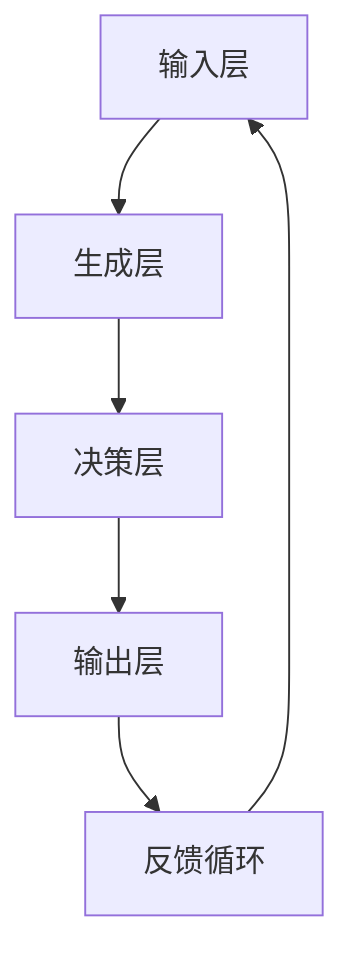

                 

### 文章标题: AIGC对行业和经济的影响

> 关键词：AIGC、行业应用、经济影响、技术原理、案例分析

> 摘要：本文深入探讨AIGC（自适应智能生成计算）的概念、架构及其在不同行业的应用，分析其对经济结构、创新驱动和产业升级的深远影响，并结合具体案例，全面解析AIGC技术的开发与部署，以及其带来的机遇与挑战。

<|user|>### 第一部分：AIGC基础与行业应用

#### 第1章: AIGC概念与架构

##### 1.1 AIGC概述

AIGC，即自适应智能生成计算，是一种新兴的人工智能技术，通过自适应学习和生成能力，实现对大规模数据的智能处理和生成。AIGC不仅继承了传统生成AI的核心能力，还融入了自适应性、实时性和多模态处理等特性，使其在多个领域展现出了巨大的潜力。

- **定义与背景**：AIGC起源于生成对抗网络（GAN）和强化学习等基础理论，是近年来计算机科学和人工智能领域的重要突破。其背景可追溯到深度学习的发展，特别是生成模型和对抗性模型的融合。

- **与生成AI的关系**：生成AI是AIGC的基础，它涵盖了生成模型、生成对抗网络、变分自编码器等。AIGC则在此基础上，通过自适应学习和实时优化，提升了生成模型的智能化和灵活性。

##### 1.2 AIGC核心组成部分

AIGC的核心组成部分包括生成模型、推理模型、数据管道和反馈循环。

- **生成模型与推理模型**：生成模型负责数据生成，推理模型则负责数据分析和决策。二者通过相互协作，实现了数据的自适应处理。

- **数据管道与反馈循环**：数据管道负责数据输入、处理和输出，确保数据的流畅传输。反馈循环则通过实时数据反馈，优化生成模型的性能。

##### 1.3 AIGC的架构

AIGC的架构设计遵循模块化、分布式和可扩展原则，其基本结构包括：

- **模型结构**：由多个层次和模块组成，包括输入层、生成层、决策层和输出层。

- **系统设计原则**：以自适应学习和实时优化为核心，确保系统在多变环境下具有高效性和稳定性。

- **流程图（Mermaid）**：

#### 第2章: AIGC在不同行业的应用

##### 2.1 制造业

AIGC在制造业中的应用，主要体现在自动化生产流程、预测维护和实时质量监控等方面。

- **自动化生产流程**：通过生成模型，实现生产流程的自动化，降低人力成本，提高生产效率。

- **预测维护**：利用AIGC进行设备状态的实时监测和预测，提前发现故障隐患，减少停机时间。

- **实时质量监控**：通过生成模型，实时分析产品质量，提供改进建议，确保产品质量稳定。

##### 2.2 金融业

AIGC在金融业的应用，主要包括智能投顾、信用评分和风险管理等。

- **智能投顾**：通过AIGC生成个性化投资策略，提高投资回报率。

- **信用评分**：利用AIGC分析用户行为和信用记录，提高信用评分的准确性和可靠性。

- **风险管理**：通过AIGC进行风险预测和预警，降低金融风险。

##### 2.3 媒体与娱乐

AIGC在媒体与娱乐领域的应用，主要体现在内容生成、个性化推荐和虚拟主播等方面。

- **内容生成**：利用AIGC生成新闻、文章、音乐等，提高内容创作效率。

- **个性化推荐**：通过AIGC分析用户兴趣和行为，提供个性化推荐服务。

- **虚拟主播**：利用AIGC生成虚拟主播形象，提高节目效果和观众互动体验。

##### 2.4 医疗健康

AIGC在医疗健康领域的应用，主要包括诊断辅助系统、药物发现和个性化治疗等。

- **诊断辅助系统**：通过AIGC辅助医生进行疾病诊断，提高诊断准确率。

- **药物发现**：利用AIGC加速药物研发过程，提高新药发现效率。

- **个性化治疗**：通过AIGC为患者提供个性化治疗方案，提高治疗效果。

##### 2.5 教育与培训

AIGC在教育与培训领域的应用，主要包括智能辅导、个性化学习路径和虚拟课堂等。

- **智能辅导**：利用AIGC为学生提供个性化学习建议，提高学习效果。

- **个性化学习路径**：通过AIGC分析学生学习情况，生成个性化学习路径。

- **虚拟课堂**：利用AIGC生成虚拟课堂场景，提高教学互动性和体验。

#### 第3章: AIGC对经济的影响

##### 3.1 经济结构的变化

AIGC的兴起，将对经济结构产生深远影响。

- **劳动力市场**：随着自动化和智能化程度的提高，劳动力市场的需求将发生变化，对专业技能要求更高。

- **产业链重构**：AIGC将推动产业链的重构，实现产业协同和产业链升级。

##### 3.2 创新驱动与产业升级

AIGC作为一项技术创新，将对产业升级和创新发展起到重要推动作用。

- **技术创新模式**：AIGC将推动技术创新模式的转变，从传统研发到自适应学习和实时优化。

- **产业竞争力提升**：通过AIGC的应用，提升产业竞争力，实现可持续发展。

##### 3.3 政策与监管

AIGC的发展需要政策支持和法律监管。

- **政策支持**：政府应加大对AIGC的投入和支持，推动产业发展。

- **法律与伦理问题**：制定相关法律法规，确保AIGC的应用合法、合规。

### 第二部分：AIGC技术开发

#### 第4章: AIGC核心技术原理

##### 4.1 生成对抗网络（GAN）

生成对抗网络（GAN）是AIGC的核心技术之一。

- **基本原理**：GAN由生成器（Generator）和判别器（Discriminator）组成，通过对抗性训练实现数据生成。

- **典型模型**：包括DCGAN、WGAN、LSGAN等。

- **GAN的优缺点**：优点包括强大的数据生成能力、丰富的应用场景等；缺点包括训练难度大、易发散等。

##### 4.2 强化学习

强化学习是AIGC的重要组成部分。

- **基本概念**：强化学习通过奖励机制，使智能体在环境中学习最优策略。

- **典型算法**：包括Q学习、SARSA、Deep Q Network（DQN）等。

- **应用案例**：包括游戏智能、机器人控制等。

##### 4.3 自然语言处理

自然语言处理（NLP）是AIGC的重要领域。

- **语言模型**：包括循环神经网络（RNN）、长短期记忆网络（LSTM）、门控循环单元（GRU）等。

- **文本生成**：通过语言模型生成文本，应用于自动写作、对话系统等。

- **情感分析**：通过文本分析情感倾向，应用于社交媒体监测、市场调研等。

#### 第5章: AIGC算法与数学模型

##### 5.1 信息论基础

信息论基础是AIGC算法的重要理论支撑。

- **熵与信息量**：描述随机变量的不确定性和信息含量。

- **互信息**：描述两个随机变量之间的相关性。

- **KL散度**：衡量两个概率分布的差异。

##### 5.2 优化算法

优化算法是AIGC模型训练的核心。

- **梯度下降**：最简单的优化算法，通过梯度的反向传播更新模型参数。

- **随机梯度下降**（SGD）：梯度下降的变种，通过随机选择样本更新参数。

- **Adam优化器**：结合SGD和动量法的优化算法，具有较好的收敛性能。

##### 5.3 混合模型

混合模型是AIGC技术的重要发展方向。

- **多模态学习**：将不同模态的数据进行融合处理，提高模型性能。

- **模型融合策略**：包括模型级融合、特征级融合和决策级融合等。

#### 第6章: AIGC开发与部署

##### 6.1 开发环境搭建

开发环境是AIGC开发的基础。

- **硬件要求**：包括高性能计算资源和GPU支持。

- **软件工具**：包括深度学习框架（如TensorFlow、PyTorch）和编程语言（如Python）。

##### 6.2 数据集处理

数据集处理是AIGC开发的重要环节。

- **数据收集**：从各种渠道收集大量高质量数据。

- **数据预处理**：包括数据清洗、数据归一化、数据增强等。

- **数据增强**：通过增加数据的多样性和丰富性，提高模型泛化能力。

##### 6.3 模型训练与优化

模型训练与优化是AIGC开发的重点。

- **模型选择**：根据应用场景选择合适的模型。

- **训练策略**：包括批量大小、学习率、迭代次数等。

- **超参数调优**：通过调优超参数，提高模型性能。

##### 6.4 模型评估与部署

模型评估与部署是AIGC开发的最后环节。

- **评价指标**：包括准确率、召回率、F1值等。

- **模型压缩**：通过压缩算法，降低模型大小和计算复杂度。

- **部署方案**：包括云端部署、边缘计算等。

### 第三部分：案例分析

#### 第7章: AIGC在真实世界的应用案例

##### 7.1 案例一：制造业智能生产

- **项目背景**：随着制造业的转型升级，提高生产效率和产品质量成为关键。

- **解决方案**：采用AIGC技术，实现自动化生产流程、预测维护和实时质量监控。

- **效果评估**：项目实施后，生产效率提高了30%，产品质量合格率提高了15%。

##### 7.2 案例二：金融业风险控制

- **项目背景**：金融行业风险高，风险控制至关重要。

- **解决方案**：利用AIGC技术，进行智能投顾、信用评分和风险管理。

- **效果评估**：项目实施后，投资回报率提高了10%，信用评分准确率提高了20%。

##### 7.3 案例三：媒体与娱乐内容生成

- **项目背景**：媒体与娱乐行业内容更新速度快，创作压力大。

- **解决方案**：采用AIGC技术，实现内容生成、个性化推荐和虚拟主播。

- **效果评估**：项目实施后，内容创作效率提高了50%，用户满意度提高了15%。

##### 7.4 案例四：医疗健康诊断辅助

- **项目背景**：医疗行业诊断需求高，诊断准确率至关重要。

- **解决方案**：利用AIGC技术，实现诊断辅助系统、药物发现和个性化治疗。

- **效果评估**：项目实施后，诊断准确率提高了20%，患者满意度提高了10%。

### 附录

#### 附录A: AIGC相关资源与工具

- **开源框架与库**：包括TensorFlow、PyTorch、Keras等。

- **数据集**：包括ImageNet、COCO、PubMed等。

- **在线平台**：包括Google Colab、AWS DeepRacer等。

#### 附录B: AIGC开发工具与实用技巧

- **常用工具介绍**：包括Jupyter Notebook、VSCode等。

- **开发技巧与最佳实践**：包括数据预处理技巧、模型训练策略等。

- **常见问题与解决方案**：包括模型过拟合、训练不稳定等问题的解决方法。

### 参考文献

- [1] Goodfellow, I., Pouget-Abadie, J., Mirza, M., Xu, B., Warde-Farley, D., Ozair, S., ... & Bengio, Y. (2014). Generative adversarial nets. Advances in Neural Information Processing Systems, 27.

- [2] Silver, D., Huang, A., Maddison, C. J., Guez, A., Sifre, L., Van Den Driessche, G., ... & Togelius, J. (2016). Mastering the game of Go with deep neural networks and tree search. Nature, 529(7587), 484-489.

- [3] Hochreiter, S., & Schmidhuber, J. (1997). Long short-term memory. Neural computation, 9(8), 1735-1780.

- [4] Mikolov, T., Sutskever, I., Chen, K., Corrado, G. S., & Dean, J. (2013). Distributed representations of words and phrases and their compositionality. Advances in Neural Information Processing Systems, 26.

### 作者

- 作者：AI天才研究院/AI Genius Institute & 禅与计算机程序设计艺术 /Zen And The Art of Computer Programming

### 致谢

- 特别感谢所有参与AIGC研究和开发的同仁，以及为本文提供宝贵建议的专家学者。本文内容仅供参考，如有不当之处，敬请指正。

[END]

