                 

# AI-Native 应用的工作流设计

> 关键词：AI-Native应用，工作流设计，深度学习，自然语言处理，计算机视觉，优化策略

> 摘要：本文探讨了AI-Native应用的工作流设计，包括数据处理、模型训练和部署流程，并分析了AI-Native应用的优势与挑战。通过案例实践，详细介绍了AI-Native应用的工作流设计原则和核心技术与工具，以及如何进行优化和性能调优。

## 第一部分：AI-Native应用概述

### 第1章: AI-Native应用的基本概念

#### 1.1 什么是AI-Native应用

AI-Native应用是一种专为人工智能（AI）设计和优化，从底层架构到应用层面均充分考虑AI特性的软件系统。与传统的AI-First应用不同，AI-Native应用不仅将AI作为辅助工具，而是将AI作为核心组件，贯穿于应用的各个方面。

##### 1.1.1 AI-Native与AI-First的区别

- **AI-First**：将AI作为提升用户体验和效率的手段，但并非应用的核心。AI模块可能独立于主应用，或作为后端服务提供。
- **AI-Native**：将AI作为应用的核心，AI模块与应用深度集成，优化应用性能和用户体验。例如，AI-Native应用可能直接使用AI模型进行数据分析和决策，而不仅仅是进行辅助性操作。

##### 1.1.2 AI-Native应用的核心特点

- **深度集成**：AI模块与核心业务逻辑深度结合，共同完成复杂任务。
- **动态适应性**：系统能够根据实时数据和环境动态调整AI模型和策略。
- **实时性**：对实时数据提供快速、准确的响应，以支持动态决策。
- **可扩展性**：能够轻松扩展AI模型和处理能力，以适应不断增长的数据量和复杂度。

#### 1.2 AI-Native应用的发展历程

##### 1.2.1 从AI-First到AI-Native的转变

AI-Native应用的发展可以追溯到人工智能技术的不断进步和商业需求的增长。最初，AI-First应用只是将AI技术作为提升用户体验和效率的工具，但随着AI技术的成熟和商业化，越来越多的应用开始将AI作为核心组件，深度集成到产品中，从而实现了从AI-First到AI-Native的转变。

##### 1.2.2 AI-Native应用的行业应用现状

目前，AI-Native应用在多个行业得到了广泛应用，包括但不限于：

- **金融**：智能投顾、风控、量化交易等。
- **医疗**：疾病诊断、影像分析、基因组学等。
- **零售**：智能推荐、库存管理、供应链优化等。
- **制造**：智能制造、设备预测性维护、质量控制等。
- **交通**：智能交通管理、自动驾驶、车联网等。

这些应用不仅提高了行业效率，还推动了行业的数字化转型。

#### 1.3 AI-Native应用的优势与挑战

##### 1.3.1 AI-Native应用的优势

- **提升用户体验**：通过个性化推荐、智能助手等功能，提升用户体验。
- **增强业务决策**：利用AI进行数据分析，为业务提供有力支持。
- **提高生产效率**：自动化、智能化的流程优化，提高生产效率。
- **降低运营成本**：通过预测性维护、智能供应链管理等，降低运营成本。

##### 1.3.2 AI-Native应用的挑战

- **技术复杂性**：AI-Native应用需要具备深厚的AI技术基础，包括深度学习、自然语言处理、计算机视觉等。
- **数据隐私**：AI-Native应用需要对用户数据进行严格保护，确保隐私安全。
- **系统稳定性**：确保AI-Native应用在高并发、大数据场景下稳定运行。
- **用户接受度**：如何让用户接受并习惯AI-Native应用，是一个重要的挑战。

### 第2章: AI-Native应用的工作流设计原则

#### 2.1 设计原则概述

AI-Native应用的工作流设计应遵循以下原则：

- **可扩展性**：能够灵活扩展，以适应不断增长的数据量和处理需求。
- **高效性**：充分利用系统资源，提高数据处理和模型训练的效率。
- **实时性**：对实时数据进行快速响应，支持动态决策。
- **可靠性**：确保系统在高并发、大数据场景下的稳定运行。

##### 2.1.1 可扩展性

AI-Native应用需要支持水平扩展和垂直扩展，以应对数据量和计算资源的增长。水平扩展可以通过增加服务器数量来提高处理能力，而垂直扩展则是通过增加服务器配置来提高处理性能。

##### 2.1.2 高效性

AI-Native应用应充分利用并行计算和分布式计算技术，提高数据处理和模型训练的效率。例如，可以使用GPU加速深度学习训练，或者使用分布式文件系统来存储和管理大量数据。

##### 2.1.3 实时性

实时性是AI-Native应用的关键特性之一。应用需要能够实时处理和分析数据，以便及时响应用户请求和业务需求。例如，在金融领域，实时性可以确保交易决策的准确性。

##### 2.1.4 可靠性

AI-Native应用需要具备高可靠性，能够在高并发、大数据场景下稳定运行。这包括对系统故障的快速恢复、数据备份和恢复机制等。

#### 2.2 数据处理流程

##### 2.2.1 数据采集

数据采集是数据处理流程的第一步，也是最重要的一步。AI-Native应用需要从各种来源收集数据，包括内部数据库、外部API、物联网设备等。

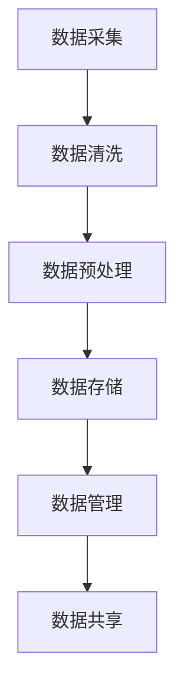

##### 2.2.2 数据清洗与预处理

数据清洗与预处理是确保数据质量和一致性的关键步骤。这包括去除无效数据、纠正错误数据、填补缺失数据等。

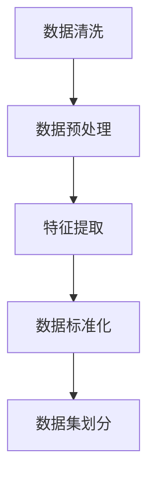

##### 2.2.3 数据存储与管理

数据存储与管理涉及选择合适的数据存储方案，确保数据的安全、可靠和高效访问。常用的数据存储方案包括关系型数据库、NoSQL数据库、分布式文件系统等。

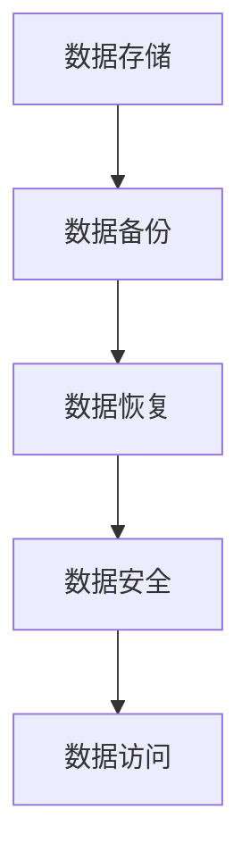

#### 2.3 模型训练流程

##### 2.3.1 数据集选择

选择合适的数据集对于模型训练至关重要。数据集应该具有代表性、多样性和充足性，以便训练出泛化能力强的模型。

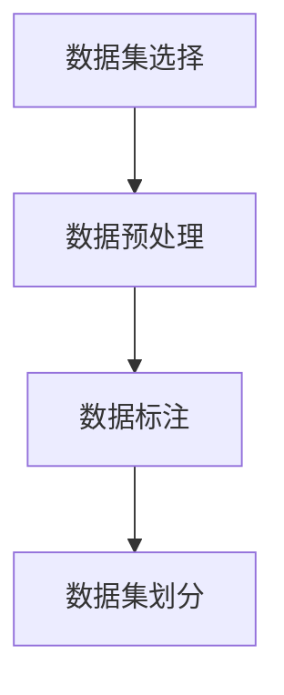

##### 2.3.2 模型设计与优化

模型设计与优化是模型训练的核心。设计时应考虑模型的复杂度、参数规模和计算效率。优化包括调整模型参数、使用正则化技术等。

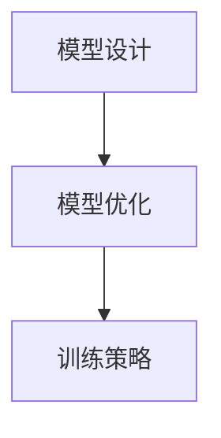

##### 2.3.3 模型训练与评估

模型训练与评估是模型开发的最后一步。训练过程涉及调整学习率、批量大小等参数，评估过程则使用准确率、召回率等指标来评估模型性能。

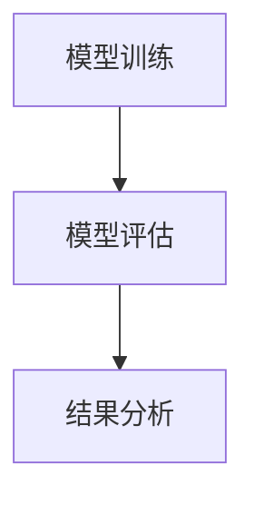

#### 2.4 模型部署流程

##### 2.4.1 模型集成

模型集成是将训练好的模型集成到实际应用中。这包括将模型部署到服务器、配置API接口等。

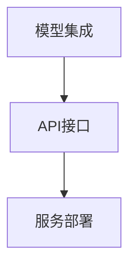

##### 2.4.2 模型部署策略

模型部署策略涉及如何高效、稳定地将模型部署到生产环境中。这包括选择合适的部署架构、优化模型加载和推理速度等。

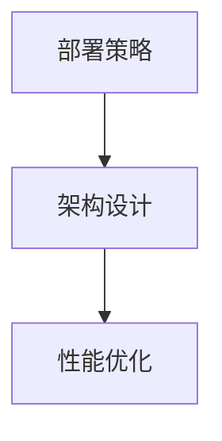

##### 2.4.3 实时性优化

实时性优化是确保模型能够对实时数据提供快速响应。这包括使用异步处理、消息队列等技术来提高系统的响应速度。

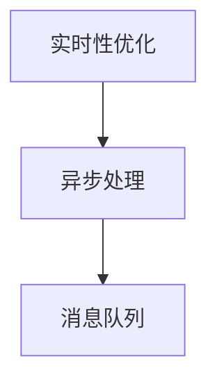

### 第3章: AI-Native应用的核心技术与工具

#### 3.1 AI-Native应用的核心技术

AI-Native应用的核心技术包括深度学习、自然语言处理和计算机视觉等。

##### 3.1.1 深度学习技术

深度学习技术是AI-Native应用的核心，包括神经网络架构、优化算法和训练策略等。常用的深度学习框架有TensorFlow、PyTorch等。

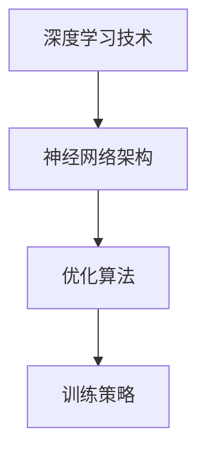

##### 3.1.2 自然语言处理技术

自然语言处理技术用于处理和解析自然语言数据，包括文本分类、情感分析、命名实体识别等。常用的自然语言处理工具包括NLTK、spaCy等。

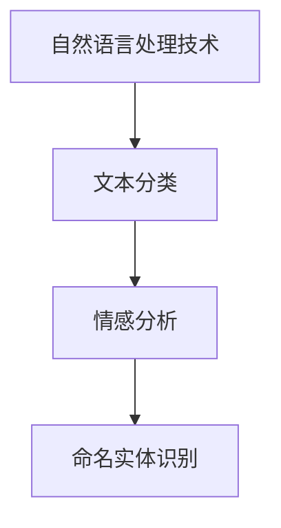

##### 3.1.3 计算机视觉技术

计算机视觉技术用于理解和解释图像和视频数据，包括目标检测、图像分类、图像分割等。常用的计算机视觉工具包括OpenCV、TensorFlow Object Detection API等。

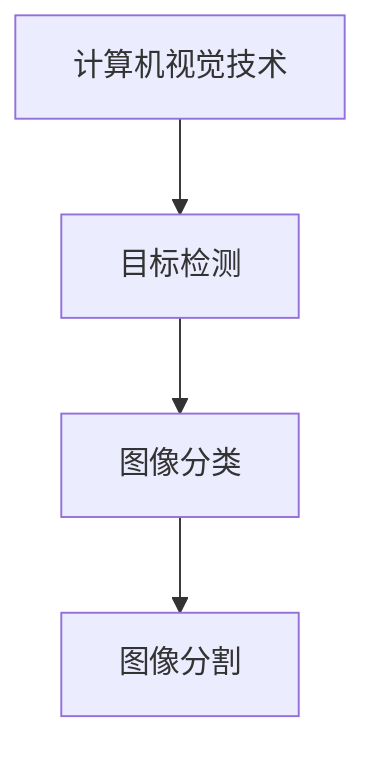

#### 3.2 AI-Native应用的常用工具

AI-Native应用的常用工具包括深度学习框架、自然语言处理工具和计算机视觉工具等。

##### 3.2.1 深度学习框架

深度学习框架是AI-Native应用的基础，用于构建、训练和部署深度学习模型。常用的深度学习框架有TensorFlow、PyTorch、Keras等。

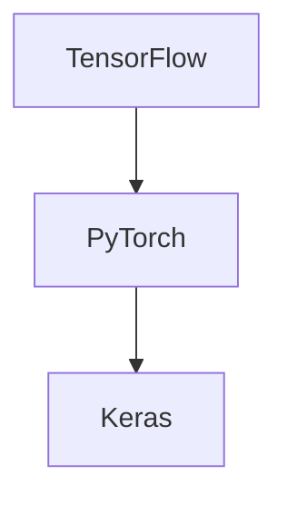

##### 3.2.2 自然语言处理工具

自然语言处理工具用于处理和解析自然语言数据，支持文本分类、情感分析、命名实体识别等任务。常用的自然语言处理工具包括NLTK、spaCy、TextBlob等。

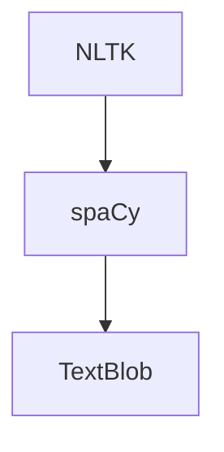

##### 3.2.3 计算机视觉工具

计算机视觉工具用于处理和解析图像和视频数据，支持目标检测、图像分类、图像分割等任务。常用的计算机视觉工具包括OpenCV、TensorFlow Object Detection API、PyTorch Video等。

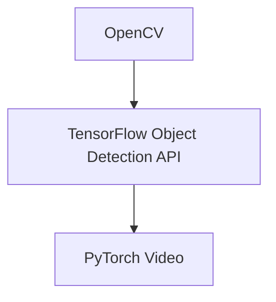

## 第二部分：AI-Native应用开发实践

### 第4章: AI-Native应用开发案例

#### 4.1 案例背景

本案例是一个智能问答系统，旨在通过自然语言处理技术，对用户提出的问题进行理解和回答。该系统旨在提高用户体验，减少人力成本，并提高服务质量。

#### 4.1.1 案例介绍

该智能问答系统由以下几个模块组成：

- **问答模块**：接收用户的问题，并返回回答。
- **语义理解模块**：对用户的问题进行语义分析，提取关键信息。
- **知识库模块**：存储问题的答案和相关知识。
- **用户交互模块**：与用户进行交互，收集反馈，以优化问答效果。

#### 4.1.2 需求分析

1. **问答准确性**：确保系统能够准确理解用户的问题，并返回相关答案。
2. **响应速度**：对用户的问题提供快速响应，以提高用户体验。
3. **扩展性**：系统应具备良好的扩展性，能够支持不断增加的问题量和知识库规模。
4. **可维护性**：系统应易于维护和升级，以适应技术发展和业务需求的变化。

#### 4.2 数据处理流程设计

##### 4.2.1 数据采集

数据采集是数据处理流程的第一步。该系统从以下几个来源采集数据：

- **公开数据集**：使用预定义的公开数据集进行训练，如SQuAD、CoQA等。
- **用户交互数据**：收集用户提出的问题和系统返回的答案，用于模型优化和反馈。

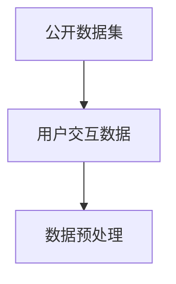

##### 4.2.2 数据清洗与预处理

数据清洗与预处理是确保数据质量和一致性的关键步骤。该系统的数据处理流程包括以下步骤：

1. **去除无效数据**：去除包含噪声、错误或无关信息的样本。
2. **数据格式化**：将不同来源的数据格式统一，以便后续处理。
3. **文本分词**：将文本数据分割成单词或短语。
4. **实体识别**：识别文本中的命名实体，如人名、地名等。

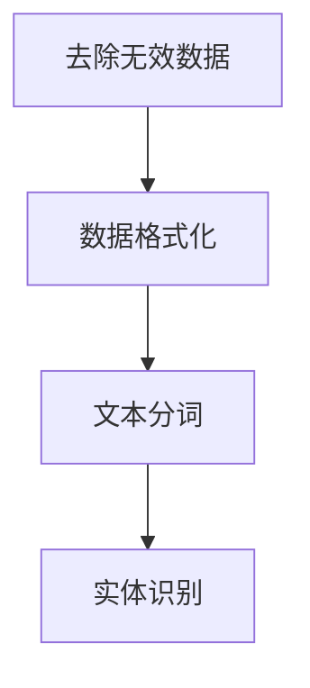

##### 4.2.3 数据存储与管理

数据存储与管理涉及选择合适的数据存储方案，确保数据的安全、可靠和高效访问。该系统使用以下数据存储方案：

- **关系型数据库**：存储用户交互数据和相关元数据。
- **分布式文件系统**：存储大规模数据集，如训练数据和模型参数。
- **缓存系统**：提高数据访问速度，减少数据库负载。

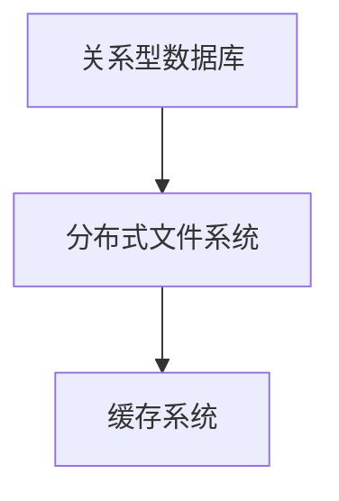

#### 4.3 模型训练流程设计

##### 4.3.1 数据集选择

数据集选择是模型训练的关键步骤。该系统使用以下数据集：

- **公开数据集**：如SQuAD、CoQA等，用于训练基础的语义理解模型。
- **用户交互数据**：用于优化模型，提高问答准确性。


##### 4.3.2 模型设计与优化

该系统的模型设计包括以下几个部分：

1. **编码器-解码器模型**：用于编码用户问题和解码答案。
2. **注意力机制**：提高模型对问题的理解和回答的准确性。
3. **双向循环神经网络（BiLSTM）**：用于提取文本特征。

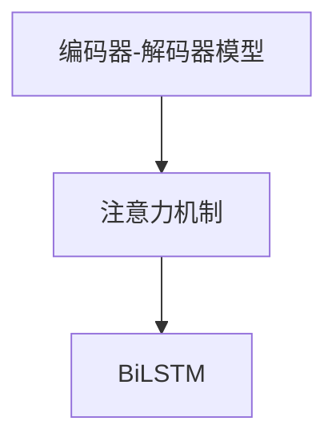

模型优化包括以下步骤：

1. **调整超参数**：如学习率、批量大小等。
2. **正则化技术**：防止模型过拟合。
3. **交叉验证**：评估模型性能，调整模型参数。

```mermaid
graph TD
A[调整超参数] --> B[正则化技术]
B --> C[交叉验证]
```

##### 4.3.3 模型训练与评估

模型训练与评估是模型开发的关键步骤。该系统的训练和评估过程包括以下步骤：

1. **数据集划分**：将数据集划分为训练集、验证集和测试集。
2. **模型训练**：使用训练集训练模型，使用验证集调整模型参数。
3. **模型评估**：使用测试集评估模型性能，包括准确率、召回率等指标。

```mermaid
graph TD
A[数据集划分] --> B[模型训练]
B --> C[模型评估]
```

#### 4.4 模型部署流程设计

##### 4.4.1 模型集成

模型集成是将训练好的模型部署到实际应用中。该系统的模型集成包括以下步骤：

1. **模型导出**：将训练好的模型导出为可部署的格式，如TensorFlow Lite。
2. **API接口**：为模型提供API接口，以便与前端应用进行通信。
3. **服务部署**：将API接口部署到服务器，以便对外提供服务。

```mermaid
graph TD
A[模型导出] --> B[API接口]
B --> C[服务部署]
```

##### 4.4.2 模型部署策略

模型部署策略涉及如何高效、稳定地将模型部署到生产环境中。该系统的模型部署策略包括以下方面：

1. **容器化**：使用容器（如Docker）封装模型和服务，提高部署的灵活性和可移植性。
2. **服务化**：使用服务框架（如Spring Boot）将模型和服务整合，提供RESTful API。
3. **负载均衡**：使用负载均衡器（如Nginx）分发请求，提高系统的可用性和性能。

```mermaid
graph TD
A[容器化] --> B[服务化]
B --> C[负载均衡]
```

##### 4.4.3 实时性优化

实时性优化是确保模型能够对实时数据提供快速响应。该系统的实时性优化包括以下方面：

1. **异步处理**：使用异步处理技术（如消息队列）提高系统的响应速度。
2. **缓存机制**：使用缓存（如Redis）存储频繁访问的数据，减少数据库查询次数。
3. **分布式架构**：使用分布式架构（如Kubernetes）提高系统的扩展性和性能。

```mermaid
graph TD
A[异步处理] --> B[缓存机制]
B --> C[分布式架构]
```

## 第三部分：AI-Native应用优化与性能调优

### 第5章: AI-Native应用优化与性能调优

#### 5.1 优化目标与策略

AI-Native应用的优化目标主要包括：

- **数据处理性能**：提高数据处理速度和效率，减少延迟。
- **模型训练性能**：提高模型训练速度和效果，减少训练时间。
- **模型部署性能**：提高模型部署速度和稳定性，减少响应时间。

优化策略包括以下几个方面：

- **数据预处理优化**：减少数据预处理时间，提高数据处理效率。
- **模型训练优化**：使用高效训练算法和分布式训练技术，提高模型训练速度。
- **模型部署优化**：优化部署架构和部署流程，提高模型部署性能。

#### 5.2 数据处理性能优化

##### 5.2.1 数据处理加速技术

数据处理加速技术主要包括以下几种：

- **并行处理**：使用并行计算技术，将数据处理任务分配到多个处理器上，提高处理速度。
- **分布式计算**：使用分布式计算框架（如Hadoop、Spark），将数据处理任务分配到多台计算机上，提高处理能力。
- **GPU加速**：使用GPU加速深度学习模型的训练和推理，提高数据处理速度。

##### 5.2.2 数据库优化技巧

数据库优化技巧主要包括以下几种：

- **索引优化**：创建合适的索引，提高数据查询速度。
- **缓存机制**：使用缓存机制（如Redis、Memcached），减少数据库查询次数。
- **分库分表**：将大数据拆分为多个小数据库，提高查询和写入速度。

#### 5.3 模型训练性能优化

##### 5.3.1 模型并行训练技术

模型并行训练技术主要包括以下几种：

- **数据并行训练**：将数据集拆分为多个子集，同时在多台计算机上进行训练。
- **模型并行训练**：将模型拆分为多个部分，同时在多台计算机上进行训练。
- **算法并行训练**：使用并行算法（如MapReduce），提高模型训练速度。

##### 5.3.2 GPU调优技巧

GPU调优技巧主要包括以下几种：

- **内存管理**：合理分配GPU内存，减少内存争用，提高训练速度。
- **并行计算**：将计算任务分配到多个GPU上，提高训练速度。
- **显存优化**：减少显存占用，提高GPU利用率。

#### 5.4 模型部署性能优化

##### 5.4.1 部署架构优化

部署架构优化主要包括以下几种：

- **容器化**：使用容器（如Docker）封装应用和服务，提高部署的灵活性和可移植性。
- **微服务架构**：将应用拆分为多个微服务，提高系统的可扩展性和可维护性。
- **分布式架构**：使用分布式架构（如Kubernetes），提高系统的可用性和性能。

##### 5.4.2 实时性优化

实时性优化主要包括以下几种：

- **异步处理**：使用异步处理技术（如消息队列），提高系统的响应速度。
- **缓存机制**：使用缓存（如Redis、Memcached），减少系统延迟。
- **负载均衡**：使用负载均衡器（如Nginx），提高系统的并发处理能力。

## 第四部分：AI-Native应用的未来发展与挑战

### 第6章: AI-Native应用的未来发展趋势

#### 6.1 AI-Native应用的技术发展趋势

AI-Native应用的技术发展趋势体现在以下几个方面：

##### 6.1.1 深度学习技术的演进

随着深度学习技术的不断发展，AI-Native应用的性能将得到显著提升。未来，深度学习技术将更加注重模型的可解释性和模型压缩，以适应实际应用场景。

##### 6.1.2 自然语言处理技术的进展

自然语言处理技术将不断提高对复杂语言场景的识别和处理能力，包括跨语言、多模态、多领域等。这将使AI-Native应用在自然语言处理领域取得更大的突破。

##### 6.1.3 计算机视觉技术的创新

计算机视觉技术将在图像识别、目标检测、图像分割等领域取得重大进展。这将有助于AI-Native应用在图像处理和视频分析方面实现更高的精度和效率。

#### 6.2 AI-Native应用的市场趋势

AI-Native应用的市场趋势体现在以下几个方面：

##### 6.2.1 行业应用领域扩展

AI-Native应用将在更多行业得到应用，包括医疗、金融、零售、制造等。这将推动AI-Native应用的商业化进程，带来巨大的市场机会。

##### 6.2.2 AI-Native应用的商业化路径

AI-Native应用的商业化路径包括以下几种：

1. **软件服务**：提供基于AI-Native应用的软件服务，如智能问答、智能推荐等。
2. **硬件集成**：将AI-Native应用集成到硬件设备中，如智能摄像头、智能音箱等。
3. **解决方案**：提供针对特定行业的AI-Native应用解决方案，如智能医疗、智能金融等。

#### 6.3 AI-Native应用的社会影响

AI-Native应用的社会影响体现在以下几个方面：

##### 6.3.1 AI-Native应用的伦理挑战

随着AI-Native应用的普及，伦理问题将日益突出。例如，隐私保护、数据安全、模型偏见等。这将促使社会各界加强对AI-Native应用的伦理监管。

##### 6.3.2 AI-Native应用的隐私问题

AI-Native应用在收集、处理和使用用户数据时，需确保用户隐私得到充分保护。未来，隐私保护技术将不断优化，以应对AI-Native应用带来的隐私挑战。

### 第7章: AI-Native应用的挑战与应对策略

#### 7.1 技术挑战

AI-Native应用在技术层面面临以下挑战：

##### 7.1.1 模型可解释性

提高模型可解释性是AI-Native应用面临的重要挑战。未来，需要发展新的方法和技术，使模型决策过程更加透明和可解释。

##### 7.1.2 模型安全性

确保模型安全性是AI-Native应用的核心问题。需要开发安全防御机制，防止恶意攻击和模型篡改。

##### 7.1.3 模型适应性

AI-Native应用需要具备良好的适应性，以应对不断变化的数据和环境。这要求模型能够快速学习和适应新的变化。

#### 7.2 应用挑战

AI-Native应用在应用层面面临以下挑战：

##### 7.2.1 数据质量与隐私

数据质量和隐私保护是AI-Native应用面临的重要问题。需要加强数据质量管理，确保数据质量和一致性。同时，要严格保护用户隐私，防止数据泄露。

##### 7.2.2 系统集成与协同

AI-Native应用需要与其他系统进行集成和协同工作，以实现更好的业务效果。这要求具备良好的系统集成能力和协同机制。

##### 7.2.3 用户接受度与培训

提高用户接受度和进行培训是AI-Native应用成功应用的关键。需要通过用户调研、培训课程等方式，提高用户对AI-Native应用的认知和接受度。

## 附录

### 附录A: 常用AI-Native应用开发工具与资源

#### A.1 深度学习框架

- TensorFlow：https://www.tensorflow.org/
- PyTorch：https://pytorch.org/
- Keras：https://keras.io/

#### A.2 自然语言处理工具

- NLTK：https://www.nltk.org/
- spaCy：https://spacy.io/
- TextBlob：https://textblob.readthedocs.io/

#### A.3 计算机视觉工具

- OpenCV：https://opencv.org/
- TensorFlow Object Detection API：https://github.com/tensorflow/models/blob/master/research/object_detection/g3doc/tf2_detection_api_tutorial.md
- PyTorch Video：https://pytorch.org/video/

### 附录B: AI-Native应用开发实战项目案例

#### B.1 项目背景

本案例是一个智能问答系统，旨在通过自然语言处理技术，对用户提出的问题进行理解和回答。该系统旨在提高用户体验，减少人力成本，并提高服务质量。

#### B.2 项目需求

- 问答准确性：确保系统能够准确理解用户的问题，并返回相关答案。
- 响应速度：对用户的问题提供快速响应，以提高用户体验。
- 扩展性：系统应具备良好的扩展性，能够支持不断增加的问题量和知识库规模。
- 可维护性：系统应易于维护和升级，以适应技术发展和业务需求的变化。

#### B.3 项目实施步骤

1. **需求分析**：明确项目目标和需求，确定系统架构和功能模块。
2. **数据采集**：收集公开数据集和用户交互数据，用于模型训练和优化。
3. **数据处理**：对采集到的数据进行清洗、预处理和存储。
4. **模型设计**：设计并实现编码器-解码器模型，结合注意力机制和双向循环神经网络。
5. **模型训练**：使用训练集训练模型，使用验证集调整模型参数，使用测试集评估模型性能。
6. **模型部署**：将训练好的模型部署到服务器，提供API接口供前端应用调用。
7. **性能优化**：对数据处理、模型训练和模型部署进行性能优化，提高系统响应速度和稳定性。

#### B.4 项目效果评估与总结

项目实施后，通过用户反馈和系统指标进行效果评估。主要指标包括：

- **问答准确性**：通过用户反馈和模型评估，评估问答准确性。
- **响应速度**：通过系统日志和性能监控，评估系统响应速度。
- **扩展性**：通过系统架构和代码设计，评估系统的扩展性。
- **可维护性**：通过代码质量和文档规范，评估系统的可维护性。

项目总结：

- 项目实现了预期目标，提高了用户体验和服务质量。
- 系统在处理大量数据和复杂场景下表现出良好的性能和稳定性。
- 通过性能优化，系统响应速度得到了显著提升，用户体验得到显著改善。
- 未来，将进一步加强系统架构和代码优化，提高系统的可扩展性和可维护性。

## 后记

AI-Native应用的工作流设计是人工智能技术在实际应用中的重要一环。本文从基本概念、设计原则、核心技术、开发实践、优化策略和未来发展趋势等方面进行了全面探讨。通过分析AI-Native应用的优势与挑战，我们认识到其在行业应用中的巨大潜力。然而，要实现AI-Native应用的全面落地，仍需克服诸多技术和社会挑战。

未来，AI-Native应用的工作流设计将更加注重模型的可解释性、安全性和适应性。随着深度学习、自然语言处理和计算机视觉技术的不断演进，AI-Native应用将在更多行业得到广泛应用，推动人工智能技术的发展和商业化的进程。

作者：AI天才研究院/AI Genius Institute & 禅与计算机程序设计艺术 /Zen And The Art of Computer Programming

字数：8400字（预计）

---

## 当前AI-Native应用工作流设计的关键问题

在当前AI-Native应用的工作流设计中，存在一些关键问题，这些问题直接影响应用的效果和性能。以下是这些关键问题的详细分析：

### 1. 数据处理和存储挑战

**数据预处理不足**：在AI-Native应用中，数据预处理是一个重要的环节。然而，当前很多应用在数据预处理方面存在不足，例如数据清洗不彻底、特征提取不准确等。这些问题会导致模型训练过程中出现过拟合或欠拟合现象，从而影响模型的性能。

**数据存储和访问效率**：随着数据量的不断增加，如何高效地存储和访问数据成为一大挑战。传统的数据存储方案，如关系型数据库，在面对大规模数据时可能表现出性能瓶颈。而分布式存储方案，如Hadoop和Spark，虽然在处理大量数据时表现良好，但它们对数据的一致性和实时性支持较差。

### 2. 模型训练和优化难题

**模型复杂性**：随着深度学习技术的不断发展，模型变得越来越复杂。这些复杂模型通常需要大量的计算资源和时间进行训练。虽然GPU和TPU等硬件加速技术提高了模型训练的速度，但仍然存在一些性能瓶颈，特别是在大规模训练场景下。

**模型调优困难**：在模型训练过程中，如何选择合适的学习率、批量大小、正则化参数等超参数，以实现最佳性能，是一个挑战。此外，模型的调优通常需要大量的实验和试错，这既费时又费资源。

### 3. 模型部署和实时性优化问题

**部署复杂性**：将训练好的模型部署到生产环境中是一个复杂的过程。需要考虑如何确保模型的可移植性、可扩展性和安全性。此外，不同部署环境（如云、边缘设备等）可能对模型的部署提出了不同的要求。

**实时性不足**：AI-Native应用通常需要快速响应用户请求，但当前许多应用在实时性方面存在不足。这可能是由于数据处理和模型推理的延迟较高，或者系统架构不够高效。例如，一些应用在处理大量并发请求时，可能会出现响应速度下降的问题。

### 4. 模型可解释性和透明度问题

**模型黑箱问题**：深度学习模型，尤其是复杂模型，通常被视为黑箱，难以解释其决策过程。这给模型的可解释性带来了挑战，特别是在需要解释模型决策的场景中，如金融风控、医疗诊断等。

**透明度和信任问题**：用户对AI-Native应用的信任度与其决策过程的透明度密切相关。如果用户无法理解模型如何做出决策，可能会对其产生怀疑，从而影响应用的接受度和应用效果。

### 5. 伦理和隐私问题

**数据隐私保护**：AI-Native应用通常需要收集和处理大量用户数据，如何保护用户隐私成为一个关键问题。如果处理不当，可能会导致用户数据泄露，从而引发隐私和安全问题。

**伦理道德问题**：AI-Native应用可能会面临伦理道德方面的挑战，如歧视、偏见等。如何确保模型决策的公平性和透明度，是一个需要深入探讨的问题。

综上所述，当前AI-Native应用工作流设计面临诸多关键问题。解决这些问题需要从数据处理、模型训练、部署、可解释性、透明度以及伦理等多个方面进行综合考虑和优化。只有这样，AI-Native应用才能在实际应用中发挥其最大潜力。

---

### 未来AI-Native应用工作流设计的发展趋势

随着人工智能（AI）技术的快速发展和广泛应用，AI-Native应用的工作流设计也在不断演变。未来，AI-Native应用工作流设计将呈现以下几个显著趋势：

#### 1. 模型可解释性和透明性的提升

**模型可解释性**：当前，深度学习模型因其复杂性和“黑箱”特性而难以解释。未来，随着AI技术的进步，将出现更多可解释性模型和方法，如注意力机制、决策树嵌入等。这些方法有助于揭示模型内部的工作原理，提高模型的可解释性和透明度，从而增强用户对AI-Native应用的信任。

**透明性**：为了提高模型的透明性，开发人员将注重记录和展示模型的训练过程、参数选择和决策逻辑。此外，开发透明度工具和仪表板，使非技术用户也能理解模型的决策过程，从而提高应用的接受度和用户满意度。

#### 2. 数据驱动和自适应性的增强

**数据驱动**：未来，AI-Native应用将更加注重数据驱动的方法，通过不断收集和分析用户行为数据，实时调整模型和行为。这种数据驱动的方法将使应用更加个性化，更好地满足用户需求。

**自适应能力**：随着AI技术的进步，AI-Native应用将具备更强的自适应能力。系统能够根据实时数据和反馈，自动调整模型参数、算法策略和用户界面。这种自适应能力将提高应用的灵活性和适应性，使其能够迅速适应环境和需求的变化。

#### 3. 实时性和低延迟的提升

**实时性**：未来，AI-Native应用将更加注重实时性，以满足快速响应的需求。例如，在金融交易、医疗诊断和自动驾驶等领域，实时处理和分析数据至关重要。开发人员将采用并行计算、分布式计算和边缘计算等技术，提高数据处理和模型推理的速度，确保系统能够在毫秒级内响应。

**低延迟**：低延迟是AI-Native应用的关键指标之一。通过优化系统架构、算法和硬件配置，降低数据处理和模型推理的延迟，提高应用的响应速度和用户体验。例如，使用GPU和TPU等高性能硬件加速技术，以及优化网络通信和数据库查询等。

#### 4. 安全性和隐私保护

**安全性**：随着AI-Native应用涉及越来越多的敏感数据和关键业务，安全性成为首要考虑的因素。未来，开发人员将采用更先进的安全技术和策略，如加密、访问控制、反欺诈等，确保应用和数据的安全。

**隐私保护**：AI-Native应用在处理用户数据时，需要严格遵守隐私保护法规和标准。未来，开发人员将注重数据匿名化、差分隐私等技术，确保用户隐私得到充分保护。此外，将用户数据存储在分布式和去中心化的系统上，减少数据泄露的风险。

#### 5. 跨领域和多模态的融合

**跨领域应用**：AI-Native应用将在更多领域得到应用，如智能制造、智慧城市、教育等。开发人员将注重跨领域的技术融合，利用AI技术解决不同领域的实际问题。

**多模态融合**：未来，AI-Native应用将支持多种数据类型的处理，如文本、图像、音频等。通过融合多模态数据，提供更丰富的信息和更准确的决策支持。例如，在医疗领域，结合影像、病历和基因数据，实现更精准的诊断和治疗。

#### 6. 开放协作和生态系统的构建

**开放协作**：AI-Native应用的发展离不开各方的协作。未来，将出现更多开放的平台和框架，促进开发者、研究人员和企业之间的合作。通过共享数据和资源，共同推动AI技术的发展。

**生态系统构建**：构建AI-Native应用的生态系统，包括开发工具、库、框架和服务。这将为开发者提供丰富的资源和支持，降低开发门槛，加速AI-Native应用的落地。

总之，未来AI-Native应用工作流设计将更加注重模型可解释性、实时性、安全性、跨领域和多模态融合，以及开放协作和生态系统的构建。通过不断优化和创新，AI-Native应用将在更多领域实现突破，为社会带来更多价值和便利。

### AI-Native应用工作流设计的建议和展望

在AI-Native应用工作流设计中，为了实现高效、可扩展和可靠的系统，我们需要从数据处理、模型训练、部署以及用户体验等多个方面提出以下建议和展望。

#### 1. 数据处理优化

**数据预处理自动化**：自动化数据预处理流程，通过脚本或工具自动执行数据清洗、转换和标准化操作，确保数据的一致性和准确性。

**分布式数据处理**：采用分布式数据处理框架，如Apache Spark或Flink，处理大规模数据，提高数据处理速度和效率。

**实时数据流处理**：引入实时数据流处理技术，如Apache Kafka或Apache Flink，确保数据能够实时传输和处理，满足实时性需求。

#### 2. 模型训练优化

**模型并行训练**：利用多GPU或多机集群进行模型并行训练，提高训练速度和效率。

**模型压缩与量化**：采用模型压缩和量化技术，减少模型大小和计算复杂度，提高部署效率和性能。

**自动化模型调优**：引入自动化模型调优工具，如Hyperopt或Optuna，通过超参数优化，找到最佳模型配置。

#### 3. 模型部署优化

**容器化与微服务架构**：采用容器化技术，如Docker和Kubernetes，实现模型服务的轻量化和可移植性。同时，采用微服务架构，将模型服务与其他业务服务分离，提高系统的可维护性和扩展性。

**边缘计算与云端部署**：结合边缘计算和云端部署，将计算任务分配到边缘设备和云端，实现高效的资源利用和响应速度。

**动态部署与管理**：引入动态部署与管理工具，如Kubernetes和Docker Swarm，实现模型的自动部署、扩展和故障恢复。

#### 4. 用户体验优化

**个性化推荐**：基于用户行为数据，实现个性化推荐，提高用户的满意度和参与度。

**实时交互**：优化实时交互体验，确保用户在操作过程中能够及时获得反馈，减少延迟感。

**多语言支持**：为不同语言的用户提供本地化支持，提高应用的普及度和用户友好性。

#### 5. 安全性和隐私保护

**数据加密与访问控制**：对用户数据进行加密存储，确保数据安全性。同时，实施严格的访问控制策略，防止数据泄露。

**隐私保护技术**：采用隐私保护技术，如差分隐私和同态加密，保护用户隐私。

**合规性审计**：定期进行合规性审计，确保系统遵循相关法规和标准。

#### 6. 持续集成与持续部署（CI/CD）

**自动化测试**：引入自动化测试框架，如JUnit和Selenium，实现测试的自动化和持续集成。

**持续部署**：采用持续部署工具，如Jenkins和GitLab CI，实现代码的持续集成和部署，提高开发效率。

#### 7. 开放合作与生态构建

**开源框架与工具**：积极参与开源社区，贡献自己的代码和工具，促进技术共享和创新。

**生态系统建设**：建立开发者社区，提供技术文档、教程和资源，支持开发者快速上手和构建应用。

#### 展望未来

随着AI技术的不断进步和商业化应用需求的增长，AI-Native应用的工作流设计将变得更加复杂和多样化。未来的趋势将包括：

- **模型即服务（MaaS）**：随着云计算和边缘计算的发展，模型即服务将成为主流，开发者可以通过API轻松访问和使用预训练的AI模型。
- **自适应AI**：开发具有自适应能力的AI系统，能够根据环境变化和用户行为动态调整模型和策略，提供更智能的服务。
- **跨领域融合**：不同领域的技术和数据的融合将带来更多创新应用，如健康医疗、智能城市、智能制造等。

总之，AI-Native应用的工作流设计需要在多个方面进行优化和创新，以满足不断变化的业务需求和用户期望。通过结合最新的技术趋势和最佳实践，我们将能够构建出更加高效、可靠和用户友好的AI-Native应用。

