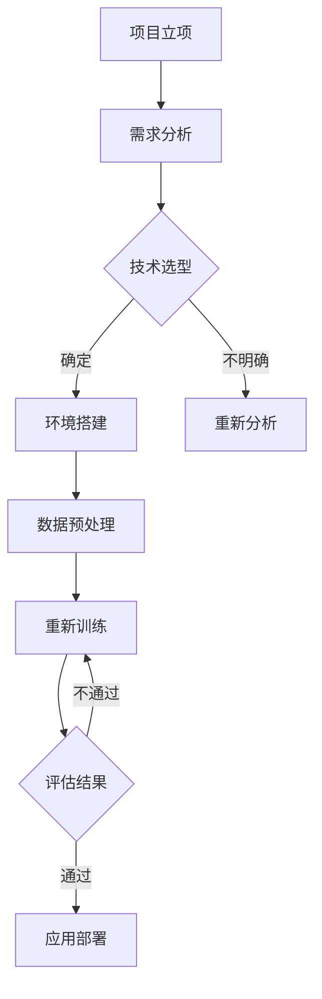

                 

# 文章标题: AI-Native应用开发：以Pailido为例

> 关键词：AI-Native, Pailido, 应用开发, 深度学习, 分布式架构

> 摘要：
本文深入探讨了AI-Native应用开发的理论基础、技术架构以及以Pailido为例的实战应用。通过对AI-Native概念的阐述，对其与传统应用的差异进行分析，本文进一步介绍了Pailido应用的场景、架构和核心功能。随后，本文详细讲解了AI-Native技术基础，包括数据预处理与存储、模型训练与优化、实时推理与决策等关键环节。通过Pailido应用开发实践，本文展示了从环境搭建到模型训练、实时推理和应用部署的全过程。最后，本文对AI-Native应用的未来趋势进行了展望，并提供了相关的开发工具与资源。

## 目录大纲

### 第一部分：AI-Native概述

- [第1章: AI-Native应用概述](#第1章-ai-native应用概述)
  - [1.1 AI-Native概念与背景](#11-ai-native概念与背景)
  - [1.2 Pailido应用介绍](#12-pailido应用介绍)

### 第二部分：AI-Native技术基础

- [第2章: AI-Native技术架构](#第2章-ai-native技术架构)
  - [2.1 数据预处理与存储](#21-数据预处理与存储)
  - [2.2 模型训练与优化](#22-模型训练与优化)
  - [2.3 实时推理与决策](#23-实时推理与决策)

### 第三部分：Pailido应用实战

- [第3章: Pailido应用开发实践](#第3章-pailido应用开发实践)
  - [3.1 开发环境搭建](#31-开发环境搭建)
  - [3.2 数据处理与存储](#32-数据处理与存储)
  - [3.3 模型训练与优化](#33-模型训练与优化)
  - [3.4 实时推理与决策](#34-实时推理与决策)
  - [3.5 应用部署与运维](#35-应用部署与运维)

### 第四部分：AI-Native应用展望

- [第4章: AI-Native应用未来趋势](#第4章-ai-native应用未来趋势)
  - [4.1 AI-Native技术演进](#41-ai-native技术演进)
  - [4.2 AI-Native产业发展趋势](#42-ai-native产业发展趋势)
  - [4.3 AI-Native应用挑战与解决方案](#43-ai-native应用挑战与解决方案)
  - [4.4 AI-Native应用未来展望](#44-ai-native应用未来展望)

### 附录

- [附录 A: AI-Native开发工具与资源](#附录-a-ai-native开发工具与资源)

## 第一部分：AI-Native概述

### 第1章: AI-Native应用概述

#### 1.1 AI-Native概念与背景

**AI-Native，即人工智能原生，是指在人工智能（AI）的驱动下，从设计之初就考虑到AI的能力与应用，使得应用系统能够充分利用AI的技术优势，实现智能化、自动化和高效化的目标。**

AI-Native的概念起源于对传统应用与人工智能结合的需求。随着AI技术的快速发展，越来越多的应用场景需要AI能力的支持，而传统应用往往在架构和设计上并未考虑到AI的融入。因此，AI-Native应用应运而生，旨在解决这一问题。

**AI-Native的发展历程：**

- 2006年：深度学习（Deep Learning）理论的提出，为AI-Native的发展奠定了基础。
- 2012年：AlexNet模型的提出，标志着深度学习在图像识别领域的突破。
- 2016年：AlphaGo击败围棋世界冠军，AI-Native在游戏领域的应用取得重大进展。
- 2018年至今：随着AI技术的不断成熟，AI-Native应用逐渐在各个领域得到推广和应用。

**AI-Native与传统应用的区别：**

- **设计理念：** 传统应用侧重于功能的实现，而AI-Native则强调AI能力的融合与优化。
- **数据依赖：** 传统应用数据相对独立，而AI-Native则强调数据的连续性和实时性。
- **系统架构：** 传统应用架构以模块化为主，而AI-Native架构更注重动态调整和自我优化。

#### 1.2 Pailido应用介绍

**Pailido是一款面向金融领域的AI-Native应用，旨在通过人工智能技术提供高效、精准的风控和投资建议。**

**Pailido的应用场景：**

- **风险预测：** 通过分析历史数据和实时数据，预测金融市场中潜在的风险。
- **投资建议：** 基于市场数据和用户行为，为投资者提供个性化的投资建议。

**Pailido的架构概述：**

Pailido采用分布式架构，包括数据层、模型层和应用层。

- **数据层：** 负责数据采集、存储和预处理。
- **模型层：** 负责AI模型的训练、优化和推理。
- **应用层：** 负责将AI能力应用于实际业务场景。

**Pailido的核心功能与特点：**

- **风险预测：** 利用机器学习算法，对潜在风险进行预测，提供实时风险预警。
- **投资建议：** 基于市场数据和用户行为，提供个性化的投资建议，提升投资效率。
- **自适应优化：** 根据用户反馈和市场变化，自适应调整模型参数，提高预测精度。

## 第二部分：AI-Native技术基础

### 第2章: AI-Native技术架构

#### 2.1 数据预处理与存储

**2.1.1 数据清洗与预处理**

数据清洗与预处理是AI-Native应用开发的关键步骤，其目标是将原始数据转化为适合机器学习模型训练的高质量数据。

- **数据清洗：** 去除重复数据、噪声数据和异常数据，保证数据质量。
- **数据预处理：** 包括数据归一化、标准化、特征工程等步骤，为模型训练做准备。

**2.1.2 数据存储方案**

数据存储是AI-Native应用的基础，需要考虑数据量、实时性和可靠性等因素。

- **分布式存储：** 采用分布式存储系统，如HDFS，提高数据存储和访问的效率。
- **实时存储：** 采用实时存储系统，如Kafka，实现数据的实时采集和传输。

**2.1.3 数据同步与分发**

数据同步与分发是保证数据一致性和实时性的重要手段。

- **数据同步：** 通过ETL（Extract, Transform, Load）过程，将数据从源系统同步到目标系统。
- **数据分发：** 通过消息队列，如RabbitMQ，实现数据在不同系统间的分发和共享。

#### 2.2 模型训练与优化

**2.2.1 模型选择与训练**

模型选择与训练是AI-Native应用的核心，直接影响应用的性能和效果。

- **模型选择：** 根据应用场景和需求，选择合适的机器学习算法和模型。
- **模型训练：** 利用大规模数据集，通过梯度下降等优化算法，训练模型参数。

**2.2.2 模型优化与调参**

模型优化与调参是提高模型性能的重要手段。

- **模型优化：** 通过交叉验证等方法，调整模型结构，提高模型性能。
- **参数调优：** 通过网格搜索、随机搜索等方法，找到最佳参数组合。

**2.2.3 模型评估与测试**

模型评估与测试是验证模型性能和可靠性的关键步骤。

- **模型评估：** 利用验证集和测试集，评估模型在未知数据上的性能。
- **模型测试：** 通过压力测试、性能测试等手段，验证模型在实际应用中的表现。

#### 2.3 实时推理与决策

**2.3.1 实时推理框架**

实时推理是AI-Native应用的重要特点，需要构建高效、可靠的实时推理框架。

- **推理框架：** 采用高性能推理引擎，如TensorFlow Serving，实现模型的实时推理。
- **服务部署：** 通过容器化技术，如Docker和Kubernetes，部署和运维推理服务。

**2.3.2 决策算法与应用**

决策算法是AI-Native应用的核心组成部分，需要根据业务需求设计合适的决策算法。

- **决策算法：** 结合业务需求，设计合适的决策算法，实现智能决策。
- **应用场景：** 将决策算法应用于实际业务场景，如风控、推荐、预测等。

**2.3.3 性能优化与调优**

性能优化与调优是提高系统性能和响应速度的关键步骤。

- **性能优化：** 通过算法优化、系统调优等方法，提高系统的响应速度和处理能力。
- **调优策略：** 根据业务需求和用户反馈，制定调优策略，持续优化系统性能。

## 第三部分：Pailido应用实战

### 第3章: Pailido应用开发实践

#### 3.1 开发环境搭建

**3.1.1 开发工具与依赖库**

搭建Pailido的开发环境需要选择合适的开发工具和依赖库。

- **开发工具：** 选择Python开发环境，如PyCharm或VS Code。
- **依赖库：** 安装必要的依赖库，如NumPy、Pandas、Scikit-learn等。

**3.1.2 数据集准备与处理**

准备和处理数据集是Pailido开发的重要步骤。

- **数据集获取：** 从金融数据源获取数据集，如股票价格、交易数据等。
- **数据预处理：** 对数据集进行清洗、预处理和归一化等操作。

**3.1.3 实验环境配置**

配置实验环境是进行模型训练和优化的基础。

- **环境配置：** 配置硬件环境，如CPU、GPU等，以及软件环境，如Python、TensorFlow等。
- **运行测试：** 在实验环境中运行测试，验证环境配置的正确性。

#### 3.2 数据处理与存储

**3.2.1 数据预处理流程**

数据处理与存储是Pailido应用开发的核心步骤之一。

- **数据清洗：** 去除重复数据、噪声数据和异常数据。
- **特征提取：** 提取与目标相关的特征，如时间序列特征、统计特征等。
- **数据归一化：** 对数据进行归一化处理，如标准化、缩放等。

**3.2.2 数据存储与同步策略**

数据存储与同步策略是保证数据质量和实时性的关键。

- **数据存储：** 选择合适的数据存储方案，如关系数据库、NoSQL数据库等。
- **数据同步：** 采用数据同步工具，如ETL工具，实现数据的实时同步和更新。

**3.2.3 数据质量管理与监控**

数据质量管理与监控是确保数据质量和稳定性的重要手段。

- **数据质量评估：** 评估数据质量，包括完整性、一致性、准确性等。
- **数据监控：** 监控数据质量，及时发现和处理数据问题。

#### 3.3 模型训练与优化

**3.3.1 训练流程与策略**

模型训练与优化是Pailido应用开发的核心步骤。

- **数据划分：** 将数据集划分为训练集、验证集和测试集。
- **模型选择：** 根据应用场景，选择合适的机器学习算法和模型。
- **训练策略：** 设置训练参数，如学习率、迭代次数等。

**3.3.2 优化算法与技巧**

优化算法与技巧是提高模型性能的重要手段。

- **优化算法：** 采用梯度下降、随机梯度下降等优化算法，调整模型参数。
- **调参技巧：** 通过交叉验证、网格搜索等方法，找到最佳参数组合。

**3.3.3 模型评估与迭代**

模型评估与迭代是验证模型性能和持续优化的重要步骤。

- **模型评估：** 利用验证集和测试集，评估模型在未知数据上的性能。
- **模型迭代：** 根据评估结果，调整模型结构和参数，不断优化模型性能。

#### 3.4 实时推理与决策

**3.4.1 实时推理系统设计**

实时推理系统设计是Pailido应用的关键环节。

- **系统架构：** 设计实时推理系统的架构，包括数据输入、模型推理、结果输出等模块。
- **性能优化：** 针对实时推理需求，优化系统性能，提高处理速度和响应能力。

**3.4.2 决策算法实现与优化**

决策算法实现与优化是Pailido应用的核心。

- **算法实现：** 根据业务需求，实现决策算法，如风险预测、投资建议等。
- **优化策略：** 通过算法优化、系统调优等方法，提高决策算法的准确性和实时性。

**3.4.3 性能优化与调试**

性能优化与调试是提高系统性能和稳定性的关键步骤。

- **性能优化：** 通过代码优化、硬件升级等手段，提高系统性能。
- **调试方法：** 采用调试工具和技术，定位并解决系统中的问题。

#### 3.5 应用部署与运维

**3.5.1 应用部署流程**

应用部署流程是Pailido应用上线的重要环节。

- **部署策略：** 设计应用部署策略，包括部署环境、部署流程等。
- **部署工具：** 使用部署工具，如Docker、Kubernetes等，实现应用的自动化部署。

**3.5.2 运维监控与故障处理**

运维监控与故障处理是确保系统稳定运行的重要手段。

- **运维监控：** 监控系统运行状态，及时发现和处理异常情况。
- **故障处理：** 制定故障处理流程，确保系统稳定运行。

**3.5.3 自动化运维与优化**

自动化运维与优化是提高运维效率和系统性能的关键。

- **自动化运维：** 采用自动化运维工具，如Ansible、Jenkins等，实现运维任务的自动化执行。
- **优化策略：** 通过监控和分析，持续优化系统性能和稳定性。

## 第四部分：AI-Native应用展望

### 第4章: AI-Native应用未来趋势

#### 4.1 AI-Native技术演进

AI-Native技术将继续演进，以应对日益复杂的应用需求和更高的性能要求。

- **模型压缩：** 通过模型压缩技术，降低模型大小和计算复杂度，提高部署效率和响应速度。
- **联邦学习：** 通过联邦学习技术，实现数据隐私保护和协同训练，提高模型性能和可解释性。

#### 4.2 AI-Native产业发展趋势

AI-Native产业将继续快速发展，并在各领域推动产业升级和创新发展。

- **产业融合：** AI-Native技术将与其他行业深度融合，推动产业升级和创新发展。
- **市场机遇：** 随着AI技术的不断成熟，AI-Native应用将迎来更广阔的市场机遇。

#### 4.3 AI-Native应用挑战与解决方案

AI-Native应用在发展过程中将面临一系列挑战，需要相应的解决方案。

- **数据隐私：** 通过数据加密、匿名化等技术，保护用户数据隐私。
- **模型可解释性：** 通过模型可解释性技术，提高模型的可解释性和可信度。

#### 4.4 AI-Native应用未来展望

AI-Native应用在未来将更加广泛和深入地应用于各个领域，为人类带来更多的便利和效益。

- **智能决策：** AI-Native应用将更广泛地应用于智能决策领域，提升业务效率和竞争力。
- **个性化服务：** AI-Native应用将更好地满足用户个性化需求，提供更加精准和高效的服务。

## 附录

### 附录 A: AI-Native开发工具与资源

#### A.1 开发工具与平台

- **Python**：Python是一种流行的编程语言，广泛应用于数据科学和机器学习领域。
- **TensorFlow**：TensorFlow是一个开源的机器学习框架，用于构建和训练深度学习模型。
- **PyTorch**：PyTorch是一个基于Python的深度学习框架，具有灵活性和易用性。
- **Keras**：Keras是一个高级神经网络API，用于快速构建和训练深度学习模型。

#### A.2 数据集与模型资源

- **Kaggle**：Kaggle是一个数据科学竞赛平台，提供大量的数据集和模型资源。
- **UCI Machine Learning Repository**：UCI机器学习库是一个提供多种数据集的免费资源库。
- **OpenML**：OpenML是一个开放的数据集和模型库，支持多种机器学习算法。

#### A.3 开源社区与论坛

- **GitHub**：GitHub是一个代码托管平台，许多AI-Native项目都托管在GitHub上。
- **Stack Overflow**：Stack Overflow是一个编程问题解答社区，可以帮助开发者解决编程问题。
- **Reddit**：Reddit是一个社交新闻网站，有许多与AI-Native相关的讨论区和论坛。

#### A.4 相关书籍与文章推荐

- **《深度学习》**：由Ian Goodfellow、Yoshua Bengio和Aaron Courville合著，是深度学习领域的经典教材。
- **《Python机器学习》**：由Sebastian Raschka和Vahid Mirjalili合著，介绍Python在机器学习中的应用。
- **《人工智能：一种现代的方法》**：由Stuart Russell和Peter Norvig合著，全面介绍了人工智能的基本概念和技术。
- **《AI应用实践》**：由吴恩达（Andrew Ng）等人合著，介绍了AI在各个领域的应用实践。

### Mermaid 流程图示例

以下是一个简单的 Mermaid 流程图示例，展示了 AI-Native 应用的开发流程：



### 伪代码示例

以下是一个简单的伪代码示例，用于描述一个线性回归模型的训练过程：

```plaintext
function linear_regression_train(X, y, alpha, num_iterations):
    for i in 1 to num_iterations:
        predictions = X * theta
        error = predictions - y
        gradient = X' * error / m
        theta = theta - alpha * gradient
    return theta
```

### 数学公式示例

以下是一个简单的数学公式示例，用于描述线性回归模型的损失函数：

```latex
J(\theta) = \frac{1}{2m} \sum_{i=1}^{m} (h_\theta(x^{(i)}) - y^{(i)})^2
```

### 代码解读与分析示例

以下是一个简单的 Python 代码示例，用于实现一个线性回归模型，并对代码进行解读与分析：

```python
import numpy as np

def linear_regression(X, y, alpha, num_iterations):
    m = len(y)
    theta = np.zeros(X.shape[1])
    X_b = np.c_[np.ones((m, 1)), X]  # 添加偏置项

    for i in range(num_iterations):
        predictions = X_b.dot(theta)
        errors = predictions - y
        theta = theta - alpha * X_b.T.dot(errors) / m

    return theta

# 代码解读：
# 1. 导入 NumPy 库，用于数值计算。
# 2. 定义线性回归函数，输入参数包括特征矩阵 X，目标变量 y，学习率 alpha 和迭代次数 num_iterations。
# 3. 初始化参数 theta，其初始值为零向量。
# 4. 添加偏置项，构成新的特征矩阵 X_b。
# 5. 使用梯度下降算法更新参数 theta，直到达到迭代次数或损失函数收敛。

# 分析：
# 1. 线性回归模型通过最小化损失函数来学习参数。
# 2. 梯度下降算法是一种优化方法，用于求解损失函数的极小值点。
# 3. 学习率 alpha 调整梯度下降的步长，影响收敛速度和稳定性。
# 4. 迭代次数 num_iterations 是一个预定义的超参数，用于限制训练过程。
```

### 作者信息

作者：AI天才研究院/AI Genius Institute & 禅与计算机程序设计艺术 /Zen And The Art of Computer Programming

