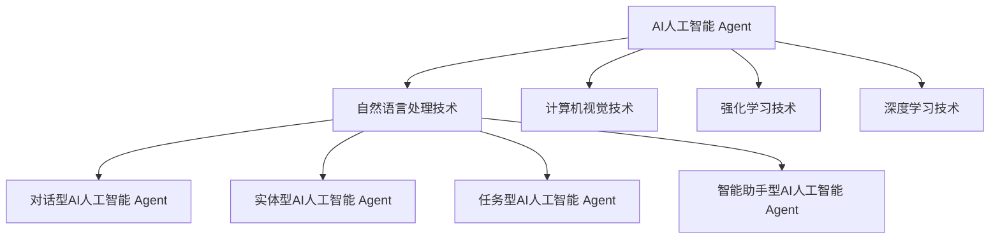
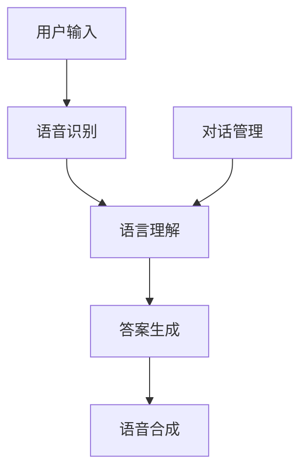

                 

# AI人工智能 Agent：在推进数字化中的应用

## 关键词
AI人工智能 Agent、数字化应用、客户服务、智能制造、医疗健康、技术架构、算法原理

## 摘要
本文深入探讨了AI人工智能 Agent在推进数字化应用中的重要性。首先，文章对AI人工智能 Agent进行了概述，详细介绍了其发展历程、核心概念、技术架构和工作原理。接着，分析了AI人工智能 Agent的各类核心技术，包括自然语言处理、计算机视觉、强化学习和深度学习。随后，文章分类讨论了不同类型的AI人工智能 Agent及其特点。最后，重点介绍了AI人工智能 Agent在客户服务、智能制造和医疗健康等领域的应用案例，并展望了其未来发展趋势。本文旨在为读者提供一个全面、系统的理解，以把握AI人工智能 Agent在数字化时代的重要角色。

### 《AI人工智能 Agent：在推进数字化中的应用》目录大纲

#### 第一部分：AI人工智能 Agent 基础

##### 第1章：AI人工智能 Agent 概述

###### 1.1 AI人工智能 Agent 的发展历程

###### 1.2 AI人工智能 Agent 的核心概念

###### 1.3 AI人工智能 Agent 的技术架构

###### 1.4 AI人工智能 Agent 的工作原理

##### 第2章：AI人工智能 Agent 的核心技术

###### 2.1 自然语言处理技术

###### 2.2 计算机视觉技术

###### 2.3 强化学习技术

###### 2.4 深度学习技术

##### 第3章：AI人工智能 Agent 的分类与特点

###### 3.1 对话型AI人工智能 Agent

###### 3.2 实体型AI人工智能 Agent

###### 3.3 任务型AI人工智能 Agent

###### 3.4 智能助手型AI人工智能 Agent

#### 第二部分：AI人工智能 Agent 在数字化中的应用

##### 第4章：AI人工智能 Agent 在客户服务中的应用

###### 4.1 客户服务AI人工智能 Agent 的应用场景

###### 4.2 客户服务AI人工智能 Agent 的优势与挑战

###### 4.3 客户服务AI人工智能 Agent 的实际案例

##### 第5章：AI人工智能 Agent 在智能制造中的应用

###### 5.1 智能制造AI人工智能 Agent 的应用场景

###### 5.2 智能制造AI人工智能 Agent 的优势与挑战

###### 5.3 智能制造AI人工智能 Agent 的实际案例

##### 第6章：AI人工智能 Agent 在医疗健康中的应用

###### 6.1 医疗健康AI人工智能 Agent 的应用场景

###### 6.2 医疗健康AI人工智能 Agent 的优势与挑战

###### 6.3 医疗健康AI人工智能 Agent 的实际案例

##### 第7章：AI人工智能 Agent 的未来发展趋势

###### 7.1 AI人工智能 Agent 的发展趋势分析

###### 7.2 AI人工智能 Agent 技术的创新与应用

###### 7.3 AI人工智能 Agent 的未来发展前景

### 附录

#### 附录A：AI人工智能 Agent 开发工具与资源

###### A.1 主流AI人工智能 Agent 开发框架对比

###### A.2 AI人工智能 Agent 开发常用工具

###### A.3 AI人工智能 Agent 开发资源推荐

##### Mermaid 流程图：AI人工智能 Agent 的技术架构



##### 对话型AI人工智能 Agent 算法原理



$$
f(x) = \sum_{i=1}^{n} w_i \cdot x_i
$$

$$
\frac{df}{dx} = \sum_{i=1}^{n} w_i
$$

### 第一部分：AI人工智能 Agent 基础

#### 第1章：AI人工智能 Agent 概述

##### 1.1 AI人工智能 Agent 的发展历程

人工智能（AI）作为计算机科学的一个分支，旨在使计算机系统具备类似人类智能的能力。AI人工智能 Agent，即人工智能代理，是指能够独立执行任务、与环境交互并学习优化行为的计算机程序。其发展历程可以分为以下几个阶段：

1. **早期探索（1956-1969）**：
   - 1956年，达特茅斯会议上，约翰·麦卡锡等提出了“人工智能”的概念，标志着人工智能领域的诞生。
   - 此阶段的AI研究主要集中在符号主义方法，如逻辑推理和规划。

2. **黄金时代（1970-1980）**：
   - 1972年，Eliza的出现标志着自然语言处理领域的初步发展。
   - 模式识别和专家系统的出现，使AI在特定领域取得了显著成就。

3. **低谷期（1980-1990）**：
   - 由于实际应用困难，AI研究陷入低谷。
   - 专家系统的大规模失败，使人们对符号主义方法的信心受到打击。

4. **复兴期（1990-2010）**：
   - 1997年，IBM的深蓝击败了国际象棋世界冠军卡斯帕罗夫，标志着AI在特定领域的能力得到了认可。
   - 数据挖掘和机器学习的发展，使AI在大量数据下取得了显著进步。

5. **当前时代（2010至今）**：
   - 深度学习、强化学习等技术的发展，使AI在图像识别、自然语言处理等领域取得了突破性进展。
   - AI人工智能 Agent的应用场景不断扩大，从客户服务、智能制造到医疗健康。

##### 1.2 AI人工智能 Agent 的核心概念

AI人工智能 Agent 的核心概念包括以下几个方面：

1. **自主性**：AI人工智能 Agent能够自主执行任务，无需人工干预。
2. **智能交互**：AI人工智能 Agent能够与人类或其他系统进行自然语言交互。
3. **学习能力**：AI人工智能 Agent能够通过学习不断优化自身行为。
4. **适应性**：AI人工智能 Agent能够根据环境变化调整自身策略。
5. **协作性**：AI人工智能 Agent能够与其他系统或人类协同工作，共同完成任务。

##### 1.3 AI人工智能 Agent 的技术架构

AI人工智能 Agent 的技术架构通常包括以下几个层次：

1. **感知层**：负责感知外部环境，获取图像、声音、文本等信息。
2. **决策层**：负责根据感知信息进行决策，确定下一步行为。
3. **执行层**：负责将决策转化为具体的行动，执行任务。
4. **学习层**：负责从执行结果中学习，不断优化自身行为。

##### 1.4 AI人工智能 Agent 的工作原理

AI人工智能 Agent 的工作原理可以分为以下几个步骤：

1. **感知**：AI人工智能 Agent通过感知层获取外部环境信息。
2. **理解**：AI人工智能 Agent利用自然语言处理、计算机视觉等技术理解感知信息。
3. **决策**：AI人工智能 Agent基于理解结果和预定义的策略进行决策。
4. **行动**：AI人工智能 Agent根据决策执行具体的行动。
5. **反馈**：AI人工智能 Agent收集执行结果，进行学习优化。

通过以上步骤，AI人工智能 Agent能够实现自主、智能的交互和任务执行。

### 第二部分：AI人工智能 Agent 的核心技术

#### 第2章：AI人工智能 Agent 的核心技术

##### 2.1 自然语言处理技术

自然语言处理（NLP）是AI人工智能 Agent的核心技术之一，旨在使计算机能够理解和生成自然语言。NLP技术主要包括以下几个方面：

1. **分词**：将文本分割成单词或短语，是NLP的第一步。
2. **词性标注**：为每个词分配词性，如名词、动词、形容词等。
3. **句法分析**：分析句子的结构，确定词与词之间的关系。
4. **语义分析**：理解句子的语义含义，包括实体识别、情感分析等。

NLP技术应用于AI人工智能 Agent，可以实现以下功能：

- **文本理解**：理解用户输入的文本，提取关键信息。
- **语音识别**：将语音输入转换为文本。
- **语音合成**：将文本转换为语音输出。
- **对话管理**：维护对话状态，生成自然流畅的对话。

##### 2.2 计算机视觉技术

计算机视觉技术是AI人工智能 Agent的另一个核心技术，旨在使计算机能够理解和解释图像和视频。计算机视觉技术主要包括以下几个方面：

1. **图像识别**：识别图像中的物体和场景。
2. **目标检测**：在图像中检测并定位多个目标。
3. **人脸识别**：识别和验证图像中的人脸。
4. **图像分割**：将图像分割为不同的区域。

计算机视觉技术应用于AI人工智能 Agent，可以实现以下功能：

- **图像理解**：理解图像中的内容，提取关键信息。
- **图像生成**：生成新的图像或视频。
- **场景理解**：理解图像中的场景，进行场景分类。
- **交互识别**：识别用户的表情、姿态等，实现自然交互。

##### 2.3 强化学习技术

强化学习技术是AI人工智能 Agent的一个重要分支，旨在通过不断尝试和错误来学习最优策略。强化学习技术主要包括以下几个方面：

1. **奖励机制**：根据执行结果给予奖励或惩罚。
2. **策略学习**：通过学习优化决策策略。
3. **探索与利用**：在策略学习过程中，平衡探索新策略和利用已知策略。

强化学习技术应用于AI人工智能 Agent，可以实现以下功能：

- **自主决策**：根据环境变化自主调整行为。
- **连续决策**：在连续环境中进行决策和行动。
- **自适应**：根据执行结果不断调整策略。

##### 2.4 深度学习技术

深度学习技术是AI人工智能 Agent的另一个核心技术，通过构建深度神经网络来实现复杂的特征学习和模式识别。深度学习技术主要包括以下几个方面：

1. **卷积神经网络（CNN）**：适用于图像识别和目标检测。
2. **循环神经网络（RNN）**：适用于序列数据处理和自然语言处理。
3. **生成对抗网络（GAN）**：适用于图像生成和风格迁移。

深度学习技术应用于AI人工智能 Agent，可以实现以下功能：

- **特征提取**：从原始数据中提取高级特征。
- **模式识别**：识别复杂的数据模式。
- **自动学习**：自动学习数据中的规律和模式。
- **智能优化**：通过深度学习优化算法，实现自动化优化。

### 第三部分：AI人工智能 Agent 的分类与特点

#### 第3章：AI人工智能 Agent 的分类与特点

##### 3.1 对话型AI人工智能 Agent

对话型AI人工智能 Agent是指能够与人类进行自然语言交互，理解并回应用户的问题和指令的AI代理。其特点包括：

- **自然语言理解**：能够理解用户输入的自然语言，提取关键信息。
- **对话管理**：能够维护对话状态，理解对话上下文。
- **自适应**：根据对话内容和上下文，动态调整回答和提问方式。

对话型AI人工智能 Agent广泛应用于客户服务、智能客服、虚拟助手等领域。

##### 3.2 实体型AI人工智能 Agent

实体型AI人工智能 Agent是指能够模拟人类行为，执行特定任务的AI代理。其特点包括：

- **自主执行**：能够独立执行任务，无需人工干预。
- **动作识别**：能够识别并执行特定的动作，如行走、搬运等。
- **环境感知**：能够感知和理解周围环境，进行自主导航。

实体型AI人工智能 Agent广泛应用于智能制造、物流配送、服务机器人等领域。

##### 3.3 任务型AI人工智能 Agent

任务型AI人工智能 Agent是指专门针对特定任务设计的AI代理，其目标是在特定场景下实现高效的任务执行。其特点包括：

- **任务导向**：专注于特定任务，如数据分析、代码审查等。
- **高效执行**：通过优化算法，实现高效的任务处理。
- **智能化**：能够根据任务需求，动态调整策略和执行方式。

任务型AI人工智能 Agent广泛应用于金融、医疗、科研等领域。

##### 3.4 智能助手型AI人工智能 Agent

智能助手型AI人工智能 Agent是指集成了多种功能的AI代理，能够为用户提供全方位的智能服务。其特点包括：

- **多功能集成**：集成多种AI技术，如自然语言处理、计算机视觉、强化学习等。
- **个性化**：能够根据用户行为和偏好，提供个性化的服务。
- **便捷性**：通过语音、文本等多种交互方式，为用户提供便捷的服务。

智能助手型AI人工智能 Agent广泛应用于智能家居、智能办公、智能出行等领域。

### 第四部分：AI人工智能 Agent 在数字化中的应用

#### 第4章：AI人工智能 Agent 在客户服务中的应用

##### 4.1 客户服务AI人工智能 Agent 的应用场景

客户服务AI人工智能 Agent广泛应用于各种场景，以下是一些典型的应用场景：

- **在线客服**：提供24/7全天候客户服务，解答用户疑问。
- **客户咨询**：帮助用户快速找到所需信息，提高客户满意度。
- **售后服务**：协助处理售后服务问题，如退换货、维修等。
- **智能导购**：根据用户需求和偏好，提供个性化的商品推荐。
- **预订服务**：协助用户进行机票、酒店、门票等预订。

##### 4.2 客户服务AI人工智能 Agent 的优势与挑战

客户服务AI人工智能 Agent具有以下优势：

- **高效**：能够快速响应用户请求，提高客户满意度。
- **24/7服务**：提供全天候服务，无需人工干预。
- **成本降低**：减少人工客服成本，提高运营效率。
- **数据积累**：积累用户数据，用于优化服务策略。

然而，客户服务AI人工智能 Agent也面临以下挑战：

- **理解能力**：在处理复杂问题时，AI人工智能 Agent可能无法准确理解用户意图。
- **个性化不足**：难以完全实现个性化服务，满足所有用户需求。
- **道德和法律问题**：在处理用户隐私和数据安全时，需要遵守相关法律法规。
- **技术限制**：AI人工智能 Agent的技术水平可能制约其在某些领域的应用。

##### 4.3 客户服务AI人工智能 Agent 的实际案例

以下是几个客户服务AI人工智能 Agent的实际案例：

1. **苹果客服**：苹果公司利用AI人工智能 Agent提供在线客服，帮助用户解答问题、处理售后问题。该AI人工智能 Agent基于自然语言处理技术，能够理解用户的语言，并提供准确的回答。
2. **京东客服**：京东利用AI人工智能 Agent提供智能客服，帮助用户查询订单、退货等。该AI人工智能 Agent基于对话型AI技术，能够与用户进行自然语言交互，提供个性化的服务。
3. **银行客服**：多家银行利用AI人工智能 Agent提供客户服务，解答用户关于账户、贷款等问题。该AI人工智能 Agent基于计算机视觉技术，能够通过视频识别用户身份，提供安全便捷的服务。

通过以上案例，可以看出客户服务AI人工智能 Agent在提高客户满意度、降低运营成本方面的显著优势。

#### 第5章：AI人工智能 Agent 在智能制造中的应用

##### 5.1 智能制造AI人工智能 Agent 的应用场景

AI人工智能 Agent在智能制造领域具有广泛的应用，以下是一些典型的应用场景：

- **生产调度**：基于AI人工智能 Agent的算法，实现生产过程的智能调度和优化，提高生产效率。
- **质量检测**：利用计算机视觉技术和深度学习算法，实现产品质量的自动检测和分类，减少人为误差。
- **设备维护**：通过实时监测设备状态，预测设备故障，提前进行维护，降低设备停机时间。
- **供应链管理**：利用AI人工智能 Agent进行供应链数据的分析和管理，优化库存、物流等环节。
- **产品推荐**：基于用户数据和需求分析，推荐合适的制造方案和产品，提高市场竞争力。

##### 5.2 智能制造AI人工智能 Agent 的优势与挑战

智能制造AI人工智能 Agent具有以下优势：

- **高效性**：通过智能化算法，实现生产过程的优化，提高生产效率。
- **精确性**：利用计算机视觉和深度学习技术，实现产品质量的精确检测和分类。
- **安全性**：通过实时监测和预警，降低设备故障和安全事故的风险。
- **灵活性**：能够根据市场需求和用户需求，快速调整生产方案和产品。

然而，智能制造AI人工智能 Agent也面临以下挑战：

- **数据隐私**：在收集和处理大量数据时，需要确保用户数据的安全和隐私。
- **技术集成**：需要将不同的AI技术进行有效集成，实现各环节的协同工作。
- **人才短缺**：智能制造AI人工智能 Agent的开发和应用需要大量专业人才，但人才供给不足。
- **成本高昂**：智能制造AI人工智能 Agent的开发和应用需要大量资金投入。

##### 5.3 智能制造AI人工智能 Agent 的实际案例

以下是几个智能制造AI人工智能 Agent的实际案例：

1. **汽车制造**：某汽车制造商利用AI人工智能 Agent进行生产调度和质量检测。该AI人工智能 Agent基于强化学习技术，能够根据生产计划和设备状态，优化生产流程和调度策略，提高生产效率。
2. **电子制造**：某电子产品制造商利用AI人工智能 Agent进行质量检测和设备维护。该AI人工智能 Agent基于计算机视觉技术和深度学习算法，能够实时监测设备状态，预测故障并提前进行维护，降低设备停机时间。
3. **医疗器械**：某医疗器械制造商利用AI人工智能 Agent进行设备监测和预警。该AI人工智能 Agent基于物联网技术和数据分析算法，能够实时监测设备的运行状态，预测设备故障并及时发出预警，提高设备运行效率和安全性。

通过以上案例，可以看出智能制造AI人工智能 Agent在提高生产效率、降低运营成本方面的显著优势。

#### 第6章：AI人工智能 Agent 在医疗健康中的应用

##### 6.1 医疗健康AI人工智能 Agent 的应用场景

AI人工智能 Agent在医疗健康领域具有广泛的应用，以下是一些典型的应用场景：

- **疾病预测**：利用AI人工智能 Agent分析患者数据，预测疾病风险和趋势，提前进行预防。
- **医学影像诊断**：利用计算机视觉技术和深度学习算法，辅助医生进行医学影像的诊断和分析。
- **辅助手术**：利用AI人工智能 Agent进行手术规划和操作，提高手术精度和安全性。
- **药物研发**：利用AI人工智能 Agent进行药物分子设计和筛选，加速新药研发进程。
- **健康管理**：利用AI人工智能 Agent监测患者健康状况，提供个性化的健康建议和干预方案。

##### 6.2 医疗健康AI人工智能 Agent 的优势与挑战

医疗健康AI人工智能 Agent具有以下优势：

- **精准性**：利用先进的算法和大量数据，实现疾病预测和诊断的精准性。
- **高效性**：自动化处理大量医学影像和数据，提高诊断和治疗的效率。
- **个性化**：根据患者数据和需求，提供个性化的医疗服务和治疗方案。
- **安全性**：通过实时监测和预警，降低医疗事故和风险。

然而，医疗健康AI人工智能 Agent也面临以下挑战：

- **数据隐私**：在收集和处理患者数据时，需要确保数据的安全和隐私。
- **算法透明性**：需要确保AI人工智能 Agent的算法透明、可解释，以便医生和患者理解。
- **医疗监管**：需要遵守相关医疗法规和标准，确保AI人工智能 Agent的应用符合医疗规范。
- **技术依赖**：过度依赖AI人工智能 Agent可能导致医生和患者失去对医疗过程的控制。

##### 6.3 医疗健康AI人工智能 Agent 的实际案例

以下是几个医疗健康AI人工智能 Agent的实际案例：

1. **疾病预测**：某医疗机构利用AI人工智能 Agent进行心血管疾病预测。该AI人工智能 Agent基于患者数据，包括血压、血糖、心电图等，利用深度学习算法进行预测，提前发现潜在的健康风险。
2. **医学影像诊断**：某医疗机构利用AI人工智能 Agent进行肺癌筛查。该AI人工智能 Agent基于计算机视觉技术和深度学习算法，对肺部CT影像进行分析，辅助医生进行早期肺癌筛查。
3. **药物研发**：某制药公司利用AI人工智能 Agent进行药物分子设计。该AI人工智能 Agent基于分子对接技术和深度学习算法，加速药物分子的筛选和优化，提高新药研发效率。

通过以上案例，可以看出医疗健康AI人工智能 Agent在提高诊断准确性、加速药物研发等方面的显著优势。

### 第7章：AI人工智能 Agent 的未来发展趋势

##### 7.1 AI人工智能 Agent 的发展趋势分析

随着人工智能技术的快速发展，AI人工智能 Agent在未来将呈现出以下几个发展趋势：

1. **技术融合**：不同AI技术的融合，如深度学习、强化学习、计算机视觉等，将使AI人工智能 Agent具备更强大的能力。
2. **自适应学习**：AI人工智能 Agent将具备更强的自适应学习能力，能够根据环境变化和用户需求进行自我优化。
3. **跨领域应用**：AI人工智能 Agent将应用于更多领域，如金融、教育、交通等，实现更广泛的应用。
4. **人机协同**：AI人工智能 Agent将与传统行业相结合，实现人机协同工作，提高生产效率和用户体验。
5. **智能化管理**：AI人工智能 Agent将实现智能化管理，通过数据分析、预测和优化，提高行业管理水平。

##### 7.2 AI人工智能 Agent 技术的创新与应用

未来，AI人工智能 Agent的技术创新将主要体现在以下几个方面：

1. **多模态交互**：通过整合语音、图像、文本等多种模态，实现更自然、流畅的交互体验。
2. **知识图谱**：构建大规模的知识图谱，实现AI人工智能 Agent对复杂知识和关系的理解。
3. **迁移学习**：通过迁移学习技术，使AI人工智能 Agent能够在不同领域快速适应和应用。
4. **增强现实（AR）和虚拟现实（VR）**：利用AR和VR技术，为AI人工智能 Agent提供更丰富的应用场景和交互方式。
5. **区块链**：结合区块链技术，实现AI人工智能 Agent的透明、可追溯和可信的数据交互。

##### 7.3 AI人工智能 Agent 的未来发展前景

未来，AI人工智能 Agent将在以下几个方面展现其广阔的发展前景：

1. **提高生产效率**：在工业制造、农业等领域，AI人工智能 Agent将实现自动化和智能化生产，提高生产效率和产品质量。
2. **改善生活质量**：在家庭、医疗、教育等领域，AI人工智能 Agent将提供个性化、智能化的服务和解决方案，提高生活质量。
3. **推动创新**：AI人工智能 Agent将激发各行业的技术创新和应用创新，推动产业升级和经济发展。
4. **赋能传统行业**：AI人工智能 Agent将赋能传统行业，提升行业竞争力和市场地位。

总之，AI人工智能 Agent在推进数字化时代将发挥重要作用，成为各行各业的重要生产力工具和创新驱动力。

### 附录A：AI人工智能 Agent 开发工具与资源

#### A.1 主流AI人工智能 Agent 开发框架对比

在开发AI人工智能 Agent时，选择合适的开发框架至关重要。以下是一些主流的AI人工智能 Agent开发框架及其特点的对比：

| 框架         | 特点                                                         | 适用场景                     |
|--------------|--------------------------------------------------------------|------------------------------|
| TensorFlow   | 开源、支持多种算法、广泛使用                             | 大型项目、科研               |
| PyTorch      | 易用、动态图编程、社区活跃                             | 大型项目、科研、快速迭代     |
| Keras        | 高层API、简单易用、基于TensorFlow和Theano               | 快速原型开发、入门级项目     |
| Microsoft AI | 支持多种编程语言、云服务集成、企业级支持               | 企业级应用、云服务集成       |
| Rasa         | 对话型AI人工智能 Agent开发框架                           | 对话型AI人工智能 Agent开发     |
| OpenAI Gym   | 强化学习环境库                                           | 强化学习算法开发             |

#### A.2 AI人工智能 Agent 开发常用工具

在开发AI人工智能 Agent时，以下是一些常用的工具：

| 工具         | 功能描述                                                         | 适用场景                     |
|--------------|------------------------------------------------------------------|------------------------------|
| Jupyter Notebook | 交互式开发环境，支持多种编程语言和库                          | 快速原型开发、数据分析和模型训练 |
| PyCharm       | 集成开发环境（IDE），支持Python编程                         | 项目开发、代码调试           |
| Visual Studio Code | 跨平台集成开发环境（IDE），支持多种编程语言和库              | 快速原型开发、代码调试       |
| Docker        | 容器化技术，用于构建和部署AI模型                           | 项目部署、模型部署           |
| TensorBoard   | 用于可视化TensorFlow模型和数据的工具                         | 模型调试、数据分析           |

#### A.3 AI人工智能 Agent 开发资源推荐

以下是一些AI人工智能 Agent开发资源的推荐：

| 资源名称         | 描述                                                         | 链接                                      |
|------------------|--------------------------------------------------------------|-----------------------------------------|
| 《深度学习》     | 菲利普·莫里斯的深度学习经典教材                            | https://www.deeplearningbook.org/         |
| 《Python深度学习》 | 法布里斯·松井的Python深度学习实战指南                       | https://www.dljc.net/                     |
| AI博客          | 多个AI领域的博客集合，包括深度学习、自然语言处理、计算机视觉等 | https://www.aiuai.cn/                     |
| Kaggle          | 数据科学和机器学习竞赛平台，提供丰富的数据集和项目案例       | https://www.kaggle.com/                   |

通过以上工具和资源，开发者可以更高效地构建和优化AI人工智能 Agent。

### 实际案例：对话型AI人工智能 Agent 的算法原理与实现

#### 实际案例背景

本案例将介绍如何使用Python开发一个简单的对话型AI人工智能 Agent，实现用户输入文本的语音识别、语言理解、答案生成和语音合成等功能。该Agent将能够理解用户的基本问候和感谢，并作出相应的回应。

#### 开发环境搭建

1. 安装Python 3.8及以上版本。
2. 安装语音识别库：pip install SpeechRecognition
3. 安装语音合成库：pip install gTTS
4. 安装自然语言处理库：pip install NLTK

#### 源代码详细实现和代码解读

```python
# 导入所需库
import speech_recognition as sr
from gtts import gTTS
import pygame

# 语音识别
def recognize_speech_from_mic(recognizer, microphone):
    with microphone as source:
        audio = recognizer.listen(source)

    try:
        return recognizer.recognize_google(audio)
    except sr.UnknownValueError:
        return "无法理解您的语音输入。请重新尝试。"
    except sr.RequestError:
        return "无法请求语音识别服务。请检查网络连接。"

# 语言理解
def language_understanding(text_input):
    # 此处可以使用自然语言处理库（如NLTK）进行语义分析
    # 示例：识别用户的意图和实体
    if "你好" in text_input or "您好" in text_input:
        return "问候"
    elif "谢谢" in text_input:
        return "感谢"
    else:
        return "未知"

# 答案生成
def generate_response(intent):
    if intent == "问候":
        return "您好，有什么可以帮助您的吗？"
    elif intent == "感谢":
        return "不客气，很高兴为您服务。"
    else:
        return "抱歉，我不理解您的意图。请重新尝试。"

# 语音合成
def speak(text):
    tts = gTTS(text=text, lang="zh-cn")
    tts.save("response.mp3")
    pygame.mixer.init()
    pygame.mixer.music.load("response.mp3")
    pygame.mixer.music.play()

# 主程序
def main():
    recognizer = sr.Recognizer()
    microphone = sr.Microphone()

    print("请开始说话...")
    user_input = recognize_speech_from_mic(recognizer, microphone)
    print(f"您说了：{user_input}")

    intent = language_understanding(user_input)
    print(f"识别到的意图：{intent}")

    response = generate_response(intent)
    print(f"生成的回答：{response}")
    speak(response)

if __name__ == "__main__":
    main()
```

#### 代码解读与分析

1. **语音识别**：
   - 使用 `speech_recognition` 库从用户的麦克风接收语音输入，并使用 Google 语音识别服务将语音转换为文本。
   - 代码示例：`recognizer.recognize_google(audio)`

2. **语言理解**：
   - 使用简单的条件判断对用户输入的文本进行语义分析，识别用户的意图和实体。
   - 代码示例：`if "你好" in text_input or "您好" in text_input:`

3. **答案生成**：
   - 根据识别到的意图，生成相应的答案或建议。
   - 代码示例：`return "您好，有什么可以帮助您的吗？"`

4. **语音合成**：
   - 使用 `gtts` 库将生成的文本转换为语音，并使用 `pygame` 库播放语音。
   - 代码示例：`tts = gTTS(text=text, lang="zh-cn")`

通过以上步骤，可以创建一个简单的对话型AI人工智能 Agent。在实际应用中，可以根据需求扩展功能，如添加更多意图和实体识别，改进语音识别和合成质量，以及实现更复杂的对话管理。

