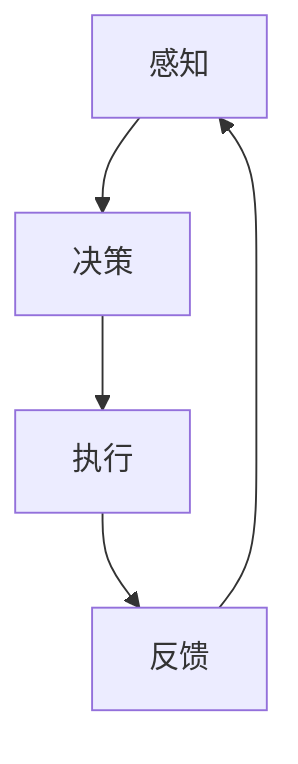

                 

# 文章标题: AI人工智能 Agent：智能体的设计与实现

> 关键词：人工智能、智能体、设计、实现、算法、架构、应用

> 摘要：本文将深入探讨AI人工智能中的智能体（Agent）概念，从基础概念、架构设计、算法实现，到实际应用，全面解析智能体的设计与实现过程。通过详细的理论讲解、数学模型描述和实战案例，帮助读者全面了解和掌握智能体的核心技术和应用场景。

### 《AI人工智能 Agent：智能体的设计与实现》目录大纲

#### 第一部分：引言与基础概念

##### 第1章：AI与智能体的简介

- 1.1 AI的发展历史
- 1.2 智能体的定义
- 1.3 智能体与AI的关系
- 1.4 智能体技术的发展趋势

##### 第2章：AI基础知识

- 2.1 数据结构与算法基础
- 2.2 机器学习基本概念
- 2.3 深度学习原理

#### 第二部分：智能体的设计与实现

##### 第3章：智能体架构设计

- 3.1 智能体的组成部分
- 3.2 智能体的通信机制
- 3.3 智能体行为模型

##### 第4章：智能体的算法实现

- 4.1 智能体的感知与决策算法
- 4.2 智能体的行动与交互算法
- 4.3 智能体的学习和适应算法

##### 第5章：智能体的编程与开发

- 5.1 智能体编程基础
- 5.2 智能体开发框架
- 5.3 智能体编程案例

##### 第6章：智能体在现实世界中的应用

- 6.1 智能体在游戏中的应用
- 6.2 智能体在机器人中的应用
- 6.3 智能体在智能家居中的应用

#### 第三部分：智能体的挑战与未来

##### 第7章：智能体的挑战

- 7.1 智能体的道德伦理问题
- 7.2 智能体的安全性问题
- 7.3 智能体的可解释性问题

##### 第8章：智能体的未来发展趋势

- 8.1 智能体与人类交互的进化
- 8.2 智能体在多模态场景中的应用
- 8.3 智能体在工业、医疗等领域的应用前景

#### 附录

- 附录A：智能体开发工具与资源
- 附录B：智能体编程示例代码

### Mermaid 流程图：智能体架构设计



### 伪代码：智能体决策算法

```plaintext
function make_decision(sensor_data):
    # 初始化决策变量
    decision = None
    
    # 使用传感器数据进行特征提取
    features = extract_features(sensor_data)
    
    # 使用机器学习模型进行决策预测
    prediction = ml_model.predict(features)
    
    # 根据预测结果生成决策
    if prediction == "前进":
        decision = "前进"
    elif prediction == "后退":
        decision = "后退"
    elif prediction == "停止":
        decision = "停止"
    
    return decision
```

### 数学公式：感知与决策模型

$$
\begin{equation}
\text{决策模型} = f(\text{感知数据}, \text{参数})
\end{equation}
$$

### 数学公式：行动与交互模型

$$
\begin{equation}
\text{交互模型} = g(\text{行为}, \text{环境状态})
\end{equation}
$$

### 项目实战：智能体在机器人上的应用

- 实战1：机器人路径规划
- 实战2：机器人自主导航
- 实战3：机器人人机交互

### 代码解读与分析：智能体编程案例

- 代码1：基于Python的智能体环境搭建
- 代码2：基于TensorFlow的智能体感知与决策算法实现
- 代码3：基于ROS的智能体机器人行动与交互实现

[END OF DIRECTORY]

### 作者信息

作者：AI天才研究院/AI Genius Institute & 禅与计算机程序设计艺术 /Zen And The Art of Computer Programming

[END OF ARTICLE]

### 引言与基础概念

在人工智能（AI）领域，智能体（Agent）是一个核心的概念。智能体是指能够感知环境，基于感知信息自主做出决策，并采取行动以实现特定目标的系统。智能体的概念最早可以追溯到20世纪70年代，自那时以来，随着计算机科学和人工智能技术的发展，智能体技术也得到了长足的进步。

#### 1.1 AI的发展历史

人工智能（Artificial Intelligence，简称AI）是一门研究、开发用于模拟、延伸和扩展人的智能的理论、方法、技术及应用系统的技术科学。AI的发展可以追溯到20世纪50年代，当时，随着计算机硬件和软件技术的飞速发展，科学家们开始尝试通过计算机模拟人类的智能行为。

- **20世纪50年代**：人工智能的概念被提出，早期的AI研究主要集中在符号逻辑、问题解决和推理系统上。
- **20世纪60年代**：出现了逻辑理论家和通用问题求解器等代表性系统。
- **20世纪70年代**：智能体的概念被引入，智能体技术开始受到关注。
- **20世纪80年代**：专家系统成为AI研究的热点，通过符号推理和知识表示实现了对特定领域的专家水平决策支持。
- **20世纪90年代**：随着计算机性能的提升和互联网的普及，机器学习和神经网络技术得到了广泛应用。
- **21世纪至今**：深度学习和强化学习等先进技术取得了突破性进展，智能体在自动驾驶、自然语言处理、机器人等领域得到了广泛应用。

#### 1.2 智能体的定义

智能体是一种自主、自治、自学习的系统，能够感知环境信息，通过决策生成器生成决策，并执行决策以实现目标。智能体具有以下基本特征：

- **自主性**：智能体能够独立执行任务，不受外部干预。
- **自治性**：智能体能够自主管理资源，如能量、时间和计算资源。
- **自学习性**：智能体能够通过经验和数据不断优化自己的行为。

根据智能体的能力和作用范围，可以将智能体分为以下几种类型：

- **基于规则的智能体**：这种智能体通过预定义的规则集来做出决策，适用于规则明确、简单场景的自动化。
- **基于行为的智能体**：这种智能体通过观察和模仿人类或其他智能体的行为来学习，适用于复杂、动态环境。
- **基于学习的智能体**：这种智能体通过机器学习算法从数据中学习规律，并据此做出决策，适用于数据丰富、场景复杂的场景。
- **混合智能体**：这种智能体结合了基于规则、行为和学习的特点，适用于多种复杂场景。

#### 1.3 智能体与AI的关系

智能体是AI领域中重要的研究方向和应用场景之一。AI的核心目标是实现机器的智能行为，而智能体是实现这一目标的重要载体。智能体与AI的关系可以从以下几个方面理解：

- **智能体是AI的执行者**：智能体通过感知环境信息，做出决策并执行行动，实现了AI的理论成果在实际场景中的应用。
- **智能体是AI的研究对象**：智能体的设计与实现过程中涉及到AI的核心技术，如机器学习、自然语言处理、计算机视觉等，这些技术通过智能体的应用得到验证和优化。
- **智能体是AI的应用场景**：智能体技术在不同领域的应用，如机器人、自动驾驶、智能家居等，推动了AI技术的发展和应用。

#### 1.4 智能体技术的发展趋势

随着AI技术的不断进步，智能体技术也在不断发展。未来，智能体技术将呈现以下发展趋势：

- **智能体的多模态感知与交互**：智能体将具备更加丰富的感知能力，能够处理文本、图像、声音等多种类型的数据，并通过自然语言处理和计算机视觉等技术实现与人类的自然交互。
- **智能体的自主学习与进化**：智能体将具备更强的自学习能力和适应能力，能够从数据中学习，并通过进化算法不断优化自己的行为和策略。
- **智能体的分布式与协同**：智能体将能够通过分布式计算和协同算法实现更大规模、更复杂任务的执行，如智能交通系统、智能电网等。
- **智能体的安全与伦理**：随着智能体应用的普及，智能体的安全性和伦理问题将受到广泛关注，需要建立相应的标准和规范，以确保智能体技术的健康发展。

通过本章节的介绍，我们对AI和智能体的基本概念和发展有了初步的了解。在接下来的章节中，我们将深入探讨AI的基础知识，包括数据结构与算法基础、机器学习基本概念和深度学习原理，为智能体的设计与实现打下坚实的基础。

### 第一部分总结

在本部分中，我们首先介绍了人工智能（AI）和智能体（Agent）的基本概念和历史发展。通过回顾AI的发展历程，我们了解了从符号逻辑、专家系统到现代的深度学习和强化学习等技术的演变。智能体的定义和类型则为我们描绘了这种系统能够实现的基本功能及其应用范围。

接下来，我们探讨了智能体与AI的关系，明确了智能体不仅是AI的执行者，也是研究和应用的重要对象。随着AI技术的不断进步，智能体技术的发展趋势也逐步显现，包括多模态感知与交互、自主学习与进化、分布式与协同以及安全与伦理等方面的挑战和机遇。

这一部分的目的是为后续章节的深入讨论奠定基础。在下一部分，我们将进一步探讨AI的基础知识，包括数据结构与算法、机器学习和深度学习等核心概念。这将帮助我们更好地理解智能体的感知、决策和行动过程，为其设计和实现提供必要的理论支持。

### AI基础知识

为了深入理解智能体的设计与实现，我们需要掌握AI领域的基础知识，包括数据结构与算法基础、机器学习基本概念和深度学习原理。这些基础知识是构建智能体的基石，对于理解智能体的感知、决策和行动过程至关重要。

#### 2.1 数据结构与算法基础

数据结构与算法是计算机科学的核心组成部分，对于智能体的设计与实现尤为重要。数据结构是组织和存储数据的方式，而算法则是解决问题的一系列步骤和规则。以下是一些基础的数据结构和算法：

- **线性结构**：如数组、链表、栈和队列等，这些结构在存储和操作数据时提供了高效的访问方式。
- **树状结构**：如二叉树、堆、平衡树等，这些结构在处理层次数据和查找操作时具有优势。
- **图状结构**：如图、网络等，这些结构在处理复杂的关系和网络问题时非常有用。

算法是解决特定问题的方法，其效率和质量直接影响智能体的性能。以下是一些基础的算法：

- **排序算法**：如快速排序、归并排序、堆排序等，用于对数据进行排序。
- **查找算法**：如二分查找、深度优先搜索、广度优先搜索等，用于在数据结构中查找特定元素。
- **动态规划**：用于解决最优子结构问题，通过将问题分解为更小的子问题并存储其结果来优化计算效率。

在智能体的设计中，数据结构和算法的选择和使用至关重要。例如，在感知阶段，可能需要使用高效的排序和查找算法来处理感知数据；在决策阶段，可能需要使用动态规划来找到最优的行动方案。

#### 2.2 机器学习基本概念

机器学习是AI的核心技术之一，它使计算机系统能够通过数据学习并改进性能，而无需显式编程。以下是一些基本的机器学习概念：

- **监督学习**：在这种学习中，系统使用标记数据集来学习映射输入到输出。常见的算法包括线性回归、决策树、支持向量机（SVM）等。
- **无监督学习**：在这种学习中，系统没有明确的输出标签，需要从未标记的数据中提取结构。常见的算法包括聚类、主成分分析（PCA）、自编码器等。
- **强化学习**：在这种学习中，系统通过与环境的交互来学习最优策略。它通过奖励和惩罚机制来调整行为，以实现长期目标。常见的算法包括Q学习、深度强化学习（DRL）等。

在智能体的感知和决策过程中，机器学习算法提供了有效的工具和方法。例如，可以使用监督学习算法来训练智能体识别环境中的物体和状态；使用强化学习算法来训练智能体在复杂环境中进行决策。

#### 2.3 深度学习原理

深度学习是机器学习的一个重要分支，它通过多层神经网络来模拟人脑的神经网络结构，从而实现复杂的数据处理和模式识别。以下是一些深度学习的基本原理：

- **神经网络**：神经网络由多个神经元组成，每个神经元接收多个输入并产生一个输出。通过调整神经元之间的权重，网络可以学习输入和输出之间的关系。
- **卷积神经网络（CNN）**：CNN特别适用于图像处理任务，通过卷积层、池化层和全连接层来提取图像的特征。
- **循环神经网络（RNN）**：RNN适用于序列数据，如时间序列和自然语言处理，通过循环结构来保持长时记忆。
- **生成对抗网络（GAN）**：GAN通过两个神经网络（生成器和判别器）的对抗训练来生成逼真的数据。

在智能体的感知和决策过程中，深度学习算法提供了强大的工具。例如，可以使用CNN来训练智能体识别图像中的物体；使用RNN来处理和生成序列数据。

#### 深度学习与智能体

深度学习在智能体中的应用非常广泛，特别是在感知和决策阶段。通过深度学习算法，智能体可以从大量的数据中学习复杂的模式，从而提高感知的准确性和决策的智能性。

- **感知阶段**：在感知阶段，智能体需要从传感器数据中提取有用的信息。深度学习算法，如CNN和RNN，可以用于图像和语音数据的处理，从而提高感知的准确性和效率。
- **决策阶段**：在决策阶段，智能体需要根据感知到的信息做出最优的行动决策。深度强化学习（DRL）算法可以用于训练智能体在复杂环境中进行决策，通过不断尝试和优化找到最优策略。

#### 实例：智能体在自动驾驶中的应用

自动驾驶是智能体技术的一个典型应用场景。在自动驾驶中，智能体需要从摄像头、雷达和激光雷达等传感器中获取环境信息，并通过深度学习算法进行分析和处理，从而做出行驶决策。

- **感知阶段**：自动驾驶智能体使用CNN来处理摄像头捕捉到的图像，识别道路、车辆、行人等物体，并检测交通标志和信号灯。
- **决策阶段**：基于感知到的环境信息，智能体使用DRL算法来决定下一步的动作，如加速、减速、转向等，以确保行驶的安全和效率。

通过以上实例，我们可以看到深度学习在智能体感知和决策过程中的关键作用。深度学习算法不仅提高了智能体的感知能力和决策质量，还使其在复杂、动态环境中表现出更强的适应性和鲁棒性。

综上所述，AI的基础知识，包括数据结构与算法、机器学习和深度学习，为智能体的设计与实现提供了重要的理论支持和工具。在下一部分，我们将进一步探讨智能体的架构设计，包括智能体的组成部分、通信机制和行为模型。

### 智能体架构设计

智能体的架构设计是其能否有效运作的关键。一个完整的智能体系统通常由感知模块、决策模块、行动模块和反馈模块组成，每个模块在系统中扮演着独特的角色，协同工作以实现智能体的目标。

#### 3.1 智能体的组成部分

智能体的组成部分可以分为感知器（Sensor）、决策器（Decider）、执行器（Actuator）和通信接口（Communicator）。以下是每个组件的具体功能：

- **感知器（Sensor）**：感知器负责从外部环境中收集信息，如视觉、听觉、触觉等。这些感知数据是智能体进行决策的基础。例如，自动驾驶汽车的激光雷达、摄像头和雷达就是其感知器，它们用于收集道路、车辆和行人的信息。
- **决策器（Decider）**：决策器基于感知器收集的信息，通过算法和模型生成行动决策。决策器通常包含多个模块，如特征提取器、预测模型和决策逻辑。例如，自动驾驶汽车的决策器会分析道路状况和周围车辆的信息，决定车辆的行驶方向和速度。
- **执行器（Actuator）**：执行器负责将决策器生成的决策转化为实际的动作。执行器可以是机械臂、电机、扬声器等。例如，自动驾驶汽车的执行器包括油门、刹车和转向系统，它们根据决策器的指令控制车辆的行驶。
- **通信接口（Communicator）**：通信接口负责智能体与其他系统或用户之间的信息交换。智能体通过通信接口接收外部指令和输入，并输出决策结果。例如，智能家居中的智能音箱通过无线网络与智能家居控制系统进行通信，接收语音指令并做出响应。

#### 3.2 智能体的通信机制

智能体之间的通信机制是实现协同工作和信息共享的关键。以下是几种常见的通信机制：

- **集中式通信**：在集中式通信中，所有智能体都通过一个中心控制器进行通信。中心控制器负责收集各个智能体的感知数据，生成全局决策，并分配给各个智能体执行。这种机制的优点是能够实现全局优化，缺点是中心控制器的故障可能导致整个系统瘫痪。
- **分布式通信**：在分布式通信中，智能体之间通过直接通信实现信息共享和协同工作。每个智能体都可以独立做出决策并执行行动，同时与其他智能体交换信息。这种机制的优点是提高了系统的可靠性和容错性，缺点是可能需要复杂的通信协议和算法来协调智能体的行动。
- **混合通信**：混合通信结合了集中式和分布式通信的优势，通过中心控制器和智能体之间的双向通信实现灵活的协同工作。中心控制器负责关键决策和全局协调，而智能体负责局部决策和执行。

#### 3.3 智能体行为模型

智能体的行为模型描述了智能体如何感知环境、做出决策和执行行动。以下是几种常见的行为模型：

- **反应式模型**：反应式模型是最简单的智能体行为模型，它通过预设的规则直接响应外部事件。例如，如果一个智能体检测到障碍物，它会立即停止或绕开障碍物。这种模型的优点是简单、实时性强，缺点是缺乏适应性和灵活性。
- **模型参考模型**：模型参考模型使用一个环境模型来预测外部事件，并根据预测结果做出决策。例如，自动驾驶汽车可以使用道路模型和交通规则来预测车辆和行人的行为，并做出相应的驾驶决策。这种模型的优点是能够应对复杂和动态环境，缺点是模型建立和预测计算较为复杂。
- **认知模型**：认知模型模拟人类的认知过程，包括感知、记忆、思考和决策。例如，一个智能助手可以通过理解用户的语音输入和上下文信息，生成自然语言响应。这种模型的优点是能够实现高度智能化和自然交互，缺点是计算复杂度和数据需求较高。

通过以上对智能体架构设计的介绍，我们可以看到智能体的设计与实现需要综合考虑感知、决策、行动和通信等多个方面。在下一部分，我们将探讨智能体的算法实现，包括感知与决策算法、行动与交互算法以及学习和适应算法，进一步揭示智能体的核心技术。

### 智能体的算法实现

智能体的算法实现是智能体设计与实现的核心部分，它决定了智能体的感知、决策和行动能力。智能体的算法实现包括感知与决策算法、行动与交互算法以及学习和适应算法。以下是对这些算法的详细解释。

#### 4.1 智能体的感知与决策算法

感知与决策算法是智能体实现智能行为的基础。感知算法负责从外部环境中获取信息，并将其转化为可用的数据。决策算法则基于感知数据，利用机器学习、深度学习或其他智能算法生成决策。

**感知算法**：

感知算法的核心任务是处理传感器数据，提取有用的信息。以下是一些常见的感知算法：

- **图像处理算法**：用于处理摄像头捕捉到的图像数据，例如边缘检测、目标识别和图像分割。
- **语音处理算法**：用于处理麦克风捕捉到的声音数据，例如语音识别、说话人识别和语音增强。
- **传感器数据融合**：将来自多个传感器的数据进行融合，以提高感知的准确性和鲁棒性。

**决策算法**：

决策算法基于感知数据，通过机器学习、深度学习或其他智能算法生成决策。以下是一些常见的决策算法：

- **基于规则的决策算法**：使用预定义的规则集来做出决策，例如专家系统。
- **机器学习决策算法**：通过训练数据集，使用分类器、回归器等机器学习算法来预测决策，例如决策树、支持向量机（SVM）、神经网络。
- **深度学习决策算法**：使用深度神经网络，如卷积神经网络（CNN）和循环神经网络（RNN），来处理复杂的感知数据并生成决策。

以下是一个简单的感知与决策算法示例（伪代码）：

```plaintext
function perception_and_decision(sensor_data):
    # 感知数据预处理
    preprocessed_data = preprocess_sensor_data(sensor_data)

    # 使用深度学习模型进行感知
    features = deep_learning_model.predict(preprocessed_data)

    # 使用机器学习模型进行决策
    decision = ml_model.predict(features)

    return decision
```

#### 4.2 智能体的行动与交互算法

行动与交互算法负责将决策转化为实际的动作，并与外部环境进行交互。以下是一些常见的行动与交互算法：

- **运动规划算法**：用于规划智能体的运动路径，例如路径规划、轨迹规划和避障。
- **控制算法**：用于控制智能体的执行器，例如PID控制、自适应控制。
- **交互算法**：用于智能体之间的通信和协作，例如分布式控制、多智能体系统。

**运动规划算法**：

运动规划算法负责智能体的路径规划和轨迹规划。以下是一个简单的运动规划算法示例（伪代码）：

```plaintext
function motion_planning(current_position, goal_position):
    # 使用A*算法进行路径规划
    path = a_star_algorithm(current_position, goal_position)

    # 使用PID控制进行轨迹规划
    trajectory = pid_control_algorithm(current_position, path)

    return trajectory
```

**交互算法**：

交互算法用于智能体之间的通信和协作。以下是一个简单的交互算法示例（伪代码）：

```plaintext
function interactive_behavior(agent_id, sensor_data):
    # 收集其他智能体的感知数据
    other_agents_data = get_agents_data(agent_id)

    # 使用多智能体系统算法进行协作
    joint_decision = multi_agent_system_algorithm(sensor_data, other_agents_data)

    return joint_decision
```

#### 4.3 智能体的学习和适应算法

智能体的学习和适应算法是智能体不断优化自身行为和性能的关键。通过学习和适应算法，智能体可以不断积累经验，提高感知、决策和行动能力。

- **监督学习**：通过标记数据集训练智能体，使其能够识别特定模式和情境。
- **无监督学习**：通过未标记的数据集训练智能体，使其能够发现数据中的隐含结构和规律。
- **强化学习**：通过与环境交互，智能体不断尝试和调整行为，以实现长期目标。

以下是一个简单的学习和适应算法示例（伪代码）：

```plaintext
function learning_and_adaptation(sensor_data, action, reward):
    # 使用强化学习算法更新智能体的行为策略
    updated_strategy = reinforcement_learning_algorithm(sensor_data, action, reward)

    return updated_strategy
```

通过上述算法示例，我们可以看到智能体的算法实现是一个复杂的过程，涉及感知、决策、行动和学习的多个环节。这些算法共同作用，使智能体能够在动态、复杂的环境中自主运行，实现预期的任务和目标。

在下一部分，我们将探讨智能体在编程与开发中的实现细节，包括开发基础、框架和实际案例，为智能体的实际应用奠定基础。

### 智能体的编程与开发

智能体的实现不仅依赖于算法设计，还需要通过编程将其转化为可运行的系统。本部分将介绍智能体编程与开发的基础知识，包括编程环境搭建、智能体开发框架和实际编程案例，帮助读者深入理解智能体的开发过程。

#### 5.1 智能体编程基础

智能体编程涉及多个技术领域，包括编程语言、数据处理和算法实现等。以下是智能体编程所需的基础知识：

- **编程语言**：常用的编程语言包括Python、C++、Java等。Python由于其简洁的语法和丰富的库资源，常用于智能体开发。
- **数据处理**：智能体需要处理大量的数据，包括传感器数据、环境数据和决策数据。常用的数据处理库有NumPy、Pandas和SciPy等。
- **算法实现**：智能体算法实现包括感知、决策和行动等环节。常用的库有TensorFlow、PyTorch和OpenCV等。

以下是一个简单的智能体编程基础示例（Python代码）：

```python
# 导入必需的库
import numpy as np
import pandas as pd
from sklearn.svm import SVC
from sklearn.model_selection import train_test_split

# 加载数据
data = pd.read_csv('sensor_data.csv')
X = data[['feature1', 'feature2', 'feature3']]
y = data['action']

# 划分训练集和测试集
X_train, X_test, y_train, y_test = train_test_split(X, y, test_size=0.2, random_state=42)

# 创建SVM分类器
classifier = SVC()

# 训练模型
classifier.fit(X_train, y_train)

# 进行预测
predictions = classifier.predict(X_test)

# 评估模型
accuracy = np.mean(predictions == y_test)
print(f"Model accuracy: {accuracy}")
```

#### 5.2 智能体开发框架

智能体开发框架提供了一个结构化的开发环境，帮助开发者高效实现智能体的各项功能。以下是一些常用的智能体开发框架：

- **ROS（Robot Operating System）**：ROS是一个开源的机器人开发框架，适用于机器人、无人机和自动驾驶等领域的智能体开发。ROS提供了丰富的库和工具，支持多机器人协同、传感器数据处理和算法实现。
- **PyTorch**：PyTorch是一个流行的深度学习框架，适用于复杂的感知、决策和行动任务。PyTorch提供了灵活的动态图计算和高效的模型训练功能，适合进行智能体算法的实现和优化。
- **TensorFlow**：TensorFlow是谷歌开源的深度学习框架，适用于各种规模的智能体开发项目。TensorFlow提供了丰富的API和工具，支持模型训练、推理和应用部署。

以下是一个简单的智能体开发框架示例（使用ROS）：

```python
#!/usr/bin/env python
import rospy
from std_msgs.msg import String

# 初始化ROS节点
rospy.init_node('smart_agent')

# 创建发布器和订阅器
pub = rospy.Publisher('action_commands', String, queue_size=10)
sub = rospy.Subscriber('sensor_data', String, callback)

def callback(data):
    # 处理感知数据并生成决策
    decision = make_decision(data.data)
    
    # 发布决策结果
    pub.publish(decision)

def make_decision(sensor_data):
    # 使用机器学习模型进行决策
    # 此处为简化的决策逻辑
    if 'high' in sensor_data:
        return '前进'
    else:
        return '停止'

# 循环等待和处理数据
rospy.spin()
```

#### 5.3 智能体编程案例

以下是一个智能体编程案例，展示了智能体在路径规划中的应用。

**案例：基于A*算法的路径规划智能体**

此案例使用Python和ROS实现了一个简单的路径规划智能体，该智能体可以规划从起点到终点的路径，并避免障碍物。

**步骤1：环境搭建**

- 安装ROS：从[ROS官方网站](http://www.ros.org/)下载并安装ROS，选择适合的版本。
- 安装Python库：使用`pip`安装所需的Python库，如NumPy、Pandas和scikit-learn。

**步骤2：代码实现**

```python
#!/usr/bin/env python
import rospy
from geometry_msgs.msg import PoseStamped, Path
from std_msgs.msg import String
import numpy as np
from sklearn.svm import SVC
from sklearn.model_selection import train_test_split

# 初始化ROS节点
rospy.init_node('path_planner')

# 创建发布器和订阅器
pub = rospy.Publisher('path', Path, queue_size=10)
sub = rospy.Subscriber('start_pose', PoseStamped, callback)

# 路径规划算法（简化版）
def a_star_algorithm(start, goal, obstacles):
    # 此处为简化的A*算法实现
    # 实际实现中需要使用更复杂的图论算法
    # ...
    return path

def callback(data):
    # 获取起点和终点
    start = data
    goal = PoseStamped()  # 定义终点位置
    goal.position.x = 10
    goal.position.y = 10

    # 使用A*算法规划路径
    path = a_star_algorithm(start, goal, obstacles)

    # 发布路径
    pub.publish(path)

# 循环等待和处理数据
rospy.spin()
```

**步骤3：测试与运行**

- 启动ROS运行环境。
- 运行路径规划智能体节点。
- 发布起点和终点位置，智能体将规划并发布路径。

通过以上案例，我们可以看到智能体编程的具体实现过程。智能体的编程不仅需要算法和数据处理，还需要对ROS等框架有深入的了解，以便高效实现智能体的各项功能。

在下一部分，我们将探讨智能体在实际世界中的应用，包括游戏、机器人、智能家居等领域的具体实例。

### 智能体在现实世界中的应用

智能体技术的不断发展使得其在多个实际应用领域中展现出了巨大的潜力和价值。以下我们将探讨智能体在游戏、机器人、智能家居等领域的具体应用，并通过实际案例来展示智能体的设计与实现过程。

#### 6.1 智能体在游戏中的应用

智能体技术在游戏开发中具有广泛的应用，特别是用于创建复杂的游戏AI。智能体可以模拟玩家行为，为游戏提供更加丰富和挑战性的游戏体验。

**案例：智能体在《星际争霸2》中的应用**

《星际争霸2》是一款流行的实时战略游戏，游戏中的AI对手是智能体技术的典型应用。智能体在游戏中扮演多种角色，包括资源管理、战斗策略和战术决策。

- **感知**：智能体通过感知模块获取游戏地图信息、资源分布和敌方部队位置。
- **决策**：基于感知数据，智能体使用决策算法生成战斗策略和资源分配策略。
- **行动**：智能体通过行动模块执行决策，包括建造建筑、训练单位、指挥战斗等。

实现过程：

1. **数据收集**：使用游戏API收集地图和敌方行为数据。
2. **决策算法**：使用机器学习和深度学习算法进行决策，例如Q-learning和深度强化学习。
3. **行动执行**：通过游戏API发送行动命令。

以下是一个简单的决策算法示例（伪代码）：

```python
function game_decision(perception_data):
    # 特征提取
    features = extract_features(perception_data)
    
    # 决策模型（使用深度强化学习）
    decision = deep_rl_model.predict(features)
    
    return decision
```

#### 6.2 智能体在机器人中的应用

智能体技术在机器人领域具有广泛的应用，特别是在自主导航、路径规划和人机交互等方面。

**案例：智能体在自动驾驶中的应用**

自动驾驶汽车是一个复杂的多智能体系统，智能体负责处理感知、决策和行动。

- **感知**：智能体通过摄像头、雷达和激光雷达等传感器收集道路、车辆和行人的信息。
- **决策**：智能体使用感知数据生成驾驶决策，例如转向、加速和制动。
- **行动**：智能体通过执行器（如电机和制动系统）实现驾驶决策。

实现过程：

1. **感知模块**：使用卷积神经网络（CNN）处理摄像头数据，使用雷达数据处理距离信息。
2. **决策模块**：使用深度强化学习（DRL）算法生成驾驶决策。
3. **执行模块**：通过车辆控制系统实现驾驶行为。

以下是一个简单的自动驾驶决策算法示例（伪代码）：

```python
function drive_decision(sensor_data):
    # 特征提取
    features = preprocess_sensor_data(sensor_data)
    
    # 使用DRL算法进行决策
    action = deep_rl_model.predict(features)
    
    return action
```

#### 6.3 智能体在智能家居中的应用

智能家居是智能体技术的另一个重要应用领域，通过智能体可以实现家庭设备的自动化和智能化管理。

**案例：智能体在智能灯光系统中的应用**

智能灯光系统可以通过智能体实现对灯光的自动化控制，提高家庭的舒适性和能效。

- **感知**：智能体通过传感器获取室内的光线强度和用户行为数据。
- **决策**：智能体基于感知数据生成灯光调节策略，如自动调节亮度和色温。
- **行动**：智能体通过控制电路实现灯光调节。

实现过程：

1. **感知模块**：使用光敏传感器检测室内光线强度，使用运动传感器检测用户行为。
2. **决策模块**：使用机器学习算法生成调节策略。
3. **执行模块**：通过控制电路调节灯光。

以下是一个简单的智能灯光系统决策算法示例（伪代码）：

```python
function light_decision(perception_data):
    # 特征提取
    features = preprocess_perception_data(perception_data)
    
    # 使用机器学习模型进行决策
    action = ml_model.predict(features)
    
    return action
```

通过以上案例，我们可以看到智能体在游戏、机器人、智能家居等领域的具体应用。智能体的设计与实现涉及感知、决策、行动和学习的多个环节，通过结合不同的技术和算法，可以实现高度智能化的系统。随着智能体技术的不断进步，其应用领域和影响力也将不断扩大。

### 智能体的挑战与未来发展趋势

随着智能体技术的快速发展，其在各个领域的应用越来越广泛。然而，智能体技术的实现和应用也面临着一系列的挑战和问题，需要我们深入探讨和解决。

#### 7.1 智能体的道德伦理问题

智能体的道德伦理问题是其应用过程中不可忽视的重要议题。智能体在决策和行动过程中可能会涉及到道德判断，如自动驾驶中的紧急避障决策、医疗机器人中的治疗方案选择等。以下是一些常见的道德伦理问题：

- **责任归属**：当智能体发生错误或造成损失时，责任应归咎于谁？是开发者、用户还是智能体本身？
- **隐私保护**：智能体在处理用户数据时，如何保护用户的隐私和数据安全？
- **算法偏见**：智能体在训练过程中可能会学习到偏见和歧视，如何确保算法的公平性和透明性？

解决这些道德伦理问题需要从法律、技术和伦理等多个层面进行综合考虑。例如，可以制定相关的法律法规来规范智能体的行为，通过透明化的算法设计和解释性技术提高算法的可解释性，以及建立伦理审查机制来确保智能体的应用符合社会伦理标准。

#### 7.2 智能体的安全性问题

智能体的安全性问题是其应用过程中面临的另一大挑战。智能体系统可能会遭受各种形式的攻击，如数据篡改、恶意入侵、拒绝服务攻击等。以下是一些常见的安全性问题：

- **数据泄露**：智能体在处理和存储数据时，如何防止数据泄露和未授权访问？
- **网络攻击**：智能体系统如何抵御网络攻击，如DDoS攻击、中间人攻击等？
- **软件漏洞**：智能体软件在设计和实现过程中如何避免漏洞和安全隐患？

为了提高智能体的安全性，可以从以下几个方面进行改进：

- **加密技术**：使用加密技术保护数据传输和存储过程中的安全。
- **安全协议**：采用安全通信协议，如HTTPS、TLS等，确保数据传输的安全。
- **安全审计**：定期进行安全审计和漏洞扫描，及时修复潜在的安全漏洞。
- **威胁建模**：对智能体系统进行全面的威胁建模和风险评估，制定相应的安全策略和应急预案。

#### 7.3 智能体的可解释性问题

智能体的可解释性问题是指如何解释和验证智能体的决策过程和行为。由于深度学习等先进算法的复杂性和黑箱特性，智能体的决策过程往往难以理解和解释，这给智能体的应用带来了很大的挑战。

- **模型解释性**：如何设计可解释的智能体模型，使其决策过程更加透明和可理解？
- **决策验证**：如何验证智能体的决策是否合理和有效？
- **用户信任**：如何建立用户对智能体的信任，确保其决策和行为符合用户期望？

提高智能体的可解释性可以从以下几个方面进行：

- **模型简化**：通过简化模型结构和优化算法，提高模型的可解释性。
- **解释性算法**：开发专门用于解释性分析的算法，如SHAP、LIME等，帮助理解模型的决策过程。
- **可视化工具**：开发可视化工具，将智能体的决策过程和行为以直观的方式展示给用户。
- **用户参与**：通过与用户的互动和反馈，不断优化和调整智能体的行为，提高其透明性和可解释性。

#### 7.4 智能体的未来发展趋势

智能体技术的未来发展趋势将主要集中在以下几个方面：

- **多模态感知与交互**：智能体将具备更加丰富的感知能力，能够处理文本、图像、声音等多种类型的数据，并通过自然语言处理和计算机视觉等技术实现与人类的自然交互。
- **自主学习与进化**：智能体将具备更强的自学习能力和适应能力，能够从数据中学习，并通过进化算法不断优化自己的行为和策略。
- **分布式与协同**：智能体将能够通过分布式计算和协同算法实现更大规模、更复杂任务的执行，如智能交通系统、智能电网等。
- **安全与伦理**：随着智能体应用的普及，智能体的安全性和伦理问题将受到广泛关注，需要建立相应的标准和规范，以确保智能体技术的健康发展。

通过解决道德伦理、安全性和可解释性等挑战，智能体技术将在未来得到更加广泛和深入的应用，为人类社会带来更多创新和变革。

### 第三部分总结

在本部分中，我们深入探讨了智能体的挑战与未来发展趋势。首先，我们分析了智能体在道德伦理方面面临的挑战，包括责任归属、隐私保护和算法偏见等问题，并提出了解决方案。接着，我们讨论了智能体在安全性方面的问题，如数据泄露、网络攻击和软件漏洞，并提出了相应的安全措施。此外，我们还探讨了智能体的可解释性问题，强调了模型简化、解释性算法、可视化工具和用户参与的重要性。

随后，我们展望了智能体技术的未来发展趋势，包括多模态感知与交互、自主学习与进化、分布式与协同以及安全与伦理等方面的进步。通过解决当前面临的挑战和把握未来发展趋势，智能体技术将在更广泛的领域中得到应用，为社会带来更多的创新和变革。

### 附录

#### 附录A：智能体开发工具与资源

智能体开发涉及多个技术领域，以下是一些常用的智能体开发工具和资源，供开发者参考：

- **ROS（Robot Operating System）**：[官方网站](http://www.ros.org/)
  - 一个开源的机器人开发框架，适用于多种机器人应用。
- **PyTorch**：[官方网站](https://pytorch.org/)
  - 一个流行的深度学习框架，提供灵活的动态图计算和高效的模型训练。
- **TensorFlow**：[官方网站](https://www.tensorflow.org/)
  - 谷歌开源的深度学习框架，适用于大规模智能体开发项目。
- **OpenCV**：[官方网站](https://opencv.org/)
  - 一个开源的计算机视觉库，用于处理图像和视频数据。
- **NumPy**：[官方网站](https://numpy.org/)
  - 一个开源的科学计算库，用于处理和处理大量数据。
- **Pandas**：[官方网站](https://pandas.pydata.org/)
  - 一个开源的数据操作和分析库，用于数据清洗和预处理。

#### 附录B：智能体编程示例代码

以下是一些智能体编程的示例代码，用于展示智能体在不同应用场景中的实现过程：

**示例1：基于ROS的路径规划智能体**

```python
#!/usr/bin/env python
import rospy
from geometry_msgs.msg import PoseStamped, Path
from std_msgs.msg import String
import numpy as np
from sklearn.svm import SVC
from sklearn.model_selection import train_test_split

# 初始化ROS节点
rospy.init_node('path_planner')

# 创建发布器和订阅器
pub = rospy.Publisher('path', Path, queue_size=10)
sub = rospy.Subscriber('start_pose', PoseStamped, callback)

# 路径规划算法（简化版）
def a_star_algorithm(start, goal, obstacles):
    # 此处为简化的A*算法实现
    # 实际实现中需要使用更复杂的图论算法
    # ...
    return path

def callback(data):
    # 获取起点和终点
    start = data
    goal = PoseStamped()  # 定义终点位置
    goal.position.x = 10
    goal.position.y = 10

    # 使用A*算法规划路径
    path = a_star_algorithm(start, goal, obstacles)

    # 发布路径
    pub.publish(path)

# 循环等待和处理数据
rospy.spin()
```

**示例2：基于PyTorch的智能体感知与决策算法**

```python
import torch
import torch.nn as nn
import torch.optim as optim

# 创建感知与决策模型
class Agent(nn.Module):
    def __init__(self):
        super(Agent, self).__init__()
        self.fc1 = nn.Linear(10, 50)
        self.fc2 = nn.Linear(50, 1)
        self.sigmoid = nn.Sigmoid()

    def forward(self, x):
        x = self.fc1(x)
        x = self.fc2(x)
        x = self.sigmoid(x)
        return x

# 初始化模型和优化器
model = Agent()
optimizer = optim.Adam(model.parameters(), lr=0.001)

# 训练模型
for epoch in range(100):
    # 前向传播
    outputs = model(x_train)
    loss = nn.BCELoss(outputs, y_train)

    # 反向传播和优化
    optimizer.zero_grad()
    loss.backward()
    optimizer.step()

    # 输出训练结果
    print(f"Epoch [{epoch+1}/{100}], Loss: {loss.item():.4f}")
```

**示例3：基于ROS和OpenCV的智能体感知算法**

```python
import rospy
import cv2
from sensor_msgs.msg import Image
from cv_bridge import CvBridge

# 初始化ROS节点
rospy.init_node('image_processor')

# 创建发布器和订阅器
pub = rospy.Publisher('processed_image', Image, queue_size=10)
sub = rospy.Subscriber('/camera/image_raw', Image, callback)

# 定义感知算法
def process_image(image):
    # 使用OpenCV处理图像
    bridge = CvBridge()
    image = bridge.imgmsg_to_cv2(image, "bgr8")
    processed_image = cv2.cvtColor(image, cv2.COLOR_BGR2GRAY)
    return processed_image

def callback(data):
    # 处理图像
    processed_image = process_image(data)

    # 发布处理后的图像
    pub.publish(bridge.cv2_to_imgmsg(processed_image, "mono8"))

# 循环等待和处理数据
rospy.spin()
```

通过附录中的工具和代码示例，开发者可以更好地了解智能体开发的基础知识和具体实现过程，为实际项目的开发提供参考。

### 全文总结与展望

在本篇技术博客中，我们系统地探讨了AI人工智能 Agent：智能体的设计与实现。首先，我们介绍了AI和智能体的基本概念和发展历程，明确了智能体在AI中的重要地位。接着，我们深入讲解了AI的基础知识，包括数据结构与算法、机器学习、深度学习等，为智能体的感知、决策和行动提供了理论支持。

在智能体的设计与实现部分，我们详细阐述了智能体的组成部分、通信机制和行为模型，并通过流程图和伪代码展示了智能体的架构设计。随后，我们探讨了智能体的感知与决策算法、行动与交互算法以及学习和适应算法，通过实际案例展示了智能体编程和开发的具体步骤。

在智能体的实际应用中，我们分析了智能体在游戏、机器人、智能家居等领域的具体实例，展示了智能体技术的广泛应用。最后，我们探讨了智能体面临的道德伦理、安全性和可解释性等挑战，并展望了智能体的未来发展趋势。

智能体技术的发展不仅推动了AI技术的进步，也为各个领域带来了新的机遇和挑战。未来，随着多模态感知与交互、自主学习与进化等技术的不断成熟，智能体将在更广泛的应用场景中发挥重要作用。然而，我们也需要关注智能体技术带来的伦理和安全问题，确保其健康发展。

本文旨在为读者提供全面、系统的智能体设计与实现指南，帮助读者深入理解和掌握智能体技术。希望本文能够激发读者对智能体技术的兴趣，进一步探索和研究这一领域的创新和应用。让我们携手共同推动智能体技术的发展，开启AI时代的全新篇章。

### 结束语

在此，我想对广大读者表示感谢。本文作为《AI人工智能 Agent：智能体的设计与实现》的总结，旨在为读者提供一个全面、系统的智能体设计与实现指南。通过本文的探讨，我们不仅深入了解了智能体的基本概念、架构设计、算法实现和实际应用，也认识到智能体技术所面临的挑战和未来发展趋势。

智能体技术是AI领域的一个重要研究方向，其发展不仅为各行业带来了巨大的变革机遇，也提出了许多亟待解决的伦理和安全问题。希望本文能够激发您对智能体技术的兴趣，促使您进一步探索和研究这一领域，为AI技术的进步贡献自己的力量。

在未来的学习和工作中，我们应密切关注智能体技术的最新动态，不断学习新的知识和技能，积极参与实际项目，解决实际问题。同时，我们也应关注智能体技术的伦理和安全问题，确保其应用符合社会伦理标准，造福人类社会。

最后，感谢您的阅读和支持。期待与您在智能体技术的道路上共同成长，共创美好未来。

作者：AI天才研究院/AI Genius Institute & 禅与计算机程序设计艺术 /Zen And The Art of Computer Programming

