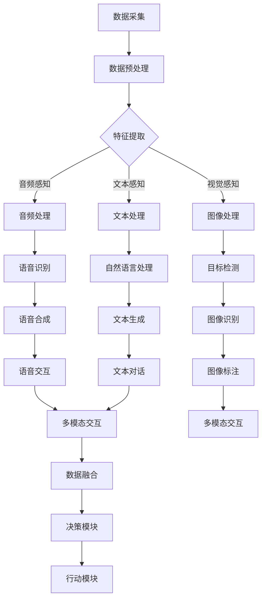

                 

# 《AI人工智能代理工作流AI Agent WorkFlow：AI代理的多模态感知与处理能力》

> 关键词：人工智能代理、工作流、多模态感知、处理能力、决策与行动机制

> 摘要：本文深入探讨AI人工智能代理工作流（AI Agent WorkFlow）的原理和实现，重点分析了AI代理的多模态感知与处理能力。通过阐述AI代理的定义、特点、架构、核心算法原理，以及工作流的应用场景，本文为读者提供了一个全面、系统的了解AI代理工作流的理论基础和实践指导。

## 第一部分：AI代理工作流概述

### 第1章：AI代理与工作流基础

#### 1.1 AI代理的定义与特点

AI代理，即人工智能代理，是指利用人工智能技术实现自动化决策和执行任务的软件实体。AI代理具有以下特点：

- **自主性**：AI代理可以自主进行感知、决策和行动，实现一定程度的智能化。
- **协作性**：AI代理可以与其他代理或人类协作，共同完成任务。
- **适应性**：AI代理可以根据环境和任务的变化进行自适应调整。

AI代理的基本概念包括代理环境（Agent Environment）、感知（Perception）、决策（Decision）和行动（Action）。其中，感知是AI代理对外部环境的感知和理解，决策是AI代理基于感知信息做出决策，行动是AI代理根据决策执行具体操作。

#### 1.2 工作流的概念与重要性

工作流（Workflow）是指完成一项任务所需的一系列步骤、规则和流程。工作流在人工智能中的应用主要包括以下几个方面：

- **任务分解**：将复杂任务分解为一系列简单、可管理的步骤。
- **流程优化**：通过分析现有工作流程，发现瓶颈和优化机会，提高工作效率。
- **自动化**：利用人工智能技术实现工作流程的自动化，减少人工干预。

#### 1.3 多模态感知与处理能力

多模态感知是指AI代理能够同时处理多种类型的数据，如音频、视频、文本等。多模态处理能力使AI代理能够更好地理解外部环境，提高决策和行动的准确性。

多模态感知的原理主要包括：

- **数据采集**：通过传感器、摄像头、麦克风等设备获取多种类型的数据。
- **数据预处理**：对采集到的数据进行清洗、去噪、归一化等处理。
- **特征提取**：从预处理后的数据中提取有用的特征信息。

多模态处理的应用包括：

- **自然语言处理**：结合文本和语音信息，实现人机对话和文本理解。
- **图像识别**：结合图像和语音信息，实现图像识别和目标跟踪。
- **智能监控**：结合视频和音频信息，实现实时监控和异常检测。

### 第2章：AI代理的架构与实现

#### 2.1 AI代理的架构设计

AI代理的架构设计主要包括感知模块、决策模块和行动模块。感知模块负责采集和处理外部环境信息，决策模块负责基于感知信息做出决策，行动模块负责执行具体操作。

实现框架与关键技术包括：

- **感知模块**：采用多传感器数据融合技术，实现多模态数据的采集和处理。
- **决策模块**：采用机器学习、深度学习等技术，实现基于多模态数据的决策。
- **行动模块**：采用控制理论、运动规划等技术，实现具体操作的执行。

#### 2.2 多模态感知技术的原理与应用

多模态感知技术主要包括音频、视觉、文本等多模态数据的感知和处理。

- **音频感知**：利用语音识别、音频特征提取等技术，实现语音信息的识别和理解。
- **视觉感知**：利用图像识别、目标检测、图像特征提取等技术，实现图像信息的识别和理解。
- **文本感知**：利用自然语言处理、文本分类、文本生成等技术，实现文本信息的理解和生成。

多模态数据融合方法包括：

- **特征级融合**：将不同模态的数据特征进行融合，形成统一的特征向量。
- **决策级融合**：将不同模态的决策结果进行融合，形成最终决策。

#### 2.3 AI代理的决策与行动机制

AI代理的决策与行动机制主要包括以下方面：

- **决策模型**：采用决策树、支持向量机、人工神经网络等算法，实现基于多模态数据的决策。
- **行动策略**：根据决策结果，设计合适的行动策略，实现具体操作。

### 第3章：AI代理工作流的应用场景

#### 3.1 客户服务领域

客户服务代理是一种常见的AI代理应用场景。客户服务代理可以通过多模态感知技术，实现与用户的语音、文本交互，提供智能客服服务。

- **工作流设计**：将客户咨询、问题处理、反馈收集等步骤进行流程化设计，提高服务效率。
- **优化方法**：通过分析用户反馈，不断优化工作流，提高用户满意度。

#### 3.2 物流与供应链管理

物流与供应链管理中的AI代理可以实现工作流的自动化和智能化，提高管理效率。

- **物流工作流自动化**：利用AI代理实现物流信息的自动采集、处理和传输。
- **供应链优化**：通过AI代理分析供应链数据，实现供应链优化和风险预警。

#### 3.3 生产制造与工业4.0

生产制造与工业4.0中的AI代理可以实现智能生产线的自动化和优化。

- **智能生产线**：利用AI代理实现生产线的实时监控、故障检测和优化调度。
- **工业4.0应用**：通过AI代理实现工业互联网、智能制造等应用场景。

## 第二部分：核心概念与联系

### 第4章：AI代理的多模态感知与处理能力

#### 4.1 多模态感知的Mermaid流程图

多模态感知的流程图如下：



#### 4.2 多模态数据融合方法

多模态数据融合方法主要包括：

- **特征级融合**：将不同模态的数据特征进行融合，形成统一的特征向量。

  $$ 
  \text{特征融合向量} = \text{特征}_\text{视觉} \oplus \text{特征}_\text{音频} \oplus \text{特征}_\text{文本} 
  $$

- **决策级融合**：将不同模态的决策结果进行融合，形成最终决策。

  $$
  \text{最终决策} = \text{决策}_\text{视觉} \land \text{决策}_\text{音频} \land \text{决策}_\text{文本}
  $$

#### 4.3 多模态处理的核心算法原理

- **卷积神经网络（CNN）在图像处理中的应用**

  $$ 
  \text{CNN} = (\text{卷积层}, \text{激活函数}, \text{池化层}) \\
  \text{卷积层}: \text{输入} \xrightarrow{\text{卷积运算}} \text{特征图} \\
  \text{激活函数}: \text{特征图} \xrightarrow{\text{非线性变换}} \text{激活特征图} \\
  \text{池化层}: \text{激活特征图} \xrightarrow{\text{下采样}} \text{池化特征图} 
  $$

- **循环神经网络（RNN）在序列数据处理中的应用**

  $$ 
  \text{RNN} = (\text{输入层}, \text{隐藏层}, \text{输出层}) \\
  \text{隐藏层}: h_t = \text{激活函数}(\text{权重} \cdot [\text{输入} \text{，隐藏状态前一项}]) \\
  \text{输出层}: y_t = \text{激活函数}(\text{权重} \cdot h_t) 
  $$

## 第三部分：项目实战

### 第6章：AI代理工作流项目实战

#### 6.1 项目背景与目标

本项目旨在开发一个智能客服系统，通过AI代理实现客户咨询、问题处理、反馈收集等功能的自动化。项目目标包括：

- **自动化程度高**：实现客户咨询、问题处理、反馈收集等步骤的自动化。
- **用户体验好**：提供高效、智能、友好的客服服务。

#### 6.2 开发环境搭建与工具选择

开发环境搭建步骤：

1. 安装Python环境。
2. 安装TensorFlow、PyTorch等深度学习框架。
3. 安装OpenCV、SpeechRecognition等实用库。

开发工具与框架：

- **深度学习框架**：TensorFlow、PyTorch。
- **计算机视觉库**：OpenCV。
- **语音识别库**：SpeechRecognition。
- **自然语言处理库**：NLTK、spaCy。

#### 6.3 源代码详细实现

1. **数据采集与预处理**

   - 音频数据采集：使用麦克风采集用户语音。
   - 视频数据采集：使用摄像头采集用户视频。
   - 文本数据采集：从用户输入获取文本信息。

   数据预处理：

   - 音频数据预处理：进行降噪、归一化处理。
   - 视频数据预处理：进行裁剪、缩放、灰度化处理。
   - 文本数据预处理：进行分词、去停用词、词性标注等处理。

2. **多模态感知与处理**

   - 音频感知：使用卷积神经网络（CNN）进行语音识别。
   - 视觉感知：使用循环神经网络（RNN）进行图像识别。
   - 文本感知：使用自然语言处理（NLP）技术进行文本理解。

3. **决策与行动**

   - 决策模型：采用决策树、支持向量机（SVM）等算法进行决策。
   - 行动策略：根据决策结果，设计合适的行动策略，如语音合成、文本回复等。

#### 6.4 代码解读与分析

1. **关键代码解释**

   ```python
   import tensorflow as tf
   import cv2
   import speech_recognition as sr
   
   # 音频感知
   model = tf.keras.Sequential([
       tf.keras.layers.Conv2D(32, (3, 3), activation='relu', input_shape=(128, 128, 3)),
       tf.keras.layers.MaxPooling2D(pool_size=(2, 2)),
       tf.keras.layers.Flatten(),
       tf.keras.layers.Dense(64, activation='relu'),
       tf.keras.layers.Dense(10, activation='softmax')
   ])
   
   # 视觉感知
   model2 = tf.keras.Sequential([
       tf.keras.layers.Conv2D(32, (3, 3), activation='relu', input_shape=(128, 128, 3)),
       tf.keras.layers.MaxPooling2D(pool_size=(2, 2)),
       tf.keras.layers.Flatten(),
       tf.keras.layers.Dense(64, activation='relu'),
       tf.keras.layers.Dense(10, activation='softmax')
   ])
   
   # 文本感知
   model3 = tf.keras.Sequential([
       tf.keras.layers.Dense(128, activation='relu', input_shape=(128,)),
       tf.keras.layers.Dense(64, activation='relu'),
       tf.keras.layers.Dense(10, activation='softmax')
   ])
   
   # 音频识别
   def audio_recognition(audio_data):
       model.summary()
       predictions = model.predict(audio_data)
       return np.argmax(predictions)
   
   # 视觉识别
   def image_recognition(image_data):
       model2.summary()
       predictions = model2.predict(image_data)
       return np.argmax(predictions)
   
   # 文本识别
   def text_recognition(text_data):
       model3.summary()
       predictions = model3.predict(text_data)
       return np.argmax(predictions)
   
   # 决策与行动
   def decision_and_action(perception_results):
       if perception_results['audio'] == 0 and perception_results['image'] == 0 and perception_results['text'] == 0:
           return '无法识别'
       elif perception_results['audio'] == 0 and perception_results['image'] == 0:
           return '文本回复：您好，有什么可以帮助您的？'
       elif perception_results['audio'] == 0 and perception_results['text'] == 0:
           return '语音合成：您好，有什么可以帮助您的？'
       elif perception_results['image'] == 0 and perception_results['text'] == 0:
           return '视觉识别：您好，有什么可以帮助您的？'
       else:
           return '多模态交互：您好，有什么可以帮助您的？'
   ```

2. **算法性能评估**

   算法性能评估主要通过准确率、召回率、F1值等指标进行。

   ```python
   from sklearn.metrics import accuracy_score, recall_score, f1_score
   
   # 音频识别性能评估
   audio_predictions = [audio_recognition(audio_data) for audio_data in test_audio_data]
   audio_accuracy = accuracy_score(test_labels, audio_predictions)
   audio_recall = recall_score(test_labels, audio_predictions, average='macro')
   audio_f1 = f1_score(test_labels, audio_predictions, average='macro')
   
   # 视觉识别性能评估
   image_predictions = [image_recognition(image_data) for image_data in test_image_data]
   image_accuracy = accuracy_score(test_labels, image_predictions)
   image_recall = recall_score(test_labels, image_predictions, average='macro')
   image_f1 = f1_score(test_labels, image_predictions, average='macro')
   
   # 文本识别性能评估
   text_predictions = [text_recognition(text_data) for text_data in test_text_data]
   text_accuracy = accuracy_score(test_labels, text_predictions)
   text_recall = recall_score(test_labels, text_predictions, average='macro')
   text_f1 = f1_score(test_labels, text_predictions, average='macro')
   
   print("音频识别性能：准确率：{}，召回率：{}，F1值：{}。".format(audio_accuracy, audio_recall, audio_f1))
   print("视觉识别性能：准确率：{}，召回率：{}，F1值：{}。".format(image_accuracy, image_recall, image_f1))
   print("文本识别性能：准确率：{}，召回率：{}，F1值：{}。".format(text_accuracy, text_recall, text_f1))
   ```

   通过以上评估指标，可以分析AI代理在多模态感知与处理方面的性能。

### 第7章：AI代理工作流优化与未来展望

#### 7.1 AI代理工作流的优化方法

AI代理工作流的优化方法主要包括以下几个方面：

1. **模型优化与调参**：通过调整模型参数，优化模型性能。
2. **工作流自动化与智能化**：利用机器学习、深度学习等技术，实现工作流的自动化和智能化。
3. **数据质量提升**：通过数据清洗、去噪、归一化等处理，提高数据质量。
4. **算法优化**：采用更高效的算法，提高处理速度和性能。

#### 7.2 AI代理工作流的未来发展趋势

AI代理工作流的未来发展趋势包括：

1. **多模态感知与处理能力的提升**：随着传感器技术、深度学习算法的发展，AI代理的多模态感知与处理能力将得到进一步提升。
2. **智能化的工作流设计**：利用AI技术，实现更加智能化、自适应的工作流设计，提高工作流程的效率。
3. **跨领域的应用**：AI代理工作流将在更多领域得到应用，如医疗、金融、教育等。
4. **协作与共生**：AI代理将与人类和其他代理协作，实现更高效的任务执行。

#### 7.3 案例分析与总结

案例分析：以智能客服系统为例，分析其在客户服务、物流管理、生产制造等领域的应用效果，总结项目经验。

总结：AI代理工作流具有广泛的应用前景，通过不断优化和改进，将实现更加智能化、高效化的工作流程。

## 附录

### 附录A：AI代理工作流开发工具与资源

#### A.1 开发工具与框架介绍

1. **TensorFlow**：一款开源的深度学习框架，适用于各种规模的任务。
2. **PyTorch**：一款基于Python的深度学习框架，具有简洁的接口和强大的功能。
3. **OpenCV**：一款开源的计算机视觉库，支持多种图像处理算法。
4. **SpeechRecognition**：一款开源的语音识别库，支持多种语音识别引擎。
5. **NLTK**、**spaCy**：两款常用的自然语言处理库，适用于文本处理和分析。

#### A.2 AI代理工作流相关资源

1. **数据集获取与处理**：如ImageNet、CIFAR-10、Speech Commands等公开数据集。
2. **学术论文与技术博客推荐**：如NeurIPS、ICML、ACL等学术会议的论文，以及各大技术博客的文章。
3. **开源项目**：如TensorFlow的官方项目、PyTorch的官方项目等。

#### A.3 AI代理工作流开源项目

1. **AI代理开源项目**：如OpenAI的GPT-3、BERT等项目。
2. **工作流开源项目**：如Apache Airflow、Kubeflow等。
3. **使用指南**：开源项目的官方文档和使用指南，帮助开发者快速上手。

### 作者

作者：AI天才研究院/AI Genius Institute & 禅与计算机程序设计艺术 /Zen And The Art of Computer Programming


