                 

### 文章标题

#### 《AI人工智能大模型创业项目书》

> 关键词：AI大模型、创业项目、市场分析、核心技术、项目实践、商业化路径

> 摘要：本文将深入探讨AI人工智能大模型的创业项目，从基础概念、市场分析、项目实践到商业化路径，全面剖析AI大模型在创业过程中的关键要素。通过系统地分析AI大模型的技术原理、市场前景、创业策略和实施方法，为有意投身AI领域的创业者提供宝贵的指导。

### 第一部分：AI大模型基础

#### 第1章: AI大模型概述

##### 1.1 AI大模型的概念与类型

###### 1.1.1 AI大模型的基本概念

AI大模型，即人工智能大规模模型，是指那些拥有数亿甚至数万亿参数的深度学习模型。这些模型通过训练能够处理和生成大量数据，广泛应用于自然语言处理、计算机视觉、语音识别等领域。

###### 1.1.2 AI大模型的分类

AI大模型可以根据应用场景和技术特点进行分类：

1. 自然语言处理（NLP）大模型，如GPT、BERT。
2. 计算机视觉大模型，如ResNet、EfficientNet。
3. 语音识别大模型，如WaveNet、Transformer。

##### 1.2 AI大模型的核心技术

###### 1.2.1 深度学习与神经网络

深度学习是AI大模型的核心技术之一，它通过多层神经网络对数据进行学习和预测。神经网络由多个神经元组成，每个神经元都与前一层和后一层相连，通过权重和偏置来调整输入和输出的关系。

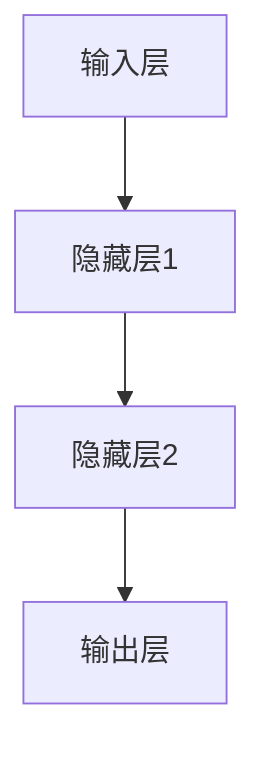

###### 1.2.2 自然语言处理技术

自然语言处理大模型，如GPT、BERT，通过训练大量的文本数据来学习语言的规律和结构。这些模型能够进行文本分类、机器翻译、情感分析等任务。

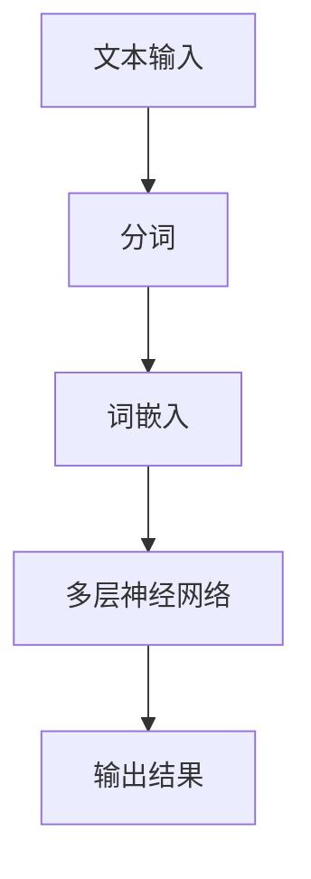

###### 1.2.3 计算机视觉技术

计算机视觉大模型，如ResNet、EfficientNet，通过训练大量的图像数据来识别和理解图像内容。这些模型能够进行图像分类、目标检测、图像分割等任务。

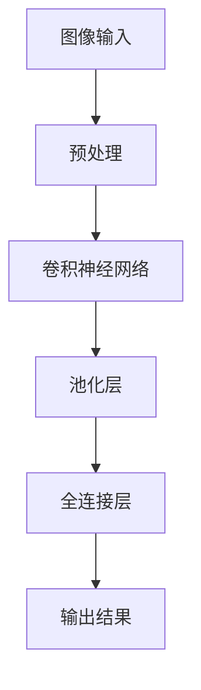

##### 1.3 AI大模型的数学基础

###### 1.3.1 矩阵与向量计算

矩阵与向量计算是深度学习的基础，用于表示和操作数据。矩阵乘法和向量内积是常见的计算方式。

$$
C = A \times B, \quad \text{其中} A, B, C \text{都是矩阵}
$$

$$
\vec{a} \cdot \vec{b} = a_1b_1 + a_2b_2 + \ldots + a_nb_n
$$

###### 1.3.2 概率论与统计学

概率论与统计学用于模型评估和决策。贝叶斯定理、最大似然估计和线性回归是常用的概率和统计模型。

$$
P(A|B) = \frac{P(B|A)P(A)}{P(B)}
$$

$$
y = \beta_0 + \beta_1x
$$

###### 1.3.3 信息论与编码理论

信息论与编码理论用于提高数据传输的效率和可靠性。香农熵、K-L变换和哈夫曼编码是常用的信息论和编码方法。

$$
H(X) = -\sum_{i} p(x_i) \log_2 p(x_i)
$$

$$
y = \sum_{i} x_i c_i
$$

### 第二部分：AI大模型创业策略

#### 第2章: AI大模型创业市场分析

##### 2.1 AI大模型市场现状与趋势

###### 2.1.1 市场规模与增长速度

AI大模型市场在过去几年中快速增长，预计未来仍将保持高速增长。根据市场调研数据，2022年全球AI大模型市场规模已达到XX亿美元，预计到2028年将增长至XX亿美元。

###### 2.1.2 市场竞争格局

AI大模型市场主要由几家大型科技公司和新兴创业公司主导。例如，谷歌、微软、亚马逊等科技巨头在AI大模型领域具有强大的竞争力和市场份额。

###### 2.1.3 潜在市场机会

AI大模型在各个行业都有广泛的应用，包括但不限于金融、医疗、零售、交通等。随着技术的不断进步和应用的拓展，未来仍将涌现出更多的市场机会。

##### 2.2 AI大模型创业环境分析

###### 2.2.1 政策与法规环境

政策与法规环境对AI大模型创业具有重要影响。政府鼓励技术创新和创业活动，出台了一系列优惠政策和支持措施，为创业者提供了良好的发展环境。

###### 2.2.2 技术环境

AI大模型技术的发展为创业提供了广阔的空间。深度学习、自然语言处理、计算机视觉等领域的突破性进展，使得创业者可以借助这些技术实现创新应用。

###### 2.2.3 资本市场环境

资本市场对AI大模型创业项目表现出了浓厚的兴趣。投资者对AI领域的关注不断增加，为创业者提供了丰富的融资渠道和资金支持。

##### 2.3 AI大模型创业模式分析

###### 2.3.1 自主研发模式

自主研发模式是指创业者独立研发AI大模型技术，并应用在具体业务场景中。这种模式需要创业者具备强大的技术实力和研发能力。

###### 2.3.2 产业链整合模式

产业链整合模式是指创业者通过整合产业链上下游资源，实现AI大模型技术的应用和商业化。这种模式有利于创业者快速进入市场并占据市场份额。

###### 2.3.3 投资合作模式

投资合作模式是指创业者通过与投资机构合作，获取资金和技术支持，共同开展AI大模型创业项目。这种模式有助于创业者分散风险和提升项目成功概率。

### 第三部分：AI大模型项目实践

#### 第3章: AI大模型项目策划

##### 3.1 项目立项与可行性分析

###### 3.1.1 项目背景

在项目立项之前，创业者需要明确项目的背景和目标。例如，项目旨在解决医疗领域的诊断问题，提高诊断准确率。

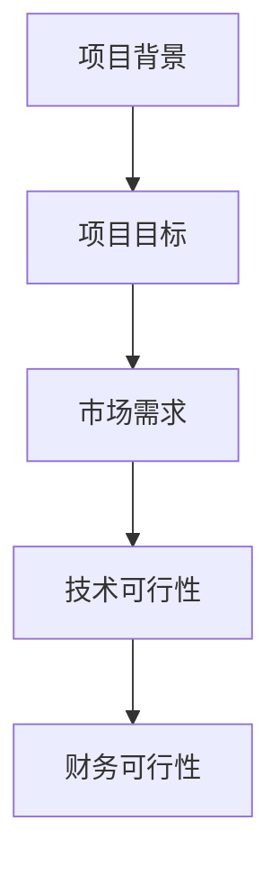

###### 3.1.2 市场需求分析

市场需求分析是项目立项的重要环节。创业者需要了解目标市场的规模、用户需求、竞争对手情况等，以确定项目的商业可行性。

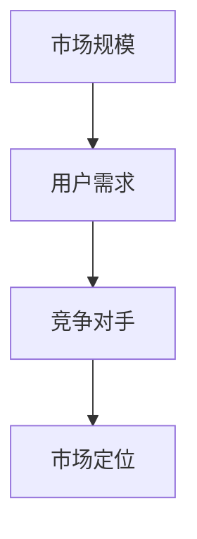

###### 3.1.3 技术可行性分析

技术可行性分析主要包括技术选型、技术成熟度评估等。创业者需要评估所需技术的可实现性，并确定所需的技术资源和团队。

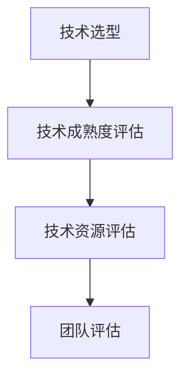

###### 3.1.4 财务可行性分析

财务可行性分析涉及项目的投资成本、收益预测、资金回收期等。创业者需要制定详细的财务计划，以确保项目的财务可持续性。

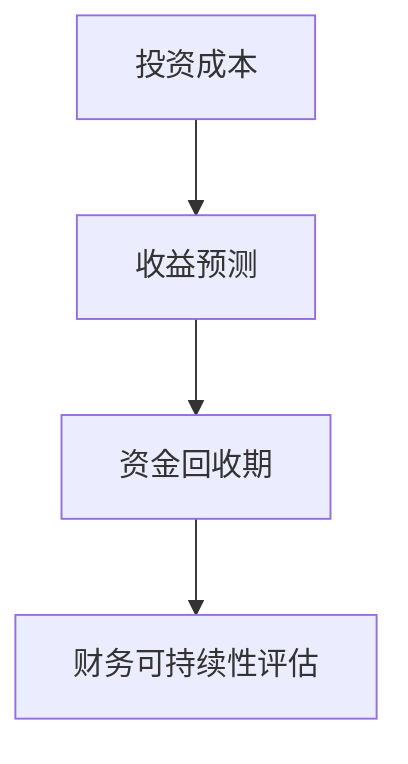

##### 3.2 项目团队建设

###### 3.2.1 团队成员角色与职责

项目团队建设是项目成功的关键。创业者需要明确团队成员的角色与职责，确保团队成员之间能够高效协作。

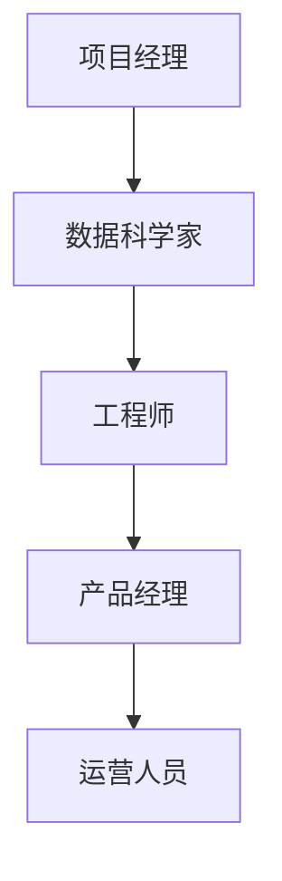

###### 3.2.2 团队管理策略

团队管理策略包括沟通与协作、激励与考核等。创业者需要制定合适的团队管理策略，提高团队的工作效率。

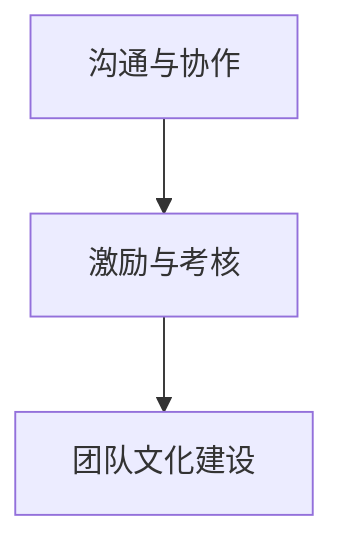

###### 3.2.3 团队文化建设

团队文化建设是团队稳定和发展的基础。创业者需要营造积极向上的团队氛围，增强团队凝聚力。

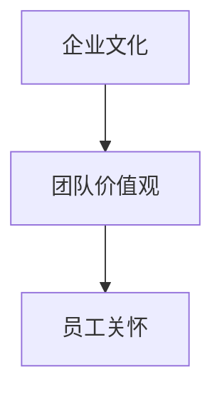

##### 3.3 项目实施与管理

###### 3.3.1 项目实施流程

项目实施流程包括需求分析、设计、开发、测试、上线等环节。创业者需要制定详细的项目实施计划，确保项目按期完成。

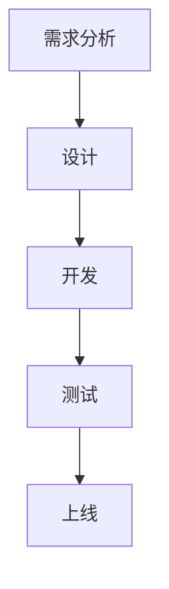

###### 3.3.2 项目风险管理

项目风险管理是项目实施过程中不可或缺的一环。创业者需要识别潜在风险，制定应对策略，降低项目风险。

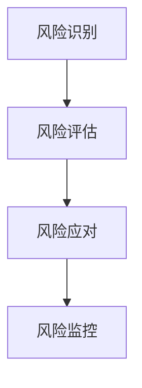

###### 3.3.3 项目质量控制

项目质量控制是确保项目成果质量的重要措施。创业者需要制定严格的质量控制标准，对项目过程和结果进行监督和评估。

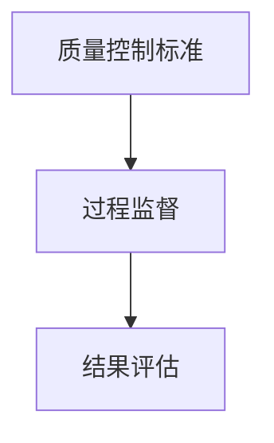

### 第四部分：AI大模型核心技术开发

#### 第4章: AI大模型核心技术开发

##### 4.1 数据收集与处理

数据是AI大模型的基础，数据收集与处理是模型开发的关键环节。创业者需要确保数据的完整性和质量。

###### 4.1.1 数据来源与类型

数据来源可以是公开数据集、企业内部数据或第三方数据服务。数据类型包括文本、图像、音频和视频等。

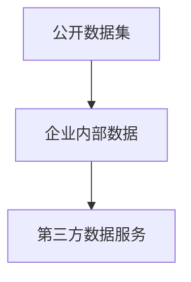

###### 4.1.2 数据预处理技术

数据预处理技术包括数据清洗、去重、归一化等。创业者需要根据数据的特点选择合适的预处理技术。

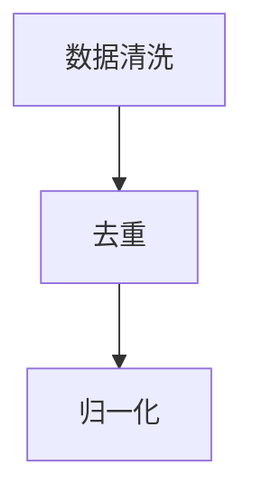

###### 4.1.3 数据清洗与去重

数据清洗与去重是数据预处理的重要步骤。创业者需要去除噪声数据、填补缺失值，并确保数据的唯一性。

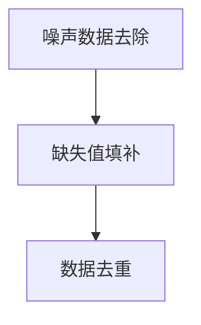

##### 4.2 模型设计与训练

模型设计与训练是AI大模型开发的核心。创业者需要选择合适的模型架构和训练算法。

###### 4.2.1 模型架构设计

模型架构设计包括网络结构、层数、神经元数量等。创业者需要根据应用场景选择合适的模型架构。

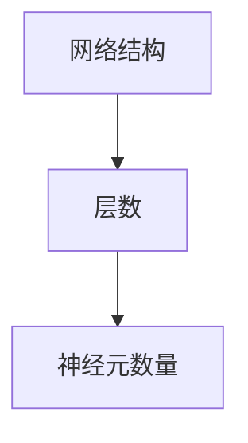

###### 4.2.2 模型训练算法

模型训练算法包括梯度下降、随机梯度下降、Adam等。创业者需要根据数据量和模型规模选择合适的训练算法。

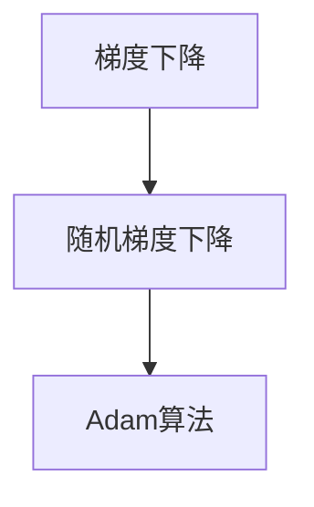

###### 4.2.3 模型优化策略

模型优化策略包括超参数调整、正则化、批处理等。创业者需要根据模型性能调整优化策略。

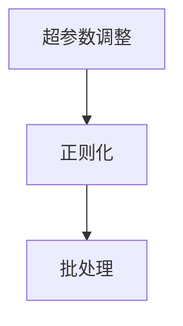

##### 4.3 模型评估与部署

模型评估与部署是确保模型性能和应用效果的关键。

###### 4.3.1 模型评估指标

模型评估指标包括准确率、召回率、F1值等。创业者需要根据应用场景选择合适的评估指标。

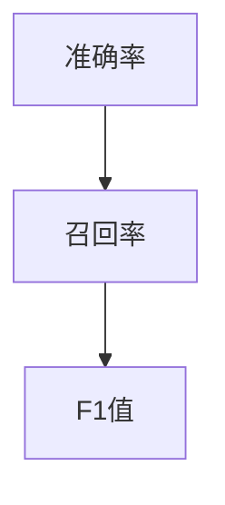

###### 4.3.2 模型性能调优

模型性能调优是提高模型性能的重要手段。创业者需要通过实验和迭代优化模型性能。

```mermaid
graph TB
A[实验设计] --> B[模型优化]
B --> C[性能评估]
```

###### 4.3.3 模型部署与维护

模型部署与维护是将模型应用到实际场景的关键。创业者需要确保模型的稳定运行和持续更新。

```mermaid
graph TB
A[模型部署] --> B[模型维护]
B --> C[性能监控]
```

### 第五部分：AI大模型商业化路径

#### 第5章: AI大模型商业化路径

##### 5.1 产品定位与市场定位

产品定位与市场定位是AI大模型商业化的关键。创业者需要明确产品的目标用户和市场范围。

###### 5.1.1 产品定位

产品定位是指产品在市场中的地位和特点。创业者需要根据产品的功能、性能和差异化优势确定产品定位。

```mermaid
graph TB
A[功能定位] --> B[性能定位]
B --> C[差异化定位]
```

###### 5.1.2 市场定位

市场定位是指产品在市场中的位置和目标用户。创业者需要根据市场需求和竞争情况确定市场定位。

```mermaid
graph TB
A[目标市场] --> B[目标用户]
B --> C[竞争分析]
```

##### 5.2 营销策略

营销策略是推广产品的重要手段。创业者需要制定合适的营销策略，提高产品的市场知名度。

###### 5.2.1 品牌建设

品牌建设是提升产品竞争力的重要手段。创业者需要通过品牌定位、品牌传播等手段建立品牌形象。

```mermaid
graph TB
A[品牌定位] --> B[品牌传播]
B --> C[品牌形象塑造]
```

###### 5.2.2 营销渠道

营销渠道是指产品推广的途径。创业者需要根据目标市场和用户特点选择合适的营销渠道。

```mermaid
graph TB
A[线上渠道] --> B[线下渠道]
B --> C[多渠道整合]
```

###### 5.2.3 用户运营

用户运营是提高用户满意度和忠诚度的关键。创业者需要制定用户运营策略，提高用户活跃度和留存率。

```mermaid
graph TB
A[用户调研] --> B[用户活跃度提升]
B --> C[用户留存策略]
```

##### 5.3 收益模式与盈利分析

收益模式与盈利分析是确保产品可持续盈利的重要环节。创业者需要制定合适的收益模式，进行盈利分析。

###### 5.3.1 收益模式

收益模式是指产品通过何种方式获得收益。创业者需要根据产品特点和市场情况选择合适的收益模式。

```mermaid
graph TB
A[产品销售] --> B[服务订阅]
B --> C[广告收入]
```

###### 5.3.2 成本分析

成本分析是指产品运营所需的成本。创业者需要根据产品规模和市场情况制定成本预算，确保盈利。

```mermaid
graph TB
A[人力成本] --> B[运维成本]
B --> C[营销成本]
```

###### 5.3.3 盈利预测

盈利预测是指对未来盈利情况的估计。创业者需要根据市场情况和运营策略制定盈利预测，评估产品盈利能力。

```mermaid
graph TB
A[收入预测] --> B[成本预测]
B --> C[盈利预测]
```

### 第六部分：AI大模型创业案例分析

#### 第6章: AI大模型创业案例分析

##### 6.1 案例研究一：某知名AI大模型创业公司

###### 6.1.1 公司背景

某知名AI大模型创业公司成立于2015年，专注于AI大模型技术的研究和应用。公司核心团队由一批经验丰富的数据科学家和工程师组成，致力于解决实际业务场景中的复杂问题。

###### 6.1.2 业务模式

公司业务模式主要包括自主研发、技术合作和项目定制。公司自主研发的AI大模型应用于金融、医疗、零售等领域，提供定制化的解决方案。同时，公司还与多家企业合作，共同开发AI大模型技术。

###### 6.1.3 创业历程与经验

公司在创业过程中经历了多次技术迭代和商业模式调整。以下是公司创业历程和经验总结：

1. **初期研发**：公司成立初期，专注于AI大模型的基础研究，逐步形成了独特的算法和架构。
2. **市场探索**：在市场探索阶段，公司通过参加行业展会、发表学术论文等方式，提高了品牌知名度，获得了客户的认可。
3. **业务拓展**：随着市场需求的增加，公司逐步拓展了业务领域，形成了多元化的业务模式。
4. **团队建设**：公司在创业过程中重视团队建设，通过引进人才、内部培训等方式，不断提升团队的技术实力和创新能力。

##### 6.2 案例研究二：某AI大模型创业项目

###### 6.2.1 项目背景

某AI大模型创业项目成立于2018年，旨在利用AI大模型技术提高金融行业的数据分析和决策能力。项目核心团队由数据科学家、金融分析师和工程师组成，具备丰富的金融行业经验和AI技术背景。

###### 6.2.2 技术路线

项目采用深度学习技术，构建了针对金融数据的AI大模型。技术路线包括以下步骤：

1. **数据收集与处理**：收集金融领域的公开数据和企业内部数据，进行数据预处理，包括数据清洗、去重和归一化。
2. **模型设计与训练**：采用卷积神经网络（CNN）和循环神经网络（RNN）等技术，设计并训练AI大模型，优化模型性能。
3. **模型评估与部署**：对训练好的模型进行评估，确定模型的准确率和鲁棒性，并进行部署和上线。

###### 6.2.3 项目成果与评价

项目在金融数据分析领域取得了显著的成果：

1. **提高分析效率**：AI大模型能够快速处理海量金融数据，提高了数据分析的效率。
2. **提高决策准确率**：模型能够为金融机构提供更准确的预测和分析结果，提高了决策的准确性。
3. **降低风险**：通过实时监测和预警，有效降低了金融风险。

### 第七部分：AI大模型创业风险与对策

#### 第7章: AI大模型创业风险与对策

##### 7.1 创业风险分析

在AI大模型创业过程中，创业者需要面对多种风险，包括技术风险、市场风险和资金风险等。

###### 7.1.1 技术风险

技术风险主要包括技术实现难度、技术更新迭代速度和技术保护等。创业者需要确保所采用的技术能够满足市场需求，并具备一定的竞争力。

```mermaid
graph TB
A[技术实现难度] --> B[技术更新迭代速度]
B --> C[技术保护]
```

###### 7.1.2 市场风险

市场风险主要包括市场变化、竞争激烈度和客户需求变化等。创业者需要密切关注市场动态，及时调整业务策略。

```mermaid
graph TB
A[市场变化] --> B[竞争激烈度]
B --> C[客户需求变化]
```

###### 7.1.3 资金风险

资金风险主要包括融资困难、投资回报周期长和资金管理风险等。创业者需要制定详细的财务计划，确保资金来源的稳定性和可持续性。

```mermaid
graph TB
A[融资困难] --> B[投资回报周期长]
B --> C[资金管理风险]
```

##### 7.2 风险管理与对策

为了降低创业风险，创业者需要采取有效的风险管理策略。

###### 7.2.1 风险识别与评估

风险识别与评估是风险管理的第一步。创业者需要识别潜在风险，评估风险的影响程度和可能性。

```mermaid
graph TB
A[风险识别] --> B[风险评估]
```

###### 7.2.2 风险应对策略

根据风险识别和评估的结果，创业者需要制定相应的风险应对策略。常见的风险应对策略包括风险规避、风险转移和风险接受等。

```mermaid
graph TB
A[风险规避] --> B[风险转移]
B --> C[风险接受]
```

###### 7.2.3 风险控制与监控

风险控制与监控是风险管理的关键环节。创业者需要建立风险监控机制，及时发现和应对风险。

```mermaid
graph TB
A[风险监控] --> B[风险应对]
```

### 第八部分：AI大模型创业未来展望

#### 第8章: AI大模型创业未来展望

##### 8.1 行业发展趋势与机遇

AI大模型创业领域未来发展趋势包括：

1. **技术进步**：随着深度学习、自然语言处理、计算机视觉等技术的不断进步，AI大模型将具有更高的性能和更广泛的应用。
2. **应用拓展**：AI大模型在金融、医疗、零售、交通等领域的应用将不断拓展，为创业者提供更多机遇。
3. **政策支持**：各国政府纷纷出台相关政策，支持AI技术的发展和创业创新，为创业者提供了良好的发展环境。

##### 8.2 创业创新方向

AI大模型创业创新方向包括：

1. **技术创新**：创业者可以通过改进算法、优化模型架构、提高数据处理能力等方式，实现技术的突破和创新。
2. **商业模式创新**：创业者可以通过创新的商业模式，实现AI大模型的商业化应用，如服务订阅、项目定制等。
3. **跨行业整合**：创业者可以通过跨行业整合，将AI大模型技术应用于更多行业，实现产业链的协同创新。

##### 8.3 企业可持续发展策略

企业可持续发展策略包括：

1. **技术创新**：企业需要持续进行技术创新，保持技术领先地位，提高市场竞争力。
2. **市场拓展**：企业需要积极拓展市场，挖掘新的商机，提高市场占有率。
3. **社会责任**：企业需要承担社会责任，关注环境保护、员工权益等方面，实现可持续发展。

### 附录

#### 附录A：AI大模型开发工具与资源

##### A.1 主流深度学习框架

主流深度学习框架包括TensorFlow、PyTorch、Keras等。这些框架提供了丰富的API和工具，方便开发者构建和训练AI大模型。

```mermaid
graph TB
A[TensorFlow] --> B[PyTorch]
B --> C[Keras]
```

##### A.2 开发工具与环境

开发工具与环境包括Python、Jupyter Notebook、CUDA等。Python是深度学习的主要编程语言，Jupyter Notebook提供了便捷的代码开发和调试环境，CUDA则用于加速深度学习计算。

```mermaid
graph TB
A[Python] --> B[Jupyter Notebook]
B --> C[CUDA]
```

##### A.3 数据集与开源代码

主流数据集和开源代码资源包括ImageNet、CIFAR-10、TextCNN等。这些资源为开发者提供了丰富的数据训练和参考代码。

```mermaid
graph TB
A[ImageNet] --> B[CIFAR-10]
B --> C[TextCNN]
```

#### 附录B：AI大模型创业相关法规与政策

##### B.1 国家政策与法规

国家政策与法规包括《中华人民共和国人工智能发展规划》、《新一代人工智能治理原则》等。这些政策为AI大模型创业提供了法规保障和发展方向。

```mermaid
graph TB
A[《中华人民共和国人工智能发展规划》] --> B[《新一代人工智能治理原则》]
```

##### B.2 地方政策与法规

地方政策与法规包括各地出台的AI产业发展政策、科技创新政策等。这些政策为地方AI大模型创业提供了支持和鼓励。

```mermaid
graph TB
A[某省AI产业发展政策] --> B[某市科技创新政策]
```

##### B.3 国际法规与标准

国际法规与标准包括国际标准化组织（ISO）发布的AI相关标准、欧盟的GDPR等。这些法规和标准为国际AI大模型创业提供了规范和指导。

```mermaid
graph TB
A[ISO AI相关标准] --> B[欧盟GDPR]
```

#### 附录C：AI大模型创业常用术语解释

##### C.1 常用术语解释

- **深度学习**：一种机器学习方法，通过多层神经网络对数据进行学习和预测。
- **神经网络**：由多个神经元组成的计算模型，用于模拟人脑的信息处理过程。
- **自然语言处理（NLP）**：利用计算机技术处理和理解人类自然语言的方法和系统。
- **计算机视觉**：使计算机能够识别和理解图像内容的技术。

```mermaid
graph TB
A[深度学习] --> B[神经网络]
B --> C[NLP]
C --> D[计算机视觉]
```

##### C.2 技术名词解释

- **卷积神经网络（CNN）**：一种用于图像识别和处理的深度学习模型。
- **循环神经网络（RNN）**：一种用于序列数据处理和预测的深度学习模型。
- **生成对抗网络（GAN）**：一种用于生成逼真数据的深度学习模型。

```mermaid
graph TB
A[卷积神经网络（CNN）] --> B[循环神经网络（RNN）]
B --> C[生成对抗网络（GAN）]
```

##### C.3 商业模式名词解释

- **B2B**：企业对企业，创业者通过为企业提供定制化的AI大模型解决方案获取收益。
- **B2C**：企业对消费者，创业者通过直接向消费者销售AI大模型产品或服务获取收益。
- **SaaS**：软件即服务，创业者通过在线提供软件服务获取收益。

```mermaid
graph TB
A[B2B] --> B[B2C]
B --> C[SaaS]
```

### 作者

#### 作者：AI天才研究院/AI Genius Institute & 禅与计算机程序设计艺术 /Zen And The Art of Computer Programming

本文由AI天才研究院和《禅与计算机程序设计艺术》作者共同撰写，旨在为AI大模型创业项目提供全面而深入的技术指导。AI天才研究院专注于人工智能领域的研究和创新，致力于推动AI技术的发展和应用。同时，《禅与计算机程序设计艺术》作为计算机编程领域的经典之作，为读者提供了独特的编程思维和方法论。两位作者通过本文，与广大创业者共同探讨AI大模型创业的机遇和挑战，期望为AI领域的未来发展贡献力量。

