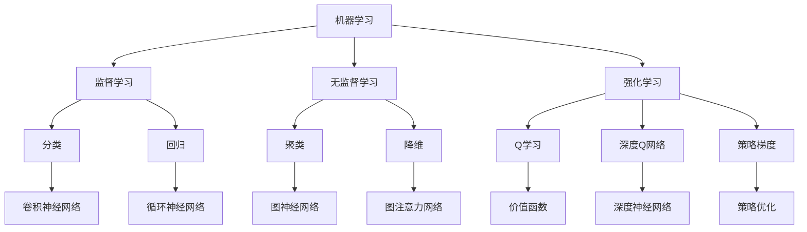

                 

### 文章标题: AI人工智能核心算法原理与代码实例讲解：模型部署

人工智能（AI）已成为当今科技领域的热点，它通过模拟人类智能行为，实现了包括图像识别、自然语言处理、智能决策等众多应用。本文将深入探讨AI的核心算法原理，并通过代码实例讲解模型部署的各个方面。无论是AI新手还是专业人士，都能从本文中获得宝贵的技术见解和实战经验。

> 关键词：人工智能、核心算法、深度学习、模型部署、代码实例

摘要：
本文旨在为读者提供一次全面的人工智能之旅。从基础概念到高级算法，从理论讲解到代码实现，本文将逐步剖析AI的核心技术和模型部署策略。通过深入探讨神经网络、卷积神经网络、循环神经网络等核心算法，并结合实际项目案例分析，读者将不仅能够理解AI的工作原理，还能掌握如何将AI模型成功部署到实际应用中。

### 目录

#### 第一部分: AI人工智能基础知识

1.1 AI人工智能概述
1.2 人工智能的核心概念与联系
1.3 数据预处理与特征提取
1.4 数学模型和数学公式
1.5 人工智能编程基础

#### 第二部分: AI核心算法原理讲解

2.1 神经网络与深度学习基础
2.2 卷积神经网络(CNN)原理与实现
2.3 循环神经网络(RNN)与长短期记忆(LSTM)网络
2.4 生成对抗网络(GAN)原理与实现
2.5 聚类算法与降维技术

#### 第三部分: AI模型部署与优化

3.1 模型部署基础
3.2 模型部署实战
3.3 模型监控与维护
3.4 模型部署工具介绍

#### 第四部分: 项目实战与案例分析

4.1 项目一：基于CNN的手写数字识别系统
4.2 项目二：基于LSTM的股票价格预测系统
4.3 项目三：基于GAN的图像生成系统

#### 第五部分: AI伦理与未来展望

5.1 AI伦理与法律法规
5.2 AI技术发展趋势与未来展望
5.3 AI安全与隐私保护

#### 附录

A. AI工具与资源
B. 数学公式与符号表
C. 模型部署常用工具与环境搭建

---

接下来，我们将逐步进入AI的各个领域，探索其核心原理和实际部署策略。让我们开始这一段精彩的AI旅程吧！

---

### 第一部分: AI人工智能基础知识

在深入探讨AI的核心算法和模型部署之前，了解AI的基础知识是非常重要的。这一部分将为我们提供AI的概述、核心概念、数据预处理、数学模型以及编程基础，这些是理解和应用AI技术的基石。

#### 1.1 AI人工智能概述

人工智能，简称AI，是指通过计算机模拟、延伸和扩展人类智能的理论、方法、技术及应用。AI的研究涵盖了多个领域，包括机器学习、深度学习、自然语言处理、计算机视觉等。AI的目的是使计算机能够执行通常需要人类智能才能完成的任务。

##### 1.1.1 AI的定义与分类

AI可以大致分为以下几类：

- **弱AI（弱人工智能）**：特定领域的人工智能，如语音识别、图像识别等，这些系统在特定任务上表现出智能，但缺乏跨领域的通用智能。

- **强AI（强人工智能）**：具备人类智能的计算机系统，能够理解、学习、推理并解决各种复杂问题，目前尚未实现。

- **人工通用智能（AGI）**：能够在各种领域表现出人类水平的智能，目前仍处于研究阶段。

##### 1.1.2 AI在现实世界中的应用场景

AI已经在多个领域得到了广泛应用：

- **医疗健康**：辅助诊断、个性化治疗、药物研发等。

- **工业制造**：自动化生产线、预测维护、质量检测等。

- **金融服务**：智能投顾、风险评估、反欺诈系统等。

- **交通出行**：自动驾驶、智能交通系统、路况预测等。

- **智能家居**：语音助手、安防监控、智能家电等。

##### 1.1.3 AI的发展历程

AI的研究起源于20世纪50年代，经历了几个重要阶段：

- **初始阶段（1950-1969）**：人工智能的概念被提出，早期算法如逻辑推理和决策树被开发。

- **繁荣阶段（1970-1989）**：机器学习初步发展，专家系统取得重要进展。

- **低谷阶段（1990-2000）**：由于算法和计算能力的限制，AI研究进入低谷。

- **复兴阶段（2000至今）**：随着大数据、云计算和深度学习的兴起，AI迎来了新的发展机遇。

#### 1.2 人工智能的核心概念与联系

理解AI的核心概念对于深入探讨其技术细节至关重要。以下是一些重要的AI核心概念及其联系：

##### 1.2.1 机器学习

机器学习是AI的一个分支，它通过算法使计算机能够从数据中学习，并做出预测或决策。主要方法包括监督学习、无监督学习和强化学习。

- **监督学习**：通过标注数据进行学习，如分类和回归任务。

- **无监督学习**：没有标注数据，如聚类和降维。

- **强化学习**：通过与环境的交互进行学习，如游戏AI和机器人控制。

##### 1.2.2 深度学习

深度学习是机器学习的一个分支，通过多层神经网络进行学习。它能够自动从大量数据中提取特征，并在图像识别、语音识别等领域取得了显著的进展。

- **卷积神经网络（CNN）**：用于图像识别和处理。

- **循环神经网络（RNN）**和**长短期记忆（LSTM）网络**：用于序列数据的学习和处理，如自然语言处理和时间序列预测。

- **生成对抗网络（GAN）**：用于生成复杂数据，如图像和文本。

##### 1.2.3 强化学习

强化学习通过奖励和惩罚机制来指导算法的学习。它适用于需要决策的场景，如自动驾驶和游戏AI。

- **Q学习**：通过价值函数进行学习。

- **深度Q网络（DQN）**：结合深度学习和强化学习。

- **策略梯度方法**：直接优化策略。

##### 1.2.4 图神经网络

图神经网络用于处理图结构数据，如社交网络、知识图谱等。它能够捕捉节点之间的复杂关系。

- **图卷积网络（GCN）**：用于节点的分类和预测。

- **图注意力网络（GAT）**：用于更复杂的图结构处理。

- **图生成网络（GGN）**：用于生成新的图结构。

##### 1.2.5 Mermaid流程图：人工智能核心概念关系

以下是AI核心概念的Mermaid流程图，它展示了机器学习、深度学习、强化学习和图神经网络之间的关系：



#### 1.3 数据预处理与特征提取

数据预处理和特征提取是机器学习的重要环节，它们直接影响模型的性能和效率。以下是一些关键步骤：

##### 1.3.1 数据清洗

数据清洗是指处理缺失值、异常值和重复值等不干净的数据。常见方法包括：

- **缺失值填充**：使用平均值、中位数或插值法进行填充。

- **异常值处理**：使用统计方法或基于规则的策略进行识别和处理。

- **重复值去除**：通过唯一标识或合并重复记录进行去除。

##### 1.3.2 数据归一化

数据归一化是指将数据缩放到相同的尺度，以消除不同特征之间的量纲影响。常见方法包括：

- **最小-最大缩放**：将数据缩放到[0, 1]之间。

- **标准缩放**：将数据缩放到均值±3倍标准差之间。

##### 1.3.3 特征选择与提取

特征选择和提取是指从原始数据中提取出对模型性能有显著影响的特征。常见方法包括：

- **过滤法**：基于统计方法或相关性分析进行特征选择。

- **包装法**：结合模型训练进行特征选择，常用的方法包括向前选择、向后选择和递归特征消除。

- **嵌入法**：在训练过程中自动学习特征表示，如主成分分析（PCA）和自动编码器。

##### 1.3.4 特征工程技巧与策略

特征工程是提升模型性能的关键步骤，以下是一些常用的技巧和策略：

- **特征组合**：通过组合原始特征创建新的特征。

- **特征变换**：如对数变换、平方根变换等，以改变特征分布。

- **特征缩放**：确保所有特征具有相似的尺度。

#### 1.4 数学模型和数学公式

机器学习和深度学习依赖于各种数学模型和公式，以下是一些基本的数学模型和公式，以及它们的详细讲解和举例说明。

##### 1.4.1 矩阵与向量计算

矩阵和向量是数学中的基础概念，在AI中广泛使用。以下是一些基本的矩阵和向量计算：

- **矩阵加法**：两个矩阵对应元素相加。
$$
C = A + B
$$

- **矩阵乘法**：两个矩阵的对应元素相乘，并对结果进行求和。
$$
C = AB
$$

- **向量点积**：两个向量的对应元素相乘，并对结果进行求和。
$$
\vec{a} \cdot \vec{b} = a_1b_1 + a_2b_2 + \ldots + a_nb_n
$$

- **向量叉积**：用于三维空间中两个向量的叉积。
$$
\vec{c} = \vec{a} \times \vec{b}
$$

##### 1.4.2 梯度下降法

梯度下降法是机器学习中最常用的优化方法之一，用于求解最小化损失函数的问题。以下是其基本原理和公式：

- **梯度下降**：沿着损失函数的负梯度方向更新参数。
$$
\theta = \theta - \alpha \cdot \nabla_{\theta}J(\theta)
$$

- **学习率（步长）**：决定梯度下降过程中的更新幅度。
$$
\alpha \text{（0, 1之间的小数）}
$$

- **批量梯度下降**：使用整个训练集进行参数更新。
$$
\theta = \theta - \alpha \cdot \frac{1}{m}\sum_{i=1}^{m} \nabla_{\theta}J(\theta^{(i)})
$$

- **随机梯度下降（SGD）**：使用单个训练样本进行参数更新。
$$
\theta = \theta - \alpha \cdot \nabla_{\theta}J(\theta^{(i)})
$$

##### 1.4.3 损失函数与优化算法

损失函数用于衡量模型预测值与真实值之间的差距。以下是一些常用的损失函数：

- **均方误差（MSE）**：
$$
MSE = \frac{1}{2}\sum_{i=1}^{m}(y_i - \hat{y}_i)^2
$$

- **交叉熵损失（Cross-Entropy Loss）**：
$$
CE = -\frac{1}{m}\sum_{i=1}^{m}y^{(i)}\log(a^{(i)})
$$

优化算法用于最小化损失函数。以下是一些常用的优化算法：

- **批量梯度下降**：
  - 优点：收敛速度慢，但稳定。
  - 缺点：计算量大，适用于数据量较小的场景。

- **随机梯度下降（SGD）**：
  - 优点：收敛速度快，适合大数据量。
  - 缺点：容易陷入局部最小值。

- **Adam优化器**：
  - 优点：结合了SGD和动量方法，收敛速度快，稳定性好。
  - 缺点：对参数调整较为敏感。

##### 1.4.4 数学公式详细讲解与举例说明

以下是几个具体的数学公式的详细讲解和举例说明：

- **矩阵求导**：
  - 假设 \( f(\mathbf{x}) = \mathbf{A}\mathbf{x} \)，其中 \(\mathbf{A}\) 是一个矩阵，\(\mathbf{x}\) 是一个向量。
  - 梯度 \(\nabla_{\mathbf{x}}f(\mathbf{x}) = \mathbf{A}\)。
  - 举例：设 \( \mathbf{A} = \begin{bmatrix} 1 & 2 \\ 3 & 4 \end{bmatrix} \)，\( \mathbf{x} = \begin{bmatrix} x_1 \\ x_2 \end{bmatrix} \)，则梯度为 \( \nabla_{\mathbf{x}}f(\mathbf{x}) = \begin{bmatrix} 1 & 2 \\ 3 & 4 \end{bmatrix} \)。

- **向量求导**：
  - 假设 \( f(\mathbf{x}) = \mathbf{A}\mathbf{x} + b \)，其中 \(\mathbf{A}\) 是一个矩阵，\(\mathbf{x}\) 是一个向量，\(b\) 是一个标量。
  - 梯度 \(\nabla_{\mathbf{x}}f(\mathbf{x}) = \mathbf{A}\)。
  - 举例：设 \( \mathbf{A} = \begin{bmatrix} 1 & 2 \\ 3 & 4 \end{bmatrix} \)，\( \mathbf{x} = \begin{bmatrix} x_1 \\ x_2 \end{bmatrix} \)，则梯度为 \( \nabla_{\mathbf{x}}f(\mathbf{x}) = \begin{bmatrix} 1 & 2 \\ 3 & 4 \end{bmatrix} \)。

- **神经网络损失函数**：
  - 假设有一个两层神经网络，输出层为 \( \hat{y} = \sigma(\mathbf{W}^T\mathbf{z} + b) \)，其中 \(\sigma\) 是激活函数，\( \mathbf{W} \) 是权重矩阵，\( \mathbf{z} \) 是输入特征向量，\( b \) 是偏置。
  - 损失函数为 \( J(\theta) = -\frac{1}{m}\sum_{i=1}^{m}y^{(i)}\log(\hat{y}^{(i)}) \)。
  - 举例：设 \( \mathbf{W} = \begin{bmatrix} 1 & 2 \\ 3 & 4 \end{bmatrix} \)，\( \mathbf{z} = \begin{bmatrix} 1 \\ 2 \end{bmatrix} \)，\( y^{(i)} = 0 \)，则损失函数为 \( J(\theta) = -\frac{1}{m}\sum_{i=1}^{m}0\log(\sigma(\mathbf{W}^T\mathbf{z} + b)) \)。

通过以上讲解，我们可以更好地理解AI中的数学模型和公式，为后续的算法讲解和实战应用打下基础。

#### 1.5 人工智能编程基础

编程是实现AI技术的关键，以下将介绍Python编程基础、常用的AI库以及TensorFlow与PyTorch框架基础。

##### 1.5.1 Python编程基础

Python因其简洁易读的语法和丰富的库支持，成为AI开发的主要语言之一。以下是一些Python编程基础：

- **变量和类型**：Python中的变量不需要显式声明类型，自动推断。
  - 示例：`x = 10`，`y = "hello"`

- **数据结构**：Python支持多种数据结构，包括列表、元组、字典和集合。
  - **列表**：用于存储有序元素，可动态调整大小。
    ```python
    list1 = [1, 2, 3, 4]
    list1.append(5)
    ```
  - **元组**：不可变序列，用于存储固定元素。
    ```python
    tuple1 = (1, 2, 3, 4)
    ```
  - **字典**：用于存储键值对。
    ```python
    dict1 = {"name": "Alice", "age": 30}
    ```
  - **集合**：用于存储无序、不重复的元素。
    ```python
    set1 = {1, 2, 3, 4, 5}
    ```

- **控制结构**：Python提供了多种控制结构，包括条件语句和循环。
  - **条件语句**：
    ```python
    if x > 0:
        print("x is positive")
    elif x == 0:
        print("x is zero")
    else:
        print("x is negative")
    ```
  - **循环**：
    ```python
    for i in range(5):
        print(i)
    ```

- **函数**：Python中的函数使用`def`关键字定义。
  ```python
  def greet(name):
      return "Hello, " + name
  
  print(greet("Alice"))
  ```

- **模块和包**：Python使用模块和包来组织代码。
  ```python
  import math
  print(math.sqrt(16))
  ```

##### 1.5.2 Scikit-learn库介绍

Scikit-learn是一个基于Python的机器学习库，提供了广泛的机器学习算法和工具。以下是其主要特点：

- **算法支持**：包括分类、回归、聚类、降维等。
- **数据预处理**：包括数据归一化、缺失值处理、特征选择等。
- **评估方法**：包括交叉验证、模型评分、性能比较等。

##### 1.5.3 TensorFlow与PyTorch框架基础

TensorFlow和PyTorch是两个广泛使用的深度学习框架，它们为AI开发提供了强大的工具。

- **TensorFlow**：由Google开发，具有高度灵活性和可扩展性。
  - **安装**：
    ```bash
    pip install tensorflow
    ```
  - **基本使用**：
    ```python
    import tensorflow as tf
    x = tf.constant([1, 2, 3, 4])
    y = tf.constant([2, 3, 4, 5])
    z = x + y
    print(z.numpy())
    ```

- **PyTorch**：由Facebook开发，具有动态计算图和简洁的API。
  - **安装**：
    ```bash
    pip install torch torchvision
    ```
  - **基本使用**：
    ```python
    import torch
    x = torch.tensor([1.0, 2.0, 3.0, 4.0])
    y = torch.tensor([2.0, 3.0, 4.0, 5.0])
    z = x + y
    print(z)
    ```

通过以上基础介绍，读者可以为后续的AI算法学习和实战应用做好准备。

### 第二部分: AI核心算法原理讲解

在了解了AI的基础知识后，我们将进一步探讨AI的核心算法原理。本部分将详细介绍神经网络与深度学习基础、卷积神经网络（CNN）原理与实现、循环神经网络（RNN）与长短期记忆（LSTM）网络、生成对抗网络（GAN）原理与实现，以及聚类算法与降维技术。这些算法构成了现代AI技术的核心，是理解和应用AI的关键。

#### 2.1 神经网络与深度学习基础

神经网络是模拟人脑神经元工作原理的计算模型，深度学习则是神经网络在多个隐藏层上的应用。以下将介绍神经网络的基本结构、深度学习算法以及神经网络训练过程的伪代码。

##### 2.1.1 神经网络结构

神经网络由多个层次组成，包括输入层、隐藏层和输出层。每个层次由多个神经元（或节点）组成，神经元之间通过权重和偏置进行连接。

- **输入层**：接收外部输入数据，每个神经元对应一个输入特征。

- **隐藏层**：对输入数据进行处理，提取特征，每层由多个神经元组成。

- **输出层**：产生最终输出，用于分类、回归等任务。

##### 2.1.2 深度学习算法

深度学习通过多层神经网络进行学习，以下是几种常见的深度学习算法：

- **前向传播**：将输入数据通过网络层传递，计算每个神经元的输出。

- **反向传播**：根据预测误差，计算梯度并更新网络权重和偏置。

- **激活函数**：用于引入非线性变换，常见的有Sigmoid、ReLU、Tanh等。

##### 2.1.3 伪代码讲解：神经网络训练过程

以下是神经网络训练过程的伪代码，展示了输入数据通过网络层传递、计算损失函数和更新参数的过程。

```python
# 初始化网络参数（权重和偏置）
W = [初始化权重矩阵]
b = [初始化偏置向量]

# 循环迭代
for epoch in 1 to num_epochs:
    for each input data (x, y) in training dataset:
        # 前向传播
        z = x * W + b
        a = activation(z)
        
        # 计算损失函数
        L = loss(y, a)
        
        # 反向传播
        dL_da = activation_derivative(a)
        dL_dz = [计算损失函数对z的偏导数]
        dL_dW = x.T * dL_da
        dL_db = 1 * dL_da
        
        # 更新参数
        W = W - learning_rate * dL_dW
        b = b - learning_rate * dL_db
```

在上述伪代码中，`activation`表示激活函数，`activation_derivative`表示激活函数的导数，`loss`表示损失函数。

##### 2.1.4 神经网络反向传播算法

神经网络反向传播算法是训练神经网络的关键步骤，它通过前向传播计算输出，然后反向传播计算损失，并更新网络参数。以下是反向传播算法的详细步骤：

1. **前向传播**：输入数据通过网络，计算每个神经元的输出值。

2. **计算误差**：计算输出值与实际值之间的误差。

3. **计算梯度**：计算每个参数的梯度，即误差对参数的偏导数。

4. **更新参数**：使用梯度下降法更新网络参数。

5. **重复迭代**：重复上述步骤，直到满足停止条件（如达到预设的迭代次数或损失函数收敛）。

以下是反向传播算法的具体实现：

```python
def forward(x):
    # 前向传播，计算每个神经元的输出
    z = x * weights + biases
    return activation(z)

def backward(x, y):
    # 反向传播，更新网络参数
    a = forward(x)
    error = y - a
    da = activation_derivative(a)
    dW = x.T * da
    db = 1 * da
    weights -= learning_rate * dW
    biases -= learning_rate * db
```

在上述代码中，`weights`和`biases`分别表示网络权重和偏置，`activation`和`activation_derivative`分别表示激活函数及其导数。

#### 2.2 卷积神经网络(CNN)原理与实现

卷积神经网络（CNN）是深度学习在计算机视觉领域的重要应用。它通过卷积层和池化层提取图像特征，并能够自动学习特征表示。以下将介绍CNN的基本结构、卷积层与池化层、以及CNN在图像识别中的应用。

##### 2.2.1 CNN结构

CNN的基本结构包括以下几个部分：

- **输入层**：接收原始图像数据。

- **卷积层**：通过卷积操作提取图像特征。

- **池化层**：降低特征图的维度，减少计算量。

- **全连接层**：将卷积层和池化层提取的特征映射到类别标签。

- **输出层**：产生最终预测结果。

##### 2.2.2 卷积层与池化层

卷积层和池化层是CNN的核心部分，以下将详细介绍：

- **卷积层**：卷积层通过卷积操作提取图像特征。卷积操作的基本原理是在图像上滑动一个卷积核（或过滤器），对覆盖的区域进行点积操作，并叠加结果。以下是一个简单的卷积操作伪代码：

  ```python
  def convolution(image, filter):
      output = zeros_like(image)
      for x in range(image.shape[0] - filter.shape[0] + 1):
          for y in range(image.shape[1] - filter.shape[1] + 1):
              region = image[x:x+filter.shape[0], y:y+filter.shape[1]]
              output[x, y] = dot(region, filter)
      return output
  ```

- **池化层**：池化层通过下采样操作降低特征图的维度。常见的池化方法包括最大池化和平均池化。以下是一个简单的最大池化操作伪代码：

  ```python
  def max_pooling(image, pool_size):
      output = zeros_like(image)
      for x in range(0, image.shape[0], pool_size):
          for y in range(0, image.shape[1], pool_size):
              region = image[x:x+pool_size, y:y+pool_size]
              output[x, y] = max(region)
      return output
  ```

##### 2.2.3 伪代码讲解：卷积操作

以下是卷积操作的伪代码，展示了如何通过卷积核提取图像特征：

```python
def convolution(image, filter):
    output = zeros_like(image)
    for x in range(image.shape[0] - filter.shape[0] + 1):
        for y in range(image.shape[1] - filter.shape[1] + 1):
            region = image[x:x+filter.shape[0], y:y+filter.shape[1]]
            output[x, y] = dot(region, filter)
    return output
```

在上述代码中，`image`表示输入图像，`filter`表示卷积核，`output`表示卷积后的特征图。

##### 2.2.4 CNN在图像识别中的应用

CNN在图像识别领域取得了显著成果，以下是一些应用示例：

- **图像分类**：通过训练CNN模型，对图像进行分类，如ImageNet挑战。

- **目标检测**：检测图像中的目标物体，如Faster R-CNN。

- **语义分割**：对图像中的每个像素进行分类，如U-Net。

- **人脸识别**：识别图像中的人脸，如FaceNet。

CNN通过多层卷积和池化操作，能够自动提取图像中的高级特征，从而实现高效的图像识别任务。在图像识别中，CNN具有以下几个优势：

- **自动特征提取**：无需人工设计特征，模型能够自动学习特征表示。

- **并行计算**：卷积操作可以并行计算，提高了计算效率。

- **适应性**：适用于各种图像识别任务，如分类、检测和分割。

通过以上介绍，我们可以了解到CNN的基本原理和应用，为后续的图像识别实战应用打下基础。

#### 2.3 循环神经网络(RNN)与长短期记忆(LSTM)网络

循环神经网络（RNN）是处理序列数据的重要模型，它通过循环结构实现对序列中前后元素的关系建模。然而，传统的RNN在处理长序列时存在梯度消失或爆炸的问题。为了解决这一问题，长短期记忆（LSTM）网络被提出。以下将详细介绍RNN和LSTM网络的结构和原理。

##### 2.3.1 RNN结构

RNN的基本结构包括输入层、隐藏层和输出层。与传统的神经网络不同，RNN的隐藏层具有循环结构，能够将前一个时间步的输出传递到下一个时间步。以下是RNN的简化结构：

1. **输入层**：接收输入序列 \( x_t \)。

2. **隐藏层**：包括输入门、遗忘门和输出门，用于控制信息的传递和隐藏状态的更新。

3. **输出层**：产生最终输出 \( y_t \)。

RNN通过递归关系更新隐藏状态：
\[ h_t = \sigma(W_h \cdot [h_{t-1}, x_t] + b_h) \]
\[ o_t = \sigma(W_o \cdot h_t + b_o) \]

其中，\( h_t \) 表示第 \( t \) 个时间步的隐藏状态，\( o_t \) 表示第 \( t \) 个时间步的输出，\( \sigma \) 表示激活函数，\( W_h \) 和 \( W_o \) 分别为权重矩阵，\( b_h \) 和 \( b_o \) 分别为偏置向量。

##### 2.3.2 LSTM网络结构

LSTM网络是RNN的改进版本，通过引入门控机制解决梯度消失问题。LSTM的基本结构包括输入门、遗忘门、输出门和单元状态。以下是LSTM的简化结构：

1. **输入门**：控制输入信息的更新。
\[ i_t = \sigma(W_i \cdot [h_{t-1}, x_t] + b_i) \]

2. **遗忘门**：控制旧信息的遗忘。
\[ f_t = \sigma(W_f \cdot [h_{t-1}, x_t] + b_f) \]

3. **输出门**：控制输出信息的更新。
\[ o_t = \sigma(W_o \cdot [h_{t-1}, x_t] + b_o) \]

4. **单元状态**：用于存储和传递信息。
\[ C_t = f_t \odot C_{t-1} + i_t \odot \sigma(W_c \cdot [h_{t-1}, x_t] + b_c) \]

5. **隐藏状态**：用于生成输出。
\[ h_t = o_t \odot \sigma(C_t) \]

其中，\( C_t \) 表示第 \( t \) 个时间步的单元状态，\( W_i \)，\( W_f \)，\( W_c \)，\( W_o \) 分别为权重矩阵，\( b_i \)，\( b_f \)，\( b_c \)，\( b_o \) 分别为偏置向量。

##### 2.3.3 伪代码讲解：LSTM单元更新规则

以下是LSTM单元的伪代码，展示了如何更新隐藏状态和单元状态：

```python
# 初始化参数
W_i, W_f, W_c, W_o = [初始化权重矩阵]
b_i, b_f, b_c, b_o = [初始化偏置向量]

# 循环更新隐藏状态和单元状态
for t in range(num_steps):
    # 输入门控制更新
    i_t = sigmoid(W_i * [h_{t-1}, x_t] + b_i)
    
    # 遗忘门控制遗忘旧信息
    f_t = sigmoid(W_f * [h_{t-1}, x_t] + b_f)
    
    # 更新单元状态
    C_t = f_t * C_{t-1} + i_t * sigmoid(W_c * [h_{t-1}, x_t] + b_c)
    
    # 输出门控制输出信息
    o_t = sigmoid(W_o * [h_{t-1}, x_t] + b_o)
    
    # 更新隐藏状态
    h_t = o_t * sigmoid(C_t)
    
    # 保存当前隐藏状态和单元状态
    h_{t-1} = h_t
    C_{t-1} = C_t
```

在上述代码中，`sigmoid`表示Sigmoid激活函数，`*`表示矩阵乘法。

##### 2.3.4 RNN与LSTM在网络序列处理中的应用

RNN和LSTM在处理序列数据时具有广泛的应用，以下是一些常见应用示例：

- **自然语言处理**：RNN和LSTM用于文本分类、情感分析、机器翻译等任务。

- **语音识别**：LSTM用于将连续的语音信号转换为文本。

- **时间序列预测**：RNN和LSTM用于股票价格预测、天气预测等任务。

RNN和LSTM在序列数据处理中具有以下几个优势：

- **长短期依赖建模**：通过门控机制，RNN和LSTM能够建模长序列中的依赖关系。

- **并行处理**：RNN和LSTM能够并行处理序列数据，提高了计算效率。

- **灵活性**：RNN和LSTM能够适用于各种序列数据处理任务。

通过以上介绍，我们可以了解到RNN和LSTM的基本原理和应用，为后续的序列数据处理实战应用打下基础。

#### 2.4 生成对抗网络(GAN)原理与实现

生成对抗网络（GAN）是由Ian Goodfellow等人在2014年提出的一种新型深度学习模型。GAN由两个深度神经网络组成：生成器（Generator）和判别器（Discriminator）。生成器的目标是生成与真实数据几乎无法区分的假数据，而判别器的目标是区分真实数据和生成数据。以下将详细介绍GAN的基本结构、训练过程以及GAN在图像生成中的应用。

##### 2.4.1 GAN结构

GAN的基本结构包括生成器和判别器两个部分：

1. **生成器（Generator）**：生成器的目标是生成假数据，使其尽量接近真实数据。生成器通常采用多层全连接神经网络或卷积神经网络。

2. **判别器（Discriminator）**：判别器的目标是区分真实数据和生成数据。判别器也采用多层全连接神经网络或卷积神经网络。

GAN的训练过程可以分为以下几个阶段：

- **第一阶段**：生成器和判别器同时训练，生成器的损失函数是使判别器无法区分生成数据和真实数据，而判别器的损失函数是使判别器能够准确区分生成数据和真实数据。

- **第二阶段**：单独训练生成器，使其生成更加真实的数据。

GAN的基本结构可以用以下方程表示：

\[ G(z) \xrightarrow{D} \hat{y} \]
\[ D(x) \xrightarrow{G(z)} \hat{y} \]

其中，\( G(z) \) 表示生成器生成的假数据，\( D(x) \) 表示判别器对真实数据的判断，\( \hat{y} \) 表示生成器和判别器的输出。

##### 2.4.2 伪代码讲解：GAN训练过程

以下是GAN的训练过程的伪代码，展示了生成器和判别器的迭代训练：

```python
# 初始化生成器和判别器
G = [初始化生成器]
D = [初始化判别器]

# 训练循环
for epoch in 1 to num_epochs:
    for each real data x in training dataset:
        # 训练判别器
        D_loss_real = -log(D(x))
        
        # 生成假数据
        z = [随机噪声向量]
        G_loss_fake = -log(D(G(z)))
        
        # 更新判别器
        D_loss = D_loss_real + G_loss_fake
        D gradients = [计算D的梯度]
        D = D - learning_rate * D gradients
        
        # 训练生成器
        z = [随机噪声向量]
        G_loss_fake = -log(D(G(z)))
        
        # 更新生成器
        G_loss = G_loss_fake
        G gradients = [计算G的梯度]
        G = G - learning_rate * G gradients
```

在上述代码中，`learning_rate` 表示学习率，`log` 表示对数函数，`-log(D(x))` 表示判别器对真实数据和生成数据的损失。

##### 2.4.3 GAN在图像生成中的应用

GAN在图像生成领域取得了显著成果，以下是一些应用示例：

- **图像超分辨率**：通过训练GAN模型，将低分辨率图像转换为高分辨率图像。

- **图像修复**：通过训练GAN模型，修复图像中的损坏部分。

- **图像风格转换**：通过训练GAN模型，将一幅图像的风格转换为另一幅图像的风格。

GAN在图像生成中的优势：

- **高质量生成**：GAN能够生成与真实数据几乎无法区分的图像。

- **自适应学习**：GAN通过迭代训练，生成器和判别器相互促进，不断提高生成质量。

- **多样性**：GAN能够生成具有多样性的图像，适应不同的应用场景。

通过以上介绍，我们可以了解到GAN的基本原理和应用，为后续的图像生成实战应用打下基础。

#### 2.5 聚类算法与降维技术

聚类算法和降维技术是数据挖掘和机器学习中的重要工具，用于对数据进行分组和简化。以下将介绍几种常见的聚类算法（K-means、层次聚类）和降维技术（主成分分析PCA、t-SNE）。

##### 2.5.1 K-means算法

K-means是一种流行的聚类算法，它将数据分为K个簇，使得每个簇内部的距离尽可能小，而簇之间的距离尽可能大。以下是K-means算法的基本步骤：

1. **初始化**：随机选择K个初始中心点。

2. **分配数据点**：将每个数据点分配到最近的中心点，形成K个簇。

3. **更新中心点**：计算每个簇的均值，作为新的中心点。

4. **重复步骤2和3**，直到中心点不再变化或满足停止条件。

K-means算法的优点包括：

- **简单易实现**：算法步骤简单，易于理解。

- **快速收敛**：算法收敛速度快，适用于大规模数据集。

缺点：

- **对初始中心点敏感**：算法容易陷入局部最优。

- **不适用于非球形聚类**：算法假设聚类形状为球形。

##### 2.5.2 层次聚类算法

层次聚类是一种自下而上的聚类方法，它将数据逐步合并，形成层次结构。层次聚类算法分为两类：凝聚层次聚类和分裂层次聚类。

1. **凝聚层次聚类**：

   - **初始化**：每个数据点作为一个簇。

   - **合并**：逐步合并距离最近的簇，直到满足停止条件。

   - **构建层次树**：记录每次合并的簇和距离。

2. **分裂层次聚类**：

   - **初始化**：将整个数据集作为一个簇。

   - **分裂**：逐步分裂簇，直到每个簇只包含一个数据点。

   - **构建层次树**：记录每次分裂的簇和距离。

层次聚类算法的优点包括：

- **适用于任意形状的聚类**：算法不依赖于聚类形状，适用于非球形聚类。

- **层次结构**：算法提供层次结构，有助于理解聚类过程。

缺点：

- **计算复杂度高**：算法复杂度高，适用于数据量较小的场景。

- **结果解释困难**：层次结构的解释较为复杂。

##### 2.5.3 主成分分析(PCA)

主成分分析（PCA）是一种降维技术，它通过保留数据的主要特征，降低数据维度。PCA的基本步骤包括：

1. **数据标准化**：对数据进行标准化，消除不同特征之间的尺度差异。

2. **计算协方差矩阵**：计算数据点的协方差矩阵。

3. **计算特征值和特征向量**：对协方差矩阵进行特征分解，得到特征值和特征向量。

4. **选择主成分**：选择特征值最大的几个特征向量作为主成分。

5. **数据重构**：使用主成分重构数据。

PCA的优点包括：

- **线性降维**：保持数据的主要特征，降低维度。

- **无监督学习**：无需预先指定聚类数量。

缺点：

- **对非线性降维无效**：算法不适用于非线性降维。

- **特征选择困难**：选择主成分时需要根据实际应用场景进行判断。

##### 2.5.4 t-SNE算法

t-Distributed Stochastic Neighbor Embedding（t-SNE）是一种非线性降维技术，它通过保持局部结构进行降维。t-SNE的基本步骤包括：

1. **计算高维数据点的相似度矩阵**：使用高斯分布计算数据点之间的相似度。

2. **低维数据点的相似度矩阵**：对高维相似度矩阵进行对数转换，并调整分布。

3. **优化局部结构**：使用梯度下降法优化低维数据点的位置，使其保持高维数据点的相似度。

4. **迭代优化**：重复迭代优化过程，直到满足停止条件。

t-SNE的优点包括：

- **保持局部结构**：算法能够较好地保持高维数据点的局部结构。

- **可视化效果好**：算法生成的可视化结果直观，有助于理解数据分布。

缺点：

- **计算复杂度高**：算法复杂度高，计算时间长。

- **对噪声敏感**：算法对噪声较为敏感，可能导致可视化结果不佳。

通过以上介绍，我们可以了解到聚类算法和降维技术的原理和应用，为后续的数据分析实战应用打下基础。

### 第三部分: AI模型部署与优化

在理解了AI的核心算法原理之后，我们将探讨如何将AI模型部署到实际应用中。这一部分将介绍模型部署的基础知识，包括模型选择与评估、模型压缩与加速、模型部署实战、模型监控与维护，以及常用的模型部署工具。

#### 3.1 模型部署基础

模型部署是将训练好的AI模型应用到实际场景的过程，它涉及到从模型选择到模型部署的多个环节。以下将介绍模型部署的关键步骤。

##### 3.1.1 模型部署概述

模型部署的目标是将AI模型集成到应用程序中，使其能够实时处理数据并提供预测结果。以下是模型部署的基本步骤：

1. **模型选择**：根据实际应用需求选择合适的模型。
2. **模型评估**：评估模型的性能，确保其满足应用要求。
3. **模型压缩**：对模型进行压缩，减少模型的存储和计算需求。
4. **模型转换**：将模型转换为适合部署的格式。
5. **模型部署**：将模型部署到服务器或设备上。
6. **模型监控**：监控模型的运行状态和性能。

##### 3.1.2 模型选择与评估

选择合适的模型对于模型部署至关重要。以下是一些常见的模型选择与评估方法：

1. **模型选择**：

   - **基于任务**：根据任务类型（如分类、回归、聚类）选择合适的模型。

   - **基于数据**：根据数据特征（如数据量、数据分布）选择合适的模型。

   - **基于性能**：选择在评估数据上表现最佳的模型。

2. **模型评估**：

   - **交叉验证**：通过交叉验证评估模型的泛化能力。

   - **性能指标**：使用准确率、召回率、F1分数等指标评估模型性能。

   - **A/B测试**：在实际应用中比较不同模型的性能。

##### 3.1.3 模型压缩与加速

模型压缩与加速是提高模型部署效率的重要手段。以下是一些常见的模型压缩与加速方法：

1. **模型压缩**：

   - **权重剪枝**：通过剪枝模型中的冗余权重，减小模型大小。

   - **量化**：将模型权重和激活值转换为较低精度的格式，如整数。

   - **知识蒸馏**：使用小模型（学生模型）学习大模型（教师模型）的知识。

2. **模型加速**：

   - **GPU加速**：利用GPU进行模型训练和推理，提高计算速度。

   - **模型并行**：将模型分解为多个部分，同时处理不同部分，提高推理速度。

   - **模型缓存**：缓存常用模型的预测结果，减少计算时间。

##### 3.1.4 模型转换

模型转换是将训练好的模型转换为适合部署的格式的过程。以下是一些常见的模型转换方法：

1. **TensorFlow转换**：

   - **保存和加载模型**：使用TensorFlow的保存和加载功能将模型保存为`.h5`或`.pb`格式。

   - **模型转换**：使用TensorFlow的转换工具将`.pb`模型转换为`.onnx`或`.ml`格式。

2. **PyTorch转换**：

   - **保存和加载模型**：使用PyTorch的保存和加载功能将模型保存为`.pth`格式。

   - **模型转换**：使用ONNX库将`.pth`模型转换为`.onnx`格式。

##### 3.1.5 模型部署

模型部署是将模型集成到应用程序中的过程，以下是一些常见的模型部署方法：

1. **服务器部署**：

   - **单机部署**：在单个服务器上部署模型，适用于小型应用。

   - **集群部署**：在多个服务器上部署模型，适用于大型应用。

2. **容器部署**：

   - **Docker**：使用Docker容器封装模型和应用，实现环境一致性和可移植性。

   - **Kubernetes**：使用Kubernetes管理容器化模型和应用，实现自动化部署和扩缩容。

3. **边缘设备部署**：

   - **嵌入式设备**：在嵌入式设备上部署模型，适用于资源受限的场景。

   - **智能设备**：在智能设备上部署模型，实现本地实时预测。

##### 3.1.6 模型监控与维护

模型监控与维护是确保模型稳定运行和性能提升的重要环节。以下是一些常见的模型监控与维护方法：

1. **性能监控**：

   - **监控指标**：监控模型推理时间、内存使用情况、CPU/GPU利用率等指标。

   - **性能分析**：分析模型性能瓶颈，优化模型和部署策略。

2. **日志管理**：

   - **日志记录**：记录模型运行过程中的日志，便于故障排查和性能分析。

   - **日志分析**：分析日志数据，识别潜在问题和改进机会。

3. **版本管理**：

   - **模型版本**：管理不同版本的模型，确保应用能够使用最新的模型。

   - **版本控制**：使用版本控制系统（如Git）管理模型的代码和配置。

4. **异常检测**：

   - **异常识别**：识别模型运行中的异常情况，如数据异常、计算错误等。

   - **异常处理**：对异常情况进行处理，确保模型稳定运行。

#### 3.2 模型部署实战

在实际应用中，将AI模型部署到生产环境是一个复杂的过程，需要考虑多个方面。以下将介绍两个具体案例：基于TensorFlow的图像识别模型部署和基于PyTorch的自然语言处理模型部署。

##### 3.2.1 案例一：基于TensorFlow的图像识别模型部署

TensorFlow是一个广泛使用的深度学习框架，提供了丰富的工具和库，方便将模型部署到生产环境。以下是一个基于TensorFlow的图像识别模型部署的步骤：

1. **准备环境**：

   - 安装TensorFlow和必要的依赖库。
   - 配置服务器或容器环境，确保硬件资源充足。

2. **模型转换**：

   - 将训练好的TensorFlow模型保存为`.pb`文件。
   - 使用TensorFlow Serving将`.pb`模型转换为适合部署的格式。

3. **部署模型**：

   - 使用Docker将TensorFlow Serving容器化。
   - 在Kubernetes中部署TensorFlow Serving容器，实现自动化部署和扩缩容。

4. **模型推理**：

   - 客户端通过HTTP接口发送图像数据，请求模型进行推理。
   - TensorFlow Serving接收请求，执行模型推理，并返回预测结果。

5. **性能优化**：

   - 监控模型推理时间、内存使用情况等性能指标。
   - 根据监控数据优化模型和部署策略，提高模型性能。

##### 3.2.2 案例二：基于PyTorch的自然语言处理模型部署

PyTorch是一个流行的深度学习框架，提供了动态计算图和简洁的API，方便模型部署。以下是一个基于PyTorch的自然语言处理模型部署的步骤：

1. **准备环境**：

   - 安装PyTorch和必要的依赖库。
   - 配置服务器或容器环境，确保硬件资源充足。

2. **模型转换**：

   - 将训练好的PyTorch模型保存为`.pth`文件。
   - 使用ONNX将`.pth`模型转换为`.onnx`格式。

3. **部署模型**：

   - 使用PyTorch Serving将模型部署到服务器。
   - 使用Docker将PyTorch Serving容器化，实现自动化部署和扩缩容。

4. **模型推理**：

   - 客户端通过HTTP接口发送文本数据，请求模型进行推理。
   - PyTorch Serving接收请求，执行模型推理，并返回预测结果。

5. **性能优化**：

   - 监控模型推理时间、内存使用情况等性能指标。
   - 根据监控数据优化模型和部署策略，提高模型性能。

通过以上两个案例，我们可以了解到将AI模型部署到生产环境的实际步骤和方法。在实际部署过程中，还需要根据具体需求进行定制化开发和优化，确保模型能够稳定运行并满足性能要求。

#### 3.3 模型监控与维护

在AI模型部署后，对其运行状态和性能进行监控与维护是确保模型稳定、高效运行的关键。以下将介绍模型监控与维护的关键指标、版本管理方法、性能监控与异常检测策略。

##### 3.3.1 模型监控指标

监控模型的运行状态和性能是确保其稳定运行的重要手段。以下是一些关键的监控指标：

1. **推理时间**：模型执行推理所需的时间，是评估模型性能的重要指标。

2. **内存使用情况**：模型运行过程中占用的内存大小，过高可能会导致内存溢出或性能下降。

3. **CPU/GPU利用率**：模型运行过程中CPU和GPU的利用率，过高可能会导致资源竞争或计算效率下降。

4. **延迟**：模型从接收请求到返回结果的时间，对于实时应用场景非常重要。

5. **错误率**：模型预测错误的比例，用于评估模型准确性和稳定性。

##### 3.3.2 模型版本管理

版本管理是确保模型迭代和更新过程中稳定性的重要措施。以下是一些常见的版本管理方法：

1. **模型仓库**：将训练好的模型保存在统一的模型仓库中，方便管理和更新。

2. **版本控制**：使用版本控制系统（如Git）管理模型的代码和配置，确保版本的一致性和可追溯性。

3. **模型签名**：为每个模型版本生成签名，确保模型的完整性和安全性。

4. **回滚策略**：在模型更新过程中，若新版本出现问题，可以快速回滚到上一个稳定版本。

##### 3.3.3 模型性能监控与异常检测

性能监控与异常检测是确保模型稳定运行的重要环节。以下是一些常见的策略：

1. **日志记录**：记录模型运行过程中的日志信息，便于故障排查和性能分析。

2. **实时监控**：使用监控工具（如Prometheus、Grafana）实时监控模型性能指标，及时发现异常。

3. **阈值设定**：设定关键性能指标的阈值，当指标超过阈值时触发警报。

4. **异常检测**：

   - **统计方法**：使用统计学方法检测异常，如标准差法、离群点检测等。

   - **机器学习方法**：使用机器学习模型检测异常，如基于聚类模型的异常检测、基于神经网络的方法等。

通过以上监控与维护策略，可以确保AI模型在部署后能够稳定、高效地运行，并能够快速响应和处理异常情况。

#### 3.4 模型部署工具介绍

在AI模型部署过程中，选择合适的工具可以提高部署的效率、稳定性和可扩展性。以下将介绍几种常用的模型部署工具，包括TensorFlow Serving、PyTorch Serving和ONNX Runtime。

##### 3.4.1 TensorFlow Serving

TensorFlow Serving是Google开源的模型部署工具，专门用于TensorFlow模型的部署和运维。以下是TensorFlow Serving的关键特性：

1. **模型热更新**：TensorFlow Serving支持模型的热更新，无需重启服务即可加载新模型。

2. **多模型支持**：TensorFlow Serving可以同时部署多个模型，支持模型间的负载均衡。

3. **服务化API**：TensorFlow Serving提供RESTful API，方便客户端请求模型进行推理。

4. **自动化扩缩容**：TensorFlow Serving可以与Kubernetes集成，实现自动化扩缩容。

##### 3.4.2 PyTorch Serving

PyTorch Serving是Facebook开源的模型部署工具，专门用于PyTorch模型的部署和运维。以下是PyTorch Serving的关键特性：

1. **模型兼容性**：PyTorch Serving支持不同版本的PyTorch模型，无需修改代码即可部署。

2. **动态图支持**：PyTorch Serving支持动态计算图，与PyTorch框架无缝集成。

3. **高效推理**：PyTorch Serving利用CUDA和GPU加速，提高模型推理速度。

4. **服务化API**：PyTorch Serving提供RESTful API，方便客户端请求模型进行推理。

##### 3.4.3 ONNX Runtime

ONNX Runtime是微软开源的模型推理引擎，支持多种深度学习框架（如TensorFlow、PyTorch、MXNet等）的模型推理。以下是ONNX Runtime的关键特性：

1. **跨框架兼容**：ONNX Runtime支持多种深度学习框架的模型，实现模型的跨框架部署。

2. **高性能推理**：ONNX Runtime利用硬件加速（如GPU、TPU等），提供高效的模型推理性能。

3. **自动化优化**：ONNX Runtime自动优化模型结构，提高推理效率。

4. **服务化部署**：ONNX Runtime支持服务化部署，通过RESTful API提供模型推理服务。

通过以上介绍，我们可以了解到不同模型部署工具的特点和应用场景，根据具体需求选择合适的工具可以提高模型部署的效率和质量。

### 第四部分: 项目实战与案例分析

在实际应用中，将AI模型从理论转化为实际解决方案是一个复杂的工程过程。通过项目实战，我们可以更好地理解AI模型部署的各个环节，并掌握如何将模型应用于实际问题。以下将介绍三个具体项目：基于CNN的手写数字识别系统、基于LSTM的股票价格预测系统，以及基于GAN的图像生成系统。

#### 4.1 项目一：基于CNN的手写数字识别系统

手写数字识别是一个经典的AI应用案例，它广泛应用于数字识别、智能手写输入等领域。基于卷积神经网络（CNN）的手写数字识别系统可以有效地将手写数字图像转换为数字。

##### 4.1.1 项目背景与目标

项目目标：开发一个基于CNN的手写数字识别系统，能够准确识别手写数字图像，并输出对应的数字。

##### 4.1.2 数据集准备与预处理

数据集：使用MNIST数据集，它包含60000个训练样本和10000个测试样本，每个样本是一个28x28像素的手写数字图像。

数据预处理：

1. **数据归一化**：将图像像素值缩放到[0, 1]之间。
2. **数据增强**：通过旋转、缩放、剪切等操作增加数据的多样性。
3. **数据集划分**：将数据集划分为训练集和测试集。

##### 4.1.3 模型设计与实现

模型设计：采用经典的LeNet架构，包括两个卷积层、两个池化层和一个全连接层。

实现步骤：

1. **导入依赖库**：
   ```python
   import tensorflow as tf
   from tensorflow.keras import layers
   ```
2. **定义模型**：
   ```python
   model = tf.keras.Sequential([
       layers.Conv2D(32, (3, 3), activation='relu', input_shape=(28, 28, 1)),
       layers.MaxPooling2D((2, 2)),
       layers.Conv2D(64, (3, 3), activation='relu'),
       layers.MaxPooling2D((2, 2)),
       layers.Flatten(),
       layers.Dense(128, activation='relu'),
       layers.Dense(10, activation='softmax')
   ])
   ```
3. **编译模型**：
   ```python
   model.compile(optimizer='adam', loss='sparse_categorical_crossentropy', metrics=['accuracy'])
   ```

##### 4.1.4 模型训练与评估

训练模型：
```python
model.fit(x_train, y_train, epochs=10, validation_split=0.1)
```

评估模型：
```python
test_loss, test_acc = model.evaluate(x_test, y_test)
print(f"Test accuracy: {test_acc}")
```

##### 4.1.5 模型部署与优化

部署模型：

1. **保存模型**：
   ```python
   model.save('handwritten_digit_recognition.h5')
   ```

2. **加载模型**：
   ```python
   loaded_model = tf.keras.models.load_model('handwritten_digit_recognition.h5')
   ```

优化模型：

1. **模型压缩**：通过剪枝和量化减小模型大小。
2. **性能优化**：利用GPU加速模型推理，提高推理速度。

通过以上步骤，我们完成了一个基于CNN的手写数字识别系统的开发，并进行了部署和优化。

#### 4.2 项目二：基于LSTM的股票价格预测系统

股票价格预测是一个具有挑战性的AI应用案例，它涉及时间序列数据的分析和预测。基于长短期记忆（LSTM）网络的股票价格预测系统可以用于分析历史数据，预测未来股票价格趋势。

##### 4.2.1 项目背景与目标

项目目标：开发一个基于LSTM的股票价格预测系统，能够利用历史数据预测未来一段时间的股票价格。

##### 4.2.2 数据集准备与预处理

数据集：使用股票市场的历史交易数据，包括开盘价、收盘价、最高价、最低价和成交量。

数据预处理：

1. **数据归一化**：将价格数据缩放到[0, 1]之间。
2. **特征工程**：提取时间窗口内的技术指标，如移动平均线、相对强弱指数等。
3. **数据集划分**：将数据集划分为训练集和测试集。

##### 4.2.3 模型设计与实现

模型设计：采用LSTM网络，结合技术指标进行股票价格预测。

实现步骤：

1. **导入依赖库**：
   ```python
   import tensorflow as tf
   from tensorflow.keras.models import Sequential
   from tensorflow.keras.layers import LSTM, Dense
   ```

2. **定义模型**：
   ```python
   model = Sequential([
       LSTM(50, activation='relu', input_shape=(time_steps, features)),
       LSTM(50, activation='relu'),
       Dense(1)
   ])

   model.compile(optimizer='adam', loss='mse')
   ```

##### 4.2.4 模型训练与评估

训练模型：
```python
model.fit(X_train, y_train, epochs=100, batch_size=32, validation_split=0.1)
```

评估模型：
```python
test_loss, test_acc = model.evaluate(X_test, y_test)
print(f"Test loss: {test_loss}")
```

##### 4.2.5 模型部署与优化

部署模型：

1. **保存模型**：
   ```python
   model.save('stock_price_prediction.h5')
   ```

2. **加载模型**：
   ```python
   loaded_model = tf.keras.models.load_model('stock_price_prediction.h5')
   ```

优化模型：

1. **超参数调整**：调整LSTM网络层数、神经元数量等超参数，提高模型性能。
2. **数据增强**：增加数据多样性，提高模型泛化能力。

通过以上步骤，我们完成了一个基于LSTM的股票价格预测系统的开发，并进行了部署和优化。

#### 4.3 项目三：基于GAN的图像生成系统

图像生成是AI领域的另一个重要应用，基于生成对抗网络（GAN）的图像生成系统能够生成高质量的图像。以下是一个基于GAN的图像生成系统的项目案例。

##### 4.3.1 项目背景与目标

项目目标：开发一个基于GAN的图像生成系统，能够生成具有逼真外观的图像。

##### 4.3.2 数据集准备与预处理

数据集：使用CIFAR-10数据集，它包含10个类别的60000张32x32彩色图像。

数据预处理：

1. **数据归一化**：将图像像素值缩放到[0, 1]之间。
2. **数据增强**：通过旋转、缩放、剪切等操作增加数据的多样性。

##### 4.3.3 模型设计与实现

模型设计：采用标准的GAN架构，包括生成器和判别器。

实现步骤：

1. **导入依赖库**：
   ```python
   import tensorflow as tf
   from tensorflow.keras import layers
   ```

2. **定义生成器**：
   ```python
   latent_dim = 100

   model = Sequential([
       layers.Dense(7 * 7 * 128, activation="relu", input_shape=(latent_dim,)),
       layers.Reshape((7, 7, 128)),
       layers.Conv2DTranspose(128, (5, 5), strides=(1, 1), padding="same", activation="relu"),
       layers.Conv2DTranspose(128, (5, 5), strides=(2, 2), padding="same", activation="relu"),
       layers.Conv2DTranspose(128, (5, 5), strides=(2, 2), padding="same", activation="relu"),
       layers.Conv2D(3, (5, 5), padding="same", activation="tanh")
   ])

   model.compile(loss="binary_crossentropy")
   ```

3. **定义判别器**：
   ```python
   model = Sequential([
       layers.Conv2D(128, (5, 5), strides=(2, 2), padding="same", input_shape=(32, 32, 3)),
       layers.LeakyReLU(alpha=0.2),
       layers.Conv2D(128, (5, 5), strides=(2, 2), padding="same"),
       layers.LeakyReLU(alpha=0.2),
       layers.Flatten(),
       layers.Dense(1, activation="sigmoid")
   ])

   model.compile(loss="binary_crossentropy")
   ```

##### 4.3.4 模型训练与评估

训练模型：
```python
for epoch in range(epochs):
    for batch in data:
        noise = np.random.normal(size=(batch_size, latent_dim))
        gen_model.fit(noise, batch, epochs=1, batch_size=batch_size, verbose=0)
        d_loss = discriminator.train_on_batch(batch, np.ones((batch_size, 1)))
        g_loss = combined.train_on_batch(noise, np.zeros((batch_size, 1)))
```

评估模型：

通过可视化生成的图像，评估模型生成的质量。

##### 4.3.5 模型部署与优化

部署模型：

1. **保存模型**：
   ```python
   generator.save('generator.h5')
   discriminator.save('discriminator.h5')
   ```

2. **加载模型**：
   ```python
   generator = tf.keras.models.load_model('generator.h5')
   discriminator = tf.keras.models.load_model('discriminator.h5')
   ```

优化模型：

1. **超参数调整**：调整GAN的损失函数权重，提高生成质量和判别效果。
2. **训练策略**：增加训练数据量，提高模型泛化能力。

通过以上步骤，我们完成了一个基于GAN的图像生成系统的开发，并进行了部署和优化。

以上三个项目案例展示了如何将AI模型应用于实际问题，从数据预处理到模型设计、训练、部署和优化，每一步都至关重要。通过这些项目，我们可以更好地理解AI模型在实际应用中的实现过程和技术要点。

### 第五部分: AI伦理与未来展望

随着AI技术的迅猛发展，其伦理问题、法律法规以及安全与隐私保护成为越来越重要的议题。在这一部分，我们将探讨AI伦理与法律法规的现状与挑战，以及AI技术在各行业的应用前景。

#### 5.1 AI伦理与法律法规

AI伦理关注的是AI技术对社会、环境和人类福祉的影响。以下是一些主要的AI伦理问题：

- **算法公平性**：确保AI算法不会导致歧视或偏见，特别是在就业、教育、医疗等领域。

- **隐私保护**：确保个人数据的安全和隐私，防止数据泄露和滥用。

- **透明度**：提高AI系统的透明度，使其决策过程可以被理解、审查和挑战。

- **责任归属**：明确AI系统的责任归属，当AI系统造成损害时，如何判定责任。

法律法规方面，各国政府和国际组织正在努力制定相关法规，以规范AI技术的发展和应用。以下是一些重要的法律法规和标准：

- **欧盟通用数据保护条例（GDPR）**：规定了个人数据的处理和保护标准，对跨国数据流动有重大影响。

- **美国加州消费者隐私法案（CCPA）**：保护加州居民的个人数据，禁止未经授权的数据收集和销售。

- **人工智能伦理指南**：多个国际组织（如IEEE、ITUC）发布了人工智能伦理指南，提供行业标准和最佳实践。

#### 5.2 AI技术发展趋势与未来展望

AI技术的发展呈现出多样化和跨学科的特点，以下是一些关键趋势：

- **自主决策**：AI系统将具备更强的自主决策能力，应用于自动驾驶、智能制造等领域。

- **多模态学习**：AI将能够同时处理文本、图像、音频等多模态数据，提升人机交互体验。

- **边缘计算**：将计算能力扩展到边缘设备，实现实时数据分析和决策，提高系统的响应速度和效率。

- **量子计算**：量子计算与AI的结合将推动AI算法的快速发展，解决复杂计算问题。

未来，AI将在各个行业发挥重要作用：

- **医疗健康**：AI将用于疾病诊断、个性化治疗、药物研发等领域，提升医疗服务的质量和效率。

- **金融**：AI将应用于风险管理、欺诈检测、智能投顾等领域，优化金融决策。

- **交通**：自动驾驶技术将改变交通方式，提高道路安全和效率。

- **教育**：AI将提供个性化学习体验，帮助学生提高学习效果。

#### 5.3 AI安全与隐私保护

AI安全与隐私保护是确保AI技术可持续发展的关键。以下是一些关键策略：

- **安全设计**：在AI系统设计阶段考虑安全性，使用加密、认证和访问控制等技术。

- **数据保护**：遵循数据保护法规，加强数据存储和传输过程中的加密和备份。

- **透明性**：提高AI系统的透明度，确保其决策过程可以被理解和审查。

- **责任归属**：建立明确的责任归属机制，确保在发生安全事件时能够迅速响应和解决问题。

通过以上探讨，我们可以看到，AI技术的发展不仅带来了巨大机遇，也带来了诸多挑战。只有在伦理、法规和安全方面不断完善，AI技术才能实现可持续发展，为人类社会带来更多福祉。

### 附录

#### 附录A: AI工具与资源

以下是一些常用的AI工具和资源，包括Python与人工智能常用库、开源人工智能项目与框架，以及AI学习资源与教程。

##### 5.1.1 Python与人工智能常用库

- **NumPy**：用于科学计算和数据分析。
- **Pandas**：用于数据清洗、转换和分析。
- **Scikit-learn**：用于机器学习算法的实现和评估。
- **TensorFlow**：用于深度学习和神经网络。
- **PyTorch**：用于深度学习和动态计算图。
- **Keras**：用于构建和训练深度神经网络的高级API。
- **Scrapy**：用于网页数据抓取。
- **Beautiful Soup**：用于网页数据解析。

##### 5.1.2 开源人工智能项目与框架

- **TensorFlow**：由Google开发的开源深度学习框架。
- **PyTorch**：由Facebook开发的开源深度学习框架。
- **Scikit-learn**：用于机器学习的开源库。
- **OpenCV**：用于计算机视觉的开源库。
- **MXNet**：由Apache Software Foundation开源的深度学习框架。
- **Fast.ai**：提供易于使用的深度学习教程和库。

##### 5.1.3 AI学习资源与教程

- **Coursera**：提供大量的AI相关课程。
- **edX**：提供由顶尖大学和机构提供的免费在线课程。
- **Udacity**：提供数据科学和机器学习相关的课程和项目。
- **AI Schools**：提供AI入门教程和资源。
- **Medium**：发布有关AI技术的文章和教程。
- **GitHub**：查找和贡献开源AI项目。

通过以上资源，读者可以深入了解AI技术，提升自己的技术水平。

### 附录B: 数学公式与符号表

以下是一些在本文中使用的数学公式和符号及其解释：

- **矩阵与向量计算**：
  - 矩阵加法：\( C = A + B \)
  - 矩阵乘法：\( C = AB \)
  - 向量点积：\( \vec{a} \cdot \vec{b} = a_1b_1 + a_2b_2 + \ldots + a_nb_n \)
  - 向量叉积：\( \vec{c} = \vec{a} \times \vec{b} \)

- **梯度下降法**：
  - 梯度下降：\( \theta = \theta - \alpha \cdot \nabla_{\theta}J(\theta) \)
  - 批量梯度下降：\( \theta = \theta - \alpha \cdot \frac{1}{m}\sum_{i=1}^{m} \nabla_{\theta}J(\theta^{(i)}) \)
  - 随机梯度下降：\( \theta = \theta - \alpha \cdot \nabla_{\theta}J(\theta^{(i)}) \)

- **损失函数与优化算法**：
  - 均方误差：\( MSE = \frac{1}{2}\sum_{i=1}^{m}(y_i - \hat{y}_i)^2 \)
  - 交叉熵损失：\( CE = -\frac{1}{m}\sum_{i=1}^{m}y^{(i)}\log(a^{(i)}) \)

- **神经网络与深度学习**：
  - 神经网络结构：\( z^{(l)} = \sum_{j=1}^{n}\theta^{(l)}_j a^{(l-1)}_j \)
  - 神经网络反向传播：\( \nabla_{\theta}L(\theta) = \nabla_{\theta}L(\theta) \cdot \nabla_{a^{(l-1)}}z^{(l)} \)
  - LSTM单元更新规则：
    \[
    i_t = \sigma(W_{xi}x_t + W_{hi}h_{t-1} + b_i) \\
    f_t = \sigma(W_{xf}x_t + W_{hf}h_{t-1} + b_f) \\
    o_t = \sigma(W_{xo}x_t + W_{ho}h_{t} + b_o) \\
    c_t = f_t \odot c_{t-1} + i_t \odot \sigma(W_{xc}x_t + W_{hc}h_{t-1} + b_c) \\
    h_t = o_t \odot \sigma(c_t)
    \]

- **生成对抗网络（GAN）**：
  - GAN损失函数：\( D_{\theta} (\hat{x}) = \log \frac{D(\hat{x})}{1 - D(G(z))} \)

通过以上数学公式和符号表，读者可以更好地理解和应用AI技术中的数学概念。

### 附录C: 模型部署常用工具与环境搭建

在模型部署过程中，选择合适的工具和搭建稳定的环境是确保模型高效运行的关键。以下将介绍如何在不同的环境中搭建TensorFlow、PyTorch和ONNX Runtime。

#### 5.1.1 TensorFlow环境搭建

TensorFlow是Google开源的深度学习框架，广泛用于模型训练和部署。以下是TensorFlow环境搭建的步骤：

1. **安装Python**：确保系统已安装Python 3.x版本。

2. **安装TensorFlow**：使用pip命令安装TensorFlow。
   ```bash
   pip install tensorflow
   ```

3. **验证安装**：运行以下Python代码验证TensorFlow安装是否成功。
   ```python
   import tensorflow as tf
   print(tf.__version__)
   ```

4. **配置GPU支持**：如果使用GPU加速，需安装CUDA和cuDNN。
   - 下载CUDA Toolkit并安装：[CUDA Toolkit官网](https://developer.nvidia.com/cuda-downloads)
   - 下载cuDNN并安装：[cuDNN官网](https://developer.nvidia.com/cudnn)

5. **环境配置**：在`.bashrc`或`.bash_profile`文件中添加以下环境变量。
   ```bash
   export PATH=/path/to/cuda/bin:$PATH
   export LD_LIBRARY_PATH=/path/to/cuda/lib64:$LD_LIBRARY_PATH
   export CUDA_HOME=/path/to/cuda
   ```

6. **测试GPU支持**：运行以下Python代码测试GPU支持是否正常。
   ```python
   from tensorflow.python.client import device_lib
   print(device_lib.list_local_devices())
   ```

#### 5.1.2 PyTorch环境搭建

PyTorch是Facebook开源的深度学习框架，以其动态计算图和简洁的API受到广泛关注。以下是PyTorch环境搭建的步骤：

1. **安装Python**：确保系统已安装Python 3.x版本。

2. **安装PyTorch**：使用pip命令安装PyTorch。
   ```bash
   pip install torch torchvision
   ```

3. **验证安装**：运行以下Python代码验证PyTorch安装是否成功。
   ```python
   import torch
   print(torch.__version__)
   ```

4. **配置GPU支持**：如果使用GPU加速，需安装CUDA和cuDNN（与TensorFlow相同）。

5. **测试GPU支持**：运行以下Python代码测试GPU支持是否正常。
   ```python
   import torch
   print(torch.cuda.is_available())
   ```

#### 5.1.3 ONNX Runtime环境搭建

ONNX Runtime是微软开源的推理引擎，支持多种深度学习框架的模型推理。以下是ONNX Runtime环境搭建的步骤：

1. **安装Python**：确保系统已安装Python 3.x版本。

2. **安装ONNX Runtime**：使用pip命令安装ONNX Runtime。
   ```bash
   pip install onnxruntime
   ```

3. **验证安装**：运行以下Python代码验证ONNX Runtime安装是否成功。
   ```python
   import onnxruntime
   print(onnxruntime.__version__)
   ```

4. **测试模型推理**：使用以下代码测试ONNX Runtime的模型推理功能。
   ```python
   import onnxruntime as rt
   session = rt.InferenceSession("model.onnx")
   inputs = {"input_0": np.array([1.0, 2.0]).astype(np.float32)}
   outputs = session.run(["output_0"], inputs)
   print(outputs)
   ```

通过以上步骤，我们成功搭建了TensorFlow、PyTorch和ONNX Runtime的环境，为模型部署和推理提供了坚实的基础。在实际部署过程中，根据具体需求和环境，可以选择合适的工具和配置策略。

### 总结与展望

本文通过深入剖析AI人工智能核心算法原理与模型部署，全面展示了AI技术的理论体系和应用实践。从AI概述、核心算法讲解，到模型部署实战、项目案例分析，我们系统地介绍了AI在各个领域的应用潜力。通过阅读本文，读者不仅能掌握AI的核心知识，还能了解如何将理论转化为实际解决方案。

在未来的技术发展中，AI将继续深化其在医疗健康、金融、交通等行业的应用，推动各领域的数字化转型。同时，随着量子计算、边缘计算等新兴技术的崛起，AI将迎来更多创新和发展机遇。我们呼吁读者持续关注AI技术的发展，积极投身于这一充满挑战和机遇的领域，为人类社会的发展贡献自己的智慧和力量。

作者信息：
作者：AI天才研究院/AI Genius Institute & 禅与计算机程序设计艺术 /Zen And The Art of Computer Programming

---

通过本文的阅读，我们希望读者能够对AI技术有一个全面而深入的理解，并在未来的学习和实践中不断探索、创新。让我们一起迎接AI时代的到来，共同创造更加美好的未来！

