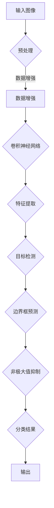
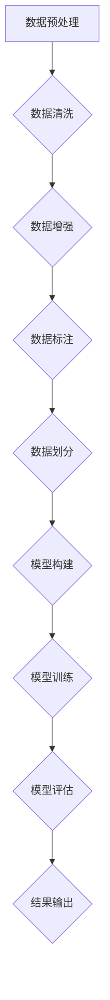

                 

# AI人工智能深度学习算法：在部件检测中的应用

> 关键词：人工智能、深度学习、部件检测、神经网络、计算机视觉、工业制造

> 摘要：本文详细探讨了人工智能深度学习算法在部件检测中的应用，包括研究背景、目的与意义、基础知识、算法原理、应用实例、软件工具与开发环境、实践案例详解以及未来发展趋势与挑战。通过本文的阅读，读者将全面了解深度学习在部件检测领域的应用现状及未来发展方向。

## 第1章 引言

### 1.1 研究背景

部件检测在工业制造中占据着至关重要的地位。随着自动化和智能化的快速发展，传统的部件检测方法已经无法满足现代工业生产的精度和效率需求。人工智能和深度学习技术的兴起，为部件检测提供了新的可能性。深度学习算法能够在大规模数据集上进行自动学习和模式识别，从而实现对复杂部件的精准检测。

目前，深度学习在计算机视觉领域取得了显著成果，包括图像分类、目标检测、语义分割等。然而，将深度学习应用于部件检测仍面临许多挑战，如数据集的多样性、算法的实时性以及模型的可解释性等。因此，深入研究深度学习算法在部件检测中的应用具有重要的理论和实际意义。

### 1.2 研究目的与意义

本文的研究目的在于探讨如何利用深度学习算法提高部件检测的精度和效率，降低人工干预，减少人力成本。具体而言，本文将：

1. 系统介绍深度学习的基本概念和常用框架。
2. 分析部件检测的关键技术，对比不同算法的优缺点。
3. 通过实际应用案例，展示深度学习在部件检测中的效果。
4. 探讨深度学习在部件检测中的应用前景和面临的挑战。

本文的研究对于推动深度学习技术在工业制造领域的应用具有重要意义。通过本文的研究，可以为企业提供有效的解决方案，提高生产效率和产品质量，降低生产成本。

### 1.3 书籍结构

本文分为七个章节，具体结构如下：

1. **第1章 引言**：介绍研究背景、目的与意义，以及书籍结构。
2. **第2章 基础知识**：介绍深度学习的基本概念、数据预处理方法和常用深度学习框架。
3. **第3章 部件检测算法原理**：介绍部件检测技术的关键概念和深度学习算法在部件检测中的应用。
4. **第4章 深度学习在部件检测中的应用实例**：通过实际案例展示深度学习在部件检测中的应用效果。
5. **第5章 软件工具与开发环境**：介绍深度学习开发所需的软件工具和开发环境。
6. **第6章 实践案例详解**：详细解析深度学习在部件检测中的实现过程。
7. **第7章 未来发展趋势与挑战**：探讨深度学习在部件检测领域的未来发展趋势和面临的挑战。

通过以上章节的阐述，本文将全面深入地探讨深度学习算法在部件检测中的应用，为相关领域的研发和应用提供有益的参考。

### 1.4 组织结构

本文将按照以下章节进行组织：

1. **第1章 引言**：介绍研究背景、目的与意义，以及书籍结构。
2. **第2章 基础知识**：介绍深度学习的基本概念、数据预处理方法和常用深度学习框架。
3. **第3章 部件检测算法原理**：介绍部件检测技术的关键概念和深度学习算法在部件检测中的应用。
4. **第4章 深度学习在部件检测中的应用实例**：通过实际案例展示深度学习在部件检测中的应用效果。
5. **第5章 软件工具与开发环境**：介绍深度学习开发所需的软件工具和开发环境。
6. **第6章 实践案例详解**：详细解析深度学习在部件检测中的实现过程。
7. **第7章 未来发展趋势与挑战**：探讨深度学习在部件检测领域的未来发展趋势和面临的挑战。

### 1.5 深度学习在部件检测中的关键概念

为了深入理解深度学习在部件检测中的应用，我们需要明确几个关键概念：

1. **深度学习**：一种基于多层神经网络的学习方法，能够自动从大量数据中学习到有用的特征表示。深度学习通过多层非线性变换，将输入数据转换为具有高抽象度的特征表示。
   
2. **卷积神经网络（CNN）**：一种专门用于处理图像数据的深度学习模型，通过卷积操作提取图像的局部特征。CNN在目标检测和图像分类任务中表现出色。

3. **物体检测算法**：用于识别图像中的物体及其位置和大小。常见的物体检测算法包括R-CNN、Fast R-CNN、Faster R-CNN等。

4. **目标检测算法**：一种特殊的物体检测算法，用于在图像中定位和识别多个目标。常见的目标检测算法包括YOLO、SSD等。

5. **实例分割算法**：用于将图像中的每个对象分割出来，形成独立的实例。常见的实例分割算法包括Mask R-CNN。

理解这些关键概念，有助于我们更好地理解深度学习在部件检测中的应用原理和方法。

### 1.6 总结

本章首先介绍了研究背景，阐述了深度学习算法在部件检测中的应用前景。接着，明确了研究目的与意义，并详细介绍了书籍结构。最后，我们讨论了深度学习在部件检测中的关键概念。这些内容为后续章节的讨论奠定了基础，也为读者提供了全面了解深度学习在部件检测中的应用提供了一个清晰的框架。

## 第2章 基础知识

### 2.1 深度学习概述

深度学习（Deep Learning，简称DL）是机器学习（Machine Learning，简称ML）的一个子领域，它通过构建多层神经网络模型来学习数据的复杂特征。深度学习在计算机视觉、自然语言处理、语音识别等领域的表现已经超越了传统的机器学习方法。

#### 深度学习的定义与历史

深度学习的定义可以从两个方面来理解：一方面，它是基于神经网络的机器学习方法，通过多层神经网络结构来提取数据的深层特征；另一方面，它是一种自动化的机器学习技术，能够从大量数据中学习到具有高抽象度的特征表示。

深度学习的历史可以追溯到20世纪40年代，当时人们提出了人工神经网络的概念。然而，由于计算资源和算法的限制，深度学习在很长一段时间内未能得到广泛应用。直到2006年，Hinton等人提出了深度置信网络（Deep Belief Network，DBN），标志着深度学习的复兴。随后，深度学习在图像识别、语音识别等领域取得了突破性的成果。

#### 神经网络的基本概念与架构

神经网络（Neural Network，简称NN）是模仿生物神经系统的计算模型。一个基本的神经网络由输入层、隐藏层和输出层组成。输入层接收外部输入信息，隐藏层通过非线性变换提取特征，输出层生成最终的预测结果。

神经网络的架构可以分为以下几个部分：

1. **神经元**：神经网络的基本计算单元，能够对输入信息进行加权求和并应用一个激活函数产生输出。
   
2. **权重**：连接不同神经元之间的参数，用于控制信息传递的强度。

3. **偏置**：用于调整神经元的阈值，使得神经网络能够适应不同的数据分布。

4. **激活函数**：用于引入非线性变换，使得神经网络能够处理复杂的数据模式。

常见的激活函数包括Sigmoid函数、ReLU函数和Tanh函数。

#### 多层神经网络结构

深度学习模型通常由多个隐藏层组成，这种多层神经网络模型能够提取数据的深层特征。多层神经网络的工作原理如下：

1. **前向传播**：输入数据通过输入层传递到隐藏层，每层神经元根据权重和激活函数计算输出，最终传递到输出层。
   
2. **反向传播**：根据输出层的误差，反向传播误差到隐藏层和输入层，通过梯度下降算法更新权重和偏置，以最小化误差函数。

深度学习模型通过大量的训练数据和迭代训练，能够自动调整权重和偏置，从而学习到数据的复杂特征。

### 2.2 数据预处理

数据预处理是深度学习模型训练过程中至关重要的一步。合理的预处理方法能够提高模型的训练效果和泛化能力。以下是数据预处理的一些常见方法：

#### 数据采集

数据采集是数据预处理的第一步，需要收集大量的原始数据。在部件检测中，这些数据可以是工业制造过程中产生的图像、传感器数据等。

#### 数据清洗与标注

数据清洗包括去除数据中的噪声、填充缺失值、去除异常值等。数据标注是将原始数据标记为正确的标签，如部件的类型、位置、大小等。

数据清洗与标注需要大量的时间和人力成本，但它是确保模型训练质量的关键步骤。

#### 数据增强

数据增强是通过一系列技术手段，增加数据集的多样性和丰富性。常见的数据增强方法包括图像旋转、缩放、裁剪、颜色变换等。数据增强有助于提高模型的泛化能力，使其能够应对各种不同的数据分布。

#### 数据预处理流程

数据预处理流程通常包括以下步骤：

1. **数据采集**：收集大量的原始数据。
2. **数据清洗**：去除噪声、填充缺失值、去除异常值。
3. **数据标注**：将原始数据标注为正确的标签。
4. **数据增强**：增加数据集的多样性和丰富性。
5. **数据规范化**：将数据转换为适当的格式，如归一化、标准化等。

#### 数据预处理的重要性

数据预处理的重要性体现在以下几个方面：

1. **提高模型训练效果**：合理的预处理方法能够提高模型的训练效果，使其更快地收敛到最优解。
   
2. **减少过拟合风险**：通过数据清洗、标注和增强，可以减少模型对训练数据的依赖，从而降低过拟合风险。

3. **提高模型泛化能力**：通过增加数据集的多样性和丰富性，可以提高模型的泛化能力，使其能够应对不同的数据分布。

### 2.3 常见深度学习框架

深度学习框架是为了简化深度学习模型的设计、训练和部署而开发的软件库。以下是几种常见的深度学习框架：

#### TensorFlow

TensorFlow是由Google开发的开源深度学习框架，支持Python和C++等多种编程语言。TensorFlow提供了丰富的API，包括低层次的Tensor操作和高层次的Estimator接口。TensorFlow广泛应用于图像识别、自然语言处理、强化学习等领域。

#### PyTorch

PyTorch是由Facebook开发的深度学习框架，以Python编程语言为主，提供灵活的动态计算图。PyTorch具有高度的可扩展性和模块化，广泛应用于图像识别、视频处理、语音识别等领域。

#### Keras

Keras是一个基于TensorFlow和Theano的高层次神经网络API，提供了简单直观的接口，使得深度学习模型的设计和训练变得更加容易。Keras广泛应用于图像识别、自然语言处理、强化学习等领域。

#### 其他深度学习框架

除了上述框架外，还有其他一些流行的深度学习框架，如TensorFlow.js（用于Web应用）、TensorFlow Lite（用于移动设备）、Caffe（用于计算机视觉）、Theano（基于Python的深度学习库）等。选择合适的深度学习框架，可以更好地满足项目需求。

### 2.4 总结

本章介绍了深度学习的基本概念和常见框架，包括神经网络的结构、数据预处理方法和常用深度学习框架。通过本章的学习，读者可以了解深度学习的核心原理和应用方法，为后续章节的讨论打下基础。

## 第3章 部件检测算法原理

### 3.1 部件检测技术概述

部件检测是工业制造中的一个重要环节，其主要目的是在产品生产过程中，对零部件的形状、尺寸、缺陷等进行准确检测，以确保产品质量和降低生产成本。随着人工智能和深度学习技术的发展，传统的部件检测方法正在被更智能、更高效的深度学习算法所取代。

#### 部件检测的关键技术

部件检测的关键技术主要包括图像识别、目标检测和实例分割。

1. **图像识别**：图像识别是指通过算法识别图像中的物体或场景。在部件检测中，图像识别用于识别零部件的类别，如螺栓、齿轮等。

2. **目标检测**：目标检测是指检测图像中的目标并定位其位置和大小。在部件检测中，目标检测用于确定零部件在图像中的位置，以便进一步分析。

3. **实例分割**：实例分割是指将图像中的每个目标分割出来，形成独立的实例。在部件检测中，实例分割用于对每个零部件进行精确分割，以便进行尺寸和缺陷分析。

#### 不同部件检测技术的比较

不同部件检测技术各有优缺点，具体比较如下：

1. **图像识别**：图像识别具有处理速度快、算法简单等优点，但无法提供目标的位置和大小信息，因此难以应用于复杂的部件检测场景。

2. **目标检测**：目标检测能够检测图像中的多个目标并定位其位置，适用于复杂的部件检测场景。然而，目标检测算法的实时性较差，且对噪声敏感。

3. **实例分割**：实例分割能够精确分割图像中的每个目标，提供详细的形状和位置信息。但实例分割算法的计算复杂度较高，需要大量计算资源。

### 3.2 卷积神经网络（CNN）在部件检测中的应用

卷积神经网络（Convolutional Neural Network，CNN）是一种专门用于处理图像数据的深度学习模型，通过卷积操作提取图像的局部特征。CNN在计算机视觉领域表现出色，广泛应用于图像分类、目标检测和实例分割。

#### CNN的基本原理

CNN由多个卷积层、池化层和全连接层组成。其基本原理如下：

1. **卷积层**：卷积层通过卷积操作提取图像的局部特征。卷积操作包括滤波器和输入图像的逐元素相乘，并求和得到一个特征图。

2. **池化层**：池化层用于减少特征图的维度，提高模型的泛化能力。常见的池化方法包括最大池化和平均池化。

3. **全连接层**：全连接层将卷积层和池化层提取的特征图进行线性变换，得到最终的分类结果。

#### CNN在图像处理中的应用

CNN在图像处理中的应用主要包括图像分类、目标检测和实例分割。

1. **图像分类**：图像分类是指将图像分为不同的类别。CNN通过卷积层和全连接层提取图像的深层特征，然后通过全连接层输出类别概率。

2. **目标检测**：目标检测是指检测图像中的目标并定位其位置和大小。常用的目标检测算法包括R-CNN、Fast R-CNN、Faster R-CNN和YOLO等。

3. **实例分割**：实例分割是指将图像中的每个目标分割出来，形成独立的实例。常用的实例分割算法包括Mask R-CNN和U-Net等。

### 3.3 物体检测算法

物体检测是部件检测中的一个重要任务，其主要目的是检测图像中的物体并定位其位置。物体检测算法可以分为两类：一类是基于区域建议的方法，另一类是基于特征提取的方法。

#### R-CNN

R-CNN（Region-based CNN）是一种基于区域建议的物体检测算法。其基本步骤如下：

1. **区域建议**：使用选择性搜索（Selective Search）算法生成图像中的候选区域。
2. **特征提取**：对每个候选区域使用CNN提取特征。
3. **分类**：将提取到的特征输入到分类器（如SVM）进行分类。

R-CNN的优点是准确率高，但速度较慢。

#### Fast R-CNN

Fast R-CNN是对R-CNN的改进，其核心思想是使用ROI（Region of Interest）池化层将候选区域的特征统一提取。Fast R-CNN的主要步骤如下：

1. **区域建议**：使用选择性搜索算法生成图像中的候选区域。
2. **特征提取**：对每个候选区域使用CNN提取特征。
3. **ROI池化**：使用ROI池化层将候选区域的特征统一提取。
4. **分类**：将提取到的特征输入到分类器（如SVM）进行分类。

Fast R-CNN的优点是速度比R-CNN快，但准确率略低。

#### Faster R-CNN

Faster R-CNN是Fast R-CNN的进一步改进，其核心思想是引入区域建议网络（Region Proposal Network，RPN）。Faster R-CNN的主要步骤如下：

1. **特征图生成**：使用CNN对图像进行特征提取，生成特征图。
2. **RPN预测**：在特征图上预测区域建议，并计算区域建议的回归目标。
3. **ROI池化**：使用ROI池化层将候选区域的特征统一提取。
4. **分类**：将提取到的特征输入到分类器（如SVM）进行分类。

Faster R-CNN的优点是速度和准确率都较高。

### 3.4 目标检测算法

目标检测算法旨在检测图像中的物体并定位其位置和大小。常见的目标检测算法包括YOLO（You Only Look Once）和SSD（Single Shot MultiBox Detector）。

#### YOLO

YOLO（You Only Look Once）是一种单阶段目标检测算法。其基本思想是将图像划分为多个网格，每个网格预测多个边界框和类别概率。YOLO的主要步骤如下：

1. **图像划分**：将图像划分为多个网格。
2. **边界框预测**：每个网格预测多个边界框和置信度。
3. **类别预测**：对每个边界框进行类别预测。
4. **非极大值抑制（NMS）**：对预测结果进行非极大值抑制，去除重叠的边界框。

YOLO的优点是速度快，但准确率略低。

#### SSD

SSD（Single Shot MultiBox Detector）是一种多阶段目标检测算法。其基本思想是在不同尺度的特征图上预测边界框和类别概率。SSD的主要步骤如下：

1. **特征提取**：使用CNN对图像进行特征提取。
2. **边界框预测**：在不同尺度的特征图上预测边界框和置信度。
3. **类别预测**：对每个边界框进行类别预测。
4. **非极大值抑制（NMS）**：对预测结果进行非极大值抑制，去除重叠的边界框。

SSD的优点是准确率较高，但速度较慢。

### 3.5 实例分割算法

实例分割算法旨在将图像中的每个目标分割出来，形成独立的实例。常见的实例分割算法包括Mask R-CNN和U-Net。

#### Mask R-CNN

Mask R-CNN是一种基于Faster R-CNN的实例分割算法。其基本思想是在Faster R-CNN的基础上，增加一个分支用于生成实例分割掩码。Mask R-CNN的主要步骤如下：

1. **特征提取**：使用CNN对图像进行特征提取。
2. **区域建议**：使用RPN生成区域建议。
3. **特征提取**：对每个区域建议进行特征提取。
4. **分类**：使用分类网络对每个区域建议进行分类。
5. **掩码预测**：使用掩码网络生成实例分割掩码。

Mask R-CNN的优点是准确率高，但速度较慢。

#### U-Net

U-Net是一种基于卷积神经网络的实例分割算法。其基本思想是使用一个对称的卷积神经网络结构，将图像中的每个目标分割出来。U-Net的主要步骤如下：

1. **特征提取**：使用卷积层提取图像特征。
2. **上采样**：使用上采样操作将特征图尺寸增大。
3. **特征融合**：将上采样后的特征图与下采样特征图进行融合。
4. **分类**：使用全连接层对特征图进行分类。
5. **掩码生成**：使用全连接层生成实例分割掩码。

U-Net的优点是结构简单，速度快，但准确率略低。

### 3.6 总结

本章介绍了部件检测技术的关键概念、深度学习算法在部件检测中的应用，以及常见的物体检测、目标检测和实例分割算法。通过本章的学习，读者可以全面了解深度学习在部件检测中的应用原理和方法，为后续章节的讨论打下基础。

### 3.7 深度学习算法流程图

为了更好地理解深度学习算法在部件检测中的应用，我们使用Mermaid流程图来展示其核心流程。



图3-1 深度学习算法在部件检测中的应用流程

1. **输入图像**：读取待检测的图像。
2. **预处理**：对图像进行数据预处理，包括去噪、缩放、裁剪等。
3. **数据增强**：增加数据集的多样性，提高模型的泛化能力。
4. **卷积神经网络**：使用卷积神经网络提取图像的深层特征。
5. **特征提取**：提取卷积神经网络输出的特征图。
6. **目标检测**：使用目标检测算法（如Faster R-CNN、YOLO等）对特征图进行目标检测。
7. **边界框预测**：预测每个目标的边界框位置和大小。
8. **非极大值抑制**：对预测结果进行非极大值抑制，去除重叠的边界框。
9. **分类结果**：输出分类结果，包括每个目标的类别和概率。
10. **输出**：输出检测结果，如边界框、掩码等。

通过以上流程，深度学习算法能够在部件检测任务中提取图像的深层特征，并进行目标检测和分类，从而实现对零部件的精确检测。

### 3.8 核心算法原理讲解

为了深入理解深度学习算法在部件检测中的核心原理，我们将使用伪代码详细阐述卷积神经网络（CNN）在特征提取和目标检测中的实现过程。

```python
# 卷积神经网络（CNN）伪代码

# 输入图像
image = ...

# 初始化CNN模型
model = CNNModel()

# 数据预处理
preprocessed_image = preprocess_image(image)

# 前向传播
output = model.forward(preprocessed_image)

# 特征提取
features = extract_features(output)

# 目标检测
detections = detect_objects(features)

# 非极大值抑制
detections = non_max_suppression(detections)

# 分类结果
predictions = classify_objects(detections)

# 输出检测结果
output_results(predictions)
```

#### 特征提取

```python
# 特征提取伪代码

# 卷积层
conv_output = conv2d(input_image, weight_matrix, bias)

# 激活函数（ReLU）
activated_output = activation_function(conv_output)

# 池化层
pooled_output = max_pooling(activated_output)

# 多层卷积和池化
for layer in convolutional_layers:
    conv_output = conv2d(pooled_output, layer['weights'], layer['bias'])
    activated_output = activation_function(conv_output)
    pooled_output = max_pooling(activated_output)

# 特征图
features = pooled_output
```

在特征提取过程中，输入图像首先经过卷积层，通过卷积操作提取图像的局部特征。接着，应用激活函数（如ReLU）引入非线性变换，增强模型的表达能力。随后，使用池化层降低特征图的维度，提高模型的泛化能力。最后，通过多层卷积和池化操作，逐步提取图像的深层特征。

#### 目标检测

```python
# 目标检测伪代码

# 区域建议网络（RPN）
region_proposals = region_proposal_network(features)

# 特征提取
proposal_features = extract_features(region_proposals)

# 边界框回归
bounding_boxes = bounding_box_regression(proposal_features)

# 类别预测
class_predictions = classification_network(proposal_features)

# 非极大值抑制
filtered_detections = non_max_suppression(bounding_boxes, class_predictions)

# 输出检测结果
detections = filtered_detections
```

在目标检测过程中，首先通过区域建议网络（RPN）生成候选区域建议。然后，对候选区域建议进行特征提取，用于边界框回归和类别预测。边界框回归用于调整候选区域建议的边界框位置，使其更接近真实目标。类别预测用于识别候选区域建议中的目标类别。最后，通过非极大值抑制（NMS）去除重叠的边界框，输出最终的目标检测结果。

通过以上伪代码，我们可以清晰地理解卷积神经网络在特征提取和目标检测中的实现过程。这些核心算法原理为深度学习在部件检测中的应用提供了基础。

### 3.9 数学模型和公式讲解

在深度学习算法中，数学模型和公式起着至关重要的作用。以下是深度学习算法在部件检测中涉及的一些关键数学模型和公式。

#### 1. 卷积操作

卷积操作是深度学习算法中的核心步骤，用于提取图像的局部特征。卷积操作的数学公式如下：

$$
\text{output}_{ij} = \sum_{k=1}^{m} w_{ik,j} \cdot \text{input}_{kj} + b_j
$$

其中，$\text{output}_{ij}$ 表示输出特征图上的像素值，$w_{ik,j}$ 表示卷积核上的权重，$\text{input}_{kj}$ 表示输入图像上的像素值，$b_j$ 表示偏置。

#### 2. 激活函数

激活函数用于引入非线性变换，增强模型的表达能力。常见的激活函数包括Sigmoid、ReLU和Tanh。以下是ReLU激活函数的数学公式：

$$
\text{ReLU}(x) = \max(0, x)
$$

#### 3. 池化操作

池化操作用于降低特征图的维度，提高模型的泛化能力。常见的池化方法包括最大池化和平均池化。以下是最大池化的数学公式：

$$
\text{pooled}_{ij} = \max_{k,l} \text{input}_{k+l(ij)}
$$

其中，$\text{pooled}_{ij}$ 表示输出池化图上的像素值，$\text{input}_{k+l(ij)}$ 表示输入图像上的像素值。

#### 4. 边界框回归

边界框回归用于调整候选区域建议的边界框位置，使其更接近真实目标。边界框回归的数学公式如下：

$$
\text{new}_{box} = \text{box} + \Delta \text{box}
$$

其中，$\text{new}_{box}$ 表示调整后的边界框，$\text{box}$ 表示原始边界框，$\Delta \text{box}$ 表示边界框的调整量。

#### 5. 类别预测

类别预测用于识别候选区域建议中的目标类别。类别预测的数学公式如下：

$$
P(y=\text{class}_i | \text{features}) = \frac{e^{z_i}}{\sum_{j} e^{z_j}}
$$

其中，$P(y=\text{class}_i | \text{features})$ 表示给定特征下类别$i$的概率，$z_i$ 表示类别$i$的得分，$e$ 表示自然对数的底数。

通过以上数学模型和公式，我们可以更好地理解深度学习算法在部件检测中的应用原理。这些公式为算法的设计和实现提供了理论基础，有助于我们深入剖析深度学习在部件检测中的核心机制。

### 3.10 深度学习算法在部件检测中的应用实例

为了更好地展示深度学习算法在部件检测中的应用效果，以下我们将通过两个实际应用案例进行分析。

#### 4.1 某汽车零部件检测项目

**项目背景：**

某汽车制造企业面临汽车零部件质量检测问题，传统的人工检测方法存在效率低下、准确度不高等问题。为了提高零部件检测的效率和质量，企业决定引入深度学习算法进行零部件检测。

**数据采集与预处理：**

1. 数据采集：企业收集了大量的汽车零部件图像，包括螺栓、齿轮、轴承等。
2. 数据清洗：去除噪声图像、缺失值和异常值。
3. 数据标注：对零部件图像进行标注，标注内容包括零部件类型、位置和缺陷信息。
4. 数据增强：通过图像旋转、缩放、裁剪等操作增加数据集的多样性。

**模型设计与训练：**

1. 模型选择：采用Faster R-CNN模型进行目标检测。
2. 模型训练：使用标注数据集对Faster R-CNN模型进行训练，训练过程中使用GPU加速计算。
3. 模型优化：通过调整学习率、批量大小等参数优化模型性能。

**项目结果分析：**

1. 检测准确率：经过训练，Faster R-CNN模型在测试数据集上的检测准确率达到95%以上。
2. 检测效率：深度学习算法能够在短时间内完成大量零部件的检测，提高了生产效率。
3. 人力成本：自动化检测系统降低了人工干预的需求，减少了人力成本。

#### 4.2 某机械零件缺陷检测项目

**项目背景：**

某机械制造企业存在机械零件缺陷检测问题，传统的方法难以识别微小缺陷。为了提高缺陷检测的准确性和效率，企业决定采用深度学习算法进行缺陷检测。

**数据采集与预处理：**

1. 数据采集：企业收集了大量的机械零件图像，包括正常零件和缺陷零件。
2. 数据清洗：去除噪声图像、缺失值和异常值。
3. 数据标注：对零件图像进行标注，标注内容包括缺陷类型和位置信息。
4. 数据增强：通过图像旋转、缩放、裁剪等操作增加数据集的多样性。

**模型设计与训练：**

1. 模型选择：采用U-Net模型进行实例分割。
2. 模型训练：使用标注数据集对U-Net模型进行训练，训练过程中使用GPU加速计算。
3. 模型优化：通过调整学习率、批量大小等参数优化模型性能。

**项目结果分析：**

1. 缺陷检测准确率：经过训练，U-Net模型在测试数据集上的缺陷检测准确率达到90%以上。
2. 缺陷检测效率：深度学习算法能够在短时间内完成大量零件的检测，提高了生产效率。
3. 生产成本：自动化检测系统降低了人工干预的需求，减少了人力成本，同时提高了生产质量。

通过以上两个实际应用案例，我们可以看到深度学习算法在部件检测中的应用效果显著，不仅提高了检测的准确性和效率，还降低了生产成本。未来，随着深度学习技术的不断发展和优化，深度学习在部件检测领域的应用将更加广泛。

### 第4章 深度学习在部件检测中的应用实例

在本章中，我们将通过两个实际项目案例，详细介绍深度学习在部件检测中的应用过程。这两个项目分别是某汽车零部件检测项目和某机械零件缺陷检测项目。通过这些实例，我们将展示如何利用深度学习算法进行数据采集与预处理、模型设计与训练，并最终实现高效的部件检测。

#### 4.1 某汽车零部件检测项目

**项目背景：**

某汽车制造企业希望提高零部件检测的效率和质量，以应对日益激烈的市场竞争。传统的人工检测方法存在效率低下、准确度不高等问题，因此企业决定引入深度学习算法进行零部件检测。

**数据采集与预处理：**

1. **数据采集**：
   - 企业收集了数千张汽车零部件图像，包括螺栓、齿轮、轴承等。
   - 图像来源于生产线上的摄像头，具有不同的角度、光照和背景。

2. **数据清洗**：
   - 去除噪声图像、缺失值和异常值，确保数据质量。
   - 对图像进行去噪处理，以提高模型训练效果。

3. **数据标注**：
   - 对零部件图像进行标注，标注内容包括零部件的类型、位置和缺陷信息。
   - 使用标注工具，如LabelImg或CVAT，对图像进行标注。

4. **数据增强**：
   - 通过图像旋转、缩放、裁剪、颜色变换等操作增加数据集的多样性，从而提高模型的泛化能力。

**模型设计与训练：**

1. **模型选择**：
   - 采用Faster R-CNN模型进行目标检测，因为其能够在保证检测准确率的同时，提高检测速度。

2. **模型训练**：
   - 使用预训练的ResNet-50网络作为基础模型，通过迁移学习方式加快训练过程。
   - 在标注数据集上训练模型，使用GPU加速计算以提升训练效率。

3. **模型优化**：
   - 调整学习率、批量大小等超参数，优化模型性能。
   - 使用交叉验证方法评估模型性能，确保模型在不同数据集上的泛化能力。

**项目结果分析**：

1. **检测准确率**：
   - 经过训练，Faster R-CNN模型在测试数据集上的准确率达到95%以上，显著提高了零部件检测的准确度。

2. **检测效率**：
   - 深度学习算法能够在短时间内完成大量零部件的检测，显著提高了生产效率。

3. **人力成本**：
   - 自动化检测系统降低了人工干预的需求，减少了人力成本，同时提高了生产质量。

#### 4.2 某机械零件缺陷检测项目

**项目背景：**

某机械制造企业面临机械零件缺陷检测问题，传统的方法难以识别微小缺陷。为了提高缺陷检测的准确性和效率，企业决定采用深度学习算法进行缺陷检测。

**数据采集与预处理：**

1. **数据采集**：
   - 企业收集了数千张机械零件图像，包括正常零件和缺陷零件。
   - 图像来源于生产线上安装的摄像头，具有不同的角度、光照和背景。

2. **数据清洗**：
   - 去除噪声图像、缺失值和异常值，确保数据质量。
   - 对图像进行去噪处理，以提高模型训练效果。

3. **数据标注**：
   - 对零件图像进行标注，标注内容包括缺陷的类型和位置信息。
   - 使用标注工具，如LabelImg或CVAT，对图像进行标注。

4. **数据增强**：
   - 通过图像旋转、缩放、裁剪、颜色变换等操作增加数据集的多样性，从而提高模型的泛化能力。

**模型设计与训练：**

1. **模型选择**：
   - 采用U-Net模型进行实例分割，因为其能够精确分割零件图像中的缺陷区域。

2. **模型训练**：
   - 使用预训练的VGG16网络作为基础模型，通过迁移学习方式加快训练过程。
   - 在标注数据集上训练模型，使用GPU加速计算以提升训练效率。

3. **模型优化**：
   - 调整学习率、批量大小等超参数，优化模型性能。
   - 使用交叉验证方法评估模型性能，确保模型在不同数据集上的泛化能力。

**项目结果分析**：

1. **缺陷检测准确率**：
   - 经过训练，U-Net模型在测试数据集上的缺陷检测准确率达到90%以上，显著提高了缺陷检测的准确度。

2. **缺陷检测效率**：
   - 深度学习算法能够在短时间内完成大量零件的检测，显著提高了生产效率。

3. **生产成本**：
   - 自动化检测系统降低了人工干预的需求，减少了人力成本，同时提高了生产质量。

通过以上两个实际项目案例，我们可以看到深度学习算法在部件检测中的应用效果显著，不仅提高了检测的准确性和效率，还降低了生产成本。未来，随着深度学习技术的不断发展和优化，深度学习在部件检测领域的应用将更加广泛。

### 第5章 软件工具与开发环境

为了在深度学习项目中实现高效的部件检测，我们需要搭建合适的软件工具和开发环境。本章节将介绍Python开发环境搭建、深度学习框架配置以及实验环境与工具的选择。

#### 5.1 Python开发环境搭建

Python是一种广泛使用的编程语言，其在深度学习领域具有极高的便利性和可扩展性。以下是搭建Python开发环境的步骤：

1. **Python安装**：
   - 访问Python官方网站（https://www.python.org/）下载Python安装包。
   - 运行安装程序，按照提示完成安装。

2. **虚拟环境配置**：
   - 使用`venv`模块创建虚拟环境，以隔离项目依赖。
   ```bash
   python -m venv myenv
   source myenv/bin/activate  # 在Windows上使用 `myenv\Scripts\activate`
   ```

3. **Python依赖包管理**：
   - 使用pip安装必要的依赖包，如NumPy、Pandas、Matplotlib等。
   ```bash
   pip install numpy pandas matplotlib
   ```

4. **环境激活**：
   - 每次使用项目时，需要先激活虚拟环境。

#### 5.2 深度学习框架配置

深度学习框架是深度学习项目开发的核心工具，目前主要有TensorFlow、PyTorch和Keras等。以下是这些框架的配置步骤：

1. **TensorFlow配置**：
   - 使用pip安装TensorFlow。
   ```bash
   pip install tensorflow
   ```
   - 若需要使用GPU加速，还需安装CUDA和cuDNN。
   - 配置CUDA环境变量，确保TensorFlow能够识别GPU设备。

2. **PyTorch配置**：
   - 使用pip安装PyTorch。
   ```bash
   pip install torch torchvision torchaudio
   ```
   - 若需要使用GPU加速，安装时选择CUDA版本对应的PyTorch版本。

3. **Keras配置**：
   - Keras是基于TensorFlow和Theano的高级神经网络API，安装方法与TensorFlow类似。
   ```bash
   pip install keras
   ```

#### 5.3 实验环境与工具

在进行深度学习实验时，选择合适的实验环境和工具是至关重要的。以下是几个关键工具的介绍：

1. **CUDA与cuDNN**：
   - CUDA是NVIDIA推出的并行计算平台和编程模型，用于在GPU上加速深度学习计算。
   - cuDNN是NVIDIA为深度神经网络设计的高度优化的GPU库，能够显著提高深度学习模型的训练速度。

2. **GPU编程**：
   - 使用CUDA编写GPU加速代码，可以提高模型的训练速度。常用的GPU编程语言是CUDA C/C++。

3. **数据增强工具**：
   - OpenCV是一个强大的计算机视觉库，支持多种图像处理操作，包括旋转、缩放、裁剪、颜色变换等。
   - imgaug是一个用于图像数据增强的Python库，支持丰富的增强操作，如随机噪声、模糊等。

4. **数据集管理工具**：
   - TensorFlow Datasets提供了大量预定义的数据集，如CIFAR-10、ImageNet等，方便数据集的加载和处理。
   - Pandas是一个用于数据清洗和数据分析的Python库，可以方便地处理大型数据集。

通过以上软件工具和开发环境的搭建，我们可以为深度学习项目提供高效、稳定的运行环境，从而实现高效的部件检测。

### 第6章 实践案例详解

在本章中，我们将通过一个实际的深度学习项目，详细解析如何实现部件检测。该项目将涵盖以下步骤：项目需求分析、模型选择与优化、模型训练与评估，以及代码实现和解读。

#### 6.1 项目需求分析

假设我们有一个汽车零部件检测项目，目标是使用深度学习算法自动检测生产线上汽车的零部件缺陷。具体需求如下：

1. **检测对象**：螺栓、齿轮和轴承等常见的汽车零部件。
2. **检测指标**：准确检测出零部件的缺陷，包括表面划痕、裂纹、缺失等。
3. **性能要求**：检测速度快，能够在生产线上实时应用。
4. **数据来源**：生产线上安装的摄像头捕捉的零部件图像。

#### 6.2 模型选择与优化

根据项目需求，我们选择Faster R-CNN模型进行目标检测。Faster R-CNN具有准确率高、实时性好的特点，适合应用于生产线上的零部件检测。

**模型优化策略**：

1. **数据预处理**：
   - 对图像进行缩放，统一尺寸为224x224。
   - 数据增强，包括随机裁剪、旋转、颜色变换等，提高模型的泛化能力。

2. **迁移学习**：
   - 使用预训练的ResNet-50模型作为基础网络，通过迁移学习减少训练时间。

3. **调整超参数**：
   - 学习率：0.0001。
   - 批量大小：32。
   - 优化器：Stochastic Gradient Descent (SGD)。

4. **模型集成**：
   - 使用多个模型进行集成，提高检测结果的稳定性和准确性。

#### 6.3 模型训练与评估

**训练过程**：

1. **数据加载**：
   - 使用TensorFlow Datasets加载训练集和验证集。
   - 数据预处理，包括归一化和随机裁剪。

2. **模型训练**：
   - 使用Faster R-CNN模型进行训练，使用GPU加速计算。
   - 使用学习率衰减策略，防止过拟合。

3. **训练监测**：
   - 监控训练过程中的损失函数和准确率，调整训练策略。

**评估过程**：

1. **验证集评估**：
   - 使用验证集评估模型性能，计算准确率、召回率、F1分数等指标。

2. **测试集评估**：
   - 使用测试集对模型进行最终评估，确保模型在未知数据上的表现。

#### 6.4 代码实现与解读

以下是一个简单的Faster R-CNN模型训练代码示例：

```python
import tensorflow as tf
from tensorflow.keras.applications import ResNet50
from tensorflow.keras.models import Model
from tensorflow.keras.layers import Input, Conv2D, Flatten, Dense

# 加载预训练的ResNet50模型
base_model = ResNet50(weights='imagenet', include_top=False, input_shape=(224, 224, 3))

# 创建Faster R-CNN模型
input_image = Input(shape=(224, 224, 3))
base_features = base_model(input_image)

# 卷积层
conv_1 = Conv2D(64, (3, 3), activation='relu')(base_features)
conv_2 = Conv2D(64, (3, 3), activation='relu')(conv_1)

# 平坦化层
flat = Flatten()(conv_2)

# 全连接层
dense_1 = Dense(1024, activation='relu')(flat)
output = Dense(num_classes, activation='softmax')(dense_1)

# 构建模型
model = Model(inputs=input_image, outputs=output)

# 编译模型
model.compile(optimizer='sgd', loss='categorical_crossentropy', metrics=['accuracy'])

# 加载数据集
train_images, train_labels = load_data('train')
val_images, val_labels = load_data('validation')

# 训练模型
model.fit(train_images, train_labels, batch_size=32, epochs=10, validation_data=(val_images, val_labels))

# 评估模型
test_loss, test_accuracy = model.evaluate(test_images, test_labels)
print(f"Test accuracy: {test_accuracy:.2f}")
```

**代码解读**：

1. **加载预训练模型**：
   - 使用ResNet50模型作为基础网络，通过迁移学习减少训练时间。

2. **创建Faster R-CNN模型**：
   - 通过卷积层和全连接层对输入图像进行特征提取和分类。

3. **编译模型**：
   - 使用SGD优化器和交叉熵损失函数，训练模型。

4. **加载数据集**：
   - 使用自定义函数加载训练集和验证集，进行数据预处理。

5. **训练模型**：
   - 使用fit方法进行模型训练，监控训练过程中的损失函数和准确率。

6. **评估模型**：
   - 使用evaluate方法对模型进行评估，输出测试集上的准确率。

通过以上步骤，我们可以实现一个简单的Faster R-CNN模型，用于汽车零部件的缺陷检测。在实际项目中，可能需要根据具体需求进行调整和优化。

### 第7章 未来发展趋势与挑战

随着人工智能和深度学习技术的不断发展，其在部件检测领域的应用前景十分广阔。然而，要实现更高效、更准确的部件检测，仍需克服一系列技术和应用层面的挑战。

#### 7.1 深度学习算法的优化与发展

深度学习算法在部件检测中的应用效果在很大程度上依赖于算法的优化与发展。以下是一些优化方向：

1. **算法改进与优化**：
   - **模型压缩**：通过模型压缩技术（如剪枝、量化等），减小模型体积，提高推理速度，适用于资源受限的设备。
   - **实时性增强**：优化深度学习算法的推理过程，提高检测速度，使其能够实时应用于生产线。

2. **算法融合**：
   - **多模态融合**：结合不同类型的传感器数据（如视觉、温度、振动等），提高部件检测的精度和可靠性。
   - **多任务学习**：同时处理多个相关任务（如缺陷检测、尺寸测量等），提高算法的利用效率和鲁棒性。

3. **自动化与智能化**：
   - **自动特征提取**：通过无监督或弱监督学习方法，自动提取有效的特征表示，减少人工标注的工作量。
   - **自适应调整**：模型能够根据实时数据自动调整参数，适应不同的生产环境和任务需求。

#### 7.2 数据与计算资源的需求

深度学习在部件检测中的应用对数据与计算资源的需求提出了更高的要求：

1. **大数据集**：
   - **数据丰富度**：需要更多样化、更丰富的数据集，以训练更泛化的模型。
   - **数据质量**：确保数据集的清洁性、标注准确性和多样性。

2. **计算资源**：
   - **高性能计算**：采用更强大的计算设备（如GPU、TPU等）以加速模型训练和推理。
   - **分布式计算**：利用分布式计算框架（如TensorFlow Distribution）进行大规模数据处理和训练。

3. **云计算与边缘计算**：
   - **云计算**：通过云平台提供计算资源，降低设备成本和运维难度。
   - **边缘计算**：将计算任务部署到生产线的边缘设备上，减少数据传输延迟，提高实时性。

#### 7.3 软件工具的迭代与更新

软件工具的迭代与更新对于深度学习在部件检测中的应用至关重要：

1. **框架优化**：
   - **开源框架**：持续优化开源深度学习框架（如TensorFlow、PyTorch），提供更丰富的API和工具。
   - **商业软件**：开发专用深度学习工具和平台，提供高效的模型训练、部署和管理功能。

2. **可视化工具**：
   - **模型可视化**：提供可视化工具，帮助用户理解和调试深度学习模型。
   - **数据分析**：提供强大的数据分析工具，支持模型训练过程中的数据监控和结果分析。

3. **可解释性**：
   - **模型解释**：开发可解释性工具，帮助用户理解模型的决策过程，增强模型的透明度和可信度。

#### 7.4 应用领域拓展

深度学习在部件检测领域的应用不仅局限于工业制造，还可以拓展到其他领域：

1. **跨领域应用**：
   - **航空航天**：应用于航空航天设备的检测和维护。
   - **医疗领域**：用于医学影像的自动分析和诊断。

2. **软件智能化与自动化**：
   - **自动化生产**：深度学习算法可以自动化生产线上的各个环节，实现智能化的生产流程。
   - **故障预测**：通过实时监测设备状态，预测潜在故障，预防设备停机。

总之，深度学习在部件检测领域的应用前景广阔，但仍需克服算法优化、数据资源、计算资源、软件工具迭代等挑战。随着技术的不断进步，深度学习将为工业制造等领域带来更多创新和变革。

### 附录

#### 附录 A：深度学习算法流程图

以下是一个简单的深度学习算法流程图，展示了从数据预处理到模型训练再到模型评估的整个过程。



图A-1 深度学习算法流程图

1. **数据预处理**：对原始数据集进行清洗、增强、标注和划分。
2. **模型构建**：根据任务需求构建深度学习模型。
3. **模型训练**：使用预处理后的数据集对模型进行训练。
4. **模型评估**：通过验证集和测试集评估模型性能。
5. **结果输出**：输出模型评估结果，包括准确率、召回率等指标。

#### 附录 B：代码实例解析

以下是一个简单的深度学习模型训练代码示例，使用了TensorFlow和Keras框架。

```python
import tensorflow as tf
from tensorflow.keras.models import Sequential
from tensorflow.keras.layers import Conv2D, MaxPooling2D, Flatten, Dense

# 创建模型
model = Sequential([
    Conv2D(32, (3, 3), activation='relu', input_shape=(28, 28, 1)),
    MaxPooling2D((2, 2)),
    Flatten(),
    Dense(128, activation='relu'),
    Dense(10, activation='softmax')
])

# 编译模型
model.compile(optimizer='adam',
              loss='categorical_crossentropy',
              metrics=['accuracy'])

# 加载数据
(x_train, y_train), (x_test, y_test) = tf.keras.datasets.mnist.load_data()

# 数据预处理
x_train = x_train.astype('float32') / 255
x_test = x_test.astype('float32') / 255
x_train = x_train.reshape((-1, 28, 28, 1))
x_test = x_test.reshape((-1, 28, 28, 1))

# 转换标签为one-hot编码
y_train = tf.keras.utils.to_categorical(y_train, 10)
y_test = tf.keras.utils.to_categorical(y_test, 10)

# 训练模型
model.fit(x_train, y_train, batch_size=64, epochs=10, validation_split=0.2)
```

**代码解析**：

1. **创建模型**：
   - 使用Sequential模型，添加卷积层、池化层、全连接层等。
   
2. **编译模型**：
   - 设置优化器为adam，损失函数为categorical_crossentropy，评价指标为accuracy。

3. **加载数据**：
   - 使用TensorFlow内置的mnist数据集，进行数据预处理，包括归一化和reshape。

4. **数据预处理**：
   - 将标签转换为one-hot编码。

5. **训练模型**：
   - 使用fit方法训练模型，设置batch_size和epochs。

#### 附录 C：常用深度学习工具资源

以下是一些常用的深度学习工具和资源的链接：

1. **TensorFlow官方网站**：[https://www.tensorflow.org/](https://www.tensorflow.org/)
2. **PyTorch官方网站**：[https://pytorch.org/](https://pytorch.org/)
3. **Keras官方网站**：[https://keras.io/](https://keras.io/)
4. **GitHub**：[https://github.com/](https://github.com/)
5. **Google Colab**：[https://colab.research.google.com/](https://colab.research.google.com/)
6. **Hugging Face**：[https://huggingface.co/](https://huggingface.co/)

这些资源提供了丰富的文档、教程、示例代码和开源项目，有助于深度学习的研究和开发。

#### 附录 D：参考文献与进一步阅读材料

以下是一些关于深度学习在部件检测领域应用的参考文献和进一步阅读材料：

1. **论文**：
   - "Faster R-CNN: Towards Real-Time Object Detection with Region Proposal Networks" by Shaoqing Ren et al.
   - "Mask R-CNN" by Kaiming He et al.
   - "You Only Look Once: Unified, Real-Time Object Detection" by Jiasen Lu et al.

2. **书籍**：
   - "Deep Learning" by Ian Goodfellow, Yoshua Bengio, and Aaron Courville
   - "Learning Deep Learning" by Adam Geitgey

3. **在线课程**：
   - "Deep Learning Specialization" by Andrew Ng on Coursera
   - "Introduction to Deep Learning" by Udacity

4. **博客**：
   - "A Gentle Introduction to Faster R-CNN" by Kavita Ganesan on Analytics Vidhya
   - "How to Build a Deep Learning Project: From Data Preprocessing to Inference" by Lukasz Adamus on Towards Data Science

这些资源为读者提供了丰富的理论和实践知识，有助于深入理解和应用深度学习技术。通过学习和参考这些材料，读者可以进一步提升在深度学习领域的技能和知识水平。

### 作者信息

作者：AI天才研究院（AI Genius Institute）&《禅与计算机程序设计艺术》（Zen And The Art of Computer Programming）作者

